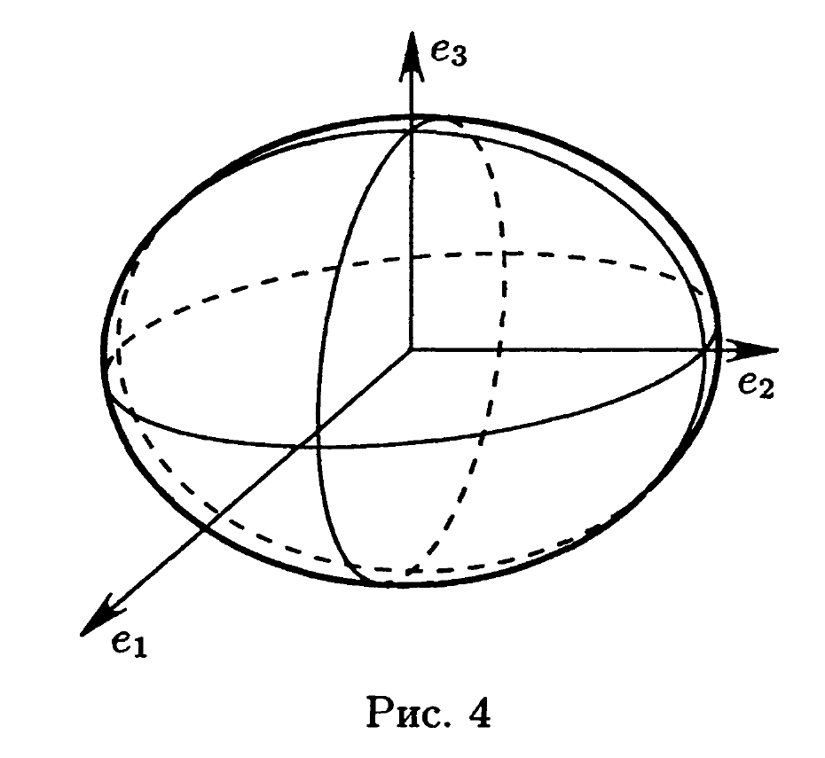
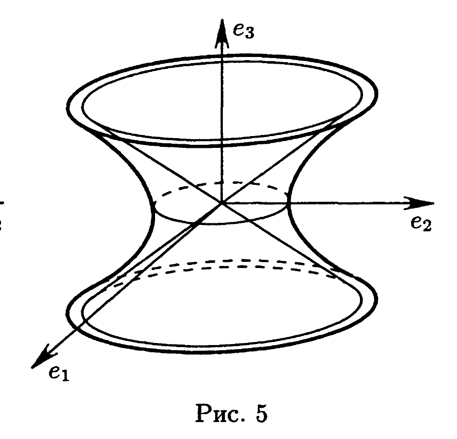
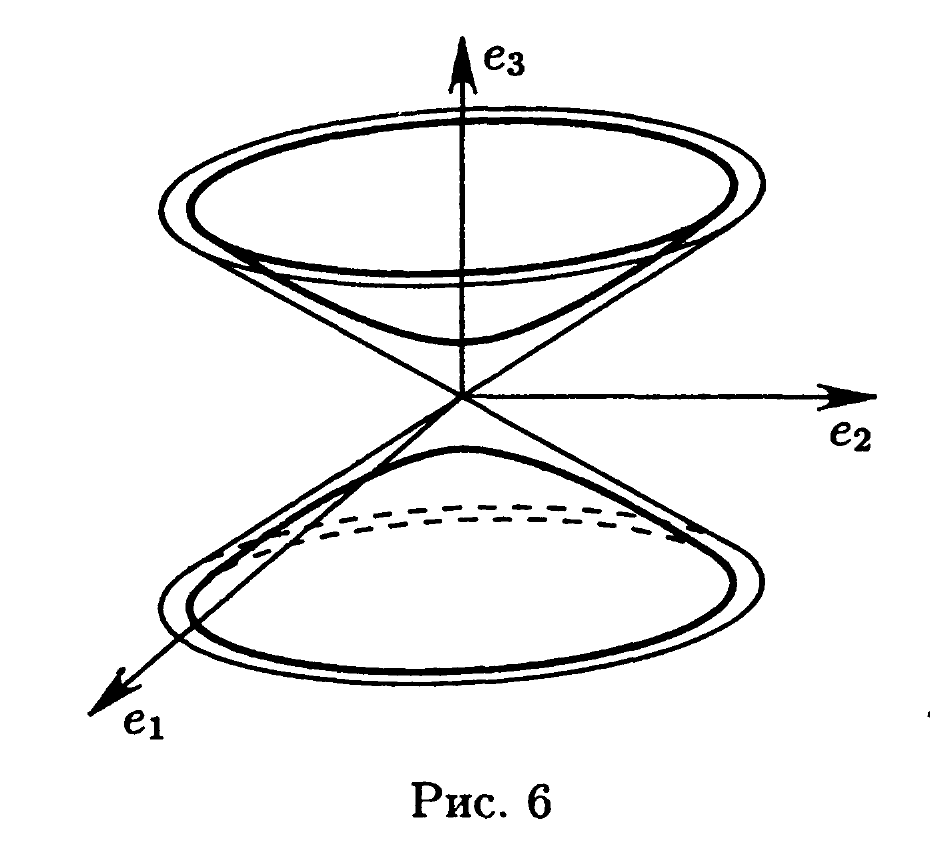
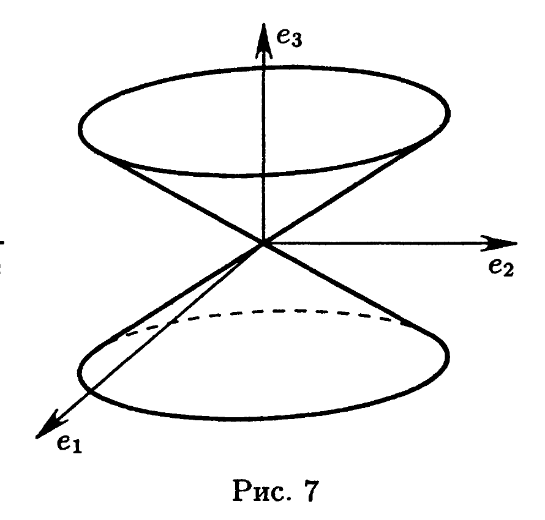
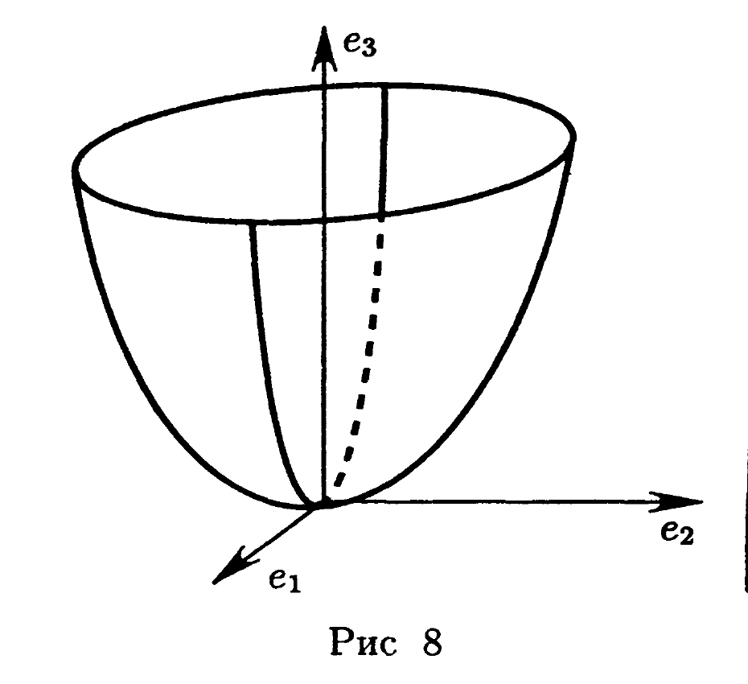
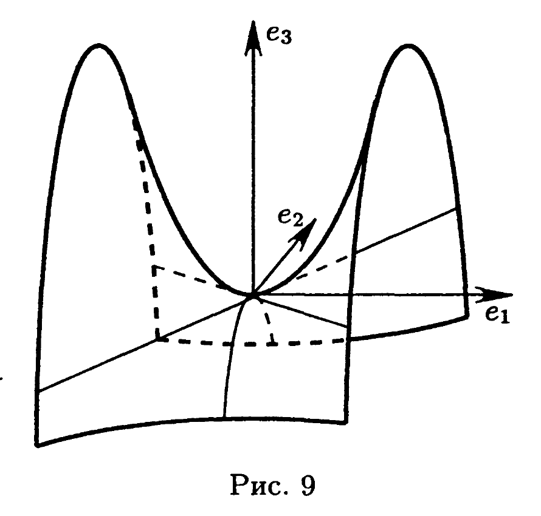
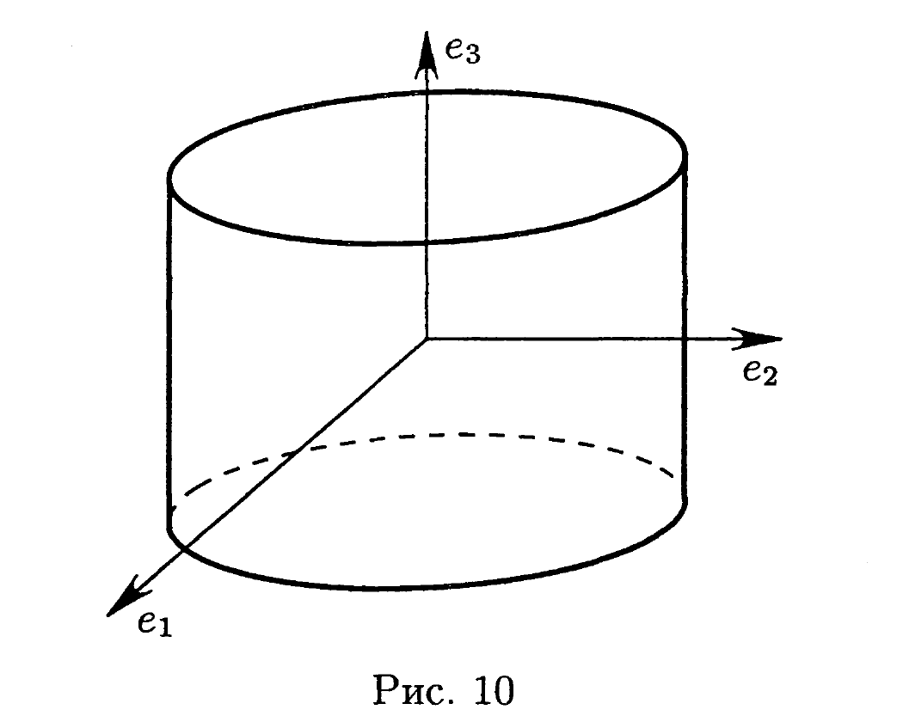
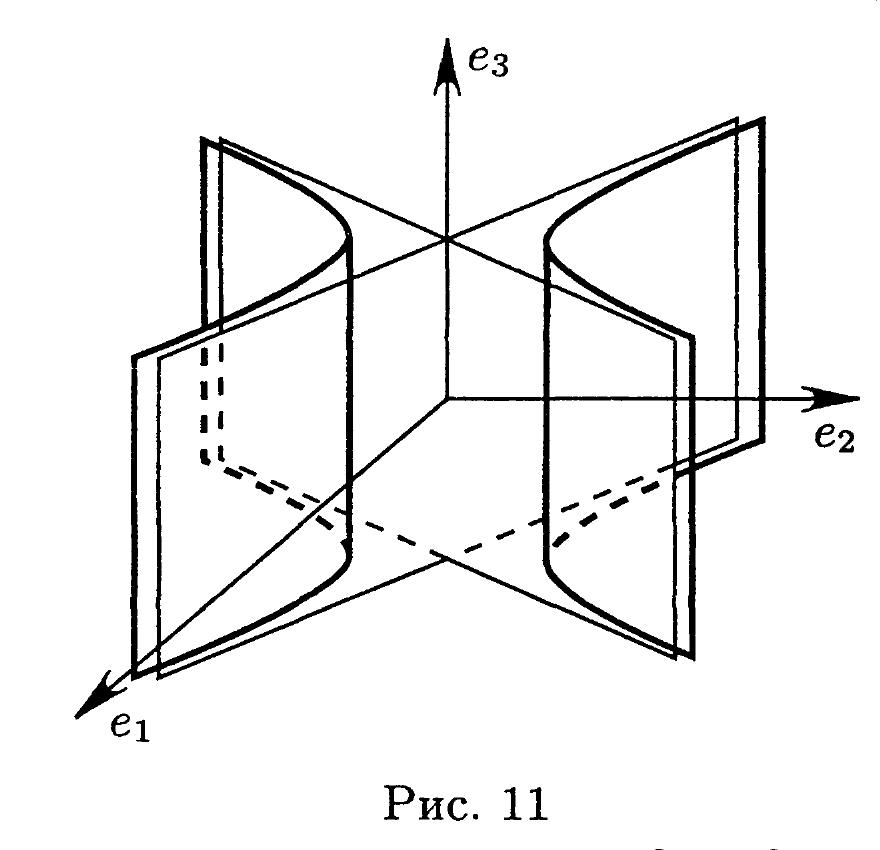
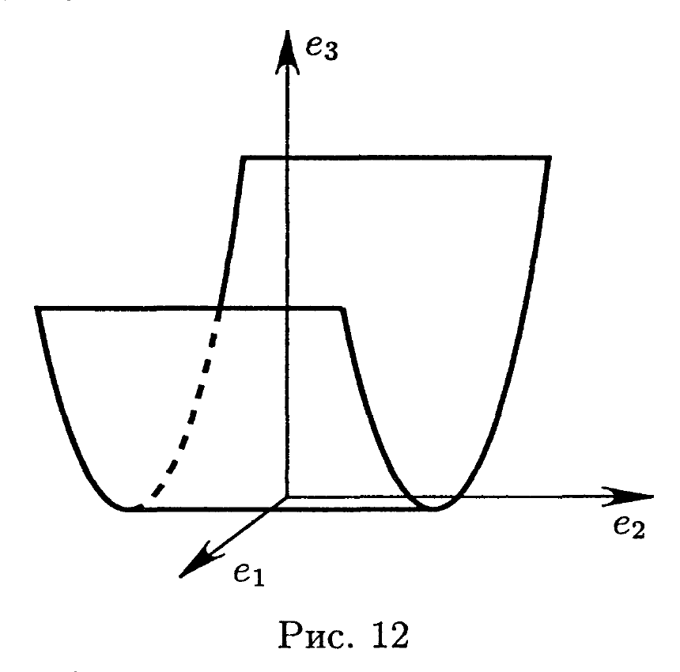

# Глава 4. Поверхности второго порядка

## § 10. Уравнения множеств в пространстве и элементарная теория поверхностей второго порядка

В этом параграфе использованы следующие основные понятия: *уравнение множества, однородный многочлен, алгебраическая поверхность, порядок алгебраической поверхности, параметрические уравнения поверхности, поверхность вращения, конус, прямой круговой конус, цилиндр, прямой круговой цилиндр, однополостный и двуполостный гиперболоиды, эллиптический и гиперболический параболоиды, пересечение поверхностей, сечение поверхности плоскостью, прямолинейная образующая поверхности, проекция некоторого множества на плоскость, образующие и направляющие цилиндра и конуса, вершины эллипсоида, гиперболоида, параболоида и конуса, ось и полуось эллипсоида и гиперболоида, каноническое уравнение и тип поверхности второго порядка*.

Всюду предполагается, что система координат декартова прямоугольная, а проекции, если не оговорено противное, ортогональные.

Для каждой поверхности второго порядка существует декартова прямоугольная система координат, в которой эта поверхность имеет каноническое уравнение. Всего имеется 17 типов поверхностей второго порядка. Каждый тип поверхностей характеризуется своей формой канонического уравнения. Все типы поверхностей второго порядка и соответствующие уравнения перечислены во введении к § 11. Здесь приведем канонические уравнения и изображения девяти основных типов:

эллипсоид
$$\frac{x^2}{a^2}+\frac{y^2}{b^2}+\frac{z^2}{c^2}=1 \quad \text{(рис. 4)};$$

однополостный гиперболоид
$$\frac{x^2}{a^2}+\frac{y^2}{b^2}-\frac{z^2}{c^2}=1 \quad \text{(рис. 5)}; \quad (1)$$

двуполостный гиперболоид
$$\frac{x^2}{a^2}+\frac{y^2}{b^2}-\frac{z^2}{c^2}=-1 \quad \text{(рис. 6)};$$

---
**стр. 82**

---

конус
$$\frac{x^2}{a^2}+\frac{y^2}{b^2}-\frac{z^2}{c^2}=0 \quad \text{(рис. 7)};$$

эллиптический параболоид
$$\frac{x^2}{a^2}+\frac{y^2}{b^2}=2z \quad \text{(рис. 8)};$$

гиперболический параболоид
$$\frac{x^2}{a^2}-\frac{y^2}{b^2}=2z \quad \text{(рис. 9)}; \quad (2)$$

эллиптический цилиндр
$$\frac{x^2}{a^2}+\frac{y^2}{b^2}=1 \quad \text{(рис. 10)};$$

гиперболический цилиндр
$$\frac{x^2}{a^2}-\frac{y^2}{b^2}=1 \quad \text{(рис. 11)};$$

параболический цилиндр
$$\frac{x^2}{a^2}=2z \quad \text{(рис. 12)}.$$

При $a=b$ конус и эллиптический цилиндр называют *прямым круговым конусом* и *прямым круговым цилиндром*.

Приведем уравнения семейств прямолинейных образующих двух важных типов поверхностей второго порядка.

Два семейства прямолинейных образующих однополостного гиперболоида (1) могут быть описаны при помощи следующих систем уравнений:
$$\begin{cases}\alpha\left(\dfrac{x}{a}+\dfrac{z}{c}\right)=\beta\left(1+\dfrac{y}{b}\right), \\ \beta\left(\dfrac{x}{a}-\dfrac{z}{c}\right)=\alpha\left(1-\dfrac{y}{b}\right),\end{cases} \quad \text{и} \quad \begin{cases}\alpha\left(\dfrac{x}{a}+\dfrac{z}{c}\right)=\beta\left(1-\dfrac{y}{b}\right), \\ \beta\left(\dfrac{x}{a}-\dfrac{z}{c}\right)=\alpha\left(1+\dfrac{y}{b}\right),\end{cases}$$
где $\alpha,\beta$ — произвольные числа, такие что $\alpha^2+\beta^2\neq0$. Два семейства прямолинейных образующих гиперболического параболоида (2) описываются системами уравнений
$$\begin{cases}\alpha\left(\dfrac{x}{a}+\dfrac{y}{b}\right)=\beta z, \\ \beta\left(\dfrac{x}{a}-\dfrac{y}{b}\right)=2\alpha,\end{cases} \quad \text{и} \quad \begin{cases}\alpha\left(\dfrac{x}{a}+\dfrac{y}{b}\right)=\beta, \\ \beta\left(\dfrac{x}{a}-\dfrac{y}{b}\right)=2\alpha z,\end{cases}$$
где $\alpha,\beta$ — произвольные параметры, такие что $\alpha^2+\beta^2\neq0$.

Алгебраическое уравнение вида $\Phi(x,y)=0$ (не содержащее переменной $z$) определяет цилиндрическую поверхность. Прямолинейные образующие этого цилиндра параллельны оси $Oz$: они имеют уравнения $x=x_0$, $y=y_0$, где $\Phi(x_0,y_0)=0$.

---
**стр. 83**

---

---
**стр. 84**

---

Уравнение вида $\Phi(x^2+y^2,z)=0$[^1] определяет поверхность вращения $(S)$. Сечение $\mathcal{L}$ этой поверхности плоскостью $Oxz$, имеющее на плоскости $Oxz$ уравнение $\Phi(x^2,z)=0$, симметрично относительно оси $Oz$. Каждая «половинка» кривой $\mathcal{L}$, вращаясь вокруг оси $Oz$, образует поверхность $S$.

Пусть две поверхности $\mathcal{F}$ и $\mathcal{G}$ определяются алгебраическими уравнениями $F(x,y,z)=0$ и $G(x,y,z)=0$ соответственно. Тогда множество $\mathcal{H}=\mathcal{F}\cap\mathcal{G}$ определяется системой уравнений
$$F(x,y,z)=0, \qquad G(x,y,z)=0.$$

Уравнение, определяющее множество $\mathcal{M}$, следует из уравнения, определяющего множество $\mathcal{N}$, если $\mathcal{N}\subseteq\mathcal{M}$. Уравнение, определяющее поверхность $\mathcal{M}$, является следствием системы уравнений, определяющих поверхности $\mathcal{F}$ и $\mathcal{G}$, тогда и только тогда, когда $\mathcal{F}\cap\mathcal{G}\subseteq\mathcal{M}$.

[^1]: Оно может быть получено из алгебраического уравнения $\Phi(u,v)=0$ заменой $u=x^2+y^2$, $v=z$. При этом, вообще говоря, можно не исключать случая, когда уравнение не имеет вещественных решений. В этом случае говорят о «мнимой» поверхности.

---
**стр. 85**

---

### Изображение поверхности второго порядка. Типы поверхностей второго порядка (10.1–10.17)

**10.1.** 1) Что представляет собой алгебраическая поверхность первого порядка?
2) Привести пример алгебраической поверхности третьего порядка и изобразить ее в декартовой прямоугольной системе координат.

**10.2.** Может ли алгебраическая поверхность второго порядка представлять собой прямую? Плоскость? Пустое множество? Привести примеры.

**10.3.** Семейство поверхностей задано в прямоугольной системе координат уравнением, содержащим произвольный параметр $\lambda$. Определить тип поверхности при всевозможных $\lambda$:
1) $x^2+y^2+z^2=\lambda$;
2) $\lambda x^2+y^2+z^2=1$;
3) $\lambda x^2+y^2+z^2=\lambda$;
4) $x^2+y^2-z^2=\lambda$;
5) $x^2-y^2-z^2=\lambda$;
6) $x^2+\lambda(y^2+z^2)=1$;
7) $x^2+\lambda(y^2+z^2)=\lambda$;
8) $x^2+y^2=\lambda z$;
9) $\lambda x^2+y^2=z$;
10) $\lambda(x^2+y^2)=z$;
11) $x^2+\lambda y^2=\lambda z$;
12) $x^2+\lambda y^2=\lambda z+1$;
13) $x^2+y^2=\lambda$;
14) $x^2-y^2=\lambda$.

**10.4.** 1) Указать такие типы поверхностей второго порядка, которые не содержат ни одной поверхности вращения.
2) Перечислить типы поверхностей второго порядка, которым принадлежат какие-нибудь поверхности вращения.

**10.5.** Написать уравнение сферы:
1) с центром в точке $C(1,1,1)$ и радиусом $\sqrt3$;
2) с центром в точке $C(1,2,3)$ и радиусом $1$.

**10.6.** Найти координаты центра $C$ и радиус $R$ сферы:
1) $x^2+y^2+z^2-4x-4y-4z=0$;
2) $2x^2+2y^2+2z^2+4x+8y+12z+3=0$.

**10.7.** Найти координаты центра поверхности, ее полуоси и уравнения плоскостей симметрии, изобразить поверхность в исходной системе координат:
1) $x^2+2y^2+3z^2+2x+4y+6z=0$;
2) $3x^2+2y^2+z^2+6x+4y+2z-6=0$.

**10.8.** Найти координаты центра поверхности, ее вершин, уравнения оси симметрии и плоскостей симметрии, изобразить

---
**стр. 86**

---

поверхность в исходной системе координат:
1) $x^2-2y^2-3z^2+6x+4y+6z=0$;
2) $2x^2+3y^2-4z^2+4x-8z+10=0$.

**10.9.** Определить тип поверхности:
1) $2x^2+y^2-3z^2+4x-4y=0$;
2) $2x^2+y^2-3z^2-4x+4y+6=0$;
3) $2x^2+y^2-3z^2+6z=0$;
4) $2x^2+y^2+2z+1=0$;
5) $2x^2-y^2+2z+1=0$;
6) $2x^2+z^2+2x+z=0$.

**10.10.** Определить тип поверхности, изобразить поверхность в исходной системе координат:
1) $xy=0$; 2) $xy=1$; 3) $xy=-1$;
4) $2xy+z=0$; 5) $2xy-z=0$.

**10.11.** Найти ось вращения поверхности $x^2+z^2+x=0$.

**10.12.** Определить тип поверхности, найти ось вращения, координаты вершин, изобразить поверхность:
1) $x^2+z^2+2y=1$; 2) $z^2=2xy$.

**10.13.** Найти координаты центра поверхности, уравнения оси вращения и горловой окружности, определить радиус горловой окружности, изобразить поверхность $x^2+2yz=1$.

**10.14.** Найти точки пересечения поверхности $x^2+y^2=z$ и прямой:
1) $x=y=t$, $z=4t$; 2) $x=y=z+1$;
3) $\dfrac{x-1}{1}=\dfrac{y+1}{1}=\dfrac{z+6}{8}$.

**10.15.** Сколько общих точек могут иметь прямая и поверхность второго порядка? Привести примеры.

**10.16.** Определить, лежит ли точка $M(1,1,1)$ внутри или вне эллипсоида $x^2+2y^2+3z^2=4$.

**10.17.** Ось $Oz$ направлена вверх. Определить, лежит ли точка $M(1,1,1)$ выше или ниже параболоида $x^2+2y^2=2z$.

### Поверхности вращения, цилиндры и конусы (10.18–10.45)

**10.18.** Привести примеры поверхностей вращения, которые являются алгебраическими поверхностями порядка 2, 3, 4.

**10.19.** Назвать типы и выписать канонические уравнения цилиндрических поверхностей второго порядка.

---
**стр. 87**

---

**10.20.** Привести примеры цилиндрических поверхностей, которые являются алгебраическими поверхностями порядка 3, 4.

**10.21.** Привести пример цилиндрической поверхности, не являющейся алгебраической.

**10.22.** Привести примеры цилиндров и конусов, не являющихся поверхностями вращения.

**10.23.** Доказать, что всякое уравнение вида $F(x,y,z)=0$, где $F$ — однородный многочлен, определяет конус с вершиной в начале координат.

**10.24.** Привести пример конической поверхности, не являющейся алгебраической.

**10.25.** Можно ли рассматривать плоскость как частный случай конической поверхности? Как частный случай цилиндра? Как поверхность вращения?

**10.26.** Составить векторное уравнение прямого кругового цилиндра радиуса $R$, имеющего ось $\mathbf{r}=\mathbf{r}_0+\mathbf{a}t$.

**10.27.** Составить векторное уравнение сферы с центром в точке $M_0(\mathbf{r}_0)$ и радиусом $R$.

**10.28.** Составить векторное уравнение прямого кругового конуса с вершиной в точке $M_0(\mathbf{r}_0)$ и осью $\mathbf{r}=\mathbf{r}_0+\mathbf{a}t$, зная, что угол между его образующей и осью равен $\alpha$.

**10.29.** Составить векторное уравнение эллипсоида, получаемого вращением эллипса с фокусами в точках $M_1(\mathbf{r}_1)$, $M_2(\mathbf{r}_2)$ и большой полуосью $a$ вокруг большой оси эллипса.

**10.30.** Найти уравнение поверхности, получаемой вращением параболы $z^2=x$:
1) вокруг оси $Oz$; 2) вокруг оси $Ox$.

**10.31.** Найти уравнение и определить тип поверхности, получаемой вращением гиперболы $x^2-y^2=2$:
1) вокруг оси $Ox$; 2) вокруг оси $Oy$.

**10.32.** Найти уравнение поверхности, получаемой вращением окружности $x^2+y^2-4x+3=0$ вокруг оси $Oy$.

**10.33.** Найти уравнения поверхностей, получаемых вращением гиперболы $xy=1$ вокруг асимптот.

**10.34.** 1) Написать параметрические уравнения поверхности, образованной вращением кривой $z=f(x)$ ($x\geqslant0$) вокруг оси $Oz$.

---
**стр. 88**

---

2) Написать параметрические уравнения поверхности, образованной вращением кривой $x=\varphi(t)$, $y=\psi(t)$, $z=\chi(t)$ вокруг оси $Oz$.

**10.35.** Доказать, что цилиндрическая поверхность с направляющей, заданной параметрическими уравнениями $x=\varphi(t)$, $y=\psi(t)$, $z=\chi(t)$, и с образующей, параллельной вектору $\mathbf{a}(a_1,a_2,a_3)$, определяется уравнениями $x=\varphi(u)+a_1v$, $y=\psi(u)+a_2v$, $z=\chi(u)+a_3v$.

**10.36.** Доказать, что конус с направляющей, заданной параметрическими уравнениями $x=\varphi(t)$, $y=\psi(t)$, $z=\chi(t)$, и с вершиной в начале координат определяется уравнениями $x=u\varphi(v)$, $y=u\psi(v)$, $z=u\chi(v)$.

**10.37.** Найти уравнение прямого кругового цилиндра радиуса $\sqrt2$ с осью $x=1+t$, $y=2+t$, $z=3+t$.

**10.38.** Найти уравнение прямого кругового цилиндра, проходящего через точку $M(1,1,2)$ и имеющего ось $x=1+t$, $y=2+t$, $z=3+t$.

**10.39.** Найти уравнение прямого кругового конуса с вершиной в начале координат и направлением оси, определяемым вектором $\mathbf{a}(1,1,1)$, зная, что образующие конуса составляют с его осью угол $\arccos(1/\sqrt3)$.

**10.40.** Найти уравнение и определить тип поверхности, образованной вращением прямой $x=1+t$, $y=z=3+t$ вокруг оси $Oz$.

**10.41.** Найти уравнение и определить тип поверхности, образованной вращением прямой $x=0$, $y-z+1=0$ вокруг оси $Oz$.

**10.42.** Найти уравнение и определить тип поверхности, образованной вращением прямой $x=-t$, $y=z=2t$ вокруг прямой $x=y=z$.

**10.43.** Найти уравнение конуса с вершиной в точке $M(1,1,1)$, касающегося сферы $x^2+y^2+z^2=2$.

**10.44.** Найти параметрические уравнения цилиндра с образующей, параллельной вектору $\mathbf{a}(1,1,1)$, и направляющей, заданной уравнениями $x=-1+2\cos t$, $y=-1+2\sin t$, $z=3-2\cos t-2\sin t$.

**10.45.** Исключив параметры, получить алгебраическое уравнение поверхности $x=u+\cos v$, $y=u+\sin v$, $z=u-\cos v-\sin v$. Что это за поверхность?

---
**стр. 89**

---

### Сечения поверхностей второго порядка (10.46–10.76)

**10.46.** 1) Сечения поверхности $x^2+2y^2-3z^2-1=0$ плоскостями $x=0$, $x=1$, $x=2$ спроектированы на плоскость $Oyz$. Изобразить проекции.
2) Сечения поверхности $x^2+2y^2-3z^2=0$ плоскостями $x=-1$, $x=0$, $x=1$ спроектированы на плоскость $Oyz$. Изобразить проекции.
3) Сечения поверхности $2x^2-y^2=2z$ плоскостями $x=-1$, $x=0$, $x=1$ спроектированы на плоскость $Oyz$. Изобразить проекции.
4) Сечения поверхности $2x^2-y^2=2z$ плоскостями $y=-1$, $y=0$, $y=1$ спроектированы на плоскость $Oxz$. Изобразить проекции.
5) Сечения поверхности $2x^2-y^2=2z$ плоскостями $z=-1$, $z=1$ спроектированы на плоскость $Oxy$. Изобразить проекции.

**10.47.** 1) Сечения поверхностей $x^2+2y^2-3z^2-1=0$, $x^2+2y^2-3z^2=0$, $x^2+2y^2-3z^2+1=0$ плоскостью $x=0$ спроектированы на плоскость $Oyz$. Изобразить проекции.
2) Сечения тех же поверхностей плоскостью $z=1$ спроектированы на плоскость $Oxy$. Изобразить проекции.

**10.48.** 1) Является ли линия пересечения двух поверхностей второго порядка плоской кривой? Привести примеры.
2) Пусть линия пересечения двух поверхностей второго порядка плоская. Будет ли эта линия алгебраической? Если да, то какого порядка? Рассмотреть примеры.

**10.49.** Определить вид линии пересечения поверхностей $x^2+y^2=2z$, $x^2+y^2+z^2=8$ и найти ее параметрические уравнения.

**10.50.** Доказать, что линия пересечения поверхности второго порядка с плоскостью есть алгебраическая линия не выше второго порядка. Привести примеры, когда эта линия первого порядка.

**10.51.** Пусть $\mathcal{F}$ — поверхность, определяемая алгебраическим уравнением $F(x,y)=0$, $\mathcal{L}$ — непустое множество точек, определяемое уравнениями $F(x,y)=0$, $z=0$. Доказать утверждения:
1) $\mathcal{F}$ — цилиндрическая поверхность с образующей, параллельной оси $Oz$, и направляющей $\mathcal{L}$;

---
**стр. 90**

---

2) $\mathcal{L}$ есть сечение $\mathcal{F}$ плоскостью $Oxy$;
3) $\mathcal{L}$ есть проекция $\mathcal{F}$ на плоскость $Oxy$;
4) $\mathcal{L}$ есть проекция любой направляющей цилиндра на плоскость $Oxy$;
5) $\mathcal{L}$ содержит проекцию на плоскость $Oxy$ любой кривой, лежащей на цилиндре $\mathcal{F}$.

**10.52.** Найти уравнение проекции линии пересечения поверхностей $x^2+2y^2=2z$, $x+2y+z=1$ на плоскость $Oxy$. Что представляет собой эта линия?

**10.53.** Пусть $S$ — сечение параболоида $x^2+y^2=2z$ плоскостью, которая пересекает положительную полуось $Oz$ в единственной точке. Доказать, что проекция $S$ на плоскость $Oxy$ есть окружность.

**10.54.** Доказать, что линия пересечения поверхностей $x^2+y^2=2z$, $x+y+z=1$ есть эллипс, и найти его параметрические уравнения.

**10.55.** По какой линии пересекаются параболоид $x^2-y^2=2z$ и плоскость $x+y+z=1$?

**10.56.** Найти координаты центра и радиус окружности $x^2+y^2+z^2-12x+4y-6z+24=0$, $2x+2y+z+1=0$.

**10.57.** Составить параметрические уравнения конуса с вершиной в начале координат и направляющей, определенной уравнениями $x^2+y^2=2z$, $x+2y+z=1$.

**10.58.** Найти уравнение цилиндра с образующей, параллельной оси $Oz$, и направляющей — окружностью $x^2+y^2+z^2=3$, $z=1$.

**10.59.** Образующая цилиндра параллельна оси $Oz$, его направляющая — окружность $x^2+y^2=2z$, $x^2+y^2+z^2=8$. Найти уравнение цилиндра.

**10.60.** Образующие цилиндра параллельны оси $Oz$, направляющая — эллипс $x^2+y^2=2z$, $x+y+z=1$. Доказать, что это — прямой круговой цилиндр, написать его уравнение, найти ось и радиус.

**10.61.** Образующие цилиндра параллельны вектору $\mathbf{a}(1,1,1)$, его направляющая — окружность $x^2+y^2=2z$, $x^2+y^2+z^2=8$. Написать уравнение цилиндра.

**10.62.** Найти уравнение конуса с вершиной в точке $O(0,0,0)$ и направляющей — окружностью $x^2+y^2+z^2=1$, $x+y+z=1$.

---
**стр. 91**

---

**10.63.** Найти уравнение эллипсоида, плоскости симметрии которого совпадают с плоскостями координат, содержащего точку $M(3,1,1)$ и окружность $x^2+y^2=9$, $x-z=0$.

**10.64.** Доказать, что центры плоских сечений эллиптического цилиндра лежат на его оси.

**10.65.** Найти центр сечения эллипсоида $x^2+2y^2+4z^2=40$ плоскостью:
1) $x+y+2z=5$; 2) $x+y+2z=7$.

**10.66 (р).** Найти центр сечения гиперболоида $x^2+2y^2-4z^2=-4$ плоскостью $x+y+2z=2$. → см. [[sbz_g04_resheniya#10.66 (р)|Решения к Главе 4]]

**10.67.** Пусть $M_0(5,7,20)$ — точка плоскости, а $\mathbf{p}(-3/\sqrt{11},1/\sqrt{11},1/\sqrt{11})$, $\mathbf{q}(1/\sqrt6,1/\sqrt6,2/\sqrt6)$ — ортонормированный базис на ней. Написать уравнения линии пересечения этой плоскости и конуса $x^2+5y^2-z^2=0$ во внутренней системе координат $M_0,\mathbf{p},\mathbf{q}$. Найти координаты центра линии пересечения и уравнения ее осей симметрии в исходной (пространственной) системе координат.

**10.68 (р).** Найти уравнение множества центров сечений эллипсоида $x^2+2y^2+3z^2=4$ плоскостями, параллельными плоскости $x+y+z=1$. → см. [[sbz_g04_resheniya#10.68 (р)|Решения к Главе 4]]

**10.69.** Найти уравнение множества центров сечений гиперболоида $x^2+y^2-3z^2=2$ плоскостями, параллельными плоскости $x+y+z=1$.

**10.70.** Найти уравнение множества центров сечений параболоида $x^2+y^2=2z$ плоскостями, параллельными плоскости $x+y+z=1$.

**10.71 (р).** Найти уравнение плоскости, пересекающей эллипсоид $x^2+2y^2+4z^2=9$ по эллипсу, центр которого находится в точке $C(3,2,1)$. → см. [[sbz_g04_resheniya#10.71 (р)|Решения к Главе 4]]

**10.72.** Найти уравнения проекций линии пересечения эллипсоида $3x^2+4y^2+5z^2=36$ и сферы $x^2+y^2+z^2=9$ на координатные плоскости. Что представляет собой сечение?

**10.73.** Найти уравнения проекций линии пересечения эллипсоидов $x^2+2y^2+3z^2=4$, $3x^2+5y^2+6z^2=10$ на координатные плоскости. Что представляет собой эта линия?

**10.74.** Написать уравнения проекций линии пересечения поверхностей $x^2+y^2-z^2=1$, $x^2-y^2=2z$ на координатные плоскости. Что представляет собой эта линия? Найти ее параметрические уравнения.

---
**стр. 92**

---

**10.75 (р).** Найти уравнения проекций линии пересечения поверхностей $5x^2-3y^2+4z^2=0$, $x^2-y^2+z^2+1=0$ на координатные плоскости. → см. [[sbz_g04_resheniya#10.75 (р)|Решения к Главе 4]]

**10.76.** Доказать, что линия пересечения параболоида $x^2+2y^2=4z+10$ и сферы $x^2+y^2+z^2=6$ состоит из двух окружностей. Найти точки пересечения этих окружностей и их радиусы.

### Прямолинейные образующие поверхностей второго порядка (10.77–10.88)

**10.77.** Назвать типы поверхностей второго порядка, имеющих прямолинейные образующие.

**10.78.** Может ли число прямолинейных образующих, проходящих через одну точку поверхности, равняться 0? 1? 2? 3? … Может ли оно быть бесконечным? Привести примеры.

**10.79.** Найти уравнение семейства прямолинейных образующих цилиндра $x^2-y^2=1$.

**10.80.** Найти уравнение семейства прямолинейных образующих конуса $x^2-y^2-z^2=0$.

**10.81.** Найти прямолинейные образующие параболоида $4x^2-y^2=16z$, пересекающиеся в точке $M(2,0,1)$.

**10.82.** Найти уравнение плоскости, проходящей через точки $M(1,1,1)$ и $N(2,0,2)$ и пересекающей параболоид $x^2-y^2=2z$ по паре прямых.

**10.83.** Найти уравнение плоскости, пересекающей гиперболоид $x^2+4y^2-9z^2=36$ по паре прямых, проходящих через точку $M(6,-3,2)$.

**10.84.** Даны параболоид $x^2-y^2=2z$ и плоскость $x+y+z=1$. Найти уравнение плоскости, параллельной данной и пересекающей данный параболоид по паре прямых. Найти уравнения этих прямых и угол между ними.

**10.85.** Две прямолинейные образующие гиперболоида вращения $x^2+y^2-z^2=1$ пересекаются в точке, принадлежащей плоскости $z=h$. Найти угол между ними:
1) при $h=0$; 2) при $h=1$; 3) при произвольном $h$.

**10.86.** Найти множество точек поверхности $S$, в которых пересекаются ее взаимно ортогональные прямолинейные образующие, если $S$ определена уравнением:

---
**стр. 93**

---

1) $x^2+y^2-z^2=1$; 2) $x^2-y^2=2z$; 3) $x^2-4y^2=2z$.

**10.87.** Доказать, что проекции прямолинейных образующих параболоида $x^2-y^2=2z$ на плоскость $Oxz$ касаются параболы $x^2=2z$.

**10.88.** Доказать, что проекции прямолинейных образующих гиперболоида $x^2+y^2-z^2=1$ на плоскость $Oxy$ касаются окружности $x^2+y^2=1$.

---

Задачи 10.66, 10.68, 10.71, 10.75 снабжены полным решением в разделе «Решения» (стр. 352–353 оригинала) — см. [[sbz_g04_resheniya|Решения к Главе 4]]. Ответы — в разделе «Ответы и указания» (стр. 373 и далее) — пока не перенесено.
