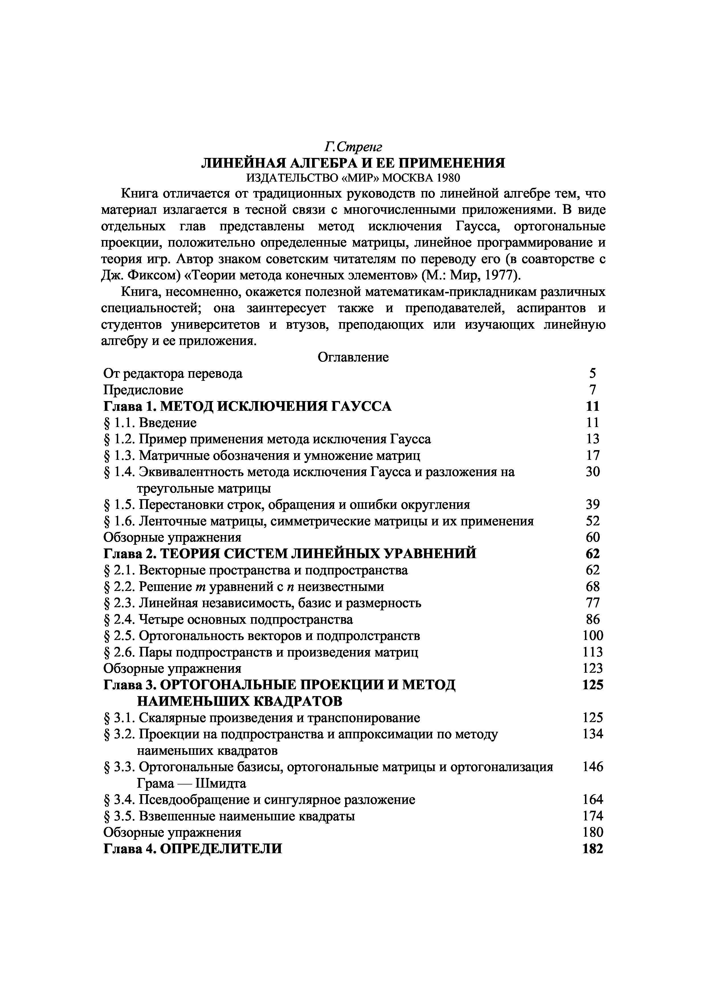

# ВСТУПИТЕЛЬНЫЕ МАТЕРИАЛЫ

## Вступительные материалы

> **Особенность скана.** В этом DjVu блок задней части книги подшит в начало: после титульного листа (файловая стр. 1) и одной страницы оглавления (стр. 2) идут семь страниц предметного указателя (стр. 3–9), и только со стр. 10 начинается сама книга («От редактора перевода», печатная стр. 5). Из-за этого печатные стр. 1–4 в скан не попали вовсе. Подшитые страницы — дубли задней части, транскрибированной по её настоящему месту: оглавление — [[streng_g09_s06_oglavlenie|стр. 452–454]], указатель — [[streng_g09_s05_ukazatel|стр. 446–451]]. Здесь они удалены, чтобы не держать один и тот же текст в vault дважды под выдуманными номерами страниц; сверено построчно — концевая копия покрывает вклейку полностью и точнее её (в дубле были искажения: «Планирование производства 369» вместо 359 и «SVD-разложение» вместо напечатанного $Q_1\Sigma Q_2^{\mathrm{T}}$-разложения).

---
**стр. -4**
---

<!-- печатный номер в колонтитуле на этой странице не виден -->

Г.Стренг

ЛИНЕЙНАЯ АЛГЕБРА И ЕЕ ПРИМЕНЕНИЯ

ИЗДАТЕЛЬСТВО «МИР» МОСКВА 1980

Книга отличается от традиционных руководств по линейной алгебре тем, что материал излагается в тесной связи с многочисленными приложениями. В виде отдельных глав представлены метод исключения Гаусса, ортогональные проекции, положительно определенные матрицы, линейное программирование и теория игр. Автор знаком советским читателям по переводу его (в соавторстве с Дж. Фиксом) «Теории метода конечных элементов» (М.: Мир, 1977).

Книга, несомненно, окажется полезной математикам-прикладникам различных специальностей; она заинтересует также и преподавателей, аспирантов и студентов университетов и втузов, преподающих или изучающих линейную алгебру и ее приложения.

**Оглавление**

От редактора перевода 5

Предисловие 7

**Глава 1. МЕТОД ИСКЛЮЧЕНИЯ ГАУССА** 11

§ 1.1. Введение 11

§ 1.2. Пример применения метода исключения Гаусса 13

§ 1.3. Матричные обозначения и умножение матриц 17

§ 1.4. Эквивалентность метода исключения Гаусса и разложения на треугольные матрицы 30

§ 1.5. Перестановки строк, обращения и ошибки округления 39

§ 1.6. Ленточные матрицы, симметрические матрицы и их применения 52

Обзорные упражнения 60

**Глава 2. ТЕОРИЯ СИСТЕМ ЛИНЕЙНЫХ УРАВНЕНИЙ** 62

§ 2.1. Векторные пространства и подпространства 62

§ 2.2. Решение $m$ уравнений с $n$ неизвестными 68

§ 2.3. Линейная независимость, базис и размерность 77

§ 2.4. Четыре основных подпространства 86

§ 2.5. Ортогональность векторов и подпространств 100

§ 2.6. Пары подпространств и произведения матриц 113

Обзорные упражнения 123

**Глава 3. ОРТОГОНАЛЬНЫЕ ПРОЕКЦИИ И МЕТОД НАИМЕНЬШИХ КВАДРАТОВ** 125

§ 3.1. Скалярные произведения и транспонирование 125

§ 3.2. Проекции на подпространства и аппроксимации по методу наименьших квадратов 134

§ 3.3. Ортогональные базисы, ортогональные матрицы и ортогонализация Грама — Шмидта 146

§ 3.4. Псевдообращение и сингулярное разложение 164

§ 3.5. Взвешенные наименьшие квадраты 174

Обзорные упражнения 180

**Глава 4. ОПРЕДЕЛИТЕЛИ** 182

---
**стр. 5**
---

# От редактора перевода

Традиционные курсы линейной алгебры, читаемые в высших учебных заведениях, и соответствующие учебные пособия, как правило, мало затрагивают прикладную сторону предмета. Но в то же время линейная алгебра служит основой всех методов вычислительной математики, являясь в этом смысле чисто прикладной наукой.

Предлагаемая вашему вниманию книга написана известным американским математиком Гильбертом Стренгом на основе курса лекций для студентов Массачусетского технологического института, который читался им с учетом именно этих обстоятельств, и это оказало существенное влияние как на стиль изложения материала, так и на его выбор. Например, в виде отдельных глав здесь представлены метод исключения Гаусса, положительно определенные матрицы и даже линейное программирование, и в то же время жорданова форма матрицы и линейные преобразования рассматриваются в виде кратких приложений. В книге рассматриваются также вопросы об ортогональном проецировании векторов на подпространства и дается представление о методе конечных элементов, который в настоящее время становится основным средством приближенного решения уравнений математической физики. Отдельная глава посвящена вычислениям с матрицами и, в частности, итерационным методам решения систем линейных алгебраических уравнений, играющим важную роль в вычислительной математике.

Каждая глава содержит большое число примеров и упражнений, которые также призваны способствовать развитию у читателя навыков в решении прикладных задач.

---
**стр. 6**
---

Написанная доступным языком, эта книга, несомненно, окажется полезной для широкого круга читателей: математиков-прикладников, аспирантов и студентов многих специальностей университетов и втузов. Она заинтересует также преподавателей курсов линейной алгебры — как с точки зрения методологии, так и с точки зрения максимальной приближенности теории к приложениям.

Перевод глав 1, 2, 6, 7 выполнен Ю. А. Кузнецовым, глав 3, 4, 5, 8 и приложений — Д. М. Фаге.

Г. И. Марчук
