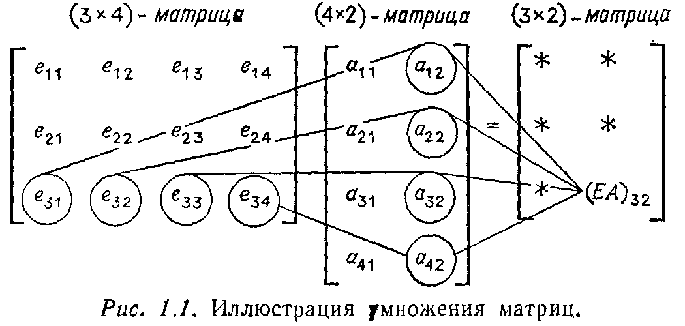

---
**стр. 17**
---

## § 1.3. МАТРИЧНЫЕ ОБОЗНАЧЕНИЯ И УМНОЖЕНИЕ МАТРИЦ

До сих пор в примерах с тремя уравнениями и тремя неизвестными мы могли выписывать все уравнения полностью. Более того, мы могли выписать каждый шаг процесса исключения, т. е. вычитание кратных одной строки из других, которое приводит систему уравнений к более простому виду. Для больших систем этот путь последовательного проведения исключений оказывается, однако, безнадежным; здесь требуется гораздо более краткая форма записи. Сейчас для описания первоначальной системы уравнений мы введем матричные обозначения и определим операцию умножения матриц, чтобы описать операции, упрощающие исходную систему.

---
**стр. 18**
---

Заметим, что в нашем примере
$$
\begin{aligned}
2u + v + w &= 1, \\
4u + v \phantom{{}+w} &= -2, \\
-2u + 2v + w &= 7
\end{aligned}
$$
имеются три различных типа величин. Это неизвестные $u$, $v$, $w$, правые части $1$, $-2$, $7$ и, наконец, набор из девяти числовых коэффициентов левой части, один из которых оказался равным нулю. Для столбца чисел правой части (это так называемые *свободные члены* уравнений) мы вводим векторное обозначение
$$
b = \begin{bmatrix} \phantom{-}1 \\ -2 \\ \phantom{-}7 \end{bmatrix}.
$$
Это трехмерный вектор-столбец. Чтобы представить его геометрически, мы можем считать три его компоненты координатами точки в трехмерном пространстве. Обратно, каждой точке в таком пространстве соответствует трехмерный вектор (который мы можем представлять себе как стрелку или отрезок прямой, начинающийся в начале координат и оканчивающийся в этой точке).

Основными *операциями* над векторами являются *сложение двух векторов* и *умножение вектора на число*. Геометрически вектор $2b$ имеет то же самое направление, что и вектор $b$, но будет в два раза длиннее, вектор $-2b$ имеет противоположное направление, а вектор $b + c$ получится, если поместить начальную точку вектора $c$ в конечную точку вектора $b$. Алгебраически это означает, что операции над векторами осуществляются покомпонентно:
$$
2b = 2 \begin{bmatrix} \phantom{-}1 \\ -2 \\ \phantom{-}7 \end{bmatrix} = \begin{bmatrix} \phantom{-}2 \\ -4 \\ 14 \end{bmatrix}, \qquad -2b = \begin{bmatrix} -2 \\ \phantom{-}4 \\ -14 \end{bmatrix},
$$
$$
b + c = \begin{bmatrix} \phantom{-}1 \\ -2 \\ \phantom{-}7 \end{bmatrix} + \begin{bmatrix} \phantom{-}1 \\ -4 \\ -4 \end{bmatrix} = \begin{bmatrix} \phantom{-}2 \\ -6 \\ \phantom{-}3 \end{bmatrix}.
$$
Два вектора могут складываться только в том случае, когда они имеют одинаковую размерность, равную числу их компонент.

Три неизвестных в уравнении также можно записать в векторном виде:
$$
\text{вектор неизвестных} \quad x = \begin{bmatrix} u \\ v \\ w \end{bmatrix}; \quad \text{решение} \quad x = \begin{bmatrix} -1 \\ \phantom{-}2 \\ \phantom{-}1 \end{bmatrix}.
$$

---
**стр. 19**
---

Они вновь являются трехмерными вектор-столбцами. Для расположения девяти коэффициентов уравнений мы введем так называемую «матрицу», состоящую из трех строк и трех столбцов. Она называется ***матрицей коэффициентов*** и имеет вид
$$
A = \begin{bmatrix} \phantom{-}2 & 1 & 1 \\ \phantom{-}4 & 1 & 0 \\ -2 & 2 & 1 \end{bmatrix}.
$$
Нужно заметить, что поскольку в нашем примере число неизвестных равно числу уравнений, $A$ является *квадратной матрицей* порядка три. В более общем случае, когда имеется $n$ уравнений с $n$ неизвестными, $A$ будет квадратной матрицей порядка $n$. Наконец, в самом общем случае, когда имеется $m$ уравнений с $n$ неизвестными, матрица коэффициентов имеет $m$ строк и $n$ столбцов и называется матрицей размера $m \times n$ или $(m \times n)$-матрицей. Так же как и векторы, матрицы можно складывать между собой и умножать на числа, причем эти операции осуществляются покомпонентно. Операции над векторами являются частным случаем операций над матрицами, поскольку векторы можно рассматривать как матрицы, только с одним столбцом. Как и ранее, нужно отметить, что сложение двух матриц возможно только в том случае, когда они имеют одинаковый размер:
$$
\begin{bmatrix} 2 & 1 \\ 3 & 0 \\ 0 & 4 \end{bmatrix} + \begin{bmatrix} \phantom{-}1 & 2 \\ -3 & 1 \\ \phantom{-}1 & 2 \end{bmatrix} = \begin{bmatrix} 3 & 3 \\ 0 & 1 \\ 1 & 6 \end{bmatrix}, \qquad 2 \begin{bmatrix} 2 & 1 \\ 3 & 0 \\ 0 & 4 \end{bmatrix} = \begin{bmatrix} 4 & 2 \\ 6 & 0 \\ 0 & 8 \end{bmatrix}.
$$

### УМНОЖЕНИЕ ВЕКТОРА НА МАТРИЦУ

Теперь мы начнем использовать введенные понятия. Мы хотим переписать систему (1) трех уравнений с тремя неизвестными в более простой матричной форме $Ax = b$. Это выглядит так:
$$
\begin{bmatrix} \phantom{-}2 & 1 & 1 \\ \phantom{-}4 & 1 & 0 \\ -2 & 2 & 1 \end{bmatrix} \begin{bmatrix} u \\ v \\ w \end{bmatrix} = \begin{bmatrix} \phantom{-}1 \\ -2 \\ \phantom{-}7 \end{bmatrix}.
$$
Правая часть не вызывает сомнений — это вектор-столбец со свободными членами системы (1) в качестве компонент, а левая часть состоит из вектора $x$, умноженного слева на матрицу $A$. Тот факт, что *это запись нашей системы*, уже подсказывает нам, как будет далее определено произведение вектора на матрицу. А именно, первая компонента вектора $Ax$ вычисляется как «про-

---
**стр. 20**
---

изведение» первой строки матрицы $A$ на вектор-столбец $x$:
$$
\begin{bmatrix} 2 & 1 & 1 \end{bmatrix} \begin{bmatrix} u \\ v \\ w \end{bmatrix} = [2u + v + w]. \tag{4}
$$
Приравнивая полученное выражение единице, первой компоненте вектора $b$, мы получаем первое уравнение $2u + v + w = 1$ нашей системы. Вторая компонента произведения $Ax$, равная $4u + v$, определяется второй строкой матрицы $A$, а третья компонента, равная $-2u + 2v + w$, — третьей строкой этой матрицы. Таким образом, матричное уравнение $Ax = b$ полностью эквивалентно системе из трех уравнений, с которой мы начинали рассмотрение.

Операция (4) является основополагающей для умножения матриц. Исходными величинами для нее являются вектор-строка и вектор-столбец одинаковой длины, а результатом — обычное число. Это число называется *скалярным (внутренним) произведением двух векторов*. Иначе говоря, произведение матрицы размера $1 \times n$ (*вектор-строки*) на матрицу размера $n \times 1$ (*вектор-столбец*) является матрицей размера $1 \times 1$ (матрицей порядка один):
$$
\begin{bmatrix} a_1 & a_2 & \dots & a_n \end{bmatrix} \begin{bmatrix} b_1 \\ b_2 \\ \vdots \\ b_n \end{bmatrix} = [a_1 b_1 + a_2 b_2 + \dots + a_n b_n].
$$

**Пример**
$$
\begin{bmatrix} 2 & 4 & 1 \end{bmatrix} \begin{bmatrix} \phantom{-}3 \\ -1 \\ \phantom{-}0 \end{bmatrix} = [2].
$$

Правило умножения вектора на матрицу непосредственно распространяется с рассмотренного нами случая матрицы порядка 3 на произвольный случай матрицы размера $n \times n$ (порядка $n$). При этом вектор обязательно должен иметь $n$ компонент, т. е. его размерность должна совпадать с порядком матрицы. Если использовать буквы вместо конкретных величин для обозначения элементов матрицы $A$ и компонент вектора $x$, то их произведе-

---
**стр. 21**
---

ние $Ax$ записывается в виде
$$
\begin{bmatrix} 
a_{11} & a_{12} & \dots & a_{1n} \\
a_{21} & a_{22} & \dots & a_{2n} \\
\cdot & \cdot & \dots & \cdot \\
\cdot & \cdot & \dots & \cdot \\
\cdot & \cdot & \dots & \cdot \\
a_{n1} & a_{n2} & \dots & a_{nn}
\end{bmatrix} 
\begin{bmatrix} x_1 \\ x_2 \\ \cdot \\ \cdot \\ \cdot \\ x_n \end{bmatrix} = 
\begin{bmatrix} 
a_{11} x_1 + \dots + a_{1n} x_n \\
a_{21} x_1 + \dots + a_{2n} x_n \\
\cdot + \dots + \cdot \\
\cdot + \dots + \cdot \\
\cdot + \dots + \cdot \\
a_{n1} x_1 + \dots + a_{nn} x_n
\end{bmatrix}.
$$
Обратим внимание на элементы $a_{ij}$ матрицы $A$. Первый индекс элемента $a_{ij}$ указывает номер строки, а второй — номер столбца, и, следовательно, этот элемент лежит на пересечении $i$-й строки и $j$-го столбца. Заметим также, что для записи $i$-й компоненты вектора $Ax$ можно использовать сокращенное обозначение суммы
$$
\sum_{j=1}^{n} a_{ij} x_j.
$$
С такими обозначениями работать легче, чем с полностью выписанной суммой, но все же они приносят меньше пользы, чем сами матричные обозначения.

**Пример**
$$
A = \begin{bmatrix} 2 & 3 \\ 4 & 0 \end{bmatrix}, \qquad x = \begin{bmatrix} 1 \\ 5 \end{bmatrix}.
$$
$$
Ax = \begin{bmatrix} (2)(1) + (3)(5) \\ (4)(1) + (0)(5) \end{bmatrix} = \begin{bmatrix} 17 \\ 4 \end{bmatrix}. \tag{5}
$$

Здесь *вектор $Ax$ оказывается линейной комбинацией двух столбцов матрицы $A$, каждый из которых входит в эту комбинацию с коэффициентом, равным соответствующей компоненте вектора $x$*. Иначе говоря, вектор $Ax$ может быть вычислен целиком по формуле
$$
Ax = \begin{bmatrix} 2 \\ 4 \end{bmatrix} (1) + \begin{bmatrix} 3 \\ 0 \end{bmatrix} (5) = \begin{bmatrix} 17 \\ 4 \end{bmatrix} \tag{6}
$$
вместо приведенных ранее покомпонентных вычислений. Такой подход далее будет использоваться всюду, и потому мы рассмотрим его более детально. Итак, произведение $Ax$ может быть вычислено либо с использованием отдельных элементов матрицы $A$, как в (5), либо ***с использованием целых ее столбцов***:
$$
\begin{bmatrix} \phantom{-}2 & 1 & 1 \\ \phantom{-}4 & 1 & 0 \\ -2 & 2 & 1 \end{bmatrix} \begin{bmatrix} -1 \\ \phantom{-}2 \\ \phantom{-}1 \end{bmatrix} = (-1) \begin{bmatrix} \phantom{-}2 \\ \phantom{-}4 \\ -2 \end{bmatrix} + 2 \begin{bmatrix} 1 \\ 1 \\ 2 \end{bmatrix} + \begin{bmatrix} 1 \\ 0 \\ 1 \end{bmatrix}.
$$

---
**стр. 22**
---

Таким образом, *произведение $Ax$ является линейной комбинацией столбцов матрицы $A$*.
В последнем рассмотренном примере выписанная комбинация столбцов матрицы $A$ равна вектору
$$
b = \begin{bmatrix} \phantom{-}1 \\ -2 \\ \phantom{-}7 \end{bmatrix} \quad \text{и, следовательно, вектор} \quad x = \begin{bmatrix} -1 \\ \phantom{-}2 \\ \phantom{-}1 \end{bmatrix}
$$
является решением системы $Ax = b$.

**Упражнение 1.3.1.** Вычислить, сначала используя отдельные элементы, а затем — целые столбцы матрицы $A$, произведение
$$
Ax = \begin{bmatrix} 4 & 0 & 1 \\ 0 & 1 & 0 \\ 4 & 0 & 1 \end{bmatrix} \begin{bmatrix} 3 \\ 4 \\ 5 \end{bmatrix}.
$$

**Упражнение 1.3.2.** Вычислить произведение
$$
\begin{bmatrix} 1 & \phantom{-}2 \\ 3 & -3 \\ 0 & \phantom{-}4 \\ 0 & \phantom{-}1 \end{bmatrix} \begin{bmatrix} \phantom{-}1 \\ -1 \end{bmatrix} \qquad \text{и} \qquad \begin{bmatrix} -4 & 1 & 3 \end{bmatrix} \begin{bmatrix} -4 \\ \phantom{-}1 \\ \phantom{-}3 \end{bmatrix}.
$$
Если $A$ является матрицей размера $m \times n$, а $x$ — вектором размерности $n$, то какими будут размер и форма произведения $Ax$?

**Упражнение 1.3.3.** Предположим, что, сравнивая начало и конец 1977 года, мы получили следующие данные:

а) из тех, кто в начале года проживали в Калифорнии, 20% выехали, а 80% остались в ней;
б) из тех, кто в начале года не проживали в Калифорнии, 10% переехали в Калифорнию, а 90% либо остались там, где они проживали, либо переехали в другой штат (не Калифорнию).

Следуя этим предположениям, записать соответствующую систему уравнений в матричном виде и ответить на следующие вопросы:
(i) Если в начале года 30 миллионов проживали в Калифорнии, а 200 миллионов проживали вне нее, то какая ситуация сложится в конце года?
(ii) Если в конце года в Калифорнии проживали 30 миллионов, а вне нее 200 миллионов, то какова была ситуация в начале года?
(iii) Каково должно быть распределение проживающих в начале года, чтобы оно не изменилось к концу года? Иначе говоря, каково должно быть соотношение в начале года между числом $u$ проживающих в Калифорнии и числом $v$ проживающих вне нее, чтобы к концу года значения $u$ и $v$ не изменились?

**Упражнение 1.3.4.** Начертить пару перпендикулярных осей и отметить точки $x = 2$, $y = 1$ и $x = 0$, $y = 3$. Провести векторы из начала координат к этим точкам, а также к их сумме $\begin{bmatrix} 2 \\ 1 \end{bmatrix} + \begin{bmatrix} 0 \\ 3 \end{bmatrix}$. Построить соответствующий параллелограмм.

---
**стр. 23**
---

Дополним упражнение 1.3.3 двумя замечаниями. Во-первых, нужно подчеркнуть *линейность* задачи. Если числа в задаче увеличить (удвоить) соответственно до 60 и 400 миллионов, то ответ также удвоится. Далее, если мы решим дополнительно задачу для 40 и 250 миллионов, то решение для случая 70 и 450 миллионов будет в точности суммой полученных двух решений.

Второе замечание касается вопроса (ii) этого упражнения, где надо вычислить числа $u$ и $v$ людей, находившихся соответственно внутри Калифорнии и вне нее в начале года. Очевидно, что вам были нужны два уравнения и вы их, вероятно, уже построили: первое уравнение имеет вид $0.8u + 0.1v = 30$ и гарантирует проживание 30 миллионов в конце года в Калифорнии, а второе должно гарантировать проживание 200 миллионов вне нее. Наше замечание следующее: идея производить операции «постолбцово» позволяет рассмотреть эти уравнения одновременно. Правой частью этой системы будет вектор $b = \begin{bmatrix} \phantom{0}30 \\ 200 \end{bmatrix}$, указывающий число проживающих в Калифорнии и вне нее в конце года. Вектор $\begin{bmatrix} 0.8u \\ 0.2u \end{bmatrix}$ указывает распределение к концу года $u$ людей, проживавших в начале года в Калифорнии, а вектор $\begin{bmatrix} 0.1v \\ 0.9v \end{bmatrix}$ — распределение к этому же времени $v$ людей, проживавших вне Калифорнии. Сумма этих векторов должна быть равна вектору
$$
u \begin{bmatrix} 0.8 \\ 0.2 \end{bmatrix} + v \begin{bmatrix} 0.1 \\ 0.9 \end{bmatrix} = \begin{bmatrix} \phantom{0}30 \\ 200 \end{bmatrix}.
$$
Таким образом, с «постолбцовых» позиций мы вычисляем такие числа $u$ и $v$, чтобы комбинация указанных столбцов с этими коэффициентами в левой части давала в правой части вектор $b$. В вопросе (iii) требуется подобрать столбец $\begin{bmatrix} u \\ v \end{bmatrix}$ так, чтобы правая часть была равна ему же, т. е. чтобы год заканчивался так же, как и начинался.

### МАТРИЧНЫЙ ВИД ОДНОГО ШАГА ИСКЛЮЧЕНИЯ

К настоящему моменту мы получили короткую запись $Ax = b$ для первоначальной системы уравнений. Что же можно сказать относительно операций, осуществляемых в процессе исключения? В нашем примере первый шаг заключался в вычитании первого уравнения, умноженного на два, из второго. Для правой части это означает, что удвоенная первая компонента $b$ вычитается из второй. Мы утверждаем, что *тот же самый результат дости-*

---
**стр. 24**
---

*гается умножением вектора $b$ на матрицу специального вида*
$$
E = \begin{bmatrix} \phantom{-}1 & 0 & 0 \\ -2 & 1 & 0 \\ \phantom{-}0 & 0 & 1 \end{bmatrix}.
$$
Это проверяется с помощью правила умножения вектора на матрицу:
$$
Eb = \begin{bmatrix} \phantom{-}1 & 0 & 0 \\ -2 & 1 & 0 \\ \phantom{-}0 & 0 & 1 \end{bmatrix} \begin{bmatrix} \phantom{-}1 \\ -2 \\ \phantom{-}7 \end{bmatrix} = \begin{bmatrix} \phantom{-}1 \\ -4 \\ \phantom{-}7 \end{bmatrix}.
$$
Первая и третья компоненты вектора $b$ ($1$ и $7$) остаются неизменными (это связано со специальным выбором первой и третьей строк матрицы $E$). Новая вторая компонента равна $-4$ (она появляется в уравнениях (2) после первого шага исключения).

Чтобы сохранить равенства, мы должны применить операцию умножения на $E$ к обеим частям системы $Ax = b$. Иначе говоря, мы должны также умножить вектор $Ax$ слева на матрицу $E$. Эта операция снова вычитает удвоенную первую компоненту из второй, оставляя неизменными первую и третью. После осуществления операции умножения системы на $E$ новая более простая система (эквивалентная исходной) имеет вид $E(Ax) = Eb$. Эта система проще, так как в матрице $EA$ возник нулевой элемент под первым ведущим элементом, и эквивалентна исходной, поскольку мы можем восстановить исходную систему, добавив ко второму уравнению новой системы удвоенное первое уравнение. Поэтому обе системы имеют одно и то же решение $x$. Это обстоятельство оправдывает применение метода исключения Гаусса, так как от шага к шагу решение не изменяется, а найти его становится все легче.

### УМНОЖЕНИЕ МАТРИЦ

Теперь мы хотим спросить, какова же будет матрица коэффициентов новой системы $E(Ax) = Eb$? Простой шаг метода исключения Гаусса, осуществляемый с помощью матрицы $E$, преобразует первоначальную матрицу коэффициентов
$$
A = \begin{bmatrix} \phantom{-}2 & 1 & 1 \\ \phantom{-}4 & 1 & 0 \\ -2 & 2 & 1 \end{bmatrix}
$$
в новую матрицу
$$
EA = \begin{bmatrix} \phantom{-}2 & \phantom{-}1 & \phantom{-}1 \\ \phantom{-}0 & -1 & -2 \\ -2 & \phantom{-}2 & \phantom{-}1 \end{bmatrix}.
$$

---
**стр. 25**
---

Как и ранее, первая и третья строки матрицы не изменяются, в то время как удвоенная первая строка вычитается из второй. *Новая матрица коэффициентов действует на $x$ так же, как если бы сначала умножить его на матрицу $A$, а затем $Ax$ умножить на $E$.* Эта новая матрица называется *произведением* двух исходных матриц и обозначается через $EA$. Здесь нужно отметить, что обозначение сохраняет порядок, в котором появлялись эти матрицы. Повторим изложенное:

> **1A.** *Произведением $EA$ матриц $E$ и $A$ называется такая матрица, умножение произвольного вектора на которую эквивалентно умножению этого вектора сначала на матрицу $A$, а затем на матрицу $E$. Иначе говоря, для любого вектора $x$*
> $$ (EA) x = E (Ax). \qquad (7) $$
> *Это правило определяет законы умножения матриц, которые иллюстрируются рис. 1.1 и соотношением (8).*

Предположим, что нам заданы две, возможно прямоугольные, матрицы $E$ и $A$. Как использовать сформулированное правило для вычисления их произведения $EA$? Во-первых, форма матриц $E$ и $A$ должна быть такой, чтобы их произведение имело смысл. Если они являются квадратными, как в нашем примере, то они обязательно должны иметь одинаковые порядки. Если же матрицы $E$ и $A$ прямоугольные, то они *не обязательно* должны иметь одинаковые размеры, но *число столбцов матрицы $E$ должно быть равно числу строк матрицы $A$*. Иначе говоря, если $E$ — матрица размера $l \times m$ и $A$ — матрица размера $m \times n$, т. е. $E$ имеет $m$ столбцов, а $A$ имеет $m$ строк, то их перемножение возможно. Возьмем некоторый вектор $x$ размерности $n$, затем вычислим вектор $Ax$ размерности $m$ и, наконец, вектор $EAx$, имеющий $l$ компонент. (В выражении $EAx$ мы опустили скобки, поскольку правило (7) выбрано именно так, чтобы сделать их ненужными.) Матрица $EA$ имеет $l$ строк, как и матрица $E$, и $n$ столбцов, как и матрица $A$, т. е. произведение матриц размера $l \times m$ и $m \times n$ является матрицей размера $l \times n$.

Теперь мы должны показать, какой же будет матрица $EA$ в действительности. Обычный способ — это описать каждый отдельный элемент матрицы $EA$, например элемент, лежащий в $i$-й строке и $j$-м столбце: *этот элемент является скалярным произведением $i$-й строки матрицы $E$ и $j$-го столбца матрицы $A$*. Так, скалярное произведение последней строки из $E$ и последнего столбца из $A$, отмеченных на рис. 1.1, дает последний элемент матрицы $EA$:

---
**стр. 26**
---

$$
(EA)_{32} = \begin{bmatrix} e_{31} & e_{32} & e_{33} & e_{34} \end{bmatrix} \begin{bmatrix} a_{12} \\ a_{22} \\ a_{32} \\ a_{42} \end{bmatrix} = e_{31}a_{12} + e_{32}a_{22} + e_{33}a_{32} + e_{34}a_{42}. \qquad (8)
$$

**Пример 1.**
$$
\begin{bmatrix} 2 & 3 \\ 4 & 0 \end{bmatrix} \begin{bmatrix} 1 & 2 & 0 \\ 5 & -1 & 0 \end{bmatrix} = \begin{bmatrix} 17 & 1 & 0 \\ 4 & 8 & 0 \end{bmatrix}.
$$
Например, элемент $17 = (2)(1) + (3)(5)$ является скалярным произведением первой строки матрицы $E$ и первого столбца матрицы $A$, а элемент $8 = (4)(2) + (0)(-1)$ — скалярным произведением второй строки из $E$ и второго столбца из $A$. Третий столбец матрицы $A$ нулевой и, следовательно, третий столбец матрицы $EA$ оказывается нулевым.

**Пример 2.**
$$
\begin{bmatrix} 0 & 1 \\ 1 & 0 \end{bmatrix} \begin{bmatrix} 2 & 3 \\ 7 & 8 \end{bmatrix} = \begin{bmatrix} 7 & 8 \\ 2 & 3 \end{bmatrix}.
$$
Здесь матрица $E$ осуществляет перестановку строк матрицы $A$.

**Упражнение 1.3.5.** Вычислить произведение матриц
$$
E = \begin{bmatrix} 1 & 0 & 0 \\ -2 & 1 & 0 \\ 1 & 0 & 1 \end{bmatrix} \quad \text{и} \quad A = \begin{bmatrix} 2 & 1 & 1 \\ 4 & 1 & 0 \\ -2 & 2 & 1 \end{bmatrix}.
$$

**Упражнение 1.3.6.** Вычислить произведение матриц
$$
E = \begin{bmatrix} 1 & 0 & 0 \\ -2 & 1 & 0 \\ -5 & 3 & 1 \end{bmatrix} \quad \text{и} \quad A = \begin{bmatrix} 2 & 1 & 1 \\ 4 & 1 & 0 \\ -2 & 2 & 1 \end{bmatrix}.
$$

**Упражнение 1.3.7.** Перемножить матрицы $E = \begin{bmatrix} 1 & -4 \end{bmatrix}$ размера $1 \times 2$ и $A = \begin{bmatrix} 4 \\ 1 \end{bmatrix}$ размера $2 \times 1$. Объяснить, почему для вычисления матрицы $EA$, где

---
**стр. 27**
---

$E$ — матрица размера $l \times m$, а $A$ — матрица размера $m \times n$, требуется $lmn$ отдельных умножений.

**Упражнение 1.3.8.** Перемножить матрицы
$$
E = \begin{bmatrix} 8 & -3 \\ -5 & 2 \\ 1 & 0 \end{bmatrix} \quad \text{и} \quad A = \begin{bmatrix} 2 \\ 1 \end{bmatrix}
$$
размеров $3 \times 2$ и $2 \times 1$ соответственно.

Заметим, что последнее упражнение заключается в умножении вектора на матрицу. *Правило вычисления произведения матриц $EA$ полностью соответствует правилу вычисления произведения $Ax$.*

Более того, так же как произведение $Ax$, произведение матриц $EA$ можно вычислить, используя сразу целые столбцы. Например, первый столбец произведения $EA$ является произведением первого столбца матрицы $A$ на матрицу $E$. Действительно, взгляните снова на пример
$$
\begin{bmatrix} 2 & 3 \\ 4 & 0 \end{bmatrix} \begin{bmatrix} 1 & 2 & 0 \\ 5 & -1 & 0 \end{bmatrix} = \begin{bmatrix} 17 & 1 & 0 \\ 4 & 8 & 0 \end{bmatrix},
$$
где, вычисляя произведения столбец за столбцом, имеем
$$
\begin{bmatrix} 2 & 3 \\ 4 & 0 \end{bmatrix} \begin{bmatrix} 1 \\ 5 \end{bmatrix} = \begin{bmatrix} 17 \\ 4 \end{bmatrix}, \quad \begin{bmatrix} 2 & 3 \\ 4 & 0 \end{bmatrix} \begin{bmatrix} 2 \\ -1 \end{bmatrix} = \begin{bmatrix} 1 \\ 8 \end{bmatrix}, \quad \begin{bmatrix} 2 & 3 \\ 4 & 0 \end{bmatrix} \begin{bmatrix} 0 \\ 0 \end{bmatrix} = \begin{bmatrix} 0 \\ 0 \end{bmatrix}.
$$
Приведенный пример иллюстрирует важное положение: *$j$-й столбец матрицы $EA$ зависит только от $j$-го столбца матрицы $A$, но не от других ее столбцов.* Кроме того, этот столбец матрицы $EA$ является линейной комбинацией всех столбцов матрицы $E$ с коэффициентами $a_{ij}$ — элементами $j$-го столбца матрицы $A$. Таким образом, правило перемножения двух матриц действительно является расширением введенного ранее правила перемножения матрицы и вектор-столбца с единственным отличием, что вместо одного столбца мы имеем дело последовательно с несколькими столбцами.

Проведенное рассмотрение очень полезно для понимания одного из наиболее важных свойств умножения матриц. Предположим, что заданы три матрицы $A$, $B$ и $C$, возможно прямоугольные, и предположим, что размеры матриц позволяют последовательно их перемножить, т. е. число столбцов матриц $A$ и $B$ равно числу строк матриц $B$ и $C$ соответственно. Тогда отмеченное свойство формулируется следующим образом.

> **1B.** *Умножение матриц ассоциативно:* $(AB)C = A(BC)$.

Если $C$ окажется вектором (иначе говоря, матрицей только с одним столбцом), то это свойство совпадает с (7), которое было

---
**стр. 28**
---

основой введенного нами правила умножения матриц. Если же $C$ имеет несколько столбцов $c_1$, $\dots$, $c_n$, то мы должны последовательно применить это правило несколько раз. С одной стороны, первым столбцом матрицы $(AB)C$ является вектор-столбец $(AB)c_1$, а, с другой стороны, первым столбцом матрицы $BC$ будет вектор-столбец $Bc_1$ и, следовательно, первым столбцом матрицы $A(BC)$ является вектор-столбец $A(Bc_1)$. Так как, согласно (7), $(AB)c_1 = A(Bc_1)$, то первые столбцы матриц $(AB)C$ и $A(BC)$ совпадают, и нам остается провести подобное же рассмотрение для остальных столбцов.

**Упражнение 1.3.9.** Проверить закон ассоциативности для матриц
$$
A = \begin{bmatrix} 1 & 0 & 0 \\ 0 & 1 & 0 \\ 1 & 0 & 1 \end{bmatrix}, \quad B = \begin{bmatrix} 1 & 0 & 0 \\ -2 & 1 & 0 \\ 0 & 0 & 1 \end{bmatrix}, \quad C = \begin{bmatrix} 2 & 1 & 1 \\ 4 & 1 & 0 \\ -2 & 2 & 1 \end{bmatrix}.
$$

Наша цель — установление связи между методом исключения Гаусса и умножением матриц, но для этого нам потребуется еще два свойства, одним из которых операция матричного умножения обладает, а другим *нет*.

> **1C.** *Операции над матрицами дистрибутивны:*
> $$ A(B+C) = AB + AC, \qquad (B+C)D = BD + CD. $$

Конечно, размеры этих матриц должны быть соответствующим образом согласованы: $B$ и $C$ должны иметь одинаковые размеры, чтобы их сумма имела смысл, а матрицы $A$ и $D$ — иметь нужные размеры для умножения слева и справа.

Свойство, которым умножение матриц не обладает, несколько более интересно:

> **1D.** *Умножение матриц не коммутативно, т. е., как правило,*
> $$ FE \neq EF. $$

**Пример.** Предположим, что $E$ — введенная ранее матрица, умножение на которую вычитало удвоенное первое уравнение из второго:
$$
E = \begin{bmatrix} 1 & 0 & 0 \\ -2 & 1 & 0 \\ 0 & 0 & 1 \end{bmatrix},
$$
а $F$ — матрица, с которой мы встречаемся на последнем шаге процесса исключения, когда второе уравнение, умноженное на $-3$, вычитается из третьего (утроенное второе уравнение складывается

---
**стр. 29**
---

с третьим),
$$
F = \begin{bmatrix} 1 & 0 & 0 \\ 0 & 1 & 0 \\ 0 & 3 & 1 \end{bmatrix}.
$$
Сравним произведение
$$
FE = \begin{bmatrix} 1 & 0 & 0 \\ -2 & 1 & 0 \\ -6 & 3 & 1 \end{bmatrix} \qquad \text{с} \qquad EF = \begin{bmatrix} 1 & 0 & 0 \\ -2 & 1 & 0 \\ 0 & 3 & 1 \end{bmatrix}.
$$
Очевидно, что результат умножения зависит от порядка сомножителей. В первом случае, когда мы применяем к системе сначала $E$, а затем $F$, второе уравнение изменяется на удвоенное первое *раньше*, чем оно используется для изменения третьего уравнения. За счет этого на месте $(3, 1)$ появился элемент $-6$. Такой порядок и имел место в процессе исключения. Если же, наоборот, сначала применяется матрица $F$, то элемент $-6$ не возникает — при таком порядке первое уравнение не оказывает какого-либо влияния на третье. Таким образом, $FE \neq EF$.

ЕДИНИЧНАЯ МАТРИЦА

Существует одна очень важная матрица порядка $n$, которая коммутирует с любой матрицей такого же порядка. В действительности при умножении на нее другая матрица не меняется, так как ее действие аналогично умножению на единицу. Матрица, обладающая таким свойством, называется *единичной*; все ее диагональные элементы равны единице, а остальные элементы — нулю. Для случая $n = 4$ она имеет вид
$$
I = \begin{bmatrix} 1 & 0 & 0 & 0 \\ 0 & 1 & 0 & 0 \\ 0 & 0 & 1 & 0 \\ 0 & 0 & 0 & 1 \end{bmatrix}.
$$
Легко проверить, что $IA = AI = A$ для любой матрицы $A$ такого же порядка.

**Упражнение 1.3.10.** Показать, что среди всех матриц $A$ вида $A = \begin{bmatrix} a & b \\ c & d \end{bmatrix}$ с двумя матрицами
$$
B = \begin{bmatrix} 1 & 0 \\ 0 & 0 \end{bmatrix} \quad \text{и} \quad C = \begin{bmatrix} 0 & 1 \\ 0 & 0 \end{bmatrix}
$$
одновременно коммутируют лишь матрицы, которые кратны единичной, т. е. такие, что $a=d$ и $b=c=0$. Проверить, что такие матрицы коммутируют с лю-
