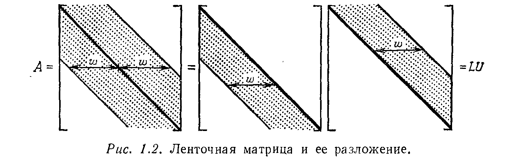

---
**стр. 52**
---

## § 1.6. ЛЕНТОЧНЫЕ МАТРИЦЫ, СИММЕТРИЧЕСКИЕ МАТРИЦЫ И ИХ ПРИМЕНЕНИЯ

В настоящем параграфе мы преследуем две цели. Первая из них — показать на конкретной задаче, каким образом большие системы линейных уравнений возникают на практике. До сих пор в книге не было каких-либо упоминаний о приложениях, так как описание большой и вполне реальной задачи из строительной техники или экономики увело бы нас далеко от основного направления. Но здесь мы выберем другую естественную и важную прикладную задачу, рассмотрение которой не потребует большой подготовки.

Другая цель — проиллюстрировать (на примере той же самой задачи) специальные свойства, которыми часто обладают матрицы коэффициентов. Редко можно встретить матрицу, которая выглядела бы так, как будто она построена случайным образом. Почти всегда матрица имеет некоторые особенности структуры, заметные, как правило, с первого взгляда. Такими особенностями, например, являются симметрия или большое число нулевых элементов. В последнем случае, так как разреженная матрица содержит значительно меньше чем $n^2$ единиц информации, то вычислительной работы также оказывается много меньше, чем для плотной матрицы. Мы, в частности, будем рассматривать специальные свойства *ленточных матриц*, все ненулевые элементы которых сосредоточены около главной диагонали, и изучать, как эти свойства отражаются на процессе исключения.

Наш пример возникает при преобразовании непрерывной задачи в дискретную. Непрерывная задача имеет бесконечно много неизвестных и ее нельзя решить точно на вычислительной машине. Следовательно, ее нужно приближенно заменить некоторой дискретной задачей. При этом, как правило, оказывается, что чем больше неизвестных останется в задаче, тем выше будет ее точность и больше стоимость решения. В качестве весьма простой, но в то же время очень типичной непрерывной задачи, мы выберем дифференциальное уравнение
$$
-\frac{d^2u}{dx^2} = f(x), \qquad 0 \leqslant x \leqslant 1. \eqno(25)
$$

Это линейное уравнение относительно неизвестной функции $u$ со свободным членом $f$. Левая часть уравнения допускает неопределенность, поскольку к любому ее решению $u$ можно добавить произвольную функцию вида $C + Dx$ и результат снова будет решением этой задачи (вторая производная функции $C + Dx$ тождественно равна нулю). Неопределенность, связанная с произвольностью констант $C$ и $D$, устраняется заданием на каждом из концов

---
**стр. 53**
---
интервала «краевых условий»:
$$
u(0) = 0, \qquad u(1) = 0. \eqno(26)
$$
В результате мы приходим к так называемой *двухточечной краевой задаче*, которая описывает не кратковременное, а стационарное явление, например распределение температуры стержня с фиксированными нулевыми значениями на концах и распределенными источниками тепла интенсивности $f(x)$.

Напомним, что наша цель — получить задачу, которая дискретна (конечномерна), или, другими словами, является задачей линейной алгебры. По этим соображениям мы не можем допустить более чем конечное количество информации о функции $f$ и возьмем лишь ее значения в равномерно расположенных точках $x = h$, $x = 2h$, $\dots$, $x = nh$. Нашей задачей будет вычисление приближенных значений $u_1$, $\dots$, $u_n$ точного решения $u$ в перечисленных точках при условии, что на концах отрезка $x = 0$ и $x = 1 = (n + 1)h$ уже заданы точные краевые условия $u_0 = 0$ и $u_{n+1} = 0$.

Прежде всего возникает вопрос, как заменить производную $d^2u/dx^2$? Поскольку каждая производная является пределом разностных отношений, то ее можно аппроксимировать одним из этих отношений при фиксированном значении шага $h$ (или $\Delta x$). Для первой производной имеется три возможности:
$$
\frac{du}{dx} \approx \frac{u(x+h) - u(x)}{h}, \qquad \frac{du}{dx} \approx \frac{u(x) - u(x-h)}{h},
$$
$$
\frac{du}{dx} \approx \frac{u(x+h) - u(x-h)}{2h}. \eqno(27)
$$
Оказывается, что последнее отношение, в силу своей симметрии относительно $x$, является самым лучшим. Для второй же производной существует единственная возможная комбинация, которая использует значения только в точках $x$ и $x \pm h$:
$$
\frac{d^2u}{dx^2} \approx \frac{u(x+h) - 2u(x) + u(x-h)}{h^2}. \eqno(28)
$$
Эта аппроксимация также обладает тем преимуществом, что она симметрична относительно величины $x$. Напомним, что правая часть (28) стремится к точному значению $d^2u/dx^2$ при $h \to 0$, но мы останавливаемся на некотором конкретном значении $h$.

Заменим в стандартных узлах $x = jh$ сетки дифференциальное уравнение $-d^2u/dx^2 = f(x)$ его дискретным аналогом (28) и умножим его на $h^2$:
$$
-u_{j+1} + 2u_j - u_{j-1} = h^2f(jh). \eqno(29)
$$
В результате получим $n$ уравнений такого вида, по одному для каждого из значений $j = 1$, $\dots$, $n$. Первое и последнее из этих уравнений включают величины $u_0$ и $u_{n+1}$, которые не являются

---
**стр. 54**
---
неизвестными, так как их значения определены краевыми условиями. Они переносятся в правые части уравнений и добавляются к свободным членам (в тех случаях, когда не известно заранее, что они равны нулю). Равенство (29) легко интерпретировать как условие стационарного режима, при котором притоки $(u_j - u_{j+1})$ справа и $(u_j - u_{j-1})$ слева уравновешиваются стоком $h^2f(jh)$ в центре.

Структура $n$ уравнений (29) становится виднее, если выписать матричное уравнение $Au = b$ для конкретного значения $h = 1/6$ ($n = 5$):
$$
\begin{bmatrix} 2 & -1 & & & \\ -1 & 2 & -1 & & \\ & -1 & 2 & -1 & \\ & & -1 & 2 & -1 \\ & & & -1 & 2 \end{bmatrix} \begin{bmatrix} u_1 \\ u_2 \\ u_3 \\ u_4 \\ u_5 \end{bmatrix} = h^2 \begin{bmatrix} f(h) \\ f(2h) \\ f(3h) \\ f(4h) \\ f(5h) \end{bmatrix}. \eqno(30)
$$
С этого момента мы будем иметь дело с уравнением (30), и для нас уже несущественно, откуда оно возникло. Какое значение имеет тот факт, что мы построили класс матриц коэффициентов, далеко не произвольного вида, порядок $n$ которых может быть очень большим? Матрица $A$ обладает рядом специальных свойств, одно из которых представляет для нас наибольший интерес: **она является трехдиагональной.** Все ее ненулевые элементы лежат на главной диагонали и на двух прилегающих к ней диагоналях. Иначе говоря, элементы матрицы равны нулю, если разность между номерами их строк и столбцов по модулю больше единицы, т.е. $a_{ij} = 0$ для всех $i$, $j$, таких, что $|i - j| > 1$. Наличие этих нулей вносит огромное упрощение в процесс исключения Гаусса.

Матрица $A$ обладает еще двумя свойствами, которые мы не решаемся обсуждать здесь, но не потому, что они не важны, а именно из-за того, что они слишком важны. Тем не менее мы можем сказать, что это за свойства и какое влияние они оказывают на алгоритм исключения.

**(1)** *Матрица $A$ симметрическая.* Это означает, что каждый элемент $a_{ij}$ с одной стороны от главной диагонали равен своему «зеркальному отражению» $a_{ji}$ с другой стороны от главной диагонали, т.е. $a_{ij} = a_{ji}$ для всех значений $i$, $j$. Другими словами, первый столбец матрицы $A$ совпадает с ее первой строкой, второй столбец — со второй строкой и т.д. Одно следствие этого свойства очевидно: в вычислительной машине достаточно хранить только нижнюю треугольную часть $A$, поскольку ее элементы, стоящие над главной диагональю, можно сразу восстановить по соответствующим элементам, расположенным ниже главной диагонали.

---
**стр. 55**
---
Самым важным, однако, является то обстоятельство, что процесс исключения сохраняет эту симметрию (см. упражнения). Следовательно, *при исключении отсутствует необходимость в вычислении изменений, происходящих над главной диагональю*. Иначе говоря, если мы сохраняем только результаты, получающиеся ниже главной диагонали и, конечно, ведущие элементы, то верхняя треугольная часть восстанавливается по ним автоматически. Таким образом, симметричность матрицы позволяет фактически вдвое уменьшить как требуемую память, так и время, затрачиваемое на вычисления.

Мы обратим внимание на другой результат подобного сорта, для чего *впервые введем индекс* ${}^{\text{T}}$ для обозначения операции *транспонирования* матрицы. Пусть $A$ — некоторая матрица. Тогда замена всех строк матрицы $A$ на столбцы с теми же номерами дает транспонированную к ней матрицу $A^{\text{T}}$. Симметрия матрицы означает, что $A^{\text{T}} = A$, а следствием этого свойства является такое утверждение:

**1M.** *Если матрица $A$ симметрическая и для нее осуществимо разложение $A = LDU$, то столбцы нижней треугольной матрицы $L$ одновременно являются строками матрицы $U$ и наоборот. Иначе говоря, матрица $L$ является зеркальным отражением (или транспонированной к) $U$: $L = U^{\text{T}}$ и $U = L^{\text{T}}$.*

Д о к а з а т е л ь с т в о. Начнем с разложения $A = LDU$ и постараемся выяснить, что произойдет, если мы поменяем местами строки со столбцами. В левой части останется матрица $A$, поскольку предполагается, что она симметрическая. В правой части процесс транспонирования приведет к перемножению отдельно транспонированных матриц $L$, $D$ и $U$, но *в другом порядке* (аналогично обращению). Иначе говоря, мы приходим к формуле $A^{\text{T}} = U^{\text{T}}D^{\text{T}}L^{\text{T}}$. Первый множитель $U^{\text{T}}$ формируется путем замены строк матрицы $U$ на столбцы и, следовательно, является нижней треугольной матрицей. Другие сомножители $D^{\text{T}}$ и $L^{\text{T}}$ соответственно являются диагональной и верхней треугольной матрицами. Таким образом, мы видим, что получено новое «$LDU$-разложение» матрицы $A^{\text{T}} = A$. Но сомножители такого разложения любой матрицы определяются однозначно (см. 1F) и, следовательно, $L = U^{\text{T}}$, $D = D^{\text{T}}$ и $U = L^{\text{T}}$, что и завершает доказательство.

Мы еще вернемся к операции транспонирования в § 3.1, но это доказательство было очень неожиданным введением к очень простой идее.

Перейдем ко второму свойству нашей конечно-разностной матрицы.

---
**стр. 56**
---
**(2)** *Матрица $A$ положительно определена.* Это свойство определяется (только для симметрических матриц) в гл. 6 и данное там определение не имеет ничего общего с методом исключения. Но позже мы покажем, что оно эквивалентно другому определению, которое тесно связано с процессом исключения, а именно: *симметрическая матрица $A$ будет положительно определенной тогда и только тогда, когда все ее ведущие элементы $d_i$ положительны*. Это означает, что нам не потребуется осуществлять перестановки строк, чтобы избежать нулевого ведущего элемента, и исключение можно проводить в обычном порядке без нарушения симметричности, которое в противном случае могло произойти.

Мы знаем, что на практике нужно задавать еще один вопрос относительно ведущих элементов. Они ненулевые, но будут ли они достаточно большими? Ответ на него является другим следствием положительной определенности, с вычислительной точки зрения более важным: для практических вычислений с положительно определенными матрицами перестановки строк не требуются. Множители $L$, $D$ и $U$ не могут иметь больших расхождений с матрицей $A$ в масштабах. Мы сможем в этом убедиться на примере разложения нашей матрицы.

*Замечание.* Сказанное не означает, что здесь нет опасности ошибок округления. Плохо обусловленная матрица
$$
A = \begin{bmatrix} 1 & 1 \\ 1 & 1.0001 \end{bmatrix}
$$
из предыдущего раздела была симметрической и положительно определенной. Такой же была и матрица Гильберта из упражнений. Положительная определенность означает только то, что исключения Гаусса без изменений строк численно так же устойчивы, как и сама матрица.

Оставляя в стороне перечисленные основные свойства матрицы $A$, вернемся к тому факту, что она является трехдиагональной. Какой эффект дает это в процессе исключения? Предположим, что мы провели первый этап процесса исключения и получили нули под первым ведущим элементом:
$$
\begin{bmatrix} 2 & -1 & & & \\ -1 & 2 & -1 & & \\ & -1 & 2 & -1 & \\ & & -1 & 2 & -1 \\ & & & -1 & 2 \end{bmatrix} \longrightarrow \begin{bmatrix} 2 & -1 & & & \\ 0 & \frac{3}{2} & -1 & & \\ & -1 & 2 & -1 & \\ & & -1 & 2 & -1 \\ & & & -1 & 2 \end{bmatrix}.
$$
По сравнению с матрицей общего вида порядка пять здесь имеется два основных упрощения.

---
**стр. 57**
---
(a) Ниже ведущего элемента был только один ненулевой элемент, а в общем случае кратное первой строки нужно вычитать из каждой другой строки;
(b) Эта одна операция исключения была выполнена с очень короткими строками. После того как нужный множитель $l_{21} = -1/2$ был найден, потребовалось только одно действие умножение-вычитание справа от ведущего элемента.
Таким образом, первый этап исключений был очень упрощен наличием нулей в первой строке и первом столбце. Более того, *трехдиагональная структура матрицы сохраняется в течение процесса исключений* (при отсутствии перестановки строк!).
(c) На втором этапе исключения, так же как и на любом последующем, упрощения (a) и (b) сохраняются.

Мы можем представить окончательный результат несколькими способами. Наибольшая наглядность достигается рассмотрением $LDU$-разложения матрицы $A$:
$$
A =
\begin{bmatrix}
1 & & & & \\
-\frac{1}{2} & 1 & & & \\
 & -\frac{2}{3} & 1 & & \\
 & & -\frac{3}{4} & 1 & \\
 & & & -\frac{4}{5} & 1
\end{bmatrix}
\begin{bmatrix}
\frac{2}{1} & & & & \\
 & \frac{3}{2} & & & \\
 & & \frac{4}{3} & & \\
 & & & \frac{5}{4} & \\
 & & & & \frac{6}{5}
\end{bmatrix}
\begin{bmatrix}
1 & -\frac{1}{2} & & & \\
 & 1 & -\frac{2}{3} & & \\
 & & 1 & -\frac{3}{4} & \\
 & & & 1 & -\frac{4}{5} \\
 & & & & 1
\end{bmatrix}.
$$

Замечания (a)—(c) можно сформулировать следующим образом: *сомножители $L$ и $U$ разложения трехдиагональной матрицы являются двухдиагональными матрицами*. Эти сомножители имеют близкую к $A$ структуру расположения нулевых элементов. Заметим также, что $L$ и $U$ транспонированы друг к другу, как и должно было быть в силу симметричности, и ведущие элементы $d_i$ все положительны $^1)$. Очевидно, что при стремлении $n$ к бесконечности ведущие элементы сходятся к $+1$. Такие матрицы доставляют вычислительной машине большое удовольствие.

Перечисленные упрощения приводят к полному пересмотру обычного подсчета числа действий. Каждый шаг исключения требует только двух действий — деления на ведущий элемент и умножения-вычитания из диагонального элемента. Таких шагов исключения около $n$. Следовательно, вместо $n^3/3$ действий *требуется только $2n$*, т. е. объем вычислений является величиной меньшего

$^1)$ Позже будет показано, что произведение ведущих элементов совпадает с **определителем** матрицы $A$. В данном случае $\det A = 6$.

---
**стр. 58**
---
порядка. То же самое справедливо для обратной подстановки — вместо $n^2/2$ действий опять требуется только $2n$. Таким образом, *число действий для системы с трехдиагональной матрицей пропорционально $n$, но не более высокой степени $n$*. Системы $Ax = b$ с трехдиагональными матрицами решаются почти мгновенно.

Рассмотрим более общий случай, когда $A$ — ленточная матрица, т. е. все ее ненулевые элементы лежат внутри ленты, располагающейся параллельно главной диагонали. Ширина ленты или, точнее говоря, *половина ширины ленты*, $w$ определяется следующим образом. Это такое наименьшее из целых чисел, что $a_{ij} = 0$ для всех $|i-j| \geqslant w$ (см. рис. 1.2). Отсюда следует, что ленточ-

ная матрица имеет не более $2w-1$ ненулевых диагоналей — главную диагональ и по $w-1$ дополнительных диагоналей по каждую сторону от нее. Ширина ленты $w=1$ для диагональной матрицы, $w=2$ для трехдиагональной и $w=n$ для плотной матрицы.

Для любой ленточной матрицы справедливы замечания (a)—(c). На первом этапе исключения требуется получить только $w-1$ последовательных нулей ниже ведущего элемента, поскольку все элементы столбца, располагающиеся ниже, уже равны нулю. Более того, так как первая строка имеет не более $w$ ненулевых элементов, то для получения каждого нуля достаточно $w$ действий. Следовательно, первый этап исключения требует $w(w-1)$ действий, причем после его реализации мы опять имеем ленточную матрицу с шириной ленты $w$. Так как всего осуществляется около $n$ этапов, то применение исключений для ленточной матрицы требует около $w^2n$ действий. Опять число действий оказывается пропорциональным величине $n$ и, как мы видим, одновременно пропорционально квадрату величины $w$. Так как при стремлении $w$ к $n$ матрица становится плотной, то и число действий опять становится пропорциональным $n^3$. Более точный подсчет связан с тем обстоятельством, что, когда исключения достигают нижнего правого угла матрицы $A$, ширина ленты становится меньше. Точное число делений и умножений-вычитаний, требуемых для построения $L$, $D$ и $U$ (без предположения симметричности $A$),

---
**стр. 59**
---
вычисляется по формуле $P = \frac{1}{3}w(w-1)(3n-2w+1)$. Для плотной матрицы, когда $w=n$, она принимает вид $P = \frac{1}{3}n(n-1)(n+1)$, т. е. согласуется с уже известной формулой $^1)$. Резюмируем изложенное: ненулевые элементы треугольных сомножителей $L$ и $U$ разложения матрицы $A$ лежат внутри той же самой ленты, а процессы исключения и обратной подстановки реализуются очень быстро.

Это наш последний подсчет числа действий, и мы должны подчеркнуть один важный момент. Для матрицы типа рассмотренного нами примера конечно-разностной матрицы $A$ обратная матрица является плотной. Следовательно, *при решении системы $Ax = b$ гораздо лучше знать матрицы $L$ и $U$, чем матрицу $A^{-1}$*. Умножение вектора $b$ на матрицу $A^{-1}$ требует $n^2$ действий, в то время как $4n$ действий достаточно для решения систем $Lc = b$ и $Ux = c$, т. е. проведения исключения и обратной подстановки, что позволяет получить решение $x = U^{-1}c = U^{-1}L^{-1}b = A^{-1}b$.

Мы надеемся, что последний пример полезен в двух отношениях: он углубляет понимание процесса исключения (который, как мы полагаем, теперь совершенно ясен!) и дает пример системы большого порядка, который действительно встречается на практике. В следующей главе мы вернемся к изучению «теоретической» структуры линейной системы $Ax = b$, а именно к вопросу существования и единственности ее решения $x$.

**Упражнение 1.6.1.** Модифицировать пример, рассмотренный в настоящем разделе, заменив элемент $a_{11} = 2$ на $a_{11} = 1$, и найти $LDU$-разложение новой трехдиагональной матрицы.

**Упражнение 1.6.2.** Для симметрической матрицы
$$
A = \begin{bmatrix}
a & b & c \\
b & d & e \\
c & e & f
\end{bmatrix}
$$
применить процесс исключения для получения нулей в первом столбце под ведущим элементом $a$ и показать, что после этого матрица порядка два в нижнем правом углу остается симметрической. Таким же способом можно показать, что симметричность сохраняется после каждого этапа исключения.

**Упражнение 1.6.3.** Найти матрицу $A$ порядка 5, возникающую при аппроксимации задачи
$$
-\frac{d^2u}{dx^2} = f(x), \quad \frac{du}{dx}(0) = \frac{du}{dx}(1) = 0,
$$

$^1)$ Приятно отметить, что $P$ является целым числом, поскольку хотя бы одно из расположенных рядом чисел $n-1$, $n$ и $n+1$ должно делиться на три.

---
**стр. 60**
---
при замене краевых условий соотношениями $u_0 = u_1$ и $u_6 = u_5$. Показать, что умножение этой матрицы на вектор $[1\ 1\ 1\ 1\ 1]^{\mathrm{T}}$ дает нулевой вектор и, следовательно, матрица $A$ вырожденная. Аналогично показать, что если функция $u(x)$ является решением непрерывной задачи, то функция $u(x)+1$ также является ее решением, т. е. указанные два условия не устраняют неопределенности в члене $C+Dx$ и решение задачи не единственно.

**Упражнение 1.6.4.** При $h=1/4$ и $f(x) = 4\pi^2 \sin 2\pi x$ разностные уравнения (29) могут быть представлены в виде системы
$$
\begin{bmatrix}
2 & -1 & 0 \\
-1 & 2 & -1 \\
0 & -1 & 2
\end{bmatrix}
\begin{bmatrix}
u_1 \\
u_2 \\
u_3
\end{bmatrix}
= \frac{\pi^2}{4}
\begin{bmatrix}
1 \\
0 \\
-1
\end{bmatrix}.
$$
Вычислить значения $u_i$ и найти их погрешность по сравнению с точным решением $u = \sin 2\pi x$ в точках $x=1/4$, $x=1/2$ и $x=3/4$.

ОБЗОРНЫЕ УПРАЖНЕНИЯ

**1.1.** Для матриц
$$
A = \begin{bmatrix} 1 & 0 \\ 1 & 1 \end{bmatrix} \quad \text{и} \quad B = \begin{bmatrix} 1 & 1 \\ 0 & 1 \end{bmatrix}
$$
вычислить матрицы $A+B$ и $AB$.

**1.2.** Для тех же самых матриц вычислить $A^{-1}$, $B^{-1}$ и $(AB)^{-1}$.

**1.3.** С помощью исключения и обратной подстановки решить систему
$$
\begin{aligned}
2u - 3v &= 8, \\
4u - 5v + w &= 15, \\
2u + 4w &= 1.
\end{aligned}
$$

**1.4.** Для матрицы коэффициентов предыдущей системы построить разложение $A=LU$.

**1.5.** Пусть задана система трех уравнений. Какая матрица $E$ осуществляет вычитание второго уравнения из третьего?

**1.6.** Какая матрица $P$ порядка три осуществляет перестановку первого уравнения и третьего?

**1.7.** Какая матрица порядка три умножает второе уравнение на $-1$ и оставляет другие два уравнения без изменения?

**1.8.** С помощью метода исключения определить, имеет ли решение система
$$
\begin{aligned}
u + v + w &= 0, \\
u + 2v + 3w &= 0, \\
3u + 5v + 7w &= 1.
\end{aligned}
$$

**1.9.** С помощью метода исключения и перестановок строк решить систему
$$
\begin{aligned}
u + v - w &= 2, \\
3u + 3v + w &= 2, \\
u + w &= 0.
\end{aligned}
$$

---
**стр. 61**
---
**1.10.** Построить $LU$-разложение матрицы
$$
A = \begin{bmatrix}
1 & 4 & 0 \\
0 & 1 & 0 \\
0 & 3 & 1
\end{bmatrix}.
$$

**1.11.** Найти обратную к матрице
$$
\begin{bmatrix}
2 & 3 \\
3 & 4
\end{bmatrix}.
$$

**1.12.** Является ли матрица порядка три обязательно обратимой, если ни одна из ее строк не пропорциональна ни одной другой? Если это не так, то привести соответствующий пример.

**1.13.** С помощью метода Гаусса — Жордана найти обратную к матрице
$$
A = \begin{bmatrix}
1 & 1 & 0 \\
0 & 1 & 1 \\
0 & 0 & 1
\end{bmatrix}.
$$

**1.14.** Объяснить, почему матрица, обратная к треугольной матрице, тоже является треугольной.

**1.15.** Если $E$ — матрица порядка два, умножение на которую прибавляет первое уравнение ко второму, то какой вид имеет матрица $E^{50}$? Выписать матрицы $E$, $E^{50}$ и $50E$.

**1.16.** Выписать систему с матрицей порядка два, которая имеет бесконечно много решений.
