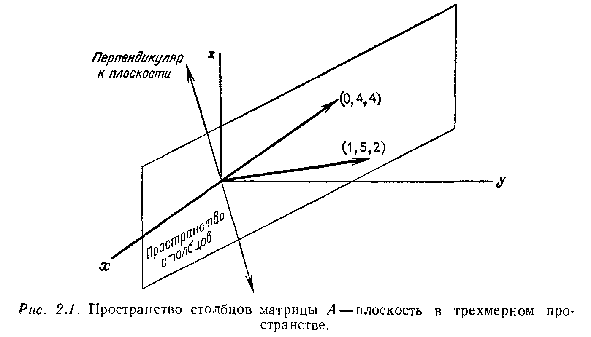

---
**стр. 62**
---

Глава 2

ТЕОРИЯ СИСТЕМ ЛИНЕЙНЫХ УРАВНЕНИЙ

## § 2.1. ВЕКТОРНЫЕ ПРОСТРАНСТВА И ПОДПРОСТРАНСТВА

В предыдущей главе описано, как проводить процесс исключения (по одному элементу) для упрощения линейной системы $Ax = b$. К счастью, этот алгоритм не только облегчает вычисление решения $x$, но и одновременно дает ответ на более теоретические вопросы о его существовании и единственности. Чтобы изучить прямоугольные матрицы столь же хорошо, как и квадратные, нам необходимо посвятить еще один раздел технике исключения. Тогда у нас будут все необходимые нам понятия. Но, концентрируя внимание на отдельных элементах, мы приходим к несколько одностороннему восприятию линейных систем; поэтому главная цель настоящей главы — достичь разностороннего и глубокого понимания проблемы. Нам потребуется понятие *векторного пространства*. Но мы хотим ввести его не с помощью обычной системы аксиом, а на примере трех уравнений с двумя неизвестными:
$$
\begin{bmatrix}
1 & 0 \\
5 & 4 \\
2 & 4
\end{bmatrix}
\begin{bmatrix}
u \\
v
\end{bmatrix}
= \begin{bmatrix}
b_1 \\
b_2 \\
b_3
\end{bmatrix}.
\eqno{(1)}
$$

Если бы неизвестных было больше, чем уравнений, мы могли бы надеяться найти одно или даже бесконечно много решений (хотя это и не всегда так). В данном же случае число уравнений больше чем число неизвестных ($m > n$), и можно ожидать, что здесь, как правило, не будет существовать решения. Система (1) будет разрешима только для некоторых правых частей, т. е. для очень «тонкого» подмножества множества всевозможных трехмерных векторов $b$. Наша задача — выделить это подмножество.
Способ его описания настолько прост, что позволяет полностью его обозреть.

---
**стр. 63**
---
> **2A.** *Система $Ax = b$ разрешима тогда и только тогда, когда вектор $b$ может быть представлен в виде линейной комбинации столбцов матрицы $A$.*

Это описание — не что иное, как переформулировка системы $Ax = b$ в следующем виде:
$$
u \begin{bmatrix} 1 \\ 5 \\ 2 \end{bmatrix}
+ v \begin{bmatrix} 0 \\ 4 \\ 4 \end{bmatrix}
= \begin{bmatrix} b_1 \\ b_2 \\ b_3 \end{bmatrix}.
\eqno{(2)}
$$

Здесь те же самые три уравнения с двумя неизвестными. Но теперь задача выглядит следующим образом: найти такие веса $u$ и $v$, чтобы умножая первый столбец матрицы $A$ на $u$, а второй столбец на $v$ и складывая полученные векторы, в результате получить вектор $b$. Система (1) разрешима, когда такие веса существуют. При этом пара $(u, v)$ представляет собой решение $x$ $^1)$.
Таким образом, подмножество правых частей $b$, для которых система (1) разрешима, есть *множество всех линейных комбинаций столбцов матрицы* $A$. В качестве $b$ можно взять, например, первый столбец этой матрицы; тогда $u = 1$ и $v = 0$. Другая возможность — второй столбец этой матрицы: $u = 0$ и $v = 1$. Третий вариант — правая часть $b$ равна нулю; здесь веса таковы: $u = 0$, $v = 0$ (и при таких тривиальных весах получается $b = 0$ вне зависимости от матрицы коэффициентов).
Теперь мы дадим геометрическое описание этого результата: *система $Ax = b$ разрешима тогда и только тогда, когда вектор $b$ лежит в плоскости, являющейся линейной оболочкой вектор-столбцов матрицы* $A$ (рис. 2.1). Эти векторы являются отрезками прямых, соединяющих начало координат $(0, 0, 0)$ с точками $(1, 5, 2)$ и $(0, 4, 4)$ соответственно. Сама плоскость определяется этими двумя прямыми. Она не ограничивается векторами с положительными компонентами: например, весам $u = -1$, $v = 1$ соответствует $b = (-1, -1, 2)$.
Построенная плоскость иллюстрирует одно из наиболее важных понятий линейной алгебры — понятие векторного пространства. Под *векторным пространством* мы подразумеваем набор векторов, удовлетворяющих следующим двум условиям:
(i) сумма $b + b'$ двух любых векторов $b, b'$ из векторного пространства принадлежит этому пространству;
(ii) произведение любого вектора $b$ из векторного пространства на любой скаляр $c$ также принадлежит этому пространству.

$^1)$ Мы используем здесь слово «веса», как синоним слова «коэффициенты», поэтому веса не обязательно положительны.

---
**стр. 64**
---

Другими словами, множество векторов, лежащих в нашей плоскости, *замкнуто относительно сложения и умножения на скаляр* ^1). Плоскость является подмножеством множества всех трехкомпонентных векторов $b = (b_1, b_2, b_3)$, а это большее множество в свою очередь является векторным пространством, а именно всем трехмерным пространством. Наша плоскость фактически является **подпространством**, т. е. *таким подмножеством векторного пространства, которое само является векторным пространством.* Мы называем ее **пространством столбцов** матрицы $A$, потому что она порождается этими столбцами.

Легко выделить два крайних варианта пространства столбцов матрицы. Первый возникает при нулевой матрице $A = 0$ порядка $n$. Пространство столбцов этой матрицы содержит только один вектор, а именно вектор $(0, 0, \ldots, 0)$. Тем не менее это (не пустое!) векторное пространство, так как сложение и умножение на скаляр не выводят за его пределы. Это *наименьшее из возможных векторных пространств.* Другой крайний вариант дает единичная матрица $A = I$ порядка $n$. Пространством ее столбцов является все $n$-мерное пространство, так как каждый вектор-столбец с $n$ компонентами может быть представлен в виде линейной комбинации столбцов единичной матрицы. Мы предполагаем, что эти компоненты являются вещественными числами, хотя могли бы рассматривать матрицы $A$ и векторы $x$ и $b$ с комплексными компонентами, причем никаких новых проблем здесь не возникло бы.

---
^1) Слово *замкнуто* означает, что эти операции не выводят нас за пределы плоскости. Мы не интересуемся операцией перемножения двух векторов.

---
**стр. 65**
---
Пространство всех вещественных $n$-мерных векторов будем обозначать символом $\mathbf{R}^n$. Плоскость, изображенная на рис. 2.1, является подпространством пространства $\mathbf{R}^3$.

Различие между *подмножеством* и *подпространством* лучше всего пояснить примерами. Некоторые мы приведем сейчас, а остальные позже. При этом в каждом случае должен быть решен вопрос, выполнены ли условия (i) и (ii).

**Пример 1.** Пусть $S$ состоит из всех векторов, кратных заданному векторы $v$, скажем вектору $(1, 4, -2)$. Эти векторы заполняют *прямую в трехмерном пространстве* $\mathbf{R}^3$, которая проходит через начало координат, так как нулевой вектор $0 = 0 \cdot v$ является кратным вектору $v$. Такое подмножество $S$ оказывается подпространством, потому что сумма двух любых векторов, лежащих на этой прямой, как и любое кратное такого вектора, также лежит на этой прямой.

**Пример 2.** Пусть $S$ состоит только из двух векторов $(0, 0, 0)$ и $(1, 0, 0)$. Тогда условие (ii) не выполнено, потому что произведение $5 \cdot (1, 0, 0)$ не принадлежит $S$. Не выполнено также и условие (i): мы можем взять и в качестве $b$, и в качестве $b'$ вектор $(1, 0, 0)$, и тогда их сумма $b + b'$ множеству $S$ не принадлежит.

**Пример 3.** Пусть $S$ состоит из всех векторов, лежащих на прямой, параллельной оси $x$, т. е. $S$ — множество всех векторов, у которых компонента $x$ произвольна, а компоненты $y$ и $z$ фиксированы, скажем $y = 3$ и $z = 4$. Это подмножество тоже не удовлетворяет условиям (i) и (ii), хотя и является прямой. Вектор, равный сумме двух векторов, лежащих на этой прямой, имеет компоненты $y = 6, z = 8$ и, следовательно, лежит на другой прямой. Более того, нулевой вектор не принадлежит $S$, а из условия (ii) следует, что *каждое подпространство должно содержать нулевой вектор.*

Закончим это краткое введение. С геометрической точки зрения здесь трудно было что-либо пропустить, поскольку основные факты отражены на рис. 2.1:

(i) множество векторов $b$, для которых система $Ax = b$ разрешима, образует *двумерное пространство столбцов*; два столбца матрицы $A$ порождают плоскость, причем менее чем два вектора порождать эту плоскость не могут;

(ii) векторы, проходящие через начало координат и перпендикулярные этой плоскости, лежат на одной прямой; эти векторы также образуют подпространство, которое одномерно;

(iii) каждый вектор из трехмерного пространства можно разложить в сумму двух векторов, один из которых лежит в этой

---
**стр. 66**
---
плоскости, а второй перпендикулярен ей, и это разложение единственно ^1).

Из геометрических соображений эти факты более или менее очевидны. Но мы еще не имеем *алгебраического* способа их выражения или проверки, или обобщения на случай системы $m$ уравнений с $n$ неизвестными (другими словами, на $n$ столбцов и $m$-мерное пространство). Это одна из двух целей, которые мы преследуем.

Вторая цель настоящей главы «двойственна» к первой. Мы интересуемся не только правыми частями $b$, для которых разрешима система (1), но и множеством всех решений $x$ для каждого такого вектора $b$. Правая часть $b = 0$ всегда допускает решение $x = 0$, но может существовать бесконечно много других решений. (Мы докажем, что в случае, когда неизвестных больше, чем уравнений ($n \u003e m$), система $Ax = 0$ *должна иметь* решения, отличные от нулевого решения $x = 0$.) *Множество решений системы $Ax = 0$ образует векторное пространство*, называемое **нуль-пространством матрицы $A$**. Оно является подпространством пространства $\mathbf{R}^n$, в то время как пространство столбцов матрицы $A$ было подпространством пространства $\mathbf{R}^m$.

Нетрудно решить систему $Ax = 0$ и, таким образом, найти нуль-пространство матрицы $A$ для приведенного выше примера системы
$$
\begin{bmatrix}
1 \u0026 0 \\
5 \u0026 4 \\
2 \u0026 4
\end{bmatrix}
\begin{bmatrix}
u \\
v
\end{bmatrix}
=
\begin{bmatrix}
0 \\
0 \\
0
\end{bmatrix}.
$$

Первое уравнение дает $u = 0$, а из второго следует, что $v = 0$. Поэтому в данном случае нуль-пространство состоит из единственной точки, а именно из нулевого вектора; только одна комбинация столбцов дает вектор $b = 0$, это комбинация с весами $u = 0, v = 0$.

Ситуация изменится, если мы добавим третий столбец, являющийся линейной комбинацией двух других:
$$
B = \begin{bmatrix}
1 \u0026 0 \u0026 1 \\
5 \u0026 4 \u0026 9 \\
2 \u0026 4 \u0026 6
\end{bmatrix}.
$$

Пространство столбцов матрицы $B$ совпадает с пространством столбцов матрицы $A$, потому что новый столбец лежит в плоскости, изображенной на рис. 2.1. Но нуль-пространство этой новой матрицы $B$ содержит вектор с компонентами $1, 1, -1$, а также

---
^1) Третий пункт менее ясен, чем остальные, и мы вернемся к нему в § 2.5.

---
**стр. 67**
---
любой вектор, кратный этому вектору:
$$
\begin{bmatrix}
1 \u0026 0 \u0026 1 \\
5 \u0026 4 \u0026 9 \\
2 \u0026 4 \u0026 6
\end{bmatrix}
\begin{bmatrix}
c \\
c \\
-c
\end{bmatrix}
=
\begin{bmatrix}
0 \\
0 \\
0
\end{bmatrix}.
$$

Следовательно, нуль-пространство матрицы $B$ представляет собой прямую, содержащую все точки $x = c, y = c, z = -c$, где $c$ пробегает значения от $-\infty$ до $\infty$. Эта прямая проходит через начало координат, как и положено подпространству. Кроме того, перпендикулярное к этому одномерному нуль-пространству пространство (плоскость) оказывается тесно связанным со строками матрицы $B$ и является особенно важным.

Подведем итог: нам нужно для любой системы $Ax = b$ уметь находить все правые части $b$, для которых эта система разрешима, и все решения системы $Ax = 0$. Это значит, что мы должны уметь находить размерности введенных выше подпространств и множества векторов, порождающие их. Мы также надеемся, что к концу наших исследований будем ясно представлять себе все четыре тесно связанные между собой подпространства — пространство столбцов матрицы $A$, ее нуль-пространство и ортогональные к ним подпространства.

**Упражнение 2.1.1.** Показать, что условия (i) и (ii) в определении векторного пространства независимы, установив, что
(a) подмножество двумерного пространства может быть замкнутым относительно операции сложения и даже вычитания, но не замкнутым относительно операции умножения на скаляры;
(b) подмножество двумерного пространства может быть замкнутым относительно операции умножения на скаляры, но не замкнутым относительно операции сложения векторов.

**Упражнение 2.1.2.** Какие из следующих подмножеств являются подпространствами пространства $\mathbf{R}^3$?
(a) Множество векторов из $\mathbf{R}^3$ с первой компонентой $b_1 = 0$.
(b) Множество векторов $b$ с $b_1 = 1$.
(c) Множество векторов $b$ с $b_1 b_2 = 0$ (это множество является объединением двух подпространств: плоскости $b_1 = 0$ и плоскости $b_2 = 0$).
(d) Множество, состоящее из одного вектора $b = (0, 0, 0)$.
(e) Всевозможные линейные комбинации двух векторов $u = (1, 1, 0)$ и $v = (2, 0, 1)$.
(f) Множество векторов $b = (b_1, b_2, b_3)$, компоненты которых удовлетворяют условию $b_3 - b_2 + 3b_1 = 0$.

**Упражнение 2.1.3.** Проверить, что нуль-пространство любой матрицы $A$ является подпространством, т. е. что множество решений системы $Ax = 0$ замкнуто относительно сложения и умножения на скаляры. Привести контрпример для случая $b \neq 0$.

