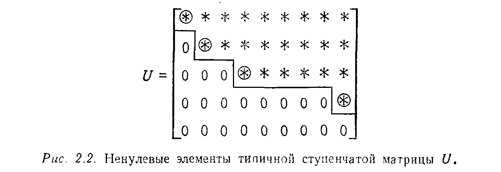

---
**стр. 68**
---

## § 2.2. РЕШЕНИЕ $m$ УРАВНЕНИЙ С $n$ НЕИЗВЕСТНЫМИ

К настоящему моменту процесс исключения для квадратных матриц можно считать достаточно хорошо изученным. Поэтому, чтобы проиллюстрировать новые ситуации, возникающие в случае прямоугольной матрицы, нам будет достаточно одного примера. Сами исключения проводятся без значительных изменений, но, когда дело доходит до получения решения путем обратной подстановки, возникают некоторые различия.

Прежде чем переходить к этому примеру, мы проиллюстрируем различные возникающие тут ситуации на примере простейшего скалярного уравнения $ax = b$. Эта «система» содержит только одно уравнение с одним неизвестным. Очевидно, что здесь имеется три возможности:

(i) Если $a \neq 0$, то для любого $b$ существует решение $x = b/a$, и это решение единственно. Это *невырожденный* случай (обратимая матрица порядка один).
(ii) Если $a = 0$ и $b = 0$, то существует бесконечно много решений, потому что любое число $x$ удовлетворяет уравнению $0 \cdot x = 0$. Это случай *недоопределенной* системы, т. е. решение существует, но не единственно.
(iii) Если $a = 0$, а $b \neq 0$, то решения не существует. Это случай *несовместной* системы.

Выберем теперь менее тривиальный пример. Забыв на время о правой части $b$, будем оперировать только с матрицей
$$
A = \begin{bmatrix}
1 & 3 & 3 & 2 \\
2 & 6 & 9 & 5 \\
-1 & -3 & 3 & 0
\end{bmatrix}
$$
порядка $3 \times 4$. Так как $a_{11} = 1$, то с помощью обычных элементарных операций можно получить нули в первом столбце ниже элемента $a_{11}$:
$$
A \to \begin{bmatrix}
1 & 3 & 3 & 2 \\
0 & 0 & 3 & 1 \\
0 & 0 & 6 & 2
\end{bmatrix}.
$$

Второй элемент во второй строке теперь стал нулевым (элемент $b_{22}$), поэтому мы ищем во втором столбце ниже него ненулевой элемент, намереваясь поменять местами строки. В данном случае все элементы второго столбца, стоящие ниже $b_{22}$, равны нулю. Если бы первоначальная матрица была квадратной, то это означало бы, что она вырожденная. В случае прямоугольной матрицы могут встретиться любые неожиданности, и у нас нет оснований

---
**стр. 69**
---
прекращать процесс исключения. Единственное, что мы можем сделать — это *перейти к следующему столбцу*, где ведущий элемент не равен нулю. Вычитая удвоенную вторую строку из третьей, получим матрицу
$$
U = \begin{bmatrix}
1 & 3 & 3 & 2 \\
0 & 0 & 3 & 1 \\
0 & 0 & 0 & 0
\end{bmatrix}.
$$

Строго говоря, мы должны были бы теперь заняться четвертым столбцом. Однако там мы вновь сталкиваемся с нулем на месте ведущего элемента и ничего больше сделать не можем. Поэтому первый этап исключения завершен.

Окончательная матрица $U$ имеет верхнюю треугольную форму или, более точно, *верхнюю трапецеидальную*, т. е. все ее ненулевые элементы $u_{ij}$ лежат выше главной диагонали, $i \leqslant j$. Легко видеть, что ненулевые элементы преобразованной матрицы занимают область, имеющую форму «ступенек» или «уступов», изображенную на рис. 2.2. Ненулевые ведущие элементы взяты

в кружок. Элементы же, обозначенные просто символом $*$, могут быть как нулевыми, так и ненулевыми.
Проанализируем рис. 2.2:

(i) Ненулевые строки расположены выше нулевых (в противном случае надо было произвести перестановку строк) и каждый ведущий элемент является первым ненулевым элементом в своей строке.
(ii) В каждом столбце все элементы, расположенные ниже ведущего, равны нулю.
(iii) Каждый ведущий элемент лежит правее ведущих элементов предыдущих строк.

**Упражнение 2.2.1.** Ступенчатый вид, изображенный на рис. 2.2, возникает в тех случаях, когда некоторые элементы столбцов — кандидаты на роль ведущих элементов — оказываются равными нулю (такие, как в 3 и 5—8 столб-

---
**стр. 70**
---
цах). Изобразить ступенчатую форму $5 \times 9$-матрицы, у которой нет нулевых ведущих элементов. Показать на примере, что сумма двух матриц ступенчатого вида может уже не иметь ступенчатый вид даже в случае матриц порядка 2, поскольку ведущие элементы могут уничтожить друг другу.

Так как мы начали с матрицы $A$ и закончили матрицей $U$, нетерпеливый читатель обязательно спросит: «Связаны ли эти матрицы посредством нижней треугольной матрицы $L$ соотношением $A = LU$, как раньше?» Вероятно, сомневаться в этом нет причин, поскольку шаги исключения не изменились. На каждом шаге по-прежнему производится вычитание одной строки, умноженной на соответствующее число, из строки, расположенной ниже. Более того, обращение каждого шага выполняется так же, как и раньше, путем прибавления того, что вычиталось. Эти обратные шаги следуют в определенном порядке, что позволяет нам записать их в виде матрицы $L$:
$$
L = \begin{bmatrix}
1 & 0 & 0 \\
2 & 1 & 0 \\
-1 & 2 & 1
\end{bmatrix}.
$$

Читатель легко может проверить, что $A = LU$. Нужно также отметить, что матрица $L$ не прямоугольная, а квадратная. Порядок $m = 3$ этой матрицы равен числу строк в матрицах $A$ и $U$.

В нашем примере не потребовалось осуществлять перестановки строк. Однако в общем случае это необходимо. Как и в § 1.5, это приводит к матрицам перестановки $P$. Если все строки матрицы $A$ переставить до начала исключения, то это даст тот же эффект, что и в соответствующем месте первой главы. Далее, так как мы теперь договорились переходить к следующему столбцу, когда в данном столбце нет ненулевого ведущего элемента, у нас отпала необходимость в предположении, что матрица невырожденная. Этот факт представляет собой основную теорему:

> **2B.** *Для любой матрицы $A$ размера $m \times n$ существуют такие матрица перестановки $P$, нижняя треугольная матрица $L$ с единицами на диагонали и верхняя трапецеидальная матрица $U$, ненулевые элементы которой лежат в области, имеющей ступенчатый вид, что $PA = LU$.*

Теперь наша цель — полностью описать множество всех решений системы $Ax = b$ (если они существуют).
Начнем со случая однородного уравнения с $b = 0$. Тогда, поскольку элементарные операции со строками не оказывают никакого влияния на нули в правой части системы $Ax = 0$, последняя
