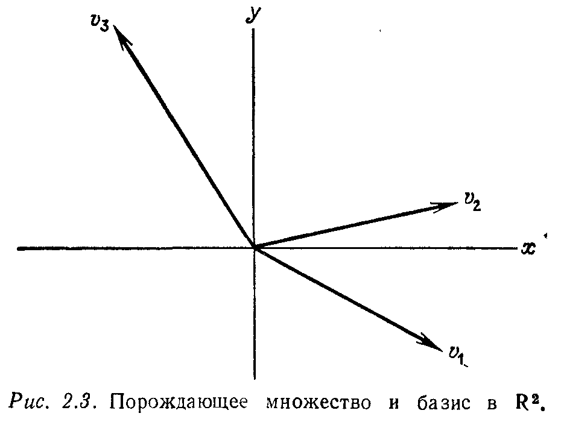

---
**стр. 77**
---
## § 2.3. ЛИНЕЙНАЯ НЕЗАВИСИМОСТЬ, БАЗИС И РАЗМЕРНОСТЬ

Сами по себе числа $m$ и $n$ дают неполную картину истинных размеров линейной системы. Матрица в нашем примере имела три строки и четыре столбца, но фактически третья строка была только комбинацией первых двух. После проведения исключения она переходит в нулевую строку и не оказывает никакого влияния на решение однородной системы $Ax = 0$. Четыре столбца также не могут быть независимыми и пространство столбцов вырождается в двумерную плоскость, потому что второй и четвертый столбцы являются линейными комбинациями первого и третьего.

Важной величиной, которая возникла только в предыдущем параграфе, является ***ранг*** $r$. На стр. 75 ранг был введен чисто вычислительным способом как число ненулевых строк в окончательной матрице $U$. Это определение настолько механическое, что может быть предоставлено вычислительной машине. Но было бы неверно остановиться на нем, потому что ранг имеет простой и наглядный смысл: *он равен числу линейно независимых строк в матрице $A$.*

Наша цель — дать этой и подобным ей величинам определения скорее математические, чем вычислительные.

Для начала определим понятие ***линейной независимости***. Пусть дано множество векторов $v_1, v_2, \ldots, v_k$, и рассматриваются всевозможные их линейные комбинации $c_1 v_1 + c_2 v_2 + \ldots + c_k v_k$. Очевидно, что *тривиальная* комбинация со всеми весами, равными нулю ($c_i = 0, i = 1, \ldots, k$), есть нулевой вектор. Вопрос состоит в том, существуют ли другие линейные комбинации, равные нулевому вектору.

> **2E.** *Если ни одна нетривиальная комбинация векторов $v_1, \ldots, v_k$ не равна нулю, т. е.*
> $$ c_1 v_1 + \ldots + c_k v_k = 0 \Leftrightarrow c_1 = \ldots = c_k = 0, \eqno(6) $$
> *то эти векторы называются **линейно независимыми**. В противном случае эти векторы называются **линейно зависимыми**, и один из них является линейной комбинацией остальных.*

**Пример 1.** Если один из заданных векторов, скажем $v_1$, является нулевым вектором, то множество векторов $v_1, \ldots, v_k$ линейно зависимо. Действительно, мы можем выбрать $c_1 = 3$, а все остальные $c_i$ положить равными 0, $i \neq 1$. Тогда эта нетривиальная линейная комбинация равна нулевому вектору.

---
**стр. 78**
---

**Пример 2**. Три строки матрицы
$$A = \begin{bmatrix} 1 & 3 & 3 & 2 \\ 2 & 6 & 9 & 5 \\ -1 & -3 & 3 & 0 \end{bmatrix}$$
линейно зависимы. Если эти строки обозначить буквами $v_1$, $v_2$ и $v_3$, то $5v_1 - 2v_2 + v_3 = 0$. (Это такая же комбинация, как и полученная ранее для величин $b_1$, $b_2$ и $b_3$, которая должна была равняться нулю, чтобы уравнения системы были совместны; в противном случае третье уравнение системы $Ux = c$ было бы противоречиво.)

**Пример 3**. Строки единичной матрицы порядка $n$
$$I = \begin{bmatrix} 1 & 0 & \dots & 0 \\ 0 & 1 & \dots & 0 \\ \cdot & \cdot & \dots & \cdot \\ \cdot & \cdot & \dots & \cdot \\ \cdot & \cdot & \dots & \cdot \\ 0 & 0 & \dots & 1 \end{bmatrix}$$
линейно независимы. Мы обозначим вектор-строки этой матрицы через $e_1$, $\dots$, $e_n$ соответственно. Они представляют собой единичные векторы в направлении осей координат:
$$e_1 = (1, \ 0, \ \dots, \ 0), \quad \dots, \quad e_n = (0, \ 0, \ \dots, \ 1). \eqno(7)$$
Обычная процедура доказательства линейной независимости этих векторов такова. *Предположим, что некоторая линейная комбинация $c_1 e_1 + \dots + c_n e_n$ векторов $e_1$, $\dots$, $e_n$ равна нулевому вектору, и требуется доказать, что все веса $c_i$, $i=1, \dots, n$, должны быть равны нулю.* В данном случае мы можем просто вычислить, что
$$c_1 e_1 + \dots + c_n e_n = (c_1, \ c_2, \ \dots, \ c_n),$$
и, поскольку эта комбинация является нулевым вектором, что очевидно, $c_i = 0$, $i=1, \dots, n$. Отсюда, так как только тривиальная комбинация дает нулевой вектор, следует, что координатные векторы $e_1$, $\dots$, $e_n$ линейно независимы.

**Пример 4.** Предположим, что матрица $U$ является верхней треугольной матрицей порядка $n$ с ненулевыми элементами на диагонали (ведущими элементами). Тогда строки матрицы $U$ линейно независимы. Для доказательства мы начнем, как и раньше, с предположения о том, что некоторая линейная комбинация строк равна $0$, $c_1 v_1 + \dots + c_n v_n = 0$. Так как $U$ является верхней треугольной матрицей, ее первый столбец имеет только одну не-

---
**стр. 79**
---

нулевую компоненту $u_{11}$. Поэтому первая компонента вектора $c_1 v_1 + \dots + c_n v_n$ равна $c_1 u_{11}$, а так как $c_1 v_1 + \dots + c_n v_n = 0$, то $c_1 u_{11} = 0$ и, следовательно, $c_1 = 0$. Рассматривая далее вторые компоненты, видим, что $c_1 u_{12} + c_2 u_{22} = 0$ и, так как $c_1 = 0$ и $u_{22} \neq 0$, мы получаем $c_2 = 0$. Продолжая таким же образом, легко доказать, что все веса будут равны нулю. Таким образом, только одна тривиальная комбинация дает нулевой вектор, и, следовательно, строки матрицы $U$ линейно независимы.

Те же самые рассуждения применимы и к столбцам матрицы $U$, а именно столбцы с ненулевыми ведущими элементами линейно независимы. Аналогичные рассуждения применимы фактически к любой ступенчатой матрице при условии, что мы рассматриваем только строки (или столбцы) с ненулевыми ведущими элементами.

> **2F.** $r$ *ненулевых строк ступенчатой матрицы $U$ линейно независимы. Линейно независимы также $r$ ее столбцов, которые содержат ведущие элементы.*

Подчеркнем, что понятие линейной независимости не зависит от выбора осей координат. Если заданы $k$ точек в $n$-мерном пространстве, то векторы, выходящие из начала координат и оканчивающиеся в этих точках, либо линейно зависимы, либо линейно независимы, вне зависимости от того, где мы поместим оси координат. Вращение осей может изменить координаты этих векторов, но не окажет никакого влияния на их линейную зависимость или независимость.

С другой стороны, для заданного произвольного множества $v_1, \ \dots, \ v_k$ векторов проверка их зависимости или независимости, очевидно, требует вычислений. Так как мы должны рассматривать линейные комбинации $c_1 v_1 + \dots + c_k v_k$, то естественно будет сформировать матрицу $A$, столбцами которой будут данные векторы. Тогда, если мы через $c$ обозначим вектор весов $c = (c_1, \ \dots, \ c_k)$ и вспомним операцию матричного умножения, то легко убедимся, что
$$Ac = \begin{bmatrix} | & | & & | \\ v_1 & v_2 & \dots & v_k \\ | & | & & | \end{bmatrix} \begin{bmatrix} c_1 \\ c_2 \\ \vdots \\ c_k \end{bmatrix} = c_1 v_1 + \dots + c_k v_k.$$

Следовательно, *векторы $v_1, \ \dots, \ v_k$ линейно зависимы тогда и только тогда, когда существует нетривиальное решение системы $Ac = 0$*. Этот факт устанавливается посредством процесса исключения. Если ранг матрицы $A$ равен $k$, то свободных переменных не будет, нуль-пространство будет содержать только нулевой вектор и, следовательно, векторы будут линейно независимы. Если

---
**стр. 80**
---

же ранг матрицы $A$ меньше, чем $k$, то по крайней мере одна переменная будет свободной. Поэтому ее можно выбрать отличной от нуля и, следовательно, столбцы матрицы $A$, т.е. векторы $v_1, \ \dots, \ v_k$ будут линейно зависимыми.

Один случай особенно важен. Пусть векторы имеют $m$ компонент и $A$ будет прямоугольной матрицей порядка $m \times k$. Предположим, что $k > m$. Тогда матрица $A$ не может иметь ранг $k$, потому что число ненулевых ведущих элементов не может превысить число строк. Ранг должен быть меньше, чем $k$, а однородная система $Ac = 0$, имеющая больше неизвестных, чем уравнений, всегда имеет ненулевое решение $c$.

> **2G.** *Множество $k$ векторов из $\mathbf{R}^m$ обязательно будет линейно зависимо, если $k > m$.*

Читателю нетрудно увидеть здесь иную форму утверждения 2C.

**Пример 5.** Рассмотрим матрицу
$$A = \begin{bmatrix} 1 & 2 & 1 \\ 1 & 3 & 2 \end{bmatrix},$$
имеющую три столбца. В двумерном пространстве $\mathbf{R}^2$ не может быть трех линейно независимых векторов. Чтобы найти комбинацию столбцов, равную нулевому вектору, мы решим систему $Ac = 0$:
$$A \to U = \begin{bmatrix} 1 & 2 & 1 \\ 0 & 1 & 1 \end{bmatrix}.$$
Если присвоить значение $1$ свободной переменной $c_3$, то обратной подстановкой из $Uc = 0$ получим $c_2 = -1$, $c_1 = 1$. Линейная комбинация с этими тремя весами, т.е. первый столбец минус второй плюс третий, равна нулю.

**Упражнение 2.3.1.** Установить, будут или нет линейно независимыми следующие векторы:
$$v_1 = \begin{bmatrix} 1 \\ 1 \\ 0 \\ 0 \end{bmatrix}, \quad v_2 = \begin{bmatrix} 1 \\ 0 \\ 1 \\ 0 \end{bmatrix}, \quad v_3 = \begin{bmatrix} 0 \\ 0 \\ 1 \\ 1 \end{bmatrix}, \quad v_4 = \begin{bmatrix} 0 \\ 1 \\ 0 \\ 1 \end{bmatrix}.$$

**Упражнение 2.3.2.** Установить, будут линейно зависимы или линейно независимы строки матрицы $A$ из примера 5, столбцы которой линейно зависимы.

**Упражнение 2.3.3.** Доказать, что если хотя бы один диагональный элемент матрицы
$$T = \begin{bmatrix} a & b & c \\ 0 & d & e \\ 0 & 0 & f \end{bmatrix}$$
равен нулю, то строки этой матрицы линейно зависимы.

---
**стр. 81**
---

**Упражнение 2.3.4.** Верно ли утверждение, что если векторы $v_1$, $v_2$, $v_3$ линейно независимы, то векторы $w_1 = v_1 + v_2$, $w_2 = v_1 + v_3$, $w_3 = v_2 + v_3$ также линейно независимы? (Указание: предположить, что $c_1 w_1 + c_2 w_2 + c_3 w_3 = 0$, и найти все возможные коэффициенты $c_1$, $c_2$, $c_3$.)

Следующий шаг в обсуждении векторных пространств — определить, что мы понимаем под *множеством векторов, порождающим данное векторное пространство*. Мы использовали этот термин в начале главы, когда говорили о плоскости, которая являлась линейной оболочкой двух столбцов матрицы, и назвали эту плоскость пространством столбцов. Общее определение таково:

> **2H.** *Если векторное пространство $V$ состоит из всех линейных комбинаций векторов $w_1, \ \dots, \ w_l$, то говорят, что эти векторы **порождают** векторное пространство $V$, а само $V$ называют **линейной оболочкой** этих векторов. Другими словами, каждый вектор $v$ из $V$ может быть представлен в виде линейной комбинации векторов $w_1, \ \dots, \ w_l$,*
$$v = c_1 w_1 + \dots + c_l w_l \eqno(8)$$
*с некоторыми коэффициентами $c_i$.*

Такое определение допускает, что для вектора $v$ может существовать несколько наборов коэффициентов $c_i$, т.е. коэффициенты не обязательно единственны, так как порождающее множество векторов может быть слишком большим и даже содержать нулевой вектор.

**Пример 6.** Векторы $w_1 = (1, \ 0, \ 0)$, $w_2 = (0, \ 1, \ 0)$, $w_3 = (-2, \ 0, \ 0)$ порождают плоскость $xy$ в трехмерном пространстве. Ту же плоскость порождают первые два вектора, тогда как векторы $w_1$ и $w_3$ порождают только прямую.

**Пример 7.** *Пространство столбцов* некоторой матрицы $A$ размера $m \times n$ является линейной оболочкой столбцов этой матрицы. Оно служит подпространством $m$-мерного пространства $\mathbf{R}^m$ (конечно, оно может совпадать с $\mathbf{R}^m$). *Пространство строк* матрицы $A$ определяется аналогичным образом. Это подпространство пространства $\mathbf{R}^n$, порождаемое строками матрицы $A$ (мы можем считать строки элементами из $\mathbf{R}^n$, несмотря на то что компоненты записаны горизонтально, а не в виде столбца). Если $m=n$, то как пространство строк, так и пространство столбцов будут подпространствами пространства $\mathbf{R}^n$ и могут даже совпадать.

**Пример 8.** Координатные векторы $e_1 = (1, \ 0, \ \dots, \ 0)$, $\dots$, $e_n = (0, \ \dots, \ 0, \ 1)$ порождают пространство $\mathbf{R}^n$. Для доказательства достаточно показать, как любой вектор $x = (x_1, \ x_2, \ \dots, \ x_n)$ может быть записан в виде линейной комбинации векторов $e_i$, $i=1, \ \dots, \ n$.

---
**стр. 82**
---

Очевидно, что искомыми весами будут сами компоненты $x_i$, $i=1, \ \dots, \ n$, т.е.
$$x = x_1 e_1 + x_2 e_2 + \dots + x_n e_n.$$

В данном примере мы, кроме этого, знаем, что множество векторов $e_1, \ \dots, \ e_n$ является линейно независимым, т.е., грубо говоря, *ни один вектор этого множества не является лишним*. Матрица в примере (5) имеет лишние столбцы, не вносящие ничего нового в пространство столбцов, а здесь порождающее множество векторов имеет минимальный размер. Иначе говоря, если какой-либо вектор $e_i$ будет удален, оставшиеся векторы не будут порождать все $\mathbf{R}^n$. Такое множество векторов называют *базисом*:

> **2I. Базисом** *векторного пространства называют множество векторов, обладающее следующими свойствами:*
> (1) *Оно линейно независимо.*
> (2) *Оно порождает это векторное пространство.*

Сочетание этих двух свойств является основополагающим для теории векторных пространств. Они означают, что каждый вектор $v$ из данного векторного пространства может быть разложен единственным образом в линейную комбинацию базисных векторов, $v = a_1 v_1 + \dots + a_k v_k$. (Такое разложение существует, потому что векторное пространство порождается своим базисом; если же имеется еще одно разложение $v = b_1 v_1 + \dots + b_k v_k$, то, вычитая второе разложение из первого, получим $0 = \sum_{i=1}^k (a_i - b_i) v_i$, откуда в силу линейной независимости векторов $v_1, \ \dots, \ v_k$ имеем $a_i - b_i = 0$, $i=1, \ \dots, \ k$. Следовательно, веса в разложении вектора $v$ по базисным векторам $v_i$ однозначно определяются вектором $v$.)

**Пример 9.** Рассмотрим обычную плоскость $xy$ (рис. 2.3). Вектор $v_1$ сам по себе линейно независим, но не порождает $\mathbf{R}^2$. Три вектора $v_1$, $v_2$, $v_3$, конечно, порождают $\mathbf{R}^2$, но не являются линейно независимыми. Любые два из этих векторов, скажем $v_1$ и $v_2$, обладают обоими свойствами — они порождают $\mathbf{R}^2$ и линейно независимы — и поэтому образуют базис в $\mathbf{R}^2$. Отметим, что *базис векторного пространства не единствен*.

**Пример 10.** Рассмотрим ступенчатую матрицу $U$, соответствующую матрице $A$ из примера 2:
$$U = \begin{bmatrix} 1 & 3 & 3 & 2 \\ 0 & 0 & 3 & 1 \\ 0 & 0 & 0 & 0 \end{bmatrix}.$$

---
**стр. 83**
---

Четыре ее столбца, как всегда, порождают пространство столбцов, но не являются линейно независимыми. Существует много способов выбора базиса в этом пространстве, но мы предпочитаем выбирать его специальным образом: *столбцы, содержащие ведущие элементы* (в данном случае первый и третий, соответствующие базисным переменным), *составляют базис пространства столбцов*. Мы отмечали в утверждении 2F, что эти столбцы линейно независимы, но легко видеть, что они, кроме того, порождают пространство столбцов. В действительности пространство столбцов матрицы $U$ является $xy$-плоскостью в $\mathbf{R}^3$. Заметим также, что первые две строки матрицы $U$ (и вообще ненулевые строки любой ступенчатой матрицы) образуют базис ее пространства строк.

**Упражнение 2.3.5.** Описать словами или изобразить графически в плоскости $xy$ пространство столбцов и пространство строк матрицы $A = \begin{bmatrix} 1 & 2 \\ 3 & 6 \end{bmatrix}$.
Найти базис пространства столбцов.

**Упражнение 2.3.6.** Указав ведущие элементы, найти базис пространства столбцов матрицы
$$U = \begin{bmatrix} 0 & 1 & 4 & 3 \\ 0 & 0 & 2 & -2 \\ 0 & 0 & 0 & 0 \\ 0 & 0 & 0 & 0 \end{bmatrix}.$$
Выразить каждый столбец, не вошедший в базис, в виде линейной комбинации базисных столбцов. Найти также базис пространства строк.

**Упражнение 2.3.7.** Предположим, что мы представляем себе все матрицы порядка $2 \times 2$ как «векторы». Хотя эти матрицы не являются векторами в обычном смысле, но мы определили правила сложения матриц и умножения

---
**стр. 84**
---

матриц на скаляр, и множество матриц замкнуто относительно этих операций. Найти базис в этом векторном пространстве. Какое подпространство порождается множеством всех ступенчатых матриц $U$?

**Упражнение 2.3.8.** Найти два различных базиса в подпространстве всех векторов из $\mathbf{R}^3$, имеющих равные первые две компоненты.

**Упражнение 2.3.9.** Найти контрпример к следующему утверждению: если $v_1, \ \dots, \ v_4$ составляют базис векторного пространства $\mathbf{R}^4$ и если $W$ — подпространство этого пространства, то некоторое подмножество этих базисных векторов будет образовывать базис подпространства $W$.

Несмотря на тот факт, что выбор базиса не единствен, так как его построение может быть осуществлено бесконечно многими способами, существует нечто общее для всех базисов. Это свойство является внутренним свойством самого пространства:

> **2J.** *Любые два базиса векторного пространства $V$ содержат одинаковое число векторов. Это число, фигурирующее во всех базисах и выражающее число «степеней свободы» пространства, называется **размерностью** пространства $V$.*

Конечно, мы должны доказать, что все возможные базисы содержат одно и то же число векторов. Прежде всего мы вернемся к некоторым из рассмотренных примеров и установим размерности соответствующих пространств. Каждый базис плоскости $xy$ на рис. 2.3 содержит два вектора, и размерность этой плоскости равна двум. В общем случае размерность пространства $\mathbf{R}^n$ равна $n$, причем координатные векторы $e_i$, $i = 1, \ \dots, \ n$, образуют удобный базис этого пространства. Пространство строк матрицы $U$ в примере 10 является двумерным подпространством пространства $\mathbf{R}^4$, а ее пространство столбцов является двумерным подпространством пространства $\mathbf{R}^3$. Нулевая матрица $A$ — это исключительный случай, поскольку как пространство ее столбцов, так и пространство ее строк состоит только из одного нулевого вектора пространств $\mathbf{R}^m$ и $\mathbf{R}^n$ соответственно. Мы будем считать, что базисом такого пространства является пустое множество и что его размерность равна нулю.
Сформулируем и докажем теперь теорему, которая эквивалентна утверждению 2J:

> **2K.** *Пусть $v_1, \ \dots, \ v_m$ и $w_1, \ \dots, \ w_n$ — два базиса одного и того же векторного пространства $V$. Тогда $m = n$.*

Доказательство. Предположим, например, что $m < n$, и постараемся прийти к противоречию. Так как векторы $v_1, \ \dots, \ v_m$ образуют базис, то они должны порождать все пространство $V$ и, следовательно, каждый вектор $w_j$, $j = 1, \ \dots, \ n$, может быть записан в виде линейной комбинации векторов $v_i$,
