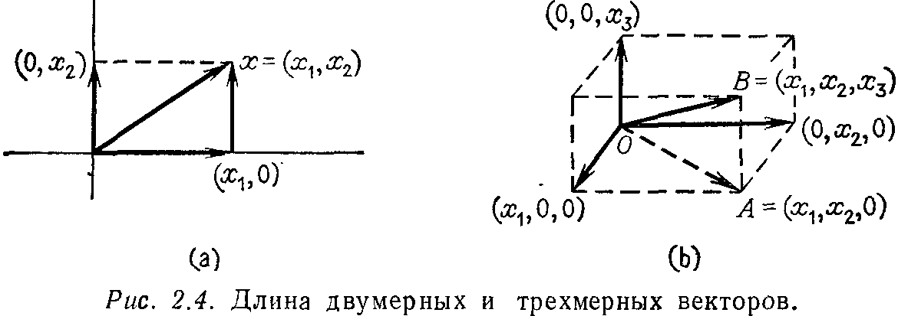
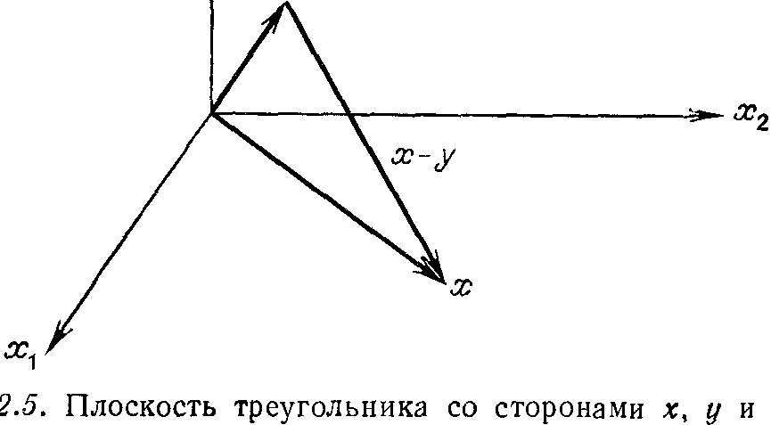

## § 2.5. ОРТОГОНАЛЬНОСТЬ ВЕКТОРОВ И ПОДПРОСТРАНСТВ

---
**стр. 100**
---

Это в точности система $c = A^\mathrm{T} y$, которая, как было доказано, разрешима, и поэтому коэффициенты $y_i$, $i = 1, \dots, n$, можно найти. Такая формула интегрирования существует, потому что многочлены степени $n - 1$ имеют только $n - 1$ корней.

**Упражнение 2.4.10.** Построить нелинейную функцию $y(x)$, которая является взаимно однозначным отображением, но не является отображением «на» и нелинейную функцию $z(x)$, которая является отображением «на», но не является взаимно однозначной.

**Упражнение 2.4.11.** Объяснить, почему для системы с матрицей $A$ условие существования выполнено тогда и только тогда, когда для системы с матрицей $A^\mathrm{T}$ выполнено условие единственности, и наоборот.

**Упражнение 2.4.12.** Построить все возможные левые и правые обратные матрицы для матрицы $A = \begin{bmatrix} 1 & 1 & 0 \end{bmatrix}$ размера $1 \times 3$ и для матрицы $A^\mathrm{T}$.

### § 2.5. ОРТОГОНАЛЬНОСТЬ ВЕКТОРОВ И ПОДПРОСТРАНСТВ

Мы начнем этот параграф с определения длины вектора. В двумерном случае эта длина $\|x\|$ является длиной гипотенузы прямоугольного треугольника (рис. 2.4a), которая была вычис-

лена много лет назад Пифагором $^1)$: $\|x\|^2 = x_1^2 + x_2^2$. В трехмерном пространстве вектор $x = (x_1, x_2, x_3)$ является диагональю параллелепипеда (рис. 2.4б), и его длина находится с помощью *двух* применений формулы Пифагора. Сначала рассматривается диагональ $OA = (x_1, x_2, 0)$ в основании параллелепипеда, где по формуле Пифагора $OA^2 = x_1^2 + x_2^2$. Эта диагональ образует прямой угол с вертикальной стороной $(0, 0, x_3)$. Поэтому мы можем вновь воспользоваться формулой Пифагора (в плоскости $OA$ и $AB$).

$^1)$ Или, возможно, египтянами, но настоящее доказательство принадлежит пифагорейцам.

---
**стр. 101**
---

Гипотенуза прямоугольного треугольника $OAB$ имеет длину $\|x\|$, равную $\sqrt{\overline{OA}^2 + \overline{AB}^2}$, т. е.
$$
\|x\|^2 = \overline{OA}^2 + \overline{AB}^2 = x_1^2 + x_2^2 + x_3^2.
$$
Обобщение понятия длины для $n$-мерного вектора $x = (x_1, \dots, x_n)$ очевидно. *Длиной $\|x\|$ вектора $x$ из $\mathbf{R}^n$ называется положительный квадратный корень из суммы квадратов его компонент, т. е.*
$$
\|x\| = \sqrt{x_1^2 + x_2^2 + \dots + x_n^2}. \tag{12}
$$
Геометрическое доказательство этого факта состоит в применении формулы Пифагора $n - 1$ раз, добавляя каждый раз по одной компоненте. В случае размерности единица ($n = 1$) длина вектора равна абсолютной величине единственной компоненты $x_1$.

Предположим, что заданы два вектора $x$ и $y$ (рис. 2.5). Каким образом можно определить, будут ли эти векторы перпендику-

лярными? Иначе говоря, что является критерием ортогональности? В случае двумерной плоскости ответ на этот вопрос может быть дан с помощью тригонометрии. Нам же нужно обобщение на $n$-мерный случай, но и тогда мы можем действовать в плоскости, порождаемой векторами $x$ и $y$. На этой плоскости вектор $x$ ортогонален к вектору $y$, если они образуют прямоугольный треугольник, и, следовательно, мы можем использовать в качестве критерия формулу Пифагора
$$
\|x\|^2 + \|y\|^2 = \|x - y\|^2. \tag{13}
$$

---
**стр. 102**
---

Используя это условие совместно с формулой (12), получаем, что
$$
(x_1^2 + \dots + x_n^2) + (y_1^2 + \dots + y_n^2) = (x_1 - y_1)^2 + \dots + (x_n - y_n)^2.
$$
Правая часть последнего равенства в точности равна выражению
$$
(x_1^2 + \dots + x_n^2) - 2(x_1 y_1 + \dots + x_n y_n) + (y_1^2 + \dots + y_n^2).
$$
*Поэтому условие (13) выполняется, а значит, векторы $x$ и $y$ ортогональны, когда сумма «перекрестных членов» равна нулю, т. е.*
$$
x_1 y_1 + \dots + x_n y_n = 0. \tag{14}
$$
Заметим, что эта величина в точности совпадает с произведением вектор-строки $x^\mathrm{T}$ на вектор-столбец $y$ (как матриц):
$$
x^\mathrm{T} y = [x_1 \dots x_n]
\begin{bmatrix}
y_1 \\
\cdot \\
\cdot \\
\cdot \\
y_n
\end{bmatrix}
= x_1 y_1 + \dots + x_n y_n. \tag{15}
$$
Используя сокращенное обозначение для суммы, правую часть (15) можно записать как $\sum x_i y_i$. Это выражение появляется при обсуждении любого вопроса, связанного с геометрией $n$-мерного пространства. Оно называется скалярным произведением двух векторов и обозначается символом $(x, y)$ или $x \cdot y$, но мы предпочитаем сохранить обозначение $x^\mathrm{T} y$:

> **2R.** *Величина $x^\mathrm{T} y$ является скалярным произведением векторов (столбцов) $x$ и $y$ из $\mathbf{R}^n$. Она равна нулю тогда и только тогда, когда векторы $x$ и $y$ ортогональны.*

Отметим, что понятия длины и скалярного произведения связаны между собой следующим образом: $x^\mathrm{T} x = x_1^2 + \dots + x_n^2 = \|x\|^2$. Существует только один вектор длины нуль, другими словами, только один вектор ортогонален сам себе — это нулевой вектор. Нулевой вектор ортогонален также каждому вектору $y \in \mathbf{R}^n$.

**Упражнение 2.5.1.** Найти длины и скалярное произведение векторов $x = (1, 4, 0, 2)^\mathrm{T}$ и $y = (2, -2, 1, 3)^\mathrm{T}$.

Мы показали, что *векторы $x$ и $y$ ортогональны тогда и только тогда, когда их скалярное произведение равно нулю*. В следующей главе скалярное произведение будет обсуждаться в большем объеме $^1)$. Там мы будем интересоваться и неортогональными векторами, так как скалярное произведение дает естественное опре-

$^1)$ Точнее, мы будем рассматривать его под другим углом зрения.

---
**стр. 103**
---

деление косинуса в $n$-мерном пространстве и определяет угол между любыми двумя векторами. В этом параграфе, однако, основной целью по-прежнему остается изучение четырех основных подпространств, причем свойство, которое нас интересует — ортогональность.

Прежде всего, между линейной независимостью и ортогональностью существует простая связь: *если ненулевые векторы $v_1, \dots, v_k$ взаимно ортогональны (каждый вектор ортогонален любому другому), то они линейно независимы*.

Д о к а з а т е л ь с т в о. Предположим, что $c_1 v_1 + \dots + c_k v_k = 0$. Чтобы показать, что любой коэффициент $c_i$ должен равняться нулю, возьмем скалярное произведение обеих частей на вектор $v_i$:
$$
v_i^\mathrm{T} (c_1 v_1 + \dots + c_k v_k) = v_i^\mathrm{T} 0 = 0. \tag{16}
$$
Из взаимной ортогональности векторов $v_i$ следует, что в левой части (16) остается только один член: $c_i v_i^\mathrm{T} v_i$. Так как векторы $v_i$ по предположению ненулевые, то $v_i^\mathrm{T} v_i \neq 0$ и, следовательно, $c_i = 0$. Таким образом, существует только одна линейная комбинация векторов $v_i$, $i = 1, \dots, k$, равная нулю, — это тривиальная комбинация со всеми $c_i = 0$. Поэтому векторы $v_1, \dots, v_k$ линейно независимы.

Наиболее важным примером взаимно ортогональных векторов является множество координатных векторов $e_1, \dots, e_n$ в $\mathbf{R}^n$. Они представляют собой столбцы единичной матрицы и составляют простейший базис пространства $\mathbf{R}^n$. Кроме того, они являются *единичными* векторами, т. е. длина каждого вектора $e_i$, $i = 1, \dots, n$, равна единице, $\|e_i\| = 1$. Геометрически эти векторы указывают направления координатных осей. Если систему векторов $e_1, \dots, e_n$ повернуть, то мы получим новое ортонормированное множество векторов, т. е. новую систему взаимно ортогональных единичных векторов. В плоскости такое вращение дает ортонормированную пару векторов
$$
v_1 = (\cos\theta, \ \sin\theta), \qquad v_2 = (-\sin\theta, \ \cos\theta).
$$

**Упражнение 2.5.2.** Привести пример линейно независимых векторов из $\mathbf{R}^2$, не являющихся взаимно ортогональными, доказав тем самым, что утверждение, обратное предыдущей теореме, не верно. Привести также пример взаимно ортогональных векторов, которые не являются линейно независимыми, потому что нарушены условия теоремы.

**Упражнение 2.5.3.** Известно, что две прямые на плоскости перпендикулярны, когда произведение тангенсов углов их наклона равно $-1$. Применить это свойство к векторам $x = (x_1, x_2)$ и $y = (y_1, y_2)$, у которых тангенсы углов наклона соответственно равны $x_2/x_1$ и $y_2/y_1$, для того чтобы вновь вывести условие ортогональности $x^\mathrm{T} y = 0$.

**Упражнение 2.5.4.** Почему $i$-я строка матрицы $B$ должна быть ортогональна $j$-му столбцу матрицы $B^{-1}$, если $i \neq j$?

---
**стр. 104**
---

**Упражнение 2.5.5.** Какие пары из следующих трех векторов
$$
v_1 = \begin{bmatrix} 1 \\ 2 \\ -2 \\ 1 \end{bmatrix}, \qquad
v_2 = \begin{bmatrix} 4 \\ 0 \\ 4 \\ 0 \end{bmatrix}, \qquad
v_3 = \begin{bmatrix} 1 \\ -1 \\ -1 \\ -1 \end{bmatrix}
$$
ортогональны?

**Упражнение 2.5.6.** В $\mathbf{R}^3$ найти все векторы, ортогональные как к вектору $(1, 1, 1)$, так и к вектору $(1, -1, 0)$. Построить, используя эти векторы, систему взаимно ортогональных единичных векторов (ортонормированную систему) в $\mathbf{R}^3$.

ОРТОГОНАЛЬНЫЕ ПОДПРОСТРАНСТВА

Перейдем далее к понятию ортогональности двух подпространств. В обычном трехмерном пространстве все подпространства исчерпываются прямыми и плоскостями, проходящими через начало координат, и двумя «экстремальными» подпространствами — подпространством, состоящим только из одного нулевого вектора, и всем пространством $\mathbf{R}^3$. Подпространство $\{0\}$ ортогонально ко всем подпространствам. Прямая может быть ортогональна как к другой прямой, так и к плоскости, но плоскость не может быть ортогональна к плоскости $^1)$, а все пространство $\mathbf{R}^3$ ортогонально только к нулевому подпространству $\{0\}$.
В $n$-мерном случае основное определение таково:

> **2S.** *Два подпространства $V$ и $W$ одного и того же пространства $\mathbf{R}^n$ называются ортогональными, если любой вектор $v \in V$ ортогонален любому вектору $w \in W$, т. е. $v^\mathrm{T} w = 0$ для всех $v \in V$ и $w \in W$.*

**Пример.** Предположим, что $V$ является плоскостью, порожденной векторами $v_1 = (1, 0, 0, 0)$ и $v_2 = (1, 1, 0, 0)$, а $W$ — прямая, порожденная вектором $w_1 = (0, 0, 4, 5)$. Тогда, так как вектор $w_1$ ортогонален как к вектору $v_1$, так и к вектору $v_2$, прямая $W$ будет ортогональна к плоскости $V$.

**Упражнение 2.5.7.** В предыдущем примере найти вектор $w_2$, такой, что плоскость $W$, порожденная векторами $w_1$ и $w_2$, ортогональна плоскости $V$. Найти также $v_3$, такой, что трехмерное подпространство, порожденное векторами $v_1$, $v_2$, $v_3$, ортогонально к исходной прямой $W$.

**Упражнение 2.5.8.** Показать, что если подпространства $V$ и $W$ ортогональны, то они имеют только один общий вектор, а именно нулевой вектор, т. е. $V \cap W = \{0\}$.

$^1)$ Я должен признаться, что фронтальная и боковая стены очень похожи на перпендикулярные плоскости в $\mathbf{R}^3$. Но по нашему определению это не так! В этих плоскостях существуют прямые $v$ и $w$, пересекающиеся не под прямым углом.

---
**стр. 105**
---

Объясним теперь, зачем нам понадобилась ортогональность подпространств. Напомним, что два из четырех основных подпространств, связанных с некоторой матрицей $A$, являются подпространствами пространства $\mathbf{R}^n$ — нуль-пространство $\mathfrak{N}(A)$ и пространство строк $\mathfrak{R}(A^\mathrm{T})$, а два других лежат в $\mathbf{R}^m$. Наиболее важный факт об этих пространствах, помимо их размерности, — это то, что они ортогональны:

> **2T.** *Для любой матрицы размера $m \times n$ нуль-пространство $\mathfrak{N}(A)$ и пространство строк $\mathfrak{R}(A^\mathrm{T})$ являются ортогональными подпространствами в $\mathbf{R}^n$. Аналогично левое нуль-пространство $\mathfrak{N}(A^\mathrm{T})$ и пространство столбцов $\mathfrak{R}(A)$ являются ортогональными подпространствами в $\mathbf{R}^m$.*

Первое доказательство. Предположим, что $w$ — произвольный вектор из нуль-пространства $\mathfrak{N}(A)$. Тогда $Aw = 0$, причем эта система $m$ уравнений может быть записана более подробно:
$$
Aw = \begin{bmatrix}
\text{строка } 1 & \dots \\
\text{строка } 2 & \dots \\
\cdot \\
\cdot \\
\cdot \\
\text{строка } m & \dots
\end{bmatrix}
\begin{bmatrix}
w_1 \\
w_2 \\
\cdot \\
\cdot \\
\cdot \\
w_n
\end{bmatrix}
=
\begin{bmatrix}
0 \\
0 \\
\cdot \\
\cdot \\
\cdot \\
0
\end{bmatrix}. \tag{17}
$$

Первое уравнение означает, что вектор $w$ ортогонален к первой строке матрицы $A$ или, более правильно (сохраняя соглашение понимать под вектором вектор-столбец), к первому столбцу матрицы $A^\mathrm{T}$. Второе уравнение утверждает ортогональность вектора $w$ ко второму столбцу матрицы $A^\mathrm{T}$. Продолжая аналогичные рассуждения, установим, что вектор $w$ ортогонален к каждому столбцу матрицы $A^\mathrm{T}$. Следовательно, он ортогонален ко всему пространству, порожденному этими столбцами, или, иначе говоря, к каждому вектору $v$ из пространства столбцов матрицы $A^\mathrm{T}$. Это верно для любого вектора $w$ из нуль-пространства, и, следовательно, $\mathfrak{N}(A) \perp \mathfrak{R}(A^\mathrm{T})$. Второе утверждение в теореме об ортогональности $\mathfrak{N}(A^\mathrm{T}) \perp \mathfrak{R}(A)$ совпадает с первым, если его применить к матрице $A^\mathrm{T}$. (Первое утверждение было доказано для любых матриц, включая и транспонированную к любой заданной матрице $A$.) С другой стороны, мы можем начать с любого вектора $y$ из левого нуль-пространства, и, используя
