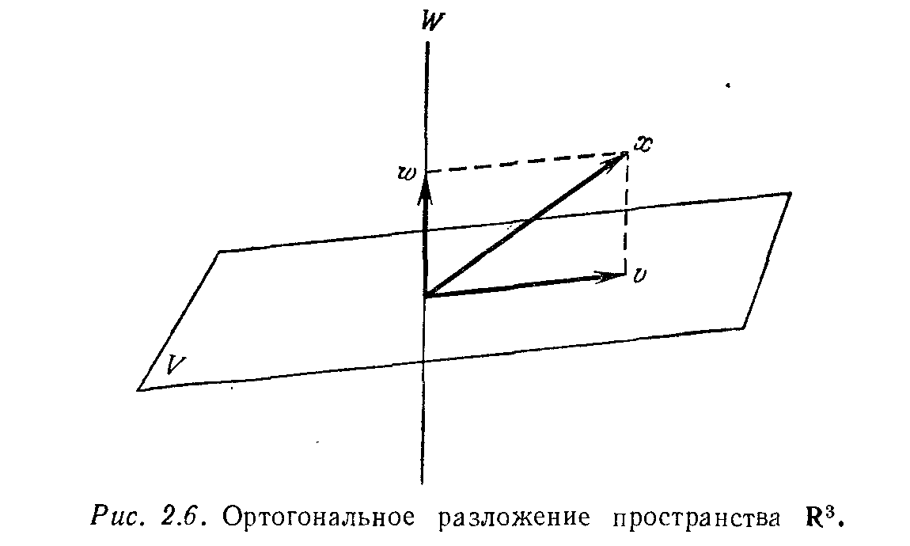
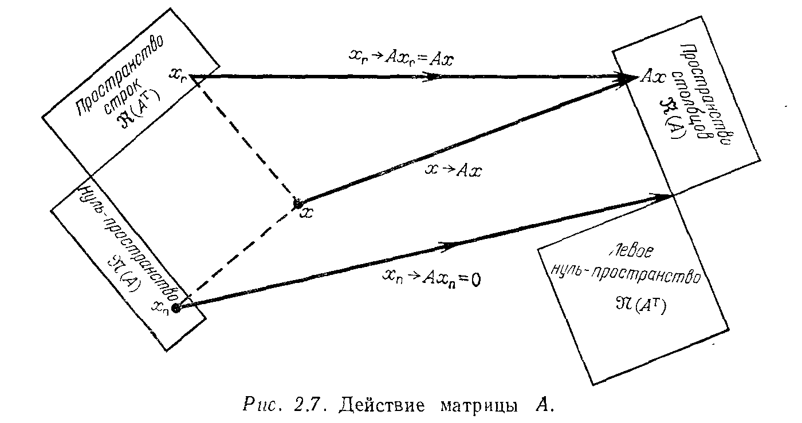
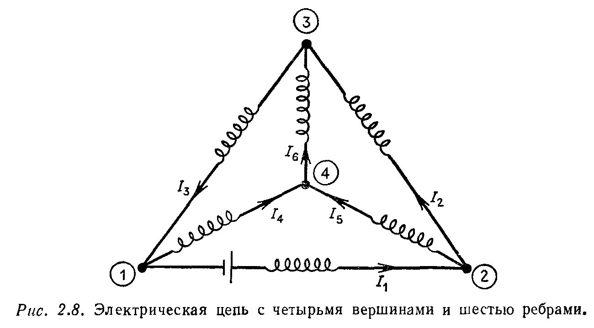

## § 2.5. ОРТОГОНАЛЬНОСТЬ ВЕКТОРОВ И ПОДПРОСТРАНСТВ

---
**стр. 100**
---

Это в точности система $c = A^\mathrm{T} y$, которая, как было доказано, разрешима, и поэтому коэффициенты $y_i$, $i = 1, \dots, n$, можно найти. Такая формула интегрирования существует, потому что многочлены степени $n - 1$ имеют только $n - 1$ корней.

**Упражнение 2.4.10.** Построить нелинейную функцию $y(x)$, которая является взаимно однозначным отображением, но не является отображением «на» и нелинейную функцию $z(x)$, которая является отображением «на», но не является взаимно однозначной.

**Упражнение 2.4.11.** Объяснить, почему для системы с матрицей $A$ условие существования выполнено тогда и только тогда, когда для системы с матрицей $A^\mathrm{T}$ выполнено условие единственности, и наоборот.

**Упражнение 2.4.12.** Построить все возможные левые и правые обратные матрицы для матрицы $A = \begin{bmatrix} 1 & 1 & 0 \end{bmatrix}$ размера $1 \times 3$ и для матрицы $A^\mathrm{T}$.

### § 2.5. ОРТОГОНАЛЬНОСТЬ ВЕКТОРОВ И ПОДПРОСТРАНСТВ

Мы начнем этот параграф с определения длины вектора. В двумерном случае эта длина $\|x\|$ является длиной гипотенузы прямоугольного треугольника (рис. 2.4a), которая была вычис-

лена много лет назад Пифагором $^1)$: $\|x\|^2 = x_1^2 + x_2^2$. В трехмерном пространстве вектор $x = (x_1, x_2, x_3)$ является диагональю параллелепипеда (рис. 2.4б), и его длина находится с помощью *двух* применений формулы Пифагора. Сначала рассматривается диагональ $OA = (x_1, x_2, 0)$ в основании параллелепипеда, где по формуле Пифагора $OA^2 = x_1^2 + x_2^2$. Эта диагональ образует прямой угол с вертикальной стороной $(0, 0, x_3)$. Поэтому мы можем вновь воспользоваться формулой Пифагора (в плоскости $OA$ и $AB$).

$^1)$ Или, возможно, египтянами, но настоящее доказательство принадлежит пифагорейцам.

---
**стр. 101**
---

Гипотенуза прямоугольного треугольника $OAB$ имеет длину $\|x\|$, равную $\sqrt{\overline{OA}^2 + \overline{AB}^2}$, т. е.
$$
\|x\|^2 = \overline{OA}^2 + \overline{AB}^2 = x_1^2 + x_2^2 + x_3^2.
$$
Обобщение понятия длины для $n$-мерного вектора $x = (x_1, \dots, x_n)$ очевидно. *Длиной $\|x\|$ вектора $x$ из $\mathbf{R}^n$ называется положительный квадратный корень из суммы квадратов его компонент, т. е.*
$$
\|x\| = \sqrt{x_1^2 + x_2^2 + \dots + x_n^2}. \tag{12}
$$
Геометрическое доказательство этого факта состоит в применении формулы Пифагора $n - 1$ раз, добавляя каждый раз по одной компоненте. В случае размерности единица ($n = 1$) длина вектора равна абсолютной величине единственной компоненты $x_1$.

Предположим, что заданы два вектора $x$ и $y$ (рис. 2.5). Каким образом можно определить, будут ли эти векторы перпендику-

лярными? Иначе говоря, что является критерием ортогональности? В случае двумерной плоскости ответ на этот вопрос может быть дан с помощью тригонометрии. Нам же нужно обобщение на $n$-мерный случай, но и тогда мы можем действовать в плоскости, порождаемой векторами $x$ и $y$. На этой плоскости вектор $x$ ортогонален к вектору $y$, если они образуют прямоугольный треугольник, и, следовательно, мы можем использовать в качестве критерия формулу Пифагора
$$
\|x\|^2 + \|y\|^2 = \|x - y\|^2. \tag{13}
$$

---
**стр. 102**
---

Используя это условие совместно с формулой (12), получаем, что
$$
(x_1^2 + \dots + x_n^2) + (y_1^2 + \dots + y_n^2) = (x_1 - y_1)^2 + \dots + (x_n - y_n)^2.
$$
Правая часть последнего равенства в точности равна выражению
$$
(x_1^2 + \dots + x_n^2) - 2(x_1 y_1 + \dots + x_n y_n) + (y_1^2 + \dots + y_n^2).
$$
*Поэтому условие (13) выполняется, а значит, векторы $x$ и $y$ ортогональны, когда сумма «перекрестных членов» равна нулю, т. е.*
$$
x_1 y_1 + \dots + x_n y_n = 0. \tag{14}
$$
Заметим, что эта величина в точности совпадает с произведением вектор-строки $x^\mathrm{T}$ на вектор-столбец $y$ (как матриц):
$$
x^\mathrm{T} y = [x_1 \dots x_n]
\begin{bmatrix}
y_1 \\
\cdot \\
\cdot \\
\cdot \\
y_n
\end{bmatrix}
= x_1 y_1 + \dots + x_n y_n. \tag{15}
$$
Используя сокращенное обозначение для суммы, правую часть (15) можно записать как $\sum x_i y_i$. Это выражение появляется при обсуждении любого вопроса, связанного с геометрией $n$-мерного пространства. Оно называется скалярным произведением двух векторов и обозначается символом $(x, y)$ или $x \cdot y$, но мы предпочитаем сохранить обозначение $x^\mathrm{T} y$:

> **2R.** *Величина $x^\mathrm{T} y$ является скалярным произведением векторов (столбцов) $x$ и $y$ из $\mathbf{R}^n$. Она равна нулю тогда и только тогда, когда векторы $x$ и $y$ ортогональны.*

Отметим, что понятия длины и скалярного произведения связаны между собой следующим образом: $x^\mathrm{T} x = x_1^2 + \dots + x_n^2 = \|x\|^2$. Существует только один вектор длины нуль, другими словами, только один вектор ортогонален сам себе — это нулевой вектор. Нулевой вектор ортогонален также каждому вектору $y \in \mathbf{R}^n$.

**Упражнение 2.5.1.** Найти длины и скалярное произведение векторов $x = (1, 4, 0, 2)^\mathrm{T}$ и $y = (2, -2, 1, 3)^\mathrm{T}$.

Мы показали, что *векторы $x$ и $y$ ортогональны тогда и только тогда, когда их скалярное произведение равно нулю*. В следующей главе скалярное произведение будет обсуждаться в большем объеме $^1)$. Там мы будем интересоваться и неортогональными векторами, так как скалярное произведение дает естественное опре-

$^1)$ Точнее, мы будем рассматривать его под другим углом зрения.

---
**стр. 103**
---

деление косинуса в $n$-мерном пространстве и определяет угол между любыми двумя векторами. В этом параграфе, однако, основной целью по-прежнему остается изучение четырех основных подпространств, причем свойство, которое нас интересует — ортогональность.

Прежде всего, между линейной независимостью и ортогональностью существует простая связь: *если ненулевые векторы $v_1, \dots, v_k$ взаимно ортогональны (каждый вектор ортогонален любому другому), то они линейно независимы*.

Д о к а з а т е л ь с т в о. Предположим, что $c_1 v_1 + \dots + c_k v_k = 0$. Чтобы показать, что любой коэффициент $c_i$ должен равняться нулю, возьмем скалярное произведение обеих частей на вектор $v_i$:
$$
v_i^\mathrm{T} (c_1 v_1 + \dots + c_k v_k) = v_i^\mathrm{T} 0 = 0. \tag{16}
$$
Из взаимной ортогональности векторов $v_i$ следует, что в левой части (16) остается только один член: $c_i v_i^\mathrm{T} v_i$. Так как векторы $v_i$ по предположению ненулевые, то $v_i^\mathrm{T} v_i \neq 0$ и, следовательно, $c_i = 0$. Таким образом, существует только одна линейная комбинация векторов $v_i$, $i = 1, \dots, k$, равная нулю, — это тривиальная комбинация со всеми $c_i = 0$. Поэтому векторы $v_1, \dots, v_k$ линейно независимы.

Наиболее важным примером взаимно ортогональных векторов является множество координатных векторов $e_1, \dots, e_n$ в $\mathbf{R}^n$. Они представляют собой столбцы единичной матрицы и составляют простейший базис пространства $\mathbf{R}^n$. Кроме того, они являются *единичными* векторами, т. е. длина каждого вектора $e_i$, $i = 1, \dots, n$, равна единице, $\|e_i\| = 1$. Геометрически эти векторы указывают направления координатных осей. Если систему векторов $e_1, \dots, e_n$ повернуть, то мы получим новое ортонормированное множество векторов, т. е. новую систему взаимно ортогональных единичных векторов. В плоскости такое вращение дает ортонормированную пару векторов
$$
v_1 = (\cos\theta, \ \sin\theta), \qquad v_2 = (-\sin\theta, \ \cos\theta).
$$

**Упражнение 2.5.2.** Привести пример линейно независимых векторов из $\mathbf{R}^2$, не являющихся взаимно ортогональными, доказав тем самым, что утверждение, обратное предыдущей теореме, не верно. Привести также пример взаимно ортогональных векторов, которые не являются линейно независимыми, потому что нарушены условия теоремы.

**Упражнение 2.5.3.** Известно, что две прямые на плоскости перпендикулярны, когда произведение тангенсов углов их наклона равно $-1$. Применить это свойство к векторам $x = (x_1, x_2)$ и $y = (y_1, y_2)$, у которых тангенсы углов наклона соответственно равны $x_2/x_1$ и $y_2/y_1$, для того чтобы вновь вывести условие ортогональности $x^\mathrm{T} y = 0$.

**Упражнение 2.5.4.** Почему $i$-я строка матрицы $B$ должна быть ортогональна $j$-му столбцу матрицы $B^{-1}$, если $i \neq j$?

---
**стр. 104**
---

**Упражнение 2.5.5.** Какие пары из следующих трех векторов
$$
v_1 = \begin{bmatrix} 1 \\ 2 \\ -2 \\ 1 \end{bmatrix}, \qquad
v_2 = \begin{bmatrix} 4 \\ 0 \\ 4 \\ 0 \end{bmatrix}, \qquad
v_3 = \begin{bmatrix} 1 \\ -1 \\ -1 \\ -1 \end{bmatrix}
$$
ортогональны?

**Упражнение 2.5.6.** В $\mathbf{R}^3$ найти все векторы, ортогональные как к вектору $(1, 1, 1)$, так и к вектору $(1, -1, 0)$. Построить, используя эти векторы, систему взаимно ортогональных единичных векторов (ортонормированную систему) в $\mathbf{R}^3$.

ОРТОГОНАЛЬНЫЕ ПОДПРОСТРАНСТВА

Перейдем далее к понятию ортогональности двух подпространств. В обычном трехмерном пространстве все подпространства исчерпываются прямыми и плоскостями, проходящими через начало координат, и двумя «экстремальными» подпространствами — подпространством, состоящим только из одного нулевого вектора, и всем пространством $\mathbf{R}^3$. Подпространство $\{0\}$ ортогонально ко всем подпространствам. Прямая может быть ортогональна как к другой прямой, так и к плоскости, но плоскость не может быть ортогональна к плоскости $^1)$, а все пространство $\mathbf{R}^3$ ортогонально только к нулевому подпространству $\{0\}$.
В $n$-мерном случае основное определение таково:

> **2S.** *Два подпространства $V$ и $W$ одного и того же пространства $\mathbf{R}^n$ называются ортогональными, если любой вектор $v \in V$ ортогонален любому вектору $w \in W$, т. е. $v^\mathrm{T} w = 0$ для всех $v \in V$ и $w \in W$.*

**Пример.** Предположим, что $V$ является плоскостью, порожденной векторами $v_1 = (1, 0, 0, 0)$ и $v_2 = (1, 1, 0, 0)$, а $W$ — прямая, порожденная вектором $w_1 = (0, 0, 4, 5)$. Тогда, так как вектор $w_1$ ортогонален как к вектору $v_1$, так и к вектору $v_2$, прямая $W$ будет ортогональна к плоскости $V$.

**Упражнение 2.5.7.** В предыдущем примере найти вектор $w_2$, такой, что плоскость $W$, порожденная векторами $w_1$ и $w_2$, ортогональна плоскости $V$. Найти также $v_3$, такой, что трехмерное подпространство, порожденное векторами $v_1$, $v_2$, $v_3$, ортогонально к исходной прямой $W$.

**Упражнение 2.5.8.** Показать, что если подпространства $V$ и $W$ ортогональны, то они имеют только один общий вектор, а именно нулевой вектор, т. е. $V \cap W = \{0\}$.

$^1)$ Я должен признаться, что фронтальная и боковая стены очень похожи на перпендикулярные плоскости в $\mathbf{R}^3$. Но по нашему определению это не так! В этих плоскостях существуют прямые $v$ и $w$, пересекающиеся не под прямым углом.

---
**стр. 105**
---

Объясним теперь, зачем нам понадобилась ортогональность подпространств. Напомним, что два из четырех основных подпространств, связанных с некоторой матрицей $A$, являются подпространствами пространства $\mathbf{R}^n$ — нуль-пространство $\mathfrak{N}(A)$ и пространство строк $\mathfrak{R}(A^\mathrm{T})$, а два других лежат в $\mathbf{R}^m$. Наиболее важный факт об этих пространствах, помимо их размерности, — это то, что они ортогональны:

> **2T.** *Для любой матрицы размера $m \times n$ нуль-пространство $\mathfrak{N}(A)$ и пространство строк $\mathfrak{R}(A^\mathrm{T})$ являются ортогональными подпространствами в $\mathbf{R}^n$. Аналогично левое нуль-пространство $\mathfrak{N}(A^\mathrm{T})$ и пространство столбцов $\mathfrak{R}(A)$ являются ортогональными подпространствами в $\mathbf{R}^m$.*

Первое доказательство. Предположим, что $w$ — произвольный вектор из нуль-пространства $\mathfrak{N}(A)$. Тогда $Aw = 0$, причем эта система $m$ уравнений может быть записана более подробно:
$$
Aw = \begin{bmatrix}
\text{строка } 1 & \dots \\
\text{строка } 2 & \dots \\
\cdot \\
\cdot \\
\cdot \\
\text{строка } m & \dots
\end{bmatrix}
\begin{bmatrix}
w_1 \\
w_2 \\
\cdot \\
\cdot \\
\cdot \\
w_n
\end{bmatrix}
=
\begin{bmatrix}
0 \\
0 \\
\cdot \\
\cdot \\
\cdot \\
0
\end{bmatrix}. \tag{17}
$$

Первое уравнение означает, что вектор $w$ ортогонален к первой строке матрицы $A$ или, более правильно (сохраняя соглашение понимать под вектором вектор-столбец), к первому столбцу матрицы $A^\mathrm{T}$. Второе уравнение утверждает ортогональность вектора $w$ ко второму столбцу матрицы $A^\mathrm{T}$. Продолжая аналогичные рассуждения, установим, что вектор $w$ ортогонален к каждому столбцу матрицы $A^\mathrm{T}$. Следовательно, он ортогонален ко всему пространству, порожденному этими столбцами, или, иначе говоря, к каждому вектору $v$ из пространства столбцов матрицы $A^\mathrm{T}$. Это верно для любого вектора $w$ из нуль-пространства, и, следовательно, $\mathfrak{N}(A) \perp \mathfrak{R}(A^\mathrm{T})$. Второе утверждение в теореме об ортогональности $\mathfrak{N}(A^\mathrm{T}) \perp \mathfrak{R}(A)$ совпадает с первым, если его применить к матрице $A^\mathrm{T}$. (Первое утверждение было доказано для любых матриц, включая и транспонированную к любой заданной матрице $A$.) С другой стороны, мы можем начать с любого вектора $y$ из левого нуль-пространства, и, используя

---
**стр. 106**
---

соотношение
$$
y^\text{T} A = [y_1 \dots y_m]
\begin{bmatrix}
\text{с} & & \text{с} \\
\text{т} & & \text{т} \\
\text{о} & & \text{о} \\
\text{л} & & \text{л} \\
\text{б} & \dots & \text{б} \\
\text{е} & & \text{е} \\
\text{ц} & & \text{ц} \\
1 & & n
\end{bmatrix} = [0 \dots 0],
$$

легко убедиться, что вектор $y$ ортогонален ко всем столбцам матрицы $A$. Следовательно, он ортогонален к каждой линейной комбинации столбцов, т. е. любой вектор $y \in \mathcal{N}(A^\text{T})$ ортогонален к каждому вектору $w \in \mathcal{R}(A)$.

Второе доказательство. Мы хотим установить тот же самый результат с помощью рассуждений, не столь тесно связанных с координатами. Сравнение этих двух доказательств будет полезно читателю как пример «абстрактного» метода исследования в противовес «конкретному». Я надеюсь, что это доказательство яснее и лучше запоминается.

Предположим, что $w \in \mathcal{N}(A)$, а $v \in \mathcal{R}(A^\text{T})$. Тогда $Aw = 0$, а вектор $v$ имеет представление $v = A^\text{T} x$ для некоторого вектора $x$. (Иначе говоря, вектор $v$ является линейной комбинацией столбцов матрицы $A^\text{T}$, а $x_1, \dots, x_m$ — веса этой комбинации.) Следовательно,
$$w^\text{T} v = w^\text{T} (A^\text{T} x) = (w^\text{T} A^\text{T}) x = (Aw)^\text{T} x = 0^\text{T} x = 0. \eqno(18)$$

**Пример.** Пусть $A$ — матрица из примера 2.4.2:
$$
A = \begin{bmatrix}
0 & 1 & 4 & 0 \\
0 & 2 & 8 & 0
\end{bmatrix} \to
U = \begin{bmatrix}
0 & 1 & 4 & 0 \\
0 & 0 & 0 & 0
\end{bmatrix}.
$$

Второй столбец является базисным, и потому вторая компонента является базисной, а три другие компоненты — свободными. Тогда если мы последовательно присвоим каждой свободной переменной значение, равное единице, и решим систему $Ux = 0$, то мы найдем три вектора, образующие базис нуль-пространства матрицы $A$:
$$
\begin{bmatrix}
1 \\ 0 \\ 0 \\ 0
\end{bmatrix}, \quad
\begin{bmatrix}
0 \\ -4 \\ 1 \\ 0
\end{bmatrix}, \quad
\begin{bmatrix}
0 \\ 0 \\ 0 \\ 1
\end{bmatrix}.
$$

---
**стр. 107**
---

Все три перпендикулярны к строкам матрицы $A$, как это и гарантирует утверждение 2T.

Пространство столбцов матрицы $A$ одномерно (ранг по строкам равен рангу по столбцам) и порождается одним базисным столбцом
$\begin{bmatrix} 1 \\ 2 \end{bmatrix}$. С другой стороны, левое нуль-пространство находится с помощью такой комбинации строк матрицы $A$, при которой получается нулевая строка в матрице $U$: $(-2)(\text{строка } 1) + (1)(\text{строка } 2) = 0$. Следовательно, вектор $y^\text{T} = (-2, 1)$ лежит в левом нуль-пространстве и, как и утверждалось, ортогонален к пространству столбцов:
$$[-2 \quad 1] \begin{bmatrix} 1 \\ 2 \end{bmatrix} = 0.$$

Теперь я должен попросить вас потерпеть еще немного. Нуль-пространство, конечно, перпендикулярно к пространству строк. Но это еще не все: $\mathcal{N}(A)$ содержит *все ортогональные к пространству строк векторы*. Оно состоит из *всех* решений системы $Ax = 0$.

> 2U. **Определение.** *Пусть $V$ — подпространство пространства $R^n$. Тогда пространство всех $n$-мерных векторов, ортогональных к подпространству $V$, называется **ортогональным дополнением** к $V$ и обозначается символом $V^\perp$.*

Используя эту терминологию, нуль-пространство $\mathcal{N}(A)$ можно назвать ортогональным дополнением к пространству $\mathcal{R}(A^\text{T})$, т. е. $\mathcal{N}(A) = (\mathcal{R}(A^\text{T}))^\perp$. В то же время верно и противоположное утверждение: пространство строк содержит все ортогональные к нуль-пространству векторы. Это не столь очевидно из построения, поскольку, решая систему $Ax = 0$, мы начинали с пространства строк и находили все векторы $x$, ортогональные к нему. Теперь мы идем в противоположном направлении. Предположим, однако, что некоторый вектор $z \in R^n$ ортогонален к нуль-пространству, но не содержится в пространстве строк. Тогда, добавляя вектор $z$ в качестве строки к матрице $A$, мы тем самым расширим пространство строк, не изменяя нуль-пространство. Но мы знаем, что существует неизменная формула: $r + (n - r) = n$ или
$$
\dim (\text{пространство строк}) + \dim (\text{нуль-пространство}) = \text{число столбцов}.
$$
Так как последние два числа не изменяются при добавлении строки $z$, то и первое число также не может измениться. Поэтому каждый вектор, ортогональный к нуль-пространству, содержится в пространстве строк, т. е. $\mathcal{R}(A^\text{T}) = (\mathcal{N}(A))^\perp$.

---
**стр. 108**
---

Те же рассуждения, примененные к матрице $A^\text{T}$, дают двойственный результат: *левое нуль-пространство $\mathcal{N}(A^\text{T})$ и пространство столбцов $\mathcal{R}(A)$ являются ортогональными дополнениями друг к другу в $R^m$.* Это завершает вторую половину основной теоремы линейной алгебры. Первая половина дает размерности четырех подпространств, включая тот факт, что ранг по строкам равен рангу по столбцам, а теперь мы знаем, что они не только перпендикулярны, но и являются ортогональными дополнениями друг друга.

> 2V. **Основная теорема линейной алгебры, часть 2.**
> $$
\begin{matrix}
\mathcal{N}(A) = (\mathcal{R}(A^\text{T}))^\perp, & \mathcal{R}(A^\text{T}) = (\mathcal{N}(A))^\perp, \\
\mathcal{N}(A^\text{T}) = (\mathcal{R}(A))^\perp, & \mathcal{R}(A) = (\mathcal{N}(A^\text{T}))^\perp.
\end{matrix}
$$
> *Последнее равенство означает, что система $Ax = b$ имеет решение тогда и только тогда, когда вектор $b$ ортогонален к $\mathcal{N}(A^\text{T})$, т. е. вектор $b$ принадлежит пространству столбцов тогда и только тогда, когда он ортогонален к каждому решению системы $A^\text{T} y = 0$.*

Мы должны подчеркнуть, что два подпространства $V$ и $W$ могут быть ортогональными и не быть ортогональными дополнениями друг к другу. В трехмерном пространстве прямая $V$, порождаемая вектором $(1, 0, 0)$, ортогональна к прямой $W$, порождаемой вектором $(0, 0, 1)$, но $V$ не совпадает с $W^\perp$. Ортогональным дополнением к $W$ является двумерное подпространство, содержащее все векторы вида $(x_1, x_2, 0)$. Прямая $V$ может быть только частью подпространства $W^\perp$, потому что ее размерность меньше размерности $W^\perp$. При соответствующих размерностях два ортогональных подпространства обязательно являются ортогональными дополнениями друг к другу, как было в случае пространства строк и нуль-пространства. С другой стороны, если $W = V^\perp$, то это указывает, что соотношение между размерностями $V$ и $W$ правильное и автоматически означает, что $V = W^\perp$. Пространство будет просто разложено на две взаимно перпендикулярные части $V$ и $W$, как на рис. 2.6.

Теорема, которая соответствует рис. 2.6, имеет следующую формулировку.

Если $V$ и $W$ — подпространства пространства $R^n$ и если выполнено хотя бы одно из перечисленных ниже условий, то $V$ и $W$ являются ортогональными дополнениями друг к другу:
(1) $W = V^\perp$ ($W$ *состоит из всех векторов, ортогональных к* $V$);
(2) $V = W^\perp$ ($V$ *состоит из всех векторов, ортогональных к* $W$);
(3) $V$ *и* $W$ *ортогональны и* $\dim V + \dim W = n$.

---
**стр. 109**
---

*Если выполняется хотя бы одно из этих трех эквивалентных условий, то любой вектор $x$ может быть разложен единственным образом в сумму $x = v + w$, где $w \in W$, а $v \in V$. Составляющие этого разложения являются проекциями вектора $x$ на подпространства $V$ и $W$ и взаимно ортогональны, т. е. $v^\text{T} w = 0$.*

Разрешите подвести итог предыдущему и данному параграфам. Взятые вместе, они дают очень полную картину действия матрицы $A$. В предыдущем параграфе определяется размерность четырех основных подпространств (в частности, пространство строк $\mathcal{R}(A^\text{T})$ и пространство столбцов $\mathcal{R}(A)$ имеют одинаковую размерность $r$). В данном параграфе определяется взаимное расположение этих четырех пространств: два из них являются ортогональными дополнениями друг к другу в $\mathbf{R}^n$, а два других — ортогональными дополнениями друг к другу в $\mathbf{R}^m$. Действие произвольной матрицы $A$ иллюстрируется (очень схематично) на рис. 2.7. Произвольный вектор $x \in R^n$ разлагается в сумму $x = x_\text{r} + x_\text{n}$. Матрица $A$ преобразует компоненту $x_\text{r} \in \mathcal{R}(A^\text{T})$ в вектор $Ax_\text{r} = Ax$, принадлежащий пространству столбцов матрицы $A$, в то время как компонента $x_\text{n} \in \mathcal{N}(A)$ преобразуется в нулевой вектор $^1$).

> 2W. *Отображение пространства строк в пространство столбцов невырожденно, т. е. обратимо; каждый вектор $b$ из пространства столбцов является образом одного и только одного вектора $x$, принадлежащего пространству строк.*
>
> $^1$) Мы не знаем, как нарисовать два ортогональных подпространства размерности $r$ и $n - r$. Если вы уже поняли смысл этих размерностей и понятия ортогональности, то рис. 2.7 не смутит вас.

---
**стр. 110**
---

Доказательство. Если вектор $b$ принадлежит пространству столбцов, то он является некоторой комбинацией $Ax$ столбцов матрицы $A$. Раскладывая вектор $x$ в сумму $x_\text{r} + x_\text{n}$, где $x_\text{r} \in \mathcal{R}(A^\text{T})$, а $x_\text{n} \in \mathcal{N}(A)$, получаем, что $Ax_\text{r} = Ax_\text{r} + Ax_\text{n} = Ax = b$. Таким образом, мы нашли в пространстве строк подходящий вектор $x_\text{r}$. Если бы там был другой вектор $x'_\text{r}$, такой, что $Ax'_\text{r} = b$, то $A(x_\text{r} - x'_\text{r}) = b - b = 0$. Поэтому вектор $x_\text{r} - x'_\text{r}$ принадлежит как пространству строк, так и нуль-пространству. Следовательно, он ортогонален сам себе и должен равняться нулевому вектору, т. е. $x_\text{r} = x'_\text{r}$.

*Каждая матрица $A$ обратима, если ее соответствующим образом воспринимать как отображение некоторого $r$-мерного подпространства на другое $r$-мерное подпространство*, а именно $\mathcal{R}(A^\text{T})$ на $\mathcal{R}(A)$. На ортогональном дополнении $\mathcal{N}(A)$ матрица $A$ действует как нулевая матрица. Точно так же матрица $A^\text{T}$ является обратимым отображением в противоположном направлении, из $\mathcal{R}(A)$ на $\mathcal{R}(A^\text{T})$. Это не значит, что матрица $A^\text{T}$ является обратной к $A$, просто для каждого $y \in \mathcal{R}(A^\text{T})$ существует один и только один элемент $x \in \mathcal{R}(A)$, такой, что $y = A^\text{T} x$. Фактически отображение $A^\text{T}$ переводит вектор $Ax$ в $A^\text{T} Ax$, в то время как обратное к $A$ отображение или, в вырожденном случае, обсуждаемом в § 3.4, псевдообратное к $A$ отображение переводит $Ax$ обратно в $x$ при $x \in \mathcal{R}(A)$.

**Упражнение 2.5.9.** Найти ортогональное дополнение к плоскости, порождаемой векторами $(1, 1, 2)$ и $(1, 2, 3)$, выбирая их в качестве строк матрицы $A$ и решая систему $Ax = 0$. Напомним, что это дополнение является прямой.

**Упражнение 2.5.10.** Построить однородное уравнение с тремя неизвестными, решениями которого являются линейные комбинации векторов $(1, 1, 2)$

---
**стр. 111**
---

и $(1, 2, 3)$. Эта задача обратна к задаче из предыдущего упражнения, но, разумеется, на самом деле они совпадают.

**Упражнение 2.5.11.** Основная теорема линейной алгебры часто формулируется в виде *альтернативы Фредгольма*: для любых $A$ и $b$ одна и только одна из следующих задач:
(1) $Ax = b$,
(2) $A^\text{T} y = 0, \quad y^\text{T} b \neq 0$,
имеет решение. Иначе говоря, либо вектор $b$ лежит в пространстве $\mathcal{R}(A)$, либо существует такой вектор $y \in \mathcal{N}(A^\text{T})$, что $y^\text{T} b \neq 0$. Получить подходящий вектор $y = b_\text{n}$ можно, раскладывая вектор $b$ в сумму $b = b_\text{r} + b_\text{n}$, где $b_\text{r} \in \mathcal{R}(A)$, $b_\text{n} \in \mathcal{N}(A^\text{T})$.

**Упражнение 2.5.12.** Найти базис нуль-пространства матрицы
$$
A = \begin{bmatrix}
1 & 0 & 2 \\
1 & 1 & 4
\end{bmatrix}
$$
и проверить, что он ортогонален к пространству строк. Разложить вектор $x = (3, 3, 3)$ в сумму $x = x_\text{r} + x_\text{n}$ двух векторов $x_\text{r} \in \mathcal{R}(A^\text{T})$ и $x_\text{n} \in \mathcal{N}(A)$.

**Упражнение 2.5.13.** Показать, что ортогональное дополнение к $V + W$ равно пересечению ортогональных дополнений к $V$ и $W$, т. е. $(V + W)^\perp = V^\perp \cap W^\perp$.

**Упражнение 2.5.14.** Проиллюстрировать действие матрицы $A^\text{T}$ рисунком, аналогичным рис. 2.7, направляя $\mathcal{R}(A)$ обратно, в пространство строк $\mathcal{R}(A^\text{T})$, а левое нуль-пространство — в нулевой вектор.

МАТРИЦЫ ИНЦИДЕНТНОСТИ И ЗАКОНЫ КИРХГОФА

Для контура, изображенного на рис. 2.8, по которому течет постоянный ток, справедливы законы Кирхгофа:

---
**стр. 112**
---

(1) *В каждой вершине контура сумма входящих токов равна сумме исходящих токов*. Например, в первой вершине $I_3 = I_1 + I_4$.
(2) *Сумма падений напряжений вдоль любого замкнутого контура равна нулю*. Если через $E_k$ обозначить падение напряжения на ребре $I_k$ в направлении, указанном стрелкой на рис. 2.8, то для замкнутого треугольника с вершинами 1—4—3 второй закон требует $E_4 + E_6 + E_3 = 0$.

Мы хотим выразить эти законы на языке матричной алгебры. Отметим, что они основываются только на «теории графов», т. е. зависят лишь от способа соединения вершин ребрами и от направлений стрелок, но не зависят от величин сопротивлений (или мощностей батарей) в контуре$^1$). Связи между вершинами полностью описываются матрицей инцидентности графа этого контура, имеющей строку для каждой вершины и столбец для каждого ребра. В каждом столбце этой матрицы два ненулевых элемента $+1$ и $-1$ отмечают начальную и конечную вершины ребра. Матрица инцидентности, соответствующая рис. 2.8, имеет следующий вид:
$$
M = \begin{bmatrix}
\phantom{-}1 & \phantom{-}0 & -1 & \phantom{-}1 & \phantom{-}0 & \phantom{-}0 \\
-1 & \phantom{-}1 & \phantom{-}0 & \phantom{-}0 & \phantom{-}1 & \phantom{-}0 \\
\phantom{-}0 & -1 & \phantom{-}1 & \phantom{-}0 & \phantom{-}0 & -1 \\
\phantom{-}0 & \phantom{-}0 & \phantom{-}0 & -1 & -1 & \phantom{-}1
\end{bmatrix}
\begin{matrix}
\text{вершина } 1 \\ \text{вершина } 2 \\ \text{вершина } 3 \\ \text{вершина } 4.
\end{matrix}
$$

Рассмотрим первую строку матрицы $M$, соответствующую первой вершине. В ней имеется один элемент, равный $-1$, соответствующий входящему ребру $I_3$, и два элемента, равные $+1$, соответствующие исходящим ребрам $I_1$ и $I_4$. Вспоминая, что первый закон Кирхгофа дает $I_3 = I_1 + I_4$, запишем его сразу в матричном виде: *если через $I$ обозначен вектор-столбец, составленный из шести значений тока $I_1, \dots, I_6$, то $MI = 0$*. Это система четырех уравнений с шестью неизвестными.

Чтобы записать в матричном виде второй закон, зафиксируем в первой вершине потенциал $p_1$, равный 0, и определим потенциалы $p_i$ во всех остальных вершинах с помощью условия, что падение напряжения между вершинами $i$ и $j$ (если они соединены ребром в этом направлении) равняется разности потенциалов, т. е. $p_i - p_j$. Второй закон утверждает, что суммарное падение напряжения вдоль замкнутого контура равно нулю, и, следовательно, мы вернемся опять к тому же самому значению потенциала, с которого начали. В терминах матрицы $M$ вычисление падения напряжения $p_i - p_j$ на некотором ребре соответствует

> $^1$) Другими словами, законы Кирхгофа являются «условиями равновесия», которые дополняются законом Ома $E = IR$.
---
