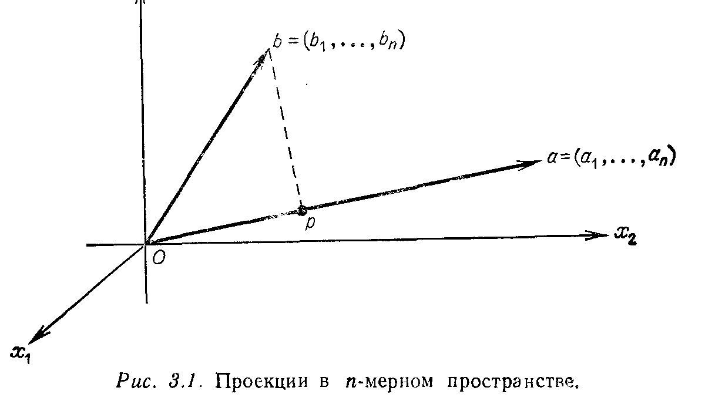
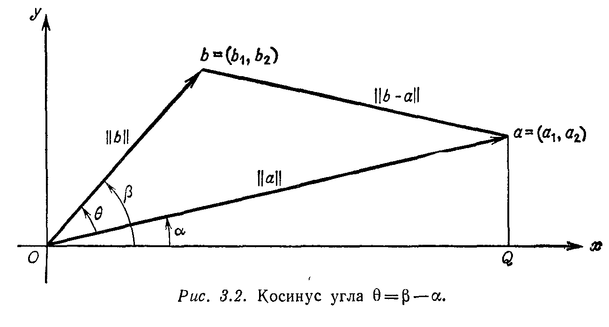
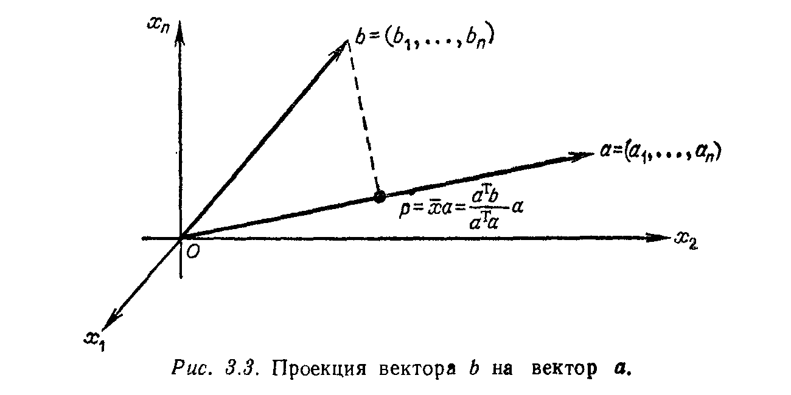

# Глава 3

# ОРТОГОНАЛЬНЫЕ ПРОЕКЦИИ И МЕТОД НАИМЕНЬШИХ КВАДРАТОВ

## § 3.1. СКАЛЯРНЫЕ ПРОИЗВЕДЕНИЯ И ТРАНСПОНИРОВАНИЕ

---
**стр. 125**
---

Мы уже знаем, что скалярное произведение двух векторов $x$ и $y$ есть число $x^\mathrm{T}y$. До сих пор нас интересовал лишь вопрос, равно ли нулю это число, другими словами, ортогональны ли эти два вектора. Теперь же мы будем допускать возможность, что скалярные произведения не равны нулю, т. е. что углы не являются прямыми, и интересоваться соотношением между скалярным произведением и углом. В этом параграфе мы также коснемся вопроса о связи между скалярным произведением и транспонированием. В предыдущей главе транспонирование осуществлялось путем переворачивания матрицы, как оладьи; теперь эта процедура будет заменена более строгой.

Суммируя материал оставшейся части главы, следует отметить, что *ортогональный* случай все-таки является *наиболее важным*. Предположим, что задана точка $b$ в $n$-мерном пространстве и мы хотим найти расстояние от этой точки до прямой, порожденной вектором $a$, т. е. мы ищем на этой прямой точку $p$, ближайшую к $b$. Тогда прямая, соединяющая точки $b$ и $p$ (изображенная на рис. 3.1 пунктиром), перпендикулярна к исходному вектору $a$.

---
**стр. 126**
---

Этот факт позволяет нам найти ближайшую точку $p$ и вычислить расстояние от нее до $b$. Несмотря на то что исходные векторы $a$ и $b$ не были ортогональны, для решения задачи автоматически привлекается ортогональность.

Ситуация будет аналогичной, если вместо прямой, определенной вектором $a$, задана плоскость или вообще любое подпространство $S$ пространства $\mathbf{R}^n$. Задача вновь сводится к отысканию точки $p$ в этом подпространстве, которая является ближайшей к $b$, и *эта точка вновь оказывается проекцией* точки $b$ на *подпространство* $S$. Если мы опустим перпендикуляр из точки $b$ на $S$, то $p$ будет точкой пересечения этого перпендикуляра с подпространством $S$. Геометрически это соответствует решению задачи о расстояниях между точками и подпространствами. Однако остаются и некоторые вопросы, а именно:

1) Имеет ли эта задача практическое значение?
2) Существует ли аналитическая формула для определения точки $p$, если подпространство $S$ задается определенным базисом (или просто набором векторов, порождающих его)?
3) Существует ли устойчивый (с вычислительной точки зрения) способ вычисления точки $p$ при помощи этой формулы?

Ответ на первые два вопроса, безусловно, является положительным. Наша задача, до сих пор описанная в геометрических терминах, в точности совпадает с задачей о *решении переопределенной системы уравнений методом наименьших квадратов*. Вектор $b$ представляет собой информацию, полученную в результате проведения серии экспериментов или опросов, и в ней содержится слишком много ошибок, чтобы он мог попасть в данное подпространство $S$. Другими словами, если мы попытаемся представить вектор $b$ как вектор из подпространства $S$, то нам не удастся этого сделать, поскольку соответствующая система уравнений окажется несовместной и, значит, не имеет решения. А метод наименьших квадратов даст нам точку $p$, наилучшую из возможных. Сомневаться в важности этого приложения не приходится $^1$).

Второй вопрос, об отыскании формулы для точки $p$, решается очень просто, когда подпространство представляет собой прямую. В этом и следующем параграфах мы будем проектировать один вектор на другой различными способами и соотносить это проектирование с вопросом о скалярных произведениях и об углах. К счастью, формула для $p$ остается достаточно простой и при проектировании на подпространства большей размерности (при условии, что в них задан базис). Это наиболее важный случай; он соответствует задаче о наименьших квадратах с несколькими

$^1$) В экономике и статистике это называется *регрессионным анализом*.

---
**стр. 127**
---

параметрами и решается в § 3.2. Остаются еще две возможности, заслуживающие отдельного рассмотрения:

а) Если подпространство $S$ описывается набором порождающих его векторов, причем линейно зависимых, то эта вырожденность приводит к нарушению формулы для $p$. Точка $p$ остается единственной point, ближайшей к $b$, но она может быть выражена различными способами в виде комбинации линейно зависимых наборов векторов. Поэтому требуется дополнительное правило, позволяющее выделить одну комбинацию, и это приводит нас в § 3.4 к понятию псевдообратной матрицы.

b) Предположим гораздо более благоприятную ситуацию, когда описывающие $S$ векторы не только линейно независимы, но и взаимно ортогональны. В этом случае формула для $p$ становится особенно простой и все сводится к случаю проектирования на прямую. Столь же простыми будут и вычисления. Это обстоятельство наводит на мысль о необходимости предварительной подготовки базиса с тем, чтобы составляющие его векторы стали взаимно ортогональными. Любой базис может быть преобразован в ортогональный, и в § 3.3 описывается простой процесс Грама — Шмидта, служащий для этой цели.

Остается ответить на третий вопрос о том, может ли быть реализована устойчивая схема для метода наименьших квадратов. Сделать это труднее по следующей причине: подпространство $S$ определяется набором векторов, и если эти векторы будут близки к линейной зависимости, то оказывается практически невозможным установить их линейную зависимость или независимость. Другими словами, размерность подпространства $S$ (число линейно независимых векторов) является исключительно неустойчивой, что делает неустойчивыми как точку $p$, так и псевдообратную матрицу. В более устойчивом случае «нормальные уравнения», описанные в § 3.2, дают простейший способ для вычисления $p$ (то же самое относится и к процессу ортогонализации Грама — Шмидта или к сингулярному разложению из § 3.4).

СКАЛЯРНЫЕ ПРОИЗВЕДЕНИЯ И НЕРАВЕНСТВО ШВАРЦА

Вернемся к обсуждению вопроса о скалярных произведениях и углах. Ниже будет показано, что скалярные произведения связаны не с самими углами, а с их *косинусами*. Поэтому мы обратимся к тригонометрии, т. е. к двумерному случаю, чтобы найти это соотношение (рис. 3.2). Пусть $\alpha$ есть угол между вектором $a$ и осью $x$. Вспоминая, что $\|a\|$ есть длина вектора $a$, равная гипотенузе треугольника $OaQ$, получаем выражения для синуса и ко-

---
**стр. 128**
---

синуса угла $\alpha$ в виде
$$ \sin \alpha = \frac{a_2}{\|a\|}, \qquad \cos \alpha = \frac{a_1}{\|a\|}. $$

То же самое справедливо и для вектора $b$ с соответствующим углом $\beta$: его синус равен $b_2 / \|b\|$, а косинус равен $b_1 / \|b\|$. Теперь, поскольку угол $\theta$ в точности равен $\beta - \alpha$, его косинус дается хорошо известным тригонометрическим тождеством
$$ \cos \theta = \cos \beta \cos \alpha + \sin \beta \sin \alpha = \frac{a_1 b_1 + a_2 b_2}{\|a\| \|b\|}. \eqno (1) $$

Числитель этой формулы совпадает со скалярным произведением векторов $b$ и $a$, откуда мы и получаем требуемое соотношение:

**3А.** *Косинус угла между двумя векторами равен*
$$ \cos \theta = \frac{a^\mathrm{T} b}{\|a\| \|b\|}. \eqno (2) $$

Отметим, что эта формула правильна и в метрическом отношении: если мы вдвое увеличим вектор $b$, то как числитель, так и знаменатель увеличатся вдвое и косинус останется неизменным. Изменение знака вектора $b$ на противоположный одновременно изменит знак у $\cos \theta$, что означает изменение угла на 180°.

*Замечание.* Тот же самый результат может быть получен и из теоремы косинусов, которая связывает длины сторон в произвольном треугольнике и имеет вид
$$ \|b - a\|^2 = \|b\|^2 + \|a\|^2 - 2\|b\| \|a\| \cos \theta. \eqno (3) $$

Если $\theta$ является прямым углом, то мы приходим к теореме Пифагора, а при произвольном $\theta$ выражение $\|b - a\|^2$ может быть за-

---
**стр. 129**
---

писано в виде $(b - a)^\mathrm{T} (b - a)$ и вместо (3) получаем:
$$ b^\mathrm{T} b - 2a^\mathrm{T} b + a^\mathrm{T} a = b^\mathrm{T} b + a^\mathrm{T} a - 2\|b\| \|a\| \cos \theta. $$

После сокращений мы приходим к формуле (2) для косинуса. Фактически это доказывает и нашу формулу для $n$-мерного случая, поскольку все происходит лишь в плоском треугольнике $Oab$.

Теперь мы хотим найти проекцию $p$. Эта точка должна быть кратна вектору $a$, т. е. $p = \overline{x} a$, поскольку любая точка этой прямой кратна $a$, и задача состоит в отыскании коэффициента $\overline{x}$. Для этого нам нужен лишь простой геометрический факт, состоящий в том, что прямая, соединяющая конец вектора $b$ с точкой $p$, перпендикулярна к вектору $a$:
$$ (b - \overline{x}a) \perp a, \quad \text{или} \quad a^\mathrm{T} (b - \overline{x}a) = 0, \quad \text{или} \quad \overline{x} = \frac{a^\mathrm{T} b}{a^\mathrm{T} a}. $$

**3В.** *Проекция $p$ точки $b$ на прямую, определенную вектором $a$, задается формулой*
$$ p = \frac{a^\mathrm{T} b}{a^\mathrm{T} a} a. \eqno (4) $$
*Расстояние (в квадрате) от этой точки до прямой равняется*
$$ \left\| b - \frac{a^\mathrm{T} b}{a^\mathrm{T} a} a \right\|^2 = b^\mathrm{T} b - 2 \frac{(a^\mathrm{T} b)^2}{a^\mathrm{T} a} + \left( \frac{a^\mathrm{T} b}{a^\mathrm{T} a} \right)^2 a^\mathrm{T} a = $$
$$ = \frac{(b^\mathrm{T} b)(a^\mathrm{T} a) - (a^\mathrm{T} b)^2}{a^\mathrm{T} a}. \eqno (5) $$

Это позволяет нам повторить рис. 3.1 уже с указанием формулы для определения точки $p$ (рис. 3.3).

---
**стр. 130**
---

Полученная формула имеет замечательное следствие, представляющее собой, вероятно, наиболее важное неравенство в математике. (Как частный случай оно заключает в себе и неравенство о среднем геометрическом и среднем арифметическом и эквивалентно — см. упр. 3.1.1 — неравенству треугольника.) Сам по себе этот результат кажется случайным следствием из формулы (5) для расстояния от точки до прямой, т. е. между $b$ и $\overline{x} a$. Это расстояние, а также его квадрат обязательно должны быть неотрицательными. Поэтому числитель в формуле (5) должен быть неотрицателен: $(b^\mathrm{T} b)(a^\mathrm{T} a) - (a^\mathrm{T} b)^2 \ge 0$. Если мы добавим к обеим частям неравенства величину $(a^\mathrm{T} b)^2$ и извлечем корень, то формула (5) перепишется в таком виде:

**3С.** *Любые два вектора удовлетворяют неравенству Шварца*
$$ |a^\mathrm{T} b| \le \|a\| \|b\|. \eqno (6) $$

*Замечание.* Согласно формуле (2), отношение двух частей неравенства (6) в точности равно $|\cos \theta|$. Поскольку все значения косинуса лежат в пределах от $-1$ до $1$, мы получаем другое доказательство неравенства (6), причем доказательство, в некотором смысле более доступное для понимания благодаря очевидности свойств косинуса. Но мы хотим подчеркнуть простоту нашего доказательства, которое сводится к механическим вычислениям в формуле (5). Выражение в левой части (5) является неотрицательным, и оно будет оставаться неотрицательным даже *после введения ниже дополнительных возможностей* для скалярных произведений и длин векторов. Поэтому выражение в правой части (5) также будет неотрицательным, и неравенство Шварца доказано, причем без привлечения тригонометрии $^1$).

И последнее замечание: равенство в (6) достигается тогда и только тогда, когда вектор $b$ является кратным $a$. В этом случае конец вектора $b$ совпадает с точкой $p$ и расстояние (5) между этой точкой и прямой равно нулю.

ТРАНСПОНИРОВАНИЕ МАТРИЦЫ

Обратимся теперь к транспонированию матриц. До сих пор матрица $A^\mathrm{T}$ определялась нами лишь как зеркальное отражение матрицы $A$ относительно ее главной диагонали: строки матрицы $A$ превращались в столбцы матрицы $A^\mathrm{T}$, и наоборот. Другими сло-

$^1$) Имя Коши также связывается с этим неравенством $|a^\mathrm{T}b| \le \|a\| \|b\|$, а в русской литературе даже называют его неравенством Коши — Шварца — Буняковского! История математики показывает, что это, по-видимому, правильно.

---
**стр. 131**
---

вами, элемент $i$-й строки и $j$-го столбца матрицы $A^\mathrm{T}$ совпадает с элементом ($j, i$) матрицы $A$:
$$ (A^\mathrm{T})_{ij} = (A)_{ji}. \eqno (7) $$

Но в транспонировании матрицы заложен и более глубокий смысл, поскольку оно тесно связано со скалярным произведением. На самом деле эта связь может быть использована для того, чтобы дать новое и значительно более «абстрактное» определение транспонирования:

**3D.** *Транспонированная матрица $A^\mathrm{T}$ может быть определена с помощью следующего свойства: скалярное произведение вектора $Ax$ на вектор $y$ равняется скалярному произведению вектора $x$ на $A^\mathrm{T}y$. Формально это просто означает, что*
$$ (Ax)^\mathrm{T} y = x^\mathrm{T} A^\mathrm{T} y = x^\mathrm{T} (A^\mathrm{T}y). \eqno (8) $$

Новое определение преследует две цели:
(i) Оно показывает нам, как следует модифицировать транспонирование, когда мы пользуемся другими определениями скалярного произведения. Это будет важно в случае комплексных чисел; новое скалярное произведение появится в § 5.5.
(ii) Оно позволяет нам транспонировать произведение $AB$ без перемножения этих матриц, причем соответствующее правило совершенно аналогично известному правилу обращения произведения матриц $(AB)^{-1} = B^{-1} A^{-1}$.

**3E.** *Транспонированная к $AB$ матрица равняется произведению транспонированных матриц, взятых в обратном порядке,*
$$ (AB)^\mathrm{T} = B^\mathrm{T} A^\mathrm{T}. \eqno (9) $$

Д о к а з а т е л ь с т в о. Скалярное произведение $(AB)x$ на $y$ должно равняться, согласно 3D, скалярному произведению вектора $x$ на $(AB)^\mathrm{T} y$. С другой стороны, оно также равняется скалярному произведению $A(Bx)$ на $y$, что совпадает с произведением $Bx$ на $A^\mathrm{T}y$ по 3D. Отсюда по 3D получаем, что исходное скалярное произведение равно произведению вектора $x$ на $B^\mathrm{T} (A^\mathrm{T}y)$, откуда и получается равенство $(AB)^\mathrm{T} = B^\mathrm{T} A^\mathrm{T}$. Это легко показать на конкретном примере:
$$ AB = \begin{bmatrix} 1 & 4 \\ 0 & 3 \end{bmatrix} \begin{bmatrix} 0 & 1 & 1 \\ 2 & 0 & 1 \end{bmatrix} = \begin{bmatrix} 8 & 1 & 5 \\ 6 & 0 & 3 \end{bmatrix}, $$
$$ B^\mathrm{T} A^\mathrm{T} = \begin{bmatrix} 0 & 2 \\ 1 & 0 \\ 1 & 1 \end{bmatrix} \begin{bmatrix} 1 & 0 \\ 4 & 3 \end{bmatrix} = \begin{bmatrix} 8 & 6 \\ 1 & 0 \\ 5 & 3 \end{bmatrix}. $$
