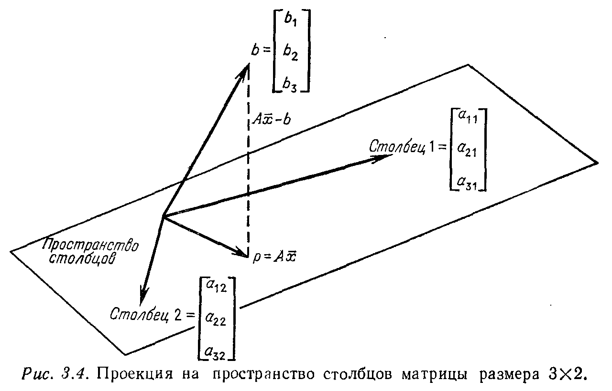
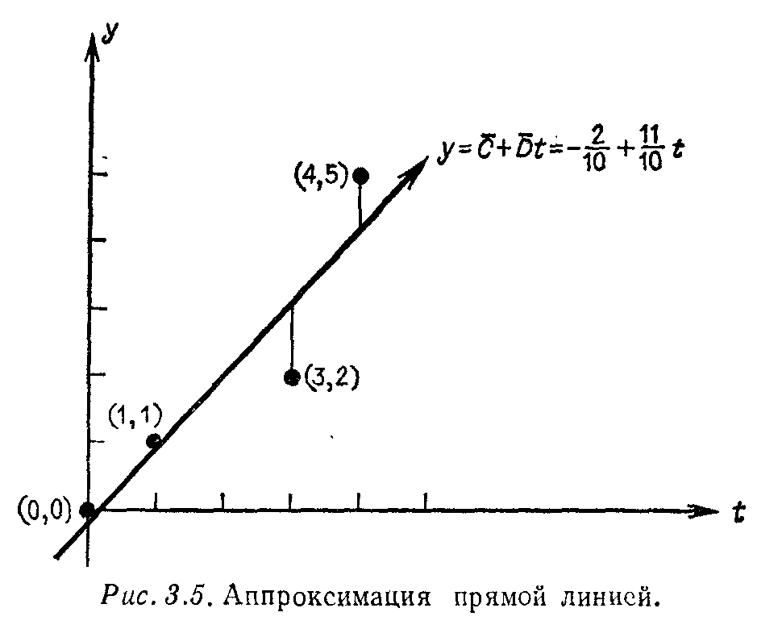

## § 3.2. ПРОЕКЦИИ НА ПОДПРОСТРАНСТВА И АППРОКСИМАЦИИ ПО МЕТОДУ НАИМЕНЬШИХ КВАДРАТОВ

---
**стр. 134**
---

**Упражнение 3.1.10.** Молекула метана $\mathrm{CH_4}$ устроена таким образом, что атом углерода находится в центре правильного тетраэдра с четырьмя атомами водорода в вершинах. Если вершины находятся в точках $(0, 0, 0)$, $(1, 1, 0)$, $(1, 0, 1)$ и $(0, 1, 1)$ — при этом шесть ребер имеют длину, равную $\sqrt{2}$, так что тетраэдр является правильным, — то чему равен косинус угла между лучами, идущими из центра $\left( \frac{1}{2}, \frac{1}{2}, \frac{1}{2} \right)$ в вершины? (Сам этот угол, хорошо известный химикам, равен примерно $109,5^{\circ}$.)

### § 3.2. ПРОЕКЦИИ НА ПОДПРОСТРАНСТВА И АППРОКСИМАЦИИ ПО МЕТОДУ НАИМЕНЬШИХ КВАДРАТОВ

До сих пор система $Ax = b$ либо имела решение, либо не имела его. Если вектор $b$ не принадлежит пространству столбцов $\mathscr{R}(A)$, то система является несовместной и метод исключения Гаусса не работает. Это почти всегда происходит в системах $m$ уравнений ($m > 1$) с одним неизвестным. Например, система
$$2x = b_1,$$
$$3x = b_2, \qquad (11)$$
$$4x = b_3$$
будет иметь решение только в случае, когда отношение правых частей равно $2:3:4$. Решение $x$, если только оно существует, безусловно является единственным, но оно будет существовать лишь когда вектор $b$ лежит на той же прямой, что и вектор
$$a = \begin{bmatrix} 2 \\ 3 \\ 4 \end{bmatrix}.$$

Хотя несовместные системы и являются неразрешимыми, они часто возникают на практике, и их нужно уметь решать. Одна возможность состоит в отыскании вектора $x$ из части системы и игнорировании оставшихся уравнений. Но такой прием трудно обосновать, если все $m$ уравнений имеют один и тот же «источник». Вместо точного решения одних уравнений и допущения больших ошибок в других целесообразно выбрать вектор $x$ таким образом, чтобы минимизировать *среднюю ошибку для всех $m$ уравнений*. Существует много способов для выбора такого осреднения, но наиболее удобный заключается в использовании суммы квадратов
$$E^2 = (2x - b_1)^2 + (3x - b_2)^2 + (4x - b_3)^2. \qquad (12)$$
Если уравнение $ax = b$ имеет точное решение, то минимальная ошибка равна $E = 0$. В более вероятном случае, когда вектор $b$

---
**стр. 135**
---

не пропорционален $a$, функция $E^2$ будет параболой с минимумом в точке, где
$$\frac{dE^2}{dx} = 2 \left[ (2x - b_1) 2 + (3x - b_2) 3 + (4x - b_3) 4 \right] = 0. \qquad (13)$$
Разрешая относительно $x$, получаем приближенное решение системы $ax = b$ по методу наименьших квадратов в виде
$$\bar{x} = \frac{2b_1 + 3b_2 + 4b_3}{2^2 + 3^2 + 4^2} = \frac{2b_1 + 3b_2 + 4b_3}{29}. \qquad (14)$$

Нетрудно дать общую формулу для произвольных $a \neq 0$ и правой части $b$. Во-первых, ошибка $E$ представляет собой длину вектора $ax - b$:
$$E = \| ax - b \| = \left[ (a_1 x - b_1)^2 + \dots + (a_m x - b_m)^2 \right]^{1/2}. \qquad (15)$$
Возводя в квадрат, получаем параболу
$$E^2 = (ax - b)^\mathrm{T} (ax - b) = a^\mathrm{T} ax^2 - 2a^\mathrm{T} bx + b^\mathrm{T} b. \qquad (16)$$
Она имеет минимум в точке, где
$$\frac{dE^2}{dx} = 2a^\mathrm{T} ax - 2a^\mathrm{T} b = 0.$$

**3H.** *Решение по методу наименьших квадратов одномерной задачи $ax = b$ имеет вид*
$$\bar{x} = \frac{a^\mathrm{T} b}{a^\mathrm{T} a}. \qquad (17)$$
*Геометрически это решение совпадает с проекцией: $p = \bar{x}a$ является точкой на прямой, определенной вектором $a$, ближайшей к $b$.*

Таким образом, мы возвращаемся к геометрической интерпретации задачи о наименьших квадратах — к минимизации расстояния. Дифференцируя параболу $E^2$ в форме (16) и приравнивая производную нулю, мы фактически использовали аппарат анализа для подтверждения геометрических рассмотрений предыдущего параграфа. Прямая, соединяющая точки $b$ и $p$, должна быть перпендикулярна направлению вектора $a$, откуда находится значение $\bar{x}$:
$$a^\mathrm{T} (b - \bar{x}a) = a^\mathrm{T} b - \frac{a^\mathrm{T} b}{a^\mathrm{T} a} a^\mathrm{T} a = 0. \qquad (18)$$

В заключение коснемся вырожденного случая $a = 0$. В этой ситуации все числа, кратные $a$, равны нулю и прямая вырождается в точку. Поэтому проекцией $b$ на вектор $a$ является точка $p = 0$. Но формула (17) для $\bar{x}$ превращается в неопределенность вида

---
**стр. 136**
---

$0/0$, что отражает полную произвольность в выборе множителя $\bar{x}$. Фактически все значения $x$ будут давать одну и ту же ошибку $E = \| 0x - b \|$, так что $E^2$ превращается из параболы в горизонтальную прямую и не существует единственной минимизирующей точки $x$. Одна из целей псевдообращения, которое будет описано в § 3.4, заключается в придании числу $\bar{x}$ определенного значения. В данной ситуации этим значением будет точка $\bar{x} = 0$, которая по крайней мере выглядит более «симметричной», чем все остальные.

**Упражнение 3.2.1.** Предположим, что мы измеряем вес пациента в четырех различных случаях, и он оказывается равным $b_1 = 150$, $b_2 = 153$, $b_3 = 150$, $b_4 = 151$. Какое значение является наилучшим в смысле наименьших квадратов для указания веса пациента?

**Упражнение 3.2.2.** Найти наилучшее решение $\bar{x}$ в смысле метода наименьших квадратов для задачи $3x = 10$, $4x = 5$.

### МНОГОМЕРНЫЕ ЗАДАЧИ О НАИМЕНЬШИХ КВАДРАТАХ

Теперь мы готовы к следующему шагу, а именно к проектированию вектора $b$ на подпространство, а не на прямую. Эта геометрическая задача возникает следующим образом. Пусть мы вновь начинаем с системы $Ax = b$, но теперь $A$ является матрицей размера $m \times n$, т.е. вместо одного неизвестного и одного вектор-столбца $a$ матрица содержит $n$ столбцов. Мы должны по-прежнему считать, что число $m$ наблюдений больше числа неизвестных $n$, так что следует ожидать, что система $Ax = b$ окажется несовместной. *Вероятно, не существует вектора $x$, который бы точно соответствовал $b$. Другими словами, вектор $b$, вероятно, не является комбинацией столбцов матрицы $A$.*
Задача вновь состоит в выборе $\bar{x}$, минимизирующего ошибку, и эта минимизация снова будет производиться по методу наименьших квадратов. Ошибка равняется $E = \| Ax - b \|$, и *она в точности представляет собой расстояние от $b$ до точки $Ax$, лежащей в пространстве столбцов матрицы $A$*. (Вспомним, что $Ax$ есть линейная комбинация столбцов с коэффициентами $x_1, \dots, x_n$.) Поэтому отыскание решения $\bar{x}$ по методу наименьших квадратов, означающее минимизацию ошибки $E$, эквивалентно отысканию точки $p = A\bar{x}$, ближайшей к точке $b$ по сравнению с остальными точками из пространства столбцов.
Для определения вектора $\bar{x}$ можно использовать либо геометрию, либо анализ. Мы воспользуемся первой из возможностей: точка $p$ должна быть «проекцией $b$ на пространство столбцов» и **вектор невязки $A\bar{x} - b$ должен быть ортогонален к этому**

---
**стр. 137**
---

**пространству** (рис. 3.4). Ортогональность к пространству состоит в следующем. Каждый вектор в пространстве столбцов матрицы $A$ является линейной комбинацией столбцов с некоторыми

коэффициентами $y_1, \dots, y_n$. Другими словами, это вектор вида $Ay$. Для всех $y$ эти векторы в плоскости должны быть перпендикулярны вектору невязки $A\bar{x} - b$:
$$(Ay)^\mathrm{T} (A\bar{x} - b) = 0, \quad \text{или} \quad y^\mathrm{T} [A^\mathrm{T} A\bar{x} - A^\mathrm{T} b] = 0. \qquad (19)$$
Это справедливо для произвольного вектора $y$, откуда следует, что вектор в квадратных скобках должен быть нулевым, $A^\mathrm{T} A\bar{x} - A^\mathrm{T} b = 0$. Таким образом, геометрические соображения приводят нас к фундаментальным уравнениям метода наименьших квадратов.

**3I.** *Решение по методу наименьших квадратов для несовместной системы $Ax = b$, состоящей из $m$ уравнений с $n$ неизвестными, удовлетворяет соотношению*
$$A^\mathrm{T} A\bar{x} = A^\mathrm{T} b. \qquad (20)$$
*Оно известно под названием **нормальных уравнений**. Если столбцы матрицы $A$ являются линейно независимыми, то по **3G** матрица $A^\mathrm{T} A$ обратима и единственное решение дается формулой*
$$\bar{x} = (A^\mathrm{T} A)^{-1} A^\mathrm{T} b. \qquad (21)$$
*Проекция точки $b$ на пространство столбцов, таким образом, имеет вид*
$$p = A\bar{x} = A(A^\mathrm{T} A)^{-1} A^\mathrm{T} b. \qquad (22)$$

---
**стр. 138**
---

Матрица $B = (A^\mathrm{T} A)^{-1} A^\mathrm{T}$, возникающая в формуле (21), $\bar{x} = Bb$, является одной из левых обратных к матрице $A$: $BA = (A^\mathrm{T} A)^{-1} A^\mathrm{T} A = I$. Существование этой левой обратной гарантируется условием единственности из теоремы 2Q, поскольку столбцы матрицы $A$ являются линейно независимыми.
Для иллюстрации рассмотрим задачу, которую можно решить либо интуитивно, либо с использованием формулы (22). Пусть матрица $A$ и вектор $b$ задаются формулами
$$A = \begin{bmatrix} 1 & 2 \\ 1 & 5 \\ 0 & 0 \end{bmatrix}, \qquad b = \begin{bmatrix} 4 \\ 3 \\ 9 \end{bmatrix}.$$
Пространство столбцов матрицы $A$ легко определяется, поскольку оба столбца матрицы оканчиваются нулями: это пространство совпадает с плоскостью $xy$ в трехмерном пространстве. Проекция точки $b$ на эту плоскость будет иметь те же самые компоненты по осям $x$ и $y$, равные 4 и 3 соответственно, но компонента $z$ исчезнет, так что $p = (4, 3, 0)^\mathrm{T}$. То же самое следует и из формулы (22):
$$A^\mathrm{T} A = \begin{bmatrix} 1 & 1 & 0 \\ 2 & 5 & 0 \end{bmatrix} \begin{bmatrix} 1 & 2 \\ 1 & 5 \\ 0 & 0 \end{bmatrix} = \begin{bmatrix} 2 & 7 \\ 7 & 29 \end{bmatrix}, \qquad (A^\mathrm{T} A)^{-1} = \frac{1}{9} \begin{bmatrix} 20 & -7 \\ -7 & 2 \end{bmatrix},$$
$$p = \begin{bmatrix} 1 & 2 \\ 1 & 5 \\ 0 & 0 \end{bmatrix} \frac{1}{9} \begin{bmatrix} 20 & -7 \\ -7 & 2 \end{bmatrix} \begin{bmatrix} 1 & 1 & 0 \\ 2 & 5 & 0 \end{bmatrix} \begin{bmatrix} 4 \\ 3 \\ 9 \end{bmatrix} = \begin{bmatrix} 4 \\ 3 \\ 0 \end{bmatrix}.$$

Можно сразу обратиться и к несовместной системе
$$u + 2v = 4,$$
$$u + 5v = 3,$$
$$0u + 0v = 9.$$
В этом случае лучшее из того, что мы можем сделать, это решить систему из первых двух уравнений (откуда находятся компоненты $\bar{u}$ и $\bar{v}$ вектора $\bar{x}$) и игнорировать третье уравнение; ошибка в этом уравнении всегда будет равняться 9.
Отметим, что если вектор $b$ принадлежит пространству столбцов матрицы, т.е. выражается в виде некоторой комбинации $b = Ax$ столбцов матрицы, то проекция принимает вид
$$p = A(A^\mathrm{T} A)^{-1} A^\mathrm{T} Ax = Ax = b. \qquad (23)$$
Таким образом, точка $p$ совпадает с $b$, как и должно быть.
---

---
**стр. 139**
---

Противоположный случай возникает, когда вектор $b$ ортогонален всем столбцам матрицы $A$. В этом случае $b$ не только не лежит в подпространстве столбцов, но даже ортогонален ему. Тогда геометрические соображения показывают, что ближайшей точкой из подпространства является начало координат: вектор $b$ имеет нулевую компоненту в разложении по подпространству и его проекция есть $p=0$. Это подтверждается и вычислением $\bar{x}$: столбцы матрицы $A$ совпадают со строками $A^{\text{T}}$, и если вектор $b$ ортогонален всем им, то $A^{\text{T}}b = 0$. Поэтому
$$ \bar{x} = (A^{\text{T}}A)^{-1}A^{\text{T}}b = 0 \qquad \text{и} \qquad p = A\bar{x} = 0. $$

Заметим, что при проектировании на прямую мы приходим к формуле (17). Матрица $A$ превращается в столбец $a$, матрица $A^{\text{T}}A$ есть число $a^{\text{T}}a$ и $\bar{x}$ в формуле (21) равен $a^{\text{T}}b/a^{\text{T}}a$, как и должно быть.

**Упражнение 3.2.3.** Используя нормальные уравнения, найти наилучшее решение в смысле метода наименьших квадратов для несовместной системы
$$
\begin{bmatrix}
1 & 0 \\
0 & 1 \\
1 & 1
\end{bmatrix}
\begin{bmatrix}
u \\
v
\end{bmatrix}
=
\begin{bmatrix}
1 \\
1 \\
0
\end{bmatrix}.
$$
Проделать то же самое для системы $x=1$, $x=3$, $x=5$, т. е.
$$
\begin{bmatrix}
1 \\
1 \\
1
\end{bmatrix}
[x]
=
\begin{bmatrix}
1 \\
3 \\
5
\end{bmatrix}.
$$

**Упражнение 3.2.4.** (a) Пусть
$$
A = \begin{bmatrix} 1 & 0 \\ 0 & 1 \\ 1 & 1 \end{bmatrix}, \qquad
x = \begin{bmatrix} u \\ v \end{bmatrix}, \qquad
b = \begin{bmatrix} 1 \\ 3 \\ 4 \end{bmatrix}.
$$
Записать $E^2 = \|Ax - b\|^2$ и приравнять нулю производные по $u$ и $v$. Сравнить получившиеся уравнения с $A^{\text{T}}A\bar{x} = A^{\text{T}}b$. Это сравнение должно показать, что нормальные уравнения могут быть получены как из геометрии, так и из анализа, и они связаны непосредственно с минимизацией величины $E^2$.
(b) Найти решение $\bar{x}$ и проекцию $p = A\bar{x}$ точки $b$ на пространство столбцов.
(c) Проверить, что вектор $b-p$ ортогонален к столбцам матрицы $A$.

МАТРИЦЫ ПРОЕКТИРОВАНИЯ

Выше было установлено, что ближайшая к $b$ точка дается формулой $p = A(A^{\text{T}}A)^{-1}A^{\text{T}}b$. *Эта формула является матричной записью для перпендикуляра, опущенного из точки $b$ на пространство столбцов матрицы $A$.* Матрица, описывающая эту конструкцию, называется ***матрицей проектирования*** и обозначается через $P$:
$$ P = A(A^{\text{T}}A)^{-1}A^{\text{T}}. \qquad (24) $$

---
**стр. 140**
---

Эта матрица проектирует любой вектор $b$ на пространство столбцов матрицы $A$[^1]. Другими словами, вектор $p = Pb$ является компонентой вектора $b$ в пространстве столбцов матрицы, а ошибка $b - Pb$ является компонентой в его ортогональном дополнении. (Иначе говоря, $I - P$ также является матрицей проектирования: она проектирует произвольный вектор $b$ на это ортогональное дополнение, и соответствующая проекция равняется $(I - P)b = b - Pb$.) Таким образом, мы имеем матричную формулу для разбиения вектора на две взаимно перпендикулярные составляющие: $Pb$ принадлежит пространству столбцов $\mathscr{R}(A)$, а другая составляющая $(I - P)b$ — левому нуль-пространству $\mathfrak{N}(A^{\text{T}})$, которое является ортогональным дополнением к пространству столбцов.

Введенные матрицы проектирования можно рассматривать как с геометрической, так и с алгебраической точек зрения. Они представляют собой семейство матриц с весьма специфическими свойствами и будут использоваться ниже как основные блоки при построении всех симметрических матриц. Поэтому прервем на время изложение метода наименьших квадратов и обратимся к этим свойствам.

**3J.** *Матрица проектирования $P = A(A^{\text{T}}A)^{-1}A^{\text{T}}$ обладает двумя основными свойствами:*
*(i) она является идемпотентной, т. е. $P^2 = P$;*
*(ii) она является симметрической, т. е. $P = P^{\text{T}}$.*
*И обратно, любая матрица с этими двумя свойствами представляет собой матрицу проектирования на свое пространство столбцов.*

Доказательство. Справедливость равенства $P^2 = P$ легко устанавливается с помощью геометрических соображений. Если мы начинаем с произвольного вектора $b$, то вектор $Pb$ будет лежать в подпространстве, на которое осуществляется проектирование. Поэтому при повторном проектировании, в результате которого мы получаем вектор $P(Pb)$, или $P^2b$, ничего не изменяется: вектор уже принадлежит подпространству и $Pb = P^2b$ для всех $b$. Алгебраически это можно показать следующим образом:
$$ P^2 = A(A^{\text{T}}A)^{-1}A^{\text{T}}A(A^{\text{T}}A)^{-1}A^{\text{T}} = A(A^{\text{T}}A)^{-1}A^{\text{T}} = P. $$

Для доказательства симметричности матрицы $P$ перемножим транспонированные матрицы в обратном порядке и воспользуемся тождеством $(B^{-1})^{\text{T}} = (B^{\text{T}})^{-1}$, которое приведено в упр. 3.1.7, для матрицы $B = A^{\text{T}}A$:
$$ P^{\text{T}} = (A^{\text{T}})^{\text{T}}((A^{\text{T}}A)^{-1})^{\text{T}}A^{\text{T}} = A((A^{\text{T}}A)^{\text{T}})^{-1}A^{\text{T}} = A(A^{\text{T}}A)^{-1}A^{\text{T}} = P. $$

[^1]: Есть опасность спутать эти матрицы с матрицами перестановки, также обозначаемыми через $P$. Однако опасность эта весьма мала, поскольку мы будем избегать одновременного использования обеих матриц на одной странице.

---
**стр. 141**
---

Чтобы показать это геометрически, представим себе два произвольных вектора $b$ и $c$. Если $b$ проектируется обычным способом, давая в результате вектор $Pb$, а $c$ проектируется на ортогональное дополнение, давая вектор $(I - P)c$, то эти две проекции являются взаимно ортогональными:
$$ (Pb)^{\text{T}}(I - P)c = b^{\text{T}}P^{\text{T}}(I - P)c = 0. $$
Поскольку это справедливо для любых векторов $b$ и $c$, получаем, что
$$ P^{\text{T}}(I - P) = 0, \quad \text{или} \quad P^{\text{T}} = P^{\text{T}}P, \quad \text{или} \quad P = (P^{\text{T}}P)^{\text{T}} = P^{\text{T}}P. $$
Следовательно, $P^{\text{T}} = P$ и матрица $P$ является симметрической.

Для доказательства обратного мы должны, используя свойства (i) и (ii), показать, что $P$ является матрицей проектирования на свое пространство столбцов. Это пространство состоит из всех комбинаций $Pc$ столбцов матрицы $P$. Для любого вектора $b$ вектор $Pb$ обязательно лежит в этом пространстве, поскольку из правила умножения матриц следует, что он равен линейной комбинации столбцов матрицы $P$. Кроме того, можно показать, что *вектор ошибки $b - Pb$ ортогонален этому пространству*: для любого вектора $Pc$ из пространства столбцов свойства (i) и (ii) дают
$$ (b - Pb)^{\text{T}}Pc = b^{\text{T}}(I - P)^{\text{T}}Pc = b^{\text{T}}(P - P^2)c = 0. \qquad (25) $$
Поскольку вектор $b - Pb$ ортогонален пространству столбцов, он и является искомым перпендикуляром, так что $P$ оказывается матрицей проектирования.

**Упражнение 3.2.5.** Пусть задан базис $u_1$, $u_2$ в подпространстве $S$ трехмерного пространства и вектор $b$, не принадлежащий $S$:
$$
u_1 = \begin{bmatrix} 1 \\ 0 \\ 0 \end{bmatrix}, \qquad
u_2 = \begin{bmatrix} 1 \\ 0 \\ 1 \end{bmatrix}, \qquad
b = \begin{bmatrix} 0 \\ 2 \\ 1 \end{bmatrix}.
$$
С помощью матрицы $A$ со столбцами $u_1$ и $u_2$ найти матрицу $P$, осуществляющую проектирование на подпространство $S$. Вычислить проекции вектора $b$ на $S$ и на ортогональное дополнение $S^{\perp}$.

**Упражнение 3.2.6.** (a) Показать, что если $P$ является матрицей проектирования, т. е. обладает свойствами (i) и (ii), то матрица $I - P$ также будет обладать этими свойствами.
(b) Показать, что если $P_1$ и $P_2$ являются матрицами проектирования на подпространства $S_1$ и $S_2$ и если $P_1P_2 = P_2P_1 = 0$, $P = P_1 + P_2$ также будет матрицей проектирования. Привести пример для матриц порядка 2.

**Упражнение 3.2.7.** Пусть $P$ — матрица проектирования на прямую в плоскости $xy$. Изобразить на рисунке, как будет действовать на произвольный вектор «матрица отражения» $H = I - 2P$. Объяснить геометрически и алгебраически, почему $H^2 = I$.

---
**стр. 142**
---

**Упражнение 3.2.8.** Показать, что если вектор $u$ имеет единичную длину, то матрица $P = uu^{\text{T}}$ ранга один будет матрицей проектирования, т. е. будет обладать свойствами (i) и (ii). Если $u = a/\|a\|$, то $P$ — матрица проектирования на прямую, определенную вектором $a$, и вектор $Pb$ оканчивается в точке $p = \bar{x}a$: матрицы проектирования единичного ранга в точности соответствуют одномерным задачам о наименьших квадратах.

**Упражнение 3.2.9.** Какая матрица размера $2 \times 2$ проектирует плоскость $xy$ на ось $y$?

ПОДГОНКА ДАННЫХ МЕТОДОМ НАИМЕНЬШИХ КВАДРАТОВ

Пусть мы выполняем серию экспериментов и предполагаем, что выходные данные $y$ почти линейно зависят от входных данных $t$, т. е. $y = C + Dt$, например:
(1) Через определенные промежутки времени мы измеряем расстояние до космической станции, летящей к Марсу. В этом случае $t$ есть время, $y$ есть расстояние и, если двигательная установка выключена, а гравитационные силы невелики, корабль будет двигаться почти с постоянной скоростью $v$: $y = y_0 + vt$.
(2) Мы можем изменять нагрузку, приложенную к конструкции, и контролировать возникающие в результате напряжения. В этом случае $t$ является нагрузкой, а $y$ — показаниями измерителя напряжений. Тогда если нагрузка не так велика, чтобы материал переходил в пластическое состояние, то $y$ и $t$ будут связаны обычным линейным соотношением $y = C + Dt$ теории упругости.
(3) В вопросах экономики и бизнеса рассматриваются сложные взаимные связи между стоимостью продукции, объемом производства, ценами и прибылью. Несмотря на их сложность, в определенных пределах эти связи могут быть близки к линейным. Пусть, например, выпуск $t_1$ экземпляров журнала обходится в сумму $y_1$, на следующей неделе выпуск $t_2$ экземпляров обходится в $y_2$ и т. д. Тогда издатель может оценить стоимость на следующую неделю, предположив, что $y = C + Dt$ и оценив коэффициенты $C$ и $D$ по уже имеющимся данным. Коэффициент $D$, равный стоимости каждого дополнительного экземпляра и называемый предельной стоимостью производства, обычно важнее для издателя, чем накладные расходы $C$.

Вопрос состоит в том, как вычислить коэффициенты $C$ и $D$ по результатам этих экспериментов. Если соотношение действительно является линейным и ошибки в экспериментах отсутствуют, то вопрос решается просто: два измерения величины $y$ при различных значениях $t$ определяют прямую $y = C + Dt$ и результаты всех последующих измерений будут находиться на этой прямой. Но при наличии ошибки эти точки уже не будут попадать на прямую, и мы должны «осреднять» результаты всех эксперимен-

---
**стр. 143**
---

тов для отыскания оптимальной прямой. Причем ее не следует путать с прямой, на которую мы раньше проектировали вектор $b$! Фактически, поскольку нужно определить две величины $C$ и $D$, мы будем заниматься проектированием на двумерное подпространство. Задача о наименьших квадратах определяется результатами экспериментов
$$
\begin{aligned}
C + Dt_1 &= y_1, \\
C + Dt_2 &= y_2, \\
&\dots \\
&\dots \\
&\dots \\
C + Dt_m &= y_m.
\end{aligned}
\qquad (26)
$$
Эта система является переопределенной, и при наличии ошибок она не будет иметь решения. Отметим, что вектор неизвестных $x$ имеет две компоненты $C$ и $D$:
$$
\begin{bmatrix}
1 & t_1 \\
1 & t_2 \\
\cdot & \cdot \\
\cdot & \cdot \\
\cdot & \cdot \\
1 & t_m
\end{bmatrix}
\begin{bmatrix}
C \\
D
\end{bmatrix}
=
\begin{bmatrix}
y_1 \\
y_2 \\
\cdot \\
\cdot \\
\cdot \\
y_m
\end{bmatrix},
\qquad \text{или} \qquad Ax = b.
\qquad (27)
$$
Наилучшее в смысле метода наименьших квадратов решение минимизирует сумму квадратов ошибок; числа $\bar{C}$ и $\bar{D}$ выбираются из условия минимизации величины
$$ E^2 = \|b - Ax\|^2 = (y_1 - C - Dt_1)^2 + \ldots + (y_m - C - Dt_m)^2. $$

Пользуясь матричной терминологией, мы выбираем такой вектор $\bar{x}$, что точка $p = A\bar{x}$ является ближайшей к $b$. Из всех прямых вида $y = C + Dt$ мы выбираем ту, которая наилучшим образом приближает опытные данные (рис. 3.5). На этом рисунке ошибками являются расстояния по вертикали до прямой, равные $y - C - Dt$, и именно эти расстояния мы возводим в квадрат, суммируем и минимизируем.

**Пример.** Пусть заданы результаты четырех измерений (рис. 3.5):
$$
\begin{aligned}
& y = 0 \quad \text{при} \quad t = 0, \qquad y = 1 \quad \text{при} \quad t = 1, \\
& y = 2 \quad \text{при} \quad t = 3, \qquad y = 5 \quad \text{при} \quad t = 4.
\end{aligned}
$$

Отметим, что значения $t$ не обязательно берутся через равные интервалы. Экспериментатор может выбирать любые подходящие значения (в том числе и отрицательные, если это допускается

---
**стр. 144**
---

экспериментом), не изменяя при этом математических формулировок. В данном случае переопределенная система $Ax = b$ имеет вид
$$
\begin{bmatrix}
1 & 0 \\
1 & 1 \\
1 & 3 \\
1 & 4
\end{bmatrix}
\begin{bmatrix}
C \\
D
\end{bmatrix}
=
\begin{bmatrix}
0 \\
1 \\
2 \\
5
\end{bmatrix}.
$$
Нам также понадобятся матрица $A^{\text{T}}A$ и обратная к ней:
$$
A^{\text{T}}A =
\begin{bmatrix}
4 & 8 \\
8 & 26
\end{bmatrix},
\qquad
(A^{\text{T}}A)^{-1} = \frac{1}{20}
\begin{bmatrix}
13 & -4 \\
-4 & 2
\end{bmatrix}.
$$
Тогда решение $\bar{x} = (A^{\text{T}}A)^{-1}A^{\text{T}}b$ по методу наименьших квадратов принимает вид
$$
\bar{x} =
\begin{bmatrix}
\bar{C} \\
\bar{D}
\end{bmatrix}
= \frac{1}{20}
\begin{bmatrix}
13 & -4 \\
-4 & 2
\end{bmatrix}
\begin{bmatrix}
1 & 1 & 1 & 1 \\
0 & 1 & 3 & 4
\end{bmatrix}
\begin{bmatrix}
0 \\
1 \\
2 \\
5
\end{bmatrix}
=
\begin{bmatrix}
-\frac{2}{10} \\
\frac{11}{10}
\end{bmatrix}.
$$
Таким образом, оптимальная прямая задается уравнением $y = -\frac{2}{10} + \frac{11}{10}t$.

*Замечание.* Метод наименьших квадратов не предполагает, что мы должны приближать экспериментальные данные лишь с помощью прямых линий. Во многих экспериментах связи могут

---
**стр. 145**
---

быть нелинейными, и было бы глупо искать для этих задач линейные соотношения. Пусть, например, мы работаем с радиоактивным материалом. Тогда выходными данными $y$ являются показания счетчика Гейгера в различные моменты времени $t$. Пусть наш материал представляет собой смесь двух радиоактивных веществ, и мы знаем период полураспада каждого из них, но не знаем, в какой пропорции эти вещества смешаны. Если обозначить их количества через $C$ и $D$, то показания счетчика Гейгера будут вести себя подобно сумме двух экспонент[^1], а не как прямая:
$$ y = Ce^{-\lambda t} + De^{-\mu t}. \qquad (28) $$
На практике, поскольку радиоактивность измеряется дискретно и через различные промежутки времени, показания счетчика не будут точно соответствовать формуле (28). Вместо этого мы имеем серию показаний $y_1, \ldots, y_m$ в различные моменты времени $t_1, \ldots, t_m$, и соотношение (28) выполняется лишь приближенно:
$$
\begin{aligned}
Ce^{-\lambda t_1} + De^{-\mu t_1} &\approx y_1, \\
&\dots \\
&\dots \\
Ce^{-\lambda t_m} + De^{-\mu t_m} &\approx y_m.
\end{aligned}
\qquad (29)
$$
Если мы имеем более двух показаний, $m > 2$, то разрешить эту систему относительно $C$ и $D$ практически невозможно. Но при использовании метода наименьших квадратов мы получим оптимальные значения $\bar{C}$ и $\bar{D}$.

Ситуация будет совершенно иной, если нам известны количества веществ $C$ и $D$ и нужно отыскать коэффициенты $\lambda$ и $\mu$. Это *нелинейная задача о наименьших квадратах*, и решить ее значительно труднее. Мы по-прежнему будем находить величину $E^2$, равную сумме квадратов ошибок, и минимизировать ее. Но $E^2$ уже не будет многочленом второй степени относительно $\lambda$ и $\mu$, так что приравнивание нулю производных не будет давать линейных уравнений для отыскания оптимальных $\bar{\lambda}$ и $\bar{\mu}$. В упражнениях мы ограничимся рассмотрением только линейного случая метода наименьших квадратов.

**Упражнение 3.2.10.** Показать, что оптимальное приближение по методу наименьших квадратов набора измерений $y_1, \ldots, y_m$ горизонтальной прямой, т. е. постоянной функцией $y = C$, представляет собой среднее арифметическое этих измерений:
$$ C = \frac{y_1 + \ldots + y_m}{m}. $$

[^1]: В статистике и экономике это соответствует двум продуктам, которые выпускаются или уничтожаются с вероятностями, определяемыми законом Пуассона. В теории популяций числа $\lambda$ и $\mu$ будут отрицательными, если рождаемость превышает смертность.
