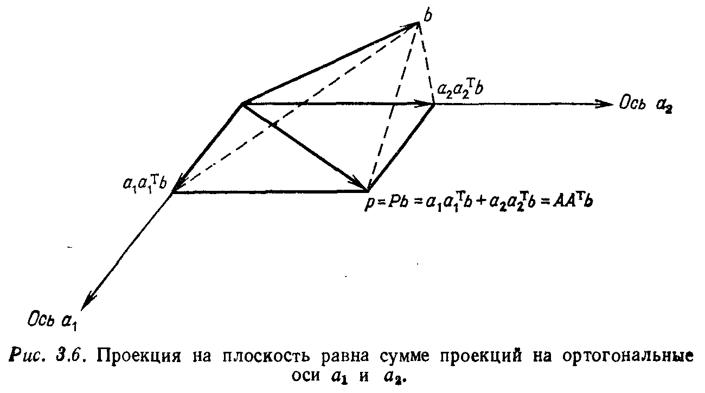

## § 3.3. ОРТОГОНАЛЬНЫЕ БАЗИСЫ, ОРТОГОНАЛЬНЫЕ МАТРИЦЫ И ОРТОГОНАЛИЗАЦИЯ ГРАМА — ШМИДТА

---
**стр. 146**
---

(Ср. с упр. 3.2.1.) Говоря языком статистики, выбор $\bar{y}$, минимизирующий функцию $E^2 = (y_1 - \bar{y})^2 + \ldots + (y_m - \bar{y})^2$, представляет собой среднее значение выборки, а величина $E^2$ называется дисперсией и обозначается через $\sigma^2$.

**Упражнение 3.2.11.** Для следующего набора измерений найти оптимальное линейное приближение и изобразить его:
$y = 2$ при $t = -1$, $y = 0$ при $t = 0$,
$y = -3$ при $t = 1$, $y = -5$ при $t = 2$.

**Упражнение 3.2.12.** Пусть мы приближаем указанные выше результаты измерений не с помощью прямой, а с использованием параболы $y = C + Dt + Et^2$. Для несовместной системы $Ax = b$, образованной в результате четырех замеров, выписать матрицу коэффициентов $A$, вектор неизвестных $x$ и вектор исходных данных $b$. Вычислять оптимальный вектор $x$ не обязательно.

Мы уже пытались показать важность свойства ортогональности при решении задач методом наименьших квадратов и продолжаем делать это. Но на самом деле свойство ортогональности является значительно более важным и содержательно более глубоким, чем это может показаться из его применения к методу наименьших квадратов. Каждый раз, когда я представляю себе плоскость $xy$ или трёхмерное пространство, воображение обязательно добавляет к картине набор координатных осей. Они дают нам отправную точку, называемую началом координат, причём *эти воображаемые координатные оси всегда являются взаимно ортогональными*. Выбирая базис в плоскости $xy$ (что эквивалентно выбору координатных осей), мы стремимся выбрать ортогональный базис.

Если понятие базиса является одним из основных моментов при соединении геометрии векторных пространств с алгеброй, то выделение ортогонального базиса также легко объяснить. Базис необходим для перехода от геометрической конструкции к алгебраическим вычислениям, а ортогональный базис нужен нам для того, чтобы сделать эти вычисления более простыми. Существует ещё одно ограничение, введение которого делает базис почти оптимальным: мы начинаем с набора взаимно ортогональных векторов и нормализуем их к векторам единичной длины. Это означает, что каждый вектор $v$ из рассматриваемого набора делится на свою собственную длину и заменяется на вектор $v/\|v\|$. В результате ортогональный базис превращается в *ортонормированный*.

---
**стр. 147**
---

**3K.** Базис $v_1, \ldots, v_k$ называется **ортонормированным**, если
$$v_i^\mathrm{T} v_j = \begin{cases} 0 & \text{при } i \neq j \text{ (свойство ортогональности),} \\ 1 & \text{при } i = j \text{ (нормированность).} \end{cases} \qquad (30)$$

Наиболее важным примером этого является так называемый *стандартный базис*. В плоскости $xy$ или в пространстве $\mathbf{R}^n$ мы не только задаём взаимно перпендикулярные оси координат, но также отмечаем на каждой оси вектор единичной длины:
$$
e_1 = \begin{bmatrix} 1 \\ 0 \\ 0 \\ \cdot \\ \cdot \\ \cdot \\ 0 \end{bmatrix}, \quad
e_2 = \begin{bmatrix} 0 \\ 1 \\ 0 \\ \cdot \\ \cdot \\ \cdot \\ 0 \end{bmatrix}, \quad
\ldots, \quad
e_n = \begin{bmatrix} 0 \\ 0 \\ 0 \\ \cdot \\ \cdot \\ \cdot \\ 1 \end{bmatrix}.
$$
Этот ортонормированный базис никоим образом не является единственным, поскольку мы можем поворачивать весь набор осей, оставляя неизменными прямые углы между ними. Ниже будут введены соответствующие этим поворотам матрицы вращений, называемые также ортогональными матрицами. С другой стороны, если мы рассматриваем не всё пространство $\mathbf{R}^n$, а лишь его подпространство, то «стандартные векторы» $e_i$ могут лежать вне этого подпространства. В этом случае существование даже одного ортонормированного базиса не столь очевидно. Но мы покажем, что такой базис всегда существует и что он легко может быть построен по произвольному базису. Это построение, переводящее неортогональный набор осей в ортогональный, известно под названием *ортогонализации Грама — Шмидта*.

Итак, три основных пункта настоящего параграфа состоят в следующем:
(1) Решение методом наименьших квадратов системы $Ax = b$, когда столбцы матрицы $A$ являются ортонормированными.
(2) Определение и свойства ортогональных матриц.
(3) Процесс ортогонализации Грама — Шмидта и его интерпретация как нового способа разложения матриц.

### ПРОЕКЦИИ И НАИМЕНЬШИЕ КВАДРАТЫ: ОРТОНОРМИРОВАННЫЙ СЛУЧАЙ

Пусть $A$ — матрица размера $m \times n$, и пусть её столбцы являются ортонормированными. Тогда эти столбцы являются линейно независимыми, и мы знаем матрицу проектирования на пространство столбцов, а также решение $\bar{x}$ по методу наимень-

---
**стр. 148**
---

ших квадратов: $P = A(A^\mathrm{T} A)^{-1} A^\mathrm{T}$ и $\bar{x} = (A^\mathrm{T} A)^{-1} A^\mathrm{T} b$. Эти формулы не только справедливы для случая ортонормированных столбцов, но и становятся исключительно простыми, поскольку $A^\mathrm{T} A$ превращается в единичную матрицу.

**3L.** Если столбцы матрицы $A$ являются ортонормированными, то
$$
A^\mathrm{T} A =
\begin{bmatrix}
\text{— } a_1^\mathrm{T} \text{ —} \\
\text{— } a_2^\mathrm{T} \text{ —} \\
\vdots \\
\text{— } a_n^\mathrm{T} \text{ —}
\end{bmatrix}
\begin{bmatrix}
| & | & & | \\
a_1 & a_2 & \cdots & a_n \\
| & | & & |
\end{bmatrix}
=
\begin{bmatrix}
1 & 0 & \cdot & 0 \\
0 & 1 & \cdot & 0 \\
\cdot & \cdot & \cdot & \cdot \\
0 & 0 & \cdot & 1
\end{bmatrix}
= I. \qquad (31)
$$
Это обстоятельство чрезвычайно упрощает алгебраические выражения, поскольку матрица $P$ и вектор $\bar{x}$ преобразуются к виду
$$P = AA^\mathrm{T} \quad \text{и} \quad \bar{x} = A^\mathrm{T} b. \qquad (32)$$
Одновременно с этим «улучшается» и геометрия, поскольку простая алгебраическая формула должна иметь простое геометрическое истолкование. Когда оси координат взаимно перпендикулярны, проекция на пространство разлагается в сумму проекций на каждую из осей (рис. 3.6). Матрица проектирования принимает вид $P = a_1 a_1^\mathrm{T} + \ldots + a_n a_n^\mathrm{T}$:
$$
p = AA^\mathrm{T} b =
\begin{bmatrix}
| & & | \\
a_1 & \cdots & a_n \\
| & & |
\end{bmatrix}
\begin{bmatrix}
a_1^\mathrm{T} b \\
\vdots \\
a_n^\mathrm{T} b
\end{bmatrix}
= a_1 a_1^\mathrm{T} b + \ldots + a_n a_n^\mathrm{T} b. \qquad (33)
$$

---
**стр. 149**
---

Сопрягающий член $(A^\mathrm{T} A)^{-1}$ исчезает, так что $p$ превращается в сумму $n$ отдельных проекций.

Таким образом, мы получаем пять основных формул этой главы, которые полезно выписать вместе:

1. $Ax = b$ — исходная система (возможно, несовместная);
2. $A^\mathrm{T} A \bar{x} = A^\mathrm{T} b$ — нормальные уравнения для $\bar{x}$;
3. $p = A\bar{x}$ — проекция вектора $b$ на пространство столбцов матрицы $A$;
4. $P = A(A^\mathrm{T} A)^{-1} A^\mathrm{T}$ — матрица проектирования, дающая вектор $p = Pb$;
5. $\bar{x} = A^\mathrm{T} b$ и $P = AA^\mathrm{T} = a_1 a_1^\mathrm{T} + \ldots + a_n a_n^\mathrm{T}$ — частный случай, когда матрица $A$ имеет ортонормированные столбцы.

**Пример 1.** Рассмотрим следующий простой, но типичный случай. Пусть точка $b = (x, y, z)$ проектируется на плоскость $xy$. Ясно, что проекцией будет $p = (x, y, 0)$, и она представляет собой сумму отдельных проекций на оси $x$ и $y$:
$$
a_1 = \begin{bmatrix} 1 \\ 0 \\ 0 \end{bmatrix}, \quad
a_1 a_1^\mathrm{T} b = \begin{bmatrix} x \\ 0 \\ 0 \end{bmatrix}; \qquad
a_2 = \begin{bmatrix} 0 \\ 1 \\ 0 \end{bmatrix}, \quad
a_2 a_2^\mathrm{T} b = \begin{bmatrix} 0 \\ y \\ 0 \end{bmatrix}.
$$
Таким образом, матрица проектирования имеет вид
$$
P = a_1 a_1^\mathrm{T} + a_2 a_2^\mathrm{T} =
\begin{bmatrix} 1 & 0 & 0 \\ 0 & 1 & 0 \\ 0 & 0 & 0 \end{bmatrix},
\quad \text{или} \quad
P \begin{bmatrix} x \\ y \\ z \end{bmatrix} = \begin{bmatrix} x \\ y \\ 0 \end{bmatrix}.
$$

**Пример 2.** Существует один случай линейного приближения данных, когда столбцы матрицы оказываются ортогональными. Если измерения $b_1$, $b_2$ и $b_3$ производятся в моменты времени, симметричные относительно точки $t = 0$ (скажем, при $t_1 = -1$, $t_2 = 0$ и $t_3 = 1$), то попытка построения приближения $y = C + Dt$ приводит к трём уравнениям с двумя неизвестными:
$$
\begin{matrix}
C + Dt_1 = b_1, \\
C + Dt_2 = b_2, \\
C + Dt_3 = b_3,
\end{matrix}
\quad \text{или} \quad
\begin{bmatrix} 1 & -1 \\ 1 & 0 \\ 1 & 1 \end{bmatrix}
\begin{bmatrix} C \\ D \end{bmatrix} =
\begin{bmatrix} b_1 \\ b_2 \\ b_3 \end{bmatrix}.
$$
Столбцы этой матрицы взаимно ортогональны. Они не являются ортонормированными, но легко могут быть сделаны таковыми — мы вычисляем их длины, равные $\sqrt{3}$ и $\sqrt{2}$, и производим замену

---
**стр. 150**
---

неизвестных $c = C\sqrt{3}$, $d = D\sqrt{2}$:
$$
Ax = \begin{bmatrix}
1/\sqrt{3} & -1/\sqrt{2} \\
1/\sqrt{3} & 0 \\
1/\sqrt{3} & 1/\sqrt{2}
\end{bmatrix}
\begin{bmatrix} c \\ d \end{bmatrix} =
\begin{bmatrix} b_1 \\ b_2 \\ b_3 \end{bmatrix}.
$$
Теперь $A^\mathrm{T} A$ является единичной матрицей и решение по методу наименьших квадратов выписывается непосредственно:
$$
\bar{x} = A^\mathrm{T} b =
\begin{bmatrix}
(b_1 + b_2 + b_3)/\sqrt{3} \\
(-b_1 + b_3)/\sqrt{2}
\end{bmatrix}
=
\begin{bmatrix} \bar{c} \\ \bar{d} \end{bmatrix}. \qquad (34)
$$
Другими словами, коэффициенты $C$ и $D$ оптимальной прямой имеют вид
$$
C = \frac{c}{\sqrt{3}} = \frac{b_1 + b_2 + b_3}{3}, \qquad
D = \frac{d}{\sqrt{2}} = \frac{-b_1 + b_3}{2}.
$$

*Каждая из компонент $C$ и $D$ важна сама по себе. $C$ есть среднее арифметическое данных, и этот коэффициент даёт наилучшее приближение горизонтальной прямой, а $Dt$ даёт наилучшее приближение прямой, проходящей через начало координат. Поскольку столбцы матрицы ортогональны, сумма этих двух слагаемых даёт наилучшее приближение в классе всех прямых линий.*

*Замечание.* Изучение специальных свойств ортонормированного базиса часто даёт полезный «побочный эффект». Обычный базис легче описать с помощью свойств, которыми он не обладает. Воображение ошибается, представляя каждый базис ортонормированным. То же самое справедливо относительно специального свойства проекций, которое только что было нами отмечено, а именно, что в ортонормированном случае они представляют собой сумму $n$ одномерных проекций. Интуиция подсказывает, что вектор можно представить в виде суммы его компонент по координатным осям, но что наличие этого представления зависит от ортогональности осей. Если ось $x$ заменяется прямой $y = x$ и вектор $(0, 1)$ проектируется на эту прямую и на ось $y$, то сумма двух проекций отнюдь не совпадает с исходным вектором $(0, 1)$.

**Упражнение 3.3.1.** (а) Выписать четыре уравнения для линейного приближения $y = C + Dt$ следующих данных:
$y = -4$ при $t = -2$, $y = -3$ при $t = -1$,
$y = -1$ при $t = 1$, $y = 0$ при $t = 2$.

Показать, что столбцы соответствующей матрицы являются ортогональными и нормализовать их. Какой вид имеют неизвестные $c$ и $d$ в новой задаче $Ax = b$?

---
**стр. 151**
---

(b) Найти оптимальную прямую, нарисовать её и вычислить ошибку $E^2$.

(c) Объяснить, почему для исходной системы из четырёх уравнений с двумя неизвестными ошибка равняется нулю. Где по отношению к пространству столбцов матрицы находится вектор правой части $b$ и чему равняется его проекция $p$?

**Упражнение 3.3.2.** Спроецировать вектор $b = (0, 3, 0)$ на каждый из двух ортонормированных векторов $a_1 = (2/3, 2/3, -1/3)$, $a_2 = (-1/3, 2/3, 2/3)$ и найти его проекцию $p$ на плоскость векторов $a_1$, $a_2$.

**Упражнение 3.3.3.** Найти проекцию вектора $b = (0, 3, 0)$ на вектор $a_3 = (2/3, -1/3, 2/3)$, сложить эту проекцию с двумя проекциями из предыдущего упражнения и объяснить получившийся результат. Почему $P = a_1 a_1^\mathrm{T} + a_2 a_2^\mathrm{T} + a_3 a_3^\mathrm{T}$ равняется единице?

### ОРТОГОНАЛЬНЫЕ МАТРИЦЫ

*Ортогональной* называется квадратная матрица, имеющая *ортонормированные столбцы*[^1]. Мы будем обозначать ортогональную матрицу буквой $Q$, а её столбцы — буквами $q_1, \ldots, q_n$. Установленное ранее соотношение $Q^\mathrm{T} Q = I$ является лишь другим выражением ортонормированности столбцов матрицы:
$$
Q^\mathrm{T} Q =
\begin{bmatrix}
\text{— } q_1^\mathrm{T} \text{ —} \\
\vdots \\
\text{— } q_n^\mathrm{T} \text{ —}
\end{bmatrix}
\begin{bmatrix}
| & & | \\
q_1 & \cdots & q_n \\
| & & |
\end{bmatrix}
=
\begin{bmatrix}
1 & & \\
& \ddots & \\
& & 1
\end{bmatrix}
= I. \qquad (35)
$$
Равенство (35) совпадает с (31), где мы получили соотношение $A^\mathrm{T} A = I$, а матрица $A$ не обязательно была квадратной.

В чём состоят отличия при квадратной матрице $Q$? Квадратная матрица с независимыми столбцами имеет полный ранг $r = n$, и она обратима; если матрица $Q^\mathrm{T}$ является левой обратной к ней, то она является и просто обратной. Другими словами, матрица $Q^\mathrm{T}$ одновременно является и правой обратной, т. е. $QQ^\mathrm{T} = I$.

**3М.** Ортогональная матрица обладает следующими свойствами:
$$Q^\mathrm{T} Q = I, \quad QQ^\mathrm{T} = I \quad \text{и} \quad Q^\mathrm{T} = Q^{-1}. \qquad (36)$$
Матрица $Q$ имеет не только ортонормированные столбцы, как это требуется в её определении, но также и ортонормированные строки. Другими словами, если $Q$ — ортогональная матрица, то и $Q^\mathrm{T}$ будет ортогональной.

[^1]: Возможно, эти матрицы следовало бы назвать *ортонормированными*, но теперь уже поздно что-либо менять.

---
**стр. 152**
---

Последнее утверждение об ортонормированности строк немедленно получается из соотношения $QQ^{\mathrm{T}} = I$. В произведении $QQ^{\mathrm{T}}$ участвуют скалярные произведения каждой строки матрицы $Q$ на каждую другую строку, и, поскольку в результате получается единичная матрица, эти строки являются ортонормированными. Необходимо обратить внимание на этот замечательный факт. Вектор-строки имеют совершенно иные направления, чем вектор-столбцы, но они каким-то образом автоматически оказываются взаимно перпендикулярными при перпендикулярности столбцов.

**Пример 1**

$$Q = \begin{bmatrix} \cos\theta & -\sin\theta \\ \sin\theta & \cos\theta \end{bmatrix}, \quad Q^{\mathrm{T}} = Q^{-1} = \begin{bmatrix} \cos\theta & \sin\theta \\ -\sin\theta & \cos\theta \end{bmatrix}.$$

Матрица $Q$ поворачивает каждый вектор на угол $\theta$, а матрица $Q^{\mathrm{T}}$ поворачивает его в обратном направлении на угол $-\theta$.

**Пример 2.** Любая матрица перестановки $P$ является ортогональной, поскольку ее вектор-столбцы имеют единичную длину и ортогональны друг другу (в силу того, что единицы в столбцах расположены на различных местах):

если $P = \begin{bmatrix} 0 & 1 \\ 1 & 0 \end{bmatrix}$, то $P^{-1} = P^{\mathrm{T}} = \begin{bmatrix} 0 & 1 \\ 1 & 0 \end{bmatrix}$;

и если $P = \begin{bmatrix} 0 & 1 & 0 \\ 0 & 0 & 1 \\ 1 & 0 & 0 \end{bmatrix}$, то $P^{-1} = P^{\mathrm{T}} = \begin{bmatrix} 0 & 0 & 1 \\ 1 & 0 & 0 \\ 0 & 1 & 0 \end{bmatrix}$.

В первом случае, где матрица получена путем перестановки лишь двух строк единичной матрицы, будет справедливо дополнительное свойство $P^{-1} = P$. В общем случае это не выполняется, как показывает второй пример, где переставлены местами все три строки матрицы. Отметим также, что матрица $P = \begin{bmatrix} 0 & 1 \\ 1 & 0 \end{bmatrix}$ не является матрицей вращения $Q$ из первого примера, т. е. ее нельзя получить ни при каком значении $\theta$. На самом деле матрица $P$ отображает каждую точку $(x, y)$ в ее зеркальный образ $(y, x)$ относительно прямой $y = x$, наклоненной под углом $45°$ к оси $x$. Таким образом, нельзя утверждать, что каждая ортогональная матрица $Q$ представляет собой чистое вращение.

Однако остается одно свойство, которым обладают и матрицы вращений $Q$, и матрицы перестановок $P$, и вообще все ортогональные матрицы. Причем это свойство является как наиболее важным, так и наиболее характерным для ортогональных матриц:

---
**стр. 153**
---

**3N.** Умножение на ортогональную матрицу $Q$ сохраняет длины:

$$\|Qx\| = \|x\| \quad \text{для любого вектора } x, \tag{37}$$

а также скалярные произведения:

$$(Qx)^{\mathrm{T}}(Qy) = x^{\mathrm{T}}y \quad \text{для всех векторов } x \text{ и } y. \tag{38}$$

Доказательство получается непосредственно: $(Qx)^{\mathrm{T}}(Qy) = x^{\mathrm{T}} Q^{\mathrm{T}} Q y = x^{\mathrm{T}} I y = x^{\mathrm{T}} y$. Если $y = x$, то это соотношение принимает вид $\|Qx\|^2 = \|x\|^2$, так что длины сохраняются, раз сохраняются скалярные произведения.

**Пример.** Для описанных выше вращений плоскости имеем

$$\begin{bmatrix} \cos\theta & -\sin\theta \\ \sin\theta & \cos\theta \end{bmatrix} \begin{bmatrix} x \\ y \end{bmatrix} = \begin{bmatrix} x\cos\theta - y\sin\theta \\ x\sin\theta + y\cos\theta \end{bmatrix}.$$

Длина вектора сохраняется, поскольку

$$(x\cos\theta - y\sin\theta)^2 + (x\sin\theta + y\cos\theta)^2 = x^2 + y^2.$$

**Упражнение 3.3.4.** Пусть $Q_1$ и $Q_2$ — ортогональные матрицы, так что для них выполняются соотношения (36). Показать, что матрица $Q_1 Q_2$ также является ортогональной.

**Упражнение 3.3.5.** Пусть $u$ — единичный вектор. Показать, что матрица $Q = I - 2uu^{\mathrm{T}}$ является ортогональной. (Она называется преобразованием Хаусхолдера). Найти матрицу $Q$, если $u = (1, 1, 1)/\sqrt{3}$.

**Упражнение 3.3.6.** Подобрать третий столбец так, чтобы матрица

$$Q = \begin{bmatrix} 1/\sqrt{3} & 1/\sqrt{2} \\ 1/\sqrt{3} & 0 \\ 1/\sqrt{3} & -1/\sqrt{2} \end{bmatrix}$$

была ортогональной. Вектор, ортогональный остальным столбцам, должен быть единичным; в таком случае, насколько мы свободны в его выборе? Проверить, что одновременно становятся ортонормированными и строки матрицы.

**Упражнение 3.3.7.** Записав в явном виде выражение $v^{\mathrm{T}} v$, показать, что теорема Пифагора выполняется для любой комбинации $v = x_1 q_1 + \dots + x_n q_n$ ортонормированных векторов:

$$\|v\|^2 = x_1^2 + \dots + x_n^2.$$

В терминах матриц это означает, что $v = Qx$, так что мы получаем новое и более наглядное доказательство того, что длины векторов сохраняются: $\|Qx\|^2 = \|x\|^2$.

---
**стр. 154**
---

**Упражнение 3.3.8.** Является ли ортогональной следующая матрица

$$Q = \begin{bmatrix} \frac{1}{2} & \frac{1}{2} & \frac{1}{2} & \frac{1}{2} \\ \frac{1}{2} & \frac{1}{2} & -\frac{1}{2} & -\frac{1}{2} \\ \frac{1}{2} & -\frac{1}{2} & -\frac{1}{2} & \frac{1}{2} \\ \frac{1}{2} & -\frac{1}{2} & \frac{1}{2} & -\frac{1}{2} \end{bmatrix} ?$$

## ОРТОГОНАЛИЗАЦИЯ ГРАМА — ШМИДТА

Мы уже видели, какие преимущества несет в себе ортонормированность столбцов матрицы: для обращения матрицы $Q$ нужно лишь транспонировать ее, и решение задачи о наименьших квадратах $Ax = b$ сразу получается в виде $\bar{x} = A^{\mathrm{T}} b$. Но во всех случаях мы были вынуждены начинать со слов: «Если столбцы матрицы являются ортонормированными...». Теперь мы хотим показать, как сделать их ортонормированными.

Это можно сделать предварительно, до начала решения самой задачи. Для иллюстрации рассмотрим простейший пример. Пусть заданы два независимых вектора $a$ и $b$, и мы хотим получить из них два взаимно перпендикулярных вектора $v_1$ и $v_2$. Естественно, что в качестве первого из них можно взять вектор $a$, т. е. $v_1 = a$. Тогда задача состоит в отыскании перпендикулярного вектора. Но ведь именно с этого и начиналась данная глава: вектор $b - p$ был перпендикулярен $a$, поскольку проекция вектора $b$ на направление вектора $a$ (вектор $p$) вычиталась из $b$. Таким образом, направление второй оси задается вектором

$$v_2 = b - p = b - \frac{a^{\mathrm{T}} b}{a^{\mathrm{T}} a} a = b - \frac{v_1^{\mathrm{T}} b}{v_1^{\mathrm{T}} v_1} v_1. \tag{39}$$

Легко проверяется, что $v_1^{\mathrm{T}} v_2 = v_1^{\mathrm{T}} b - v_1^{\mathrm{T}} b = 0$.

Чтобы сделать процесс Грама — Шмидта совершенно очевидным, предположим, что у нас имеется еще и третий линейно независимый вектор $c$. Идея остается в точности такой же. *Мы вычитаем компоненты в разложении вектора $c$ по направлениям $v_1$ и $v_2$, которые уже нами получены:*

$$v_3 = c - \frac{v_1^{\mathrm{T}} c}{v_1^{\mathrm{T}} v_1} v_1 - \frac{v_2^{\mathrm{T}} c}{v_2^{\mathrm{T}} v_2} v_2. \tag{40}$$

Тогда вектор $v_3$ автоматически оказывается перпендикулярен векторам $v_1$ и $v_2$, например:

$$v_1^{\mathrm{T}} v_3 = v_1^{\mathrm{T}} c - \frac{v_1^{\mathrm{T}} c}{v_1^{\mathrm{T}} v_1} v_1^{\mathrm{T}} v_1 - \frac{v_2^{\mathrm{T}} c}{v_2^{\mathrm{T}} v_2} v_1^{\mathrm{T}} v_2 = 0.$$

---
**стр. 155**
---

Фактически мы вычитаем из вектора $c$ его проекцию на плоскость векторов $a$ и $b$, но нам удобнее использовать уже имеющиеся взаимно перпендикулярные направления $v_1$ и $v_2$. Проекция вектора $c$ на плоскость равна сумме проекций этого вектора на направления $v_1$ и $v_2$, и именно поэтому формула (40) оказывается столь простой. Отметим, что $v_3$ не может быть нулевым вектором, поскольку в этом случае вектор $c$ лежал бы в плоскости векторов $a$ и $b$, что противоречит линейной независимости всех трех векторов. Разумеется, полученные векторы $v_i$ являются лишь ортогональными, а не ортонормированными. Для превращения их в единичные векторы разделим каждый вектор на его длину:

$$q_1 = \frac{v_1}{\|v_1\|}, \quad q_2 = \frac{v_2}{\|v_2\|}, \quad q_3 = \frac{v_3}{\|v_3\|}.$$

Этот процесс ортогонализации, дающий каждый новый вектор $v_i$ путем вычитания кратных векторов $v_1, \dots, v_{i-1}$, формулируется следующим образом:

**3О.** Произвольный набор независимых векторов $a_1, \dots, a_n$ может быть преобразован в набор взаимно ортогональных векторов при помощи процесса Грама — Шмидта: в качестве первого вектора берем $v_1 = a_1$ и затем строим каждый последующий вектор $v_i$, ортогональный к векторам $v_1, \dots, v_{i-1}$, по формуле

$$v_i = a_i - \frac{v_1^{\mathrm{T}} a_i}{v_1^{\mathrm{T}} v_1} v_1 - \dots - \frac{v_{i-1}^{\mathrm{T}} a_i}{v_{i-1}^{\mathrm{T}} v_{i-1}} v_{i-1}. \tag{41}$$

Для любого номера $i$ подпространство, порожденное исходными векторами $a_1, \dots, a_i$, совпадает с подпространством, порожденным векторами $v_1, \dots, v_i$. В результате векторы $q_i = v_i / \|v_i\|$ оказываются ортонормированными.

**Пример.** Пусть заданы векторы

$$a_1 = \begin{bmatrix} 1 \\ 1 \\ 0 \end{bmatrix}, \quad a_2 = \begin{bmatrix} 1 \\ 0 \\ 1 \end{bmatrix}, \quad a_3 = \begin{bmatrix} 0 \\ 1 \\ 1 \end{bmatrix}.$$

Тогда $v_1 = a_1$, а вектор $v_2$ вычисляется согласно (39):

$$\frac{a_2^{\mathrm{T}} v_1}{v_1^{\mathrm{T}} v_1} = \frac{1}{2}, \quad v_2 = a_2 - \frac{1}{2} v_1 = \begin{bmatrix} \frac{1}{2} \\ -\frac{1}{2} \\ 1 \end{bmatrix}.$$

---
**стр. 156**
---

Третья перпендикулярная ось находится из уравнения (40):

$$\frac{a_3^{\mathrm{T}} v_1}{v_1^{\mathrm{T}} v_1} = \frac{1}{2}, \quad \frac{a_3^{\mathrm{T}} v_2}{v_2^{\mathrm{T}} v_2} = \frac{\frac{1}{2}}{\frac{6}{4}} = \frac{1}{3}, \quad v_3 = a_3 - \frac{1}{2} v_1 - \frac{1}{3} v_2 = \begin{bmatrix} -\frac{2}{3} \\ \frac{2}{3} \\ \frac{2}{3} \end{bmatrix}.$$

Окончательная система ортонормированных векторов имеет вид

$$q_1 = \frac{v_1}{\|v_1\|} = \sqrt{\frac{1}{2}} \begin{bmatrix} 1 \\ 1 \\ 0 \end{bmatrix}, \quad q_2 = \frac{v_2}{\|v_2\|} = \sqrt{\frac{2}{3}} \begin{bmatrix} \frac{1}{2} \\ -\frac{1}{2} \\ 1 \end{bmatrix},$$

$$q_3 = \frac{v_3}{\|v_3\|} = \sqrt{\frac{3}{4}} \begin{bmatrix} -\frac{2}{3} \\ \frac{2}{3} \\ \frac{2}{3} \end{bmatrix}.$$

Поскольку описанный алгоритм Грама — Шмидта является весьма простым и очевидным, должен существовать в равной степени простой и очевидный способ записи окончательного его результата. Поясним, как это можно сделать. Ситуация во многом близка к той, которая встречалась уже в методе исключения Гаусса, где элементарные операции выбирались естественным образом в процессе исключения, но выписывать заранее всю последовательность было бы очень неудобно. Для метода исключения удобная форма записи результата заключалась в разложении матрицы $A = LU$. В нашем же случае процесс Грама — Шмидта будет выражаться другим разложением матрицы $A$.

Так же как и для метода исключения, прием состоит в отыскании формул, выражающих исходные столбцы $a_i$ матрицы через векторы $q_i$. В рассмотренном выше примере можно записать

$$a_1 = v_1, \quad \text{или} \quad a_1 = \sqrt{2}\, q_1,$$

$$a_2 = \frac{1}{2} v_1 + v_2, \quad \text{или} \quad a_2 = \sqrt{\frac{1}{2}}\, q_1 + \sqrt{\frac{3}{2}}\, q_2,$$

$$a_3 = \frac{1}{2} v_1 + \frac{1}{3} v_2 + v_3, \quad \text{или} \quad a_3 = \sqrt{\frac{1}{2}}\, q_1 + \sqrt{\frac{1}{6}}\, q_2 + \sqrt{\frac{4}{3}}\, q_3.$$

---
**стр. 157**
---

Эта система уравнений так и просится быть записанной в матричном виде:

$$\begin{bmatrix} a_1 & a_2 & a_3 \end{bmatrix} = \begin{bmatrix} q_1 & q_2 & q_3 \end{bmatrix} \begin{bmatrix} \sqrt{2} & \sqrt{\frac{1}{2}} & \sqrt{\frac{1}{2}} \\ 0 & \sqrt{\frac{3}{2}} & \sqrt{\frac{1}{6}} \\ 0 & 0 & \sqrt{\frac{4}{3}} \end{bmatrix}. \tag{42}$$

**Исходная матрица $A$ разлагается в произведение ортогональной матрицы $Q$ и верхней треугольной матрицы $R$.** Столбцы матрицы $Q$ являются искомыми ортонормированными векторами, а элементы матрицы $R$ получаются из соотношения (41). Оно дает выражение векторов $a_i$ через комбинацию векторов $v_1, \dots, v_i$, и нам нужно лишь заменить $v_1$ на $\|v_1\|\, q_1$, $v_2$ на $\|v_2\|\, q_2$ и т. д. Тогда $a_i$ будет комбинацией векторов $q_1, \dots, q_i$, а оставшиеся векторы $q_{i+1}, \dots, q_n$ в нее не входят.

Именно поэтому матрица $R$ является верхней треугольной. Коэффициенты этой линейной комбинации записываются в $i$-м столбце матрицы $R$, причем элементы главной диагонали матрицы не равны нулю, поскольку вектор $v_i$ заменяется в (41) на $\|v_i\|\, q_i$, и на диагонали будет находиться ненулевой коэффициент $\|v_i\|$¹). Таким образом, матрица $R$ обратима. Это дает основной результат данного параграфа:

**3Р.** Любая матрица $A$ с линейно независимыми столбцами может быть разложена в произведение $A = QR$, где матрица $Q$ имеет ортогональные столбцы, а $R$ является верхней треугольной и обратимой матрицей. Если исходная матрица $A$ была квадратной, то и матрицы $Q$ и $R$ будут квадратными, так что $Q$ окажется ортогональной матрицей.

Используя разложение $A = QR$, легко решить задачу о наименьших квадратах $Ax = b$. Из (21) имеем

$$\bar{x} = (A^{\mathrm{T}} A)^{-1} A^{\mathrm{T}} b = (R^{\mathrm{T}} Q^{\mathrm{T}} Q R)^{-1} R^{\mathrm{T}} Q^{\mathrm{T}} b.$$

Но $Q^{\mathrm{T}} Q = I$, поскольку столбцы матрицы $Q$ являются ортонормированными. Следовательно,

$$\bar{x} = (R^{\mathrm{T}} R)^{-1} R^{\mathrm{T}} Q^{\mathrm{T}} b = R^{-1} Q^{\mathrm{T}} b. \tag{43}$$

Таким образом, вычисление решения $\bar{x}$ требует лишь подсчета произведения $Q^{\mathrm{T}} b$ и обратной подстановки в системе с треуголь-

---

¹) Нетрудно заметить, что в (42) на диагонали расположены длины векторов $\|v_i\|$.

---
**стр. 158**
---

ной матрицей $R\bar{x} = Q^{\mathrm{T}} b$. Предварительно выполненная ортогонализация избавляет нас от необходимости строить матрицу $A^{\mathrm{T}} A$ и решать систему нормальных уравнений $A^{\mathrm{T}} A\bar{x} = A^{\mathrm{T}} b^{1)}$.

**Упражнение 3.3.9.** Применить процесс Грама — Шмидта к векторам
$$a_1 = \begin{bmatrix} 0 \\ 0 \\ 1 \end{bmatrix}, \quad a_2 = \begin{bmatrix} 0 \\ 1 \\ 1 \end{bmatrix}, \quad a_3 = \begin{bmatrix} 1 \\ 1 \\ 1 \end{bmatrix}$$
и записать результат в виде произведения $A = QR$.

**Упражнение 3.3.10.** Представить матрицу $A = \begin{bmatrix} 3 & 0 \\ 4 & 5 \end{bmatrix}$ в виде $QR$.

**Упражнение 3.3.11.** Записать ортогонализацию Грама — Шмидта для векторов
$$a_1 = \begin{bmatrix} 1 \\ 2 \\ 2 \end{bmatrix}, \quad a_2 = \begin{bmatrix} 1 \\ 3 \\ 1 \end{bmatrix}$$
в виде $A = QR$. Если заданы $n$ векторов $a_j$, каждый из которых имеет $m$ компонент, то как будут выглядеть матрицы $A$, $Q$ и $R$?

**Упражнение 3.3.12.** Для той же самой матрицы $A$ и вектора $b = (1, 1, 1)^{\mathrm{T}}$ решить задачу о наименьших квадратах $Ax = b$ (используя разложение $A = QR$).

**Упражнение 3.3.13.** Пусть $A = QR$. Найти простое выражение для матрицы $P$, осуществляющей проектирование на пространство столбцов матрицы $A$.

**Упражнение 3.3.14.** Показать, что два шага
$$w = c - \frac{v_1^{\mathrm{T}} c}{v_1^{\mathrm{T}} v_1} v_1, \quad v_3 = w - \frac{v_2^{\mathrm{T}} w}{v_2^{\mathrm{T}} v_2} v_2$$
дают то же самое третье направление $v_3$, что и формула (40). Это пример модифицированного алгоритма Грама — Шмидта, где для повышения устойчивости счета на каждом шаге вычитается лишь одна проекция.

### ФУНКЦИОНАЛЬНЫЕ ПРОСТРАНСТВА И РЯДЫ ФУРЬЕ

Хотя этот короткий раздел и является дополнительным, он преследует важные цели, а именно:
(1) ввести (причем впервые) понятие бесконечномерного пространства,

$^{1)}$ При этом мы выигрываем, но не в числе операций, которое на самом деле при использовании предварительной ортогонализации будет больше, а в численной устойчивости. По крайней мере это будет так, если перейти к модифицированному алгоритму Грама—Шмидта, описанному в упр. 3.3.14, или (лучше) к алгоритму Хаусхолдера из § 7.3.

---
**стр. 159**
---

(2) перенести понятия длины и скалярного произведения с векторов $v$ на функции $f(x)$,
(3) представить ряд Фурье функции $f$ как сумму одномерных проекций; при этом ортогональными «столбцами», которые порождают пространство, будут синусы и косинусы,
(4) применить ортогонализацию Грама — Шмидта к функциям $1, x, x^2, \dots$,
(5) найти наилучшую линейную аппроксимацию функции $f(x)$.

Попытаемся систематически рассмотреть эти вопросы, которые открывают новые возможности приложений линейной алгебры.

**1.** После изучения всех конечномерных пространств $\mathbf{R}^n$ естественно рассмотреть пространство $\mathbf{R}^\infty$, содержащее все векторы вида $v = (v_1, v_2, v_3, \dots)$, имеющие бесконечное число компонент. Такое пространство окажется слишком «большим» для того, чтобы его можно было использовать, если на компоненты $v_i$ не наложить никаких ограничений. Лучше всего сохранить уже привычное определение длины как корня из суммы квадратов компонент и ограничиться лишь *теми* векторами, которые имеют конечную длину: бесконечный ряд
$$\|v\|^2 = v_1^2 + v_2^2 + v_3^2 + \dots \qquad (44)$$
должен сходиться, т. е. иметь конечную сумму. При этом мы сохраняем бесконечномерность векторов и включаем, например, вектор $(1, 1/2, 1/3, \dots)$, но исключаем $(1, 1/\sqrt{2}, 1/\sqrt{3}, \dots)$. Векторы конечной длины можно складывать друг с другом (поскольку $\|v + w\| \le \|v\| + \|w\|$), и умножать на скаляры, так что они образуют векторное пространство. Это знаменитое ***гильбертово пространство***.

Понятие гильбертова пространства дает наиболее естественный способ введения бесконечного числа измерений при сохранении геометрии обычных евклидовых пространств. Эллипсы превращаются в бесконечномерные эллипсоиды, параболы переходят в параболоиды, и перпендикулярность прямых вводится совершенно аналогичным образом: векторы $v = (v_1, v_2, \dots)$ и $w = (w_1, w_2, \dots)$ являются ортогональными, если их скалярное произведение равняется нулю,
$$v^{\mathrm{T}} w = v_1 w_1 + v_2 w_2 + v_3 w_3 + \dots = 0. \qquad (45)$$
Эта сумма, естественно, конечна, и для любых двух векторов она удовлетворяет неравенству Шварца $|v^{\mathrm{T}} w| \le \|v\| \|w\|$. Значения косинуса даже в гильбертовом пространстве никогда не превосходят единицу.

Это пространство замечательно еще в одном отношении: оно является очень распространенным. Векторы гильбертова прост-

---
**стр. 160**
---

ранства могут превратиться в функции, и это приводит нас ко второму пункту.

**2.** Рассмотрим функцию $f(x) = \sin x$ на интервале $0 \le x \le 2\pi$. Ее можно воспринимать как вектор с континуальным числом компонент, равных значениям синуса на всем отрезке. Естественно, что применить обычное правило суммирования квадратов для отыскания длины такого вектора невозможно. Поэтому суммирование естественным образом заменяется интегрированием:
$$\|f\|^2 = \int_0^{2\pi} (f(x))^2 \, dx = \int_0^{2\pi} (\sin x)^2 \, dx = \pi. \qquad (46)$$
Наше гильбертово пространство превратилось в некоторое функциональное пространство: векторами являются функции, мы можем измерять их длину, и пространство содержит все функции, имеющие конечную длину, как в формуле (44). Это пространство не содержит функции $F(x) = 1/x$, поскольку интеграл от $1/x^2$ расходится.

Та же самая идея замены суммирования интегрированием дает скалярное произведение двух функций: если $f(x) = \sin x$ и $g(x) = \cos x$, то
$$f^{\mathrm{T}} g = \int_0^{2\pi} f(x) g(x) \, dx = \int_0^{2\pi} \sin x \cos x \, dx = 0.$$
Скалярное произведение по-прежнему связано с длиной соотношением $f^{\mathrm{T}} f = \|f\|^2$, и выполняется неравенство Шварца: $|f^{\mathrm{T}} g| \le \|f\| \|g\|$. Естественно, что две функции, скалярное произведение которых равняется нулю (как $\sin x$ и $\cos x$), будут называться ортогональными. Если разделить их на длину $\sqrt{\pi}$, то они будут даже ортонормированными.

**3.** **Рядом Фурье** функции $y(x)$ называется разложение этой функции по синусам и косинусам:
$$y(x) = a_0 + a_1 \cos x + b_1 \sin x + a_2 \cos 2x + b_2 \sin 2x + \dots .$$
Для вычисления любого коэффициента, скажем $b_1$, умножим обе части на соответствующую функцию (здесь на $\sin x$) и проинтегрируем от $0$ до $2\pi$. Другими словами, мы вычисляем скалярное произведение обеих частей на $\sin x$:
$$\int_0^{2\pi} y(x) \sin x \, dx = a_0 \int_0^{2\pi} \sin x \, dx + a_1 \int_0^{2\pi} \cos x \sin x \, dx +$$
$$+ b_1 \int_0^{2\pi} (\sin x)^2 \, dx + \dots .$$

---
**стр. 161**
---

Все интегралы в правой части, кроме одного, будут равны нулю. Единственный ненулевой интеграл получается при умножении $\sin x$ на себя. Это означает, что синусы и косинусы попарно ортогональны. Таким образом, коэффициент при функции $f(x) = \sin x$ равен
$$b_1 = \frac{\int_0^{2\pi} y(x) \sin x \, dx}{\int_0^{2\pi} (\sin x)^2 \, dx} = \frac{y^{\mathrm{T}} f}{f^{\mathrm{T}} f}, \quad \text{или} \quad b_1 \sin x = \frac{y^{\mathrm{T}} f}{f^{\mathrm{T}} f} f. \qquad (47)$$
Эти вычисления производятся для того, чтобы увидеть аналогию с проекциями. Компонента в разложении вектора $b$, лежащая на прямой, порожденной вектором $a$, была вычислена в начале главы:
$$\bar{x} = \frac{b^{\mathrm{T}} a}{a^{\mathrm{T}} a}, \quad \text{или} \quad p = \bar{x} a = \frac{b^{\mathrm{T}} a}{a^{\mathrm{T}} a} a.$$
Для ряда Фурье мы проектируем функцию $y$ на функцию $\sin x$, и компонента $p$ по этому направлению в точности совпадает с членом $b_1 \sin x$. Коэффициент $b_1$ является решением по методу наименьших квадратов для несовместного уравнения $b_1 \sin x = y$. Другими словами, мы выбираем функцию $b_1 \sin x$ как можно ближе к функции $y$ (см. упр. 3.3.16). То же самое верно и для остальных членов ряда: каждый из них является проекцией функции $y$ на синус или косинус. Поскольку эти синусы и косинусы являются взаимно ортогональными, ряд Фурье дает координаты «вектора» $y$ по набору (бесконечного числа) взаимно перпендикулярных осей.

**4.** Существует масса других полезных функций, отличных от синуса и косинуса, и они не всегда являются ортогональными. Простейшими из них являются многочлены, и, к сожалению, не существует интервала, на котором даже первые три координатные оси, т. е. функции $1, x, x^2$, были бы взаимно перпендикулярными. (Скалярное произведение $1$ на $x^2$ всегда положительно, поскольку оно равняется интегралу от $x^2$.) Поэтому ближайшая к функции $y(x)$ парабола не будет суммой проекций на $1, x$ и $x^2$. Здесь будет присутствовать сопрягающий член, аналогичный $(A^{\mathrm{T}} A)^{-1}$ для матричного случая, и фактически это сопряжение осуществляется при помощи плохо обусловленной матрицы Гильберта,

---
**стр. 162**
---

рассмотренной в упр. 1.5.11. На отрезке $0 \le x \le 1$ имеем
$$A^{\mathrm{T}} A = \begin{bmatrix} 1^{\mathrm{T}} 1 & 1^{\mathrm{T}} x & 1^{\mathrm{T}} x^2 \\ x^{\mathrm{T}} 1 & x^{\mathrm{T}} x & x^{\mathrm{T}} x^2 \\ (x^2)^{\mathrm{T}} 1 & (x^2)^{\mathrm{T}} x & (x^2)^{\mathrm{T}} x^2 \end{bmatrix} = \begin{bmatrix} \int 1 & \int x & \int x^2 \\ \int x & \int x^2 & \int x^3 \\ \int x^2 & \int x^3 & \int x^4 \end{bmatrix} = \begin{bmatrix} 1 & \frac{1}{2} & \frac{1}{3} \\ \frac{1}{2} & \frac{1}{3} & \frac{1}{4} \\ \frac{1}{3} & \frac{1}{4} & \frac{1}{5} \end{bmatrix}.$$
Элементы обратной матрицы будут велики, поскольку оси $1, x, x^2$ далеко не перпендикулярны. Даже для современной ЭВМ ситуация становится безнадежной, если мы добавим еще несколько осей; *решить систему нормальных уравнений $A^{\mathrm{T}} A\bar{x} = A^{\mathrm{T}} b$ для отыскания многочлена наилучшего приближения десятой степени практически невозможно*.

Точнее говоря, невозможно решить эту систему методом исключения Гаусса, поскольку все ошибки округления будут возрастать более чем в $10^{13}$ раз. С другой стороны, мы не можем отказаться от возможности осуществлять аппроксимацию при помощи многочленов. Правильный подход состоит в переходе к взаимно ортогональным осям при помощи ортогонализации Грама — Шмидта: мы ищем комбинации функций $1, x, x^2$, являющиеся ортогональными.

Нам удобнее перейти к симметрично расположенному отрезку, например $-1 \le x \le 1$, поскольку при этом нечетные степени $x$ становятся ортогональными к четным:
$$1^{\mathrm{T}} x = \int_{-1}^{1} x \, dx = 0, \quad x^{\mathrm{T}} x^2 = \int_{-1}^{1} x^3 \, dx = 0.$$
Следовательно, можно начать процесс Грама — Шмидта, положив $v_1 = 1$, $v_2 = x$ в качестве первых двух перпендикулярных осей, так что остается лишь скорректировать угол между $1$ и $x^2$. Пользуясь формулой (40), получаем третий ортогональный многочлен в виде
$$v_3 = x^2 - \frac{1^{\mathrm{T}} x^2}{1^{\mathrm{T}} 1} 1 - \frac{x^{\mathrm{T}} x^2}{x^{\mathrm{T}} x} x = x^2 - \frac{\int_{-1}^{1} x^2 \, dx}{\int_{-1}^{1} 1 \, dx} = x^2 - \frac{1}{3}.$$
Построенные таким способом многочлены называются *многочленами Лежандра*, и они взаимно ортогональны на отрезке $-1 \le x \le 1$.

*Проверка.*
$$1^{\mathrm{T}} \left(x^2 - \frac{1}{3}\right) = \int_{-1}^{1} \left(x^2 - \frac{1}{3}\right) \, dx = \left[\frac{x^3}{3} - \frac{x}{3}\right]_{-1}^{1} = 0.$$

---
**стр. 163**
---

Теперь нетрудно вычислить многочлен наилучшего приближения десятой степени, осуществляя проектирование на каждый из первых десяти (или одиннадцати) многочленов Лежандра.

**5.** Пусть на отрезке $0 \le x \le 1$ задана функция $f(x) = \sqrt{x}$, и мы хотим приблизить ее прямой линией $y = C + Dx$. Существуют по крайней мере три способа отыскания этой наилучшей прямой, и, если сравнить их друг с другом, это может прояснить содержание всей главы!

(i) Минимизировать
$$E^2 = \int_0^1 (\sqrt{x} - C - Dx)^2 \, dx = \frac{1}{2} - \frac{4}{3}C - \frac{4}{5}D + C^2 + CD + \frac{D^2}{3}.$$
Приравнивая нулю производные, получаем
$$\frac{\partial E^2}{\partial C} = -\frac{4}{3} + 2C + D = 0, \quad \frac{\partial E^2}{\partial D} = -\frac{4}{5} + C + \frac{2D}{3} = 0.$$
Отсюда получаем решение $C = 4/15$, $D = 4/5$.

(ii) Решить систему $[1 \quad x] \begin{bmatrix} C \\ D \end{bmatrix} = [\sqrt{x}]$, или $Ay = f$, методом наименьших квадратов.
$$A^{\mathrm{T}} A = \begin{bmatrix} 1^{\mathrm{T}} 1 & 1^{\mathrm{T}} x \\ x^{\mathrm{T}} 1 & x^{\mathrm{T}} x \end{bmatrix} = \begin{bmatrix} 1 & \frac{1}{2} \\ \frac{1}{2} & \frac{1}{3} \end{bmatrix}, \quad (A^{\mathrm{T}} A)^{-1} = \begin{bmatrix} 4 & -6 \\ -6 & 12 \end{bmatrix},$$
$$A^{\mathrm{T}} f = \begin{bmatrix} 1^{\mathrm{T}} \sqrt{x} \\ x^{\mathrm{T}} \sqrt{x} \end{bmatrix} = \begin{bmatrix} \frac{2}{3} \\ \frac{2}{5} \end{bmatrix}.$$
Решение нормальной системы имеет вид
$$\bar{y} = (A^{\mathrm{T}} A)^{-1} A^{\mathrm{T}} f, \quad \text{или} \quad \begin{bmatrix} C \\ D \end{bmatrix} = \begin{bmatrix} 4 & -6 \\ -6 & 12 \end{bmatrix} \begin{bmatrix} \frac{2}{3} \\ \frac{2}{5} \end{bmatrix} = \begin{bmatrix} \frac{4}{15} \\ \frac{4}{5} \end{bmatrix}.$$

(iii) Применить процесс Грама — Шмидта для получения второго столбца $x - 1/2$, ортогонального первому столбцу:
$$1^{\mathrm{T}} \left(x - \frac{1}{2}\right) = \int \left(x - \frac{1}{2}\right) dx = 0.$$
