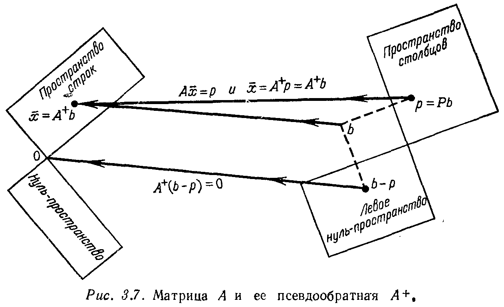

## § 3.4. ПСЕВДООБРАЩЕНИЕ И СИНГУЛЯРНОЕ РАЗЛОЖЕНИЕ

---
**стр. 164**
---

Тогда проекция функции $\sqrt{x}$ равна

$$y = \frac{\sqrt{x}^T 1}{1^T 1} 1 + \frac{\sqrt{x}^T (x - \frac{1}{2})}{(x - \frac{1}{2})^T (x - \frac{1}{2})} (x - \frac{1}{2}) = \frac{2}{3} + \frac{4}{5} \left(x - \frac{1}{2}\right) = \frac{4}{15} + \frac{4}{5} x.$$

**Упражнение 3.3.15.** Найти длину вектора $v = (1/\sqrt{2}, 1/\sqrt{4}, 1/\sqrt{8}, \dots)$ и функции $f(x) = e^x$ (на отрезке $0 \leqslant x \leqslant 1$). Чему равняется скалярное произведение функций $e^x$ и $e^{-x}$ на этом отрезке?

**Упражнение 3.3.16.** Приравнивая нулю производную, найти значение $b_1$, минимизирующее

$$\| b_1 \sin x - y \|^2 = \int_0^{2\pi} (b_1 \sin x - y(x))^2 dx.$$

Сравнить с коэффициентом Фурье (47). Если $y(x) = \cos x$, то чему будет равен $b_1$?

**Упражнение 3.3.17.** Найти коэффициенты Фурье $a_0, a_1, b_1$ для ступенчатой функции $y(x)$, равной 1 на отрезке $0 \leqslant x \leqslant \pi$ и 0 на интервале $\pi < x < 2\pi$:

$$a_0 = \frac{y^T 1}{1^T 1}, \quad a_1 = \frac{y^T \cos x}{(\cos x)^T \cos x}, \quad b_1 = \frac{y^T \sin x}{(\sin x)^T \sin x}.$$

**Упражнение 3.3.18.** Найти следующий многочлен Лежандра, т. е. кубический многочлен, ортогональный к $1, x$ и $x^2 - 1/3$.

**Упражнение 3.3.19.** Как выглядит прямая наилучшего приближения для параболы $y = x^2$ на отрезке $-1 \leqslant x \leqslant 1$?

**§ 3.4. ПСЕВДООБРАЩЕНИЕ**
**И СИНГУЛЯРНОЕ РАЗЛОЖЕНИЕ**

Чему равно оптимальное решение $\bar{x}$ несовместной системы $Ax = b$? Мы еще не получили окончательного ответа на этот основной вопрос всей главы. Теперь мы собираемся сделать это. Наша цель состоит в указании правила, с помощью которого мы находим вектор $\bar{x}$ по заданной матрице коэффициентов $A$ и правой части $b$.

Эта цель уже наполовину достигнута, поскольку мы знаем, чему равен вектор $A\bar{x}$. Для произвольного $x$ вектор $Ax$ обязательно лежит в пространстве столбцов матрицы $A$; он является комбинацией столбцов с компонентами вектора $x$ в качестве весов. Поэтому оптимальный выбор $A\bar{x}$ представляет собой точку $p$ в пространстве столбцов, ближайшую к заданной точке $b$. Этот выбор минимизирует ошибку $E = \| Ax - b \|$. Другими словами, наи-

---
**стр. 165**
---

лучшая стратегия заключается в проектировании вектора $b$ на пространство столбцов:

$$A\bar{x} = p = Pb. \qquad (48)$$

В большом числе случаев (я думаю, что они включают большинство практических задач) этого уравнения достаточно для отыскания вектора $\bar{x}$. (Оно является другой формой записи нормального уравнения $A^T A \bar{x} = A^T b$, которое возникало в 31 при минимизации ошибки $E$.) Естественно, что вектор $\bar{x}$ будет определен лишь в том случае, когда существует только одна комбинация столбцов матрицы $A$, дающая вектор $p$; веса этой комбинации и определяют вектор $\bar{x}$. Это соответствует «единственности», описанной в гл. 2, и мы знаем несколько эквивалентных условий для того, чтобы уравнение $A\bar{x} = p$ имело единственное решение:

(i) столбцы матрицы $A$ линейно независимы,

(ii) нуль-пространство матрицы $A$ содержит только нулевой вектор,

(iii) ранг матрицы $A$ равен $n$,

(iv) квадратная матрица $A^T A$ является обратимой.

Для этого случая единственное решение уравнения (48) уже изучалось нами в течение всей главы:

$$\bar{x} = (A^T A)^{-1} A^T b. \qquad (49)$$

Эта сравнительно простая формула включает в себя наиболее простой случай — когда матрица $A$ действительно обратима. Тогда вектор $\bar{x}$ совпадает с единственным решением исходной системы $Ax = b$: $\bar{x} = A^{-1} (A^T)^{-1} A^T b = A^{-1} b$.

Это обстоятельство дает другой способ для описания нашей цели: мы пытаемся определить **псевдообратную** $A^+$ к матрице, которая может не быть обратимой$^1$). Если матрица обратима, то, естественно, $A^+ = A^{-1}$. Когда исходная матрица удовлетворяет перечисленным выше условиям (i)—(iv), псевдообратной является левая обратная матрица из формулы (49): $A^+ = (A^T A)^{-1} A^T$. Но если условия (i)—(iv) не выполняются и вектор $\bar{x}$ определяется из системы $A\bar{x} = p$ не единственным образом, понятие псевдообратной матрицы еще подлежит определению. Мы должны выбрать один из многих векторов, удовлетворяющих системе $A\bar{x} = p$, и

$^1$) Матрица $A^+$ также называется обратной матрицей Мура — Пенроуза, поскольку именно они ввели это понятие, или обобщенной обратной к $A$. Однако название «обобщенная обратная» часто применяется к другим матрицам, которые обладают не всеми свойствами матрицы $A^+$. Именно поэтому мы и пользуемся термином «псевдообратная».

---
**стр. 166**
---

этот выбор по определению будет считаться оптимальным решением $\bar{x} = A^+ b$ несовместной системы $Ax = b$.

Выбор осуществляется по следующему правилу: *оптимальным среди всех решений системы $A\bar{x} = p$ является решение с минимальной длиной.* Для его отыскания вспомним, что пространство строк и нуль-пространство матрицы $A$ представляют собой ортогональные дополнения друг к другу в пространстве $\mathbf{R}^n$. Это означает, что любой вектор может быть разложен на две перпендикулярные составляющие — проекцию на пространство строк и проекцию на нуль-пространство. Применим это разложение к одному из решений (обозначим его через $\bar{x}_0$) системы $A\bar{x} = p$. Тогда $\bar{x}_0 = \bar{x}_r + w$, где $\bar{x}_r$ принадлежит пространству строк, а $w$ — нуль-пространству. Здесь возникают три существенных момента:

(1) Компонента $\bar{x}_r$ сама является решением системы $A\bar{x} = p$, поскольку $Aw = 0$, имеем

$$A\bar{x}_r = A(\bar{x}_r + w) = A\bar{x}_0 = p.$$

(2) Все решения системы $A\bar{x} = p$ имеют одну и ту же компоненту $\bar{x}_r$ в пространстве строк и отличаются лишь компонентой из нуль-пространства. «Общее решение равняется сумме частного решения (в данном случае это $\bar{x}_r$) и произвольного решения однородного уравнения».

(3) Длина такого решения $\bar{x}_r + w$ удовлетворяет теореме Пифагора, поскольку две компоненты взаимно ортогональны:

$$\|\bar{x}_r + w\|^2 = \|\bar{x}_r\|^2 + \|w\|^2.$$

Отсюда мы заключаем, что решением с минимальной длиной является вектор $\bar{x}_r$. Нам следует приравнять компоненту из нуль-пространства нулю, оставив решение, целиком принадлежащее пространству строк.

**3Q.** *Оптимальным решением по методу наименьших квадратов произвольной системы $Ax = b$ является вектор $\bar{x}_r$ (или $\bar{x}$, если вернуться к исходным обозначениям), определяемый двумя условиями:*

(1) вектор $A\bar{x}$ равняется проекции вектора $b$ на пространство столбцов матрицы $A$,

(2) вектор $\bar{x}$ принадлежит пространству строк матрицы $A$.

Матрица, «решающая» систему $Ax = b$, является псевдообратной к $A$ матрицей $A^+$, и она определяется уравнением $\bar{x} = A^+ b$.

---
**стр. 167**
---

Легче всего понять смысл псевдообратной матрицы из геометрических соображений. Для этого мы вновь обратимся к четырем основным подпространствам матрицы (рис. 3.7).

Матрица $A^+$ сочетает в себе результат применения двух отдельных шагов: она проектирует $b$ на $p$ и выбирает единственный вектор $\bar{x}$ из пространства строк матрицы, являющийся решением системы $A\bar{x} = p$. Один крайний случай возникает, когда вектор $b$ перпендикулярен пространству столбцов матрицы, т. е. когда вектор $b$ лежит в левом нуль-пространстве. Тогда $p = 0$ и $\bar{x} = 0$: матрица $A^+$ переводит все векторы из $\mathcal{N}(A^T)$ в нуль. Другая крайность состоит в том, что вектор $b$ может лежать целиком в пространстве столбцов; тогда $p = b$ и решение $\bar{x}$ находится путем «обращения» матрицы $A$. (Мы уже отмечали в 2.2, что матрица $A$ обратима, если рассматривать ее просто как отображение из ее пространства строк в пространство столбцов; обратной будет матрица $A^+$.)

Произвольный вектор $b$ разбивается в соответствии с этими двумя предельными случаями: компонента $p$ обращается, давая вектор $\bar{x}$, а другая компонента $b - p$ аннулируется. Из этого описания и из рис. 3.7 можно вывести некоторые основные свойства псевдообратной матрицы:

(1) Матрица $A^+$ имеет размер $n \times m$. Она применяется к вектору $b$ из $\mathbf{R}^m$ и дает вектор $\bar{x}$ из $\mathbf{R}^n$.

(2) Пространство столбцов матрицы $A^+$ совпадает с пространством строк матрицы $A$, а пространство строк матрицы $A^+$ сов-

---
**стр. 168**
---

падает с пространством столбцов $A$. (В качестве важного следствия получаем, что $r(A^+) = r(A)$.)

(3) Псевдообратная к матрице $A^+$ есть матрица $A$.

(4) В общем случае $AA^+ \neq I$, поскольку матрица $A$ может не иметь правой обратной, но матрица $AA^+$ всегда совпадает с матрицей $P$, осуществляющей проектирование на пространство столбцов:

$$AA^+ b = A\bar{x} = p = Pb, \quad \text{или} \quad AA^+ = P. \qquad (50)$$

**Пример 1.** Матрица

$$A = \begin{bmatrix} 1 & 0 & 0 \\ 0 & 1 & 0 \\ 0 & 0 & 0 \end{bmatrix}$$

не является обратимой. Ее пространство столбцов и пространство строк совпадают с плоскостью $xy$ в $\mathbf{R}^3$, которая содержит все векторы вида $(x, y, 0)$. Нуль-пространством является ось $z$, и, разумеется, оно ортогонально пространству строк. Отыскание вектора $\bar{x}$ начинается с проектирования $b$ на пространство столбцов:

$$\text{если } b = \begin{bmatrix} b_1 \\ b_2 \\ b_3 \end{bmatrix}, \quad \text{то } p = Pb = \begin{bmatrix} b_1 \\ b_2 \\ 0 \end{bmatrix}.$$

Затем мы решаем систему $A\bar{x} = p$, т. е.

$$\begin{bmatrix} 1 & 0 & 0 \\ 0 & 1 & 0 \\ 0 & 0 & 0 \end{bmatrix} \begin{bmatrix} \bar{x}_1 \\ \bar{x}_2 \\ \bar{x}_3 \end{bmatrix} = \begin{bmatrix} b_1 \\ b_2 \\ 0 \end{bmatrix}. \qquad (51)$$

Решение выписывается легко: $\bar{x}_1 = b_1$, $\bar{x}_2 = b_2$ и $\bar{x}_3$ произвольно. Из этого бесконечного семейства решений мы выбираем одно, имеющее минимальную длину, полагая третью компоненту $\bar{x}_3$ равной нулю. Это дает вектор $\bar{x} = (b_1, b_2, 0)^T$, лежащий в пространстве строк (т. е. в плоскости $xy$), как и должно было быть, согласно теории. Наконец, мы находим псевдообратную матрицу $A^+$:

$$A^+ = \begin{bmatrix} 1 & 0 & 0 \\ 0 & 1 & 0 \\ 0 & 0 & 0 \end{bmatrix}, \quad A^+ b = \begin{bmatrix} b_1 \\ b_2 \\ 0 \end{bmatrix} = \bar{x}.$$

В нашем случае матрица $A^+$ совпадает с $A$. Это происходит потому, что матрица $A$ действует подобно единичной матрице

---
**стр. 169**
---

при отображении своего пространства строк в пространство столбцов, а все остальное для псевдообратной матрицы несущественно.

Подведем итог сказанному выше. Оптимальное решение несовместной системы $Ax = b$

$$x_1 + 0x_2 + 0x_3 = b_1,$$
$$0x_1 + x_2 + 0x_3 = b_2,$$
$$0x_1 + 0x_2 + 0x_3 = b_3$$

заключается в том, что мы находим решение первых двух уравнений и полагаем $x_3 = 0$.

**Пример 2.** Пусть

$$A = \begin{bmatrix} \mu_1 & 0 & 0 & 0 \\ 0 & \mu_2 & 0 & 0 \\ 0 & 0 & 0 & 0 \end{bmatrix},$$

где $\mu_1 > 0$, $\mu_2 > 0$. Пространство столбцов этой матрицы вновь совпадает с плоскостью $xy$, так что проектирование вектора $b$ опять приводит к аннулированию его компоненты вдоль оси $z$: $p = Pb = (b_1, b_2, 0)^T$. Система $A\bar{x} = p$ принимает вид

$$\begin{bmatrix} \mu_1 & 0 & 0 & 0 \\ 0 & \mu_2 & 0 & 0 \\ 0 & 0 & 0 & 0 \end{bmatrix} \begin{bmatrix} \bar{x}_1 \\ \bar{x}_2 \\ \bar{x}_3 \\ \bar{x}_4 \end{bmatrix} = \begin{bmatrix} b_1 \\ b_2 \\ 0 \end{bmatrix}.$$

Первые две компоненты вновь оказываются определенными: $\bar{x}_1 = b_1/\mu_1$, $\bar{x}_2 = b_2/\mu_2$. Оставшиеся две компоненты должны равняться нулю в силу требования минимальности длины, так что оптимальное решение имеет вид

$$\bar{x} = \begin{bmatrix} b_1/\mu_1 \\ b_2/\mu_2 \\ 0 \\ 0 \end{bmatrix}, \quad \text{или} \quad A^+ b = \begin{bmatrix} \mu_1^{-1} & 0 & 0 \\ 0 & \mu_2^{-1} & 0 \\ 0 & 0 & 0 \\ 0 & 0 & 0 \end{bmatrix} \begin{bmatrix} b_1 \\ b_2 \\ b_3 \end{bmatrix}.$$

Эти два примера являются типичными для всего семейства матриц специального вида, имеющих в качестве первых $r$ элементов главной диагонали положительные числа $\mu_1, \dots, \mu_r$ и остальные элементы которых равняются нулю. Если обозначить такую матрицу через $\Sigma$, то псевдообратная к ней вычисляется

---
**стр. 170**
---

в точности так же, как и в приведенных примерах:

$$\Sigma = \begin{bmatrix} \mu_1 & & \\ & \ddots & \\ & & \mu_r \end{bmatrix} \quad \text{и} \quad \Sigma^+ = \begin{bmatrix} \mu_1^{-1} & & \\ & \ddots & \\ & & \mu_r^{-1} \end{bmatrix}.$$

Если матрица $\Sigma$ имеет размер $m \times n$, то $\Sigma^+$ будет иметь размер $n \times m$. Легко видеть, что ранг матрицы $\Sigma^+$ равен рангу $\Sigma$ (т. е. $r$) и что псевдообратная к $\Sigma^+$ совпадает с $\Sigma$: $(\Sigma^+)^+ = \Sigma$.

Эти простые матрицы гораздо полезнее, чем может показаться, поскольку они дают новый способ для разложения матрицы $A$. Такое разложение называется **сингулярным разложением**, и оно отнюдь не столь известно, как того заслуживает.

**3R.** *Произвольная матрица размера $m \times n$ может быть представлена в виде $A = Q_1 \Sigma Q_2^T$, где $Q_1$ есть ортогональная матрица размера $m \times m$, $Q_2$ — ортогональная матрица размера $n \times n$, а матрица $\Sigma$ имеет специальную диагональную форму, описанную выше.*

Числа $\mu_i$ называются *сингулярными числами* матрицы $A$. Это разложение немедленно приводит к явной формуле для псевдообратной матрицы — результат, которого нам так не хватало. Для этого частного случая (но не для общего — см. формулу (60) ниже) мы собираемся «псевдообратить» все три сомножителя по отдельности и затем перемножить их, как обычно, в обратном порядке. Поскольку обратная к ортогональной матрице совпадает с транспонированной, формула будет иметь вид

$$A^+ = Q_2 \Sigma^+ Q_1^T. \qquad (52)$$

Эта формула легко доказывается непосредственно из принципа наименьших квадратов. Умножение на ортогональную матрицу $Q_1^T$ не изменяет длину вектора (согласно 3N), так что минимизируемая ошибка имеет вид

$$\|Ax - b\| = \|Q_1 \Sigma Q_2^T x - b\| = \|\Sigma Q_2^T x - Q_1^T b\|. \qquad (53)$$

Введем новый неизвестный вектор $y = Q_2^T x = Q_2^{-1} x$, длина которого совпадает с длиной вектора $x$. Тогда мы будем минимизировать величину $\|\Sigma y - Q_1^T b\|$, и оптимальное решение $\bar{y}$ (т. е. решение с минимальной длиной) имеет вид $\bar{y} = \Sigma^+ Q_1^T b$. Следова-

---
**стр. 171**
---

тельно,

$$\bar{x} = Q_2 \bar{y} = Q_2 \Sigma^+ Q_1^T b, \quad \text{или} \quad A^+ = Q_2 \Sigma^+ Q_1^T \; {}^1). \qquad (54)$$

Доказательство справедливости приведенного сингулярного разложения основано на главном результате из гл. 5: для симметрической матрицы вида $A^T A$ существует ортонормированный набор «собственных векторов» $x_1, \dots, x_n$ (которые образуют столбцы матрицы $Q_2$):

$$A^T A x_i = \lambda_i x_i, \quad \text{причем} \quad x_i^T x_i = 1 \quad \text{и} \quad x_j^T x_i = 0 \quad \text{для} \quad j \neq i. \qquad (55\text{a})$$

Умножая скалярно на $x_i$, получаем, что $\lambda_i \ge 0$:

$$x_i^T A^T A x_i = \lambda_i x_i^T x_i, \quad \text{или} \quad \|Ax_i\|^2 = \lambda_i. \qquad (55\text{b})$$

Предположим, что числа $\lambda_1, \dots, \lambda_r$ положительны, а остальные $n - r$ векторов $Ax_i$ и чисел $\lambda_i$ равны нулю. Для положительных $\lambda_i$ положим $\mu_i = \sqrt{\lambda_i}$ и $y_i = Ax_i / \mu_i$. Из (55b) следует, что $y_i$ являются единичными векторами, причем ортогональными (что вытекает из (55a)):

$$y_j^T y_i = \frac{x_j^T A^T A x_i}{\mu_j \mu_i} = \frac{\lambda_i x_j^T x_i}{\mu_j \mu_i} = 0 \quad \text{для} \quad j \neq i.$$

Следовательно, мы имеем систему $r$ ортонормированных векторов, которая может быть расширена до полного ортонормированного базиса $y_1, \dots, y_r, \dots, y_m$, образующего столбцы матрицы $Q_1$, при помощи процедуры Грама — Шмидта. Тогда элементами матрицы $Q_1^T A Q_2$ будут числа $y_j^T A x_i$, равные нулю при $i > r$ (поскольку в этом случае $Ax_i = 0$) и равные $y_j^T \mu_i y_i$ при $i \le r$. Последние равняются нулю при $j \neq i$ и $\mu_i$ при $j = i$. Другими словами, матрица $Q_1^T A Q_2$ в точности совпадает со специальной матрицей $\Sigma$, у которой на главной диагонали расположены числа $\mu_i$. Следовательно, $A = Q_1 \Sigma Q_2^T$. Матрицы вращения $Q_1$ и $Q_2$ поворачивают пространство столбцов матрицы $A$ до совпадения с пространством строк, так что матрица $A$ переходит в диагональную матрицу $\Sigma$.

**Пример 3.** Если $A$ есть вектор-столбец $\begin{bmatrix} 3 \\ 4 \end{bmatrix}$, то $A^T A$ будет матрицей первого порядка $[25]$, и ее единственный собственный вектор равен $x = [1]$. Это и есть матрица $Q_2$. Затем мы находим $\lambda = 25$, $\mu = 5$ и $y_1 = Ax/\mu = \begin{bmatrix} 3/5 \\ 4/5 \end{bmatrix}$. Второй столбец матрицы $Q_1$

$^1$) На практике бывает полезно выделить очень маленькие числа $\mu_i$ и заменить их нулями. В противном случае ошибки округления или эксперимента легко могут дать, например, число $\mu_r = 10^{-6}$, так что $\mu_r^{-1} = 10^6$ и псевдообратная матрица окажется «плохой». Это свидетельствует о крайней неустойчивости ранга и, следовательно, псевдообратной матрицы.

---
**стр. 172**
---

должен быть ортогонален к $y_1$, так что

$$Q_1^T A Q_2 = \begin{bmatrix} 3/5 & 4/5 \\ 4/5 & -3/5 \end{bmatrix} \begin{bmatrix} 3 \\ 4 \end{bmatrix} [1] = \begin{bmatrix} 5 \\ 0 \end{bmatrix} = \Sigma.$$

Это и есть требуемая диагональная форма. Псевдообратной к столбцу $\Sigma$ является строка $\Sigma^+ = [1/5 \quad 0]$, так что окончательно имеем $A^+ = Q_2 \Sigma^+ Q_1^T = [3/25 \quad 4/25]$. Отметим, что $A^+ A = I$; в данном примере ранг равен $r = n = 1$, так что псевдообратная является левой обратной матрицей.

Разумеется, сингулярное разложение требует отыскания ортогональных матриц $Q_1$ и $Q_2$, что, как правило, невозможно осуществить при помощи операций над строками. Ближе по духу к нашему изложению было бы попытаться вычислить вектор $x$ непосредственно из сомножителей $L$ и $U$ метода Гаусса. Результат напоминает $U^{-1}L^{-1}$-разложение матрицы $A^{-1}$, и, поскольку найти его где-либо невозможно, мы приведем полное доказательство, которое, разумеется, при чтении можно опустить$^1$).

Идея состоит в отбрасывании нулевых строк матрицы $U$, как это уже делалось на стр. 120. Если матрица $A$ имеет ранг $r$, то таких строк будет $m - r$. Одновременно мы отбрасываем также и последние $m - r$ столбцов матрицы $L$, или матрицы $P^{-1}L$, если в процессе исключения придется делать перестановки строк матрицы. Обозначим через $\bar{U}$ оставшуюся от $U$ матрицу размера $r \times n$, а через $\bar{L}$ — оставшуюся от $L$ матрицу размера $m \times r$.

**Пример 4** (когда ранг $r$ равен 2).

$$A = \begin{bmatrix} 1 & 2 \\ 2 & 5 \\ 3 & 7 \end{bmatrix} = \begin{bmatrix} 1 & 0 & 0 \\ 2 & 1 & 0 \\ 3 & 1 & 1 \end{bmatrix} \begin{bmatrix} 1 & 2 \\ 0 & 1 \\ 0 & 0 \end{bmatrix} = \begin{bmatrix} 1 & 0 \\ 2 & 1 \\ 3 & 1 \end{bmatrix} \begin{bmatrix} 1 & 2 \\ 0 & 1 \end{bmatrix} = \bar{L}\bar{U}.$$

Последний столбец матрицы $L$ — который умножается лишь на последнюю строку матрицы $U$ — устраняется без изменения скалярного произведения: $LU = \bar{L}\bar{U}$. Отметим два существенных обстоятельства:

(1) $\bar{U}$ есть матрица размера $r \times n$ и ранга $r$. Ее пространство строк совпадает с пространством строк матрицы $U$, поскольку мы удаляем лишь нулевые строки. *Следовательно, пространства строк матриц $\bar{U}$ и $A$ совпадают.*

$^1$) Мы не считаем, что новая и более «элементарная» формула (56) будет удобнее для вычислений, чем (52) или процесс Грама — Шмидта. Скорее всего, как раз наоборот.

---
**стр. 173**
---

(2) $\bar{L}$ есть матрица размера $m \times r$, и она также имеет ранг $r$; матрица $L$ (и матрица $P$ так же) обратима, так что ее первые $r$ столбцов являются линейно независимыми. Как отмечалось в § 2.6, пространства столбцов матриц $\bar{L}$ и $A$ совпадают.

При помощи разложения $A = \bar{L}\bar{U}$ мы можем, наконец, явным образом построить матрицу $A^+$:

**3S.** *Псевдообратная к произвольной матрице размера $m \times n$ дается формулой*

$$A^+ = \bar{U}^T (\bar{U} \bar{U}^T)^{-1} (\bar{L}^T \bar{L})^{-1} \bar{L}^T. \qquad (56)$$

Наша цель — проверить, что вектор $A^+ b$ является оптимальным решением $\bar{x}$ задачи о наименьших квадратах $Ax = b$. Это и будет служить доказательством правильности формулы (56). Как отмечалось выше, вектор $\bar{x}$ должен удовлетворять двум условиям: он должен лежать в пространстве строк матрицы $A$, и вектор $A\bar{x}$ должен равняться проекции $p$ вектора $b$ на пространство столбцов. Поэтому доказательство заключается в сопоставлении этих свойств с двумя свойствами (для матриц $\bar{U}$ и $\bar{L}$), приведенными выше.

(1') Если записать вектор $A^+ b$ в соответствии с (56), то он будет произведением матрицы $\bar{U}^T$ (в левой части формулы) и некоторого вектора $y$. Другими словами, он будет комбинацией столбцов матрицы $\bar{U}^T$. Поскольку эти столбцы являются строками матрицы $\bar{U}$, вектор $A^+ b$ принадлежит пространству строк матрицы $\bar{U}$, т. е. пространству строк матрицы $A$. Таким образом, первое условие выполняется.

(2') Умножая $A^+ b$ на матрицу $A$, мы надеемся получить вектор $p$:

$$AA^+ b = (\bar{L}\bar{U}) [\bar{U}^T (\bar{U} \bar{U}^T)^{-1} (\bar{L}^T \bar{L})^{-1} \bar{L}^T b] = \bar{L} (\bar{L}^T \bar{L})^{-1} \bar{L}^T b. \qquad (57)$$

Но $\bar{L} (\bar{L}^T \bar{L})^{-1} \bar{L}^T$ в точности совпадает с матрицей проектирования на пространство столбцов матрицы $\bar{L}$. Следовательно, формула (57) дает вектор $p = Pb$. Таким образом, вектор $A^+ b$ удовлетворяет обоим условиям оптимальности решения, и справедливость формулы (56) установлена.

**Упражнение 3.4.1.** Найти псевдообратную к нулевой матрице $A = 0$ размера $m \times n$ и объяснить ход рассуждений при этом.

**Упражнение 3.4.2.** Для матрицы ранга 1 разложения $A = \bar{L}\bar{U}$ и $A = uv^T$ совпадают: оба они являются произведениями вектор-столбца на вектор-строку. Для

$$A = \begin{bmatrix} 1 & 1 & 1 \\ 1 & 1 & 1 \end{bmatrix} \quad \text{и} \quad b = \begin{bmatrix} 0 \\ 1 \end{bmatrix}$$
