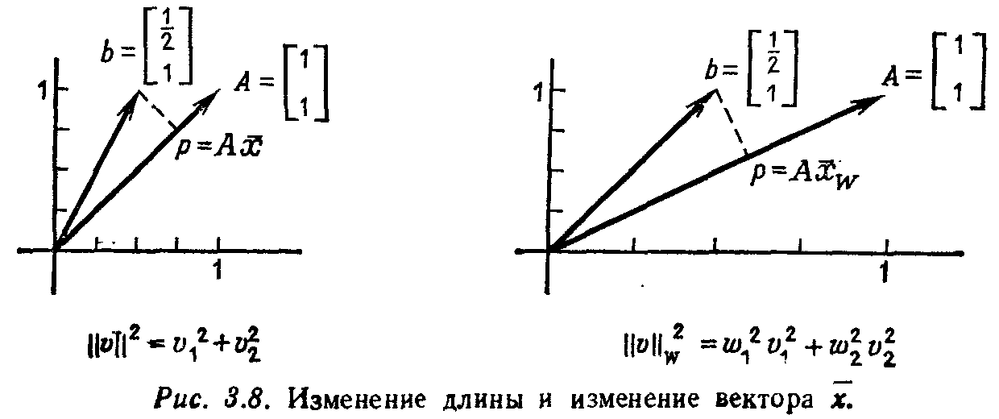
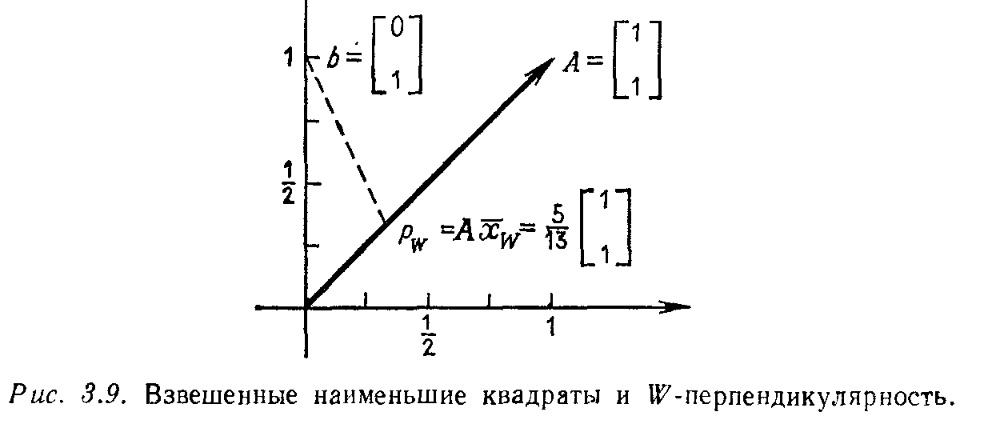

## § 3.5. ВЗВЕШЕННЫЕ НАИМЕНЬШИЕ КВАДРАТЫ

---
**стр. 174**
---

вычислить матрицу $A^+$ и вектор $\bar{x}$. Спроектировав вектор $b$ на пространство столбцов, показать, что $A\bar{x} = p$.

**Упражнение 3.4.3.** Если матрица $A$ имеет ортонормированные столбцы, то что можно сказать об псевдообратной к ней?

**Упражнение 3.4.4.** Если матрица $AA^T$ обратима, то $A^+ = A^T (AA^T)^{-1}$ и $\bar{x} = A^+ b$.

(a) Проверить, что $A\bar{x} = b$.

(b) Для матрицы $A = \begin{bmatrix} 1 & 1 \end{bmatrix}$ найти оптимальное решение уравнения $u + v = 3$.

**Упражнение 3.4.5.** Первоначально матрица $A^+$ была введена Пенроузом из других соображений: он доказал, что для произвольной матрицы $A$ существует, и притом единственная, матрица $A^+$, удовлетворяющая четырем условиям:

(i) $AA^+ A = A$, (ii) $A^+ A A^+ = A^+$,

(iii) $(AA^+)^T = AA^+$, (iv) $(A^+ A)^T = A^+ A$.

Мы предпочли дать более геометрическое и более интуитивное определение (для той же самой матрицы $A^+$), но алгебраичность только что данного определения упрощает проверку того, что данная матрица является псевдообратной.

(a) Показать, что если $A$ является матрицей проектирования (т. е. $A^2 = A$ и $A = A^T$), то при $A^+ = A$ все четыре требования (i)—(iv) будут выполнены. Поэтому псевдообратная совпадает с исходной матрицей $A$, как в примере 1 или в упражнении 3.4.1.

(b) Показать, что матрица $(A^+)^T$ удовлетворяет требованиям для псевдообратной к матрице $A^T$, так что $(A^T)^+ = (A^+)^T$. (Следствие: если $A$ — симметрическая матрица, то $A^+$ также будет симметрической.)

(c) Показать, что псевдообратная к матрице $A^+$ совпадает с $A$, как это было показано выше для матрицы $\Sigma$ и справедливость чего утверждалась для произвольной матрицы $A$.

Вернемся на время к простейшему случаю задачи о наименьших квадратах и оценим средний вес пациента $x$ на основе двух измерений $x = b_1$ и $x = b_2$. При несовпадении результатов измерений мы приходим к несовместной системе двух уравнений относительно одного неизвестного:

$$\begin{bmatrix} 1 \\ 1 \end{bmatrix} [x] = \begin{bmatrix} b_1 \\ b_2 \end{bmatrix}.$$

До сих пор мы считали эти два наблюдения равнозначными и искали величину $\bar{x}$, которая давала бы минимум функции $E^2 = (x - b_1)^2 + (x - b_2)^2$:

$$\frac{dE^2}{dx} = 0 \quad \text{при} \quad \bar{x} = \frac{b_1 + b_2}{2}.$$

---
**стр. 175**
---

Оптимальная величина $\bar{x}$ равняется среднему арифметическому измерений.

Предположим теперь, что эти два измерения неравнозначны. Значение $x = b_1$ могло быть получено в результате более точных измерений (или, в статистической задаче, из большей выборки), чем значение $x = b_2$. Но мы все-таки не хотим целиком полагаться на значение $x = b_1$, так как в измерении $x = b_2$ также содержится некоторая информация. Простейший компромисс состоит во введении различных весов $w_i^2$, с которыми будут браться наши измерения, и в выборе числа $x$, минимизирующего взвешенную сумму квадратов:

$$E^2 = w_1^2 (x - b_1)^2 + w_2^2 (x - b_2)^2. \qquad (58)$$

Если $w_1 > w_2$, то доминирующим будет первое измерение, т. е. процесс минимизации будет сильнее уменьшать $(x - b_1)^2$. Вычисляя

$$\frac{dE^2}{dx} = 2 [w_1^2 (x - b_1) + w_2^2 (x - b_2)]$$

и приравнивая это выражение нулю, получаем новое решение $\bar{x}_W$:

$$\bar{x}_W = \frac{w_1^2 b_1 + w_2^2 b_2}{w_1^2 + w_2^2}. \qquad (59)$$

Вместо среднего арифметического чисел $b_1$ и $b_2$ для случая $w_1 = w_2 = 1$ $\bar{x}_W$ будет взвешенным средним значением данных. Это среднее ближе к $b_1$, чем к $b_2$.

Взвешенные наименьшие квадраты можно трактовать двояко. С одной стороны, можно посмотреть, какая обычная задача о наименьших квадратах будет приводить к функции $E^2$ вида (58). Эта задача имеет вид

$$\begin{bmatrix} w_1 \\ w_2 \end{bmatrix} [x] = \begin{bmatrix} w_1 b_1 \\ w_2 b_2 \end{bmatrix} \quad \text{с} \quad E^2 = (w_1 x - w_1 b_1)^2 + (w_2 x - w_2 b_2)^2.$$

Это в точности совпадает со взвешенной ошибкой $E^2$ для исходной задачи. При введении весов мы заменяем исходную систему $Ax = b$ на новую систему $WAx = Wb$, где

$$A = \begin{bmatrix} 1 \\ 1 \end{bmatrix} \quad \text{и} \quad W = \begin{bmatrix} w_1 & 0 \\ 0 & w_2 \end{bmatrix}.$$

Взвешенное решение $\bar{x}_W$ представляет собой решение обычной задачи о наименьших квадратах $WAx = Wb$.

Такой взгляд приводит к очевидному, но важному следствию: мы должны ожидать изменения решения по методу наименьших квадратов при замене исходной системы на систему $WAx = Wb$. Отметим, что при обратимой матрице $A$ никаких изменений не происходит: в исходном случае имеем $x = A^{-1}b$, а с весами $x = (WA)^{-1} Wb = A^{-1} W^{-1} Wb = A^{-1}b$. Точные решения совпадают,

---
**стр. 176**
---

в то время как для задачи о наименьших квадратах решения $\bar{x} = A^+ b$ и $\bar{x}_W = (WA)^+ Wb$ различны. Это обстоятельство, вообще говоря, не удивительно, но оно приводит к неприятному следствию.

**3T.** *Основное правило обращения произведения матриц, $(BA)^{-1} = A^{-1} B^{-1}$, не выполняется для псевдообратных матриц, т. е. в общем случае*

$$(WA)^+ \neq A^+ W^+ . \qquad (60)$$

Д о к а з а т е л ь с т в о. Если правило обращения выполняется для некоторой обратимой матрицы $W$, такой, что псевдообратная к ней совпадает с обратной, то взвешенное решение $\bar{x}_W$ будет иметь вид

$$\bar{x}_W = (WA)^+ Wb = A^+ W^{-1} Wb = A^+ b = \bar{x}.$$

Но $\bar{x}_W$ не равно $\bar{x}$, так что правило действительно не выполняется.

Вторая точка зрения на взвешенные наименьшие квадраты состоит в том, что вместо перехода от системы $Ax = b$ к $WAx = Wb$ мы можем сохранить исходные уравнения, но изменить *определение длины*. Естественным определением длины для «взвешенной» задачи является взвешенная сумма квадратов:

вектор $v = \begin{bmatrix} v_1 \\ v_2 \end{bmatrix}$ имеет длину $\|v\|_W = (w_1^2 v_1^2 + w_2^2 v_2^2)^{1/2}. \qquad (61)$

Сделав такое изменение, будем минимизировать ошибку $E = \|Ax - b\|_W$ обычным методом. Поскольку $E^2$ в точности является взвешенной суммой квадратов, ее минимум достигается в точке $\bar{x}_W$. При новом определении длины ближайшая к $b$ точка передвинется от $A\bar{x}$ к $A\bar{x}_W$. Вероятно, наилучшим способом иллюстрации этого является перемасштабирование координатных осей (рис. 3.8). Проекция сдвигается вниз по прямой, заменяя

$$\bar{x} = \frac{b_1 + b_2}{2} = \frac{3}{4} \quad \text{на} \quad \bar{x}_W = \frac{w_1^2 b_1 + w_2^2 b_2}{w_1^2 + w_2^2} < \frac{3}{4}.$$

---
**стр. 177**
---

Поскольку взвешенное среднее оказывается меньше $3/4$, эта точка будет ближе к первому измерению $b_1 = 1/2$, чем ко второму $b_2 = 1$. Растягивая одну координатную ось по сравнению с другой, мы тем самым придаем ей большее значение.

**ВЕСА, ДЛИНЫ И СКАЛЯРНЫЕ ПРОИЗВЕДЕНИЯ**

В следующих абзацах мы хотим показать, что рассмотренный прием является типичным для всех задач о взвешенных наименьших квадратах. Одновременно мы рассмотрим все возможные определения скалярного произведения двух векторов и соответствующие им определения длины. К счастью, такое глобальное обобщение очень легко осуществить.

Начнем с задачи о наименьших квадратах $Ax = b$. Если $m$ измерений $b_1, \dots, b_m$ неравнозначны, то с $m$ уравнениями будут связаны $m$ различных весов $w_1, \dots, w_m$. Это обобщение исходного, но на самом деле здесь имеется и более глубокое обобщение. Кроме неравнозначности, наблюдения *могут не быть независимыми*. В этом случае мы также вводим коэффициенты $w_{ij}$, характеризующие связь $i$-го и $j$-го наблюдений. Тогда система

$$Ax = b \quad \text{заменяется на} \quad WAx = Wb. \qquad (62)$$

Веса $w_1, \dots, w_n$ располагаются на главной диагонали матрицы $W$ (мы будем обозначать их через $w_{11}, \dots, w_{nn}$), а связывающие коэффициенты, если таковые вообще имеются, являются недиагональными элементами матрицы.

*Замечание.* В статистике это приблизительно соответствует выбору коэффициентов регрессии, или, после нормализации, выбору коэффициентов корреляции. Точная связь между матрицей весов $W$ и статистической матрицей ковариации $V$ приводится в конце этой главы.

Для решения новой задачи $WAx = Wb$ нужно лишь вернуться к нормальным уравнениям $A^T A \bar{x} = A^T b$ исходной задачи и сделать соответствующие изменения, т. е. заменить $A$ на $WA$, а $b$ на $Wb$.

**3U.** *Если столбцы матрицы $A$ линейно независимы (ее ранг равен $n$) и матрица $W$ обратима, то решение по методу наименьших квадратов для задачи $WAx = Wb$ находится из взвешенных нормальных уравнений:*

$$(A^T W^T W A) \bar{x}_W = A^T W^T W b. \qquad (63)$$

*Если обозначить матрицу $W^T W$ через $H$, то*

$$\bar{x}_W = (A^T H A)^{-1} A^T H b.$$

---
**стр. 178**
---

Этим завершается первый подход к методу взвешенных наименьших квадратов, и теперь мы переходим ко второму подходу. Вспомним, что в примере, с которого мы начинали этот параграф, основная идея заключалась в изменении определения длины. Проделаем то же самое и для более общей матрицы весов $W$:

**3V.** *Для произвольной обратимой матрицы $W$ можно определить новую длину и скалярное произведение по следующим правилам: новая длина вектора $x$ равняется старой длине вектора $Wx$, а новое скалярное произведение векторов $x$ и $y$ равняется старому скалярному произведению векторов $Wx$ и $Wy$:*

$$\|x\|_W = \|Wx\| \quad \text{и} \quad (x, y)_W = (Wx)^T (Wy) = x^T W^T W y^{1)}. \qquad (64)$$

*Длина и скалярное произведение связаны обычным правилом*

$$\|x\|_W^2 = (x, x)_W > 0 \quad \text{для всех ненулевых векторов } x. \qquad (65)$$

Это определение фактически описывает все возможные скалярные произведения, т. е. все способы получения числа, которое линейно зависит от векторов $x$ и $y$ и положительно при $x = y \neq 0$. Именно это условие положительности приводит к требованию обратимости матрицы $W$, поскольку в противном случае в нуль-пространстве этой матрицы найдется ненулевой вектор $x$, и длина этого вектора будет равняться $\|x\|_W = \|Wx\| = \|0\| = 0$. Мы не допускаем, чтобы ненулевой вектор имел нулевую длину.

Вернемся к задаче о наименьших квадратах $Ax = b$ с матрицей весов $W$. Можно получить геометрическое истолкование этой задачи, используя новые определения длины и скалярного произведения. Оптимальный выбор вектора $Ax$, минимизирующего ошибку $Ax - b$, — это вновь точка $p$ в пространстве столбцов матрицы $A$, ближайшая к $b$. Но слово «ближайшая» здесь нужно понимать в терминах нового определения длины. Теперь мы минимизируем величину $\|Ax - b\|_W = \|WAx - Wb\|$. Эта точка $p$ (или, вернее, $p_W$, поскольку она зависит от матрицы $W$) вновь оказывается проекцией точки $b$ на пространство столбцов, а вектор ошибки $b - p_W$ ортогонален этому пространству. Имеется, однако, и изменение: ортогональность теперь означает равенство нулю нового скалярного произведения. Поэтому точка $p_W = A\bar{x}_W$ определяется из условия, что вектор $b - p_W$ перпендикулярен всем векторам $Ay$ из пространства столбцов:

$$(Ay)^T W^T W (b - A\bar{x}_W) = 0 \quad \text{для всех } y.$$

$^{1)}$ Матрица $H = W^T W$ при обратимой матрице $W$ — это в точности *положительно определенная* матрица из гл. 6.

---
**стр. 179**
---

Вектор, на который умножается $y^T$, должен равняться нулю,

$$A^T W^T W (b - A\bar{x}_W) = 0, \quad \text{или} \quad A^T W^T W A \bar{x}_W = A^T W^T W b,$$

и мы вновь приходим к взвешенным нормальным уравнениям (63).

Будем пессимистами и, не веря всему сказанному, попытаемся изобразить (рис. 3.9), как выглядит эта новая перпендикулярность. Мы можем либо растягивать пространство в соответствии с матрицей $W$ (рис. 3.8), либо сохранить исходные оси и стра-

дать от созерцания углов, которые не выглядят прямыми, но считаются таковыми.

Задача, соответствующая этому рисунку, такова:

$$WAx = Wb, \quad \text{или} \quad \begin{bmatrix} 2 & 1 \\ 1 & 1 \end{bmatrix} \begin{bmatrix} 1 \\ 1 \end{bmatrix} [x] = \begin{bmatrix} 2 & 1 \\ 1 & 1 \end{bmatrix} \begin{bmatrix} 0 \\ 1 \end{bmatrix}.$$

Взвешенные нормальные уравнения имеют вид

$$(WA)^T W A \bar{x}_W = (WA)^T W b,$$

или

$$\begin{bmatrix} 3 & 2 \end{bmatrix} \begin{bmatrix} 3 \\ 2 \end{bmatrix} \bar{x}_W = \begin{bmatrix} 3 & 2 \end{bmatrix} \begin{bmatrix} 1 \\ 1 \end{bmatrix}, \quad \bar{x}_W = \frac{5}{13}.$$

В качестве последнего замечания о методе наименьших квадратов сравним наш подход с подходом, который обычно применяется в статистике. Предполагается, что ошибки для $m$ уравнений $Ax = b$ в среднем дают нуль и матрицу ковариации $V$. Тогда оптимальная оценка $\bar{x}$ является решением системы нормальных уравнений $A^T V^{-1} A \bar{x} = A^T V^{-1} b$ и эти уравнения совпадают
