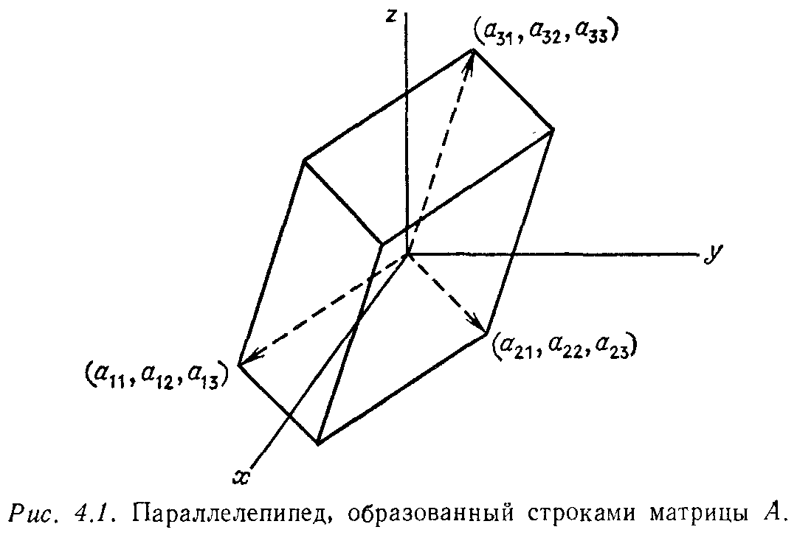

# Глава 4

# ОПРЕДЕЛИТЕЛИ

## § 4.1. ВВЕДЕНИЕ

---
**стр. 182**
---

Трудно решить, что именно следует сказать об определителях. Лет семьдесят назад казалось, что определители важнее матриц, из которых они получаются, и была опубликована четырехтомная «История определителей» Мура. Направление развития математики, однако, меняется, и сейчас теория определителей достаточно далека от основных проблем линейной алгебры. Действительно, одно число слишком слабо характеризует матрицу.
Одна из точек зрения состоит в том, что определитель дает явную «формулу», сжатое и конкретное выражение в замкнутой форме для таких величин, как $A^{-1}$. На самом деле эта формула не используется для вычисления $A^{-1}$ или $A^{-1}b$. Более того, сам определитель находится с помощью метода исключения, который может трактоваться как наиболее эффективный способ для подстановки элементов заданной матрицы в формулу для определителя. Общая формула важна потому, что она показывает зависимость величины определителя от каждого из $n^2$ элементов матрицы.
Перечислим основные применения определителей.
1. Определитель дает критерий для проверки обратимости матрицы. *Если определитель матрицы $A$ равен нулю, то эта матрица вырожденна, а если $\det A \neq 0$, то $A$ обратима.* Этот критерий наиболее важен применительно к семейству матриц $A - \lambda I$ (чем и объясняется существенность данной главы для всей книги в целом). Параметр $\lambda$ вычитается из всех элементов главной диагонали, и наша задача заключается в отыскании тех значений $\lambda$ (*собственных значений*), при которых матрица $A - \lambda I$ будет вырожденной. Приведенный критерий показывает, что для этого достаточно выяснить, когда определитель матрицы $A - \lambda I$ будет равен нулю. В дальнейшем мы увидим, что этот определитель является многочленом степени $n$ от $\lambda$ и, следовательно, с учетом кратности, имеет в точности $n$ корней; таким образом, матрица

---
**стр. 183**
---

(порядка $n$) имеет $n$ собственных значений. Это один из фактов, получаемых с помощью формулы для определителя, а не непосредственным вычислением.
2. Определитель матрицы $A$ равен объему параллелепипеда $P$ в $n$-мерном пространстве, построенного на векторах, совпадающих со строками матрицы $A$ (рис. 4.1) 1). Необходимость в вычисле-

нии такого рода объемов может показаться странной, но на самом деле $P$ обычно является элементом объема в кратном интеграле. В простейшем случае это кубик $dV = dx\,dy\,dz$ в интеграле $\iiint f(x, y, z)\,dV$. Если для упрощения подынтегрального выражения мы осуществим замену переменных $x, y, z$ на $x', y', z'$ по формулам $x = x'\cos y',\ y = x'\sin y',\ z = z'$, то элемент объема $dx\,dy\,dz$ перейдет в $J\,dx'\,dy'\,dz'$ (подобно тому, как это происходит в одномерном случае, когда дифференциал $dx$ преобразуется в $(dx/dx')\,dx'$). Здесь $J$ есть *определитель Якоби* (якобиан), являющийся трехмерным аналогом коэффициента подобия $dx/dx'$,
$$
J = \left| \begin{matrix} \partial x / \partial x' & \partial x / \partial y' & \partial x / \partial z' \\ \partial y / \partial x' & \partial y / \partial y' & \partial y / \partial z' \\ \partial z / \partial x' & \partial z / \partial y' & \partial z / \partial z' \end{matrix} \right| = \left| \begin{matrix} \cos y' & -x'\sin y' & 0 \\ \sin y' & x'\cos y' & 0 \\ 0 & 0 & 1 \end{matrix} \right|,
$$
и он оказывается равным $x'$. В полярных, или, точнее, в цилиндрических координатах, где элемент объема равен $r\,dr\,d\theta\,dz$, это $r$. (Если мы попытаемся нарисовать «кубик» $r\,dr\,d\theta\,dz$, то он будет

---
1) В качестве векторов для построения параллелепипеда можно взять и столбцы матрицы $A$, в результате чего получится совсем другой параллелепипед того же объема.

---
**стр. 184**
---

выглядеть искривленным, но при уменьшении длин сторон будет «выпрямляться».)
3. Определитель дает явную формулу для ведущих элементов матрицы. Теоретически мы могли бы пользоваться им, чтобы выяснить заранее, когда ведущий элемент будет равен нулю и потребуется перестановка строк матрицы. Гораздо важнее, однако, что из формулы
$$
\det A = \pm (\text{произведение ведущих элементов})
$$
вытекает следующее свойство: *независимо от порядка шагов в методе исключения произведение ведущих элементов неизменно с точностью до знака*. Раньше из этого делали вывод о бесполезности перестановки строк матрицы для устранения слишком маленького ведущего элемента, считая, что он все равно должен появиться. Но на самом деле (и это часто происходит), если мы не исключаем «ненормально» малый ведущий элемент, то за ним вскоре следует «ненормально» большой; в результате их произведение приходит в норму, но численное решение оказывается неверным.
4. Определитель показывает зависимость величины $A^{-1}b$ от каждого элемента вектора $b$. Если в ходе эксперимента изменяется один из параметров или уточняется одно из наблюдений, то «коэффициентом влияния» этих изменений на $x = A^{-1}b$ является отношение определителей.

Имеется еще одна проблема, связанная с определителями. Трудно не только решить, насколько они важны и каково их место в линейной алгебре, но и выбрать их определение. Ясно, что $\det A$ не будет очень простой функцией от $n^2$ переменных; в противном случае найти $A^{-1}$ было бы значительно проще, чем это есть на самом деле. Явная формула, приведенная в § 4.3, потребует тщательного разъяснения, и ее связь с обратной матрицей далеко не очевидна.
*Из связанных с определителями вопросов наиболее простым оказывается выяснение их свойств, а не нахождение явного выражения для них.* Поэтому естественно начать изложение следующим образом. Определитель может быть (и будет) введен при помощи трех основных его свойств, и задача состоит в том, как, используя эти свойства, вычислить значение определителя. Такой подход вернет нас к методу исключения Гаусса и к произведению ведущих элементов. Теоретически наиболее трудным здесь будет доказательство того факта, что независимо от порядка использования упомянутых выше свойств, результат всегда будет один и тот же и эти свойства определителя образуют непротиворечивую систему.
В следующем параграфе перечисляются основные свойства определителя и наиболее важные следствия из них. В § 4.3 дается
