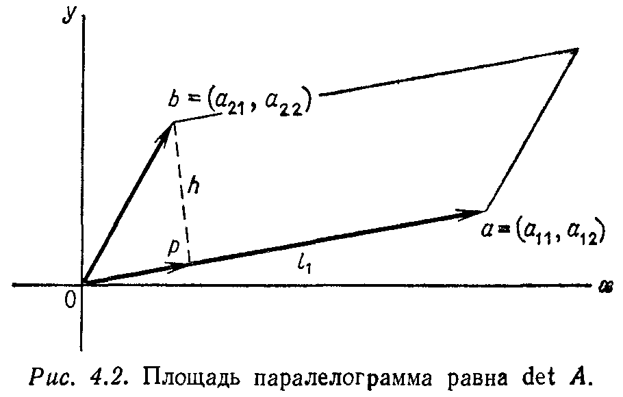
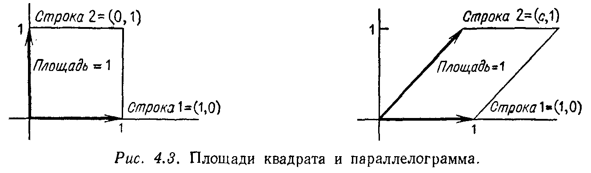

## § 4.4. ПРИМЕНЕНИЯ ОПРЕДЕЛИТЕЛЕЙ

---
**стр. 200**
---

Построить новую матрицу $B$, элементы с индексами $i, j$ которой равны алгебраическим дополнениям $A_{ji}$. Проверить, что $AB$ есть единичная матрица, умноженная на определитель $\det A$. Чему равна матрица $A^{-1}$?

В этом параграфе мы сделаем попытку систематически описать каждое из применений определителей, упомянутых во введении к этой главе.

**1. Вычисление $A^{-1}$.** С этой целью воспользуемся разложением определителя по алгебраическим дополнениям $i$-й строки:
$$
\det A = \sum_{j=1}^{n} a_{ij} A_{ij}. \quad (14)
$$
Составим линейную комбинацию элементов одной строки матрицы с алгебраическими дополнениями другой и покажем, что результат равен нулю:
$$
0 = \sum_{j=1}^{n} a_{kj} A_{ij} \quad \text{для} \quad i \neq k. \quad (15)
$$
Это получается потому, что фактически мы вычисляем определитель другой матрицы $B$, полученной в результате выбрасывания $i$-й строки матрицы $A$ и замены ее на $k$-ю. Таким образом, $k$-я строка присутствует в матрице $B$ дважды и $\det B = 0$. Тогда (15) есть обычное разложение матрицы $B$ по $i$-й строке; алгебраические дополнения $A_{ij}$ не изменялись, поскольку они не зависят от $i$-й строки, но умножаются на элементы $a_{kj}$ $i$-й строки матрицы $B$.

Из (14), (15) получается замечательная формула умножения:
$$
\begin{bmatrix}
a_{11} & a_{12} & \cdots & a_{1n} \\
a_{21} & a_{22} & \cdots & a_{2n} \\
\cdot & \cdot & & \cdot \\
\cdot & \cdot & \cdots & \cdot \\
a_{n1} & a_{n2} & \cdots & a_{nn}
\end{bmatrix}
\begin{bmatrix}
A_{11} & A_{21} & \cdots & A_{n1} \\
A_{12} & A_{22} & \cdots & A_{n2} \\
\cdot & \cdot & & \cdot \\
\cdot & \cdot & \cdots & \cdot \\
A_{1n} & A_{2n} & \cdots & A_{nn}
\end{bmatrix}
=
\begin{bmatrix}
\det A & 0 & \cdots & 0 \\
0 & \det A & \cdots & 0 \\
\cdot & \cdot & & \cdot \\
\cdot & \cdot & \cdots & \cdot \\
0 & 0 & \cdots & \det A
\end{bmatrix}. \quad (16)
$$

---
**стр. 201**
---

**Пример.** Алгебраические дополнения элементов матрицы
$$
A = \begin{bmatrix} a & b \\ c & d \end{bmatrix}
$$
суть $A_{11} = d$, $A_{12} = -c$, $A_{21} = -b$, $A_{22} = a$. Они образуют «присоединенную матрицу», соответствующую средней матрице формулы (16) и обозначаемую через adj $A$; для матриц 2-го порядка
$$
\text{adj } A = \begin{bmatrix} A_{11} & A_{21} \\ A_{12} & A_{22} \end{bmatrix} = \begin{bmatrix} d & -b \\ -c & a \end{bmatrix}.
$$
Тогда формула (16) принимает вид
$$
\begin{bmatrix} a & b \\ c & d \end{bmatrix}
\begin{bmatrix} d & -b \\ -c & a \end{bmatrix}
=
\begin{bmatrix} ad - bc & 0 \\ 0 & ad - bc \end{bmatrix}
= (\det A) I.
$$
Деля на число $\det A$ (если оно не равно нулю), получаем искомую обратную матрицу:
$$
A^{-1} = \frac{\text{adj } A}{\det A}. \quad (17)
$$
Каждый элемент обратной матрицы равен соответствующему алгебраическому дополнению матрицы $A$, деленному на $\det A$. Это подтверждает тот факт, что матрица $A$ обратима тогда и только тогда, когда $\det A \neq 0$, и дает точную формулу для $A^{-1}$.

**2. Решение системы $Ax = b$.** Здесь применение определителей сводится к формуле
$$
x = A^{-1}b = \frac{(\text{adj } A) b}{\det A},
$$
которая представляет собой просто произведение матрицы и вектора, деленное на число $\det A$. Имеется, однако, другая форма записи этого соотношения:

**4C. Правило Крамера:** *$j$-й элемент вектора $x = A^{-1}b$ равен*
$$
x_j = \frac{\det B_j}{\det A}, \quad \text{где} \quad B_j = \begin{bmatrix}
a_{11} & a_{12} & \dots & b_1 & \dots & a_{1n} \\
\cdot & \cdot & & \cdot & & \cdot \\
\cdot & \cdot & & \cdot & & \cdot \\
a_{n1} & a_{n2} & \dots & b_n & \dots & a_{nn}
\end{bmatrix} \quad (18)
$$
*В $B_j$ вектор $b$ заменяет собой $j$-й столбец матрицы $A$.*

*Доказательство.* Разлагая $\det B_j$ по алгебраическим дополнениям $j$-го столбца (который равен $b$), из формулы (13) получаем
$$
\det B_j = b_1 A_{1j} + b_2 A_{2j} + \dots + b_n A_{nj}
$$

---
**стр. 202**
---

Это есть в точности $j$-й элемент произведения $(\text{adj}\, A)b$. Деля на $\det A$, получаем $j$-й элемент вектора $x$.

Таким образом, каждая из компонент вектора $x$ равна отношению двух определителей, т. е. частному от деления двух многочленов степени $n$. Этот факт можно было бы установить и из метода исключения Гаусса, но это не было сделано.

**Пример.** Решение системы

$$x_1 + 3x_2 = 0,$$
$$2x_1 + 4x_2 = 6$$

есть

$$x_1 = \frac{\begin{vmatrix} 0 & 3 \\ 6 & 4 \end{vmatrix}}{\begin{vmatrix} 1 & 3 \\ 2 & 4 \end{vmatrix}} = \frac{-18}{-2} = 9, \quad x_2 = \frac{\begin{vmatrix} 1 & 0 \\ 2 & 6 \end{vmatrix}}{\begin{vmatrix} 1 & 3 \\ 2 & 4 \end{vmatrix}} = \frac{6}{-2} = -3.$$

**3. Объем параллелепипеда.** Связь между определителем и объемом не очевидна, однако мы можем предположить для начала, что все углы прямые, т. е. грани взаимно перпендикулярны, и мы имеем дело с прямоугольным параллелепипедом. Тогда объем его равен просто произведению длин ребер $l_1 l_2 \dots l_n$.

Мы хотим получить ту же самую формулу с помощью определителя. С этой целью вспомним, что ребра параллелепипеда представляются строками матрицы $A$. В нашем случае эти строки взаимно ортогональны, так что

$$AA^T = \begin{bmatrix} a_{11} & \dots & a_{1n} \\ \vdots & & \vdots \\ a_{n1} & \dots & a_{nn} \end{bmatrix} \begin{bmatrix} a_{11} & \dots & a_{n1} \\ \vdots & & \vdots \\ a_{1n} & \dots & a_{nn} \end{bmatrix} = \begin{bmatrix} l_1^2 & & 0 & 0 \\ & \ddots & & 0 \\ 0 & & \ddots & \\ 0 & 0 & & l_n^2 \end{bmatrix}.$$

Величины $l_i^2$ суть квадраты длин строк матрицы, т. е. квадраты длин ребер, и нули вне диагонали получаются вследствие ортогональности строк. Переходя к определителям и используя правила 9 и 10, получаем

$$l_1^2 l_2^2 \dots l_n^2 = \det(AA^T) = (\det A)(\det A^T) = (\det A)^2.$$

Извлекая корень, мы и приходим к требуемому соотношению: *определитель равняется объему*. Знак при $\det A$ будет зависеть от того, образуют ребра правостороннюю систему координат вида $xyz$ или левостороннюю $yxz$.

Если область не прямоугольна, то объем уже не равен произведению длин ребер. В плоском случае (рис. 4.2) «объем» парал-

---
**стр. 203**
---

лелограмма равен произведению длины основания на высоту $h$. Вектор $pb$ длины $h$ есть разность между вектором второй строки $Ob = (a_{21}, a_{22})$ и его проекцией $Op$ на вектор первой строки. Основной момент доказательства заключается в том, что по свойству **5**

$\det A$ не изменится, если первую строку матрицы умножить на постоянный множитель и вычесть из второй строки. В то же время объем не изменится, если мы перейдем к прямоугольнику с основанием длины $l_1$ и высотой $h$. Таким образом, мы приходим к случаю, для которого уже доказано, что объем равен определителю.

Для доказательства в общем $n$-мерном случае используется та же самая идея, усложняются лишь выкладки. Ни объем, ни определитель не будут изменяться, если мы последовательно для 2-й, 3-й, ..., $n$-й строк будем вычитать из каждой строки ее проекцию на пространство, порожденное векторами предыдущих строк, что дает в результате «вектор высоты» типа $pb$, перпендикулярный к основанию. Результатом этого процесса Грама — Шмидта является набор взаимно ортогональных строк, но определитель и объем при этом не изменяются. Поскольку в прямоугольном случае объем равен определителю, то то же самое должно быть и для исходной матрицы.

Доказательство на этом завершается, однако будет полезно еще раз вернуться к простейшему случаю. Мы знаем, что

$$\det \begin{vmatrix} 1 & 0 \\ 0 & 1 \end{vmatrix} = 1, \quad \det \begin{vmatrix} 1 & 0 \\ c & 1 \end{vmatrix} = 1.$$

Эти определители дают объемы, или площади, поскольку мы рассматриваем двумерный случай, «параллелепипедов», изображенных на рис. 4.3. Первый представляет собой единичный квадрат, и его площадь, разумеется, равна 1. Второй есть паралле-

---
**стр. 204**
---

лограмм с единичными основанием и высотой; его площадь не зависит от «сдвига», даваемого коэффициентом $c$, и равна 1.

**4. Формула для ведущих элементов.** Последнее применение (в этом весьма утилитарном обзоре определителей) относится к вопросу о нулевых ведущих элементах; мы можем, наконец, установить, когда исключение Гаусса возможно без перестановки строк. Основной момент состоит в том, что первые $k$ ведущих элементов полностью определяются подматрицей $A_k$, расположенной в левом верхнем углу матрицы $A$. Оставшиеся строки и столбцы матрицы $A$ не оказывают на них никакого влияния.

**Пример.**

$$A = \begin{bmatrix} a & b & e \\ c & d & f \\ g & h & i \end{bmatrix} \to \begin{bmatrix} a & b & e \\ 0 & (ad - bc)/a & (af - ec)/a \\ g & h & i \end{bmatrix}.$$

Очевидно, что первый ведущий элемент зависит только от первых строки и столбца; это $d_1 = a$. Второй ведущий элемент получается после одного шага исключения; он равен $d_2 = (ad - bc)/a$ и зависит только от элементов $a$, $b$, $c$ и $d$. Оставшаяся часть матрицы $A$ не участвует в рассмотрении до исследования третьего ведущего элемента. Фактически левый верхний угол матрицы $A$ определяет не только ведущие элементы, но и все левые верхние углы матриц $L$, $D$ и $U$:

$$A = LDU = \begin{bmatrix} 1 & & \\ c/a & 1 & \\ * & * & 1 \end{bmatrix} \begin{bmatrix} a & & \\ & (ad - bc)/a & \\ & & * \end{bmatrix} \begin{bmatrix} 1 & b/a & * \\ & 1 & * \\ & & 1 \end{bmatrix}.$$

То, что мы видим в первых двух строках и столбцах, есть в точности разложение (выписанное ранее в (4)) подматрицы $A_2 = \begin{bmatrix} a & b \\ c & d \end{bmatrix}$. Это общее правило:

---
**стр. 205**
---

**4D.** *Если матрица $A$ представляется в виде $LDU$, то левые верхние углы удовлетворяют соотношению*

$$A_k = L_k D_k U_k. \qquad (19)$$

*Для разных $k$ разложения подматриц $A_k$ «согласованы» друг с другом.*

Для доказательства можно либо показать, что этот угол можно преобразовать первым, не затрагивая остальные строки матрицы, либо воспользоваться правилами блочного умножения матриц. Эти правила точно такие же, как и обычное поэлементное правило: $LDU = A$ дает

$$\begin{bmatrix} L_k & 0 \\ B & C \end{bmatrix} \begin{bmatrix} D_k & 0 \\ 0 & E \end{bmatrix} \begin{bmatrix} U_k & F \\ 0 & G \end{bmatrix} = \begin{bmatrix} L_k D_k & 0 \\ B D_k & C E \end{bmatrix} \begin{bmatrix} U_k & F \\ 0 & G \end{bmatrix} =$$

$$= \begin{bmatrix} L_k D_k U_k & L_k D_k F \\ B D_k U_k & B D_k F + C E G \end{bmatrix}.$$

Если матрицы разбиты на блоки таким образом, чтобы их можно было перемножить, т. е. квадратные или прямоугольные матрицы имеют нужные для перемножения размеры, их можно умножать по блокам$^{1)}$. Сравнивая последнюю матрицу с $A$, легко видеть, что угол $L_k D_k U_k$ совпадает с $A_k$, что и доказывает формулу (19).

Из этого тотчас же вытекают формулы для ведущих элементов. Переходя к определителям в (19), получаем

$$\det A_k = \det L_k \det D_k \det U_k = \det D_k = d_1 d_2 \dots d_k. \qquad (20)$$

Произведение первых $k$ ведущих элементов равняется определителю $A_k$; это то же самое правило для $A_k$, которое мы уже знаем для всей матрицы $A = A_n$. Поскольку определитель матрицы $A_{k-1}$ выражается аналогичным образом через $d_1 d_2 \dots d_{k-1}$, мы можем выразить ведущий элемент $d_k$ как **отношение определителей:**

$$\frac{\det A_k}{\det A_{k-1}} = \frac{d_1 d_2 \dots d_k}{d_1 d_2 \dots d_{k-1}} = d_k. \qquad (21)$$

В приведенном выше примере второй ведущий элемент равнялся в точности этому отношению $(ad - bc)/a$, т. е. определителю матрицы $A_2$, деленному на определитель матрицы $A_1$. (Мы полагаем $\det A_0 = 1$, так что первый ведущий элемент равен $a/1 = a$.) Перемножая все отдельные ведущие элементы, получаем

$$d_1 d_2 \dots d_n = \frac{\det A_1}{\det A_0} \frac{\det A_2}{\det A_1} \dots \frac{\det A_n}{\det A_{n-1}} = \frac{\det A_n}{\det A_0} = \det A.$$

$^{1)}$ Это очень полезное правило, хотя в этой книге оно будет использоваться нескоро.

---
**стр. 206**
---

Формула (21) дает нам, наконец, ответ на исходный вопрос: *ведущие элементы отличны от нуля тогда и только тогда, когда все числа* $\det A_k$ *отличны от нуля:*

**4E.** *Метод исключения Гаусса без перестановок строк может быть применен к матрице $A$ тогда и только тогда, когда все главные подматрицы $A_1, A_2, \dots, A_n$ невырожденны.*

На этом рассмотрение определителей заканчивается, остается лишь сделать дополнительное замечание, как было обещано в начале главы. Это замечание касается непротиворечивости определяющих свойств 1—3. Основным является свойство 2 об изменении знака при перестановке строк, что приводит к правилу для определителя матрицы перестановки $P_\sigma$. Это было единственным сомнительным моментом в явной формуле (8): верно ли, что независимо от выбранной последовательности перестановок строк, приводящей $P_\sigma$ к единичной матрице, их число является либо всегда четным, либо всегда нечетным? Если это так, то мы вправе называть перестановку «четной» или «нечетной» и соответствующий определитель по правилу 2 равен либо $+1$, либо $-1$.

Начиная с перестановки $(3, 2, 1)$, за один шаг меняя местами 3 и 1, мы получаем естественный порядок $(1, 2, 3)$. Тот же самый результат можно получить, меняя местами 3 и 2, затем 3 и 1 и, наконец, 2 и 1. В обеих последовательностях число перемен нечетное. Утверждается, что *четное число перемен никогда не приведет перестановку $(3, 2, 1)$ к естественному порядку*.

Приведем доказательство. Рассмотрим каждую пару чисел в перестановке и обозначим через $N$ число пар, в которых большее число стоит первым. Ясно, что $N = 0$ для естественного порядка $(1, 2, 3)$, т. е. для тождественной перестановки, и $N = 3$ для перестановки $(3, 2, 1)$, поскольку пары $(3, 2)$, $(3, 1)$ и $(2, 1)$ неправильные. Теперь остается показать, что перестановка является четной или нечетной в зависимости от того, четным или нечетным является число $N$. Другими словами, если мы начинаем с любой перестановки, то каждая перемена местами двух чисел будет изменять $N$ на нечетное число. Тогда для получения $N = 0$ (естественного порядка) требуется число перемен такой же четности (четное или нечетное), как и исходное $N$.

Если переставляются соседние числа, то ясно, что $N$ изменяется либо на $+1$, либо на $-1$; оба числа нечетные. Поэтому, если заметить, что перемена местами любых двух чисел может быть осуществлена нечетным числом перемен местами соседних чисел, то доказательство будет завершено. Это наблюдение легко подтверждается примером; чтобы поменять местами первый и

---
**стр. 207**
---

четвертый элементы в перестановке (это числа 2 и 3), пять раз (нечетное число) меняются местами соседние числа:

$$(2, 1, 4, 3) \to (1, 2, 4, 3) \to (1, 4, 2, 3) \to (1, 4, 3, 2) \to (1, 3, 4, 2) \to (3, 1, 4, 2).$$

В общем случае, чтобы поменять местами элементы, находящиеся на местах $k$ и $l$, требуется $l - k$ раз поменять местами соседние элементы для перемещения элемента с места $k$ на место $l$, и $l - k - 1$ — для перемещения элемента, первоначально находившегося на месте $l$ (и который теперь находится на месте $l - 1$), на место $k$. Поскольку число $(l - k) + (l - k - 1)$ нечетное, доказательство закончено. Определитель не только обладает всеми свойствами, указанными ранее, он даже существует.

**Упражнение 4.4.1.** Используя (17), обратить матрицы

$$A = \begin{bmatrix} 1 & 1 & 1 \\ 0 & 1 & 1 \\ 0 & 0 & 1 \end{bmatrix}, \quad B = \begin{bmatrix} a & b \\ c & d \end{bmatrix}.$$

**Упражнение 4.4.2.** Найти $x$, $y$ и $z$ по правилу Крамера:

$$x + 4y - z = 1,$$
$$x + y + z = 0,$$
$$2x + 3z = 0.$$

**Упражнение 4.4.3.** Найти якобиан $J$ преобразования прямоугольных координат $x$, $y$, $z$ в сферические координаты $r$, $\theta$, $\phi$:

$$x = r \cos \theta \cos \phi, \quad y = r \cos \theta \sin \phi, \quad z = r \sin \theta.$$

**Упражнение 4.4.4.** (a) Начертить треугольник с вершинами $A = (2, 2)$, $B = (-1, 3)$, $C = (0, 0)$. Рассматривая его как половину параллелограмма, объяснить, почему его площадь равняется $\frac{1}{2} \det \begin{bmatrix} 2 & 2 \\ -1 & 3 \end{bmatrix}$. (b) Предположим, что третья вершина вместо начала координат находится в точке $C = (1, -4)$. Вычислить площадь и затем проверить формулу

$$\text{площадь } (ABC) = \frac{1}{2} \det \begin{bmatrix} x_1 & y_1 & 1 \\ x_2 & y_2 & 1 \\ x_3 & y_3 & 1 \end{bmatrix} = \frac{1}{2} \det \begin{bmatrix} 2 & 2 & 1 \\ -1 & 3 & 1 \\ 1 & -4 & 1 \end{bmatrix}.$$

*Указание:* вычитая последнюю строку из предыдущих, получаем

$$\det \begin{bmatrix} 2 & 2 & 1 \\ -1 & 3 & 1 \\ 1 & -4 & 1 \end{bmatrix} = \det \begin{bmatrix} 1 & 6 & 0 \\ -2 & 7 & 0 \\ 1 & -4 & 1 \end{bmatrix} = \det \begin{bmatrix} 1 & 6 \\ -2 & 7 \end{bmatrix}.$$

Как новые вершины $A' = (1, 6)$, $B' = (-2, 7)$ и $C' = (0, 0)$ связаны с заданными $A$, $B$ и $C$? Сделать рисунок.

**Упражнение 4.4.5.** Объяснить в терминах объемов, почему $\det 3A = 3^n \det A$ для любой матрицы $A$ порядка $n$.
