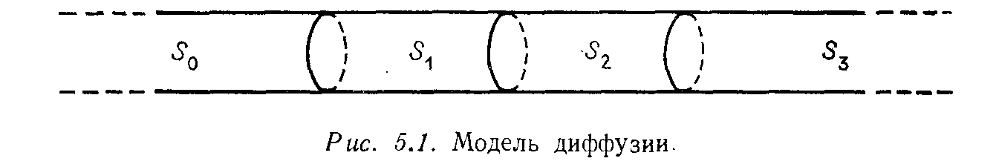
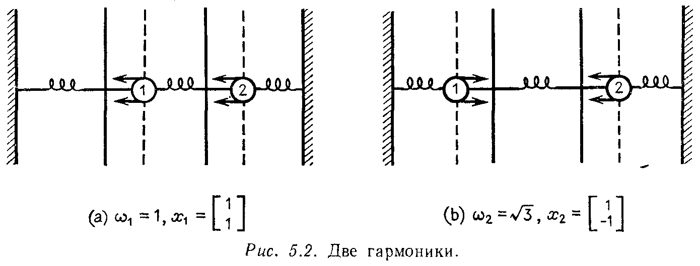

## § 5.4. ДИФФЕРЕНЦИАЛЬНЫЕ УРАВНЕНИЯ И ЭКСПОНЕНТА E^(AT)

---
**стр. 239**
---

Цель Леонтьева состояла в том, чтобы найти модель, которая использовала бы подлинные данные реальной экономики. Официальная американская матричная таблица межотраслевых связей за 1958 год содержала данные по 83 отраслям производства. Построенная теория выходит за рамки простого исследования матрицы $(I - A)^{-1}$ и позволяет решать вопросы о естественных ценах рынка и об оптимизации. Труд при этом обычно рассматривается отдельно как наиболее важный товар, количество которого ограничено и должно быть минимизировано. Кроме того, экономика не всегда является линейной.

**§ 5.4. ДИФФЕРЕНЦИАЛЬНЫЕ УРАВНЕНИЯ И ЭКСПОНЕНТА $e^{At}$**

Когда мы встречаемся не с отдельным уравнением, а с системой, появляется возможность использовать теорию матриц. Это было справедливо для разностных уравнений, где решение $u_k = A^k u_0$ зависело от степеней матрицы $A$. Это в равной мере справедливо и для дифференциальных уравнений, где решение $u(t) = e^{At} u_0$ связано с экспонентой от матрицы $A$. Для того чтобы определить эту экспоненту и понять заложенный в ней смысл, рассмотрим пример

$$\frac{du}{dt} = Au = \begin{bmatrix} -2 & 1 \\ 1 & -2 \end{bmatrix} u. \qquad (23)$$

Первый шаг, как обычно, состоит в отыскании собственных значений и собственных векторов:

$$A \begin{bmatrix} 1 \\ 1 \end{bmatrix} = (-1) \begin{bmatrix} 1 \\ 1 \end{bmatrix}, \quad A \begin{bmatrix} 1 \\ -1 \end{bmatrix} = (-3) \begin{bmatrix} 1 \\ -1 \end{bmatrix}.$$

Затем перед нами открывается несколько возможностей, и все они приводят к одному и тому же ответу. Наилучший способ, вероятно, выписать общее решение и согласовать его с начальным вектором $u_0$ при $t = 0$:

$$u(t) = c_1 e^{\lambda_1 t} x_1 + c_2 e^{\lambda_2 t} x_2 = c_1 e^{-t} \begin{bmatrix} 1 \\ 1 \end{bmatrix} + c_2 e^{-3t} \begin{bmatrix} 1 \\ -1 \end{bmatrix}, \qquad (24)$$

$$u_0 = c_1 \begin{bmatrix} 1 \\ 1 \end{bmatrix} + c_2 \begin{bmatrix} 1 \\ -1 \end{bmatrix} = \begin{bmatrix} 1 & 1 \\ 1 & -1 \end{bmatrix} \begin{bmatrix} c_1 \\ c_2 \end{bmatrix}.$$

Вы узнаете матрицу собственных векторов $S$? И коэффициенты $\begin{bmatrix} c_1 \\ c_2 \end{bmatrix} = S^{-1} u_0$ те же, которые получались для разностных урав-

---
**стр. 240**
---

нений. Подставляя их в (24), находим решение задачи. В матричной записи это решение выглядит так:

$$u(t) = \begin{bmatrix} 1 & 1 \\ 1 & -1 \end{bmatrix} \begin{bmatrix} e^{-t} & \\ & e^{-3t} \end{bmatrix} \begin{bmatrix} c_1 \\ c_2 \end{bmatrix} = S \begin{bmatrix} e^{-t} & \\ & e^{-3t} \end{bmatrix} S^{-1} u_0.$$

Вот основная формула этого параграфа: $S e^{\Lambda t} S^{-1} u_0$ является решением дифференциального уравнения, так же как $S \Lambda^k S^{-1} u_0$ было решением разностного уравнения. Основную роль здесь играют матрицы

$$\Lambda = \begin{bmatrix} -1 & \\ & -3 \end{bmatrix} \quad \text{и} \quad e^{\Lambda t} = \begin{bmatrix} e^{-t} & \\ & e^{-3t} \end{bmatrix}.$$

Теперь можно позволить себе замедлить темп изложения. Остается сделать два замечания относительно этого примера. Одно из них относится к завершению математической части теории, для чего требуется дать прямое определение экспоненты $e^{At}$ и связать его с формулой $S e^{\Lambda t} S^{-1}$. Второе состоит в том, чтобы дать физическую интерпретацию самого уравнения и его решения. Это дифференциальное уравнение имеет очень полезные применения. Рассмотрим сначала экспоненту. Наиболее естественно определить ее по аналогии со степенным рядом для $e^x$:

$$e^x = 1 + x + \frac{x^2}{2!} + \frac{x^3}{3!} + \dots$$

и

$$e^{At} = I + At + \frac{(At)^2}{2!} + \frac{(At)^3}{3!} + \dots$$

$e^{At}$ есть матрица порядка $n$ и ее легко можно продифференцировать:

$$\begin{aligned} \frac{d}{dt}(e^{At}) &= A + \frac{A^2(2t)}{2!} + \frac{A^3(3t^2)}{3!} + \dots = \\ &= A\left(I + At + \frac{(At)^2}{2!} + \dots\right) = Ae^{At}. \end{aligned}$$

Таким образом, подтверждается, что $e^{At} u_0$ является решением рассматриваемого дифференциального уравнения: при $t = 0$ оно равно начальному вектору $u_0$ и оно удовлетворяет уравнению $d(e^{At} u_0)/dt = Ae^{At} u_0$. Следовательно, это решение должно совпадать с другим решением $S e^{\Lambda t} S^{-1} u_0$. Чтобы дать более прямое доказательство этого совпадения, вспомним, что степени матрицы $A = S \Lambda S^{-1}$ сворачиваются в $A^k = (S \Lambda S^{-1}) \dots (S \Lambda S^{-1}) = S \Lambda^k S^{-1}$.

---
**стр. 241**
---

Поэтому бесконечный ряд для экспоненты принимает вид

$$e^{At} = I + S \Lambda S^{-1} t + \frac{S \Lambda^2 S^{-1} t^2}{2!} + \frac{S \Lambda^3 S^{-1} t^3}{3!} + \dots =$$

$$= S\left(I + \Lambda t + \frac{(\Lambda t)^2}{2!} + \frac{(\Lambda t)^3}{3!} + \dots\right) S^{-1} = S e^{\Lambda t} S^{-1}.$$

На этом математическая часть заканчивается, и полученные результаты можно сформулировать следующим образом:

**5I.** *Если матрица $A$ приводится к диагональному виду, $A = S \Lambda S^{-1}$, то дифференциальное уравнение $du/dt = Au$ имеет решение*

$$u(t) = e^{At} u_0 = S e^{\Lambda t} S^{-1} u_0. \qquad (25)$$

*Столбцы матрицы $S$ являются собственными векторами матрицы $A$, так что*

$$u(t) = \begin{bmatrix} x_1 & \dots & x_n \end{bmatrix} \begin{bmatrix} e^{\lambda_1 t} & & \\ & \ddots & \\ & & e^{\lambda_n t} \end{bmatrix} S^{-1} u_0 =$$

$$= c_1 e^{\lambda_1 t} x_1 + \dots + c_n e^{\lambda_n t} x_n \qquad (26)$$

*Общее решение является линейной комбинацией частных решений $e^{\lambda_i t} x_i$, и коэффициенты $c_i$, удовлетворяющие начальному условию $u_0$, равны $c = S^{-1} u_0$.*

Здесь наблюдается полная аналогия с разностными уравнениями — вы можете сравнить полученный результат с 5G на стр. 229. В обеих ситуациях мы предполагали, что матрица $A$ диагонализуема. В противном случае она имела бы меньше чем $n$ собственных векторов, и мы не нашли бы достаточного числа частных решений. Недостающие решения существуют, но они имеют более сложный вид, чем чистые экспоненты $e^{\lambda t} x$: они содержат «обобщенные собственные векторы» и множители типа $te^{\lambda t}$. Тем не менее формула $u(t) = e^{At} u_0$ остается справедливой1).

1) Этот «дефектный» случай будет рассмотрен в приложении В, однако пример можно привести и сейчас: если $y' = z$ и $z' = 0$, то система имеет вид

$$\frac{du}{dt} = Au = \begin{bmatrix} 0 & 1 \\ 0 & 0 \end{bmatrix} u,$$

так что $A^2 = 0$ и $e^{At} = I + At = \begin{bmatrix} 1 & t \\ 0 & 1 \end{bmatrix}$.

---
**стр. 242**
---

Обсудим теперь физический смысл этого примера, который легко объясним и в то же время по-настоящему важен. Рассматриваемое дифференциальное уравнение описывает процесс диффузии, который можно наглядно представить себе, если рассмотреть бесконечную трубку, разделенную на четыре части, из которых две средние конечные, а две по краям полубесконечные (рис. 5.1).

В момент времени $t = 0$ две конечные части содержат некоторый химический раствор с концентрациями $v_0$ и $w_0$. В это же время и в дальнейшем концентрация в двух бесконечных частях трубки равна нулю. При бесконечности объема такая модель будет давать верную картину для описания средней концентрации в этих бесконечных частях трубки даже после начала процесса диффузии. Диффузия начинается в момент времени $t = 0$ и подчиняется следующему закону: *в любой момент времени $t$ скорость диффузии между двумя прилегающими частями равняется разности концентраций.* Мы считаем, что *внутри каждой из частей концентрация во всех точках остается одинаковой.* Процесс непрерывен по времени, но дискретен по пространству, и двумя неизвестными являются $v(t)$ и $w(t)$ в двух внутренних частях $S_1$ и $S_2$. Концентрация $v$ изменяется двумя путями — посредством диффузии в крайний левый участок $S_0$ и посредством диффузии в $S_2$ или из $S_2$. Общая скорость изменения поэтому равна

$$\frac{dv}{dt} = (w - v) + (0 - v),$$

поскольку концентрация в $S_0$ тождественно равна нулю. Аналогично

$$\frac{dw}{dt} = (0 - w) + (v - w).$$

Следовательно, система в точности совпадает с нашим примером (23):

$$u = \begin{bmatrix} v \\ w \end{bmatrix}, \quad \frac{du}{dt} = \begin{bmatrix} -2v + w \\ v - 2w \end{bmatrix} = \begin{bmatrix} -2 & 1 \\ 1 & -2 \end{bmatrix} u.$$

Собственные значения $-1$ и $-3$ будут определять поведение решения. Они дают скорость убывания концентрации, и $\lambda_1$ является более важным, поскольку лишь в исключительных слу-

---
**стр. 243**
---

чаях выбранные начальные условия могут привести к «сверхубыванию» со скоростью $e^{-3t}$. Фактически эти условия должны получаться из собственного вектора $(1, -1)$, компоненты которого имеют разные знаки. Если эксперимент допускает только неотрицательные концентрации, сверхубывание невозможно и предельная скорость должна равняться $e^{-t}$. Решение, убывающее с этой скоростью, соответствует собственному вектору $(1, 1)$, и, следовательно, две концентрации будут становиться почти равными при $t \to \infty$.

Еще одно замечание по поводу этого примера: он является дискретной аппроксимацией лишь с двумя неизвестными для непрерывного диффузионного процесса, описываемого уравнением в частных производных

$$\frac{\partial u}{\partial t} = \frac{\partial^2 u}{\partial x^2}, \quad u(0) = u(1) = 0.$$

Мы придем к этому уравнению, если оставить два бесконечных участка с нулевой концентрацией и делить среднюю часть на отрезки все меньшей и меньшей длины $h = 1/N$. Дискретная система с $N$ неизвестными подчиняется уравнению

$$\frac{d}{dt} \begin{bmatrix} u_1 \\ \vdots \\ u_N \end{bmatrix} = \begin{bmatrix} -2 & 1 & & \\ 1 & -2 & \ddots & \\ & \ddots & \ddots & 1 \\ & & 1 & -2 \end{bmatrix} \begin{bmatrix} u_1 \\ \vdots \\ u_N \end{bmatrix} = Au.$$

Это в точности совпадает с матрицей конечных разностей, построенной в § 1.6 для аппроксимации второй производной $d^2/dx^2$. Более внимательный взгляд на процесс дает масштабирующий множитель $1/h^2$, так что мы действительно приходим в пределе при $h \to 0$ и $N \to \infty$ к уравнению в частных производных $\partial u / \partial t = \partial^2 u / \partial x^2$. Оно известно как *уравнение теплопроводности*. Его решения по-прежнему могут быть разложены на гармонические составляющие задачи, но они уже оказываются не собственными векторами из $N$ компонент, а собственными функциями. Фактически это в точности функции $\sin n\pi x$, и общее решение уравнения теплопроводности имеет вид

$$u(t) = \sum_{n=1}^{\infty} c_n e^{-n^2 \pi^2 t} \sin n\pi x.$$

Коэффициенты $c_n$ определяются, как обычно, из начальных условий, а скорости убывания даются собственными значениями: $\lambda_n = -n^2 \pi^2$.

**Упражнение 5.4.1.** Вычислить матрицу $e^{At}$ размера $2 \times 2$ в рассмотренном выше примере и показать, что ее элементы положительны при $t > 0$. Любой

---
**стр. 244**
---

эксперимент, начинающийся при положительных концентрациях, таким и будет оставаться: если $u_0 > 0$, то $e^{At}u_0 > 0^{1)}$.

**Упражнение 5.4.2.** Предположим, что в уравнении диффузии направление времени изменено на обратное: $du/dt = Au$ переходит в $du/d(-t) = Au$ или

$$\frac{du}{dt} = Bu, \quad B = \begin{bmatrix} 2 & -1 \\ -1 & 2 \end{bmatrix}, \quad u_0 = \begin{bmatrix} 1 \\ 0 \end{bmatrix}.$$

Вычислить $u(t)$ и показать, что решение теперь растет, а не убывает при $t \to +\infty$. (В непрерывном случае это увеличение происходит мгновенно, как только мы отходим от $t = 0$, т. е. уравнение теплопроводности необратимо во времени.)

**Упражнение 5.4.3.** Для получения непрерывного марковского процесса уберем бесконечные участки $S_0$ и $S_3$ и перейдем к уравнениям

$$\begin{aligned} \frac{dv}{dt} &= w - v, \\ \frac{dw}{dt} &= v - w, \end{aligned} \quad \text{или} \quad \frac{du}{dt} = \begin{bmatrix} -1 & 1 \\ 1 & -1 \end{bmatrix} u = Au.$$

Найти общее решение, решение, удовлетворяющее начальным концентрациям $v = 3$ и $w = 1$, и стационарное состояние при $t \to \infty$. Заметить, что значению $\lambda = 0$ в дифференциальном уравнении соответствует $\lambda = 1$ в разностном уравнении ($e^{0 \cdot 1} = 1$), так что соответствующий собственный вектор определяет стационарное состояние.

**Упражнение 5.4.4.** Вывести формулу $u(t) = S e^{\Lambda t} S^{-1} u_0$, используя замену переменных $v = S^{-1}u$ в дифференциальном уравнении $du/dt = Au$. Найти новый вектор $v_0$, решить уравнение относительно $v$ и вернуться к $u$.

**Упражнение 5.4.5.** Предполагая диагонализуемость матрицы $A$, показать из (25), что $e^{tA} e^{sA} = e^{(t+s)A}$. В качестве контрпримера показать для матриц размера $2 \times 2$, что в общем случае $e^B e^C \neq e^{B+C}$, т. е. правило для скаляров в матричном случае нарушается.

**УСТОЙЧИВОСТЬ ДИФФЕРЕНЦИАЛЬНЫХ УРАВНЕНИЙ**

Так же как и для разностных уравнений, поведение решения $u(t)$ при $t \to \infty$ определяется собственными значениями. Если матрица $A$ диагонализуема, то дифференциальное уравнение будет иметь $n$ чисто экспоненциальных решений и любое частное решение $u(t)$ есть некоторая их комбинация:

$$u(t) = S e^{\Lambda t} S^{-1} u_0 = c_1 e^{\lambda_1 t} x_1 + \dots + c_n e^{\lambda_n t} x_n.$$

Устойчивость определяется множителями $e^{\lambda_i t}$. Если они стремятся к нулю, то $u(t)$ стремится к нулю; если они остаются ограниченными, то $u(t)$ остается ограниченным; а если один из этих множителей растет, то решение $u(t)$ будет тоже расти, за

1) Это всегда справедливо при положительных внедиагональных элементах матрицы $A$.

---
**стр. 245**
---

исключением случаев с весьма специальными начальными условиями. Более того, поскольку величина (или модуль) $e^{\lambda t}$ зависит только от вещественной части $\lambda$, *устойчивость определяется только вещественными частями*: если $\lambda = \alpha + i\beta$, то

$$e^{\lambda t} = e^{\alpha t} e^{i\beta t} = e^{\alpha t} (\cos \beta t + i \sin \beta t) \quad \text{и} \quad |e^{\lambda t}| = e^{\alpha t}.$$

Эта величина убывает при $\alpha < 0$, является постоянной при $\alpha = 0$ и возрастает при $\alpha > 0$, в то время как мнимые части $\beta$ дают чистые колебания. Таким образом, для любой диагонализуемой матрицы $A$ справедливо следующее утверждение:

**5J.** *Дифференциальное уравнение $du/dt = Au$ **устойчиво** и $e^{At} \to 0$, если все $\text{Re}\,\lambda_i < 0$; оно **нейтрально устойчиво** и экспонента $e^{At}$ ограниченна, если все $\text{Re}\,\lambda_i \le 0$, и оно **неустойчиво** и $e^{At}$ неограниченна, когда $\text{Re}\,\lambda_i > 0$ хотя бы для одного собственного значения $\lambda_i$ матрицы $A$.*

**Пример 1.**

$$\frac{du}{dt} = Au = \begin{bmatrix} 0 & -1 \\ 1 & 0 \end{bmatrix} u, \quad u_0 = \begin{bmatrix} 1 \\ 0 \end{bmatrix}.$$

Собственные значения матрицы $A$ удовлетворяют уравнению

$$|A - \lambda I| = \begin{vmatrix} -\lambda & -1 \\ 1 & -\lambda \end{vmatrix} = \lambda^2 + 1 = 0, \quad \text{т. е. } \lambda = \pm i.$$

Они являются чисто мнимыми, так что решение должно быть нейтрально устойчиво. Фактически $e^{At}$ есть матрица вращения, и каждая компонента решения является простым гармоническим движением:

$$e^{At} = \begin{bmatrix} \cos t & -\sin t \\ \sin t & \cos t \end{bmatrix} \quad \text{и} \quad u(t) = e^{At} u_0 = \begin{bmatrix} \cos t \\ \sin t \end{bmatrix}. \qquad (27)$$

Уравнение описывает движение точки по окружности1).

**Пример 2.** Уравнение диффузии устойчиво, поскольку $\lambda = -1$ и $\lambda = -3$.

**Пример 3.** Непрерывный марковский процесс, описанный в предыдущих упражнениях, лишь нейтрально устойчив, поскольку собственные значения равны $\lambda = 0$ и $\lambda = -2$. Это уравнение диффузии с изолированными концами: ничто не покидает систему и не переходит во внешние бесконечные участки.

1) Все экспоненты от кососимметрических матриц являются ортогональными матрицами.

---
**стр. 246**
---

**Пример 4.** В ядерной технике реактор называется *критическим*, если он нейтрально устойчив: расщепление уравновешивается поглощением. Более медленное расщепление делает его устойчивым, или *субкритическим*, и постепенно он останавливается. При неустойчивом расщеплении реактор превращается в бомбу.

Так же как и для разностных уравнений, решение задачи может быть устойчивым и при этом допускать кратковременное увеличение нормы $\|u(t)\|$, прежде чем начнется убывание. Мне кажется, что этот временный рост нетипичен для реальных задач; убывание, как правило, начинается непосредственно в момент времени $t = 0$. Записав производную от скалярного произведения

$$\frac{d}{dt} x^T y = \left[ \frac{dx}{dt} \right]^T y + x^T \left[ \frac{dy}{dt} \right], \quad (28)$$

мы можем положить $x = y = u$ и найти величину, знак которой определяет рост или убывание:

$$\frac{d}{dt} \|u(t)\|^2 = \left[ \frac{du}{dt} \right]^T u + u^T \left[ \frac{du}{dt} \right] = u^T (A^T + A) u. \quad (29)$$

**5K.** *Если $u^T (A^T + A) u < 0$ для всех ненулевых векторов $u$, что означает отрицательность всех собственных значений матрицы $A^T + A$, то норма решения убывает в каждый момент времени. Если $A^T + A = 0$, то длина $\|u\|^2$ остается постоянной с течением времени, рассеяния энергии не происходит и система консервативна.*

Пример 1 был консервативным: если точка движется по окружности, то длина $\|u\|$, очевидно, остается постоянной.

Для отыскания условия, которое одновременно являлось бы необходимым и достаточным для устойчивости, другими словами, условия, эквивалентного $\text{Re}\,\lambda_i < 0$, есть две возможности. Одна из них заключается в обращении к Раусу и Гурвицу, которые в девятнадцатом веке получили ряд неравенств на элементы $a_{ij}$. Я не думаю, чтобы этот подход был достаточно хорош для матриц большого размера; ЭВМ, вероятно, может быстрее найти все собственные значения матрицы, чем проверить эти неравенства. Другая возможность была открыта Ляпуновым в 1897 году, через два года после работы Гурвица. Она состоит в отыскании матрицы весов $W$, такой, чтобы взвешенная длина $\|Wu(t)\|$ всегда убывала. Если такая матрица $W$ существует, то решение уравнения $u' = Au$ должно быть устойчивым. Норма $\|Wu\|$ будет монотонно убывать к нулю, и после нескольких подъемов и спусков решение $u$ должно вести себя так же. Настоящую ценность метод Ляпунова приобретает в нелинейном случае, когда уравнение зачастую решить невозможно, но убывание $\|Wu(t)\|$ по-прежнему

---
**стр. 247**
---

сохраняется, так что устойчивость может быть доказана даже при отсутствии формулы для $u(t)$.

**Упражнение 5.4.6.** Проверить, что формула (28) дает производную от скалярного произведения

$$x^T y = x_1(t) y_1(t) + \dots + x_n(t) y_n(t).$$

**Упражнение 5.4.7.** Исследовать на устойчивость уравнение $du/dt = Au$, рассматривая собственные значения матрицы $A = \begin{bmatrix} 0 & 4 \\ -1 & 0 \end{bmatrix}$

**Упражнение 5.4.8.** С помощью собственных значений матриц

$$A = \begin{bmatrix} -1 & 3 \\ 0 & -1 \end{bmatrix} \quad \text{и} \quad A + A^T = \begin{bmatrix} -2 & 3 \\ 3 & -2 \end{bmatrix}$$

определить, должны ли решения уравнения $du/dt = Au$ убывать по норме с момента времени $t = 0$ и должны ли они убывать при $t \to \infty$.

**Упражнение 5.4.9.** Определить, устойчива или неустойчива система $dv/dt = w$, $dw/dt = v$.

**УРАВНЕНИЯ ВТОРОГО ПОРЯДКА**

Законы диффузии приводят к системе уравнений первого порядка $du/dt = Au$. То же самое происходит и в большом числе других приложений — в химии, в биологии и т. д., кроме наиболее важных законов физики. Это, например, второй закон Ньютона $F = ma$, где ускорение $a$ есть вторая производная. Инерциальные члены дают уравнения второго порядка (мы должны решать систему $d^2u/dt^2 = Au$ вместо $du/dt = Au$), и наша цель состоит в том, чтобы понять, как этот переход ко вторым производным изменяет поведение решения1).

Сравнение будет наилучшим, если мы рассмотрим ту же самую матрицу $A$:

$$\frac{d^2u}{dt^2} = Au = \begin{bmatrix} -2 & 1 \\ 1 & -2 \end{bmatrix} u. \qquad (30)$$

Для того чтобы система начала «работать», должны быть заданы два начальных условия — «смещение» $u = u_0$ и «скорость» $du/dt = u'_0$. Чтобы удовлетворить этим условиям, для системы из $n$ уравнений потребуется уже не $n$, а $2n$ чисто экспоненциальных решений.

Заменим букву $\lambda$ буквой $\omega$ и будем записывать частные решения в виде $u = e^{i\omega t} x$. Подставляя эту экспоненту в дифферен-

1) Четвертые производные также возможны (при изгибе балок), но природа, по-видимому, препятствует появлению производных выше четвертого порядка.

---
**стр. 248**
---

циальное уравнение, получаем условие, которому она должна удовлетворять:

$$\frac{d^2}{dt^2} (e^{i\omega t} x) = A (e^{i\omega t} x), \quad \text{или} \quad -\omega^2 x = Ax. \qquad (31)$$

Вектор $x$ должен быть собственным вектором матрицы $A$ в точности как и раньше. Соответствующее собственное значение теперь равняется $-\omega^2$, так что частота $\omega$ связана со скоростью убывания $\lambda$ соотношением $-\omega^2 = \lambda$. Каждое частное решение $e^{\lambda t} x$ уравнения первого порядка дает два частных решения $e^{i\omega t} x$ уравнения второго порядка, и два их показателя равны $\omega = \pm \sqrt{-\lambda}$. Это не так лишь при $\lambda = 0$, когда имеется только одно значение корня; если соответствующий этому $\lambda$ собственный вектор есть $x$, то два частных решения будут равны $x$ и $tx$.

Для нашей матрицы диффузии все собственные значения $\lambda$ отрицательны, и потому все частоты $\omega$ вещественны: чистая диффузия преобразуется в чистое колебание. Множители $e^{i\omega t}$ дают нейтральную устойчивость, решение не растет и не затухает и полная энергия остается в точности постоянной: она все время перераспределяется внутри системы. Общее решение уравнения $d^2u/dt^2 = Au$, если матрица $A$ имеет отрицательные собственные значения $\lambda_1, \dots, \lambda_n$ и если $\omega_j = \sqrt{-\lambda_j}$, равно

$$u(t) = (c_1 e^{i\omega_1 t} + d_1 e^{-i\omega_1 t}) x_1 + \dots + (c_n e^{i\omega_n t} + d_n e^{-i\omega_n t}) x_n. \qquad (32)$$

Как всегда, произвольные постоянные находятся из начальных условий. Это легче сделать (ценой дополнительной формулы), перейдя от «осциллирующих экспонент» к более привычным синусу и косинусу:

$$u(t) = (a_1 \cos \omega_1 t + b_1 \sin \omega_1 t) x_1 + \dots + (a_n \cos \omega_n t + b_n \sin \omega_n t) x_n. \qquad (33)$$

Теперь начальное смещение легко отличить от начальной скорости: из $t = 0$ следует, что $\sin \omega t = 0$ и $\cos \omega t = 1$, в результате чего получаем

$$u_0 = a_1 x_1 + \dots + a_n x_n, \quad u_0 = Sa, \quad a = S^{-1} u_0.$$

Смещение согласуется с выбором коэффициентов $a$, а скорость — с выбором $b$: дифференцируя функцию $u(t)$ и полагая $t = 0$, получаем условие для определения $b$ в виде

$$u'_0 = b_1 \omega_1 x_1 + \dots + b_n \omega_n x_n.$$

Подставляя это в (33), получаем искомое решение уравнения.

Мы хотим применить эти формулы к нашему примеру. Собственные значения равнялись $\lambda_1 = -1$ и $\lambda_2 = -3$, так что частоты равны $\omega_1 = 1$ и $\omega_2 = \sqrt{3}$. Если система начинает движение из состояния покоя (т. е. начальная скорость $u'_0$ равна нулю), то

---
**стр. 249**
---

члены $b \sin \omega t$ исчезнут. И если первый осциллятор получает единичное смещение, то требование $u_0 = a_1 x_1 + a_2 x_2$ приводит к

$$\begin{bmatrix} 1 \\ 0 \end{bmatrix} = a_1 \begin{bmatrix} 1 \\ 1 \end{bmatrix} + a_2 \begin{bmatrix} 1 \\ -1 \end{bmatrix}, \quad \text{т. е. } a_1 = a_2 = \frac{1}{2}.$$

Следовательно, решение равно

$$u(t) = \frac{1}{2} \cos t \begin{bmatrix} 1 \\ 1 \end{bmatrix} + \frac{1}{2} \cos \sqrt{3}\,t \begin{bmatrix} 1 \\ -1 \end{bmatrix}.$$

Попытаемся дать физическое истолкование полученному решению. Система представляет собой две единичные массы, связанные друг с другом и с неподвижными стенками тремя одинаковыми пружинами (рис. 5.2). Первая масса передвигается в положение $v_0 = 1$, вторая масса зафиксирована на месте, и при $t = 0$ мы их отпускаем. Их движение, описываемое функцией $u(t)$, будет средним между двумя чистыми колебаниями, соответствующими двум собственным векторам. На первой гармонике массы движутся в унисон и средняя пружина никогда не растягивается (рис. 5.2a). Частота $\omega_1 = 1$ оказывается такой же, как и для од-

ной пружины с одной массой. Для высокочастотной гармоники $x_2 = (1, -1)$ с компонентами противоположных знаков и с частотой $\sqrt{3}$ массы движутся в противоположных направлениях, но с равными скоростями (рис. 5.2b). Общее решение является линейной комбинацией этих двух гармоник, и наше частное решение равняется их полусумме.

Такое движение является, как мы говорим, «почти периодическим» во времени. Если отношение $\omega_1/\omega_2$ было дробным, то две массы постепенно вернутся к состоянию $v = 1$ и $w = 0$ и весь процесс начнется сначала. Комбинация $\sin 2t$ и $\sin 3t$ будет иметь период $2\pi$. Но, поскольку число $\sqrt{3}$ иррационально, мы можем
