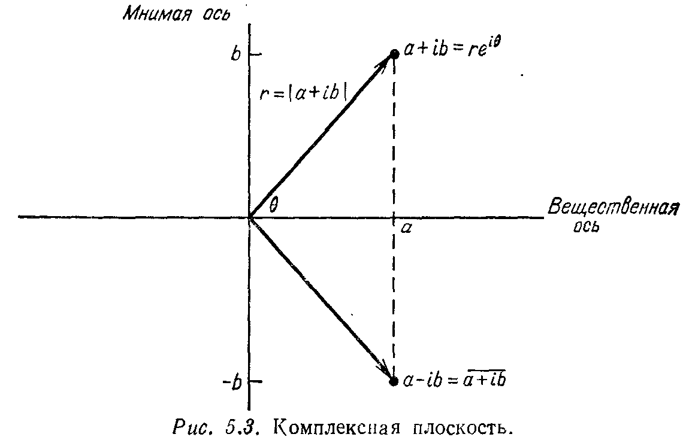

## § 5.5. КОМПЛЕКСНЫЙ СЛУЧАЙ: ЭРМИТОВЫ И УНИТАРНЫЕ МАТРИЦЫ

---
**стр. 251**
---

**§ 5.5. КОМПЛЕКСНЫЙ СЛУЧАЙ: ЭРМИТОВЫ И УНИТАРНЫЕ МАТРИЦЫ**

В дальнейшем становится уже невозможным работать только с вещественными векторами и вещественными матрицами. В первой половине этой книги, когда основная задача состояла в решении системы $Ax = b$, было очевидно, что решение $x$ является вещественным при вещественных $A$ и $b$. Поэтому необходимость в комплексных числах не возникала; их можно было бы допустить, но это не дало бы ничего нового. Теперь же мы не можем обойтись без них. Коэффициенты характеристического многочлена вещественной матрицы вещественны, но собственные значения (как в случае, когда $\lambda^2 + 1 = 0$) могут таковыми не быть.

Мы должны поэтому ввести пространство $\mathbf{C}^n$ векторов с $n$ комплексными компонентами. Сложение и умножение в этом пространстве осуществляются по тем же правилам, что и ранее. *Но формулу $\|x\|^2 = x_1^2 + \dots + x_n^2$ для длины вектора нужно изменить,* иначе вектор с компонентами $(1, i)$ будет иметь нулевую длину: $1^2 + i^2 = 0$. Это изменение в способе вычисления длины вызывает целый ряд других изменений. Скалярное произведение двух векторов, транспонированная матрица, определения симметрических, кососимметрических и ортогональных матриц при введении комплексных чисел нужно модифицировать. Но в каждом случае новое определение будет совпадать со старым, когда векторы и матрицы вещественны.

Все эти изменения перечислены на стр. 267, и этот список служит хорошим словарем для перевода между вещественным и комплексным случаем. Надеюсь, что он окажется полезным читателю. Этот список содержит также для каждого класса матриц наиболее полную информацию о расположении их собственных значений. Нас в особенности интересуют симметрические матрицы: где расположены их собственные значения и чем характеризуются их собственные векторы? С точки зрения практики это наиболее важные вопросы в теории собственных значений и, следовательно, этот параграф является наиболее важным.

**КОМПЛЕКСНЫЕ ЧИСЛА И СОПРЯЖЕННЫЕ К НИМ**

Вероятно, читатель уже знаком с комплексными числами, но, поскольку нам нужны лишь основные факты, стоит дать короткий их обзор $^1$). Каждому известно, что $i$, чем бы оно ни было, удовлетворяет уравнению $i^2 = -1$. Это чисто мнимое число, равно

$^1$) Важными понятиями являются комплексная сопряженность и модуль.

---
**стр. 252**
---

как и $ib$, где $b$ вещественно. Сумма вещественного и мнимого чисел есть комплексное число $a + ib$, и оно естественным образом изображается на комплексной плоскости (рис. 5.3).

Вещественные числа (для которых $b = 0$) и мнимые числа ($a = 0$) являются частными случаями комплексных чисел — они лежат на одной или другой координатной оси. Два комплексных числа складываются по правилу

$$(a + ib) + (c + id) = (a + c) + i(b + d)$$

и перемножаются с использованием соотношения $i^2 = -1$:

$$(a + ib)(c + id) = ac + ibc + iad + i^2bd = (ac - bd) + i(bc + ad).$$

Комплексно-сопряженное к $a + ib$ есть число $a - ib$, т. е. знак при мнимой части изменен на противоположный. Геометрически это зеркальное отражение относительно вещественной оси. Любое вещественное число совпадает со своим сопряженным. Сопряженность обозначается чертой, $\overline{a + ib} = a - ib$, и имеет три важных свойства:

(1) Сопряженное к произведению равняется произведению сопряженных:

$$\overline{(a + ib)(c + id)} = (ac - bd) - i(bc + ad) = \overline{(a + ib)}\ \overline{(c + id)}. \qquad (34)$$

(2) Сопряженное к сумме равняется сумме сопряженных:

$$\overline{(a + c) + i(b + d)} = (a + c) - i(b + d) = \overline{(a + ib)} + \overline{(c + id)}.$$

(3) Умножение любого числа $a + ib$ на сопряженное к нему $a - ib$ дает вещественное число, равное квадрату гипотенузы на

---
**стр. 253**
---

рис. 5.3:

$$(a + ib)(a - ib) = a^2 + b^2 = r^2. \qquad (35)$$

Это расстояние $r$ называется *модулем* исходного числа $a + ib$ и (как и абсолютное значение вещественного числа, которое также не бывает отрицательным) обозначается вертикальными черточками: $|a + ib| = r = \sqrt{a^2 + b^2}$.

Наконец, стороны связаны с гипотенузой тригонометрическими соотношениями

$$a = \sqrt{a^2 + b^2} \cos \theta, \quad b = \sqrt{a^2 + b^2} \sin \theta.$$

Комбинируя эти уравнения, переходим к полярным координатам:

$$a + ib = \sqrt{a^2 + b^2} (\cos \theta + i \sin \theta) = re^{i\theta}. \qquad (36)$$

Имеется важный частный случай, когда модуль $r$ равняется единице. Тогда комплексное число есть $e^{i\theta} = \cos \theta + i \sin \theta$ и оно находится на единичной окружности комплексной плоскости. При изменении $\theta$ от $0$ до $2\pi$ это число $e^{i\theta}$ движется вокруг начала координат на фиксированном расстоянии $|e^{i\theta}| = \sqrt{\cos^2 \theta + \sin^2 \theta} = 1$.

**Упражнение 5.5.1.** Для комплексных чисел $3 + 4i$ и $1 - i$

(a) найти их положения на комплексной плоскости,

(b) найти их сумму и произведение,

(c) найти их модули и сопряженные.

Лежат они внутри или вне единичного круга?

**Упражнение 5.5.2.** Что можно сказать о

(i) сумме комплексного числа и его сопряженного?

(ii) сопряженном к числу, лежащему на единичной окружности?

(iii) произведении двух чисел, лежащих на единичной окружности?

(iv) сумме двух чисел, лежащих на единичной окружности?

**Упражнение 5.5.3.** Проверить, что при умножении двух чисел их модули перемножаются:

$$|(a + ib)(c + id)| = |a + ib| |c + id|, \quad |(re^{i\theta})(Re^{i\varphi})| = rR.$$

**ДЛИНЫ И ТРАНСПОНИРОВАНИЕ В КОМПЛЕКСНОМ СЛУЧАЕ**

Мы возвращаемся к линейной алгебре и переходим от вещественных чисел к комплексным. Первый шаг состоит в допущении комплексных векторов и не вызывает затруднений: по определению пространство $\mathbf{C}^n$ содержит все векторы $x$ с $n$ комплексными компонентами

$$x = \begin{bmatrix} x_1 \\ x_2 \\ \vdots \\ x_n \end{bmatrix}, \quad x_j = a_j + ib_j.$$

---
**стр. 254**
---

Векторы $x$ и $y$ по-прежнему складываются покомпонентно, скалярное умножение теперь производится на комплексные числа. Как и ранее, векторы $v_1, \dots, v_k$ линейно зависимы, если некоторая нетривиальная комбинация $c_1 v_1 + \dots + c_k v_k$ дает нулевой вектор. Но коэффициенты $c_j$ теперь могут быть комплексными. Единичные координатные векторы по-прежнему принадлежат $\mathbf{C}^n$ и они по-прежнему линейно независимы и образуют базис. Поэтому $\mathbf{C}^n$ также является векторным пространством размерности $n$.

Мы уже указывали, что определение длины должно быть изменено, поскольку квадрат комплексного числа не обязательно положителен и формула $\|x\|^2 = x_1^2 + \dots + x_n^2$ поэтому бесполезна. Новое определение совершенно естественно: $x_j^2$ заменяется на модуль $|x_j|^2$ и длина записывается так:

$$\|x\|^2 = |x_1|^2 + \dots + |x_n|^2. \qquad (37)$$

В двумерном случае

$$x = \begin{bmatrix} 1 \\ i \end{bmatrix} \quad \text{и} \quad \|x\|^2 = 2;$$

$$y = \begin{bmatrix} 2 + i \\ 2 - 4i \end{bmatrix} \quad \text{и} \quad \|y\|^2 = 25.$$

Для вещественных векторов имелась тесная связь между длиной и скалярным произведением: $\|x\|^2 = x^T x$. Мы хотим сохранить эту связь. Поэтому скалярное произведение должно быть модифицировано в соответствии с новым определением длины и стандартная модификация состоит в сопряжении первого вектора в скалярном произведении. Это означает, что вектор $x$ заменяется на $\bar{x}$ и скалярное произведение векторов $x$ и $y$ принимает вид

$$\bar{x}^T y = \bar{x}_1 y_1 + \dots + \bar{x}_n y_n. \qquad (38)$$

Типичный пример в $\mathbf{C}^2$:

$$x = \begin{bmatrix} 1 + i \\ 3i \end{bmatrix}, \quad y = \begin{bmatrix} 4 \\ 2 - i \end{bmatrix},$$

$$\bar{x}^T y = (1 - i) 4 + (-3i) (2 - i) = 1 - 10i.$$

И если рассмотреть скалярное произведение вектора $x$ на себя, то мы вновь приходим к квадрату длины:

$$\bar{x}^T x = (\overline{1 + i})(1 + i) + (\overline{3i})(3i) = 2 + 9 = \|x\|^2.$$

Заметим, что $\bar{y}^T x$ отличается от $\bar{x}^T y$; в дальнейшем мы должны следить за порядком векторов в скалярном произведении. Имеется еще одно новшество: если вектор $x$ заменяется на $cx$, то скалярное произведение векторов $x$ и $y$ умножается не на $c$, а на $\bar{c}$.

---
**стр. 255**
---

Остается сделать еще одно изменение. Это лишь изменение в обозначениях, которое сводит два символа в один: вместо черты для сопряжения и буквы $T$ для транспонирования мы вводим сопряженное транспонирование и обозначаем его верхним индексом $H$. Поэтому $\bar{x}^T = x^H$ и то же обозначение применяется к матрицам: *сопряженно транспонированная к $A$ есть*

$$\bar{A}^T = A^H \quad \text{с элементами} \quad (A^H)_{ij} = \bar{A}_{ji}. \qquad (39)$$

Если матрица $A$ имеет размер $m \times n$, то $A^H$ имеет размер $n \times m$. Например,

$$\begin{bmatrix} 2+i & 3i \\ 4-i & 5 \\ 0 & 0 \end{bmatrix}^H = \begin{bmatrix} 2-i & 4+i & 0 \\ -3i & 5 & 0 \end{bmatrix}.$$

Этот символ $A^H$ служит официальным признанием того факта, что когда рассматриваются матрицы $A$ с комплексными элементами, нам очень редко бывает нужна просто транспонированная к $A$ матрица. Практически во всех случаях нам нужна сопряженно транспонированная (или *эрмитово транспонированная*) матрица $^1$). Суммируем все модификации, связанные с введением комплексных чисел:

**5L.** *(i) Скалярное произведение векторов $x$ и $y$ равно $x^H y$, и эти векторы ортогональны, если $x^H y = 0$.*

*(ii) Длина вектора $x$ есть $\|x\| = (x^H x)^{1/2}$.*

*(iii) Правило $(AB)^T = B^T A^T$ после сопряжения всех элементов переходит в $(AB)^H = B^H A^H$.*

**Упражнение 5.5.4.** Найти длины и скалярное произведение векторов

$$x = \begin{bmatrix} 2 - 4i \\ 4i \end{bmatrix} \quad \text{и} \quad y = \begin{bmatrix} 2 + 4i \\ 4 \end{bmatrix}.$$

**Упражнение 5.5.5.** Выписать матрицу $A^H$ и вычислить $C = A^H A$, если

$$A = \begin{bmatrix} 1 & i & 0 \\ i & 0 & 1 \end{bmatrix}.$$

Каково соотношение между $C$ и $C^H$? Выполняется ли оно для любых матриц $C$ вида $A^H A$?

**Упражнение 5.5.6.** (i) Решить методом исключения уравнение $Ax = 0$ с матрицей $A$, указанной выше.

$^1$) Матрицу $A^H$ иногда называют «эрмитовой к $A$». К сожалению, здесь нужно быть внимательным, чтобы отличать это название от употребляемого в таком, например, контексте: «$A$ является эрмитовой», что означает выполнение равенства $A = A^H$.

---
**стр. 256**
---

(ii) Показать, что вычисленное нуль-пространство ортогонально к $\mathfrak{R}(A^H)$, но не к *обычному пространству строк* $\mathfrak{R}(A^T)$. Четырьмя фундаментальными пространствами в комплексном случае являются $\mathfrak{R}(A)$ и $\mathfrak{N}(A)$, как и раньше, а затем $\mathfrak{R}(A^H)$ и $\mathfrak{N}(A^H)$.

**ЭРМИТОВЫ МАТРИЦЫ**

В предыдущих главах мы говорили о симметрических матрицах $A$, $A = A^T$. Теперь, при наличии матриц с комплексными элементами, эта идея симметричности должна быть расширена. Правильным обобщением будут не матрицы, совпадающие со своими транспонированными, а **матрицы, совпадающие со своими сопряженно транспонированными.** Это *эрмитовы* матрицы, и типичным примером является

$$A = \begin{bmatrix} 2 & 3 - 3i \\ 3 + 3i & 5 \end{bmatrix} = A^H. \qquad (40)$$

Заметьте, что диагональные элементы должны быть вещественными, поскольку они не изменяются в процессе сопряжения. Каждый внедиагональный элемент соответствует своему зеркальному отражению относительно главной диагонали, и они являются комплексно-сопряженными друг с другом. В каждом случае $a_{ij} = \bar{a}_{ji}$, и на этом примере очень хорошо можно проиллюстрировать четыре основных свойства эрмитовых матриц.

Наша главная цель состоит в получении этих четырех свойств, и нужно вновь подчеркнуть, что они равным образом применимы и к вещественным симметрическим матрицам. Последние представляют собой частный и наиболее важный случай эрмитовых матриц.

**Свойство 1.** *Если $A = A^H$, то для всех комплексных векторов $x$ число $x^H Ax$ вещественно.*

Любой элемент матрицы $A$ вносит свой вклад в $x^H Ax$:

$$x^H Ax = \begin{bmatrix} \bar{u} & \bar{v} \end{bmatrix} \begin{bmatrix} 2 & 3 - 3i \\ 3 + 3i & 5 \end{bmatrix} \begin{bmatrix} u \\ v \end{bmatrix} =$$

$$= 2\bar{u}u + 5\bar{v}v + (3 - 3i)\bar{u}v + (3 + 3i)u\bar{v}.$$

Каждый из «диагональных членов» является вещественным, поскольку $2\bar{u}u = 2|u|^2$ и $5\bar{v}v = 5|v|^2$. Внедиагональные члены являются комплексно-сопряженными, так что они объединяются, давая удвоенную вещественную часть от $(3 - 3i)\bar{u}v$. Следовательно, все выражение $x^H Ax$ вещественно.

Для доказательства общего случая мы можем вычислить $(x^H Ax)^H$. Мы должны получить сопряженную к матрице $x^H Ax$ размера $1 \times 1$, но фактически мы вновь получаем то же самое

---
**стр. 257**
---

число: $(x^H Ax)^H = x^H A^H x^{HH} = x^H Ax$, так что это число должно быть вещественным.

**Свойство 2.** *Каждое собственное значение эрмитовой матрицы вещественно.*

Доказательство. Пусть $\lambda$ есть собственное значение, а $x$ — соответствующий собственный вектор (ненулевой): $Ax = \lambda x$. Умножим это равенство на $x^H$: $x^H Ax = \lambda x^H x$. Левая часть вещественна по свойству 1, а в правой части $x^H x = \|x\|^2$ вещественно и положительно, поскольку $x \neq 0$. Следовательно, $\lambda$ должно быть вещественным. В нашем примере

$$|A - \lambda I| = \begin{vmatrix} 2 - \lambda & 3 - 3i \\ 3 + 3i & 5 - \lambda \end{vmatrix} = \lambda^2 - 7\lambda + 10 - |3 - 3i|^2 =$$

$$= \lambda^2 - 7\lambda - 8 = (\lambda - 8)(\lambda + 1). \qquad (41)$$

**Свойство 3.** *Собственные векторы эрмитовой матрицы, соответствующие различным собственным значениям, взаимно ортогональны.*

Доказательство вновь начинается с заданной информации $Ax = \lambda x$, $Ay = \mu y$ и $\lambda \neq \mu$ и использует небольшой трюк. Сопряженно транспонированная к $Ax = \lambda x$ обычно есть $x^H A^H = \bar{\lambda} x^H$, но, поскольку $A = A^H$ и $\lambda$ вещественно по свойству 2, это равняется $x^H A = \lambda x^H$. Умножая это равенство справа на $y$, а равенство $Ay = \mu y$ слева на $x^H$, находим

$$x^H Ay = \lambda x^H y \quad \text{и} \quad x^H Ay = \mu x^H y.$$

Следовательно, $\lambda x^H y = \mu x^H y$, и, поскольку $\lambda \neq \mu$, заключаем, что $x^H y = 0$, т. е. вектор $x$ ортогонален к $y$. В нашем примере с $Ax = 8x$ и $Ay = -y$ собственные векторы вычисляются обычным способом из

$$(A - 8I)x = \begin{bmatrix} -6 & 3 - 3i \\ 3 + 3i & -3 \end{bmatrix} \begin{bmatrix} x_1 \\ x_2 \end{bmatrix} = \begin{bmatrix} 0 \\ 0 \end{bmatrix}, \quad x = \begin{bmatrix} 1 \\ 1 + i \end{bmatrix},$$

$$(A + I)y = \begin{bmatrix} 3 & 3 - 3i \\ 3 + 3i & 6 \end{bmatrix} \begin{bmatrix} y_1 \\ y_2 \end{bmatrix} = \begin{bmatrix} 0 \\ 0 \end{bmatrix}, \quad y = \begin{bmatrix} 1 - i \\ -1 \end{bmatrix}.$$

Эти два собственных вектора взаимно ортогональны:

$$x^H y = \begin{bmatrix} 1 & 1 - i \end{bmatrix} \begin{bmatrix} 1 - i \\ -1 \end{bmatrix} = 0.$$

Разумеется, любые кратные этим векторам, $x/\alpha$ и $y/\beta$, равным образом будут собственными векторами. Пусть мы выбираем $\alpha = \|x\|$ и $\beta = \|y\|$, так что $x/\alpha$ и $y/\beta$ являются единичными векто-

---
**стр. 258**
---

рами, т. е. собственные векторы нормализованы к единичной длине. Поскольку они уже были взаимно ортогональны, теперь они стали ортонормированными. Если записать их в виде столбцов матрицы $S$, то (как обычно, когда собственные векторы служат столбцами) мы получим равенство $S^{-1}AS = \Lambda$. Столбцы диагонализующей матрицы ортонормированы. Если исходная матрица $A$ вещественная и симметрическая, то ее собственные значения и собственные векторы вещественны. Таким образом, нормализация собственных векторов превращает $S$ в ортогональную матрицу. Вещественная симметрическая матрица может быть диагонализована ортогональной матрицей $Q$.

В комплексном случае нам нужно новое название и новый символ для матрицы с ортонормированными столбцами: она называется *унитарной матрицей* и обозначается через $U$. По аналогии с вещественными ортогональными матрицами, для которых $Q^T Q = I$ и потому $Q^T = Q^{-1}$, свойство ортонормированности столбцов переходит в

$$U^H U = \begin{bmatrix} — \bar{x}_1 — \\ — \bar{x}_2 — \\ \vdots \\ — \bar{x}_n — \end{bmatrix} \begin{bmatrix} | & | & & | \\ x_1 & x_2 & \dots & x_n \\ | & | & & | \end{bmatrix} = I, \quad \text{или} \quad U^H = U^{-1}. \qquad (42)$$

Это приводит к последнему специальному свойству эрмитовых матриц:

**Свойство 4.** *Если $A = A^H$, то существует диагонализирующая матрица, которая является также и унитарной, $S = U$. Ее столбцы ортонормированы и*

$$U^{-1}AU = U^H AU = \Lambda. \qquad (43)$$

Следовательно, любая эрмитова матрица может быть представлена в виде

$$A = U\Lambda U^H = \lambda_1 x_1 x_1^H + \lambda_2 x_2 x_2^H + \dots + \lambda_n x_n x_n^H. \qquad (44)$$

Это разложение известно под названием **спектральной теоремы**. Оно выражает матрицу $A$ в виде комбинации одномерных проекций $x_i x_i^H$, подобных проекциям $aa^T$ из гл. 3. Они разбивают любой вектор $b$ на его компоненты $p = x_i(x_i^H b)$ по направлениям единичных собственных векторов, которые образуют множество взаимно перпендикулярных осей. Затем эти отдельные проекции $p$ берутся с весами $\lambda_i$ и суммируются, давая

$$Ab = \lambda_1 x_1 (x_1^H b) + \dots + \lambda_n x_n (x_n^H b). \qquad (45)$$

---
**стр. 259**
---

Если все $\lambda_i = 1$, то мы получили сам вектор $b$; матрица $A = UIU^H$ является единичной. В любом случае мы можем проверить (44) и (45) непосредственно с помощью перемножения матриц:

$$Ab = U \Lambda U^H b = \begin{bmatrix} | & & | \\ x_1 & \dots & x_n \\ | & & | \end{bmatrix} \begin{bmatrix} \lambda_1 & & \\ & \ddots & \\ & & \lambda_n \end{bmatrix} \begin{bmatrix} — \bar{x}_1 — \\ \vdots \\ — \bar{x}_n — \end{bmatrix} \begin{bmatrix} | \\ b \\ | \end{bmatrix} =$$

$$= \begin{bmatrix} | & & | \\ x_1 & \dots & x_n \\ | & & | \end{bmatrix} \begin{bmatrix} \lambda_1 x_1^H b \\ \vdots \\ \lambda_n x_n^H b \end{bmatrix} = \lambda_1 x_1 x_1^H b + \dots + \lambda_n x_n x_n^H b.$$

В нашем примере оба собственных вектора $x = \begin{bmatrix} 1 \\ 1+i \end{bmatrix}$ и $y = \begin{bmatrix} 1-i \\ -1 \end{bmatrix}$ имеют длину $\sqrt{3}$, и нормализация дает унитарную матрицу, которая диагонализует $A$:

$$U = \frac{1}{\sqrt{3}} \begin{bmatrix} 1 & 1-i \\ 1+i & -1 \end{bmatrix}, \quad U^{-1}AU = \begin{bmatrix} 8 & 0 \\ 0 & -1 \end{bmatrix}.$$

Тогда спектральное разложение $U \Lambda U^H = \lambda_1 x_1 x_1^H + \lambda_2 x_2 x_2^H$ принимает вид

$$\frac{8}{3} \begin{bmatrix} 1 \\ 1+i \end{bmatrix} \begin{bmatrix} 1 & 1-i \end{bmatrix} - \frac{1}{3} \begin{bmatrix} 1-i \\ -1 \end{bmatrix} \begin{bmatrix} 1+i & -1 \end{bmatrix} = \begin{bmatrix} 2 & 3-3i \\ 3+3i & 5 \end{bmatrix} = A.$$

**Упражнение 5.5.7.** Выписать любую неэрмитову матрицу, даже вещественную, и найти вектор $x$, такой, чтобы число $x^H Ax$ не было вещественным. (Только эрмитовы матрицы обладают свойством 1.)

**Упражнение 5.5.8.** Найти собственные значения и собственные векторы единичной длины для матрицы $A = \begin{bmatrix} 0 & i \\ -i & 0 \end{bmatrix}$. Вычислить матрицы $\lambda_1 x_1 x_1^H$ и $\lambda_2 x_2 x_2^H$ и проверить, что в сумме они дают матрицу $A$, а их произведение есть нулевая матрица. (Почему $(\lambda_1 x_1 x_1^H)(\lambda_2 x_2 x_2^H) = 0$?)

**Упражнение 5.5.9.** Используя собственные значения и собственные векторы, вычисленные на стр. 218, найти унитарную матрицу $U$, диагонализующую $A$, и выполнить спектральное разложение (в три матрицы $\lambda_i x_i x_i^H$) для

$$A = \begin{bmatrix} 1 & -1 & 0 \\ -1 & 2 & -1 \\ 0 & -1 & 1 \end{bmatrix}.$$

---
**стр. 260**
---

**Упражнение 5.5.10.** Доказать, что определитель любой эрмитовой матрицы является вещественным.

Спектральная теорема и остальное в свойстве 4 были на самом деле доказаны лишь в случае, когда собственные значения матрицы $A$ различны. (Тогда, очевидно, имеется $n$ независимых собственных векторов, что обеспечивает диагонализуемость матрицы $A$.) Тем не менее справедливо (см. § 5.6), что *даже при наличии кратных собственных значений эрмитова матрица по-прежнему имеет полный набор ортонормированных собственных векторов.* Следовательно, в любом случае матрица $A$ может быть диагонализована с помощью унитарной матрицы $U$.

Только эрмитовы матрицы обладают одновременно и вещественными собственными значениями, и ортонормированными собственными векторами. Если $U^{-1}AU$ равняется вещественной диагональной матрице $\Lambda$ и матрица $U$ унитарна, то матрица $A$ обязательно является эрмитовой:

$$A^H = (U\Lambda U^{-1})^H = U\Lambda U^H = A.$$

Для математика это разложение $A = U\Lambda U^H$ отнюдь не выглядит неожиданным; это одно из основных соотношений, и никто не назвал бы его спорным. Однако психологи, например, не соглашаются с этим (или друг с другом). Они ухитряются порождать множество дискуссий о спектральной теореме, и мы попытаемся это кратко объяснить. ***Но следующие две страницы читатель может пропустить, и это не скажется на целостности восприятия.***

**ФАКТОРНЫЙ АНАЛИЗ И АНАЛИЗ ОСНОВНЫХ КОМПОНЕНТ**

Наша цель состоит в отыскании некоторой естественной структуры в множестве экспериментальных данных — например, в наборе результатов тестов по физике, математике, истории и английскому языку. Эта задача относится к области так называемого многомерного анализа. Некоторые из его подразделов используются при обработке результатов экспериментов для «внешних целей», т. е. для прогнозирования чего-либо за пределами данных. Другие подразделы относятся полностью к их внутренней структуре.

(1) Проблема прогнозирования является типичной для регрессионного анализа: мы находим IQ1) каждого студента и пытаемся решить, можно ли было использовать результаты упомянутых выше тестов (или можно ли будет их использовать в будущем) для предсказания IQ. Другими словами, мы ищем линейную

1) IQ (intelligence quotient) — коэффициент умственного развития. — *Прим. перев.*

---
**стр. 261**
---

комбинацию результатов четырех тестов, дающую IQ. Такая комбинация содержит четыре неизвестных коэффициента, и каждому студенту соответствует одно уравнение. Это классическая задача, решаемая по методу наименьших квадратов, когда число уравнений больше числа неизвестных и собственные значения не участвуют в рассмотрении1).

(2) Для иллюстрации вопросов о внутренней структуре предположим, что данные размещены в корреляционной матрице $R$ размера $4 \times 4$. Диагональные элементы равняются 1 (каждая случайная переменная $x_i$ идеально соотносится с собой), а внедиагональные элементы $r_{ij}$ дают корреляцию между результатами $i$-го и $j$-го тестов, например, между физикой и математикой. Затем при помощи одной из разновидностей анализа, называемой анализом основных компонент, мы ищем некоррелирующие комбинации этих четырех тестов. Говоря языком линейной алгебры, мы ищем взаимно ортогональные векторы. Прекрасным средством для решения этой задачи является спектральное разложение вещественной симметрической матрицы $R$: если собственные векторы матрицы $R$ суть $q_1, \ldots, q_4$, то они образуют ортогональную матрицу $Q$, диагонализующую $R$: $Q^{-1}RQ = \Lambda$, или

$$R = Q\Lambda Q^T = \begin{bmatrix} | & & | \\ q_1 & \dots & q_4 \\ | & & | \end{bmatrix} \begin{bmatrix} \lambda_1 & & \\ & \ddots & \\ & & \lambda_4 \end{bmatrix} \begin{bmatrix} — q_1^T — \\ \vdots \\ — q_4^T — \end{bmatrix} =$$

$$= \begin{bmatrix} | & & | \\ \sqrt{\lambda_1}q_1 & \dots & \sqrt{\lambda_4}q_4 \\ | & & | \end{bmatrix} \begin{bmatrix} — \sqrt{\lambda_1}q_1^T — \\ \vdots \\ — \sqrt{\lambda_4}q_4^T — \end{bmatrix}.$$

Матрица $Q$ представляет собой унитарную матрицу $U$, которая в нашем случае вещественна. Каждый вектор $\sqrt{\lambda_i}q_i$ дает комбинацию четырех тестов, и эти четыре специальные комбинации некоррелированны. Больших противоречий пока что не возникает.

(3) Теперь мы переходим к факторному анализу, который также должен объяснить смысл внедиагональных элементов корреляционной матрицы. Желательно, чтобы при этом использова-

1) Наш пример описывает в некотором роде «обратную» ситуацию, поскольку более естественно использовать IQ для каких-либо других предсказаний. Но, быть может, обратимость этих предсказаний, почти равноценная обратимости прошлого и будущего, имеет некий глубокий смысл.

---
**стр. 262**
---

лось сравнительно небольшое число факторов $f_i$, вновь являющихся линейными комбинациями исходных тестов. Но *эти факторы не объясняют полностью* смысл диагональных элементов $r_{ii} = 1$. Если один тест дает очень узкий разброс оценок вследствие излишней трудности или излишней простоты вопросов, а другой дает широкий разброс, то факторный анализ игнорирует эту разницу. Он связан с получением правильной взаимозависимости, и идеальной ситуацией будет та, в которой корреляционная матрица разлагается так:

$$R = \begin{bmatrix} 1 & 0.74 & 0.24 & 0.24 \\ 0.74 & 1 & 0.24 & 0.24 \\ 0.24 & 0.24 & 1 & 0.74 \\ 0.24 & 0.24 & 0.74 & 1 \end{bmatrix} =$$

$$= \begin{bmatrix} 0.7 & 0.5 \\ 0.7 & 0.5 \\ 0.7 & -0.5 \\ 0.7 & -0.5 \end{bmatrix} \begin{bmatrix} 0.7 & 0.7 & 0.7 & 0.7 \\ 0.5 & 0.5 & -0.5 & -0.5 \end{bmatrix} + 0.26I.$$

В этом случае два фактора отвечают за все корреляции. Первый из них есть столбец с элементами, равными 0.7. Этот столбец следует интерпретировать как фактор общего умственного развития: хорошие результаты в математике соседствуют с хорошими результатами в родном языке. Второй фактор отличает сильную корреляцию между математикой и физикой, а также между английским и историей от более слабой корреляции между этими двумя группами. Это фактор типа «физика против лирики». Именно такие переменные являются правильными для интерпретации рассматриваемых данных, и их компоненты 0.7, 0.5 и $-0.5$ называются нагрузками факторов на индивидуальных тестах. Во всех четырех тестах эти факторы отвечают за 0.74 единичной дисперсии главной диагонали; эти величины суть «общности», равные диагональным элементам матрицы $FF^T$ в разложении $R = FF^T + D$.

Споры возникают по двум причинам. Во-первых, матрица факторных коэффициентов $F$ и диагональная матрица $D$ определяются отнюдь не единственным образом. Мы можем разложить ту же самую матрицу $R$ так:

$$R = \begin{bmatrix} 0.6 & \sqrt{0.38} & 0 \\ 0.6 & \sqrt{0.38} & 0 \\ 0.4 & 0 & \sqrt{0.58} \\ 0.4 & 0 & \sqrt{0.58} \end{bmatrix} \begin{bmatrix} 0.6 & 0.6 & 0.4 & 0.4 \\ \sqrt{0.38} & \sqrt{0.38} & 0 & 0 \\ 0 & 0 & \sqrt{0.58} & \sqrt{0.58} \end{bmatrix} + D.$$

---
**стр. 263**
---

Здесь мы изменили число факторов, которое заранее никому не известно. На самом деле и «общности» никому не известны, так что мы можем изменять $D$ и получить хоть миллион совершенно различных разложений. Абсолютно неясно также, какой вес должен быть назначен уровню общего умственного развития и как отделить «физику» от «лирики».

Другой источник споров появляется после выбора $D$ и числа $p$ искомых факторов и состоит в возможности «вращения факторов». Для любой ортогональной матрицы $Q$ порядка $p$ матрица факторных коэффициентов $\tilde{F} = FQ$ отвечает в точности за те же корреляции $\tilde{F}\tilde{F}^T = FQQ^TF^T = FF^T$, что и сама $F$. Следовательно, матрицы $F$ и $\tilde{F}$ полностью взаимозаменяемы. В типичной задаче исходные факторы могут иметь существенные нагрузки на десятки переменных и интерпретировать такой фактор практически невозможно. Он имеет матрический смысл как вектор $f_i$, но не имеет никакого полезного смысла для социолога. Поэтому мы пытаемся подобрать вращение, которое давало бы простую структуру, с большими нагрузками на малое число компонент и пренебрежимо малыми нагрузками на остальные. Для получения положительных нагрузок используются даже наклонные факторы: в нашем втором разложении для $R$ ортогональность $f_i^T f_j = 0$ была потеряна. Поэтому два специалиста, оценивая $D$, $p$ и $Q$, очень легко могут получить совершенно различные интерпретации одних и тех же данных. Но техника эта настолько необходима, что, начинаясь как «паршивая овца» многомерного анализа, она распространилась от психологии в биологию, экономику и социологию.

**Упражнение 5.5.11.** Найти другое разложение $FF^T + D$ той же самой матрицы $R$. Имеет ли оно какой-нибудь смысл?

**УНИТАРНЫЕ И КОСОЭРМИТОВЫ МАТРИЦЫ**

Для начала рассмотрим некоторую аналогию. Эрмитову матрицу можно сравнить с вещественным числом, косоэрмитову матрицу — с чисто мнимым числом, а унитарную матрицу — с числом на единичной окружности, т. е. с комплексным числом $e^{i\theta}$, модуль которого равен единице. Для собственных чисел этих матриц предлагаемое сравнение является более чем аналогией: числа $\lambda$ сами по себе являются вещественными, если $A^H = A$, чисто мнимыми, если $K^H = -K$, и находятся на единичной окружности при $U^H = U^{-1}$. Для всех этих матриц их собственные векторы ортогональны и могут быть выбраны ортонормированными1).

1) В следующем параграфе мы определим более широкий класс матриц, соответствующий множеству всех комплексных чисел. Матрица, не имеющая ортогональных собственных векторов, не принадлежит ни к одному из этих классов и выпадает из всей аналогии.

---
**стр. 264**
---

Поскольку свойства эрмитовой матрицы уже установлены, остается рассмотреть матрицы $K$ и $U$. Мы ищем аналогичный набор четырех фундаментальных свойств и получаем его без труда благодаря тесной связи косоэрмитовой матрицы $K$ с эрмитовой матрицей $A$:

**5M.** Если матрица $K$ косоэрмитова, так что $K^H = -K$, то матрица $A = iK$ эрмитова:

$$A^H = (i)^H (K)^H = (-i)(-K) = A.$$

Аналогично, если матрица $A$ эрмитова, то $K = iA$ косоэрмитова.

Пример эрмитовой матрицы, приведенный на предыдущих страницах, дает

$$K = iA = \begin{bmatrix} 2i & 3 + 3i \\ -3 + 3i & 5i \end{bmatrix} = -K^H.$$

Диагональные элементы всегда являются кратными $i$ (нуль допускается).

Это простое соотношение между матрицами $K$ и $A$ превращает свойства 1—4 в следующие:

(1') Для любого $x$ комбинация $x^H K x$ является чисто мнимой.

(2') Каждое собственное значение матрицы $K$ является чисто мнимым.

(3') Собственные векторы, соответствующие различным собственным значениям, ортогональны.

(4') Существует унитарная матрица $U$, такая, что $U^{-1} K U = \Lambda$.

**Упражнение 5.5.12.** Как показать невырожденность матрицы $K - I$, если $K$ косоэрмитова?

**Упражнение 5.5.13.** Взять произвольную вещественную косоэрмитову матрицу $K$ и вещественный вектор $x$ и проверить, что $x^H K x = 0$. Объяснить, как это следует из свойства 1'.

**Упражнение 5.5.14.** Любая матрица $Z$ может быть разложена в сумму эрмитовой и косоэрмитовой компонент, $Z = A + K$, аналогично разбиению комплексного числа $z$ в сумму $a + ib$. Вещественная часть числа $z$ равняется половине $z + \bar{z}$, а «вещественная часть» матрицы $Z$ есть половина $Z + Z^H$. Найти подобную формулу для «мнимой части» $K$ и разложить

$$Z = \begin{bmatrix} 3 + i & 4 + 2i \\ 0 & 5 \end{bmatrix}$$

в $A + K$.

Теперь мы переходим к унитарным матрицам. Они уже определены как квадратные матрицы с ортонормированными столбцами:

$$U^H U = I, \quad \text{или} \quad U U^H = I, \quad \text{или} \quad U^H = U^{-1}. \qquad (46)$$

---
**стр. 265**
---

Это приводит прямо к первому из их свойств: умножение на $U$ не влияет на скалярные произведения, углы или длины. Мы уже знаем это свойство для ортогональных матриц (которые являются вещественными унитарными матрицами, $U = Q$). Теперь мы переходим к комплексному случаю, и доказательство вновь очевидно:

**Свойство 1''.** $(Ux)^H (Uy) = x^H U^H U y = x^H y$ и $\|Ux\|^2 = \|x\|^2$1).

Следующее свойство указывает расположение собственных значений матрицы $U$ аналогично свойствам 2 и 2': для унитарной матрицы каждое собственное значение лежит на единичной окружности.

**Свойство 2''.** *Каждое собственное значение $\lambda$ матрицы $U$ имеет модуль $|\lambda|$, равный 1.*

Это следует прямо из $Ux = \lambda x$, если мы сравним длины в обеих частях: $\|Ux\| = \|x\|$ по свойству 1'' и $\|\lambda x\| = |\lambda| \|x\|$. Следовательно, $|\lambda| = 1$.

**Свойство 3''.** *Собственные векторы, соответствующие различным собственным значениям, ортогональны.*

Для доказательства выпишем соотношения $Ux = \lambda x$ и $Uy = \sigma y$ и их скалярное произведение

$$(Ux)^H Uy = (\lambda x)^H \sigma y, \quad \text{или} \quad x^H y = (\bar{\lambda} \sigma) x^H y. \qquad (47)$$

Если бы $\sigma$ равнялось $\lambda$, то мы имели бы $\bar{\lambda} \sigma = \bar{\lambda} \lambda = |\lambda|^2 = 1$. Но, поскольку $\sigma$ отлично от $\lambda$, мы знаем, что $\bar{\lambda} \sigma \neq 1$, и потому $x^H y = 0$.

Нормализуя эти собственные векторы к единичной длине и располагая их по столбцам матрицы $S$, мы тем самым превращаем диагонализующую матрицу в унитарную матрицу, которую не следует путать с диагонализуемой матрицей $U$!

**Свойство 4''.** *Если $U$ — унитарная матрица, то она имеет унитарную диагонализирующую матрицу $S$: $S^{-1} U S = S^H U S = \Lambda$.*

Все четыре свойства иллюстрируются матрицами вращений

$$U(t) = \begin{bmatrix} \cos t & -\sin t \\ \sin t & \cos t \end{bmatrix}.$$

Их собственные значения суть $e^{it}$ и $e^{-it}$, и они имеют модуль 1. Собственными векторами являются $\begin{bmatrix} 1 \\ -i \end{bmatrix}$ и $\begin{bmatrix} 1 \\ i \end{bmatrix}$, которые взаимно

1) При сохранении скалярных произведений длины сохраняются: для доказательства достаточно положить $y = x$.

---
**стр. 266**
---

ортогональны. После нормализации они образуют унитарную матрицу $S$:

$$U = S \Lambda S^{-1} = \begin{bmatrix} 1/\sqrt{2} & 1/\sqrt{2} \\ -i/\sqrt{2} & i/\sqrt{2} \end{bmatrix} \begin{bmatrix} e^{it} & \\ & e^{-it} \end{bmatrix} \begin{bmatrix} 1/\sqrt{2} & i/\sqrt{2} \\ 1/\sqrt{2} & -i/\sqrt{2} \end{bmatrix}.$$

Очевидно, что вращения сохраняют длины, $\|Ux\| = \|x\|$, и в примере на стр. 245 эта матрица $U$ определяется как экспонента от кососимметрической матрицы $K$:

если $K = \begin{bmatrix} 0 & -1 \\ 1 & 0 \end{bmatrix}$, то $e^{Kt} = \begin{bmatrix} \cos t & -\sin t \\ \sin t & \cos t \end{bmatrix}$.

Мы обещали тогда связать каждую матрицу $K$ с унитарной матрицей $U$:

**5N.** Если матрица $K$ косоэрмитова, то $e^{Kt}$ унитарна. Поэтому решение уравнения $du/dt = Ku$ имеет такую же длину, как и начальное значение $u_0$: $\|u(t)\| = \|e^{Kt} u_0\| = \|u_0\|$.

Простейшее доказательство основано на диагонализации матрицы $K$: $K = S \Lambda S^{-1}$ для некоторой унитарной матрицы $S$ и чисто мнимой матрицы $\Lambda$. Тогда $e^{\Lambda t}$ является диагональной матрицей с элементами $e^{\lambda_1 t}, \dots, e^{\lambda_n t}$, модули которых равны единице. Такая матрица является унитарной. Поэтому $e^{Kt} = S e^{\Lambda t} S^{-1}$ есть произведение трех унитарных матриц. Следующее упражнение показывает, что это произведение должно быть унитарной матрицей.

**Упражнение 5.5.15.** Показать, что матрица $UV$ является унитарной, если унитарны $U$ и $V$. Использовать условие $U^H U = I$.

**Упражнение 5.5.16.** Показать, что модуль определителя унитарной матрицы равен единице, $|\det U| = 1$, но сам определитель не обязательно равен 1. Описать все матрицы размера $2 \times 2$, которые являются одновременно диагональными и унитарными.

**Упражнение 5.5.17.** Найти такой третий столбец, чтобы матрица

$$U = \begin{bmatrix} 1/\sqrt{3} & 1/\sqrt{2} \\ 1/\sqrt{3} & 0 \\ 1/\sqrt{3} & -1/\sqrt{2} \end{bmatrix}$$

была унитарной. Насколько произвольным является этот выбор?

**Упражнение 5.5.18.** Диагонализовать матрицу $K = \begin{bmatrix} i & i \\ i & i \end{bmatrix}$, вычислить $e^{Kt} = S e^{\Lambda t} S^{-1}$ и проверить унитарность этой экспоненты. Чему равняется ее производная при $t = 0$?

**Упражнение 5.5.19.** Описать все матрицы размера $3 \times 3$, которые являются одновременно эрмитовыми, унитарными и диагональными. Сколько их?
