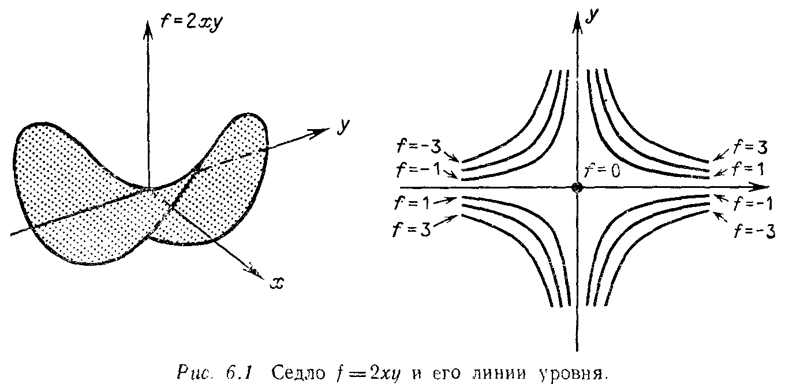

# Глава 6

# ПОЛОЖИТЕЛЬНО ОПРЕДЕЛЁННЫЕ МАТРИЦЫ

## § 6.1. МАКСИМУМЫ, МИНИМУМЫ И СЕДЛОВЫЕ ТОЧКИ

---
**стр. 279**
---

# Глава 6

# ПОЛОЖИТЕЛЬНО ОПРЕДЕЛЕННЫЕ МАТРИЦЫ

До сих пор нас не интересовали знаки собственных значений. Действительно, было бы преждевременно спрашивать, положительно $\lambda$ или отрицательно, пока не станет известно, вещественно ли оно. Но в гл. 5 было отмечено, что наиболее важные матрицы — симметрические матрицы в вещественном случае и эрмитовы матрицы в комплексном случае — имеют вещественные собственные значения. Следовательно, имеет смысл выяснить, положительны ли они, и одна из наших последующих целей — найти критерий, с помощью которого по самой симметричной матрице $A$, не вычисляя ее собственных значений, можно заранее установить, что все ее собственные значения положительны.

Прежде чем заняться поисками такого критерия, рассмотрим задачу, в которой знаки собственных значений важны. Здесь совсем другое положение, чем при исследовании устойчивости в теории дифференциальных уравнений, где были нужны отрицательные собственные значения, а не положительные. (Нам не следовало бы так мимоходом говорить об этом, но все же: если для $-A$ выполняется критерий, который мы ищем, то уравнение $du/dt = Au$ имеет затухающее решение $e^{\lambda t}x$ для каждого собственного значения $\lambda < 0$, а уравнение $d^2u/dt^2 = Au$ имеет чисто осциллирующее решение $e^{i\omega t}x$ с $\omega = \sqrt{-\lambda}$.) Эта новая задача возникает во многих приложениях, и мы надеемся, что читатель имеет о ней представление. Поэтому мы начинаем непосредственно с ее математической постановки. Это задача отыскания минимума, и мы сформулируем ее с помощью двух примеров:

$$F(x, y) = 7 + 2(x + y)^2 - y \sin y - x^3 + y^4$$

и

$$f(x, y) = 2x^2 + 4xy + y^2.$$

Имеет ли хотя бы одна из этих функций минимум в точке $x = y = 0$?

---
**стр. 280**
---

Замечание 1. Члены нулевого порядка $F(0, 0) = 7$ и $f(0, 0) = 0$ не влияют на ответ. Их изменение соответствует простому сдвигу вверх или вниз графиков функций $F$ и $f$.

Замечание 2. Линейные члены дают необходимое условие: чтобы данная точка могла быть точкой минимума, она должна быть стационарной. Для этого первые производные должны обращаться в нуль при $x = y = 0$, что и происходит:

$$\frac{\partial F}{\partial x} = 4(x + y) - 3x^2 = 0, \qquad \frac{\partial F}{\partial y} = 4(x + y) - y \cos y - \sin y + 4y^3 = 0,$$

$$\frac{\partial f}{\partial x} = 4x + 4y = 0 \quad \text{и} \quad \frac{\partial f}{\partial y} = 4x + 2y = 0.$$

Таким образом, выбранная точка является стационарной для обеих функций $F$ и $f$. Геометрически поверхность $z = F(x, y)$ касается горизонтальной плоскости $z = 7$, а поверхность $z = f(x, y)$ касается плоскости $z = 0$. Вопрос о том, лежат ли графики функций $F$ и $f$ над этими плоскостями, когда мы удаляемся от точки касания $x = y = 0$.

Замечание 3. Квадратичные члены или, другими словами, вторые производные являются решающими:

$$\frac{\partial^2 F}{\partial x^2} = 4 - 6x = 4, \qquad \frac{\partial^2 f}{\partial x^2} = 4,$$

$$\frac{\partial^2 F}{\partial x \partial y} = \frac{\partial^2 F}{\partial y \partial x} = 4, \qquad \frac{\partial^2 f}{\partial x \partial y} = \frac{\partial^2 f}{\partial y \partial x} = 4,$$

$$\frac{\partial^2 F}{\partial y^2} = 4 + y \sin y - 2 \cos y + 12y^2 = 2, \qquad \frac{\partial^2 f}{\partial y^2} = 2.$$

Эти производные уже содержат ответ на интересующий нас вопрос, и поскольку они одинаковы у обеих функций, то ответ должен быть один и тот же. **Таким образом, эти две функции ведут себя вблизи начала координат одинаково, поэтому функция $F$ имеет в начале координат минимум тогда и только тогда, когда в этой точке имеет минимум функция $f$.**

Замечание 4. Члены более высокого порядка в $F$ не оказывают влияния на вопрос о локальном минимуме, но они могут помешать существованию в этой точке глобального минимума. Наш пример — это именно такой случай: из-за члена $-x^3$ функция $F$ с какого-то момента устремится к $-\infty$ независимо от того, что происходит вблизи точки $x = y = 0$. Подобная ситуация невозможна для функции $f$ или для любой другой квадратичной формы, которая не имеет членов высшего порядка. Каждая квадратичная

---
**стр. 281**
---

форма $f = ax^2 + 2bxy + cy^2$ имеет стационарную точку в начале координат, где $\partial f / \partial x = \partial f / \partial y = 0$, и если она имеет локальный минимум при $x = y = 0$, то эта точка является также точкой глобального минимума. Поверхность $z = f(x, y)$ будет по форме похожа на чашу, покоящуюся на одной точке в начале координат.

Подведем итог. Вопрос локального минимума для $F$ эквивалентен такому же вопросу для $f$. Если бы стационарной точкой функции $F$ оказалась точка $x = \alpha$, $y = \beta$, а не $x = y = 0$, то единственным отличием было бы использование вторых производных в точке $\alpha$, $\beta$:

$$\hat{f}(x, y) = \frac{x^2}{2} \frac{\partial^2 F}{\partial x^2}(\alpha, \beta) + xy \frac{\partial^2 F}{\partial x \partial y}(\alpha, \beta) + \frac{y^2}{2} \frac{\partial^2 F}{\partial y^2}(\alpha, \beta). \quad (1)$$

Тогда $\hat{f}$ ведет себя вблизи точки $(0, 0)$ так же, как $F$ ведет себя вблизи точки $(\alpha, \beta)$.

Один случай пока надо исключить из рассмотрения. Он соответствует возможности $F'' = 0$, которая создает большие затруднения даже для функции одного переменного. Тогда в рассмотрение вводятся третьи производные, так как вторые производные не дают определенного решения. Чтобы избежать этих трудностей, обычно требуют, чтобы квадратичная часть была невырожденной, т. е. для настоящего минимума допускается обращение $f$ в нуль только при $x = y = 0$. Квадратичная форма, которая строго положительна во всех других точках, называется ***положительно определенной***.

Проблема теперь сводится к следующему: что является для функции от двух переменных $x$ и $y$ корректной заменой условия $F'' > 0$? В случае одной переменной знака второй производной достаточно, чтобы сделать выбор между минимумом или максимумом. Но сейчас мы имеем три производные: $F_{xx}$, $F_{xy} = F_{yx}$ и $F_{yy}$. Эти три члена точно определяют функцию $f$, и они должны определять, имеет ли $F$ (так же как $f$) минимум. Каковы же условия на $a$, $b$ и $c$, которые будут обеспечивать положительную определенность $f = ax^2 + 2bxy + cy^2$?

Легко найти одно необходимое условие:

*(i) Если $f$ положительно определена, то обязательно $a > 0$.*

Мы просто рассматриваем точку $x = 1$, $y = 0$, где $ax^2 + 2bxy + cy^2$ равно $a$; значение $f$ должно быть положительно, если $f$ положительно определена. Применительно к функции $F$ это означает, что $\partial^2 F / \partial x^2 > 0$, поскольку, фиксируя значение $y = 0$ и изменяя только $x$, для минимума мы должны иметь $F'' > 0$. Аналогично, если мы фиксируем $x = 0$ и изменяем только $y$, возникает условие на коэффициент $c$:

*(ii) Если $f$ положительно определена, то обязательно $c > 0$.*

---
**стр. 282**
---

Не так легко решить, являются ли условия (i) и (ii), взятые вместе, достаточными для положительной определенности формы $f$? Есть ли необходимость рассмотрения смешанной производной, равной коэффициенту $b$?

Пример, $f = x^2 - 10xy + y^2$. В этом случае величины $a = 1$ и $c = 1$ одновременно положительны. Выберем точку $x = y = 1$. Так как $f(1, 1) = -8$, то форма $f$ не положительно определена. Условия $a > 0$ и $c > 0$ обеспечивают здесь возрастание $f$ по направлениям $x$ и $y$, но она может еще убывать вдоль какой-нибудь другой прямой. В данном случае это прямая $x = y$. Коэффициент $b$ может подавлять $a$ и $c$. В действительности невозможно установить положительную определенность, просматривая $f$ вдоль какого-либо конечного числа фиксированных прямых.

Очевидно, что решение вопроса зависит от $b$. Для первоначальной функции $f$ коэффициент $b$ был положителен. Достаточно ли этого, чтобы обеспечить минимум? Ответ опять отрицателен: знак $b$ не играет роли. Несмотря на положительность всех коэффициентов наша исходная форма $2x^2 + 4xy + y^2$ не является положительно определенной, и ни $F$, ни $f$ не имеют минимума, так как вдоль прямой $x = -y$ мы имеем $f(1, -1) = 2 - 4 + 1 = -1$.

Таким образом, для того чтобы форма $f$ была положительно определенной, нужно контролировать величину $b$ (в зависимости от $a$ и $c$). Сейчас мы хотим найти точный критерий, дающий необходимое и достаточное условие для положительной определенности. Простейший способ — привести $f$ к «полному квадрату»:

$$f = ax^2 + 2bxy + cy^2 = a\left(x + \frac{b}{a}y\right)^2 + \left(c - \frac{b^2}{a}\right)y^2. \quad (2)$$

Очевидно, что первый член справа положителен, так как он является полным квадратом, умноженным на положительный коэффициент $a$ — необходимое условие (i) все еще в силе. Первый квадрат, однако, когда $x = b$ и $y = -a$, обращается в нуль, и в этой точке мы имеем $f(b, -a) = a(ac - b^2)$. Следовательно, требуется новое необходимое условие.

*(iii) Если $f$ положительно определена, то обязательно $ac > b^2$.*

Заметьте, что условия (i) и (iii), взятые вместе, автоматически приводят к условию (ii): если $a > 0$ и $ac > b^2 \ge 0$, то обязательно $c > 0$. При этом правая часть (2), безусловно, будет положительной, и мы получаем, наконец, ответ на наш вопрос.

**6А.** *Квадратичная форма $f = ax^2 + 2bxy + cy^2$ положительно определена тогда и только тогда, когда $a > 0$ и $ac - b^2 > 0$. Соответственно $F$ имеет (строгий) минимум при $x = y = 0$ тогда и только тогда, когда*

$$\frac{\partial^2 F}{\partial x^2}(0, 0) > 0, \qquad \left[\frac{\partial^2 F}{\partial x^2}(0, 0)\right]\left[\frac{\partial^2 F}{\partial y^2}(0, 0)\right] > \left[\frac{\partial^2 F}{\partial x \partial y}(0, 0)\right]^2.$$

---
**стр. 283**
---

Отсюда легко получаются условия для максимума, так как $f$ имеет максимум всякий раз, когда $-f$ имеет минимум. Этот способ обращает знаки $a$, $b$ и $c$ на противоположные и оставляет второе условие $ac - b^2 > 0$ неизменным: квадратичная форма ***отрицательно определена*** тогда и только тогда, когда $a < 0$ и $ac - b^2 > 0$. Те же самые изменения применимы для $F$.

Квадратичная форма вырождена, когда $ac - b^2 = 0$. Этот случай мы пока не рассматривали. Второй член в (2) должен исчезнуть, оставив только один квадрат $f = a(x + (b/a)y)^2$, который либо ***положительно полуопределен***, когда $a > 0$, либо ***отрицательно полуопределен***, когда $a < 0$. Приставка «полу» допускает возможность обращения $f$ в нуль, как это происходит, например, в точке $x = b$, $y = -a$. Геометрически это означает, что поверхность $z = f(x, y)$ вырождается из «чаши» в бесконечно длинный «желоб». (Если говорить о поверхности $z = x^2$ в трехмерном пространстве, то этот желоб тянется вдоль оси $y$, и каждое поперечное сечение будет той же самой параболой $z = x^2$.) Еще более вырожденную квадратичную форму дают условия $a = b = c = 0$, она является как положительно полуопределенной, так и отрицательно полуопределенной. Чаша становится совершенно плоской.

В случае одного измерения все возможности для функции $F(x)$ сейчас были бы исчерпаны: либо $F$ имеет минимум, либо она имеет максимум, либо $F'' = 0$. При двух переменных, однако, остается еще одна очень важная возможность, так как величина $ac - b^2$ может быть отрицательной. Это имело место в нашем примере, когда величина $b$ доминировала над $a$ и $c$ и соответственно $f$ на одних направлениях была положительна, а на других отрицательна. Такая же ситуация возникает даже независимо от $b$, если $a$ и $c$ имеют противоположные знаки. Направления осей $x$ и $y$ дают противоположные результаты — на одной оси $f$ возрастает, на другой убывает. Здесь полезно рассмотреть два частных случая:

$$f_1 = 2xy \quad \text{и} \quad f_2 = x^2 - y^2.$$

В первом из них $b$ доминирует (при $a = c = 0$); во втором величины $a$ и $c$ имеют противоположные знаки. В обоих случаях $ac - b^2 = -1$.

Это ***неопределенные*** квадратичные формы, потому что они могут принимать значения любого знака, т. е. в зависимости от $x$ и $y$ возможно как $f > 0$, так и $f < 0$. Таким образом, мы имеем стационарную точку, которая не является ни точкой максимума, ни точкой минимума. Она носит название ***седловой точки***. (По названию вы уже можете предположить, что поверхность $z = f(x, y)$, скажем $z = x^2 - y^2$, имеет форму, подобную седлу: она спускается вниз вдоль оси $y$ и поднимается вверх вдоль оси $x$.)

---
**стр. 284**
---

Вы можете представить себе дорогу, идущую в горах, где вершина перевала является минимумом, если смотреть вдоль цепи гор, и в то же время является максимумом, если смотреть на нее вдоль дороги (рис. 6.1).

Седла $2xy$ и $x^2 - y^2$ практически одинаковы. Если мы повернем одно из них на угол $45^\circ$, то мы получим другое. Заметим также, что их почти невозможно нарисовать.

**Упражнение 6.1.1.** Показать, что исходная квадратичная форма $f = 2x^2 + 4xy + y^2$ имеет седловую точку в начале координат, несмотря на положительность ее коэффициентов. Показать, как можно записать $f$ в виде разности двух полных квадратов.

Чтобы установить условия минимума $F_{xx} > 0$ и $F_{xx}F_{yy} > F_{xy}^2$, достаточно вычислений. Однако линейная алгебра позволит сделать больше, если мы поймем, как можно из коэффициентов формы $f$ составить симметрическую матрицу $A$. Если коэффициенты членов $ax^2$ и $cy^2$ поставить в матрице на диагональ, а коэффициент члена $2bxy$ расщепить на наддиагональный и поддиагональный элементы, то форма $f$ будет тождественно равна такому произведению матриц:

$$ax^2 + 2bxy + cy^2 = \begin{bmatrix} x & y \end{bmatrix} \begin{bmatrix} a & b \\ b & c \end{bmatrix} \begin{bmatrix} x \\ y \end{bmatrix}. \quad (3)$$

Это равенство является ключом ко всей главе. Его можно переписать в виде $f = x^T Ax$ и сразу обобщить на общий $n$-мерный случай. Такая сокращенная форма записи очень удобна для изучения проблемы максимума и минимума. В случае $n$ независимых переменных $x_1, \dots, x_n$ (вместо переменных $x$ и $y$ в двумерном случае) они составляют просто вектор-столбец $x$. Тогда для лю-

---
**стр. 285**
---

бой симметрической матрицы $A$ произведение $f = x^T Ax$ определяет чистую квадратичную форму. Она имеет стационарную точку в начале координат и не содержит членов более высокого порядка:

$$x^T Ax = \begin{bmatrix} x_1 & x_2 & \cdots & x_n \end{bmatrix} \begin{bmatrix} a_{11} & a_{12} & \cdots & a_{1n} \\ a_{21} & a_{22} & \cdots & a_{2n} \\ \vdots & \vdots & \ddots & \vdots \\ a_{n1} & a_{n2} & \cdots & a_{nn} \end{bmatrix} \begin{bmatrix} x_1 \\ x_2 \\ \vdots \\ x_n \end{bmatrix} =$$

$$= a_{11}x_1^2 + a_{12}x_1x_2 + a_{21}x_2x_1 + \cdots + a_{nn}x_n^2 =$$

$$= \sum_{i=1}^{n} \sum_{j=1}^{n} a_{ij}x_i x_j. \quad (4)$$

Заданную функцию $F(x_1, \dots, x_n)$, имеющую стационарную точку в начале координат (все первые ее производные равны нулю), мы будем исследовать на минимум, максимум или седловую точку, строя «матрицу Гессе» $A$, элементами которой являются вторые производные, т. е. $a_{ij} = \partial^2 F / \partial x_i \partial x_j$. Она автоматически будет симметрической матрицей, поскольку члены $a_{12}x_1x_2$ и $a_{21}x_2x_1$ равны между собой (это соответствует расщеплению $2bxy$ в двумерном случае). При этом функция имеет минимум в начале координат, когда $f$ положительно определена, или, иначе говоря, когда матрица $A$ положительно определена, т. е.

$$x^T Ax > 0 \quad \text{для всех ненулевых векторов } x. \quad (5)$$

**Упражнение 6.1.2.** Исследовать следующие матрицы на положительную определенность и выписать соответствующие функции $f$:

$$\text{(a)}\quad A = \begin{bmatrix} 1 & 3 \\ 3 & 5 \end{bmatrix} \qquad \text{(b)}\quad A = \begin{bmatrix} 1 & -1 \\ -1 & 1 \end{bmatrix}$$

$$\text{(c)}\quad A = \begin{bmatrix} 1 & 0 & 0 \\ 0 & 1 & 0 \\ 0 & 0 & -1 \end{bmatrix} \qquad \text{(d)}\quad A = \begin{bmatrix} 2 & -1 & 0 \\ -1 & 2 & -1 \\ 0 & -1 & 2 \end{bmatrix}$$

В случае (d) записать $x^T Ax$ в виде суммы трех квадратов. В случае (b) показать, что вырожденная матрица соответствует вырожденной квадратичной форме (оба факта являются следствием обращения в нуль величины $ac - b^2$, равной определителю $A$). Установить, вдоль какой прямой $f$ тождественно равна нулю.

**Упражнение 6.1.3.** Для положительно определенной функции $f$ кривая $f(x, y) = 1$ является эллипсом (эта кривая — сечение чаши $z = f(x, y)$ плоскостью $z = 1$). Изобразить этот эллипс для случая $a = c = 2$, $b = -1$.

**Упражнение 6.1.4.** Исследовать на минимум, максимум или седловую точку функции

$$\text{(a)}\quad F = -1 + 4(e^x - x) - 5x \sin y + 6y^2 \quad \text{в точке } x = y = 0,$$

$$\text{(b)}\quad F = (x^2 - 2x) \cos y \quad \text{в стационарной точке } x = 1,\ y = \pi.$$
