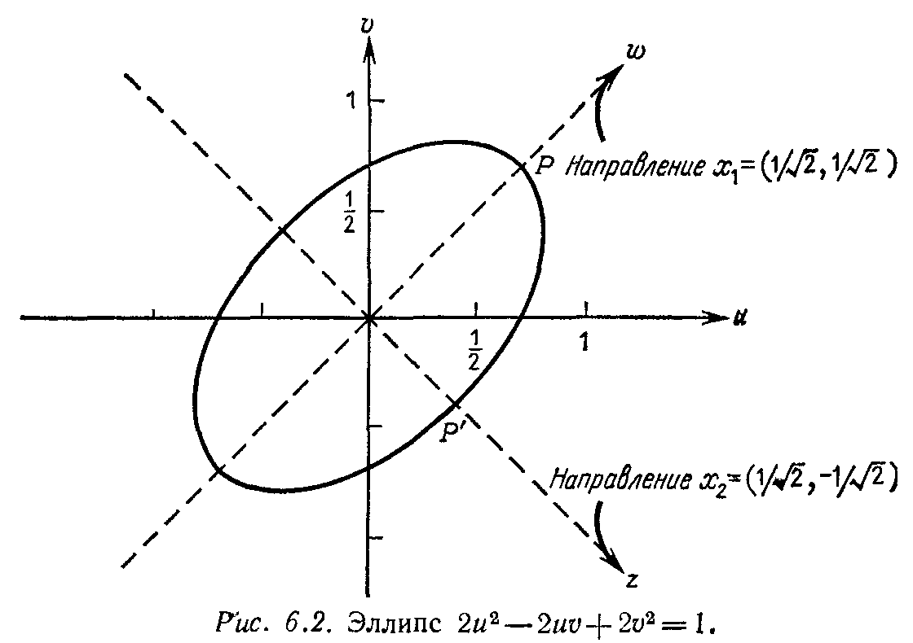

## § 6.2. КРИТЕРИИ ПОЛОЖИТЕЛЬНОЙ ОПРЕДЕЛЁННОСТИ

---
**стр. 286**
---

**§ 6.2. КРИТЕРИИ ПОЛОЖИТЕЛЬНОЙ ОПРЕДЕЛЕННОСТИ**

Какие симметрические матрицы обладают свойством $x^T Ax > 0$ для всех ненулевых векторов $x$? Существует четыре или пять различных способов ответить на этот вопрос, и мы надеемся найти все их. Предыдущий параграф был начат с некоторых соображений относительно знаков собственных значений, но дальнейшая дискуссия была отложена. Вопрос о собственных значениях уступил место двум условиям на элементы матрицы: если $A = \begin{bmatrix} a & b \\ b & c \end{bmatrix}$, то для положительной определенности необходимы и достаточны условия $a > 0$, $ac - b^2 > 0$. Наша цель сейчас — обобщить эти условия на матрицы порядка $n$ и найти их связь со знаками собственных значений. По крайней мере в случае матрицы порядка 2 сформулированные условия означают, что оба ее собственных значения положительны. Действительно, их произведение равно определителю $ac - b^2 > 0$, и, следовательно, оба собственных значения либо положительны, либо отрицательны. Но так как их сумма равна следу $a + c > 0$ матрицы $A$, то оба собственных значения будут обязательно положительными.

Интересно, как эти два подхода, один из которых связан с непосредственными вычислениями, а другой использует внутренние свойства матриц (их собственные значения), отражают две части настоящей книги, о которых уже говорилось выше. Если более внимательно посмотреть на первый критерий, то нетрудно заметить, что в нем фигурируют ведущие элементы матрицы. Действительно, если представить $f$ в виде суммы квадратов

$$ax^2 + 2bxy + cy^2 = a \left( x + \frac{b}{a} y \right)^2 + \frac{ac - b^2}{a} y^2,$$

то коэффициенты $a$ и $(ac - b^2)/a$ в точности являются ведущими элементами матрицы $A$ порядка 2. Если эта зависимость сохраняется для матриц большего порядка, то мы получим очень простой критерий положительной определенности матрицы, основанный на определении знаков ведущих элементов. Этот критерий имеет очень простую интерпретацию: форма $x^T Ax$ положительно определена тогда и только тогда, когда она представима в виде суммы $n$ независимых квадратов.

Еще одно предварительное замечание. Как уже отмечалось, обе части книги объединяет теория определителей, и, следовательно, возникает вопрос, какую роль в положительной определенности матриц играют определители. Очевидно, что условия $\det A > 0$ недостаточно для положительной определенности матрицы $A$, так как при $a = c = -1$ и $b = 0$ мы приходим к матрице $A = -I$, которая является отрицательно определенной. Оказывается, что выполнение рассматриваемого критерия (через опре-

---
**стр. 287**
---

делители) нужно требовать не только от матрицы $A$ (в данном случае $ac - b^2 > 0$), но также от ее подматрицы $a$ порядка один, стоящей в левом верхнем углу. Естественным обобщением сказанного на $n$-мерный случай будет выполнение этих условий для всех $n$ левых верхних подматриц

$$A_1 = [a_{11}], \quad A_2 = \begin{bmatrix} a_{11} & a_{12} \\ a_{21} & a_{22} \end{bmatrix}, \quad A_3 = \begin{bmatrix} a_{11} & a_{12} & a_{13} \\ a_{21} & a_{22} & a_{23} \\ a_{31} & a_{32} & a_{33} \end{bmatrix}, \quad \ldots, \quad A_n = A.$$

Сформулируем и дадим детальное доказательство следующей основной теоремы.

**6B.** *Каждый из перечисленных ниже критериев является необходимым и достаточным условием **положительной определенности** матрицы $A$:*

(I) $x^T Ax > 0$ для всех ненулевых векторов $x$.

(II) Все собственные значения $\lambda_i$ матрицы $A$ положительны.

(III) Определители всех подматриц $A_k$ положительны.

(IV) Все ведущие элементы $d_i$ (без перестановок строк) положительны.

Д о к а з а т е л ь с т в о. Критерий I является определением положительно определенной матрицы, и в качестве первого шага мы покажем его эквивалентность критерию II. Для этого сначала мы предположим, что выполняется критерий I, и установим положительность каждого собственного значения $\lambda_i$ матрицы $A$. Пусть $x_i$ нормированный, т. е. $x_i^T x_i = 1$, собственный вектор $A$, соответствующий ее собственному значению $\lambda_i$. Тогда

$$Ax_i = \lambda_i x_i \quad \text{и} \quad x_i^T A x_i = x_i^T \lambda_i x_i = \lambda_i,$$

поскольку $x_i^T x_i = 1$. Так как, согласно критерию I, $x^T Ax$ положительно для всех $x$ и в том числе для $x = x_i$, то величина $x_i^T A x_i = \lambda_i$ также должна быть положительной и, следовательно, **собственные значения положительно определенной матрицы положительны.**

Теперь, предполагая, что все $\lambda_i > 0$, покажем, что $x^T Ax > 0$ (это будет показано для произвольного ненулевого вектора $x$, а не только для собственного вектора). Поскольку симметрическая матрица обладает полным набором ортонормированных собственных векторов (см. стр. 272), то любой вектор $x$ может быть представлен в виде линейной комбинации $c_1 x_1 + \dots + c_n x_n$. Отсюда имеем

$$Ax = c_1 Ax_1 + \dots + c_n Ax_n = c_1 \lambda_1 x_1 + \dots + c_n \lambda_n x_n$$

---
**стр. 288**
---

и в силу условия ортонормированности системы $x_i$

$$x^T Ax = (c_1 x_1^T + \dots + c_n x_n^T)(c_1 \lambda_1 x_1 + \dots + c_n \lambda_n x_n) =$$
$$= c_1^2 \lambda_1 + \dots + c_n^2 \lambda_n. \qquad (6)$$

Если каждое $\lambda_i > 0$ и не все $c_i$ равны нулю, то $x^T Ax > 0$. Таким образом, выполнение критерия II обеспечивает выполнение критерия I.

Эквивалентность критериев III и IV критерию I докажем в три этапа.

Сначала докажем, что из выполнения критерия I следует выполнение критерия III. С этой целью отметим, что определитель любой матрицы равен произведению ее собственных значений. Поэтому если выполнен критерий I и, следовательно, известно, что все собственные значения $\lambda_i$ положительны, то

$$\det A = \lambda_1 \lambda_2 \dots \lambda_n > 0.$$

Чтобы установить этот же результат для всех подматриц $A_k$, покажем, что из положительной определенности $A$ следует положительная определенность всех $A_k$. Для этого рассмотрим все векторы $x$, последние $n - k$ компонент которых равны нулю, т. е. векторы вида $x = \begin{bmatrix} x_k \\ 0 \end{bmatrix}$. Тогда

$$x^T Ax = \begin{bmatrix} x_k^T & 0 \end{bmatrix} \begin{bmatrix} A_k & * \\ * & * \end{bmatrix} \begin{bmatrix} x_k \\ 0 \end{bmatrix} = x_k^T A_k x_k,$$

и, следовательно, если $x^T Ax > 0$ для всех ненулевых $x$, то, в частности, $x_k^T A_k x_k > 0$ для всех ненулевых $x_k$. Итак, критерий I выполнен для $A_k$, так что к матрицам $A_k$ применимы те же соображения, что мы применяли к самой матрице $A$. В частности, их собственные значения (которые не совпадают с $\lambda_i$!) и определители, которые являются произведениями соответствующих собственных значений, должны быть положительны.

*Теперь покажем, что из критерия III следует критерий IV.* Это устанавливается очень легко, поскольку между определителями подматриц $A_k$ и ведущими элементами имеется прямая связь. Согласно стр. 205, $k$-й ведущий элемент $d_k$ является в точности отношением $\det A_k$ к $\det A_{k-1}$. Таким образом, если все определители положительны, то все ведущие элементы также положительны и, следовательно, положительно определенные матрицы ни в каких перестановках строк не нуждаются.

*В заключение докажем, что из критерия IV следует критерий I.* Иначе говоря, мы должны показать, что из положительности ведущих элементов следует неравенство $x^T Ax > 0$. Для матриц порядка два мы делали это путем представления формы

---
**стр. 289**
---

$ax^2 + 2bxy + cy^2$ в виде суммы квадратов. Чтобы установить подобный факт для матриц любого порядка, необходим следующий важный факт: *в методе исключения Гаусса для симметрической матрицы верхняя треугольная матрица $U$ равна транспонированной к нижней треугольной матрице $L$ (стр. 55) и, следовательно, разложение $A = LDU$ переходит в разложение $A = LDL^T$*.

**Пример**

$$A = \begin{bmatrix} 2 & -1 & 0 \\ -1 & 2 & -1 \\ 0 & -1 & 2 \end{bmatrix} = \begin{bmatrix} 1 & 0 & 0 \\ -\frac{1}{2} & 1 & 0 \\ 0 & -\frac{2}{3} & 1 \end{bmatrix} \begin{bmatrix} 2 & & \\ & \frac{3}{2} & \\ & & \frac{4}{3} \end{bmatrix} \begin{bmatrix} 1 & -\frac{1}{2} & 0 \\ 0 & 1 & -\frac{2}{3} \\ 0 & 0 & 1 \end{bmatrix} = LDL^T.$$

Умножая эти выражения слева на $x^T$, а справа на $x$, мы приходим к сумме квадратов, в которой коэффициентами являются ведущие элементы:

$$x^T Ax = \begin{bmatrix} u & v & w \end{bmatrix} \begin{bmatrix} 1 & 0 & 0 \\ -\frac{1}{2} & 1 & 0 \\ 0 & -\frac{2}{3} & 1 \end{bmatrix} \begin{bmatrix} 2 & & \\ & \frac{3}{2} & \\ & & \frac{4}{3} \end{bmatrix} \begin{bmatrix} 1 & -\frac{1}{2} & 0 \\ 0 & 1 & -\frac{2}{3} \\ 0 & 0 & 1 \end{bmatrix} \begin{bmatrix} u \\ v \\ w \end{bmatrix} =$$
$$= 2\left(u - \frac{1}{2}v\right)^2 + \frac{3}{2}\left(v - \frac{2}{3}w\right)^2 + \frac{4}{3}(w)^2.$$

Положительные ведущие элементы обеспечивают положительность выражения $x^T Ax$. Таким образом, критерий I следует из критерия IV, что завершает последний этап доказательства теоремы$^{1)}$. Аналогичная теорема справедлива и в комплексном случае для эрмитовых матриц $A = A^H$.

Было бы ошибкой, если бы от критерия III осталось впечатление, что здесь чрезвычайно важно рассматривать именно верхние подматрицы $A_k$. В равной степени мы могли бы проверить определители нижних правых подматриц. Или мы могли бы использовать любую цепочку главных подматриц, начиная с произвольного диагонального элемента $a_{ii}$ в качестве первой подматрицы, и добавляя каждый раз необходимые элементы из новой строки и нового столбца с одинаковыми номерами. В частности,

1) Доказательство последнего этапа было проведено лишь для конкретного примера, полное доказательство будет дано чуть дальше посредством цепочки IV $\Rightarrow$ V $\Rightarrow$ I.

---
**стр. 290**
---

положительность элементов $a_{ii}$, которые являются коэффициентами при $x_i^2$, является необходимым условием положительной определенности матрицы $A$. Однако, как это видно из примеров, это условие далеко не является достаточным.

Ведущие элементы $d_i$ ни в коем случае нельзя путать с собственными значениями $\lambda_i$. Для типичной положительно определенной матрицы это два совершенно различных множества положительных чисел. В последнем примере матрицы порядка 3 наиболее простым, по-видимому, является критерий, использующий определители (критерий III):

$$\det A_1 = 2, \quad \det A_2 = 3, \quad \det A_3 = \det A = 4.$$

Для больших матриц гораздо проще следить за ведущими элементами в методе исключения, который в рассматриваемом примере дает $d_1 = 2$, $d_2 = 3/2$, $d_3 = 4/3$. Обычно критерий, использующий собственные значения, наиболее трудоемкий, но для нашего примера мы знаем, что они положительны:

$$\lambda_1 = 2 - \sqrt{2}, \quad \lambda_2 = 2, \quad \lambda_3 = 2 + \sqrt{2}.$$

Заметим, что, хотя последний критерий является самым тяжелым в применении к конкретной матрице $A$, он является наиболее удобным для теоретических целей.

**Упражнение 6.2.1.** Исследовать на положительную определенность матрицы

$$A = \begin{bmatrix} 2 & -1 & -1 \\ -1 & 2 & -1 \\ -1 & -1 & 2 \end{bmatrix}, \quad B = \begin{bmatrix} 1 & 0 & 1 \\ 0 & 1 & 0 \\ 1 & 0 & 1 \end{bmatrix}, \quad C = \begin{bmatrix} 1 & 1 & 1 \\ 1 & 2 & 2 \\ 1 & 2 & 3 \end{bmatrix}.$$

Используя разложение $B = LDL^T$, записать выражение $x^T Bx = u^2 + v^2 + w^2 + 2uw$ в виде суммы квадратов.

**Упражнение 6.2.2.** Построить матрицу, наибольшие элементы которой лежат на главной диагонали (например, вида

$$A = \begin{bmatrix} 1 & \alpha & \beta \\ \alpha & 1 & \alpha \\ \beta & \alpha & 1 \end{bmatrix}$$

с $|\alpha| < 1$, $|\beta| < 1$) и которая не является даже положительно полуопределенной. (Вычислить $\det A$.)

**Упражнение 6.2.3.** Показать, что из положительной определенности матрицы $A$ следует положительная определенность матриц $A^2$ и $A^{-1}$.

**Упражнение 6.2.4.** Показать, что из положительной определенности матриц $A$ и $B$ следует положительная определенность матрицы $A + B$. Какой из критериев I—IV здесь наиболее удобен?

---
**стр. 291**
---

Я надеюсь, вы мне позволите привести еще один критерий положительной определенности. Мы уже подошли к нему очень близко, он позволяет даже лучше понять приведенные ранее критерии:

**6 С.** *Матрица $A$ положительно определена тогда и только тогда, когда*

*(V) существует такая невырожденная матрица $W$, что $A = W^T W$.*

Из этого нового условия следует, что

$$x^T Ax = x^T W^T W x = \|Wx\|^2. \qquad (7)$$

Эта величина либо положительна, либо по крайней мере неотрицательна в зависимости от того, возможно или нет равенство $Wx = 0$ для ненулевого вектора $x$. Но поскольку матрица $W$ невырожденная, то оно возможно только для $x = 0$ и, следовательно, из критерия V вытекает выполнение критерия I из 6В. Все это очень похоже на метод наименьших квадратов с матрицей весов на стр. 178; наиболее общая мера длины — это $\|Wx\|$ и квадрат этой длины вводит положительно определенную матрицу $A = W^T W$.

Остается показать, что если матрица $A$ удовлетворяет условиям I — IV, то она также будет удовлетворять условию V. Для этого нам нужно построить матрицу $W$, что в действительности дважды мы уже почти сделали.

(i) На завершающем этапе основной теоремы для матрицы $A$ было построено разложение $LDL^T$. Так как ведущие элементы матрицы $A$ положительны, то выбирая в качестве $\sqrt{D}$ диагональную матрицу, диагональными элементами которой являются квадратные корни из соответствующих ведущих элементов, мы приходим к разложению $A = L\sqrt{D}\sqrt{D}L^T$$^{1)}$. Таким образом, одним из возможных выборов $W$ является верхняя треугольная матрица $\sqrt{D} L^T$. Это доказывает, что условие I является следствием условия IV.

(ii) Рассмотрим еще один способ, который дает другую матрицу $W$, используя вместо IV условие II. Так как собственные значения матрицы $A$ положительны и ее собственные векторы

1) Это так называемое ***разложение Холецкого***, когда ведущие элементы равномерно распределяются между нижним треугольным и верхним треугольным сомножителями. Оно почти не отличается от разложения $A = LDL^T$, и я обычно избегаю вычисления этих квадратных корней.

---
**стр. 292**
---

образуют ортогональную матрицу $Q$, которая диагонализует $A$, то справедливы разложения

$$A = Q \Lambda Q^T = Q \sqrt{\Lambda} \sqrt{\Lambda} Q^T = (\sqrt{\Lambda} Q^T)^T (\sqrt{\Lambda} Q^T).$$

Теперь для $W$ имеем другое представление $\sqrt{\Lambda} Q^T$, которое психологи используют в анализе основных компонент.

**Упражнение 6.2.5.** Построить двумя указанными способами матрицы $W$ для матрицы

$$A = \begin{bmatrix} 2 & -1 \\ -1 & 2 \end{bmatrix}.$$

**Упражнение 6.2.6.** Вычислить квадратный корень $R = Q \sqrt{\Lambda} Q^T$ матрицы $A$ из предыдущего упражнения. Проверить непосредственно по формулам, что $R$ симметрическая и $R^2 = A$. Собственные значения матрицы $R$ являются положительными квадратными корнями $\sqrt{\lambda_i}$, поэтому нетрудно показать, что $R$ является единственным симметрическим и положительно определенным квадратным корнем из $A$. Заметим также, что $R$ является одной из возможных матриц $W$.

**Упражнение 6.2.7.** Доказать, что если матрица $A$ положительно определена и матрица $C$ невырожденная, то матрица $B = C^T AC$ положительно определена.

**Упражнение 6.2.8.** Мы можем назвать несимметрическую матрицу «положительно определенной», если ее эрмитова часть $(A^H + A)/2$ является положительно определенной матрицей. Для такой матрицы, несмотря на то что величина $x^H Ax$ может быть комплексной, ее вещественная часть $\frac{1}{2}(x^H Ax + x^H A^H x)$ будет положительной.

(a) Показать, что для такой матрицы вещественная часть каждого собственного значения положительна. (Указание: рассмотреть вещественную часть скалярного произведения векторов $Ax = (\alpha + i\beta)x$ и $x^H$.)

(b) На примере треугольной матрицы $A$ порядка два показать, что ее собственные числа могут быть положительны, в то время как матрица $A^H + A$ не является положительно определенной. (В теореме устойчивости уравнения $u' = Au$ из отрицательной определенности $A^H + A$ следование убывания решения в каждый момент времени, но уравнение могло быть устойчивым и без этого условия.)

**Упражнение 6.2.9.** Выписать условия *отрицательной определенности* матрицы $A$, обратив особое внимание на условие III, где нужно установить связь между $\det(-A)$ и $\det A$.

**$n$-МЕРНЫЕ ЭЛЛИПСОИДЫ**

Уравнение $x^T Ax = 1$ является ключевым для понимания геометрической интерпретации свойства положительной определенности. Вектор $x$, удовлетворяющий этому уравнению, лежит на поверхности в $n$-мерном пространстве, которая, как мы покажем, является эллипсом, или, более точно, $n$-мерным эллипсоидом с центром в начале координат.

---
**стр. 293**
---

**Пример.** Пусть $A = \begin{bmatrix} 2 & -1 \\ -1 & 2 \end{bmatrix}$ и $x = \begin{bmatrix} u \\ v \end{bmatrix}$. Тогда для анализа уравнения $x^T Ax = 2u^2 - 2uv + 2v^2 = 1$ лучше всего переписать его в виде суммы квадратов с собственными значениями $\lambda_2 = 3$ и $\lambda_1 = 1$ матрицы $A$ в качестве коэффициентов:

$$2u^2 - 2uv + 2v^2 = 1\left(\frac{u}{\sqrt{2}}+\frac{v}{\sqrt{2}}\right)^2 + 3\left(\frac{u}{\sqrt{2}}-\frac{v}{\sqrt{2}}\right)^2 = 1. \qquad (8)$$

Обозначим выражения в скобках через $w$ и $z$ соответственно. Тогда графиком уравнения $w^2 + 3z^2 = 1$ будет обычный эллипс. Концом его длинной оси будет точка $w = 1, z = 0$, а концом короткой — точка $w = 0, z = 1/\sqrt{3}$. Иначе говоря, половина длины большей из осей равна $1/\sqrt{\lambda_1}$, а половина длины меньшей из осей равна $1/\sqrt{\lambda_2}$ (рис. 6.2). Кроме того, направления этих осей сов-

падают с направлениями соответствующих собственных векторов $x_1 = (1/\sqrt{2}, 1/\sqrt{2})$ и $x_2 = (1/\sqrt{2}, -1/\sqrt{2})$. Таким образом, геометрия положительной определенности полностью связана с собственными числами и векторами матрицы $A$.

Если понятно, что было проделано с уравнением (8), то то же самое мы можем осуществить для любой поверхности $x^T Ax = 1$. Основным шагом всегда является диагонализация матрицы $A$ с помощью ортогональной матрицы $Q$, столбцами которой являются единичные собственные векторы $x_j$ матрицы $A$: $Q^T AQ = \Lambda$

---
**стр. 294**
---

или $A = Q \Lambda Q^T$. Это приводит к записи $x^T Ax$ в виде суммы квадратов:

$$x^T Ax = \begin{bmatrix} & x^T & \end{bmatrix} \begin{bmatrix} & x_1 & \cdots & x_n \end{bmatrix} \begin{bmatrix} \lambda_1 & & \\ & \ddots & \\ & & \lambda_n \end{bmatrix} \begin{bmatrix} x_1^T \\ \vdots \\ x_n^T \end{bmatrix} \begin{bmatrix} x \end{bmatrix}$$

$$= \lambda_1 (x_1^T x)^2 + \cdots + \lambda_n (x_n^T x)^2.$$

В новых переменных $y_1 = x_1^T x, \ldots, y_n = x_n^T x$, что соответствует замене переменных по формуле $y = Q^T x$, уравнение рассматриваемой поверхности принимает вид

$$x^T Ax = \lambda_1 y_1^2 + \cdots + \lambda_n y_n^2 = 1. \qquad (9)$$

Это общий случай, частным примером которого является уравнение (8). Но даже в этом общем случае легко видеть, что точка с координатами $y_1 = 1/\sqrt{\lambda_1}, y_2 = \cdots = y_n = 0$ лежит на поверхности. Она лежит на конце наибольшей из осей и, следовательно, расположена дальше всех от начала координат. Более того, соответствующий вектор $x$ является кратным первого собственного вектора, или, точнее, $x = x_1 / \sqrt{\lambda_1}$. На рис. 6.2 эта точка обозначена буквой $P$. Ближайшая к началу координат точка лежит на конце наименьшей из осей и имеет координаты $y_1 = \cdots = y_{n-1} = 0, y_n = 1/\sqrt{\lambda_n}$. Эта точка, обозначенная на рис. 6.2 буквой $P'$, лежит на прямой, задаваемой последним собственным вектором $x_n$. Остальные промежуточные оси задаются соответствующими промежуточными собственными векторами матрицы $A$.

**6D.** *Предположим, что матрица $A$ положительно определена и ее единичные собственные векторы являются столбцами ортогональной матрицы $Q$. Тогда $A = Q \Lambda Q^T$, и преобразование $y = Q^T x$ позволяет записать выражение $x^T Ax$ в виде суммы квадратов:*

$$x^T Ax = x^T Q \Lambda Q^T x = y^T \Lambda y = \lambda_1 y_1^2 + \cdots + \lambda_n y_n^2. \qquad (10)$$

*При этом уравнение $x^T Ax = 1$ описывает эллипсоид, оси которого находятся в точках с координатами, где $y_j$ определяется условием $\lambda_j y_j^2 = 1$, а остальные равны нулю ($j = 1, \ldots, n$). Эти точки лежат на прямых, задаваемых собственными векторами матрицы $A$, и половина длины соответствующей оси равна $1/\sqrt{\lambda_j}$.*
