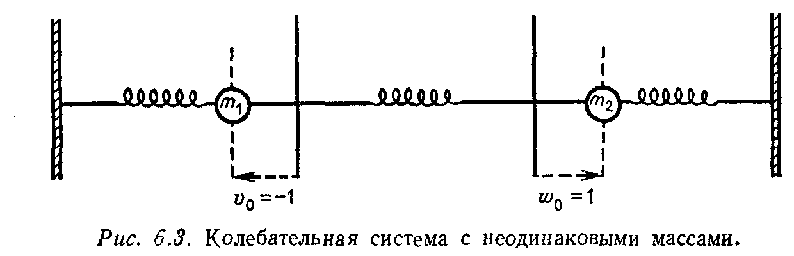

## § 6.3. ПОЛУОПРЕДЕЛЁННЫЕ И НЕОПРЕДЕЛЁННЫЕ МАТРИЦЫ. ОБОБЩЁННАЯ ЗАДАЧА НА СОБСТВЕННЫЕ ЗНАЧЕНИЯ AX=ΛBX

---
**стр. 295**
---

**Упражнение 6.2.10.** Эллипс $u^2 + 4v^2 = 1$ соответствует матрице $A = \begin{bmatrix} 1 & 0 \\ 0 & 4 \end{bmatrix}$. Выписать собственные значения и векторы матрицы $A$ и нарисовать этот эллипс.

**Упражнение 6.2.11.** Преобразовать уравнение $3u^2 - 2\sqrt{2}\,uv + 2v^2 = 1$ к сумме квадратов, вычислив собственные значения и векторы соответствующей матрицы $A$. Нарисовать эллипс, задаваемый полученным уравнением.

**Упражнение 6.2.12.** Уравнение $\lambda_1 y_1^2 + \lambda_2 y_2^2 + \lambda_3 y_3^2 = 1$ с тремя переменными задает эллипсоид, когда все $\lambda_i > 0$. Описать все возможные виды поверхностей в положительно полуопределенном случае, т. е. когда одно или несколько собственных значений равны нулю.

**§ 6.3. ПОЛУОПРЕДЕЛЕННЫЕ И НЕОПРЕДЕЛЕННЫЕ МАТРИЦЫ. ОБОБЩЕННАЯ ЗАДАЧА НА СОБСТВЕННЫЕ ЗНАЧЕНИЯ $Ax = \lambda Bx$**

Основной задачей этого раздела (после того как критерии положительной определенности полностью установлены) является более широкое рассмотрение проблемы определенности матриц. Под этим мы понимаем три основные задачи:

(1) критерии положительной полуопределенности матриц,

(2) связь между собственными значениями и ведущими элементами любой симметрической матрицы независимо от того, является она определенной или не является,

(3) обобщенная задача на собственные значения $Ax = \lambda Bx$.

На первый вопрос мы можем дать быстрый и четкий ответ, поскольку вся необходимая для этого работа уже проделана. Второй и третий вопросы связаны с так называемым «законом инерции» для симметрических матриц, который с математической точки зрения является основным результатом этого параграфа. Одним из следствий этого закона является утверждение, что ***знаки собственных значений определяют знаки ведущих элементов***. Другое же следствие утверждает, что если матрица $B$ положительно определена, то собственные значения задачи $Ax = \lambda Bx$ имеют те же знаки, что и собственные значения обычной задачи $Ax = \lambda x$. Собственные векторы задачи $Ax = \lambda Bx$ «взаимно ортогональны», но в другом смысле, чем это было раньше. Обобщенная задача на собственные значения очень важна для приложений. Поэтому один пример будет рассмотрен в настоящем параграфе и другой (связанный с методом конечных элементов) — в параграфе 6.5.

Сформулируем для случая положительно полуопределенных матриц аналог утверждений 6B и 6C, доказанных ранее для положительно определенных матриц.

---
**стр. 296**
---

**6E.** *Каждый из приводимых ниже критериев является необходимым и достаточным условием **положительной полуопределенности** матрицы $A$.*

(I') $x^T Ax \ge 0$ для всех векторов $x$.

(II') Все собственные значения $\lambda_i$ матрицы $A$ неотрицательны, т. е. $\lambda_i \ge 0$.

(III') Все главные подматрицы $A_k$ имеют неотрицательные определители.

(IV') Все ведущие элементы $d_i$ неотрицательны, т. е. $d_i \ge 0$.

(V') Существует такая матрица $W$ (возможно, вырожденная), что $A = W^T W$.

*Если ранг $A$ равен $r$, то $f = x^T Ax$ представима в виде суммы $r$ полных квадратов.*

Связь между неравенствами $x^T Ax \ge 0$ и $\lambda_i \ge 0$, которая является для нас наиболее важной, устанавливается следующим образом. Диагонализация $A = Q \Lambda Q^T$ приводит к равенствам

$$x^T Ax = x^T Q \Lambda Q^T x = y^T \Lambda y = \lambda_1 y_1^2 + \cdots + \lambda_n y_n^2, \qquad (11)$$

и это выражение неотрицательно для любого $x$ только в том случае, когда все $\lambda_i$ неотрицательны. Если ранг матрицы $A$ равен $r$, то она имеет только $r$ ненулевых собственных значений и, следовательно, в правой части (11) имеется только $r$ полных квадратов.

Что же касается определителя матрицы $A$, то он, будучи равным произведению всех собственных значений $A$, неотрицателен. Далее, поскольку все главные подматрицы исходной матрицы $A$ тоже будут положительно полуопределенными матрицами, то их собственные значения и определители также неотрицательны. Тем самым эквивалентность условия III' условиям I' и II' установлена. (Главные подматрицы матрицы $A$ образуются отбрасыванием ее строк и столбцов с одинаковыми номерами, например строк и столбцов с номерами один и четыре, что сохраняет для подматриц свойство симметричности. Для главных подматриц сохраняется также свойство положительной полуопределенности: если $x^T Ax \ge 0$ для любого $x$, то это неравенство выполняется для всех векторов, у которых, например, первая и четвертая компоненты равны нулю.)

Новым здесь является то, что III' прилагается ко всем главным подматрицам, а не только к расположенным в левом верхнем углу. Иначе мы не могли бы различать две матрицы, у которых все левые верхние определители равны нулю. Например, матрица $\begin{bmatrix} 0 & 0 \\ 0 & 1 \end{bmatrix}$ положительно полуопре-

---
**стр. 297**
---

делена, а матрица $\begin{bmatrix} 0 & 0 \\ 0 & -1 \end{bmatrix}$ отрицательно полуопределена. Ведущие элементы для положительно полуопределенной матрицы опять будут отношениями определителей и, следовательно, будут неотрицательны. Однако при реализации исключений здесь может возникнуть необходимость в перестановках строк, и, чтобы не нарушать симметричность матрицы, мы должны одновременно осуществлять перестановку столбцов с теми же самыми номерами. Это означает, что на самом деле «симметрическое исключение» осуществляется не для матрицы $PA$, а для матрицы $PAP^T$. Далее, так как такие перестановки только перемещают главные подматрицы, оставляя их определители неизменными, то из III' обязательно вытекает условие IV': после $r$ этапов исключения, где $r$ — ранг матрицы $A$, оставшаяся подматрица в правом нижнем углу является нулевой матрицей и, следовательно, $d_{r+1} = \cdots = d_n = 0$.

Наконец, выполнение условия IV' означает, что существует разложение $PAP^T = LDL^T$ (или $A = P^T LDL^T P$) с диагональной матрицей $D$, на диагонали которой стоят неотрицательные ведущие элементы. Теперь, выбирая $W = \sqrt{D} L^T P$, получаем $A = W^T W$, что означает выполнение V'. В свою очередь условие I' легко следует из условия V', так как $x^T Ax = x^T W^T Wx = \|Wx\|^2 \ge 0$, что завершает полный цикл доказательства утверждения 6E.

**Пример.** Матрица

$$A = \begin{bmatrix} 2 & -1 & -1 \\ -1 & 2 & -1 \\ -1 & -1 & 2 \end{bmatrix}$$

положительно полуопределена в силу следующих критериев:

(II') Собственные значения $\lambda_1 = 0, \lambda_2 = \lambda_3 = 3$ неотрицательны.

(III') Определители главных подматриц порядка один равны двум, порядка два равны трем и $\det A = 0$.

(IV') Так как

$$\begin{bmatrix} 2 & -1 & -1 \\ -1 & 2 & -1 \\ -1 & -1 & 2 \end{bmatrix} \to \begin{bmatrix} 2 & 0 & 0 \\ 0 & \frac{3}{2} & -\frac{3}{2} \\ 0 & -\frac{3}{2} & \frac{3}{2} \end{bmatrix} \to \begin{bmatrix} 2 & 0 & 0 \\ 0 & \frac{3}{2} & 0 \\ 0 & 0 & 0 \end{bmatrix},$$

то величины $d_1 = 2$, $d_2 = 3/2$ и $d_3 = 0$ являются ведущими элементами.

**Упражнение 6.3.1.** Для матрицы $A$ из последнего примера найти матрицу $W$ и записать выражение $x^T Ax = \|Wx\|^2$ в виде суммы двух квадратов. Описать в трехмерном пространстве поверхность $x^T Ax = 1$.

---
**стр. 298**
---

**Упражнение 6.3.2.** Применить любые три критерия из 6E к матрице

$$A = \begin{bmatrix} 1 & 1 & 1 \\ 1 & 1 & 1 \\ 1 & 1 & 0 \end{bmatrix}.$$

*Замечание.* Условия положительной полуопределенности можно также вывести из первоначальных условий I—V следующим образом. Добавим к исходной матрице $A$ некоторое малое кратное $\varepsilon I$ единичной матрицы, чтобы получить положительно определенную матрицу $A + \varepsilon I$, и устремим $\varepsilon$ к нулю. Тогда, так как собственные значения и определители непрерывно зависят от $\varepsilon$, они должны быть положительны до самого последнего момента и, следовательно, должны быть неотрицательны при $\varepsilon = 0$.

**ПРЕОБРАЗОВАНИЯ КОНГРУЭНТНОСТИ И ЗАКОН ИНЕРЦИИ**

Ранее в этой книге (в процессе исключения и задачах на собственные значения) основное внимание уделялось элементарным операциям, которые делают исходную матрицу проще. В каждом из этих случаев самым важным для нас было знать, какие свойства матрицы остаются неизменными. Когда кратное одной строки вычиталось из другой, список таких инвариантов был достаточно большим: нуль-пространство, пространство строк, ранг и определитель матрицы оставались теми же самыми. В случае задачи на собственные значения, когда основной операцией было преобразование подобия $A \to S^{-1}AS$ (или $A \to M^{-1}AM$), неизменными оставались ее собственные значения (а также, согласно приложению B, ее жорданова форма). Теперь мы хотим задать аналогичный вопрос для симметрических матриц. Что представляют собой «элементарные операции» и их инварианты для $x^T Ax$?

Основной операцией над квадратичными формами является преобразование переменных. Новый вектор $y$ выражается через вектор $x$ с помощью некоторой невырожденной матрицы $C$ по формуле $x = Cy$, в результате чего квадратичная форма принимает вид $y^T C^T ACy$. Таким образом, основной матричной операцией в теории квадратичных форм является ***преобразование конгруэнтности***

$$A \to C^T AC \quad \text{с некоторой невырожденной матрицей } C. \qquad (12)$$

Свойство симметричности при этом преобразовании сохраняется, поскольку матрица $C^T AC$ симметрическая, если симметрической является матрица $A$. Но нас интересует вопрос, какие еще свойства матрицы $A$ остаются неизменными при преобразовании конгруэнтности? Ответ на него дает *закон инерции* Сильвестра.

---
**стр. 299**
---

**6F.** *Матрица $C^T AC$ имеет столько же положительных, отрицательных и равных нулю собственных значений, что и матрица $A$.*

Другими словами, знаки собственных значений (но не сами собственные значения) сохраняются при преобразовании конгруэнтности. При доказательстве этого утверждения мы для удобства предположим, что матрица $A$ невырожденная. Тогда матрица $C^T AC$ тоже невырожденная и, следовательно, не надо беспокоиться из-за нулевых собственных значений. (В противном случае, мы можем работать с невырожденными матрицами $A + \varepsilon I$ или $A - \varepsilon I$ и в конце устремить $\varepsilon$ к нулю.)

Воспользуемся для доказательства 6F одним приемом из топологии, или, более точно, из теории гомотопий. Предположим, что матрица $C$ связана с некоторой ортогональной матрицей $Q$ непрерывной цепочкой матриц $C(t)$, $0 \le t \le 1$ (т. е. $C(0) = C$ и $C(1) = Q$), ни одна из которых не является вырожденной. Тогда собственные значения матрицы $C^T(t) AC(t)$ непрерывно изменяются (при изменении $t$ от 0 до 1) от собственных значений матрицы $C^T AC$ до собственных значений $Q^T AQ$. Так как ни одна из матриц $C(t)$ не является вырожденной, то ни одно из собственных значений матриц $C^T(t) AC(t)$ не может стать равным нулю (и тем более перескочить через нуль!). Следовательно, число собственных значений справа от нуля и число собственных значений слева от нуля одни и те же для матриц $C^T AC$ и $Q^T AQ$. Отсюда, поскольку собственные значения матрицы $A$ совпадают с собственными значениями подобной ей матрицы $Q^{-1}AQ = Q^T AQ$, вытекает, что столько же положительных и отрицательных собственных значений и у матрицы $A$.$^1)$ Утверждение 6F доказано.

**Пример 1.** Если $A = I$, то матрица $C^T AC = C^T C$ положительно определена (возьмите, например, $C = W$ из условия V). Все собственные значения единичной матрицы и матрицы $C^T C$ положительны, что подтверждает закон инерции.

**Пример 2.** Если $A = \begin{bmatrix} 1 & 0 \\ 0 & -1 \end{bmatrix}$, то определитель матрицы $C^T AC$ отрицателен:

$$\det C^T AC = (\det C^T)(\det A)(\det C) = -(\det C)^2 < 0.$$

$^1)$ В доказательстве нам необходима ортогональная матрица $Q$. Хороший способ выбора $Q$ доставляет применение процесса Грама — Шмидта к столбцам матрицы $C$. Итак, пусть $C = QR$, где $R$ — верхняя треугольная матрица с положительными диагональными элементами. Тогда в качестве непрерывной цепочки, связывающей $C$ с $Q$, можно выбрать семейство матриц $C(t) = tQ + (1 - t)QR = Q[tI + (1 - t)R]$. Действительно, при любом $t \in [0, 1]$ матрица $C(t)$ невырожденная, так как $Q$ — ортогональная матрица, а второй сомножитель $tI + (1 - t)R$ является верхней треугольной матрицей с положительными диагональными элементами.

---
**стр. 300**
---

Поскольку этот определитель является произведением собственных значений, то одно собственное значение матрицы $C^T AC$ должно быть положительным, а другое отрицательным (как и у матрицы $A$), что опять согласуется с законом инерции.

**Пример 3.** Следующее применение закона инерции является очень важным.

**6G.** *У любой симметрической матрицы $A$ знаки ведущих элементов согласованы со знаками собственных значений. Точнее число положительных, отрицательных и равных нулю собственных значений матрицы $A$ равно числу ее положительных, отрицательных и равных нулю ведущих элементов соответственно.*

Известно, что $A = Q \Lambda Q^T$, где $Q$ — ортогональная матрица, $\Lambda$ — диагональная матрица с собственными значениями матрицы $A$ по диагонали, а формула Холецкого имеет вид

$$A = LDL^T, \quad \text{или} \quad D = L^{-1} A (L^T)^{-1} = (L^{-1} Q) \Lambda (L^{-1} Q)^T. \qquad (13)$$

Выберем $C = (L^{-1} Q)^T$. Тогда, согласно закону инерции, собственные значения матрицы $D = C^T AC$ (одновременно являющиеся ведущими элементами для $A$) имеют те же знаки, что и собственные значения матрицы $\Lambda$. Если же в процессе исключения (сохраняющем симметричность) требовались перестановки строк и столбцов, то те же рассуждения нужно применить к матрице $PAP^T$.

**Упражнение 6.3.3.** Используя матрицы $C = \begin{bmatrix} 2 & 0 \\ 0 & -1 \end{bmatrix}$ и $A = \begin{bmatrix} 1 & 1 \\ 1 & 1 \end{bmatrix}$, показать, что матрица $C^T AC$ имеет собственные значения тех же знаков, что и $A$. Можете ли вы сконструировать цепочку невырожденных матриц $C(t)$, осуществляющих переход от $C$ к ортогональной матрице $Q$?

**Упражнение 6.3.4.** Используя знаки ведущих элементов, показать, что матрица

$$A = \begin{bmatrix} 1 & 3 & 0 \\ 3 & 8 & 7 \\ 0 & 7 & 6 \end{bmatrix}$$

имеет одно отрицательное и два положительных собственных значения. Затем найти ведущие элементы матрицы $A + 2I$ и показать, что добавление двойки к собственным значениям матрицы $A$ делает их все положительными. Следовательно, отрицательное собственное значение матрицы $A$ должно принадлежать интервалу $(-2, 0)$.

Последнее упражнение указывает путь вычисления собственных значений, и это будет первый практический метод, который мы укажем. (Он был одним из основных методов около двадцати лет назад и до сих пор остается одним из самых эффективных.)

---
**стр. 301**
---

Идея метода состоит в том, чтобы последовательно разрезать интервал неопределенности; если мы знаем, что $\lambda$ лежит в интервале $(-2, 0)$, то на следующем шаге надо выяснить, будет ли наименьшее собственное значение больше или меньше $-1$. Работая с матрицей $A + I$, собственные значения которой на единицу больше собственных значений $A$, мы устанавливаем, что один из ее ведущих элементов отрицателен и, следовательно, искомое собственное значение $\lambda$ меньше чем $-1$. Следующий шаг заключается в исследовании матрицы $A + 3I/2$, у которой опять оказывается один отрицательный ведущий элемент. Поэтому $\lambda$ должно принадлежать интервалу $(-2, -3/2)$. На каждом шаге граница уточняется на один двоичный разряд.

Для больших симметрических матриц этот метод является слишком дорогим, так как для плотных матриц каждый шаг требует $n^3/6$ действий для вычисления ведущих элементов. Но если до начала вычислений матрица может быть преобразована к трехдиагональной, как это делается в § 7.3, то каждое деление интервала неопределенности пополам будет требовать только $2n$ умножений. Исключения осуществляются очень быстро, и поиск собственных значений путем последовательного уточнения границ интервала неопределенности становится чрезвычайно простым. Это так называемый *метод Гивенса*.

**ОБОБЩЕННАЯ ЗАДАЧА НА СОБСТВЕННЫЕ ЗНАЧЕНИЯ**

Я не уверен относительно экономики, но физика, техника и статистика обычно бывают столь «любезны», что в рассматриваемых ими задачах на собственные значения матрицы оказываются симметрическими. Однако в этих задачах может оказаться две матрицы, а не одна, т. е. вместо задачи $Ax = \lambda x$ мы сталкиваемся с задачей $Ax = \lambda Bx$. В качестве примера такой ситуации рассмотрим задачу о движении двух неодинаковых масс.

Согласно закону Ньютона, $F_1 = m_1 a_1$ для первой массы и $F_2 = m_2 a_2$ для второй. Если мы выберем ту же самую систему пружин, что и на стр. 249, то силы $F_1$ и $F_2$ останутся теми же самыми. Физику процесса мы можем описать следующим образом: если массы смещены на расстояния $v$ и $w$, как на рис. 6.3,

---
**стр. 302**
---

то пружины тянут их назад соответственно с силами $F_1 = -2v + w$ и $F_2 = v - 2w$. Новое и важное явление наблюдается в левой части уравнений, где возникают уже две массы:

$$m_1 \frac{d^2 v}{dt^2} = -2v + w,$$

$$m_2 \frac{d^2 w}{dt^2} = v - 2w,$$

или

$$\begin{bmatrix} m_1 & 0 \\ 0 & m_2 \end{bmatrix} \frac{d^2 u}{dt^2} = \begin{bmatrix} -2 & 1 \\ 1 & -2 \end{bmatrix} u.$$

Когда массы равны, т. е. $m_1 = m_2 = 1$, мы возвращаемся к старой системе $u'' = Au$. Теперь же, поскольку имеется «матрица масс» $B$, мы приходим к системе $Bu'' = Au$. Когда ищется экспоненциальное решение $e^{i\omega t} x$, мы приходим к задаче на собственные значения вида

$$B (i\omega)^2 e^{i\omega t} x = A e^{i\omega t} x.$$

Сокращая на $e^{i\omega t}$ и заменяя $(i\omega)^2$ на $\lambda$, получим

$$Ax = \lambda Bx, \quad \text{или} \quad \begin{bmatrix} -2 & 1 \\ 1 & -2 \end{bmatrix} x = \lambda \begin{bmatrix} m_1 & 0 \\ 0 & m_2 \end{bmatrix} x. \qquad (14)$$

Решение этой системы существует только в том случае, когда матрица $A - \lambda B$ вырожденная. Поэтому $\lambda$ должно быть корнем уравнения $\det(A - \lambda B) = 0$. При этом специальный выбор $B = I$ возвращает нас к обычному уравнению $\det(A - \lambda I) = 0$.

Рассмотрим пример, когда $m_1 = 1$ и $m_2 = 2$. Тогда

$$\det(A - \lambda B) = \det \begin{bmatrix} -2 - \lambda & 1 \\ 1 & -2 - 2\lambda \end{bmatrix} = 2\lambda^2 + 6\lambda + 3$$

и, следовательно,

$$\lambda = \frac{-3 \pm \sqrt{3}}{2}.$$

Оба собственных значения отрицательны, и двумя естественными частотами являются величины $\omega_i = \sqrt{-\lambda_i}$. Соответствующие собственные векторы вычисляются обычным способом:

$$(A - \lambda_1 B) x_1 = \begin{bmatrix} \frac{-1 - \sqrt{3}}{2} & 1 \\ 1 & 1 - \sqrt{3} \end{bmatrix} x_1 = 0, \quad x_1 = \begin{bmatrix} \sqrt{3} - 1 \\ 1 \end{bmatrix},$$

$$(A - \lambda_2 B) x_2 = \begin{bmatrix} \frac{-1 + \sqrt{3}}{2} & 1 \\ 1 & 1 + \sqrt{3} \end{bmatrix} x_2 = 0, \quad x_2 = \begin{bmatrix} 1 + \sqrt{3} \\ -1 \end{bmatrix}.$$

Эти собственные векторы задают «гармоники». При меньшей частоте $\omega_1$ обе массы осциллируют вместе (смещения в одинаковую сторону) с тем лишь отличием, что первая масса сдвигается

---
**стр. 303**
---

только на $\sqrt{3} - 1 \approx 0.73$, а вторая (большая) в силу соответствующих причин имеет большую амплитуду колебаний. Для большей частоты $\omega_2$ компоненты вектора $x_2$ имеют противоположные знаки и, следовательно, массы двигаются в противоположных направлениях. При этом меньшая масса отклоняется от точки равновесия значительно сильнее.

Соответствующую теорию гораздо легче объяснить, если предварительно разложить $B$ в произведение $W^T W$ (как и в примере, здесь предполагается, что матрица $B$ положительно определена). Тогда после замены переменных $y = Wx$ уравнение $Ax = \lambda Bx = \lambda W^T W x$ приходит к виду $AW^{-1} y = \lambda W^T y$. Теперь, если обозначить матрицу $W^{-1}$ через $C$ и умножить последнее уравнение на матрицу $(W^T)^{-1} = C^T$, мы придем к стандартной задаче на собственные значения

$$C^T A C y = \lambda y \qquad (15)$$

с одной матрицей $C^T AC$. Собственные значения этой задачи совпадают с собственными значениями исходной задачи $Ax = \lambda Bx$, а собственные векторы связаны соотношением $y_j = W x_j$.$^1)$ Свойства симметрической матрицы $C^T AC$ непосредственно определяют соответствующие свойства задачи $Ax = \lambda Bx$.

(1) Все ее собственные значения вещественны.

(2) Согласно закону инерции, ее собственные значения имеют те же самые знаки, что и собственные значения матрицы $A$.

(3) Собственные векторы $y_j$ ортонормированы, что соответствует «$B$-ортонормированности» собственных векторов $x_j$ исходной задачи:

$$x_i^T B x_j = x_i^T W^T W x_j = y_i^T y_j = \begin{cases} 1, & \text{если } i = j, \\ 0, & \text{если } i \neq j. \end{cases} \qquad (16)$$

Если векторы $x_j$ являются столбцами матрицы $S$, то (16) означает, что $S^T B S = I$. Аналогично

$$x_i^T A x_j = x_i^T \lambda_j B x_j = \begin{cases} \lambda_j, & \text{если } i = j, \\ 0, & \text{если } i \neq j. \end{cases} \qquad (17)$$

В матричных обозначениях это означает, что $S^T A S = \Lambda$, и выражает следующий замечательный факт: *матрицы $A$ и $B$ одновременно диагонализуются преобразованием конгруэнтности $S$.*

Геометрический смысл последнего факта не очень понятен. В случае положительной определенности обеих матриц две по-

$^1)$ Более быстрым способом получения задачи с одной матрицей был бы переход к уравнению $B^{-1} Ax = \lambda x$. Но матрица $B^{-1} A$ не является симметрической, и мы предпочитаем воздействовать «половинками» матрицы $B^{-1}$ с разных сторон на матрицу $A$, чтобы получить симметрическую матрицу $C^T AC$.
