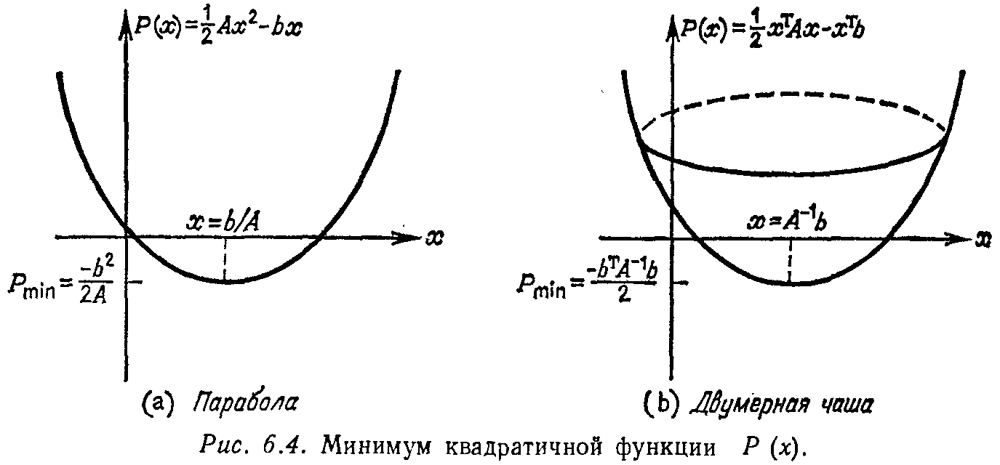
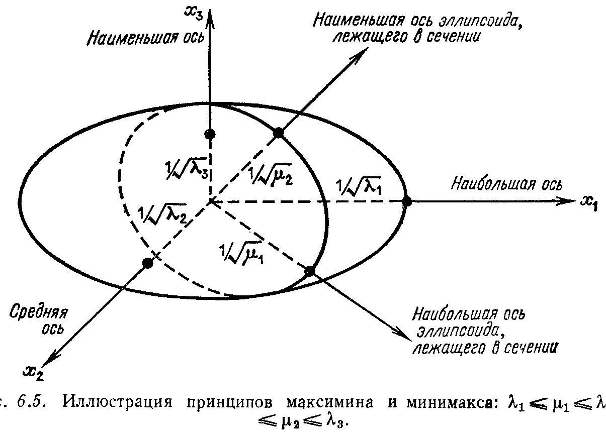

## § 6.4. ПРИНЦИПЫ МИНИМУМА И ОТНОШЕНИЕ РЕЛЕЯ

---
**стр. 304**
---

верхности $x^T Ax = 1$ и $x^T Bx = 1$ являются эллипсоидами. Очевидно, преобразование $x = Sz$ задает такие новые координаты (так как $S$ неортогональная матрица, то это преобразование не является чистым вращением), что эти два эллипсоида становятся «правильно расположенными»:

$$
\begin{aligned}
x^T Ax &= z^T S^T A S z = \lambda_1 z_1^2 + \dots + \lambda_n z_n^2 = 1, \\
x^T Bx &= z^T S^T B S z = z_1^2 + \dots + z_n^2 = 1.
\end{aligned}
\qquad (18)
$$

Второй эллипсоид в действительности является сферой! Конечно, основной момент теории постепенно проясняется и его легко сформулировать: в случае положительно определенной матрицы $B$ обобщенная задача на собственные значения $Ax = \lambda Bx$ ведет себя в точности как задача $Ax = \lambda x$.

**Упражнение 6.3.5.** Для рассмотренного примера с $m_1 = 1$ и $m_2 = 2$ проверить, что гармоники $B$-ортогональны, т. е. $x_1^T B x_2 = 0$. Какими будут коэффициенты $a_i$ результирующего движения $u = a_1 \cos \omega_1 t\, x_1 + a_2 \cos \omega_2 t\, x_2$, если обе массы сместить на одинаковое расстояние, равное единице ($v_0 = -1$ и $w_0 = 1$), а затем отпустить? Какое максимальное расстояние от положения равновесия достигается первой массой (когда два косинуса соответственно равны $+1$ и $-1$)?

**Упражнение 6.3.6.** Найти собственные значения и собственные векторы задачи

$$
\begin{bmatrix} 6 & -3 \\ -3 & 6 \end{bmatrix} x = \frac{\lambda}{18} \begin{bmatrix} 4 & 1 \\ 1 & 4 \end{bmatrix} x.
$$

**Упражнение 6.3.7.** Если симметрические матрицы $A$ и $B$ порядка 2 не являются определенными, то задача $Ax = \lambda Bx$ может иметь комплексные собственные значения. Построить соответствующий пример.

**§ 6.4. ПРИНЦИПЫ МИНИМУМА И ОТНОШЕНИЕ РЕЛЕЯ**

В этом параграфе, приближаясь уже к концу книги, мы впервые откажемся от линейных уравнений. Неизвестный вектор $x$ не будет даваться как решение уравнений $Ax = b$ или $Ax = \lambda x$. Вместо этого он будет определен с помощью принципа минимума.

Удивительно, как много физических законов может быть выражено с помощью принципов минимума. Такой простой факт, что тяжелые жидкости опускаются на дно, является следствием минимизации их потенциальной энергии. Или когда вы сидите на стуле, или лежите на кровати, пружины сами занимают такое положение, чтобы опять потенциальная энергия была минимальна. Конечно, имеются и более серьезные примеры: здание похоже на очень сложный стул, выдерживающий свой собственный вес, и основным принципом строительной техники является минимизация полной энергии. В физике имеются «лагранжианы»

---
**стр. 305**
---

и «интегралы действия»; соломинка в стакане с водой выглядит как бы сломанной, поскольку свет выбирает такой путь, чтобы достичь глаза как можно скорее1). Мы сразу же хотим сказать, что «энергии» всех этих процессов являются не что иное, как *положительно определенные квадратичные формы*. Очевидно, что производная квадратичной формы линейна. Поэтому минимизация приводит нас опять к привычным линейным уравнениям, когда мы приравниваем нулю первые производные. Нашей ближайшей целью в настоящем параграфе будет нахождение задачи минимизации, соответствующей решению $Ax = b$, а также другой задачи минимизации, соответствующей уравнению $Ax = \lambda x$. Мы собираемся проделать в конечномерном случае то, что вариационное исчисление проделывает в непрерывном случае, где обращение в нуль первых производных приводит к дифференциальным уравнениям (уравнениям Эйлера). При этом в каждой конкретной ситуации мы вольны выбирать, искать решение линейного уравнения или задачи на минимум квадратичной формы, и, как это будет показано в следующем параграфе, для многих задач вторую возможность игнорировать не следует.

Первый шаг очень прост: требуется найти «параболу» $P$, минимум которой достигается в точке, являющейся решением уравнения $Ax = b$. Если $A$ является скаляром, то это сделать очень легко:

$$
P(x) = \frac{1}{2} Ax^2 - bx \quad \text{и} \quad \frac{dP}{dx} = Ax - b.
$$

Парабола достигает минимума только в случае, когда $A$ положительно и, значит, парабола открыта вверх; тогда обращение в нуль ее первой производной дает уравнение $Ax = b$ (рис. 6.4). В многомерном случае эта парабола переходит в параболоид, формула для $P$ и условие положительности для существования минимума остаются неизменными.

**6H.** *Если $A$ — симметрическая и положительно определенная матрица, то квадратичная форма $P(x) = \frac{1}{2} x^T A x - x^T b$ достигает своего минимума в точке, являющейся решением системы $Ax = b$.*

1) Я уверен, что растения и люди развиваются в соответствии с некоторыми принципами минимума. Возможно, и сама цивилизация основана на законе наименьшего действия. Открытие таких законов является фундаментальным шагом в переходе от наблюдений к объяснению явлений. В общественных науках и биологии предстоит найти еще некоторые законы такого типа.

---
**стр. 306**
---

Д о к а з а т е л ь с т в о. Предположим, что $x$ является решением системы $Ax = b$. Тогда для любого вектора $y$ имеем

$$
\begin{aligned}
P(y) - P(x) &= \frac{1}{2} y^T A y - y^T b - \frac{1}{2} x^T A x + x^T b = \\
&= \frac{1}{2} y^T A y - y^T A x + \frac{1}{2} x^T A x = \\
&= \frac{1}{2} (y - x)^T A (y - x).
\end{aligned}
\qquad (19)
$$

Так как матрица $A$ положительно определена, эта величина нигде не принимает отрицательных значений и равна нулю, только когда $y - x = 0$. Во всех других точках $P(y)$ больше, чем $P(x)$, и, следовательно, минимум достигается в точке $x$.

**Упражнение 6.4.1.** Рассмотреть систему

$$
\begin{bmatrix} 2 & -1 & 0 \\ -1 & 2 & -1 \\ 0 & -1 & 2 \end{bmatrix}
\begin{bmatrix} x_1 \\ x_2 \\ x_3 \end{bmatrix}
=
\begin{bmatrix} 4 \\ 0 \\ 4 \end{bmatrix}.
$$

Построить соответствующую квадратичную форму $P(x_1, x_2, x_3)$, вычислить ее частные производные $\partial P / \partial x_i$ и показать, что они обращаются в нуль только на решении исходной системы.

**Упражнение 6.4.2.** Найти минимум (если он существует) функций $P_1 = x^2/2 + xy + y^2 - 3y$ и $P_2 = x^2/2 - 3y$. Какая матрица соответствует функции $P_2$?

**Упражнение 6.4.3.** Другая квадратичная форма, которая достигает минимума на решении системы $Ax = b$, задается равенством

$$
Q(x) = \frac{1}{2} \| Ax - b \|^2 = \frac{1}{2} x^T A^T A x - x^T A^T b + \frac{1}{2} b^T b.
$$

Сравнивая $Q$ с $P$ и игнорируя константу $b^T b/2$, ответить на вопрос, какую систему уравнений для определения минимума мы в этом случае получаем. Как называются эти уравнения в методе наименьших квадратов?

---
**стр. 307**
---

Наша следующая цель — найти задачу минимизации, соответствующую уравнению $Ax = \lambda x$. Это не так легко. Функция, которую мы должны построить, не может быть просто квадратичной, иначе ее дифференцирование приведет к линейным уравнениям, а задача на собственные значения в сущности своей нелинейна. Выход из положения дает нам переход к отношению квадратичных функций, и нам необходимо лишь так называемое отношение Релея

$$
R(x) = \frac{x^T A x}{x^T x}.
$$

Мы перейдем непосредственно к основной теореме.

**6I.** *Принцип Релея. Отношение $R(x)$ минимизируется первым собственным вектором $x_1$, и это минимальное значение равно наименьшему собственному значению $\lambda_1$ матрицы $A$:*

$$
R(x_1) = \frac{x_1^T A x_1}{x_1^T x_1} = \frac{x_1^T \lambda_1 x_1}{x_1^T x_1} = \lambda_1.
\qquad (20)
$$

Проанализируем сначала сделанное утверждение с геометрической точки зрения. Представьте себе, что мы зафиксировали числитель равным единице и стараемся сделать знаменатель как можно больше. Уравнение $x^T A x = 1$ для числителя определяет, по крайней мере для положительно определенной матрицы $A$, эллипсоид. Тогда, так как знаменатель равен $x^T x = \|x\|^2$, мы должны найти точку на поверхности эллипсоида, которая расположена дальше всех от начала координат (иначе говоря, вектор $x$ должен иметь наибольшую длину). Но из нашего предыдущего изучения эллипсоида вытекает, что направление его наибольшей оси (на которой находится искомая точка) совпадает с направлением первого собственного вектора.

Алгебраически в этом очень легко убедиться (даже без требования положительной определенности $A$), если мы диагонализируем матрицу $A$ с помощью ортогональной матрицы $Q$: $Q^{-1} A Q = \Lambda$, $Q^T = Q^{-1}$. После преобразования $x = Qy$ отношение Релея принимает более простой вид

$$
R(x) = \frac{(Qy)^T A (Qy)}{(Qy)^T (Qy)} = \frac{y^T \Lambda y}{y^T y} = \frac{\lambda_1 y_1^2 + \dots + \lambda_n y_n^2}{y_1^2 + \dots + y_n^2}.
$$

Минимум этого отношения, очевидно, достигается в точке с координатами $y_1 = 1$ и $y_2 = y_3 = \dots = y_n = 0$. В этой точке отношение равно $\lambda_1$. В любой другой точке отношение будет больше, так как $\lambda_1$ — наименьшее из всех $\lambda$,

$$
\lambda_1 (y_1^2 + y_2^2 + \dots + y_n^2) \leqslant (\lambda_1 y_1^2 + \lambda_2 y_2^2 + \dots + \lambda_n y_n^2).
$$

---
**стр. 308**
---

Поделив последнее неравенство на выражение, стоящее в первых скобках, получим $\lambda_1 \leqslant R(x)$. Таким образом, минимум достигается на первом собственном векторе или, точнее, на любом векторе $x = cx_1$, кратном ему, так как «растягивающий» множитель $c$ не изменяет отношения, т. е.

$$
R(cx) = \frac{(cx)^T A (cx)}{(cx)^T (cx)} = \frac{c^2 x^T A x}{c^2 x^T x} = R(x).
$$

Принцип Релея означает, что для каждого вектора $x$ отношение $R(x)$ дает верхнюю границу для $\lambda_1$. Заметим, что для оценки $\lambda_1$ сверху нам не нужны собственные векторы и переход к новому вектору $y$. Это было полезно при доказательстве, но в приложениях мы можем выбирать совершенно произвольный вектор $x$.

**Упражнение 6.4.4.** Каково отношение $R(x)$ для произвольной матрицы $A$ и конкретного вектора $x = (1, 0, \dots, 0)$. Показать, что $\lambda_1$ не превосходит наименьшего из диагональных элементов $a_{ii}$ матрицы $A$.

**Упражнение 6.4.5.** Для матрицы $A = \begin{bmatrix} 2 & -1 \\ -1 & 2 \end{bmatrix}$ найти вектор $x$, который дает меньшее значение отношения $R(x)$, чем оценка $\lambda_1 \leqslant 2$, полученная с помощью диагональных элементов матрицы $A$. Каково минимальное значение $R(x)$?

**Упражнение 6.4.6.** Используя отношение Релея, показать, что для положительно определенной матрицы $B$ наименьшее собственное значение матрицы $A + B$ больше наименьшего собственного значения матрицы $A$.

**Упражнение 6.4.7.** Пусть $\lambda_1$ — наименьшее собственное значение матрицы $A$, а $\mu_1$ — наименьшее собственное значение матрицы $B$. Показать, что наименьшее собственное значение $\theta_1$ матрицы $A + B$ по крайней мере не меньше, чем $\lambda_1 + \mu_1$. (Указание: подставить соответствующий собственный вектор $x$ в отношение Релея.)

Последние два упражнения — это, возможно, самые типичные и наиболее важные результаты, которые легко получить из отношения Релея, но очень трудно непосредственно из исходных уравнений.

Применение отношения Релея не ограничивается первым собственным значением $\lambda_1$ и соответствующим ему собственным вектором $x_1$. В действительности легко видеть, что максимум отношения

$$
R(x) = \frac{\lambda_1 y_1^2 + \lambda_2 y_2^2 + \dots + \lambda_n y_n^2}{y_1^2 + y_2^2 + \dots + y_n^2}
\qquad (21)
$$

достигается на другом конце последовательности единичных векторов $y$, а именно в точке с координатами $y_n = 1$ и $y_1 = y_2 = \dots = y_{n-1} = 0$. Эта точка соответствует последнему собственному вектору $x = x_n$, а само максимальное значение отношения равно $\lambda_n$. Следовательно, каждое значение отношения $R(x)$ является не

---
**стр. 309**
---

только верхней границей для $\lambda_1$, но и нижней границей для $\lambda_n$1). В заключение заметим, что промежуточные собственные векторы $x_2, \dots, x_{n-1}$ являются *седловыми точками* отношения Релея.

**Упражнение 6.4.8.** Вычислить частные производные отношения (21) и показать, что точка с координатами $y_2 = 1$ и $y_1 = y_3 = \dots = y_n = 0$ является его стационарной точкой. Найти максимум отношения

$$
R(x) = \frac{x_1^2 - x_1 x_2 + x_2^2}{x_1^2 + x_2^2}.
$$

**ПРИНЦИП МИНИМАКСА ДЛЯ СОБСТВЕННЫХ ЗНАЧЕНИЙ**

Трудность с седловыми точками заключается в том, что для произвольного вектора $x$ мы не можем сказать, будет отношение Релея $R(x)$ больше или меньше любого из промежуточных собственных значений $\lambda_2, \dots, \lambda_{n-1}$. Для приложений существует принцип экстремума (минимума или максимума), который действительно оказывается полезным. Поэтому мы рассмотрим такой принцип, подразумевая, что максимум или минимум будет достигаться на $j$-м собственном векторе $x_j$2). Руководящую идею дает нам основное свойство симметрической матрицы: вектор $x_j$ ортогонален к другим собственным векторам матрицы $A$. Потребуем, чтобы векторы $x$, реализующие принцип минимума, были ортогональны к первым собственным векторам $x_1, \dots, x_{j-1}$, т. е. $y_1 = y_2 = \dots = y_{j-1} = 0$. На остальные параметры $y_j, \dots, y_n$ не накладывается ограничений и отношение Релея принимает вид

$$
\frac{\lambda_j y_j^2 + \lambda_{j+1} y_{j+1}^2 + \dots + \lambda_n y_n^2}{y_j^2 + y_{j+1}^2 + \dots + y_n^2}.
$$

Его минимум равен $\lambda_j$ и достигается, когда $y_j = 1$, а $y_{j+1} = \dots = y_n = 0$.

**6J.** *В предположении, что вектор $x$ ортогонален к собственным векторам $x_1, \dots, x_{j-1}$, отношение $R(x)$ минимизируется следующим собственным вектором $x_j$ и его минимальное значение равно $\lambda_j$:*

$$
\lambda_j = \min R(x) \quad \text{при условии, что} \quad x^T x_1 = \dots = x^T x_{j-1} = 0.
\qquad (22)
$$

*Аналогично $x_j$ максимизирует $R(x)$ на множестве векторов $x$, перпендикулярных векторам $x_{j+1}, \dots, x_n$.*

1) Используя рассуждения из упр. 6.4.4, легко показать, что ни один диагональный элемент не превосходит $\lambda_n$.

2) Эта тема несколько специальна, и метод Релея — Ритца конечных элементов основывается на тех принципах минимума, которые уже найдены. Поэтому ничто не мешает нам перейти прямо к § 6.5.

---
**стр. 310**
---

Пользуясь сформулированным принципом, теоретически возможно определить все собственные значения в возрастающем порядке. Первое собственное значение $\lambda_1$ является абсолютным минимумом для $R(x)$, который достигается на векторе $x_1$. Следующее собственное значение $\lambda_2$ является минимальным значением $R(x)$ в предположении, что векторы $x$ ортогональны $x_1$. При этом для любого $x$, ортогонального к $x_1$ и не совпадающего с $x_2$, значение $R(x)$ больше, чем $\lambda_2$.

**Пример.** Матрица

$$A = \begin{bmatrix} 1 & -1 & & \\ -1 & 2 & -1 & \\ & -1 & 2 & -1 \\ & & -1 & 1 \end{bmatrix}$$

положительно полуопределена, и вектор $x_1 = (1, 1, 1, 1)$ лежит в ее нуль-пространстве и является собственным вектором, соответствующим собственному значению $\lambda_1 = 0$. Для того чтобы найти некоторую верхнюю грань для $\lambda_2$, выберем некоторый пробный вектор $x$, ортогональный к $x_1$, и вычислим значение $R(x)$: пусть $x = (1, 1, -1, -1)$ и $\frac{x^T Ax}{x^T x} = 1$, а следовательно, $\lambda_2 \le 1$.

Здесь только одна проблема: если мы не знаем точно вектор $x_1$ (а знаем мы его в очень редких случаях), то мы не знаем, будет ли вектор $x$ ортогонален к нему. В задачах минимизации с ограничениями само ограничение должно быть известно!

Нас интересует, существует ли принцип экстремума для $\lambda_2$ и $x_2$, который не требовал бы знания вектора $x_1$. Ответ здесь очень тонкий. Предположим, что вектор $x_1$ неизвестен и в качестве пробных векторов $x$ выбираются векторы, ортогональные к некоторому, вообще говоря, произвольному вектору $z$. Если $z = x_1$, то минимальное значение $R(x)$ будет равно $\lambda_2$. В гораздо более правдоподобной ситуации, когда вектор $z$ отличен от $x_1$, относительно искомого минимума можно сказать лишь следующее: **он не больше, чем** $\lambda_2$. Иначе говоря, для любого $z$

$$\min_{x^T z = 0} R(x) \le \lambda_2. \qquad (23)$$

**Доказательство.** Любая ненулевая комбинация первых двух собственных векторов $x = \alpha x_1 + \beta x_2$ будет ортогональна к вектору $z$, если наложить определенные условия на коэффициенты $\alpha$ и $\beta$. Тогда для любой такой комбинации

$$R(x) = \frac{(\alpha x_1 + \beta x_2)^T A (\alpha x_1 + \beta x_2)}{(\alpha x_1 + \beta x_2)^T (\alpha x_1 + \beta x_2)} = \frac{\lambda_1 \alpha^2 + \lambda_2 \beta^2}{\alpha^2 + \beta^2} \le \lambda_2.$$

---
**стр. 311**
---

Отсюда, так как найден вектор $x$, для которого $R(x) \le \lambda_2$, следует, что минимум $R(x)$ обязательно будет меньше, чем $\lambda_2$. <!-- вероятная опечатка оригинала: по смыслу (23) следует «не больше», а не «меньше» --> Этот факт непосредственно приводит нас к «принципу максимина».

**6 К.** *Если мы минимизируем $R(x)$ на множестве векторов, подчиненных одному условию $x^T z = 0$, и выбираем $z$ так, чтобы максимизировать этот минимум, то получим $\lambda_2$, т. е.*

$$\lambda_2 = \max_z \left[ \min_{x^T z = 0} R(x) \right]. \qquad (24)$$

Величина в скобках, согласно (23), меньше или равна $\lambda_2$ и при специальном выборе $z = x_1$ точно равна $\lambda_2$.

Геометрически принцип максимина имеет естественную интерпретацию. Предположим, что эллипсоид разрезан плоскостью, проходящей через начало координат. Тогда сечение эллипсоида опять будет эллипсоидом меньшей на единицу размерности. При этом неравенство (23) просто означает, что наибольшая ось нового эллипсоида по крайней мере не меньше второй по величине оси исходного эллипсоида (на рис. 6.5 это соответствует неравенству

$\mu_1 \le \lambda_2$). При специальном выборе разрезающей плоскости наибольшая ось возникающего эллипсоида будет точно равна второй по величине оси исходного эллипсоида. Это достигается выбором плоскости, перпендикулярной направлению $z = x_1$ наибольшей оси исходного эллипсоида. В этом случае $\mu_1 = \lambda_2$.

---
**стр. 312**
---

Геометрическая картина сразу может быть переведена на язык матричной алгебры.

**6 L.** *Пусть задана симметрическая матрица $A$ с собственными значениями $\lambda_1 \le \lambda_2 \le \ldots \le \lambda_n$ и подматрица $A_{n-1}$ получена из матрицы $A$ путем отбрасывания ее последних строки и столбца. Тогда если $\mu_1$ — наименьшее собственное значение матрицы $A_{n-1}$, то $\lambda_1 \le \mu_1 \le \lambda_2$.*

Сначала заметим, что $\lambda_1$ является абсолютным минимумом отношения $R(x)$, а $\mu_1$ — минимальным значением $R(x)$ на множестве векторов, последняя компонента которых равна нулю. Этот минимум с ограничением не может быть меньше абсолютного минимума, т. е. $\lambda_1 \le \mu_1$. С другой стороны, условие равенства нулю последней компоненты $x$ эквивалентно условию $x^T z = 0$ при специальном выборе $z = (0, \ldots, 0, 1)$. Отсюда, согласно (23), имеем неравенство $\mu_1 \le \lambda_2$.

**Пример 1.** Собственные значения матрицы $A = \begin{bmatrix} 2 & -1 \\ -1 & 2 \end{bmatrix}$ равны единице и трем, в то время как собственное значение подматрицы, получаемой отбрасыванием последних строки и столбца, равно двум.

**Пример 2.** Собственные значения матрицы

$$A = \begin{bmatrix} 2 & -1 & 0 \\ -1 & 2 & -1 \\ 0 & -1 & 2 \end{bmatrix}$$

равны $2 - \sqrt{2}$, $2$, $2 + \sqrt{2}$. Если отбросить последние строку и столбец $A$, то наименьшее собственное значение полученной подматрицы возрастет до единицы, но не превысит собственное значение $\lambda_2$ матрицы $A$: $2 - \sqrt{2} < 1 < 2$.

**Пример 3.** Если $B$ положительно определена, то, согласно принципу Релея,

$$\lambda_1 (A + B) = \min \frac{x^T (A + B) x}{x^T x} > \min \frac{x^T A x}{x^T x} = \lambda_1 (A).$$

Эта задача ставилась в упр. 6.4.6. Теперь принцип максимина (24) позволяет получить такое неравенство для *вторых* собственных значений: $\lambda_2 (A + B) > \lambda_2 (A)$, так как $R(x)$ опять возрастает при добавлении к $A$ матрицы $B$.

**Пример 4.** Для заданной осциллирующей системы масс и пружин предположим, что одна из них вынужденно остается в

---
**стр. 313**
---

положении равновесия. Тогда наименьшая частота системы возрастает, но при этом не превосходит первоначального собственного значения $\lambda_2$.

**Упражнение 6.4.9.** Найти собственные значения матрицы

$$A = \begin{bmatrix} 2 & -1 & 0 \\ -1 & 2 & 0 \\ 0 & 0 & 1 \end{bmatrix}$$

и показать, используя неравенство $\lambda_1 \le \mu_1 \le \lambda_2$, что независимо от того, какая пара строка-столбец вычеркнута, наименьшее собственное значение полученной таким образом матрицы будет равно единице. Что при этом происходит с эллипсоидом $x^T Ax = 1$?

**Упражнение 6.4.10.** Обобщить принцип максимина на случай $j$ различных ограничений:

$$\max_{z_1, \ldots, z_j} \left[ \min_{x^T z_1 = 0, \ldots, x^T z_j = 0} R(x) \right] = \lambda_{j+1}. \qquad (25)$$

Полагая $j = 2$, вывести неравенство для наименьшего собственного значения подматрицы $A$, которая получается отбрасыванием последних двух строк и столбцов.

Наступило время обратить последние из сформулированных теорем и установить принцип минимакса. Это означает, что мы сначала должны максимизировать отношение Релея, а затем найти минимальное значение этого максимума.

Существует несколько подходов к решению этой задачи в зависимости от того, какие собственные значения нам нужны. Например, чтобы найти наибольшее собственное значение $\lambda_n$, мы просто должны максимизировать $R(x)$. Но предположим, что нам нужно найти $\lambda_2$. Так как отношение Релея имеет вид

$$\frac{\lambda_1 y_1^2 + \lambda_2 y_2^2 + \cdots + \lambda_n y_n^2}{y_1^2 + y_2^2 + \cdots + y_n^2},$$

то очевидный способ нахождения $\lambda_2$ как максимума — это наложить условие, что $y_3 = y_4 = \cdots = y_n = 0$. Эти $n - 2$ ограничения приводят к двумерному подпространству, порожденному первым и вторым собственными векторами $x_1$ и $x_2$ матрицы $A$. Максимум $R(x)$ в этом двумерном пространстве равен $\lambda_2$, но для этого нужны векторы $x_1$ и $x_2$, а они неизвестны.

Когда подобная проблема возникла в принципе максимина, она была разрешена выбором некоторого, вообще говоря, произвольного ограничения $x^T z = 0$. Мы применим ту же идею, максимизируя $R(x)$ в некотором произвольном двумерном подпространстве. Мы не можем узнать, будет ли это подпространство содержать какие-либо собственные векторы, но это маловероятно.

---
**стр. 314**
---

Тем не менее максимум отношения Релея позволяет получить оценку для $\lambda_2$. Если ранее минимум отношения $R(x)$ при условии $x^T z = 0$ давал оценку для $\lambda_2$ снизу, то теперь его максимум по рассматриваемому подпространству дает для $\lambda_2$ оценку сверху. Иначе говоря, для любого двумерного подпространства $S_2$ из $R^n$ имеем

$$\max_{x \in S_2} R(x) \ge \lambda_2. \qquad (26)$$

**Доказательство.** Любое из подпространств $S_2$ всегда содержит вектор $x$, ортогональный к вектору $x_1$, и для него $R(x) \ge \lambda_2$. Отсюда сразу следует принцип минимакса.

**6М.** *Если мы максимизируем $R(x)$ по всем возможным двумерным подпространствам $S_2$, то минимально возможное значение этих максимумов равно $\lambda_2$:*

$$\lambda_2 = \min_{S_2} \left[ \max_{x \in S_2} R(x) \right]. \qquad (27)$$

Величина в скобках всегда больше или равна $\lambda_2$, а для частного выбора, когда $S_2$ порождается первым и вторым собственными векторами матрицы $A$, равна $\lambda_2$.

**Упражнение 6.4.11.** Для матрицы $A$ из примера 2 вычислить собственное значение $\mu_2$ ее подматрицы порядка два, стоящей в левом верхнем углу, и сравнить его с $\lambda_2$ и $\lambda_3$.

Мы закончим настоящий раздел двумя замечаниями. Я надеюсь, что вы убедитесь в их справедливости на основании интуитивных соображений, без детальных доказательств.

*Замечание 1.* Принцип минимакса может быть использован для нахождения произвольного $\lambda_j$, если воспользоваться $j$-мерными подпространствами $S_j$:

$$\lambda_j = \min_{S_j} \left[ \max_{x \in S_j} R(x) \right]. \qquad (28)$$

*Замечание 2.* Все перечисленные принципы можно обобщить на случай обобщенной задачи на собственные значения, если в отношении Релея заменить величину $x^T x$ на $x^T B x$. Используя замену $x = Sz$, где в качестве столбцов матрицы $S$ выбраны $B$-ортонормированные собственные векторы матрицы $B^{-1} A$, получим

$$R(x) = \frac{x^T A x}{x^T B x} = \frac{\lambda_1 z_1^2 + \cdots + \lambda_n z_n^2}{z_1^2 + \cdots + z_n^2}. \qquad (29)$$

Для этого и проводилась одновременная диагонализация матриц $A$ и $B$ на стр. 303, когда обе квадратичные формы представились в виде суммы полных квадратов. При этом легко видеть,
