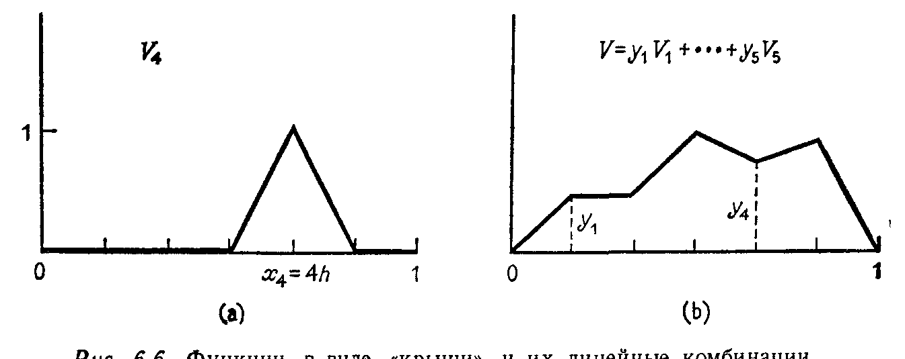

## § 6.5. ПРИНЦИП РЕЛЕЯ — РИТЦА И МЕТОД КОНЕЧНЫХ ЭЛЕМЕНТОВ

---
**стр. 315**
---

что $\lambda_1 = \min R(x)$, а $\lambda_n = \max R(x)$. Для примера осциллирующей системы с неодинаковыми массами вынужденное закрепление одной массы в состоянии равновесия будет увеличивать наименьшую частоту и уменьшать наибольшую.

**Упражнение 6.4.12.** На каком $j$-мерном подпространстве $S_j$ из соотношения (28) минимум достигается, или, иначе говоря, для какого $S_j$ максимум $R(x)$ равен $\lambda_j$?

**Упражнение 6.4.13.** Принцип минимакса (28) можно записать с помощью ограничений, а не подпространств:

$$\lambda_j = \min_{z_1, \ldots, z_{n-j}} \left[ \max_{x^T z_1 = \cdots = x^T z_{n-j} = 0} R(x) \right].$$

Какова связь между векторами $z$ и подпространствами $S_j$?

**Упражнение 6.4.14.** Показать, что наименьшее собственное значение $\lambda_1$ задачи $Ax = \lambda Bx$ не больше отношения $a_{11}/b_{11}$ диагональных элементов матриц $A$ и $B$.

**Упражнение 6.4.15 (трудное).** Показать, что если последнюю строку и столбец симметрической матрицы $A$ выбросить, то собственные значения $\mu_i$ оставшейся подматрицы удовлетворяют неравенствам

$$\lambda_1 \le \mu_1 \le \lambda_2 \le \mu_2 \le \cdots \le \mu_{n-1} \le \lambda_n. \qquad (30)$$

Напомним, что отбрасывание последних строки и столбца соответствует простому ограничению: последняя компонента $x_n$ вектора $x$ равна нулю, т. е. $x$ ортогонален к вектору $z = (0, \ldots, 0, 1)$. Неравенство $\mu_j \ge \lambda_j$ выводится из принципа минимакса, а неравенство $\mu_j \le \lambda_{j+1}$ — из принципа максимина.

**§ 6.5. ПРИНЦИП РЕЛЕЯ — РИТЦА**

**И МЕТОД КОНЕЧНЫХ ЭЛЕМЕНТОВ**

Настоящий параграф содержит два основных результата:

(i) Решение системы $Ax = b$ эквивалентно минимизации квадратичной формы $P(x) = \frac{1}{2} x^T A x - x^T b$.

(ii) Решение задачи $Ax = \lambda_1 x$ эквивалентно минимизации отношения Релея $R(x) = x^T A x / x^T x$.

Попытаемся объяснить, как эти факты могут быть применены. История вопроса очень длинна, поскольку эти факты были известны уже более века назад. В некоторых классических задачах техники и физики, таких, как колебание пластин и стационарные состояния (собственные значения и функции) атома, эти минимизации использовались для построения грубых аппроксимаций точных решений. Эти аппроксимации *просто оказывались* грубыми, так как единственным инструментом исследователя были

---
**стр. 316**
---

карандаш, бумага и арифмометр. Конечно, были и математические принципы, но они не могли быть использованы.

Очевидно, что вычислительные машины принесли с собой революцию в численные методы, но в первую очередь она отбросила принципы минимума, так как они были слишком стары и слишком медленны. Вперед выдвинулся метод конечных разностей, поскольку он позволял легко «дискретизировать» дифференциальные уравнения. В § 1.6 мы уже видели, как каждая производная заменяется соответствующим разностным выражением. Физическая область покрывается решеткой или «сеткой», в каждом узле которой строится уравнение, такое, например, как $-u_{j+1} + 2u_j - u_{j-1} = h^2 f_j$. Математически задача сводится к системе $Au = f$, на разработку быстрых методов решения которой для случая больших размерностей и сильной разреженности матриц в основном были направлены усилия математиков-вычислителей в пятидесятые годы.

Но мы тогда не осознавали полностью, что для реальных задач техники, таких, как определение напряжений в узлах самолета или собственных частот человеческого мозга, метод конечных разностей невероятно усложняется. *Основные трудности здесь возникают не при решении (разностных) уравнений, а при их построении.* Для нерегулярных областей нужны нерегулярные сетки, одновременно содержащие треугольные, четырехугольные или четырехгранные ячейки, а также единообразные способы аппроксимации соответствующих физических законов. Иначе говоря, вычислительные машины должны помогать не только при решении дискретных задач, но и при их формулировке.

Можете себе представить, что произошло. Вернулись старые методы, но с новой идеей и новым названием. Новое название — **метод конечных элементов**, а новая идея сделала возможным использовать в большей степени мощности вычислительных машин (при построении дискретной аппроксимации, при решении полученных дискретных задач и графическом изображении результатов), чем любые другие способы научных вычислений¹). Важно сохранить простоту математических идей, тогда можно усложнять приложения. Центр тяжести в этих приложениях переносится сейчас с задач конструирования самолетов на проблемы надежности ядерных реакторов, а в период написания книги шли ожесточенные дискуссии о применимости этого метода к динамике жидкостей. Для задач такого масштаба не обсуждается, однако, вопрос их стоимости, причем миллиард долларов, боюсь, пока является очень умеренной оценкой. Я надеюсь, что некоторым читателям будет достаточно интересно ознакомиться с методом

¹) Пожалуйста, простите мне этот энтузиазм. Я знаю, что этот метод может и не оказаться бессмертным.

---
**стр. 317**
---

конечных элементов и попытаться извлечь из него серьезную пользу.

Чтобы разъяснить сам метод, мы начнем с классического принципа Релея — Ритца, который потом дополним новой идеей конечных элементов. Мы будем иметь дело со старой задачей, т. е. с уравнением $-u'' = f(x)$ и старыми краевыми условиями $u(0) = u(1) = 0$, которая ранее исследовалась с помощью конечных разностей. Разумеется, это «бесконечномерная» задача, где вектор $b$ заменен функцией $f$, а матрица $A$ — оператором $-d^2/dx^2$. Поэтому мы можем провести аналогию с матричными задачами, выписав квадратичную форму, которую требуется минимизировать, в виде (скалярные произведения заменяются интегралами!)

$$P(v) = \frac{1}{2} v^T Av - v^T b = \frac{1}{2} \int_0^1 v(x) (-v''(x)) \, dx - \int_0^1 v(x) f(x) \, dx. \qquad (31)$$

Это выражение нужно минимизировать на множестве всех функций $v$, удовлетворяющих краевым условиям, и та функция, которая доставляет минимум, является решением и исходной задачи. Дифференциальное уравнение сведено к задаче минимизации, и нам только остается проинтегрировать один из членов $P(v)$ по частям:

$$\int_0^1 v (-v'') \, dx = \int_0^1 (v')^2 - [vv']_{x=0}^{x=1}.$$

Поскольку $[vv']|_0^1 = 0$, получаем

$$P(v) = \frac{1}{2} \int_0^1 (v')^2 - \int_0^1 vf.$$

Квадратичный член $\int (v')^2$ симметрический (аналогично форме $x^T Ax$) и положительный; поэтому существование минимума гарантировано.

Как найти этот минимум? Точное его нахождение эквивалентно точному решению дифференциального уравнения, которое является бесконечномерной задачей. Принцип Релея — Ритца заменяет эту задачу $n$-мерной введением $n$ пробных функций $v = V_1, v = V_2, \ldots, v = V_n$. В классе всевозможных линейных комбинаций $V = y_1 V_1(x) + \cdots + y_n V_n(x)$ вычисляется такая частная комбинация $U$, которая минимизирует $P(V)$. Повторим сказанное: идея заключается в замене минимизации по всем возможным $v$ минимизацией по подпространству и нахождении вместо $u$ функции $U$, которая доставляет минимум формы $P(v)$ в этом подпространстве. Мы надеемся, что эти функции окажутся «близкими».

---
**стр. 318**
---

После замены $v$ на $V$ квадратичная форма принимает вид

$$P(V) = \frac{1}{2} \int_0^1 (y_1 V'_1 + \dots + y_n V'_n)^2 - \int_0^1 (y_1 V_1 + \dots + y_n V_n) f.$$

Напомним, что функции $V_j$ выбраны заранее, а неизвестными являются веса $y_j$. Если из этих весов мы составим вектор $y$, то $P(V)$ точно совпадает с одной из квадратичных форм, которая нам уже встречалась:

$$P(V) = \frac{1}{2} y^T Ay - y^T b, \qquad (32)$$

где $A_{ij} = \int V'_i V'_j$ — коэффициент при члене $y_i y_j$, а $b_j = \int V_j f$ — коэффициент при $y_j$. Разумеется, можно найти минимум формы $\frac{1}{2} y^T Ay - y^T b$; это эквивалентно решению системы $Ay = b$. Таким образом, этапами метода Релея — Ритца являются: (i) выбор пробных функций $V_j$; (ii) вычисление коэффициентов $A_{ij}$ и $b_j$; (iii) решение системы $Ay = b$ и (iv) построение приближенного решения $U = y_1 V_1 + \dots + y_n V_n$.

Все зависит от этапа (i). Если функции $V_j$ не будут чрезвычайно просты, то другие этапы в сущности окажутся неосуществимыми. Кроме того, если никакая комбинация $V_j$ не будет достаточно хорошо приближать истинное решение $u$, то последующие этапы будут бесполезны. Таким образом, мы должны одновременно учитывать требования точности и вычислительной реализуемости метода. Ключевой идеей, которая сделала метод конечных элементов очень эффективным, явилось использование в качестве $V_j$ кусочно-полиномиальных функций.

Самыми простыми и наиболее широко используемыми являются кусочно-линейные функции. Сначала узлы сетки размещаются в точках $x_1 = h, x_2 = 2h, \ldots, x_n = nh$ (аналогично методу конечных разностей) и краевые условия требуют, чтобы в точках $x_0 = 0$ и $x_{n+1} = 1$ каждая функция $V_j$ обращалась в нуль. В качестве функций $V_j$ выберем функцию в виде «крыши», которая равна единице в узле $x_j$ и нулю в остальных узлах (рис. 6.6a). Эти функции «концентрируются» в малых интервалах около соответствующих узлов и равны нулю на остальной части отрезка. Любая комбинация $y_1 V_1 + \dots + y_n V_n$ имеет значение $y_j$ в узле с таким же номером, поскольку другие функции $V_k$ в этом узле равны нулю, в силу чего ее легко изобразить графически (рис. 6.6b). Это завершает этап (i).

На следующем этапе вычисляются коэффициенты $A_{ij} = \int V'_i V'_j$, являющиеся элементами «матрицы жесткости» $A$. Наклон $V'_j$ функции $V_j$ равен $1/h$ в малом интервале слева от $x_j$ и $-1/h$ справа,

---
**стр. 319**
---

и если эти «сдвоенные интервалы» для функций $V'_i$ и $V'_j$ не перекрываются, то произведение $V'_i V'_j$ тождественно равно нулю. Но они перекрываются, только когда либо $i = j$, и тогда

$$\int V'_i V'_j = \int \left(\frac{1}{h}\right)^2 + \int \left(-\frac{1}{h}\right)^2 = \frac{2}{h},$$

либо когда $i = j \pm 1$, и тогда

$$\int V'_i V'_j = \int \left(\frac{1}{h}\right) \left(-\frac{1}{h}\right) = -\frac{1}{h}.$$

Следовательно, матрица жесткости оказывается трехдиагональной:

$$A = \frac{1}{h} \begin{bmatrix} 2 & -1 & & & \\ -1 & 2 & -1 & & \\ & -1 & 2 & -1 & \\ & & -1 & 2 & -1 \\ & & & -1 & 2 \end{bmatrix},$$

и в точности совпадает с матрицей $A$ метода конечных разностей, что приводит к бесконечным дискуссиям о связях между этими двумя методами. Более сложные конечные элементы — полиномы более высоких степеней. Они определяются на интервалах для обыкновенных дифференциальных уравнений или на треугольниках и четырехугольниках для дифференциальных уравнений с частными производными и также приводят к разреженным матрицам $A$. Вы можете представлять себе метод конечных элементов как единообразный способ построения точных разностных уравнений на нерегулярных сетках, так что он лежит на «пересечении» методов Релея — Ритца и метода конечных разностей. Основным достоинством этого метода является простота кусочно-полиномиальных функций, поскольку на каждом подынтервале их наклоны (производные) легко находятся и интегрируются.

---
**стр. 320**
---

Компоненты $b_j$ вектора правой части оказываются совершенно новыми. Вместо значения $f$ в узле $x_j$, как в методе конечных разностей, берется специальное осреднение $f$ в окрестности этого узла: $b_j = \int V_j f$. На этапе (iii) мы решаем систему $Ay = b$, решение которой дает коэффициенты минимизирующей пробной функции $U = y_1 V_1 + \dots + y_n V_n$. Наконец, соединяя вершины $y_j$ ломаной линией, мы получаем изображение приближенного решения $U$.

Отметим одно специальное свойство рассматриваемой частной задачи: $U$ не просто близка к точному решению, но совпадает с ним в узлах сетки. Иначе говоря, $U$ является линейной интерполяцией $u$. Нельзя ожидать, чтобы точное решение имело такой вид для достаточно сложных уравнений. Но ошибка $U - u$ оказывается очень мала даже на грубой сетке. Соответствующая теория сходимости освещается в книге автора и Г. Фикса (М.: Мир, 1977). В ней также обсуждаются дифференциальные уравнения с частными производными, для которых рассматриваемый метод сохраняет свои достоинства.

**Упражнение 6.5.1.** Для $f \equiv 1$ решение уравнения $-u'' = f$ является параболой $u = (x - x^2)/2$. Вычислить коэффициенты $b_j = \int V_j f$ и показать, что точные значения $y_j = u(x_j)$ удовлетворяют системе метода конечных элементов $Ay = b$.

**Упражнение 6.5.2.** В случае $A = I$ квадратичная форма имеет вид $P(y) = \frac{1}{2} y^T y - y^T b$, и достигает минимума на векторе $y = b$. Доказать, что $P(y) - P(b) = \frac{1}{2} \|y - b\|^2$, и используя это равенство, объяснить, почему вектор, минимизирующий $P(y)$ на подпространстве пробных функций, является ближайшим к $b$. Принцип Релея — Ритца автоматически задает проекцию истинного решения на подпространство пробных функций.

**ЗАДАЧИ НА СОБСТВЕННЫЕ ЗНАЧЕНИЯ**

Идея Релея — Ритца осуществлять минимизацию на конечномерном семействе функций $V$ вместо минимизации на всем пространстве так же полезна для задач на собственные значения, как и для стационарных уравнений. Теперь минимизируемым будет отношение Релея. Его точным минимумом является основная частота $\lambda_1$, и его приближенный минимум $\Lambda_1$ увеличится при переходе от всего пространства функций $v$ к более узкому классу пробных функций $V_i$. И снова построить дискретную задачу (применить практически сам принцип) можно, лишь если функции $V_j$ легко вычислимы. Таким образом, шаг, который был проделан за последние двадцать лет, был совершенно естествен и неминуем. Заключается он в применении идей нового метода

---
**стр. 321**
---

конечных элементов к вариационной формулировке задачи на собственные значения.

Наиболее распространенным и в то же время наиболее простым примером является задача

$$-u'' = \lambda u, \quad u(0) = u(1) = 0. \qquad (33)$$

Ее первое собственное значение $\lambda_1 = \pi^2$, и ему соответствует собственная функция $u = \sin \pi x$. Эти значения и функция удовлетворяют уравнениям (33) и дают минимум отношения Релея

$$R(v) = \frac{v^T [-d^2/dx^2] v}{v^T v} = \frac{\int_0^1 v(-v'')}{\int_0^1 v^2} = \frac{\int_0^1 (v')^2}{\int_0^1 v^2}.$$

Физически это отношение потенциальной и кинетической энергий, которые сбалансированы на собственной функции. Эта собственная функция обычно неизвестна, и, чтобы вычислить ее приближенно, выберем в качестве допустимых только функции $V = y_1 V_1 + \dots + y_n V_n$. В результате имеем

$$R(V) = \frac{\int_0^1 (y_1 V'_1 + \dots + y_n V'_n)^2}{\int_0^1 (y_1 V_1 + \dots + y_n V_n)^2} = \frac{y^T Ay}{y^T By}.$$

Теперь перед нами встала задача минимизации отношения $y^T Ay / y^T By$. Если матрица $B$ единичная, то это приводит к стандартной задаче на собственные значения $Ay = \lambda y$. Но наша матрица $B$ будет трехдиагональной, и, следовательно, мы приходим к обобщенной задаче на собственные значения (см. стр. 314). Минимальное значение $\Lambda_1$ отношения $R(V)$ будет наименьшим собственным значением задачи $Ay = \lambda By$, а соответствующий собственный вектор $y$ дает возможность построить приближение $U = y_1 V_1 + \dots + y_n V_n$ к первой собственной функции исходной задачи.

Как и для стационарных задач, наш метод содержит четыре этапа: (i) выбираются функции $V_j$; (ii) вычисляются матрицы $A$ и $B$; (iii) решается задача $Ay = \lambda By$; и (iv) выбирается $\Lambda_1$ и строится соответствующая функция $U$. Я не знаю, почему это стоит миллиард долларов.

**Упражнение 6.5.3.** Для кусочно-линейных функций $V_1$ и $V_2$, соответствующих узлам $x = h = 1/3$ и $x = 2h = 2/3$, вычислить матрицу $B$ порядка два. Сопоставить построенную дискретную задачу на собственные значения с задачей из упр. 6.3.6 и сравнить $\Lambda_1$ с фактическим собственным значением $\lambda_1 = \pi^2$.

**Упражнение 6.5.4.** Объяснить, почему из принципа минимакса следует неравенство $\Lambda_2 \ge \lambda_2$.
