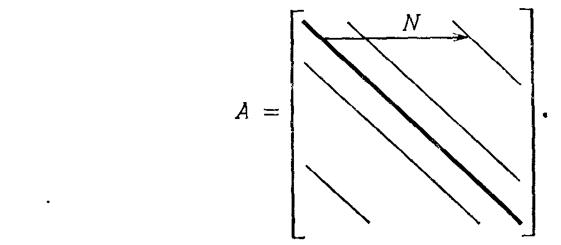

## § 7.4. ИТЕРАЦИОННЫЕ МЕТОДЫ РЕШЕНИЯ СИСТЕМЫ AX=B

---
**стр. 343**
---

со сдвигом $\alpha = a_{22}$, который в данном случае совпадает с $QR$-алгоритмом без сдвигов, поскольку $a_{22} = 0$. Показать, что внедиагональные элементы изменяются от $\sin\theta$ до $-\sin^3\theta$ (пример кубической сходимости).

**Упражнение 7.3.8.** Показать, что трехдиагональная матрица $A = \begin{bmatrix} 0 & 1 \\ 1 & 0 \end{bmatrix}$ остается неизменной на каждом шаге $QR$-алгоритма и потому является (редким) контрпримером к сходимости. Это явление обходится путем использования произвольного сдвига.

**Упражнение 7.3.9.** Показать по индукции, что для $QR$-алгоритма без сдвигов произведение $(Q_0 Q_1 \ldots Q_k)(R_k \ldots R_1 R_0)$ является в точности $QR$-разложением матрицы $A^{k+1}$. Это совпадение связывает $QR$-алгоритм со степенным методом и объясняет его сходимость: если $|\lambda_1| > |\lambda_2| > \cdots > |\lambda_n|$, то эти собственные значения постепенно появляются в убывающем порядке на главной диагонали матрицы $A_k$.

**§ 7.4. ИТЕРАЦИОННЫЕ МЕТОДЫ РЕШЕНИЯ СИСТЕМЫ $Ax = b$**

Исключение Гаусса находит решение $x$ за конечное число шагов, что совершенно приемлемо, если $n^3/3$ невелико. Но когда $n$ велико, предпочтение отдается итерационным методам, которые начинают с начального приближения $x_0$ и строят $x_{k+1}$ из $x_k$.

Ключевая идея — *расщепление матрицы* $A$. Пишем $A = S - T$; тогда $Ax = b$ эквивалентно $Sx = Tx + b$, или

$$Sx_{k+1} = Tx_k + b. \qquad (23)$$

Чтобы метод был успешным, расщепление должно удовлетворять двум требованиям:

(i) Новый вектор $x_{k+1}$ должен вычисляться легко. Поэтому $S$ должна быть простой (и обратимой!) матрицей, например диагональной или треугольной.

(ii) Последовательность $x_k$ должна сходиться к точному решению $x$. Если мы вычтем (23) из исходного уравнения $Sx = Tx + b$,

---
**стр. 344**
---

то в результате получим формулу, включающую в себя только ошибки $e_k = x - x_k$:

$$Se_{k+1} = Te_k. \qquad (24)$$

Это совсем другое разностное уравнение. Для него итерационный процесс начинается с начальной ошибки $e_0$, и после $k$ шагов мы получаем новую ошибку $e_k = (S^{-1}T)^k e_0$. Вопрос сходимости здесь эквивалентен вопросу устойчивости: $x_k \to x$ только тогда, когда $e_k \to 0$.

**7F.** Итерационный метод (23) сходится тогда и только тогда, когда каждое собственное значение $\lambda$ матрицы $S^{-1}T$ удовлетворяет неравенству $|\lambda| < 1$. Его скорость сходимости зависит от максимального значения $|\lambda|$, которое известно как **спектральный радиус** матрицы $S^{-1}T$:

$$\rho(S^{-1}T) = \max_i |\lambda_i|. \qquad (25)$$

Напомним, что обычно решение уравнения $e_{k+1} = S^{-1}Te_k$ представимо в виде

$$e_k = c_1 \lambda_1^k x_1 + \cdots + c_n \lambda_n^k x_n.$$

Отсюда следует, что наибольшее из $|\lambda_i|$ в конце концов станет доминирующим и будет определять скорость, с которой $e_k$ сходятся к нулю.

Два требования, предъявляемые к итерационному процессу, до некоторой степени противоречивы. С одной стороны, мы могли бы достичь немедленной сходимости, выбирая следующее расщепление: $S = A$ и $T = 0$. При этом первый (и последний) шаг итерации был бы $Ax_1 = b$. В этом случае матрица перехода $S^{-1}T$ равна нулю, ее собственные значения и спектральный радиус равны нулю и, следовательно, скорость сходимости (обычно определяемая как $-\log\rho$) бесконечна. Но, разумеется, матрицу $S = A$ не всегда легко обратить, что было основным побуждением для расщепления. С другой стороны, мы можем взять в качестве $S$ диагональную часть матрицы $A$ и итерации становятся хорошо известным *методом Якоби*:

$$
\begin{aligned}
a_{11}(x_1)_{k+1} &= (-a_{12}x_2 - a_{13}x_3 - \cdots - a_{1n}x_n)_k + b_1, \\
&\vdots \\
a_{nn}(x_n)_{k+1} &= (-a_{n1}x_1 - a_{n2}x_2 - \cdots - a_{nn-1}x_{n-1})_k + b_n.
\end{aligned} \qquad (26)
$$

Если диагональные элементы $a_{ii}$ все ненулевые и если $A$ — разреженная матрица, так что большинство членов в правой части отсутствует, то переход от $x_k$ к $x_{k+1}$ прост. Важным является вопрос о том, сходится ли итерационный метод, и если сходится, то как быстро.

---
**стр. 345**
---

**Пример 1.** $A = \begin{bmatrix} 2 & -1 \\ -1 & 2 \end{bmatrix}$, $S = \begin{bmatrix} 2 & \\ & 2 \end{bmatrix}$, $T = \begin{bmatrix} 0 & 1 \\ 1 & 0 \end{bmatrix}$, $S^{-1}T = \begin{bmatrix} 0 & \frac{1}{2} \\ \frac{1}{2} & 0 \end{bmatrix}$. Если компоненты вектора $x$ обозначить через $v$ и $w$, то метод Якоби $Sx_{k+1} = Tx_k + b$ имеет вид

$$2v_{k+1} = w_k + b_1, \qquad 2w_{k+1} = v_k + b_2,$$

или

$$\begin{bmatrix} v \\ w \end{bmatrix}_{k+1} = \begin{bmatrix} 0 & \frac{1}{2} \\ \frac{1}{2} & 0 \end{bmatrix} \begin{bmatrix} v \\ w \end{bmatrix}_k + \begin{bmatrix} b_1/2 \\ b_2/2 \end{bmatrix}.$$

Собственными значениями матрицы $S^{-1}T$ являются $\pm 1/2$, и поэтому ошибка убывает в два раза (приближение становится точнее на один двоичный знак) на каждом шаге. Однако для матриц $A$ большого порядка метод Якоби (26) сталкивается с практическими трудностями: требуется хранить в памяти все компоненты $x_k$, пока не вычислено полностью приближение $x_{k+1}$. Более естественная идея, которая использует только половину памяти, состоит в том, чтобы использовать каждую компоненту вектора $x_{k+1}$ сразу же, как только она вычислена.

Сказанное означает, что первое уравнение остается таким же, как и раньше:

$$a_{11}(x_1)_{k+1} = (-a_{12}x_2 - a_{13}x_3 - \cdots - a_{1n}x_n)_k + b_1.$$

Следующее уравнение немедленно оперирует с этим новым значением $x_1$:

$$a_{22}(x_2)_{k+1} = -a_{21}(x_1)_{k+1} + (-a_{23}x_3 - \cdots - a_{2n}x_n)_k + b_2,$$

а последнее уравнение будет использовать исключительно новые значения:

$$a_{nn}(x_n)_{k+1} = (-a_{n1}x_1 - a_{n2}x_2 - \cdots - a_{nn-1}x_{n-1})_{k+1} + b_n.$$

Этот метод называется **методом Гаусса — Зейделя**; даже не смотря на то, что он, по-видимому, не был известен Гауссу и не предлагался Зейделем, метод эффективен. Если перенести все слагаемые $x_{k+1}$ в левую часть, то матрица $S$ станет нижней треугольной частью $A$, а в правой части остается матрица $T$ из представления $A = S - T$, которая является верхней строго треугольной.

---
**стр. 346**
---

**Пример 2.** $A = \begin{bmatrix} 2 & -1 \\ -1 & 2 \end{bmatrix}$, $S = \begin{bmatrix} 2 & 0 \\ -1 & 2 \end{bmatrix}$, $T = \begin{bmatrix} 0 & 1 \\ 0 & 0 \end{bmatrix}$, $S^{-1}T = \begin{bmatrix} 0 & \frac{1}{2} \\ 0 & \frac{1}{4} \end{bmatrix}$.

Один шаг метода Гаусса — Зейделя преобразует компоненты $v_k$ и $w_k$ по формулам

$$2v_{k+1} = w_k + b_1, \quad \text{или} \quad \begin{bmatrix} 2 & 0 \\ -1 & 2 \end{bmatrix} x_{k+1} = \begin{bmatrix} 0 & 1 \\ 0 & 0 \end{bmatrix} x_k + b.$$

$$2w_{k+1} = v_{k+1} + b_2,$$

Собственные значения матрицы $S^{-1}T$ снова имеют решающее значение, и их, конечно, легко найти. Они равны $0$ и $1/4$. Ошибка делится на $4$ каждый раз, так что *один шаг метода Гаусса — Зейделя эквивалентен двум шагам метода Якоби*¹). Так как оба метода требуют одного и того же количества операций (мы будем использовать новые значения вместо старых и практически сэкономим память), то метод Гаусса — Зейделя лучше.

Существует способ сделать метод Гаусса — Зейделя еще лучше. Еще во времена ручных вычислений было замечено (возможно, случайно), что сходимость становится быстрее, если способ вычисления поправки $x_{k+1} - x_k$ немного отличается от используемого в методе Гаусса — Зейделя. Точнее говоря, обычный метод сходится монотонно, т. е. приближения остаются с одной и той же стороны от решения $x$. Поэтому естественно попытаться ввести релаксационный множитель $\omega$, чтобы подойти к решению ближе. При $\omega = 1$ такой способ совпадает с методом Гаусса — Зейделя, а при $\omega > 1$ известен как метод ***последовательной верхней релаксации*** (SOR). Оптимальный выбор $\omega$ зависит от задачи, но никогда не превосходит $2$ и часто приблизительно равен $1{,}9$.

Чтобы описать этот метод более подробно, обозначим через $D$, $L$ и $U$ диагональную, нижнюю строго треугольную и верхнюю строго треугольную части $A$. (Это расщепление не имеет ничего общего с разложением Гаусса $A = LDU$ и на самом деле имеет вид $A = L + D + U$.) В методе Якоби $S = D$ в левой части (23) и $T = -L - U$ в правой части, тогда как в методе Гаусса — Зейделя выбирается расщепление $S = D + L$ и $T = -U$. Сейчас, чтобы ускорить сходимость, мы рассмотрим итерационный метод

$$(D + \omega L) x_{k+1} = [(1 - \omega) D - \omega U] x_k + \omega b. \qquad (27)$$

¹) Это правило верно для очень большого класса матриц, даже несмотря на то, что можно сконструировать и другие примеры, в которых метод Якоби сходится, а метод Гаусса — Зейделя нет (или наоборот). Симметрический случай наиболее ясный: если $a_{ii} > 0$ при всех $i$, то метод Гаусса — Зейделя сходится тогда и только тогда, когда $A$ положительно определена.

---
**стр. 347**
---

Заметим, что при $\omega = 1$ мы не получаем ускорения, а возвращаемся точно к методу Гаусса — Зейделя. Но независимо от $\omega$ матрица в левой части нижняя треугольная, а в правой части верхняя треугольная. Поэтому мы все еще можем покомпонентно заменять $x_k$ на $x_{k+1}$, по мере того как эти компоненты вычисляются. Один шаг метода Гаусса — Зейделя имеет вид

$$a_{ii} (x_i)_{k+1} = a_{ii} (x_i)_k + \omega [(-a_{i1} x_1 - \ldots - a_{ii-1} x_{i-1})_{k+1}$$

$$+ (-a_{ii} x_i - \ldots - a_{in} x_n)_k + b_i].$$

Если старое приближение $x_k$ совпадает с истинным решением $x$, то новое приближение $x_{k+1}$ также совпадет с $x$ и, следовательно, выражение в скобках будет равно нулю.

**Пример 3.** Для той же матрицы $A = \begin{bmatrix} 2 & -1 \\ -1 & 2 \end{bmatrix}$ каждый шаг метода последовательной верхней релаксации имеет вид

$$\begin{bmatrix} 2 & 0 \\ -\omega & 2 \end{bmatrix} x_{k+1} = \begin{bmatrix} 2(1-\omega) & \omega \\ 0 & 2(1-\omega) \end{bmatrix} x_k + \omega b.$$

Если мы разделим на $\omega$ обе части уравнения, то получим две матрицы $S$ и $T$ расщепления $A = S - T$ и итерации снова запишутся как $Sx_{k+1} = Tx_k + b$. Таким образом, матрицей $S^{-1}T$, собственные значения которой определяют скорость сходимости метода, будет матрица

$$L_\omega = \begin{bmatrix} 2 & 0 \\ -\omega & 2 \end{bmatrix}^{-1} \begin{bmatrix} 2(1-\omega) & \omega \\ 0 & 2(1-\omega) \end{bmatrix} = \begin{bmatrix} 1-\omega & \frac{1}{2}\omega \\ \frac{1}{2}\omega(1-\omega) & 1-\omega + \frac{1}{4}\omega^2 \end{bmatrix}$$

Оптимальным значением параметра $\omega$ является такое значение, при котором наибольшее собственное значение матрицы $L_\omega$ (другими словами, спектральный радиус) будет наименьшим из возможных. Основной проблемой метода последовательной верхней релаксации является выбор оптимального параметра $\omega$. Начнем с замечания, что произведение собственных значений должно быть равно определителю. Рассмотрим два треугольных сомножителя, входящих в произведение, задающее $L_\omega$; определитель первого из них равен $1/4$ (после обращения $S$), а второго $4(1-\omega)^2$. Поэтому

$$\lambda_1 \lambda_2 = \det L_\omega = (1-\omega)^2.$$

Это общее свойство: вклад первой матрицы $(D + \omega L)^{-1}$ в определитель равен $\det D^{-1}$, так как все ненулевые элементы $L$ лежат ниже главной диагонали, а вклад второй матрицы равен $\det(1-\omega)D$, поскольку ненулевые элементы $U$ лежат только выше главной диагонали. Произведение этих определителей в случае

---
**стр. 348**
---

матриц порядка $n$ равно $\det L_\omega = (1 - \omega)^n$. (Это объясняет, почему нельзя доходить до значения $\omega = 2$: произведение собственных значений было бы настолько большим, что неравенство $|\lambda_i| < 1$ не могло бы выполняться для всех собственных значений и метод не сходился бы.) Проведенные выкладки дают ключ к пониманию поведения собственных значений матрицы $L_\omega$. При $\omega = 1$ это собственные значения метода Гаусса — Зейделя, равные $0$ и $1/4$, а когда $\omega$ возрастает, то собственные значения приближаются друг к другу. При оптимальном $\omega$ оба собственные значения равны по модулю. Следовательно, в этот момент они оба должны быть равны по модулю $\omega - 1$, чтобы их произведение было равно определителю матрицы $L_\omega$¹).

Оптимальное значение $\omega$ вычислить легко, потому что сумма собственных значений всегда равна сумме диагональных элементов матрицы (следу $L_\omega$). Поэтому наилучший параметр $\omega_{\text{опт}}$ определяется из уравнения

$$\lambda_1 + \lambda_2 = (\omega_{\text{опт}} - 1) + (\omega_{\text{опт}} - 1) = 2 - 2\omega_{\text{опт}} + \frac{1}{4} \omega_{\text{опт}}^2. \qquad (28)$$

Квадратное уравнение дает $\omega_{\text{опт}} = 4(2 - \sqrt{3}) \approx 1{,}07$. Поэтому модули собственных значений приблизительно равны $\omega - 1 = 0{,}07$, что является значительным изменением по сравнению с методом Гаусса — Зейделя с его собственным значением $\lambda = 1/4$ при $\omega = 1$. В этом примере правильный выбор параметра снова удвоил скорость сходимости, потому что $(1/4)^2 \approx 0{,}07$.

Обнаружение того, что это усовершенствование так легко сделать (почти как по волшебству), положило начало двадцатилетнему периоду громадной активности в численном анализе. Первой задачей было развить и расширить теорию верхней релаксации. Диссертация Янга в 1950 году содержала ее решение — простую формулу для оптимального $\omega$. Ключевым моментом его диссертации было установление связи между собственными значениями $\lambda$ матрицы $L_\omega$ и собственными значениями $\mu$ исходной матрицы Якоби $D^{-1}(-L-U)$. Эта связь выражается формулой

$$(\lambda + \omega - 1)^2 = \lambda \omega^2 \mu^2. \qquad (29)$$

Она верна для широкого класса конечно-разностных матриц, и если мы положим $\omega = 1$ (метод Гаусса — Зейделя), то это дает $\lambda^2 = \lambda \mu^2$, откуда $\lambda = 0$ и $\lambda = \mu^2$. Это было подтверждено примерами 1 и 2, в которых $\mu = \pm 1/2$, а $\lambda = 0$ и $\lambda = 1/4$. В самом деле, ситуация здесь полностью отражает соотношение между методами Якоби и Гаусса — Зейделя: собственные значения $\mu$ всех матриц класса Янга разбиты на «плюс-минус-пары», и тогда (29) пока-

¹) Если $\omega$ растет дальше, то собственные значения становятся комплексно-сопряженной парой: для обоих справедливо $|\lambda| = \omega - 1$, т. е. их произведение по-прежнему равно $(\omega - 1)^2$ и их модули растут при возрастании $\omega$.

---
**стр. 349**
---

зывает, что соответствующие $\lambda$ равны либо нулю, либо $\mu^2$. Скорость сходимости метода удваивается.

Важная задача — еще больше улучшить метод. Мы хотим выбрать $\omega$ так, чтобы минимизировался модуль наибольшего собственного значения $\lambda$. К счастью, эта проблема уже решена. Уравнение Янга (29) есть не что иное, как характеристическое уравнение для примера матрицы второго порядка $L_\omega$, и лучшим было то $\omega$, которое делает оба корня $\lambda$ равными по модулю $\omega - 1$. Точно так же, как в (28), где $\mu^2 = 1/4$, это приводит к уравнению

$$(\omega - 1) + (\omega - 1) = 2 - 2\omega + \mu^2 \omega^2, \quad \text{или} \quad \omega = \frac{2(1 - \sqrt{1 - \mu^2})}{\mu^2}.$$

Единственная разница состоит в том, что для больших матриц это будет повторяться для различных пар $\pm \mu_i$, и нам остается только сделать правильный выбор $\omega$. Наибольшая из этих пар собственных значений $\mu$ дает наибольшее собственное значение в методе Якоби $\mu_{\text{max}}$, и оно также дает наибольшее значение $\omega$ и $\lambda = \omega - 1$. Поэтому, так как наша цель — сделать $\lambda_{\text{max}}$ как можно меньше, эта экстремальная пара определяет наилучший выбор $\omega_{\text{опт}}$:

$$\omega_{\text{опт}} = \frac{2(1 - \sqrt{1 - \mu_{\text{max}}^2})}{\mu_{\text{max}}^2} \quad \text{и} \quad \lambda_{\text{max}} = \omega_{\text{опт}} - 1. \qquad (30)$$

Это формула Янга оптимального множителя для метода последовательной верхней релаксации.

Для нашей конечно-разностной матрицы с элементами $-1$, $2$, $-1$ вдоль трех основных диагоналей можно вычислить улучшение, которое вносит $\omega_{\text{опт}}$. В примерах это были матрицы порядка два. Теперь предположим, что порядок равен $n$, т. е. соответствует шагу сетки $h = 1/(n + 1)$. Наибольшее собственное значение матрицы метода Якоби в соответствии с упр. 7.4.3 равно $\mu_{\text{max}} = \cos \pi h$. Поэтому наибольшее собственное значение матрицы метода Гаусса — Зейделя равно $\mu_{\text{max}}^2 = \cos^2 \pi h$, а максимальное собственное значение для метода последовательной верхней релаксации находится подстановкой $\mu_{\text{max}}$ в (30):

$$\lambda_{\text{max}} = \frac{2(1 - \sin \pi h)}{\cos^2 \pi h} - 1 = \frac{(1 - \sin \pi h)^2}{\cos^2 \pi h} = \frac{1 - \sin \pi h}{1 + \sin \pi h}.$$

Оценить эти величины можно только для конкретного примера. Предположим, что $A$ имеет порядок $21$, что совсем не много. Тогда $h = 1/22$, $\cos \pi h = 0{,}99$ и метод Якоби сходится медленно; $\cos^2 \pi h = 0{,}98$ означает, что даже метод Гаусса — Зейделя требует проведения большого числа итераций. Но так как $\sin \pi h = \sqrt{0{,}02} = 0{,}14$, то множитель, определяющий сходимость оптимального варианта метода верхней релаксации, равен

$$\lambda_{\text{max}} = \frac{0{,}86}{1{,}14} = 0{,}75 \quad \text{при} \quad \omega_{\text{опт}} = 1 + \lambda_{\text{max}} = 1{,}75.$$

---
**стр. 350**
---

На каждом шаге ошибка уменьшается на $25\%$, и *один шаг метода верхней релаксации эквивалентен 30 шагам по методу Якоби:* $(0.99)^{30} = 0.75$.

Это очень удивительный результат для такой простой идеи. В действительности этот метод применяется не к одномерным задачам (обыкновенные дифференциальные уравнения), так как система $Ax = b$ с трехдиагональной матрицей легко решается. Верхняя релаксация наиболее важна для случая бо́льших размерностей, что соответствует уравнениям с частными производными. Если мы заменим единичный интервал $0 \le x \le 1$ на единичный квадрат $0 \le x, y \le 1$, а уравнение $-u_{xx} = f$ на $-u_{xx} - u_{yy} = f$, то естественным конечно-разностным аналогом для этого уравнения будет «пятиточечная схема». Коэффициенты $-1$, $2$, $-1$ по направлению $x$ комбинируются с коэффициентами $-1$, $2$, $-1$ по направлению $y$. В результате имеем главную диагональ с элементами $+4$ и четыре других диагонали с элементами $-1$. Но *ширина ленты матрицы* $A$ не равна пяти, и не существует способа нумерации $N^2$ узловых точек в квадрате так, чтобы каждая точка располагалась близко ко всем четырем своим соседям. Если упорядочение проводится строка за строкой, то каждая точка на протяжении целой строки должна ожидать свою верхнюю соседнюю точку. В результате «пятиточечная матрица» имеет ширину ленты $N$:

Эта матрица привлекает большее внимание и изучается более детально, чем матрицы любых других линейных уравнений $Ax = b$. Я думаю, что сейчас возникла тенденция возвращения к прямым методам, базирующимся на идеях Голуба и Хоккнея, хотя ряд специальных матриц они не охватывают. (Это можно сравнить с так называемым «быстрым преобразованием Фурье».)

Ранее появились итерационные методы *переменных направлений*, в которых расщепление осуществлялось путем разделения, на трехдиагональную матрицу в направлении $x$ и такую же в направлении $y$. Еще раньше появился метод верхней релаксации, поскольку собственное значение матрицы метода Якоби $\mu_{\text{max}} = \cos \pi h$ такое же, как и в одномерном случае, и таким же ока-

---
**стр. 351**
---

зывается оптимальный параметр $\omega_{\text{опт}}$. Во всех случаях трудности возникают при переходе от модельных задач к реальным, и каждый метод имеет свои особенности при решении уравнений более общих, чем $-u_{xx} - u_{yy} = f$, и для областей более общей геометрии, чем квадрат.

Мы не можем закончить изложение без упоминания метода сопряженных градиентов, который, казалось, умер, но внезапно вновь ожил; скорее его можно отнести к прямым, чем к итерационным, но в отличие от исключения он может быть остановлен на одном из шагов. И нет нужды говорить, что могут появиться и победить другие, совершенно новые идеи. Но тем не менее нужно сказать, что именно изменение с $0.99$ до $0.75$ явилось революцией в решении системы $Ax = b$.

**Упражнение 7.4.1.** Для матрицы

$$A = \begin{bmatrix} 2 & -1 & 0 \\ -1 & 2 & -1 \\ 0 & -1 & 2 \end{bmatrix}$$

с собственными значениями $2 - \sqrt{2}$, $2$, $2 + \sqrt{2}$ найти матрицу Якоби $D^{-1}(-L-U)$ и ее собственные значения, матрицу Гаусса — Зейделя $(D+L)^{-1}(-U)$ и ее собственные значения и числа $\omega_{\text{опт}}$ и $\lambda_{\text{max}}$ для метода последовательной верхней релаксации. Вычислять матрицу $L_\omega$ нет необходимости.

**Упражнение 7.4.2.** Для матрицы

$$A = \begin{bmatrix} 2 & -1 & & \\ -1 & \cdot & \cdot & \\ & \cdot & \cdot & -1 \\ & & -1 & 2 \end{bmatrix}$$

порядка $n$ описать матрицу Якоби $J = D^{-1}(-L-U)$. Показать, что вектор $x_1 = (\sin \pi h, \sin 2\pi h, \ldots, \sin n\pi h)$ — ее собственный вектор, соответствующий ее собственному значению $\lambda_1 = \cos \pi h = \cos \pi/(n+1)$.

**Упражнение 7.4.3.** Для той же матрицы $A$ показать, что другие собственные векторы имеют вид $x_k = (\sin k\pi h, \sin 2k\pi h, \ldots, \sin nk\pi h)$ и соответствуют собственным значениям $\lambda_k = \cos k\pi h$, которые, как видно, составляют плюс-минус-пары ($\lambda_n = -\lambda_1$, $\lambda_{n-1} = -\lambda_2$, $\ldots$), причем $\lambda_{\text{max}} = \cos \pi h$.

Следующие упражнения используют теорему о кругах Гершгорина: каждое собственное значение матрицы $A$ лежит в одном из кругов $C_1, \ldots, C_n$, где круг $C_i$ имеет центром диагональный элемент $a_{ii}$, а его радиус $r_i = \sum_{j \neq i} |a_{ij}|$ равен сумме абсолютных значений оставшихся элементов строки.

---
**стр. 352**
---

Д о к а з а т е л ь с т в о. Уравнение $Ax = \lambda x$ в покомпонентной записи имеет вид $(\lambda - a_{ii}) x_i = \sum_{j \neq i} a_{ij} x_j$, откуда $|\lambda - a_{ii}| \leqslant \sum_{j \neq i} |a_{ij}| \frac{|x_j|}{|x_i|}$. Если наибольшей по модулю компонентой $x$ является компонента $x_i$, то $|x_j| / |x_i| \leqslant 1$ для всех $j \neq i$ и, следовательно, $|\lambda - a_{ii}| \leqslant r_i$, т. е. $\lambda$ лежит в $i$-м круге.

**Упражнение 7.4.4.** Матрица

$$A = \begin{bmatrix} 3 & 1 & 1 \\ 0 & 4 & 1 \\ 2 & 2 & 5 \end{bmatrix}$$

называется *матрицей с диагональным преобладанием*, так как для каждого $i$ $|a_{ii}| > r_i$. Показать, что нуль не лежит ни в одном из кругов Гершгорина и, следовательно, матрица $A$ невырожденная.

**Упражнение 7.4.5.** Выписать матрицу Якоби $J$ для положительно определенной матрицы $A$ из упр. 7.4.4 и найти для $J$ три круга Гершгорина. Показать, что все радиусы удовлетворяют неравенству $r_i < 1$, и объяснить, почему метод Якоби будет сходиться.

**Упражнение 7.4.6.** Точное решение системы $Ax=b$ отличается от решения системы $LUx_0=b$, так как матрица $A-LU$ ненулевая из-за ошибок округления. Одна из возможностей повышения точности приближенного решения состоит в использовании везде двойной точности вычислений, но лучшим и более быстрым способом является *итеративное уточнение*. В этом способе с двойной точностью вычисляется только вектор $r=b-Ax_0$. Затем решается система $LUy=r$ и вычисленное решение добавляется как коррекция к предыдущему приближенному решению. Задача заключается в следующем: умножить вектор $x_1=x_0+y$ на матрицу $LU$, выписать результат в виде итерационной процедуры $Sx_1=Tx_0+b$, указав матрицы $S$ и $T$ соответствующего расщепления, и объяснить, почему $T$ оказывается очень малой. Эта простая операция коррекции приводит нас к почти точному решению.
