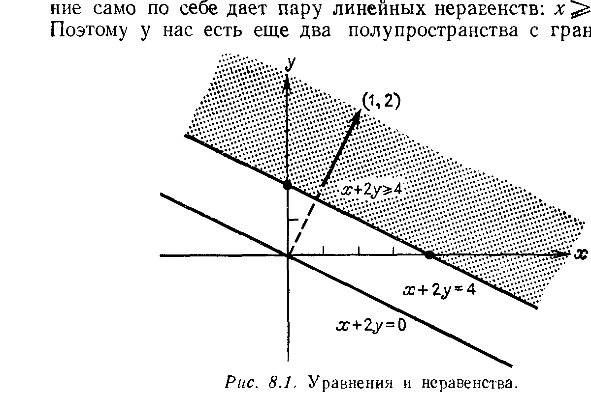
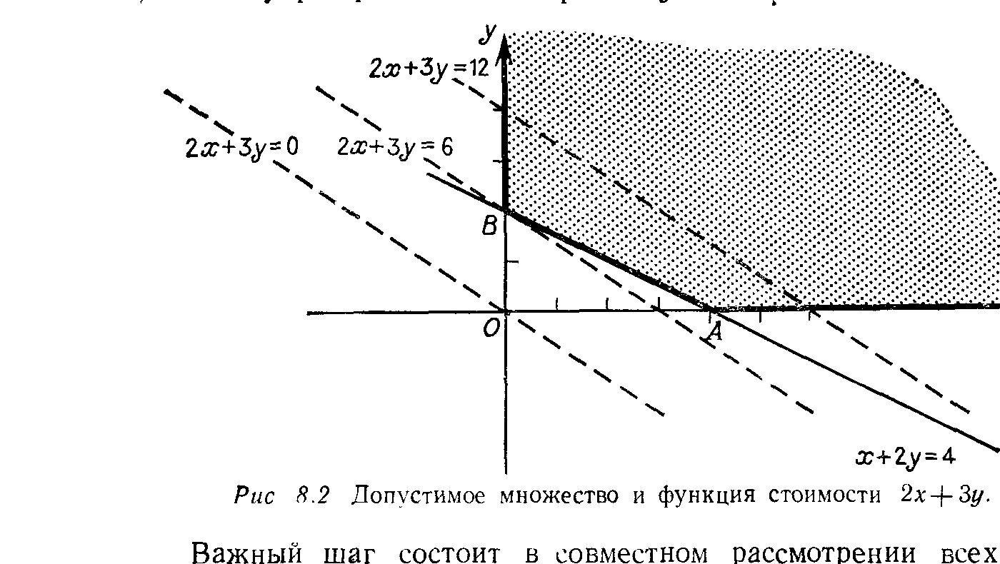
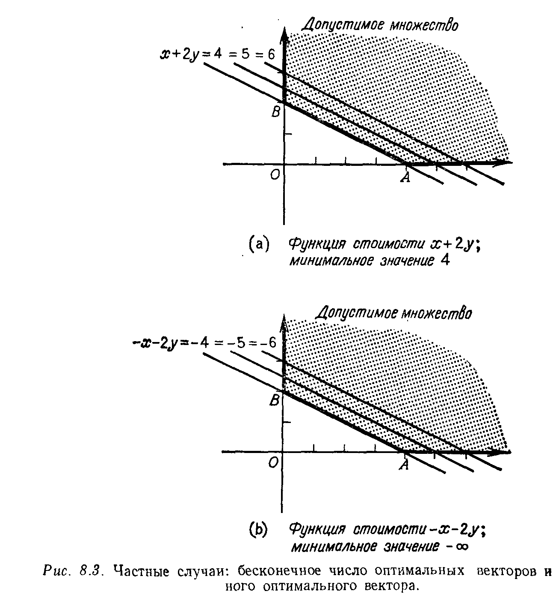

# Глава 8

# ЛИНЕЙНОЕ ПРОГРАММИРОВАНИЕ И ТЕОРИЯ ИГР

## § 8.1. ЛИНЕЙНЫЕ НЕРАВЕНСТВА

---
**стр. 353**
---

Линейная алгебра, в отличие от анализа, связана с решением только уравнений и не имеет дела с неравенствами. Это всегда казалось очевидным, но в конце концов я понял, что линейное программирование представляет собой контрпример: оно связано с неравенствами, но безусловно является частью линейной алгебры. То же самое справедливо и в отношении теории игр, и есть три подхода к этим предметам: либо интуитивный — через геометрию, либо вычислительный — через симплекс-метод, либо алгебраический — через теорию двойственности. Для линейного программирования эти подходы развиваются в данном параграфе и в § 8.2 и 8.3. Затем в § 8.4 рассматриваются задачи, имеющие целочисленное решение (например, задача о бракосочетании). В параграфе 8.5 обсуждаются покер и другие матричные игры, а в конце объясняется теорема о минимаксе и ее связь с теоремой двойственности из линейного программирования.

Ключом к этой главе служит понимание геометрического смысла линейных неравенств. Неравенство делит $n$-мерное пространство на два полупространства, в одном из которых неравенство выполняется, а в другом не выполняется. Типичным примером является неравенство $x + 2y \geqslant 4$. Границей, разделяющей эти два полупространства, является прямая $x + 2y = 4$, на которой неравенство обращается в равенство. Над этой прямой расположено полупространство, где $x + 2y \geqslant 4$ (рис. 8.1); под ней находится противоположное полупространство, в котором неравенство неверно. В трехмерном случае рисунок будет почти таким же; граница превращается в плоскость, например $x + 2y + z = 4$, а над ней расположено полупространство $x + 2y + z \geqslant 4$. В $n$-мерном случае мы также будем называть $(n-1)$-мерную границу «плоскостью».

В дополнение к неравенствам этого типа в линейном программировании существует еще одно основное ограничение: величины $x$

---
**стр. 354**
---

и $y$ должны быть *неотрицательными*. Разумеется, это ограничение само по себе дает пару линейных неравенств: $x \geqslant 0$ и $y \geqslant 0$.
Поэтому у нас есть еще два полупространства с границами, ле-

жащими прямо на осях координат: неравенство $x \geqslant 0$ допускает все точки, лежащие по правую сторону от прямой $x = 0$, а $y \geqslant 0$ дает полупространство над прямой $y = 0$.

Важный шаг состоит в совместном рассмотрении всех трех неравенств $x + 2y \geqslant 4$, $x \geqslant 0$, $y \geqslant 0$. Геометрически их сочетание дает выделенную область на рис. 8.2. Эту область можно рассматривать как *пересечение* трех полупространств. Она уже не является полупространством, а представляет собой типичный пример того, что в линейном программировании называется **допу-**

---
**стр. 355**
---

**стимым множеством.** Другими словами, допустимое множество образуется из решений набора линейных неравенств.

Нетрудно заметить, что система вида $Ax = b$, состоящая из $m$ уравнений с $n$ неизвестными, на самом деле описывает пересечение $m$ различных плоскостей — по одной на каждое из уравнений. (Когда $m = n$ и плоскости являются независимыми, они пересекаются в одной точке, являющейся решением $x = A^{-1}b$.) Аналогичным образом система $m$ неравенств $Ax \geqslant b$ описывает пересечение $m$ полупространств. Если, кроме того, потребовать, чтобы каждая компонента вектора $x$ была неотрицательна (что записывается в виде векторного неравенства $x \geqslant 0$), то в результате возникает еще $n$ полупространств. Чем больше ограничений мы накладываем, тем меньше будет допустимое множество.

Может случиться, что допустимое множество окажется ограниченным или даже пустым. Если мы перейдем к примеру с полупространством $x + 2y \leqslant 4$, сохранив неравенства $x \geqslant 0$, $y \geqslant 0$, то в результате получим треугольник $OAB$. При соединении вместе неравенств $x + 2y \geqslant 4$ и $x + 2y \leqslant 4$ допустимое множество вырождается в прямую: два противоположных ограничения дают равенство $x + 2y = 4$. Если же мы добавим противоречащее ограничение, например $x + 2y \leqslant -2$, то допустимое множество будет пустым $^1)$.

Алгебра линейных неравенств (или допустимых множеств) является составной частью нашего предмета. В линейном программировании, однако, имеется другая существенная составляющая: *нас интересует не множество всех допустимых точек, а определенная точка, максимизирующая или минимизирующая некоторую «функцию стоимости»*. К примеру $x + 2y \geqslant 4$, $x \geqslant 0$, $y \geqslant 0$ мы добавляем функцию стоимости (или целевую функцию) $2x + 3y$. Тогда настоящая задача линейного программирования состоит в отыскании точки $x$, $y$, лежащей в допустимом множестве и минимизирующей стоимость.

Геометрическая интерпретация задачи приведена на рис. 8.2. Семейство стоимостей $2x + 3y$ дает семейство параллельных прямых, и мы должны найти минимальную стоимость, т.е. первую прямую, которая пересекает допустимое множество. Очевидно, что это пересечение происходит в точке $B$, где $x^* = 0$ и $y^* = 2$; минимальная стоимость есть $2x^* + 3y^* = 6$. Вектор $(0, 2)$ называется *допустимым*, поскольку он лежит в допустимом множестве, и он *оптимален*, поскольку он минимизирует функцию стоимости, и минимальная стоимость 6 называется *значением* программы. Мы будем помечать оптимальные векторы звездочкой.

 

$^1)$ Полупространство $x + 2y \leqslant -2$ не пересекается с первым квадрантом $x \geqslant 0$, $y \geqslant 0$.

---
**стр. 356**
---

Нетрудно видеть, что оптимальный вектор находится в углу допустимого множества. Это гарантируется геометрией, поскольку прямые, задающие функцию стоимости (или плоскости, когда мы перейдем к большему числу неизвестных), непрерывно движутся

вверх, пока не пересекут допустимое множество. Первый контакт должен произойти на его границе. Однако при другой функции стоимости пересечение может и не быть одной точкой: если стоимость будет выражаться функцией $x + 2y$, то все ребро между $B$ и $A$ попадет в пересечение одновременно, и мы получим бесконечное множество оптимальных векторов на этом отрезке (рис. 8.3а). Значение по-прежнему остается единственным ($x^* + 2y^*$ равняется 4 для всех оптимальных векторов), и потому задача на минимум по-прежнему имеет определенное решение. С другой

---
**стр. 357**
---

стороны, задача на максимум вообще не будет иметь решения! При нашем допустимом множестве стоимость может подниматься сколь угодно высоко и максимальная стоимость бесконечна. Для рассмотрения этой возможности в рамках задач на минимум следует изменить стоимость на $-x - 2y$. Тогда минимум равняется $-\infty$, как на рис. 8.3b, и вновь решения нет. Каждая задача линейного программирования относится к одной из трех возможных категорий: либо ее допустимое множество является пустым, либо ее функция стоимости на допустимом множестве неограниченна, либо имеется единственное значение для линейной программы (с одним оптимальным вектором или с бесконечным множеством оптимальных векторов). Первые две ситуации должны быть весьма нетипичными для реальной экономической или инженерной задачи.

Существует простой способ превращения ограничений-неравенств в равенства, заключающийся во введении *переменной невязки* $w = x + 2y - 4$. Это и есть наше уравнение! Исходное ограничение $x + 2y \geqslant 4$ превращается в $w \geqslant 0$, что прекрасно согласуется с остальными ограничениями $x \geqslant 0$, $y \geqslant 0$. Именно с этого шага начинается симплекс-метод: введение переменных невязки для каждого из неравенств дает в результате только уравнения и простые ограничения на неотрицательность.

**ИНТЕРПРЕТАЦИЯ ИСХОДНОЙ ЗАДАЧИ И ДВОЙСТВЕННОЙ К НЕЙ**

Пожалуй, хватит о необычных случаях. Мы хотим вернуться к нашему исходному примеру со стоимостью $2x + 3y$ и описать его словесно. Он является иллюстрацией «задачи о диете» в линейном программировании с двумя источниками протеина — например, бифштексом и арахисовым маслом. Каждый фунт арахисового масла дает единицу протеина, каждый фунт бифштекса дает две единицы, и диета должна содержать по меньшей мере четыре единицы. Поэтому диета, содержащая $x$ фунтов арахисового масла и $y$ фунтов бифштекса, ограничивается неравенствами $x + 2y \geqslant 4$, $x \geqslant 0$, $y \geqslant 0$. (Мы не можем иметь отрицательного количества бифштекса или арахисового масла). Это и есть допустимое множество, и задача состоит в минимизации стоимости. Если фунт арахисового масла стоит 2 доллара, а фунт бифштекса 3 доллара, то стоимость всей диеты есть $2x + 3y$. К счастью, оптимальная диета состоит из бифштекса: $x^* = 0$ и $y^* = 2$.

Каждая линейная программа, в том числе и эта, имеет *двойственную*. Если исходная задача состоит в минимизации, то двойственная к ней — в максимизации и решение одной прямо приводит к решению другой; фактически минимум в данной «основной задаче» должен быть равен максимуму в двойственной к ней. На

---
**стр. 358**
---

самом деле это центральный результат в теории линейного программирования, и он будет разъяснен в § 8.3. Здесь же мы будем придерживаться задачи о диете и попытаемся дать интерпретацию двойственной к ней.

Для покупателя, выбирающего между бифштексом и арахисовым маслом из условия минимальной стоимости получаемого протеина, двойственной задачей является та, которая стоит перед продавцом, продающим *синтетический протеин*. Он намерен конкурировать с бифштексом и арахисовым маслом, и мы немедленно встречаемся с двумя ингредиентами типичной задачи линейного программирования: он хочет максимизировать цену $p$, но эта цена подчиняется линейным ограничениям. Прежде всего синтетический протеин не должен стоить больше, чем протеин в арахисовом масле (2 доллара за единицу) или протеин в бифштексе (3 доллара за две единицы). В то же время цена должна быть неотрицательной, иначе продавец не будет продавать. Поскольку диетой требовались четыре единицы протеина, доход продавца будет равен $4p$ и *двойственная задача* в точности такова: *Максимизировать* $4p$, *если* $p \leqslant 2$, $2p \leqslant 3$ *и* $p \geqslant 0$. Это пример, в котором двойственную задачу решить легче, чем исходную; она имеет лишь одну неизвестную. Ясно, что фактически действует лишь одно ограничение $2p \leqslant 3$ и максимальная цена синтетического протеина равняется 1.50 доллара. Поэтому максимальный доход равен $4p = 6$ долларов. Это была минимальная стоимость в исходной задаче, и покупатель платит одно и то же как за натуральный, так и за синтетический протеин. В этом состоит смысл теоремы двойственности.

**Упражнение 8.1.1.** Изобразить допустимое множество с ограничениями $x + 2y \geqslant 6$, $2x + y \geqslant 6$, $x \geqslant 0$, $y \geqslant 0$. Какие точки находятся в трех «углах» этого множества?

**Упражнение 8.1.2** (рекомендуемое). Чему равняется минимальное значение функции стоимости $x + y$ для предыдущего допустимого множества? Нарисовать прямую $x + y = \text{const}$, которая первой касается допустимого множества. Как насчет функций стоимости $3x + y$ и $x - y$?

**Упражнение 8.1.3.** Показать, что допустимое множество, ограниченное неравенствами $x \geqslant 0$, $y \geqslant 0$, $2x + 5y \leqslant 3$, $-3x + 8y \leqslant -5$, является пустым.

**Упражнение 8.1.4.** Показать, что следующая задача допустима, но не ограничена и не имеет поэтому оптимального решения: максимизировать $x + y$ при $x \geqslant 0$, $y \geqslant 0$, $-3x + 2y \leqslant -1$, $x - y \leqslant 2$.

**Упражнение 8.1.5.** Добавить одно ограничительное неравенство к $x \geqslant 0$, $y \geqslant 0$ так, чтобы допустимое множество содержало лишь одну точку.

**Упражнение 8.1.6.** Какую форму имеет допустимое множество $x \geqslant 0$, $y \geqslant 0$, $z \geqslant 0$, $x + y + z = 1$ и чему равен максимум выражения $x + 2y + 3z$?

---
**стр. 359**
---

**ТИПИЧНЫЕ ПРИЛОЖЕНИЯ**

В следующем параграфе мы сконцентрируем внимание на решении (и опустим формулировки) задач линейного программирования. Поэтому пора описать некоторые практические ситуации, в которых может возникнуть следующая математическая задача: *минимизировать или максимизировать линейную функцию стоимости, подчиняющуюся линейным ограничениям.*

1. *Выбор портфеля ценных бумаг.* Предположим, что имеются три типа ценных бумаг: федеральные стоимостью $A$, дающие 5% годовых, муниципальные стоимостью $B$, дающие 6% годовых, и акции урановой компании стоимостью $C$ и дающие 9% годовых. Мы можем купить этих бумаг на суммы $x$, $y$ и $z$ соответственно с тем, чтобы общая сумма не превосходила 100 тысяч долларов. Задача состоит в максимизации процентного дохода при условиях, что
i) в уран можно вложить не более 20 тысяч долларов;
ii) средняя стоимость выбранных бумаг должна быть не меньше $B$.

*Задача: максимизировать величину $5x + 6y + 9z$ при условиях*
$x + y + z \leqslant 100\,000$, $\quad z \leqslant 20\,000$, $\quad z \leqslant x$, $\quad x,\, y,\, z \geqslant 0$.

2. *Планирование производства.* Пусть корпорация «Дженерал Моторс» получает прибыль в размере 100 долларов на каждый «шевроле», 200 долларов на каждый «бьюик» и 400 долларов на каждый «кадиллак». Они проходят соответственно по 20, 17 и 14 миль на одном галлоне бензина, а Конгресс постановил, что в среднем производимый автомобиль должен проходить 18 миль на галлоне бензина. Завод может собрать «шевроле» за 1 минуту, «бьюик» — за 2 минуты, а «кадиллак» — за 3 минуты. Чему равняется максимальная прибыль за восьмичасовой рабочий день?
*Задача: максимизировать величину $100x + 200y + 400z$ при условиях*
$20x + 17y + 14z \geqslant 18(x + y + z)$, $\quad x + 2y + 3z \leqslant 480$, $\quad x,\, y,\, z \geqslant 0$.

**Упражнение 8.1.7.** Решить задачу о портфеле ценных бумаг.

**Упражнение 8.1.8.** В допустимом множестве для второго примера условие неотрицательности $x,\, y,\, z \geqslant 0$ выделяет одну восьмую трехмерного пространства (положительный октант). Как он разрезается двумя плоскостями, соответствующими ограничениям, и какую форму имеет допустимое множество? Каким образом его углы показывают, что при этих двух ограничениях в оптимальном решении будет только две марки автомашин?

**Упражнение 8.1.9.** *Задача о перевозках.* Пусть Техас, Калифорния и Аляска производят по миллиону баррелей нефти. Город Чикаго потребляет 800 тысяч баррелей и расположен на расстоянии 1000, 2000 и 3000 миль от соответствующих месторождений. Оставшиеся 2200 тысяч баррелей транспор-
