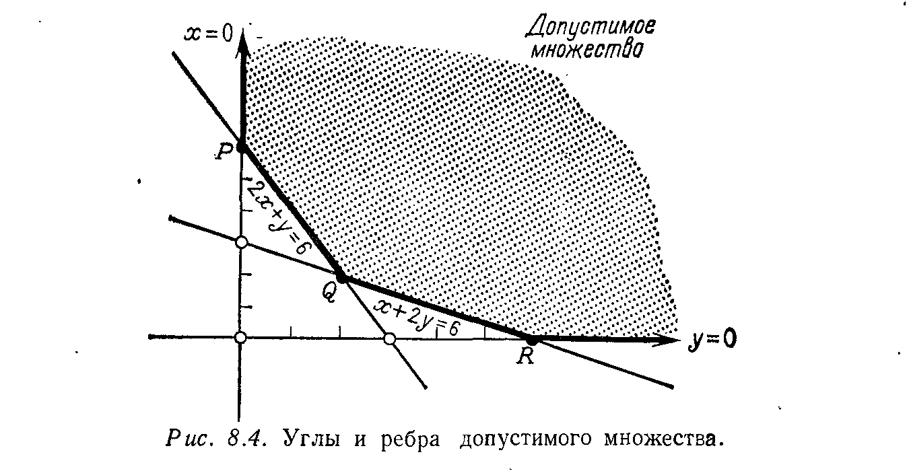

## § 8.2. СИМПЛЕКС-МЕТОД

---
**стр. 360**
---

тируются в Новую Англию на расстояние 1500, 3000 и 3700 миль соответственно.
Если стоимость перевозки барреля составляет одну единицу на милю, то какую
линейную программу с пятью ограничениями-равенствами нужно решить, чтобы
оптимизировать величины $x$, $y$, $z$ для Чикаго и $u$, $v$, $w$ для Новой Англии?

### § 8.2. СИМПЛЕКС-МЕТОД

Этот параграф посвящен линейному программированию с $n$ не-
известными и $m$ ограничениями. В предыдущем параграфе мы
имели $n = 2$ и $m = 1$; там были две неотрицательные переменные
и одно ограничение $x + 2y \geqslant 4$. Более общий случай нетрудно
объяснить, но нелегко решить.

Наилучшим способом для описания задачи является ее мат-
ричная запись. $n$ неизвестных образуют неотрицательный вектор-
столбец $x = [x_1\ x_2\ \dots\ x_n]^T$. Чтобы быть «допустимым», этот вектор
должен удовлетворять $m$ ограничениям помимо $x \geqslant 0$; мы запи-
сываем эти ограничения в виде $Ax \geqslant b$. Матрица $A$ имеет размер
$m \times n$, и каждая из ее строк дает одно неравенство (точно так же,
как в остальной части книги каждая строка системы $Ax = b$ давала
одно уравнение). Матрица $A$ и вектор $b$ заданы — для ограниче-
ния $x + 2y \geqslant 4$ мы имели $A = [1\ 2]$ и $b = [4]$. Функция стоимости
тоже задана, и она также является линейной; она равняется
$c_1x_1 + c_2x_2 + \dots + c_nx_n$, или $cx^{1)}$<!-- вероятная опечатка оригинала: имеется в виду $cx$ (или $c^T x$), а 1) — это маркер сноски -->. Задача состоит в отыскании до-
пустимого вектора, минимизирующего стоимость; этот вектор и
есть оптимальный.

**Задача на минимум:** *минимизировать $cx$ при условиях
$x \geqslant 0$, $Ax \geqslant b$.*

Геометрическая интерпретация очевидна. Первое условие $x \geqslant 0$
ограничивает вектор «положительным квадрантом» в $n$-мерном
пространстве — это есть область, общая для всех полупространств
$x_j \geqslant 0$. В двумерном случае это четверть плоскости, в трехмер-
ном — восьмая часть пространства; в общем случае имеется один
шанс из $2^n$ для того, чтобы вектор был неотрицательным. Другие
$m$ ограничений дают $m$ дополнительных полупространств, и до-
пустимыми векторами являются те, которые удовлетворяют всем
$m + n$ условиям; они лежат в квадранте $x \geqslant 0$ и одновременно
удовлетворяют $Ax \geqslant b$. Другими словами, допустимое множество
есть пересечение $m + n$ полупространств; оно может быть огра-
ниченным (с плоскими сторонами!), неограниченным или пустым.

Функция стоимости $cx$ вводит в задачу полное семейство
параллельных плоскостей. Один из элементов этого семейства,
а именно содержащий начало координат, является плоскостью
$cx = 0$; если вектор $x$ удовлетворяет этому уравнению, то он имеет

---
$^{1)}$ $c$ — вектор-строка.

---
**стр. 361**
---

«нулевую стоимость». Остальные плоскости $cx = \mathrm{const}$ дают все
возможные стоимости. При изменении стоимости эти плоскости
перемещаются в $n$-мерном пространстве и оптимальным вектором $x^*$
будет тот, при котором плоскость впервые коснется допустимого
множества. Этот вектор $x^*$ является допустимым, и соответствую-
щая стоимость $cx^*$ является минимальной внутри допустимого
множества; таким образом, $x^*$ решает стандартную задачу на ми-
нимум в линейном программировании.

Наша цель в этом параграфе заключается в вычислении $x^*$.
В принципе мы можем сделать это путем отыскания всех углов
допустимого множества и вычисления стоимостей в них; тогда
угол с минимальной стоимостью будет оптимальным. Однако
практическая реализация данного подхода невозможна, поскольку
таких углов насчитываются миллионы и мы не можем произво-
дить вычисления во всех них. Вместо этого мы обратимся к *сим-
плекс-методу*, который без сомнения можно считать наиболее
плодотворной идеей современной вычислительной математики. Он
был разработан Данцигом как систематический способ для реше-
ния задач линейного программирования и либо по счастливой
случайности, либо благодаря выдающимся достоинствам имел
потрясающий успех. Этапы этого метода приведены на стр. 372,
но сначала мы попытаемся разъяснить их насколько возможно.

Мне кажется, что лучше всего сделать это геометрически. На
первом шаге мы просто находим некоторый угол допустимого
множества, что составляет *первую фазу*. Сердцем метода является
его *вторая фаза*, заключающаяся в *движении от угла к углу вдоль
ребер допустимого множества*. В типичном случае нам придется
выбирать для движения одно из $n$ ребер; некоторые из них будут
уводить от оптимального (но неизвестного) $x^*$, другие будут по-
степенно приближать нас к этому вектору. Данциг предложил
двигаться вдоль того ребра, которое гарантирует убывание стои-
мости. Это ребро приводит к новому углу с меньшей стоимостью,
и уже нет возможности вернуться к чему-либо более дорогому.
Постепенно мы достигнем особого угла, для которого уже все направ-
ления станут недопустимыми и стоимость минимизирована. Этот
угол дает оптимальный вектор $x^*$, и процесс останавливается.

Реальная трудность состоит в переходе от этой идеи к ее
алгебраической реализации. Сначала нужно интерпретировать
слова *угол* и *ребро* в $n$-мерном пространстве. Угол является точкой
пересечения $n$ различных плоскостей, каждая из которых задается
одним уравнением — в точности, как три плоскости (или передняя
стена, боковая стена и пол) образуют трехмерный угол. Вспом-
ним, что допустимое множество в линейном программировании
определяется $m$ неравенствами $Ax \geqslant b$ и $n$ неравенствами $x \geqslant 0$.
Каждый из углов множества образуется путем замены $n$ из $n + m$
неравенств на равенства и отыскания точки пересечения этих

---
**стр. 362**
---

плоскостей. В частности, одна возможность состоит в выборе $n$
уравнений $x_1 = 0$, $\dots$, $x_n = 0$, что даст начало координат. Как
и для всех остальных случаев, *эта точка пересечения будет
истинным углом только в том случае, когда она удовлетворяет
также и $m$ остальным ограничениям*. В противном случае она
даже не лежит внутри допустимого множества и является ложной.
Пример в упр. 8.1.1 содержал $n = 2$ переменных и $m = 2$ огра-
ничений; существует шесть возможных пересечений, только три
из которых на самом деле являются углами допустимого множе-
ства (см. рис. 8.4). Эти углы обозначены через $P$, $Q$, $R$; они

дают векторы $(0, 6)$, $(2, 2)$, $(6, 0)$, один из которых должен быть
оптимальным (кроме случая, когда минимальная стоимость рав-
няется $-\infty$). Остальные три угла, включая начало координат,
являются ложными.

В общем случае имеется $(n + m)!/n!m!$ возможных пересечений,
что равняется числу способов, которыми можно выбрать $n$ из
$n + m$ плоскостей $^{1)}$. Если допустимое множество является пустым,
то ни одно из этих пересечений не будет настоящим углом до-
пустимого множества. Отыскание настоящего угла или установ-
ление пустоты допустимого множества является задачей первой
фазы; в дальнейшем предполагается, что некоторый угол уже
найден.

Уберем одну из $n$ пересекающихся плоскостей; в результате
останется $n - 1$ уравнений и, следовательно, одна степень сво-
боды. Точки, удовлетворяющие этим $n - 1$ уравнениям, образуют
ребро, выходящее из угла. Геометрически это ребро является

---
$^{1)}$ Величина этого числа и объясняет, почему вычисление стоимости для
всех углов является совершенно нереальной задачей при больших $n$.

---
**стр. 363**
---

пересечением $n - 1$ плоскостей. Поскольку мы должны оставаться
в допустимом множестве, то мы не можем выбирать направление
движения вдоль ребра: только одно направление остается до-
пустимым. Но мы можем выбирать любое из $n$ различных ребер,
и этот выбор осуществляется фазой 2.

Для описания этой фазы мы должны переписать систему $Ax \geqslant b$
в форме, совершенно аналогичной $n$ простым ограничениям
$x_1 \geqslant 0$, $\dots$, $x_n \geqslant 0$. Для этого служат переменные невязки $w = Ax - b$.
С их помощью $m$ ограничений $Ax \geqslant b$ переходят
в $w_1 \geqslant 0$, $\dots$, $w_m \geqslant 0$ с одной переменной невязки для каждой
строки матрицы $A$. Тогда уравнение $w = Ax - b$, или $Ax - w = b$,
в матричной форме записывается как
$$
\begin{bmatrix} A & -I \end{bmatrix} \begin{bmatrix} x \\ w \end{bmatrix} = b.
$$
Допустимое множество определяется этими $m$ уравнениями и
$n + m$ простыми неравенствами $x \geqslant 0$, $w \geqslant 0$. Другими словами,
*обычная задача привелась к каноническому виду с ограничениями
в виде равенств.*

Для завершения этого перехода остается устранить различие
между исходным вектором $x$ и новым вектором $w$, поскольку они
не различаются в симплекс-методе и сохранять обозначения
$$
\begin{bmatrix} A & -I \end{bmatrix} \quad \text{и} \quad \begin{bmatrix} x \\ w \end{bmatrix}
$$
не имеет смысла. Поэтому *мы изменим обозначения и будем обо-
значать через $A$ расширенную матрицу, а через $x$ расширенный
вектор.* Тогда ограничения-равенства запишутся в виде $Ax = b$
и $n + m$ простых неравенств перейдут в $x \geqslant 0$ $^{1)}$. Начальный век-
тор стоимости $c$ должен быть расширен путем добавления $m$ ну-
левых компонент; тогда стоимость $cx$ при новой интерпретации
обозначений $x$ и $c$ совпадает с исходной. Единственное отличие,
вызванное введением переменных невязки, состоит в том, что
матрица $A$ будет иметь размер $m \times (n + m)$, а вектор $x$ будет иметь
$n + m$ компонент. Мы сохраняем старые обозначения $m$ и $n$ в ка-
честве напоминания о произведенной замене.

**Пример.** В задаче, проиллюстрированной на рис. 8.4, с огра-
ничениями $x + 2y \geqslant 6$, $2x + y \geqslant 6$ и функцией стоимости $x + y$
новая система имеет вид
$$
A = \begin{bmatrix} 1 & 2 & -1 & 0 \\ 2 & 1 & 0 & -1 \end{bmatrix}, \quad
b = \begin{bmatrix} 6 \\ 6 \end{bmatrix} \quad \text{и} \quad c = [1\ \ 1\ \ 0\ \ 0].
$$

---
$^{1)}$ Разумеется, в экономических или физических задачах ограничения могут
иметь вид равенств с самого начала. В этом случае переменные невязки не
нужны и симплекс-метод будет сразу работать с системой $Ax = b$.

---
**стр. 364**
---

После этого перехода к ограничениям-равенствам можно при-
менять симплекс-метод. Вспомним, что фазой 1 уже найден угол
допустимого множества, т. е. точка пересечения $n$ плоскостей:
$n$ исходных неравенств $x \geqslant 0$ и $Ax \geqslant b$ (или $w \geqslant 0$) преобразованы
в уравнения. Другими словами, *угол есть точка, в которой $n$
компонент нового вектора $x$* (или исходного вектора $\begin{bmatrix} x \\ w \end{bmatrix}$) *равны
нулю.* В системе $Ax = b$ мы будем считать эти $n$ компонент век-
тора $x$ свободными переменными, а остальные $m$ компонент — *ба-
зисными* переменными. Тогда, полагая $n$ свободных переменных
равными нулю, из $m$ уравнений системы $Ax = b$ находим $m$ ба-
зисных переменных. Это решение $x$ называется *базисным* в соот-
ветствии с тем, что оно полностью зависит от базисных перемен-
ных. Если, кроме того, ненулевые компоненты вектора $x$
неотрицательны, то соответствующий угол будет истинным, т. е.
принадлежащим допустимому множеству.

> **8A.** *Углы допустимого множества являются **базисными до-
> пустимыми решениями** системы $Ax = b$: решение $x$ является
> базисным, когда $n$ из $m + n$ его компонент равны нулю, и оно
> допустимое, если $x \geqslant 0$. Первая фаза симплекс-метода дает
> одно базисное допустимое решение, а вторая фаза служит для
> последовательного приближения к оптимальному решению.*

**Пример.** Угловая точка $P$ на рис. 8.4 дается пересечением
прямых $x = 0$ и $2x + y - 6 = 0$, так что две компоненты вектора $x$
равны нулю, а две другие положительны. Следовательно, он
является базисным и допустимым:
$$
Ax = \begin{bmatrix} 1 & 2 & -1 & 0 \\ 2 & 1 & 0 & -1 \end{bmatrix}
\begin{bmatrix} 0 \\ 6 \\ 6 \\ 0 \end{bmatrix} = \begin{bmatrix} 6 \\ 6 \end{bmatrix} = b.
$$

Остается принять главное решение: в какой угол следует
теперь переходить? Мы нашли один угол, в котором $m$ компонент
вектора $x$ являются положительными, а остальные — нулями, и
хотим двигаться вдоль ребра допустимого множества в соседний
угол. Тот факт, что эти два угла являются соседними, означает,
что из $m$ базисных переменных $m - 1$ *останутся базисными и
лишь одна станет свободной* (нулем). Одновременно одна из сво-
бодных переменных станет базисной; ее значение из нуля станет
положительным, а остальные $m - 1$ основных переменных изме-
нятся, оставаясь положительными. Задача состоит в том, чтобы
решить, какую переменную следует исключить из базисных и

---
**стр. 365**
---

какую добавить. Если мы знаем, какие $m$ переменных являются
базисными в новом углу, их значения вычисляются путем решения
системы $m$ уравнений $Ax = b$, где оставшиеся компоненты век-
тора $x$ полагаются равными нулю.

Поясним сказанное на примере:
*Минимизировать $7x_3 - x_4 - 3x_5$ при условиях*
$$
\begin{aligned}
x_1 \quad + x_3 + 6x_4 + 2x_5 &= 8, \\
x_2 + x_3 \quad\ \ \ + 3x_5 &= 9.
\end{aligned}
$$

Начинаем с угла, где $x_1 = 8$ и $x_2 = 9$ (они являются базисными
переменными) и $x_3 = x_4 = x_5 = 0$. Ограничения удовлетворяются,
но стоимость может не быть минимальной. Фактически именно
функция стоимости определяет, какую свободную переменную
нужно ввести в базис. Глупо делать положительной переменную
$x_3$, поскольку коэффициент при ней равен $+7$, а мы пытаемся
уменьшить стоимость. Целесообразно выбирать переменную $x_4$
или $x_5$, и мы выберем $x_5$, поскольку коэффициент $-3$ при ней
является более отрицательным. Если бы все коэффициенты были
положительны, то исходное решение уже являлось бы оптималь-
ным.

Если переменная $x_5$ включается в базис, то либо $x_1$, либо $x_2$
следует исключить из него. Если $x_5$ увеличивается в первом из
уравнений, а $x_1$ уменьшается, с тем чтобы сохранить равенство
$x_1 + 2x_5 = 8$, то $x_1$ окажется равной нулю при $x_5 = 4$. К этому
моменту, однако, величина $x_2$ во втором уравнении уже станет
отрицательной: $x_5 = 4$ влечет за собой равенство $x_2 = -3$. Пра-
вило состоит в том, чтобы увеличивать $x_5$ до тех пор, пока одна
из базисных переменных не станет равной нулю, после чего она
становится свободной. В нашем случае $x_2$ равняется нулю при
$x_5 = 3$ и из первого уравнения получаем, что $x_1 = 2$. Стоимость
при этом падает до $-9$. В общем случае мы вычисляем отноше-
ния правых частей к коэффициентам при включаемой перемен-
ной, $8/2$ и $9/3$, и наименьшее отношение показывает, какая из
переменных станет свободной.

Это правило учитывает лишь положительные отношения, по-
скольку если коэффициент при $x_5$ будет равен $-3$ вместо $+3$,
то увеличение $x_5$ будет одновременно *увеличивать* $x_2$ (при $x_5 = 10$
мы получим $x_2 = +39$ во втором уравнении) и мы никогда не
получим нулевого $x_2$. Если все коэффициенты при $x_5$ являются отри-
цательными, то мы имеем *неограниченный* случай: $x_5$ можно не-
ограниченно увеличивать и при этом стоимость будет убывать
до $-\infty$, причем мы не покинем допустимое множество. Ребро
является бесконечно длинным.

В нашем случае шаг заканчивается в углу $x_1 = 2$, $x_2 = x_3 =$
$= x_4 = 0$, $x_5 = 3$. Однако следующий шаг будет простым только

---
**стр. 366**
---

в том случае, когда уравнения имеют подходящий вид — когда
базисные переменные выделены, как это было в исходной ситуа-
ции с $x_1$ и $x_2$. Для этого мы осуществляем «выделение ведущего
элемента», решая второе уравнение относительно $x_5$ и подставляя
результат в функцию стоимости и в первое уравнение: $3x_5 =$
$= 9 - x_2 - x_3$, так что новая задача имеет вид:
*минимизировать $7x_3 - x_4 - (9 - x_2 - x_3) = x_2 + 8x_3 - x_4 - 9$ при
условиях*
$$
\begin{aligned}
x_1 - \frac{2}{3}x_2 + \frac{1}{3}x_3 + 6x_4 \qquad &= 2, \\
\frac{1}{3}x_2 + \frac{1}{3}x_3 \qquad + x_5 &= 3.
\end{aligned}
$$

Следующий шаг осуществляется просто. Единственный отрица-
тельный коэффициент в функции стоимости означает, что должна
включаться переменная $x_4$. Отношения $2/6$ и $3/0$ означают, что
исключаться должна переменная $x_1$. Новый угол задается соот-
ношениями $x_1 = x_2 = x_3 = 0$, $x_4 = 1/3$, $x_5 = 3$, и новая стоимость
равна $-9\frac{1}{3}$. Она и является оптимальной.

В задачах большей размерности исключаемая переменная
впоследствии может вновь попасть в базис. Однако поскольку
стоимость продолжает снижаться (исключая вырожденный слу-
чай), ситуация, когда все $m$ базисных переменных вернутся, не-
возможна. Ни один угол не посещается дважды, и процесс дол-
жен остановиться в оптимальном углу (или на $-\infty$, если стои-
мость является неограниченной). Что самое замечательное, так
это быстрота, с которой обычно находится оптимальный угол.

**Замечание о вырожденности.** Угол называется *вырожденным*,
если в нем равны нулю не $n$ компонент вектора $x$, а больше,
т. е. через этот угол проходит больше чем $n$ плоскостей и
некоторые из базисных переменных обращаются в нуль. В симп-
лекс-методе признаком этого служит появление нуля в правой
части уравнений. В результате этого отношения, определяющие
исключаемую переменную, будут содержать нули и базис может
изменяться без выхода из данного угла; на самом деле мы
могли бы до бесконечности кружиться на месте, выбирая базис.
Такую ситуацию можно устранить либо путем соответствую-
щей перестройки симплекс-метода, либо предполагая, что зацик-
ливания не происходит. К счастью, последнее согласуется с вы-
числительной практикой.

**Упражнение 8.2.1.** Минимизировать $x_1 + x_2 - x_3$ при условиях
$$
\begin{aligned}
2x_1 - 4x_2 + x_3 + x_4 \qquad\ &= 4, \\
3x_1 + 5x_2 + x_3 \qquad\ \ \ \ + x_5 &= 2.
\end{aligned}
$$
---
