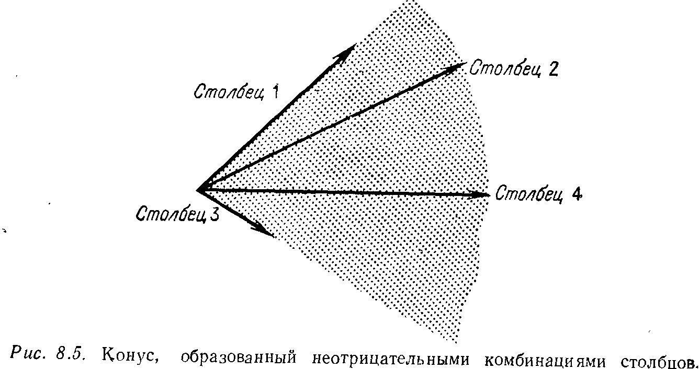
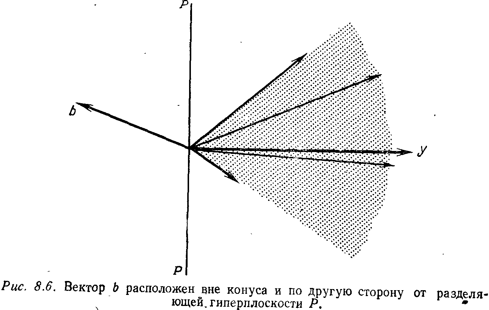

## § 8.3. ТЕОРИЯ ДВОЙСТВЕННОСТИ

---
**стр. 374**
---

различных углов, т. е. требует примерно $m^2n$ действий — величина, сравнимая с объемом вычислений при использовании метода исключения для системы $Ax=b$, — чем и объясняется успех симплекс-метода. Но математические расчеты показывают, что длина пути не всегда может быть ограничена числом, кратным $m$, или фиксированной степенью числа $m$. Сейчас известно, что наихудшие допустимые множества могут дать путь, состоящий более чем из $c m^{n/2}$ ребер, где число $c$ не зависит от $m$, но по какой-то причине, лежащей в геометрических свойствах многомерных многогранников, симплекс-метод оказывается «везучим».

**Упражнение 8.2.9.** Проверить, что
$$
E^{-1} = \begin{bmatrix}
1 & & -v_1/v_k & & \\
 & \ddots & \vdots & & \\
 & & 1/v_k & & \\
 & & \vdots & \ddots & \\
 & & -v_n/v_k & & 1
\end{bmatrix},
\quad \text{если} \quad
E = \begin{bmatrix}
1 & & v_1 & & \\
 & \ddots & \vdots & & \\
 & & v_k & & \\
 & & \vdots & \ddots & \\
 & & v_n & & 1
\end{bmatrix}.
$$

**Упражнение 8.2.10.** Показать, что матрица $BE$ совпадает с $B$, кроме $k$-го столбца, который заменяется на $Bv$ (что равняется искомому вектору $u$). Поэтому $BE$ действительно является базисной матрицей $B$ для следующего шага, обратная к ней есть $E^{-1}B^{-1}$ и сомножитель $E^{-1}$ правильно корректирует обратную матрицу.

**Упражнение 8.2.11.** Можно ли найти в табл. 8.1 место, где требуется $mn$ операций?

### § 8.3. ТЕОРИЯ ДВОЙСТВЕННОСТИ

Вторая глава начиналась с утверждения о том, что, хотя метод исключения и дает способ для решения системы $Ax=b$, возможен другой и более глубокий подход. То же самое справедливо и для линейного программирования. Механика симплекс-метода позволяет решить линейную программу, но центром теории линейного программирования является идея двойственности. Это красивая идея, и в то же время она очень важна для приложений. Объясним, как мы ее понимаем.
Начнем со стандартной задачи:

*Исходная задача:*
*Минимизировать* $cx$ *при условиях* $x \ge 0$ *и* $Ax \ge b$.

Но теперь вместо введения эквивалентной формулировки, содержащей уравнения вместо неравенств, двойственность ставит совершенно иную задачу. *В двойственной задаче мы начинаем с тех же самых* $A$, $b$ *и* $c$, *но затем все делается наоборот.*

---
**стр. 375**
---

В исходной задаче $c$ было функцией стоимости и $b$ был ограничением; в двойственной задаче эти векторы меняются местами. Более того, знак неравенства изменяется на противоположный и новые неизвестные составляют вектор-строку $y$, так что допустимое множество будет удовлетворять неравенству $yA \le c$ вместо $Ax \ge b$. Наконец, вместо минимизации мы будем максимизировать. Лишь требование неотрицательности остается неизменным; неизвестный вектор $y$, содержащий $m$ компонент, должен удовлетворять условию $y \ge 0$. Короче говоря, двойственной к задаче на минимум является следующая задача на максимум:

*Двойственная задача.*
*Максимизировать* $yb$ *при условиях* $y \ge 0$ *и* $yA \le c$.

Двойственная к *этой* задаче совпадает с исходной задачей на минимум $^1)$.

Естественно, я должен как-то проинтерпретировать все эти обращения. Они заключают в себе нечто вроде конкуренции между «минимизатором» и «максимизатором». Легче всего будет объяснить это, вернувшись к задаче о диете; я надеюсь, что вы проследите за ходом рассуждений еще раз. В задаче на минимум $n$ неизвестных, соответствующих $n$ различным продуктам питания, которые потребляются в (неотрицательных) количествах $x_1, \ldots, x_n$. При этом $m$ ограничений соответствуют $m$ требуемым витаминам вместо одного ограничения на количество протеина, которое делалось в исходной задаче о диете. Элемент $a_{ij}$ представляет собой количество $i$-го витамина в $j$-м продукте, и $i$-я строка системы $Ax \ge b$ означает, что диета должна содержать этот витамин в количестве, не меньшем чем $b_i$. Наконец, если $c_j$ есть стоимость $j$-го продукта, то $c_1 x_1 + \ldots + c_n x_n = cx$ является стоимостью всей диеты. Минимизация этой стоимости и составляет цель исходной задачи.

В двойственной задаче аптекарь реализует не еду, а витамины в таблетках. Цены на витамины не отрицательны, и их можно варьировать. Основное ограничение здесь состоит в том, что он не может запрашивать за витамины больше, чем стоит настоящая еда. Поскольку $j$-й продукт питания содержит витамины в количествах $a_{ij}$, цена, назначаемая аптекарем за эквивалент в витаминах (и равная $a_{1j} y_1 + \ldots + a_{mj} y_m$), не может превосходить цену $c_j$ настоящего продукта. Это и дает ограничение $yA \le c$. С учетом этого ограничения аптекарь может продавать каждый витамин в количестве $b_i$, получая доход в размере $y_1 b_1 + \ldots + y_m b_m = yb$, который он стремится максимизировать.
___
$^1)$ Эти две задачи полностью симметричны. Мы начали с минимизации, но симплекс-метод в равной мере может быть применен к задаче максимизации — и в любом случае решаются обе задачи.

---
**стр. 376**
---

Следует отметить, что допустимые множества в этих двух задачах совершенно различны. Первое является подмножеством пространства $\mathbf{R}^n$, характеризуемым матрицей $A$ и вектором ограничений $b$; второе является подмножеством пространства $\mathbf{R}^m$, определяемым транспонированной к $A$ матрицей и другим вектором $c$. Тем не менее при включении функций стоимости обе задачи будут содержать одни и те же входные данные $A$, $b$ и $c$. Вся теория линейного программирования базируется на соотношениях между ними, и мы приходим к фундаментальному результату:

> **8D. Теорема двойственности.** *Если исходная задача имеет решение, то двойственная к ней задача также разрешима, и наоборот. При этом значения решений совпадают: **минимум величины $cx$ равняется максимуму величины $yb$**.*
> *В противном случае, если оптимальных векторов не существует, либо оба допустимых множества являются пустыми, либо одно множество является пустым и другая задача имеет неограниченное решение (максимум равен $+\infty$ или минимум равен $-\infty$).*

Если оба допустимых множества являются непустыми, то реализуется первый и наиболее важный случай: $cx^* = y^*b$.

Теоретически этот факт устраняет конкуренцию между аптекарем и бакалейщиком, поскольку результат всегда «ничейный». Мы получим похожую «теорему о минимаксе» и аналогичное равновесие в теории игр. Эти теоремы не означают, что покупатель ничего не платит за оптимальную диету или что матричная игра дает равные шансы обоим игрокам. Они означают, что для покупателя нет смысла предпочитать витамины обычной еде, несмотря на то что аптекарь гарантирует наличие заменителя для любого продукта и даже продает по более низкой цене заменитель такого дорогого продукта, как арахисовое масло. Мы хотим показать, что дорогие продукты не включаются в оптимальную диету, так что результат все-таки будет одним и тем же.

Это положение может показаться безвыходным, но я надеюсь, что оно не смутит вас, ведь решающая информация содержится в оптимальных векторах. В исходной задаче $x^*$ указывает стратегию для покупателя; в двойственной задаче вектор $y^*$ фиксирует естественные цены (или «теневые цены»), которых должна придерживаться экономика. В той мере, в которой наша линейная модель отражает реальную экономику, эти векторы представляют те решения, которые действительно следует принимать; их надо найти при помощи симплекс-метода, и теорема двойственности всего лишь говорит нам об их наиболее важном свойстве.

---
**стр. 377**
---

Приступим к доказательству теоремы. В некотором смысле может показаться очевидным, что аптекарь в состоянии поднимать цены до цен бакалейщика, но это не так. Точнее, верна лишь первая часть: поскольку каждый отдельный продукт может быть заменен своим витаминным эквивалентом без увеличения стоимости, все адекватные продуктовые диеты должны стоить не меньше, чем любая витаминная диета у аптекаря. Это одностороннее неравенство — *цена у аптекаря* $\le$ *цена у бакалейщика*, — но оно является основополагающим. Оно называется **слабой двойственностью** и легко доказывается для любой линейной программы и двойственной к ней:

> **8E.** *Если $x$ и $y$ являются допустимыми векторами в задачах на минимум и на максимум соответственно, то $yb \le cx$.*

Д о к а з а т е л ь с т в о. Поскольку указанные векторы являются допустимыми, они удовлетворяют неравенствам
$$
Ax \ge b \quad \text{и} \quad yA \le c.
$$
Более того, поскольку допустимость подразумевает также и неравенства $x \ge 0$ и $y \ge 0$, мы можем перейти к скалярным произведениям, не нарушая при этом знаков неравенств:
$$
yAx \ge yb \quad \text{и} \quad yAx \le cx. \quad (7)
$$
Поскольку левые части неравенств совпадают, мы получаем слабую двойственность $yb \le cx$.

Одностороннее неравенство легко можно использовать. Во-первых, оно запрещает возможность того, что решения обеих задач являются неограниченными: если $yb$ — произвольно большое число, то не существует даже допустимого вектора $x$, поскольку это противоречило бы неравенству $yb \le cx$. Аналогичным образом, если исходная задача была неограниченной, т. е. стоимость $cx$ могла убывать до $-\infty$, то двойственная задача не имеет допустимых векторов $y$.

Второй и столь же важный момент заключается в том, что любые векторы, для которых достигается равенство $yb = cx$, должны быть оптимальными. В этом случае цена у бакалейщика совпадает с ценой у аптекаря, и мы узнаем цены оптимальной продуктовой и оптимальной витаминной диет по тому факту, что покупателю не из чего выбирать:

> **8F.** *Если векторы $x$ и $y$ являются допустимыми и если $cx = yb$, то эти векторы должны быть оптимальными.*

Д о к а з а т е л ь с т в о. Согласно 8E, не существует такого допустимого вектора $y$, что $yb$ становится больше, чем $cx$. По-

---
**стр. 378**
---

скольку вектор $y$ достигает этого значения, он является оптимальным. Аналогично никакой допустимый вектор $x$ не может сделать величину $cx$ меньшей, чем $yb$, и любой $x$, для которого этот минимум достигается, должен быть оптимальным.

Сформулируем пример с двумя продуктами и двумя витаминами. Заметим, что в двойственной задаче появляется матрица $A^\mathrm{T}$, поскольку неравенство $yA \le c$ для вектор-строк эквивалентно $A^\mathrm{T} y^\mathrm{T} \le c^\mathrm{T}$ для столбцов.

*Исходная задача:*
Минимизировать $x_1 + 4x_2$
при условиях $x_1 \ge 0,\ x_2 \ge 0,$
$2x_1 + x_2 \ge 6,$
$5x_1 + 3x_2 \ge 7.$

*Двойственная задача:*
Максимизировать $6y_1 + 7y_2$
при условиях $y_1 \ge 0,\ y_2 \ge 0,$
$2y_1 + 5y_2 \le 1,$
$y_1 + 3y_2 \le 4.$

Выбор $x_1 = 3,\ x_2 = 0$ является допустимым и дает стоимость $x_1 + 4x_2 = 3$. В двойственной задаче числа $y_1 = 1/2$ и $y_2 = 0$ дают то же самое значение $6y_1 + 7y_2 = 3$. Следовательно, эти векторы должны быть оптимальными.

Все это кажется исключительно простым. Тем не менее имеет смысл взглянуть на проблему более внимательно и выяснить, что происходит в тот момент, когда неравенство $yb \le cx$ переходит в равенство. Это похоже на ситуацию в дифференциальном исчислении, где каждому известно условие максимума или минимума функции, состоящее в равенстве нулю первых производных, и тем не менее часто забывают, что это условие совершенно меняется при наличии ограничений. Наилучшим примером является наклонная прямая; производная никогда не обращается в нуль, дифференциальное исчисление почти бесполезно и максимум определенно достигается на правом конце интервала. Это в точности соответствует ситуации, с которой мы сталкиваемся в линейном программировании. Хотя переменных здесь больше и обычный интервал заменяется допустимым множеством нескольких измерений, максимум всегда достигается в углу допустимого множества. Говоря на языке симплекс-метода, существует оптимальный вектор $x$, являющийся базисным, т. е. он имеет лишь $m$ ненулевых компонент.

Реальная трудность линейного программирования состоит в том, чтобы определить, какой именно угол является оптимальным. Следует отметить, что в решении этой задачи дифференциальное исчисление может оказаться полезным и даже весьма полезным, поскольку метод «множителей Лагранжа» вновь возвращает нас к нулевым производным в точках максимума, а двойственные переменные $y$ как раз и являются множителями Лагранжа в задаче минимизации $cx$. Этот метод играет важную роль и в нелинейном программировании, но мы не будем касаться этого вопроса,

---
**стр. 379**
---

поскольку он выходит за рамки обсуждаемых задач. В математической форме условия на максимум и минимум с ограничениями даются ниже в (8), а сейчас мы хотим сформулировать их в экономических терминах: *диета $x$ и цены на витамины $y$ являются оптимальными, если*
(i) бакалейщик не продает продукт, цена которого больше цены соответствующего витаминного эквивалента;
(ii) аптекарь не берет денег за витамины, которые оказываются в излишке в диете.

В нашем примере $x_2 = 0$, поскольку второй продукт слишком дорог; его цена превосходит цену у аптекаря, так как $y_1 + 3y_2 \le 4$ превращается в строгое неравенство $1/2 + 0 < 4$. Аналогичным образом $y_i = 0$, если $i$-й витамин находится в избытке; он нам не требуется. В примере нам было необходимо семь единиц второго витамина, но диета фактически давала $5x_1 + 3x_2 = 15$, откуда мы нашли, что $y_2 = 0$. Легко видеть, что двойственность стала полной; мы получаем оптимальную пару лишь тогда, когда оба условия удовлетворяются.

Эти условия легко понять, если мы обратимся к матричной записи. Мы сравниваем вектор $Ax$ с вектором $b$ (вспомним, что условие допустимости есть $Ax \ge b$) и ищем те компоненты, для которых равенство нарушается. Это соответствует избытку данного витамина, так что его цена становится равной $y_i = 0$. Одновременно мы сравниваем $yA$ с $c$ и хотим, чтобы все строгие неравенства (соответствующие дорогим продуктам) давали $x_j = 0$ (исключение из диеты). Эти условия называются «условиями совместности невязок» в линейном программировании и «условиями Куна — Такера» в нелинейном программировании.

> **8G. Теорема о равновесии.** *Пусть допустимые векторы $x$ и $y$ удовлетворяют следующим условиям совместности невязок:*
*если* $(Ax)_i > b_i$, *то* $y_i = 0$, *и если* $(yA)_j < c_j$, *то* $x_j = 0$. (8)
*Тогда векторы $x$ и $y$ являются оптимальными. И наоборот, если векторы являются оптимальными, то они должны удовлетворять условиям* (8).

Д о к а з а т е л ь с т в о. Основными уравнениями являются
$$
yb = y(Ax) = (yA)x = cx. \quad (9)
$$
Обычно мы можем быть уверены лишь в выполнении среднего из равенств. Для первого не вызывают сомнений неравенства $y \ge 0$ и $Ax \ge b$, откуда $yb \le y(Ax)$. Более того, равенство может выполняться лишь в одном случае: *как только возникает неравенство* $b_i < (Ax)_i$, *множитель $y_i$ при этой компоненте должен*

---
**стр. 380**
---

обращаться в нуль. Тогда это неравенство не вносит вклад в скалярные произведения и равенство сохраняется.

То же самое справедливо и для оставшегося равенства: условие допустимости дает $x \ge 0$ и $yA \le c$, откуда получаем неравенство $yAx \le cx$. Равенство достигается лишь при выполнении второго условия невязки: если цена оказывается недопустимой, $(yA)_j < c_j$, то для исправления положения мы должны умножить это неравенство на $x_j = 0$. В результате получаем в (9) равенство $yb = cx$, что гарантирует оптимальность $x$ и $y$ (и гарантируется их оптимальностью).

Пожалуй, об одностороннем неравенстве $yb \le cx$ было сказано достаточно. Доказать его было легко, оно дало нам простой тест для проверки векторов на оптимальность (они превращают неравенство в равенство), и, наконец, мы получили из него набор необходимых и достаточных условий невязки. Единственное, что еще осталось сделать, — это показать, что равенство $yb = cx$ действительно возможно. До тех пор пока оптимальные векторы не будут получены, а сделать это непросто, теорема двойственности не доказана.

Чтобы получить оптимальные векторы, вернемся к симплекс-методу, предполагая, что оптимальный вектор $x$ уже вычислен с его помощью. Наша цель состоит в том, чтобы одновременно найти оптимальный вектор $y$, показав тем самым, что метод остановился на нужном месте и для двойственной задачи, хотя решалась исходная. Для этого вернемся к началу процесса. Вводя переменные невязки $w = Ax - b$ и переписывая условия допустимости в виде
$$
[A \ \ -I] \begin{bmatrix} x \\ w \end{bmatrix} = b, \quad \begin{bmatrix} x \\ w \end{bmatrix} \ge 0, \quad (10)
$$
мы преобразовали $m$ неравенств $Ax \ge b$ в уравнения. Затем на каждом шаге метода мы выбирали $m$ столбцов прямоугольной матрицы $[A \ \ -I]$ в качестве базисных и сдвигали их (по крайней мере теоретически) влево. В результате этого получалась матрица $[B \ \ F]$ и соответствующий сдвиг в расширенном векторе стоимости $[c \ \ 0]$ превращал его в $[c_B \ \ c_F]$. Условие остановки симплекс-метода имело вид $r = c_F - c_B B^{-1} F \ge 0$.

Мы знаем, что это условие в конце концов выполняется, поскольку число углов является конечным. В этот момент стоимость равнялась
$$
cx = [c_B \ \ c_F] \begin{bmatrix} B^{-1} b \\ 0 \end{bmatrix} = c_B B^{-1} b \text{ — минимальная стоимость.} \quad (11)
$$
Если мы можем выбрать $y = c_B B^{-1}$ в двойственной задаче, то, разумеется, будет выполняться равенство $yb = cx$; минимум и

---
**стр. 381**
---

максимум совпадают. Поэтому нужно показать, что $y$ удовлет-
воряет двойственным ограничениям $yA \leqslant c$ и $y \geqslant 0$, т.е.
$$ y[\begin{matrix} A & -I \end{matrix}] \leqslant [\begin{matrix} c & 0 \end{matrix}]. \qquad (12) $$
Когда в симплекс-методе мы преобразуем матрицу $[\begin{matrix} A & -I \end{matrix}]$,
чтобы сделать базисные переменные первыми, это перегруппиро-
вывает ограничения так, что они приобретают вид
$$ y[\begin{matrix} B & F \end{matrix}] \leqslant [\begin{matrix} c_B & c_F \end{matrix}]. \qquad (13) $$
При выборе $y = c_B B^{-1}$ первая половина ограничений превращается
в равенство, а вторая — в $c_B B^{-1} F \leqslant c_F$, что в точности совпадает
с условием останова $r \geqslant 0$, которое, как мы знаем, удовлетворяется.
Поэтому вектор $y$ является допустимым и теорема двойственности
доказана. Выделив соответствующую матрицу $B$ порядка $m$, кото-
рая является невырожденной по предположению, симплекс-метод
выработал одновременно векторы $y^*$ и $x^*$.

**Упражнение 8.3.1.** Найти двойственную к следующей задаче: минимизи-
ровать $x_1 + x_2$ при условиях $x_1 \geqslant 0$, $x_2 \geqslant 0$, $2x_1 \geqslant 4$, $x_1 + 3x_2 \geqslant 11$. Найти
решение этой задачи и двойственной к ней и вычислить их общее значение.

**Упражнение 8.3.2.** Что является двойственной к следующей задаче: макси-
мизировать $y_2$ при условиях $y_1 \geqslant 0$, $y_2 \geqslant 0$, $y_1 + y_2 \leqslant 3$? Решить эту задачу и
двойственную к ней.

**Упражнение 8.3.3.** Пусть задана единичная матрица $A$ (так что $m=n$) и
неотрицательные векторы $b$ и $c$. Объяснить, почему вектор $x^* = b$ является
оптимальным для задачи на минимум, найти оптимальный вектор $y^*$ для
задачи на максимум и проверить, что значения совпадают. Что произойдет
с векторами $x^*$ и $y^*$, если некоторые компоненты вектора $b$ станут отрица-
тельными?

**Упражнение 8.3.4.** Построить одномерную задачу, для которой условия
$Ax \geqslant b$, $x \geqslant 0$ являются недопустимыми и двойственная задача оказывается
неограниченной.

**Упражнение 8.3.5.** Для матрицы второго порядка $A = \begin{bmatrix} 1 & 0 \\ 0 & -1 \end{bmatrix}$ найти та-
кие векторы $b$ и $c$, чтобы оба допустимых множества $Ax \geqslant b$, $x \geqslant 0$ и $yA \leqslant c$,
$y \geqslant 0$ были пустыми.

**Упражнение 8.3.6.** Показать, что если все элементы в $A$, $b$ и $c$ являются
положительными, то исходная и двойственная задачи автоматически являются
допустимыми.

**Упражнение 8.3.7.** Показать, что векторы $x = (1, 1, 1, 0)$ и $y = (1, 1, 0, 1)$
являются допустимыми для обычных двойственных задач, если
$$ A = \begin{bmatrix} 0 & 0 & 1 & 0 \\ 0 & 1 & 0 & 0 \\ 1 & 1 & 1 & 1 \\ 1 & 0 & 0 & 1 \end{bmatrix}, \qquad b = \begin{bmatrix} 1 \\ 1 \\ 1 \\ 1 \end{bmatrix}, \qquad c = \begin{bmatrix} 1 \\ 1 \\ 1 \\ 3 \end{bmatrix}. $$
Вычислив $cx$ и $yb$, объяснить, почему они являются оптимальными.

---
**стр. 382**
---

**Упражнение 8.3.8.** Проверить, что векторы из предыдущего упражнения
удовлетворяют условиям совместности невязок (8), и найти одно неравенство
для невязок в исходной и двойственной задачах.

**Упражнение 8.3.9.** Пусть $A = \begin{bmatrix} 1 & 0 \\ 0 & 1 \end{bmatrix}$, $b = \begin{bmatrix} 1 \\ -1 \end{bmatrix}$ и $c = \begin{bmatrix} 1 \\ 1 \end{bmatrix}$. Найти опти-
мальные $x$ и $y$ и проверить выполнение условий совместности невязок (а также
условия $yb = cx$).

**Упражнение 8.3.10.** Если в исходной задаче ограничения-неравенства заме-
нить равенствами, т.е. *минимизировать $cx$ при условиях $Ax = b$ и $x \geqslant 0$*, то
требование $y \geqslant 0$ в двойственной задаче снимается: *максимизировать $yb$ при
$yA \leqslant c$*. Показать, что одностороннее неравенство $yb \leqslant cx$ по-прежнему остается
в силе. Почему условие $y \geqslant 0$ является необходимым в (7), а здесь становится
излишним?

### ТЕНЕВЫЕ ЦЕНЫ

Как будет изменяться минимальная стоимость при изменении
правой части $b$ или вектора стоимости $c$? Этот вопрос относится
к анализу устойчивости и позволяет нам выжать из симплекс-
метода много дополнительной информации, содержащейся в нем.
Эти вопросы, связанные с *предельной стоимостью*, являются
наиболее важными для экономиста или руководителя компании.

Если допустить сильные изменения в векторах $b$ и $c$, то
оптимальное решение будет изменяться скачкообразно. При повы-
шении цены на яйца они в определенный момент будут исклю-
чены из диеты; говоря языком линейного программирования,
переменная $x_{\text{egg}}$ скачкообразно перейдет из базисной в свободную.
Чтобы проследить за этим изменением, необходимо ввести так
называемое параметрическое программирование. Но если изме-
нения являются небольшими, как обычно и бывает, то ***опти-
мальный угол будет оставаться оптимальным***; базисные
переменные останутся прежними. Другими словами, матрицы $B$
и $F$ не изменятся. Геометрически это означает, что мы слегка
сдвигаем допустимое множество (изменяя вектор $b$) и наклоняем
семейство плоскостей, чтобы учесть этот сдвиг (изменяя вектор $c$);
если эти изменения невелики, то касание произойдет в том же
самом углу (слегка сдвинутом).

В конце работы симплекс-метода, когда набор базисных пере-
менных уже известен, соответствующие $m$ столбцов матрицы $A$
будут образовывать матрицу $B$. В этом углу
$$ \text{минимальная стоимость} = c_B B^{-1} b = y^* b. $$
Таким образом, сдвиг на $\Delta b$ изменяет минимальную стоимость
на $y^* \Delta b$. Решение $y^*$ двойственной задачи дает *скорость измене-
ния минимальной стоимости* (т.е. производную) при изменении
вектора $b$. Компоненты вектора $y^*$ называются ***теневыми це-
нами***, и они играют определенную роль. Если потребность
в витамине $B_1$ возрастает на $\Delta$, а его цена у аптекаря равняется

---
**стр. 383**
---

$y_1^*$ и он полностью конкурентоспособен с бакалейщиком, то стои-
мость диеты (аптекаря или бакалейщика) поднимается на $y_1^* \Delta$.
Если $y_1^*$ равняется нулю, то витамин $B_1$ является «бесплатным»
и небольшие изменения в его потреблении не окажут никакого
эффекта; диета уже содержит его более чем достаточно.

Нас интересует другой вопрос. Пусть мы требуем, чтобы
диета содержала по крайней мере небольшое количество яиц,
т.е. условие неотрицательности $x_{\text{egg}} \geqslant 0$ заменяется на $x_{\text{egg}} \geqslant \delta$.
Как это скажется на стоимости?

Если яйца уже присутствовали в оптимальной диете, то ника-
ких изменений не произойдет; новое требование уже удовлетво-
рено и не вызывает дополнительных расходов. Но если они не
содержались в диете, то включение количества $\delta$ обойдется в не-
которую сумму. Увеличение не будет равняться полной цене
$c_{\text{egg}} \delta$, поскольку мы можем уменьшить количество остальных про-
дуктов питания и сэкономить на этом. На самом деле увеличение
стоимости зависит от *уменьшенной стоимости* яиц — их собствен-
ной цены без цены, которую мы платим за эквивалентное ко-
личество более дешевых продуктов. Для ее вычисления вернемся
к уравнению (2): любая новая диета имеет
$$ \text{стоимость} = (c_F - c_B B^{-1} F) x_F + c_B B^{-1} b = r x_F + c_B B^{-1} b. $$
Если количество яиц является первой свободной переменной, то
увеличение первой компоненты вектора $x_F$ на величину $\delta$ увели-
чит стоимость на $r_1 \delta$. Поэтому уменьшенная стоимость равняется
$r_1$. Аналогичным образом вектор $r$ дает уменьшенные стоимости
для всех остальных продуктов, не являющихся базисными, т.е.
изменение общей стоимости при движении нижней границы для
вектора $x$ (ограничений на неотрицательность) вверх. Мы знаем,
что $r \geqslant 0$, поскольку это условие было критерием останова. Из
экономических соображений следует то же самое, т.е. что умень-
шенная стоимость яиц не может быть отрицательной, поскольку
в противном случае они уже были бы включены в оптимальную
диету.

**Упражнение 8.3.11.** Если исходная задача имеет единственное оптималь-
ное решение $x^*$ и вектор $c$ слегка изменяется, то почему при этом $x^*$ по-
прежнему будет оптимальным решением?

**Упражнение 8.3.12.** Если стоимость $c_1$ бифштекса равна $3$ долларам, а
стоимость арахисового масла $c_2$ равна $2$ долларам и они дают соответственно
две и одну единицы протеина (а требуется четыре единицы), то чему равняется
теневая цена протеина и уменьшенная стоимость арахисового масла?

### ТЕОРИЯ НЕРАВЕНСТВ

Двойственность можно изучать различными способами. Метод,
которым мы воспользовались — доказательство неравенства $yb \leqslant cx$
и последующее использование симплекс-метода для получения

---
**стр. 384**
---

равенства, — был удобен тем, что для него все уже было готово.
Но доказательство получилось слишком длинным. Правда, оно
также было и *конструктивным*, поскольку мы фактически нашли
оптимальные векторы $x^*$ и $y^*$. Теперь мы кратко опишем иной
подход, в котором используется не техника симплекс-метода,
а геометрические соображения. Я думаю, что основные идеи не
станут менее ясными (а, быть может, станут яснее), если мы
опустим некоторые детали.

Наилучшей иллюстрацией этого подхода является основная
теорема линейной алгебры. Вспомним, что задачей второй главы
было решение системы $Ax = b$, или, другими словами, отыскание
вектора $b$ в пространстве столбцов матрицы $A$. После метода
исключения и после рассмотрения четырех основных подпрост-
ранств вопрос о разрешимости системы был решен совершенно
иным способом в упр. 2.5.11:

> **8H.** *Либо уравнение $Ax = b$ имеет решение, либо существует*
> *такой вектор $y$, что $yA = 0$, $yb \neq 0$.*

Это — ***альтернативная теорема***, поскольку одновременно
найти $x$ и $y$ невозможно: если $Ax = b$, то $yAx = yb \neq 0$, что противо-
речит равенству $yAx = 0x = 0$. В терминах подпространств это
означает, что либо $b$ находится в пространстве столбцов матрицы $A$,
либо он имеет ненулевую компоненту, лежащую в ортогональном
подпространстве, которое является левым нуль-пространством
матрицы $A$. Эта компонента и дает требуемый вектор $y$ $^1)$.

Мы хотим найти подобную теорему для неравенств. Для этого
целесообразно начать с той же системы $Ax = b$, но при дополни-
тельном ограничении $x \geqslant 0$, т.е. с ответа на вопрос, когда си-
стема $Ax = b$ имеет не просто решение, а *неотрицательное реше-
ние*? Другими словами, нужно найти условия, при которых
допустимое множество задачи с ограничениями-равенствами яв-
ляется непустым.

Для ответа на этот вопрос придется обратиться к понятию
достижимых векторов, т.е. векторов $b$, для которых система
$Ax = b$ разрешима. В главе 2 было показано, что при произ-
вольном векторе $x$ вектор $Ax$ может быть любой комбинацией
столбцов матрицы $A$; вектор $b$ был достижимым, если он лежал
в пространстве столбцов. Теперь мы допускаем лишь неотрица-
тельные комбинации и достижимые векторы $b$ уже не образуют
подпространство. Вместо этого они образуют конусообразную
область (рис. 8.5). Для матрицы размера $m \times n$ мы будем иметь $n$
столбцов в $m$-мерном пространстве, и конус превращается в некое

---
$^1)$ Легко видеть, что это доказательство не является конструктивным. Мы
знаем только, что такая компонента должна существовать либо вектор $b$ дол-
жен лежать в пространстве столбцов.

---
**стр. 385**
---

подобие пирамиды без основания. На рисунке изображены четыре
столбца в двумерном пространстве, и матрица $A$ будет иметь
размер $2 \times 4$. Если вектор $b$ лежит в этом конусе, то система
$Ax = b$ имеет неотрицательное решение; в противном случае такого
решения не существует.

Задача состоит в отыскании альтернативы: *что произойдет,
если вектор $b$ будет лежать вне конуса?* Эта ситуация изобра-
жена на рис. 8.6 и ее геометрия очевидна. Существует «разде-

---
**стр. 386**
---

ляющая гиперплоскость», проходящая через начало координат
и такая, что вектор $b$ лежит по одну сторону, а весь конус —
по другую. (Приставка *гипер* означает, что число измерений
может быть большим; плоскость же состоит, как обычно, из всех
векторов, перпендикулярных фиксированному вектору $y$.) Ска-
лярное произведение векторов $y$ и $b$ отрицательно, поскольку
угол между ними больше $90^{\circ}$, а скалярное произведение век-
тора $y$ на любой столбец матрицы $A$ положительно. В терминах
матриц это означает, что $yb < 0$ и $yA \geqslant 0$, что и является иско-
мой альтернативой:

> **8I.** *Либо система $Ax = b$ имеет неотрицательное решение,*
> *либо существует вектор $y$, такой, что $yA \geqslant 0$, $yb < 0$.*

Это теорема о разделяющей гиперплоскости. Она является
фундаментальной для математической экономики, и доказатель-
ство ее можно найти в прекрасной книге Гейла по теории линей-
ных экономических моделей.

**Пример.** Если $A = I$, то соответствующим конусом является
положительный квадрант. Каждый вектор $b$ из этого квадранта
является неотрицательной линейной комбинацией вектор-столбцов:
$$ \text{если } b = \begin{bmatrix} 2 \\ 3 \end{bmatrix}, \text{ то } b = 2 \begin{bmatrix} 1 \\ 0 \end{bmatrix} + 3 \begin{bmatrix} 0 \\ 1 \end{bmatrix}. $$
Для произвольного вектора $b$, лежащего вне этого квадранта,
должна выполняться вторая возможность:
$$ \text{если } b = \begin{bmatrix} 2 \\ -3 \end{bmatrix}, \text{ то } y = [\begin{matrix} 0 & 1 \end{matrix}], \text{ так что } yA \geqslant 0, \text{ но } yb = -3. $$

Эта теорема непосредственно приводит к целой последователь-
ности подобных вариантов (см. книгу Гейла). Мы почти готовы
поверить, что как только мы встречаемся с двумя взаимоисклю-
чающими предположениями, то или другое из них должно вы-
полняться. Например, подпространство $S$ и его ортогональное
дополнение $S^{\perp}$ не могут одновременно содержать положитель-
ные векторы: их скалярное произведение будет положительным,
в то время как ортогональные векторы дают нулевое скалярное
произведение. С другой стороны, совсем не факт, что $S$ либо $S^{\perp}$
вообще должны содержать положительный вектор: если $S$ есть
ось $x$, а $S^{\perp}$ — ось $y$, то они содержат лишь «полуположительные»
векторы $[\begin{matrix} 1 & 0 \end{matrix}]$ и $[\begin{matrix} 0 & 1 \end{matrix}]$. Интересно, что несколько более слабая
альтернатива работает: либо $S$ содержит положительный вектор $x$,
либо $S^{\perp}$ содержит полуположительный вектор $y$. Если $S$ и $S^{\perp}$
представляют собой перпендикулярные прямые на плоскости, то

---
**стр. 387**
---

легко видеть, что одна или другая должна проходить через пер-
вый квадрант, но мне трудно представить, что будет в случае
большего числа измерений.

Для линейного программирования наиболее важной является
альтернатива для ограничений в виде неравенств:

> **8J.** *Либо система $Ax \geqslant b$ имеет неотрицательное решение,*
> *либо существует такой вектор $y$, что $yA \geqslant 0$, $yb < 0$, $y \leqslant 0$.*

Это следует из 8I, если мы введем переменные невязки
$w = Ax - b$, чтобы преобразовать неравенство в равенство:
$$ [\begin{matrix} A & -I \end{matrix}] \begin{bmatrix} x \\ w \end{bmatrix} = b. $$

Если не существует неотрицательного решения, то, согласно 8I,
существует такой вектор $y$, что
$$ y[\begin{matrix} A & -I \end{matrix}] \geqslant [\begin{matrix} 0 & 0 \end{matrix}], \qquad yb < 0. $$
Это и дает вторую возможность в 8J, откуда получается «некон-
структивное доказательство» теоремы двойственности. Но мы
обещали придерживаться геометрических рассмотрений, опуская
алгебраические, и сдерживаем это обещание.

**Упражнение 8.3.13.** Для матрицы $A = \begin{bmatrix} 1 & 1 \\ 0 & 1 \end{bmatrix}$ описать конус, образованный
ее столбцами. Для вектора $b$, лежащего внутри этого конуса, скажем $b = (3, 2)^{\text{T}}$,
найти единственный допустимый вектор $x$. Если $b$ лежит вне конуса, скажем
$b = (0, 1)^{\text{T}}$, то какой вектор $y$ будет удовлетворять второй возможности?

**Упражнение 8.3.14.** Если задано трехмерное пространство, то можно ли
найти шесть векторов, неотрицательные комбинации которых образуют конус,
совпадающий со всем пространством?

**Упражнение 8.3.15.** Используя 8H показать, что (в силу справедливости
альтернативы) задача
$$ \begin{bmatrix} 2 & 2 \\ 4 & 4 \end{bmatrix} x = \begin{bmatrix} 1 \\ 1 \end{bmatrix} $$
не имеет решения.

**Упражнение 8.3.16.** Используя 8I показать, что (в силу справедливости
альтернативы) задача
$$ \begin{bmatrix} 1 & 3 & -5 \\ 1 & -4 & -7 \end{bmatrix} x = \begin{bmatrix} 2 \\ 3 \end{bmatrix} $$
не имеет неотрицательного решения.

**Упражнение 8.3.17.** Показать, что две возможности 8J не могут выпол-
няться одновременно.
