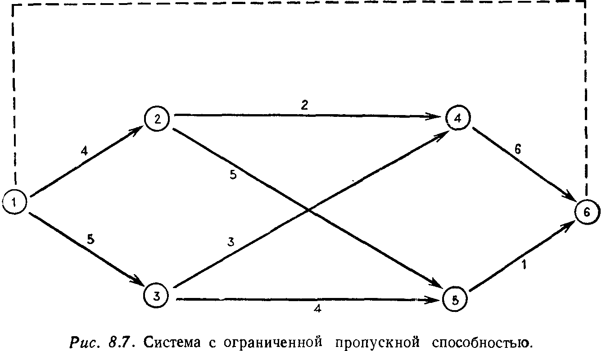
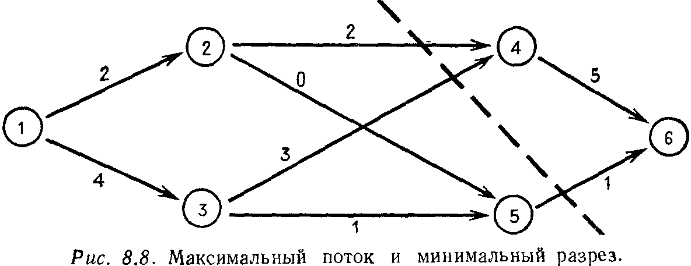
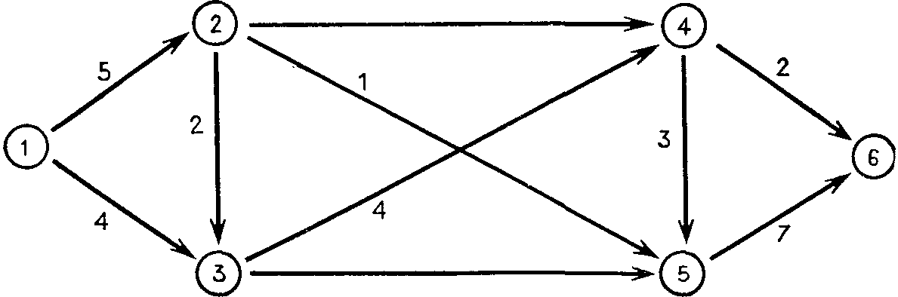
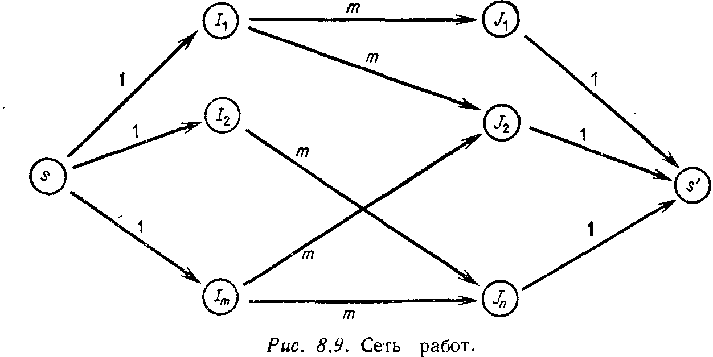

## § 8.4. СЕТЕВЫЕ МОДЕЛИ

---
**стр. 388**
---

Некоторые линейные программы имеют такую структуру, что их решение получается легко. Мы встречались уже с такой возможностью при решении линейных уравнений $Ax = b$ в гл. 1, где для ленточных матриц, ненулевые элементы которых концентрируются вокруг главной диагонали, затраты на реализацию метода исключений уменьшались до порядка $n$ вместо $n^3$. В линейном же программировании мы будем выделять специальный класс задач, известных под названием *сетевых*. Здесь также матрица $A$ будет содержать большое число нулей, а ненулевые ее элементы обычно равняются $+1$ или $-1$. (Но диагональ ничем не выделяется, поскольку матрицы являются прямоугольными.) Для этих задач шаги метода исключения требуют лишь простых операций сложения и умножения, и здесь могут решаться значительно бóльшие задачи, чем обычно. Следует отметить, однако, что число шагов в методе по-прежнему может экспоненциально возрастать в наихудшем случае (см. статью в журнале *Scientific American* за январь 1978 г. 1)), но, как и в общем симплекс-методе, это очень редко становится реальной опасностью.

Разумеется, высокая скорость решения интересует нас только тогда, когда сами задачи являются важными. Сетевые задачи имеют приложения ко всем отраслям индустриального и экономического планирования, например к распределению потоков товаров, людей, газа, нефти или воды. В качестве примера можно взять задачу о перегрузке товаров: готовая продукция должна распределяться по складам, а оттуда попадать к потребителям, и все это должно осуществляться с минимальными расходами. Источники, склады и потребители представляют собой *узлы* сети, а пути между ними называются *дугами*.

Одна модель такого сорта показана на рис. 8.7, где на каждой дуге указана ее максимальная пропускная способность. Задача состоит в получении максимального возможного потока от источника (узел 1) к стоку (узел 6). Направления потоков, указанные стрелками, не могут быть изменены; расходы на перевозку также не учитываются. Это частный случай сетевой задачи, называемый ***задачей о максимальном потоке***.

Неизвестными величинами являются потоки $x_{ij}$ из одного узла $i$ в другой узел $j$. Мы пользуемся двухиндексным обозначением для удобства, несмотря на то что $x$ является вектором. В рассмотрении участвуют только пары вида $x_{12}$, $x_{24}$, ..., $x_{56}$, соответствующие дугам, изображенным на рисунке. Если верхние

1) H. R. Lewis, C. H. Papadimitriou, The efficiency of algorithms, **302** (1978), 96—109.

---
**стр. 389**
---

пределы (пропускные способности) этих дуг равняются $u_{ij}$, то ограничения на отдельные потоки имеют вид
$$0 \leqslant x_{ij} \leqslant u_{ij} ^1).$$

В дополнение к этому существует также ограничение на каждый промежуточный узел, состоящее в равенстве входящего и выходящего потоков. Это справедливо также для источника и стока, если мы введем в рассмотрение фиктивную трубу с бесконечно большой пропускной способностью (на рисунке она обозначена пунктиром) и будем возвращать все назад от стока к источнику. Суммарный поток, поступающий в узел с номером $j$, равен $\sum\limits_{i} x_{ij}$ по всем $i$, а суммарный поток из $j$-го узла равен $\sum\limits_{k} x_{jk}$ по всем $k$. Поэтому ограничение по равновесию имеет вид
$$\sum\limits_{i} x_{ij} - \sum\limits_{k} x_{jk} = 0, \quad j = 1, 2, \dots, 6.$$

Матрица коэффициентов для этого уравнения имеет специальную структуру и называется ***матрицей инцидентности***. Каждому из шести узлов соответствует строка, и каждой из девяти дуг соответствует столбец матрицы; числа $+1$ и $-1$ полностью опи-

1) Верхняя и нижняя границы на каждую из компонент вектора $x$ называются *«ящичными» ограничениями*, что вызвано формой допустимого множества; они очень просты и хорошо исследованы.

---
**стр. 390**
---

сывают связи между узлами и дугами:
$$A = \begin{bmatrix}
1 & 1 & & & & & & & -1 \\
-1 & & 1 & 1 & & & & & \\
& -1 & & & 1 & 1 & & & \\
& & -1 & & -1 & & 1 & & \\
& & & -1 & & -1 & & 1 & \\
& & & & & & -1 & -1 & 1
\end{bmatrix}.
$$
$\quad \ \ \ \, x_{12} \quad x_{13} \quad x_{24} \quad x_{25} \quad x_{34} \quad x_{35} \quad x_{46} \quad x_{56} \quad x_{61}$
<!-- вероятная опечатка: нижние индексы к матрице A напечатаны криво, пытаюсь выровнять -->

В задаче о максимальном потоке мы стремимся сделать величину $x_{61}$ как можно большей, так что эта задача представляет собой обычную линейную программу (упр. 8.4.3) и можно пользоваться симплекс-методом. Но мы хотим воспользоваться укороченным вариантом. Читатель может определить максимальный поток, не прибегая к помощи ЭВМ, так что мы сразу перейдем к рассмотрению условия, показывающего, что поток действительно является максимальным и не может быть увеличен. Прежде всего, введем понятия ***разреза*** сети, означающего разделение всех узлов на две группы $S$ и $S'$ с источником в группе $S$ и стоком в $S'$. *Пропускной способностью* разреза назовем сумму пропускных способностей по всем дугам, идущим из $S$ в $S'$.
Например, если $S$ содержит первый и третий узлы, то пропускная способность этого разреза равна $4+3+4=11$. Поток, больший чем 11, невозможен, поскольку он не сможет пройти через разрез.

> **8K. Теорема о максимальном потоке и минимальном разрезе.** *Максимальный поток в сети равняется пропускной способности минимального разреза.*

Д о к а з а т е л ь с т в о. Неравенство в одну сторону очевидно: для произвольного потока и произвольного разреза поток не превосходит пропускной способности разреза. Никакой поток не в состоянии сделать больше, чем просто насытить все дуги, пересекающие разрез, и их общая пропускная способность является верхней гранью для потока. Эта ситуация аналогична «слабой двойственности», т. е. простому неравенству $yb \leqslant cx$, которое выполняется для любых допустимых векторах $x$ и $y$. Более трудная задача, как здесь, так и в теореме двойственности, состоит в доказательстве достижимости равенства.
Пусть некоторый поток является максимальным. Рассмотрим все дуги, которые не достигли предела пропускной способности, и пусть $S$ содержит источник, а также все узлы, которых можно

---
**стр. 391**
---

от него достичь по этим дугам. Остальные узлы образуют группу $S'$. Тогда сток будет находиться в $S'$, поскольку в противном случае поток не был бы максимальным. Более того, каждая дуга, соединяющая $S$ с $S'$, является заполненной, в противном случае узел, в который она входит, принадлежал бы группе $S$, а не $S'$. Следовательно, поток действительно наполняет разрез и равенство достигается.
Это дает нам возможность проверять, что заданный поток является максимальным; нужно лишь найти соответствующий разрез. В нашем примере максимальный поток равен 6, и соответствующий разрез изображен на рис. 8.8.

Эта теорема дает также и алгоритм решения: для любого потока нужно вычислять неиспользованную пропускную способность каждой дуги, и если сток может быть достигнут по какому-то недозаполненному пути, то нужно увеличить поток по нему до максимально возможного и вычислить результат. (Заметим, что если происходит пересылка из узла $A$ в узел $B$, то почти все может вернуться назад, не обращая при этом суммарный поток. Другими словами, в узел $A$ можно попасть из $B$.) Постепенно должен быть достигнут максимальный поток, и в случае целочисленных пропускных способностей целочисленным будет и поток, т. е. эта задача относится к *целочисленному программированию*.

**Упражнение 8.4.1.** Если мы можем увеличить пропускную способность одной из труб в сети, то какую именно нужно избрать, чтобы получить наибольшее увеличение максимального потока?

**Упражнение 8.4.2.** Найти максимальный поток и мииимальный разрез для сети, изображенной на стр 392.
<!-- вероятная опечатка оригинала: пропущена точка после "стр"; также "мииимальный" вместо "минимальный" -->

**Упражнение 8.4.3.** В задаче о максимальном потоке, вводя переменные невязки $w_{ij} = u_{ij} - x_{ij}$, максимизировать $x_{61}$ при условиях
$$
\begin{bmatrix}
A & 0 \\
I & I
\end{bmatrix}
\begin{bmatrix}
x \\
w
\end{bmatrix}
=
\begin{bmatrix}
0 \\
u
\end{bmatrix},
\quad
\begin{bmatrix}
x \\
w
\end{bmatrix}
\geqslant 0.
$$

---
**стр. 392**
---

<!-- вероятная опечатка оригинала: рисунок без подписи -->

Двойственная к этой задача содержит шесть неизвестных $y_i$ и девять неизвестных $z_{ij}$:
<!-- вероятная опечатка оригинала: "задача" вместо "задаче" -->
минимизировать $\begin{bmatrix} y & z \end{bmatrix} \begin{bmatrix} 0 \\ u \end{bmatrix} = zu \quad$ при $\quad \begin{bmatrix} y & z \end{bmatrix} \begin{bmatrix} A & 0 \\ I & I \end{bmatrix} \geqslant \begin{bmatrix} 0 & \dots & 1 & 0 \end{bmatrix}$.

Показать, что выбор $z_{ij} = 1$ для дуг, пересекающих минимальный разрез, и $z_{ij} = 0$ для остальных с $y_i = 0$ для узлов из $S$ и $y_i = 1$ для узлов из $S'$ является одновременно допустимым и оптимальным.

ЗАДАЧА О ПРОСТОМ НАЗНАЧЕНИИ

Предположим, что у нас имеется $m$ людей и $n$ работ. Каждый из людей может выполнять лишь определенные работы. Можно ли назначить всех на работу по специальности, не давая при этом одну и ту же работу разным людям?
Нетрудно найти необходимые условия, при которых такое назначение будет возможно. Во-первых, каждый из людей должен иметь по крайней мере одну специальность. Во-вторых, каждая пара людей должна иметь две различные специальности. И каждая группа из трех (или $k$) людей должна быть в состоянии выполнять по меньшей мере три (или $k$) различные работы. В противном случае цель, очевидно, не может быть достигнута. Задача состоит в том, чтобы показать, что если каждая группа удовлетворяет перечисленным выше необходимым условиям, то распределение возможно.

> **8L.** *Назначение возможно тогда и только тогда, когда каждая группа в состоянии выполнять достаточное число работ; если группа состоит из $k$ людей, то вместе они должны быть в состоянии выполнять по меньшей мере $k$ работ.*

На первый взгляд это условие выглядит чересчур слабым, поскольку один очень квалифицированный человек в состоянии помочь всей группе выполнить его. Но ведь это условие относится к *каждой* группе, включая и те, в которых этот человек не состоит. Если распределение работы невозможно, то всегда можно найти группу, для которой это условие не выполняется.

---
**стр. 393**
---

Доказательство начинается с конструирования сети, имеющей пропускную способность $m$ между каждым человеком и работами, которые он может выполнять. Затем люди подключаются к источнику, а работы к стоку при помощи дуг с пропускной способностью 1 (рис. 8.9). Если в результате суммарный поток будет

равен $m$, то все дуги от источника будут заполнены и все будут иметь работу.
Предположим, что максимальный поток оказался меньшим, чем $m$. Тогда должен существовать разрез с пропускной способностью, меньшей $m$, например, такой, что в группе $S$ содержатся источник и узлы $I_1, \dots, I_k, J_1, \dots, J_l$. Ни один из этих $k$ людей не в состоянии выполнять другие работы, поскольку в противном случае нашлась бы дуга с пропускной способностью $m$, пересекающая разрез. Следовательно, пропускная способность разреза равняется $m - k$ (от источника к оставшимся людям) плюс $l$ (от этих работ к стоку), что дает в сумме $m - k + l$; эта величина будет меньше $m$ при $l < k$. Следовательно, мы нашли группу из $k$ людей, которая может выполнять лишь $l < k$ работ. Если назначение оказывается невозможным — поток оказался меньше, чем $m$, — то это означает, что какая-то группа людей сдерживает его.

**Упражнение 8.4.4.** Предположим, что каждый человек может выполнять по две работы и не существует трех людей с одной и той же специальностью. Доказать, что в этом случае назначение возможно.

**Упражнение 8.4.5.** Предположим, что имеется бесконечно много людей и работ. Первый человек может выполнить любую работу, а для последующих $(i+1)$-й человек имеет только $i$-ю специальность. Показать, что каждая группа из $k$ людей может выполнять по меньшей мере $k$ работ, но распределить всех на работу невозможно.
<!-- вероятная опечатка оригинала: "k людей" напечатано как "k'людей", исправлено -->

---
**стр. 394**
---

Задача о простом назначении называется также задачей о ***бракосочетании***. Каждая девушка выбирает только определенных юношей. Чтобы каждая девушка вышла замуж, каждая группа из $k$ девушек ($k = 1, 2, \dots$) должна любить по меньшей мере $k$ юношей — и этого достаточно. Я не знаю, что произойдет, если юноши также захотят выбирать. По крайней мере будет более реалистично, если девушки будут иметь шкалу предпочтений вместо простого «да» или «нет» и если у нанимаемых на работу людей также будут градации, когда $i$-й человек имеет коэффициент $a_{ij}$ для $j$-й работы, причем $a_{ij}=0$ в случае полного отсутствия соответствующей квалификации. Это приводит к задаче об *оптимальном назначении*: максимизировать сумму коэффициентов пригодности при данных работах. Эта задача также является линейной программой: максимизировать $\sum\sum a_{ij} x_{ij}$, когда на одной работе занят один человек и имеется по одной работе на человека.

Другой известный пример дает ***задача о коммивояжере***. Начиная от своего дома, он должен посетить $n - 1$ городов и вернуться домой. Если расстояние (или стоимость проезда) от одного города $i$ до другого города $j$ равняется $a_{ij}$, то коммивояжер должен минимизировать $\sum\sum a_{ij} x_{ij}$ при условиях, что он должен посетить каждый город по одному разу:
$$\sum_{i} x_{ij} = 1, \quad \sum_{j} x_{ij} = 1, \quad x_{ij} \geqslant 0.$$

Такая постановка не вполне корректна, поскольку решение задачи может представлять собой отдельные группы и быть замкнутым внутри них, так что, выехав из дома, коммивояжер никогда не попадает во все требуемые города. Поэтому необходимо ввести дополнительные ограничения, и их оказывается так много, что эта на первый взгляд простая задача становится на самом деле исключительно трудной.

Соответствующая сетевая задача состоит в отыскании кратчайшего пути от источника к стоку. На каждой дуге задается время перехода $t_{ij}$ и рассматривается двойственная задача: каждому узлу соответствует минимальное время $y_i$, и мы максимизируем $y$ для стока при условиях
$$y_j - y_i \leqslant t_{ij} \quad \text{и} \quad y = 0 \text{ у источника.}$$

Эта задача может быть решена методами ***динамического программирования***. Начиная от источника, мы находим минимальное время, требуемое для достижения соседнего узла, и постепенно движемся вперед; сделать это легко, если циклы в сети запрещены. Существенным принципом в динамическом программировании является принцип рекурсивной оптимизации: оптимальный путь от источника к стоку одновременно является
