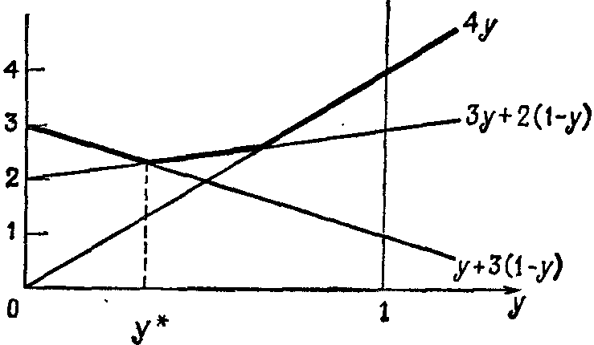

## § 8.5. ТЕОРИЯ ИГР И ТЕОРЕМА О МИНИМАКСЕ

---
**стр. 395**
---

оптимальным путем от источника к любому узлу на этом пути и от этого узла к стоку. Каково бы ни было текущее состояние, оставшиеся решения должны быть оптимальными. В результате задача разбивается на простые части.

Отметим также **задачу о перевозках**, т. е. о сетевом потоке от производителей к рынкам без промежуточных точек. Производство $i$ дает продукцию в количестве $s_i$, а потребность на рынке $j$ равняется $d_j$; перевозка одной единицы продукции между ними стоит $c_{ij}$. Следовательно, посылаемые количества $x_{ij}$ должны удовлетворять неравенствам
$$
\sum_j x_{ij} \leqslant s_i, \qquad \sum_i x_{ij} \geqslant d_j, \qquad x_{ij} \geqslant 0.
$$
Для оптимальности перевозок мы будем минимизировать величину $\sum \sum c_{ij}x_{ij}$.

**Упражнение 8.4.6.** Если числа в упр. 8.4.2 представляют собой время на перевозки, то как будет выглядеть кратчайший путь от источника к стоку? Найти минимальные значения времени $y_i$ для всех других узлов (частный случай динамического программирования) и объяснить, почему на каждой дуге выполняется неравенство $y_j - y_i \leqslant t_{ij}$.

**Упражнение 8.4.7.** Решить задачу о перевозках, когда имеются два производства с объемами $s_i = 6$, три рынка с потребностями $d_j = 4$ и стоимости перевозок $a_{ij}$ образуют матрицу
$$
A = \begin{bmatrix}
1 & 3 & 6 \\
2 & 4 & 8
\end{bmatrix}.
$$

**Упражнение 8.4.8.** Какие условия на производство и потребление являются допустимыми условиями задачи о перевозках?

**§ 8.5. ТЕОРИЯ ИГР И ТЕОРЕМА О МИНИМАКСЕ**

Матричную игру лучше всего объяснить на примере.

**Пример 1.** В игре участвуют двое и правила остаются неизменными:

Игрок $X$ поднимает вверх одну или обе руки, и независимо от него то же самое делает и игрок $Y$. Если их решения совпали, то $Y$ получает 10 долларов. Если они приняли разные решения, то выигрывает $X$, причем он получает 10 долларов, если он поднял вверх одну руку, и 20 долларов, если обе. Суммарный выигрыш игрока $X$ легко можно записать в виде матрицы
$$
A = \begin{bmatrix}
-10 & 20 \\
10 & -10
\end{bmatrix}
\begin{array}{l}
\text{одна рука у } Y \\
\text{обе руки у } Y
\end{array}.
$$
$$
\begin{matrix}
\text{одна} & \text{обе} \\
\text{рука} & \text{руки} \\
\text{у } X & \text{у } X
\end{matrix}
$$

---
**стр. 396**
---

Если немного подумать, то примерная стратегия станет очевидной. Ясно, что игрок $X$ не будет играть одинаково все время, иначе $Y$ будет копировать его и выиграет все. Аналогично игрок $Y$ не может придерживаться одной стратегии, иначе $X$ будет поступать наоборот. Оба игрока должны использовать *смешанную стратегию*, и, более того, выбор в каждой партии должен быть абсолютно независимым от предыдущих партий. В противном случае, если другой игрок заметит некоторую систему, он получит преимущество. Даже стратегия типа «придерживаться одного и того же выбора до тех пор, пока идет выигрыш, и менять стратегию после первого проигрыша» является, очевидно, бесполезной. После достаточного числа партий партнер будет знать точно, что вы будете делать. Таким образом, игроки оказываются в следующей ситуации: игрок $X$ решает, что он будет поднимать одну руку с частотой $x_1$ (тогда он поднимает обе руки с частотой $x_2 = 1 - x_1$, и в каждой партии это решение является случайным), а $Y$ выбирает *свои* вероятности $y_1$ и $y_2 = 1 - y_1$. Как мы видели, ни одна из этих вероятностей не должна равняться 0 или 1; в противном случае соперник подстроится и начнет выигрывать. В то же время сомнительно, что все вероятности должны быть равны $1/2$, поскольку игрок $Y$ будет проигрывать по 20 долларов слишком часто. (Он будет терять 20 долларов в $1/4$ всех партий, 10 долларов еще в $1/4$ и выигрывать 10 долларов в половине партий, т. е. в среднем на одной партии будет терять 2,5 доллара.) Но чем сильнее игрок $Y$ будет тяготеть к стратегии «двух рук», тем настойчивее игрок $X$ будет придерживаться стратегии «одной руки».

Вся задача состоит *в отыскании равновесия*. Существует ли такая смешанная стратегия $y_1$ и $y_2$, что, будучи надлежащим образом использованной игроком $Y$, она лишит $X$ всяких преимуществ? Аналогичным образом может ли игрок $X$ выбрать такие вероятности $x_1$ и $x_2$, что для $Y$ не будет смысла избирать свою стратегию? В такой точке равновесия, если она вообще существует, средний выигрыш игрока $X$ достигает *седловой точки*: он является максимальным для $X$ и минимальным для $Y$. Отыскать такую точку — значит «решить» игру.

Точку зрения игрока $X$ можно изложить следующим образом: он формирует новый столбец из соответствующих столбцов матрицы, взятых с весами $x_1$ и $1 - x_1$. Пусть, например, он выбрал веса $3/5$ и $2/5$. Тогда столбец будет иметь вид
$$
\frac{3}{5}\begin{bmatrix} -10 \\ 10 \end{bmatrix} + \frac{2}{5}\begin{bmatrix} 20 \\ -10 \end{bmatrix} = \begin{bmatrix} 2 \\ 2 \end{bmatrix}.
$$
**При таком выборе игрок $Y$ будет терять 2 доллара независимо от своей стратегии.** Плата по-прежнему равняется 10 и 20 долларам. Но если игрок $Y$ будет упорно подни-

---
**стр. 397**
---

мать одну руку, то он будет выигрывать по 10 долларов в течение $3/5$ всего времени и проигрывать по 20 долларов в течение $2/5$ всего времени, что дает средний проигрыш в размере 2 долларов на партию. Если $Y$ будет поднимать обе руки или выберет смешанную стратегию в любой пропорции, он все равно будет терять по 2 доллара.

Но это не означает, что для игрока $Y$ все стратегии являются оптимальными! Если он ленив и будет продолжать поднимать одну руку, то $X$ изменит стратегию и начнет выигрывать по 20 долларов. Тогда $Y$ изменит стратегию, и то же самое сделает $X$. В конце концов, если оба игрока являются достаточно опытными, то как $Y$, так и $X$ придут к оптимальной смешанной стратегии. Это означает, что игрок $Y$ будет комбинировать строки матрицы с весами $y_1$ и $1 - y_1$, пытаясь получить новую строку, которая была бы как можно меньшей:
$$
y_1 \begin{bmatrix} -10 & 20 \end{bmatrix} + (1 - y_1)\begin{bmatrix} 10 & -10 \end{bmatrix} = \begin{bmatrix} 10 - 20y_1 & -10 + 30y_1 \end{bmatrix}.
$$
В данном случае наилучшая стратегия состоит в том, чтобы сделать обе компоненты равными: $10 - 20y_1 = -10 + 30y_1$, откуда $y_1 = 2/5$. При таком выборе обе компоненты равняются 2 и новая строка имеет вид $\begin{bmatrix} 2 & 2 \end{bmatrix}$. Поэтому *при такой стратегии игрок $Y$ не может терять больше, чем 2 доллара*. Игрок $Y$ минимизировал свой *максимальный* проигрыш, и этот минимакс (2 доллара) совпадает с максимином, найденным независимо от него игроком $X$. *Цена игры* и равняется этому минимаксу или максимину, т. е. 2 долларам.

Эта седловая точка замечательна тем, что в ней игрок $X$ пользуется своей второй стратегией лишь на протяжении $2/5$ всего времени, хотя она дает ему возможность выигрывать 20 долларов. В то же время игрок $Y$ вынужден принять проигрышную стратегию — он должен был бы повторять действия игрока $X$, но вместо этого он играет с противоположными вероятностями $2/5$ и $3/5$. Можно проверить, что $X$ выигрывает 10 долларов с частотой $3/5 \cdot 3/5 = 9/25$, 20 долларов с частотой $2/5 \cdot 2/5 = 4/25$ и проигрывает 10 долларов с оставшейся частотой $12/25$. Как и следовало ожидать, это дает ему средний выигрыш в размере 2 долларов.

Укажем на одну ошибку, которую легко можно сделать. Оптимальная комбинация строк не всегда дает строку с равными компонентами. Пусть, например, игрок $X$ может, кроме того, поднимать вверх три руки и выигрывать при этом 60 долларов, если $Y$ поднимает одну руку, и 80 долларов, если $Y$ поднимает две руки. Платежная матрица при этом будет иметь вид
$$
A = \begin{bmatrix}
-10 & 20 & 60 \\
10 & -10 & 80
\end{bmatrix}.
$$

---
**стр. 398**
---

Игрок $X$ все время выбирает эту новую стратегию, т. е. веса при столбцах фиксированы и равны $x_1 = 0$, $x_2 = 0$, $x_3 = 1$, и его минимальный выигрыш при этом составляет 60 долларов. Игрок $Y$ подбирает такую комбинацию строк, которая дает строку с минимальными компонентами, т. е. выбирает первую строку и его максимальные потери равны 60 долларам. Поэтому мы также получим равенство минимакса и максимина, но седловая точка при этом будет сдвинута в угол.

Правило состоит в том, что при оптимальной комбинации строк для игрока $Y$ цена игры оказывается (как было для двух и для шестидесяти долларов) расположенной только в столбцах, которые фактически используются игроком $X$. Аналогичным образом при оптимальной комбинации столбцов для игрока $X$ то же самое значение находится в тех строках, которые включаются в наилучшую стратегию игрока $Y$, — другие строки дают более высокое значение и $Y$ избегает их. Это правило в точности соответствует условию совместности невязок в линейном программировании.

**Упражнение 8.5.1.** Как изменятся оптимальные стратегии, если ставка будет увеличена с 20 до 70 долларов, и чему равняется новая цена игры (средний выигрыш игрока $X$)?

**Упражнение 8.5.2.** Пусть платежная матрица имеет вид $A = \begin{bmatrix} 1 & 2 \\ 3 & 4 \end{bmatrix}$. Объяснить, как игрок $X$ подсчитывает свой максимин и как $Y$ подсчитывает свой минимакс. Каковы оптимальные стратегии $x^*$ и $y^*$?

**Упражнение 8.5.3.** Пусть некоторый $a_{ij}$ является наибольшим элементом в строке и наименьшим в столбце. Объяснить, почему игрок $X$ всегда выбирает столбец $j$, а игрок $Y$ всегда выбирает строку $i$ (независимо от того, каковы остальные элементы матрицы)? Показать, что в предыдущем упражнении матрица содержит такой элемент, и построить матрицу, не содержащую его.

**Упражнение 8.5.4.** Найти наилучшую стратегию для игрока $Y$, если
$$
A = \begin{bmatrix}
3 & 4 & 1 \\
2 & 0 & 3
\end{bmatrix},
$$
путем комбинирования строк с весами $y$ и $1 - y$ и нарисовать все три компоненты.

---
**стр. 399**
---

Игрок $X$ будет придерживаться наибольшей компоненты (жирная линия), а $Y$ должен минимизировать этот максимум. Чему равен $y^*$ и какова высота этого минимакса (пунктирная линия)?

**Упражнение 8.5.5.** При той же самой матрице $A$ найти наилучшую стратегию для игрока $X$ и показать, что он использует только два столбца (первый и третий) и соответствующие прямые пересекаются в точке минимакса.

**Упражнение 8.5.6.** Найти обе оптимальные стратегии и цену игры, если
$$
A = \begin{bmatrix}
1 & 0 & -1 \\
-2 & -1 & 2
\end{bmatrix}.
$$

**Упражнение 8.5.7.** Пусть $A = \begin{bmatrix} a & b \\ c & d \end{bmatrix}$. Какие веса $x_1$ и $1 - x_1$ дадут столбец вида $\begin{bmatrix} u \\ u \end{bmatrix}$ и какие веса $y_1$ и $1 - y_1$ для двух строк дадут новую строку $\begin{bmatrix} v & v \end{bmatrix}$? Показать, что $u = v$.

**ТЕОРЕМА О МИНИМАКСЕ**

Наиболее общая матричная игра выглядит в точности так же, как и наш простой пример, за исключением одного важного пункта: игрок $X$ имеет выбор из $n$ возможностей, а $Y$ — из $m$. Поэтому матрица платежа $A$, остающаяся неизменной в каждой партии, может иметь $m$ строк и $n$ столбцов. Каждый ее элемент $a_{ij}$ представляет собой выигрыш игрока $X$ при выборе им $j$-й стратегии, в то время как игрок $Y$ избрал $i$-ю стратегию. Отрицательный элемент просто означает отрицательную плату, т. е. выигрыш для $Y$. Результат все равно остается *игрой двух лиц, имеющей нулевую сумму*: проигрыш одного игрока означает выигрыш другого. Но теперь существование равновесной седловой точки далеко не очевидно.

Как и в приведенном примере, игрок $X$ может выбрать любую смешанную стратегию $x = (x_1, \ldots, x_n)$. Эта стратегия всегда является вектором вероятности: величины $x_i$ неотрицательны и их сумма равна 1. Эти компоненты дают частоты для $n$ различных чистых стратегий, и в каждой партии игрок $X$ выбирает их при помощи некоторого рандомизатора — устройства, генерирующего $i$-ю стратегию с частотой $x_i$. Одновременно с этим игрок $Y$ должен принять аналогичное решение: он выбирает вектор-строку $y = (y_1, \ldots, y_m)$, удовлетворяющий условиям $y_i \geqslant 0$ и $\sum y_i = 1$, который дает частоты его собственной смешанной стратегии.

Предсказать результат одной партии невозможно, поскольку он является случайным. В среднем, однако, комбинация $j$-й стратегии для игрока $X$ с $i$-й стратегии для $Y$ будет иметь вероятность $x_j y_i$, равную произведению двух отдельных вероятностей. Если она реализуется, то выигрыш будет равен $a_{ij}$. Следовательно,

---
**стр. 400**
---

ожидаемый от этой комбинации выигрыш для игрока $X$ равен $a_{ij} x_j y_i$ и *ожидаемый общий выигрыш партии* равен $\sum \sum a_{ij} x_j y_i$. Подчеркнем еще раз, что любой (в том числе и все) элемент $a_{ij}$ может быть отрицательным, правила одинаковы для обоих игроков и выигрыш зависит от элементов $a_{ij}$.

Ожидаемый выигрыш имеет очень простую матричную запись, поскольку двойная сумма $\sum \sum a_{ij} x_j y_i$ равна $yAx$ в силу правила умножения матриц:
$$
yAx = \begin{bmatrix} y_1 & \ldots & y_m \end{bmatrix} \begin{bmatrix}
a_{11} & a_{12} & \ldots & a_{1n} \\
\cdot & \cdot & & \cdot \\
\cdot & \cdot & & \cdot \\
\cdot & \cdot & & \cdot \\
a_{m1} & a_{m2} & \ldots & a_{mn}
\end{bmatrix} \begin{bmatrix}
x_1 \\
x_2 \\
\cdot \\
\cdot \\
\cdot \\
x_n
\end{bmatrix} = a_{11} x_1 y_1 + \ldots + a_{mn} x_n y_m.
$$
Именно эту величину $yAx$ игрок $X$ пытается максимизировать, а игрок $Y$ — минимизировать.

**Пример 2.** Пусть $A$ есть единичная матрица порядка $n$, $A = I$. Тогда ожидаемый выигрыш равен $xIy = x_1 y_1 + \ldots + x_n y_n$ <!-- вероятная опечатка оригинала: xIy вместо yIx --> и идею игры легко объяснить: игрок $X$ пытается сделать тот же выбор, что и $Y$, поскольку в этом случае он получает $a_{ii} = 1$ доллар. В то же самое время игрок $Y$ пытается сделать другой выбор, чтобы не дать игроку $X$ выиграть и не платить: вне диагонали единичной матрицы стоят нули, и если $X$ выбирает $i$-й столбец, то $Y$ выбирает другую строку $j$. Если игрок $X$ выбирает одну из стратегий чаще, чем любую другую, то $Y$ чаще может уйти от поражения. Поэтому оптимальной стратегией будет $x^* = (1/n, 1/n, \ldots, 1/n)$. Аналогично игрок $Y$ не может делать упор на какую-либо определенную стратегию, иначе $X$ получит преимущество, и поэтому его оптимальный выбор также состоит в выборе равных вероятностей, сумма которых равняется 1, $y^* = (1/n, 1/n, \ldots, 1/n)$. Вероятность того, что оба игрока изберут $i$-ю стратегию, равна $(1/n)^2$, и сумма по всем таким комбинациям дает ожидаемый выигрыш для $X$. Общая цена игры есть $n \times (1/n)^2$, или $1/n$, что подтверждается вычислением:
$$
y^*Ax^* = \begin{bmatrix} 1/n & \ldots & 1/n \end{bmatrix} \begin{bmatrix}
1 & & \\
& \ddots & \\
& & 1
\end{bmatrix} \begin{bmatrix}
1/n \\
\cdot \\
\cdot \\
1/n
\end{bmatrix} =
$$
$$
= \left(\frac{1}{n}\right)^2 + \ldots + \left(\frac{1}{n}\right)^2 = \frac{1}{n}.
$$

---
**стр. 401**
---

Когда число $n$ возрастает, игрок $Y$ получает больший шанс на «спасение».

Заметим, что симметричность матрицы не гарантирует справедливости игры для обоих игроков. На самом деле верно прямо противоположное: игра будет совершенно справедливой, когда матрица является *кососимметрической*, т. е. $A^\text{T} = -A$. При такой матрице оба игрока находятся в равных условиях, поскольку выбор игроком $X$ $j$-й стратегии при выборе $i$-й стратегии игроком $Y$ дает выигрыш в размере $a_{ij}$ игроку $X$, а выбор стратегии $j$ игроком $Y$ и стратегии $i$ игроком $X$ дает тот же выигрыш $a_{ij}$ игроку $Y$ (поскольку $a_{ji} = -a_{ij}$). Оптимальные стратегии $x^*$ и $y^*$ должны совпадать, и ожидаемый выигрыш должен равняться $y^*Ax^* = 0$. Цена игры при $A^\text{T} = -A$ равняется нулю.

**Пример 3.**
$$
A = \begin{bmatrix}
0 & 1 & 1 \\
-1 & 0 & 1 \\
-1 & -1 & 0
\end{bmatrix}.
$$

Игра состоит в том, что оба игрока $X$ и $Y$ выбирают число между 1 и 3, и тот, кто выбрал меньшее, выигрывает 1 доллар. (Если игрок $X$ выбрал число 2 и $Y$ выбрал 3, то выигрыш равен $a_{23} = 1$ доллару. Если же они выбирают одно и то же число, то мы будем находиться на главной диагонали матрицы и ни один из игроков не выигрывает.) Очевидно, что ни один из игроков не выберет число 2 или 3, поскольку другой игрок может выбрать меньшее. Следовательно, чистые стратегии $x^* = y^* = (1, 0, 0)$ являются оптимальными — оба игрока каждый раз выбирают единицу — и цена игры равна $y^*Ax^* = a_{11} = 0$.

Следует отметить, что матрица, оставляющая все решения неизменными, является не единичной матрицей, а матрицей $E$, у которой *каждый* элемент $e_{ij}$ равен единице. Добавление кратного матрицы $E$ к платежной матрице, $A \to A + \alpha E$, просто означает, что игрок $X$ будет выигрывать дополнительную сумму $\alpha$ в каждой партии. Цена игры увеличивается на $\alpha$, но $x^*$ и $y^*$ остаются прежними.

Теперь мы возвращаемся к общей теории, приняв для начала точку зрения игрока $X$. Пусть он выбирает смешанную стратегию $x = (x_1, \ldots, x_n)$. Тогда игрок $Y$ постепенно поймет эту стратегию и выберет свою стратегию таким образом, чтобы минимизировать потери $yAx$. В результате игрок $X$ получит $\min_y yAx$. Опытный игрок $X$ выберет такой вектор $x^*$ (быть может, не единственный), который *максимизирует этот минимум*. Сделав этот

---
**стр. 402**
---

выбор, игрок $X$ может быть уверен в том, что его выигрыш окажется не меньше, чем
$$
\min_y yAx^* = \max_x \min_y yAx. \tag{14}
$$
На большее он рассчитывать не может.

Игрок $Y$ поступает противоположным образом. При любой из своих собственных стратегий $y$ он должен ожидать, что игрок $X$ найдет вектор, максимизирующий $yAx^{1)}$. Поэтому $Y$ должен выбрать смешанную стратегию $y^*$, минимизирующую этот максимум и гарантирующую, что он потеряет не больше, чем
$$
\max_x y^*Ax = \min_y \max_x yAx. \tag{15}
$$
Ничего лучшего игроку $Y$ не придумать.

Надеюсь вы уже догадались, каков будет результат, если все это вообще верно. Мы хотим, чтобы величина (14) гарантированного выигрыша игрока $X$ совпадала с величиной потерь (15) игрока $Y$. Тогда смешанные стратегии $x^*$ и $y^*$ дадут равновесную седловую точку и игра будет решена: при любых стратегиях, не совпадающих с $x^*$ и $y^*$, оба игрока будут лишь ухудшать свое положение. Существование этой седловой точки было доказано фон Нейманом и носит название теоремы о минимаксе:

**8N.** Для произвольной матрицы $A$ размера $m \times n$ минимакс по всем смешанным стратегиям совпадает с максимином:
$$
\max_x \min_y yAx = \min_y \max_x yAx. \tag{16}
$$
Эта величина является ценой игры. Если максимум в левой части достигается в точке $x^*$, а минимум в правой части — в точке $y^*$, то эти стратегии являются оптимальными и они дают седловую точку, покидать которую не имеет смысла:
$$
y^* Ax \leqslant y^* Ax^* \leqslant y Ax^* \text{ для всех } x \text{ и } y. \tag{17}
$$

В седловой точке вектор $x^*$ во всяком случае «не хуже» любого другого вектора $x$ (поскольку $y^* Ax \leqslant y^* Ax^*$). Аналогично второй игрок будет лишь проигрывать больше, если он отойдет от стратегии $y^*$.

Так же как и в теории двойственности, мы можем начать с одностороннего неравенства $\max \min \leqslant \min \max$. Это просто

$^{1)}$ Этот вектор может не совпадать с $x^*$. Если игрок $Y$ выбирает нерациональную стратегию, то $X$ может получить больше, чем ему гарантирует формула (14). В теории игр мы предполагаем, что оба игрока являются профессионалами.

---
**стр. 403**
---

комбинация определений (14) для $x^*$ и (15) для $y^*$:
$$
\max_x \min_y yAx = \min_y yAx^* \leqslant y^* Ax^* \leqslant \max_x y^* Ax = \min_y \max_x yAx. \tag{18}
$$
Это означает, что если игрок $X$ с гарантией выигрывает не меньше, чем $\alpha$, а $Y$ с гарантией теряет не больше, чем $\beta$, то обязательно $\alpha \leqslant \beta$. Заслугой фон Неймана было то, что он доказал равенство $\alpha = \beta$. Это и есть теорема о минимаксе. Она означает, что в (18) везде должны стоять равенства, а свойство седловой точки (17) выводится из этого в упр. 8.4.6.

Самое замечательное здесь то, что при доказательстве используется в точности такая же техника, как и в теории линейного программирования. Интуитивно это почти очевидно: игроки $X$ и $Y$ играют «двойственные» роли и оба выбирают стратегии из «допустимого множества» векторов вероятности $x_i \geqslant 0$, $\sum x_i = 1$, $y_i \geqslant 0$, $\sum y_i = 1$. Удивительно, что даже фон Нейман не сразу заметил, что обе теории совпадают. Он доказал теорему о минимаксе в 1928 году, линейное программирование появилось около 1947 года, а первое доказательство теоремы двойственности было дано Гейлом, Куном и Такером в 1951 году — и оно опиралось на работы фон Неймана! Их доказательство было опубликовано в той же книге, в которой Данциг показал эквивалентность линейных программ и матричных игр, так что на самом деле мы обращаем реальную историческую последовательность событий, выводя теорему о минимаксе из двойственности:

В общих чертах теорему о минимаксе можно доказать следующим образом. Пусть $b = (1, \ldots, 1)^T$ — вектор-столбец длины $m$ и $c = (1, \ldots, 1)$ — вектор-строка длины $n$. Рассмотрим двойственные линейные программы

**(P)** минимизировать $cx$ при условиях $Ax \geqslant b$, $x \geqslant 0$

**(D)** максимизировать $yb$ при условиях $yA \leqslant c$, $y \geqslant 0$.

Для применения двойственности мы должны быть уверены, что обе задачи являются допустимыми, так что при необходимости мы добавляем ко всем элементам матрицы $A$ одно и то же большое число $\alpha$. Это не может изменить оптимальные стратегии в игре, поскольку каждая выплата увеличивается на $\alpha$ и то же самое происходит с величинами $\min \max$ и $\max \min$. Для измененной матрицы, которую мы по-прежнему обозначаем через $A$, вектор $y = 0$ является допустимым вектором двойственной задачи и любой достаточно большой вектор $x$ будет допустимым для исходной задачи.

Теперь из теоремы двойственности для линейного программирования следует, что существуют векторы $x^*$ и $y^*$, удовлетворяющие равенству $cx^* = y^*b$. Поскольку $b$ и $c$ состоят из единиц,

---
**стр. 404**
---

получаем $\sum x_i = \sum y_i$. Если эти суммы равняются $\theta$, то деление на $\theta$ делает эти суммы равными 1, и в результате смешанные стратегии $x^*/\theta$ и $y^*/\theta$ являются *оптимальными в теории игр*. Для любых других смешанных стратегий $x$ и $y$
$$
Ax^* \geqslant b \text{ влечет за собой } yAx^* \geqslant yb = 1
$$
и
$$
y^*A \leqslant c \text{ влечет за собой } y^* Ax \leqslant cx = 1.
$$
Отметим, что $y^* Ax \leqslant 1 \leqslant yAx^*$. Это означает, если мы разделим неравенство на $\theta$, что игрок $X$ не может выиграть больше, чем $1/\theta$, против стратегии $y^*/\theta$ и что игрок $Y$ не может проиграть меньше, чем $1/\theta$, против стратегии $x^*/\theta$. Следовательно, именно эти стратегии и нужно выбрать, так что $\min \max = \max \min = 1/\theta$.

Это завершает теорию. Но мы не дали ответа на самый естественный вопрос: какие игры в обычном смысле слова эквивалентны нашим «матричным играм»? Например, подпадают ли под теорию фон Неймана шахматы, бридж, покер?

На мой взгляд, игра в шахматы не подходит по двум причинам. Во-первых, стратегия белых фигур состоит не просто из движения вперед. Она должна включать решение вопроса о том, как ответить на первый ход черных фигур, а затем — как ответить на их второй ход и т. д. до конца игры. На каждом шаге количество возможностей таково, что игрок $X$ имеет миллиарды чистых стратегий и то же самое справедливо для его противника. Поэтому числа $m$ и $n$ являются недопустимо большими. Более того, случай здесь практически не играет роли. Если белые смогут найти выигрышную стратегию или если черные смогут найти стратегию защиты — что до сих пор не было сделано, — то игре в шахматы придет конец. Разумеется, в нее будут продолжать играть, как в крестики-нолики, но интерес сильно поубавится.

В отличие от шахмат, в бридже содержится некоторый элемент хитрости, заключающийся в некоторых специальных ухищрениях. Поэтому его можно рассматривать как матричную игру. К сожалению, числа $m$ и $n$ вновь оказываются фантастически большими, но, возможно, отдельный элемент игры и может быть проанализирован на оптимальную стратегию.

С другой стороны, «Черный Джек»$^{1)}$ не является матричной игрой (по крайней мере вариант, употребляемый в казино), поскольку в заведении действуют определенные правила. Когда мой приятель Эд Торп нашел и опубликовал выигрышную стратегию (что привело к изменению правил игры в Лас-Вегасе), его метод был основан на прослеживании перемещения карт, уже открытых в процессе игры. Элемент случайности полностью отсутствовал, и поэтому никакой смешанной стратегии $x^*$ не существовало.

$^{1)}$ Карточная игра. — *Прим. перев.*

---
**стр. 405**
---

Существует также так называемая *дилемма заключенного*, состоящая в следующем. Двое сообщников арестованы, и перед каждым из них стоит дилемма: если он сознается, то его освободят, но при условии, что другой не сознается (и получит при этом 10 лет). Если сознаются оба, то они получат по 6 лет каждый. Но если ни один из них не сознается, то им можно дать лишь по 2 года, поскольку доказанное преступление не является тяжелым. Что делать в этой ситуации? Желание сознаться очень велико, но если они могут положиться друг на друга, то они выкарабкаются. Эта игра имеет ненулевую сумму: потерять могут оба.

Отличным примером матричной игры является *покер*. Блефование является существенной частью хорошего покера, и для эффективности оно должно быть непредсказуемым. Это означает, что решение блефовать должно приниматься совершенно случайным образом, если мы принимаем фундаментальное предположение теории игр о том, что противник является опытным, иначе он обнаружит систему и будет выигрывать. Вероятности за и против блефования будут зависеть от известных карт и от размеров ставок — как от сделанных, так и от тех, которые предстоит сделать. Фактически число вариантов вновь оказывается таким, что отыскание наилучшей возможной стратегии $x^*$ совершенно нереально. Тем не менее хороший игрок в покер должен играть очень близко к $x^*$. Эта стратегия может быть вычислена точно, если мы предельно упростим игру:

Игрок $X$ получает при сдаче валета или короля с равными вероятностями, в то время как игрок $Y$ всегда получает даму. Посмотрев на свою карту, игрок $X$ может либо бросить ее и проиграть поставленный доллар, либо поставить еще два доллара. Если $X$ делает ставку, то $Y$ может либо бросить свою карту и проиграть поставленный доллар, либо ответить двумя долларами и увидеть, открыв карты, блефовал игрок $X$ или нет. В итоге старшая карта выиграет 3 доллара, поставленные противником.

Даже в этой простой игре возможные «чистые стратегии» не так уж легко найти, но сделать это будет полезно. Игрок $Y$ имеет только две возможности, так как он лишь отвечает на действия игрока $X$:

1) если $X$ ставит, то $Y$ бросает свою карту,
2) если $X$ ставит, то $Y$ отвечает и идет на 3 доллара.

Игрок $X$ может использовать четыре стратегии, некоторые из них разумные, а некоторые — нет:

1) он ставит 2 доллара, имея на руках короля, и бросает карту, имея валета,
2) он ставит в любом случае (блефует),

---
**стр. 406**
---

3) он бросает карту в любом случае и проигрывает 1 доллар,
4) он бросает карту, имея на руках короля, и ставит, имея валета.

Составление платежной матрицы требует некоторого терпения:

$a_{11} = 0$, так как игрок $X$ теряет один доллар в половине случаев на валете и выигрывает на короле ($Y$ бросает карту).

$a_{21} = 1$, так как игрок $X$ теряет один доллар в половине случаев и выигрывает 3 доллара также в половине случаев (поскольку $Y$ пытается обыграть его, даже если $X$ имеет короля).

$a_{12} = 1$, так как игрок $X$ ставит, а $Y$ бросает карту (блеф удается).

$a_{22} = 0$, так как игрок $X$ выигрывает 3 доллара на короле и проигрывает 3 доллара на валете (блеф срывается).

При третьей стратегии всегда теряется доллар, четвертая также не приводит к успеху. В результате матрица $A$ будет иметь вид
$$
A = \begin{bmatrix} 0 & 1 & -1 & 0 \\ 1 & 0 & -1 & -2 \end{bmatrix}.
$$

Оптимальной стратегией для игрока $X$ в этой игре будет блефование в половине случаев, $x^* = (1/2, 1/2, 0, 0)$, а подчинившийся игрок $Y$ должен выбрать $y^* = (1/2, 1/2)$. Цена игры равна 50 центам.

Странно заканчивать книгу таким образом, обучая упрощенному варианту игры в покер, но я думаю, что и покер должен иметь свое место в линейной алгебре и ее приложениях.

**Упражнение 8.5.8.** Найти $x^*$, $y^*$ и цену игры $v$ для матрицы
$$
A = \begin{bmatrix} 1 & 0 & 0 \\ 0 & 2 & 0 \\ 0 & 0 & 3 \end{bmatrix}.
$$

**Упражнение 8.5.9.** Вычислить $\min_{y_i \geqslant 0, y_1+y_2=1} \max_{x_i \geqslant 0, x_1+x_2=1} (x_1y_1 + x_2y_2)$.

**Упражнение 8.5.10.** Объяснить каждое из неравенств в (18). Затем, после того как теорема о минимаксе превращает их в равенства, объяснить соотношения для седловой точки (17).

**Упражнение 8.5.11.** Показать, что $x^* = (1/2, 1/2, 0, 0)$ и $y^* = (1/2, 1/2)$ являются оптимальными стратегиями при игре в покер. Для этого вычислить $yAx^*$ и $y^*Ax$ и проверить выполнение условий для седловой точки (17).

**Упражнение 8.5.12.** Было ли доказано, что в шахматах не может существовать стратегии, всегда приносящей выигрыш черным? Я думаю, что это известно только для случая, когда игроки могут делать по два хода подряд. Если бы черные имели выигрышную стратегию, то, поскольку белые могли бы двигать коня вперед и назад, мы пришли бы к тому, что выигрывают оба.

---
**стр. 407**
---

## Приложение A

**ЛИНЕЙНЫЕ ПРЕОБРАЗОВАНИЯ, МАТРИЦЫ И ЗАМЕНЫ БАЗИСОВ**

Пусть задана матрица $A$ размера $m \times n$ и $n$-мерный вектор $x$. Вектор $x$ лежит в пространстве $\mathbf{R}^n$, а произведение $Ax$ — в $\mathbf{R}^m$. Отображение $x$ в $Ax$ задает преобразование пространства $\mathbf{R}^n$ в $\mathbf{R}^m$, и правила матричного умножения немедленно приводят к его наиболее важному свойству: для любых векторов $x$ и $y$ и скалярных величин $b$ и $c$ справедливо соотношение
$$
A(bx + cy) = b(Ax) + c(Ay). \tag{1}
$$
Преобразование, обладающее свойством (1), называется *линейным*, и, следовательно, любая матрица $A$ задает линейное преобразование.

Целью этого дополнения является изучение других примеров линейных преобразований с тем, чтобы выработать общий взгляд на них. Эта цель лежит также в основе более абстрактного подхода к предмету линейной алгебры, когда мы берем в качестве исходного свойство (1) и выводим следствия из него; мы же предпочли начать изложение с матриц. Но теперь пора отойти от исследования линейных алгебраических систем $Ax = b$ и их матриц и рассмотреть другие примеры линейных преобразований.

Прежде всего мы не должны забывать о существовании векторных пространств, отличных от $\mathbf{R}^n$ и $\mathbf{C}^n$. Для того чтобы некое множество было векторным пространством, требуется лишь подходящий способ образования комбинаций вида $bx + cy$ и уверенность в том, что любая подобная комбинация лежит в этом пространстве.

**Пример 1.** Пусть $P_n$ есть пространство многочленов степени $n$, $p = a_0 + a_1 t + \ldots + a_n t^n$. Эти многочлены являются «векторами», и сумма двух таких векторов, безусловно, принадлежит $P_n$. Многочлены специального вида, $p_0 = 1$, $p_1 = t$, $\ldots$, $p_n = t^n$, образуют базис в этом пространстве, и размерность его равна $n + 1$.

---
**стр. 408**
---

**Пример 2.** Если задано линейное дифференциальное уравнение порядка $n$ с постоянными коэффициентами
$$
\frac{d^n u}{dt^n} + c_1 \frac{d^{n-1} u}{dt^{n-1}} + \dots + c_n u = 0,
\eqno{(2)}
$$
то его решения $u(t)$ образуют *векторное пространство* $S_n$. Для любых двух решений $u$ и $v$ из закона суперпозиции следует, что $bu + cv$ также является решением. Другими словами, решения можно складывать и умножать на скалярные величины. Простейшие решения являются чисто экспоненциальными, $u = e^{\lambda t}$; возможны также решения вида $te^{\lambda t}$, если $\lambda$ является корнем кратности два *характеристического уравнения*, вида $t^2 e^{\lambda t}$, если $\lambda$ является корнем кратности три, и т. д. В целом имеется $n$ решений такого вида и они образуют *базис* пространства решений $^1)$.

**Пример 3.** Пусть $H$ есть гильбертово пространство, введенное на стр. 159. Оно состоит из всех векторов $v = (v_1, v_2, v_3, \dots)$, имеющих бесконечное число компонент, но конечную длину:
$$
\|v\|^2 = v_1^2 + v_2^2 + v_3^2 + \dots < \infty.
$$
Разумеется, в этом случае конечный базис отсутствует ($H$ является бесконечномерным), поскольку для определения $v$ требуется бесконечное количество «элементов информации».

Используя эти примеры векторных пространств, нам будет легче проиллюстрировать идею *линейного преобразования*. Вспомним, что основным свойством является *линейность*; преобразование $A$ может отображать одно векторное пространство в любое другое (или в себя), но оно должно удовлетворять соотношению $A(bx + cy) = b(Ax) + c(Ay)$.

**Пример 4.** Пусть $A$ есть оператор *дифференцирования* на пространстве многочленов степени $n$: $A = d/dt$. Тогда для любого многочлена $p$ справедливо соотношение
$$
Ap = A(a_0 + a_1 t + \dots + a_n t^n) = a_1 + 2a_2 t + \dots + n a_n t^{n-1}.
\eqno{(3)}
$$
Мы можем рассматривать $A$ либо как линейное преобразование пространства $P_n$ в пространство $P_{n-1}$ меньшей размерности, либо как преобразование из $P_n$ в $P_n$. В первом случае это будет преобразование *на* пространство $P_{n-1}$ и каждый многочлен из $P_{n-1}$ может быть получен путем дифференцирования некоторого многочлена из $P_n$. Во втором случае это не так, поскольку в пространстве $P_n$ существуют многочлены (например, $t^n$), которые не могут присутствовать в правой части (3); если найти «*матрицу дифференцирования*», то она не будет *обратимой*.

$^1)$ Если коэффициенты $c_i$ зависят от $t$, то $S_n$ по-прежнему будет $n$-мерным векторным пространством. Но отыскать его базис или даже отдельный элемент значительно труднее.

---
**стр. 409**
---

**Пример 5.** Пусть оператор $A$, действующий на элементы пространства $P_{n-1}$, есть оператор интегрирования:
$$
A(a_0 + a_1 t + \dots + a_{n-1} t^{n-1}) = a_0 t + a_1 \frac{t^2}{2} + \dots + a_{n-1} \frac{t^n}{n}.
\eqno{(4)}
$$
Эта формула определяет преобразование из $P_{n-1}$ в более широкое пространство $P_n$, и оно вновь является линейным:
$$
\int_0^t [bp(t) + cq(t)] \, dt = b \int_0^t p(t) \, dt + c \int_0^t q(t) \, dt.
$$
Можно ли при помощи интегрирования получить все многочлены пространства $P_n$, т. е. является ли процедура интегрирования отображением «на»? Нет, хотя это отображение является взаимно однозначным, т. е. различные многочлены имеют различные интегралы.

**Пример 6.** Выше мы обозначили через $S_n$ пространство всех решений дифференциального уравнения (2). Пусть $x$ есть произвольный вектор из $\mathbf{R}^n$ и его компоненты являются начальными значениями решения $u$, т. е. при $t = 0$ имеем
$$
u(0) = x_1, \quad \frac{du}{dt}(0) = x_2, \quad \dots, \quad \frac{d^{n-1} u}{dt^{n-1}}(0) = x_n.
$$
Задавая эти начальные значения, мы выбираем одно определенное решение дифференциального уравнения. Такое соответствие между вектором $x$ из $\mathbf{R}^n$ и функцией $u$ из $S_n$ является линейным преобразованием между двумя пространствами: решение линейного уравнения линейно зависит от начальных значений. Это преобразование является одновременно взаимно однозначным и преобразованием «на»: различные начальные значения должны давать различные решения и любое решение может быть получено при надлежащем выборе начальных значений. Следовательно, матрица порядка $n$, описывающая это преобразование, будет обратима.

**Пример 7.** Пусть $A$ — оператор левого сдвига на гильбертовом пространстве $H$:
$$
Av = A(v_1, v_2, v_3, \dots) = (v_2, v_3, v_4, \dots).
$$
Это отображение является линейным и «на»; при надлежащем выборе входного вектора на выходе может быть получен любой вектор. Поскольку мы можем выбирать любой элемент $v_1$, оператор не будет взаимно однозначным; $v_1$ не присутствует на выходе. Он выбрасывается, и в результате оператор $A$ имеет одномерное нуль-пространство: $A(v_1, 0, 0, \dots) = (0, 0, \dots)$.

В этих примерах проверка свойства линейности тривиальна; если линейность имеется, то не заметить ее практически невоз-

---
**стр. 410**
---

можно. Тем не менее данное свойство является наиболее полезным свойством преобразования $^1$), и оно естественным образом возвращает нас к матрицам. Фактически главная цель этого приложения состоит в том, чтобы показать, что каждое линейное преобразование может быть представлено в виде матрицы. Эта матрица будет зависеть от базисов, выбираемых в векторных пространствах, и строится по следующему правилу:

> Пусть в пространстве $V$ задан базис $v_1, \dots, v_n$, а в пространстве $W$ — базис $w_1, \dots, w_m$. Тогда любое линейное преобразование $A$ из $V$ в $W$ представляется матрицей $[A]$ размера $m \times n$. Ее элементы $a_{ij}$ определяются путем применения преобразования $A$ к каждому из элементов $v_j$ и представления результата в виде комбинации элементов $w$:
> $$
> Av_j = \sum_{i=1}^{m} a_{ij} w_i, \quad j = 1, \dots, n.
> \eqno{(5)}
> $$

Другими словами, $j$-й столбец матрицы определяется тем, как изменяется базисный вектор $v_j$ под действием преобразования $A$.

**Пример 8.** Пусть $A$ есть оператор интегрирования, а в качестве базиса выбраны многочлены $1, t, t^2, \dots$: элементы $v_j$ и $w_j$ равны $t^{j-1}$. Для вычисления матрицы $[A]$ нужно посмотреть, как $A$ действует на $v_j$:
$$
Av_j = \int_0^t t^{j-1} \, dt = \frac{t^j}{j} = \frac{1}{j} w_{j+1}.
$$
Единственным ненулевым элементом в $j$-м столбце матрицы является $a_{ij}$, равный $1/j$. Если пространство $V$ имеет размерность $n = 4$, то $W$ будет иметь размерность $m = 5$ и искомая матрица размера $5 \times 4$ есть
$$
[A] = \begin{bmatrix}
0 & 0 & 0 & 0 \\
1 & 0 & 0 & 0 \\
0 & \frac{1}{2} & 0 & 0 \\
0 & 0 & \frac{1}{3} & 0 \\
0 & 0 & 0 & \frac{1}{4}
\end{bmatrix}.
$$
Пусть мы хотим проинтегрировать функцию $v(t) = 2t + 8t^3$. Тогда мы записываем $v$ в виде
$$
2t + 8t^3 = 0v_1 + 2v_2 + 0v_3 + 8v_4
$$

$^1)$ На втором месте стоит, пожалуй, обратимость.

---
**стр. 411**
---

и умножаем соответствующие коэффициенты на $A$:
$$
[A] \begin{bmatrix} 0 \\ 2 \\ 0 \\ 8 \end{bmatrix} = \begin{bmatrix} 0 \\ 0 \\ 1 \\ 0 \\ 2 \end{bmatrix},
\text{ т. е. } \int 2t + 8t^3 = w_3 + 2w_5 = t^2 + 2t^4.
$$

**Пример 9.** Пусть $A$ есть оператор дифференцирования, переводящий $P_n$ в пространство $P_{n-1}$ меньшей размерности. При том же выборе базиса действие $A$ на $v_j$ имеет вид
$$
Av_j = \frac{d}{dt} t^{j-1} = (j - 1) t^{j-2} = (j - 1) w_{j-1}.
$$
Поэтому $j$-й столбец матрицы $[A]$ вновь содержит лишь один ненулевой элемент, равный $j - 1$ и находящийся в строке с номером $i = j - 1$. Для размерностей 5 и 4 матрица имеет вид
$$
[A] = \begin{bmatrix}
0 & 1 & 0 & 0 & 0 \\
0 & 0 & 2 & 0 & 0 \\
0 & 0 & 0 & 3 & 0 \\
0 & 0 & 0 & 0 & 4
\end{bmatrix}.
$$

*Замечание.* Мы рассматриваем дифференцирование и интегрирование как взаимно обратные операции. По крайней мере дифференцирование, следующее за интегрированием, приводит к исходной функции, т. е. вторая матрица является *левой обратной* к первой. Произведение двух матриц, приведенных выше, есть единичная матрица 4-го порядка. Но прямоугольная матрица не может иметь двухстороннюю обратную и произведение в другом порядке не является единичной матрицей:
$$
[A]_{\mathrm{integ}} [A]_{\mathrm{diff}} = \begin{bmatrix}
0 & 0 & 0 & 0 & 0 \\
0 & 1 & 0 & 0 & 0 \\
0 & 0 & 1 & 0 & 0 \\
0 & 0 & 0 & 1 & 0 \\
0 & 0 & 0 & 0 & 1
\end{bmatrix}.
$$
Нулевой элемент в левом верхнем углу соответствует тому, что для константы операция дифференцирования с последующим интегрированием дает нуль.

**Пример 10.** Матрица, представляющая левый сдвиг в гильбертовом пространстве, является бесконечно большой, но ничем дру-

---
**стр. 412**
---

гим не примечательна:
$$
[A] = \begin{bmatrix}
0 & 1 & 0 & 0 & \cdot \\
0 & 0 & 1 & 0 & \cdot \\
0 & 0 & 0 & 1 & \cdot \\
0 & 0 & 0 & 0 & \cdot \\
\cdot & \cdot & \cdot & \cdot & \cdot
\end{bmatrix},
\quad
[A] \begin{bmatrix} v_1 \\ v_2 \\ v_3 \\ v_4 \\ \vdots \end{bmatrix} = \begin{bmatrix} v_2 \\ v_3 \\ v_4 \\ v_5 \\ \vdots \end{bmatrix}.
$$

Нам остается лишь проверить выполнение общего правила (5) при составлении матрицы и показать, что $[A]$ содержит полную информацию о линейном преобразовании $A$, представляемом ей. Другими словами, зная базисы в пространствах $V$ и $W$ и зная матрицу $[A]$, мы должны получать результат воздействия преобразования $A$ на произвольный вектор $v$ из пространства $V$.

> Если вектор $x$ состоит из коэффициентов разложения $v$ по базису $v_1, \dots, v_n$, то вектор $y = [A]x$ дает коэффициенты разложения $Av$ по базису $w_1, \dots, w_m$. Следовательно, результат воздействия преобразования $A$ на любой элемент $v$ восстанавливается путем умножения матриц:
> $$
> Av = \sum_{i=1}^{m} y_i w_i = \sum_{i, j} a_{ij} x_j w_i.
> \eqno{(6)}
> $$

*Доказательство* основывается на линейности преобразования $A$: для произвольного $v = \sum_{1}^{n} x_j v_j$ имеем
$$
Av = A\left(\sum_{1}^{n} x_j v_j\right) = \sum_{1}^{n} x_j A v_j.
$$
Подставляя выражение для $Av_j$ из (5), получаем (6). Если задано действие преобразования $A$ на каждый элемент базиса, то свойства линейности достаточно для определения действия $A$ на любой другой вектор пространства.

Укажем на еще одну связь между линейными преобразованиями и матрицами. Если $A$ и $B$ являются линейными преобразованиями из $V$ в $W$ и из $W$ в $Z$ соответственно, то их произведение есть преобразование из $V$ в $Z$; оно начинается с элемента $v$ из $V$, который переходит в $Av$ из $W$ и затем в $BAv = B(Av)$ из $Z$. Последнее соотношение в точности совпадает с правилом (7) стр. 25, которое служило основой умножения матриц. Поэтому вполне естественно, что матричное умножение правильно отражает это произведение линейных преобразований;

---
**стр. 413**
---

> Если матрицы $[A]$ и $[B]$ представляют линейные преобразования $A$ и $B$ в базисах $\{v_i\}$ в $V$, $\{w_j\}$ в $W$ и $\{z_k\}$ в $Z$, то произведение этих двух матриц представляет преобразование $BA$:
> $$
> [BA] = [B][A].
> \eqno{(7)}
> $$

Едва ли следует говорить о том, что $BA$ вновь является линейным преобразованием, хотя оно и выглядит как квадратичное. Может показаться, что при $A(x) = x$ и $B(x) = x$ произведение $BA$ будет связано с $x^2$, но на самом деле это, разумеется, не так и квадрат тождественного преобразования вновь является тождественным преобразованием: $B(A(x))$ равняется $x$.

**Упражнение А.1.** Найти матрицу размера $3 \times 5$, представляющую оператор двукратного дифференцирования $d^2/dt^2$, переводящий пространство $P_4$ в $P_2$ (многочлены четвертого порядка в многочлены второго порядка).

**Упражнение А.2.** Для оператора левого сдвига из примера 10 показать, что оператор правого сдвига $[A]^{\mathrm{T}}$ является лишь односторонним обратным. Строки матрицы $[A]$ являются ортонормированными, но столбцы таковыми не являются — ситуация невозможная для матриц размера $n \times n$.

**Упражнение А.3.** Пусть $V = W$ есть пространства матриц размера $2 \times 2$ с базисом
$$
v_1 = w_1 = \begin{bmatrix} 1 & 0 \\ 0 & 0 \end{bmatrix}, \quad
v_2 = w_2 = \begin{bmatrix} 0 & 1 \\ 0 & 0 \end{bmatrix},
$$
$$
v_3 = w_3 = \begin{bmatrix} 0 & 0 \\ 1 & 0 \end{bmatrix}, \quad
v_4 = w_4 = \begin{bmatrix} 0 & 0 \\ 0 & 1 \end{bmatrix}.
$$
Найти преобразование $A$, переводящее каждую матрицу в транспонированную к ней, и, пользуясь правилом (5), найти матрицу четвертого порядка $[A]$. Почему $[A]^2 = I$?

**Упражнение А.4.** В конце второй главы рассматривалось преобразование, состоящее в умножении слева на фиксированную матрицу
$$
\begin{bmatrix} 1 & 0 \\ 2 & 0 \end{bmatrix}
$$
каждого элемента указанного выше пространства $V$. Найти матрицу порядка 4, представляющую это преобразование на $V$.

**Упражнение А.5.** Пусть дифференциальное уравнение (2) имеет вид $d^n u/dt^n = 0$. Найдя базис, описать пространство $S_n$ всех его решений.

**Упражнение А.6.** Пусть на плоскости $xy$ преобразование $A$ переводит каждый вектор в его зеркальное отражение относительно оси $x$, а преобразование $B$ переводит каждый вектор в вектор той же длины, но направленный в противоположную сторону от начала координат. Найти матрицы $[A]$, $[B]$ и $[BA]$, пользуясь стандартными базисными векторами $e_1$ и $e_2$, и описать, как изменится вектор после действия на него преобразования $A$ и затем $B$.

---
**стр. 414**
---

**ЗАМЕНА БАЗИСА**

Пусть $v_1, \ldots, v_n$ и $w_1, \ldots, w_n$ являются базисами в одном и том же векторном пространстве, и пусть некоторый вектор записывается сначала в одном базисе, а затем в другом
$$
v = \sum_{j=1}^n x_j v_j = \sum_{i=1}^n y_i w_i. \tag{8}
$$
Как связаны между собой эти наборы коэффициентов?

Если два базиса связаны друг с другом соотношениями $v_j = \sum_{i=1}^n s_{ij} w_i$, то коэффициенты $x$ и $y$ связаны иным образом, но с теми же коэффициентами $s_{ij}$:
$$
y_i = \sum_{j=1}^n s_{ij} x_j. \tag{9}
$$
Легче всего установить это, проверив, что новые коэффициенты $y_i$ удовлетворяют условию $\sum x_j v_j = \sum y_i w_i$, так что они действительно являются коэффициентами в разложении вектора $v$:
$$
\sum_{j=1}^n x_j v_j = \sum_{j=1}^n \sum_{i=1}^n x_j s_{ij} w_i \quad \text{равняется} \quad \sum_{i=1}^n y_i w_i = \sum_{i=1}^n \sum_{j=1}^n s_{ij} x_j w_i.
$$

Замена базиса также относится к теории матриц, хотя и несколько менее очевидным образом. (Часто это представляют как замену переменных, что с математической точки зрения приводит к тому же результату.) Пусть мы определили преобразование $A$ векторного пространства в себя и выбрали базис $w_1, \ldots, w_n$, один и тот же для $W$ и для $V = W$. Тогда уравнение (5) дает соответствующую матрицу $[A]_w$ (с элементами $a_{ij}$) по правилу $A w_j = \sum a_{ij} w_i$, и мы хотим узнать, как будет выглядеть матрица того же самого преобразования $A$ при выборе другого базиса $v_1, \ldots, v_n$ в исходном пространстве (т. е. в пространствах $V$ и $W$). Займемся отысканием нового представления преобразования $A$. Пусть $S$ есть матрица, описывающая изменение базиса, т. е. $v_j = \sum s_{ij} w_i$.

*Новая матрица $[A]_v$, представляющая рассматриваемое преобразование в базисе $v$, связана с исходной матрицей $[A]_w$, построенной по базису $w$, соотношением*
$$
[A]_v = S^{-1} [A]_w S. \tag{10}
$$
*Другими словами, замена базиса порождает преобразование подобия матрицы, представляющей линейное преобразование.*

---
**стр. 415**
---

Для произвольного вектора $v = \sum x_j v_j$ вектор $Sx$ дает его коэффициенты разложения по базису $w$, затем $[A]_w Sx$ дает коэффициенты разложения $Av$ по базису $w$ и, наконец, $S^{-1}[A]_w Sx$ дает коэффициенты разложения $Av$ по исходному базису $v$. Поскольку это в точности совпадает со свойством, определяющим $[A]_v$, обе части в (10) должны совпадать друг с другом.

**Пример 11.** Пусть $A$ есть преобразование, переводящее любой вектор $(x, y)$ в его зеркальное отражение $(y, x)$ относительно биссектрисы первого квадранта. Для стандартного базиса $w_1 = (1, 0)$ и $w_2 = (0, 1)$ соответствующая матрица легко вычисляется; поскольку преобразование $A$ переводит $w_1$ в $w_2$ и $w_2$ в $w_1$, это будет матрица перестановки
$$
[A]_w = \begin{bmatrix} 0 & 1 \\ 1 & 0 \end{bmatrix}.
$$
Пусть мы поворачиваем плоскость, так что один из векторов нового базиса образует угол в $45^\circ$ с осью $x$, $v_1 = (1, 1)$, а другой перпендикулярен ему, $v_2 = (-1, 1)$. Тогда, записывая $v_1$ в виде $w_1 + w_2$ и $v_2$ в виде $-w_1 + w_2$, получаем
$$
S = \begin{bmatrix} 1 & -1 \\ 1 & 1 \end{bmatrix}.
$$
Для нового базиса преобразование $A$ принимает особенно простой вид. Поскольку вектор $v_1$ лежит на биссектрисе первого квадранта, он совпадает со своим зеркальным отражением, так что $Av_1 = v_1$. Другой базисный вектор $v_2 = (-1, 1)$ переходит в противоположный, $Av_2 = -v_2$. Следовательно,
$$
[A]_v = \begin{bmatrix} 1 & 0 \\ 0 & -1 \end{bmatrix}.
$$
Эта матрица является диагональной, поскольку базис $v_1, v_2$ образован из собственных векторов преобразования $A$. Эти собственные векторы являются столбцами «матрицы замены базиса» $S$, так что **она приводит $A$ к диагональному виду, как это было в гл. 5:**
$$
\Lambda = [A]_v = S^{-1} [A]_w S.
$$

**Упражнение А.7.** Если вектор $v_1$ ортогонален к $v_2$ и $A$ представляет собой проекцию на направление $v_2$, то как будет выглядеть матрица $[A]_v$? Чему равны собственные значения этой (или любой другой) матрицы проектирования?

**Упражнение А.8.** Найти матрицу, собственные векторы которой суть $v_1 = (1, 3)$ с собственным значением 4 и $v_2 = (2, 0)$ с собственным значением 0.

## Приложение B

**ЖОРДАНОВА ФОРМА МАТРИЦЫ**

---
**стр. 416**
---

Пусть задана квадратная матрица $A$, и мы ищем такую матрицу $M$, чтобы матрица $M^{-1}AM$ была как можно ближе к диагональной. В простейшем случае матрица $A$ обладает полным набором собственных векторов, которые и располагаются в столбцах матрицы $M$, или, в старых обозначениях, матрицы $S$. Жорданова форма в этом случае есть $J = M^{-1}AM = \Lambda$, и она состоит целиком из одномерных блоков $J_i = \lambda_i$, так что цель получения диагональной матрицы достигнута. В более общем и более сложном случае некоторые собственные векторы отсутствуют и получить диагональную форму матрицы невозможно. Именно этот случай нас сейчас и интересует.

Будем доказывать следующую теорему, которая уже была нами сформулирована в гл. 5:

**5S.** *Если матрица имеет $s$ линейно независимых собственных векторов, то она подобна матрице, имеющей специальную жорданову форму,*
$$
J = M^{-1}AM = \begin{bmatrix} J_1 & & \\ & \ddots & \\ & & J_s \end{bmatrix}
$$
*с блоками*
$$
J_i = \begin{bmatrix} \lambda_i & 1 & & \\ & \ddots & \ddots & \\ & & \ddots & 1 \\ & & & \lambda_i \end{bmatrix}.
$$

---
**стр. 417**
---

Примером такой жордановой матрицы может служить матрица
$$
J = \begin{bmatrix}
8 & 1 & 0 & 0 & 0 \\
0 & 8 & 0 & 0 & 0 \\
0 & 0 & 0 & 1 & 0 \\
0 & 0 & 0 & 0 & 0 \\
0 & 0 & 0 & 0 & 0
\end{bmatrix}
=
\begin{bmatrix}
\begin{bmatrix} 8 & 1 \\ 0 & 8 \end{bmatrix} & & \\
& \begin{bmatrix} 0 & 1 \\ 0 & 0 \end{bmatrix} & \\
& & [0]
\end{bmatrix}
=
\begin{bmatrix}
J_1 & & \\
& J_2 & \\
& & J_3
\end{bmatrix}.
$$
Собственному значению $\lambda_1 = 8$ кратности 2 здесь соответствует единственный собственный вектор, направленный вдоль первой координатной оси $e_1 = (1, 0, 0, 0, 0)^{\mathrm{T}}$; поэтому число $\lambda = 8$ присутствует лишь в одном блоке $J_1$. Трехкратному собственному значению $\lambda = 0$ отвечают два собственных вектора, $e_3$ и $e_5$, соответствующие жордановым клеткам $J_2$ и $J_3$.

Основной вопрос состоит в следующем: *если $A$ является произвольной матрицей размера $5 \times 5$, то при каких условиях ее жорданова форма будет совпадать с $J$? Когда найдется матрица $M$, такая, что $M^{-1}AM = J$?* Первое требование заключается в том, что каждая подобная матрица $A$ должна иметь те же самые собственные значения 8, 8, 0, 0, 0. Но этого недостаточно, ведь диагональная матрица с такими собственными значениями не подобна $J$. В рассмотрении должны участвовать собственные векторы матрицы.

Для ответа на этот вопрос перепишем соотношение $M^{-1}AM = J$ в более простом виде $AM = MJ$:
$$
A \begin{bmatrix} | & | & & | \\ x_1 & x_2 & \dots & x_5 \\ | & | & & | \end{bmatrix}
=
\begin{bmatrix} | & | & & | \\ x_1 & x_2 & \dots & x_5 \\ | & | & & | \end{bmatrix}
\begin{bmatrix}
\begin{bmatrix} 8 & 1 \\ 0 & 8 \end{bmatrix} & & \\
& \begin{bmatrix} 0 & 1 \\ 0 & 0 \end{bmatrix} & \\
& & 0
\end{bmatrix}.
$$
Перемножая матрицы, получаем
$$
Ax_1 = 8x_1 \quad \text{и} \quad Ax_2 = 8x_2 + x_1, \tag{1}
$$
$$
Ax_3 = 0x_3 \quad \text{и} \quad Ax_4 = 0x_4 + x_3; \quad Ax_5 = 0x_5. \tag{2}
$$
Теперь легко увидеть условия на матрицу $A$. Она должна иметь три истинных собственных вектора, как и матрица $J$. Собственный вектор, отвечающий собственному значению $\lambda_1 = 8$, будет находиться в первом столбце матрицы $M$ точно так же, как это было бы для матрицы $S$: $Ax_1 = 8x_1$. Другие два вектора, обозначаемые через $x_3$ и $x_5$, размещаются в третьем и пятом столбцах матрицы $M$: $Ax_3 = Ax_5 = 0$. Кроме того, должны существовать еще два специальных вектора $x_2$ и $x_4$, которые называются «обобщенными собственными векторами». Говорят, что вектор $x_2$

---
**стр. 418**
---

принадлежит *цепочке векторов*, начинающейся с $x_1$ и описываемой формулами (1). Фактически $x_2$ является единственным, не считая $x_1$, вектором в цепочке$^{1)}$ и соответствующий блок $J_1$ имеет второй порядок. Соотношения (2) описывают две различные цепочки, в одной из которых кроме $x_3$ имеется еще вектор $x_4$, а другая состоит из одного вектора $x_5$; блоки $J_2$ и $J_3$ имеют размеры $2 \times 2$ и $1 \times 1$ соответственно.

*Отыскание жордановой формы матрицы $A$ сводится к отысканию этих цепочек векторов, каждая из которых возглавляется собственным вектором: для каждого $i$ имеем*
$$
\text{либо } Ax_i = \lambda_i x_i, \text{ либо } Ax_i = \lambda_i x_i + x_{i-1}. \tag{3}
$$
Векторы $x_i$ образуют столбцы матрицы $M$, и каждая отдельная цепочка дает один блок в матрице $J$. Мы должны показать, как строятся эти цепочки для произвольной матрицы $A$. Тогда если эти цепочки удовлетворяют соотношениям (1), (2), то матрица $J$ будет жордановой формой для $A$.

Я думаю, что наиболее ясным и простым является метод, предложенный Филипповым и описанный в т. 26 «Вестника Московского университета». Построение осуществляется по индукции. Очевидно, что матрица первого порядка совпадает со своей жордановой формой. Предполагая, что построение выполнено для матриц порядка, меньшего, чем $n$ (это и является предположением индукции), осуществим это построение для матрицы порядка $n$. Мы хотим объединить общее объяснение для матрицы $A$ с частным для рассматриваемой матрицы $J$ и поэтому заранее предполагаем, что обе эти матрицы имеют одинаковые собственные значения.

Метод Филиппова состоит из трех шагов.

*Шаг 1.* Поскольку одно из собственных значений есть $\lambda = 0$, матрица $A$ вырожденна и пространство ее столбцов имеет размерность $r < n$. Для этого пространства меньшей размерности предположение индукции гарантирует существование жордановой формы — в пространстве столбцов должны существовать $r$ независимых векторов $w_i$, таких, что
$$
Aw_i = \lambda_i w_i \quad \text{или} \quad Aw_i = \lambda_i w_i + w_{i-1}. \tag{4}
$$
В нашем примере с $A = J$ ранг матрицы равен $r = 3$ и пространство столбцов натянуто на векторы $e_1, e_2, e_3$; они будут играть роль векторов $w_i$, так что
$$
Jw_1 = 8w_1, \quad Jw_2 = 8w_2 + w_1, \quad Jw_3 = 0w_3. \tag{5}
$$

$^{1)}$ В отечественной литературе эти векторы называются присоединенными. — *Прим. перев.*

---
**стр. 419**
---

*Шаг 2.* Пусть нуль-пространство и пространство столбцов матрицы $A$ имеют пересечение размерности $p$. Разумеется, каждый вектор из нуль-пространства является собственным вектором, соответствующим $\lambda = 0$. Поэтому шаг 1 должен давать $p$ цепочек, соответствующих этому собственному значению, и нас интересуют векторы $w_i$, находящиеся в конце цепочек. Каждый из этих $p$ векторов принадлежит пространству столбцов, так что они являются комбинациями вектор-столбцов матрицы $A$: $w_i = Ay_i$ для некоторого $y_i$.

В нашем примере с $A = J$ нуль-пространство содержит векторы $e_3$ и $e_5$ и его пересечение с пространством столбцов натянуто на вектор $e_3$; следовательно, $p = 1$. В (5) имеется только одна цепочка, соответствующая $\lambda = 0$, вектор $e_3$ расположен на ее конце (или в начале) и $e_3 = Je_4$. Значит, $y = e_4$.

*Шаг 3.* Нуль-пространство имеет размерность $n - r$. Следовательно, помимо своего $p$-мерного пересечения с пространством столбцов оно должно содержать $n - r - p$ дополнительных базисных векторов $z_i$, лежащих вне этого пересечения. В нашем примере $n - r - p = 5 - 3 - 1 = 1$ и нуль-вектор $z = e_5$ является независимым от пространства столбцов: именно этот вектор $z$ и дает одномерный блок $J_3 = (0)$.

Объединяя эти шаги, мы и приходим к теореме Жордана:

$r$ векторов $w_i$, $p$ векторов $y_i$ и $n - r - p$ векторов $z_i$ образуют жордановы цепочки матрицы $A$ и эти векторы являются линейно независимыми. Они составляют столбцы матрицы $M$ и $J = M^{-1}AM$ есть искомая жорданова форма.

Если мы хотим перенумеровать эти векторы в виде $x_1, \ldots, x_n$ и согласовать их с условиями (3), то каждый вектор $y_i$ должен располагаться сразу за порождающим его вектором $w_i$; он будет завершать цепочку, соответствующую $\lambda_i = 0$. Векторы $z$ располагаются в конце, каждый в своей собственной цепочке, и вновь собственное значение равняется нулю, поскольку эти векторы принадлежат нуль-пространству. Блоки, соответствующие ненулевым собственным значениям, обработаны на первом шаге, блоки с нулевыми собственными значениями расширяются на одну строку и столбец на втором шаге, и третий шаг добавляет блоки $J_i = (0)$ первого порядка.

Единственный, притом технический, вопрос заключается в проверке независимости всего набора векторов $w_i$, $y_i$ и $z_i$. Для этого предположим, что некоторая комбинация векторов обращается в нуль:
$$
\sum c_i w_i + \sum d_i y_i + \sum g_i z_i = 0. \tag{6}
$$
