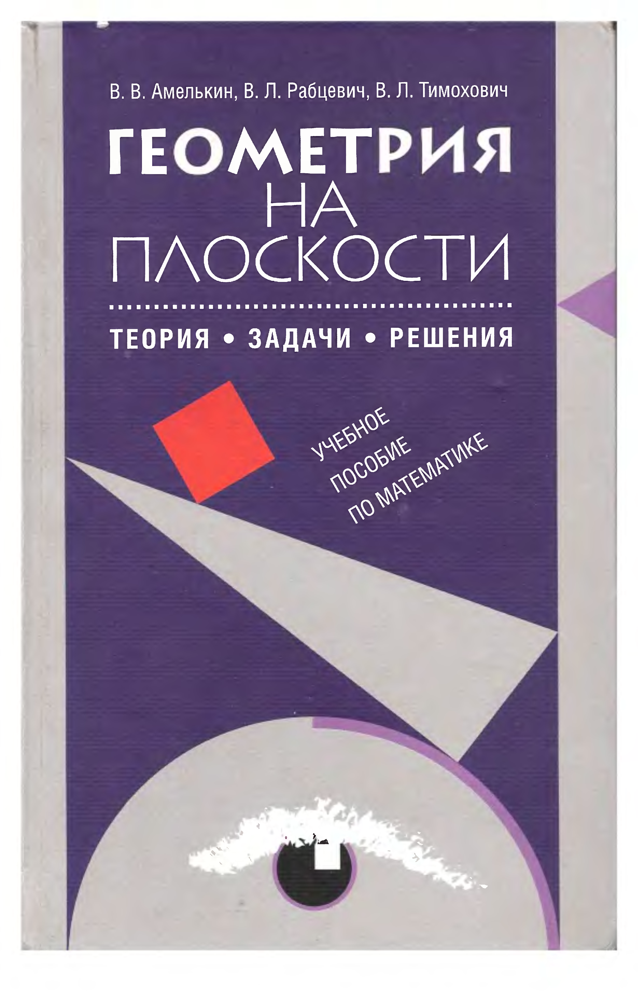

# ВСТУПИТЕЛЬНЫЕ МАТЕРИАЛЫ

## Вступительные материалы

---
**стр. 0**
---

В. В. Амелькин, В. Л. Рабцевич, В. Л. Тимохович

**ГЕОМЕТРИЯ**
**НА**
**ПЛОСКОСТИ**

ТЕОРИЯ • ЗАДАЧИ • РЕШЕНИЯ

УЧЕБНОЕ ПОСОБИЕ ПО МАТЕМАТИКЕ

---
**стр. 1**
---

В. В. Амелькин, В. Л. Рабцевич, В. Л. Тимохович

**ГЕОМЕТРИЯ**
**НА**
**ПЛОСКОСТИ**

**ТЕОРИЯ • ЗАДАЧИ • РЕШЕНИЯ**

**УЧЕБНОЕ ПОСОБИЕ ПО МАТЕМАТИКЕ**

Рекомендовано Центром учебной книги и средств обучения
Национального института образования
в качестве учебного пособия для учащихся
общеобразовательных учреждений

Минск «Асар»

---

Москва «Издательский дом «ОНИКС 21 век»

2003

---
**стр. 2**
---

УДК 514(075.3)
ББК 22.151я721
А61

Рецензенты:
учитель математики СШ № 153 г. Минска **А. И. Абрамович**;
доцент БГПУ им. М. Танка **В. В. Шлыков**

Консультант **К. С. Филипович**

**Амелькин В. В.**

А61   Геометрия на плоскости: Теория, задачи, решения: Учеб. пособие по математике / В. В. Амелькин, В. Л. Рабцевич, В. Л. Тимохович — Мн.: ООО «Асар», 2003. — 592 с.: ил.

ISBN 985-6572-94-0.

Пособие отличается от известных книг по школьной геометрии как широтой охвата материала (это практически все разделы геометрии на плоскости), так полнотой и глубиной его изложения. <!-- вероятная опечатка оригинала: «так полнотой» вместо «так и полнотой» -->

Тщательно отобранный и систематизированный теоретический материал, а также большое количество задач различного уровня сложности с решениями не только помогут учащимся углубить свои знания, проверить и закрепить практические навыки при систематическом изучении планиметрии, но и предоставляют хорошую возможность для самостоятельной эффективной подготовки к выпускным и вступительным экзаменам по математике.

Пособие предназначено учащимся, абитуриентам и преподавателям, а также будет полезно всем, кто интересуется элементарной математикой.

УДК 514(075.3)
ББК 22.151я721

ISBN 985-6572-94-0

© Амелькин В. В., Рабцевич В. Л., Тимохович В. Л., 2003
© Мацур Г. И., оформление, 2003
© ООО «Асар», 2003

---
**стр. 3**
---

<!-- печатный номер в колонтитуле на этой странице не виден -->

# ОГЛАВЛЕНИЕ

Предисловие 9

**Глава 1. Треугольники и окружности** 11

**§1. Углы, треугольники** 11

    1.1. Свойства углов и параллельных прямых 16
    1.2. Свойства произвольного треугольника 19
    1.3. Свойства равнобедренного треугольника 24
    1.4. Свойства прямоугольного треугольника 25
    Задачи 27
    Задачи для самостоятельного решения 32

**§2. Равенство и подобие треугольников** 33

    2.1. Признаки равенства произвольных треугольников 33
    2.2. Признаки равенства прямоугольных треугольников 35
    2.3. Признаки подобия произвольных треугольников 37
    2.4. Признаки подобия прямоугольных треугольников 39
    Задачи 40
    Задачи для самостоятельного решения 46

**§3. Пропорциональные отрезки** 47

    3.1. Свойства параллельных прямых, пересекающих стороны углов 47
    3.2. Пропорциональные отрезки в произвольном треугольнике 50
    3.3. Пропорциональные отрезки в прямоугольном треугольнике 53
    Задачи 55
    Задачи для самостоятельного решения 61

**§4. Окружность, круг, дуга, хорда, диаметр. Углы** 62

    4.1. Свойства хорд 63
    4.2. Свойства углов 65
    Задачи 67
    Задачи для самостоятельного решения 70

**§5. Окружность. Касательная, касательные и хорды, касательные и секущие** 71

    5.1. Свойства касательных 72

---
**стр. 4**
---

5.2. Свойство углов между касательной и хордой 73
    5.3. Свойство касательной и секущей 74
    Задачи 74
    Задачи для самостоятельного решения 80

**§6. Медианы** 81

    6.1. Свойства медиан 81
    Задачи 84
    Задачи для самостоятельного решения 88

**§7. Высоты** 89

    7.1. Свойства высот 89
    Задачи 93
    Задачи для самостоятельного решения 105

**§8. Биссектрисы** 107

    8.1. Свойства биссектрис 108
    Задачи 112
    Задачи для самостоятельного решения 120

**§9. Треугольник. Вписанные, описанные и вневписанные окружности** 122

    Задачи 123
    Задачи для самостоятельного решения 130

**§10. Теорема синусов** 131

    Задачи 132
    Задачи для самостоятельного решения 141

**§11. Теорема косинусов** 142

    Задачи 143
    Задачи для самостоятельного решения 144

**§12. Решение треугольников** 146

    Задачи 146
    Задачи для самостоятельного решения 153

**Глава 2. Четырехугольники и многоугольники** 155

**§13. Параллелограмм, прямоугольник, ромб, квадрат** 155

    13.1. Свойства параллелограмма 155
    13.2. Свойства прямоугольника 157

---
**стр. 5**
---

13.3. Свойства ромба 158
    13.4. Свойства квадрата 159
    Задачи 159
    Задачи для самостоятельного решения 168

**§14. Трапеция** 170

    14.1. Свойства произвольной трапеции 170
    14.2. Свойства равнобочной трапеции 174
    Задачи 175
    Задачи для самостоятельного решения 182

**§15. Вписанные и описанные четырехугольники** 183

    15.1. Свойства вписанных и описанных четырехугольников 184
    Задачи 185
    Задачи для самостоятельного решения 193

**§16. $n$-угольники (многоугольники), произвольные четырехугольники** 194

    16.1. Свойства $n$-угольников 196
    16.2. Произвольные четырехугольники 202
    Задачи 205
    Задачи для самостоятельного решения 214

**Глава 3. Площадь** 217

**§17. Площадь $n$-угольников** 217

    17.1. Площадь прямоугольника и параллелограмма 217
    17.2. Площадь треугольника 218
    17.3. Площадь трапеции, произвольного четырехугольника и описанного $n$-угольника 225
    Задачи 229
    Задачи для самостоятельного решения 235

**§18. Площадь круга и его частей** 236

    18.1. Длина окружности 236
    18.2. Площадь круга, сектора и сегмента 238
    Задачи 240
    Задачи для самостоятельного решения 243

**§19. Отношение площадей** 244

    19.1. Отношение площадей $n$-угольников 244

---
**стр. 6**
---

Задачи 246
    Задачи для самостоятельного решения 257

**Глава 4. Векторы и их применение к решению геометрических задач** 259

**§20. Векторы на плоскости** 259

    20.1. Определения и обозначения, связанные с понятием вектора 259
    20.2. Сложение и вычитание векторов 261
    20.3. Умножение и деление вектора на число 263
    20.4. Деление отрезка в данном отношении 265
    20.5. Проекции и координаты векторов 266
    20.6. Скалярное произведение векторов 272
    Задачи 275
    Задачи для самостоятельного решения 286

**Глава 5. Преобразования фигур** 289

**§21. Движения, виды движений. Преобразование подобия, гомотетия** 289

    Свойства движения 290
    21.1. Симметрии 291
    21.2. Поворот 293
    21.3. Параллельный перенос 293
    21.4. Преобразование подобия, гомотетия 294
    Свойства гомотетии 295
    21.5. Свойства преобразования подобия 299
    Задачи 299
    Задачи для самостоятельного решения 305

**Глава 6. Задачи на максимум и минимум** 307

**§22. Задачи на доказательство и вычисление** 307

    22.1. Треугольники 307
    22.2. Четырехугольники 311
    22.3. Окружность, круг 318
    Задачи для самостоятельного решения 322

---
**стр. 7**
---

**Глава 7. Задачи на построение** 325

**§23. Простейшие (основные) задачи на построение** 326

**§24. Построение треугольника по трем элементам** 330

    Задачи для самостоятельного решения 339

**§25. Некоторые методы решения задач на построение** 339

    25.1. Метод геометрического места точек 340
    25.2. Метод спрямления 343
    25.3. Метод центральной симметрии 347
    25.4. Метод осевой симметрии 348
    25.5. Метод поворота 350
    25.6. Метод параллельного переноса 352
    25.7. Метод подобия 354
    25.8. Метод гомотетии 357
    25.9. Алгебраический метод 359
    Задачи для самостоятельного решения 363

**Глава 8. Разные задачи для самостоятельного решения** 365

**§26. Треугольники и окружности** 365

**§27. Многоугольники и окружности** 378

**Глава 9. Решения задач группы С** 383

    §1. Углы, треугольники 383
    §2. Равенство и подобие треугольников 386
    §3. Пропорциональные отрезки 390
    §4. Окружность, круг, дуга, хорда, диаметр. Углы 392
    §5. Окружность. Касательная, касательные и хорды, касательные и секущие 395
    §6. Медианы 398
    §7. Высоты 402
    §8. Биссектрисы 415
    §9. Треугольник. Вписанные, описанные и вневписанные окружности 422
    §10. Теорема синусов 429
    §11. Теорема косинусов 432

---
**стр. 8**
---

§12. Решение треугольников 437
    §13. Параллелограмм, прямоугольник, ромб, квадрат 440
    §14. Трапеция 448
    §15. Вписанные и описанные четырехугольники 452
    §16. $n$-угольники (многоугольники), произвольные четырехугольники 457
    §17. Площадь $n$-угольников 461
    §18. Площадь круга и его частей 465
    §19. Отношение площадей 467

    §20. Векторы на плоскости 474

    §21. Движения, виды движений. Преобразование подобия, гомотетия 482

    §22. Задачи на доказательство и вычисление 486

    §24. Построение треугольника по трем элементам 496
    §25. Некоторые методы решения задач на построение 503

    §26. Треугольники и окружности 511
    §27. Многоугольники и окружности 565

**Предметный указатель** 583

**Литература** 589

---
**стр. 9**
---

# ПРЕДИСЛОВИЕ

Книга написана с учетом многолетнего опыта работы авторов с самыми различными по уровню подготовки аудиториями учащихся и абитуриентов.

Пособие отличается от известных книг по школьной геометрии как широтой охвата материала — это практически все разделы геометрии на плоскости (планиметрии) — так полнотой и глубиной его изложения.

Тщательно отобранный и систематизированный теоретический материал, а также большое количество задач различного уровня сложности с решениями (значительное число задач в книге — это задачи, предлагавшиеся на вступительных экзаменах по математике в ведущих вузах Российской Федерации и Республики Беларусь) не только помогут учащимся углубить свои знания, проверить и закрепить практические навыки при систематическом изучении планиметрии, но и предоставляют хорошую возможность для самостоятельной эффективной подготовки к выпускным и вступительным экзаменам по математике в ее геометрической части — геометрии на плоскости.

Теперь о некоторых соглашениях. В пособии многие свойства геометрических фигур нумеруются с буквой X (например, свойство 1.4X). Это означает, что такие свойства являются характеристическими, т. е. кроме сформулированного утверждения, имеет место и утверждение, обратное приведенному. Обратные утверждения читателю полезно доказать самому (доказательства некоторых из них в пособии приводятся).

Определенное число задач нумеруется (кроме обычной нумерации) с символом ▼ (например, ▼1.8). Последнее означает, что каждая из таких задач либо дополняет тот или иной список свойств геометрических фигур, либо иллюстрирует часто встречающийся прием или метод решения, поэто-

---
**стр. 10**
---

му авторы рекомендуют читателям обратить на них особое внимание.

Еще одна группа задач — это задачи для самостоятельного решения. Они нумеруются в пособии с буквой С (например, 1.1С). Решения всех задач группы С приводятся в главе 9, к которой читатели могут обратиться в случае затруднений с решением или для контроля.

Что же касается рекомендаций по приобретению прочных навыков решения геометрических задач (и не только геометрических), то, хотя это и не звучит оригинально, совет один: задач надо решать как можно больше. Начинать же их решение следует с выполнения хорошего чертежа, как можно более точно отражающего те или иные зависимости между параметрами (например, длинами, углами, площадями), фигурирующими в условиях задач.

Пособие предназначено учащимся и преподавателям средних школ и гимназий, лицеев и колледжей, а также абитуриентам.

Но, как надеются авторы, и студенты, и преподаватели педагогических специальностей высших учебных заведений также найдут в книге интересный материал, который они смогут использовать в своей работе.

Авторы благодарны рецензентам А. И. Абрамовичу и В. В. Шлыкову за конструктивные замечания и рекомендации по улучшению пособия, консультанту К. С. Филипповичу за творческие консультации, В. В. Крахотко за содержательные обсуждения, а также Т. И. Рабцевич за компьютерную верстку издательского оригинал-макета и будут признательны всем, кто пришлет свои замечания или пожелания по адресу: 220004, Минск, Романовская Слобода, д.5, к. 513. Издательство «АСАР».
