## 1.1. Углы, треугольники

---
**стр. 11**
---

# ГЛАВА 1

# ТРЕУГОЛЬНИКИ И ОКРУЖНОСТИ

## § 1. УГЛЫ, ТРЕУГОЛЬНИКИ

***Угол*** — *это геометрическая фигура, состоящая из двух различных лучей, выходящих из одной точки.*

Вместо слова «угол» часто употребляют знак $\angle$.

Точка, из которой выходят лучи, называется **вершиной** угла, а сами лучи — **сторонами** угла.

Два угла называются **смежными**, если у них общие вершина и одна сторона, а две другие стороны образуют прямую (на рис. 1.1 — это углы $COB$ и $BOA$).

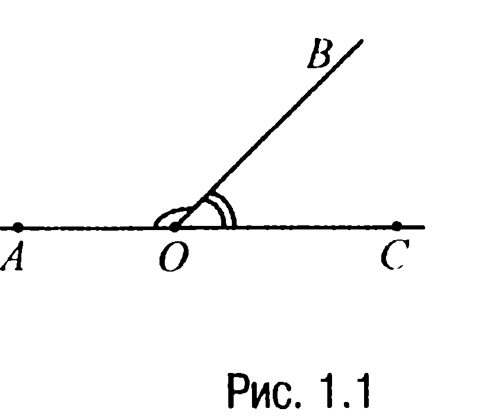 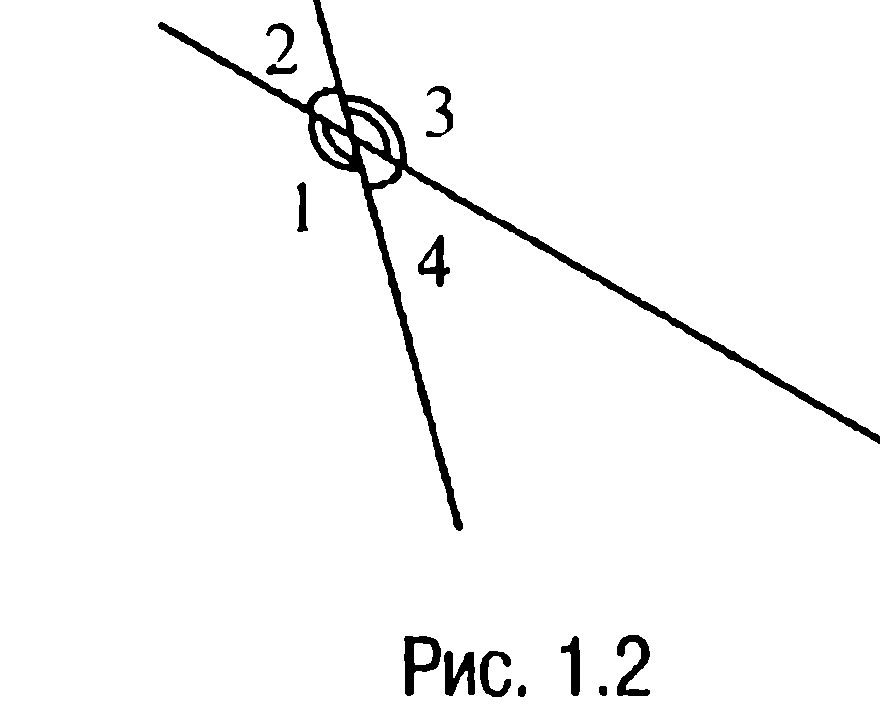

Углы, имеющие общую вершину и общую сторону, называются **прилежащими**.

Углы называются **вертикальными**, если стороны одного угла являются продолжениями за вершину сторон другого угла (рис. 1.2).

Угол, у которого стороны образуют прямую, называется **развернутым** углом (на рис. 1.1 — это, например, угол $AOC$).

Половина развернутого угла называется **прямым** углом.

---
**стр. 12**
---

Иначе, **прямой** угол — это угол, равный своему смежному углу.

Два угла называются **равными**, если они могут быть совмещены так, что совпадут их вершины и соответствующие стороны.

Для обозначения равенства углов употребляют обычный знак равенства $=$. Запись $\angle ABC = \angle A_1B_1C_1$ читается так: «Угол $ABC$ равен углу $A_1B_1C_1$».

*Если два угла имеют общие вершину и одну сторону, а вторая сторона одного из углов лежит между сторонами другого угла, то говорят, что первый из этих двух углов **меньше второго (второй угол больше первого)**.*

Чтобы отметить, что один из углов меньше (больше) другого, употребляют обычный знак $<$ ($>$). Запись $\angle ABC < \angle A_1B_1C_1$ ($\angle ABC > \angle A_1B_1C_1$) читается так: «Угол $ABC$ меньше (больше) угла $A_1B_1C_1$».

Угол, меньший прямого, называется **острым** углом.

Угол, больший прямого и меньший развернутого, называется **тупым** углом.

В геометрии рассматриваются также **нулевой** и **полный** углы, у которых образующие их лучи совпадают. Различие этих углов показано на рис. 1.3 (нулевой угол) и рис. 1.4 (полный угол).

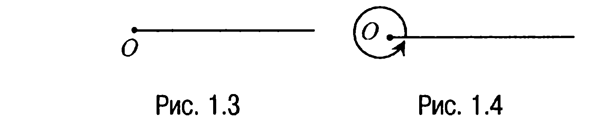 

Угол с вершиной в центре окружности называется **центральным** углом.

За единицу измерения углов принимается $1/180$ часть развернутого угла, называемая **градусом** (обозначается знаком $^\circ$).

Используется также и **радианная мера** угла. В этом случае **один радиан** приписывается центральному углу, сто-

---
**стр. 13**
---

роны которого заключают дугу окружности, равную радиусу. Указанный центральный угол называется **угловым радианом**, а соответствующая дуга — **дуговым радианом**.

Более подробно о связи градусной и радианной мер углов см. § 18, с. 237 — 238.

При пересечении двух прямых, лежащих в одной плоскости, третьей прямой (рис 1.5) образуется восемь углов:

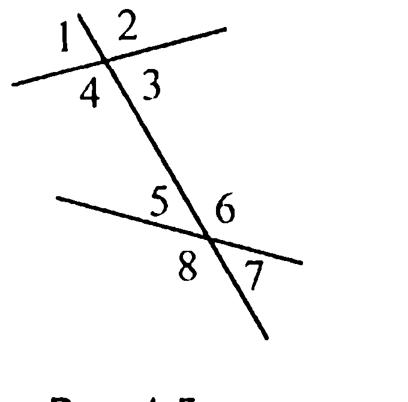

- **соответственные углы**: $\angle 1$ и $\angle 5$, $\angle 2$ и $\angle 6$, $\angle 4$ и $\angle 8$, $\angle 3$ и $\angle 7$;
- **внутренние односторонние**: $\angle 4$ и $\angle 5$, $\angle 3$ и $\angle 6$;
- **внешние односторонние**: $\angle 1$ и $\angle 8$, $\angle 2$ и $\angle 7$;
- **внутренние накрест лежащие**: $\angle 4$ и $\angle 6$, $\angle 3$ и $\angle 5$;
- **внешние накрест лежащие**: $\angle 1$ и $\angle 7$, $\angle 2$ и $\angle 8$.

***Треугольником*** *называется фигура, состоящая из трех точек, не лежащих на одной прямой, и трех отрезков, попарно соединяющих эти точки.*

Вместо слова «треугольник» часто употребляют знак $\Delta$.

***Точки называются вершинами треугольника, а отрезки — сторонами треугольника.***

***Под площадью треугольника понимается площадь конечной части плоскости, ограниченной данным треугольником.***

Определение самого понятия площади см. в § 17, с. 217.

***Углом треугольника $ABC$ при вершине $A$ называется угол, образованный лучами $AB$ и $AC$.***

Аналогично определяются углы треугольника при вершинах $B$ и $C$.

***Внешним углом треугольника при данной вершине называется угол, смежный с углом треугольника при этой вершине.***

---
**стр. 14**
---

***Средней линией треугольника*** *называется отрезок, соединяющий середины двух его сторон.*

Если стороне (углу) одного треугольника по некоторому признаку ставится в соответствие сторона (угол) другого треугольника, то такие стороны (углы) называются **соответствующими**.

При этом когда речь идет о соответствующих сторонах и углах треугольников, то считается, что соответствующие углы треугольников лежат против соответствующих сторон треугольников и наоборот.

В частности, если треугольники имеют равные соответствующие углы, то стороны треугольников, которые лежат против этих равных углов, называются **сходственными сторонами**.

Треугольники называются **равными**, если можно установить такое соответствие между их углами (а следовательно, и между их сторонами), при котором у треугольников равны соответствующие углы и сходственные стороны.

**Замечание 1.1.** Для обозначения равенства треугольников употребляют обычный знак равенства $=$. Запись $\Delta ABC = \Delta A_1B_1C_1$ читается так: «Треугольник $ABC$ равен треугольнику $A_1B_1C_1$», при этом отмеченная запись вовсе не означает, что непременно $\angle CAB = \angle C_1A_1B_1$, $\angle ABC = \angle A_1B_1C_1$, $\angle BCA = \angle B_1C_1A_1$.

В зависимости от углов треугольники бывают **остроугольными** (все углы острые), **прямоугольными** (один угол прямой; сторона, противолежащая прямому углу, называется *гипотенузой*, а остальные стороны — *катетами*), **тупоугольными** (один угол тупой).

В зависимости от сторон треугольники бывают **разносторонними** (все стороны разные), **равнобедренными** (две стороны равны; эти стороны называются **боковыми сторонами**, а третья сторона называется **основанием треугольника**), **равносторонними** (все стороны равны).

---
**стр. 15**
---

Известно, что все утверждения элементарной геометрии на плоскости и в пространстве можно вывести из нескольких простейших утверждений, которые принимаются без доказательства и называются **аксиомами**.

Впервые такую систему аксиом предложил живший в III веке до н. э. греческий математик Евклид (сам Евклид называл аксиомы постулатами).

С течением же времени система аксиом Евклида совершенствовалась и видоизменялась, с одной стороны, для придания ей необходимой степени строгости, а с другой, с целью ее адаптации к учебникам и пособиям по геометрии той или иной степени сложности.

В настоящем пособии приводятся лишь некоторые «адаптированные» аксиомы планиметрии, на которые мы ссылаемся при доказательстве ряда утверждений.

**Аксиома 1.1 (о принадлежности точек и прямых).** *Какова бы ни была прямая, существует не менее двух точек, принадлежащих этой прямой, и не менее одной точки, не принадлежащей этой же прямой.*

Пусть $l$ — некоторая прямая. Тогда говорят, что **две точки $A$ и $B$ лежат по одну сторону от прямой $l$**, если отрезок $AB$ не имеет с прямой $l$ общих точек.

*Множество всех точек плоскости, каждая из которых не лежит на прямой $l$, и любые две из которых лежат по одну сторону от прямой $l$, называется **полуплоскостью**.*

Отметим, что **две точки $A$ и $B$ лежат в разных полуплоскостях тогда и только тогда, когда отрезок $AB$ пересекается с прямой $l$ в некоторой точке $C$, не являющейся концевой точкой отрезка.**

Заметим также, что ни одна точка прямой $l$ не лежит ни в одной из полуплоскостей.

Всякий же луч и всякий отрезок также задают полуплоскости. Их определяет прямая, полученная продолжением луча или отрезка (в одну или соответственно в обе стороны).

**Аксиома 1.2 (о расположении точек относительно прямой).** *Всякая прямая разбивает плоскость на две полуплоскости.*

---
**стр. 16**
---

**Аксиома 1.3 (о параллельных прямых).** *Через точку, не лежащую на данной прямой, можно провести на плоскости не более одной прямой, не пересекающейся с данной.*

Напомним, что две прямые, которые лежат в одной плоскости и не пересекаются, называются **параллельными**. Для обозначения параллельности прямых употребляют знак $\parallel$. Запись $l_1 \parallel l_2$ читается так: «Прямая $l_1$ параллельна прямой $l_2$». Отметим, что существование прямой, не пересекающейся с данной, следует, например, из задачи 23.7 на построение, где искомая прямая строится с помощью только циркуля и линейки.

**Аксиома 1.4 (об откладывании отрезка).** *На любом луче от его начальной точки можно отложить отрезок любой заданной длины, и только один.*

**Аксиома 1.5 (об откладывании угла).** *От любого луча в любой из полуплоскостей можно отложить любой заданный угол, меньший $180^\circ$, и только один.*

**Аксиома 1.6 (о существовании равных треугольников в заданном расположении относительно данного луча).** *От любого луча в любой из полуплоскостей можно единственным образом отложить любой заданный треугольник таким образом, чтобы заданная вершина треугольника лежала в полуплоскости, а заданный угол треугольника (при другой вершине) был отложен от луча.*

**1.1. Свойства углов и параллельных прямых**

**Свойство 1.1.** *Смежные углы в сумме составляют $180^\circ$.* Справедливость этого свойства следует из того факта, что смежные углы в сумме составляют развернутый угол.

**Свойство 1.2.** *Вертикальные углы равны.*

**Доказательство.** Рассмотрим, например, вертикальные $\angle 1$ и $\angle 3$ (рис. 1.2). Тогда $\angle 2$ является смежным как с $\angle 1$, так и с $\angle 3$ и, значит, в соответствии со свойством 1.1, как $\angle 1$, так и $\angle 3$ дополняют $\angle 2$ до $180^\circ$, а это и означает, что $\angle 1 = \angle 3$.

---
**стр. 17**
---

**Свойство 1.3.** *Если при пересечении двух прямых, лежащих в одной плоскости, третьей прямой углы одной из пар соответственных или накрест лежащих углов равны, то равными будут и углы в каждой из остальных пар соответственных и накрест лежащих углов.*

**Доказательство.** Пусть при пересечении прямых $a$ и $b$ третьей прямой $c$ (рис. 1.6) равны, например, соответственные $\angle 1$ и $\angle 5$.

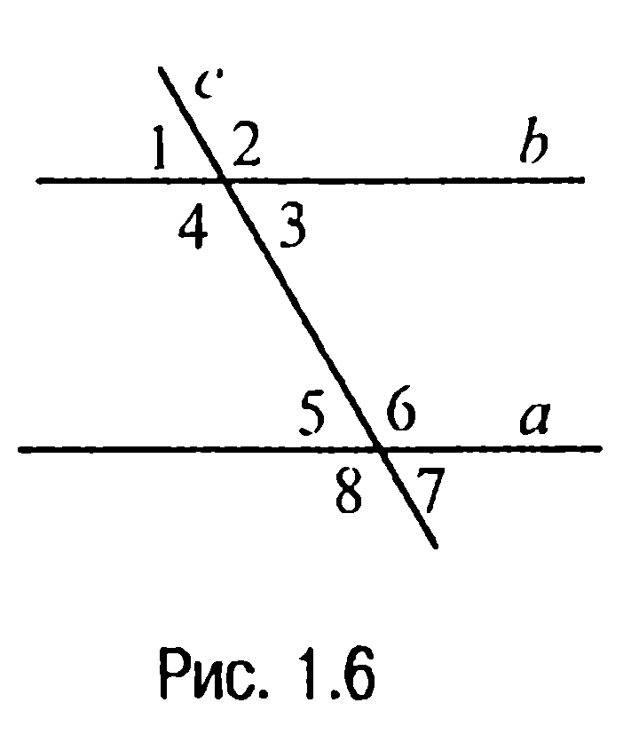

Тогда так как $\angle 1$ и $\angle 3$, $\angle 5$ и $\angle 7$ являются вертикальными, а значит, равными, то равными будут соответственные $\angle 3$ и $\angle 7$ и накрест лежащие $\angle 3$ и $\angle 5$.

Равные внутренние накрест лежащие $\angle 3$ и $\angle 5$ являются соответственно смежными внутренним накрест лежащим $\angle 4$ и $\angle 6$, откуда следует, что $\angle 4$ и $\angle 6$ будут равными. Но тогда равными будут и $\angle 2$ и $\angle 6$, $\angle 4$ и $\angle 8$.

С другой стороны, $\angle 1 = \angle 3 = \angle 5 = \angle 7$, а $\angle 2 = \angle 4 = \angle 6 = \angle 8$, следовательно, $\angle 1 = \angle 7$ и $\angle 2 = \angle 8$.

Аналогичные рассуждения проводятся и в случае, когда при пересечении прямых $a$ и $b$ третьей прямой $c$ равными оказываются какие-либо накрест лежащие углы.

**Свойство 1.4X.** *Если при пересечении двух прямых, лежащих в одной плоскости, третьей прямой углы одной из пар соответственных или накрест лежащих углов равны, то сумма углов каждой пары односторонних углов равна $180^\circ$.*

**Доказательство.** С учетом свойства 1.3 мы можем считать, что, например, $\angle 3 = \angle 5$, а значит, в частности, $\angle 4 = \angle 6$. Но тогда пара внутренних накрест лежащих углов 3 и 5 и пара внутренних односторонних углов 4 и 5 имеют общий $\angle 5$, а два других: $\angle 3$ и $\angle 4$ — смежные.

Поэтому если внутренние накрест лежащие углы равны, то сумма внутренних односторонних углов равна $180^\circ$.

Аналогичные рассуждения проводятся и для случая внешних накрест лежащих и односторонних углов.

---
**стр. 18**
---

**Свойство 1.5X.** *Если две параллельные прямые пересечены какой-нибудь третьей прямой, то*

1) *соответственные углы равны,*
2) *накрест лежащие углы равны,*
3) *сумма любой пары односторонних углов равна $180^\circ$.*

**Доказательство.** Докажем, например, что если прямые $a$ и $b$ параллельны, то соответственные $\angle 2$ и $\angle 6$ равны (рис. 1.7).

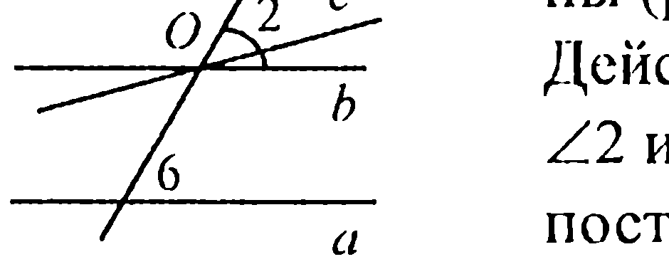

Действительно, если предположить, что $\angle 2$ и $\angle 6$ не равны (например, $\angle 2 > \angle 6$), то, построив угол $\angle cOd$, равный $\angle 6$, получим прямую $c$, не совпадающую с прямой $b$.

Таким образом, через точку $O$ проходят две различные прямые, параллельные одной и той же прямой $a$. Одна из них параллельна $a$ по условию, а вторая — вследствие равенства соответственных $\angle 6$ и $\angle cOd$.

Но такой вывод противоречит аксиоме 1.3. Следовательно, наше предположение о том, что $\angle 2$ и $\angle 6$ не равны, неверно, поэтому $\angle 2 = \angle 6$.

Аналогично доказываются и два остальных утверждения свойства 1.5X.

**Свойство 1.6.** *Если стороны одного угла соответственно параллельны сторонам другого угла, то такие углы или равны, или в сумме составляют $180^\circ$.*

**Доказательство.** Пусть стороны, например, острых углов 4 и 6 (рис. 1.8) соответственно параллельны.

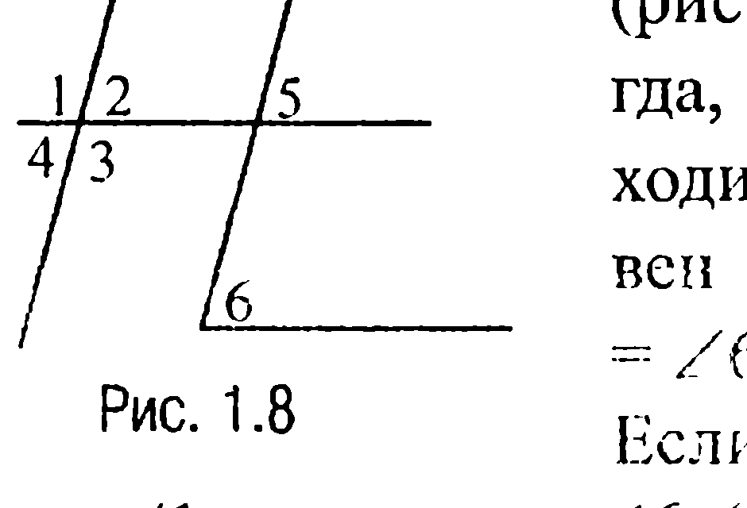

Тогда, построив $\angle 2$, вертикальный к $\angle 4$, приходим к выводу (свойство 1.5X), что $\angle 5$ равен $\angle 2$ и $\angle 6$. Но $\angle 2 = \angle 4$, поэтому и $\angle 4 = \angle 6$.

Если параллельными является стороны тупого $\angle 1$ и острого $\angle 6$ (рис. 1.8), то, так как $\angle 1 + \angle 2 = 180^\circ$, а $\angle 2 = \angle 6$, приходим к заключению, что $\angle 1 + \angle 6 = 180^\circ$.

Случай двух тупых углов доказывается аналогично случаю двух острых углов, а поскольку случай двух прямых углов очевиден, то свойство 1.6 доказано.

---
**стр. 19**
---

Переходя к следующему свойству, напомним, что прямые называются **перпендикулярными**, если они пересекаются под прямым углом.

Для обозначения перпендикулярности прямых употребляют знак $\perp$. Запись $l_1 \perp l_2$ читается так: «Прямая $l_1$ перпендикулярна прямой $l_2$».

**Свойство 1.7.** *Если стороны одного угла соответственно перпендикулярны к сторонам другого угла, то такие углы или равны, или в сумме составляют $180^\circ$.*

**Доказательство.** Пусть $\angle ABC$ — угол, обозначенный цифрой 1 на рис. 1.9, — один из данных углов, а второй данный угол — это один из углов 2, 3, 4 или 5, образованных двумя пересекающимися прямыми, из которых одна перпендикулярна стороне $AB$, а другая — стороне $BC$.

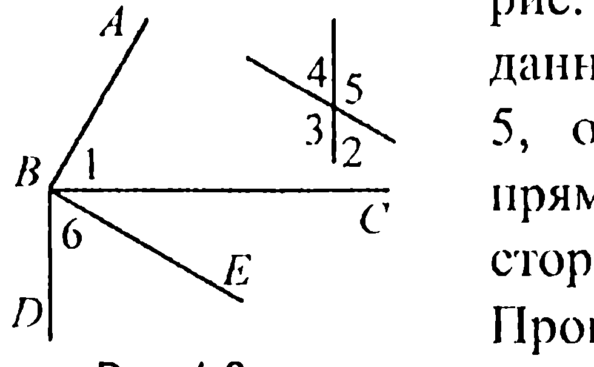

Проведем из вершины $\angle 1$ два вспомогательных луча: $BD$ и $BE$, первый из которых перпендикулярен $BC$, а второй — перпендикулярен $BA$. Тогда $\angle 6 = \angle 1$, так как у прямых углов $DBC$ и $EBA$ угол $EBC$ общий.

С другой стороны, стороны $\angle 6$ параллельны пересекающимся прямым, образующим $\angle 2$, $\angle 3$, $\angle 4$ и $\angle 5$, а значит, $\angle 2$ и $\angle 4$ равны $\angle 6$, а $\angle 3$ и $\angle 5$ составляют в сумме с $\angle 6$ угол, равный $180^\circ$. Это и доказывает свойство, поскольку $\angle 6 = \angle 1$.

**1.2. Свойства произвольного треугольника**

**Свойство 1.8.** *Сумма углов треугольника равна $180^\circ$.*

**Доказательство.** Рассмотрим произвольный треугольник $ABC$. Если в этом треугольнике продолжить сторону $AC$ за точку $C$ и провести прямую $CE$ параллельно $AB$ (рис. 1.10), то углы $CAB$ и $DCE$ равны как соответственные при параллельных прямых $AB$ и $CE$, а углы $ABC$ и $ECB$ равны как накрест лежащие при тех же параллельных прямых. Поэтому

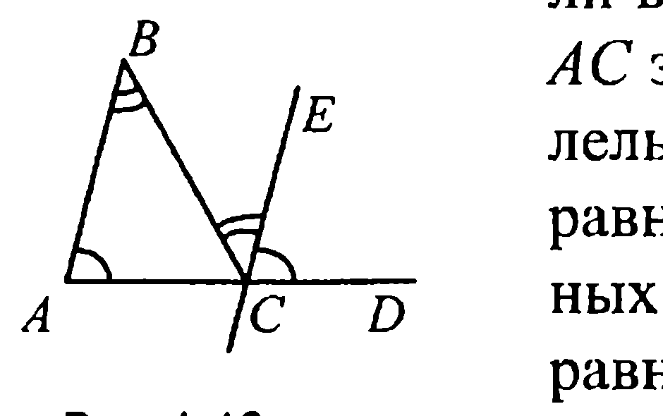

$\angle ABC + \angle BCA + \angle CAB = \angle DCE + \angle ECB +$

---
**стр. 20**
---

$+ \angle BCA = 180^\circ$, что и требовалось доказать.

**Свойство 1.9.** *Любой внешний угол треугольника равен сумме двух внутренних углов треугольника, несмежных с ним.*

Свойство 1.9 является очевидным следствием свойства 1.8.

**Свойство 1.10.** *Если прямая, не проходящая ни через одну из вершин треугольника, пересекает одну из его сторон, то она пересекает только одну из двух других сторон.*

**Доказательство.** Пусть прямая $a$, не проходящая через одну из вершин треугольника $ABC$, пересекает, например, сторону $AC$ (рис. 1.11).

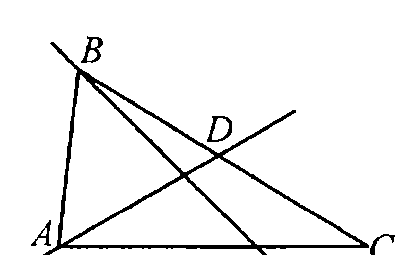

Прямая $a$ (аксиома 1.2) разбивает плоскость на две полуплоскости таким образом, что точки $A$ и $C$ лежат в разных полуплоскостях.

Если точка $B$ лежит в одной полуплоскости с точкой $C$, то отрезок $BC$ не пересекает прямую $a$, а отрезок $AB$ пересекает эту прямую, так как точки $A$ и $B$ лежат в разных полуплоскостях.

Если же точка $B$ лежит в одной полуплоскости с точкой $A$, то отрезок $AB$ не пересекает прямую $a$, а отрезок $BC$ будет ее пересекать, поскольку точки $B$ и $C$ лежат в разных полуплоскостях.

В обоих рассмотренных случаях прямая $a$ пересекает только одну из сторон $AB$ и $BC$, что и доказывает свойство.

**Свойство 1.11.** *Два не совпадающие ни с одной из сторон треугольника отрезка, проведенные из двух различных вершин треугольника до противолежащих этим вершинам сторон, пересекаются.*

**Доказательство.** Рассмотрим треугольник $ABC$. Пусть, например, $AD$ и $BE$ (рис. 1.12) — два отрезка, проведенные соответственно из вершин $A$ и $B$ до противолежащих этим <!-- вероятная опечатка оригинала: вешинам --> вешинам сторон треугольника. Прямая $AD$ разбивает плоскость на две полуплоскости так, что точки $B$ и $E$ лежат в разных полуплоскостях, поэтому отрезок $BE$ пересекает прямую $AD$.

---
**стр. 21**
---

С другой стороны, прямая $BE$ разбивает плоскость на две полуплоскости таким образом, что уже точки $A$ и $D$ лежат в разных полуплоскостях и, значит, отрезок $AD$ пересекает прямую $BE$.

Но в таком случае приходим к выводу, что пересекаются и сами отрезки $AD$ и $BE$, что и требовалось доказать.

**Свойство 1.12.** *Прямая, проходящая через вершину треугольника и пересекающая противолежащую вершине сторону, делит треугольник на два треугольника, площади которых соответственно пропорциональны отрезкам, отсекаемым прямой на стороне данного треугольника.*

**Доказательство.** Пусть, например, прямая, проходящая через вершину $B$ треугольника $ABC$, пересекает сторону $AC$ в точке $D$ и пусть $BE$ — основание высоты треугольника $ABC$, опущенной из вершины $B$ на сторону $AC$ (или ее продолжение) (рис. 1.13).

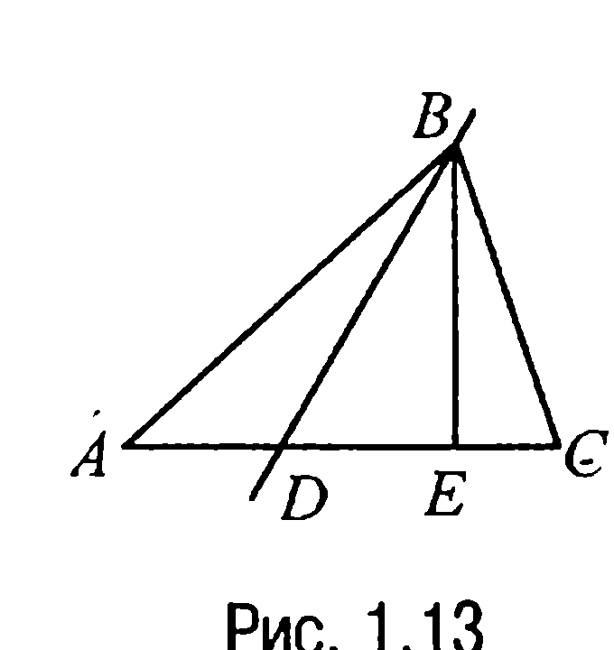

Тогда если $S_1$ и $S_2$ — площади треугольников $ABD$ и $DBC$ соответственно, то

$$S_1 = \frac{1}{2} AD \cdot BE, \quad S_2 = \frac{1}{2} DC \cdot BE.$$

Но в таком случае, с одной стороны, $BE = \frac{2S_1}{AD}$, а с другой — $BE = \frac{2S_2}{DC}$. Но тогда $\frac{S_1}{AD} = \frac{S_2}{DC}$ или

$$\frac{S_1}{S_2} = \frac{AD}{DC},$$

а это и требовалось доказать.

**Свойство 1.13X (Теорема Чевы).** *На сторонах $BC, AC, AB$ треугольника $ABC$ отмечены соответственно точки $A_1, B_1, C_1$. Тогда если прямые $AA_1, BB_1, CC_1$ пересекаются в одной точке, то*

$$\frac{AC_1}{C_1B} \cdot \frac{BA_1}{A_1C} \cdot \frac{CB_1}{B_1A} = 1.$$

**Доказательство.** Предположим, что прямые $AA_1, BB_1, CC_1$ пересекаются в точке $O$ (рис. 1.14). По свойству 1.12 имеют место равен-

---
**стр. 22**
---

ства $\frac{AC_1}{C_1B} = \frac{S_{\triangle AC_1C}}{S_{\triangle C_1BC}} = \frac{S_{\triangle AC_1O}}{S_{\triangle C_1BO}}$ или (по свойству производной пропорции) равенства $\frac{AC_1}{C_1B} = \frac{S_{\triangle AC_1C} - S_{\triangle AC_1O}}{S_{\triangle C_1BC} - S_{\triangle C_1BO}} = \frac{S_{\triangle AOC}}{S_{\triangle BOC}}$.

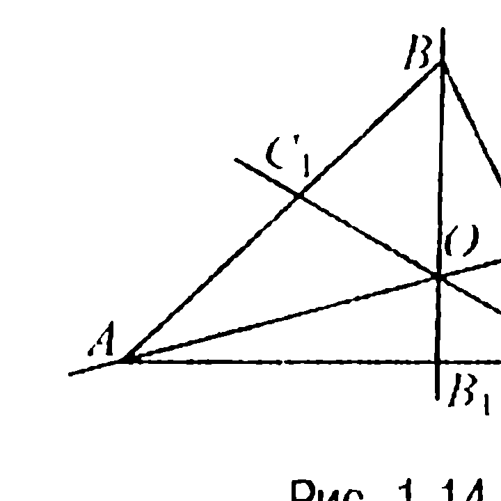

Аналогично находим, что $\frac{BA_1}{A_1C} = \frac{S_{\triangle BOA}}{S_{\triangle COA}}$, а $\frac{CB_1}{B_1A} = \frac{S_{\triangle COB}}{S_{\triangle AOB}}$. Поэтому

$$\frac{AC_1}{C_1B} \cdot \frac{BA_1}{A_1C} \cdot \frac{CB_1}{B_1A} = \frac{S_{\triangle AOC}}{S_{\triangle BOC}} \cdot \frac{S_{\triangle BOA}}{S_{\triangle COA}} \cdot \frac{S_{\triangle COB}}{S_{\triangle AOB}} = 1.$$

**Свойство 1.14X (Теорема Менелая).** *Если на сторонах $BC$, $AB$ и продолжении стороны $AC$ треугольника $ABC$ за точку $C$ отмечены соответственно точки $A_1$, $C_1$ и $B_1$, лежащие на одной прямой, то*

$$\frac{AC_1}{C_1B} \cdot \frac{BA_1}{A_1C} \cdot \frac{CB_1}{B_1A} = 1.$$

**Доказательство.** Проведем через точку $C$ прямую, параллельную прямой $AB$, и обозначим через $K$ точку пересечения этой прямой с прямой $B_1C_1$ (рис. 1.15). Поскольку треугольники $AC_1B_1$ и $CKB_1$ подобны (задача 2.1), то $\frac{AC_1}{CK} = \frac{B_1A}{B_1C}$ и, значит,

$$CK = \frac{AC_1 \cdot B_1C}{B_1A}.$$

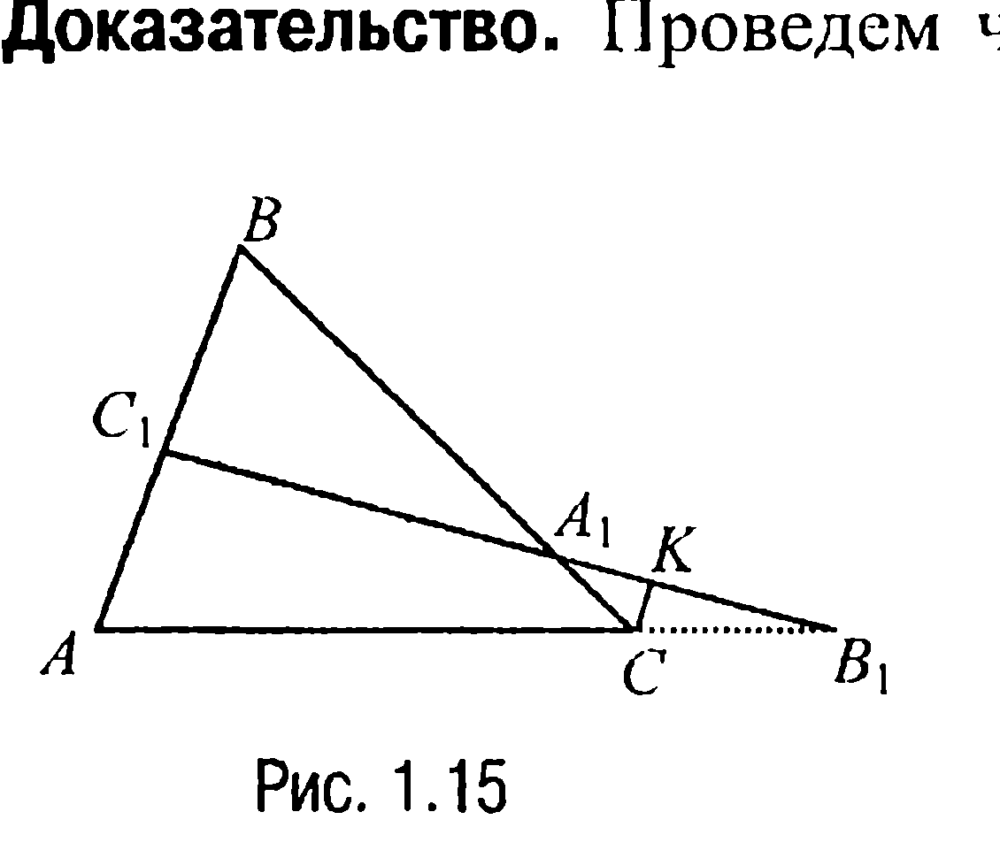

С другой стороны, так как подобными являются также и треугольники $BC_1A_1$ и $CKA_1$ (задача 2.1), то $\frac{C_1B}{CK} = \frac{BA_1}{A_1C}$ и, следовательно, $CK = \frac{C_1B \cdot A_1C}{BA_1}$. Но в таком случае $\frac{AC_1 \cdot B_1C}{B_1A} = \frac{C_1B \cdot A_1C}{BA_1}$ или $\frac{AC_1}{C_1B} \cdot \frac{BA_1}{A_1C} \cdot \frac{CB_1}{B_1A} = 1$, что и требовалось доказать.

---
**стр. 23**
---

**Свойство 1.15.** *Множество $\mathfrak{M}$ вершин треугольников с одними и теми же основанием $BC$ и высотой $h$ — это множество точек двух прямых, параллельных прямой $BC$ и проходящих на расстоянии $h$ от нее.*

**Доказательство.** Рассмотрим параллельные прямые $l$ и $l'$, проходящие на расстоянии $h$ от прямой $BC$ (рис. 1.16). Пусть $A$ — произвольная точка одной из этих прямых, например, прямой $l$.

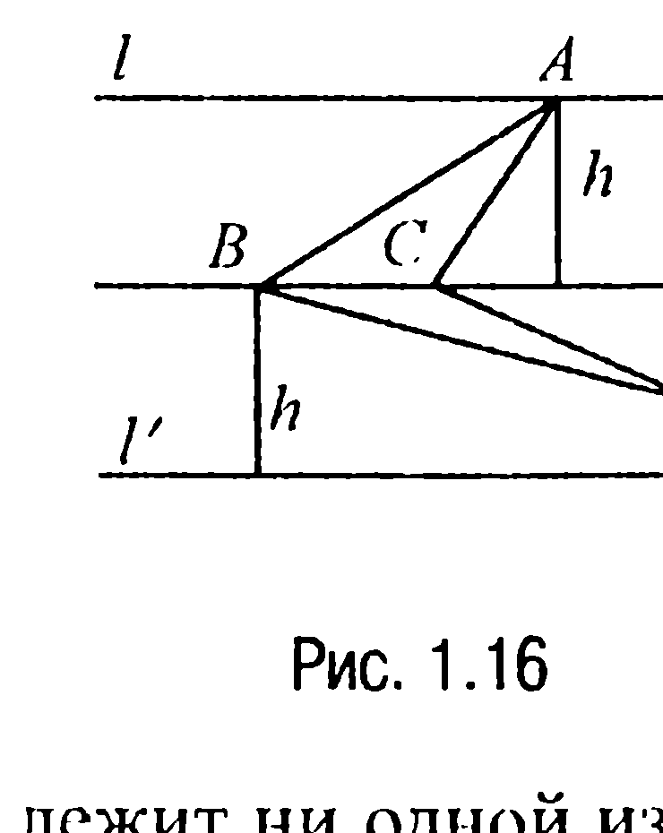

Тогда высота треугольника $BAC$, опущенная из вершины $A$, равна $h$ и, следовательно, любая точка прямых $l$ и $l'$ принадлежит множеству $\mathfrak{M}$.

Если же какая-либо точка $D$ не принадлежит ни одной из двух прямых $l$ и $l'$, то расстояние $h_D$ от точки $D$ до прямой $BC$ меньше или больше высоты $h$ треугольника $BAC$ и, значит, точка $D$ не принадлежит множеству $\mathfrak{M}$. А это и доказывает требуемое.

**Свойство 1.16.** *Средняя линия треугольника параллельна одной из его сторон и равна половине этой стороны.*

**Доказательство.** Проведем через серединную точку $D$ стороны $AB$ треугольника $ABC$ прямую, параллельную стороне $AC$ (рис. 1.17). Тогда по теореме Фалеса (свойство 3.1) эта прямая разделит сторону $BC$ в точке $E$ пополам и, следовательно, совпадет с прямой $DE$, пересекающей середины сторон $AB$ и $BC$ (аксиома 1.1), а это и доказывает первую часть утверждения.

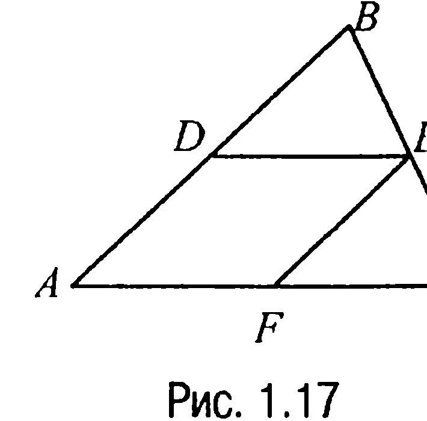

Далее, проведем параллельно прямой $AD$ прямую, проходящую через точку $E$. По теореме Фалеса эта прямая разделит сторону $AC$ в точке $F$ пополам и, таким образом, $AF = FC$.

С другой стороны, $AF = DE$ (поскольку это противолежащие стороны параллелограмма $ADEF$) и, следовательно, $DE = \frac{AC}{2}$, что и требовалось доказать.

---
**стр. 24**
---

**Свойство 1.17X.** *Во всяком треугольнике*
*1) против равных сторон лежат равные углы,*
*2) против большей стороны лежит больший угол.*

**Доказательство.** Первый пункт утверждения следует из того фак-та, что если две стороны треугольника равны, то такой треугольник является равнобедренным и, значит (свойство 1.19X), углы, лежащие против этих равных сторон, также равны. Что же касается второго пункта утверждения, то рассуждения здесь такие. Предположим, что в треугольнике $ABC$ (рис. 1.18) сторона $AB$ больше стороны $BC$. Отложим на стороне $AB$ от вершины $B$ отрезок $BD$, равный меньшей стороне $BC$, и соединим отрезком точки $D$ и $C$. Полученный треугольник $BCD$ окажется равнобедренным с равными углами $BCD$ и $CDB$. Для треугольника $ADC$ угол $CDB$ является внешним, а значит (свойство 1.9), этот угол и равный ему угол $BCD$ будут больше угла $CAD$. Но тогда и тем более угол $BCA$ будет больше угла $CAD$ (угла $CAB$), что и доказывает требуемое.

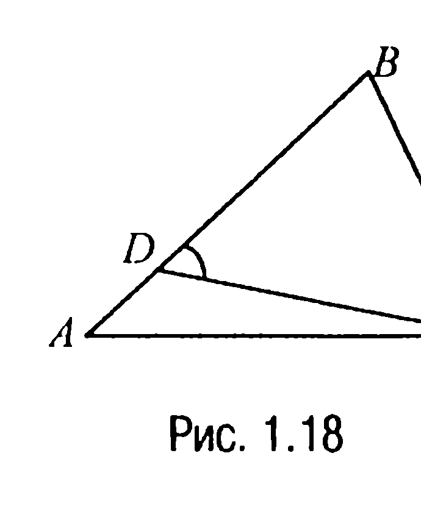

**1.3. Свойства равнобедренного треугольника**

Для равнобедренного треугольника справедливы все свойства произвольного треугольника, но, кроме того, имеют место, например, и следующие свойства.

**Свойство 1.18X.** *В равнобедренном треугольнике биссектриса, проведенная к основанию, является одновременно медианой и высотой.*

**Свойство 1.19X.** *В равнобедренном треугольнике углы при основании равны.*

**Доказательство.** Пусть $BD$ — биссектриса равнобедренного треугольника $ABC$ с основанием $AC$ (рис. 1.19). Тогда $\angle ABD = \angle CBD$ и поскольку в треугольниках $ABD$ и $CBD$ сторона $BD$ общая, а $AB = BC$, то по первому признаку равенства треугольников

---
**стр. 25**
---

$\Delta ABD = \Delta CBD$. Но в таком случае $DA = DC$ и, значит, $BD$ — медиана треугольника $ABC$.

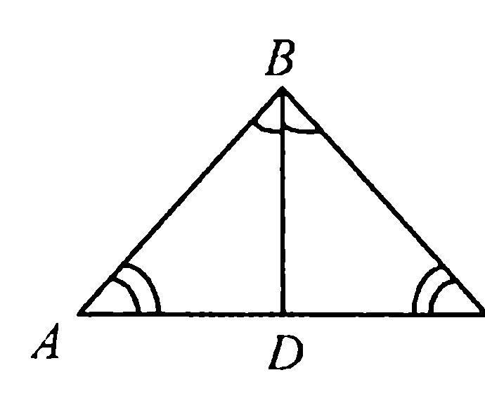

С другой стороны, так как $\angle BDA = \angle BDC$ и эти углы в сумме составляют развернутый угол, то каждый из указанных углов является прямым, а следовательно, $BD$ — высота треугольника $ABC$.

Что же касается углов $DAB$ и $DCB$ при основании треугольника $ABC$, то их равенство вытекает из того, что в равных треугольниках $DAB$ и $DCB$ они лежат против одной и той же стороны $BD$.

**Свойство 1.20X.** *В равнобедренном треугольнике медианы (соответственно высоты или биссектрисы), проведенные к боковым сторонам, равны.*

**Доказательство.** Рассмотрим равнобедренный треугольник $ABC$ с основанием $AC$, у которого $AE$ и $CD$ либо медианы, либо высоты, либо биссектрисы (рис. 1.20). Тогда справедливость свойства очевидным образом вытекает из равенства треугольников $ADC$ и $AEC$.

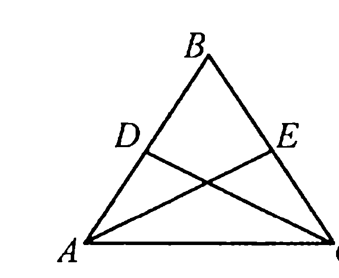

В случае медиан эти треугольники равны по первому признаку равенства треугольников, а в случаях высот и биссектрис — по второму признаку равенства треугольников.

**1.4. Свойства прямоугольного треугольника**

Для прямоугольного треугольника справедливы все свойства произвольного треугольника, но, кроме того, имеют место, например, и такие свойства.

**Свойство 1.21X.** *Медиана, проведенная из вершины прямого угла прямоугольного треугольника, равна половине гипотенузы.*

**Доказательство.** Пусть в треугольнике $ABC$ прямым углом является, например, угол $ACB$ и пусть $\angle CAB = \alpha$. В таком случае $\angle ABC = 90^\circ - \alpha$ (рис. 1.21).

---
**стр. 26**
---

А тогда если на стороне $AB$ выбрать точку $D$ так, чтобы $\angle DCA = \alpha$, то в силу выбора точки $D$ $\angle BCD = 90^\circ - \alpha$ и, значит, треугольники $ADC$ и $CDB$ будут равнобедренными со сторонами $CD = DA$ и $CD = DB$ соответственно. Отсюда $DA = DB$ и, следовательно, $CD$ — медиана, причем $CD = \frac{1}{2}AB$, что и требовалось доказать.

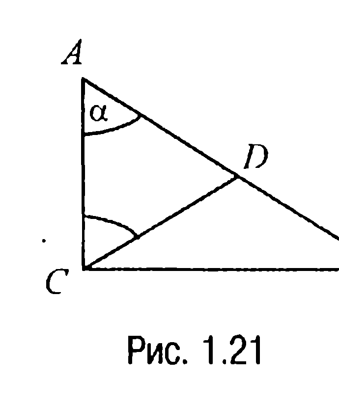

**Свойство 1.22.** *Радиус окружности, описанной около прямоугольного треугольника, равен половине гипотенузы, причем центр описанной окружности совпадает с серединой гипотенузы.*

Справедливость этого свойства очевидным образом следует из свойства 1.21X.

**Свойство 1.23.** *Сумма катетов прямоугольного треугольника равна удвоенной сумме радиусов вписанной и описанной окружностей.*

**Доказательство.** Пусть $O$ — центр вписанной в прямоугольный треугольник $ACB$ (с прямым углом $ACB$) окружности радиуса $r$ и пусть $D, E, F$ — точки касания этой окружности со сторонами $BC, AB, AC$ соответственно (рис. 1.22), причем $BC = a, AC = b, AB = c$. Тогда (свойство 5.1) $BC \perp OD, AC \perp OF, AB \perp OE$, причем $OD = OF = OE = r$.

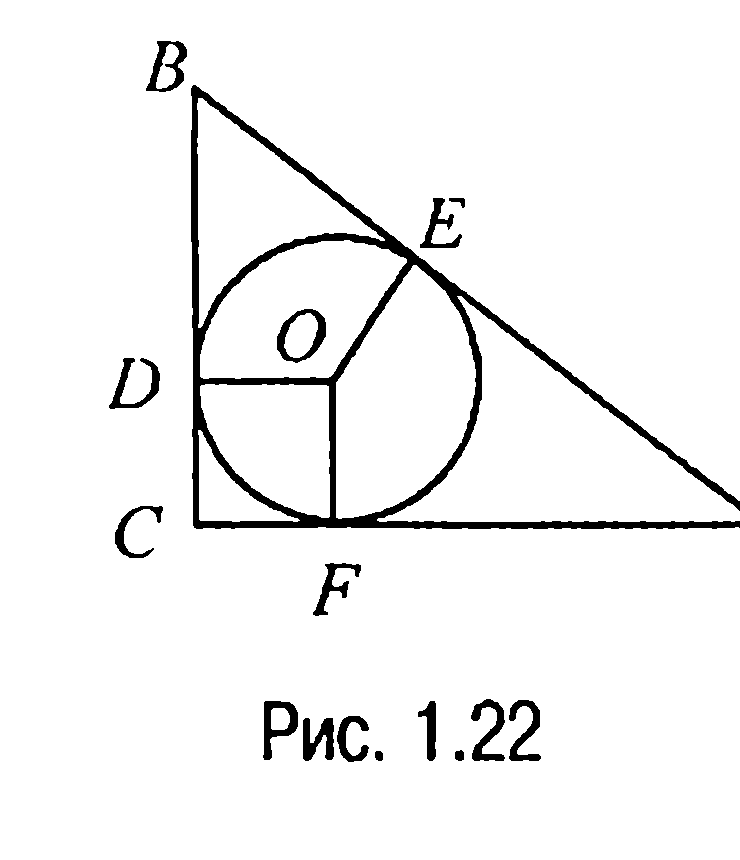

Далее, поскольку $CDOF$ — квадрат со стороной $r$, то $BD = BC - DC = a - r, AF = AC - FC = b - r$, значит (свойство 5.2) $BE = a - r, EA = b - r$ и, таким образом, $AB = BE + EA = a + b - 2r = c$. Но (свойство 1.21X) $c = 2R$, где $R$ — радиус описанной около прямоугольного треугольника $ABC$ окружности, и поэтому $a + b = 2(r + R)$, что и доказывает требуемое.

**Замечание 1.2.** Свойство 1.23 можно переформулировать следующим образом: сумма катетов прямоугольного тре-

---
**стр. 27**
---

угольника равна сумме гипотенузы и удвоенного радиуса вписанной в треугольник окружности.

**ЗАДАЧИ**

**1.1.** Через точку пересечения биссектрис треугольника $ABC$ проведена прямая, параллельная прямой $AC$. Пусть $A_1$ и $C_1$ — точки пересечения этой прямой со сторонами $AB$ и $BC$ соответственно. Доказать, что $A_1C_1 = AA_1 + CC_1$.

**Решение.** Обозначим через $O$ точку пересечения биссектрис треугольника $ABC$ (рис. 1.23). Тогда накрест лежащие углы $CAO$ и $A_1OA$ при параллельных прямых $AC$ и $A_1C_1$ равны (свойство 1.5X) и поэтому треугольник $AA_1O$ — равнобедренный (на основании характеристичности свойства 1.17X) с равными сторонами $AA_1$ и $A_1O$. По аналогичной причине $CC_1 = OC_1$. Таким образом, $A_1C_1 = A_1O + OC_1 = AA_1 + CC_1$.

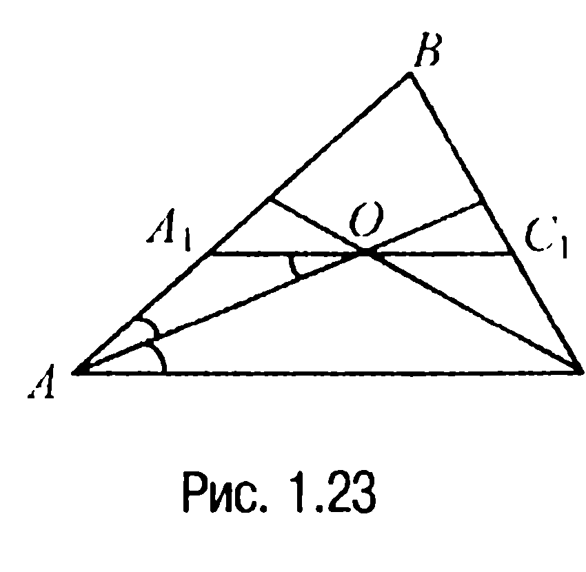

**1.2.** Доказать, что угол треугольника является острым, прямым или тупым, если противолежащая ему сторона соответственно меньше, равна или больше соответствующей удвоенной медианы.

**Решение.** Пусть $BD$ — медиана треугольника $ABC$ (рис. 1.24). Тогда так как в треугольнике против большей стороны лежит больший угол (свойство 1.17X), то, предположив, что $AC < 2BD$, т. е. что $AD < BD$, $DC < BD$, приходим к выводу, что $\angle ABD < \angle BAD$, а $\angle DBC < \angle BCD$, откуда следует, что $\angle ABD + \angle DBC = \angle ABC < \angle BAD + \angle BCD = 180^\circ - \angle ABC$ или $2\angle ABC < 180^\circ$, или $\angle ABC < 90^\circ$. Аналогично рассматриваются случаи, когда $AC = 2BD$ и $AC > 2BD$.

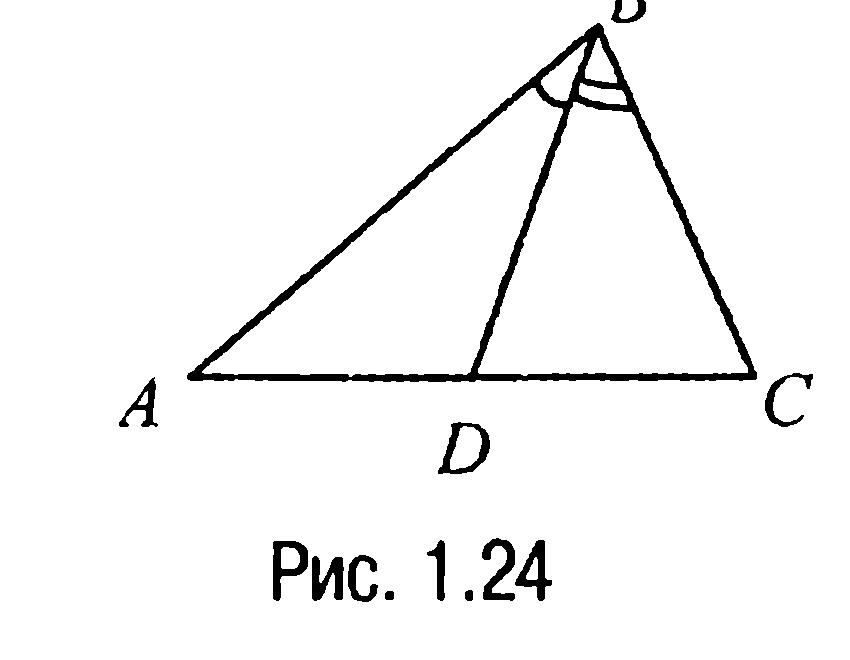

---
**стр. 28**
---

**1.3.** Две окружности касаются друг друга внутренним образом в точке $A$. Из центра $O$ большей окружности проведен радиус $OB$, касающийся меньшей окружности в точке $C$. Найти угол $BAC$.

**Решение.** Пусть $O_1$ — центр меньшей окружности, а $\angle AOB = \alpha$ (рис. 1.25). Тогда так как треугольник $AOB$ равнобедренный, то

$$\angle OBA = 90^\circ - \frac{\alpha}{2}.$$

Далее, $\angle AO_1C = \cup CA = 90^\circ + \alpha$ (как внешний угол треугольника $OCO_1$),

$$\angle ACB = \frac{1}{2} \cup CA = 45^\circ + \frac{\alpha}{2}.$$

Таким образом,

$$\angle BAC = 180^\circ - \angle OBA - \angle ACB = 45^\circ.$$

**Ответ:** $\angle BAC = 45^\circ$.

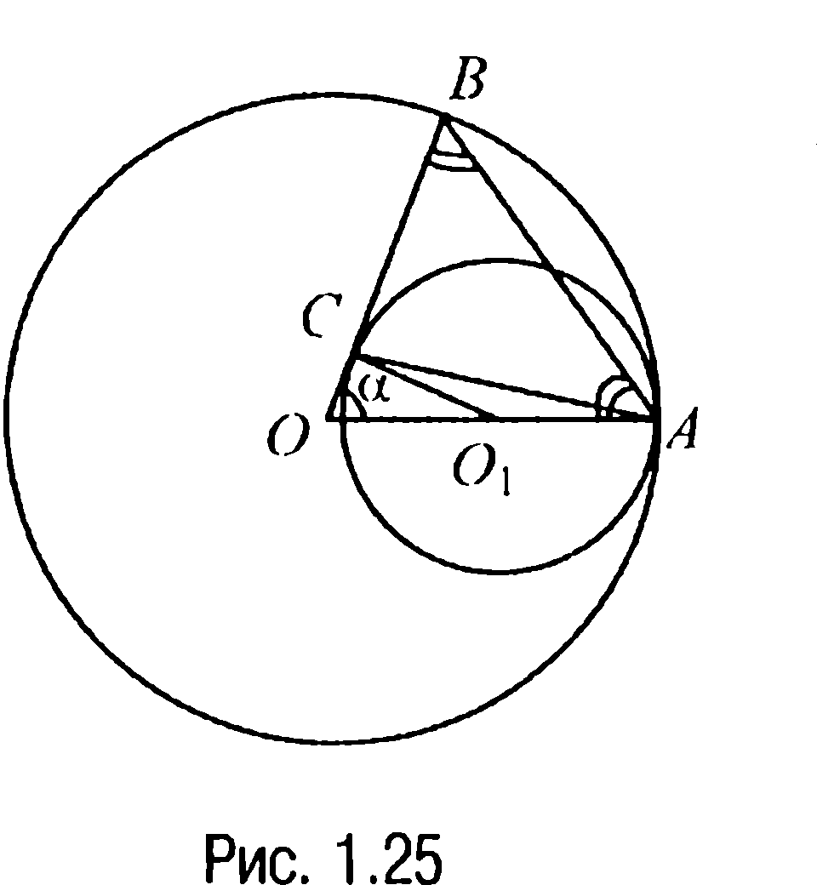

**1.4.** Доказать, что треугольники с равными периметрами и двумя соответственно равными углами равны.

**Решение.** Пусть в треугольниках $ABC$ и $A_1B_1C_1$ (рис. 1.26) $\angle ABC = \angle A_1B_1C_1$, а $\angle CAB = \angle C_1A_1B_1$. На продолжении стороны $AB$ за точку $B$ отложим отрезок $BD = BC$, а на продолжении той же стороны $AB$ за точку $A$ отложим отрезок $AE = AC$. Тогда в равнобедренном треугольнике $CBD$ имеем $\angle BDC = \angle DCB$ (свойство 1.19X), а сумма этих углов $\angle BDC + \angle DCB = \angle ABC$ (свойство 1.9) и, значит, $\angle BDC = \frac{1}{2} \angle ABC$.

Подобным образом доказывается, что $\angle CEA = \frac{1}{2} \angle BAC$.

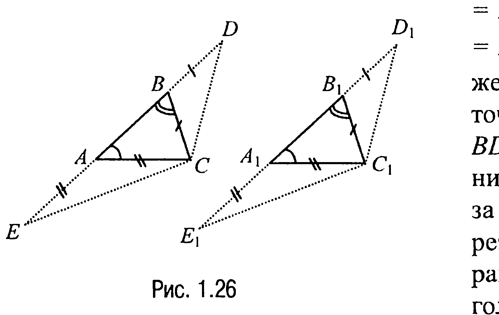

---
**стр. 29**
---

Далее, сделав аналогичные построения для треугольника $A_1B_1C_1$, приходим к выводу, что

$$\angle B_1D_1C_1 = \frac{1}{2} \angle A_1B_1C_1, \text{ а } \angle C_1E_1A_1 = \frac{1}{2} \angle B_1A_1C_1. \text{ Но}$$

$$\angle ABC = \angle A_1B_1C_1, \text{ а } \angle CAB = \angle C_1A_1B_1, \text{ поэтому}$$

$$\angle BDC = \frac{1}{2} \angle ABC = \frac{1}{2} \angle A_1B_1C_1 = \angle B_1D_1C_1, \text{ а}$$

$$\angle CEA = \frac{1}{2} \angle BAC = \frac{1}{2} \angle B_1A_1C_1 = \angle C_1E_1A_1.$$

Но в таком случае в соответствии с признаком равенства треугольников по стороне и прилежащим к ней углам $\Delta CED = \Delta C_1E_1D_1$, поскольку в силу дополнительных построений и условия задачи $ED = E_1D_1 = P$, где $P$ — периметр каждого из треугольников $ABC$ и $A_1B_1C_1$.

А тогда $DC = D_1C_1$ и, таким образом, равнобедренные треугольники $CBD$ и $C_1B_1D_1$ равны. Последнее означает, в частности, что $BC = B_1C_1$.

Наконец, замечая, что $\angle BCA = \angle B_1C_1A_1$, заключаем (на основании признака равенства треугольников по стороне и прилежащим к ней углам), что $\Delta ABC = \Delta A_1B_1C_1$.

**1.5.** *На сторонах $BC, CA, AB$ равнобедренного треугольника $ABC$ с основанием $AB$ отмечены соответственно точки $A_1, B_1, C_1$ таким образом, что прямые $AA_1, BB_1, CC_1$ пересекаются в одной точке. Доказать, что*

$$\frac{AC_1}{C_1B} = \frac{\sin \angle ABB_1 \cdot \sin \angle CAA_1}{\sin \angle BAA_1 \cdot \sin \angle CBB_1}.$$

**Решение.** По теореме Чевы $\frac{AC_1}{C_1B} \cdot \frac{BA_1}{A_1C} \cdot \frac{CB_1}{B_1A} = 1$ (рис. 1.27), значит, $\frac{AC_1}{C_1B} = \frac{B_1A}{CB_1} \cdot \frac{A_1C}{BA_1}$. По теореме синусов из треугольников $CA_1A, A_1BA, AB_1B$ и $B_1CB$ соответственно находим, что

$$A_1C = AC \cdot \frac{\sin \angle CAA_1}{\sin \angle AA_1C}, \quad BA_1 = BA \cdot \frac{\sin \angle BAA_1}{\sin \angle AA_1B},$$

---
**стр. 30**
---

$B_1A = BA \cdot \dfrac{\sin \angle ABB_1}{\sin \angle AB_1B}$, $CB_1 = CB \cdot \dfrac{\sin \angle CBB_1}{\sin \angle BB_1C}$.

А тогда, замечая, что $AC = CB$, имеем следующее равенство:

$$\frac{AC_1}{C_1B} = \frac{BA \cdot \sin \angle ABB_1 \cdot CB \cdot \sin \angle CAA_1 \cdot \sin \angle BB_1C \cdot \sin \angle AA_1B}{\sin \angle AB_1B \cdot \sin \angle AA_1C \cdot CB \cdot \sin \angle CBB_1 \cdot BA \cdot \sin \angle BAA_1}.$$

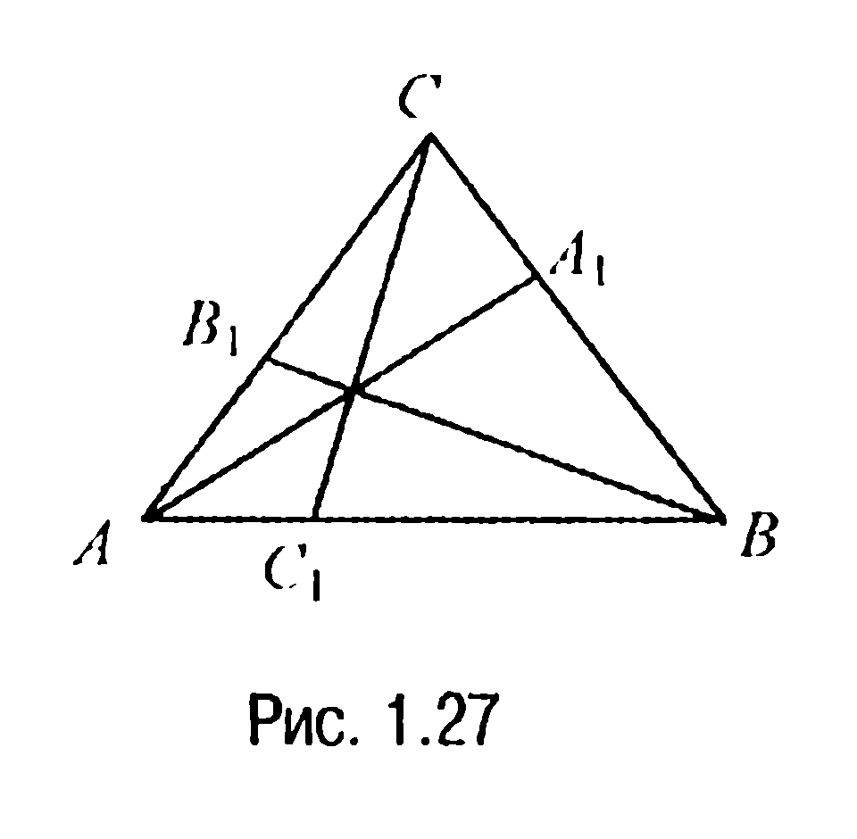

Теперь поскольку $\angle AB_1B = 180^\circ - \angle BB_1C$, $\angle AA_1C = 180^\circ - \angle AA_1B$ и, значит, $\sin \angle AB_1B = \sin \angle BB_1C$, $\sin \angle AA_1C = \sin \angle AA_1B$, то приходим к выводу, что

$$\frac{AC_1}{C_1B} = \frac{\sin \angle ABB_1 \cdot \sin \angle CAA_1}{\sin \angle BAA_1 \cdot \sin \angle CBB_1},$$

а это и требовалось доказать.

**1.6.** В прямоугольный треугольник $ABC$ вписан квадрат так, что две его вершины лежат на гипотенузе, а две другие — на катетах. Радиус окружности, описанной около треугольника $ABC$, относится к стороне квадрата как $13 : 6$. Найти углы треугольника $ABC$.

**Решение.** Пусть $K$, $L$, $M$ и $N$ — вершины квадрата, $\angle BAC = \varphi$, $KN = a$ (рис. 1.28). Тогда $AN = KN \cdot \text{ctg}\varphi = a \cdot \text{ctg}\varphi$,

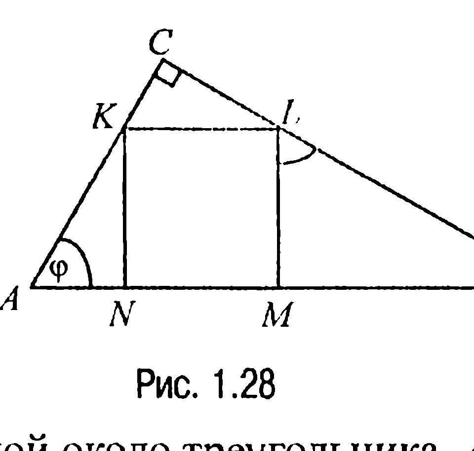

а поскольку $\angle MLB = \angle BAC = \varphi$ (это углы с соответственно перпендикулярными сторонами), то $MB = a \cdot \text{tg}\varphi$. По свойству 1.22 сторона $AB = 2R$, где $R$ — радиус описанной около треугольника $ABC$ окружности. Поэтому

$$AB = a \cdot \text{ctg}\varphi + a + a \cdot \text{tg}\varphi = 2R \text{ или } \text{ctg}\varphi + \text{tg}\varphi + 1 = \frac{2R}{a} = \frac{13}{3}.$$

Отсюда для определения угла $\varphi$ приходим к уравнению $3\text{tg}^2\varphi - 10\text{tg}\varphi + 3 = 0$, решая которое, находим, что $\varphi_1 = \text{arctg}\dfrac{1}{3}$,

---
**стр. 31**
---

$\varphi_2 = \text{arctg} 3$. А тогда угол с вершиной $B$ равен или $\dfrac{\pi}{2} - \text{arctg}\dfrac{1}{3}$, или $\dfrac{\pi}{2} - \text{arctg} 3$.

**Ответ:** $\dfrac{\pi}{2}$; $\text{arctg}\dfrac{1}{3}$ ($\text{arctg} 3$); $\dfrac{\pi}{2} - \text{arctg}\dfrac{1}{3}$ ($\dfrac{\pi}{2} - \text{arctg} 3$).

**1.7.** Пусть точки $C_1$ и $A_1$ сторон $AB$ и $BC$ треугольника $ABC$ соответственно выбраны так, что $AC_1 : C_1B = 2 : 5$, а $BA_1 : A_1C = 6 : 1$. Отрезок $C_1A_1$ пересекает медиану $BM$ треугольника в точке $N$. Найти отношение $BN : NM$.

**Решение.** Обращаясь к рис. 1.29, прежде всего заметим, что прямая $C_1A_1$ не параллельна прямой $AC$ в силу характеристичности свойства 3.2X, поскольку $\dfrac{AC_1}{C_1B} \neq \dfrac{CA_1}{A_1B}$. Обозначим точку пересечения прямой $C_1A_1$ с продолжением стороны $AC$ за точку $C$ через $B_1$. Тогда по теореме Менелая

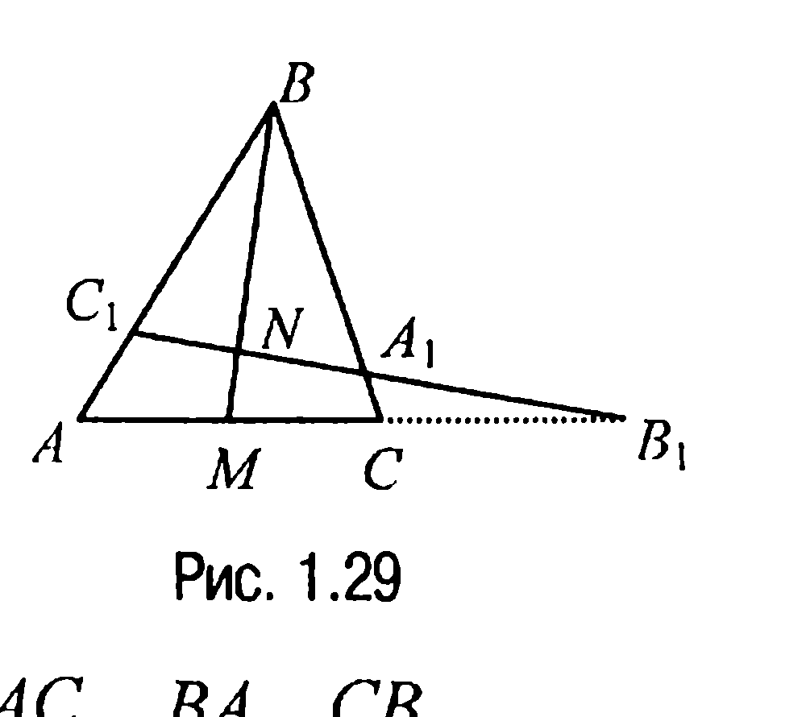

$$\frac{AC_1}{C_1B} \cdot \frac{BA_1}{A_1C} \cdot \frac{CB_1}{B_1A} = 1 \text{ или } \frac{2}{5} \cdot \frac{6}{1} \cdot \frac{CB_1}{B_1A} = 1, \text{ откуда } \frac{CB_1}{B_1A} = \frac{5}{12} \text{ или }$$

$$\frac{CB_1}{2MC + CB_1} = \frac{5}{12}. \text{ Отсюда находим, что } CB_1 = \frac{10}{7} MC. \text{ Но в таком }$$

случае $B_1M = CB_1 + MC = \dfrac{17}{7} MC$, $B_1A = CB_1 + 2MC = \dfrac{24}{7} MC$.

Применяя теперь теорему Менелая к треугольнику $ABM$ и прямой $C_1B_1$, имеем равенство $\dfrac{AC_1}{C_1B} \cdot \dfrac{BN}{NM} \cdot \dfrac{MB_1}{B_1A} = 1$ или равенство

$$\frac{2}{5} \cdot \frac{BN}{NM} \cdot \frac{\frac{17}{7} MC}{\frac{24}{7} MC} = 1, \text{ откуда следует, что } \frac{BN}{NM} = \frac{60}{17}.$$

**Ответ:** $BN : NM = 60 : 17$.

---
**стр. 32**
---

▼ **1.8.** *Доказать, что высота $CD$, опущенная из вершины прямого угла $ACB$ треугольника $ABC$, равна сумме радиусов окружностей, вписанных в треугольники $ABC$, $ACD$ и $DCB$.*

**Решение.** Пусть в треугольнике $ABC$ (рис. 1.30) $AC = b$, $CB = a$, $BD = a_c$, $DA = b_c$, $CD = h$, а $r_1$, $r_2$ и $r$ — радиусы окружностей, вписанных соответственно в треугольники $ACD$, $DCB$ и $ABC$. Тогда в соответствии с замечанием 1.2 справедливы равенства:

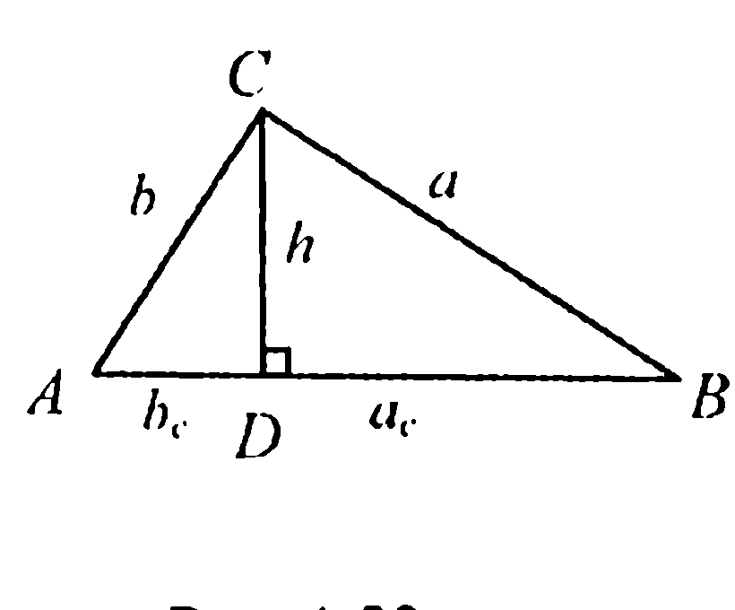

$$r_1 = \frac{1}{2}(b_c + h - b), \quad r_2 = \frac{1}{2}(a_c + h - a),$$

$$r = \frac{1}{2}(b + a - a_c - b_c).$$

Складывая эти равенства, получаем, что $r_1 + r_2 + r = h$, а это и требовалось доказать.

**ЗАДАЧИ ДЛЯ САМОСТОЯТЕЛЬНОГО РЕШЕНИЯ**

**1.1С.** *Доказать, что если при пересечении двух прямых, лежащих в одной плоскости, третьей прямой*

*1) какие-нибудь соответственные углы равны или*

*2) какие-нибудь накрест лежащие углы равны, или*

*3) сумма каких-нибудь двух внутренних или двух внешних односторонних углов равна $180^\circ$,*

*то такие две прямые параллельны.*

**1.2С (Обратная теорема Чевы).** *На сторонах $BC$, $AC$, $AB$ треугольника $ABC$ отмечены соответственно точки $A_1$, $B_1$, $C_1$. Доказать, что если $\dfrac{AC_1}{C_1B} \cdot \dfrac{BA_1}{A_1C} \cdot \dfrac{CB_1}{B_1A} = 1$, то прямые $AA_1$, $BB_1$, $CC_1$ пересекаются в одной точке.*

**1.3С.** *Доказать, что треугольники с соответственно параллельными сторонами подобны.*
