## 1.2. Равенство и подобие треугольников

---
**стр. 33**
---

**1.4С (Обратная теорема Менелая).** *На сторонах $BC$, $AB$ и продолжении стороны $AC$ треугольника $ABC$ за точку $C$ отмечены соответственно точки $A_1$, $C_1$ и $B_1$. Доказать, что если $\dfrac{AC_1}{C_1B}\cdot\dfrac{BA_1}{A_1C}\cdot\dfrac{CB_1}{B_1A}=1$, то точки $A_1$, $B_1$, $C_1$ лежат на одной прямой.*

**1.5С.** *Радиус окружности, вписанной в прямоугольный треугольник, равен полуразности его катетов. Найти отношение большего катета к меньшему.*

▼ **1.6С.** *Доказать, что если в треугольник $ABC$ вписана окружность, которая касается сторон $BC$, $AC$ и $AB$ в точках $A_1$, $B_1$ и $C_1$ соответственно, то отрезки $AA_1$, $BB_1$ и $CC_1$ пересекаются в одной точке.*

**§ 2. РАВЕНСТВО И ПОДОБИЕ ТРЕУГОЛЬНИКОВ**

**2.1. Признаки равенства произвольных треугольников**

**Признак равенства по двум сторонам и углу между ними.** *Если две стороны и угол между ними одного треугольника соответственно равны двум сторонам и углу между ними другого треугольника, то такие треугольники равны.*

**Доказательство.** Пусть у треугольников $ABC$ и $A_1B_1C_1$, например, стороны $AB = A_1B_1$, $AC = A_1C_1$, а $\angle CAB = \angle C_1A_1B_1$ (рис. 2.1). Прямая $A_1C_1$ разбивает плоскость на две полуплоскости (аксиома 1.2), поэтому на основании аксиомы 1.6 существует треугольник $A_1B_2C_2$, равный треугольнику $ABC$, с вершиной $C_2$ на луче $A_1C_1$ и вершиной $B_2$ в той же полу-

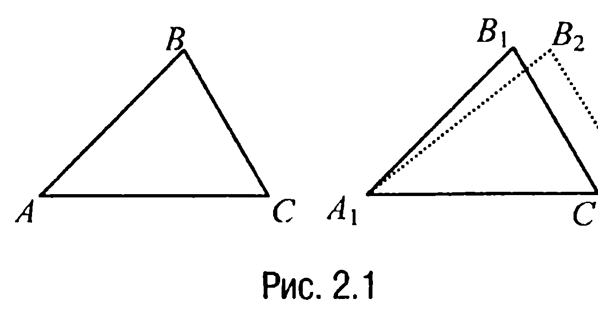

---
**стр. 34**
---

плоскости относительно прямой $A_1C_1$, где лежит и вершина $B_1$ треугольника $A_1B_1C_1$ (рис. 2.1).

В соответствии с аксиомой 1.4 вершины $C_1$ и $C_2$ совпадают (рис. 2.2), совпадают на основании аксиомы 1.5 и лучи $A_1B_2$ и $A_1B_1$ (рис. 2.3). На основании аксиомы 1.4 совпадают также вершины $B_1$, $B_2$. <!-- вероятная опечатка оригинала: «совпадают, совпадают на основании...» -->

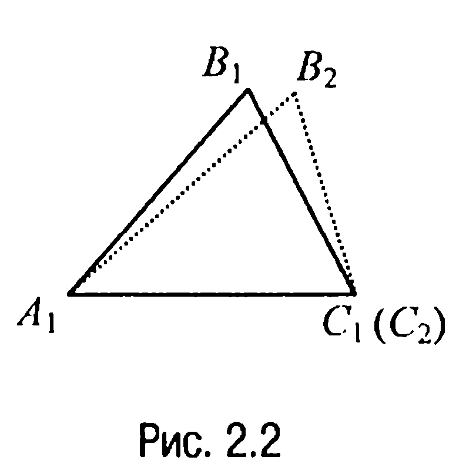 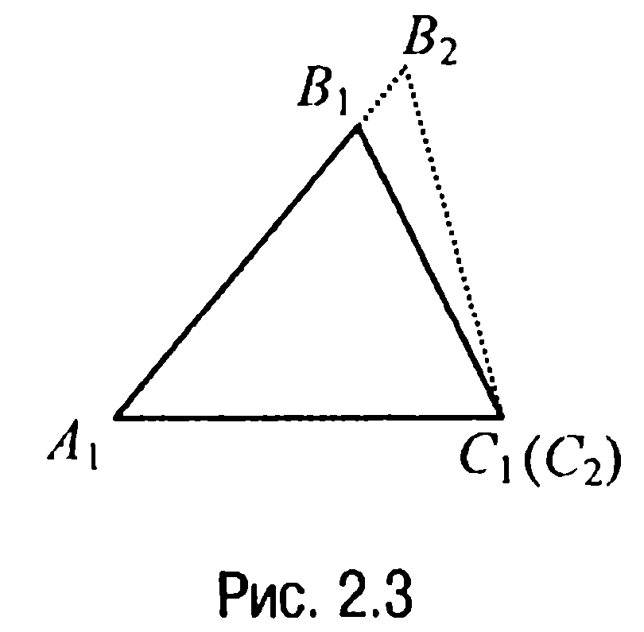 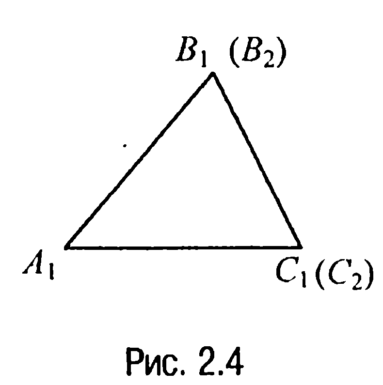

Таким образом, треугольник $A_1B_1C_1$ совпадает с треугольником $A_1B_2C_2$, который равен треугольнику $ABC$. Но это и означает, что треугольник $A_1B_1C_1$ равен треугольнику $ABC$, что и требовалось доказать.

**Признак равенства по стороне и прилежащим к ней углам.** *Если сторона и прилежащие к ней углы одного треугольника соответственно равны стороне и прилежащим к ней углам другого треугольника, то такие треугольники равны.*

**Доказательство.** Пусть у треугольников $ABC$ и $A_1B_1C_1$, например, $AC = A_1C_1$, $\angle CAB = \angle C_1A_1B_1$, $\angle BCA = \angle B_1C_1A_1$ (рис. 2.1). Тогда, рассуждая как и при доказательстве первого признака, приходим к выводу, что существует треугольник $A_1B_2C_2$, равный треугольнику $ABC$, с вершиной $C_2$ на луче $A_1C_1$ и вершиной $B_2$ в той же полуплоскости относительно прямой $A_1C_1$, где лежит и вершина $B_1$ треугольника $A_1B_1C_1$ (рис. 2.1).

На основании аксиомы 1.4 вершины $C_1$ и $C_2$ должны совпадать (рис. 2.2). В соответствии же с аксиомой 1.1 луч $A_1B_2$ будет совпадать с лучом $A_1B_1$, а луч $C_1B_2$ — с лучом $C_1B_1$ и, таким образом, вершина $B_2$ совпадет с вершиной $B_1$ (рис. 2.4). Но это будет означать, что треугольник $A_1B_1C_1$ совпадает с треугольником $A_1B_2C_2$, а значит, равен треугольнику $ABC$.

---
**стр. 35**
---

**Признак равенства по трем сторонам.** *Если три стороны одного треугольника равны трем сторонам другого треугольника, то такие треугольники равны.*

**Доказательство.** Пусть у треугольников $ABC$ и $A_1B_1C_1$ (рис. 2.5) стороны $AB = A_1B_1$, $BC = B_1C_1$, $AC = A_1C_1$, но при этом треугольники не равны. Тогда $\angle CAB \neq \angle C_1A_1B_1$, $\angle ABC \neq \angle A_1B_1C_1$, $\angle BCA \neq \angle B_1C_1A_1$, так как уже при одном равенстве углов треугольники были бы равны по первому признаку.

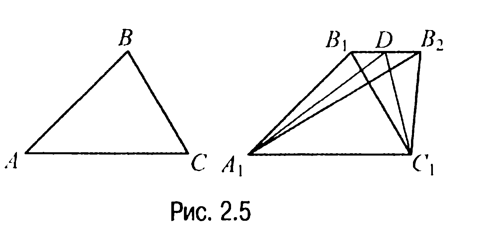

Обозначим через $A_1B_2C_1$ (рис. 2.5) треугольник, равный треугольнику $ABC$, у которого вершина $B_2$ лежит в одной полуплоскости с вершиной $B_1$ относительно прямой $A_1C_1$ (такой треугольник существует по аксиоме 1.6).

Тогда так как $A_1B_2 = A_1B_1$, а $B_1C_1 = B_2C_1$, то треугольники $A_1B_1B_2$ и $C_1B_1B_2$ — равнобедренные, и поэтому отрезки $A_1D$ и $C_1D$, где точка $D$ — середина отрезка $B_1B_2$, будут медианами, а значит (свойство 1.18*), и высотами треугольников $A_1B_1B_2$ и $C_1B_1B_2$ соответственно. Таким образом, приходим к выводу, что две не совпадающие прямые $A_1D$ и $C_1D$ перпендикулярны к одной прямой $B_1B_2$ в одной точке. Но такого быть не может, так как через точку $D$ к прямой $B_1B_2$ можно провести только одну перпендикулярную прямую. Полученное противоречие и доказывает требуемое утверждение.

**2.2. Признаки равенства прямоугольных треугольников**

**Признак равенства по двум катетам.** *Если катеты одного прямоугольного треугольника соответственно равны катетам другого прямоугольного треугольника, то такие треугольники равны.*

Справедливость этого признака следует из признака равенства треугольников по двум сторонам и углу между ними.

---
**стр. 36**
---

**Признак равенства по катету и острому углу.** *Если катет и острый угол одного прямоугольного треугольника соответственно равны катету и острому углу другого прямоугольного треугольника, то такие треугольники равны.*

Справедливость этого признака следует из признака равенства треугольников по стороне и прилежащим к ней углам.

**Признак равенства по гипотенузе и острому углу.** *Если гипотенуза и острый угол одного прямоугольного треугольника соответственно равны гипотенузе и острому углу другого прямоугольного треугольника, то такие треугольники равны.*

**Доказательство.** Так как в прямоугольном треугольнике сумма острых углов равна $90^\circ$, то из равенства одних острых углов в двух прямоугольных треугольниках следует и равенство других острых углов этих треугольников. А тогда справедливость признака вытекает из признака равенства треугольников по стороне и прилежащим к ней углам.

**Признак равенства по гипотенузе и катету.** *Если гипотенуза и катет одного прямоугольного треугольника соответственно равны гипотенузе и катету другого прямоугольного треугольника, то такие треугольники равны.*

**Доказательство.** Пусть у треугольников $ABC$ и $A_1B_1C_1$ (рис. 2.6)

$\angle BCA = \angle B_1C_1A_1 = 90^\circ,$
$AB = A_1B_1, AC = A_1C_1.$

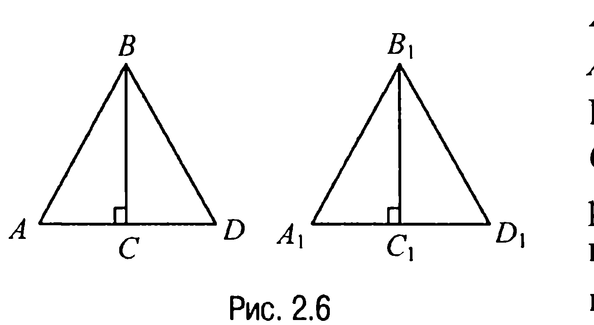

Построим треугольники $CBD$ и $C_1B_1D_1$ (рис. 2.6), равные треугольникам $CBA$ и $C_1B_1A_1$ соответственно (такие треугольники можно построить по аксиоме 1.6). В результате такого построения в соответствии с признаком равенства треугольников по трем сторонам будут равными треугольники $ABD$ и $A_1B_1D_1$ ($AB = A_1B_1$ по условию; $AD = A_1D_1$, так как снова по условию $AC = A_1C_1$; $BD = B_1D_1$, поскольку $BD = AB$, а $B_1D_1 = A_1B_1$).

---
**стр. 37**
---

Из равенства же треугольников $ABD$ и $A_1B_1D_1$ следует, например, равенство углов $DAB$ и $D_1A_1B_1$. Но тогда треугольники $ABC$ и $A_1B_1C_1$ будут равными как треугольники, имеющие соответственно по две равные стороны и равные углы между ними.

**2.3. Признаки подобия произвольных треугольников**

Треугольники называются **подобными**, если они переводятся друг в друга преобразованием подобия. Из свойств преобразования подобия (§ 21, с. 299) следует, что треугольники являются **подобными**, если их соответствующие стороны пропорциональны, а углы, заключенные между пропорциональными сторонами, равны.

**Признак подобия по двум углам.** *Если два угла одного треугольника равны двум углам другого треугольника, то такие треугольники подобны.*

**Доказательство.** Пусть у треугольников $ABC$ и $A_1B_1C_1$ (рис. 2.7)

$\angle CAB = \angle C_1A_1B_1$, $\angle BCA =$
$= \angle B_1C_1A_1$, и пусть $\dfrac{AC}{A_1C_1} = k$.

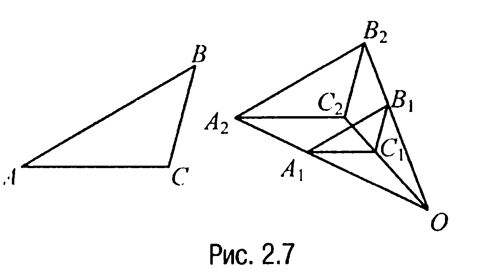

С учетом последнего равенства построим треугольник $A_2B_2C_2$, гомотетичный треугольнику $A_1B_1C_1$ с центром гомотетии $O$ и коэффициентом подобия $k$ (рис. 2.7). В результате такого построения треугольник $A_2B_2C_2$ окажется равным треугольнику $ABC$ (по свойству 21.7 справедливы равенства $\angle C_2A_2B_2 = \angle C_1A_1B_1$, $\angle B_2C_2A_2 = \angle B_1C_1A_1$ и, значит, $\angle CAB = \angle C_2A_2B_2$, $\angle BCA = \angle B_2C_2A_2$, причем $A_2C_2 = k A_1C_1 = AC$ и, таким образом, мы находимся в условиях признака равенства треугольников по стороне и прилежащим к ней углам).

Итак, треугольники $A_1B_1C_1$ и $A_2B_2C_2$ гомотетичны и, значит, подобны; треугольники $A_2B_2C_2$ и $ABC$ равны и, следовательно, также подобны.

Отсюда вывод: треугольники $ABC$ и $A_1B_1C_1$ подобны.

---
**стр. 38**
---

**Признак подобия по двум сторонам и углу между ними.** *Если две стороны одного треугольника пропорциональны двум сторонам другого треугольника и углы, образованные этими сторонами, равны, то такие треугольники подобны.*

**Доказательство.** Пусть у треугольников $ABC$ и $A_1B_1C_1$ (рис. 2.7) $AB = kA_1B_1$, $BC = kB_1C_1$, где $k$ --- коэффициент пропорциональности, $\angle ABC = \angle A_1B_1C_1$. Построим треугольник $A_2B_2C_2$, гомотетичный треугольнику $A_1B_1C_1$ с центром гомотетии $O$ и коэффициентом подобия $k$ (рис. 2.7).

В результате такого построения треугольник $A_2B_2C_2$ будет равен треугольнику $ABC$ (по свойству 21.7 углы $A_2B_2C_2$ и $A_1B_1C_1$ равны и, значит, $\angle ABC = \angle A_2B_2C_2$, причем $A_2B_2 = kA_1B_1 = AB$, $B_2C_2 = kB_1C_1 = BC$ и, следовательно, мы находимся в условиях признака равенства треугольников по двум сторонам и углу между ними).

Итак, треугольники $A_1B_1C_1$ и $A_2B_2C_2$ гомотетичны и, значит, подобны; треугольники $A_2B_2C_2$ и $ABC$ равны и, таким образом, также подобны.

**Вывод:** треугольники $ABC$ и $A_1B_1C_1$ подобны.

**Признак подобия по трем сторонам.** *Если три стороны одного треугольника пропорциональны трем сторонам другого треугольника, то такие треугольники подобны.*

**Доказательство.** Пусть у треугольников $ABC$ и $A_1B_1C_1$ (рис. 2.7) $AB = kA_1B_1$, $BC = kB_1C_1$, $AC = kA_1C_1$, где $k$ --- коэффициент пропорциональности. Построим треугольник $A_2B_2C_2$, гомотетичный треугольнику $A_1B_1C_1$ с центром гомотетии $O$ и коэффициентом подобия $k$ (рис. 2.7).

В результате такого построения треугольник $A_2B_2C_2$ равен треугольнику $ABC$, так как $A_2B_2 = kA_1B_1 = AB$, $B_2C_2 = kB_1C_1 = BC$, $A_2C_2 = kA_1C_1 = AC$, и, следовательно, мы находимся в условиях признака равенства треугольников по трем сторонам.

Итак, треугольники $A_1B_1C_1$ и $A_2B_2C_2$ гомотетичны и, значит, подобны; треугольники $A_2B_2C_2$ и $ABC$ равны и поэтому также подобны.

**Вывод:** треугольники $ABC$ и $A_1B_1C_1$ подобны.

---
**стр. 39**
---

**2.4. Признаки подобия прямоугольных треугольников**

**Признак подобия по одному острому углу.** *Если острый угол одного прямоугольного треугольника равен острому углу другого прямоугольного треугольника, то такие треугольники подобны.*

Справедливость этого признака следует из того факта, что у прямоугольных треугольников всегда есть еще равные углы — прямые углы, а значит, треугольники подобны по признаку подобия по двум углам.

**Признак подобия по пропорциональности двух катетов.** *Если катеты одного прямоугольного треугольника пропорциональны катетам другого прямоугольного треугольника, то такие треугольники подобны.*

Справедливость признака следует из того факта, что углы между катетами прямоугольных треугольников равны $90^\circ$ и, следовательно, треугольники подобны по признаку подобия по двум сторонам и углу между ними.

**Признак подобия по пропорциональности гипотенузы и катета.** *Если гипотенуза и катет одного прямоугольного треугольника пропорциональны гипотенузе и катету другого прямоугольного треугольника, то такие треугольники подобны.*

**Доказательство.** Пусть треугольники $ABC$ и $A_1B_1C_1$ таковы, что $AB = kA_1B_1$, $BC = kB_1C_1$, где $k$ — коэффициент пропорциональности, $\angle BCA = \angle B_1C_1A_1 = 90^\circ$. Тогда на основании теоремы Пифагора имеем

$$AC = \sqrt{AB^2 - BC^2} = k\sqrt{A_1B_1^2 - B_1C_1^2} = k \cdot A_1C_1$$

и справедливость утверждения следует, например, из признака подобия произвольных треугольников по трем сторонам.

**Замечание 2.1.** Из определения подобия фигур (§ 21, с. 294) следует, что в подобных фигурах все соответственные линейные элементы пропорциональны. В частности, в подобных треуголь-

---
**стр. 40**
---

никах отношение периметров, высот, медиан, биссектрис, радиусов вписанных и описанных окружностей равно отношению соответственных сторон.

**ЗАДАЧИ**

▼ **2.1.** *Доказать, что прямая, параллельная одной из сторон треугольника и пересекающая в различных точках две другие его стороны или их продолжения, отсекает треугольник, подобный данному.*

**Решение.** Рассмотрим рис. 2.8 и рис. 2.9, где заданным является треугольник $ABC$ и где $A_1C_1 \parallel AC$.

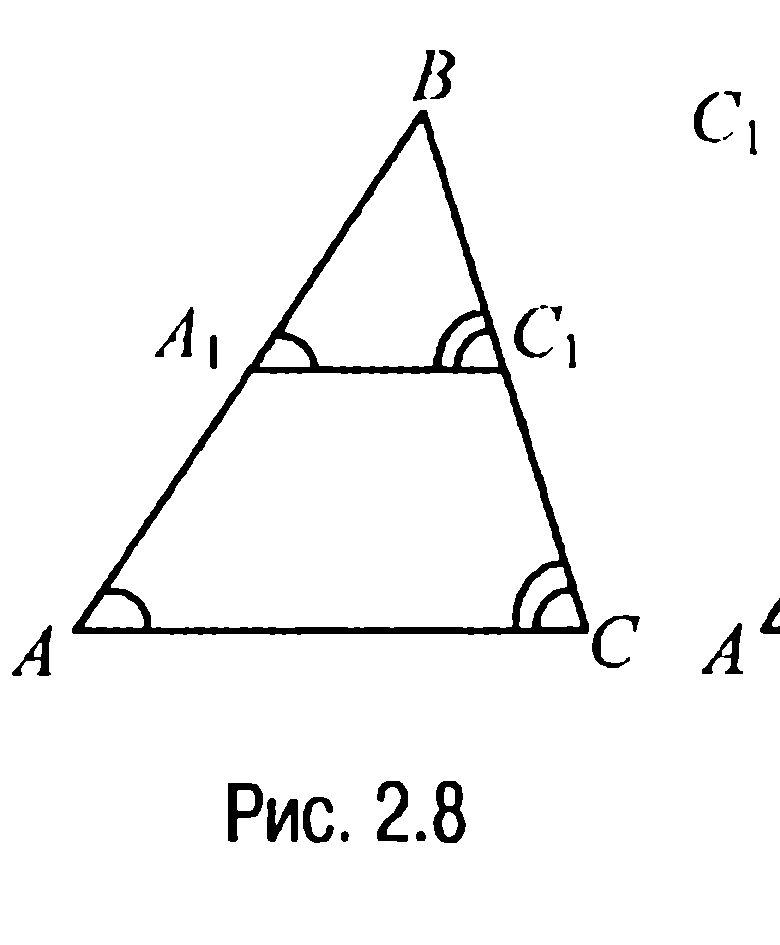 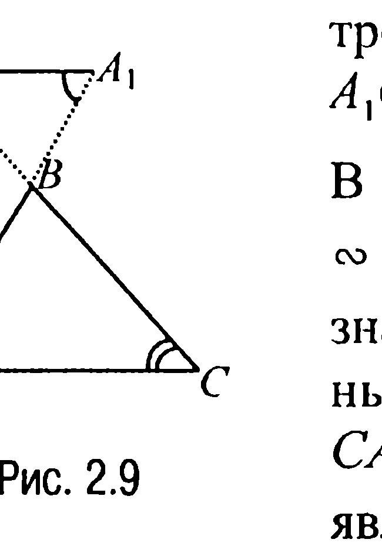

В обоих случаях $\Delta ABC \sim \Delta A_1BC_1$ по первому признаку подобия произвольных треугольников (углы $CAB$ и $C_1A_1B$, $BCA$ и $BC_1A_1$ являются на рис. 2.8 (2.9) соответственными (внутренними накрест лежащими) углами, а значит, равными по свойству 1.5X).

**2.2.** *Прямая $l$ пересекает стороны $AB$ и $AD$ параллелограмма $ABCD$ в точках $E$ и $F$ соответственно. Пусть $G$ — точка пересечения прямой $l$ с диагональю параллелограмма $AC$. Доказать, что*

$$\frac{AB}{AE} + \frac{AD}{AF} = \frac{AC}{AG}.$$

**Решение.** Пусть $BK$ и $DL$, где $K$ и $L$ — точки диагонали $AC$, отрезки, лежащие на прямых, параллельных прямой $l$ (рис. 2.10).

Поскольку треугольники $ABK$ и $AEG$ подобны, то $\dfrac{AB}{AE} = \dfrac{AK}{AG}$. Из подобия же треугольников $ALD$ и $AGF$ следует, что $\dfrac{AD}{AF} = \dfrac{AL}{AG}$.

---
**стр. 41**
---

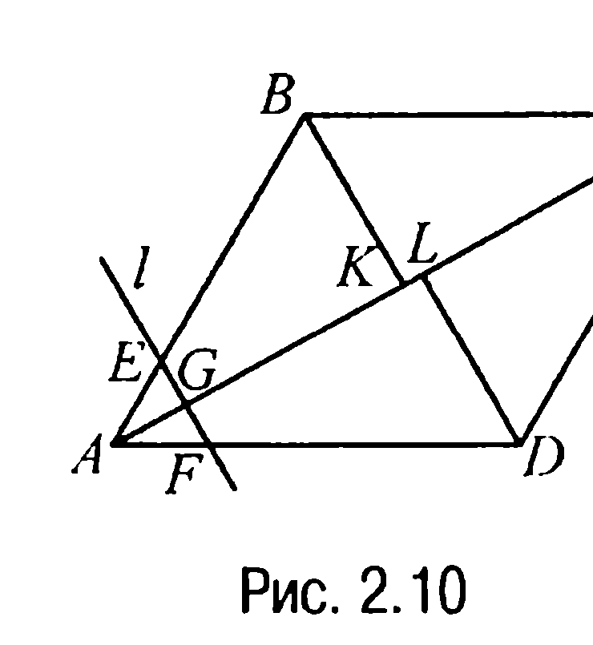

Далее, так как стороны треугольников $ABK$ и $DLC$ попарно параллельны, а $AB=CD$, то эти треугольники равны и, значит, $AK=LC$. Отсюда и следует, что

$$\frac{AB}{AE} + \frac{AD}{AF} = \frac{AK}{AG} + \frac{AL}{AG} = \frac{AK + AL}{AG} =$$
$$= \frac{LC + AL}{AG} = \frac{AC}{AG}.$$

**2.3.** *В треугольнике $ABC$ точки $D$ и $E$ — середины сторон $AC$ и $BC$ соответственно, окружность, описанная около треугольника $CDE$, проходит через точку $O$ пересечения медиан треугольника $ABC$. Найти медиану $CK$, если $AB = c$, $AE = BD$.*

**Решение.** На основании характеристичности свойства 1.20X из равенства медиан $AE$ и $BD$ треугольника $ABC$ следует, что равными в треугольнике $ABC$ будут и стороны $AC$ и $BC$ (рис. 2.11). Но тогда $CD = CE$, а $OD = OE = \dfrac{1}{3} AE = \dfrac{1}{3} BD$ (свойство 6.5), т. е. треугольники $ODC$ и $OEC$ с общей стороной $OC$ равны и, таким образом, $\angle CDO = \angle CEO$.

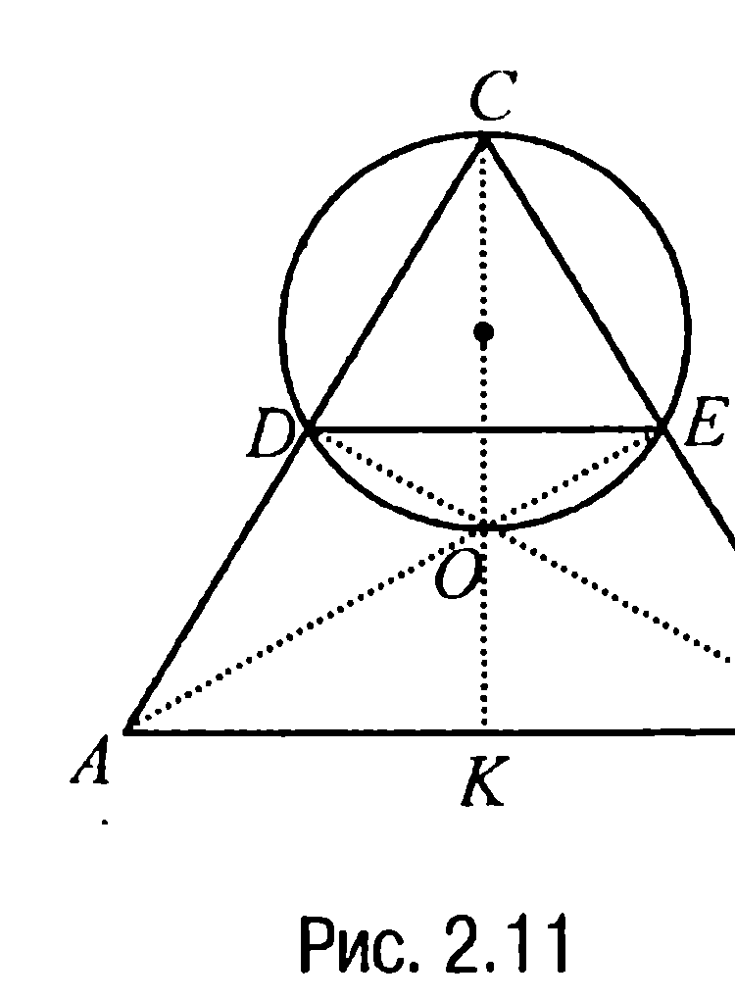

Далее, четырехугольник $ODCE$ вписан в окружность, поэтому по свойству 15.1X справедливо равенство $\angle CDO + \angle CEO = 180^\circ$, которое с учетом равенства суммируемых углов означает, что $\angle CDO = \angle CEO = 90^\circ$.

Но в таком случае $\Delta CDB = \Delta ADB$ (эти треугольники имеют по два равных катета), откуда следует, что $AB = BC = c$, т. е. треугольник $ABC$ — равносторонний.

А тогда из прямоугольного треугольника $BKC$ по теореме Пифагора находим, что $CK = \sqrt{BC^2 - KB^2} = \sqrt{c^2 - \dfrac{c^2}{4}} = \dfrac{c\sqrt{3}}{2}$.

**Ответ:** $CK = \dfrac{c\sqrt{3}}{2}$.

---
**стр. 42**
---

**2.4.** *Доказать, что площадь трапеции равна произведению одной из ее боковых сторон на перпендикуляр, опущенный из середины другой боковой стороны на первую сторону или на ее продолжение.*

**Решение.** Пусть четырехугольник $ABCD$ (рис. 2.12) — заданная трапеция и пусть $K$ — серединная точка отрезка $CD$. Докажем, что площадь трапеции $ABCD$ равна произведению боковой стороны $CD$ на перпендикуляр $KP$, проведенный из точки $K$ к прямой $AB$, т. е. $S_{ABCD} = AB \cdot KP$, где $KP \perp AB$.

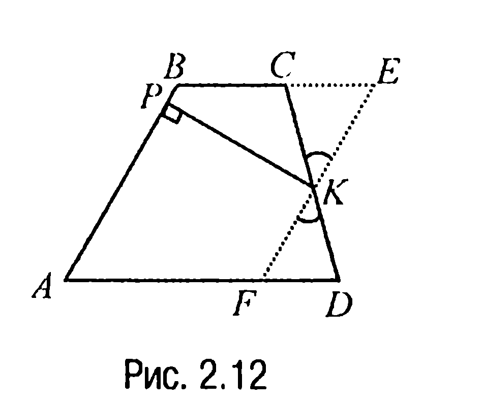

Действительно, проведем через точку $K$ прямую, параллельную $AB$. Пусть $E$ и $F$ — точки пересечения этой прямой с прямыми $BC$ и $AD$ соответственно. Тогда четырехугольник $ABEF$ — параллелограмм и, значит, его площадь $S_{ABEF} = AB \cdot KP$. Но поскольку $\Delta EKC = \Delta FKD$ (у этих треугольников $FK = KE$, $CK = KD$, $\angle EKC = \angle FKD$), то $S_{ABCD} = S_{ABEF} = AB \cdot KP$.

**2.5.** *Около прямоугольного треугольника $ABC$ описана окружность. Расстояния от концов гипотенузы до прямой, которая касается окружности в точке $C$, соответственно равны $a$ и $b$. Найти катеты $AC$ и $BC$.*

**Решение.** Из условия задачи следует, что $\angle ACB = 90^\circ$ (рис. 2.13). Пусть $l$ — прямая, которая касается в точке $C$ окружности, описанной около треугольника $ABC$, $AF = a$ и $BE = b$ — отрезки, перпендикулярные к прямой $l$, $CD$ — высота треугольника $ABC$. Тогда из равенств $\angle ACD = \angle CBA$ (это углы с соответственно перпендикулярными сторонами) и $\angle CBA = \angle FCA = \frac{1}{2}\smile AC$ вытекает, что $\angle FCA = \angle ACD$ и, таким образом, треугольники $AFC$ и $CDA$ с общей гипотенузой $AC$ оказываются равными. Но в таком случае $AD = a$.

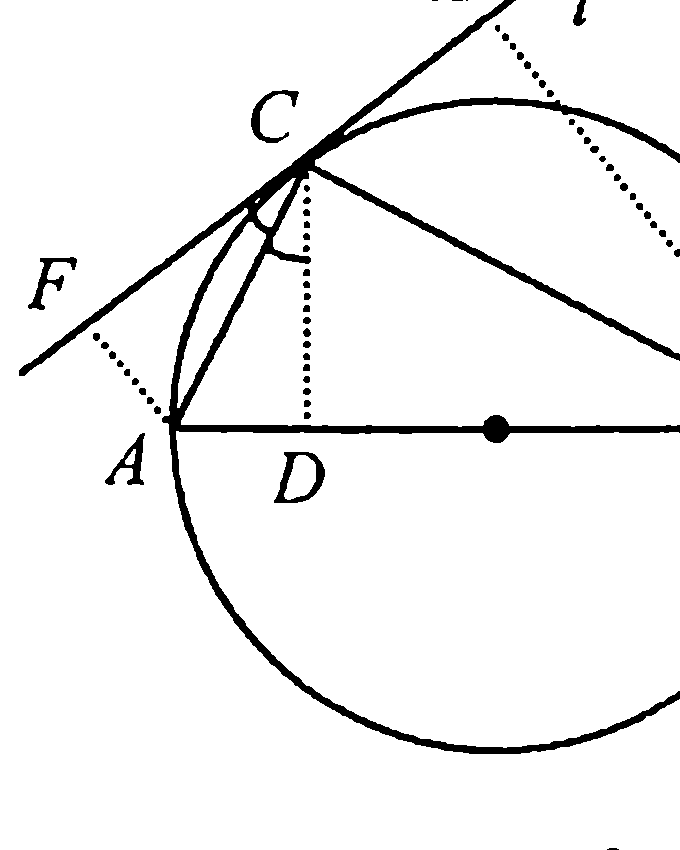

---
**стр. 43**
---

Аналогично из равенства прямоугольных треугольников $BDC$ и $BEC$ находим, что $DB = b$.

Следовательно, $AC^2 = AD \cdot AB = a(a + b)$ (свойство 3.9) и, значит, $AC = \sqrt{a^2 + ab}$, а $BC^2 = DB \cdot AB = b(a + b)$, откуда $BC = \sqrt{b^2 + ab}$.

**Ответ:** $AC = \sqrt{a^2 + ab}$; $BC = \sqrt{b^2 + ab}$.

**2.6.** В треугольнике $ABC$ через точку $D$, лежащую на стороне $AC$, проведена прямая параллельно стороне $AB$ до пересечения со стороной $BC$ в точке $K$. Найти отношение $BK : KC$, если площадь треугольника $BKD$ составляет $3/16$ от площади треугольника $ABC$.

**Решение.** Проведем $DL \parallel CB$ (рис. 2.14) и обозначим искомое отношение через $\lambda$.

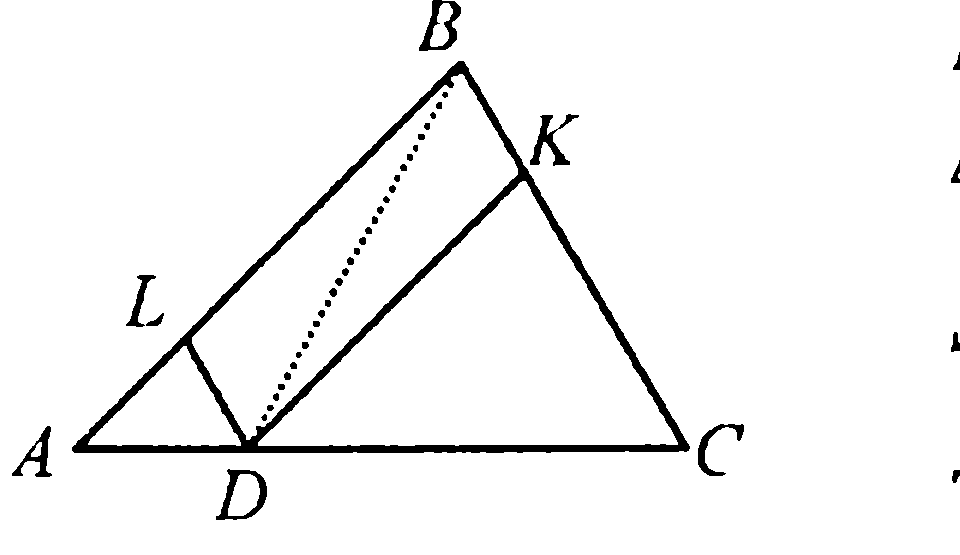

Четырехугольник $BKDL$ — параллелограмм, значит $\Delta DLB = \Delta BKD$ и, таким образом, $S_{\Delta ALD} + S_{\Delta DKC} = S_{\Delta ABC} - 2S_{\Delta BKD} = \frac{5}{8} S_{\Delta ABC}$.

Треугольники $ALD$, $DKC$ и $ABC$ подобны между собой. А так как по обобщенной теореме Фалеса $\frac{BK}{KC} = \frac{AD}{DC} = \lambda$, то $\frac{BC}{LD} = \frac{AC}{AD} = \frac{AD + DC}{AD} = 1 + \frac{1}{\lambda} = \frac{\lambda + 1}{\lambda}$, $\frac{AB}{DK} = \frac{AC}{DC} = \frac{AD + DC}{DC} = \lambda + 1$. Но в таком случае $\frac{S_{\Delta DKC}}{S_{\Delta ABC}} = \left(\frac{DK}{AB}\right)^2 = \frac{1}{(\lambda + 1)^2}$, $\frac{S_{\Delta ALD}}{S_{\Delta ABC}} = \left(\frac{LD}{BC}\right)^2 = \frac{\lambda^2}{(\lambda + 1)^2}$. Следовательно, $S_{\Delta ALD} + S_{\Delta DKC} = \frac{\lambda^2 + 1}{(\lambda + 1)^2} \cdot S_{\Delta ABC}$ и, значит, $\frac{\lambda^2 + 1}{(\lambda + 1)^2} = \frac{5}{8}$ или $3\lambda^2 - 10\lambda + 3 = 0$. Решая полученное уравнение, находим, что $\lambda_1 = \frac{1}{3}$, $\lambda_2 = 3$.

**Ответ:** $BK : KC = 1 : 3$ ($BK : KC = 3 : 1$).

---
**стр. 44**
---

**2.7.** В равнобедренном треугольнике $ABC$ ($AB = BC$) из точки $H$ основания высоты, проведенной из вершины $B$, опущен перпендикуляр $HE$ на боковую сторону $BC$, точка $O$ — середина отрезка $HE$. Доказать, что $BO \perp AE$.

**Решение.** Не умаляя общности рассуждений, будем считать, например, что угол $ABC$ — тупой (рис. 2.15). Опустим из точки $A$ перпендикуляр $AD$ на прямую $CB$. Тогда поскольку $\angle HBC = 90^\circ - \angle BCA = \angle CAD$, то прямоугольные треугольники $BEH$ и $ADC$ подобны (по первому признаку подобия прямоугольных треугольников), поэтому $BH : AC = HE : DC$. А так как $O$ — середина отрезка $HE$, а $E$ — середина отрезка $DC$ (что следует из теоремы Фалеса), то $\frac{HO}{EC} = \frac{HE}{DC} = \frac{BH}{AC}$. Далее, поскольку $\angle BHO = 90^\circ - \angle HBC = \angle ACE$, а $\frac{HO}{EC} = \frac{BH}{AC}$, то по второму признаку подобия треугольников треугольники $HBO$ и $CAE$ подобны и, значит, $\angle HBO = \angle CAE$ ($= \varphi$). Но в таком случае перпендикулярные прямые $AC$ и $BH$ при повороте на угол $\varphi$ около точки $A$ (против движения часовой стрелки) «перейдут» соответственно в прямую $AE$ и прямую, параллельную прямой $BO$, а это и будет означать, что прямые $AE$ и $BO$ перпендикулярны.

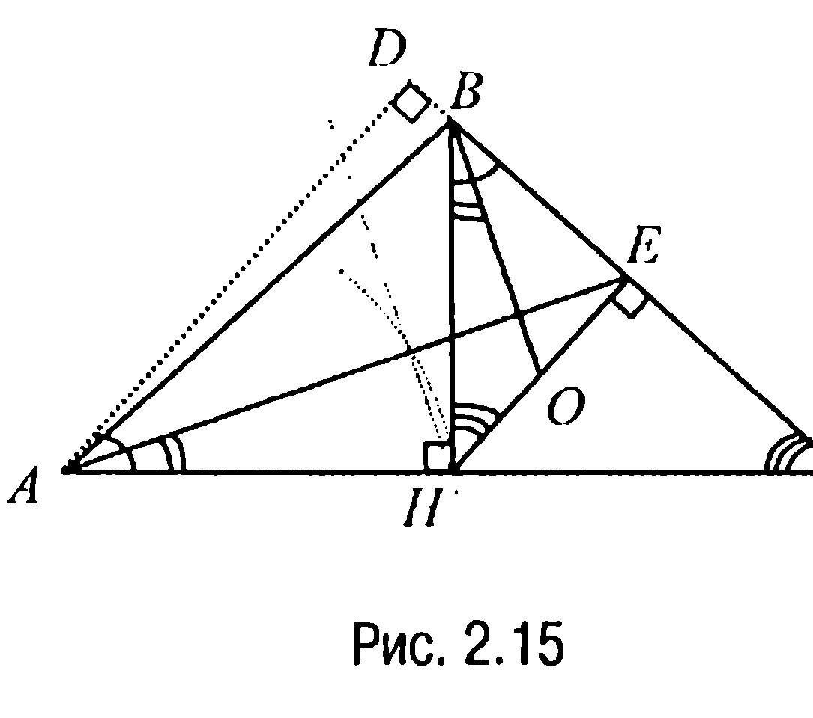

**2.8.** В параллелограмме $ABCD$ точка $K$ — середина стороны $BC$. Отрезок $AK$ пересекает диагональ $BD$ в точке $O$. Найти площадь параллелограмма $ABCD$, если площадь треугольника $BOK$ равна 2.

**Решение.** По условию $BK = KC = \frac{1}{2}AD$, площадь треугольника $BOK$ равна 2 (рис. 2.16). Поэтому поскольку $\Delta BOK \sim \Delta DOA$ (задача 2.1), то $\frac{S_{\Delta BOK}}{S_{\Delta DOA}} = \frac{BK^2}{AD^2} = \frac{1}{4}$ и, значит, $S_{\Delta DOA} = 4S_{\Delta BOK} = 8$.

---
**стр. 45**
---

Далее, так как $\frac{S_{\Delta BOK}}{S_{\Delta DOA}} = \frac{BO^2}{OD^2} = \frac{1}{4}$, то $BO = \frac{OD}{2}$

и, следовательно, $S_{\Delta ABO} = \frac{1}{2}S_{\Delta DOA}$ (свойство 1.12).

Но в таком случае $S_{ABCD} = 2S_{\Delta ABD} = 2(S_{\Delta ABO} + S_{\Delta DOA}) = 2(4 + 8) = 24$.

Ответ: 24.

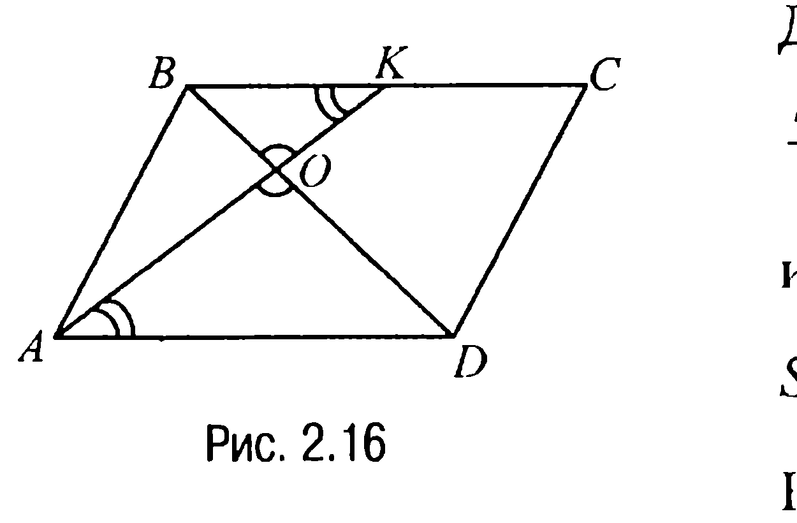

▼ **2.9.** В прямоугольном треугольнике $ABC$ из вершины $C$ прямого угла опущена высота $CD$. Радиусы окружностей, вписанных в треугольники $ADC$ и $CDB$, равны соответственно $r_1$ и $r_2$. Найти радиус $r$ окружности, вписанной в треугольник $ABC$.

**Решение.** Пусть $AB = c$, $AC = b$, $BC = a$. Тогда (рис. 2.17) из подобия прямоугольных треугольников $ADC$ и $ABC$ (у них общий острый угол с вершиной $A$) и замечания 2.1 следует, что $\frac{r_1}{r} = \frac{b}{c}$ или $b = \frac{r_1}{r} \cdot c$. Из подобия же прямоугольных треугольников $CDB$ и $ABC$ (у них общий острый угол с вершиной $B$) и замечания 2.1 получаем, что $\frac{r_2}{r} = \frac{a}{c}$ или $a = \frac{r_2}{r} \cdot c$. Но поскольку по теореме Пифагора $a^2 + b^2 = c^2$, то с учетом найденных значений $a$ и $b$ имеем $a^2 + b^2 = \left(\frac{r_2}{r}\right)^2 \cdot c^2 + \left(\frac{r_1}{r}\right)^2 \cdot c^2 = c^2$ или $\left(\frac{r_2}{r}\right)^2 + \left(\frac{r_1}{r}\right)^2 = 1$, или $r^2 = r_1^2 + r_2^2$, откуда $r = \sqrt{r_1^2 + r_2^2}$.

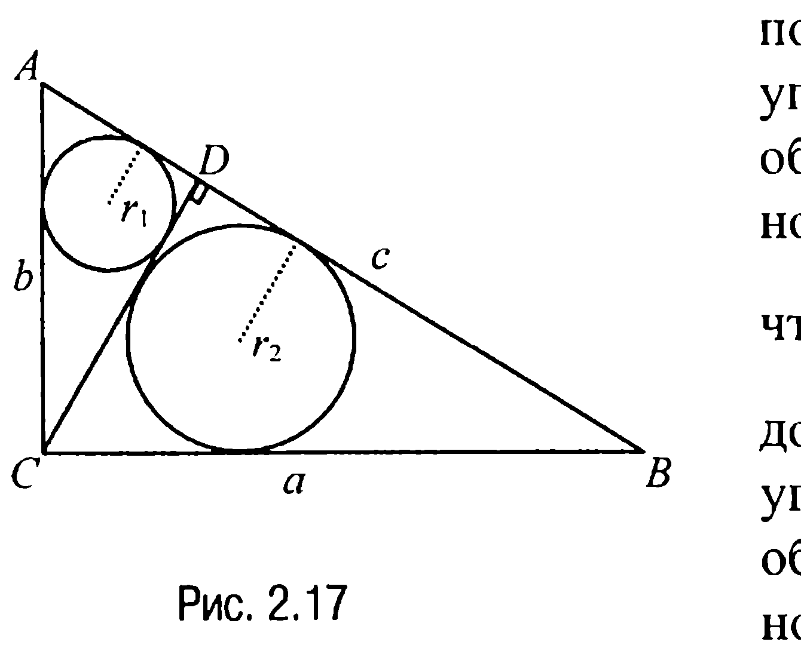

Ответ: $r = \sqrt{r_1^2 + r_2^2}$.

---
**стр. 46**
---

**2.10.** Катет $BC$ прямоугольного треугольника $ABC$ с прямым углом $BCA$ разделен точками $D$ и $E$ на три равных отрезка. Доказать, что если $BC = 3AC$, то $\angle AEC + \angle ADC + \angle ABC = 90^\circ$.

**Решение.** Рассмотрим рис. 2.18. Пусть $ED = a$, тогда $EB = 2a$, $AE = a\sqrt{2}$, $DA = a\sqrt{5}$, $BA = a\sqrt{10}$ и, значит, треугольники $DEA$ и $BEA$ подобны по третьему признаку подобия треугольников $\left(\frac{ED}{AE} = \frac{AE}{EB} = \frac{DA}{BA} = \frac{\sqrt{2}}{2}\right)$.

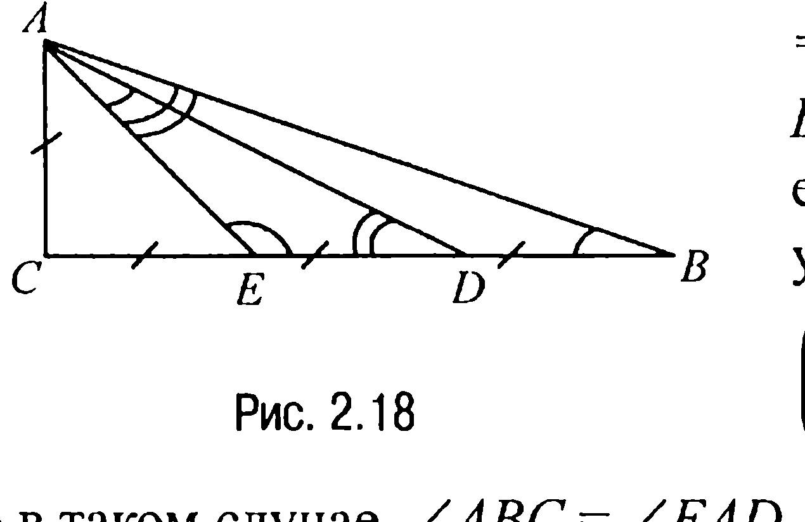

Но в таком случае $\angle ABC = \angle EAD$ и с учетом равенства $\angle AEC = \angle CAE = 45^\circ$ приходим к следующему: $\angle AEC + \angle ADC + \angle ABC = (\angle CAE + \angle EAD) + \angle ADC = \angle CAD + \angle ADC = 90^\circ$, а это и требовалось доказать.

**ЗАДАЧИ ДЛЯ САМОСТОЯТЕЛЬНОГО РЕШЕНИЯ**

**2.1С.** Точка $K$ — середина стороны $AB$ квадрата $ABCD$, а точка $L$ делит диагональ $AC$ в отношении $AL : LC = 3 : 1$. Доказать, что угол $KLD$ — прямой.

**2.2С.** Равнобедренный треугольник со сторонами 8; 5 и 5 разделен на три равновеликие фигуры перпендикулярами, проведенными из некоторой точки к его сторонам. Найти расстояния от этой точки до каждой стороны данного треугольника.

**2.3С.** Четырехугольник $ABCD$ вписан в окружность. Найти его площадь, если стороны $AB$ и $BC$ равны, сторона $BD$ равна $a$, угол $CDB$ равен $\gamma$.
