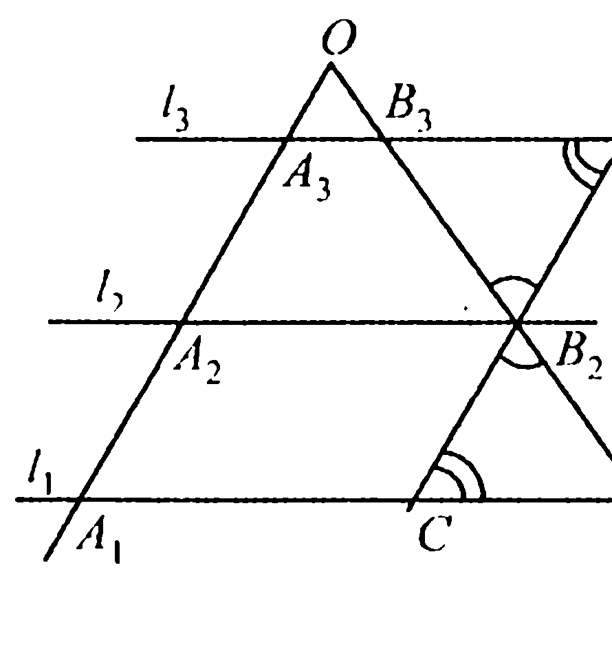
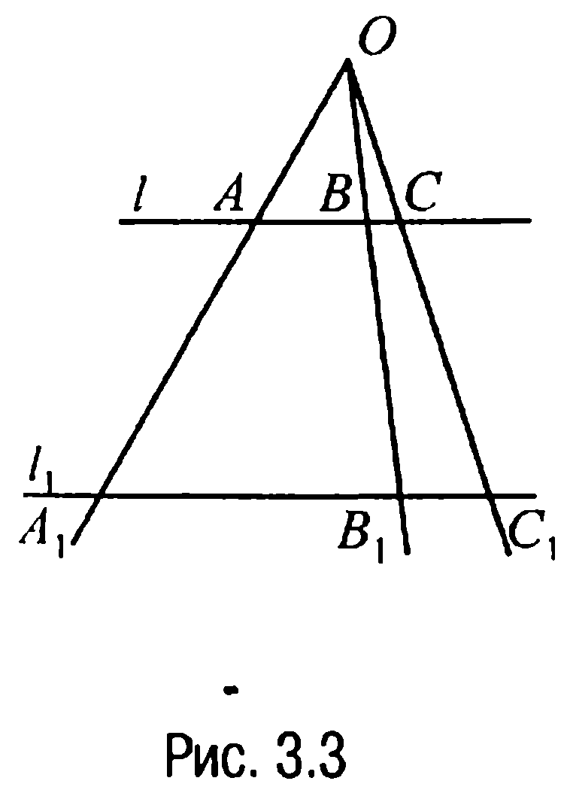
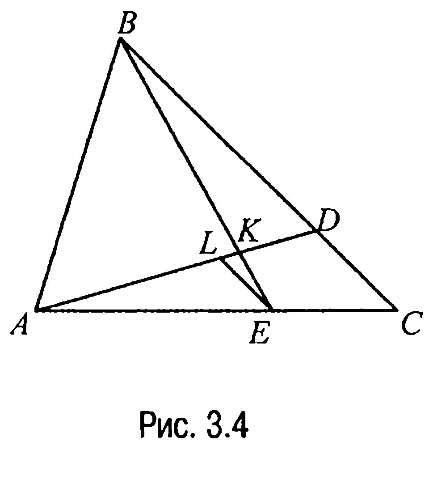
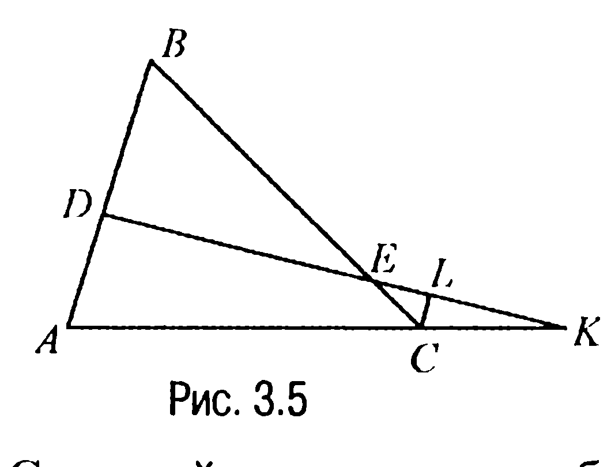
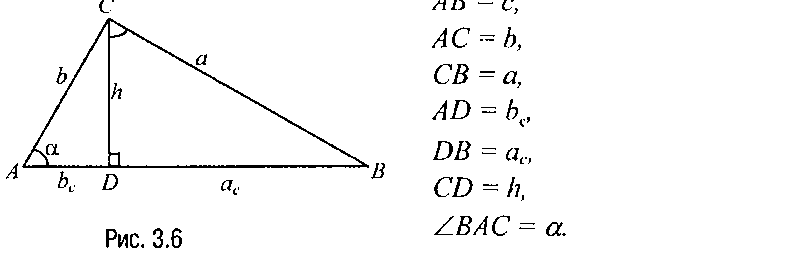
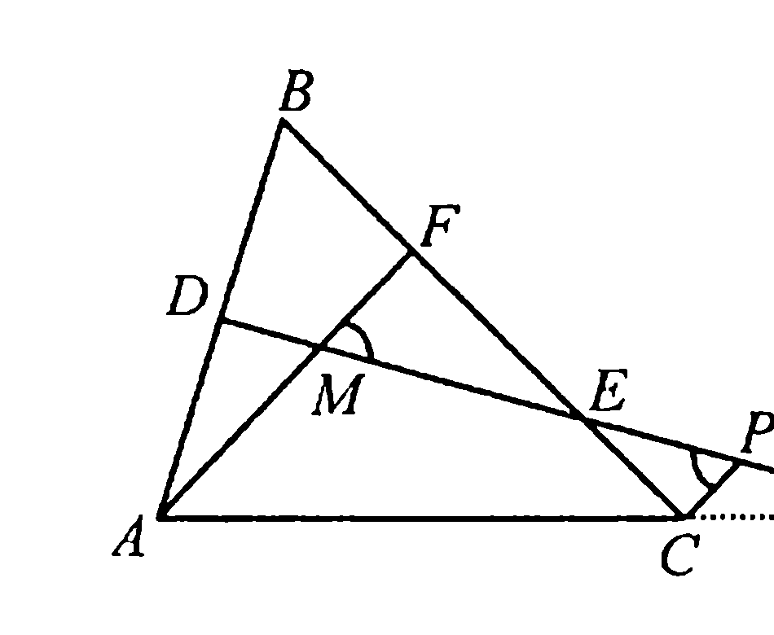
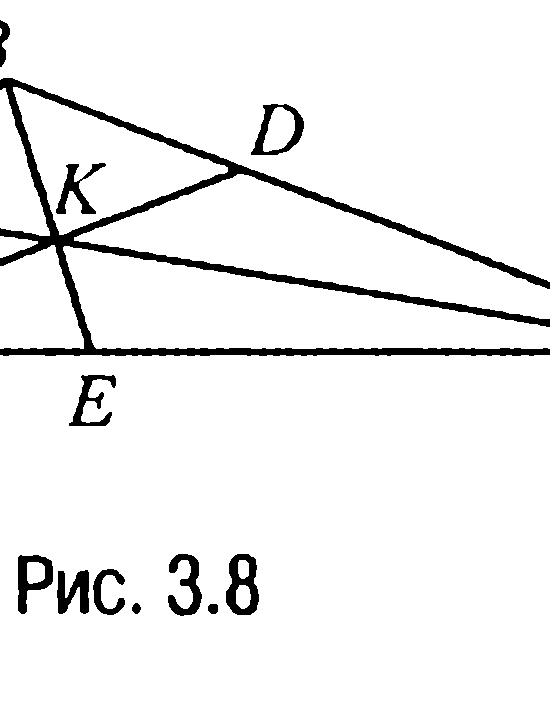
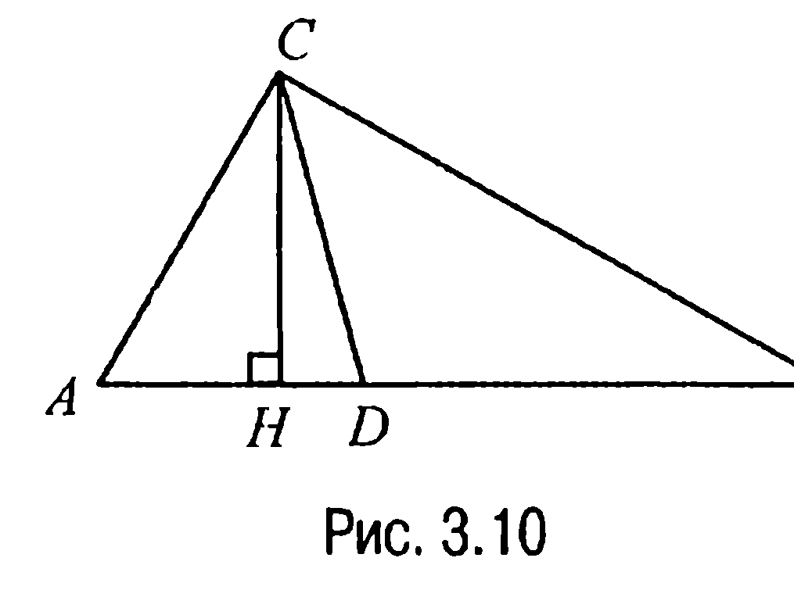
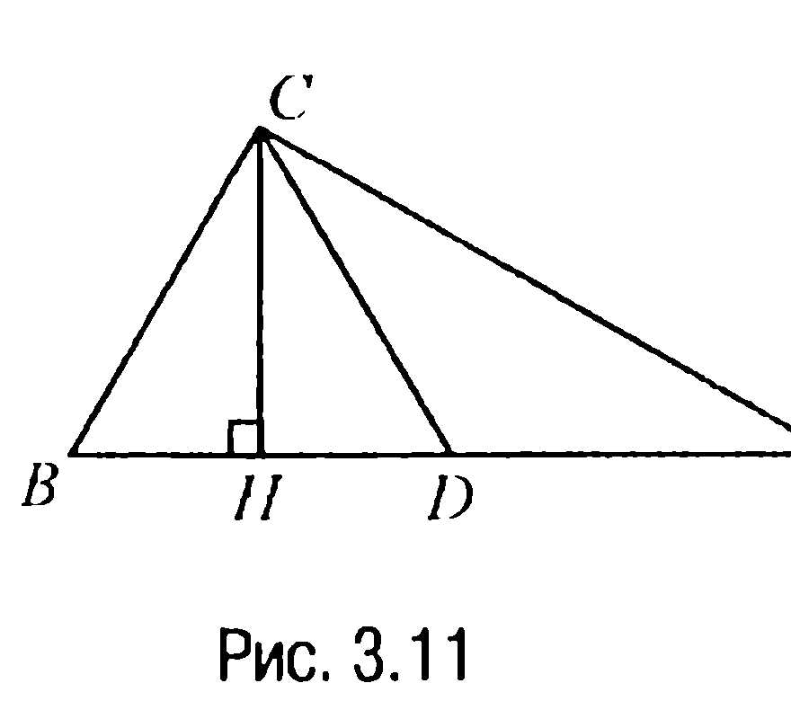
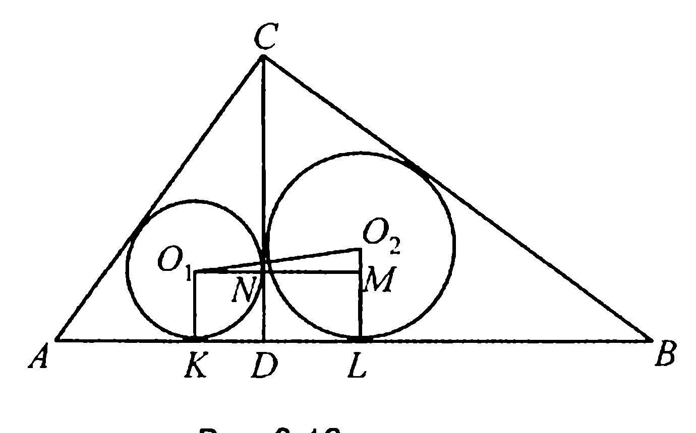

## 1.3. Пропорциональные отрезки

---
**стр. 47**
---

**2.4С.** Через произвольную точку $D$ стороны $AC$ треугольника $ABC$ проведены параллельно его медианам $AE$ и $CF$ отрезки, пересекающие стороны $AB$ и $BC$ в точках $H$ и $G$ соответственно. Доказать, что медианы $AE$ и $CF$ делят отрезок $HG$ на три равных отрезка.

**2.5С.** На стороне $BC$ равностороннего треугольника $ABC$ как на диаметре во внешнюю сторону построена полуокружность, на которой отмечены точки $D$ и $E$, делящие полуокружность на равные дуги. Доказать, что прямые $AD$ и $AE$ делят отрезок $BC$ на три равных отрезка.

**2.6С.** В трапеции $ABCD$ основания $AD = a$, $BC = b$ ($b < a$). Окружность, проходящая через вершины $B$, $C$, $D$, касается стороны $AB$. Найти диагональ $BD$.

**2.7С.** Через точку $A$ биссектрисы прямого угла $B$ проведена прямая, отсекающая на сторонах угла отрезки $BC = a$ и $BD = b$. Доказать, что сумма $\frac{1}{a} + \frac{1}{b}$ не зависит от выбора прямой, проходящей через точку $A$.

**§ 3. ПРОПОРЦИОНАЛЬНЫЕ ОТРЕЗКИ**

**3.1. Свойства параллельных прямых, пересекающих стороны углов**

**Свойство 3.1X (Теорема Фалеса).** *Если параллельные прямые, пересекающие стороны угла, отсекают на одной стороне угла равные отрезки, то они отсекают равные отрезки и на другой стороне угла.*

**Доказательство.** Пусть $A_1$, $A_2$, $A_3$ и $B_1$, $B_2$, $B_3$ — точки пересечения параллельных прямых $l_1$, $l_2$, $l_3$ со сторонами угла с вершиной $O$ такие, что $A_1A_2 = A_2A_3$ (рис. 3.1).

---
**стр. 48**
---

Докажем, что $B_1B_2 = B_2B_3$. Действительно, проведем прямую $CD \parallel A_1A_3$.

Тогда четырехугольники $A_1A_2B_2C$ и $A_2A_3DB_2$ будут параллелограммами и, значит, $A_1A_2 = CB_2$, $A_2A_3 = B_2D$. Но по условию $A_1A_2 = A_2A_3$ и, таким образом, $CB_2 = B_2D$. Далее, $\angle DB_2B_3 = \angle CB_2B_1$. Равными будут и углы $B_3DB_2$ и $B_1CB_2$ как внутренние накрест лежащие при параллельных прямых $l_1$, $l_3$ и секущей $CD$. А тогда, ссылаясь на второй признак равенства треугольников, приходим к выводу, что треугольники $B_3DB_2$ и $B_1CB_2$ равны, а отсюда и следует, что $B_1B_2 = B_2B_3$.

**Замечание 3.1.** Иногда свойство 3.1X формулируют следующим образом: *если параллельные прямые, пересекающие две данные прямые, отсекают на одной прямой равные отрезки, то они отсекают равные отрезки и на другой прямой.*

**Свойство 3.2X (Обобщенная теорема Фалеса).** *Параллельные прямые, пересекающие стороны угла, отсекают на его сторонах пропорциональные отрезки.*

**Доказательство.** Пусть $A_1, A_2, A_3$ и $B_1, B_2, B_3$ — точки пересечения параллельных прямых $l_1, l_2, l_3$ со сторонами угла с вершиной $O$ (рис. 3.2). Докажем, что

$$\frac{OB_1}{OA_1} = \frac{B_1B_2}{A_1A_2} = \frac{B_2B_3}{A_2A_3}.$$

Действительно, проведем прямые $B_1C_2$ и $B_2C_3$ параллельно прямой $OA_3$. Тогда треугольники $A_1OB_1$, $C_2B_1B_2$ и $C_3B_2B_3$ будут подобны между собой по первому признаку подобия треугольников, так как, например, углы $A_1OB_1$, $C_2B_1B_2$, $C_3B_2B_3$ равны

---
**стр. 49**
---

как соответственные углы при параллельных прямых $OA_1, B_1C_2, B_2C_3$ и секущей $OB_3$. Равными как соответственные углы при параллельных прямых $l_1, l_2, l_3$ и той же секущей $OB_3$ будут и углы $OB_1A_1, B_1B_2C_2, B_2B_3C_3$.

Но из подобия указанных треугольников следует, что $\frac{OB_1}{OA_1} = \frac{B_1B_2}{B_1C_2} = \frac{B_2B_3}{B_2C_3}$, а это и завершает доказательство, поскольку $B_1C_2 = A_1A_2$, $B_2C_3 = A_2A_3$ (как противолежащие стороны параллелограмма).

**Замечание 3.2.** Иногда свойство 3.2X формулируют следующим образом: *параллельные прямые, пересекающие две данные прямые, отсекают на этих двух прямых пропорциональные отрезки*.

**Свойство 3.3X.** *Параллельные прямые, пересекающие $n$ лучей ($n \in \mathbb{N}$, $n \geq 3$), исходящих из одной и той же точки, рассекаются лучами на пропорциональные отрезки.*

**Доказательство.** Рассмотрим, не умаляя общности рассуждений, две параллельные прямые $l$ и $l_1$, которые пересекают три луча, исходящих из одной их общей точки $O$, в точках $A, B, C$ и $A_1, B_1, C_1$ соответственно (рис. 3.3).

Докажем, что $\frac{AB}{A_1B_1} = \frac{BC}{B_1C_1}$. Действительно, так как прямые $l$ и $l_1$ параллельны, то (задача 2.1) треугольники $OAB$ и $OA_1B_1$, а также $OBC$ и $OB_1C_1$, подобны. Поэтому

$\frac{AB}{A_1B_1} = \frac{OB}{OB_1}$, $\frac{OB}{OB_1} = \frac{BC}{B_1C_1}$, откуда и следует, что $\frac{AB}{A_1B_1} = \frac{BC}{B_1C_1}$.

---
**стр. 50**
---

**3.2. Пропорциональные отрезки в произвольном треугольнике**

**Свойство 3.4X.** *Если точки $D$ и $E$ сторон $BC$ и $AC$ треугольника $ABC$ соответственно такие, что* $\frac{AE}{EC} = \frac{p}{q}$, $\frac{BD}{DC} = \frac{m}{n}$, *то* $\frac{BK}{KE} = \frac{m}{n}\left(1 + \frac{q}{p}\right)$, $\frac{AK}{KD} = \frac{p}{q}\left(1 + \frac{n}{m}\right)$, *где $K$ — точка пересечения отрезков $AD$ и $BE$.*

**Доказательство.** Докажем, например, справедливость первого из двух требующих доказательства равенств. Справедливость второго из них доказывается аналогично.

Итак, проведем отрезок $EL$ параллельно стороне $BC$ треугольника $ABC$ ($L$ — точка отрезка $AD$). Тогда так как треугольник $ADC$ подобен треугольнику $ALE$ (рис. 3.4) с коэффициентом подобия $\frac{p+q}{p}$, то $DC = \frac{p+q}{p} \cdot LE$ и, значит, $BD = \frac{m}{n} \cdot DC = \frac{m}{n} \cdot \frac{p+q}{p} \cdot LE$.

Учитывая теперь подобие треугольников $BDK$ и $ELK$, мы и находим, что $\frac{BK}{KE} = \frac{BD}{LE} = \frac{m}{n}\left(1 + \frac{q}{p}\right)$.

**Замечание 3.3.** Свойство 3.4X позволяет по известным отношениям, в которых отрезки $AD$ и $BE$ (рис. 3.4) делят противолежащие вершинам $A$ и $B$ стороны треугольника $ABC$, определить, в каком отношении эти отрезки делятся между собой. Примечательным при этом является тот факт, что отношения, в которых делятся отрезки $AD$ и $BE$ между собой, не зависят ни от вида треугольника, ни от длин его сторон, ни от величин углов, а опре-

---
**стр. 51**
---

деляются только отношениями, в которых делятся соответствующие стороны точками $D$ и $E$.

Отметим далее, что пояснения, аналогичные замечанию 3.3, имеют отношение и к доказываемым ниже свойствам 3.5, 3.6X и 3.7.

**Свойство 3.5.** Если $D$ и $E$ — точки сторон $BC$ и $AC$ треугольника $ABC$ соответственно, $K$ — точка пересечения отрезков $AD$ и $BE$ такая, что $\frac{AK}{KD}=\lambda$, $\frac{BK}{KE}=\mu$, где $\lambda\cdot\mu>1$, то $\frac{AE}{EC}=\frac{\lambda\mu-1}{1+\mu}$, $\frac{BD}{DC}=\frac{\lambda\mu-1}{1+\lambda}$.

**Доказательство.** В обозначениях, принятых при формулировке свойства 3.4X (рис. 3.4), $\frac{AE}{EC}=\frac{p}{q}$, а $\frac{BD}{DC}=\frac{m}{n}$. Покажем, что $\frac{p}{q}=\frac{\lambda\mu-1}{1+\mu}$, а $\frac{m}{n}=\frac{\lambda\mu-1}{1+\lambda}$.

Действительно, в соответствии со свойством 3.4X имеем систему

$$\begin{cases} \frac{p}{q}\left(1+\frac{n}{m}\right)=\lambda, \\ \frac{m}{n}\left(1+\frac{q}{p}\right)=\mu, \end{cases}$$

которую можно переписать в виде

$$\begin{cases} 1+\frac{n}{m}=\lambda\frac{1}{\frac{p}{q}}, \\ 1+\frac{q}{p}=\mu\frac{1}{\frac{m}{n}} \end{cases}$$

или в виде

$$\begin{cases} \lambda\frac{1}{\frac{p}{q}}-\frac{1}{\frac{m}{n}}=1, \\ -\frac{1}{\frac{p}{q}}+\mu\frac{1}{\frac{m}{n}}=1, \end{cases}$$

откуда легко находится, что действительно $\frac{p}{q}=\frac{\lambda\mu-1}{1+\mu}$, $\frac{m}{n}=\frac{\lambda\mu-1}{1+\lambda}$, что и доказывает свойство.

---
**стр. 52**
---

**Свойство 3.6X.** Если $D$ и $E$ — точки сторон $AB$ и $BC$ треугольника $ABC$ соответственно такие, что $\frac{BD}{DA}=\frac{p}{q}$, а $\frac{BE}{EC}=\frac{m}{n}$, где $\frac{p}{q}\neq\frac{m}{n}$, $K$ — точка пересечения прямой $DE$ с продолжением стороны $AC$, то $\frac{AK}{CK}=\frac{m}{n}\cdot\frac{q}{p}$.

**Доказательство.** Проведем отрезок $CL$ параллельно стороне $AB$ треугольника $ABC$ ($L$ — точка прямой $DE$). Тогда треугольник $BED$ подобен треугольнику $LCE$ (рис. 3.5) с коэффициентом подобия $m/n$, поэтому $BD/LC=m/n$ и, значит,

$$DA=\frac{q}{p}\cdot BD=\frac{m}{n}\cdot\frac{q}{p}\cdot LC.$$

С другой стороны, подобными являются и треугольники $KAD$ и $KCL$, поэтому $\frac{AK}{CK}=\frac{DA}{LC}=\frac{m}{n}\cdot\frac{q}{p}$, что и требовалось доказать.

**Замечание 3.4.** Из свойства 3.6X, в частности, следует, что

$$CK=\frac{AC}{\frac{mq}{np}-1}.$$

И если $\frac{p}{q}<\frac{m}{n}$, т. е. если $mq>np$, то точка $K$ лежит на продолжении основания $AC$ треугольника $ABC$ за точку $C$, если же $mq<np$, то точка $K$ лежит на продолжении $AC$ за точку $A$.

**Свойство 3.7.** Если точки $D$ и $K$ стороны $AB$ и продолжения стороны $AC$ за точку $C$ треугольника $ABC$ соответственно такие, что $\frac{BD}{DA}=\frac{p}{q}$, $\frac{AK}{CK}=\lambda$, $E$ — точка пересечения прямой $DK$ со стороной $BC$, то $\frac{BE}{EC}=\lambda\cdot\frac{p}{q}$.

**Доказательство.** В обозначениях, принятых при формулировке свойства 3.6X (рис. 3.5), $\frac{AK}{CK}=\frac{m}{n}\cdot\frac{q}{p}$, где $\frac{m}{n}=\frac{BE}{EC}$.

---
**стр. 53**
---

Покажем, что $\frac{m}{n}=\lambda\cdot\frac{p}{q}$. Действительно, из условия следует, что $\frac{m}{n}\cdot\frac{q}{p}=\lambda$, откуда и находим, что $\frac{m}{n}=\lambda\cdot\frac{p}{q}$.

**3.3. Пропорциональные отрезки в прямоугольном треугольнике**

Пусть $ABC$ — прямоугольный треугольник с прямым углом $ACB$ и пусть $AD$ — проекция катета $AC$ на гипотенузу $AB$, $DB$ — проекция катета $CB$ на гипотенузу $AB$, $CD$ — высота, опущенная из вершины прямого угла на гипотенузу $AB$ (рис. 3.6).

Введем следующие обозначения:

**Свойство 3.8.** *В прямоугольном треугольнике высота, опущенная из вершины прямого угла на гипотенузу, есть среднее пропорциональное между проекциями катетов, т. е.* $\frac{h}{a_c}=\frac{b_c}{h}$ ($h=\sqrt{a_c\cdot b_c}$).

**Доказательство.** Из прямоугольного треугольника $CDA$ (рис. 3.6) находим, что $\tg\alpha=\frac{CD}{AD}$, а так как $\angle DAC=\angle DCB$ (это углы с соответственно перпендикулярными сторонами), то из прямоугольного треугольника $BDC$ следует, что $\tg\alpha=\frac{DB}{CD}$. Поэтому

$$\frac{CD}{AD}=\frac{DB}{CD}\quad\text{или}\quad\frac{h}{a_c}=\frac{b_c}{h}.$$

---
**стр. 54**
---

**Свойство 3.9.** *В прямоугольном треугольнике каждый катет есть среднее пропорциональное между гипотенузой и проекцией катета на гипотенузу, т. е.* $\frac{a}{c}=\frac{a_c}{a}$ ($a=\sqrt{c\cdot a_c}$),

$\frac{b}{c}=\frac{b_c}{b}$ ($b=\sqrt{c\cdot b_c}$).

**Доказательство.** Так как $\angle DAC=\alpha$, то $\angle CBD=90^\circ-\alpha$, $\angle DCB=\alpha$ (рис. 3.6). А тогда из прямоугольного треугольника $ACB$ находим, что $\sin\alpha=\frac{CB}{AB}$, из прямоугольного же треугольника $BDC$ следует, что $\sin\alpha=\frac{DB}{CB}$. Таким образом, $\frac{CB}{AB}=\frac{DB}{CB}$ или $\frac{a}{c}=\frac{a_c}{a}$.

Аналогично доказывается и второе приведенное в формулировке свойства равенство.

**Следствие 3.1.** *В прямоугольном треугольнике высота, опущенная из вершины прямого угла на гипотенузу, делит гипотенузу в таком отношении, в каком находятся квадраты прилежащих катетов, т. е.* $\frac{a_c}{b_c}=\frac{a^2}{b^2}$.

**Свойство 3.10X.** *В прямоугольном треугольнике отношение одного из катетов к гипотенузе равно отношению высоты, опущенной из вершины прямого угла на гипотенузу, к другому катету, т. е.* $\frac{a}{c}=\frac{h}{b}$ или $\frac{b}{c}=\frac{h}{a}$ ($a\cdot b=c\cdot h$).

**Доказательство.** Из прямоугольного треугольника $ACB$ (рис. 3.6) имеем $\sin\alpha=\frac{CB}{AB}$, в прямоугольном же треугольнике $CDA$ значение $\sin\alpha$ определяет отношение $\frac{CD}{AC}$. Следовательно, $\frac{CB}{AB}=\frac{CD}{AC}$ или $\frac{a}{c}=\frac{h}{b}$ или $\frac{b}{c}=\frac{h}{a}$, а это и требовалось доказать.

---
**стр. 55**
---

**Свойство 3.11X (Теорема Пифагора).** *В прямоугольном треугольнике квадрат гипотенузы равен сумме квадратов катетов, т. е.* $c^2=a^2+b^2$.

**Доказательство.** По свойству 3.9 имеем равенства $a^2=a_c\cdot c$, $b^2=b_c\cdot c$. А тогда, сложив почленно эти равенства, мы и получим, что $a^2+b^2=(a_c+b_c)\cdot c=c\cdot c=c^2$.

Обратимся снова к рис. 3.6. Обозначим в подобных прямоугольных треугольниках $BDC$, $CDA$ и $ACB$ сходственные линейные элементы через $d_a$, $d_b$ и $d_c$ соответственно. (Линейными элементами треугольника являются, например, его стороны, биссектрисы, медианы, высоты, периметры, радиусы вписанной и описанной окружностей.)

**Свойство 3.12X (Обобщенная теорема Пифагора).** *Для любых сходственных линейных элементов $d_a$, $d_b$ и $d_c$ прямоугольных треугольников $BDC$, $CDA$ и $ACB$ (рис. 3.6) имеет место равенство* $d_a^2+d_b^2=d_c^2$.

**Доказательство.** В подобных прямоугольных треугольниках $BDC$, $CDA$ и $ACB$ (рис. 3.6) стороны $BC=a$, $AC=b$ и $AB=c$ являются сходственными. А так как для любых сходственных линейных элементов указанных треугольников справедлива цепочка равенств $\frac{d_a}{a}=\frac{d_b}{b}=\frac{d_c}{c}=k$ ($k=\text{const}>0$) и, значит, $d_a=k\cdot a$, $d_b=k\cdot b$, $d_c=k\cdot c$, то $d_a^2+d_b^2=d_c^2$, поскольку по теореме Пифагора $a^2+b^2=c^2$.

**ЗАДАЧИ**

**3.1.** В равнобедренном треугольнике $ABC$ ($AB=BC$) на стороне $BC$ отмечена точка $D$ таким образом, что $BD:DC=1:4$. В каком отношении прямая $AD$ делит высоту $BM$ треугольника $ABC$, считая от вершины $B$?

**Решение.** Проведем $MF\parallel AD$ (рис. 3.7). Пусть $BD=x$, тогда $DC=4x$, и так как $MF$ — средняя линия треугольника $DCA$, то $DF=2x$.

---
**стр. 56**
---

Далее, в треугольнике $BFM$ стороны $ED$ и $MF$ параллельны, а $BD:DF=1:2$, следовательно, по обобщенной теореме Фалеса $\frac{BE}{EM}=\frac{1}{2}$.

**Ответ:** $1:2$.

**3.2.** В треугольнике $ABC$ стороны $AB$, $BC$ и $AC$ относятся как $2:4:5$ соответственно. В каком отношении делятся биссектрисы треугольника их точкой пересечения?

**Решение.** Пусть $D$, $E$ и $F$ — точки пересечения биссектрис треугольника $ABC$ со сторонами $BC$, $AC$ и $AB$ соответственно, $K$ — точка пересечения биссектрис (рис. 3.8). По свойству биссектрисы 8.7X имеем

$\frac{AE}{EC}=\frac{AB}{BC}=\frac{2}{4}$; $\frac{BD}{DC}=\frac{AB}{AC}=\frac{2}{5}$;

$\frac{AF}{FB}=\frac{AC}{BC}=\frac{5}{4}$. А тогда на основании свойства 3.4X будет

$\frac{BK}{KE}=\frac{2}{5}\left(1+\frac{4}{2}\right)=\frac{6}{5}$; $\frac{AK}{KD}=\frac{2}{4}\left(1+\frac{5}{2}\right)=\frac{7}{4}$; $\frac{CK}{KF}=\frac{4}{2}\left(1+\frac{5}{4}\right)=\frac{9}{2}$.

**Ответ:** $6:5$; $7:4$; $9:2$.

**3.3.** Пусть $D$ и $E$ — точки сторон $BC$ и $AC$ треугольника $ABC$ соответственно, $K$ — точка пересечения отрезков $AD$ и $BE$. Известно, что $BD:DC=2:3$, а $BK=2KE$. В каком отношении точка $E$ делит сторону $AC$?

**Решение.** Из условия следует, что $\frac{BK}{KE}=\mu=2$. Обозначим $\frac{AK}{KD}=\lambda$, $\frac{AE}{EC}=\frac{p}{q}$. Тогда в соответствии со свойством 3.5 имеем

---
**стр. 57**
---

систему

$$\begin{cases} \frac{p}{q} = \frac{\lambda\mu - 1}{1 + \mu} = \frac{2\lambda - 1}{3}, \\ \frac{2}{3} = \frac{\lambda\mu - 1}{1 + \lambda} = \frac{2\lambda - 1}{1 + \lambda}. \end{cases}$$

Из второго уравнения системы находим, что $\lambda = \frac{5}{4}$ и, таким образом, $\frac{p}{q} = \frac{2 \cdot \frac{5}{4} - 1}{3} = \frac{1}{2}$.

**Ответ:** $1 : 2$.

*3.4. На продолжении стороны $AC$ за точку $C$ треугольника $ABC$ отмечена точка $K$ таким образом, что $KC = \frac{1}{2} AC$, на стороне $BC$ отмечена точка $F$, которая делит сторону в отношении $BF : FC = 1 : 2$. Прямая, проходящая через точку $K$, пересекает отрезки $AF$ и $AB$ в точках $M$ и $D$ соответственно. Чему равно отношение $AM : MF$, если $AD = DB$?*

**Решение.** Из условия следует, что $\frac{AK}{CK} = \lambda = \frac{3}{1}$, $\frac{BD}{DA} = \frac{p}{q} = \frac{1}{1}$.

Пусть $E$ и $P$ — точки пересечения прямой $KD$ с отрезком $BC$ и с прямой, проходящей через точку $C$ параллельно $AF$ соответственно (рис. 3.9). Тогда ссылаясь на свойство 3.7, находим, что $\frac{BE}{EC} = \lambda \cdot \frac{p}{q} =$

$= \frac{3}{1} \cdot \frac{1}{1} = \frac{3}{1}$ или иначе $BE = 3EC$. Полученное равенство означает, что $BE = \frac{3}{4} BC$, а так как $BF = \frac{1}{3} BC$ (см. условие задачи), то

$FE = BE - BF = \frac{3}{4} BC - \frac{1}{3} BC = \frac{5}{12} BC,$

а $EC = BC - BE = BC - \frac{3}{4} BC = \frac{1}{4} BC$.

---
**стр. 58**
---

Но в таком случае из подобия треугольников $MKA$ и $PKC$ находим, что $\frac{CP}{AM} = \frac{CK}{AK} = \frac{1}{3}$ или $AM = 3CP$.

С другой стороны, из подобия треугольников $FEM$ и $PCE$ вытекает, что $\frac{FE}{EC} = \frac{MF}{CP}$ или $\frac{\frac{5}{12} BC}{\frac{1}{4} BC} = \frac{MF}{CP}$, откуда $MF = \frac{5}{3} CP$. Таким образом, $AM : MF = 3CP : \frac{5}{3} CP = 9 : 5$.

**Ответ:** $AM : MF = 9 : 5$.

*3.5. В прямоугольном треугольнике $ABC$ проведена биссектриса $CD$ прямого угла $ACB$. Известно, что $AD = m$, $DB = n$. Найти высоту треугольника, опущенную из вершины $C$.*

**Решение.** Пусть $CH = h$ — высота треугольника $ABC$, $AH = x$,

$HB = y$ (рис. 3.10). Тогда по следствию 3.1 имеем $\frac{AC^2}{BC^2} = \frac{x}{y}$. По свойству же биссектрисы 8.7X имеем равенства $\frac{AC}{BC} = \frac{AD}{DB} = \frac{m}{n}$ и, таким образом, приходим к системе

$$\begin{cases} x + y = m + n, \\ \frac{x}{y} = \frac{m^2}{n^2}, \end{cases}$$

решая которую, находим, что $x = \frac{n^2(m + n)}{m^2 + n^2}$, $y = \frac{m^2(m + n)}{m^2 + n^2}$. Но тогда по свойству 3.8 высота $h = \sqrt{x \cdot y} = \frac{mn(m + n)}{m^2 + n^2}$.

**Ответ:** $\frac{mn(m + n)}{m^2 + n^2}$.

---
**стр. 59**
---

*3.6. В прямоугольном треугольнике из вершины прямого угла проведены медиана и высота, расстояние между их основаниями равно 1. Найти катеты треугольника, если известно, что один из них в два раза больше другого.*

**Решение.** Рассмотрим прямоугольный треугольник $BCA$ с прямым углом $BCA$, где для определенности будем считать, что $CA = 2BC$.

Пусть $H$ и $D$ — соответственно основания высоты и медианы треугольника, проведенных из одной вершины $C$, $BC = a$, $CA = b$, $AB = c$, $BH = a_c$, $HA = b_c$ (рис. 3.11). Тогда так как медиана, проведенная из вершины прямого угла треугольника к гипотенузе, равна половине гипотенузы (свойство 1.21X), то $a_c = \frac{c}{2} - 1$, $b_c = \frac{c}{2} + 1$ и, значит, (свойство 3.9) $a^2 = c \cdot a_c = c\left(\frac{c}{2} - 1\right)$, $b^2 = c \cdot b_c = c\left(\frac{c}{2} + 1\right)$.

Но поскольку $b = 2a$ и, таким образом, $b^2 = 4a^2$, имеем равенство $c\left(\frac{c}{2} + 1\right) = 4c\left(\frac{c}{2} - 1\right)$, из которого следует, что $c = \frac{10}{3}$. А в таком случае $a = \sqrt{c\left(\frac{c}{2} - 1\right)} = \sqrt{\frac{10}{3}\left(\frac{5}{3} - 1\right)} = \frac{2\sqrt{5}}{3}$, $b = 2a = \frac{4\sqrt{5}}{3}$.

**Ответ:** $\frac{2\sqrt{5}}{3}$; $\frac{4\sqrt{5}}{3}$.

*3.7. В прямоугольном треугольнике гипотенуза равна $c$ и она в три раза больше высоты треугольника, опущенной из вершины прямого угла. Найти катеты данного треугольника.*

**Решение.** Пусть $a$ и $b$ — катеты прямоугольного треугольника, где для определенности будем считать, что $a \ge b$, $h$ — высота, опущенная на гипотенузу из вершины прямого угла треугольника.

---
**стр. 60**
---

Тогда по свойству 3.10X имеем $a \cdot b = c \cdot h = \frac{c^2}{3}$ и для определения катетов получаем систему уравнений $\begin{cases} ab = \frac{c^2}{3}, \\ a^2 + b^2 = c^2 \end{cases}$ или систему $\begin{cases} (a+b)^2 = \frac{5}{3}c^2, \\ (a-b)^2 = \frac{1}{3}c^2, \end{cases}$ или систему $\begin{cases} a+b = \sqrt{\frac{5}{3}} \cdot c, \\ a-b = \sqrt{\frac{1}{3}} \cdot c, \end{cases}$ решая которую, находим, что $a = \frac{\sqrt{15} + \sqrt{3}}{6} \cdot c$, $b = \frac{\sqrt{15} - \sqrt{3}}{6} \cdot c$.

**Ответ:** $\frac{\sqrt{15} + \sqrt{3}}{6} \cdot c$; $\frac{\sqrt{15} - \sqrt{3}}{6} \cdot c$.

**3.8.** *В прямоугольном треугольнике $ABC$ с катетами $AC = 3$ и $BC = 4$ проведена высота $CD$. Найти расстояние между центрами окружностей, вписанных в треугольники $CDA$ и $BDC$.*

**Решение.** Пусть $O_1$ и $O_2$ — центры окружностей радиусов $r_1$ и $r_2$, вписанных в треугольники $CDA$ и $BDC$ соответственно, $K$ и $L$ — точки касания этих окружностей со стороной $AB$ (рис. 3.12).

Обозначим через $N$ и $M$ точки пересечения прямой, проходящей через точку $O_1$ параллельно $AB$, с отрезками $CD$ и $O_2L$ соответственно. Тогда очевидно, что $O_1N = r_1$, $NM = r_2$, $O_2M = r_2 - r_1$, и поэтому по теореме Пифагора из прямоугольного треугольника $O_2MO_1$ находим, что $O_1O_2 = \sqrt{(r_1 + r_2)^2 + (r_2 - r_1)^2} = \sqrt{2}\sqrt{r_1^2 + r_2^2}$.

Пусть, далее, радиус окружности, вписанной в прямоугольный треугольник $ACB$, равен $r$. В таком случае $r_1$, $r_2$ и $r$ будут сходст-

---
**стр. 61**
---

венными линейными элементами в подобных прямоугольных треугольниках $CDA$, $BDC$ и $ACB$ и, таким образом, в соответствии с обобщенной теоремой Пифагора $r = \sqrt{r_1^2 + r_2^2}$ (задача 2.9). Поэтому $O_1O_2 = r\sqrt{2}$. Но $r = \frac{AC + BC - AB}{2}$ (замечание 1.4), следовательно, так как $AB = \sqrt{AC^2 + BC^2} = 5$, приходим к выводу, что $r = \frac{3 + 4 - 5}{2} = 1$ и, значит, $O_1O_2 = \sqrt{2}$.

**Ответ:** $\sqrt{2}$.

**ЗАДАЧИ ДЛЯ САМОСТОЯТЕЛЬНОГО РЕШЕНИЯ**

**3.1С.** *Прямая, параллельная основанию треугольника, пересекает его стороны таким образом, что площади образовавшихся треугольника и четырехугольника относятся как $2 : 1$. В каком отношении эта прямая делит боковые стороны треугольника?*

**3.2С.** *Большее основание трапеции в два раза больше ее меньшего основания. Через точку пересечения диагоналей проведена прямая, параллельная основаниям. Найти отношение высот полученных трапеций к высоте данной трапеции.*

**3.3С.** *На сторонах $BC$ и $AC$ треугольника $ABC$ отмечены точки $D$ и $E$ соответственно таким образом, что $BD : DC = 2 : 5$, а $AE = \frac{1}{3} AC$. В каком отношении делятся отрезки $BE$ и $AD$ их точкой пересечения?*

**3.4С.** *На сторонах $BC$ и $AC$ треугольника $ABC$ отмечены точки $D$ и $E$ соответственно таким образом, что отрезки $AD$ и $BE$ делятся их точкой пересечения $K$ в отношениях: $AK : KD = 3 : 2$, $BK : KE = 4 : 5$. В каких отношениях делятся отрезки $AC$ и $BC$ точками $E$ и $D$?*
