## 1.4. Окружность, круг, дуга, хорда, диаметр. Углы

---
**стр. 62**
---

**3.5С.** *Проекции катетов прямоугольного треугольника на гипотенузу равны 9 и 16. Найти радиус окружности, вписанной в этот треугольник.*

**3.6С.** *Пусть $a$ и $b$ — катеты прямоугольного треугольника, $c$ — его гипотенуза, $h$ — высота треугольника, опущенная на гипотенузу. Доказать, что треугольник со сторонами $h$, $c + h$, $a + b$ является прямоугольным.*

**3.7С.** *Один катет прямоугольного треугольника равен 6, медиана, проведенная к этому катету, равна 5. Найти гипотенузу треугольника.*

**§ 4. ОКРУЖНОСТЬ, КРУГ, ДУГА, ХОРДА, ДИАМЕТР. УГЛЫ**

**Окружность** — *это фигура, состоящая из всех точек плоскости, равноудаленных от некоторой точки этой же плоскости, называемой* **центром** *окружности.*

**Радиус окружности** — *это любой отрезок, соединяющий центр окружности и точку окружности.*

**Круг радиуса $R$ с центром в точке $O$** — это фигура, состоящая из всех точек плоскости, находящихся от точки $O$ этой же плоскости на расстоянии, не большем $R$.

**Дуга окружности** — это любая из двух частей окружности, на которые ее делят две лежащие на ней точки.

**Хорда окружности** — это отрезок, соединяющий две точки окружности.

**Диаметр окружности** — это хорда, проходящая через центр окружности.

**Центральный угол** — это угол, образованный двумя радиусами окружности.

**Вписанный угол** — это угол, образованный двумя хордами окружности, исходящими из одной точки.

---
**стр. 63**
---

() вписанном угле говорят, что он опирается на дугу, заключенную между его сторонами.

**Секущая окружности** — *это прямая, проходящая через какие-нибудь две точки окружности.*

**4.1. Свойства хорд**

**Свойство 4.1X.** *Диаметр окружности, перпендикулярный хорде, делит хорду пополам.*

**Доказательство.** Пусть $AB$ — диаметр окружности, перпендикулярный хорде $CD$, и $E$ — их точка пересечения (рис. 4.1). Тогда так как окружность симметрична относительно любого ее диаметра, то точки $C$ и $D$ симметричны относительно перпендикуляра $AB$, что и означает, что $CE = ED$.

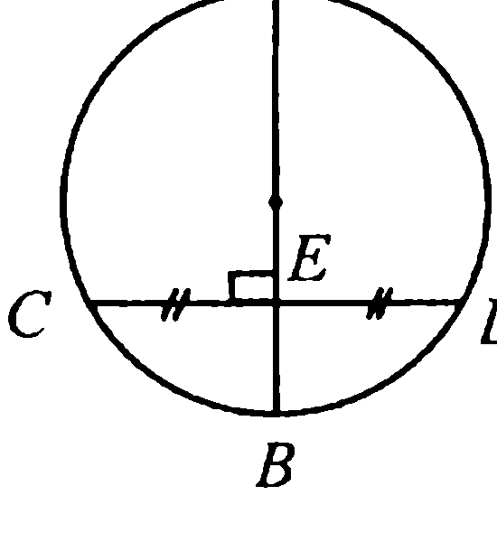

**Свойство 4.2X.** *Равные хорды окружности находятся на равном расстоянии от центра окружности.*

**Доказательство.** Пусть $AB = CD$ (рис. 4.2). Тогда равнобедренные треугольники $BOA$ и $COD$, у которых боковые стороны равны радиусу окружности, равны по трем сторонам. Поэтому высоты $OE$ и $OF$ указанных треугольников, опущенные из центра $O$ окружности на равные основания, будут также равны, а это и доказывает требуемое.

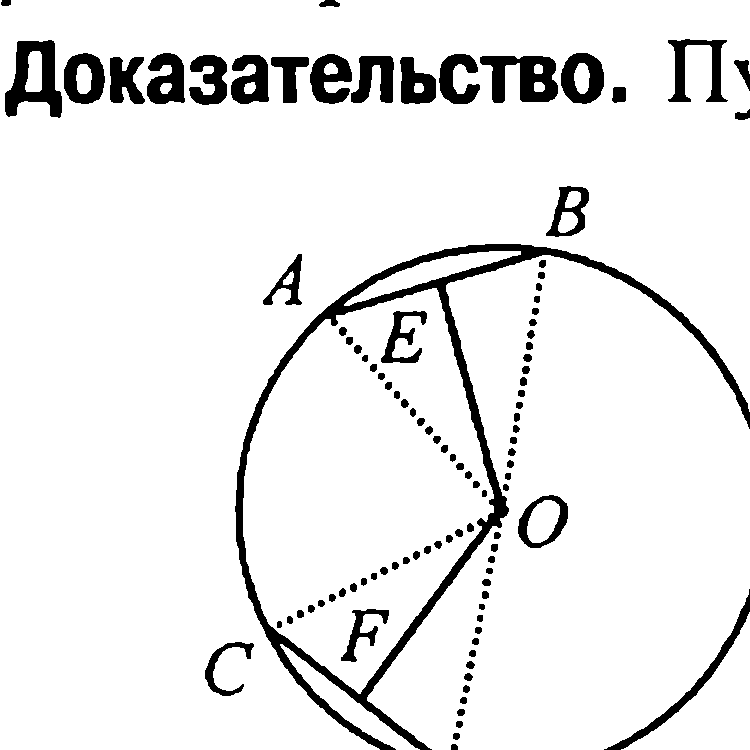

**Свойство 4.3X.** *Равные дуги стягиваются равными хордами.*

**Доказательство.** Пусть $\cup AB = \cup CD$ (рис. 4.2). Повернем сектор $COD$ вокруг центра окружности $O$ так, чтобы ее радиус $OC$ совпал с радиусом $OB$. Тогда дуга $DC$ пойдет по дуге $AB$ и в силу их ра-

---
**стр. 64**
---

венства эти дуги совместятся. А отсюда уже и следует, что хорда $CD$ совместится с хордой $AB$, что и доказывает требуемое.

**Свойство 4.4.** *Дуги окружности, заключенные между параллельными хордами, равны между собой.*

**Доказательство.** Пусть $EF$ — диаметр, перпендикулярный параллельным хордам $AB$ и $CD$ (рис. 4.3). Тогда так как окружность симметрична относительно любого ее диаметра, то при симметрии относительно диаметра $EF$ дуги $AC$ и $BD$ совместятся, а это и доказывает требуемое.

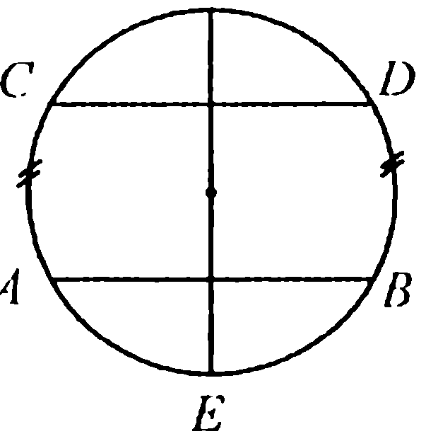

**Свойство 4.5X.** *Если $M$ — внутренняя точка круга радиуса $R$, расположенная на расстоянии $d$ от центра круга, $AB$ — произвольная хорда, проходящая через точку $M$, то $AM \cdot MB = R^2 - d^2$.*

**Доказательство.** Пусть $AB$ и $CD$ — хорды, а $EF$ — диаметр окружности радиуса $R$ (рис. 4.4). Рассмотрим треугольники $AMC$ и $BMD$. У этих треугольников углы $AMC$ и $BMD$ равны как вертикальные, а углы $DCA$ и $DBA$ равны как углы, опирающиеся на одну и ту же дугу $AFD$. Поэтому $\triangle AMC \sim \triangle BMD$ и, значит, $\frac{AM}{MD} = \frac{CM}{MB}$ или $AM \cdot MB = CM \cdot MD$.

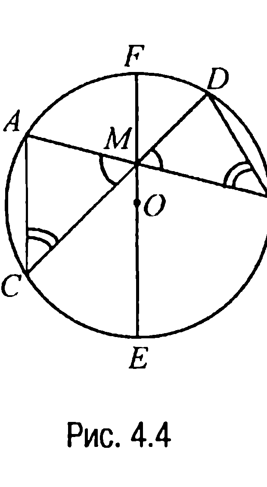

Итак, **произведение отрезков каждой хорды, проходящей через точку $M$, на которые хорды делятся точкой $M$, есть число постоянное для всех хорд.**

А так как диаметр $EF$ — это хорда, проходящая через центр $O$ окружности, то замечая, что $FM = R - d$, $ME = R + d$, приходим к выводу, что $AM \cdot MB = R^2 - d^2$, что и требовалось доказать.

---
**стр. 65**
---

**4.2. Свойства углов**

Пусть $AB$ — дуга окружности с центром в точке $O$ (рис. 4.2). Тогда **угловой мерой** дуги $AB$ (в отличие от длины дуги) называется величина центрального угла $AOB$. При этом, когда говорят, что некоторый угол $KLM$ равен дуге $KM$, то подразумевают, что равны угловые меры угла и дуги.

**Свойство 4.6.** *Вписанный угол равен половине дуги, на которую он опирается.*

**Доказательство.** Рассмотрим сначала случай, когда одна из сторон

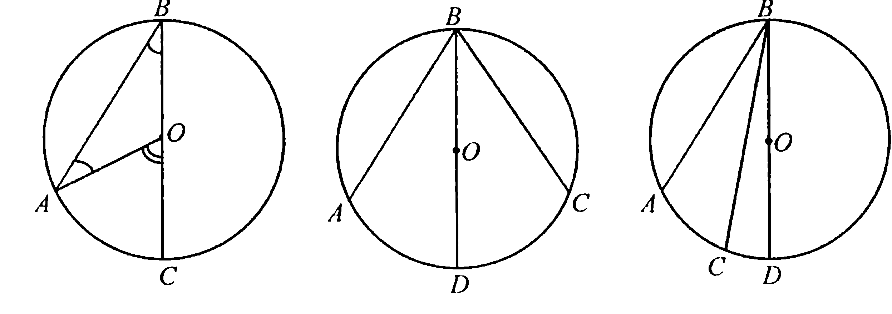

вписанного угла $ABC$ проходит через центр $O$ окружности (рис. 4.5).

Проведем радиус окружности $OA$. Тогда в равнобедренном треугольнике $BOA$ углы $ABO$ и $OAB$ при основании $AB$ равны. Сумма этих равных углов равна внешнему углу $AOC$ треугольника $BOA$ (свойство 1.9), который является центральным углом. Таким образом, вписанный угол $ABC$ равен половине центрального угла $AOC$ и, значит, равен половине дуги, на которую он опирается.

В случаях, когда центр $O$ окружности лежит между сторонами вписанного угла (рис. 4.6) или не лежит между сторонами и на стороне вписанного угла (рис. 4.7), доказательство сводится к уже рассмотренному случаю.

Действительно, проведем диаметр $BD$ (рис. 4.6, 4.7). Тогда в случае, когда центр окружности лежит между сторонами вписанного угла,

$$\angle ABC = \angle ABD + \angle DBC = \frac{1}{2}\cup AD + \frac{1}{2}\cup DC = \frac{1}{2}\cup AC.$$

---
**стр. 66**
---

В случае же, проиллюстрированном на рис. 4.7,

$$\angle ABC = \angle ABD - \angle CBD = \frac{1}{2} \cup AD - \frac{1}{2} \cup CD = \frac{1}{2} \cup AC,$$

что и требовалось доказать.

Далее, при рассмотрении круга и ограничивающей его окружности имеют место и следующие два свойства.

**Свойство 4.7.** *Угол, вершина которого лежит внутри круга, равен полусумме дуг окружности, заключенных между сторонами угла и продолжениями его сторон за вершину.*

**Доказательство.** Пусть продолжения сторон $AB$ и $BC$ угла $ABC$ за вершину $B$ пересекают окружность в точках $E$ и $D$ соответственно (рис. 4.8).

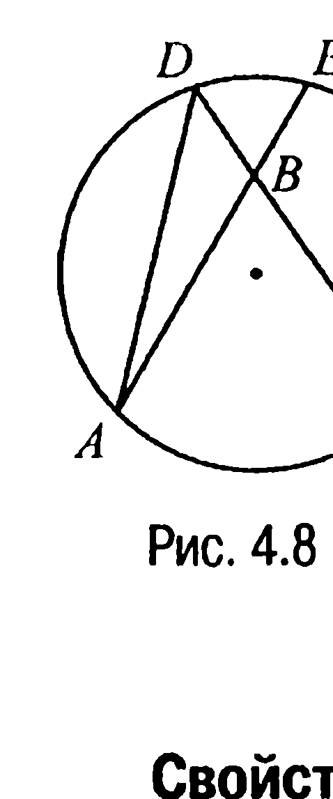

Тогда относительно треугольника $ADB$ угол $ABC$ будет внешним и, значит, (свойства 1.9, 4.6), $\angle ABC = \angle ADC + \angle BAD = \frac{1}{2} \cup AC + \frac{1}{2} \cup DE = \frac{1}{2} (\cup AC + \cup DE)$.

**Свойство 4.8.** *Угол, вершина которого лежит вне круга, равен полуразности дуг окружности, заключенных между сторонами угла.*

**Доказательство.** Пусть стороны угла с вершиной $B$ пересекают окружность в точках $D, E$ и $A, C$ (рис. 4.9).

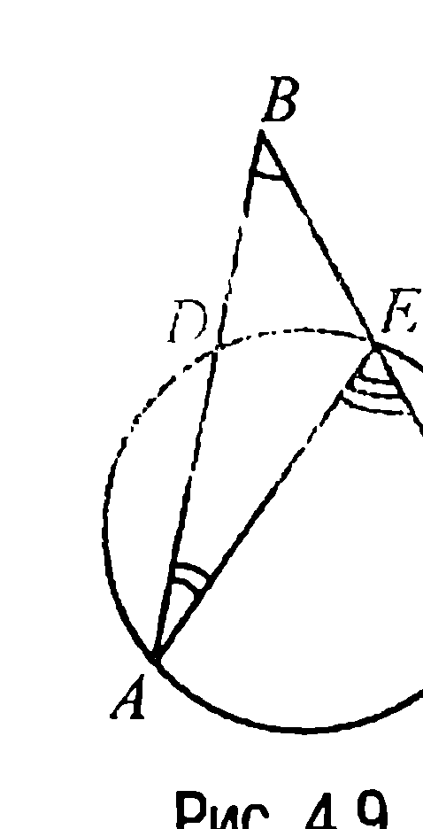

Угол $AEC$ является внешним углом треугольника $ABE$, поэтому по свойству 1.9 $\angle AEC = \angle ABC + \angle EAB$, откуда

$$\angle ABC = \angle AEC - \angle EAB = \frac{1}{2} \cup AC - \frac{1}{2} \cup DE = \frac{1}{2} (\cup AC - \cup DE),$$

что и доказывает требуемое.

---
**стр. 67**
---

**ЗАДАЧИ**

▼ **4.1.** *Две окружности внутренне касаются в точке $A$. Через точку $A$ проведены две секущие этих окружностей. Одна из секущих пересекает меньшую и большую окружности в точках $M$ и $N$ соответственно, а другая — в точках $P$ и $Q$. Доказать, что $AM : AN = AP : AQ$.*

**Решение.** Пусть $O_1$ и $O_2$ — центры, а $R_1$ и $R_2$ — радиусы меньшей и большей окружностей соответственно (рис. 4.10). Проведем $O_1B \perp AQ$ и $O_2C \perp AQ$. Тогда так как $AB = BP = \frac{1}{2} AP$, $AC = CQ = \frac{1}{2} AQ$ (свойство 4.1X) и точки $A, O_1, O_2$ лежат на одной прямой $AD$ (что очевидно), то $\Delta O_1AB \sim \Delta O_2AC$. Отсюда следует, что

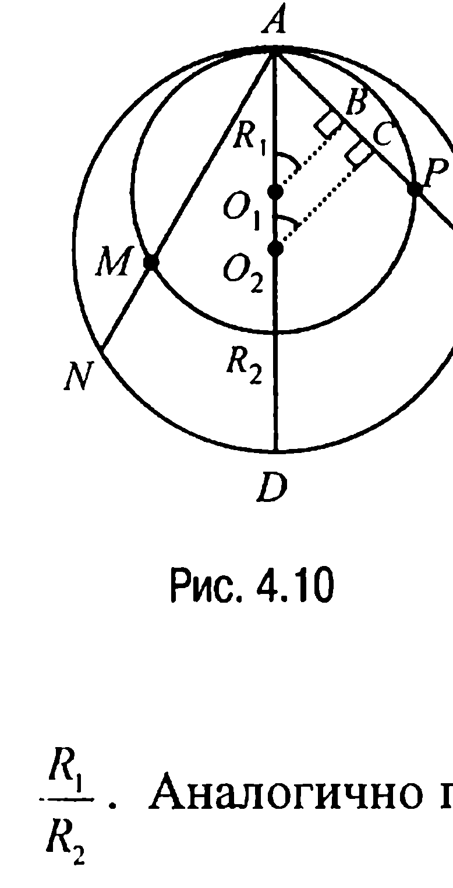

$$\frac{AB}{AC} = \frac{AO_1}{AO_2} \quad \text{или} \quad \frac{\frac{1}{2} AP}{\frac{1}{2} AQ} = \frac{AP}{AQ} = \frac{AO_1}{AO_2} = \frac{R_1}{R_2}.$$

Аналогично показывается, что и $\frac{AM}{AN} = \frac{R_1}{R_2}$, а это и означает, что $\frac{AM}{AN} = \frac{AP}{AQ}$.

▼ **4.2.** *В треугольнике из двух вершин опущены высоты. Доказать, что серединный перпендикуляр к отрезку с концами в основаниях высот делит сторону треугольника, противолежащую третьей вершине, пополам.*

**Решение.** Пусть $AE$ и $BD$ — высоты треугольника $ABC$, $F$ — середина отрезка $DE$ (рис. 4.11). Тогда так как углы $AEB$ и $ADB$ являются равными (они оба равны $90^\circ$), то точки $A, B, E$ и $D$ будут лежать на одной окружности (задача 15.7) с центром $O$, построенной на $AB$ как на диаметре.

---
**стр. 68**
---

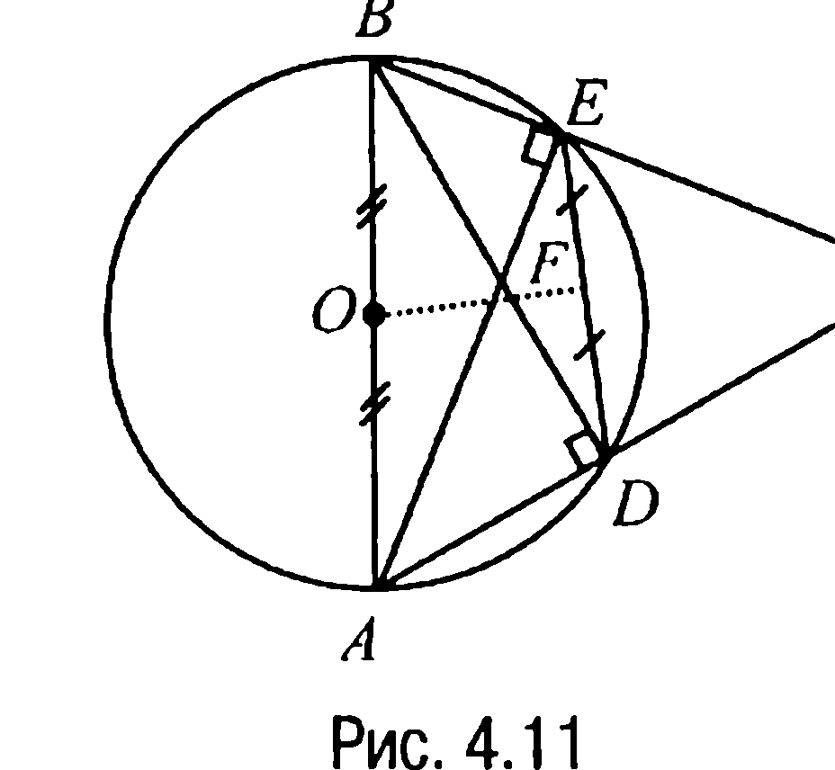

Но в таком случае в силу характеристичности свойства 4.1X серединный перпендикуляр к хорде $DE$ лежит на прямой, содержащей диаметр окружности, проходящий через точку $F$, откуда и следует требуемое.

**4.3.** *Доказать, что если во вписанном шестиугольнике $ABCDEF$ сторона $AB \parallel DE$, а сторона $BC \parallel EF$, то сторона $CD \parallel AF$.*

**Решение.** Дуги $AFE$ и $BCD$ (рис. 4.12), заключенные между параллельными хордами $AB$ и $DE$, равны, поэтому $\angle ACE = \angle BFD$. По той же причине равны и углы $CAE$ и $BDF$. Таким образом, треугольники $ACE$ и $BDF$ имеют по два равных угла, а значит их третьи углы $CEA$ и $DBF$ также равны. Из равенства этих углов следует равенство дуг $ABC$ и $DEF$, а поэтому и параллельность прямых $CD$ и $AF$.

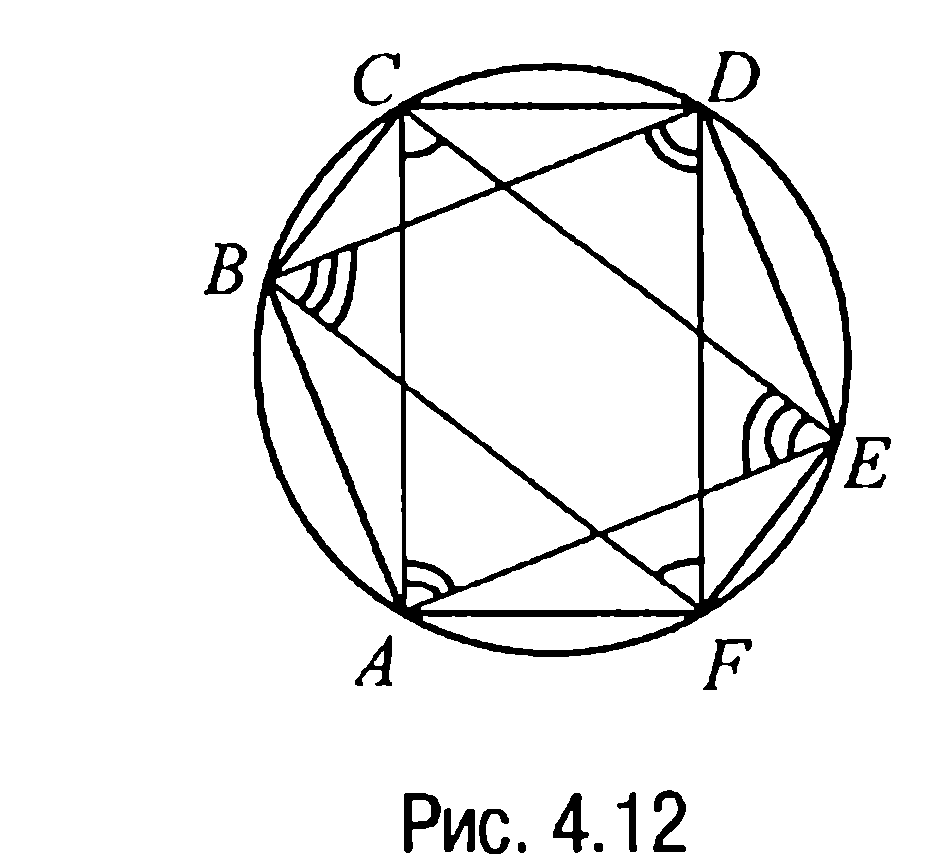

**4.4.** *В круге радиуса $R$ проведены две пересекающиеся под прямым углом хорды. Найти*

*а) сумму квадратов четырех отрезков этих хорд, на которые последние делятся точкой пересечения,*

*б) сумму квадратов хорд,*

*если расстояние от центра $O$ круга до их точки пересечения равно $d$.*

**Решение.** Пусть $AB$ и $CD$ — данные хорды, а $E$ — их точка пересечения (рис. 4.13, 4.14).

а) Так как хорды $AB$ и $CD$ пересекаются под прямым углом, то дуги $AC$ и $BD$ в сумме составляют полуокружность (свойство 4.7). Отметим на окружности точку $F$ такую, что $CF = BD$ (рис. 4.13). Тогда $\cup CF = \cup BD$ и, значит, $\cup AF = 180^\circ$. Но в таком случае

---
**стр. 69**
---

$AE^2 + CE^2 + EB^2 + ED^2 = AC^2 + DB^2 = AC^2 + CF^2 = AF^2 = 4R^2$.

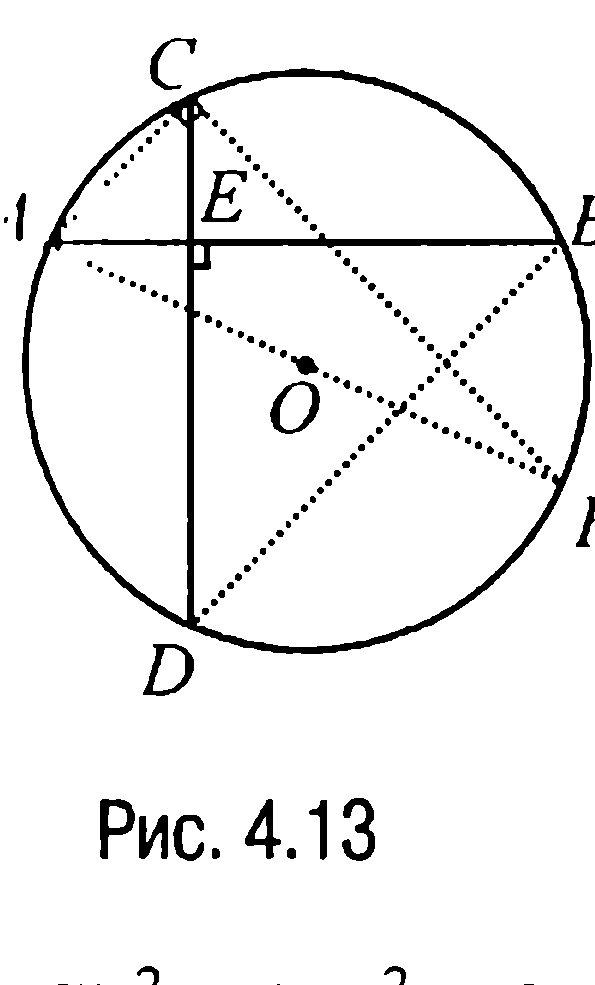

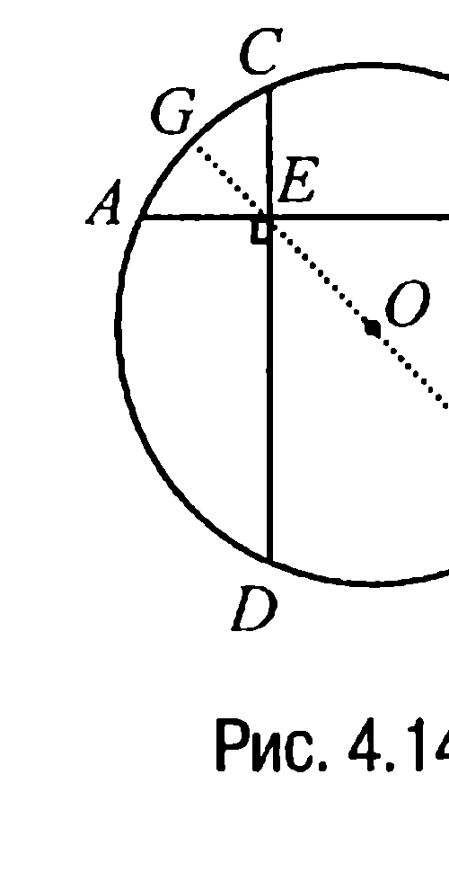

б) Пусть $FG$ — диаметр круга, проходящий через точку $E$ (рис. 4.14). Тогда, учитывая, что $AE \cdot EB = CE \cdot ED = FE \cdot EG = (R - d) \cdot (R + d)$ (свойство 4.5X), имеем $AB^2 + CD^2 = (AE + EB)^2 + (CE + ED)^2 = AE^2 + EB^2 + CE^2 + ED^2 + 2 AE \cdot EB + 2 CE \cdot ED = 4R^2 + 4(R^2 - d^2) = 4(2R^2 - d^2)$.

**Ответ:** а) $4R^2$; б) $4(2R^2 - d^2)$.

**4.5.** Из произвольной точки $B$ внутри данного угла с вершиной $A$ опущены перпендикуляры $BC$ и $BD$ на стороны угла. Из точки $A$ опущен перпендикуляр $AE$ на отрезок $CD$. Доказать, что $\angle CAE = \angle BAD$.

**Решение.** Так как $\angle ACB = \angle ADB = 90^\circ$, то точки $C$ и $D$ лежат на окружности, построенной на отрезке $AB$ как на диаметре (рис. 4.15). Отсюда следует, что углы $ABD$ и $ACD$ равны как углы, опирающиеся на одну и ту же дугу.

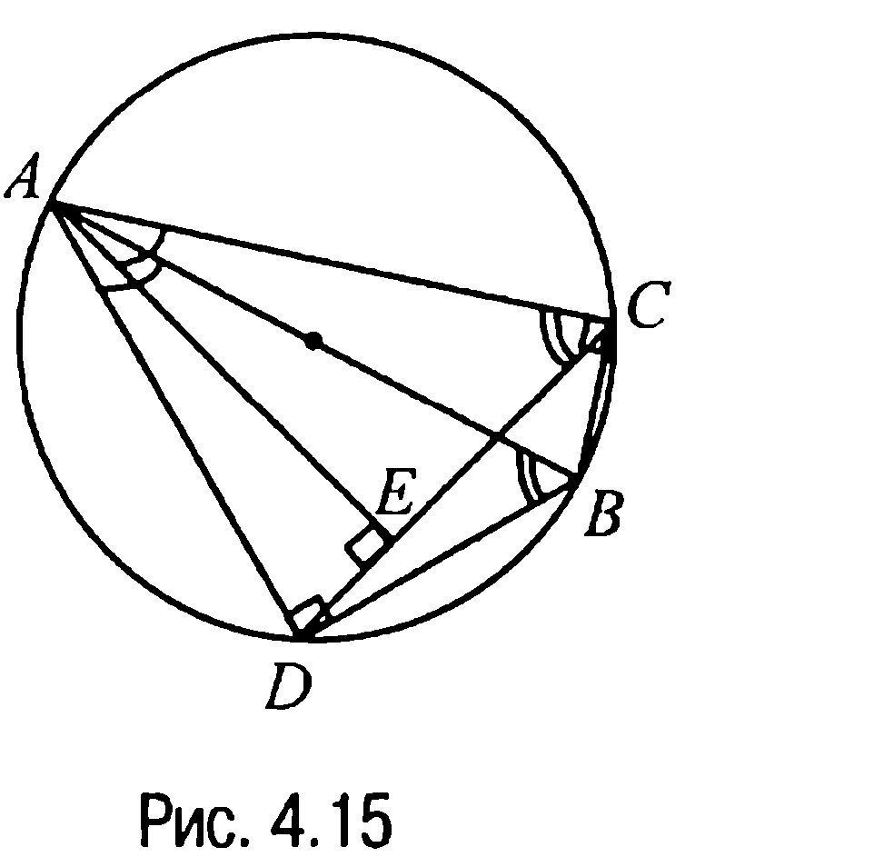

А поскольку треугольники $ACE$ и $ABD$ прямоугольные, то $\angle CAE = 90^\circ - \angle ACE = 90^\circ - \angle ABD = \angle BAD$.

**4.6.** На окружности отмечены точки $A, B, C, D$ в указанном порядке, $E$ — середина дуги $AB$. Обозначим точки пересечения хорд $EC$ и $ED$ с хордой $AB$ через $F$ и $G$. Доказать, что $GFCD$ — вписанный четырехугольник.

**Решение.** Рассмотрим рис. 4.16. Из свойства 4.7 следует, что $\angle GFC = \angle AFC = \frac{1}{2}(\smile EB + \smile CA)$, а из свойства 4.6 — что

---
**стр. 70**
---

$\angle CDG = \angle CDE = \frac{1}{2}(\smile EB + \smile BC)$. Но $\smile EB = \smile AE$. Поэтому

$$\angle GFC + \angle CDG = \frac{1}{2}(\smile EB + \smile BC + \smile CA + \smile AE) = 180^\circ,$$

а это и означает, что четырехугольник $GFCD$ — вписанный.

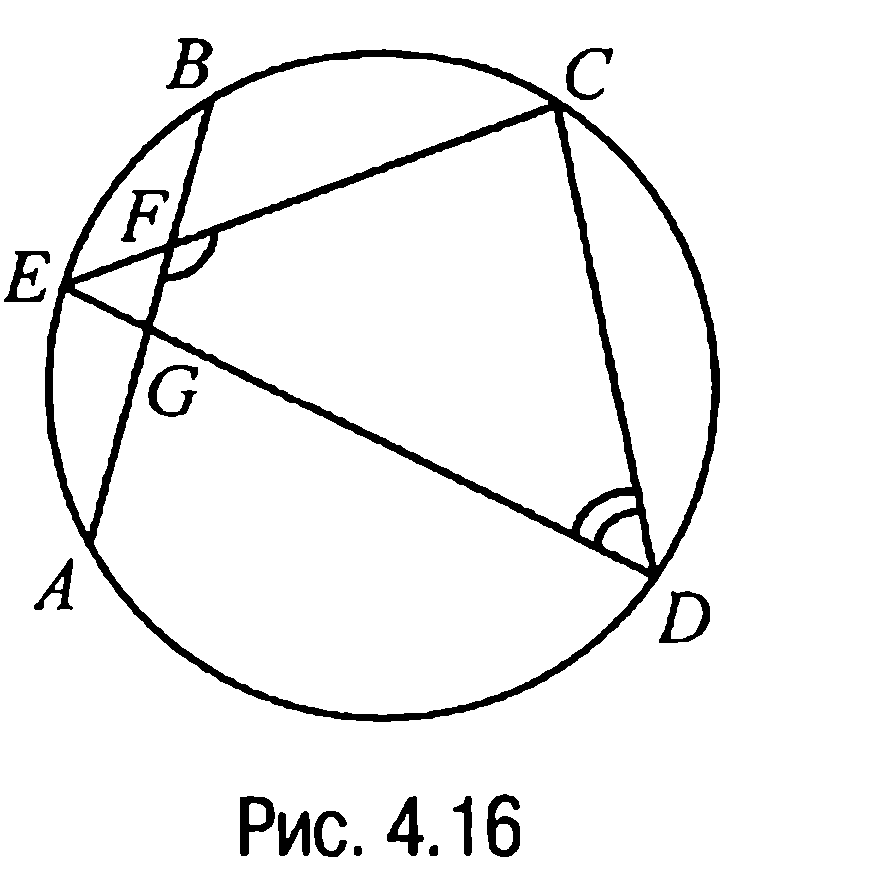

**4.7.** Пусть $K$ — точка пересечения диагоналей вписанного в окружность четырехугольника $ABCD$ ($AB > CD$), угол $DKC$ равен $\alpha$, а угол между прямыми $AD$ и $BC$ равен $\beta$. Найти углы $DBC$ и $BDA$.

**Решение.** Обозначим через $E$ точку пересечения прямых $AD$ и $BC$ (рис. 4.17). Тогда $\beta = \frac{1}{2}(\smile AB - \smile CD)$, а $\alpha = \frac{1}{2}(\smile AB + \smile CD)$. Но в таком случае $\smile AB = \alpha + \beta$, $\smile CD = \alpha - \beta$ и, следовательно, $\angle DBC = \frac{1}{2}\smile CD = \frac{\alpha - \beta}{2}$, $\angle BDA = \frac{1}{2}\smile AB = \frac{\alpha + \beta}{2}$.

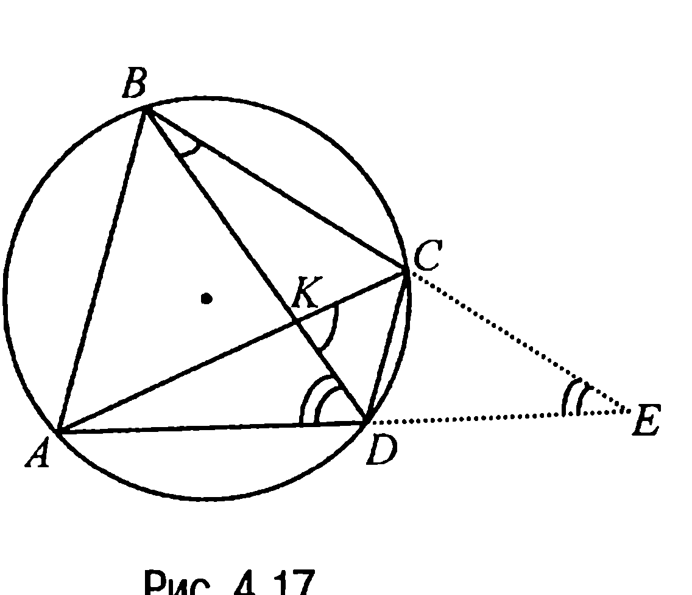

**Ответ:** $\angle DBC = \frac{1}{2}(\alpha - \beta)$; $\angle BDA = \frac{1}{2}(\alpha + \beta)$.

**ЗАДАЧИ ДЛЯ САМОСТОЯТЕЛЬНОГО РЕШЕНИЯ**

**4.1 С.** В круге с центром $O$ проведена хорда $AB$, пересекающая диаметр в точке $C$ и составляющая с ним угол, равный $60^\circ$. Найти $OC$, если $AC = 4$, $CB = 10$.
