## 1.5. Окружность. Касательная, касательные и хорды, касательные и секущие

---
**стр. 71**
---

**4.2 С.** На окружности, описанной около треугольника $ABC$, отмечены отличные от точек $A$, $B$, $C$ точки $D$, $E$, $F$ таким образом, что $FA = AB$, $EB = BC$, $DC = CA$. Найти углы треугольника $DEF$, если $\angle CAB = 32^\circ$, $\angle ABC = 72^\circ$.

**4.3 С.** В круге проведены три равные хорды $AB$, $BC$ и $CD$ длины $a$. Хорды $AB$ и $CD$ пересекаются в точке $K$, угол $BKC$ равен $120^\circ$. Найти радиус круга.

**4.4 С.** В треугольнике $ABC$ сторона $BA = 2$, $BC = 4$, $AC = 3$. Окружность, проходящая через точки $B$ и $C$, пересекает прямую $AC$ в точке $M$, а прямую $AB$ — в точке $N$. Известно, что $MC = 4$. Найти $MN$ и $AN$.

**4.5 С.** Одна из двух взаимно перпендикулярных хорд окружности радиуса $R = 5\sqrt{5}/2$ делится их точкой пересечения в отношении $2 : 3$, а другая — в отношении $3 : 8$. Найти эти хорды.

**4.6 С.** Пусть $K$ — точка пересечения диагоналей вписанного в окружность четырехугольника $ABCD$ ($AB > CD$), угол $BCA$ равен $\alpha$, угол $DAC$ равен $\beta$. Найти угол $CKB$ и угол между прямыми $AD$ и $BC$.

**§ 5. ОКРУЖНОСТЬ. КАСАТЕЛЬНАЯ, КАСАТЕЛЬНЫЕ И ХОРДЫ, КАСАТЕЛЬНЫЕ И СЕКУЩИЕ**

**Касательная к окружности** — *это прямая, имеющая с окружностью единственную общую точку, называемую точкой касания.*

В учебной и методической литературе встречается и другое определение касательной к окружности, эквивалентное приведенному.

**Касательная к окружности** — *это прямая, проходящая через точку окружности перпендикулярно к радиусу окружности, проведенному в эту точку.*

---
**стр. 72**
---

В настоящем пособии предпочтение отдается первому из приведенных двух определений.

**5.1. Свойства касательных**

**Свойство 5.1X.** *Касательная к окружности перпендикулярна радиусу окружности, проведенному в точку касания.*

**Доказательство.** Пусть $MN$ — касательная к окружности с центром в точке $O$ и $A$ — точка касания. Тогда, очевидно, любая точка прямой $MN$, отличная от точки $A$, например, точка $B$ (рис. 5.1), будет лежать вне круга с центром $O$ и поэтому отрезок $OB$ будет больше отрезка $OA$. Другими словами, радиус $OA$ окружности с центром $O$ будет наименьшим из отрезков, соединяющих точку $O$ с любой точкой прямой $MN$. А отсюда уже и следует, что $MN \perp OA$.

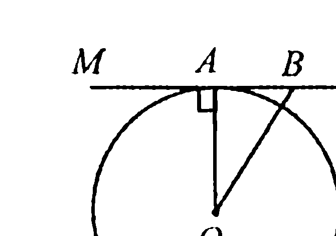

**Свойство 5.2.** *Если из некоторой точки плоскости проведены две касательные к окружности, то отрезки касательных от этой точки до точек касания равны.*

**Доказательство.** Пусть $AC$ и $AB$ — касательные к окружности с центром в точке $O$ (рис. 5.2). На основании свойства 5.1X имеем $AC \perp OC$, а $AB \perp OB$. Тогда в прямоугольных треугольниках $OCA$ и $OBA$ гипотенуза $OA$ общая, а катеты $OC$ и $OB$ как радиусы окружности равны. Таким образом, треугольники $OCA$ и $OBA$ оказываются равными, откуда и следует, что $AC = AB$.

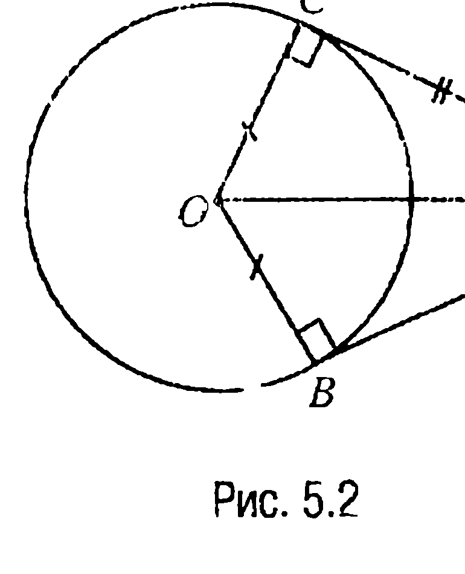

---
**стр. 73**
---

**Свойство 5.3.** *Если из некоторой точки плоскости проведены две касательные к окружности, то прямая, проходящая через центр окружности и эту точку, делит угол между касательными пополам.*

**Доказательство.** При доказательстве свойства 5.2 было показано, что прямоугольные треугольники $OCA$ и $OBA$ (рис. 5.2) равны. А так как в равных треугольниках против равных сторон (в частности, $OC$ и $OB$) лежат равные углы, то отсюда и следует, что $\angle CAO = \angle OAB$.

**5.2. Свойство углов между касательной и хордой**

**Свойство 5.4.** *Если через некоторую точку окружности провести касательную и хорду, то каждый из двух углов, образованных этими касательной и хордой, равен половине дуги, заключенной между сторонами соответствующего угла.*

**Доказательство.** Пусть $AB$ — хорда окружности, $EC$ — касательная к окружности с точкой касания $A$, $AD$ — диаметр окружности (рис. 5.3). Тогда так как стороны углов $ADB$ и $CAB$ соответственно перпендикулярны, то (свойство 1.7) эти углы равны. Но угол $ADB$ является вписанным и, значит (свойство 4.6), он равен половине дуги $AB$, на которую он опирается. Но в таком случае угол $CAB$ также равен половине дуги $AB$. Что же касается угла $BAE$, то рассуждения здесь следующие. Так как $\angle BAE = \angle BAD + \angle DAE$, то с учетом того, что $\angle DAE = 90^\circ = \frac{1}{2}\cup AFD$, а $\angle BAD = \frac{1}{2}\cup DB$, имеем $\angle BAE = \frac{1}{2}(\cup AFD + \cup DB) = \frac{1}{2}\cup AFB$. А это и требовалось доказать.

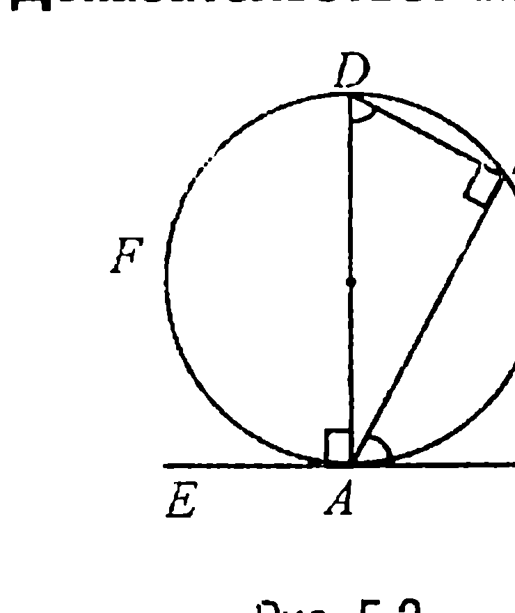

---
**стр. 74**
---

**5.3. Свойство касательной и секущей**

**Свойство 5.5.** *Если $M$ — точка вне круга радиуса $R$, расположенная на расстоянии $d$ от центра круга, и если через эту точку проведены касательная $MC$ ($C$ — точка касания) и секущая, пересекающая границу круга в точках $A$ и $B$, то $MA \cdot MB = MC^2 = d^2 - R^2$.*

**Доказательство.** Так как углы $MBC$ и $MCA$ (рис. 5.4) равны (они равны половине дуги $CA$), а угол при вершине $M$ является общим для треугольников $CMA$ и $CMB$, то по первому признаку подобия треугольников указанные треугольники подобны и, значит, $\frac{MA}{MC} = \frac{MC}{MB}$, или $MA \cdot MB = MC^2$. Но из прямоугольного треугольника $OCM$, где $O$ — центр круга, следует, что $MC^2 = d^2 - R^2$, а это и доказывает требуемое.

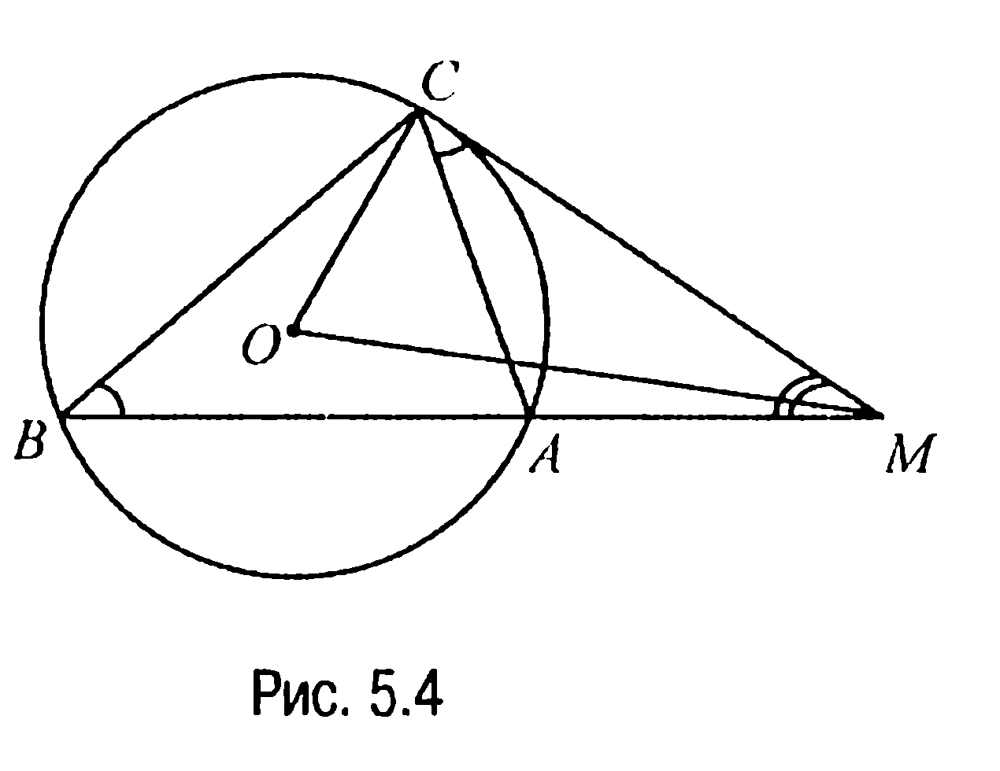

**ЗАДАЧИ**

**5.1.** Две окружности $s_1$ и $s_2$ пересекаются в точках $A$ и $B$. Через точку $A$ проведены хорды $AC$ и $AD$, касающиеся данных окружностей. Доказать, что $AC^2 \cdot DB = AD^2 \cdot BC$.

**Решение.** Угол $BAC$ как угол между касательной $AC$ к окружности $s_1$ и ее хордой $AB$ (рис. 5.5) равен половине дуги $AB$ и, следовательно, он равен вписанному углу $ADB$, опирающемуся на ту же дугу. Аналогично $\angle DAB = \angle ACB$. Значит $\triangle ABD \sim \triangle CBA$ и, таким

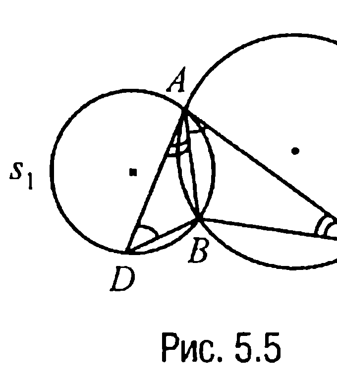

---
**стр. 75**
---

образом, $\frac{DB}{AB} = \frac{AD}{AC}$, $\frac{AB}{BC} = \frac{AD}{AC}$. Отсюда $\frac{DB}{BC} = \frac{AD^2}{AC^2}$ или $AC^2 \cdot DB = AD^2 \cdot BC$, что и требовалось доказать.

▼ **5.2.** *Две окружности $s_1$ и $s_2$ касаются в точке $A$. К ним проведена общая внешняя касательная, касающаяся окружностей в точках $B$ и $C$. Доказать, что угол $CAB$ равен $90^\circ$.*

**Решение.** Обозначим через $O_1$ и $O_2$ центры окружностей $s_1$ и $s_2$ соответственно (рис. 5.6).

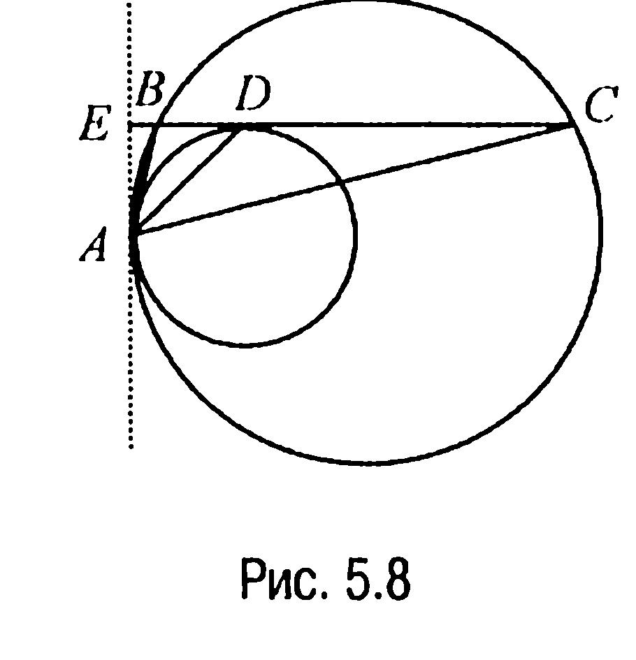

Тогда $\angle BCA = \frac{1}{2} \angle CO_2A$, $\angle ABC = \frac{1}{2} \angle BO_1A$. Отсюда следует, что $\angle ABC + \angle BCA = \frac{1}{2} (\angle BO_1A + \angle CO_2A)$.

Далее, поскольку $O_1B \perp BC$ и $O_2C \perp BC$, то $O_1B \parallel O_2C$. Но в таком случае $\angle BO_1A + \angle CO_2A = 180^\circ$, поэтому $\angle ABC + \angle BCA = 90^\circ$ и, таким образом, $\angle CAB = 90^\circ$.

**5.3.** *Окружности $s_1$ и $s_2$ пересекаются в точке $A$. Через точку $A$ проведена прямая, пересекающая $s_1$ в точке $B$, а $s_2$ — в точке $C$. Через точки $B$ и $C$ проведены касательные к окружностям, пересекающиеся в точке $D$. Доказать, что угол $BDC$ не зависит от выбора прямой, проходящей через точку $A$ и пересекающей окружности $s_1$ и $s_2$.*

**Решение.** Обозначим через $E$ вторую точку пересечения окружностей $s_1$ и $s_2$ (рис. 5.7). Тогда $\angle DCB = \frac{1}{2} \cup AC = \angle AEC$, а $\angle DBC = \frac{1}{2} \cup BA = \angle AEB$. Таким образом, $\angle BDC = 180^\circ -$
$- \angle DBC - \angle DCB = 180^\circ -$
$- \angle AEB - \angle AEC = 180^\circ -$
$- \angle BEC = \angle ABE + \angle ACE$.

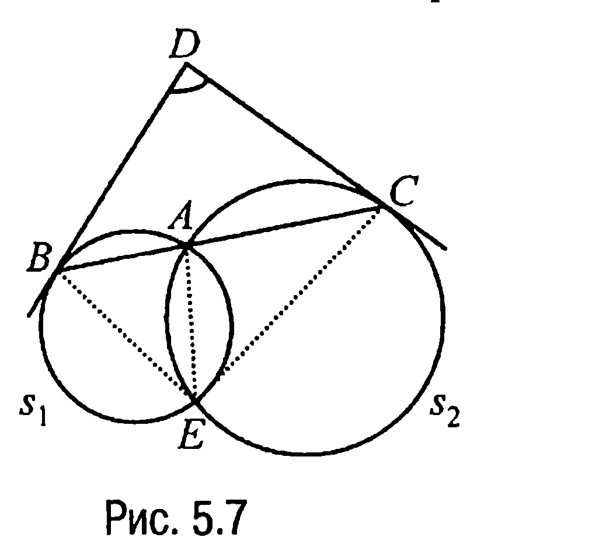

---
**стр. 76**
---

Полученное равенство и доказывает требуемое, поскольку при различных положениях точек $B$ и $C$ на окружностях $s_1$ и $s_2$ углы $ABE$ и $ACE$ меняться не будут, так как они оказываются углами, опирающимися на одни и те же дуги.

▼ **5.4.** *Две окружности касаются внутренним образом в точке $A$. Пусть $BC$ — хорда большей окружности, касающаяся меньшей окружности в точке $D$. Доказать, что $AD$ — биссектриса угла $BAC$.*

**Решение.** Обозначим через $E$ точку пересечения прямой, проходящей через точки $B$ и $C$, с касательной к окружностям в точке $A$ (рис. 5.8). Тогда так как $EA$ и $ED$ — касательные к меньшей окружности, то по свойству 5.4 углы $EAD$ и $EDA$ равны $\frac{1}{2}\cup AD$.

Угол же между касательной $EA$ и хордой $AB$ большей окружности, т. е. $\angle EAB = \frac{1}{2}\cup AB$. А поскольку $\angle EAB = \angle BCA = \angle DCA$, то $\angle DCA + \angle CAD = \angle EDA = \angle EAB + \angle BAD = \angle DCA + \angle BAD$, откуда следует, что $\angle CAD = \angle BAD$, а это и доказывает требуемое.

▼ **5.5.** *Две непересекающиеся окружности вписаны в угол. Через две точки касания этих окружностей со сторонами угла, которые лежат на разных сторонах этого угла и на разных окружностях, проведена прямая. Доказать, что эта прямая отсекает на окружностях равные хорды.*

**Решение.** Пусть $A$ — вершина данного угла, $B, C, D, E$ — точки касания окружностей со сторонами угла, а $F$ и $G$ — точки пересечения секущей $BE$ с окружностями (рис. 5.9). Тогда, воспользовавшись тем фактом, что произведение секущей на ее внешнюю часть равно квадрату касательной, имеем $BE \cdot BG = BC^2$, $BE \cdot FE = DE^2$.

---
**стр. 77**
---

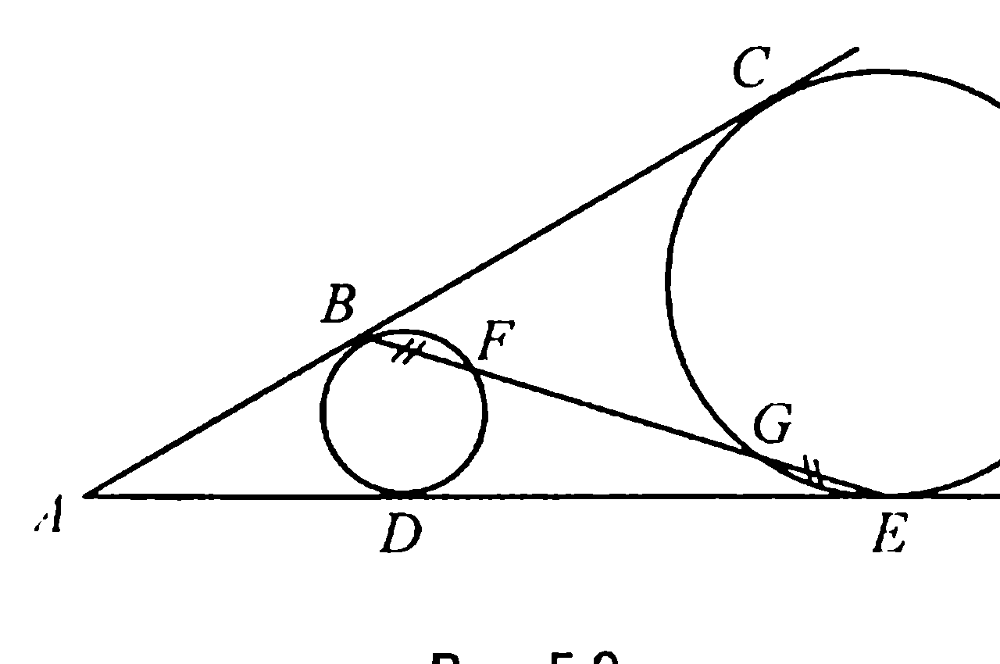

Но поскольку $AB = AD$, а $AC = AE$, то $BC = DE$ и поэтому $BE \cdot BG = BC^2 = BC \cdot DE$, $BE \cdot FE = DE^2 = DE \cdot BC$. Полученные же соотношения означают, что $BG = FE$ и, следовательно, $BF = GE$.

▼ **5.6.** *К двум окружностям проведены внешняя касательная $AB$ и две внутренние касательные, пересекающие отрезок $AB$ в точках $C$ и $D$. Доказать, что $AC = DB$.*

**Решение.** Пусть $E, K$ и $F, L$ — точки касания внутренних касательных с окружностями $s_1$ и $s_2$ соответственно (рис. 5.10).

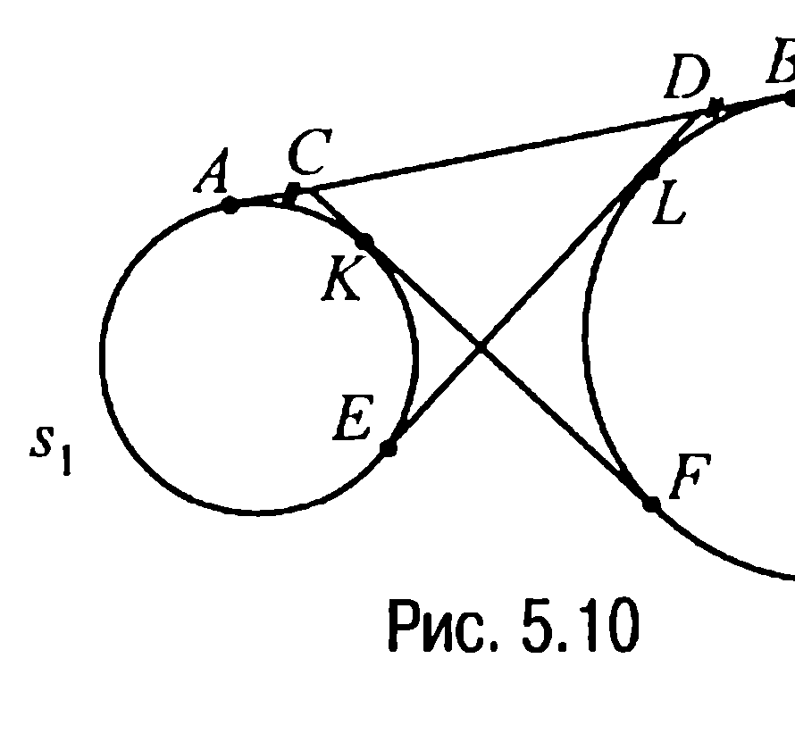

Тогда по свойству 5.2 $ED = AD, CF = CB, AC = CK, LD = DB$. Таким образом, $ED + DB = AD + DB = AB = AC + CB = AC + CF = 2AC + KF$. С другой стороны, $AB = AD + DB = ED + DB = 2DB + EL$. Итак, $2AC + KF = 2DB + EL$. А отсюда уже и следует, что $AC = DB$, поскольку $KF = EL$.

**5.7.** *Две окружности радиусов $R$ и $r$ ($R > r$) внешне касаются в точке $A$. Через точку $B$ на большей окружности проведена прямая, касающаяся меньшей окружности в точке $C$. Найти $BC$, если $AB = a$.*

**Решение.** Пусть $O_1$ и $O_2$ — центры окружностей радиусов $R$ и $r$ соответственно, $D$ — точка пересечения прямой $BA$ с меньшей окружностью, $KL$ — касательная к окружностям в точке $A$ (рис. 5.11).

Тогда так как, с одной стороны, $\angle BAK = \angle DAL$, а, с другой, —

---
**стр. 78**
---

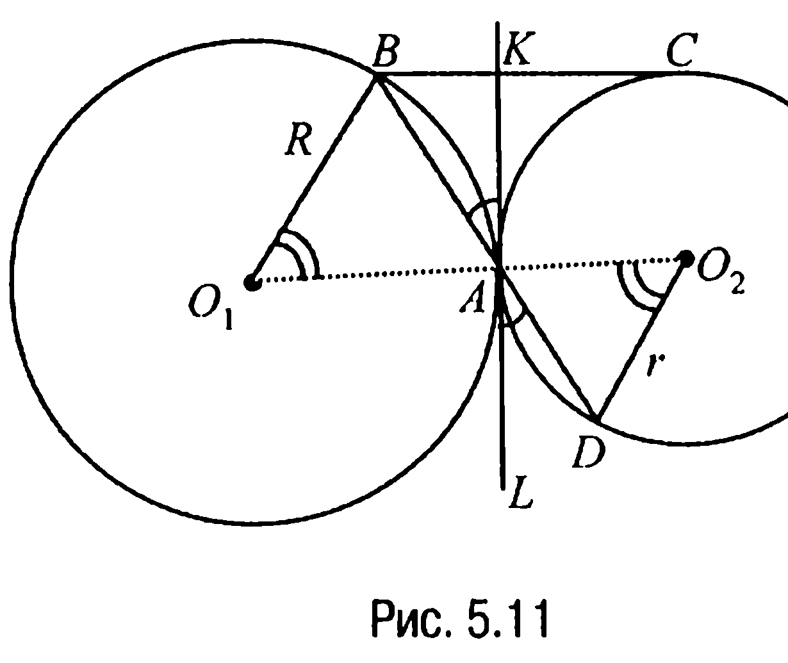

$\angle BAK = \angle BO_1A = \frac{1}{2}\cup BA,$

$\angle DAL = \angle AO_2D = \frac{1}{2}\cup AD,$

то $\angle BO_1A = \angle AO_2D$.

Поэтому равнобедренные треугольники $BO_1A$ и $AO_2D$ подобны и, следовательно, $\frac{AD}{AB} = \frac{r}{R}$ или $AD = a \cdot \frac{r}{R}$. Но в таком случае по свойству касательной и секущей имеем $BC = \sqrt{BD \cdot BA} = \sqrt{\left(a + a\frac{r}{R}\right) \cdot a} = a \cdot \sqrt{\frac{R + r}{R}}$.

**Ответ:** $BC = a \cdot \sqrt{\frac{R + r}{R}}$.

**5.8.** Около треугольника $ABC$ описана окружность и к ней в точке $A$ проведена касательная, пересекающаяся с продолжением стороны $BC$ треугольника в точке $D$. Найти отрезки $AD$ и $DB$, если $BC = a$, $AC = b$, $AB = c$.

**Решение.** Пусть отрезок $BE$, где $E$ — точка прямой $AC$, параллелен касательной к окружности в точке $A$. При $c < b$ точка $E$ принадлежит отрезку $AC$ (рис. 5.12), а при $c > b$ (рис. 5.13) она

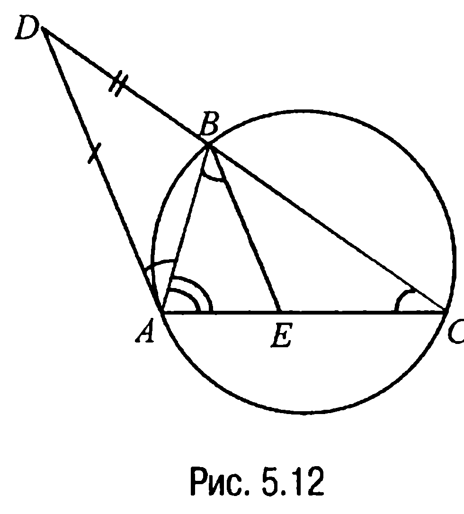

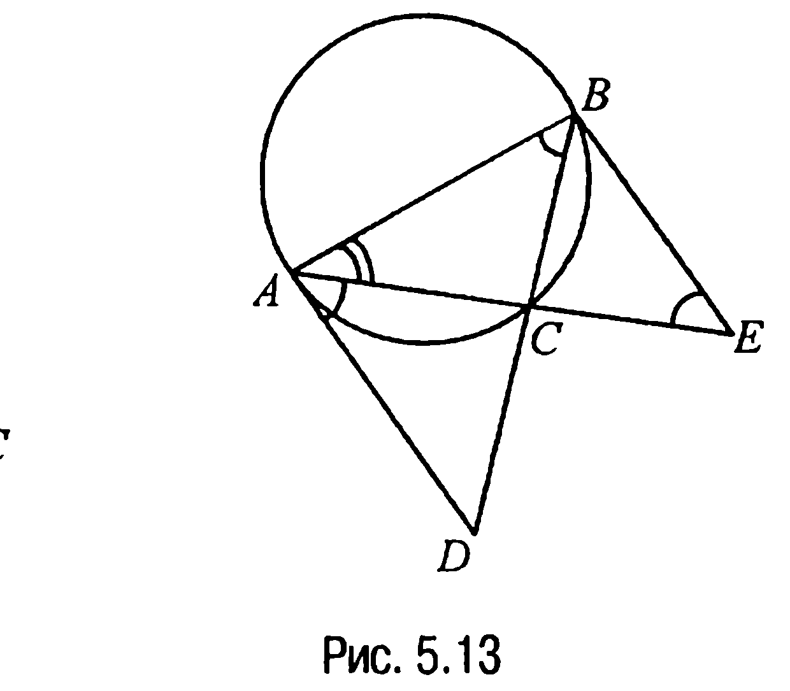

---
**стр. 79**
---

расположена на его продолжении ($c \neq b$, так как касательная к окружности и прямая $BC$ пересекаются).

Рассмотрим случай $c < b$. Тогда так как $\angle BCA = \angle BAD = \frac{1}{2}\cup AB$, то $\angle ABE = \angle BCA$ и треугольник $ABE$ подобен треугольнику $ABC$ (угол $CAB$ у них общий). Из подобия этих треугольников следует, что $\frac{AE}{AB} = \frac{AB}{AC}$, т. е. $AE = \frac{AB^2}{AC} = \frac{c^2}{b}$. А тогда $EC = AC - AE = b - \frac{c^2}{b} = \frac{b^2 - c^2}{b}$.

Далее, так как $BE \parallel DA$, то $\frac{EC}{AE} = \frac{BC}{DB}$, т. е. $\frac{\frac{b^2 - c^2}{b}}{\frac{c^2}{b}} = \frac{a}{DB}$, или $DB = \frac{ac^2}{b^2 - c^2}$. Теперь так как $AD$ — касательная, а $DC$ — секущая, то $AD^2 = DB \cdot DC = \frac{ac^2}{b^2 - c^2}\left(a + \frac{ac^2}{b^2 - c^2}\right) = \left(\frac{abc}{b^2 - c^2}\right)^2$ и, таким образом, $AD = \frac{abc}{b^2 - c^2}$.

Рассмотрим случай $c > b$. В этом случае (рис. 5.13) $\angle ABC = \angle CAD = \frac{1}{2}\cup AC$. Далее, поскольку $AD \parallel BE$ и, следовательно, $\angle CAD = \angle AEB = \angle ABC$, а $\angle BAE$ у треугольников $ABC$ и $ABE$ — общий, то приходим к выводу, что эти треугольники подобны. Проводя же выкладки, аналогичные первому случаю, с учетом того, что $CE = AE - AC$, получаем, что $DB = \frac{ac^2}{c^2 - b^2}$, $AD = \frac{abc}{c^2 - b^2}$.

Окончательно ответ можно записать так:

**Ответ:** $AD = \frac{abc}{|c^2 - b^2|}$; $DB = \frac{ac^2}{|c^2 - b^2|}$.

---
**стр. 80**
---

**ЗАДАЧИ ДЛЯ САМОСТОЯТЕЛЬНОГО РЕШЕНИЯ**

**5.1 С.** Две окружности пересекаются в точках $A$ и $B$. Точка $C$ лежит на прямой $AB$, но не на отрезке $AB$. Доказать, что длины всех отрезков касательных от точки $C$ до окружностей равны.

**5.2 С.** Доказать, что для любой хорды $AB$ окружности радиуса $R$ отношение $AB^2 : AD$, где $AD$ — расстояние от точки $A$ до касательной к окружности в точке $B$, есть величина постоянная.

**5.3 С.** Радиус окружности равен $r$. Из точки $M$ проведена касательная $MA$ и секущая $MB$, проходящая через центр окружности $O$. Найти расстояние между точкой $M$ и центром окружности, если $MB = 2MA$.

**5.4 С.** Центр окружности, касающейся стороны $BC$ треугольника $ABC$ в точке $B$ и проходящей через вершину $A$, лежит на отрезке $AC$. Найти площадь треугольника $ABC$, если $BC = 6$, $AC = 9$.

**5.5 С.** $B$ и $C$ — точки касания окружности с прямыми, проходящими через точку $A$. Найти $AB$, если расстояние между точками $B$ и $C$ равно $14{,}4$, а радиус окружности равен $9$.

**5.6 С.** Окружность, вписанная в ромб $ABCD$, касается стороны $AD$ в точке $M$. Отрезок $MC$ пересекает окружность в точке $N$, при этом $MN = 3$, $NC = 1$. Найти сторону ромба.

**5.7 С.** Через вершины $B$ и $C$ треугольника $ABC$ проходит окружность, пересекающая стороны $AB$ и $AC$ в точках $K$ и $M$ соответственно. Найти $MK$ и $AM$, если $AB = 2$, $BC = 4$, $AC = 5$, $AK = 1$
