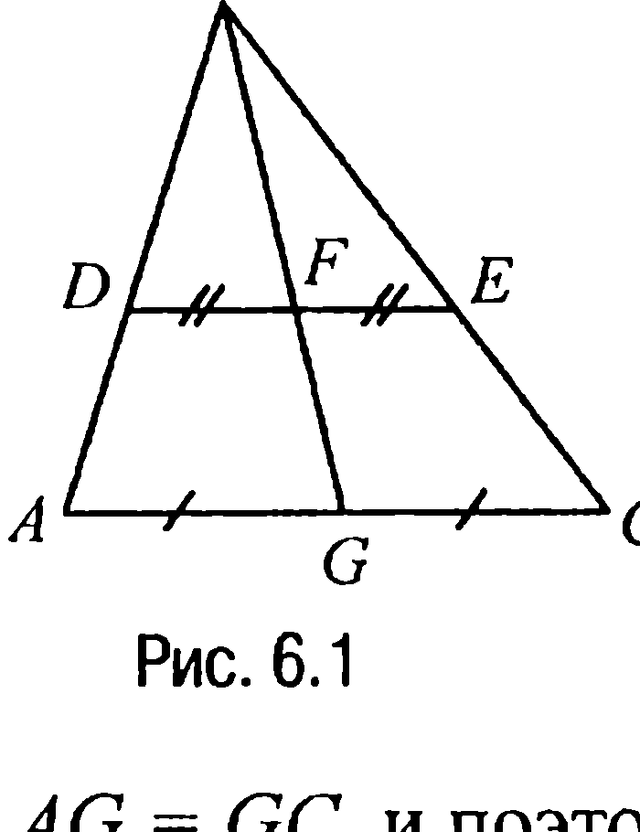
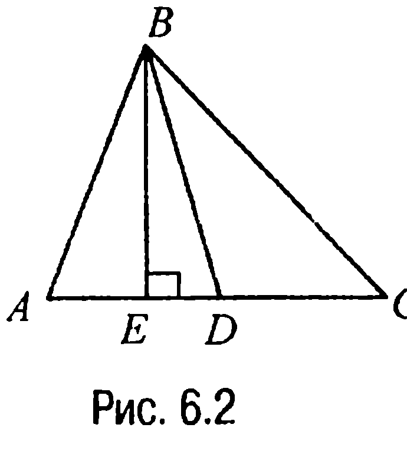
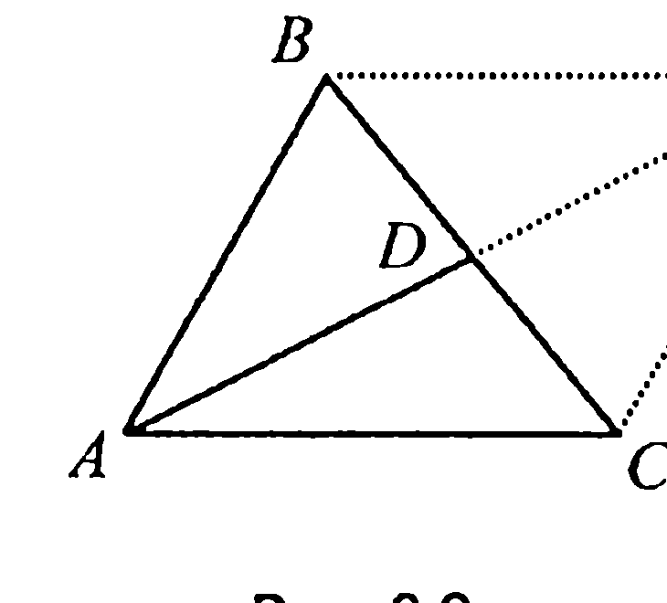
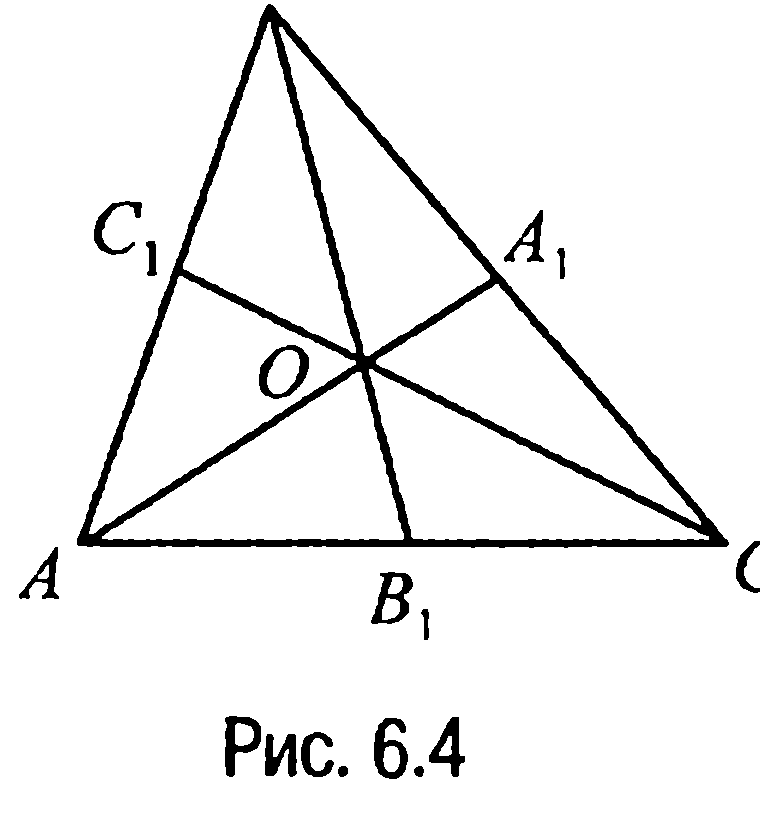
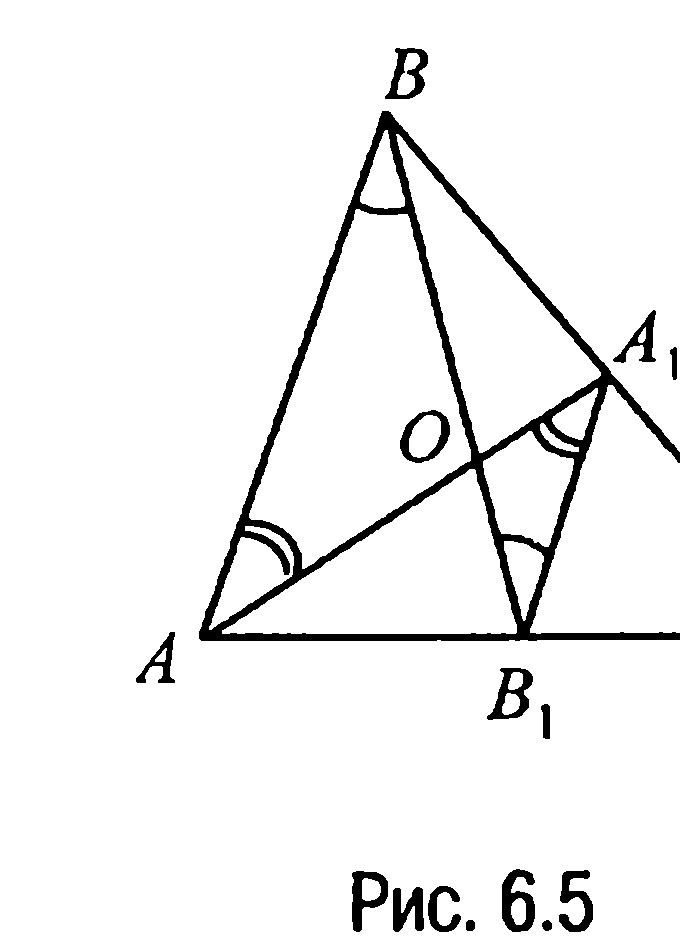
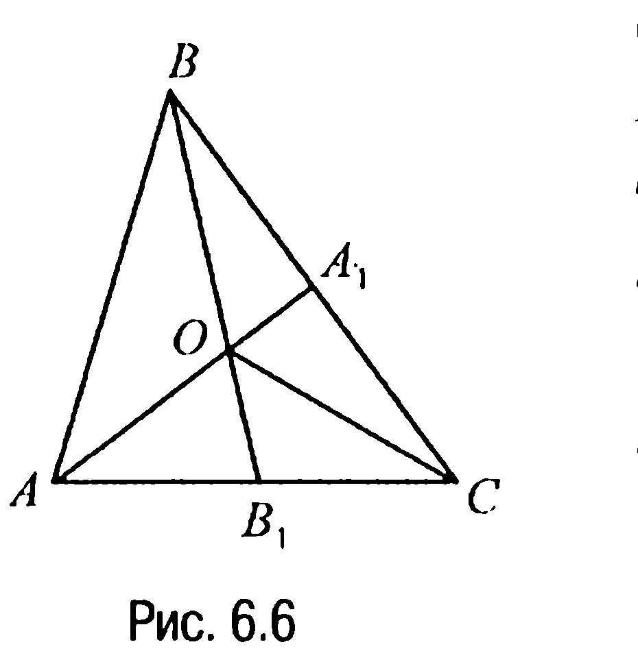
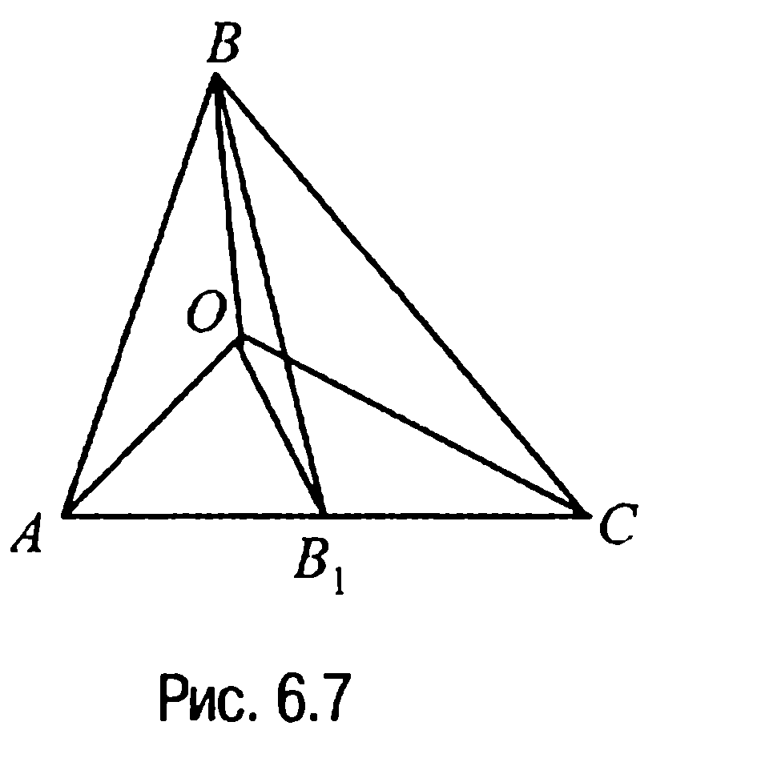
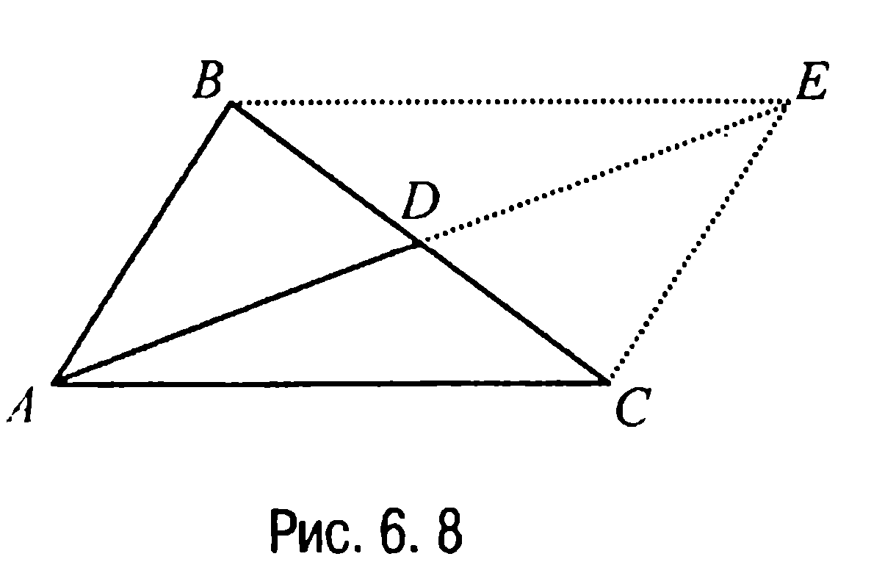
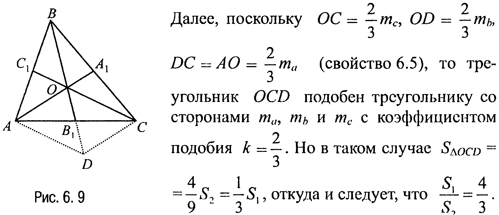
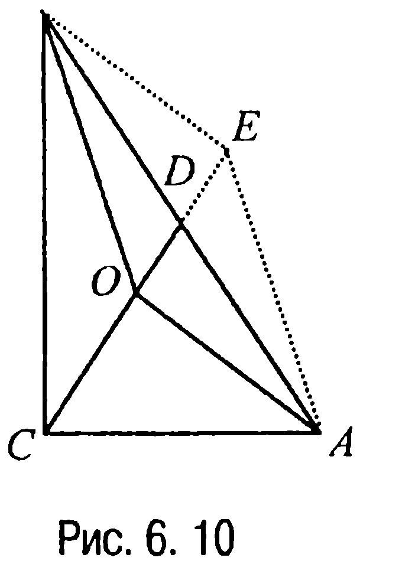

## 1.6. Медианы

---
**стр. 81**
---

**§ 6. МЕДИАНЫ**

**Медиана треугольника** — *это отрезок, соединяющий вершину треугольника с серединой его противолежащей стороны.*

**6.1. Свойства медиан**

**Свойство 6.1X.** *Если отрезок с концами на двух сторонах треугольника параллелен третьей стороне треугольника, к которой проведена медиана, то этот отрезок делится медианой пополам.*

**Доказательство.** Пусть $BG$ — медиана треугольника $ABC$ (рис. 6.1), $DE \parallel AC$, $F$ — точка пересечения отрезка $DE$ с медианой $BG$.

Тогда поскольку $\triangle BDF \sim \triangle BAG$, $\triangle BEF \sim \triangle BCG$, а $\triangle BDE \sim \triangle BAC$, то $\frac{DF}{AG} = \frac{BD}{BA}$, $\frac{FE}{GC} = \frac{BE}{BC}$, $\frac{BD}{BA} = \frac{BE}{BC}$.

Отсюда получаем, что $\frac{DF}{AG} = \frac{FE}{GC}$.

Но $AG = GC$ и поэтому $DF = FE$, что и требовалось доказать.

**Свойство 6.2X.** *Медиана треугольника делит его на два равновеликих треугольника.*

**Доказательство.** Пусть $BD$ — медиана треугольника $ABC$ (рис. 6.2), $BE$ — его высота.

Тогда треугольники $ABD$ и $DBC$ равновелики, так как они имеют равные основания $AD$ и $DC$ соответственно и общую высоту $BE$.

---
**стр. 82**
---

**Свойство 6.3.** *Если на продолжении медианы треугольника отложить от середины стороны треугольника отрезок, равный по длине медиане, то концевая точка этого отрезка и вершины треугольника являются вершинами параллелограмма.*

**Доказательство.** Пусть $D$ — середина стороны $BC$ треугольника $ABC$ (рис. 6.3), $E$ — такая точка на прямой $AD$, что $DE = AD$.

Тогда поскольку диагонали $AE$ и $BC$ четырехугольника $ABEC$ в точке $D$ их пересечения делятся пополам, то из характеристичности свойства 13.4X и следует, что четырехугольник $ABEC$ — параллелограмм.

**Свойство 6.4.** *Медианы треугольника пересекаются в одной точке.*

**Доказательство.** Пусть $AA_1, BB_1, CC_1$ — медианы треугольника $ABC$ (рис. 6.4). Тогда $AC_1 = C_1B$, $BA_1 = A_1C$, $CB_1 = B_1A$ и, значит,

$$\frac{AC_1}{C_1B} \cdot \frac{BA_1}{A_1C} \cdot \frac{CB_1}{B_1A} = 1.$$

Но полученное равенство — это признак пересечения трех прямых $AA_1$, $BB_1$ и $CC_1$ в одной точке $O$, откуда и следует требуемое.

**Свойство 6.5.** *Медианы треугольника делятся точкой пересечения в отношении 2:1, считая от вершины.*

**Доказательство.** Рассмотрим в треугольнике $ABC$ (рис. 6.4), например, медианы $AA_1$ и $BB_1$. Пусть $O$ — точка их пересечения. Тогда поскольку $AB_1 = B_1C$, $BA_1 = A_1C$, то $\frac{AB_1}{B_1C} = 1$, $\frac{BA_1}{A_1C} = 1$ и, значит, по свойству 3.4X о пропорциональных отрезках $\frac{BO}{OB_1} =$

---
**стр. 83**
---

$1 \cdot (1 + 1) = 2$, $\frac{AO}{OA_1} = 1 \cdot (1 + 1) = 2$. Аналогично доказывается, что и $\frac{CO}{OC_1} = 2$, откуда и следует требуемое.

**Замечание 6.1.** Свойства 6.4 и 6.5. часто объединяют в одно свойство и формулируют его следующим образом: *медианы треугольника пересекаются в одной точке и делятся точкой пересечения в отношении 2:1, считая от вершины*.

Приведем одно из возможных доказательств сформулированного свойства. Итак, пусть $AA_1$ и $BB_1$ — медианы треугольника $ABC$ (рис. 6.5), $O$ — точка их пересечения. Тогда так как $B_1A_1$ — средняя линия треугольника $ABC$, то $B_1A_1 \parallel AB$ и $B_1A_1 = \frac{1}{2} AB$. А поскольку $\angle ABO =$

$= \angle A_1B_1O$, $\angle BOA = \angle B_1OA_1$, $\angle OAB = \angle OA_1B_1$, то $\triangle ABO \sim \triangle A_1B_1O$ и, значит, $\frac{AO}{OA_1} = \frac{BO}{OB_1} = \frac{AB}{B_1A_1} = \frac{AB}{\frac{1}{2} AB} = 2$.

Если теперь рассмотреть медианы $AA_1$ и $CC_1$ (а также $BB_1$ и $CC_1$) с точкой пересечения $O_1$ ($O_2$), то, проведя аналогичные рассуждения, получим, что точка $O_1$ ($O_2$) делит эти медианы также в отношении 2:1, считая от вершины. А это и будет означать, что точки $O$ и $O_1$ ($O_2$) совпадают и все три медианы делятся точкой пересечения в отношении 2:1, считая от вершины треугольника.

**Замечание 6.2.** *Точка пересечения медиан треугольника называется **центроидом** или **барицентром**.* Физически точку пересечения медиан треугольника можно интерпретировать как центр тяжести треугольника. При этом безразлично, распределена ли вся масса треугольника поровну в его вершинах, или она распределена равномерно по всей плоской треугольной пластине (задача 6.3).

---
**стр. 84**
---

**ЗАДАЧИ**

▼ **6.1.** *Доказать, что если $O$ — точка пересечения медиан треугольника $ABC$, то треугольники $AOB$, $BOC$ и $AOC$ равновелики.*

**Решение.** Пусть $AA_1$ и $BB_1$ — медианы треугольника $ABC$ (рис. 6.6).

Рассмотрим треугольники $AOB$ и $BOC$. Очевидно, что

$S_{\Delta AOB} = S_{\Delta AB_1B} - S_{\Delta AB_1O}$,

$S_{\Delta BOC} = S_{\Delta BB_1C} - S_{\Delta OB_1C}$.

Но по свойству 6.2X имеем

$S_{\Delta AB_1B} = S_{\Delta BB_1C}$, $S_{\Delta AB_1O} = S_{\Delta OB_1C}$,

откуда следует, что $S_{\Delta AOB} = S_{\Delta BOC}$.

Аналогично доказывается и равенство $S_{\Delta AOB} = S_{\Delta AOC}$.

**Замечание 6.3.** Рассуждения, проведенные в процессе решения задачи 6.1, показывают, что имеет место, например, и такой факт: если точка $O$ внутри треугольника $ABC$ лежит на медиане $BB_1$, то треугольники $AOB$ и $BOC$ равновелики.

▼ **6.2.** *Доказать, что если точка $O$ лежит внутри треугольника $ABC$ и треугольники $AOB$, $BOC$ и $AOC$ равновелики, то $O$ — точка пересечения медиан треугольника $ABC$.*

**Решение.** Рассмотрим треугольник $ABC$ (рис. 6.7) и предположим, что точка $O$ не лежит на медиане $BB_1$.

Тогда так как $OB_1$ — медиана треугольника $AOC$, то $S_{\Delta AOB_1} = S_{\Delta B_1OC}$, а поскольку по условию $S_{\Delta AOB} = S_{\Delta BOC}$, то $S_{AB_1OB} = S_{BOB_1C}$. Но этого быть не может, так как $S_{\Delta ABB_1} = S_{\Delta B_1BC}$. Полученное противоречие означает, что точка $O$ лежит на медиане $BB_1$.

Аналогично доказывается, что точка $O$ принадлежит и двум другим медианам треугольника $ABC$. Отсюда и следует, что точка $O$

---
**стр. 85**
---

действительно является точкой пересечения трех медиан треугольника $ABC$.

**Замечание 6.4.** В процессе решения задачи 6.2 доказана, в частности, и справедливость такого утверждения: *если точка $O$ лежит внутри треугольника $ABC$ и треугольники $AOB$ и $BOC$ равновелики, то точка $O$ лежит на медиане $BB_1$.*

**6.3.** *Доказать, что точка пересечения медиан треугольника $ABC$ является центром масс как для механической системы из трех грузов с равными массами, помещенных в вершинах треугольника $ABC$, так и для однородной пластины в форме треугольника $ABC$.*

**Решение.** Выберем в качестве оси вращения каждой из двух механических систем прямую, которая содержит медиану треугольника. Очевидно, что в таком случае каждая из механических систем при горизонтальном положении будет находиться в состоянии равновесия. В первом случае это обусловлено тем, что оба груза, не лежащие на медиане, равноотстоят от нее, а во втором — потому что обе половины пластины, находящиеся по разные стороны от медианы, равновелики и, значит, имеют одинаковую массу. Таким образом, центры масс обеих систем находятся на каждой медиане, т. е. в точке их пересечения.

**6.4.** *Стороны треугольника равны $a$, $b$ и $c$. Доказать, что медиана $m_a$, проведенная к стороне $a$, вычисляется по формуле $m_a = \frac{1}{2}\sqrt{2b^2 + 2c^2 - a^2}$.*

**Решение.** Пусть в треугольнике $ABC$ (рис. 6.8) $AB = c$, $BC = a$, $AC = b$, $AD = m_a$. Достроим треугольник $ABC$ до параллелограмма $ABEC$ (свойство 6.3). Тогда $AE = 2m_a$.

Воспользовавшись же теперь тем фактом, что сумма квадратов диагоналей параллелограмма равна сумме квадратов всех его сторон, полу-

---
**стр. 86**
---

чим равенство $4m_a^2 + a^2 = 2b^2 + 2c^2$, из которого и следует, что

$$m_a = \frac{1}{2}\sqrt{2b^2 + 2c^2 - a^2}.$$

**Замечание 6.5.** Другим способом эта задача решена в §12 (задача 12.1, п. 4).

**6.5.** *Медианы треугольника, проведенные к сторонам $a$, $b$ и $c$, равны соответственно $m_a$, $m_b$ и $m_c$. Доказать, что*

$$a = \frac{2}{3}\sqrt{2m_b^2 + 2m_c^2 - m_a^2}.$$

**Решение.** Так как $4m_a^2 = 2b^2 + 2c^2 - a^2$, $4m_b^2 = 2a^2 + 2c^2 - b^2$,

$4m_c^2 = 2a^2 + 2c^2 - b^2$ (задача 6.4), то, складывая два последних умноженных на 2 равенства и вычитая затем из полученного соотношения первое равенство, получим, что $8m_b^2 + 8m_c^2 - 4m_a^2 = 9a^2$,

откуда $a = \frac{2}{3}\sqrt{2m_b^2 + 2m_c^2 - m_a^2}$.

**Замечание 6.6.** Легко проверить, что $m_a^2 + m_b^2 + m_c^2 = \frac{3}{4}(a^2 + b^2 + c^2)$, откуда следует равенство $\frac{a^2 + b^2 + c^2}{m_a^2 + m_b^2 + m_c^2} = \frac{4}{3}$.

**6.6.** *Даны два треугольника, причем сторонами второго из них являются медианы первого. Доказать, что отношение площади первого треугольника к площади второго есть 4/3.*

**Решение.** Пусть в треугольнике $ABC$ (рис. 6.9) отрезки $AA_1 = m_a$, $BB_1 = m_b$, $CC_1 = m_c$ — это медианы, а $O$ — точка их пересечения, $S_1$ и $S_2$ — площади первого и второго треугольников соответственно. Отложим на продолжении медианы $BB_1$ отрезок $B_1D = OB_1$ и достроим треугольник $AOC$ до параллелограмма $AOCD$ (свойство 6.3). Тогда так как каждая из диагоналей параллелограмма делит его на два равновеликих треугольника, то $S_{\Delta OCD} = S_{\Delta AOC}$. Но $S_{\Delta AOC} = \frac{1}{3}S_1$ (задача 6.1) и, значит, $S_{\Delta OCD} = \frac{1}{3}S_1$.

---
**стр. 87**
---

Далее, поскольку $OC = \frac{2}{3}m_c$, $OD = \frac{2}{3}m_b$, $DC = AO = \frac{2}{3}m_a$ (свойство 6.5), то треугольник $OCD$ подобен треугольнику со сторонами $m_a$, $m_b$ и $m_c$ с коэффициентом подобия $k = \frac{2}{3}$. Но в таком случае $S_{\Delta OCD} = \frac{4}{9}S_2 = \frac{1}{3}S_1$, откуда и следует, что $\frac{S_1}{S_2} = \frac{4}{3}$.

**6.7.** *Известно, что $O$ — внутренняя точка прямоугольного треугольника $ABC$, расстояния от точки $O$ до двух различных вершин треугольника равны $p$ и $q$, а треугольники $AOB$, $BOC$ и $AOC$ равновелики. Найти расстояние от точки $O$ до третьей вершины треугольника.*

**Решение.** Пусть в треугольнике $ABC$ (рис. 6.10) $\angle ACB = 90^\circ$, $AO = x$, $BO = y$, $CO = z$. Из условия следует, что $O$ — точка пересечения медиан треугольника (задача 6.2). Продолжим медиану $CD$ и достроим треугольник $AOB$ до параллелограмма $AOBE$ (свойство 6.3).

Поскольку $CD = \frac{1}{2}AB$ (свойство 1.21X), а, с другой стороны, $CD = \frac{3}{2}z$ (свойство 6.5), то $AB = 2CD = 3z$. Но в таком случае, рассматривая параллелограмм $AOBE$, имеем $AB^2 + OE^2 = 2x^2 + 2y^2$ (свойство 13.5X) или $5z^2 = x^2 + y^2$. Таким образом, если $p$ и $q$ — расстояния от точки $O$ до вершин острых углов, то искомое расстояние $CO = z = \frac{\sqrt{5(p^2 + q^2)}}{5}$. В другом случае искомое расстояние равно или $\sqrt{5p^2 - q^2}$, или $\sqrt{5q^2 - p^2}$.

**Ответ:** или $\frac{\sqrt{5(p^2 + q^2)}}{5}$, или $\sqrt{5p^2 - q^2}$, или $\sqrt{5q^2 - p^2}$.

---
**стр. 88**
---

**ЗАДАЧИ ДЛЯ САМОСТОЯТЕЛЬНОГО РЕШЕНИЯ**

**6.1С.** *Доказать, что три медианы треугольника разбивают его на шесть равновеликих треугольников.*

**6.2С.** *На сторонах $AB$ и $BC$ треугольника $ABC$ отмечены точки $D$ и $E$ соответственно таким образом, что $AD : DB + CE : EB = 1$. Доказать, что отрезок $DE$ проходит через точку пересечения медиан треугольника $ABC$.*

**6.3С.** *В четырехугольнике $ABCD$ сторона $AB = a$, $BC = b$, $CD = c$, $DA = d$, диагональ $AC = m$, $BD = n$, отрезок $EF = l$, где точки $E$ и $F$ — середины диагоналей $AC$ и $BD$ соответственно. Доказать, что*

$$l^2 = \frac{1}{4}(a^2 + b^2 + c^2 + d^2 - m^2 - n^2).$$

**6.4С.** *Доказать, что для любого четырехугольника сумма квадратов его сторон не меньше суммы квадратов его диагоналей, причем равенство имеет место, если четырехугольник — параллелограмм.*

**6.5С.** *Найти геометрическое место точек пересечения медиан треугольников, две вершины которых расположены в фиксированных точках $A$ и $B$ прямой $l$, а третья вершина описывает окружность радиуса $R$ с центром в точке $O$, не пересекающуюся с прямой $l$.*

**6.6С.** *Дан треугольник $ABC$. Найти множество $\mathfrak{M}$ точек такое, что для любой точки $M$ из этого множества треугольники $AMB$, $BMC$ и $CMA$ оказываются равновеликими.*

**6.7С.** *Дан треугольник $ABC$. Найти геометрическое место $\mathfrak{M}$ точек такое, что для любой точки $M$ этого геометрического места треугольники $AMB$ и $AMC$ равновелики.*
