## 1.7. Высоты

---
**стр. 89**
---

**6.8С.** *Доказать, что если четыре из пяти медиан пятиугольника пересекаются в одной точке, то и пятая медиана проходит через ту же точку (**медианой пятиугольника** называют отрезок, соединяющий вершину пятиугольника с серединой противолежащей стороны, т. е. стороны, концы которой можно соединить с этой вершиной диагоналями).*

**§ 7. ВЫСОТЫ**

***Высота треугольника*** — это отрезок перпендикуляра от вершины треугольника до противолежащей стороны (основания треугольника) или ее продолжения.

**7.1. Свойства высот**

**Свойство 7.1X.** *Высота любого треугольника лежит на серединном перпендикуляре к одной из сторон треугольника, средними линиями которого являются стороны заданного треугольника.*

**Доказательство.** Пусть $BH$ — одна из высот треугольника $ABC$ (рис. 7.1, 7.2). Проведем через вершины заданного треугольника прямые, параллельные его сторонам, и обозначим через $A_1$, $B_1$, $C_1$ точки пересечения проведенных прямых.

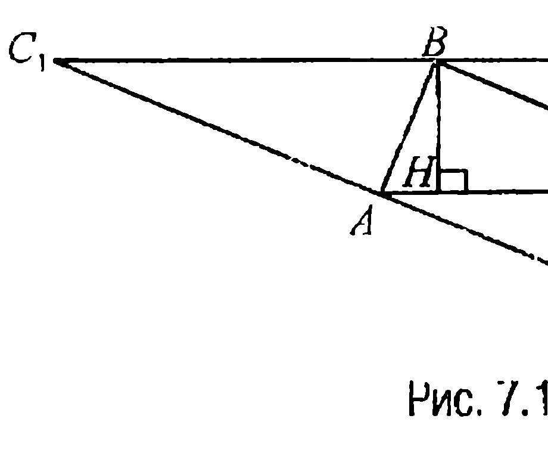

Эти точки будут вершинами вновь образованного треугольника. Для нового треугольника $A_1B_1C_1$ точки $A$, $B$, $C$ являются серединами сторон, так как, например, из рассмотрения параллелограммов $ABA_1C$ и $ABCB_1$ следует, что $AB = CA_1 = B_1C$. Аналогично показывается, что $B_1A = AC_1$ и $C_1B = BA_1$. Отсюда, в частности, следу-

---
**стр. 90**
---

ет, что стороны треугольника $ABC$ являются средними линиями треугольника $A_1B_1C_1$.

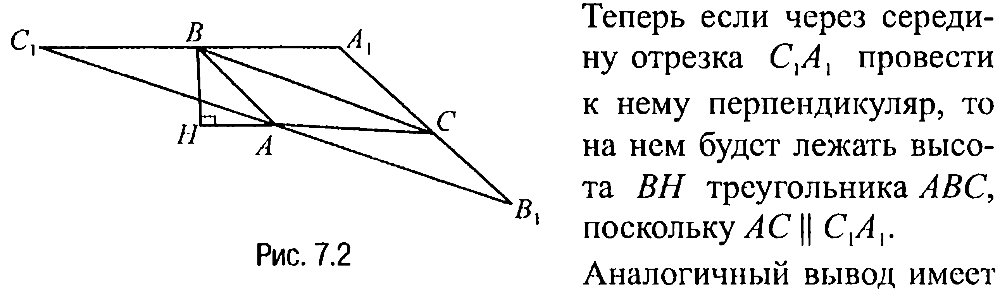

Теперь если через середину отрезка $C_1A_1$ провести к нему перпендикуляр, то на нем будет лежать высота $BH$ треугольника $ABC$, поскольку $AC \parallel C_1A_1$.

Аналогичный вывод имеет место и относительно двух других высот треугольника $ABC$, что и доказывает требуемое.

**Свойство 7.2X.** *Высоты треугольника или их продолжения пересекаются в одной точке — центре окружности, описанной около треугольника, средними линиями которого являются стороны заданного треугольника.*

**Доказательство.** По свойству 7.1X каждая высота треугольника $ABC$ лежит на серединном перпендикуляре к соответствующей стороне треугольника $A_1B_1C_1$, средними линиями которого являются стороны треугольника $ABC$ (рис. 7.3, 7.4).

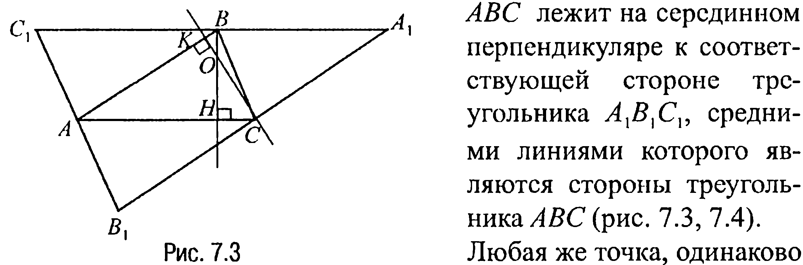

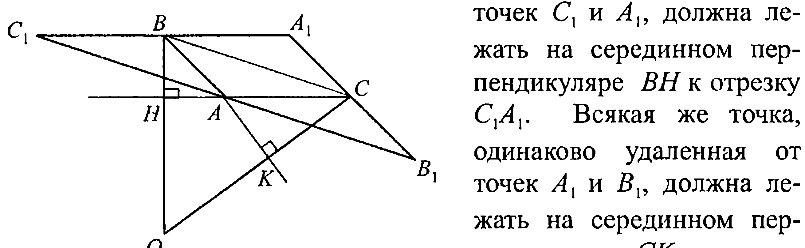

Любая же точка, одинаково удаленная, например, от точек $C_1$ и $A_1$, должна лежать на серединном перпендикуляре $BH$ к отрезку $C_1A_1$. Всякая же точка, одинаково удаленная от точек $A_1$ и $B_1$, должна лежать на серединном перпендикуляре $CK$ к отрезку $A_1B_1$. Таким образом, если существует точка $O$, одинаково удаленная от трех точек $A_1, B_1$ и $C_1$, то она должна лежать одновременно на перпендикулярах $BH$ и

---
**стр. 91**
---

$CK$, что возможно только тогда, когда точка $O$ совпадает с точкой пересечения прямых $BH$ и $CK$, которые пересекаются всегда как перпендикуляры к пересекающимся прямым $C_1A_1$ и $A_1B_1$.

Итак, точка $O$ пересечения прямых $BH$ и $CK$ и будет точкой, одинаково удаленной от точек $A_1, B_1$ и $C_1$, т. е. точка $O$ будет центром окружности, описанной около треугольника $A_1B_1C_1$, что и доказывает требуемое.

**Замечание 7.1.** Так как средняя линия треугольника параллельна одной из его сторон и равна ее половине, то треугольник, средними линиями которого являются стороны заданного треугольника, подобен заданному треугольнику с коэффициентом подобия $k = 2$.

**Замечание 7.2.** Точка пересечения высот остроугольного или прямоугольного треугольника называется **ортоцентром**.

**Следствие 7.1X.** Серединные к сторонам треугольника перпендикуляры пересекаются в одной точке — центре окружности, описанной около треугольника.

**Свойство 7.3.** Если $AD, BE, CF$ — высоты треугольника $ABC$, $O$ — точка пересечения этих высот или их продолжений, то $AO \cdot OD = BO \cdot OE = CO \cdot OF$.

**Доказательство.** Очевидно, что в случае прямоугольного треугольника имеем $AO \cdot OD = BO \cdot OE = FO \cdot OC = 0$.

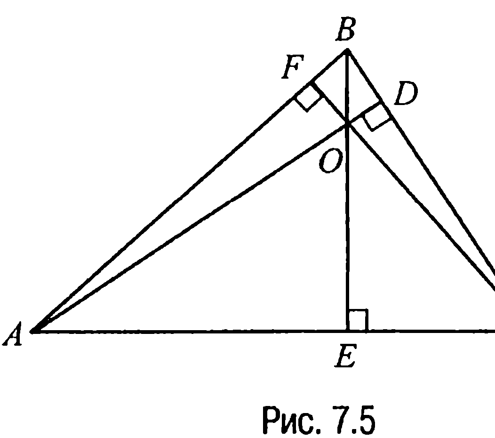

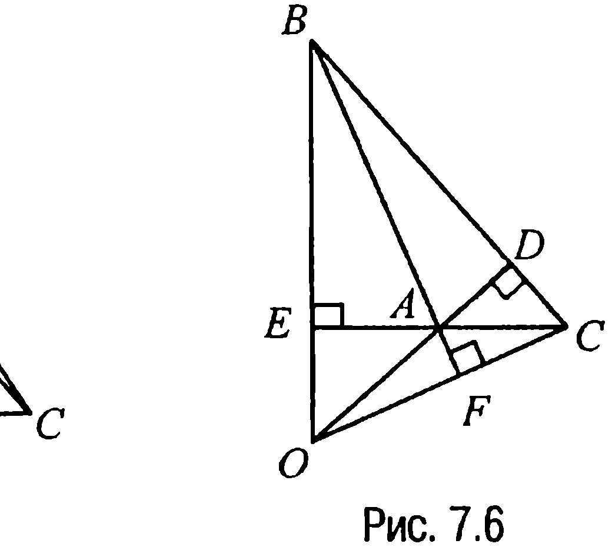

Что же касается случаев остроугольного и тупоугольного треугольников (рис. 7.5 и рис. 7.6 соответственно), то ввиду того, что в обоих случаях точки $A, F, D, C$ лежат на окружности с диамет-

---
**стр. 92**
---

ром $AC$, справедливость утверждения в случае остроугольного треугольника следует из свойства 4.5X. В случае же тупоугольного треугольника справедливость свойства вытекает из свойства 5.5.

**Свойство 7.4.** *Отрезок, соединяющий основания двух высот остроугольного треугольника, отсекает от него треугольник, подобный данному, с коэффициентом подобия, равным косинусу общего угла.*

**Доказательство.** Пусть $AA_1, BB_1, CC_1$ — высоты остроугольного треугольника $ABC$, а $\angle ABC = \beta$ (рис. 7.7).

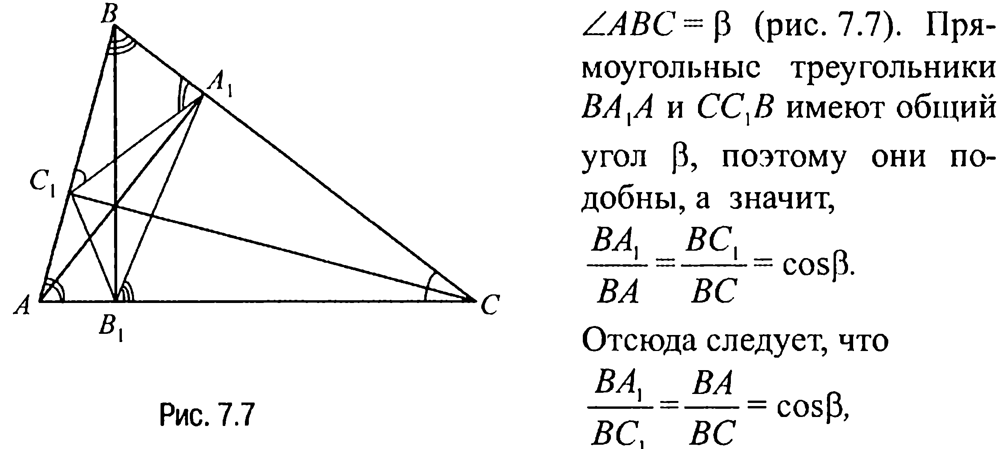

Прямоугольные треугольники $BA_1A$ и $CC_1B$ имеют общий угол $\beta$, поэтому они подобны, а значит,

$$\frac{BA_1}{BA} = \frac{BC_1}{BC} = \cos \beta.$$

Отсюда следует, что

$$\frac{BA_1}{BC_1} = \frac{BA}{BC},$$

т. е. в треугольниках $C_1BA_1$ и $ABC$ стороны, прилежащие к общему углу $\beta$, пропорциональны. А тогда по второму признаку подобия треугольников $\Delta C_1BA_1 \sim \Delta ABC$, причем коэффициент подобия равен $\cos \beta$.

Аналогичным образом доказывается, что $\Delta A_1CB_1 \sim \Delta ABC$ с коэффициентом подобия $\cos \angle BCA$, а $\Delta B_1AC_1 \sim \Delta ABC$ с коэффициентом подобия $\cos \angle CAB$.

**Замечание 7.3.** Так как в подобных треугольниках против соответственных сторон лежат равные углы, то из доказательства свойства следует (рис. 7.7), что $\angle A_1C_1B = \angle BCA$, $\angle BA_1C_1 = \angle CAB$. Справедливо также и равенство $\angle CB_1A_1 = \angle ABC$.

---
**стр. 93**
---

**Замечание 7.4.** Так как каждый из треугольников $C_1BA_1$, $A_1CB_1$ и $B_1AC_1$ подобен треугольнику $ABC$, то все эти треугольники подобны между собой.

**Свойство 7.5.** *Высота, опущенная на гипотенузу прямоугольного треугольника, делит его на два подобных между собой и подобных исходному треугольнику треугольника.*

**Доказательство.** Рассмотрим прямоугольный треугольник $ABC$, у которого $\angle BCA = 90^\circ$, а $CD$ — его высота (рис. 7.8).

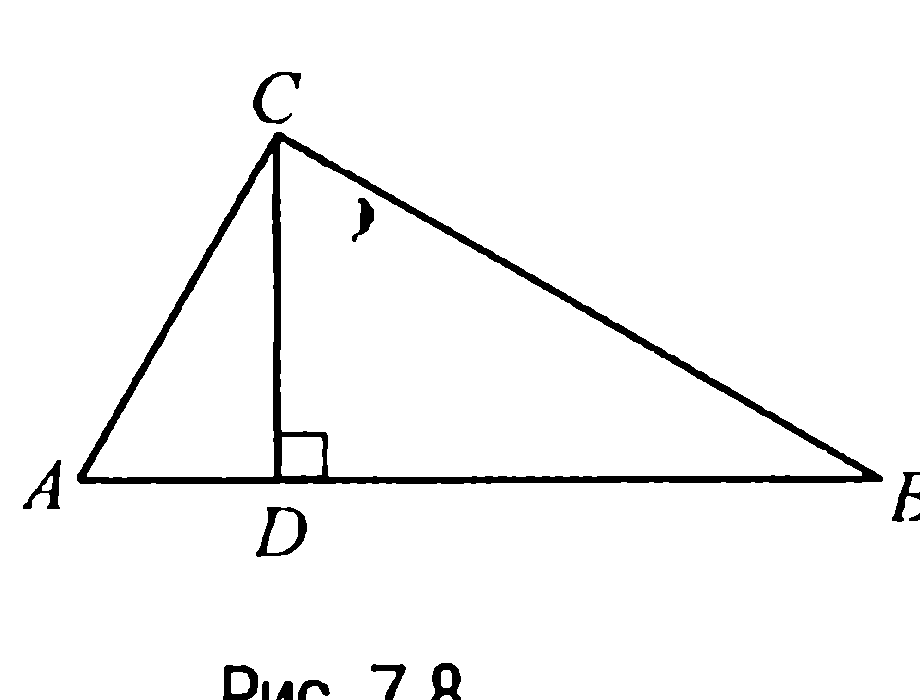

Тогда подобие треугольников $ADC$ и $BDC$ следует, например, из признака подобия прямоугольных треугольников по пропорциональности двух катетов, поскольку $\frac{AD}{CD} = \frac{CD}{DB}$ (свойство 3.8). Каждый же из прямоугольных треугольников $ADC$ и $BDC$ подобен исходному прямоугольному треугольнику уже хотя бы на основании признака подобия по двум углам.

**ЗАДАЧИ**

▼ **7.1.** *Доказать, что треугольник, одной из вершин которого является вершина данного тупоугольного треугольника, а две другие вершины — это основания высот тупоугольного треугольника, опущенных из двух других его вершин, подобен данному треугольнику с коэффициентом подобия, равным модулю косинуса угла при первой вершине.*

**Решение.** Рассмотрим тупоугольный треугольник $ABC$ с тупым углом $CAB$. Пусть $AA_1$, $BB_1$ и $CC_1$ — его высоты (рис. 7.9, 7.10, 7.11) и пусть $\angle CAB = \alpha$, $\angle ABC = \beta$, $\angle BCA = \gamma$. Доказательство того факта, что $\Delta C_1BA_1 \sim \Delta ABC$ (рис. 7.9) с коэффициентом подобия $k = \cos \beta$, полностью повторяет рассуждения, проведенные при доказательстве свойства 7.4.

---
**стр. 94**
---

Докажем, что $\Delta A_1CB_1 \sim \Delta ABC$ (рис. 7.10) с коэффициентом подобия $k_1 = \cos \gamma$, а $\Delta B_1AC_1 \sim \Delta ABC$ (рис. 7.11) с коэффициентом подобия $k_2 = |\cos \alpha|$.

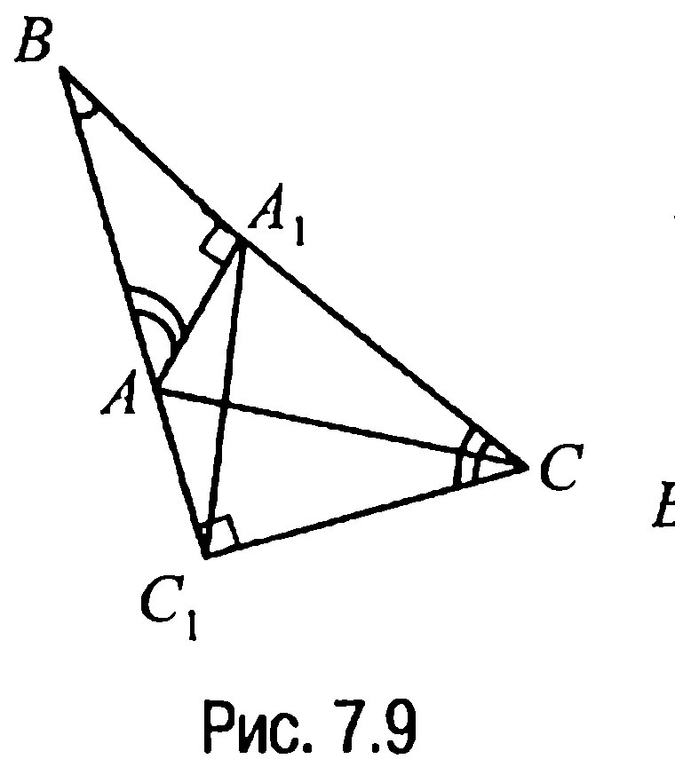

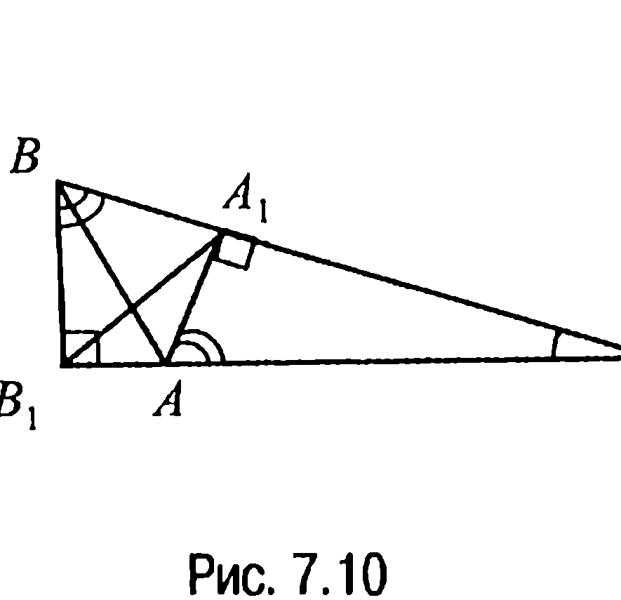

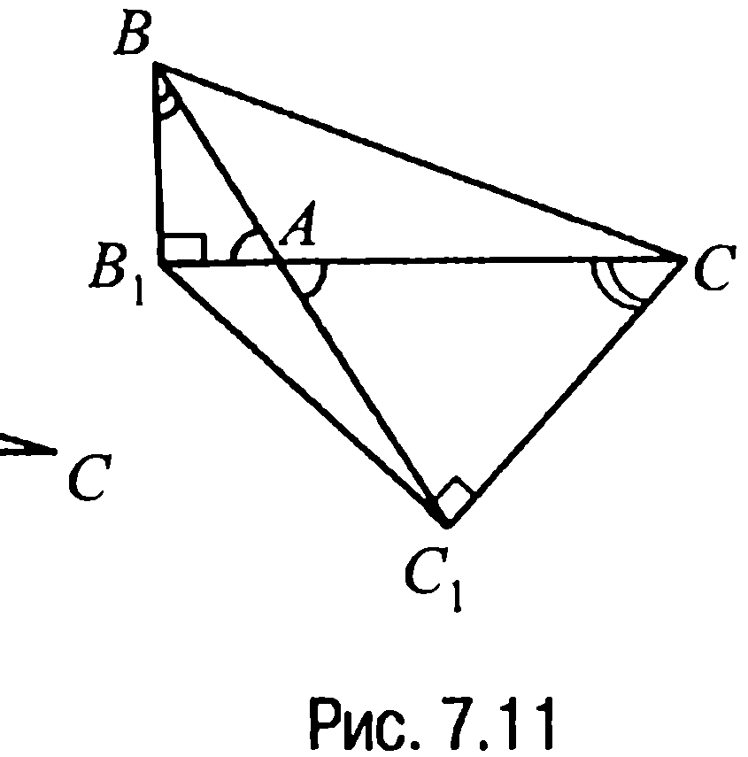

Действительно, прямоугольные треугольники $CA_1A$ и $CB_1B$ имеют общий угол $\gamma$ и поэтому подобны. Отсюда следует, что $\frac{B_1C}{BC} = \frac{A_1C}{AC} = \cos \gamma$ и, значит, $\frac{B_1C}{A_1C} = \frac{BC}{AC} = \cos \gamma$, т. е. в треугольниках $A_1CB_1$ и $ABC$ стороны, образующие общий угол $\gamma$, пропорциональны. А тогда по второму признаку подобия треугольников $\Delta A_1CB_1 \sim \Delta ABC$, причем коэффициент подобия $k_1 = \cos \gamma$.

Что же касается последнего случая (рис. 7.11), то из рассмотрения прямоугольных треугольников $BB_1A$ и $CC_1A$ с равными вертикальными углами $BAB_1$ и $C_1AC$ следует, что они подобны и, значит, $\frac{B_1A}{BA} = \frac{C_1A}{CA} = \cos(180^\circ - \alpha) = |\cos \alpha|$, так как угол $\alpha$ — тупой. Отсюда $\frac{B_1A}{C_1A} = \frac{BA}{CA} = |\cos \alpha|$ и, таким образом, в треугольниках $B_1AC_1$ и $ABC$ стороны, образующие равные углы, пропорциональны. А это означает, что $\Delta B_1AC_1 \sim \Delta ABC$ с коэффициентом подобия $k_2 = |\cos \alpha|$.

**Замечание 7.5.** Так как каждый из треугольников $C_1BA_1$, $A_1CB_1$ и $B_1AC_1$ подобен тупоугольному треугольнику $ABC$, то все эти треугольники подобны между собой.

---
**стр. 95**
---

▼ **7.2.** *Доказать, что высоты остроугольного треугольника являются биссектрисами углов треугольника, вершинами которого являются основания высот данного треугольника.*

**Решение.** Пусть $AA_1$, $BB_1$, $CC_1$ — высоты остроугольного треугольника $ABC$ и пусть $\angle CAB = \alpha$ (рис. 7.12).

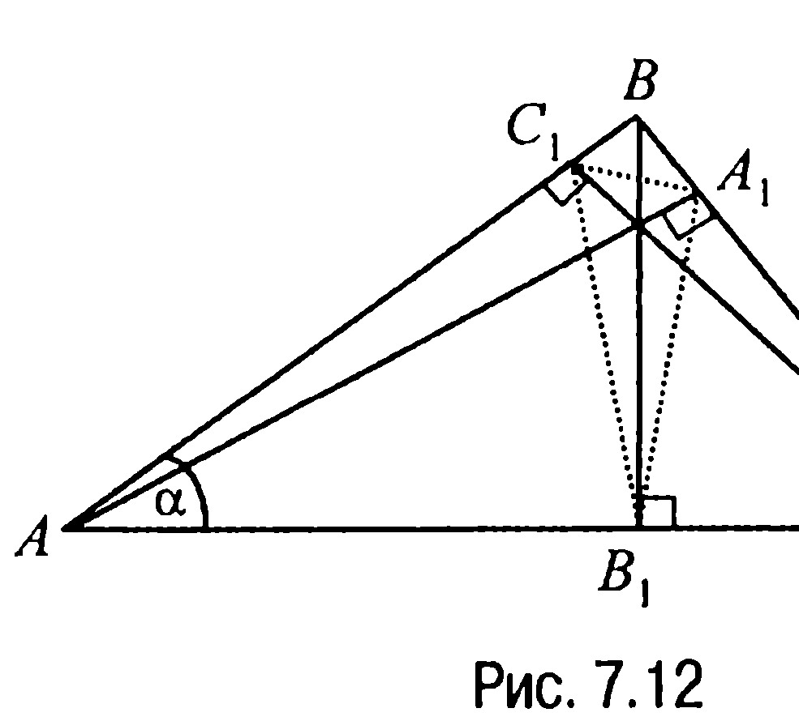

Докажем, например, что высота $AA_1$ является биссектрисой угла $C_1A_1B_1$.

Действительно, так как треугольники $C_1BA_1$ и $ABC$ подобны (свойство 7.4), то $\angle BA_1C_1 = \alpha$ и, значит, $\angle C_1A_1A = 90^\circ - \alpha$. Аналогично из подобия же треугольников $A_1CB_1$ и $ABC$ следует, что $\angle AA_1B_1 = 90^\circ - \alpha$ и поэтому $\angle C_1A_1A = \angle AA_1B_1 = 90^\circ - \alpha$, т. е. $AA_1$ — биссектриса угла $C_1A_1B_1$.

Аналогично доказывается, что две другие высоты треугольника $ABC$ являются биссектрисами двух других соответствующих углов треугольника $A_1B_1C_1$.

**Замечание 7.6.** *Треугольник, вершинами которого являются основания высот остроугольного треугольника, называется ортоцентрическим треугольником.*

**Замечание 7.7.** Точка пересечения высот остроугольного треугольника, являясь центром окружности, вписанной в ортоцентрический треугольник, является и центром окружности, описанной около треугольника, средние линии которого — это стороны данного треугольника.

▼ **7.3.** *Доказать, что точка пересечения продолжения высот тупоугольного треугольника является центром вневписанной окружности треугольника, вершинами которого являются основания высот данного треугольника.*

**Решение.** Пусть $O_1$ — точка пересечения продолжения высот $BB_1$, $AA_1$ и $CC_1$ тупоугольного треугольника $ABC$ (рис. 7.13).

---
**стр. 96**
---

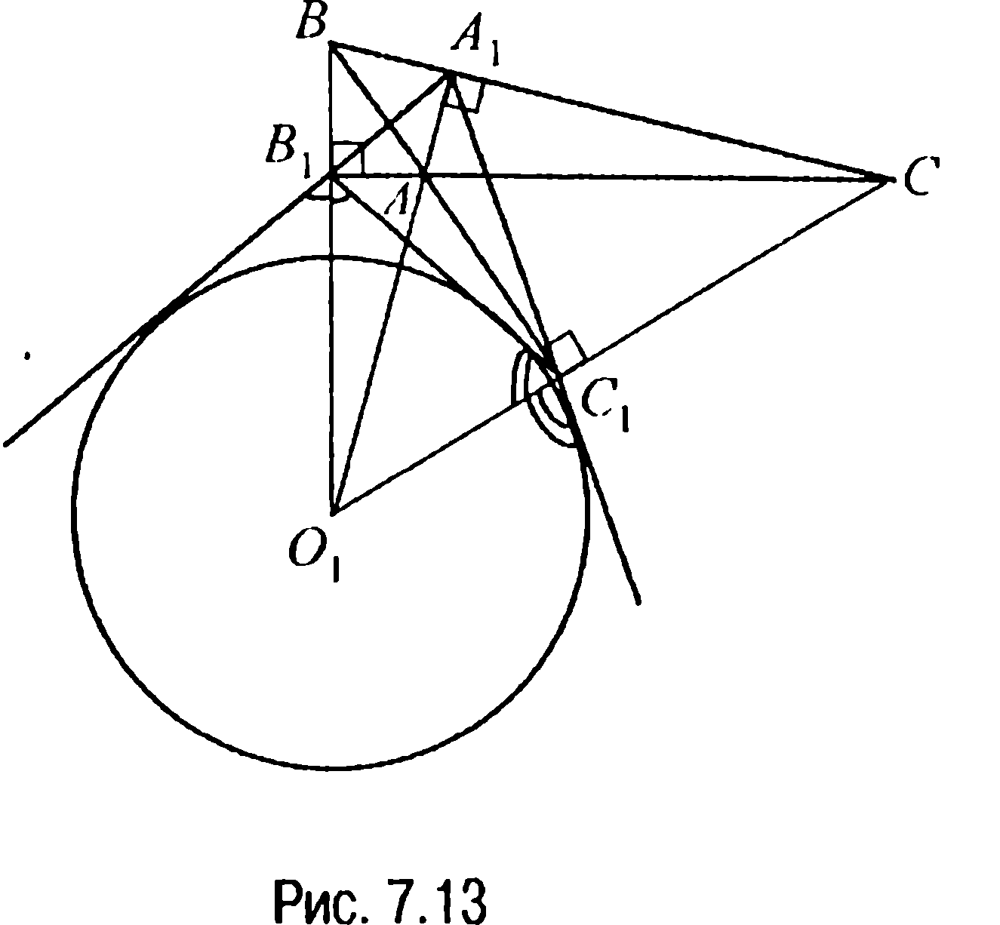

Тогда отрезки $O_1A_1$, $BC_1$ и $CB_1$ будут высотами остроугольного треугольника $O_1BC$, и они будут лежать на биссектрисах углов $B_1A_1C_1$, $A_1C_1B_1$ и $C_1B_1A_1$ соответственно (задача 7.2). А так как биссектриса угла $A_1C_1B_1$ перпендикулярна прямой $O_1C$, то на этой прямой лежит биссектриса $C_1O_1$ внешнего угла треугольника $A_1C_1B_1$ с вершиной $C_1$. По аналогичной причине на прямой $BO_1$ лежит биссектриса $B_1O_1$ внешнего угла треугольника $A_1C_1B_1$ с вершиной $B_1$. Ссылка на свойство 8.4 и завершает доказательство. <!-- вероятная опечатка оригинала: «Ссылка на свойство 8.4 и завершает» -->

**Следствие 7.2.** Вершина тупого угла треугольника является центром окружности, вписанной в треугольник, вершинами которого являются основания высот данного тупоугольного треугольника.

**Замечание 7.8.** *Точка пересечения продолжения высот тупоугольного треугольника называется* **внешним ортоцентром**.

**Замечание 7.9.** Точка $O_1$ — точка пересечения продолжения высот $AA_1$, $BB_1$, $CC_1$ тупоугольного треугольника $ABC$ как центр вневписанной окружности треугольника $A_1B_1C_1$, вершины $A_1$, $B_1$, $C_1$ которого — это основания высот данного треугольника $ABC$, является и центром окружности, описанной около треугольника, средними линиями которого являются стороны данного треугольника $ABC$.

---
**стр. 97**
---

▼ **7.4.** *Пусть $O$ — центр окружности, описанной около остроугольного или тупоугольного треугольника $ABC$; $A_1$, $B_1$ и $C_1$ — основания высот, опущенных соответственно из вершин $A$, $B$ и $C$. Доказать, что прямые $OA$, $OB$ и $OC$ соответственно перпендикулярны отрезкам $B_1C_1$, $C_1A_1$ и $A_1B_1$.*

**Решение.** Докажем перпендикулярность прямой $OA$ к отрезку $B_1C_1$. Доказательство в остальных двух случаях проводится аналогичным образом.

Итак, пусть $AD$ — диаметр окружности, описанной около треугольника $ABC$, $E$ — точка пересечения прямой $AD$ с отрезком $B_1C_1$ (рис. 7.14, 7.15).

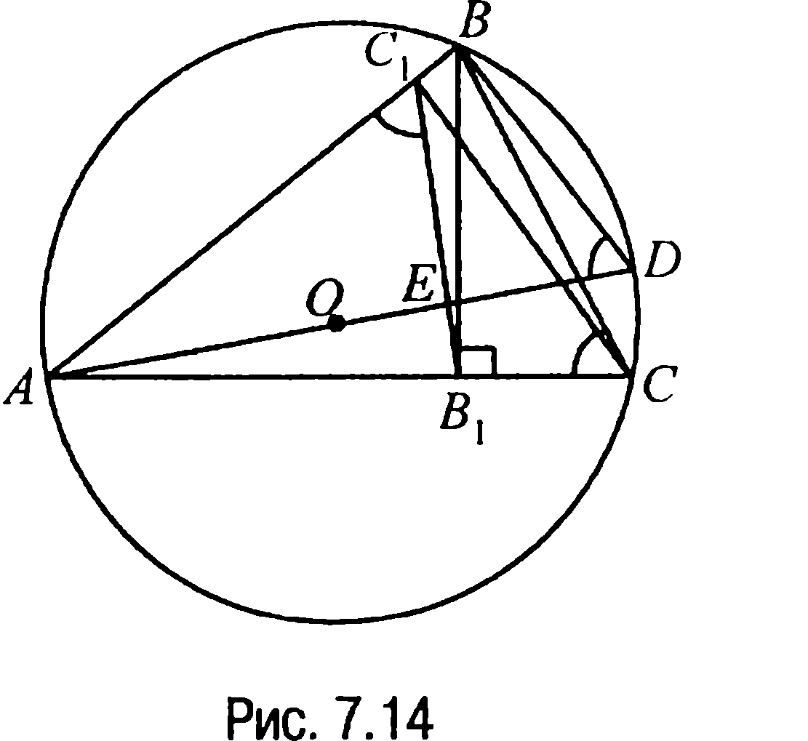

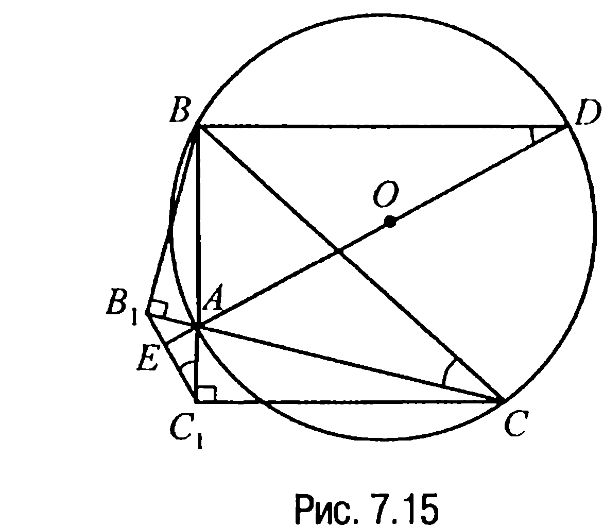

Тогда углы $BDA$ и $BCA$ равны как углы, опирающиеся на одну и ту же дугу $AB$. Поэтому в силу того, что $\angle ABD = 90^\circ$, имеем $\angle EAC_1 = \angle DAB = 90^\circ - \angle BCA$. А так как $\triangle ABC \sim \triangle AC_1B_1$ (свойство 7.4) и, значит, $\angle AC_1B_1 = \angle BCA$, то из треугольника $AC_1E$ находим, что $\angle C_1EA = 180^\circ - \angle AC_1E - \angle EAC_1 = 180^\circ - \angle BCA - (90^\circ - \angle BCA) = 90^\circ$, т. е. действительно прямая $OA$ перпендикулярна отрезку $B_1C_1$.

▼ **7.5.** *Доказать, что если в треугольнике $ABC$ со сторонами $AB = c$, $BC = a$, $AC = b$ проведены высоты $AA_1 = h_a$, $BB_1 = h_b$, $CC_1 = h_c$, то $a : b : c = \frac{1}{h_a} : \frac{1}{h_b} : \frac{1}{h_c}$.*

**Решение.** Пусть $S$ — площадь треугольника $ABC$. Тогда $S = \frac{1}{2} a \cdot h_a = \frac{1}{2} \cdot b \cdot h_b = \frac{1}{2} c \cdot h_c$.

---
**стр. 98**
---

Отсюда $a : b = h_b : h_a = \frac{1}{h_a} : \frac{1}{h_b}$, $b : c = h_c : h_b = \frac{1}{h_b} : \frac{1}{h_c}$ и, таким образом, $a : b : c = \frac{1}{h_a} : \frac{1}{h_b} : \frac{1}{h_c}$, что и требовалось доказать.

▼ **7.6.** *Доказать, что если точка $O$ — точка пересечения высот остроугольного треугольника $ABC$, то $\angle ABC + \angle AOC = 180^\circ$, $\angle BCA + \angle BOA = 180^\circ$, $\angle CAB + \angle COB = 180^\circ$.*

**Решение.** Докажем справедливость первой из приведенных в условии задачи формул. Справедливость остальных двух формул доказывается аналогично.

Итак, пусть $\angle ABC = \beta$, $\angle AOC = \omega$, $A_1$, $B_1$ и $C_1$ — основания высот треугольника, проведенных из вершин $A$, $B$ и $C$ соответственно (рис. 7.16).

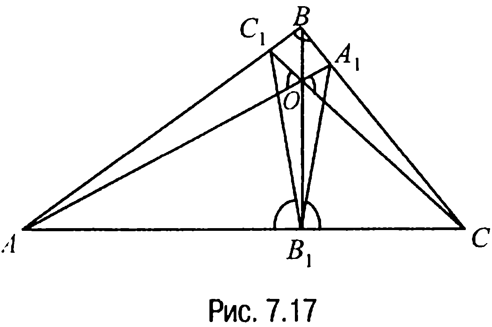

Тогда из прямоугольного треугольника $BC_1C$ следует, что $\angle BCC_1 = 90^\circ - \beta$ и, таким образом, в прямоугольном треугольнике $OA_1C$ угол $COA_1$ равен $\beta$. Но сумма углов $\angle AOC + \angle COA_1 = \omega + \beta$ дает развернутый угол и поэтому $\angle AOC + \angle COA_1 = \angle AOC + \angle ABC = 180^\circ$, что и требовалось доказать.

**Замечание 7.10.** Обратим внимание на вытекающий из решения задачи факт равенства углов (рис. 7.16): $\angle ABC = \angle COA_1 = \angle C_1OA$. Справедливы также и следующие равенства: $\angle BCA = \angle AOB_1 = \angle A_1OB$, $\angle CAB = \angle BOC_1 = \angle B_1OC$.

**Замечание 7.11.** При решении задачи 7.2 показано, что высоты $AA_1$, $BB_1$ и $CC_1$ являются соответственно биссектрисами углов $C_1A_1B_1$, $A_1B_1C_1$ и $B_1C_1A_1$.

Но тогда, обращаясь к замечаниям 7.3 и 7.10, приходим к выводу, что $\angle ABC = \angle COA_1 = \angle C_1OA = \angle CB_1A_1 = \angle C_1B_1A$ (рис. 7.17),

---
**стр. 99**
---

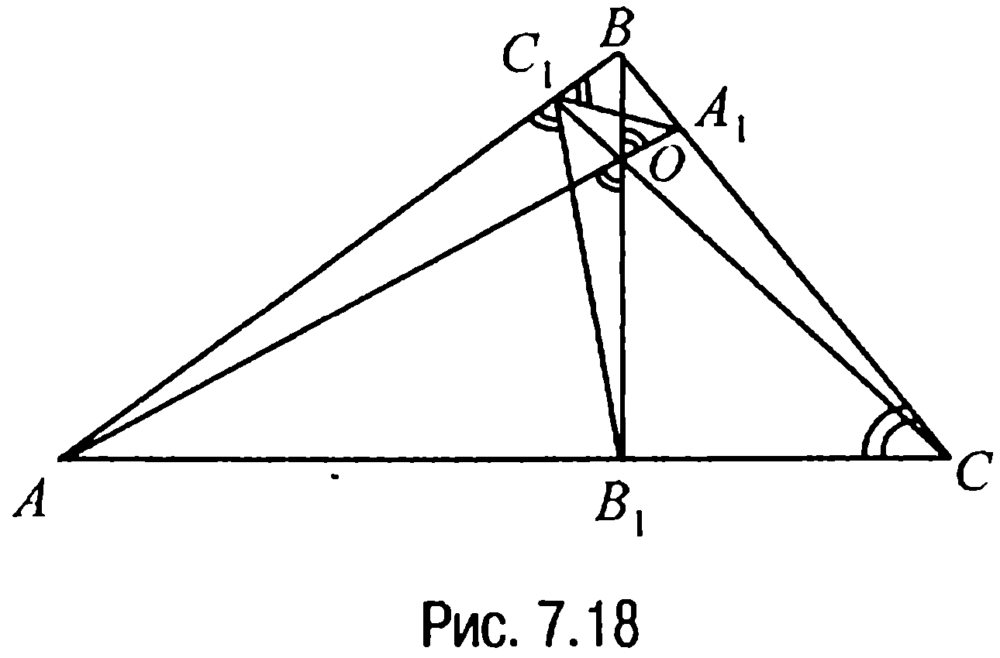

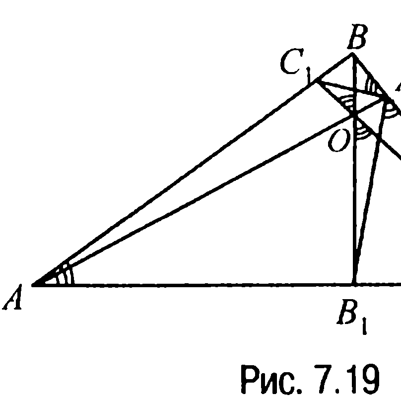

$\angle BCA = \angle AOB_1 = \angle A_1OB =$
$= \angle AC_1B_1 = \angle A_1C_1B$
(рис. 7.18),
$\angle CAB = \angle BOC_1 = \angle B_1OC =$
$= \angle BA_1C_1 = \angle B_1A_1C$
(рис. 7.19).

**7.7.** В остроугольном треугольнике $ABC$ проведены высоты $AA_1$, $BB_1$ и $CC_1$. Доказать, что
$\angle ABB_1 = \angle C_1A_1A, \angle B_1BC = \angle CC_1A_1$; $\angle BCC_1 = \angle A_1B_1B,$
$\angle C_1CA = \angle AA_1B_1$; $\angle CAA_1 = \angle B_1C_1C, \angle A_1AB = \angle BB_1C_1$.

**Решение.** Докажем справедливость двух первых равенств. Справедливость остальных четырех равенств доказывается аналогично. Итак, пусть $O$ — точка пересечения высот треугольника $ABC$ (рис. 7.20).

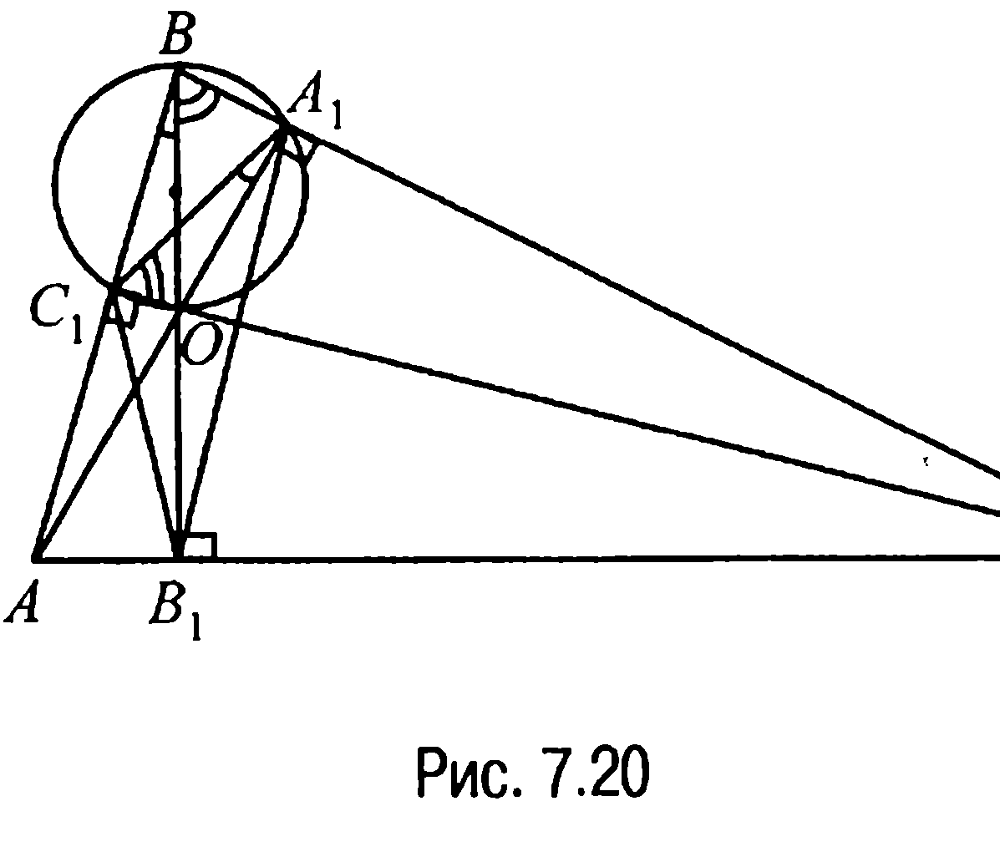

Тогда так как углы $BA_1O$ и $OC_1B$ — прямые, то точки $A_1$ и $C_1$ лежат на окружности, диаметром которой является отрезок $BO$. Отсюда следует, что углы $C_1BO$ и $C_1A_1O$ равны, поскольку они опираются на одну и ту же дугу $C_1O$. Равенство же указанных уг-

---
**стр. 100**
---

лов означает, что $\angle ABB_1 = \angle C_1A_1A$. Замечая теперь, что на одну и ту же дугу $OA_1$ опираются углы $OC_1A_1$ и $OBA_1$, приходим к выводу, что $\angle B_1BC = \angle CC_1A_1$, а это и требовалось доказать.

**Замечание 7.12.** Так как высоты $AA_1$, $BB_1$ и $CC_1$ являются соот-

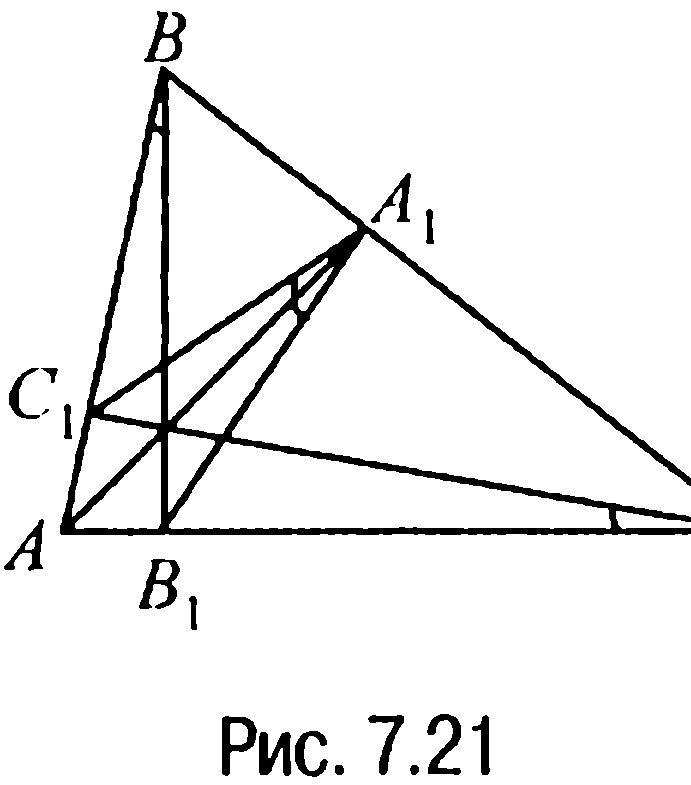

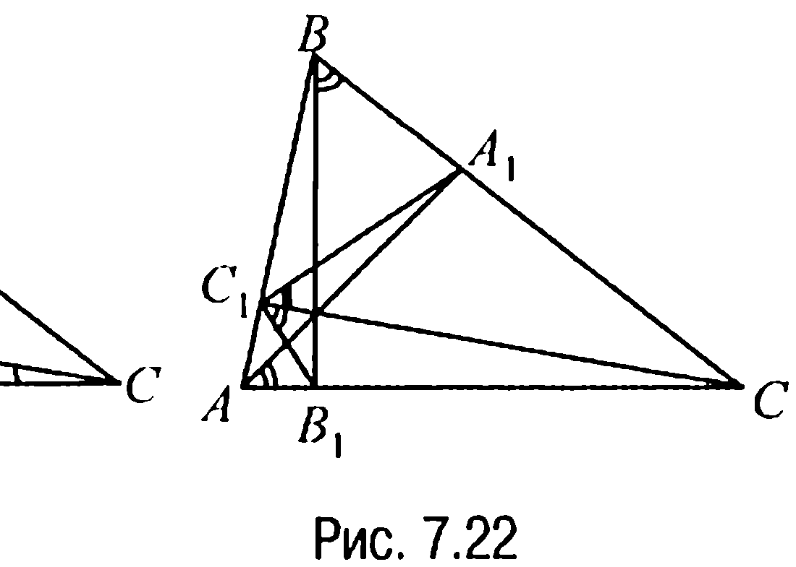

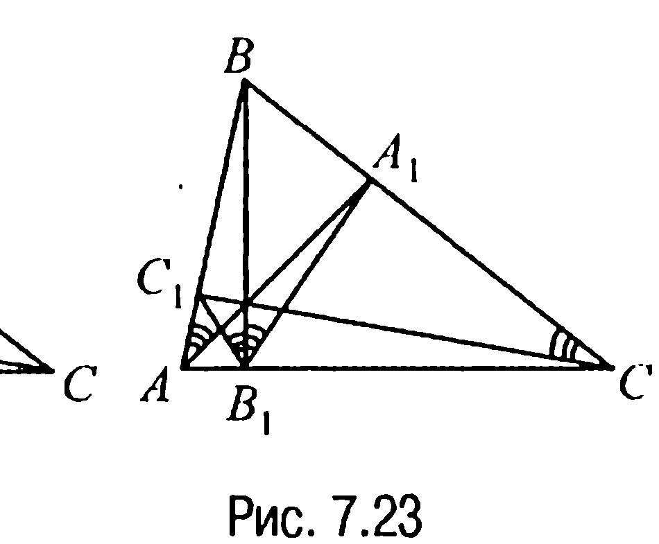

ветственно биссектрисами углов $C_1A_1B_1$, $A_1B_1C_1$ и $B_1C_1A_1$, то $\angle ABB_1 = \angle C_1A_1A = \angle AA_1B_1$, $\angle B_1BC = \angle CC_1A_1 = \angle B_1C_1C$; $\angle BCC_1 =$
$= \angle A_1B_1B = \angle BB_1C_1$, $\angle C_1CA = \angle AA_1B_1 = \angle C_1A_1A$; $\angle CAA_1 =$
$= \angle B_1C_1C = \angle CC_1A_1$, $\angle A_1AB = \angle BB_1C_1 = \angle A_1B_1B$ и, таким образом,
$\angle ABB_1 = \angle C_1A_1A = \angle AA_1B_1 = \angle C_1CA$ (рис. 7.21);
$\angle B_1BC = \angle CC_1A_1 = \angle B_1C_1C = \angle CAA_1$ (рис. 7.22);
$\angle BCC_1 = \angle A_1B_1B = \angle BB_1C_1 = \angle A_1AB$ (рис. 7.23).

**7.8.** *Основания $A_1$ и $C_1$ двух высот остроугольного треугольника $ABC$, опущенных из вершин $A$ и $C$ углов, равных $\phi$ и $\psi$ соответственно, соединены отрезком. В каком отношении этот отрезок делится третьей высотой $BB_1$ треугольника $ABC$?*

**Решение.** Пусть $AA_1$, $BB_1$ и $CC_1$ — высоты треугольника $ABC$ и пусть для определенности $\angle CAB = \phi$, $\angle BCA = \psi$, а $D$ — точка пересечения высоты $BB_1$ с отрезком $C_1A_1$ (рис. 7.24). Тогда в соответствии с условием задачи требуется найти отношение отрезка $C_1D$ к отрезку $DA_1$ (или отрезка $DA_1$ к отрезку $C_1D$). Один из подходов решения задачи состоит в следующем. Соединим отрезками точки $C_1$, $B_1$ и $A_1$, $B_1$. Тогда так как

---
**стр. 101**
---

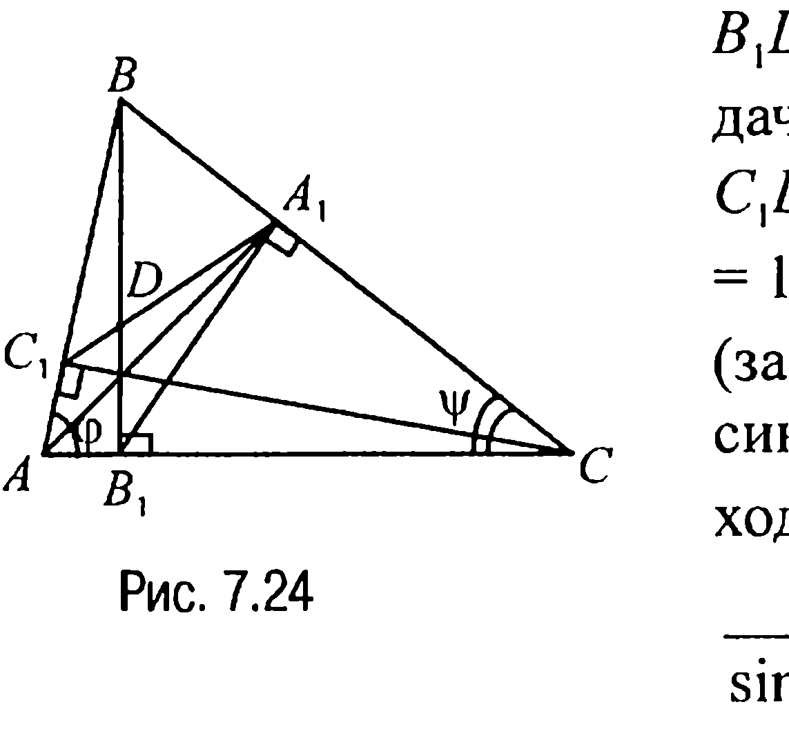

$B_1D$ — биссектриса угла $A_1B_1C_1$ (задача 7.2), то $C_1D : DA_1 = B_1C_1 : B_1A_1$. Но $\angle C_1A_1B_1 = 180^\circ - 2\phi$, а $\angle B_1C_1A_1 = 180^\circ - 2\psi$ (замечание 7.11), поэтому по теореме синусов из треугольника $A_1B_1C_1$ находим, что

$$\frac{B_1C_1}{\sin(180^\circ - 2\phi)} = \frac{B_1A_1}{\sin(180^\circ - 2\psi)} \quad \text{или}$$

$$\frac{B_1C_1}{B_1A_1} = \frac{\sin 2\phi}{\sin 2\psi}. \quad \text{Итак,} \quad \frac{C_1D}{DA_1} = \frac{B_1C_1}{B_1A_1} = \frac{\sin 2\phi}{\sin 2\psi}.$$

**Ответ:** в отношении $\dfrac{\sin 2\phi}{\sin 2\psi} \left( \text{или } \dfrac{\sin 2\psi}{\sin 2\phi} \right)$.

**Замечание 7.13.** Результат, аналогичный доказанному, имеет место и для тупоугольного треугольника с заданными острыми углами. Доказательство в этом случае аналогично проведенному с той лишь оговоркой, что отрезок, соединяющий основания двух высот тупоугольного треугольника, будет пересекаться не третьей высотой треугольника, а прямой, на которой лежит эта высота.

▼ **7.9.** *Доказать, что расстояние от вершины треугольника до точки пересечения высот или их продолжений вдвое больше, чем расстояние от центра описанной около треугольника окружности до противолежащей выбранной вершине стороны или ее продолжения.*

**Решение.** Пусть $D$ — точка пересечения высот или продолжения высот треугольника $ABC$, $O$ — центр описанной около этого треугольника окружности. Покажем, например, что расстояние от вершины $A$ до точки $D$ вдвое больше расстояния от точки $O$ до стороны $BC$. Рассмотрение остальных случаев аналогично.

Итак, пусть точка $E$ — основание перпендикуляра, опущенного из точки $O$ на сторону $BC$, которая, очевидно, будет серединной точкой этой стороны.

Если треугольник $ABC$ является прямоугольным и если точки $A$ и $D$ совпадают, а значит, совпадают и точки $O$ и $E$, то $AD =$

---
**стр. 102**
---

$= 2OE = 0$; если же совпадают точки $C$ и $D$ или $B$ и $D$, то $OE$ — средняя линия соответствующих треугольников и, таким образом, $AD = 2OE$.

Обратимся к случаям остроугольного или тупоугольного треугольника $ABC$ (рис. 7.25, 7.26).

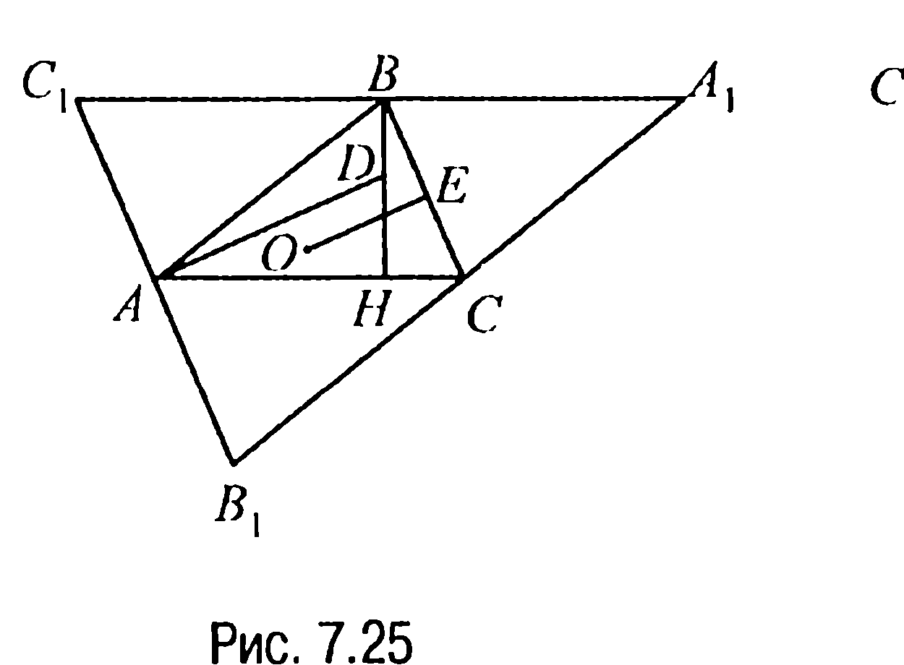

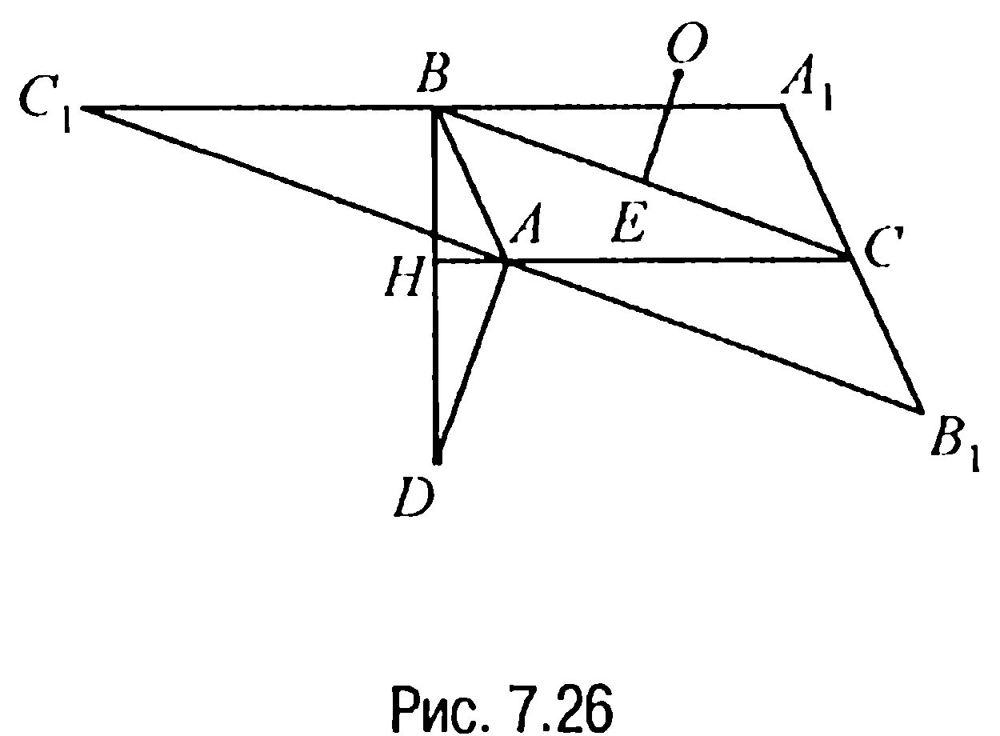

Проведем через вершины треугольника $ABC$ прямые, параллельные его сторонам. Тогда треугольник $A_1B_1C_1$ с вершинами в точках пересечения проведенных прямых будет подобен треугольнику $ABC$ с коэффициентом подобия $k = 2$ (замечание 7.1). Пусть $BH$ — высота треугольника $ABC$, опущенная из вершины $B$. Тогда отрезки $BD$ и $AD$ лежат соответственно на серединных перпендикулярах к сторонам $C_1A_1$ и $C_1B_1$ треугольника $A_1B_1C_1$ и поэтому точка $D$ — центр описанной около треугольника $A_1B_1C_1$ окружности (свойство 7.2X).

Но так как в подобных фигурах все соответствующие линейные элементы пропорциональны, а в нашем случае $k = 2$, то отсюда и следует, что $AD = 2OE$.

**7.10.** *Около треугольника $ABC$ описана окружность $s$. Доказать, что окружности, симметричные $s$ относительно прямых $AB$, $BC$ и $AC$, пересекаются в одной точке — точке пересечения высот треугольника или их продолжений.*

**Решение.** Если треугольник $ABC$ — прямоугольный, то справедливость утверждения очевидна, поскольку одна из окружностей, симметричных $s$, будет совпадать с $s$, а две остальные, как и $s$, будут проходить через вершину прямого угла, которая как раз и является точкой пересечения высот треугольника.

---
**стр. 103**
---

Рассмотрим случаи остроугольного и тупоугольного треугольников. Итак, пусть $O$ — точка пересечения высот треугольника $ABC$ или их продолжений (рис. 7.27, 7.28), $s$ — окружность, описанная около треугольника $ABC$, и $D$ — точка этой окружности. Опишем около треугольника $AOC$ окружность $s_1$ и обозначим $\angle OCA = \phi$, а $\angle CAO = \psi$. Тогда $\cup AOC = \cup AO + \cup OC = 2\phi + 2\psi = 2(\phi + \psi)$.

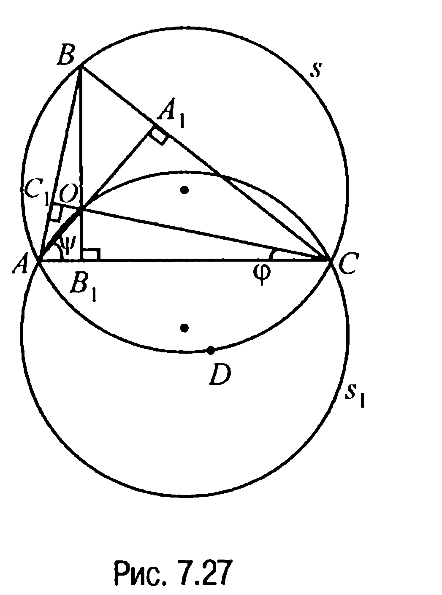

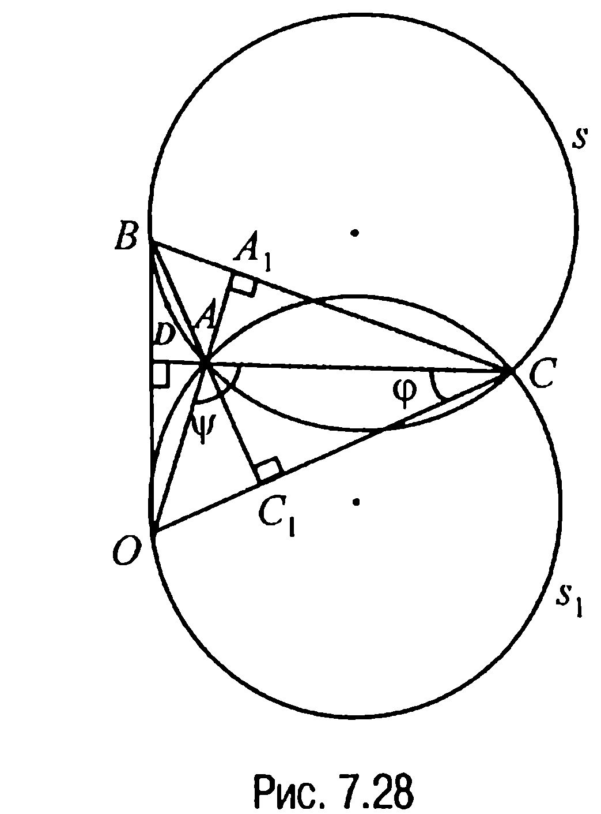

Из прямоугольных же треугольников $C_1CA$ и $A_1CA$ следует, что в случае остроугольного треугольника (рис. 7.27) $\phi = 90^\circ - \angle CAB$, а $\psi = 90^\circ - \angle BCA$, и поэтому $\cup AOC = 2(\phi + \psi) = 2(90^\circ - \angle CAB + 90^\circ - \angle BCA) = 2(180^\circ - \angle CAB - \angle BCA) = 2\angle ABC$. Но так как угол $ABC$ вписан в окружность $s$, то и $\cup ADC = 2\angle ABC$.

В случае же тупоугольного треугольника (рис. 7.28) $\phi = 90^\circ - \angle CAC_1 = 90^\circ - (180^\circ - \angle CAB) = \angle CAB - 90^\circ$, а $\psi = 90^\circ + \angle BCA$, и поэтому $\cup AOC = 2(\phi + \psi) = 2(\angle CAB - 90^\circ + 90^\circ + \angle BCA) = 2(\angle CAB + \angle BCA)$.

Но углы $BCA$ и $CAB$ являются вписанными в окружность $s$ и, значит, также $\cup ADC = \cup AB + \cup BC = 2(\angle CAB + \angle BCA)$.

Таким образом, в обоих случаях угловые меры дуг $AOC$ и $ADC$ равны и поэтому сами дуги, имеющие общую хорду, также равны (как геометрические фигуры). Но отсюда следует, что окружности $s$ и $s_1$ равны, а как следствие они симметричны относительно прямой $AC$.

---
**стр. 104**
---

Аналогично показывается, что окружности, описанные около треугольников $BOA$ и $COB$, симметричны окружности $s$ относительно прямых $AB$ и $BC$ соответственно. А это и доказывает требуемое, так как точка $O$ является единственной общей точкой для треугольников $AOC$, $BOA$ и $COB$, около каждого из которых можно описать только одну окружность.

**7.11.** *Пусть $O$ — точка пересечения высот остроугольного или продолжения высот тупоугольного треугольника $ABC$. Найти величину угла при вершине $C$, если известно, что $OC = AB$.*

**Решение.** Построим треугольник $A_1B_1C_1$, средними линиями кото-

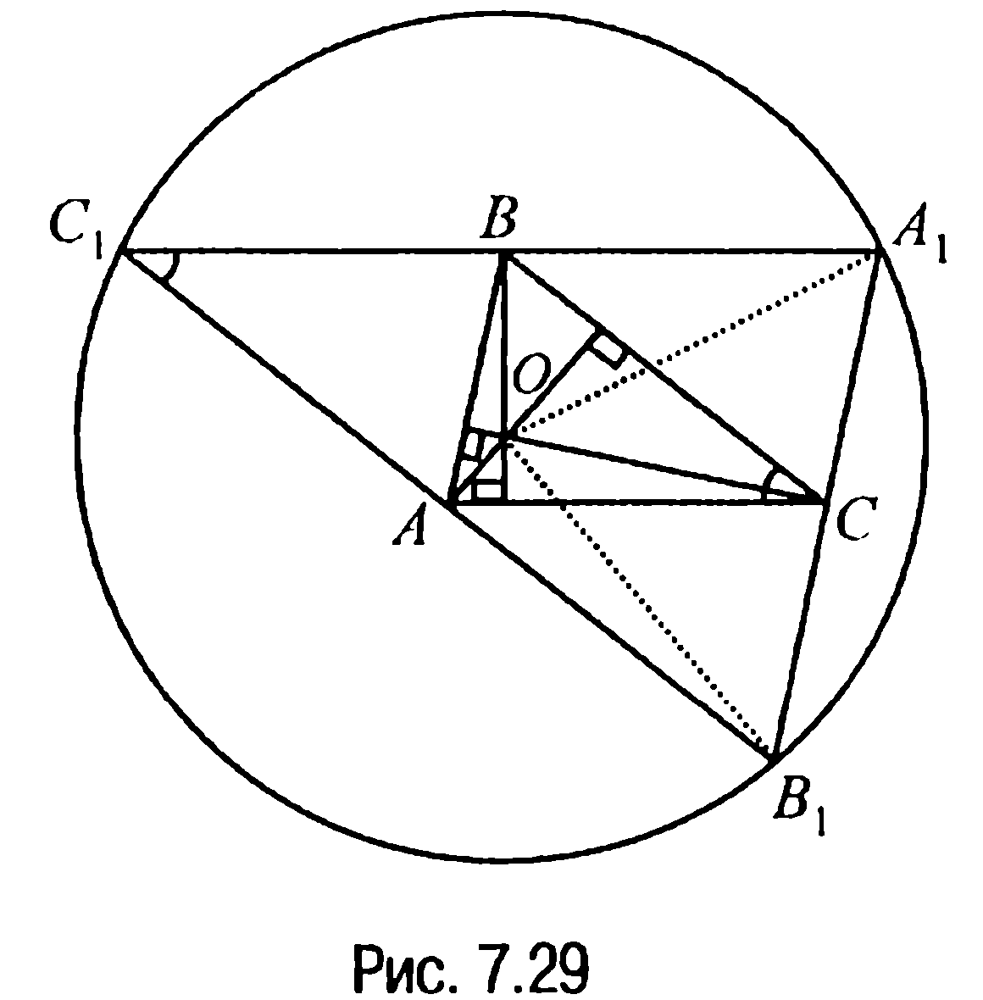

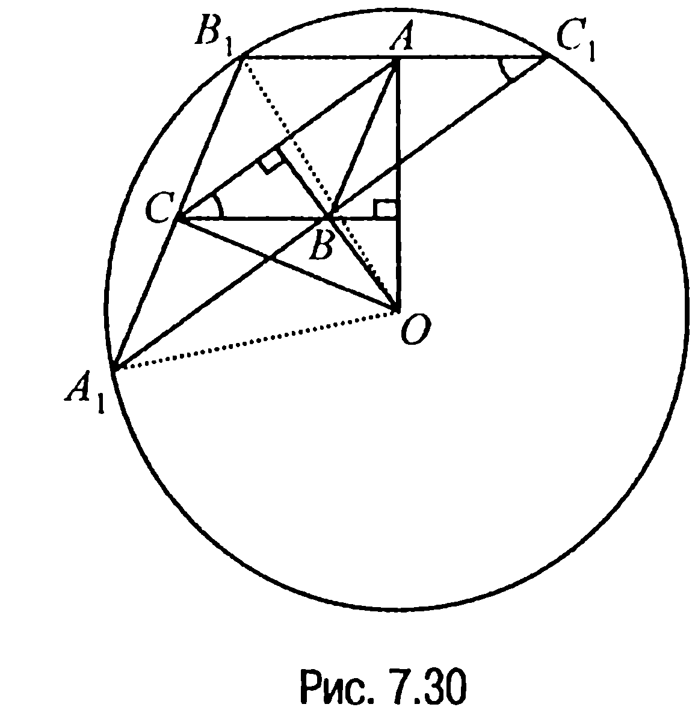

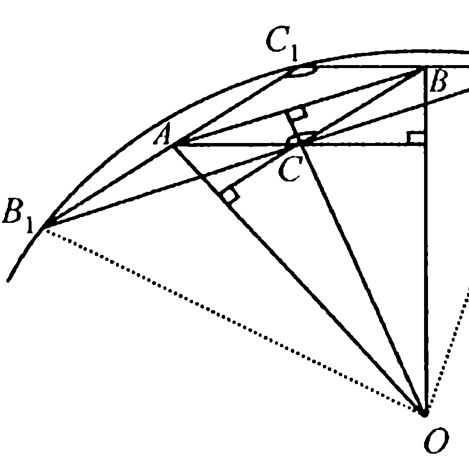

рого являются стороны данного треугольника $ABC$ (рис. 7.29, 7.30, 7.31). Тогда (свойство 7.2X) точка $O$ будет центром описанной около треугольника $A_1B_1C_1$ окружности. При этом так как $A_1C = B_1C = AB = CO$, то центральный угол $B_1OA_1$ равен $90^\circ$, а вписанный угол $B_1C_1A_1$, опирающийся на ту же дугу $A_1B_1$, что и угол $B_1OA_1$, равен либо $45^\circ$ (рис. 7.29, 7.30), либо $135^\circ$ (рис. 7.31) (здесь все зависит от того, лежат ли точки

---
**стр. 105**
---

$O$ и $C_1$ по одну сторону от прямой $A_1B_1$ или нет). Отсюда, учитывая, что $\angle B_1C_1A_1 = \angle BCA$, получаем

**Ответ:** или $45^\circ$, или $135^\circ$.

**ЗАДАЧИ ДЛЯ САМОСТОЯТЕЛЬНОГО РЕШЕНИЯ**

**7.1С.** *Высоты треугольника равны 3, 4 и 10. Чему равен наибольший угол $\alpha$ этого треугольника?*

**7.2С.** *Существует ли треугольник, у которого две высоты больше 10 каждая, и площадь которого $S < 10$?*

**7.3С.** *Высоты треугольника меньше 1 каждая. Может ли площадь $S$ такого треугольника быть больше 100?*

**7.4С.** *Две высоты треугольника равны 12 и 20 соответственно. Доказать, что третья высота меньше 30.*

**7.5С.** *Пусть $O$ — точка пересечения высот остроугольного или продолжения высот тупоугольного треугольника $ABC$. Доказать, что основания высот данного треугольника, середины его сторон, а также середины отрезков $AO$, $BO$ и $CO$ лежат на одной окружности (**окружности Эйлера**).*

**7.6С.** *Пусть $D$ — точка пересечения высот или продолжения высот треугольника $ABC$, $O$ — центр описанной около него окружности, а $F$ — точка пересечения его медиан. Доказать, что точки $D$, $O$, $F$ лежат на одной прямой (**прямой Эйлера**).*

**7.7С.** *Пусть $D$ — точка пересечения высот остроугольного или продолжения высот тупоугольного треугольника $ABC$. Доказать, что отрезок, соединяющий середину стороны $BC$ с серединой отрезка $AD$, равен радиусу окружности, описанной около треугольника $ABC$.*

---
**стр. 106**
---

**7.8С.** *Доказать, что точки, симметричные точке пересечения высот треугольника относительно его сторон, а также относительно середин всех сторон, лежат на описанной около этого треугольника окружности.*

**7.9С.** *Доказать, что точки, симметричные точке пересечения продолжения высот тупоугольного треугольника относительно прямых, на которых лежат его стороны, а также точки, симметричные относительно середин всех сторон, лежат на описанной около этого треугольника окружности.*

**7.10С.** *Пусть $O$ — точка пересечения высот остроугольного треугольника $ABC$. Доказать, что любая из четырех точек $A$, $B$, $C$, $O$ является точкой пересечения продолжения высот треугольника с вершинами в трех других из указанных точек. Доказать также, что радиусы окружностей, описанных около всех треугольников с вершинами в точках из множества $\{A, B, C, O\}$, равны между собой.*

**7.11С.** *Пусть $O$ — точка пересечения продолжения высот тупоугольного треугольника $ABC$. Доказать, что любая из четырех точек $A$, $B$, $C$, $O$ является точкой пересечения продолжения высот треугольника с вершинами в трех других из указанных точек. Доказать также, что радиусы окружностей, описанных около всех треугольников с вершинами в точках из множества $\{A, B, C, O\}$, равны между собой.*

**7.12С.** *В треугольнике $ABC$ угол при вершине $A$ равен $\alpha$, $BC = a$. Найти $AO$, где $O$ — точка пересечения высот или продолжения высот данного треугольника.*

**7.13С.** *В остроугольном или тупоугольном треугольнике $ABC$ проведены высоты $AA_1$, $BB_1$ и $CC_1$. Найти отношение площади $S_1$ треугольника $A_1B_1C_1$ к площади $S$ треугольника $ABC$, если $\angle CAB = \alpha$, $\angle ABC = \beta$, $\angle BCA = \gamma$.*
