## 1.8. Биссектрисы

---
**стр. 107**
---

**7.14С.** *Основания высот остроугольного треугольника $ABC$ служат вершинами другого треугольника, периметр которого равен $2p$. Найти площадь треугольника $ABC$, если радиус описанной около него окружности равен $R$.*

**7.15С.** *Пусть $H$ — точка пересечения высот или продолжения высот треугольника $ABC$, у которого $\angle CAB < 90^\circ$, $O$ — центр описанной около треугольника окружности. Доказать, что $\angle OAH = |\angle BCA - \angle ABC|$.*

**§ 8. БИССЕКТРИСЫ**

***Биссектриса угла*** — луч, исходящий из вершины угла и делящий этот угол пополам.

***Биссектриса (внутренняя биссектриса) треугольника*** — это отрезок биссектрисы внутреннего угла треугольника от вершины угла до противолежащей стороны.

**Замечание 8.1.** В некоторых учебных пособиях биссектрису треугольника называют биссектрисой угла треугольника. Но! Поскольку под углом треугольника $ABC$, например, с вершиной $A$, понимается угол, образованный лучами $AB$ и $AC$, то понятие биссектрисы угла треугольника и понятие биссектрисы треугольника — это все-таки разные понятия.

***Внешняя биссектриса треугольника*** — это отрезок биссектрисы внешнего угла треугольника от вершины угла до продолжения противолежащей стороны.

**Замечание 8.2.** При вершине равнобедренного треугольника внешней биссектрисы треугольника не существует, поскольку биссектрисы двух внешних углов треугольника при его вершине параллельны продолжению основания. Отсюда, в частности, следует, что равносторонний треугольник не имеет внешних биссектрис. Если же треугольник не является равнобедренным, то при каждой его вершине имеется одна внешняя биссектриса треугольника.

---
**стр. 108**
---

**8.1. Свойства биссектрис**

**Свойство 8.1X.** *Любая точка биссектрисы неразвернутого угла равноудалена от сторон (продолжения сторон) угла. Другими словами, любая точка биссектрисы неразвернутого угла, за исключением вершины угла, является центром окружности, касающейся сторон (продолжения сторон) угла.*

**Доказательство.** Рассмотрим сначала случай угла, меньшего $180^\circ$.

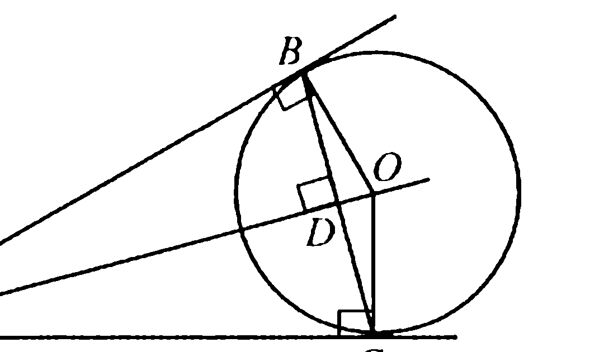

Отметим на биссектрисе такого угла, например, с вершиной $A$, произвольную точку $O$ и опустим из нее на стороны угла перпендикуляры $OB$ и $OC$ (рис. 8.1).

Тогда поскольку у прямоугольных треугольников $OBA$ и $OCA$ гипотенуза $AO$ общая, а острые углы $OAB$ и $OAC$ равны по условию, то равны и сами треугольники $OBA$ и $OCA$. Следовательно, $OB = OC$, что и означает в силу произвольности выбора точки $O$ на биссектрисе равноудаленность любой точки биссектрисы от сторон угла.

Если же теперь провести окружность с центром в точке $O$ радиуса, равного $OB$, то и получим окружность, касающуюся сторон угла, так как стороны угла перпендикулярны к радиусам $OB$ и $OC$ в их концах, лежащих на окружности (свойство 5.1X).

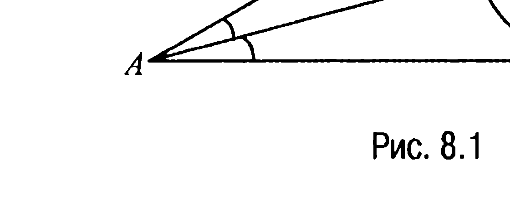

Теперь рассмотрим случай угла, большего $180^\circ$, но меньшего $360^\circ$ (рис. 8.2), с биссектрисой $AO$. В этом случае продолжения сторон угла (пунктирные «лучи») образуют угол, меньший $180^\circ$, и мы приходим к уже рассмотренному случаю, а это и завершает доказательство.

---
**стр. 109**
---

**Свойство 8.2X.** *Биссектриса неразвернутого угла является осью симметрии либо самого угла, либо угла, образованного продолжением сторон данного угла.*

**Доказательство.** Очевидно, что, как и при доказательстве свойства 8.1X, достаточно рассмотреть случай угла, меньшего $180^\circ$. А тогда если принять обозначения, которые были использованы при доказательстве свойства 8.1X (рис. 8.1), то приходим к выводу, что треугольник $CAB$ является равнобедренным ($AB = AC$), а значит, его биссектриса $AD$ будет одновременно высотой и медианой (свойство 1.18X). Отсюда следует, что точка $B$ симметрична точке $C$ относительно $AD$, т. е. биссектриса — ось симметрии угла.

**Свойство 8.3X.** *Биссектрисы треугольника пересекаются в одной точке — центре вписанной в треугольник окружности.*

**Доказательство.** Как следует из свойства 1.11 любые две биссектрисы треугольника пересекаются в точке, лежащей внутри треугольника. Пусть для определенности $O$ — точка пересечения биссектрис $AA_1$ и $BB_1$ треугольника $ABC$ (рис. 8.3).

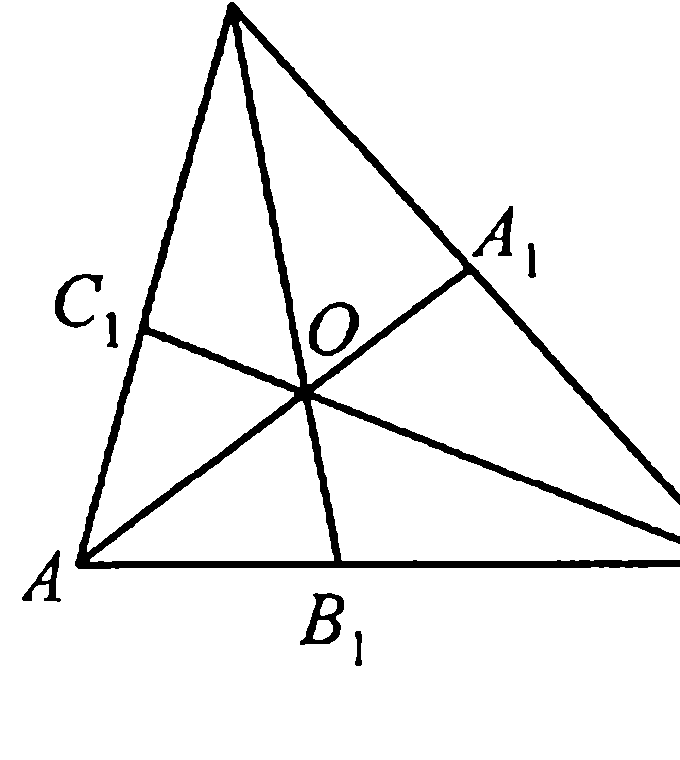

Тогда точка $O$ как точка биссектрисы $AA_1$ равноудалена от сторон треугольника $AC$ и $AB$. С другой стороны, точка $O$ как точка биссектрисы $BB_1$ равноудалена от сторон треугольника $AB$ и $BC$, т. е. она равноудалена от трех сторон треугольника, а значит, лежит и на биссектрисе $CC_1$ угла $BCA$. Итак, точка $O$ — точка пересечения трех биссектрис треугольника. Равноудаленность же точки $O$ от трех сторон треугольника означает, что эта точка является центром окружности, вписанной в треугольник.

---
**стр. 110**
---

**Свойство 8.4.** *Три прямые, на которых лежат биссектрисы внешних углов треугольника, выходящие из двух любых его вершин, и биссектриса внутреннего угла треугольника, выходящая из третьей его вершины, пересекаются в одной точке — центре вневписанной окружности.*

**Доказательство.** Пусть $D$ и $E$ — точки прямых, на которых лежат

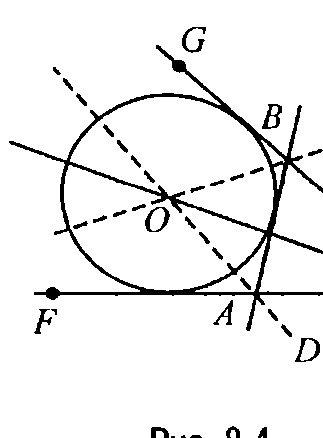

биссектрисы внешних углов треугольника $ABC$ при вершинах $A$ и $B$ соответственно, а $F$ и $G$ — точки сторон угла $BCA$ (рис. 8.4). Прямая $BE$ и биссектриса угла $BCA$ не параллельны, поэтому они пересекаются в одной точке, которую обозначим через $O$.

Точка $O$ как точка биссектрисы угла $BCA$, равноудалена от сторон. Но как точка прямой $BE$ она равноудалена и от сторон угла $GBA$, а значит, она равноудалена от сторон угла $BAF$ и, таким образом, лежит на прямой $AD$. Проведенные рассуждения доказывают первую часть сформулированного утверждения.

Тот же факт, что точка $O$ будет центром вневписанной окружности, следует из равноудаленности этой точки от лучей $CG$, $CF$ и $AB$.

**Свойство 8.5X.** *Биссектрисы внутреннего и смежного с ним внешнего угла треугольника перпендикулярны.*

**Доказательство.** Пусть $BD$ — биссектриса угла $ABC$, а $BE$ —

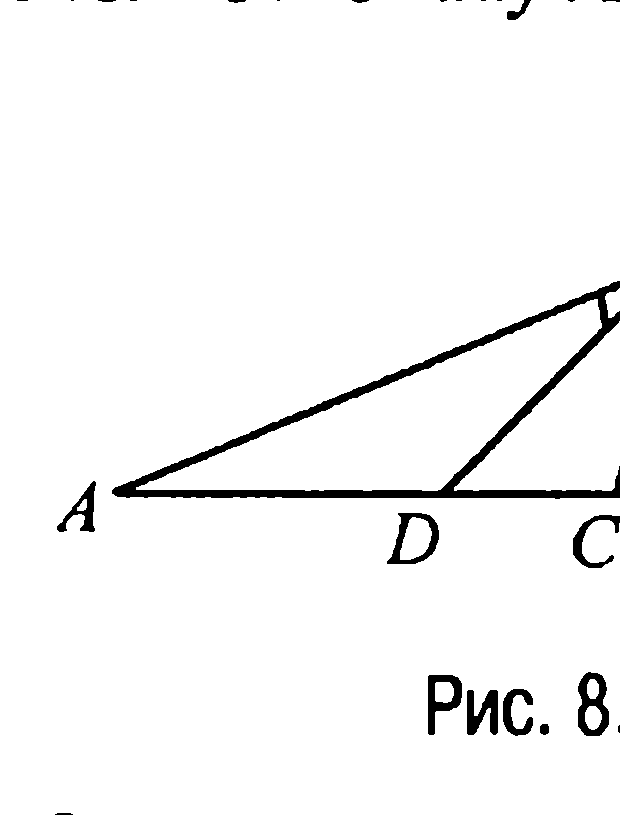

биссектриса смежного с указанным внутренним углом внешнего угла $CBF$ треугольника $ABC$ (рис. 8.5). Тогда если обозначить $\angle ABD = \angle DBC = \alpha$, $\angle CBE = \angle EBF = \beta$, то $2\alpha + 2\beta = 180^\circ$ и, таким образом, $\alpha + \beta = 90^\circ$. А это и означает, что $BD \perp BE$.

---
**стр. 111**
---

**Свойство 8.6X.** *Прямые, на которых лежат биссектрисы внутреннего и внешнего углов треугольника, выходящие из одной вершины, пересекаются с серединным к противолежащей стороне перпендикуляром в диаметрально противоположных точках описанной около треугольника окружности.*

**Доказательство.** Пусть, например, биссектриса угла $ABC$ пересекает описанную около треугольника $ABC$ окружность в точке $D$ (рис. 8.6).

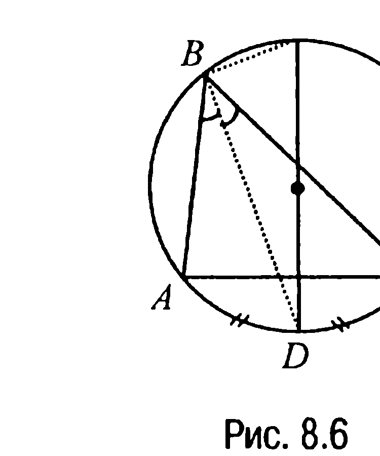

Тогда так как вписанные углы $ABD$ и $DBC$ равны, то $\cup AD = \cup DC$. Но серединный к стороне $AC$ перпендикуляр также делит дугу $AC$ пополам, поэтому точка $D$ будет принадлежать и этому серединному перпендикуляру. Далее, поскольку по свойству 8.5X биссектриса $BD$ угла $ABC$ перпендикулярна биссектрисе внешнего угла треугольника $ABC$, смежного с углом $ABC$, то последняя пересечет окружность в точке, диаметрально противоположной точке $D$, так как вписанный прямой угол всегда опирается на диаметр.

**Свойство 8.7X.** *Биссектриса любого угла треугольника делит противолежащую сторону на отрезки, пропорциональные прилежащим сторонам треугольника.*

**Доказательство.** Рассмотрим треугольник $ABC$. Пусть для определенности биссектриса угла $CAB$ пересекает сторону $BC$ в точке $D$ (рис. 8.7).

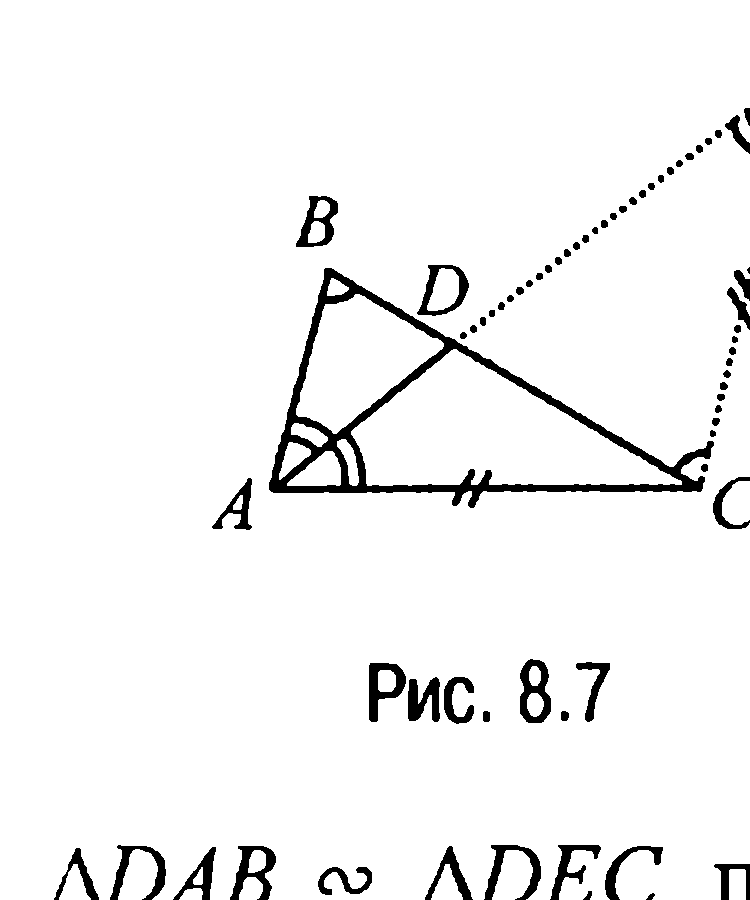

Покажем, что $BD : DC = AB : AC$. Для этого проведем через точку $C$ прямую, параллельную прямой $AB$, и обозначим через $E$ точку пересечения этой прямой с прямой $AD$. Тогда $\angle DAB = \angle DEC$, $\angle ABD = \angle ECD$ и поэтому $\Delta DAB \sim \Delta DEC$ по первому признаку подобия треугольников. Далее, так как луч $AD$ — биссектриса угла $CAB$, то $\angle CAE = \angle EAB = \angle AEC$ и, значит, треугольник $ECA$ равнобедренный. Отсюда

---
**стр. 112**
---

$AC = CE$. Но в таком случае из подобия треугольников $DAB$ и $DEC$ следует, что $\frac{BD}{DC} = \frac{AB}{CE} = \frac{AB}{AC}$, а это и требовалось доказать.

**Свойство 8.8X.** *Если биссектриса внешнего угла треугольника пересекает продолжение стороны, противолежащей вершине этого угла, то отрезки от полученной точки пересечения до концов противолежащей стороны пропорциональны прилежащим сторонам треугольника.*

**Доказательство.** Рассмотрим треугольник $ABC$. Пусть $F$ — точка на продолжении стороны $CA$, $D$ — точка пересечения биссектрисы внешнего угла $BAF$ треугольника с продолжением стороны $CB$ (рис. 8.8).

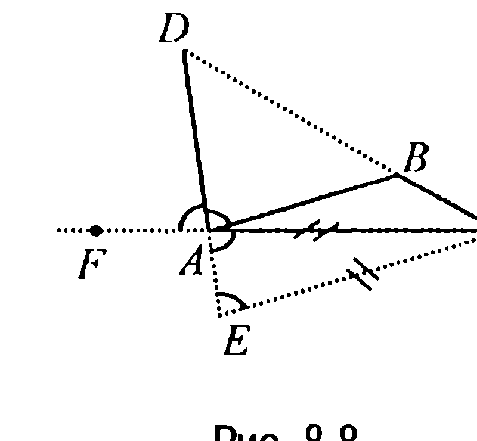

Покажем, что $DC : DB = AC : AB$. Действительно, проведем через точку $C$ прямую, параллельную прямой $AB$, и обозначим через $E$ точку пересечения этой прямой с прямой $DA$. Тогда $\triangle ADB \sim \triangle EDC$ и, значит, $DC : DB = EC : AB$. А поскольку $\angle EAC = \angle DAF = \angle BAD = \angle CEA$, то в равнобедренном треугольнике $CEA$ сторона $AC = EC$ и, таким образом, $DC : DB = AC : AB$, что и требовалось доказать.

**Свойство 8.9.** *Биссектриса треугольника делит его на два треугольника, площади которых соответственно пропорциональны прилежащим сторонам треугольника.* Справедливость этого свойства очевидным образом следует из свойств 1.12 и 8.7X.

**ЗАДАЧИ**

$\blacktriangledown$ **8.1.** *Доказать, что квадрат биссектрисы треугольника равен разности между произведением прилежащих сторон и произведением отрезков, на которые биссектриса делит третью сторону.*

**Решение.** Пусть $AD = l_a$ — биссектриса треугольника $ABC$, $AC = b$, $AB = c$, $BD = c'$, $DC = b'$ (рис. 8.9).

---
**стр. 113**
---

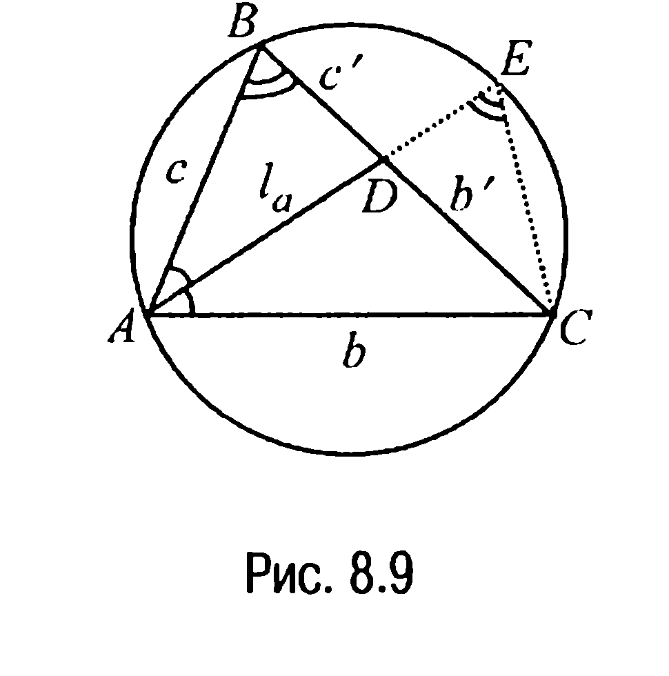

Опишем около треугольника $ABC$ окружность и продолжим биссектрису $AD$ до пересечения с окружностью в точке $E$. Вписанные углы $AEC$ и $ABC$ опираются на одну и ту же дугу $AC$ и, таким образом, равны, равны по условию углы $CAE$ и $EAB$, поэтому $\triangle CAE \sim \triangle DAB$ и, значит,

$$\frac{l_a}{b} = \frac{c}{l_a + DE} \quad \text{или} \quad l_a^2 + l_a \cdot DE = bc.$$

Но поскольку по свойству хорд 4.5X имеем $l_a \cdot DE = DC \cdot BD = b' \cdot c'$, то предыдущее равенство можно переписать в виде $l_a^2 = bc - b' \cdot c'$, что и требовалось доказать.

$\blacktriangledown$ **8.2.** *Доказать, что если $l_a, l_b, l_c$ — биссектрисы треугольника $ABC$ со сторонами $BC = a, AC = b, AB = c$, то справедливы равенства*

$$l_a^2 = bc \left( 1 - \frac{a^2}{(b+c)^2} \right), \quad l_b^2 = ac \left( 1 - \frac{b^2}{(a+c)^2} \right), \quad l_c^2 = ab \left( 1 - \frac{c^2}{(a+b)^2} \right).$$

**Решение.** Докажем, например, справедливость первой из трех приведенных формул, в остальных двух случаях рассуждения аналогичны.

Итак, при решении задачи 8.1 было показано, что $l_a^2 = bc - b' \cdot c'$, где $b'$ и $c'$ — это отрезки, на которые биссектриса $l_a$ делит сторону $BC$. Но по свойству 8.7X справедливо равенство $\frac{b'}{b} = \frac{c'}{c}$.

Обозначим коэффициент пропорциональности через $k$. Тогда $b' = kb$, $c' = kc$. Сложив эти равенства почленно, получим, что $b' + c' = k(b + c)$, но $b' + c' = a$ и поэтому $k = \frac{a}{b + c}$. Таким образом,

$$b'c' = k^2 bc = \frac{a^2 bc}{(b+c)^2} \text{ и, значит, } l_a^2 = bc - \frac{a^2 bc}{(b+c)^2} = bc \left( 1 - \frac{a^2}{(b+c)^2} \right).$$

---
**стр. 114**
---

▼ **8.3.** Доказать, что если в треугольнике $ABC$ стороны $AB$ и $BC$ не равны, то его биссектриса $BD$ лежит между медианой $BM$ и высотой $BH$.

**Решение.** Опишем около треугольника $ABC$ окружность и продолжим его биссектрису $BD$ до пересечения с окружностью в точке $K$ (рис. 8.10). Через точку $K$ будет проходить серединный к отрезку $AC$ перпендикуляр (свойство 8.6X), который с медианой имеет общую точку $M$. Но так как отрезки $BH$ и $MK$ параллельны, а точки $B$ и $K$ лежат по разные стороны от прямой $AC$, то точка пересечения отрезков $BK$ и $AC$ принадлежит отрезку $HM$, а это и доказывает требуемое.

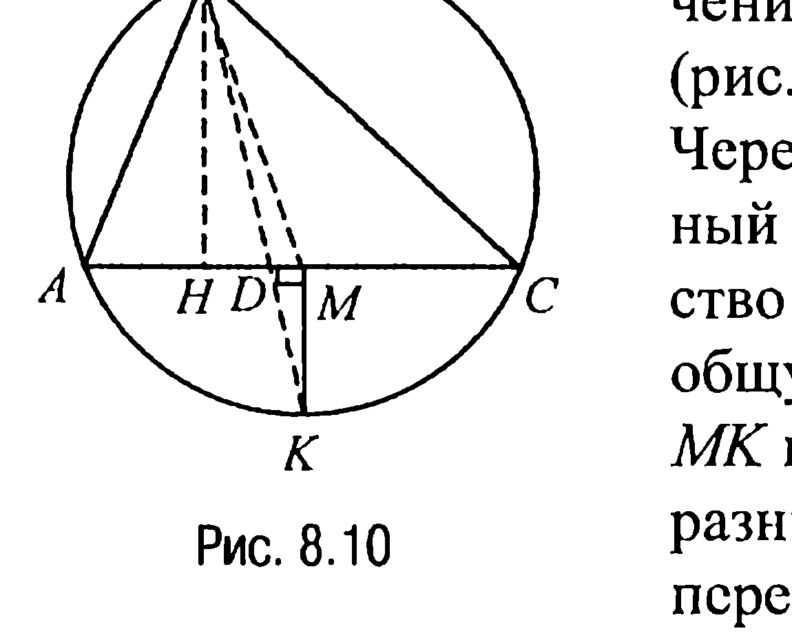

**Замечание 8.3.** Поскольку треугольники $DHB$ и $MHB$ — прямоугольные и $HD < HM$, то из теоремы Пифагора следует, что $BH < BD < BM$.

▼ **8.4.** Две стороны треугольника равны $a$ и $b$, угол между ними $\alpha$. Доказать, что биссектриса треугольника, заключенная между данными сторонами, равна $\dfrac{2ab \cos \frac{\alpha}{2}}{a + b}$.

**Решение.** Обозначим через $D$ — точку пересечения биссектрисы угла $CAB$ треугольника $ABC$ со стороной $BC$ и пусть $AB = a$, $AC = b$, $AD = l$ (рис. 8.11). Площадь $S$ треугольника $ABC$ равна сумме площадей $S_1$ и $S_2$ треугольников $ABD$ и $ADC$ соответственно и поскольку

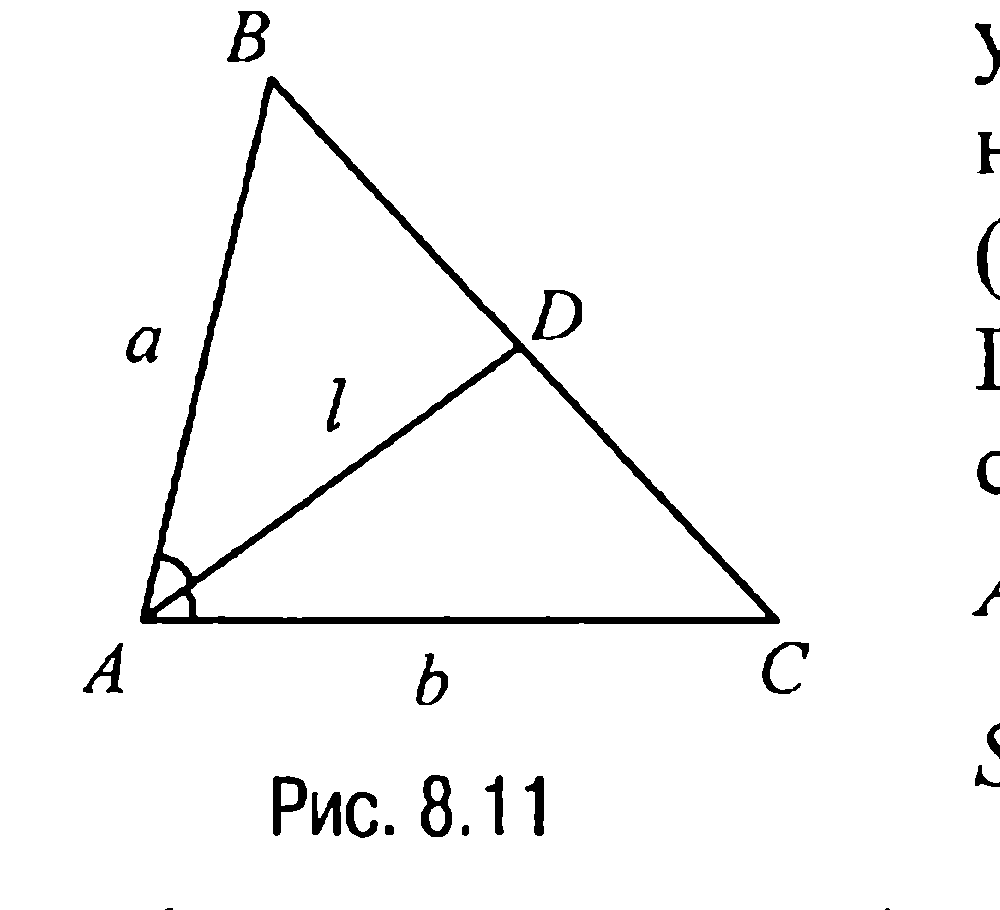

$S = \frac{1}{2} a \cdot b \cdot \sin \alpha$, $S_1 = \frac{1}{2} a \cdot l \cdot \sin \frac{\alpha}{2}$,

$S_2 = \frac{1}{2} b \cdot l \cdot \sin \frac{\alpha}{2}$, то $\frac{1}{2} a \cdot b \cdot \sin \alpha = \frac{1}{2} (a + b) \cdot l \cdot \sin \frac{\alpha}{2}$ или

---
**стр. 115**
---

§ 8. Биссектрисы

$\frac{1}{2} a \cdot b \cdot 2\sin \frac{\alpha}{2} \cdot \cos \frac{\alpha}{2} = \frac{1}{2} (a + b) \cdot l \cdot \sin \frac{\alpha}{2}$, откуда находим

$l = \dfrac{2ab \cos \frac{\alpha}{2}}{a + b}$. А это и требовалось доказать.

**8.5.** Пусть $O$ — центр описанной около треугольника $ABC$ окружности, $H$ — основание высоты, проведенной к стороне $BC$. Доказать, что биссектриса угла $CAB$ является также и биссектрисой угла $OAH$.

**Решение.** Пусть $AD$ — биссектриса угла $CAB$, $AE$ — диаметр опи-

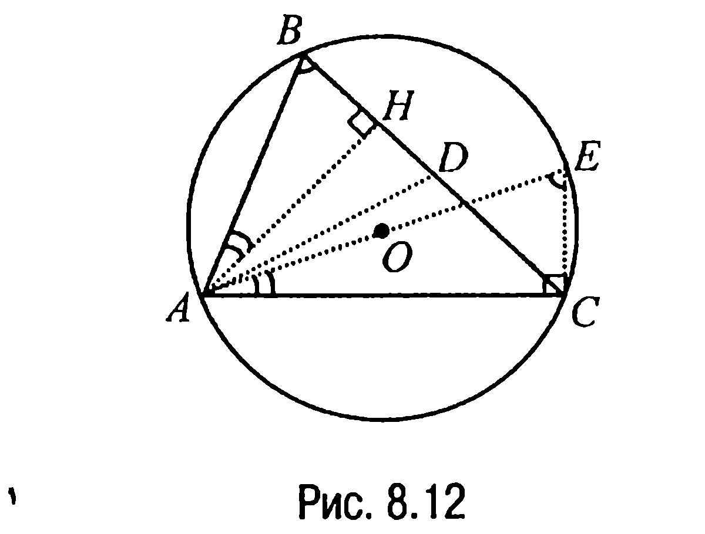

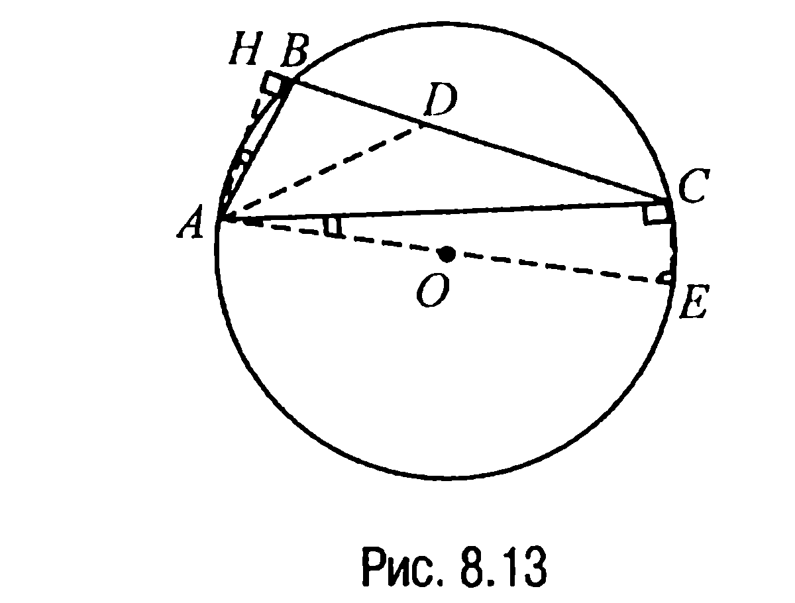

санной около треугольника $ABC$ окружности (рис. 8.12, 8.13). Если треугольник $ABC$ — остроугольный (рис. 8.12) и, значит, $\angle ABC < 90^\circ$, то так как $\angle ABC = \angle AEC = \frac{1}{2}\cup AC$, а треугольники $BHA$ и $ECA$ — прямоугольные ($\angle BHA = \angle ECA = 90^\circ$), то $\triangle BHA \sim \triangle ECA$ и, следовательно, $\angle CAO = \angle CAE = \angle HAB$. Далее, углы $BAD$ и $CAD$ равны по условию, поэтому $\angle HAD = \angle BAD - \angle BAH = \angle CAD - \angle CAE = \angle EAD = \angle OAD$.

Пусть теперь $\angle ABC = 90^\circ$. В этом случае высота $AH$ совпадает со стороной $AB$, а точка $O$ будет принадлежать гипотенузе $AC$ и поэтому справедливость утверждения задачи очевидна.

Рассмотрим случай, когда $\angle ABC > 90^\circ$ (рис. 8.13). Здесь четырёхугольник $ABCE$ вписан в окружность и, следовательно, $\angle AEC = 180^\circ - \angle ABC$. С другой стороны, $\angle ABH = 180^\circ - \angle ABC$, т. е. $\angle AEC = \angle ABH$. А поскольку треугольники $BHA$ и $ECA$ — прямо-

---
**стр. 116**
---

угольные и, значит, $\angle HAB = 90^\circ - \angle ABH = 90^\circ - \angle AEC = \angle EAC$, то $\angle HAD = \angle HAB + \angle BAD = \angle EAC + \angle CAD = \angle EAD = \angle OAD$.

Случаи, когда углы $BAC$ и $ACB$ — тупые, рассматриваются аналогично.

**8.6.** Пусть $O$ — центр окружности, вписанной в треугольник $ABC$, $\angle CAB = \alpha$. Доказать, что $\angle COB = 90^\circ + \frac{\alpha}{2}$.

**Решение.** Так как $O$ — центр вписанной в треугольник $ABC$ окружности (рис. 8.14), то лучи $BO$ и $CO$ — биссектрисы углов $ABC$ и $BCA$ соответственно.

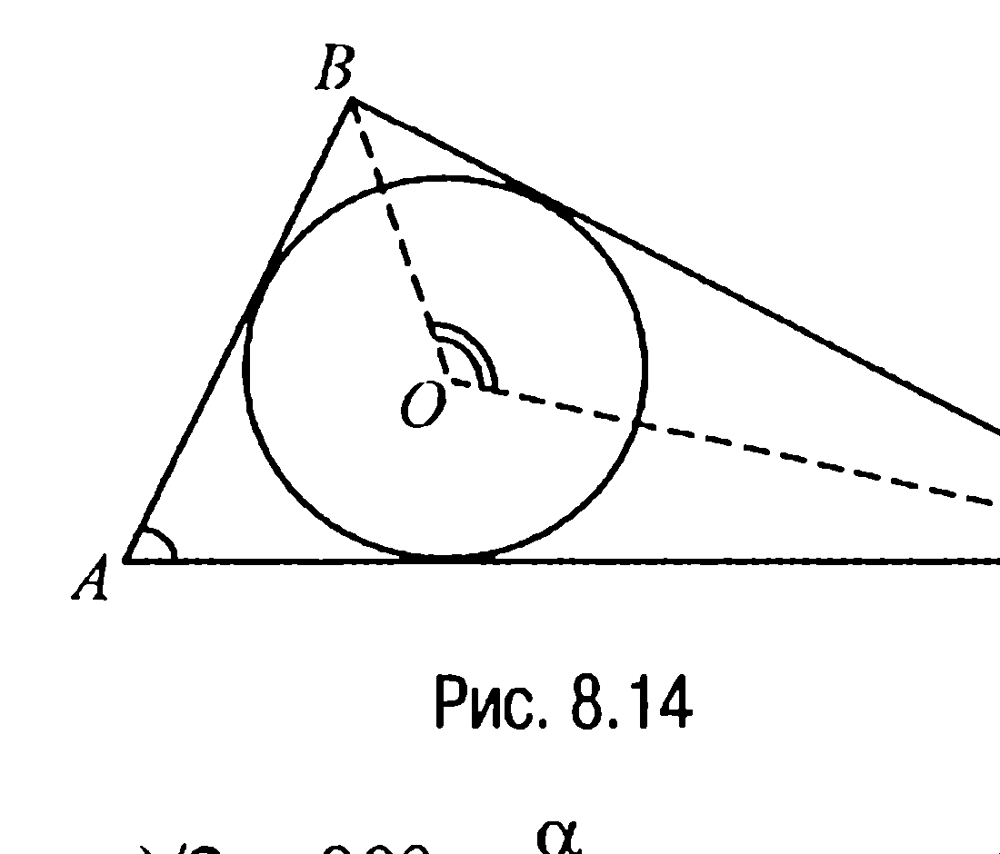

А тогда $\angle COB = 180^\circ - (\angle OBC + \angle BCO) = 180^\circ - (\angle ABC + \angle BCA)/2 = 180^\circ - (180^\circ - \alpha)/2 = 90^\circ + \frac{\alpha}{2}$, что и требовалось доказать.

▼ **8.7.** Доказать, что во всяком треугольнике из любых двух его биссектрис биссектриса большего угла меньше биссектрисы меньшего угла.

**Решение.** Пусть $a$, $b$ и $c$ — стороны треугольника $ABC$, противолежащие вершинам $A$, $B$ и $C$ соответственно, а $l_a$ и $l_b$ — биссектрисы треугольника, проведенные соответственно из вершин $A$ и $B$. Обозначим $\angle CAB = \alpha$, $\angle ABC = \beta$, тогда $l_a = \dfrac{2bc \cos \frac{\alpha}{2}}{b + c} = \dfrac{2 \cos \frac{\alpha}{2}}{\frac{1}{b} + \frac{1}{c}}$, $l_b = \dfrac{2ac \cos \frac{\beta}{2}}{a + c} = \dfrac{2 \cos \frac{\beta}{2}}{\frac{1}{a} + \frac{1}{c}}$ (задача 8.4).

Пусть для определенности $a > b$. Тогда поскольку во всяком треугольнике против большей стороны лежит больший угол, то $\alpha > \beta$.

А так как $0 < \frac{\alpha}{2} < 90^\circ$, $0 < \frac{\beta}{2} < 90^\circ$, то $\cos \frac{\alpha}{2} < \cos \frac{\beta}{2}$.

---
**стр. 117**
---

С другой стороны, поскольку $\frac{1}{b} > \frac{1}{a}$, а значит, $\frac{1}{b} + \frac{1}{c} > \frac{1}{a} + \frac{1}{c}$, то

$$\frac{2 \cos \frac{\alpha}{2}}{\frac{1}{b} + \frac{1}{c}} < \frac{2 \cos \frac{\beta}{2}}{\frac{1}{a} + \frac{1}{c}}$$

или $l_a < l_b$, что и доказывает требуемое.

**8.8.** *В треугольнике $ABC$ стороны $AB$ и $BC$ не равны. Доказать, что биссектриса угла $ABC$ делит пополам угол между медианой и высотой, проведенными из вершины $B$, тогда и только тогда, когда $\angle ABC = 90^\circ$.*

**Решение.** Опишем около треугольника $ABC$ окружность. Пусть $O$ — центр этой окружности, $BM$ и $BH$ — медиана и высота треугольника $ABC$ соответственно, $D$ — середина той из дуг, стягиваемых хордой $AC$, на которой не лежит точка $B$ (рис. 8.15).

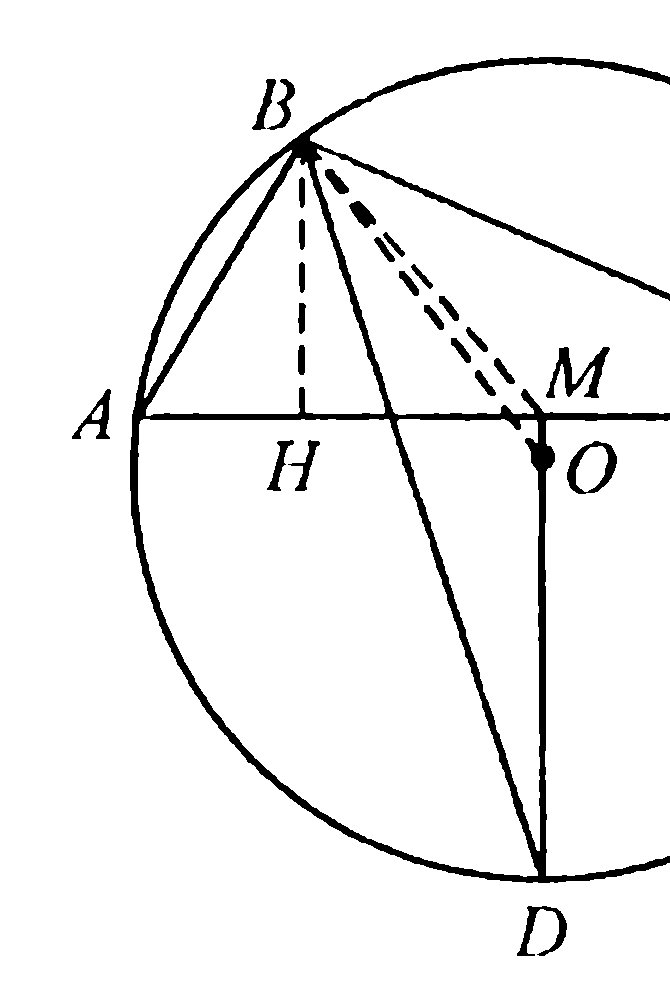

Прежде всего заметим, что из свойства 8.6X следует параллельность прямых $OD$ и $BH$ (так как $\cup AD = \cup DC$ и $AM = MC$, то $OM$ — серединный перпендикуляр к хорде $AC$), поэтому $\angle MDB = \angle HBD$.

Докажем теперь, что если $\angle ABC = 90^\circ$, то $\angle HBD = \angle DBM$. Действительно, поскольку $\angle ABC = 90^\circ$, то хорда $AC$ — диаметр окружности (в этом случае точки $O$ и $M$ совпадают) и, следовательно, $BM = MD = R$, где $R$ — радиус описанной окружности. Таким образом, треугольник $BMD$ — равнобедренный и поэтому с учетом того, что $\angle MDB = \angle HBD$, имеем равенства $\angle DBM = \angle MDB = \angle HBD$.

Пусть теперь, наоборот, $\angle HBD = \angle DBM$. Докажем, что в этом случае $\angle ABC = 90^\circ$. Действительно, поскольку $\angle DBM = \angle HBD = \angle MDB = \angle ODB$, а $OD = OB = R$, то $\angle ODB = \angle DBO$ и, значит, $\angle DBM = \angle ODB$. Но в таком случае точки $O$ и $M$ совпадают и, следовательно, $AC$ — диаметр окружности. Последнее и означает, что $\angle ABC = 90^\circ$.

---
**стр. 118**
---

**8.9.** *В треугольнике $ABC$ биссектриса, высота и медиана, проведенные из вершины $B$, делят угол $ABC$ на четыре равных угла. Найти углы треугольника $ABC$.*

**Решение.** Пусть $BM$, $BD$ и $BH$ — соответственно медиана, биссектриса и высота треугольника $ABC$ (рис. 8.16). По условию $\angle MBD = \angle DBH$, поэтому $\angle ABC = 90^\circ$ (задача 8.8) и, следовательно, $AC$ — диаметр описанной около треугольника $ABC$ окружности. Далее, поскольку $M$ — середина $AC$, то $AM = MC = MB$ и, значит, треугольник $MBA$ — равнобедренный. Обозначим $\angle CAB = \alpha$ и будем считать для определенности, что $\angle CAB < \angle BCA$. Тогда $\angle ABM = \alpha$, а поскольку по условию $\angle ABC = 4\alpha$, то $\alpha = 22,5^\circ$ и поэтому $\angle BCA = 90^\circ - \alpha = 67,5^\circ$.

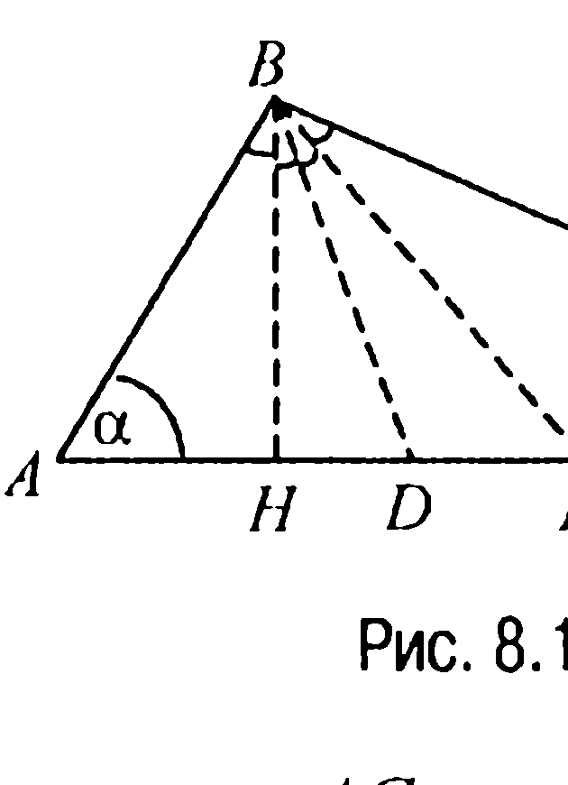

**Ответ:** $22,5^\circ; 67,5^\circ; 90^\circ$.

**8.10.** *Высота $BH$ и медиана $BD$ треугольника $ABC$ образуют равные углы со сторонами $AB$ и $BC$ соответственно. Найти радиус описанной около треугольника $ABC$ окружности, если медиана равна $m$.* <!-- вероятная опечатка оригинала: в условии медиана обозначена $BD$, в решении — $BM$ -->

**Решение.** Пусть $BH$, $BD$ и $BM$ — соответственно высота, биссектриса и медиана треугольника $ABC$ (рис. 8.17). По условию $\angle ABH = \angle MBC$, $\angle ABD = \angle DBC$, поэтому $\angle HBD = \angle ABD - \angle ABH = \angle DBC - \angle MBC = \angle DBM$. Таким образом, биссектриса треугольника делит пополам угол между медианой и высотой, а это означает, что $\angle ABC = 90^\circ$ (задача 8.8). Но в прямоугольном треугольнике медиана, проведенная из вершины прямого угла, равна радиусу описанной окружности и, следовательно, искомый радиус равен $m$.

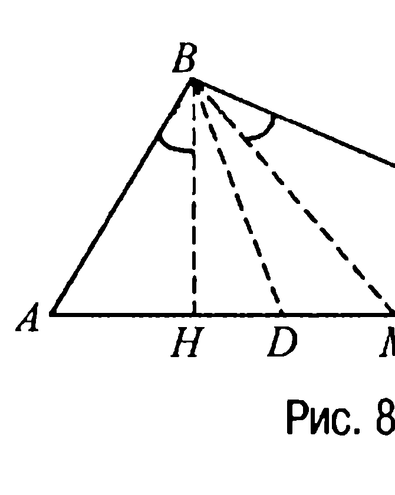

**Ответ:** $m$.

---
**стр. 119**
---

**8.11.** *Стороны $BC, AC$ и $AB$ треугольника $ABC$ равны $a, b$ и $c$ соответственно. Пусть $O$ — центр окружности, вписанной в этот треугольник, а $D$ — точка пересечения биссектрисы угла $CAB$ со стороной $BC$. Чему равны отрезки $BD$ и $DC$ и каково отношение отрезков $AO$ и $OD$?*

**Решение.** По свойству 8.3X точка $O$ лежит на биссектрисах углов $ABC$ и $CAB$ (рис. 8.18). Обозначим $BD = x$, тогда $DC = a - x$ и согласно свойству 8.7X из треугольника $ABC$ получаем, что

$$\frac{c}{b} = \frac{x}{a - x}, \text{ откуда } x = \frac{ac}{b + c}$$

и, значит, $a - x = a - \frac{ac}{b + c}$.

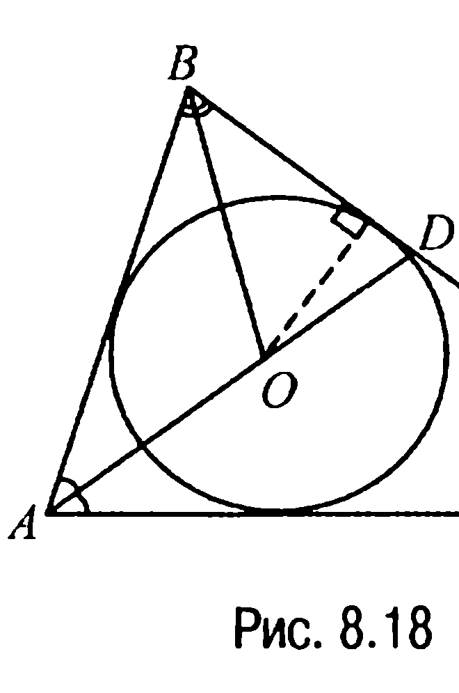

Если теперь рассмотреть треугольник $ABD$, то

$$\frac{c}{x} = \frac{AO}{OD} = \frac{c(b + c)}{ac} = \frac{b + c}{a}.$$

**Ответ:** $BD = \frac{ac}{b + c}$; $DC = a - \frac{ac}{b + c}$; $\frac{AO}{OD} = \frac{b + c}{a}$.

**8.12.** *Внутренняя и внешняя биссектрисы треугольника $ABC$, проведенные из вершины $B$, равны соответственно $l$ и $\mathcal{L}$. Найти площадь треугольника $ABC$, если $AB : BC = k$, где $k > 1$.*

**Решение.** Пусть $E$ — точка прямой $AB$, $H$ — высота треугольника $ABC$, $BD = l$ и $BF = \mathcal{L}$ — его внутренняя и внешняя биссектрисы соответственно (рис. 8.19). Тогда по свойству 8.5X $\angle DBF = 90^\circ$ и, значит, треугольник $DBF$ — прямоугольный. Площадь этого треугольника

$$S = \frac{1}{2} BD \cdot BF = \frac{1}{2} l \cdot \mathcal{L}.$$

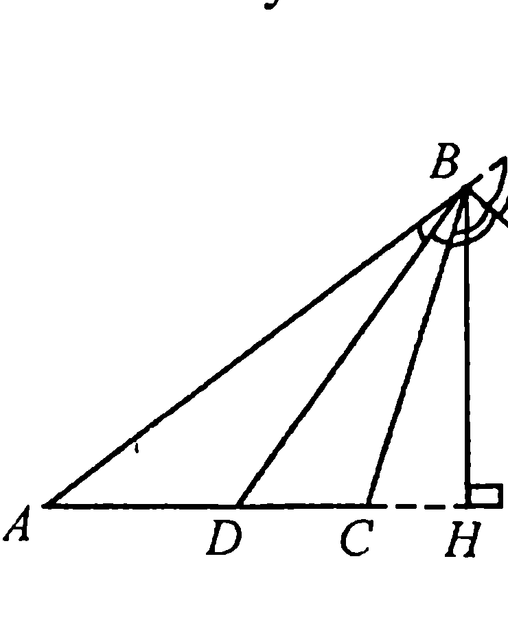

---
**стр. 120**
---

С другой стороны, $S = \frac{1}{2} DF \cdot BH$. Замечая теперь, что площадь треугольника $ABC$ вычисляется по формуле $S^* = \frac{1}{2} AC \cdot BH$, приходим к выводу, что $\frac{S^*}{S} = \frac{AC}{DF}$, откуда $S^* = \frac{AC}{DF} \cdot S = \frac{1}{2} \frac{AC}{DF} l \cdot \mathcal{L}$.

Итак, задача свелась к нахождению отношения $AC/DF$. Найдем $AC/DF$. Из условия задачи и на основании свойства 8.7X справедливы равенства $\frac{AB}{BC} = \frac{AD}{DC} = k$, поэтому $\frac{AD + DC}{DC} = \frac{AC}{DC} = k + 1$ или $\frac{DC}{AC} = \frac{1}{k + 1}$.

Далее, по свойству 8.8X имеем $\frac{AF}{CF} = \frac{AB}{BC} = k$ и, следовательно, $\frac{AC}{CF} = \frac{AF - CF}{CF} = k - 1$ или $\frac{CF}{AC} = \frac{1}{k - 1}$.

Таким образом, $\frac{DF}{AC} = \frac{DC + CF}{AC} = \frac{1}{k + 1} + \frac{1}{k - 1} = \frac{2k}{k^2 - 1}$ и, значит, $S^* = \frac{k^2 - 1}{4k} l \cdot \mathcal{L}$.

**Ответ:** $\frac{k^2 - 1}{4k} l \cdot \mathcal{L}$.

**ЗАДАЧИ ДЛЯ САМОСТОЯТЕЛЬНОГО РЕШЕНИЯ**

**8.1С.** *Доказать, что квадрат внешней биссектрисы треугольника равен разности между произведением отрезков от точки пересечения биссектрисы с продолжением противолежащей вершине угла стороны до концов этой стороны и произведением прилежащих сторон.*

**8.2С.** *Доказать, что если $\mathcal{L}_a, \mathcal{L}_b, \mathcal{L}_c$ — внешние биссектрисы треугольника $ABC$ со сторонами $BC = a, AC = b$,

---
**стр. 121**
---

$AB = c$, то справедливы равенства

$$\mathcal{L}_a^2 = bc \left( \frac{a^2}{(b-c)^2} - 1 \right), \quad \mathcal{L}_b^2 = ac \left( \frac{b^2}{(a-c)^2} - 1 \right), \quad \mathcal{L}_c^2 = ab \left( \frac{c^2}{(a-b)^2} - 1 \right).$$

**8.3С.** *Две стороны треугольника равны $a$ и $b$ ($a \neq b$), угол между ними $\varphi$. Доказать, что внешняя биссектриса треугольника, заключенная между одной из этих сторон и продолжением другой, равна $2ab \frac{\sin \frac{\varphi}{2}}{|b - a|}$.*

**8.4С.** *В треугольнике $ABC$ проведены биссектрисы $AM$ и $CN$. Может ли быть $BM = \frac{BC}{3}$, а $BN = \frac{2AB}{7}$?*

**8.5С.** *Биссектрисы $AK$ и $CL$ треугольника $ABC$ пересекаются в точке $O$. Может ли быть, что $BK : KC = 1 : 2$, а $LO : OC = 2 : 3$?*

**8.6С.** *В треугольнике $ABC$ проведены биссектрисы $AK$ и $CL$. Прямые $LK$ и $AC$ пересекаются в точке $M$. Найти $AM$, если $AB = 2, BC = 5, AC = 6$.*

**8.7С.** *В окружность вписан шестиугольник $ABCDEF$, у которого $AB = BC, CD = DE, EF = FA$. Доказать, что диагонали $AD, EB$ и $CF$ этого шестиугольника пересекаются в одной точке.*

**8.8С.** *Прямая, проходящая через вершину $B$ треугольника $ABC$ и внутреннюю точку $K$ стороны $AC$, симметрична относительно прямой, на которой лежит биссектриса $BD$ треугольника, прямой, содержащей медиану $BM$. Доказать, что $AK : KC = AB^2 : BC^2$.*

**8.9С.** *В треугольнике с отношением сторон $3 : 4 : 6$ соединены основания биссектрис. Найти отношение площади данного треугольника к площади треугольника, образовавшегося в результате соединения оснований биссектрис.*

**8.10С.** *Пусть $D$ — произвольная, лежащая на описанной около треугольника $ABC$ окружности точка, отличная
