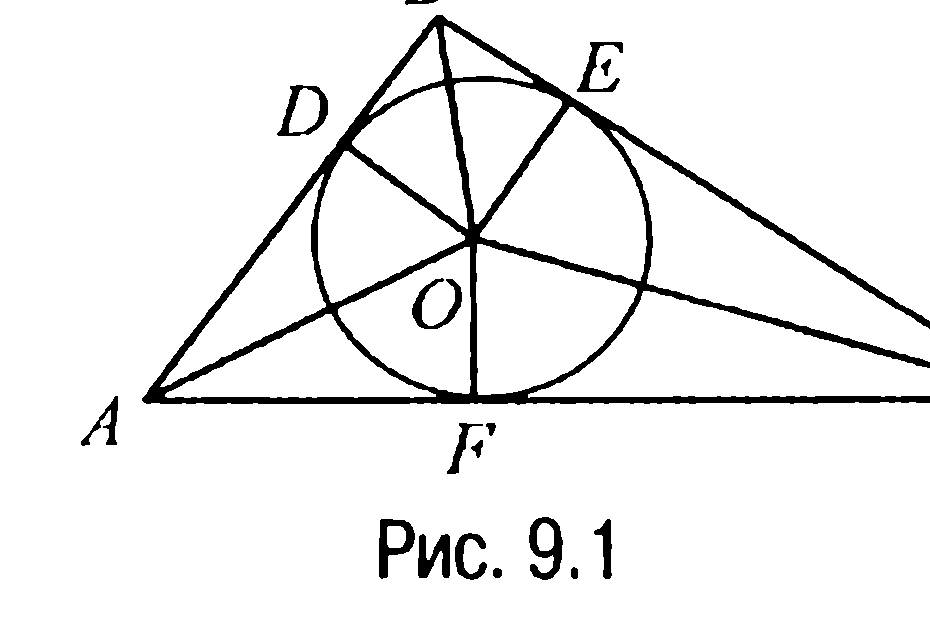
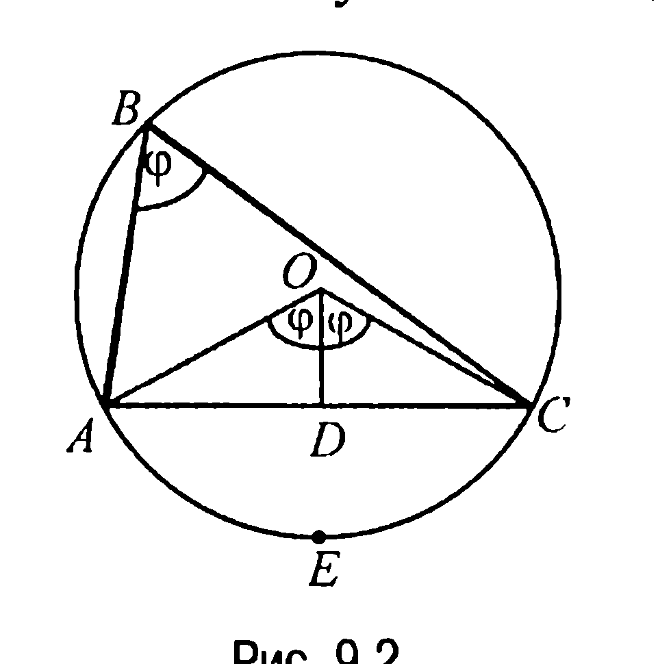
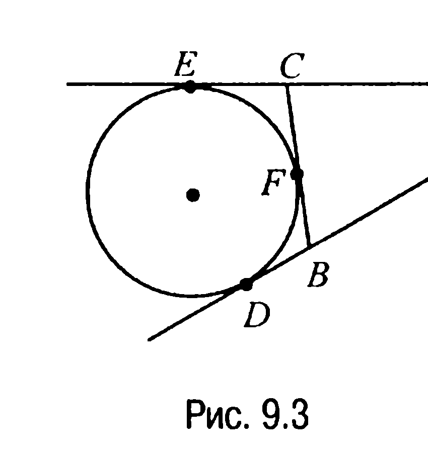
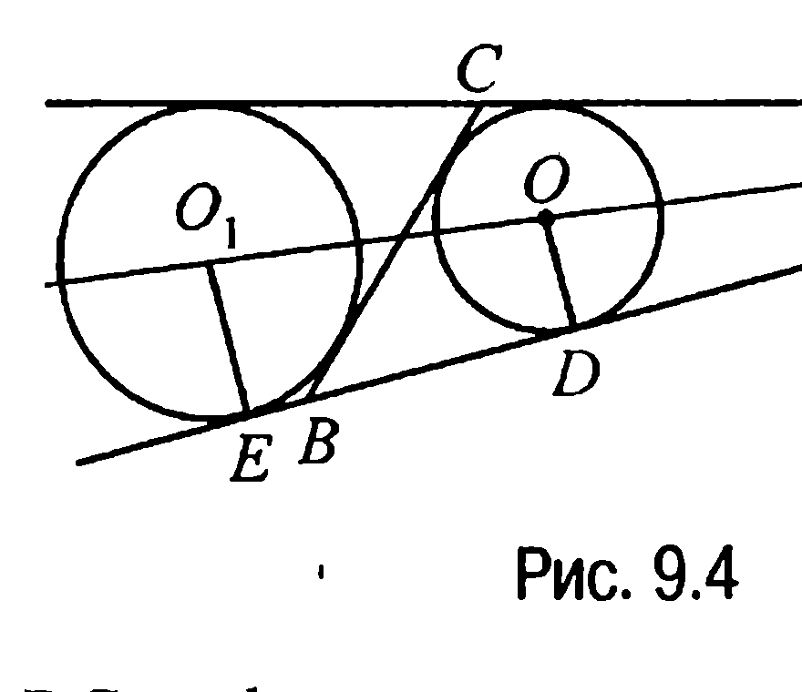
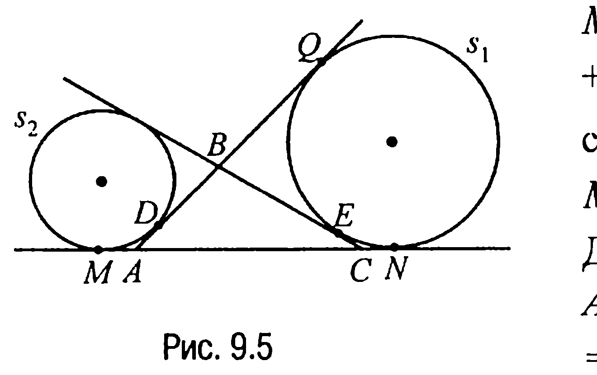
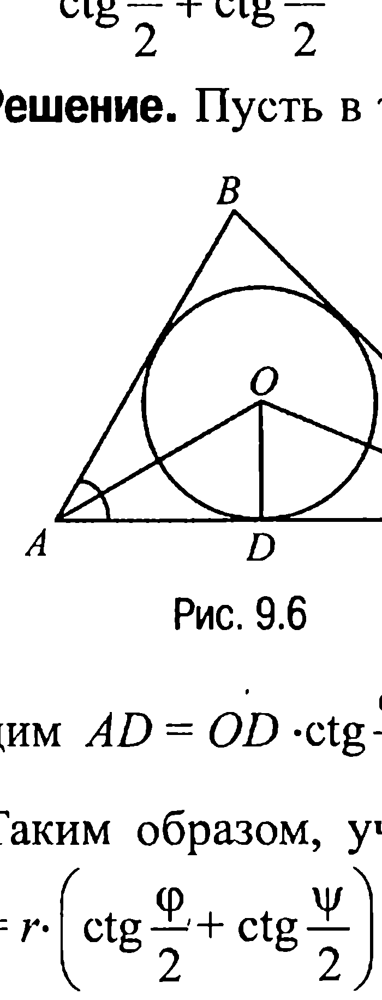
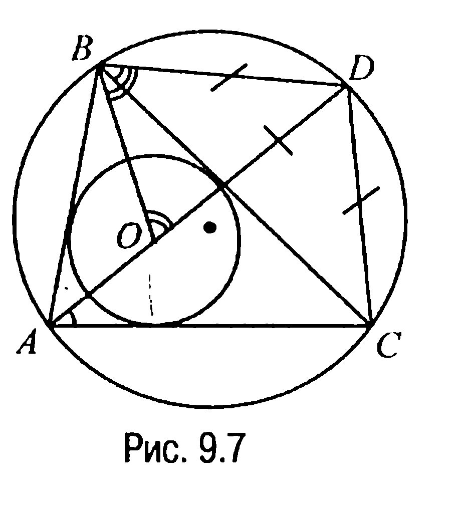

## 1.9. Треугольник. Вписанные, описанные и вневписанные окружности

---
**стр. 122**
---

от точек $A, B, C$. Доказать, что отрезки, симметричные отрезкам $AD, BD$ и $DC$ относительно биссектрис углов $CAB, ABC$ и $BCA$ соответственно, параллельны.*

**8.11С.** *Пусть $AA_1, BB_1$ и $CC_1$ — биссектрисы треугольника $ABC$, $L$ — точка пересечения прямых $AA_1$ и $B_1C_1$, $K$ — точка пересечения прямых $A_1B_1$ и $CC_1$. Доказать, что луч $BB_1$ является биссектрисой угла $LBK$.*

**§ 9. ТРЕУГОЛЬНИК. ВПИСАННЫЕ, ОПИСАННЫЕ И ВНЕВПИСАННЫЕ ОКРУЖНОСТИ**

***Вписанная в треугольник окружность*** — *это окружность, которая касается всех сторон треугольника.*

***Описанная около треугольника окружность*** — *это окружность, которая проходит через все вершины треугольника.*

***Вневписанная окружность треугольника*** — *это окружность, которая касается одной стороны и продолжений двух других сторон треугольника.*

Из характеристичности свойства 8.3X, следствия 7.1X, а также свойства 8.4 следует, что:

**Центр вписанной в треугольник окружности** — *это точка пересечения биссектрис треугольника.*

**Центр описанной около треугольника окружности** — *это точка пересечения серединных к сторонам треугольника перпендикуляров.*

**Центр вневписанной окружности треугольника** — *это точка пересечения проходящих через вершины треугольника трех прямых, на двух из которых лежат биссектрисы внешних углов, а на третьей — биссектриса внутреннего угла треугольника.*

---
**стр. 123**
---

**ЗАДАЧИ**

▼ **9.1.** *Доказать, что если $p$ и $S$ — соответственно полупериметр и площадь треугольника, то радиус $r$ вписанной в треугольник окружности находится по формуле $r = S/p$.*

**Решение.** Пусть $O$ — центр вписанной в треугольник $ABC$ окружности радиуса $r$, которая касается сторон треугольника $AB=c$, $BC=a$ и $AC=b$ в точках $D$, $E$ и $F$ соответственно (рис. 9.1).

Тогда замечая, что радиус $r$ равен высотам $OD$, $OE$ и $OF$ треугольников $AOB$, $BOC$ и $AOC$ с площадями $S_1$, $S_2$ и $S_3$ соответственно, имеем: $S_1 = \frac{1}{2}cr$, $S_2 = \frac{1}{2}ar$, $S_3 = \frac{1}{2}br$.

Отсюда $S = S_1 + S_2 + S_3 = r\frac{a+b+c}{2} = rp$ и, значит, $r = S/p$, а это и требовалось доказать.

▼ **9.2.** *Вписанная в треугольник $ABC$ окружность касается сторон треугольника $AB=c$, $BC=a$ и $AC=b$ в точках $D$, $E$ и $F$ соответственно. Доказать, что если $p$ — полупериметр треугольника $ABC$, то $AD=p-a$, $BE=p-b$, $CF=p-c$.*

**Решение.** Докажем первое из приведенных равенств. Справедливость двух остальных из них доказывается аналогично.

Итак, по свойству 5.2 имеют место равенства $AD=AF$, $BD=BE$, $CE=CF$ (рис. 9.1). Поэтому $p = AD+BE+EC = AD+BC = AD+a$, откуда и следует требуемое.

▼ **9.3.** *Доказать, что если $p$ — полупериметр, $d$ — одна из сторон, $\varphi$ — противолежащий этой стороне угол треугольника, то радиус $r$ вписанной в треугольник окружности находится по формуле $r = (p-d)\operatorname{tg}\frac{\varphi}{2}$.*

**Решение.** Пусть для определенности кроме полупериметра $p$ известны сторона $BC=d$ и противолежащий ей угол $\varphi$ при верши-

---
**стр. 124**
---

не $A$ треугольника $ABC$ (рис. 9.1). Тогда $AD = p-d$ (задача 9.2), где $D$ — точка касания вписанной в треугольник $ABC$ окружности со стороной $BC$. Точка $O$, как центр вписанной окружности, лежит на биссектрисе угла $CAB$ и поэтому $\angle OAD = \varphi/2$.

Таким образом, в прямоугольном треугольнике $ADO$ катет $OD = AD \cdot \operatorname{tg}\frac{\varphi}{2}$ или $r = (p-d) \cdot \operatorname{tg}\frac{\varphi}{2}$, а это и требовалось доказать.

▼ **9.4.** *Доказать, что если $d$ — одна из сторон, $\varphi$ — противолежащий этой стороне угол треугольника, то радиус $R$ описанной около треугольника окружности находится по формуле*

$$R = \frac{d}{2\sin\varphi}.$$

**Решение.** Пусть $O$ — центр описанной около треугольника $ABC$ окружности и пусть для определенности $AC = d$, $D$ — середина отрезка $AC$, $E$ — точка окружности и $\angle ABC = \varphi$ (рис. 9.2).

Тогда поскольку $\angle ABC$ — вписанный, то дуга $AEC$ измеряется углом $2\varphi$, что, в свою очередь, означает, что центральный угол $AOC$ равен $2\varphi$, а его половина — $\angle DOC = \varphi$. С учетом этого из прямоугольного треугольника $CDO$ находим $DC = R\sin\varphi$, где $R = OC$. Но так как $DC = d/2$, то $d/2 = R\sin\varphi$ или $R = \frac{d}{2\sin\varphi}$, что и требовалось доказать.

▼ **9.5.** *Доказать, что если $a$, $b$, $c$ и $S$ — соответственно стороны и площадь треугольника, то радиус $R$ описанной около треугольника окружности находится по формуле*

$$R = \frac{a \cdot b \cdot c}{4S}.$$

**Решение.** Пусть в треугольнике $ABC$ стороны $AC = b$, $AB = c$, $BC = a$, $\angle ABC = \varphi$ (рис. 9.2). Тогда (задача 9.4)

---
**стр. 125**
---

$R = \frac{b}{2\sin\varphi} = \frac{abc}{2ac\sin\varphi} = \frac{abc}{4 \cdot \frac{1}{2}ac\sin\varphi} = \frac{abc}{4S}$, что и требовалось доказать.

**9.6.** *Вневписанная окружность треугольника $ABC$ касается продолжения его стороны $AB$ в точке $D$. Доказать, что если $p$ — полупериметр треугольника $ABC$, то $AD = p$.*

**Решение.** Пусть $E$ и $F$ — точки касания вневписанной окружности треугольника $ABC$ с продолжением его стороны $AC$ и со стороной $CB$ соответственно (рис. 9.3).

Тогда по свойству 5.2 отрезок $AD = AE$, $BD = BF$, $CE = CF$ и, таким образом,

$AD = \frac{1}{2}(AD + AE) = \frac{1}{2}(AB + BD + AC + CE) = \frac{1}{2}(AB + BF + AC + CF) = \frac{1}{2}(AB + BC + AC) = p$, что и требовалось доказать.

▼ **9.7.** *Доказать, что если $S$ — площадь, $p$ — полупериметр, $d$ — сторона треугольника, которой касается вневписанная окружность, то радиус $\rho$ этой окружности находится по формуле $\rho = S/(p-d)$.*

**Решение.** Пусть $O$ — центр вписанной в треугольник $ABC$ окружности, касающейся стороны $AB$ в точке $D$, $O_1$ — центр вневписанной окружности треугольника $ABC$, касающейся для определенности стороны $BC = d$ и продолжения стороны $AB$ в точке $E$ (рис. 9.4).

В силу характеристичности свойства 8.11 точки $O$ и $O_1$ лежат на одном луче — биссектрисе угла $CAB$. Поэтому поскольку

---
**стр. 126**
---

$OD \perp AD$, $O_1E \perp AE$ (свойство 5.1X), то прямоугольные треугольники $AOD$ и $AO_1E$ подобны и, значит, $\frac{AE}{O_1E} = \frac{AD}{OD}$. Но $O_1E = \rho$, $AD = p - d$ (задача 9.2), $AE = p$ (задача 9.6) и, следовательно, полученную пропорцию можно переписать в виде $\frac{p}{\rho} = \frac{p - d}{r}$, где $r$ — радиус окружности, вписанной в треугольник $ABC$. Отсюда $\rho = \frac{pr}{p - d}$ или (задача 9.1) $\rho = \frac{S}{p - d}$, что и требовалось доказать.

▼ **9.8.** *Доказать, что если $p$ — полупериметр, $\varphi$ — угол, противолежащий стороне треугольника, которой касается вневписанная окружность, то радиус $\rho$ этой окружности находится по формуле $\rho = p \cdot \text{tg} \frac{\varphi}{2}$.*

**Решение.** Пусть для определенности вневписанная окружность касается стороны $BC$ треугольника $ABC$ (рис. 9.4). Тогда по условию $\angle CAB = \varphi$ и, значит, $\angle O_1AE = \frac{\varphi}{2}$, так как центр $O_1$ вневписанной окружности лежит на биссектрисе угла $CAB$. Но в таком случае в прямоугольном треугольнике $AEO_1$ катет $O_1E = AE \cdot \text{tg} \frac{\varphi}{2}$ или что $\rho = p \cdot \text{tg} \frac{\varphi}{2}$, поскольку $O_1E = \rho$ (свойство 5.1X), а $AE = p$ (задача 9.6).

▼ **9.9.** *Вневписанная окружность $s_1$ треугольника $ABC$ со сторонами $AB = c$, $BC = a$, $AC = b$ касается продолжения стороны $AB$, стороны $BC$ и продолжения стороны $AC$ в точках $Q$, $E$ и $N$ соответственно. Вневписанная окружность $s_2$ того же треугольника $ABC$ касается стороны $AB$ и продолжения стороны $AC$ в точках $D$ и $M$ соответственно. Доказать, что отрезки $DQ$ и $MN$ внутренней и внешней касательных окружностей $s_1$ и $s_2$ определяются равенствами $DQ = b$, $MN = a + c$.*

**Решение.** Обозначим $MA = AD = c_1$, $DB = c_2$, $BQ = BE = a_1$, $CE = CN = a_2$ (рис. 9.5). Тогда

---
**стр. 127**
---

$MN = MA + AC + CN = c_1 + a_2 + b$, $DQ = DB + BQ = c_2 + a_1$ и, следовательно, $MN + DQ = a + b + c$. Далее, $AQ = AD + DQ = c_1 + DQ = AN = AC + CN = b + a_2 = MC = MA + AC = c_1 + b = p$ (задача 9.6) и, таким образом, $DQ = b$, а значит, $MN = a + c$, что и требовалось доказать.

**9.10.** *Доказать, что если $d$ — одна из сторон треугольника, $\varphi$ и $\psi$ — прилежащие к ней углы, то радиус $r$ вписанной в треугольник окружности находится по формуле*

$$r = \frac{d}{\text{ctg} \frac{\varphi}{2} + \text{ctg} \frac{\psi}{2}} = d \cdot \frac{\sin \frac{\varphi}{2} \sin \frac{\psi}{2}}{\sin \frac{\varphi + \psi}{2}}.$$

**Решение.** Пусть в треугольнике $ABC$ для определенности $AC = d$, $\angle CAB = \varphi$, $\angle BCA = \psi$. Обозначим через $O$ — центр вписанной в треугольник окружности, а через $D$ — точку касания этой окружности со стороной $AC$ (рис. 9.6). Тогда так как лучи $AO$ и $CO$ — биссектрисы углов $CAB$ и $BCA$ соответственно, то из прямоугольных треугольников $ODA$ и $ODC$ находим

$AD = OD \cdot \text{ctg} \frac{\varphi}{2}$, $DC = OD \cdot \text{ctg} \frac{\psi}{2}$.

Таким образом, учитывая, что $OD = r$, имеем $d = AD + DC = r \cdot \left(\text{ctg} \frac{\varphi}{2} + \text{ctg} \frac{\psi}{2}\right)$.

Отсюда, с учетом формулы преобразования суммы котангенсов в произведение, окончательно получаем

---
**стр. 128**
---

$$r = \frac{d}{\text{ctg} \frac{\varphi}{2} + \text{ctg} \frac{\psi}{2}} = d \cdot \frac{\sin \frac{\varphi}{2} \sin \frac{\psi}{2}}{\sin \frac{\varphi + \psi}{2}}, \text{ что и требовалось доказать.}$$

▼ **9.11 (Задача о трилистнике).** *В треугольник $ABC$ вписана окружность с центром $O$. Биссектриса угла $CAB$ треугольника пересекает описанную около него окружность в точке $D$. Доказать, что $BD = DC = OD$.*

**Решение.** Так как $BO$ и $AO$ — биссектрисы углов треугольника $ABC$ (рис. 9.7), то внешний для треугольника $BOA$ угол $DOB$ равен $\angle ABO + \angle OAB = \frac{1}{2}(\angle ABC + \angle CAB)$. Теперь учитывая, что $\angle CBD = \angle CAD = \frac{1}{2}\cup CD$ (свойство 4.6) и, таким образом, $\angle OBD = \angle CBD + \angle OBC = \angle CAD + \angle OBC = \frac{1}{2}(\angle CAB + \angle ABC)$, приходим к выводу, что $\angle DOB = \angle OBD$ и, значит, треугольник $BDO$ — равнобедренный. Последнее означает, в частности, что $BD = OD$. По свойству же 8.6X точка $D$ лежит на серединном к отрезку $BC$ перпендикуляре и, следовательно, $BD = DC$. А это и доказывает требуемое.

**9.12.** *Дан треугольник со сторонами $a$, $b$ и $c$. Доказать, что если $r$ — радиус окружности, вписанной в данный треугольник, $R$ — радиус описанной около него окружности, $r_a$, $r_b$ и $r_c$ — радиусы вневписанных окружностей, касающихся соответственно сторон $a$, $b$ и $c$ и продолжений двух других сторон треугольника, то $r_a + r_b + r_c = 4R + r$.*

**Решение.** Используя формулу, доказанную в задаче 9.7, а также формулу Герона, имеем:

---
**стр. 129**
---

$r_a = \dfrac{S}{p-a} = \dfrac{\sqrt{p(p-a)(p-b)(p-c)}}{p-a} = \dfrac{p(p-b)(p-c)}{S}$. Аналогично,
$r_b = \dfrac{p(p-a)(p-c)}{S}$, $r_c = \dfrac{p(p-a)(p-b)}{S}$. По теореме 17.8 радиус
$r = \dfrac{S}{p} = \dfrac{(p-a)(p-b)(p-c)}{S}$. Но в таком случае $r_a + r_b = \dfrac{p(p-c)c}{S}$,
$r_c - r = \dfrac{(p-a)(p-b)c}{S}$ и, следовательно,
$r_a + r_b + r_c - r = \dfrac{((p-b)(p-a) + p(p-c))c}{S} = \dfrac{abc}{S} = 4R$,
откуда и следует требуемое.

**9.13.** Доказать, что если $r$ и $r_a, r_b, r_c$ — радиусы вписанной в треугольник окружности и вневписанных окружностей соответственно, то $\dfrac{1}{r} = \dfrac{1}{r_a} + \dfrac{1}{r_b} + \dfrac{1}{r_c}$.

**Решение.** Так как $\dfrac{1}{r} = \dfrac{p}{S}$ (задача 9.1), а $\dfrac{1}{r_a} = \dfrac{p-a}{S}$, $\dfrac{1}{r_b} = \dfrac{p-b}{S}$,
$\dfrac{1}{r_c} = \dfrac{p-c}{S}$ (задача 9.7), то $\dfrac{1}{r_a} + \dfrac{1}{r_b} + \dfrac{1}{r_c} = \dfrac{p-a+p-b+p-c}{S} = \dfrac{p}{S} =$
$= \dfrac{1}{r}$, что и доказывает требуемое.

**9.14.** Доказать, что если $O, R$ и $I$ — центр, радиус описанной около треугольника окружности и центр вписанной в него окружности, $I_a, I_b, I_c$ — центры вневписанных окружностей, а $d = OI, d_a = OI_a, d_b = OI_b, d_c = OI_c$, то $d^2 + d_a^2 + d_b^2 + d_c^2 = 12R^2$.

**Решение.** Поскольку $d^2 = R^2 - 2rR$, $d_a^2 = R^2 + 2r_a \cdot R$, $d_b^2 =$
$= R^2 + 2r_b R$, $d_c^2 = R^2 + 2r_c R$ (задача 9.5С), то имея ввиду задачу 9.12, получаем $d^2 + d_a^2 + d_b^2 + d_c^2 = 4R^2 + 2R(r_a + r_b + r_c) - 2rR =$
$= 4R^2 + 2R(4R + r) - 2rR = 12R^2$, что и требовалось доказать.

---
**стр. 130**
---

**ЗАДАЧИ ДЛЯ САМОСТОЯТЕЛЬНОГО РЕШЕНИЯ**

**9.1С.** *В треугольник $ABC$ вписана окружность с центром $O$, которая касается стороны $BC$ в точке $D$. Найти площадь треугольника $BDO$, если периметр треугольника $ABC$ равен $2p$, $AC = b$ и $\angle ABC = \beta$.*

**9.2С.** *В треугольник $ABC$ вписана окружность радиуса $r$. Доказать, что площадь треугольника, вершинами которого являются точки касания вписанной окружности со сторонами треугольника $ABC$, относится к площади треугольника $ABC$ как $r : 2R$, где $R$ — радиус окружности, описанной около исходного треугольника.*

**9.3С.** *Доказать, что отрезок, соединяющий центры вписанной и вневписанной окружностей треугольника, делится описанной около треугольника окружностью пополам.*

**9.4С.** *Вершины треугольника делят описанную около него окружность на три дуги. Доказать, что три окружности, каждая из которых имеет центром середину одной из этих дуг и проходит через две вершины треугольника, имеют общую точку.*

$\blacktriangledown$ **9.5С.** *Пусть $O, O_1, O_2$ и $r, R, \rho$ — соответственно центры и радиусы вписанной, описанной и какой-либо вневписанной окружностей произвольного треугольника. Доказать, что*
*а) $OO_1^2 = R^2 - 2rR$ (формула Эйлера);*
*б) $O_1O_2^2 = R^2 + 2\rho R$;*
*в) $OO_2^2 = R(\rho - r)$.*

**9.6С.** *На прямой $l$ отмечены две точки $A$ и $B$. Найти множество точек касания окружностей, которые, касаясь друг друга, касаются прямой $l$ в точках $A$ и $B$.*
