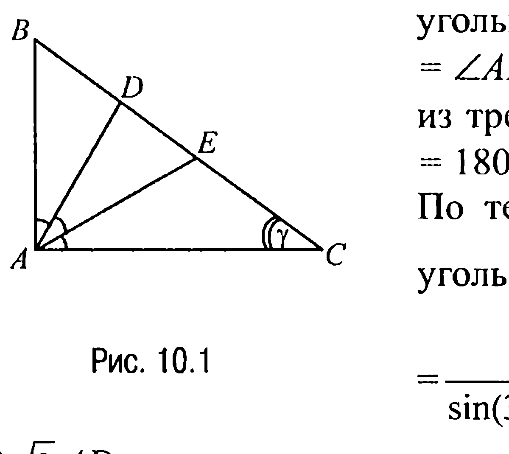
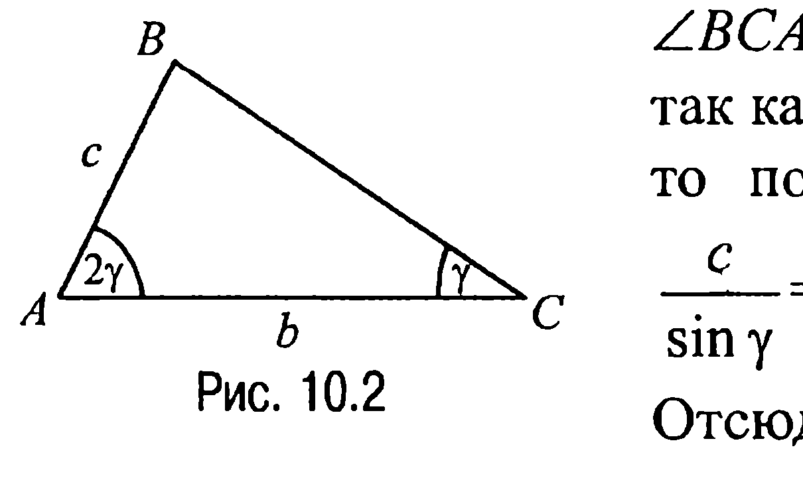
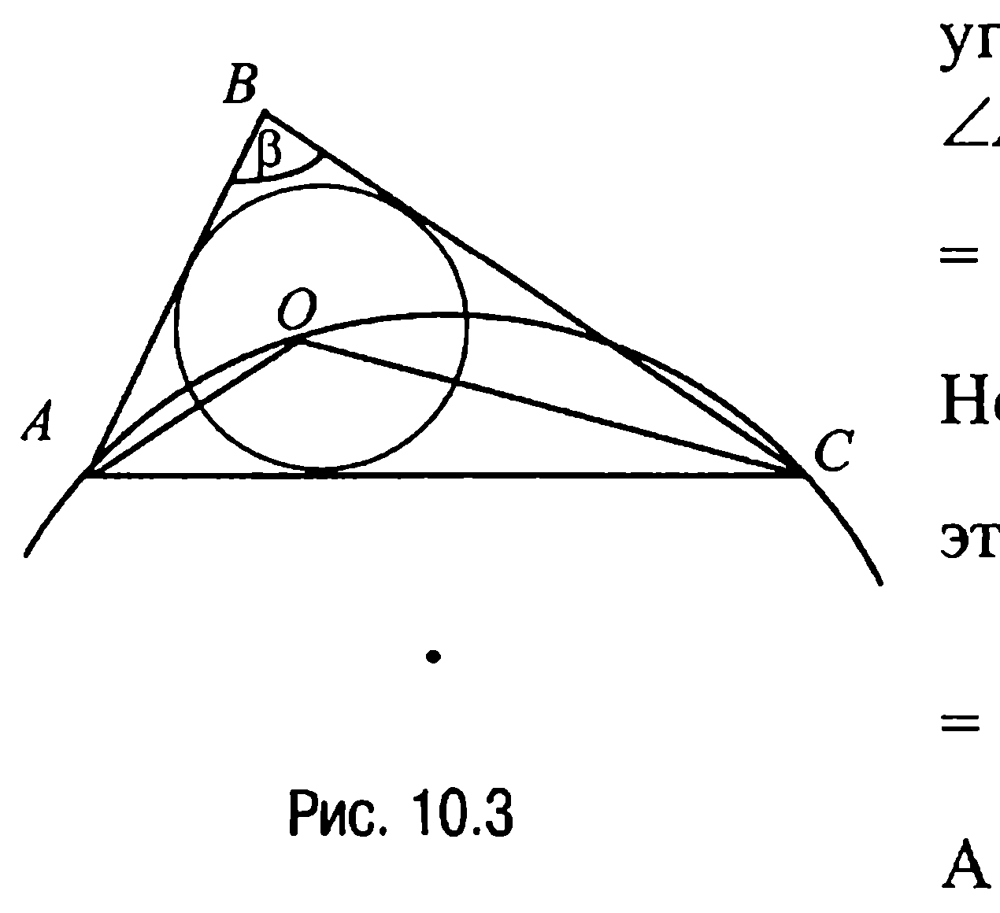
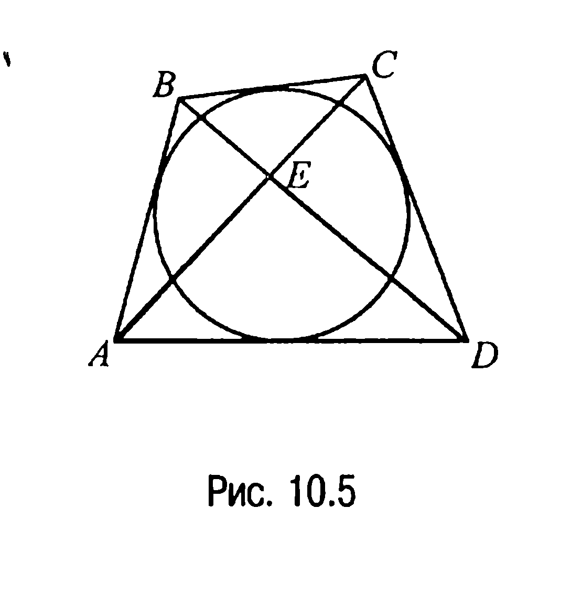
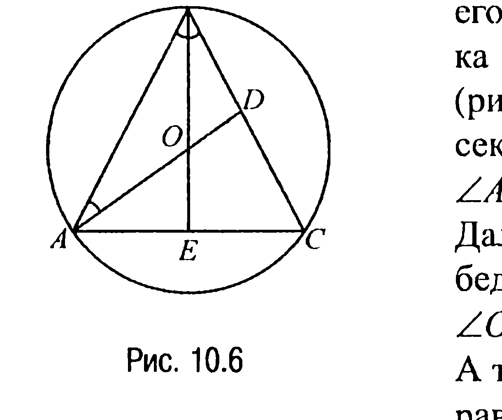
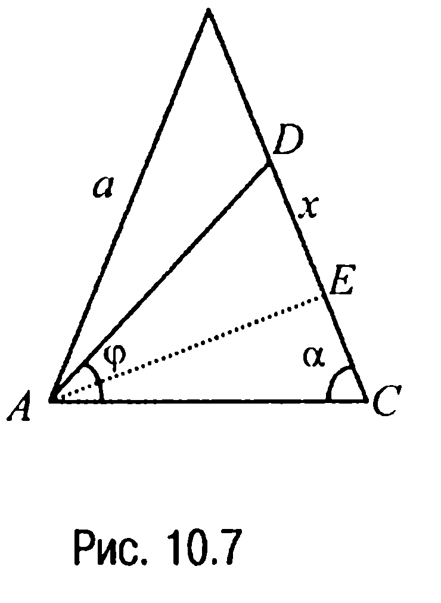
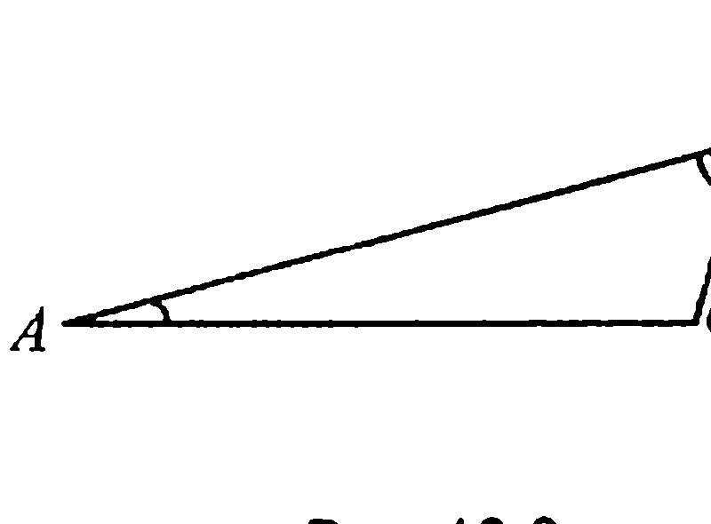
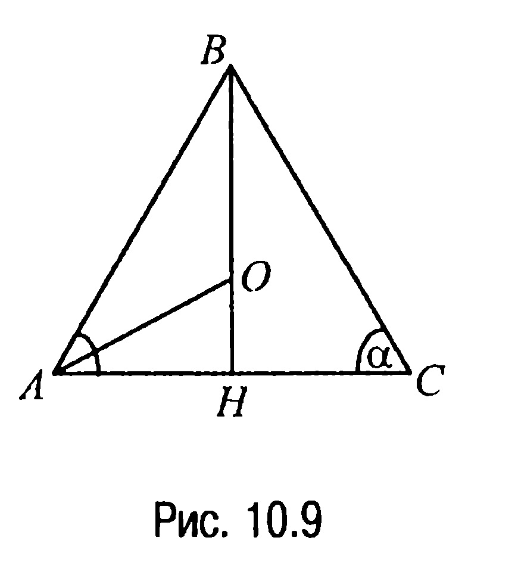
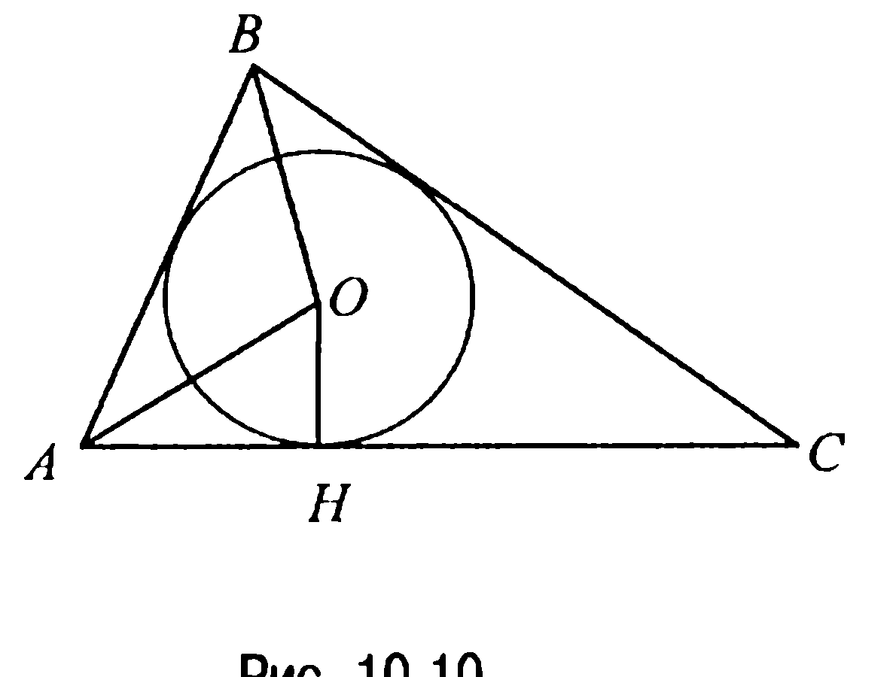
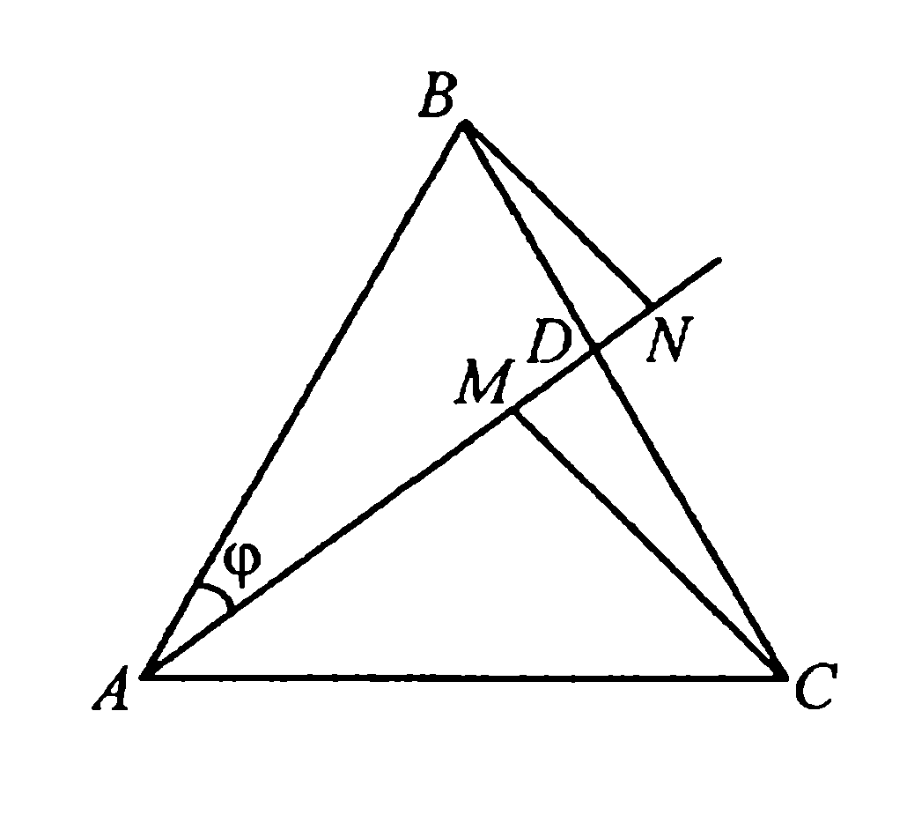

## 1.10. Теорема синусов

---
**стр. 131**
---

**9.7С.** *В четырехугольнике $ABCD$ стороны $AD$ и $CD$ равны, $AB = a$, $BC = b$. Окружности, вписанные в треугольники $ABD$ и $BCD$, касаются $BD$ в точках $E$ и $F$. Найти $EF$.*

**9.8С.** *Зная стороны $a, b, c$ треугольника $ABC$, найти отрезки, соединяющие точки $D, E, F$, в которых стороны треугольника касаются вписанной в него окружности.*

**9.9С.** *Окружность, вписанная в треугольник $ABC$, касается его сторон $AB, BC$ и $CA$ в точках $D, E$ и $F$ соответственно. Через точку $E$ проведен диаметр окружности $GF$. Известно, что $\angle CGB = 90^\circ$, $BC = a$. Найти отрезок $AD$.*

**9.10С.** *Три окружности радиуса $r$, имеющие одну общую точку, расположены так, что каждая из них касается двух сторон треугольника. Радиус описанной около этого треугольника окружности равен $R$. Найти радиус $\rho$ вписанной в него окружности.*

**§ 10. ТЕОРЕМА СИНУСОВ**

Для всякого треугольника $ABC$ со сторонами $BC = a, CA = b, AB = c$ и $\angle CAB = \alpha, \angle ABC = \beta, \angle BCA = \gamma$ имеют место:

**Теорема синусов.** *Стороны треугольника пропорциональны синусам противолежащих углов, т. е.*

$$\frac{a}{\sin \alpha} = \frac{b}{\sin \beta} = \frac{c}{\sin \gamma}.$$

**Расширенная теорема синусов.** *Отношение любой стороны треугольника к синусу противолежащего ей угла равно $2R$, где $R$ — радиус окружности, описанной около треугольника, т. е.:*

$$\frac{a}{\sin \alpha} = \frac{b}{\sin \beta} = \frac{c}{\sin \gamma} = 2R.$$

В учебной и методической литературе нередко первую из приведенных теорем не выделяют и под теоремой синусов понимают расширенную теорему синусов (см. задачу 9.4).

---
**стр. 132**
---

**ЗАДАЧИ**

**10.1.** *В прямоугольном треугольнике $ABC$ на гипотенузе $BC$ отмечены точки $D$ и $E$ таким образом, что углы $CAE$, $EAD$ и $DAB$ равны между собой. Найти угол $BCA$, если известно, что $4AE = 3\sqrt{3} AD$.*

**Решение.** Из условия задачи следует (рис. 10.1), что углы $CAE$, $EAD$ и $DAB$ равны $30^\circ$.

Тогда из треугольника $ADC$ находим, что $\angle ADC = \angle ADE = 180^\circ - (60^\circ + \gamma) = 120^\circ - \gamma$, а из треугольника $DEA$ — что $\angle DEA = 180^\circ - (120^\circ - \gamma + 30^\circ) = 30^\circ + \gamma$. По теореме синусов из того же треугольника $DEA$ имеем $\frac{AE}{\sin(120^\circ - \gamma)} = \frac{AD}{\sin(30^\circ + \gamma)}$. Но по условию $4AE = 3\sqrt{3} AD$, поэтому для нахождения угла $\gamma$ получаем уравнение $4\sin(120^\circ - \gamma) = 3\sqrt{3} \sin(30^\circ + \gamma)$, которое в соответствии с теоремой сложения для синуса приводится к виду $5\sin\gamma = \sqrt{3} \cos\gamma$ или к виду $\text{tg}\gamma = \frac{\sqrt{3}}{5}$, откуда $\gamma = \text{arctg}\frac{\sqrt{3}}{5}$.

**Ответ:** $\angle BCA = \text{arctg}\frac{\sqrt{3}}{5}$.

**10.2.** *В треугольнике $ABC$ угол $CAB$ в два раза больше угла $BCA$, $AB = c$, $AC = b$. Найти сторону $BC$, а также радиус описанной около треугольника окружности.*

**Решение.** В силу вышепринятых обозначений и условия задачи $\angle BCA = \gamma$, $\angle CAB = 2\gamma$ (рис. 10.2), а так как $\sin(180^\circ - 3\gamma) = \sin3\gamma$, то по расширенной теореме синусов

$$\frac{c}{\sin\gamma} = \frac{b}{\sin3\gamma} = \frac{BC}{\sin2\gamma} = 2R.$$

Отсюда, в частности,

---
**стр. 133**
---

$\frac{b}{c} = \frac{\sin 3\gamma}{\sin \gamma} = \frac{\sin(\gamma + 2\gamma)}{\sin \gamma} = \frac{\sin \gamma \cos 2\gamma + \cos \gamma \sin 2\gamma}{\sin \gamma} =$
$= \frac{\sin \gamma (\cos^2 \gamma - \sin^2 \gamma) + 2 \sin \gamma \cos \gamma \cos \gamma}{\sin \gamma} = \frac{\sin \gamma (3 \cos^2 \gamma - \sin^2 \gamma)}{\sin \gamma} =$
$= 4\cos^2 \gamma - 1$ или $\cos \gamma = \frac{1}{2} \sqrt{\frac{b+c}{c}}$. Из равенства же $\frac{c}{\sin \gamma} = \frac{BC}{\sin 2\gamma}$ следует, что $BC = c \frac{\sin 2\gamma}{\sin \gamma} = c \frac{2 \sin \gamma \cos \gamma}{\sin \gamma} = 2c \cdot \cos \gamma = \sqrt{c(b+c)}$.

С другой стороны, $\frac{c}{\sin \gamma} = 2R$ и, значит, $R = \frac{c}{2 \sin \gamma}$.

Учитывая теперь, что $\sin^2 \gamma + \cos^2 \gamma = 1$, а значит, $\sin^2 \gamma + \frac{b+c}{4c} = 1$ или $\sin \gamma = \frac{1}{2} \sqrt{\frac{3c-b}{c}}$, приходим к выводу, что $R = \frac{c}{2 \sin \gamma} = c \cdot \sqrt{\frac{c}{3c-b}}$.

**Ответ:** $BC = \sqrt{c(b+c)}$, $R = c \cdot \sqrt{\frac{c}{3c-b}}$.

**10.3.** *Найти радиус $R$ окружности, проходящей через вершины $A$, $C$ треугольника $ABC$ и центр $O$ вписанной в этот треугольник окружности, если $AC = b$, $\angle ABC = \beta$.*

**Решение.** Так как $O$ — точка пересечения биссектрис углов треугольника $ABC$ (рис. 10.3), то $\angle AOC = 180^\circ - \angle OCA - \angle CAO = 180^\circ - \frac{1}{2} \angle BCA - \frac{1}{2} \angle CAB$.

Но $\angle BCA + \angle CAB = 180^\circ - \beta$, поэтому $\angle AOC = 180^\circ - 90^\circ + \frac{\beta}{2} = 90^\circ + \frac{\beta}{2}$.

А тогда на основании расширенной

---
**стр. 134**
---

теоремы синусов $R = \frac{AC}{2 \sin \angle AOC} = \frac{b}{2 \sin \left( 90^\circ + \frac{\beta}{2} \right)} = \frac{b}{2 \cos \frac{\beta}{2}}$.

**Ответ:** $R = \frac{b}{2 \cos \frac{\beta}{2}}$.

**10.4.** *В равнобедренном треугольнике угол при основании равен $\alpha$. Высота, опущенная на основание, больше радиуса вписанной окружности на $d$. Найти основание треугольника и радиус описанной около него окружности.*

**Решение.** Пусть $O$ — центр вписанной в треугольник $ABC$ окружности, $AB = BC$, $\angle CAB = \angle BCA = \alpha$ (рис. 10.4). Высота $BH$ в треугольнике $ABC$ является также и биссектрисой и, следовательно, проходит через точку $O$.

Далее, поскольку $BH \perp AC$, а $AO$ — отрезок биссектрисы угла $CAB$, то
$\angle OAB = \frac{\alpha}{2}$, $\angle ABO = 90^\circ - \alpha$,
$\angle BOA = 180^\circ - \angle OAB - \angle ABO = 90^\circ + \frac{\alpha}{2}$. Треугольник $ABH$ — прямоугольный, поэтому $AH = AB \cdot \cos \alpha$ и, значит, $AC = 2AH = 2AB \cdot \cos \alpha$.

Учитывая теперь, что $BO = BH - OH = d$, из треугольника $ABO$ по теореме синусов имеем $\frac{AB}{\sin \angle BOA} = \frac{BO}{\sin \angle OAB}$ или

$$AB = BO \cdot \frac{\sin \angle BOA}{\sin \angle OAB} = BO \cdot \frac{\sin \left( 90^\circ + \frac{\alpha}{2} \right)}{\sin \frac{\alpha}{2}} = d \cdot \operatorname{ctg} \frac{\alpha}{2}.$$

---
**стр. 135**
---

Таким образом, $AC = 2d \cdot \cos\alpha \cdot \text{ctg}\frac{\alpha}{2}$, а в соответствии с расширенной теоремой синусов радиус описанной около треугольника $ABC$ окружности $R = \frac{AB}{2\sin \angle BCA} = \frac{d \cdot \text{ctg}\frac{\alpha}{2}}{2\sin \alpha} = \frac{d}{4\sin^2\frac{\alpha}{2}}$.

**Ответ:** $2d \cdot \cos\alpha \cdot \text{ctg}\frac{\alpha}{2}$; $\frac{d}{4\sin^2\frac{\alpha}{2}}$.

▼ **10.5.** *В четырехугольник $ABCD$, диагонали которого пересекаются в точке $E$, вписана окружность. Радиусы окружностей, описанных около треугольников $ABE$, $BCE$ и $CDE$, равны соответственно $R_1$, $R_2$ и $R_3$. Найти радиус $R$ окружности, описанной около треугольника $AED$.*

**Решение.** Так как четырехугольник $ABCD$ (рис. 10.5) описан около окружности, то (свойство 15.3X) $AB + CD = AD + BC$. А поскольку $\angle BEA = \angle DEC$, а $\angle CEB = \angle AED = 180^\circ - \angle BEA$, то $\sin\angle BEA = \sin\angle CEB = \sin\angle DEC = \sin\angle AED$ и поэтому из предыдущего следует, что

$$\frac{AB}{\sin \angle BEA} + \frac{CD}{\sin \angle DEC} = \frac{BC}{\sin \angle CEB} + \frac{AD}{\sin \angle AED}.$$

Применяя теперь расширенную теорему синусов к треугольникам $ABE$, $DEC$, $BCE$ и $AED$, находим, что

$$\frac{AB}{\sin \angle BEA} = 2R_1, \quad \frac{CD}{\sin \angle DEC} = 2R_3, \quad \frac{BC}{\sin \angle CEB} = 2R_2, \quad \frac{AD}{\sin \angle AED} = 2R.$$

Но в таком случае $R_1 + R_3 = R_2 + R$, откуда находим $R = R_1 - R_2 + R_3$.

**Ответ:** $R = R_1 - R_2 + R_3$.

---
**стр. 136**
---

**10.6.** *В равнобедренном треугольнике $ABC$ сторона $AB = BC = a$, угол при вершине $B$ равен $2\beta$. Прямая, проходящая через вершину $A$ и центр $O$ описанной около треугольника $ABC$ окружности, пересекает сторону $BC$ в точке $D$. Найти отрезок $AD$.*

**Решение.** Так как центр $O$ описанной около треугольника $ABC$ окружности лежит на серединных к его сторонам перпендикулярах, то точка $O$ принадлежит высоте $BE$ (рис. 10.6), являющейся также и биссектрисой треугольника (и, значит, $\angle ABE = \angle EBC$).

Далее, так как $AO = OB$, то у равнобедренного треугольника $BOA$ $\angle OAB = \angle ABO = \beta$.
А тогда в треугольнике $BDA$ угол $BDA$ равен $180^\circ - 3\beta$. По теореме же синусов $\frac{AD}{\sin 2\beta} = \frac{AB}{\sin(180^\circ - 3\beta)} = \frac{AB}{\sin 3\beta}$, откуда находим, что

$$AD = \frac{\sin 2\beta}{\sin 3\beta} \cdot AB = \frac{\sin 2\beta}{\sin 3\beta} \cdot a.$$

**Ответ:** $AD = \frac{\sin 2\beta}{\sin 3\beta} \cdot a$.

**10.7.** *В равнобедренном треугольнике $ABC$ с углом $\alpha$ при основании $AC$ через вершину $A$ проведена прямая, составляющая с основанием угол $\phi < \alpha$ и пересекающая сторону $BC$ в точке $D$. Найти отношение площадей $S$ и $S_1$ треугольников $ABD$ и $ADC$ соответственно.*

**Решение.** Обозначим $AB = BC = a$, $DC = x$ (рис. 10.7). Тогда $BD = a - x$. Треугольники $ABD$ и $ADC$ имеют общую высоту $AE$, опущенную из вершины $A$ на прямую $BC$. Поэтому их площади относятся как основания, т. е. как стороны $BD$ и $CD$ соответственно: $\frac{S}{S_1} = \frac{a - x}{x} = \frac{a}{x} - 1$.

---
**стр. 137**
---

Таким образом, решение задачи свелось к нахождению отношения $\frac{a}{x}$. Рассмотрим треугольник $ABD$. По теореме синусов из этого треугольника имеем

$$\frac{a-x}{\sin(\alpha - \phi)} = \frac{a}{\sin(\alpha + \phi)}$$

(угол $BDA$ является внешним углом треугольника $ADC$ и поэтому равен сумме углов $\alpha$ и $\phi$). Последнее равенство равносильно равенству $\frac{x}{a} = \frac{\sin(\alpha + \phi) - \sin(\alpha - \phi)}{\sin(\alpha + \phi)}$, откуда следует, что $\frac{S}{S_1} = \frac{a}{x} - 1 = \frac{\sin(\alpha + \phi)}{\sin(\alpha + \phi) - \sin(\alpha - \phi)} - 1 = \frac{\sin(\alpha - \phi)}{2 \sin \phi \cos \alpha}$.

**Ответ:** $\frac{S}{S_1} = \frac{\sin(\alpha - \phi)}{2 \sin \phi \cos \alpha}$.

**10.8.** *Около треугольника, два угла которого равны $15^\circ$ и $60^\circ$, описана окружность радиуса $R$. Найти площадь треугольника.*

**Решение.** Пусть $AB = c$, $BC = a$, $\angle BAC = 15^\circ$, $\angle CBA = 60^\circ$ (рис. 10.8). По расширенной теореме синусов имеем

$$\frac{a}{\sin \angle BAC} = \frac{c}{\sin \angle ACB} = 2R.$$

Отсюда $a = 2R \sin \angle BAC = 2R \sin 15^\circ$, $c = 2R \sin \angle ACB = 2R \sin 105^\circ = 2R \cdot \cos 15^\circ$ и, таким образом, $S_{\triangle ABC} = \frac{1}{2} a \cdot c \cdot \sin \angle CBA = \frac{1}{2} a \cdot c \cdot \frac{\sqrt{3}}{2} = \frac{\sqrt{3}}{4} \cdot 4R^2 \cdot \sin 15^\circ \cdot \cos 15^\circ = \frac{\sqrt{3}}{2} R^2 \cdot \sin 30^\circ = \frac{\sqrt{3}}{4} R^2$.

**Ответ:** $\frac{\sqrt{3}}{4} R^2$.

---
**стр. 138**
---

**10.9.** Найти угол $\alpha$ при основании остроугольного равнобедренного треугольника, если отношение радиуса $r$ вписанной окружности к радиусу $R$ описанной окружности равно $3/8$.

**Решение.** Пусть в треугольнике $ABC$ сторона $AB = BC = a$, $BH \perp AC$, $\angle BAC = \angle ACB = \alpha$, $O$ — центр вписанной окружности (рис. 10.9). Тогда луч $AO$ — биссектриса угла $BAC$, а $OH = r$. Из прямоугольного треугольника $AHO$ сторона

$OH = r = AH \cdot \tg \frac{\alpha}{2} = a \cdot \cos \alpha \cdot \tg \frac{\alpha}{2}$.

Поскольку из расширенной теоремы синусов следует, что $R = \dfrac{a}{2 \sin \alpha}$, то $\dfrac{r}{R} = 2 \cos \alpha \cdot \tg \dfrac{\alpha}{2} \cdot \sin \alpha = \dfrac{3}{8}$.

Полученное уравнение относительно угла $\alpha$ перепишем в виде
$$2 \cos \alpha \cdot \tg \frac{\alpha}{2} \cdot \sin \alpha = 4 \cos \alpha \cdot \frac{\sin \frac{\alpha}{2}}{\cos \frac{\alpha}{2}} \cdot 2 \sin \frac{\alpha}{2} \cdot \cos \frac{\alpha}{2} = 4 \cos \alpha \cdot \sin^2 \frac{\alpha}{2} =$$
$$= 2 \cos \alpha \cdot (1 - \cos \alpha) = \frac{3}{8} \text{ или в виде } \cos^2 \alpha - \cos \alpha + \frac{3}{16} = 0.$$

Решая это уравнение как квадратное относительно $\cos \alpha$, получаем $(\cos \alpha)_1 = \dfrac{1}{4}$, $(\cos \alpha)_2 = \dfrac{3}{4}$. По условию треугольник $ABC$ — остроугольный, поэтому $\angle CBA = 180^\circ - 2\alpha < 90^\circ$ и, следовательно, $45^\circ < \alpha < 90^\circ$, $0 < \cos \alpha < \dfrac{\sqrt{2}}{2}$. Замечая же, что $\dfrac{3}{4} > \dfrac{\sqrt{2}}{2}$, приходим к выводу, что искомое значение $\alpha$ находится из уравнения $\cos \alpha = \dfrac{1}{4}$. Решая это уравнение, получаем $\alpha = \arccos \dfrac{1}{4}$.

**Ответ:** $\alpha = \arccos \dfrac{1}{4}$.

---
**стр. 139**
---

§ 10. Теорема синусов

▼ **10.10.** Доказать, что в любом треугольнике $ABC$:

а) $\sin \dfrac{\alpha}{2} \cdot \sin \dfrac{\beta}{2} \cdot \sin \dfrac{\gamma}{2} = \dfrac{r}{4R}$;

б) $\cos \dfrac{\alpha}{2} \cdot \cos \dfrac{\beta}{2} \cdot \cos \dfrac{\gamma}{2} = \dfrac{p}{4R}$.

**Решение.** а) Пусть $O$ — центр вписанной в треугольник $ABC$ окружности, $H$ — точка касания ее со стороной $AC$ (рис. 10.10). Тогда лучи $AO$ и $BO$ — биссектрисы углов $CAB$ и $ABC$ соответственно, а $OH = r$. По теореме синусов из треугольника $ABO$ находим, что

$$\frac{AB}{AO} = \frac{\sin \angle BOA}{\sin \angle ABO} =$$

$$= \frac{\sin \left(180^\circ - \frac{1}{2}(\alpha + \beta)\right)}{\sin \frac{\beta}{2}} = \frac{\sin \left(180^\circ - \frac{1}{2}(180^\circ - \gamma)\right)}{\sin \frac{\beta}{2}} = \frac{\cos \frac{\gamma}{2}}{\sin \frac{\beta}{2}}.$$

Но поскольку $\dfrac{AB}{\sin \gamma} = 2R$, а в прямоугольном треугольнике $AOH$ отрезок $AO = \dfrac{OH}{\sin \frac{\alpha}{2}} = \dfrac{r}{\sin \frac{\alpha}{2}}$, то, с другой стороны, $\dfrac{AB}{AO} =$

$$= \frac{2R \sin \gamma \cdot \sin \frac{\alpha}{2}}{r} = \frac{4R \sin \frac{\gamma}{2} \cdot \cos \frac{\gamma}{2} \cdot \sin \frac{\alpha}{2}}{r}. \text{ Таким образом, } \frac{\cos \frac{\gamma}{2}}{\sin \frac{\beta}{2}} =$$

$$= \frac{4R \sin \frac{\gamma}{2} \cdot \cos \frac{\gamma}{2} \cdot \sin \frac{\alpha}{2}}{r} \text{ или } \sin \frac{\alpha}{2} \cdot \sin \frac{\beta}{2} \cdot \sin \frac{\gamma}{2} = \frac{r}{4R}.$$

б) Площадь $S$ треугольника $ABC$ можно вычислить по формулам

---
**стр. 140**
---

$S = \dfrac{1}{2} a \cdot b \cdot \sin \gamma$ (теорема 17.4) и $S = p \cdot r$ (задача 9.1). Но тогда справедливо равенство $\dfrac{1}{2} a \cdot b \cdot \sin \gamma = p \cdot r$ или, учитывая, что $a = 2R \cdot \sin \alpha$, $b = 2R \cdot \sin \beta$, справедлива цепочка равенств:

$$2R^2 \cdot \sin \alpha \cdot \sin \beta \cdot \sin \gamma = 16R^2 \cdot \sin \frac{\alpha}{2} \cdot \sin \frac{\beta}{2} \cdot \sin \frac{\gamma}{2} \cdot \cos \frac{\alpha}{2} \cdot \cos \frac{\beta}{2} \cdot \cos \frac{\gamma}{2} =$$

$$= 16R^2 \cdot \frac{r}{4R} \cdot \cos \frac{\alpha}{2} \cdot \cos \frac{\beta}{2} \cdot \cos \frac{\gamma}{2} = 4R \cdot r \cdot \cos \frac{\alpha}{2} \cdot \cos \frac{\beta}{2} \cdot \cos \frac{\gamma}{2} = p \cdot r,$$

откуда и следует, что $\cos \dfrac{\alpha}{2} \cdot \cos \dfrac{\beta}{2} \cdot \cos \dfrac{\gamma}{2} = \dfrac{p}{4R}$.

**10.11.** *На стороне $BC$ равностороннего треугольника $ABC$ отмечена точка $D$. Перпендикуляры, опущенные из вершин $C$ и $B$ на прямую $AD$, пересекают последнюю в точках $M$ и $N$ соответственно, причем $M$ лежит внутри треугольника, а $N$ — вне его. Найти сторону треугольника, если $AD = \sqrt{7}$, $AN : AM = 5 : 4$.*

**Решение.** Пусть сторона треугольника равна $a$, $\angle DAB = \varphi$ (рис. 10.11). Тогда $\angle CAD = 60^\circ - \varphi$ и из прямоугольных треугольников $ABN$ и $CAM$ находим, что $AN = a \cdot \cos \varphi$, $AM = a \cdot \cos(60^\circ - \varphi)$.

Таким образом,
$$\frac{AN}{AM} = \frac{a \cos \varphi}{a \cos(60^\circ - \varphi)} = \frac{\cos \varphi}{\cos(60^\circ - \varphi)} = \frac{5}{4}.$$

Но так как
$$\cos(60^\circ - \varphi) = \cos 60^\circ \cdot \cos \varphi + \sin 60^\circ \cdot \sin \varphi = \frac{1}{2} \cos \varphi + \frac{\sqrt{3}}{2} \sin \varphi,$$
то предыдущее уравнение относительно неизвестного угла $\varphi$ можно переписать в виде $3 \cos \varphi = 5\sqrt{3} \sin \varphi$ или в виде $\tg \varphi = \sqrt{3} / 5$. В треугольнике $ABD$ угол $BDA$ равен $120^\circ - \varphi$ и тогда

---
**стр. 141**
---

по теореме синусов $\frac{AD}{\sin 60^\circ} = \frac{AB}{\sin(120^\circ - \varphi)}$ или

$a = \sqrt{7} \frac{\sin(120^\circ - \varphi)}{\sin 60^\circ} = \sqrt{7} \frac{\sin 120^\circ \cdot \cos \varphi - \cos 120^\circ \cdot \sin \varphi}{\sin 60^\circ} =$

$= \sqrt{7} \left(\cos \varphi + \frac{\sqrt{3}}{3} \sin \varphi\right).$ Но $\cos \varphi = \frac{1}{\sqrt{1 + \text{tg}^2 \varphi}} = \frac{1}{\sqrt{1 + \frac{3}{25}}} = \frac{5}{2\sqrt{7}},$

$\sin \varphi = \cos \varphi \cdot \text{tg} \varphi = \frac{5}{2\sqrt{7}} \cdot \frac{\sqrt{3}}{5} = \frac{1}{2} \cdot \sqrt{\frac{3}{7}}$ и, таким образом,

$a = \sqrt{7} \left(\cos \varphi + \frac{\sqrt{3}}{3} \sin \varphi\right) = \sqrt{7} \left(\frac{5}{2\sqrt{7}} + \frac{\sqrt{3}}{6} \cdot \sqrt{\frac{3}{7}}\right) = 3.$

**Ответ:** 3.

**ЗАДАЧИ ДЛЯ САМОСТОЯТЕЛЬНОГО РЕШЕНИЯ**

**10.1C.** *В треугольнике $ABC$ угол $CAB$ равен $30^\circ$, угол $ABC$ равен $70^\circ$. На стороне $BC$ построен равносторонний треугольник $CDB$ таким образом, что точка $D$ расположена по ту же сторону от $BC$, что и точка $A$. Найти угол $CAD$.*

**10.2C.** *Внутри равнобедренного треугольника $ABC$ с равными сторонами $AB$ и $BC$ и углом при вершине $B$, равным $80^\circ$, отмечена точка $M$ таким образом, что $\angle MCA = 30^\circ$, а $\angle CAM = 10^\circ$. Найти угол $BMA$.*

**10.3C.** *Вершины равностороннего треугольника $DEF$ с площадью $S_1$ являются внутренними точками сторон равностороннего треугольника $ABC$, площадь которого равна $S$. Доказать, что стороны треугольника $DEF$ перпендикулярны соответствующим сторонам треугольника $ABC$, если $S/S_1 = 3$.*
