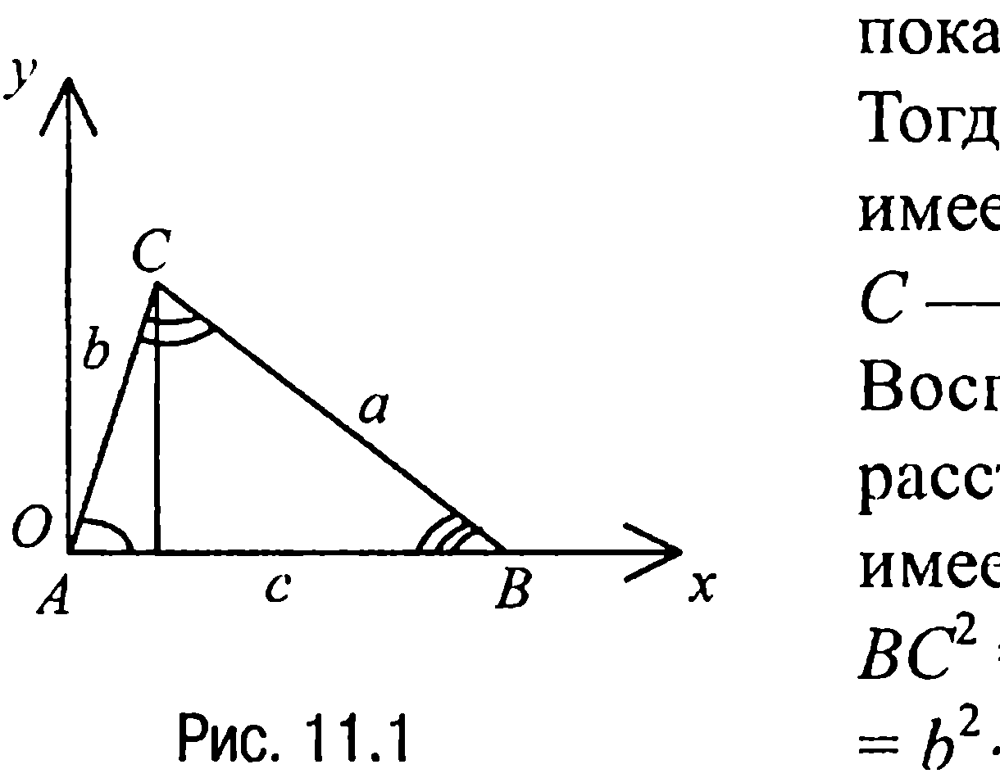

## 1.11. Теорема косинусов

---
**стр. 142**
---

**10.4C.** *В выпуклом четырехугольнике $ABCD$ углы $CAB$, $DBC$, $ACD$ и $BDA$ равны соответственно $15^\circ$, $90^\circ$, $30^\circ$ и $75^\circ$. Найти угол $AED$, если $E$ — точка пересечения диагоналей четырехугольника.*

**10.5C.** *В равнобедренном треугольнике $ABC$ с равными сторонами $AB$ и $BC$ проведена медиана $AD$. Найти угол $DAB$, если угол при вершине $B$ равен $\beta$.*

**10.6C.** *В треугольнике один угол вдвое больше другого, а противолежащие им стороны отличаются друг от друга на 2. Найти эти стороны, если известно, что третья сторона треугольника равна 5.*

**10.7C.** *На основании $AC$ равнобедренного треугольника $ABC$ отмечена произвольная точка $D$. Доказать, что радиусы окружностей, описанных около треугольников $ABD$ и $BCD$, равны.*

**§ 11. ТЕОРЕМА КОСИНУСОВ**

Для всякого треугольника $ABC$ со сторонами $BC = a$, $CA = b$, $AB = c$ и $\angle CAB = \alpha$, $\angle ABC = \beta$, $\angle BCA = \gamma$ имеет место

**Теорема косинусов.** *Квадрат одной из сторон треугольника равен сумме квадратов двух других сторон минус удвоенное произведение этих сторон на косинус угла между ними, т. е.*

$$a^2 = b^2 + c^2 - 2b \cdot c \cdot \cos \alpha,$$

$$b^2 = c^2 + a^2 - 2c \cdot a \cdot \cos \beta,$$

$$c^2 = a^2 + b^2 - 2a \cdot b \cdot \cos \gamma.$$

**Доказательство.** Докажем, например, справедливость первой из приведенных формул. Справедливость двух других доказывается аналогично.

Итак, рассмотрим треугольник $ABC$ и введем прямоугольную систему координат с началом в точке $A$ таким образом, как это

---
**стр. 143**
---

показано на рис. 11.1.

Тогда вершина $B$ треугольника $ABC$ имеет координаты $(c; 0)$, а вершина $C$ — координаты $(b \cdot \cos \alpha; b \cdot \sin \alpha)$. Воспользовавшись теперь формулой расстояния между двумя точками, имеем

$BC^2 = a^2 = (b \cdot \cos \alpha - c)^2 + b^2 \cdot \sin^2 \alpha =$

$= b^2 \cdot \cos^2 \alpha + b^2 \cdot \sin^2 \alpha - 2b \cdot c \cdot \cos \alpha +$

$+ c^2 = b^2 + c^2 - 2b \cdot c \cdot \cos \alpha$, что и требовалось доказать.

**ЗАДАЧИ**

▼ **11.1.** Доказать, что треугольник будет остроугольным, прямоугольным или тупоугольным в зависимости от того, будет ли квадрат его наибольшей стороны соответственно меньше, равен или больше суммы квадратов двух других сторон.

**Решение.** Пусть для определенности в треугольнике сторона $AB = c$ является наибольшей. Тогда (свойство 1.1) против этой большей стороны лежит больший угол, который, как мы условились выше, обозначим через $\gamma$.

По теореме косинусов $c^2 = a^2 + b^2 - 2a \cdot b \cdot \cos \gamma$. Но если $c^2 < a^2 + b^2$, то из теоремы косинусов следует, что $(-2a \cdot b \cdot \cos \gamma) < 0$, т. е. что $\cos \gamma > 0$ или что $0^\circ < \gamma < 90^\circ$. Если же $c^2 = a^2 + b^2$, то это означает, что $\cos \gamma = 0$, т. е. что $\gamma = 90^\circ$. Наконец, если $c^2 > a^2 + b^2$, то $(-2a \cdot b \cdot \cos \gamma) > 0$, т. е. $\cos \gamma < 0$, откуда следует, что $90^\circ < \gamma < 180^\circ$.

Проведенные рассуждения и доказывают требуемое.

▼ **11.2.** В треугольнике $ABC$ даны стороны $BC = a$, $AC = b$ и $\angle CAB = \gamma$ ($\neq 90^\circ$). Найти сторону $AB$.

**Решение.** Пусть $AB = c$. Тогда по теореме косинусов $a^2 = b^2 + c^2 - 2b \cdot c \cdot \cos \gamma$ или $c^2 - (2b \cdot \cos \gamma) \cdot c + b^2 - a^2 = 0$.

Рассмотрим это уравнение как квадратное относительно $c$. Тогда

---
**стр. 144**
---

если $D$ — дискриминант этого уравнения, то $\frac{1}{4}D = b^2 \cdot \cos^2\gamma - b^2 + a^2 = a^2 - b^2(1 - \cos^2\gamma) = a^2 - b^2 \cdot \sin^2\gamma$.

Отсюда следует, что если $a < b \cdot \sin\gamma$, то задача решения не имеет. Если $a = b \cdot \sin\gamma$, то $c = b \cdot \cos\gamma$. Если же $b > a > b \cdot \sin\gamma$, то существуют два значения $c$, удовлетворяющие условию задачи:

$$c_{1,2} = b \cdot \cos\gamma \pm \sqrt{a^2 - b^2 \sin^2 \gamma} \, .$$

Далее, если $a = b$, то существует единственное значение $c = 2b \cdot \cos\gamma$.

Наконец, если $a > b$, то существуют два значения $c$, удовлетворяющие условию задачи: $c_{1,2} = \pm b \cdot \cos\gamma + \sqrt{a^2 - b^2 \sin^2 \gamma} \, .$

**Ответ:** Если $a < b \cdot \sin\gamma$, то таких треугольников не существует;
если $a = b \cdot \sin\gamma$, то $c = b \cdot \cos\gamma$;
если $b \cdot \sin\gamma < a < b$, то $c_{1,2} = b \cdot \cos\gamma \pm \sqrt{a^2 - b^2 \sin^2 \gamma}$;
если $a = b$, то $c = 2b \cdot \cos\gamma$;
если $a > b$, то $c_{1,2} = \pm b \cdot \cos\gamma + \sqrt{a^2 - b^2 \sin^2 \gamma}$.

**Замечание 11.1.** Ряд важных задач на применение теоремы косинусов рассматривается в следующем параграфе «Решение треугольников».

**ЗАДАЧИ ДЛЯ САМОСТОЯТЕЛЬНОГО РЕШЕНИЯ**

**11.1С.** *Определить вид треугольника (остроугольный, прямоугольный, тупоугольный) и найти косинус наибольшего угла треугольника, если его стороны равны: а) 6, 7, 9; б) 7, 24, 25; в) 23, 25, 34.*

**11.2С.** *В треугольнике $ABC$ отрезок, соединяющий середины сторон $AB$ и $BC$, равен 3, сторона $AB$ равна 7, а угол $BCA$ равен $60^\circ$. Найти сторону $BC$.*

---
**стр. 145**
---

**11.3С.** *В треугольнике со сторонами 3, 4 и 6 проведена медиана к большей стороне. Определить косинус угла, образованного медианой с меньшей стороной треугольника.*

**11.4С.** *В треугольнике $ABC$ сторона $AB = 3$, $BC = 5$, $AC = 6$. На стороне $AB$ отмечена точка $D$ таким образом, что $DB = 2AD$, а на стороне $BC$ — точка $E$ так, что $3BE = 2EC$. Найти отрезок $DE$.*

**11.5С.** *Стороны треугольника образуют арифметическую прогрессию с разностью, равной 1. Косинус среднего по величине угла этого треугольника равен $\frac{2}{3}$. Найти периметр треугольника.*

**11.6С.** *В треугольнике $ABC$ стороны $BC$ и $AC$ равны 3 и 6 соответственно. Чему равна сторона $AB$, если известно, что она выражается целым числом и угол $BCA$ тупой?*

**11.7С.** *В треугольнике $ABC$ отрезок, соединяющий середины сторон $AB$ и $BC$, равен 3, сторона $AB$ равна 7, угол $BCA$ равен $60^\circ$. Найти сторону $BC$.*

**11.8С.** *Найти радиус окружности, описанной около четырехугольника $ABCD$, в котором $AB = 2$, $AD = 5$, $BC = CD$ и $AC = 4$.*

**11.9С.** *На стороне $AD$ ромба $ABCD$ отмечена точка $E$ таким образом, что $ED = \frac{3}{10}AD$, а $BE = EC = 11$. Найти площадь треугольника $BCE$.*

**11.10С.** *В равнобочную трапецию $ABCD$ вписана окружность радиуса $r$, $E$ — точка касания окружности с основанием трапеции $AD$, а $F$ — точка пересечения окружно-*
