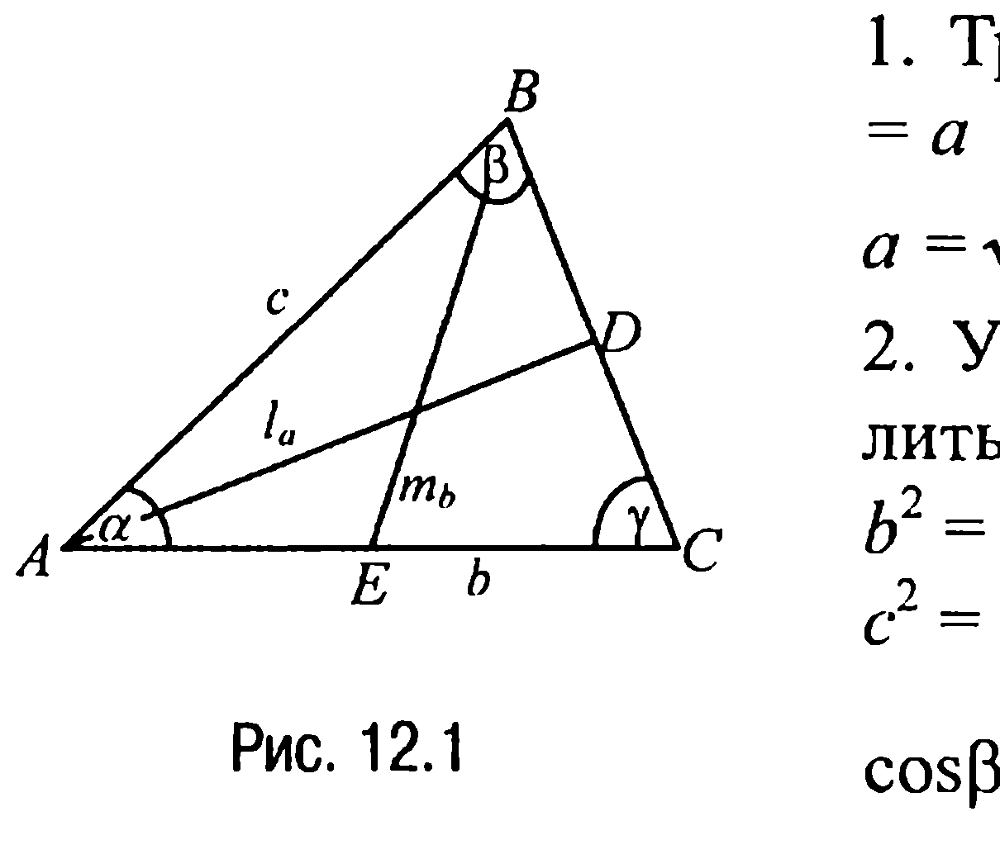
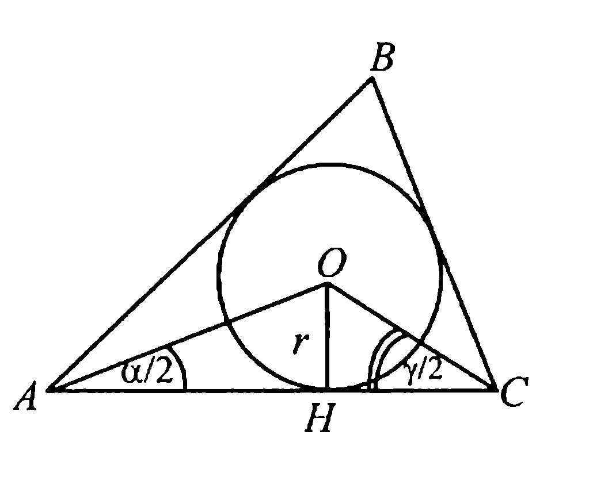

## 1.12. Решение треугольников

---
**стр. 146**
---

*сти с отрезком $BE$. Найти площадь трапеции, если $FE =$ $= 3BF$.*

**11.11С.** *На окружности по разные стороны от диаметра $AB$ отмечены точки $C$ и $D$ таким образом, что $AC = 4$, $BD = \sqrt{5}$, площадь треугольника $ABC$ вдвое больше площади треугольника $CBD$. Найти радиус $R$ окружности.*

**11.12С.** *В треугольнике $ABC$ известны стороны $AC = 2$, $AB = 3$, $BC = 4$. Пусть $BD$ — высота этого треугольника. Найти отрезок $CD$.*

**§ 12. РЕШЕНИЕ ТРЕУГОЛЬНИКОВ**

В общем случае любой треугольник задается тремя независимыми параметрами, которые называют элементами треугольника. Элементы треугольника — это обычно его стороны $a$, $b$, $c$, противолежащие им углы $\alpha$, $\beta$, $\gamma$, биссектрисы (внутренних) углов треугольника $l_a$, $l_b$, $l_c$, медианы $m_a$, $m_b$, $m_c$, высоты $h_a$, $h_b$, $h_c$, радиусы $r$ и $R$ вписанной и описанной окружностей соответственно.

«Решение треугольников» — это нахождение одних, неизвестных, элементов треугольника через его другие, известные, элементы. Приведем сначала три основные задачи «Решения треугольников», знание которых существенно помогает при решении более сложных задач.

**ЗАДАЧИ**

▼ **12.1.** *В треугольнике известны две стороны и угол между ними. Найти остальные элементы треугольника.*

**Решение.** Рассмотрим треугольник $ABC$, где $AC = b$, $AB = c$, $\angle CAB = \alpha$ (рис. 12.1).

---
**стр. 147**
---

1. Третья, неизвестная, сторона $BC = a$ находится по теореме косинусов
$$a = \sqrt{b^2 + c^2 - 2bc \cos \alpha} .$$

2. Углы $\beta$ и $\gamma$ также можно вычислить с помощью теоремы косинусов:
$$b^2 = c^2 + a^2 - 2a \cdot c \cdot \cos \beta$$
$$c^2 = a^2 + b^2 - 2a \cdot b \cdot \cos \gamma, \text{ откуда}$$
$$\cos \beta = \frac{c^2 + a^2 - b^2}{2ac} = \frac{c - b \cos \alpha}{a},$$
$$\cos \gamma = \frac{a^2 + b^2 - c^2}{2ab} = \frac{b - c \cos \alpha}{a} \text{ и, таким образом,}$$
$$\beta = \arccos \frac{c - b \cos \alpha}{a}, \quad \gamma = \arccos \frac{b - c \cos \alpha}{a} .$$

3. Для нахождения биссектрисы $l_a$ вычислим площадь $S$ треугольника $ABC$ двумя различными способами:
$$S = \frac{1}{2} b \cdot c \cdot \sin \alpha \quad \text{и} \quad S = S_1 + S_2 = \frac{1}{2} b \cdot l_a \cdot \sin \frac{\alpha}{2} + \frac{1}{2} c \cdot l_a \cdot \sin \frac{\alpha}{2},$$
где $S_1$ и $S_2$ — площади треугольников $CAD$ и $ABD$ соответственно (рис. 12.1). А тогда $b \cdot c \cdot \sin \alpha = (b + c) \cdot l_a \cdot \sin \frac{\alpha}{2}$ или
$$2b \cdot c \cdot \sin \frac{\alpha}{2} \cdot \cos \frac{\alpha}{2} = (b + c) \cdot l_a \cdot \sin \frac{\alpha}{2}, \text{ откуда } l_a = \frac{2bc \cos \frac{\alpha}{2}}{b + c}.$$
Аналогично получаем, что $l_b = \frac{2ac \cos \frac{\beta}{2}}{a + c}$, $l_c = \frac{2ab \cos \frac{\gamma}{2}}{a + b}$.

4. Медиану $m_b$ найдем по теореме косинусов из треугольника $ABE$ (рис. 12.1). Имеем $m_b^2 = c^2 + \left(\frac{b}{2}\right)^2 - b \cdot c \cdot \cos \alpha$, откуда
$$m_b = \frac{1}{2} \sqrt{b^2 + 4c^2 - 4bc \cos \alpha} = \frac{1}{2} \sqrt{2a^2 + 2c^2 - b^2} .$$
Аналогично находим
$$m_c = \frac{1}{2} \sqrt{c^2 + 4b^2 - 4bc \cos \alpha} = \frac{1}{2} \sqrt{2a^2 + 2b^2 - c^2},$$

---
**стр. 148**
---

$$m_a = \frac{1}{2} \sqrt{b^2 + c^2 + 2bc \cos \alpha} = \frac{1}{2} \sqrt{2b^2 + 2c^2 - a^2} .$$

5. Высоты находятся из формул для вычисления площади $S$ треугольника $ABC$:
$$S = \frac{1}{2} b \cdot c \cdot \sin \alpha = \frac{1}{2} a \cdot h_a = \frac{1}{2} b \cdot h_b = \frac{1}{2} c \cdot h_c .$$
Из этих формул имеем: $h_b = c \cdot \sin \alpha$, $h_c = b \cdot \sin \alpha$, $h_a = \frac{bc}{a} \cdot \sin \alpha$.

6. Радиус $r$ вписанной окружности определяется, например, исходя из следующих соображений. Пусть $O_1$ — центр вписанной окружности, который, как известно, является точкой пересечения биссектрис (внутренних) углов треугольника. А тогда, заметив, что
$$S = \frac{1}{2} b \cdot c \cdot \sin \alpha = S_{\Delta AO_1C} + S_{\Delta AO_1B} + S_{\Delta BO_1C} = \frac{1}{2} r \cdot a + \frac{1}{2} r \cdot b + \frac{1}{2} r \cdot c =$$
$$= \frac{1}{2} r(a + b + c),$$
мы и находим $r = \frac{bc \sin \alpha}{a + b + c}$.

7. Радиус $R$ описанной окружности находится (задача 9.4) по формуле $R = \frac{a}{2 \sin \alpha}$.

**Замечание 12.1.** В каждую из формул, полученную в пунктах 2—7, следует подставить найденное для $a$ выражение из пункта 1.

▼ **12.2.** *В треугольнике известны одна сторона и прилежащие к ней два угла. Найти остальные элементы треугольника.*

**Решение.** Рассмотрим треугольник $ABC$, где $AC = b$, $\angle CAB = \alpha$, $\angle BCA = \gamma$ (рис. 12.2).

1. Из условия задачи следует, что $\angle ABC = \beta = 180^\circ - (\alpha + \gamma)$.

2. Найдем стороны $AB = c$ и $BC = a$. Чтобы это сделать, заметим прежде всего, что $\sin \beta = \sin(\alpha + \gamma)$ и поэтому по расширенной теореме синусов
$$\frac{b}{\sin(\alpha + \gamma)} = \frac{a}{\sin \alpha} = \frac{c}{\sin \gamma} = 2R .$$

---
**стр. 149**
---

А тогда
$$a = b \frac{\sin \alpha}{\sin(\alpha + \gamma)}, \quad c = b \frac{\sin \gamma}{\sin(\alpha + \gamma)} .$$

3. Биссектрисы находятся по формулам, уже выведенным в пункте 3 при решении предыдущей задачи, в которых $a$, $c$ и $\beta$ заменяются найденными для них выражениями.

4. Медианы определяются по формулам, уже выведенным в пункте 4 при решении предыдущей задачи, в которых $a$ и $c$ заменяются найденными для них выражениями.

5. Высоты $h_a$ и $h_c$ находятся из формул для вычисления площади $S$ треугольника $ABC$:
$$S = \frac{1}{2} b \cdot c \cdot \sin \alpha = \frac{1}{2} a \cdot b \cdot \sin \gamma = \frac{1}{2} a \cdot h_a = \frac{1}{2} c \cdot h_c = \frac{1}{2} b \cdot h_b .$$
Из этих формул имеем:
$$h_a = b \cdot \sin \gamma, \quad h_c = b \cdot \sin \alpha, \quad h_b = a \cdot \sin \gamma = b \cdot \frac{\sin \alpha \cdot \sin \gamma}{\sin(\alpha + \gamma)} .$$

6. Радиус $r$ вписанной в треугольник $ABC$ окружности определяется, например, исходя из следующих соображений. Пусть $O$ — центр вписанной окружности (рис. 12.2). Тогда поскольку $O$ — это точка пересечения биссектрис треугольника, то из прямоугольных треугольников $AOH$ и $OCH$ следует, что
$$r \cdot \operatorname{ctg} \frac{\alpha}{2} + r \cdot \operatorname{ctg} \frac{\gamma}{2} = b, \text{ откуда } r = \frac{b}{\operatorname{ctg} \frac{\alpha}{2} + \operatorname{ctg} \frac{\gamma}{2}} = b \cdot \frac{\sin \frac{\alpha}{2} \cdot \sin \frac{\gamma}{2}}{\sin \left(\frac{\alpha}{2} + \frac{\gamma}{2}\right)} .$$

7. Что же касается радиуса $R$ описанной около треугольника $ABC$ окружности, то он просто находится на основании расширенной теоремы синусов, т. е. $R = \frac{b}{2 \sin(\alpha + \gamma)}$.

---
**стр. 150**
---

▼ **12.3.** *В треугольнике известны три стороны. Найти остальные элементы треугольника.*

**Решение.** Рассмотрим треугольник $ABC$, где $AB = c$, $BC = a$, $AC = b$.

1. Углы треугольника находятся на основании теоремы косинусов, а именно:
$$\alpha = \arccos \frac{c^2 + b^2 - a^2}{2bc}; \quad \beta = \arccos \frac{a^2 + c^2 - b^2}{2ac};$$
$$\gamma = \arccos \frac{b^2 + a^2 - c^2}{2ab} .$$

2. Биссектрисы находятся по формулам, уже выведенным в пункте 3 при решении задачи 12.1, в которых углы $\alpha, \beta, \gamma$ заменяются найденными для них выражениями в пункте 1 решения настоящей задачи.

3. Медианы определяются по формулам, уже выведенным в пункте 4 при решении задачи 12.1.

4. Высоты находятся из следующих формул для вычисления площади $S$ треугольника:
$$S = \sqrt{p(p - a)(p - b)(p - c)} = \frac{1}{2} a \cdot h_a = \frac{1}{2} b \cdot h_b = \frac{1}{2} c \cdot h_c ,$$
где $p = (a + b + c)/2$. Из этих формул следует, что
$$h_a = \frac{2\sqrt{p(p - a)(p - b)(p - c)}}{a}, \quad h_b = \frac{2\sqrt{p(p - a)(p - b)(p - c)}}{b},$$
$$h_c = \frac{2\sqrt{p(p - a)(p - b)(p - c)}}{c} .$$

5. Радиус $r$ вписанной окружности находится по уже полученной в пункте 6 при решении задачи 12.1 формуле, которую, с учетом того что площадь треугольника $ABC$ — это
$$S = \frac{1}{2} b \cdot c \cdot \sin \alpha = \sqrt{p(p - a)(p - b)(p - c)} ,$$ можно переписать в виде $r = \frac{\sqrt{p(p - a)(p - b)(p - c)}}{p}$, где $p = (a + b + c)/2$.

---
**стр. 151**
---

6. Радиус $R$ описанной окружности находится по уже полученной в пункте 7 при решении задачи 12.1 формуле, которую можно переписать в виде
$$R = \frac{a}{2 \sin \alpha} = \frac{abc}{4 \frac{bc \sin \alpha}{2}} = \frac{abc}{4 \sqrt{p(p-a)(p-b)(p-c)}},$$
т. е. $R = \frac{abc}{4 \sqrt{p(p-a)(p-b)(p-c)}}$, где $p = (a + b + c)/2$.

**12.4.** Найти отношение радиуса $r$ вписанной в треугольник $ABC$ окружности к радиусу $R$ описанной около этого треугольника окружности, если $\frac{AB}{AC} = k$ и $\angle CAB = \alpha$.

**Решение.** Пусть $AB = c$, $AC = b$. Тогда по условию $\frac{c}{b} = k$ и решение задачи сводится к нахождению радиусов $r$ и $R$ по двум сторонам треугольника и углу, заключенному между ними. Предварительно найдем третью сторону треугольника $BC = a$. По теореме косинусов $a^2 = b^2 + c^2 - 2b \cdot c \cdot \cos \alpha$ и, значит, $a = \sqrt{b^2 + c^2 - 2bc \cos \alpha}$. Тогда (пункт 6, задача 12.1)
$$r = \frac{bc \sin \alpha}{a + b + c} = \frac{bc \sin \alpha}{b + c + \sqrt{b^2 + c^2 - 2bc \cos \alpha}}.$$
Что же касается радиуса $R$, то (пункт 7, задача 12.1)
$$R = \frac{a}{2 \sin \alpha} = \frac{\sqrt{b^2 + c^2 - 2bc \cos \alpha}}{2 \sin \alpha}.$$
Таким образом,
$$\frac{r}{R} = \frac{bc \sin \alpha}{b + c + \sqrt{b^2 + c^2 - 2bc \cos \alpha}} : \frac{\sqrt{b^2 + c^2 - 2bc \cos \alpha}}{2 \sin \alpha} =$$
$$= \frac{2bc \sin^2 \alpha}{(b + c + \sqrt{b^2 + c^2 - 2bc \cos \alpha})\sqrt{b^2 + c^2 - 2bc \cos \alpha}}$$
или, деля числитель и знаменатель дроби на $b^2$, получаем, что

---
**стр. 152**
---

$$\frac{r}{R} = \frac{2 \frac{c}{b} \sin^2 \alpha}{\left( 1 + \frac{c}{b} + \sqrt{1 + \left( \frac{c}{b} \right)^2 - 2 \frac{c}{b} \cos \alpha} \right) \sqrt{1 + \left( \frac{c}{b} \right)^2 - 2 \frac{c}{b} \cos \alpha}} =$$
$$= \frac{2k \sin^2 \alpha}{(1 + k + \sqrt{1 + k^2 - 2k \cos \alpha}) \sqrt{1 + k^2 - 2k \cos \alpha}} .$$

**Ответ:** $\frac{r}{R} = \frac{2k \sin^2 \alpha}{(1 + k + \sqrt{1 + k^2 - 2k \cos \alpha}) \sqrt{1 + k^2 - 2k \cos \alpha}}$.

**12.5.** *Вычислить площадь круга, вписанного в треугольник $ABC$, если $AC = 5$, $\angle CAB = 30^\circ$, $\angle BCA = 45^\circ$.*

**Решение.** Чтобы вычислить площадь круга, найдем сначала его радиус $r$. Этот радиус вычисляется (пункт 6 задачи 12.2) по формуле $r = \frac{5}{\operatorname{ctg} 15^\circ + \operatorname{ctg} 22,5^\circ}$. А тогда, замечая, что $\operatorname{ctg}^2 15^\circ = \frac{\cos^2 15^\circ}{\sin^2 15^\circ} = \frac{1 + \cos 30^\circ}{1 - \cos 30^\circ} = \frac{2 + \sqrt{3}}{2 - \sqrt{3}} = (2 + \sqrt{3})^2$ и, значит, $\operatorname{ctg} 15^\circ = 2 + \sqrt{3}$, а $\operatorname{ctg}^2 22,5^\circ = \frac{\cos^2 22,5^\circ}{\sin^2 22,5^\circ} = \frac{1 + \cos 45^\circ}{1 - \cos 45^\circ} = \frac{2 + \sqrt{2}}{2 - \sqrt{2}} = (1 + \sqrt{2})^2$ и, следовательно, $\operatorname{ctg} 22,5^\circ = 1 + \sqrt{2}$, находим $r = \frac{5}{3 + \sqrt{2} + \sqrt{3}}$. Таким образом, площадь круга $S = \pi \cdot r^2 = \frac{25\pi}{14 + 6\sqrt{2} + 6\sqrt{3} + 2\sqrt{6}}$.

**Ответ:** $\frac{25\pi}{14 + 6\sqrt{2} + 6\sqrt{3} + 2\sqrt{6}}$.

**12.6.** *В треугольнике $ABC$ стороны $AB = 3$, $BC = 5$, $AC = 7$. Найти биссектрису угла $ABC$ треугольника.*

---
**стр. 153**
---

**Решение.** В пункте 3 при решении задачи 12.1 была, в частности, получена формула
$$l_b = \frac{2 AB \cdot BC \cdot \cos \frac{\beta}{2}}{AB + BC},$$
где $l_b$ — биссектриса угла $ABC$ ($\angle ABC = \beta$).

Таким образом, решение задачи сводится к нахождению угла $\beta$ по известным трем сторонам треугольника. Для нахождения этого угла воспользуемся теоремой косинусов. Имеем
$AC^2 = AB^2 + BC^2 - 2 AB \cdot BC \cdot \cos \beta$ или $49 = 9 + 25 - 30 \cdot \cos \beta$,
откуда получаем, что $\cos \beta = -1/2$, т. е. $\beta = 120^\circ$.

А тогда $l_b = \frac{2 \cdot 3 \cdot 5 \cdot \frac{1}{2}}{3 + 5} = \frac{15}{8}$.

**Ответ:** $\frac{15}{8}$.

**ЗАДАЧИ ДЛЯ САМОСТОЯТЕЛЬНОГО РЕШЕНИЯ**

**12.1C.** *Найти зависимость между сторонами $a$, $b$, $c$, треугольника и радиусом $r$ вписанной в него окружности.*

**12.2C.** *В треугольнике $ABC$ известны стороны $BC = a$, $AC = b$, радиус $R$ описанной около этого треугольника окружности. Найти сторону $AB$.*

**12.3C.** *В треугольнике $ABC$ известны стороны $BC = a$, $AC = b$, высота $h_a$. Найти сторону $AB$.*

**12.4C.** *В треугольнике $ABC$ известны стороны $BC = a$, $AC = b$, высота $h_c$. Найти сторону $AB$.*

---
**стр. 154**
---

**12.5C.** *Найти зависимость между сторонами $a$, $b$, $c$ треугольника и его биссектрисой $l_a$, проведенной к стороне $a$.*

**12.6C.** *В треугольнике $ABC$ известны стороны $BC = a$, $AC = b$, биссектриса $l_c$. Найти сторону $AB$.*
