## 2.1. Параллелограмм, прямоугольник, ромб, квадрат

---
**стр. 155**
---

# ГЛАВА 2

# ЧЕТЫРЕХУГОЛЬНИКИ И МНОГОУГОЛЬНИКИ

## § 13. ПАРАЛЛЕЛОГРАММ, ПРЯМОУГОЛЬНИК, РОМБ, КВАДРАТ

***Параллелограмм*** — *это четырехугольник, у которого противолежащие стороны попарно параллельны.*

***Высотой параллелограмма*** *называется отрезок перпендикуляра от любой точки какой-либо стороны параллелограмма до противолежащей стороны (основания параллелограмма) или ее продолжения.*

***Прямоугольник*** — *это параллелограмм, у которого все углы прямые.*

***Ромб*** — *это параллелограмм, у которого все стороны равны.*

***Квадрат*** — *это прямоугольник, у которого все стороны равны (иначе — это ромб, у которого все углы прямые).*

**13.1. Свойства параллелограмма**

**Свойство 13.1X.** *Диагональ параллелограмма делит его на два равных треугольника.*

**Доказательство.** Рассмотрим параллелограмм $ABCD$ и проведем в нем (рис. 13.1), например, диагональ $BD$ (если провести диагональ $AC$, то рассуждения аналогичны).

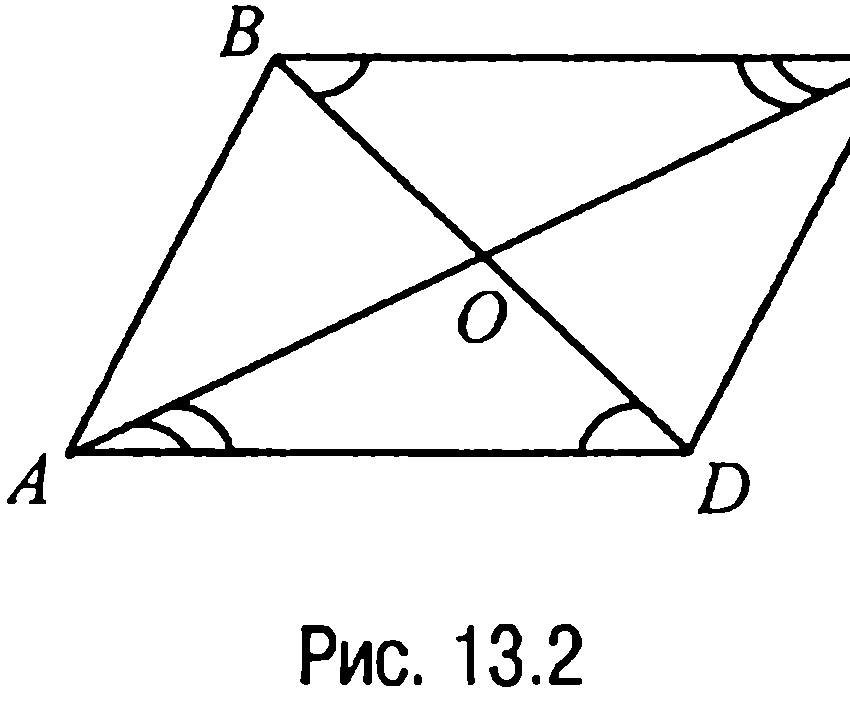

Тогда у треугольников $ABD$ и $BCD$ сторона $BD$ общая, $\angle ABD = \angle CDB$, $\angle BDA = \angle DBC$ (указанные пары углов равны как накрест лежащие углы

---
**стр. 156**
---

при параллельных прямых) и, значит, из второго признака равенства треугольников следует равенство треугольников $ABD$ и $BCD$, что и требовалось доказать.

**Свойство 13.2X.** *Противолежащие стороны параллелограмма равны.*

**Доказательство.** При доказательстве свойства 13.1X было показано, что треугольники $ABD$ и $BCD$ (рис. 13.1) равны, причем у этих треугольников $\angle ABD = \angle CDB$, а $\angle BDA = \angle DBC$. Но в равных треугольниках против равных углов лежат равные стороны, поэтому $AB = CD$, а $AD = BC$.

**Свойство 13.3X.** *Противолежащие углы параллелограмма равны.*

**Доказательство.** При доказательстве свойства 13.1X было показано, что $\angle ABD = \angle CDB$, $\angle BDA = \angle DBC$. Поэтому $\angle ABC = \angle ABD + \angle DBC = \angle CDB + \angle DBA = \angle CDA$. Аналогично показывается, что $\angle DAB = \angle BCD$.

**Свойство 13.4X.** *Диагонали параллелограмма пересекаются и точкой пересечения делятся пополам.*

**Доказательство.** То, что диагонали параллелограмма пересекаются, следует из свойства 1.11, поскольку параллелограмм — выпуклый четырехугольник. Докажем вторую часть утверждения. Так, проведем в параллелограмме $ABCD$ диагонали $BD$ и $AC$. Пусть $O$ — точка их пересечения (рис. 13.2). Тогда треугольники $AOD$ и $COB$ равны, поскольку $AD = BC$, $\angle OBC = \angle ODA$, $\angle BCO = \angle DAO$ (указанные углы равны как накрест лежащие углы при параллельных прямых).

Из равенства же треугольников следует, что $AO = OC$, а $BO = OD$.

**Свойство 13.5X.** *Сумма квадратов диагоналей параллелограмма равна сумме квадратов его сторон.*

**Доказательство.** Рассмотрим рис. 13.2. Из треугольников $DBC$ и $ABC$ по теореме косинусов соответственно находим:

---
**стр. 157**
---

$BD^2 = BC^2 + CD^2 - 2BC \cdot CD \cdot \cos\angle BCD,$

$AC^2 = AB^2 + BC^2 - 2AB \cdot BC \cdot \cos\angle ABC.$

А тогда, учитывая, что $AB = CD$, а $\cos\angle BCD = -\cos\angle ABC$, имеем $BD^2 + AC^2 = 2AB^2 + 2BC^2$, что и требовалось доказать.

**Свойство 13.6X.** *Точка пересечения диагоналей параллелограмма является его центром симметрии.*

**Доказательство.** Пусть $O$ — точка пересечения диагоналей $AC$ и $BD$ параллелограмма $ABCD$, $M$ — произвольная точка, лежащая, например, на стороне $BC$ (рис. 13.3), а $M_1$ — точка пересечения прямой $MO$ с отрезком $AD$.

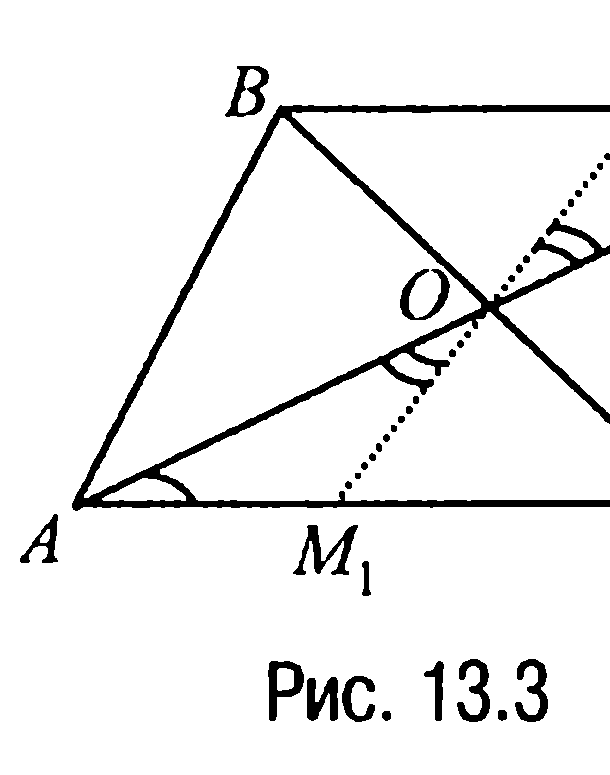

Тогда поскольку $\angle M_1AO = \angle MCO$, $\angle AOM_1 = \angle COM$, а $AO = OC$, то треугольники $M_1AO$ и $MCO$ равны, а значит, $OM = OM_1$, что и доказывает требуемое.

**13.2. Свойства прямоугольника**

Так как прямоугольник является параллелограммом, то для прямоугольника справедливы все свойства параллелограмма. Но кроме этого имеют место, например, и такие свойства.

**Свойство 13.7X.** *Диагонали прямоугольника равны.*

**Доказательство.** Пусть четырехугольник $ABCD$ — данный прямоугольник (рис. 13.4). В этом прямоугольнике прямоугольные треугольники $DAB$ и $ABC$ равны, поскольку у них катет $AB$ общий, а катеты $AD$ и $BC$ равны как противолежащие стороны параллелограмма (свойство 13.2X).

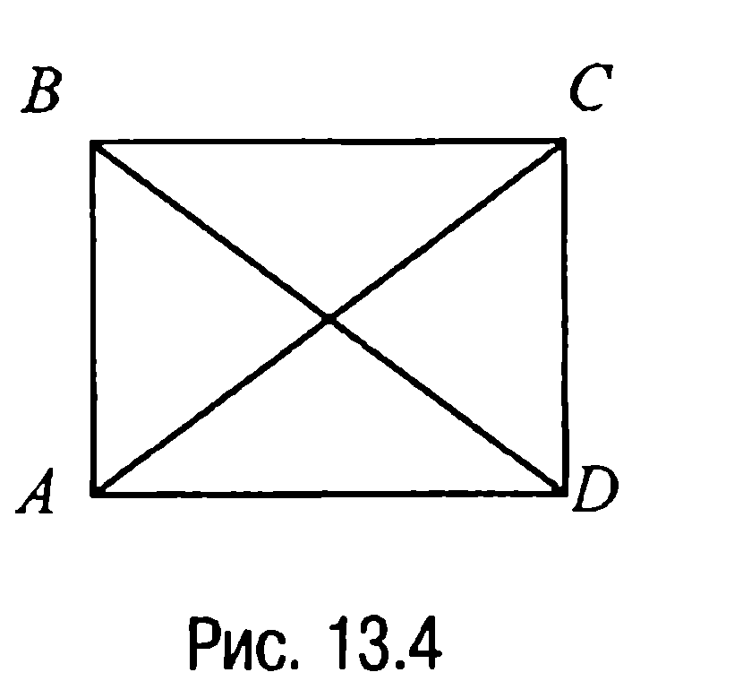

Из равенства же указанных треугольников следует равенство их гипотенуз $AC$ и $BD$, которые являются диагоналями прямоугольника $ABCD$, а это и требовалось доказать.

---
**стр. 158**
---

**Свойство 13.8X.** *Перпендикуляры, проходящие через середины сторон прямоугольника, являются его осями симметрии.*

**Доказательство.** Пусть $EF$ — перпендикуляр, проходящий, например, через середины сторон $BC$ и $AD$ прямоугольника $ABCD$ (рис. 13.5).

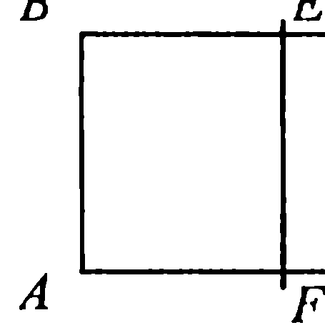

Тогда $EF \parallel CD$, $EF \parallel BA$ и, значит, отрезок $BA$ симметричен отрезку $CD$ относительно перпендикуляра $EF$, поскольку при преобразовании симметрии точки $B$ и $A$ отобразятся соответственно в точки $C$ и $D$ и, таким образом, отрезок $BA$ «наложится» на отрезок $CD$.

Аналогичные рассуждения проводятся и относительно серединного перпендикуляра к сторонам $AB$ и $DC$ прямоугольника $ABCD$.

**13.3. Свойства ромба**

Как и для прямоугольника, для ромба справедливы все свойства параллелограмма, но, кроме того, имеют место, например, и следующие свойства.

**Свойство 13.9X.** *Диагонали ромба взаимно перпендикулярны.*

**Доказательство.** Пусть четырехугольник $ABCD$ (рис. 13.6) — ромб и пусть $O$ — точка пересечения его диагоналей.

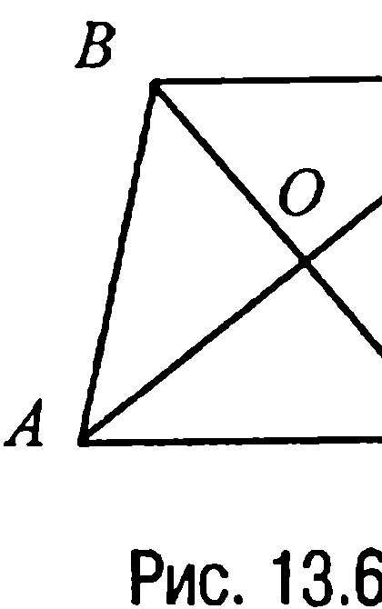

Тогда по свойству 13.4X отрезки $AO$ и $OC$ равны. Таким образом, в равнобедренном треугольнике $ABC$ отрезок $BO$ является медианой. Но это означает (свойство 1.18X), что отрезок $BO$ будет для треугольника $ABC$ и высотой, а значит, $AC \perp BD$, что и доказывает требуемое.

---
**стр. 159**
---

**Свойство 13.10X.** *Диагонали ромба лежат на биссектрисах его углов.*

**Доказательство.** При доказательстве свойства 13.9X было показано, что отрезок $BO$ является медианой равнобедренного треугольника $ABC$ (рис. 13.6). Но тогда по свойству 1.18X отрезок $BO$ и будет лежать на биссектрисе угла $ABC$. Рассуждения, аналогично проведенные относительно углов $BCD$, $CDA$ и $DAB$, и завершают доказательство.

**Свойство 13.11X.** *Прямые, на которых лежат диагонали ромба, являются его осями симметрии.*

**Доказательство.** Пусть $O$ — точка пересечения диагоналей $AC$ и $BD$ ромба $ABCD$ (рис. 13.6). Тогда поскольку $AC \perp BD$, а $OA = OC$, то при преобразовании симметрии точка $A$ «перейдет» в точку $C$ и, значит, отрезок $BA$ будет симметричен отрезку $BC$, а отрезок $DA$ будет симметричен отрезку $DC$ относительно прямой $BD$. Аналогично доказывается и симметричность относительно прямой $AC$ отрезков $AB$ и $AD$, а также $CB$ и $CD$.

**13.4. Свойства квадрата**

Для квадрата справедливы все свойства прямоугольника и ромба.

**ЗАДАЧИ**

▼ **13.1.** *Доказать, что середины сторон произвольного четырехугольника являются вершинами параллелограмма, стороны которого соответственно параллельны диагоналям четырехугольника и равны их половинам.*

**Решение.** Рассмотрим четырехугольник $ABCD$ (рис. 13.7, 13.8), у которого $E, F, K, L$ — середины сторон $AB, BC, CD, AD$ соответственно.

---
**стр. 160**
---

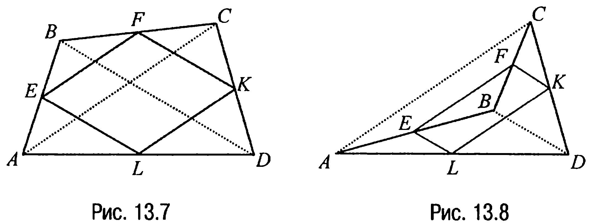

В треугольнике $ABC$ отрезок $EF$ является средней линией и поэтому (свойство 1.16) $EF \parallel AC$, причем $EF = \frac{1}{2} AC$. Если теперь рассмотреть треугольник $ACD$, то в этом треугольнике $LK \parallel AC$, причем $LK = \frac{1}{2} AC$. Итак, $EF \parallel AC \parallel LK$, $EF = LK = \frac{1}{2} AC$. Аналогичные рассуждения приводят к выводу, что $FK \parallel BD \parallel EL$, $FK = EL = \frac{1}{2} BD$, а это и доказывает требуемое.

▼ **13.2.** Доказать, что если из произвольной точки диагонали параллелограмма в разных полуплоскостях относительно этой диагонали проведены перпендикуляры к смежным сторонам параллелограмма (или к их продолжениям), то произведения этих перпендикуляров на соответствующие стороны равны.

**Решение.** Пусть $P$ — произвольная точка диагонали $AC$ параллелограмма $ABCD$ (рис. 13.9), а точки $F$ и $E$ — основания перпендикуляров, опущенных из точки $P$ соответственно на стороны $AB$ и $AD$ (или их продолжения).

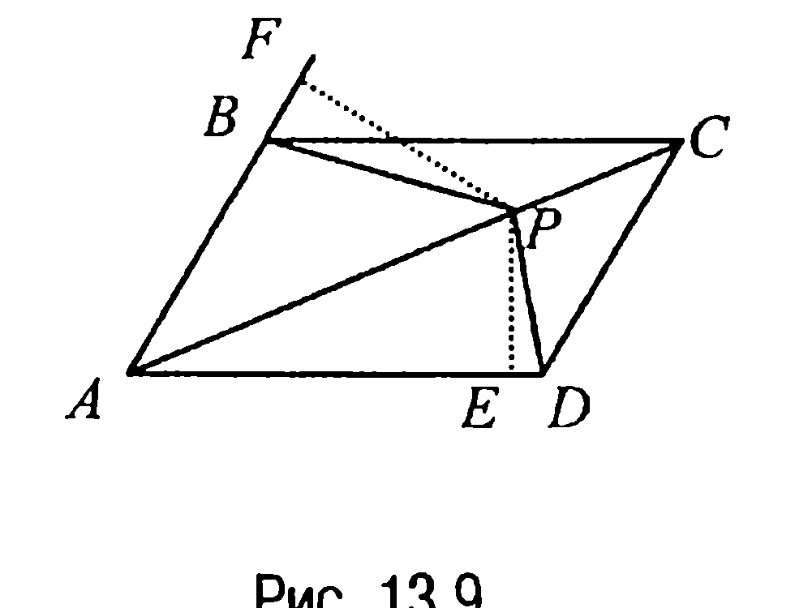

Тогда по свойству 1.12 имеем: $S_{\triangle ABP} : S_{\triangle PBC} = AP : PC$, $S_{\triangle ADP} : S_{\triangle PDC} = AP : PC$, а по свойству 13.1 справедливо равенство $S_{\triangle ABC} = S_{\triangle ADC}$. Но в таком случае $S_{\triangle ABP} = S_{\triangle ADP}$ и, значит, $AB \cdot PF = AD \cdot PE$, что и доказывает требуемое.

---
**стр. 161**
---

**13.3.** Доказать, что произведение перпендикуляров, опущенных из произвольной точки $P$ диагонали $AC$ параллелограмма $ABCD$ на его смежные стороны (или на их продолжения) с общей точкой $B$, равно произведению перпендикуляров, опущенных на смежные стороны (или на их продолжения) с общей точкой $D$.

**Решение.** Справедливость утверждения этой задачи прямо следует из утверждения задачи 13.2, если заметить, что в параллелограмме $ABCD$ сторона $AB = DC$, а $AD = BC$.

▼ **13.4.** В параллелограмме $ABCD$ точка $E$ — середина стороны $BC$, а точка $F$ — середина стороны $CD$. Доказать, что отрезки $AE$ и $AF$ делят диагональ $BD$ параллелограмма на три равных отрезка.

**Решение.** На рис. 13.10 отрезки $AE$ и $BL$ — медианы треугольника $ABC$, поэтому (свойство 6.5) $BK = \frac{2}{3} BL = \frac{2}{3} \cdot \frac{1}{2} BD = \frac{BD}{3}$. Аналогично из треугольника $ACD$ находим, что $DM = \frac{BD}{3}$. Но тогда и $KM = \frac{BD}{3}$, а это и требовалось доказать.

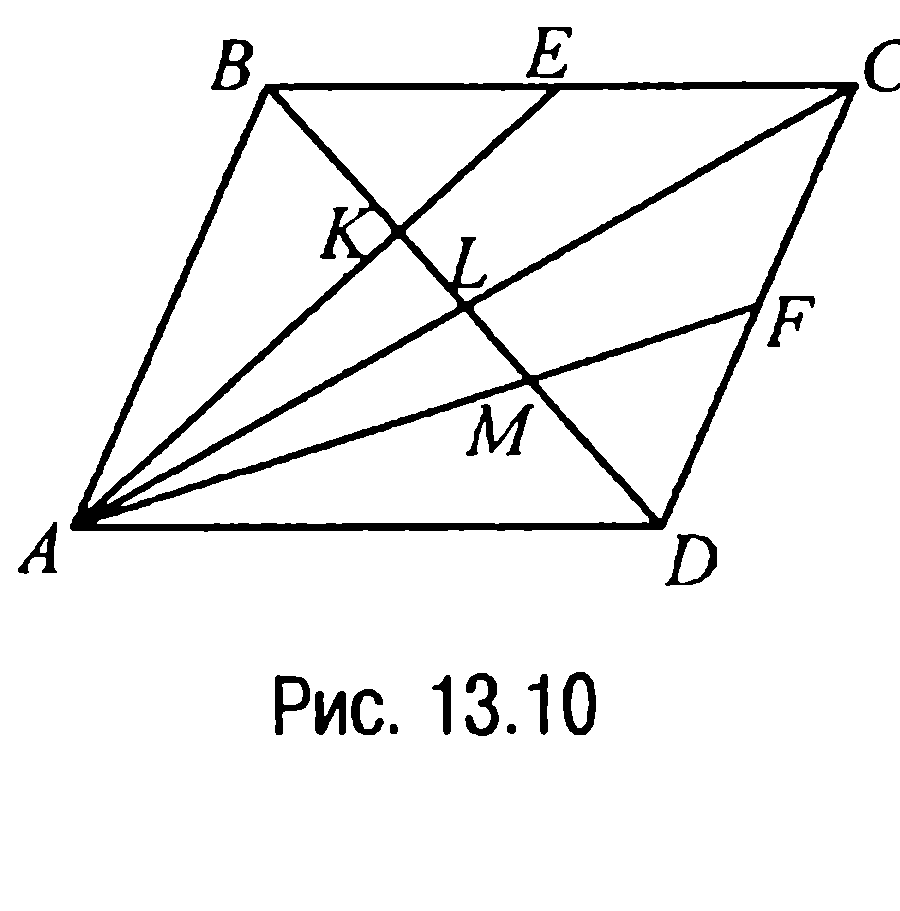

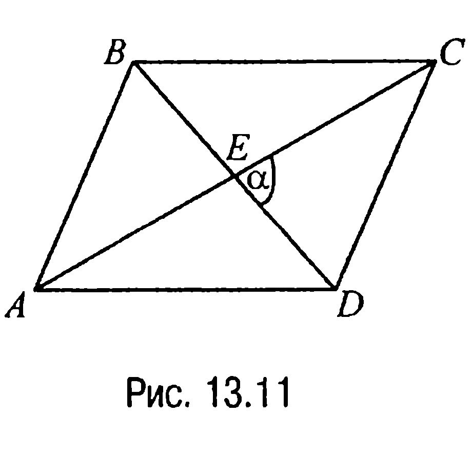

**13.5.** Стороны параллелограмма равны $a$ и $b$ ($a \ne b$). В каких пределах может меняться косинус острого угла между диагоналями?

**Решение.** Пусть для определенности в параллелограмме $ABCD$ сторона $AB = a$, $BC = b$, $a < b$, $E$ — точка пересечения диагоналей (рис. 13.11). Обозначим острый угол $DEC$ через $\alpha$, диагонали $AC$ и $BD$ — через $x$ и $y$ соответственно. Тогда по теореме косинусов из треугольников $DEC$ и $AED$ имеем $a^2 = \frac{x^2}{4} + \frac{y^2}{4} -$

---
**стр. 162**
---

$-\frac{xy}{2}\cos\alpha$, $b^2=\frac{x^2}{4}+\frac{y^2}{4}+\frac{xy}{2}\cos\alpha$. Отсюда $b^2-a^2=xy\cos\alpha$.

Используя теперь алгебраическое тождество $2xy=x^2+y^2-(x-y)^2$ и свойство 13.5X параллелограмма, из последнего равенства находим $\cos\alpha=\frac{2(b^2-a^2)}{2(a^2+b^2)-(x-y)^2}$. Но в таком случае, замечая, что $\alpha>0$ и, значит, $\cos\alpha<1$, а $(x-y)^2\ge 0$, приходим к выводу, что $\frac{b^2-a^2}{a^2+b^2}\le\cos\alpha<1$. Учитывая теперь и возможность $a>b$, получаем

**Ответ:** $\left[\frac{|a^2-b^2|}{a^2+b^2}; 1\right)$.

**13.6.** *Две высоты параллелограмма, проведенные из вершины тупого угла, равны соответственно $a$ и $b$, угол между этими высотами равен $\alpha$. Найти бо́льшую диагональ параллелограмма.*

**Решение.** Пусть в параллелограмме $ABCD$ (рис. 13.12) угол $ABC$ — тупой, $BE\perp AD$, $BF\perp DC$ и пусть для определенности $BE=a$, $BF=b$.

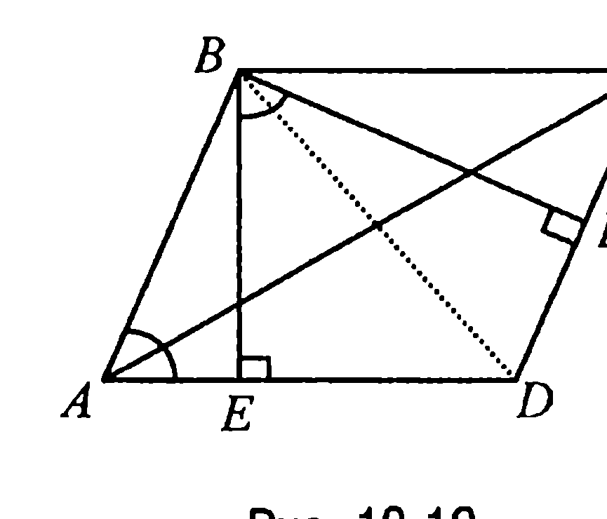

По условию $\angle EBF=\alpha$. Но тогда и $\angle DAB=\alpha$, так как его стороны соответственно перпендикулярны сторонам угла $EBF$.

Из прямоугольных треугольников $BEA$ и $CFB$ находим $AB=\frac{a}{\sin\alpha}$ и $BC=\frac{b}{\sin\alpha}$.

Далее, из треугольника $ABD$ по теореме косинусов имеем

$$BD^2=AB^2+AD^2-2AB\cdot AD\cdot\cos\alpha=\frac{a^2+b^2-2ab\cos\alpha}{\sin^2\alpha}.$$

Воспользовавшись теперь свойством 13.5X, находим, что

---
**стр. 163**
---

$AC^2=2(AB^2+AD^2)-BD^2=\frac{a^2+b^2+2ab\cos\alpha}{\sin^2\alpha}$. Отсюда

$$AC=\frac{\sqrt{a^2+b^2+2ab\cos\alpha}}{\sin\alpha}.$$

**Ответ:** $\frac{\sqrt{a^2+b^2+2ab\cos\alpha}}{\sin\alpha}$.

▼ **13.7.** *В плоскости прямоугольника $ABCD$ отмечена произвольная точка $E$. Доказать, что если соединить точку $E$ с вершинами прямоугольника, то $AE^2+EC^2=BE^2+ED^2$.*

**Решение.** Опустим из точки $E$ перпендикуляр на сторону $AD$ прямоугольника $ABCD$ (или ее продолжение) и обозначим через $F$ и $K$ точки пересечения этого перпендикуляра с отрезками $AD$ и $BC$ (или их продолжениями) соответственно (рис. 13.13). Тогда из прямоугольных треугольников $EFA$ и $EFD$ находим, что $EF^2=AE^2-AF^2$ и $EF^2=ED^2-FD^2$, откуда $AE^2-AF^2=ED^2-FD^2$ или

$$AE^2-ED^2=AF^2-FD^2.$$

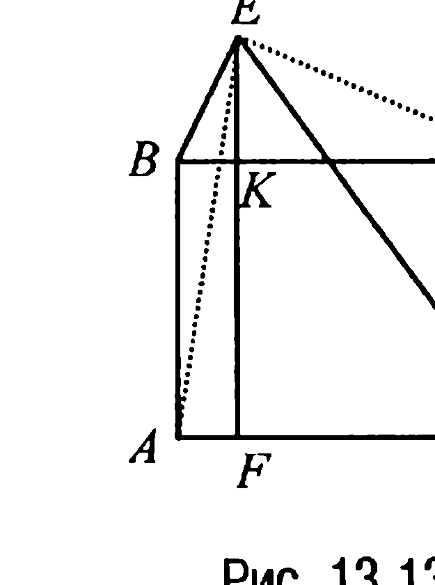

Далее, из рассмотрения прямоугольных треугольников $EKB$ и $EKC$ следует, что $EK^2=BE^2-BK^2$ и $EK^2=EC^2-KC^2$, откуда $BE^2-BK^2=EC^2-KC^2$.

Замечая теперь, что $AF=BK$, а $FD=KC$, приходим к выводу, что $AE^2-ED^2-BE^2+EC^2=0$ или $AE^2+EC^2=BE^2+ED^2$, а это и требовалось доказать.

**13.8.** *Доказать, что четырехугольник, образованный в результате пересечения биссектрис внутренних углов параллелограмма, является прямоугольником.*

**Решение.** Пусть $BL$, $DF$, $AF$ и $CL$ — биссектрисы углов $ABC$, $ADC$, $DAB$ и $BCD$ параллелограмма $ABCD$ соответственно, а $EFKL$ — четырехугольник, образованный в результате пересечения указанных биссектрис (рис. 13.14). Тогда так как

---
**стр. 164**
---

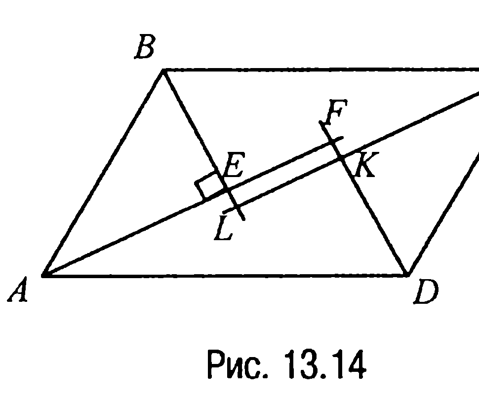

$\angle DAB+\angle ABC=180^\circ$, то $\angle BEA=180^\circ-\left(\frac{1}{2}\angle DAB+\frac{1}{2}\angle ABC\right)=90^\circ$ и, значит, $\angle LEF=90^\circ$. Аналогично доказывается, что и остальные три угла четырехугольника $EFKL$ — прямые, а это и доказывает требуемое.

**13.9.** *Высота ромба делит его сторону на отрезки, равные $m$ и $n$. Найти диагонали ромба.*

**Решение.** Пусть $BE$ — высота ромба $ABCD$, $AE=m$, $ED=n$, $O$ — точка пересечения диагоналей ромба (рис. 13.15). Тогда из прямоугольного треугольника $DEB$ находим, что $BE^2=BD^2-ED^2=BD^2-n^2$. Из прямоугольного же треугольника $BEA$ находим $BE^2=AB^2-AE^2=(m+n)^2-m^2$. Таким образом, $BD^2-n^2=(m+n)^2-m^2$, откуда $BD=\sqrt{2n(m+n)}$.

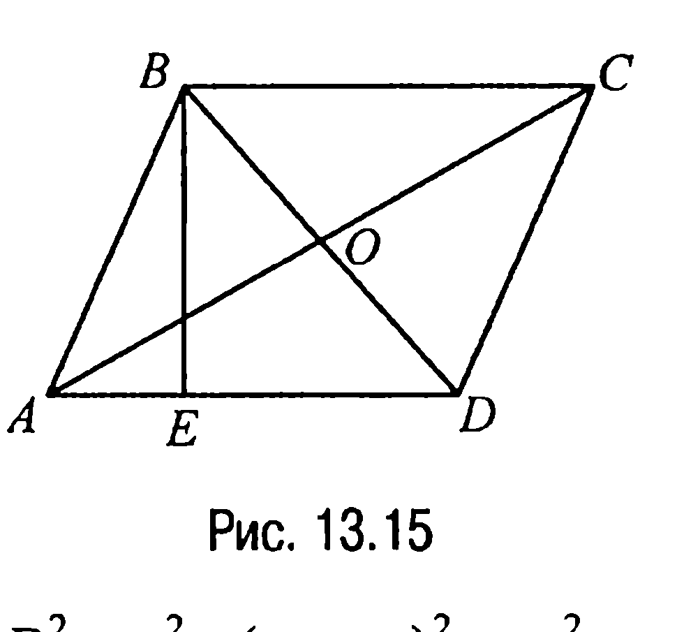

Если рассмотреть теперь прямоугольный треугольник $BOA$, то в этом треугольнике $AO=\sqrt{AB^2-BO^2}=\sqrt{(m+n)^2-\frac{1}{2}n(m+n)}=\frac{1}{2}\sqrt{2(2m^2+3mn+n^2)}$ и, значит, $AC=\sqrt{2(2m^2+3mn+n^2)}$.

**Ответ:** $\sqrt{2n(m+n)}$; $\sqrt{2(2m^2+3mn+n^2)}$.

**13.10.** *На сторонах $AB$ и $AD$ ромба $ABCD$ отмечены точки $M$ и $N$ соответственно таким образом, что отрезки $MC$ и $NC$ делят ромб на три равновеликие фигуры. Найти $MN$, если $BD=d$.*

**Решение.** Пусть $E$ — основание перпендикуляра, опущенного из точки $C$ на продолжение стороны $AB$ параллелограмма $ABCD$ (рис. 13.16). По условию

---
**стр. 165**
---

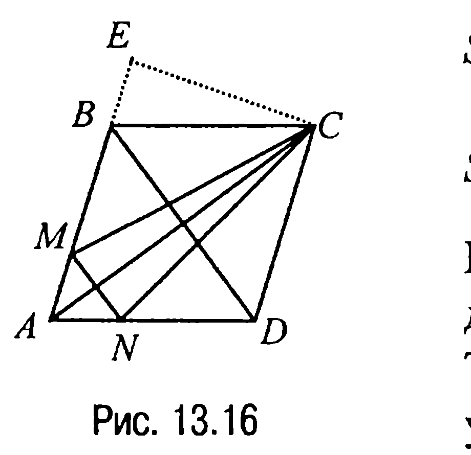

$S_{\Delta MBC} = \frac{1}{2} MB \cdot EC = \frac{1}{3} S_{ABCD}$,

$S_{\Delta AMC} = \frac{1}{2} AM \cdot EC = \frac{1}{6} S_{ABCD}$.

Поэтому $AM : MB = 1 : 2$. Аналогично доказывается, что и $AN : ND = 1 : 2$. Таким образом, $MN \parallel BD$ и, значит, треугольники $AMN$ и $ABD$ подобны. Но в таком случае $\frac{BD}{MN} = \frac{AD}{AN}$ или $\frac{d}{MN} = \frac{3}{1}$, откуда следует, что $MN = \frac{d}{3}$.

**Ответ:** $MN = \frac{d}{3}$.

**13.11.** *Определить острый угол ромба, в котором сторона есть среднее геометрическое его диагоналей.*

**Решение.** Пусть сторона ромба $ABCD$ равна $a$, $\angle BAD = \alpha$ — острый угол ромба, а $AC = d_1$ и $BD = d_2$ — его диагонали (рис. 13.17). По условию $a^2 = d_1 \cdot d_2$, а по теореме косинусов из треугольников $ACD$ и $ABD$ соответственно имеем

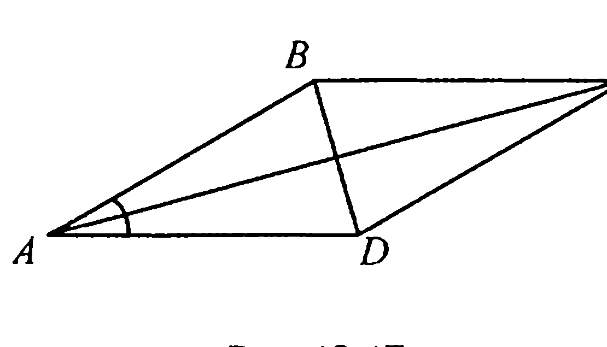

$d_1^2 = 2a^2 + 2a^2 \cdot \cos \alpha = 2a^2(1 + \cos \alpha) = 4a^2 \cdot \cos^2 \frac{\alpha}{2}$,

$d_2^2 = 2a^2 - 2a^2 \cdot \cos \alpha = 2a^2(1 - \cos \alpha) = 4a^2 \cdot \sin^2 \frac{\alpha}{2}$.

Отсюда $d_1 = 2a \cdot \cos \frac{\alpha}{2}$, $d_2 = 2a \cdot \sin \frac{\alpha}{2}$ и, значит, с учетом условия получаем, что $a^2 = 4a^2 \sin \frac{\alpha}{2} \cos \frac{\alpha}{2}$ или $\sin \alpha = \frac{1}{2}$, откуда $\alpha = 30^\circ$.

**Ответ:** $30^\circ$.

---
**стр. 166**
---

**13.12.** *Найти радиус окружности, проходящей через вершину $A$ квадрата $ABCD$, через его центр и середину отрезка $BC$, если сторона квадрата равна $a$.*

**Решение.** Пусть точка $E$ — центр квадрата $ABCD$, а $F$ — середина отрезка $BC$ (рис. 13.18). Тогда так как треугольник $AFE$ является вписанным в окружность с центром $O$, то радиус $R$ этой окружности можно найти по формуле

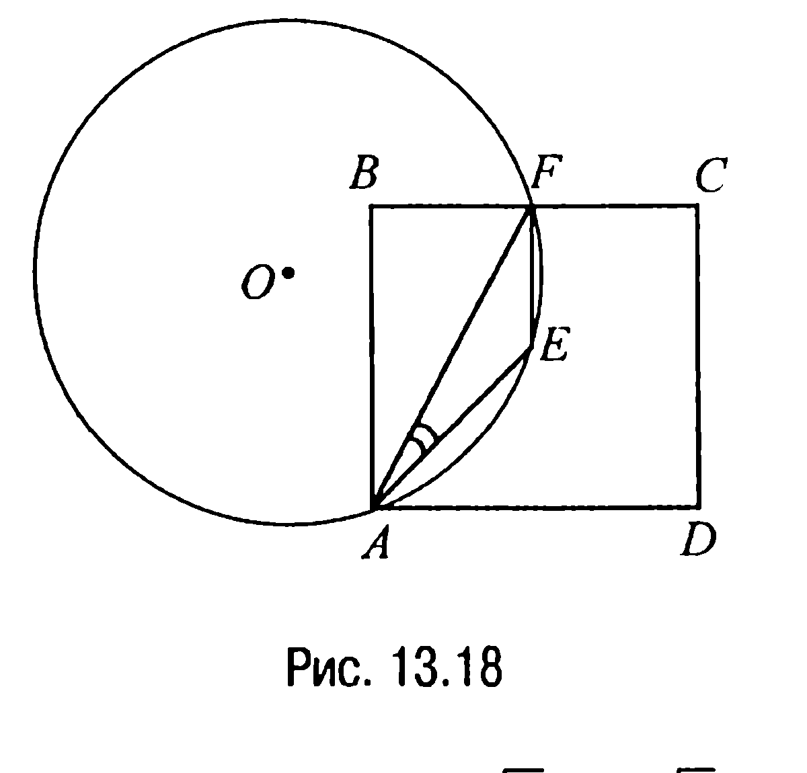

$$R = \frac{FE}{2 \sin \alpha}, \text{ где } \alpha = \angle EAF.$$

Но $FE = \frac{a}{2}$, $AE = \frac{\sqrt{2}}{2}a$, $AF = \frac{\sqrt{5}}{2}a$

и по теореме косинусов

$$\frac{a^2}{4} = \frac{a^2}{2} + \frac{5}{4}a^2 - 2 \cdot \frac{\sqrt{2}}{2}a \cdot \frac{\sqrt{5}}{2}a \cdot \cos \alpha.$$

Отсюда находим, что $\cos \alpha = \frac{3}{\sqrt{10}}$ и, значит, $\sin \alpha = \frac{1}{\sqrt{10}}$. Таким образом, $R = \frac{a\sqrt{10}}{4}$.

**Ответ:** $\frac{a\sqrt{10}}{4}$.

**13.13.** *На сторонах квадрата $ABCD$ отмечены точки $M, N$ и $K$, где $M$ — середина $AB$, $N$ лежит на стороне $BC$, причем $2BN = NC$, $K$ лежит на стороне $DA$, причем $2DK = KA$. Найти синус угла между прямыми $MC$ и $NK$.*

**Решение.** Пусть $O$ — центр квадрата $ABCD$, $NE$ — высота трапеции $MNCO$, $P$ — точка пересечения прямых $MC$ и $NK$, $\angle CPN = \alpha$ (рис. 13.19).

Тогда, с одной стороны, площадь трапеции $MNCO$

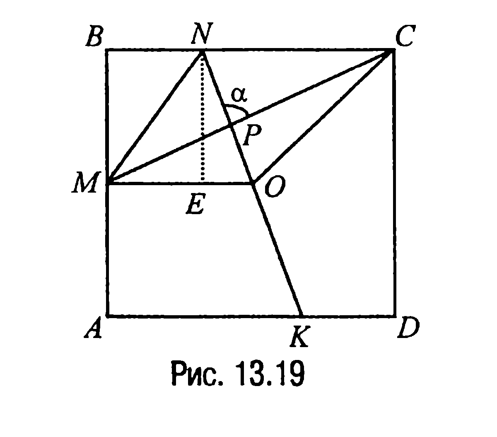

$$S_{MNCO} = \frac{1}{2} MC \cdot NO \cdot \sin \alpha,$$

а, с другой,

$$S_{MNCO} = \frac{1}{2}(MO + NC) \cdot NE$$

---
**стр. 167**
---

и, таким образом, $MC \cdot NO \cdot \sin \alpha = (MO + NC) \cdot NE$ или $\sin \alpha = \frac{(MO + NC)NE}{MC \cdot NO}$. А тогда поскольку из условий задачи следует, что $MO = NE = \frac{3}{2}$, $NC = 2$, $MC = \sqrt{3^2 + \left(\frac{3}{2}\right)^2} = \frac{3\sqrt{5}}{2}$,

$NO = \sqrt{\left(\frac{3}{2}\right)^2 + \left(\frac{1}{2}\right)^2} = \frac{\sqrt{10}}{2}$, то $\sin \alpha = \frac{\left(\frac{3}{2} + 2\right) \cdot \frac{3}{2}}{\frac{3\sqrt{5}}{2} \cdot \frac{\sqrt{10}}{2}} = \frac{7}{\sqrt{50}} = \frac{7\sqrt{2}}{10}$.

**Ответ:** $\frac{7\sqrt{2}}{10}$.

**13.14.** *Сторона квадрата равна $a$, произведения расстояний от противолежащих вершин до прямой $l$ равны между собой. Найти расстояние от центра квадрата до прямой $l$, если известно, что ни одна из сторон квадрата не параллельна $l$.*

**Решение.** Пусть $O$ — точка пересечения диагоналей квадрата $ABCD$, $A_1$, $D_1$, $O_1$, $B_1$ и $C_1$ — проекции точек $A$, $D$, $O$, $B$ и $C$ соответственно на прямую $l$ и пусть $\phi$ — острый угол между диагональю $BD$ квадрата и прямой $l$ (рис. 13.20). Обозначим $OO_1 = x$. Тогда если $OE \perp AA_1$, $DM \perp OE$, $OF \perp BB_1$, $CN \perp OO_1$, то так как $\angle EAO = \angle MOD = \angle NOC = \angle FOB = \phi$, получаем, что

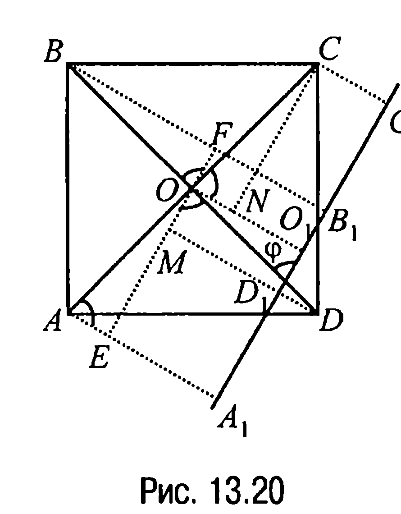

$AA_1 = x + AE = x + \frac{a\sqrt{2}}{2} \cos \phi,$

$DD_1 = |DM - x| = \left| \frac{a\sqrt{2}}{2} \sin \phi - x \right| = \left| x - \frac{a\sqrt{2}}{2} \sin \phi \right|,$

$BB_1 = x + BF = x + \frac{a\sqrt{2}}{2} \sin \phi$, $CC_1 = |x - ON| = \left| x - \frac{a\sqrt{2}}{2} \cos \phi \right|$.

---
**стр. 168**
---

Но по условию $AA_1 \cdot CC_1 = DD_1 \cdot BB_1$, или

$\left(x + \frac{a\sqrt{2}}{2} \cos \phi\right) \left|x - \frac{a\sqrt{2}}{2} \cos \phi\right| = \left(x + \frac{a\sqrt{2}}{2} \sin \phi\right) \left|x - \frac{a\sqrt{2}}{2} \sin \phi\right|$, или

$\left|x^2 - \frac{a^2}{2} \cos^2 \phi\right| = \left|x^2 - \frac{a^2}{2} \sin^2 \phi\right|$. Таким образом, учитывая, что прямая $l$ не параллельна ни одной из диагоналей квадрата $ABCD$, приходим к уравнению $x^2 = \frac{a^2}{4}$, откуда $x = \frac{a}{2}$.

**Ответ:** $\frac{a}{2}$.

**ЗАДАЧИ ДЛЯ САМОСТОЯТЕЛЬНОГО РЕШЕНИЯ**

**13.1С.** *Доказать, что середины сторон прямоугольника являются вершинами ромба.*

**13.2С.** *Доказать, что середины сторон ромба являются вершинами прямоугольника.*

**13.3С.** *Доказать, что если на диагоналях $AC$ и $BD$ выпуклого четырехугольника $ABCD$ найдутся соответственно точки $P$ и $Q$ такие, что $AB \cdot PF = AD \cdot PE$, $BC \cdot PG = DC \cdot PH$, а $AB \cdot QL = BC \cdot QM$, $AD \cdot QN = DC \cdot QR$, где $PF \perp AB$, $PE \perp AD$, $PG \perp BC$, $PH \perp DC$, $QL \perp AB$, $QM \perp BC$, $QN \perp AD$, $QR \perp DC$, то четырехугольник $ABCD$ — параллелограмм.*

**13.4С.** *В параллелограмме $ABCD$ известны $AB = a$, $BC = b$, $\angle ABC = \alpha$. Найти расстояние между центрами окружностей, описанных около треугольников $BCD$ и $DAB$.*

**13.5С (Задача Ферма).** *Дан прямоугольник $ABCD$, в котором $AB = 2a$, $BC = a\sqrt{2}$. На стороне $AB$ как на диаметре во внешнюю сторону проведена полуокружность. Пусть $M$ — произвольная точка на полуокружности, прямая $MD$ пересекает $AB$ в точке $N$, а прямая $MC$ — в точке $L$. Найти сумму $AL^2 + BN^2$.*

---
**стр. 169**
---

**13.6С.** *Доказать, что четырехугольник, образованный в результате пересечения биссектрис внешних углов параллелограмма, является прямоугольником.*

**13.7С.** *В прямоугольнике расстояние от точки пересечения диагоналей до одной из сторон равно 5, а расстояние от середины этой стороны до диагонали равно 4. Найти площадь прямоугольника.*

**13.8С.** *В прямоугольник вписана окружность таким образом, что она касается трех его сторон и проходит через точку пересечения диагоналей. В один из получившихся криволинейных треугольников вписана окружность. Найти ее радиус, если диагональ прямоугольника равна $d$.*

**13.9С.** *В прямоугольнике со сторонами $a$ и $b$ ($a \ne b$) проведены биссектрисы всех углов до взаимного пересечения. Найти периметр четырехугольника, образованного биссектрисами.*

**13.10С.** *Доказать, что если в четырехугольнике диагонали лежат на биссектрисах его углов, то такой четырехугольник — ромб.*

**13.11С.** *В параллелограмме $ABCD$ известны $AB = a$, $AD = b$ ($b > a$), $\angle BAD = \alpha$ ($\alpha < 90^\circ$). На сторонах $AD$ и $BC$ отмечены точки $E$ и $F$ соответственно таким образом, что четырехугольник $BFDE$ — ромб. Найти сторону этого ромба.*

**13.12С.** *Найти углы ромба, если площадь вписанного в него круга вдвое меньше площади ромба.*

**13.13С.** *Площадь ромба равна $S$, сумма его диагоналей равна $m$. Найти сторону ромба.*

**13.14С.** *Найти площадь общей части двух квадратов, если у каждого из них сторона равна $a$ и один получается из другого поворотом вокруг вершины на угол $45^\circ$.*
