## 2.2. Трапеция

---
**стр. 170**
---

**13.15С.** *Дан квадрат $ABCD$ со стороной $a$. Определить расстояние между серединой отрезка $AM$, где $M$ — середина $BC$, и точкой $N$ на стороне $CD$, делящей последнюю таким образом, что $CN : ND = 3 : 1$.*

## § 14. ТРАПЕЦИЯ

***Трапеция*** — *это четырехугольник, у которого две стороны параллельны, а две другие стороны не параллельны.*

Параллельные стороны называются **основаниями** трапеции, а непараллельные — ее **боковыми сторонами**.

Отрезок перпендикуляра от любой точки одного основания трапеции до ее другого основания (или его продолжения) называется **высотой трапеции**.

Отрезок, соединяющий середины боковых сторон трапеции, называется **средней линией трапеции**.

Трапеция, у которой боковые стороны равны, называется **равнобочной (равнобедренной или равнобокой) трапецией**.

Трапеция называется **прямоугольной**, если одна из ее боковых сторон перпендикулярна основаниям.

**14.1. Свойства произвольной трапеции**

**Свойство 14.1.** *Во всякой трапеции середины боковых сторон и середины диагоналей лежат на одной прямой.*

**Доказательство.** Пусть $ABCD$ — трапеция и $M$ — середина боковой стороны $AB$ (рис. 14.1). Проведем через точку $M$ прямую, параллельную одному из оснований (а значит, и обоим основаниям) трапеции и обозначим через $P$, $Q$ и $N$ точки пересечения прове-

---
**стр. 171**
---

денной прямой с диагоналями трапеции $AC$, $BD$ и ее боковой стороной $CD$ соответственно. Докажем, что точки $P$, $Q$ и $N$ будут серединными точками соответствующих отрезков. Действительно, в треугольнике $ABC$ прямая $MP \parallel BC$, $AM = MB$ и, значит, по теореме Фалеса $AP = PC$.

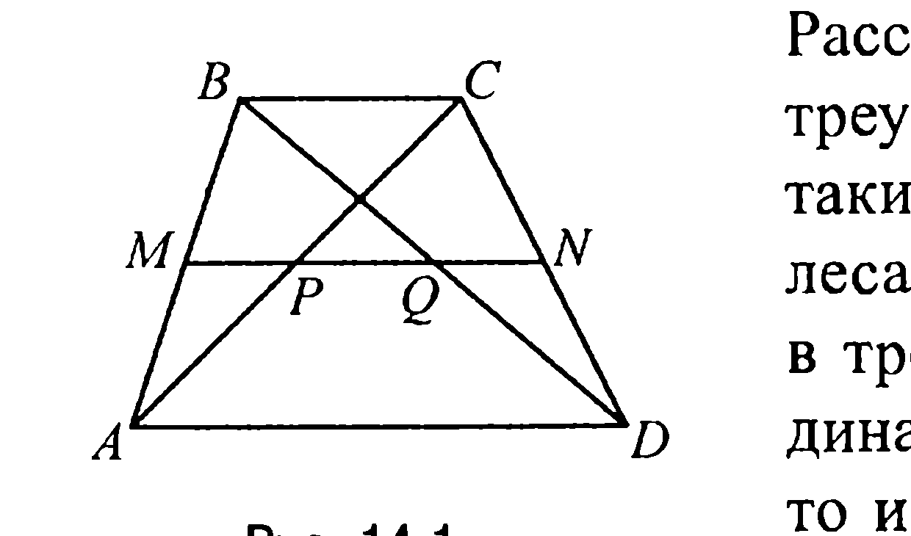

Рассмотрим треугольник $ABD$. В этом треугольнике $MQ \parallel AD$, $AM = MB$ и, таким образом, снова по теореме Фалеса $BQ = QD$. Но отсюда следует, что в треугольнике $BCD$ точка $Q$ — середина стороны $BD$, а так как $MN \parallel BC$, то и $QN \parallel BC$. Ссылка на теорему Фалеса в этом случае приводит к равенству $CN = ND$, что и доказывает требуемое.

**Свойство 14.2.** *Во всякой трапеции середины оснований, точка пересечения диагоналей и точка пересечения продолжений боковых сторон лежат на одной прямой.*

**Доказательство.** Пусть $AD$ и $BC$ — основания трапеции, $K$ — точка пересечения продолжений боковых сторон, $L$ — точка пересечения диагоналей трапеции, $M$ и $N$ — точки пересечения прямой $KL$ с основаниями $BC$ и $AD$ соответственно (рис. 14.2). Докажем, что $M$ и $N$ — середины отрезков $BC$ и $AD$.

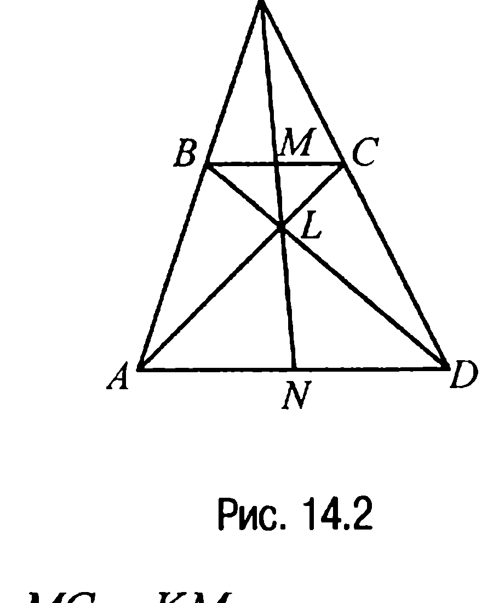

Действительно, так как треугольники $BKM$ и $AKN$, а также треугольники $MKC$ и $NKD$, подобны, то $\frac{BM}{AN} = \frac{KM}{KN}$, $\frac{MC}{ND} = \frac{KM}{KN}$ и, значит, $\frac{BM}{AN} = \frac{MC}{ND}$.

С другой стороны, так как подобными являются треугольники $BML$ и $DNL$, а также треугольники $CLM$ и $ALN$, то справедливы равенства $\frac{BM}{ND} = \frac{ML}{LN}$ и $\frac{MC}{AN} = \frac{ML}{LN}$, поэтому $\frac{BM}{ND} = \frac{MC}{AN}$.

---
**стр. 172**
---

Но тогда, перемножая соответственно левые и правые части полученного равенства и равенства $\frac{BM}{AN} = \frac{MC}{ND}$, имеем $\frac{BM^2}{AN \cdot ND} = \frac{MC^2}{AN \cdot ND}$, откуда следует, что $BM = MC$ и, следовательно, что $AN = ND$. А это и завершает доказательство.

**Свойство 14.3.** *Пусть $ABCD$ — трапеция с основаниями $AD$ и $BC$, $E$ — точка пересечения ее диагоналей. Тогда треугольники $ABE$ и $CDE$ равновелики.*

**Доказательство.** Так как $AD \parallel BC$, то треугольники $ABD$ и $ACD$

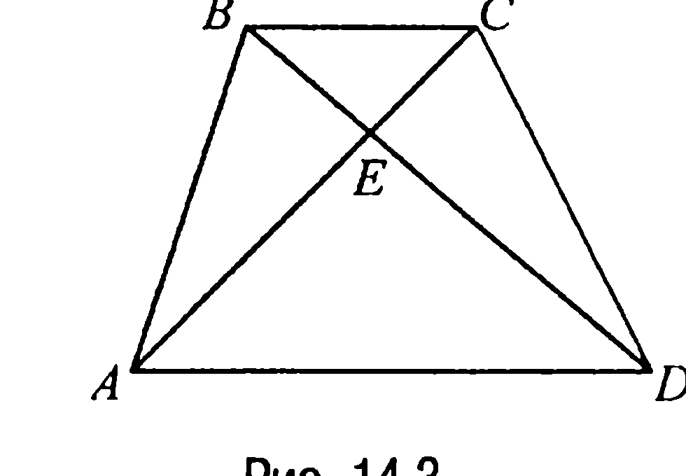

(рис. 14.3) равновелики (поскольку у них общее основание и равные высоты). Но у этих двух равновеликих треугольников треугольник $AED$ является общим. Отсюда и следует равновеликость треугольников $ABE$ и $CDE$.

**Свойство 14.4.** *Во всякой трапеции отрезок, соединяющий середины диагоналей, параллелен основаниям трапеции и равен их полуразности.*

**Доказательство.** Параллельность соединяющего середины диагоналей трапеции отрезка основаниям трапеции следует из параллельности этих оснований и доказательства свойства 14.1. Докажем вторую часть утверждения свойства 14.4. Предположим для определенности, что $AD > BC$. Тогда так как $MQ$ — средняя линия треугольника $ABD$ (рис. 14.1), то $MQ = \frac{1}{2} AD$, а так как $MP$ — средняя линия треугольника $ABC$ (рис. 14.1), то $MP = \frac{1}{2} BC$. Отсюда и следует, что $PQ = MQ - MP = \frac{1}{2}(AD - BC)$.

---
**стр. 173**
---

**Свойство 14.5X.** *Во всякой трапеции ее средняя линия параллельна основаниям и равна их полусумме.*

**Доказательство.** Параллельность средней линии трапеции ее основаниям очевидна (см. доказательство свойства 14.1). Докажем вторую часть утверждения. Итак, поскольку $MQ$ и $QN$ — средние линии треугольников $ABD$ и $BCD$ (рис. 14.1) соответственно, то $MQ = \frac{1}{2} AD$, $QN = \frac{1}{2} BC$. Отсюда следует, что

$$MN = MQ + QN = \frac{1}{2}(AD + BC).$$

**Свойство 14.6.** *Во всякой трапеции сумма квадратов диагоналей равна сумме квадратов боковых сторон и удвоенного произведения оснований трапеции.*

**Доказательство.** Пусть $ABCD$ — данная трапеция и пусть для определенности $BC < AD$, а $E$ и $F$ — основания перпендикуляров, опущенных из точек $B$ и $C$ соответственно на прямую $AD$ (рис. 14.4 — 14.6).

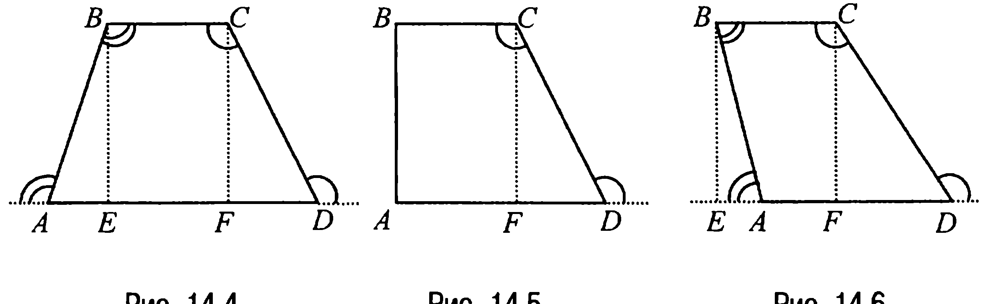

Из треугольников $BCD$ и $ABC$ по теореме косинусов имеем:

$$BD^2 = BC^2 + CD^2 - 2BC \cdot CD \cdot \cos\angle BCD,$$

$$AC^2 = AB^2 + BC^2 - 2AB \cdot BC \cdot \cos\angle ABC.$$

Но в таком случае (учитывая, что $BC = EF$)

$$BD^2 + AC^2 = AB^2 + CD^2 + 2BC (EF - CD \cdot \cos\angle BCD - AB \cdot \cos\angle ABC).$$

Рассмотрим три возможности: оба угла при нижнем основании $AD$ острые (рис. 14.4), один из углов (пусть $\angle BAD$) прямой (рис. 14.5), один из этих углов (пусть $\angle BAD$) тупой (рис. 14.6).

Во всех трех случаях угол $BCD$ тупой и

$$(-CD) \cdot \cos\angle BCD = CD \cdot \cos\angle ADC = FD.$$

---
**стр. 174**
---

В первом случае $(-AB) \cdot \cos \angle ABC = AB \cdot \cos \angle BAD = AE$, во втором случае $AB \cdot \cos \angle ABC = 0$, в третьем случае $(-AB) \cdot \cos \angle ABC = -AB \cdot \cos \angle BAE = -AE$. Таким образом, очевидно, что в любом случае $EF - CD \cdot \cos \angle BCD - AB \cdot \cos \angle ABC = AD$, что и требовалось доказать.

**14.2. Свойства равнобочной трапеции**

**Свойство 14.7.** *В равнобочной трапеции углы при основании равны.*

**Доказательство.** Пусть $AD$ — основание равнобочной трапеции $ABCD$ (рис. 14.7) и пусть $CE \parallel AB$. Тогда $\angle DEC = \angle DAB$, а поскольку треугольник $ECD$ — равнобедренный ($EC = CD$), то ссылка на свойство 1.19X и завершает доказательство. <!-- вероятная опечатка оригинала: «ссылка на свойство» -->

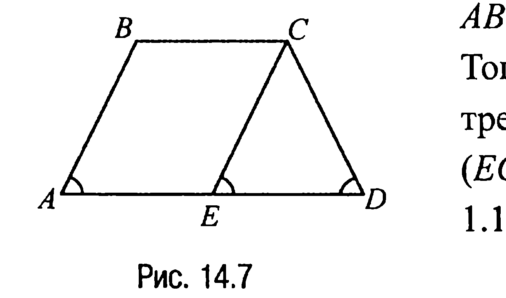

**Свойство 14.8.** *В равнобочной трапеции прямая, проходящая через середины оснований, перпендикулярна основаниям и является осью симметрии трапеции.*

**Доказательство.** Обозначим через $K$ точку пересечения продолжений боковых сторон равнобочной трапеции $ABCD$ (рис. 14.8). По свойству 14.2 середины оснований трапеции — точки $M$ и $N$, а также точка $K$ лежат на одной прямой. По свойству же 14.7 углы $BAD$ и $CDA$ равны и, таким образом, треугольник $AKD$ является равнобедренным. Но по свойству 1.18X его медиана $KN$ является и высотой и поэтому $MN \perp AD$. Вторая часть утверждения очевидным образом следует из того, что $BC \parallel AD \perp MN$, а $BM = MC$, $AN = ND$.

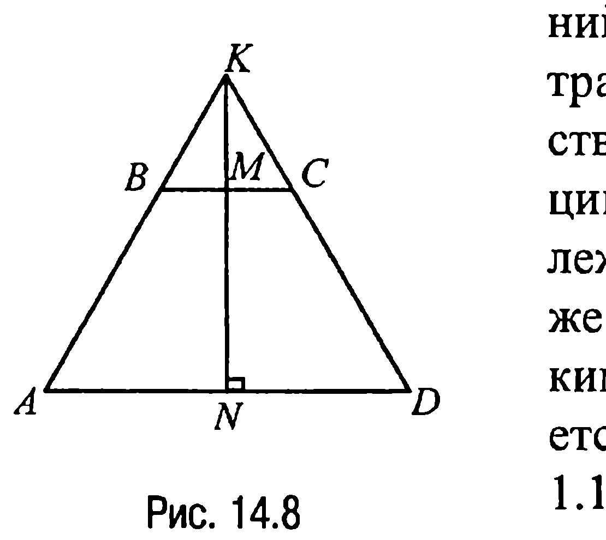

---
**стр. 175**
---

**Свойство 14.9Х.** *В равнобочной трапеции диагонали равны.*

**Доказательство.** Рассмотрим в равнобочной трапеции $ABCD$ с основанием $AD$ треугольники $ABD$ и $ACD$ (рис. 14.9). У этих треугольников сторона $AD$ — общая, стороны $AB$ и $CD$ равны, а $\angle BAD = \angle CDA$ (свойство 14.7). Поэтому по первому признаку равенства треугольников указанные выше треугольники равны. Но в равных треугольниках против равных углов лежат равные стороны и, таким образом, $AC = BD$, а это и требовалось доказать.

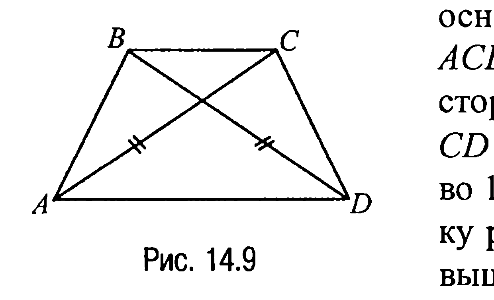

**Свойство 14.10.** *В равнобочной трапеции высота, опущенная из вершины на большее основание, делит его на два отрезка, один из которых равен полусумме оснований, другой — полуразности оснований.*

**Доказательство.** Из доказательства свойства 14.7 следует, что прямоугольные треугольники $BEA$ и $CFD$ (рис. 14.7) равны. Поэтому $AE = FD = \frac{1}{2}(AD - BC)$ и, следовательно, $ED = AD - AE = \frac{1}{2}(AD + BC)$, что и требовалось доказать.

**ЗАДАЧИ**

**14.1.** *Даны верхнее и нижнее основания трапеции $a$ и $b$ ($b > a$). Найти отрезок, соединяющий боковые стороны трапеции и лежащий на прямой, проходящей через точку пересечения диагоналей трапеции параллельно ее основаниям.*

**Решение.** Пусть $ABCD$ — трапеция, $BC = a$, $AD = b$, $O$ — точка пересечения диагоналей трапеции, $MN$ — отрезок с концевыми точками $M$ и $N$ на сторонах $AB$ и $CD$ соответственно, который параллелен отрезкам $BC$ и $AD$ (рис. 14.10).

---
**стр. 176**
---

Из условия задачи следует, что $\Delta AMO \sim \Delta ABC$, $\Delta MBO \sim \Delta ABD$ и, таким образом,

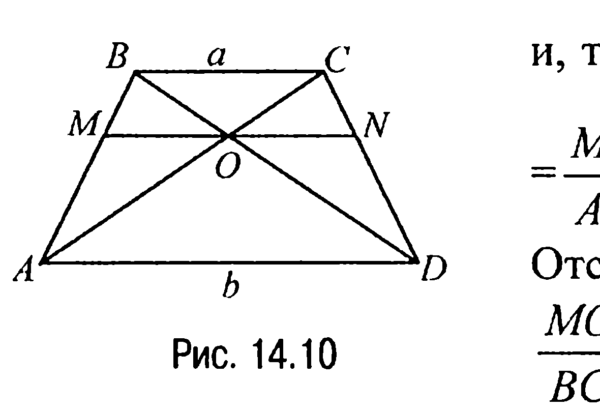

$\frac{MO}{BC} = \frac{AM}{AB}$, $\frac{MO}{AD} = \frac{MB}{AB} = \frac{AB - AM}{AB}$. Отсюда приходим к выводу, что $\frac{MO}{BC} + \frac{MO}{AD} = 1$, или, с учетом принятых обозначений, что $MO = \frac{ab}{a+b}$. Далее замечая, что $\Delta DON \sim \Delta DBC$, $\Delta OCN \sim \Delta ACD$, по аналогии с предыдущим случаем имеем $ON = \frac{ab}{a+b}$, а значит, $MN = MO + ON = \frac{2ab}{a+b}$.

**Ответ:** $\frac{2ab}{a+b}$.

**14.2.** *Основания трапеции равны $a$ и $b$. Отрезок длиной $c$, параллельный основаниям, имеет концы на боковых сторонах трапеции. В каком отношении этот отрезок делит боковые стороны трапеции ($a < c < b$)?*

**Решение.** Пусть в трапеции $ABCD$ (рис. 14.11) $BC = a$, $MN = c$,

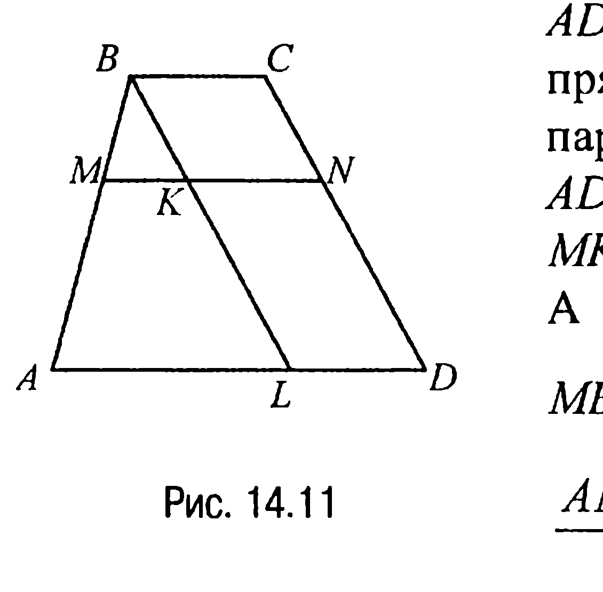

$AD = b$, а $K$ и $L$ — точки пересечения прямой, проходящей через вершину $B$ параллельно $CD$, с отрезками $MN$ и $AD$ соответственно. Тогда $AL = b - a$, $MK = c - a$. А поскольку треугольники $ABL$ и $MBK$ подобны, то $\frac{AB}{MB} = \frac{AL}{MK}$ или $\frac{AM + MB}{MB} = \frac{AM}{MB} + 1 = \frac{b - a}{c - a}$, откуда $\frac{AM}{MB} = \frac{b - a}{c - a} - 1 = \frac{b - c}{c - a}$. Очевидно, что и $\frac{DN}{NC} = \frac{b - c}{c - a}$.

**Ответ:** $\frac{b - c}{c - a}$ ($\frac{c - a}{b - c}$).

---
**стр. 177**
---

**14.3.** *Основания трапеции равны $a$ и $b$. Определить длину параллельного основаниям отрезка, который делит трапецию на две равновеликие фигуры.*

**Решение.** Рассмотрим трапецию $ABCD$ (рис. 14.12) и предположим для определённости, что $BC = a$, $AD = b$. Пусть $MN = x$ — искомый отрезок. Тогда если $E$ — точка пересечения продолжения боковых сторон трапеции, то треугольники $BEC$, $MEN$ и $AED$ будут подобными, а значит, если соответственно $S_1$, $S_2$ и $S_3$ — их площади, то из условия задачи следует, что $S_2 - S_1 = S_3 - S_2$ или $2S_2 = S_1 + S_3$, откуда $2\frac{S_2}{S_1} = 1 + \frac{S_3}{S_1}$. Но поскольку площади подобных фигур относятся как квадраты их соответствующих линейных размеров, то $2\frac{x^2}{a^2} = 1 + \frac{b^2}{a^2}$. Отсюда находим, что $x = \sqrt{\frac{a^2 + b^2}{2}}$.

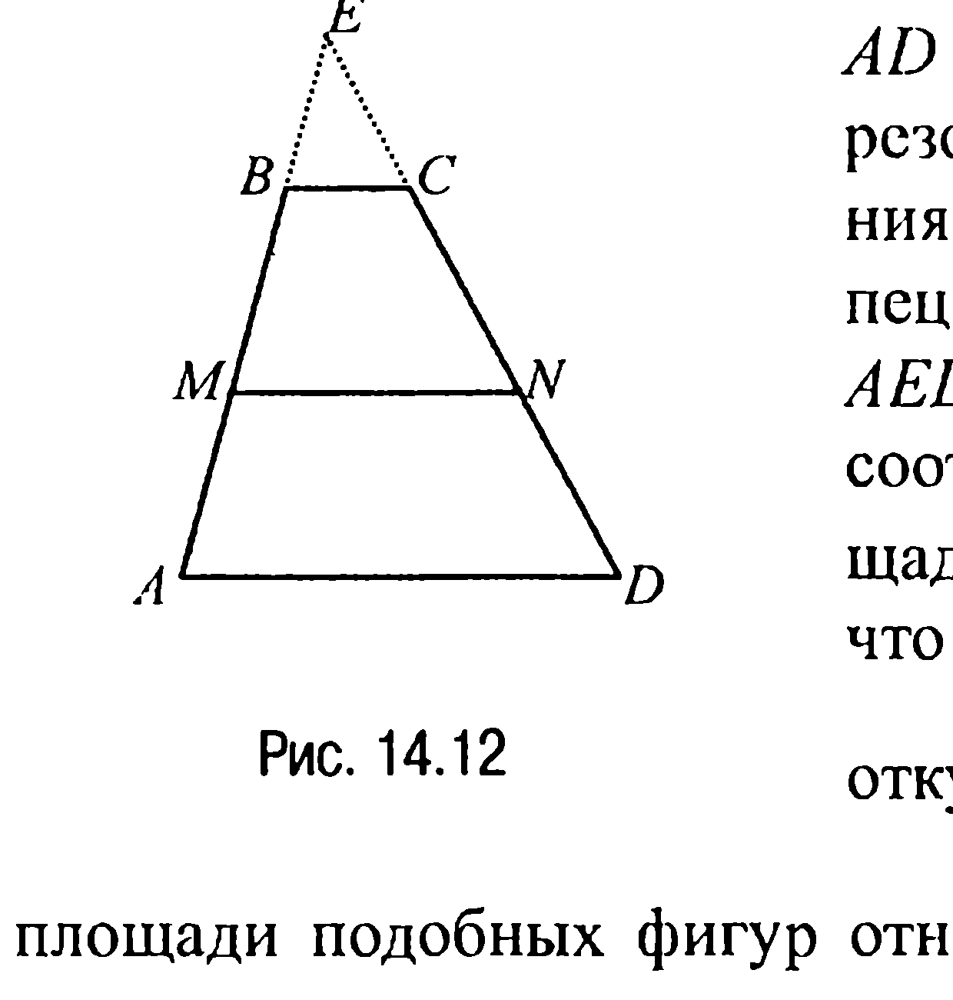

**Ответ:** $\sqrt{\frac{a^2 + b^2}{2}}$.

**14.4.** *Непараллельные стороны трапеции продолжены до взаимного пересечения и через полученную точку проведена прямая, параллельная основаниям трапеции. Найти отрезок прямой, ограниченный продолжениями диагоналей, если основания трапеции равны $a$ и $b$.*

**Решение.** Пусть $AD = a$, $BC = b$, $F$ — точка пересечения продолжений непараллельных сторон $AB$ и $CD$ трапеции $ABCD$, $E$ и $G$ — точки пересечения продолжений диагоналей трапеции с прямой, проходящей через точку $F$ параллельно основаниям трапеции (рис. 14.13). Тогда так как $\triangle AFD \sim \triangle BFC$, то $\frac{BC}{AD} = \frac{FC}{FD} = \frac{FB}{FA} = \frac{b}{a}$, а так как

---
**стр. 178**
---

$\Delta DEF \sim \Delta DBC$, то $\frac{CD}{FD} = \frac{BC}{EF}$. Но $\frac{CD}{FD} = \frac{FD - FC}{FD} = 1 - \frac{FC}{FD} = 1 - \frac{b}{a} = \frac{a - b}{a}$ и, значит, $\frac{BC}{EF} = \frac{b}{EF} = \frac{a - b}{a}$, откуда следует, что $EF = \frac{ab}{a - b}$. Аналогично доказывается, что $FG = \frac{ab}{a - b}$. Таким образом, $EG = EF + FG = \frac{2ab}{a - b}$.

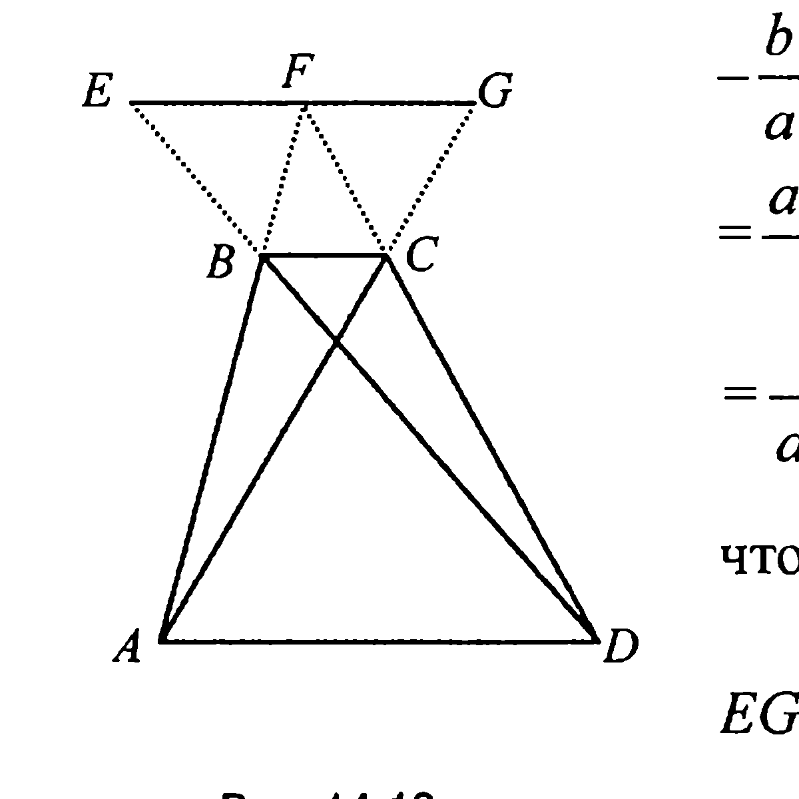

**Ответ:** $\frac{2ab}{a - b}$.

▼ **14.5.** *Найти площадь $S$ трапеции $ABCD$ с основаниями $AD$ и $BC$, если площади треугольников $AOD$ и $BOC$, где $O$ — точка пересечения диагоналей $AC$ и $BD$, равны соответственно $S_1$ и $S_2$.*

**Решение.** Треугольники $AOD$ и $COB$ (рис. 14.14) подобны, поэтому $\sqrt{\frac{S_1}{S_2}} = \frac{AO}{OC}$. С другой стороны, по свойству 1.12 имеет место равенство $\frac{S_{\Delta AOB}}{S_{\Delta BOC}} = \frac{AO}{OC}$ и, значит, $\sqrt{\frac{S_1}{S_2}} = \frac{S_{\Delta AOB}}{S_{\Delta BOC}} = \frac{S_{\Delta AOB}}{S_2}$, откуда находим, что $S_{\Delta AOB} = \sqrt{S_1 \cdot S_2}$. Но тогда $S = S_1 + S_2 + 2\sqrt{S_1 \cdot S_2} = (\sqrt{S_1} + \sqrt{S_2})^2$.

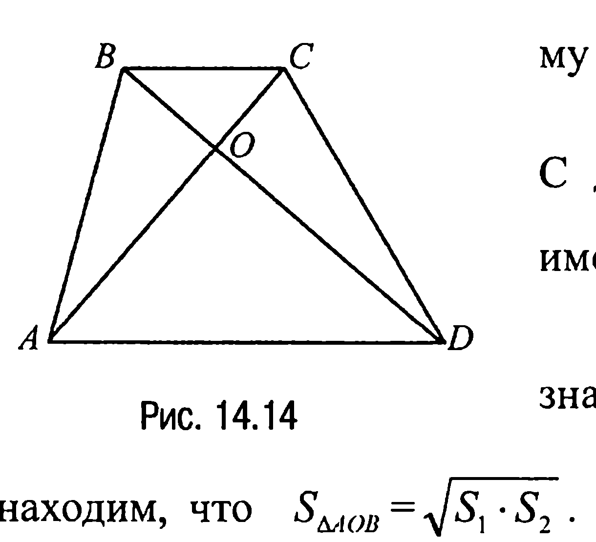

**Ответ:** $S = (\sqrt{S_1} + \sqrt{S_2})^2$.

---
**стр. 179**
---

**14.6.** *В трапеции $ABCD$ точка $E$ — середина основания $BC$, а точка $F$ — середина основания $AD$. Обозначим через $P$ точку пересечения отрезков $BF$ и $AE$, а через $Q$ — точку пересечения отрезков $ED$ и $CF$. Доказать, что отрезок $PQ$ параллелен основаниям трапеции.*

**Решение.** Так как $BC \parallel AD$, то $\angle BEP = \angle PAF$, $\angle PBE = \angle PFA$ и, значит, $\triangle BPE \sim \triangle APF$ (рис. 14.15). Отсюда следует, что $\frac{PE}{AP} = \frac{BE}{AF}$. Аналогично из подобия треугольников $EQC$ и $FQD$ имеем равенство $\frac{QE}{DQ} = \frac{EC}{FD}$. Но поскольку по условию $BE = EC$, а $AF = FD$, то из двух полученных пропорций следует равенство $\frac{PE}{AP} = \frac{QE}{DQ}$ или равенство $\frac{AP}{PE} = \frac{DQ}{QE}$. А тогда, составляя производную пропорцию $\frac{AP + PE}{PE} = \frac{DQ + QE}{QE}$, приходим к равенству $\frac{AE}{PE} = \frac{DE}{QE}$, которое означает, что треугольники $AED$ и $PEQ$ подобны (они имеют общий угол с вершиной $E$ и соответственно пропорциональные стороны). Но в подобных треугольниках соответственные углы равны, поэтому, исходя из последней пропорции, заключаем, что $\angle EPQ = \angle EAD$. А так как эти углы являются соответственными углами при пересечении прямых $PQ$ и $AD$ секущей $AE$, то отсюда вытекает, что $PQ \parallel AD$.

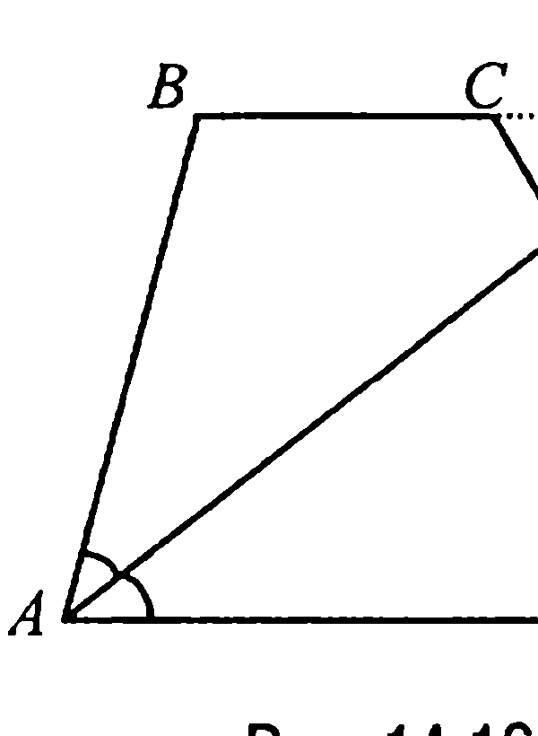

▼ **14.7.** *В трапеции $ABCD$ со стороной $AB = a$ и основанием $BC = b$ проведена биссектриса угла $DAB$. Определить, что она пересекает: основание $BC$ или боковую сторону $CD$?*

**Решение.** Пусть биссектриса угла $DAB$ пересекает сторону $BC$ трапеции $ABCD$ или ее продолжение в точке $E$ (рис. 14.16).

---
**стр. 180**
---

Тогда $\angle BAE = \angle EAD = \angle BEA$, т. е. треугольник $ABE$ — равнобедренный и, значит, $BE = AB = a$. Отсюда можно сделать вывод: если $b < a$, то биссектриса пересекает сторону $CD$; если $b > a$, то биссектриса пересекает основание $BC$; если же $b = a$, то биссектриса проходит через точку $C$.

**Ответ:** если $b < a$, то биссектриса пересекает сторону $CD$; если $b > a$, то биссектриса пересекает основание $BC$; если же $b = a$, то биссектриса проходит через точку $C$.

**14.8.** *Пусть $D$ — внутренняя точка треугольника $ABC$, через которую проходит медиана $BB_1$, и пусть $C_1$, $A_1$ — точки пересечения прямых $CD$ и $AD$ со сторонами $AB$ и $BC$ соответственно. Доказать, что четырехугольник $AC_1A_1C$ — трапеция.*

**Решение.** Рассмотрим треугольник $ABC$ (рис. 14.17). По свойству 1.13X справедливо равенство

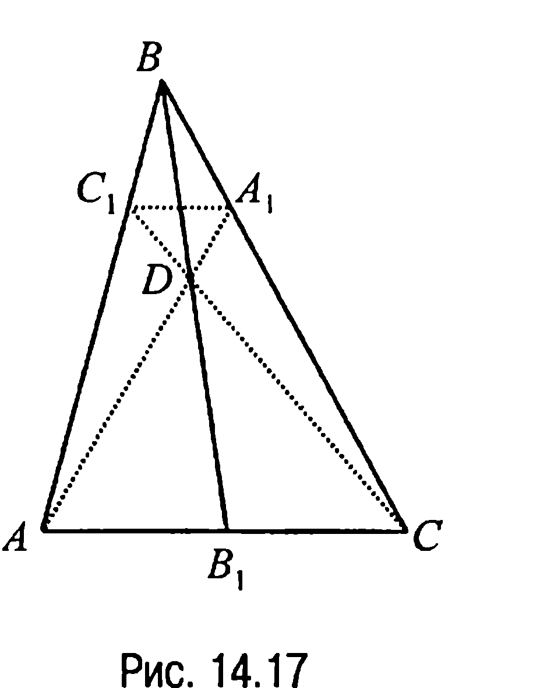

$$\frac{AC_1}{C_1B} \cdot \frac{A_1B}{CA_1} \cdot \frac{CB_1}{B_1A} = 1$$

или, так как по условию $CB_1 = B_1A$, равенство

$$\frac{AC_1}{C_1B} \cdot \frac{A_1B}{CA_1} = 1, \text{ откуда } \frac{AC_1}{C_1B} = \frac{CA_1}{A_1B}.$$

Но тогда в силу характеристичности свойства 3.2X получаем, что $C_1A_1 \parallel AC$, а это и означает, что четырехугольник $AC_1A_1C$ — трапеция.

$\blacktriangledown$ **14.9.** *Доказать, что биссектрисы углов, прилегающих к боковой стороне трапеции, пересекаются в точке, принадлежащей средней линии трапеции.*

**Решение.** Пусть $EF$ — средняя линия трапеции $ABCD$ (рис. 14.18), $Q$ — точка пересечения биссектрис углов $DAB$ и $ABC$. Тогда так как отрезок $QE$ — медиана треугольника $BQA$, прове-

---
**стр. 181**
---

денная из его прямого угла $BQA$ ($BC \parallel AD$ и, значит, по свойству биссектрис 8.5X отрезок $BQ \perp AQ$), то треугольник $AEQ$ является равнобедренным и, таким образом, $\angle QAE = \angle EQA = \angle DAQ$. Но в таком случае $EQ \parallel AD$. Средняя же линия $EF$ также параллельна $AD$, поэтому, поскольку через точку $E$ можно провести только одну прямую, параллельную $AD$, точка $Q$ принадлежит средней линии $EF$.

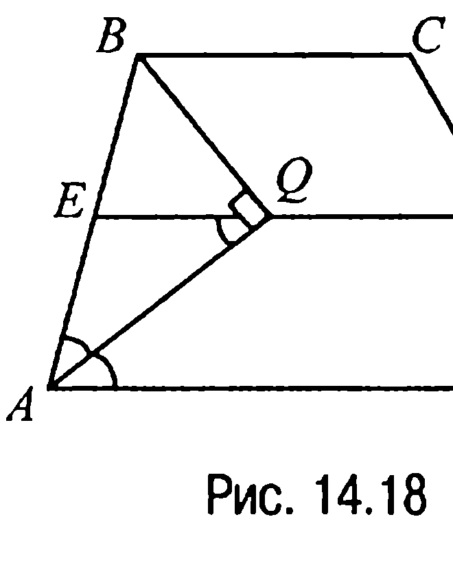

**14.10.** *Диагонали трапеции равны 6 и 8, а отрезок, соединяющий середины оснований, равен 5. Найти площадь трапеции.*

**Решение.** Рассмотрим трапецию $ABCD$ с диагоналями $AC = 8$ и $BD = 6$ (рис. 14.19), у которой точки $P$ и $Q$ — середины оснований $BC$ и $AD$ соответственно, а $E$ — точка пересечения прямой, проходящей через вершину $B$ параллельно диагонали $AC$ трапеции, с продолжением основания $DA$.

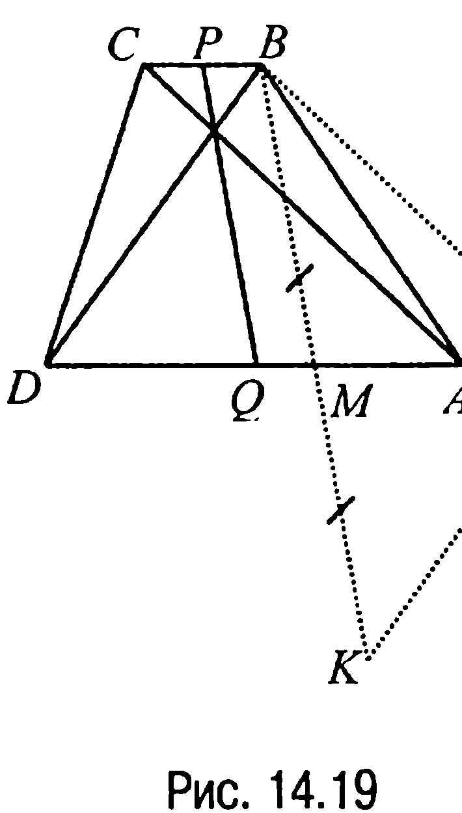

Тогда если $BM \parallel PQ$, то отрезок $BM = PQ = 5$ будет медианой треугольника $DBE$ со сторонами $BE = CA = 8$, $DB = 6$, площадь которого равна площади трапеции $ABCD$.

Продолжим медиану $BM$ за точку $M$ на расстояние, равное ее длине, и рассмотрим треугольник $BEK$. Очевидно, что этот треугольник равновелик треугольнику $DBE$, а значит, и трапеции $ABCD$.

А так как треугольник $BEK$ — прямоугольный с прямым углом $BEK$ ($KB^2 = BE^2 + EK^2 (= 100)$), то площадь трапеции

$$S = \frac{1}{2} BE \cdot EK = \frac{1}{2} \cdot 6 \cdot 8 = 24.$$

**Ответ:** 24.

---
**стр. 182**
---

$\blacktriangledown$ **14.11.** *Середина боковой стороны трапеции соединена отрезками с концами другой боковой стороны. Найти площадь трапеции, если площадь получившегося треугольника равна $S$.*

**Решение.** Пусть точка $E$ — середина боковой стороны $AB$ трапеции $ABCD$ (рис. 14.20). Проведем среднюю линию $EF$ трапеции. Тогда трапеции $AEFD$ и $EBCF$ имеют одну и ту же по величине высоту $h$. А поскольку справедливы равенства

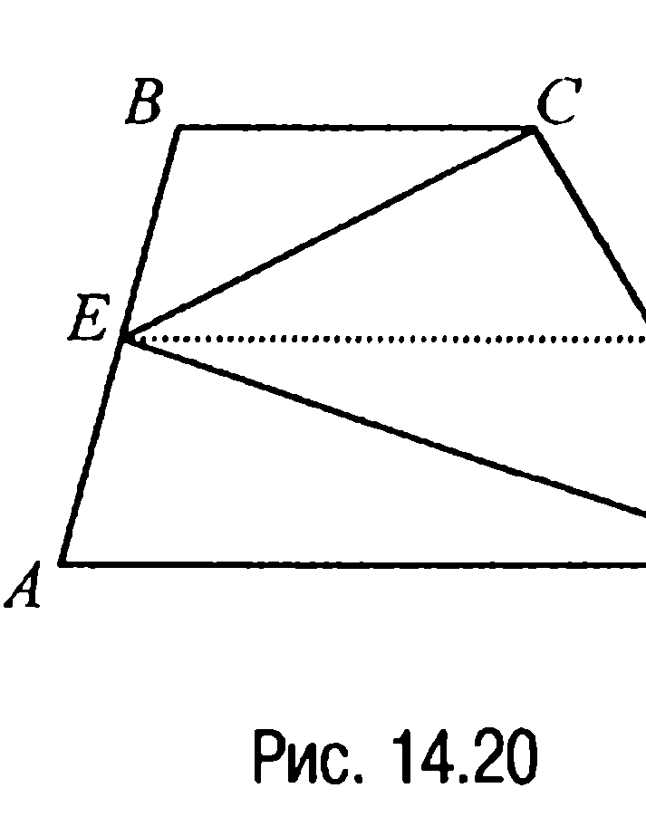

$S = S_{\Delta ECF} + S_{\Delta DEF} = \frac{1}{2} \cdot EF \cdot h + +\frac{1}{2} \cdot EF \cdot h = EF \cdot h$, $S_{\Delta AED} + S_{\Delta BCE} = = \frac{1}{2}(AD + BC) \cdot h = EF \cdot h = S$, то приходим к выводу, что площадь трапеции равна $2S$.

**Ответ:** $2S$.

**ЗАДАЧИ ДЛЯ САМОСТОЯТЕЛЬНОГО РЕШЕНИЯ**

**14.1С.** *Диагонали прямоугольной трапеции взаимно перпендикулярны, а ее основания равны $a$ и $b$. Найти высоту трапеции.*

**14.2С.** *Основания трапеции равны $a$ и $b$. Точки $M$ и $N$ на ее боковых сторонах таковы, что прямая $MN$ параллельна основаниям и делит трапецию на две подобные трапеции. Найти длину отрезка $MN$.*

**14.3С.** *Диагонали трапеции равны 6 и 8, а средняя линия равна 5. Найти площадь трапеции.*

**14.4С.** *В равнобочной трапеции $ABCD$ основания $AD$ и $BC$ равны соответственно 12 и 6, а высота трапеции равна 4. Какой из углов $BAC$ и $CAD$ является бо́льшим?*
