## 2.3. Вписанные и описанные четырехугольники

---
**стр. 183**
---

*14.5C.* В равнобочной трапеции $ABCD$ основание $AD$ равно диагонали $AC$. Известно, что $\angle DAC = \angle CDM$, где $M$ — середина $BC$. Найти углы трапеции.

*14.6C.* В трапеции $ABCD$ основания $AD$ и $BC$ равны соответственно $a$ и $b$ ($b < a$). Прямая, проходящая через точку $A$, пересекая отрезок $CD$ in точке $E$, а продолжение стороны $BC$ в точке $F$, делит трапецию на две равновеликие фигуры. Найти отрезок $CF$.

*14.7C.* В трапеции $ABCD$ основание $CD$, диагональ $BD$, боковая сторона $AD$ равны $p$, а боковая сторона $BC$ равна $q$. Найти $AC$.

*14.8C.* В трапеции сумма углов при основании равна $90^\circ$. Доказать, что отрезок, соединяющий середины оснований, равен их полуразности.

*14.9C.* В равнобочной трапеции диагонали взаимно перпендикулярны. Доказать, что высота трапеции равна средней линии.

**§ 15. ВПИСАННЫЕ И ОПИСАННЫЕ ЧЕТЫРЕХУГОЛЬНИКИ**

**Четырехугольник называется вписанным в окружность**, если окружность проходит через все вершины четырехугольника.

**Четырехугольник называется описанным около окружности**, если окружность касается всех сторон четырехугольника.

---
**стр. 184**
---

**15.1. Свойства вписанных и описанных четырехугольников**

**Свойство 15.1.X.** *Если четырехугольник вписан в окружность, то сумма его противолежащих углов равна $180^\circ$.*

**Доказательство.** Пусть четырехугольник $ABCD$ вписан в окружность (рис. 15.1).

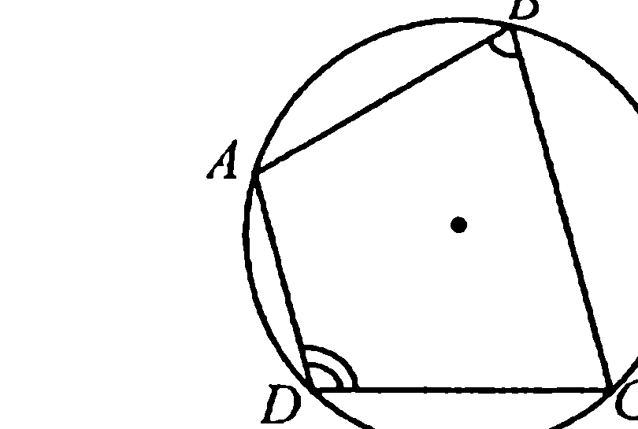

Тогда вписанные углы $ABC$ и $CDA$, а также углы $BCD$ и $DAB$ опираются на дуги, дополняющие одна другую до окружности. А это и означает, что как $\angle ABC + \angle CDA = 180^\circ$, так и $\angle BCD + \angle DAB = 180^\circ$.

**Свойство 15.2.X (Теорема Птолемея).** *Если четырехугольник вписан в окружность, то сумма произведений его противолежащих сторон равна произведению его диагоналей.*

**Доказательство.** В четырехугольнике $ABCD$ (рис. 15.2) построим угол $ABE$ ($E$ — точка диагонали $AC$), равный углу $DBC$. Тогда треугольники $ABE$ и $DBC$ будут подобными, так как, например, $\angle BAC = \angle BDC$ (эти углы вписанные и опираются на одну и ту же дугу).

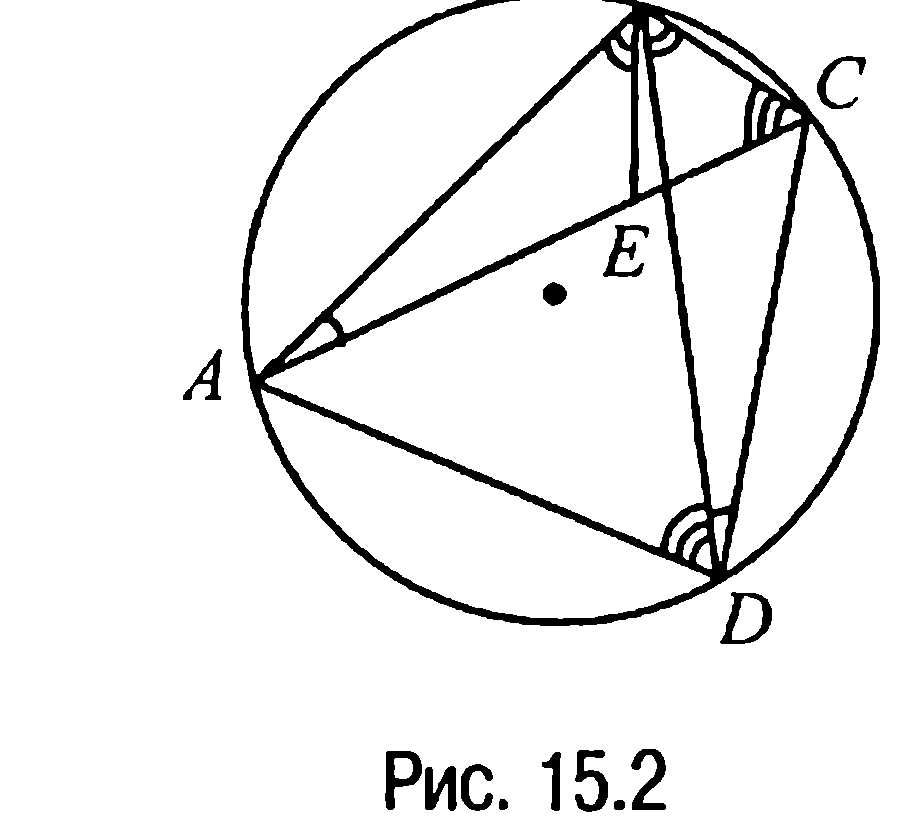

Но в таком случае $\frac{AB}{BD} = \frac{AE}{DC}$, т. е. $AB \cdot DC = AE \cdot BD$. Из подобия же треугольников $BCE$ и $ABD$ ($\angle CBE = \angle DBA$, $\angle ACB = \angle ADB$) следует, что $\frac{BC}{BD} = \frac{EC}{AD}$ или $BC \cdot AD = EC \cdot BD$.

Таким образом, $AB \cdot DC + BC \cdot AD = (AE + EC) \cdot BD = AC \cdot BD$, что и требовалось доказать.

---
**стр. 185**
---

**Свойство 15.3X.** *Если четырехугольник описан около окружности, то суммы его противолежащих сторон равны.*

**Доказательство.** Пусть четырехугольник $ABCD$ описан около окружности и пусть $M, N, P, Q$ — точки касания окружности со сторонами четырехугольника (рис. 15.3).

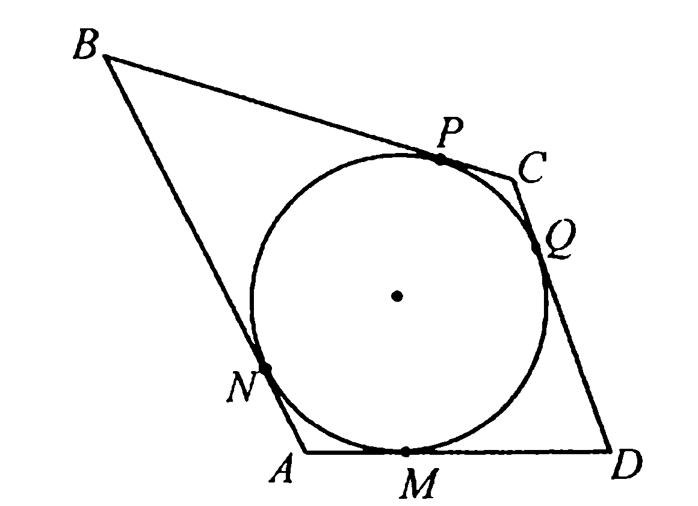

Тогда по свойству 5.2 имеем

$$AM = AN, \quad BP = BN,$$

$$CP = CQ, \quad DM = DQ$$

Складывая полученные равенства, находим, что

$$AM + MD + BP + PC = AN + NB +$$

$$+ DQ + QC \text{ или } AD + BC =$$

$$= AB + DC.$$

**ЗАДАЧИ**

$\blacktriangledown$ **15.1.** *Доказать, что около параллелограмма можно описать окружность тогда и только тогда, когда параллелограмм является прямоугольником.*

**Решение.** Покажем, что если параллелограмм можно вписать в окружность, то такой параллелограмм будет прямоугольником. Действительно, пусть параллелограмм $ABCD$ вписан в окружность. Тогда (свойство 15.1X) $\angle DAB + \angle BCD = 180^\circ$. Но в параллелограмме противолежащие углы равны, поэтому $\angle DAB = \angle BCD = 90^\circ$. Аналогично показывается, что и $\angle ABC = \angle CDA = 90^\circ$, а это и доказывает требуемое. Обратное утверждение очевидно.

$\blacktriangledown$ **15.2.** *Доказать, что параллелограмм, в который можно вписать окружность, является ромбом.*

**Решение.** Так как в описанном около окружности четырехугольнике суммы противолежащих сторон равны (свойство 15.3X), то в

---
**стр. 186**
---

случае параллелограмма это условие равносильно равенству смежных сторон. Следовательно, такой параллелограмм — ромб.

**Следствие 15.1.** *Параллелограмм, в который можно вписать окружность и около которого можно описать окружность, является квадратом.*

▼ **15.3.** *Доказать, что около трапеции можно описать окружность тогда и только тогда, когда она является равнобочной.*

**Решение.** Рассмотрим трапецию $ABCD$ с параллельными сторонами $AD$ и $BC$ (рис. 15.4). Тогда так как сумма внутренних односторонних углов при параллельных прямых равна $180^\circ$, то $\angle DAB + \angle ABC = 180^\circ$.

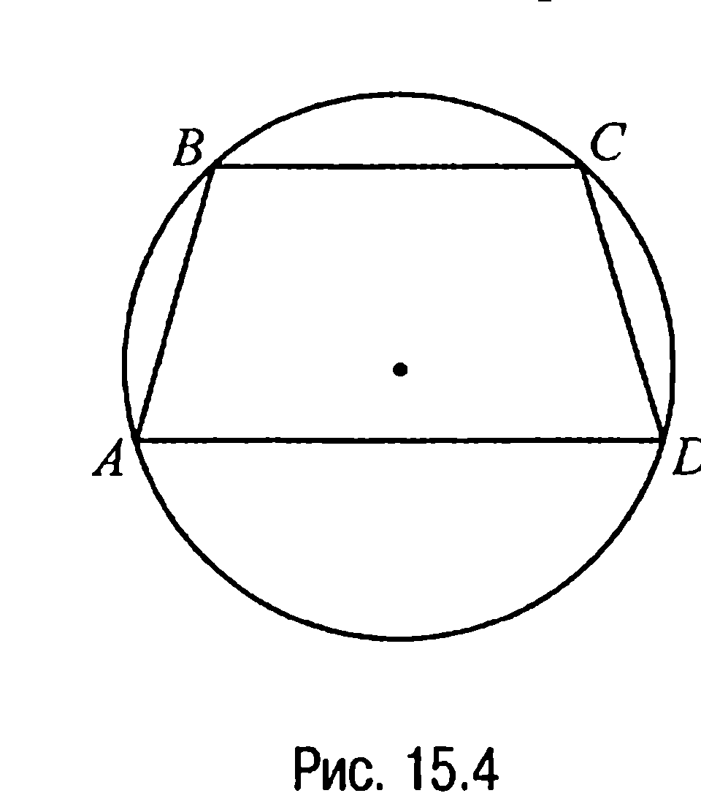

А поскольку около трапеции можно описать окружность тогда и только тогда, когда сумма ее противолежащих углов равна $180^\circ$ (свойство 15.1X), то $\angle ABC + \angle CDA = 180^\circ$. Таким образом, $\angle DAB = \angle CDA$. Но эти вписанные углы измеряются соответственно половинами дуг $BCD$ и $ABC$. Поэтому, так как дуга $BC$ у дуг $BCD$ и $ABC$ общая, то вписанные углы, опирающиеся на дуги $AB$ и $CD$, равны. Но тогда равными будут и дуги $AB$ и $CD$. Завершает же доказательство ссылка на свойство 4.3X.

▼ **15.4.** *Трапеция описана около окружности. Доказать, что концы боковой стороны трапеции и центр окружности являются вершинами прямоугольного треугольника.*

**Решение.** Рассмотрим описанную трапецию с параллельными сторонами $AD$ и $BC$ (рис. 15.5). Тогда так как сумма внутренних односторонних углов при параллельных прямых равна $180^\circ$, то $\angle BCD + \angle CDA = 180^\circ$.

---
**стр. 187**
---

А поскольку лучи $CO$ и $DO$, где $O$ — центр вписанной в трапецию окружности, являются биссектрисами углов $BCD$ и $\angle CDA$ соответственно, то $\angle OCD + \angle CDO = 90^\circ$ и, таким образом, в треугольнике $DOC$ угол с вершиной $O$ является прямым. Аналогично показывается, что треугольник $BOA$ также является прямоугольным, а это и доказывает требуемое.

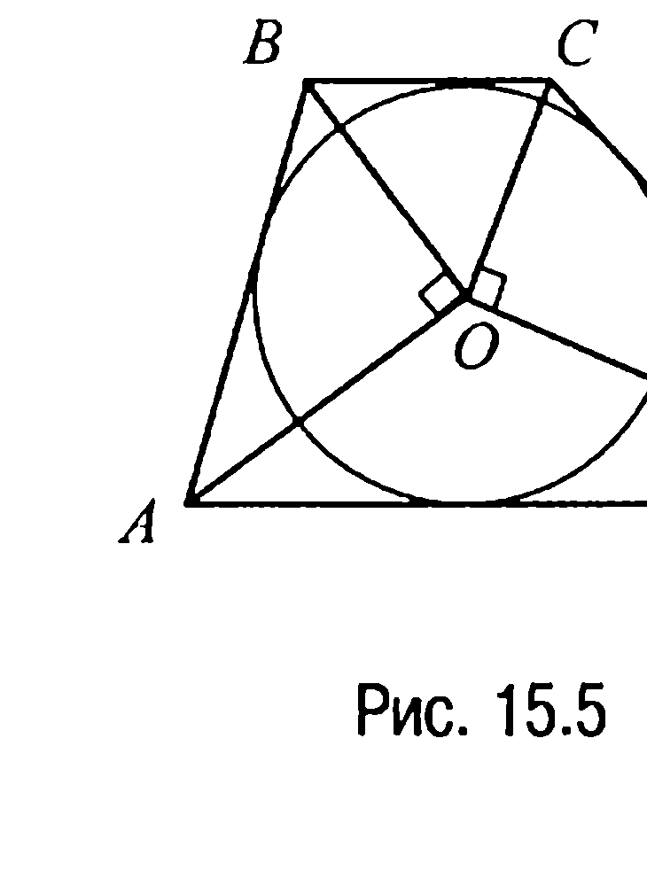

**15.5.** *Равнобочная трапеция описана около окружности. Найти радиус окружности, если основания трапеции равны $a$ и $b$.*

**Решение.** Пусть в описанной равнобочной трапеции $ABCD$ основание $AD = a$, а основание $BC = b$ ($a > b$) (рис. 15.6). Тогда из равенства сторон $AB$ и $CD$ и того, что $AB + CD = AD + BC$ (свойство 15.3X), следует, что $AB = CD = (a + b)/2$. Пусть $BE$ и $CF$ — перпендикуляры к основанию $AD$. Очевидно, что $\Delta ABE = \Delta DCF$ и $AE = FD$, а значит, четырехугольник $EBCF$ — прямоугольник, у которого $EF = BC = b$. Поэтому $AE = (AD - EF)/2 = (a - b)/2$. Из прямоугольного же треугольника $BEA$ находим $BE = \sqrt{AB^2 - AE^2} =$

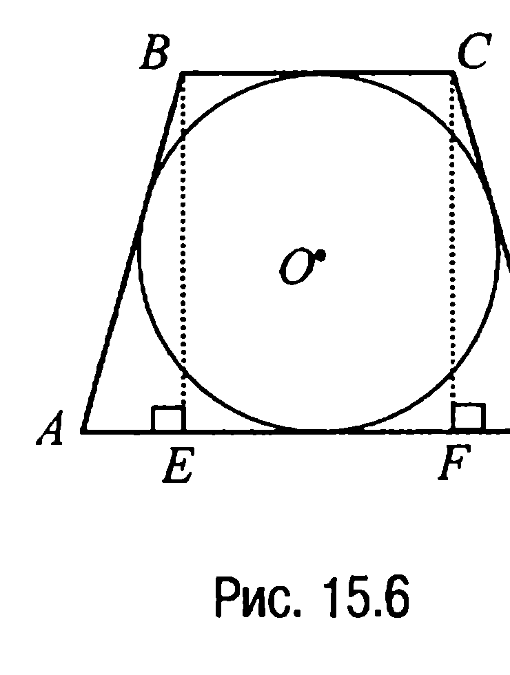

$$= \sqrt{\left(\frac{a+b}{2}\right)^2 - \left(\frac{a-b}{2}\right)^2} = \sqrt{ab}$$

и, таким образом, радиус вписанной в трапецию окружности равен $\frac{\sqrt{ab}}{2}$.

**Ответ:** $\frac{\sqrt{ab}}{2}$.

---
**стр. 188**
---

▼ **15.6.** *Около окружности описана равнобочная трапеция, у которой средняя линия равна $m$. Определить периметр трапеции и ее боковую сторону.*

**Решение.** Пусть $K, L, N$ — точки касания окружности с описанной около нее равнобочной трапецией $ABCD$ (рис. 15.7) и пусть $BM \perp AD$, а $EF$ — средняя линия трапеции. Тогда $MN = BK = KC = CL$, а $DN = DL$. Поэтому $DM = DC$. Но поскольку в соответствии со свойствами 14.10 и 14.5X отрезок $DM = \frac{1}{2}(BC + AD) = EF = m$, то и $DC = m$.

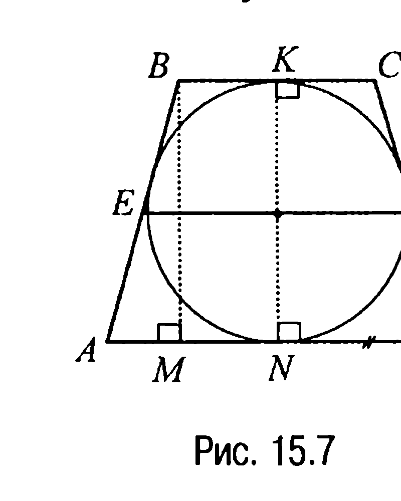

Отсюда периметр трапеции $ABCD$ — это $P = 2 DC + BC + AD = 2 DC + 2EF = 4 m$.

**Ответ:** $4 m; m$.

▼ **15.7.** *Доказать, что если в четырехугольнике $ABCD$ равны углы $ABD$ и $ACD$, то такой четырехугольник можно вписать в окружность.*

**Решение.** Проведем через точки $A, B, C$ окружность и предположим, что вершина $D$ лежит, например, внутри круга (рис. 15.8), границей которого является проведенная окружность. Продолжим отрезки $BD$ и $CD$ до пересечения с окружностью в точках $D_1$ и $D_2$ соответственно.

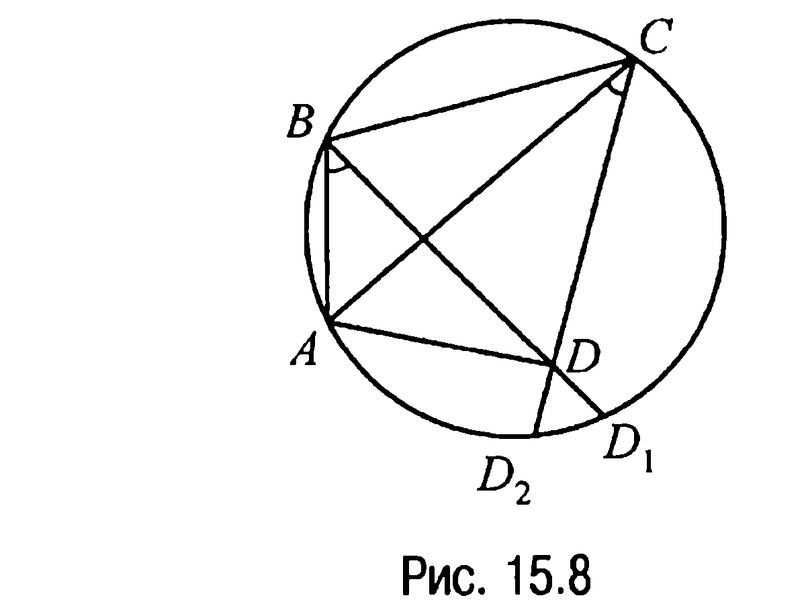

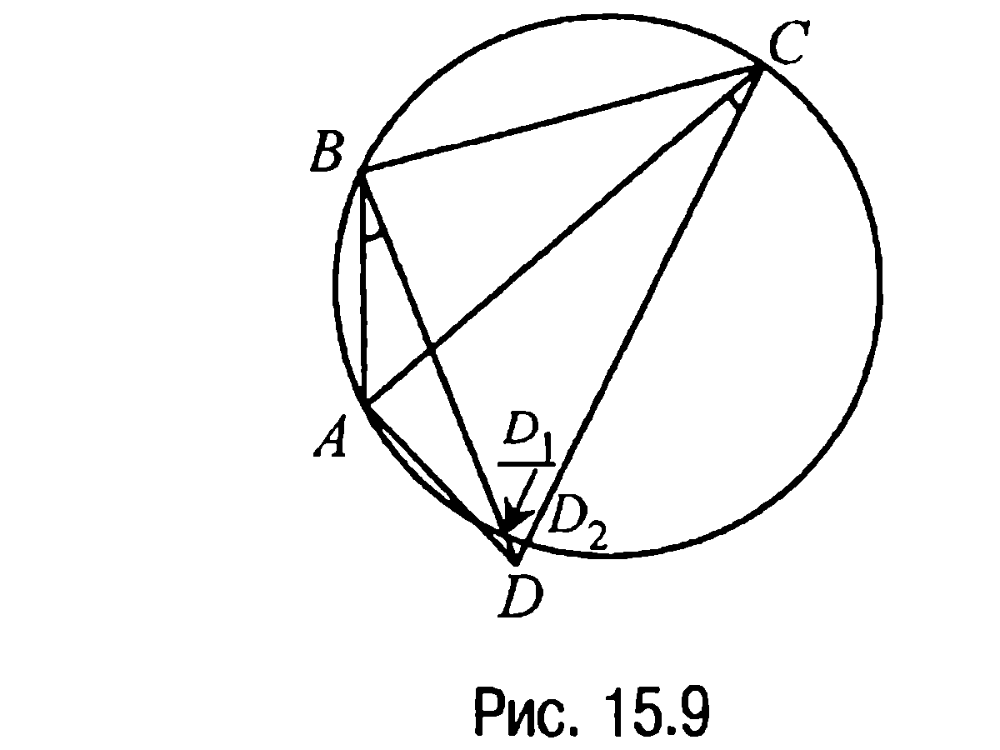

Тогда $\angle ABD = \frac{1}{2}\cup AD_2D_1$, а $\angle ACD = \frac{1}{2}\cup AD_2$, что приводит к противоречию, так как по условию $\angle ABD = \angle ACD$. Итак, точка $D$

---
**стр. 189**
---

должна лежать на окружности или находиться вне круга. Предположим, что она находится вне круга (рис. 15.9). Обозначим через $D_1$ и $D_2$ точки пересечения окружности с отрезками $BD$ и $CD$ соответственно.

Тогда $\angle ABD = \frac{1}{2}\cup AD_1$, а $\angle ACD = \frac{1}{2}\cup AD_1D_2$, что, как и в первом случае, также вступает в противоречие с условием задачи. А это и доказывает требуемое.

**Замечание 15.1.** Очевидно, что четырехугольник $ABCD$ можно вписать в окружность и в случаях, когда или $\angle DAC = \angle DBC$, или $\angle BDA = \angle BCA$, или $\angle CAB = \angle CDB$.

$\blacktriangledown$ **15.8.** *Доказать, что если $M$ — точка пересечения диагоналей четырехугольника $ABCD$ и $AM \cdot MC = BM \cdot MD$, то около такого четырехугольника можно описать окружность.*

**Решение.** Равенство $AM \cdot MC = BM \cdot MD$ преобразуется в пропорцию $\frac{AM}{BM} = \frac{MD}{MC}$.

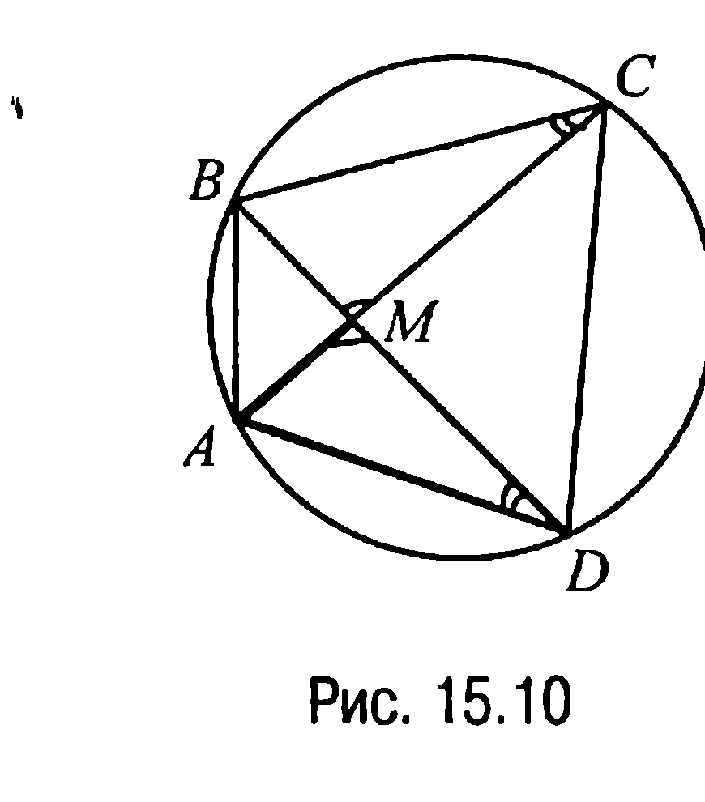

А тогда так как $\angle BMC = \angle AMD$ (рис. 15.10), то треугольники $BMC$ и $AMD$ подобны и, значит, $\angle BCA = \angle BDA$. Последнее же равенство и означает (замечание 15.1), что около четырехугольника $ABCD$ можно описать окружность.

**15.9.** *Две окружности пересекаются в точках $A$ и $B$. Через эти точки проведены соответственно пересекающиеся прямые $CD$ и $EF$ таким образом, что $C$ и $E$ — точки первой окружности, а $D$ и $F$ — точки второй окружности. Доказать, что отрезок $CE$ параллелен отрезку $DF$.*

**Решение.** Если точка пересечения прямых $CD$ и $EF$ находится вне конечной области, ограниченной окружностями, то четырехугольники $CABE$ и $ADFB$ являются вписанными (рис. 15.11) и, следовательно, $\angle CEB + \angle CAB = 180^\circ$, $\angle BAD + \angle BFD = 180^\circ$.

---
**стр. 190**
---

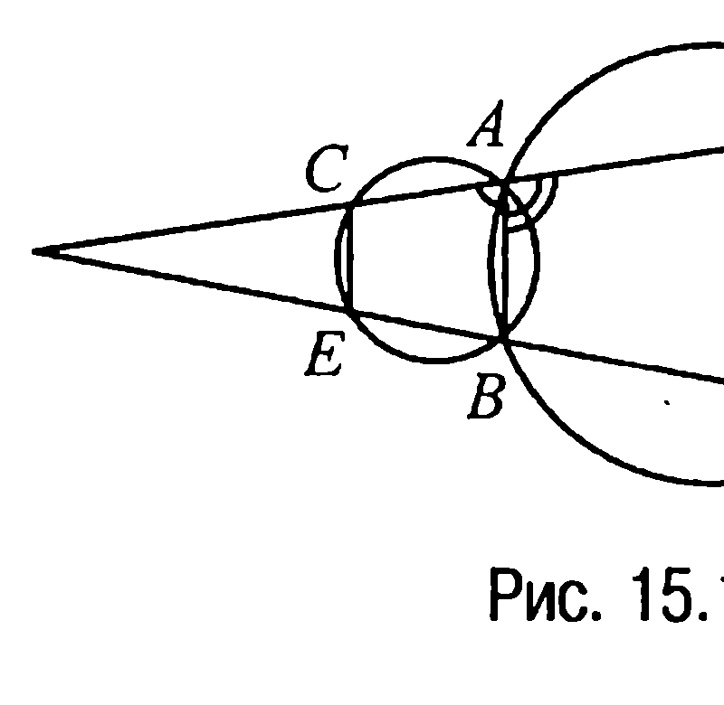

С другой стороны, так как углы $CAB$ и $BAD$ являются смежными, то $\angle BAD = 180^\circ - \angle CAB$ и, значит, $\angle CAB = \angle BFD$. Но в таком случае $\angle CEB + \angle BFD = 180^\circ$, откуда и следует, что $CE \parallel DF$.

Пусть теперь точка пересечения рассматриваемых прямых находится внутри одного из кругов, но вне другого (рис. 15.12). Тогда $\angle CEB = \angle CAB$, а $\angle BAD + \angle BFD = 180^\circ$.

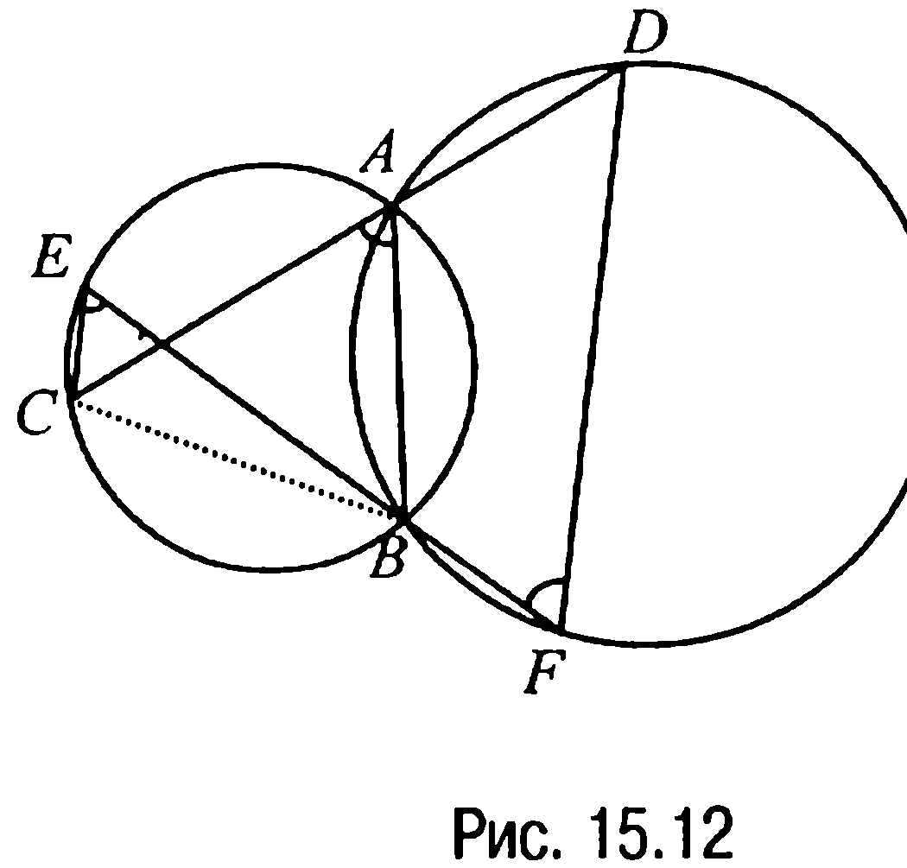

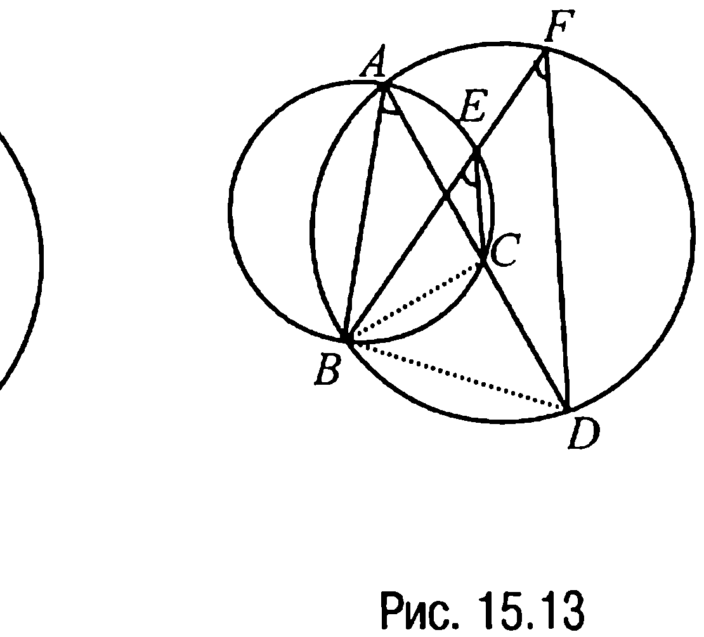

С другой стороны, так как $\angle BAD = 180^\circ - \angle CAB$, то $\angle CAB = \angle BFD$ и, следовательно, $\angle CEB = \angle BFD$, что и говорит о том, что отрезки $CE$ и $DF$ параллельны.

И, наконец, если точка пересечения прямых $CD$ и $EF$ находится внутри области пересечения обоих кругов (рис. 15.13), то $\angle DFB = \angle DAB = \frac{1}{2}\cup DB$ и, значит, $\angle CEB = \angle CAB = \angle DAB = \angle DFB$, а следовательно, $CE \parallel DF$.

**15.10.** *Доказать, что если биссектрисы двух смежных углов $DAB$ и $ABC$ вписанного в окружность четырехугольника $ABCD$ пересекаются в точке, лежащей на стороне $DC$, то $DC = AD + BC$.*

**Решение.** Пусть $\angle DAB = \alpha$, $\angle ABC = \beta$, $E$ — точка пересечения биссектрис углов $DAB$ и $ABC$ трапеции $ABCD$.

Рассмотрим случай $\alpha < \beta$ (рис. 15.14). При таком предположении

---
**стр. 191**
---

построим угол $CBF$, равный $\frac{\alpha}{2}$, где точка $F$ принадлежит стороне $DC$.

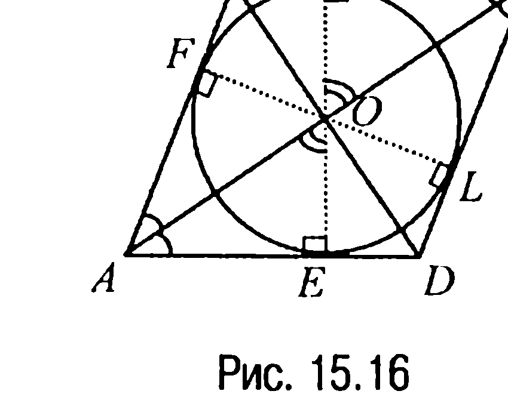

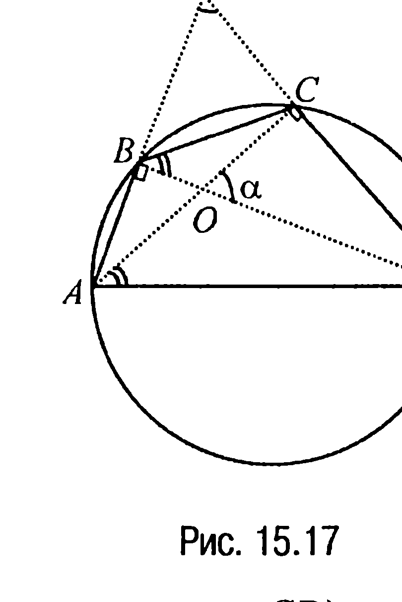

Тогда так как четырехугольник $ABCD$ вписан в окружность, то $\angle BCD = 180^\circ - \alpha$ и, следовательно, $\angle BFC = 180^\circ - \angle BCD - \angle CBF = \frac{\alpha}{2}$. Таким образом, в равнобедренном треугольнике $BCF$ сторона $FC = BC$.

Далее, поскольку $\angle BFE = 180^\circ - \angle BFC = 180^\circ - \frac{\alpha}{2}$, а значит, $\angle BAE + \angle BFE = 180^\circ$, то приходим к выводу, что около четырехугольника $ABFE$ можно описать окружность. Но в таком случае $\angle EAF = \angle EBF = \frac{\beta - \alpha}{2}$, откуда $\angle DAF = \angle DAE + \angle EAF = \frac{\beta}{2}$.

Замечая теперь, что $\angle CDA = 180^\circ - \beta$, имеем равенство $\angle AFD = \frac{\beta}{2}$.

Отсюда вывод: треугольник $ADF$ — равнобедренный и его сторона $AD = DF$. Поэтому $DC = DF + FC = AD + BC$.

Случай $\alpha > \beta$ рассматривается аналогично. Предположим теперь, что $\alpha = \beta$ (рис. 15.15). Тогда очевидно, что $\angle BCD = \angle CDA = 180^\circ - \alpha$ и, следовательно, $\angle BEC = \angle AED = \frac{\alpha}{2}$. В таком случае треугольники $BCE$ и $ADE$ равнобедренные, причем такие, что $BC = EC$, $AD = DE$. Отсюда и следует, что $DC = DE + EC = AD + BC$.

---
**стр. 192**
---

**15.11.** Доказать, что если центр вписанной в четырехугольник окружности совпадает с точкой пересечения диагоналей, то этот четырехугольник — ромб.

**Решение.** Пусть точка $O$ — центр окружности, вписанной в четырехугольник $ABCD$ (рис. 15.16), $E$, $F$, $K$, $L$ — точки касания окружности с четырехугольником.

Тогда так как $\triangle OFA = \triangle OEA = \triangle OKC = \triangle OLC$, то $\angle OAF = \angle OCK = \angle OCL = \angle OAE$ и, значит, $AB = BC = CD = DA$, а это и доказывает требуемое.

**15.12.** Четырехугольник $ABCD$ вписан в окружность, диаметром которой является отрезок $AD$. Найти отношение $BC : AD$, если угол между прямыми $AB$ и $DC$ равен $\alpha$.

**Решение.** Пусть $O$ — точка пересечения диагоналей вписанного в окружность четырехугольника $ABCD$ (рис. 15.17), $E$ — точка пересечения прямых $AB$ и $DC$. Тогда так как $AD$ — диаметр окружности, то треугольники $ACD$ и $ABD$ являются прямоугольными и, значит, $AC$ и $BD$ — высоты треугольника $AED$. Но в таком случае (задача 7.6) $\alpha + \angle AOD = \alpha + \angle COB = 180^\circ$, откуда следует, что $\angle DOC = 180^\circ - \angle COB = \alpha$.

Теперь если заметить, что углы $DAC$ и $DBC$ равны (как опирающиеся на одну и ту же дугу $CD$), равными являются и углы $COB$ и $AOD$ (как вертикальные), то приходим к выводу, что треугольники $AOD$ и $BOC$ подобны, причем коэффициент подобия равен $\dfrac{OC}{OD} = \cos \alpha$ и, следовательно, $\dfrac{BC}{AD} = \cos \alpha$.

**Ответ:** $\dfrac{BC}{AD} = \cos \alpha$.

---
**стр. 193**
---

§ 15. Вписанные и описанные четырехугольники

**ЗАДАЧИ ДЛЯ САМОСТОЯТЕЛЬНОГО РЕШЕНИЯ**

**15.1 С.** *Доказать, что если сумма противолежащих углов четырехугольника равна $180^\circ$, то этот четырехугольник можно вписать в окружность.*

**15.2С.** *Доказать, что если в выпуклом четырехугольнике $ABCD$ выполняется равенство $AC \cdot BD = AD \cdot BC + AB \cdot CD$, то такой четырехугольник можно вписать в окружность.*

**15.3С.** *Доказать, что если в выпуклом четырехугольнике суммы противолежащих сторон равны, то в этот четырехугольник можно вписать окружность.*

**15.4С.** *Доказать, что если выпуклый четырехугольник имеет ось симметрии, то либо около него можно описать окружность, либо в него можно вписать окружность.*

**15.5С.** *В окружность вписан четырехугольник, стороны которого равны $a$, $b$, $c$ и $d$. Найти отношение диагоналей этого четырехугольника.*

**15.6С.** *Около окружности описана прямоугольная трапеция. Найти радиус окружности, если основания трапеции равны $a$ и $b$.*

**15.7С.** *Около окружности описана трапеция. Доказать, что произведение отрезков боковой стороны, на которые она разделена точкой касания, равно квадрату радиуса окружности.*

**15.8С.** *К окружности проведены касательные, касающиеся ее в концах диаметра $CD$. Касательная $l$ к окружности пересекает эти касательные соответственно в точках $A$ и $B$. Доказать, что произведение $AC \cdot BD$ не зависит от положения касательной $l$.*

**15.9С.** *Четырехугольник $ABCD$ вписан в окружность, диаметром которой является отрезок $AC$. Найти отношение $BD : AC$, если угол между прямыми $AB$ и $DC$ равен $\beta$.*
