## 2.4. n-угольники (многоугольники), произвольные четырехугольники

---
**стр. 194**
---

**15.10С.** *Диагонали вписанного четырехугольника $ABCD$ пересекаются в точке $E$. Известно, что $\angle ABC = 78^\circ$, $\angle BCD = 84^\circ$, $\angle AED = 100^\circ$. Найти угол $ABD$.*

**15.11С.** *В прямоугольную трапецию с площадью, равной 8, и острым углом, равным $\arcsin \dfrac{4}{5}$, вписана окружность. Найти радиус $r$ окружности.*

**15.12С.** *В окружность вписан четырехугольник $ABCD$, стороны которого $AB = a$, $BC = b$, $CD = c$, $DA = d$. Найти диагонали $AC$ и $BD$ этого четырехугольника.*

**§ 16. $n$-УГОЛЬНИКИ (МНОГОУГОЛЬНИКИ), ПРОИЗВОЛЬНЫЕ ЧЕТЫРЕХУГОЛЬНИКИ**

$n$-угольником (простым), $n \ge 3$, $n \in N$, называется замкнутая ломаная линия, представляющая собой совокупность $n$ отрезков (**сторон**) $A_1A_2$, $A_2A_3$, $\dots$, $A_nA_1$, не имеющих общих точек, кроме концевых, и $n$ различных точек (**вершин**) $A_1$, $A_2$, $\dots$, $A_n$, ни одна из которых не является концом трех или более отрезков и среди которых никакие три последовательные точки не лежат на одной прямой.

Две стороны $n$-угольника, имеющие общую вершину, называются **смежными сторонами**.

Две вершины $n$-угольника, являющиеся концами его стороны, называются **смежными вершинами**.

$n$-угольник называется **выпуклым**, если он лежит в одной полуплоскости относительно каждой прямой, проходящей через две смежные вершины; в противном случае $n$-угольник называется **невыпуклым**.

---
**стр. 195**
---

На рис. 16.1 приведен пример выпуклого четырехугольника ($ABCD$), а на рис. 16.2 — невыпуклого четырехугольника ($KLMN$).

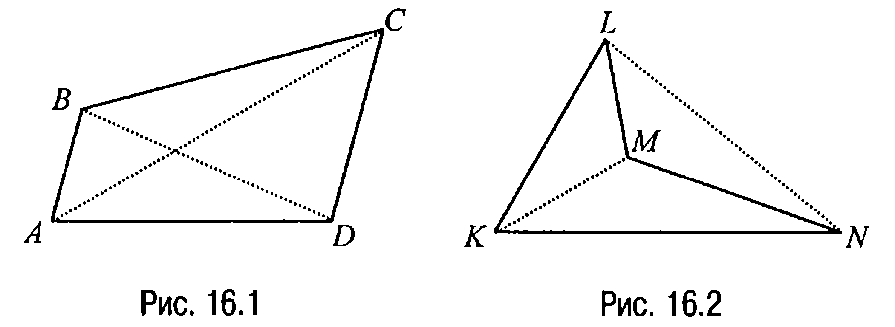

**Диагональю $n$-угольника** называется отрезок с концами в несмежных вершинах. На рис. 16.1 — это отрезки $AC$ и $BD$, а на рис. 16.2 — это отрезки $KM$ и $LN$.

Угол, образованный лучами, имеющими начало в некоторой вершине $P$ $n$-угольника и содержащими обе смежные стороны этой вершины, называется **внутренним углом $n$-угольника**, если часть плоскости, заключенная между лучами, имеет непустое пересечение с внутренней областью $n$-угольника.

**Обобщенным $n$-угольником** назовем замкнутую ломаную линию, представляющую собой совокупность $n$ отрезков (сторон) $A_1A_2, A_2A_3, \dots, A_nA_1$, не имеющих общих точек, кроме концевых, и $n$ различных точек (вершин) $A_1, A_2, \dots, A_n$, ни одна из которых не является концом трех или более отрезков.

Отметим, что любой $n$-угольник является обобщенным $n$-угольником, но не всякий обобщенный $n$-угольник оказывается $n$-угольником (рис. 16.3).

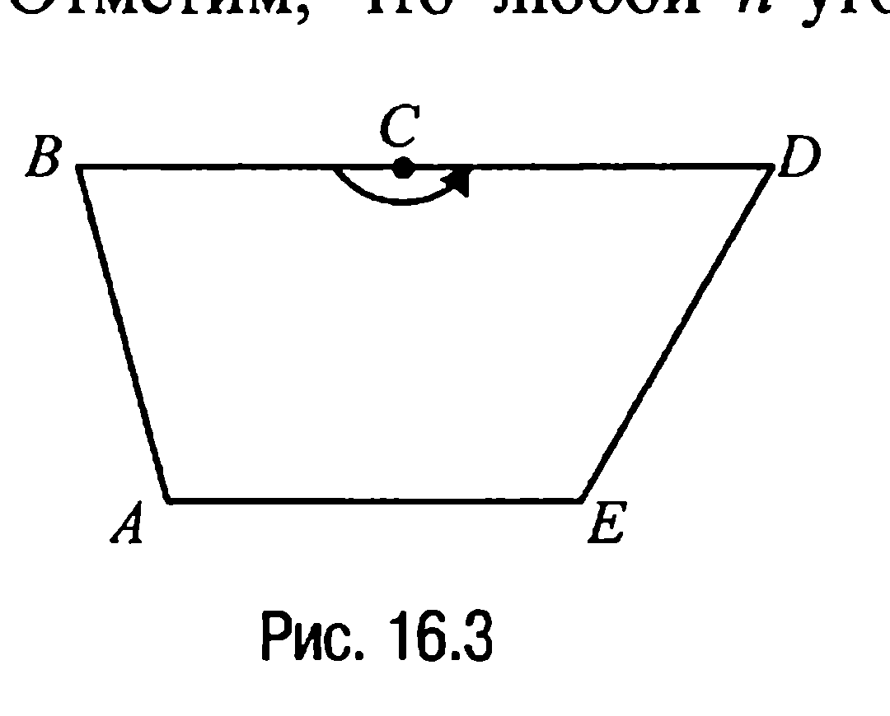

В случае обобщенного $n$-угольника некоторые его 3 последовательные вершины могут лежать на одной прямой, тогда один из трех углов с этими вершинами (на рис. 16.3 — это угол с вершиной $C$) считается равным развернутому углу.

---
**стр. 196**
---

При таком соглашении очевидно, что сумма внутренних углов $n$-угольника равна сумме внутренних углов обобщенного $n$-угольника.

**Внешним углом выпуклого $n$-угольника** называется угол, смежный с внутренним углом этого $n$-угольника.

Выпуклый $n$-угольник называется **правильным**, если у него все стороны равны и все углы равны.

$n$-угольник называется **вписанным в окружность**, если все его вершины лежат на окружности.

$n$-угольник называется **описанным около окружности**, если все его стороны касаются окружности.

### 16.1. Свойства $n$-угольников

**Свойство 16.1.** *Сумма внутренних углов произвольного $n$-угольника равна $180^\circ \cdot (n - 2)$.*

**Доказательство** Рассмотрим сначала случай выпуклого $n$-угольника. Пусть $O$ — его внутренняя точка (рис. 16.4). Тогда если соединить эту точку со всеми вершинами $n$-угольника, то он разобьется на $n$ треугольников. А поскольку сумма углов каждого треугольника равна $180^\circ$, то сумма углов всех треугольников равна $180^\circ \cdot n$. Но в эту сумму входит сумма всех внутренних углов $n$-угольника и сумма всех углов с вершиной в точке $O$, которая равна $360^\circ$.

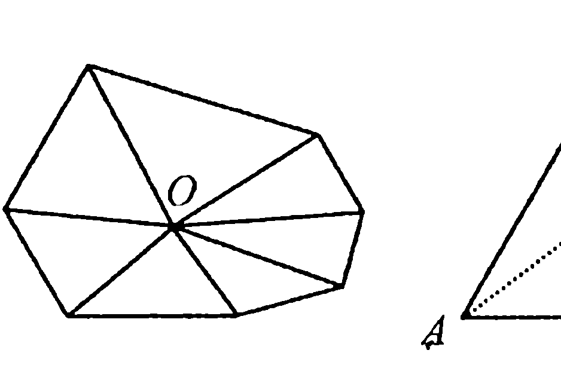

Следовательно, сумма внутренних углов выпуклого $n$-угольника равна $180^\circ \cdot n - 360^\circ = 180^\circ \cdot (n - 2)$.

Обратимся теперь к случаю невыпуклого $n$-угольника. Такой $n$-угольник уже реализуется при $n = 4$ (рис. 16.5). А тогда если обозначить через $\Sigma_n$ сумму внутренних углов $n$-угольника, то со-

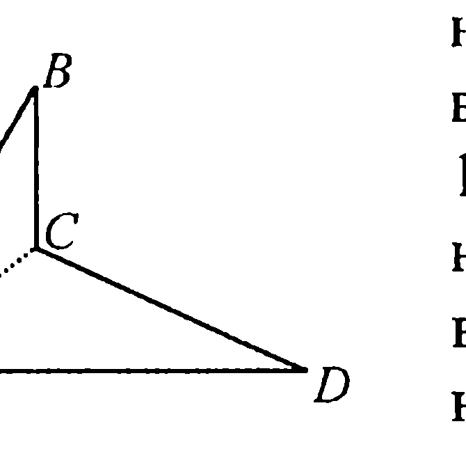

---
**стр. 197**
---

единив вершины $A$ и $C$ четырехугольника $ABCD$, получим два треугольника $ABC$ и $ACD$ и, значит, $\Sigma_4 = 2\Sigma_3 = 360^\circ = 180^\circ(4 - 2)$.

Предположив теперь (в соответствии с методом математической индукции), что $\Sigma_k = 180^\circ \cdot (k - 2)$, докажем справедливость равенства $\Sigma_{k+1} = 180^\circ \cdot (k - 1)$, заметив, что хотя бы один из внутренних углов $n$-угольника, например, угол с вершиной $A$ (рис. 16.6, 16.7) больше $180^\circ$.

Здесь возможны 2 геометрически различных случая, которые и проиллюстрированы на рис. 16.6 и 16.7. Именно, если соединить

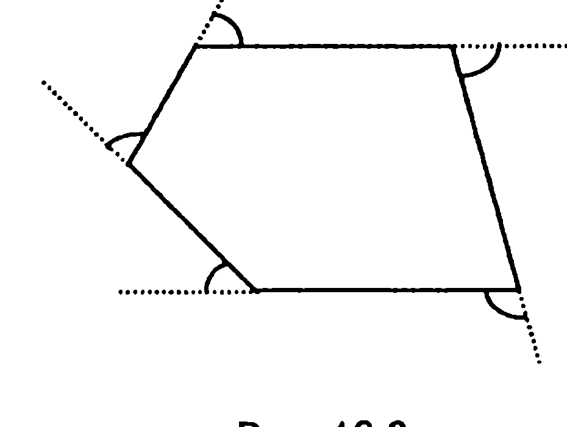

вершины $B$ и $C$ $n$-угольника, то в первом случае три последовательно выбранные из четырех вершин $D, B, C, E$ не лежат на одной прямой, а во втором случае вершины $D, B, C$ лежат на одной прямой.

Однако принципиально эти случаи не отличаются, поскольку, как уже было отмечено выше, сумма внутренних углов $n$-угольника равна сумме внутренних углов обобщенного $n$-угольника и, таким образом (рис. 16.6, 16.7),

$$\Sigma_{k+1} = \Sigma_k - (\angle ABC + \angle BCA) + (360^\circ - \angle CAB) = \Sigma_k + 360^\circ - (\angle ABC + \angle BCA + \angle CAB) = \Sigma_k + 360^\circ - 180^\circ = \Sigma_k + 180^\circ = 180^\circ \cdot (k - 2) + 180^\circ = 180^\circ \cdot (k - 1).$$

**Свойство 16.2.** *Произвольный $n$-угольник имеет хотя бы один внутренний угол, меньший развернутого.*

Это свойство является очевидным следствием свойства 16.1.

**Свойство 16.3.** *Сумма внешних углов выпуклого $n$-угольника, взятых по одному при каждой вершине, равна $360^{\circ}$.*

**Доказательство.** Так как внешний угол выпуклого $n$-угольника — это угол, смежный с внутренним углом этого $n$-угольника (рис. 16.8), то в сумме такие углы составляют $180^\circ$.

---
**стр. 198**
---

А поскольку число вершин равно $n$, то сумма внутренних углов $n$-угольника и его внешних углов, взятых по одному при каждой вершине, равна $180^\circ \cdot n$.

Но в таком случае, вычитая из полученной суммы сумму внутренних углов $n$-угольника, равную $180^\circ \cdot (n - 2)$, получим, что искомая сумма равна

$$180^\circ \cdot n - 180^\circ \cdot (n - 2) = 360^\circ,$$

что и требовалось доказать.

**Свойство 16.4.** *В выпуклом $n$-угольнике из каждой вершины можно провести $(n - 3)$ диагоналей, которые разбивают $n$-угольник на $(n - 2)$ треугольников.*

**Доказательство.** Справедливость того факта, что в выпуклом $n$-угольнике из каждой вершины можно провести $(n - 3)$ диагоналей, следует из определения диагонали $n$-угольника.

Что же касается второй части утверждения, то, поскольку каждая вершина выпуклого $n$-угольника является концевой точкой $(n - 1)$ отрезков, для которых другая их концевая точка является другой вершиной $n$-угольника, $(n - 3)$ диагоналей, проведенных из одной вершины, действительно разбивают выпуклый $n$-угольник на $(n - 2)$ треугольников, так как их число всегда на единицу меньше общего числа диагоналей и смежных сторон, проведенных из одной вершины $n$-угольника.

**Свойство 16.5.** *В выпуклом $n$-угольнике число диагоналей равно*

$$\frac{n \cdot (n - 3)}{2}.$$

**Доказательство.** Так как из одной вершины выпуклого $n$-угольника можно провести $(n - 3)$ диагоналей, а всего вершин $n$, то из $n$ вершин выпуклого $n$-угольника можно провести $n(n - 3)$ диагоналей. Но поскольку при таком подсчете каждая из диагоналей учитывается дважды, то число диагоналей в выпуклом $n$-угольнике действительно равно $\frac{n(n - 3)}{2}$.

---
**стр. 199**
---

**Свойство 16.6.** *Каждый угол правильного $n$-угольника равен*

$$\frac{180^\circ \cdot (n - 2)}{n}.$$

Справедливость этого свойства следует из свойства 16.1 и определения правильного $n$-угольника.

**Свойство 16.7.** *Около правильного $n$-угольника можно описать окружность.*

**Доказательство.** При $n = 3, 4$ справедливость этого свойства следует, например, из следствий 7.1X и 15.1 соответственно.

Предположим, что $n \ge 5$. Пусть $A, B, C, D$ — вершины правильного $n$-угольника, а $O$ — центр описанной около треугольника $ABC$ окружности (рис. 16.9).

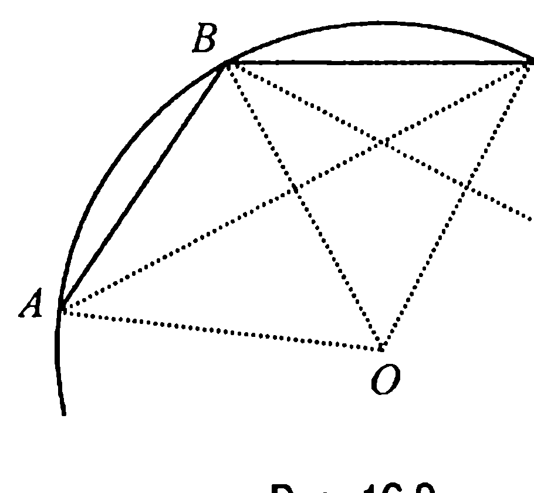

Тогда так как у треугольников $ABC$ и $DBC$ сторона $BC$ общая, $AB = DC$, $\angle ABC = \angle BCD$, то эти треугольники равны. Но в таком случае радиус $R = OA = OB = OC$ окружности, описанной около треугольника $ABC$, равен радиусу окружности, описанной около треугольника $DBC$. А поскольку центры обеих описанных окружностей лежат на серединном к отрезку $BC$ перпендикуляре и находятся по одну сторону от прямой $BC$ (так как точки $A$ и $D$ лежат по одну сторону от прямой $BC$), то отсюда следует, что центры окружностей, описанных около треугольников $ABC$ и $DBC$, совпадают.

Таким образом, окружность, проходящая через точки $A$, $B$ и $C$, проходит и через точку $D$.

По тем же соображениям эта окружность будет проходить и через остальные вершины правильного $n$-угольника. А это и доказывает требуемое.

**Свойство 16.8.** *В правильный $n$-угольник можно вписать окружность.*

**Доказательство.** При $n = 3, 4$ справедливость свойства следует, например, из свойств 8.3X и 15.3X соответственно. Предположим,

---
**стр. 200**
---

что $n \ge 5$ и пусть $K$ — точка пересечения продолжений сторон $AB$ и $DC$ $n$-угольника, а $L$ — точка пересечения продолжений сторон $BC$ и $ED$ того же $n$-угольника (рис. 16.10).

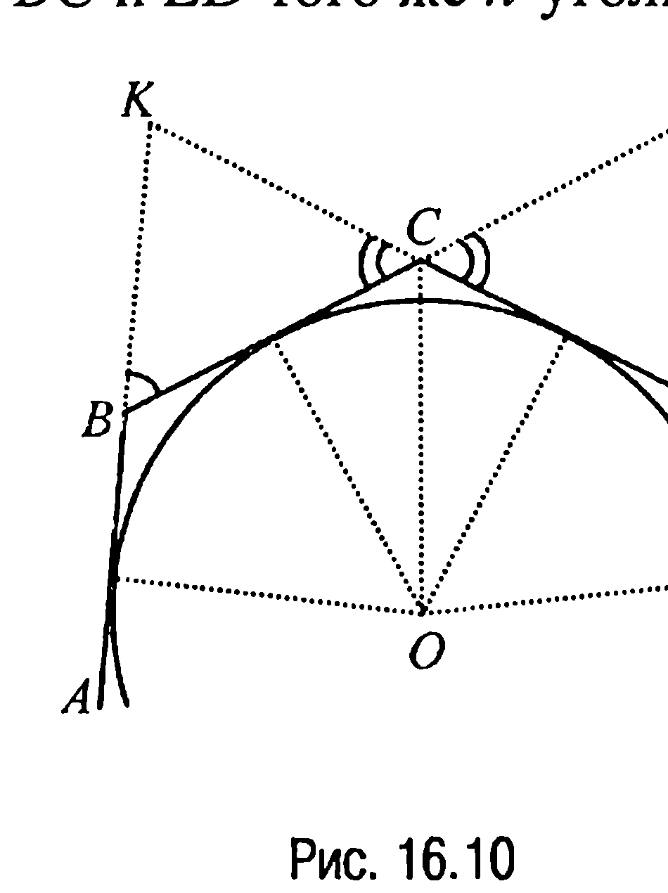

Тогда так как $BC = CD$, $\angle KBC = \angle CDL$, $\angle BCK = \angle LCD$, то $\triangle BCK = \triangle LCD$. Но в таком случае радиус вневписанной с центром $O$ окружности треугольника $BCK$, которая касается стороны $BC$ и продолжений двух других сторон, равен радиусу соответствующей вневписанной окружности треугольника $LCD$.

А поскольку центры общих вневписанных окружностей лежат на биссектрисе угла $BCD$, то эти центры, а следовательно, и сами окружности совпадают.

Таким образом, построенная вневписанная окружность касается лучей $BA$ и $DE$, а также сторон $BC$ и $CD$ правильного $n$-угольника. Повторяя проведенные рассуждения необходимое число раз (в зависимости от числа сторон $n$-угольника), мы убедимся, что построенная выше окружность будет касаться всех сторон заданного правильного $n$-угольника. А это и доказывает справедливость равенства.

**Замечание 16.1.** Так как около правильного $n$-угольника можно описать окружность, то его стороны можно рассматривать как равные хорды одной окружности. А поскольку равные хорды одинаково удалены от центра $O$ окружности, то отрезки перпендикуляров, опущенных из точки $O$ на все стороны $n$-угольника, будут равны между собой, и поэтому точка $O$ будет также и центром окружности, вписанной в тот же правильный $n$-угольник (по существу, это есть иное доказательство свойства 16.8). *Итак, описанная около правильного $n$-угольника окружность и вписанная в него окружность имеют один и тот же центр.*

***Центром правильного $n$-угольника называется центр вписанной в него (описанной около него) окружности.***

---
**стр. 201**
---

**Свойство 16.9.** *Правильный $n$-угольник при повороте вокруг своего центра на угол $\frac{360^\circ}{n}$ переходит в себя.*

**Доказательство.** Пусть $O$ — центр правильного $n$-угольника. Тогда если соединить точку $O$ с каждой вершиной $n$-угольника, то получим $n$ треугольников, угол каждого из которых с вершиной в точке $O$ равен $\frac{360^\circ}{n}$.

Но поскольку в правильном $n$-угольнике все стороны равны, то при повороте вокруг точки $O$ на угол $\frac{360^\circ}{n}$ правильный $n$-угольник действительно перейдет в себя.

*Апофемой правильного $n$-угольника* называется отрезок перпендикуляра, опущенного из центра $n$-угольника на любую из его сторон.

**Свойство 16.10.** *Радиус вписанной в правильный $n$-угольник окружности является апофемой этого $n$-угольника.* Справедливость этого свойства следует из рассуждений, приведенных в замечании 16.1.

**Свойство 16.11.** *Правильные $n$-угольники с одним и тем же числом сторон подобны друг другу.*

**Доказательство.** Пусть $A_1, A_2, \ldots, A_n$ и $B_1, B_2, \ldots, B_n$ соответственно — вершины двух правильных $n$-угольников. Тогда $A_1A_2 = A_2A_3 = \ldots = A_nA_1$, а $B_1B_2 = B_2B_3 = \ldots = B_nB_1$ и, значит, $\frac{A_1A_2}{B_1B_2} = \frac{A_2A_3}{B_2B_3} = \ldots = \frac{A_nA_1}{B_nB_1}$.

С другой стороны, поскольку у обоих $n$-угольников одно и то же число сторон, то каждый из углов этих многоугольников равен $\frac{180^\circ \cdot (n-2)}{n}$ (свойство 16.6). Пропорциональность же сторон и равенство углов $n$-угольников и означают их подобие.

---
**стр. 202**
---

**Свойство 16.12.** *Правильный $n$-угольник, вписанный в окружность радиуса $R$, имеет сторону $a = 2R \cdot \sin \frac{180^\circ}{n}$.*

**Доказательство.** Пусть $O$ — центр правильного $n$-угольника и $AB$ — одна из его сторон. Если соединить точку $O$ с каждой вершиной $n$-угольника (рис. 16.11), то получим $n$ равных треугольников, угол каждого из которых с вершиной в точке $O$ будет равен $\frac{360^\circ}{n}$.

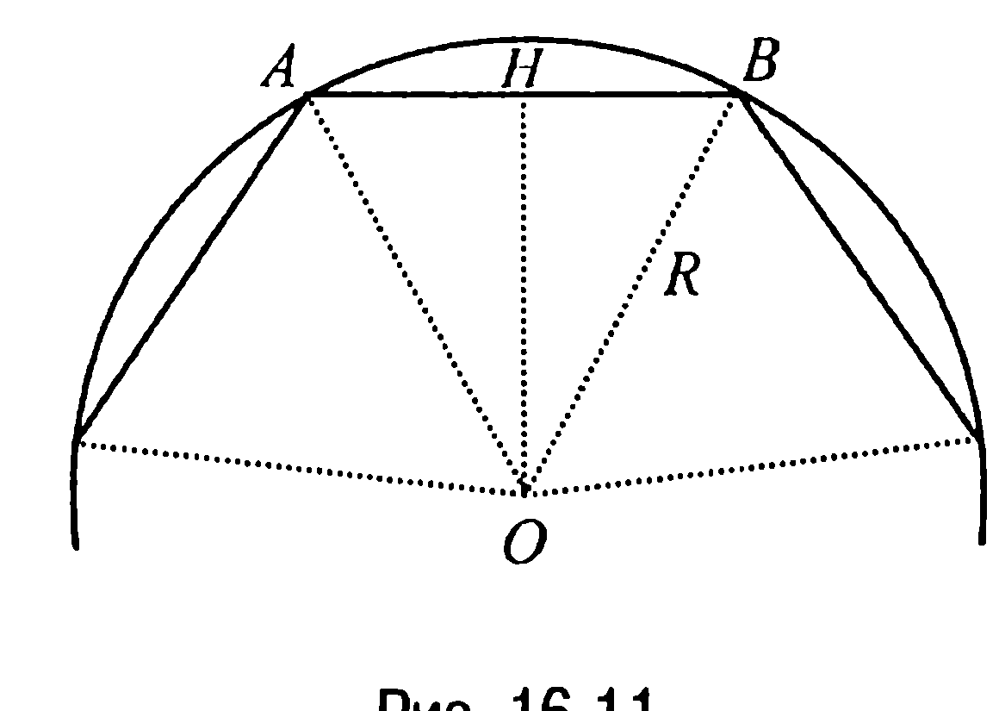

Пусть $OH$ — высота треугольника $OAB$. Тогда в силу того, что она будет и биссектрисой (и медианой), из прямоугольного треугольника $OHB$ находим, что $\frac{a}{2} = R \cdot \sin \frac{180^\circ}{n}$ или $a = 2R \cdot \sin \frac{180^\circ}{n}$. А это и требовалось доказать.

**Свойство 16.13.** *Правильный $n$-угольник, описанный около окружности радиуса $r$, имеет сторону $a = 2r \cdot \text{tg} \frac{180^\circ}{n}$.*

**Доказательство** этого свойства аналогично доказательству свойства 16.12.

**16.2. Произвольные четырехугольники**

*Несмежные стороны четырехугольника называются **противолежащими сторонами четырехугольника**.*

**Признак подобия четырехугольников.** *Если у двух четырехугольников равны соответственные углы при вершинах, а также равны соответственные углы между диагоналями, то такие четырехугольники подобны.*

**Доказательство** проведем для случая выпуклых четырехугольников. Случай невыпуклых четырехугольников предлагается рассмотреть читателю самостоятельно.

---
**стр. 203**
---

Итак, пусть у четырехугольников $ABCD$ и $A_1B_1C_1D_1$ (рис. 16.12, 16.13) соответственные углы при вершинах равны, равны и соответственные углы между диагоналями.

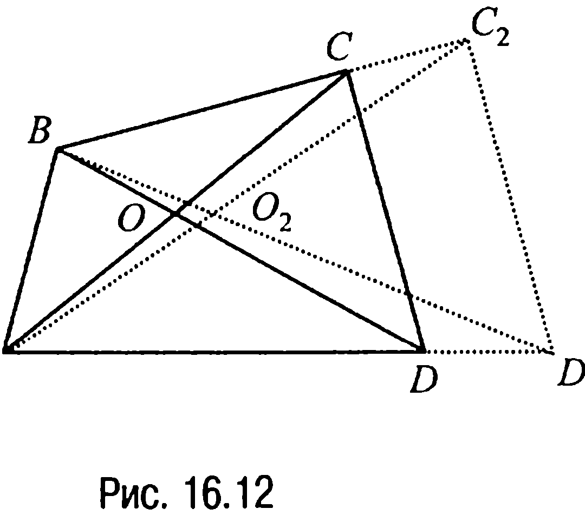

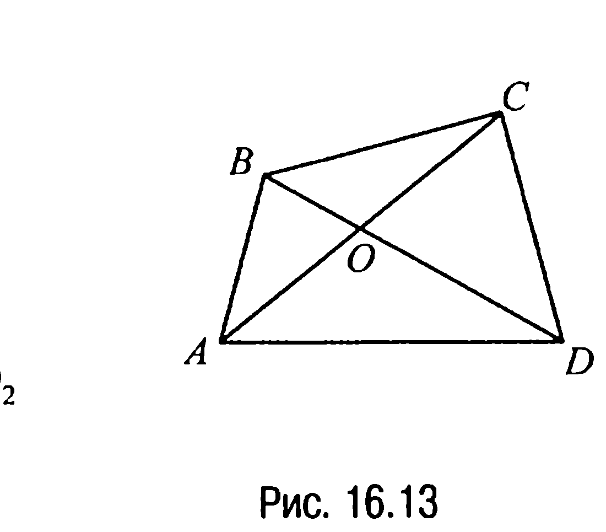

Преобразованием подобия с некоторым коэффициентом подобия $k$ мы можем совместить любую одну из пар соответственных сторон заданных четырехугольников. Пусть это будут для определенности стороны $AB$ и $A_1B_1$ ($AB = k \cdot A_1B_1$).

Тогда в результате преобразования подобия четырехугольник $A_1B_1C_1D_1$ перейдет в четырехугольник $ABC_2D_2$, где точки $C_2$ и $D_2$ лежат на лучах $BC$ и $AD$ соответственно, а $C_2D_2 \parallel CD$.

Предположим, что $BC_2 > BC$, $AD_2 > AD$ (если $BC_2 < BC$, $AD_2 < AD$, то рассуждения аналогичны рассуждениям, приводимым ниже) и пусть $O$ и $O_2$ — точки пересечения диагоналей четырехугольников $ABCD$ и $ABC_2D_2$ соответственно ($O_1$ — точка пересечения диагоналей четырехугольника $A_1B_1C_1D_1$).

Тогда в соответствии с условием и свойством 21.13 преобразования подобия справедливы равенства $\angle AOB = \angle A_1O_1B_1 = \angle AO_2B$. С другой стороны, так как в силу предположения $\angle C_2AB > \angle CAB$, $\angle D_2BA > \angle DBA$, то $\angle AO_2B = 180^\circ - \angle C_2AB - \angle D_2BA < 180^\circ -$
$- \angle CAB - \angle DBA = \angle AOB$, что приводит к противоречию.

Таким образом, наше предположение неверно и, значит, при преобразовании подобия точка $C_1$ совпадет с точкой $C$, а точка $D_1$ совпадет с точкой $D$, т. е. четырехугольники $ABCD$ и $A_1B_1C_1D_1$ действительно оказываются подобными.

---
**стр. 204**
---

**Теорема косинусов для четырехугольников.** *Пусть $a, b, c, d$ — последовательные стороны четырехугольника, $m$ и $n$ — его диагонали, $\phi$ и $\psi$ — два противолежащих угла. Тогда $m^2n^2 = a^2c^2 + b^2d^2 - 2abcd \cdot \cos(\phi + \psi)$.*

**Доказательство** проведем для случая невыпуклого четырехугольника. Случай же выпуклого четырехугольника предлагается рассмотреть читателю самостоятельно.

Итак, пусть в четырехугольнике $ABCD$ (рис. 16.14) $AB = a$, $BC = b$, $CD = c$, $DA = d$, $AC = m$, $BD = n$, $\angle ADB = \omega$, $\angle ABD = \gamma$, а точки $E, F$ и $G$ — основания перпендикуляров, опущенных из точки $C$ на стороны $BD, AD$ и $AB$ соответственно.

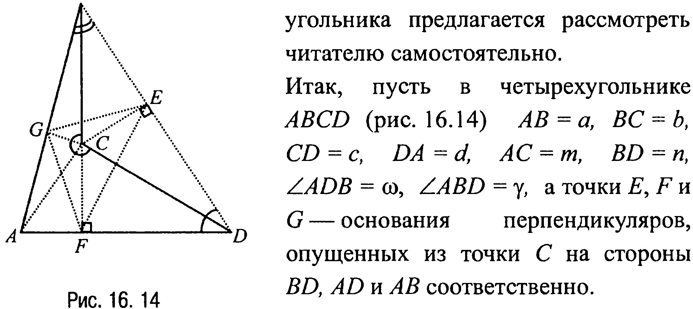

Тогда так как треугольники $CED$ и $CFD$ — прямоугольные, то точки $D, E, C, F$ лежат на одной окружности, построенной на отрезке $CD$ как на диаметре. Поэтому по расширенной теореме синусов из треугольника $EFD$ получаем, что $EF = c \cdot \sin \omega$. Аналогичным образом находим $FG = m \cdot \sin \phi, GE = b \cdot \sin \gamma$.

Далее, поскольку $\angle FEC = \angle ADC$, а $\angle CEG = \angle ABC$ (эти углы опираются соответственно на равные дуги), то $\angle FEG = \angle FEC + \angle CEG = \angle ADC + \angle ABC = 360^\circ - (\phi + \psi)$ и, значит, $\cos \angle FEG = \cos(\phi + \psi)$.

Замечая теперь, что на основании теоремы синусов из треугольника $ADB$ следуют равенства $\sin \omega = k \cdot a$, $\sin \gamma = k \cdot d$, $\sin \phi = k \cdot n$, а по теореме косинусов (примененной к треугольнику $EFG$) $FG^2 = GE^2 + EF^2 - 2GE \cdot EF \cdot \cos(\phi + \psi)$, получаем, что

$m^2 \sin^2 \phi = b^2 \sin^2 \gamma + c^2 \sin^2 \omega - 2bc \cdot \sin \gamma \cdot \sin \omega \cdot \cos(\phi + \psi)$ или

$m^2 k^2 n^2 = b^2 k^2 d^2 + c^2 k^2 a^2 - 2bc \cdot ad \cdot k^2 \cdot \cos(\phi + \psi)$, или

$m^2 n^2 = a^2 c^2 + b^2 d^2 - 2abcd \cdot \cos(\phi + \psi)$, что и требовалось доказать.

---
**стр. 205**
---

**ЗАДАЧИ**

**16.1.** Из внутренней точки $O$ выпуклого $n$-угольника на каждую сторону (или ее продолжение) опущен перпендикуляр. Доказать, что основание хотя бы одного из этих перпендикуляров лежит на соответствующей стороне, а не на ее продолжении.

**Решение.** «Обойдем» стороны $n$-угольника, например, по часовой стрелке и обозначим их последовательно через $a_1, a_2, \dots, a_n$. Через $h_i$ обозначим перпендикуляр, опущенный из точки $O$ на сторону $a_i$ (или ее продолжение), и допустим, что ни одно из оснований перпендикуляров не лежит на соответствующей стороне.

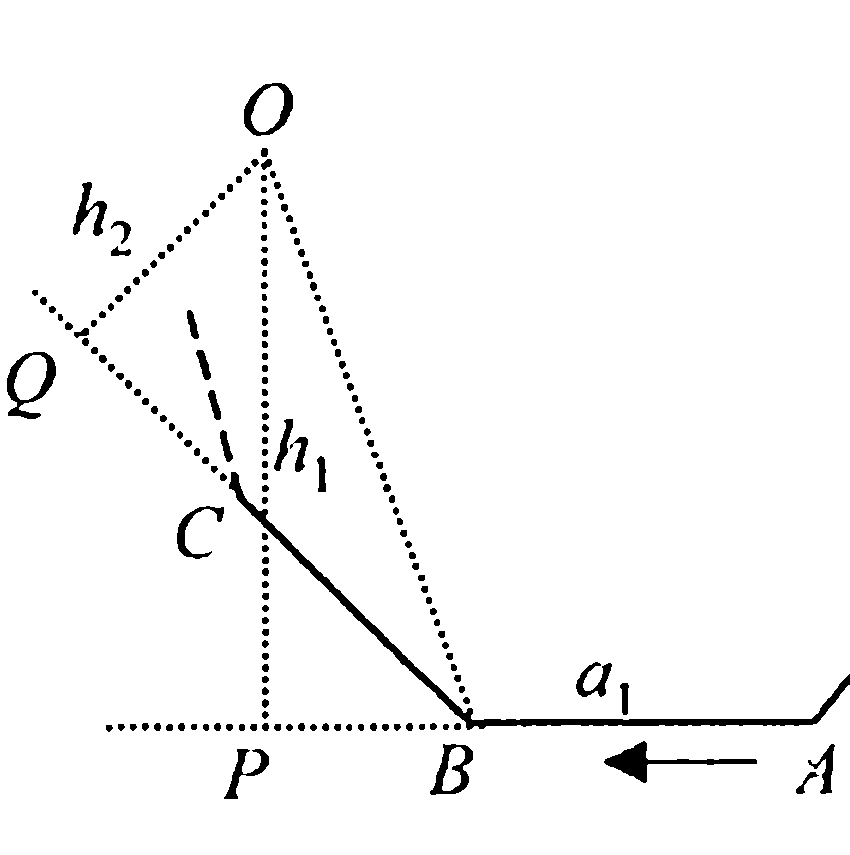

Пусть основание $P$ перпендикуляра $h_1$ (рис. 16.15) лежит на продолжении стороны $a_1 = AB$ за точку $B$ (случай, когда точка $P$ лежит на продолжении стороны $a_1$ за точку $A$, рассматривается совершенно аналогично). Тогда поскольку сторона $a_2 = BC$ лежит на луче, проходящем внутри угла $OBP$, то основание $Q$ перпендикуляра $h_2$ не может располагаться на продолжении стороны $a_2$ за точку $B$, причем очевидно, что $h_1 > h_2$.

Рассуждая аналогичным образом и далее, придем к цепочке неравенств $h_1 > h_2 > h_3 > \dots > h_n$.

Но поскольку сторона $a_1$ следует при обходе многоугольника за стороной $a_n$, то должно выполняться неравенство $h_n > h_1$, что приводит к противоречию. Полученное противоречие и доказывает требуемое.

---
**стр. 206**
---

**16.2.** Доказать, что вписанный в окружность $n$-угольник, все углы которого равны, является правильным $n$-угольником, если $n$ — нечетное, а если $n$ — четное, то это, вообще говоря, неверно.

**Решение.** Рассмотрим три последовательные стороны $AB$, $BC$ и $CD$ вписанного в окружность $n$-угольника, все углы которого равны (рис. 16.16).

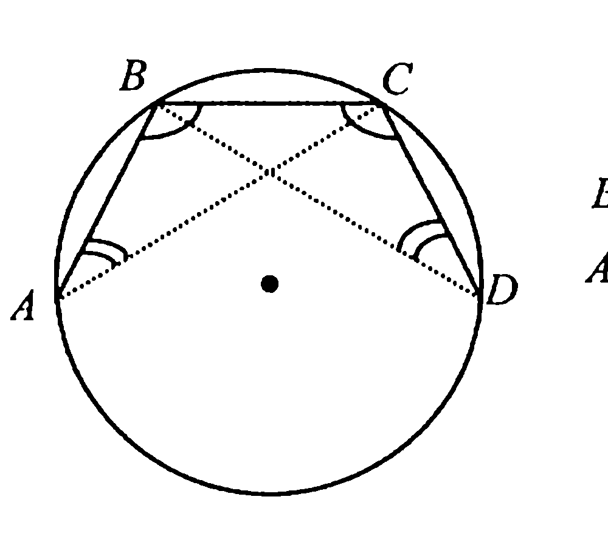

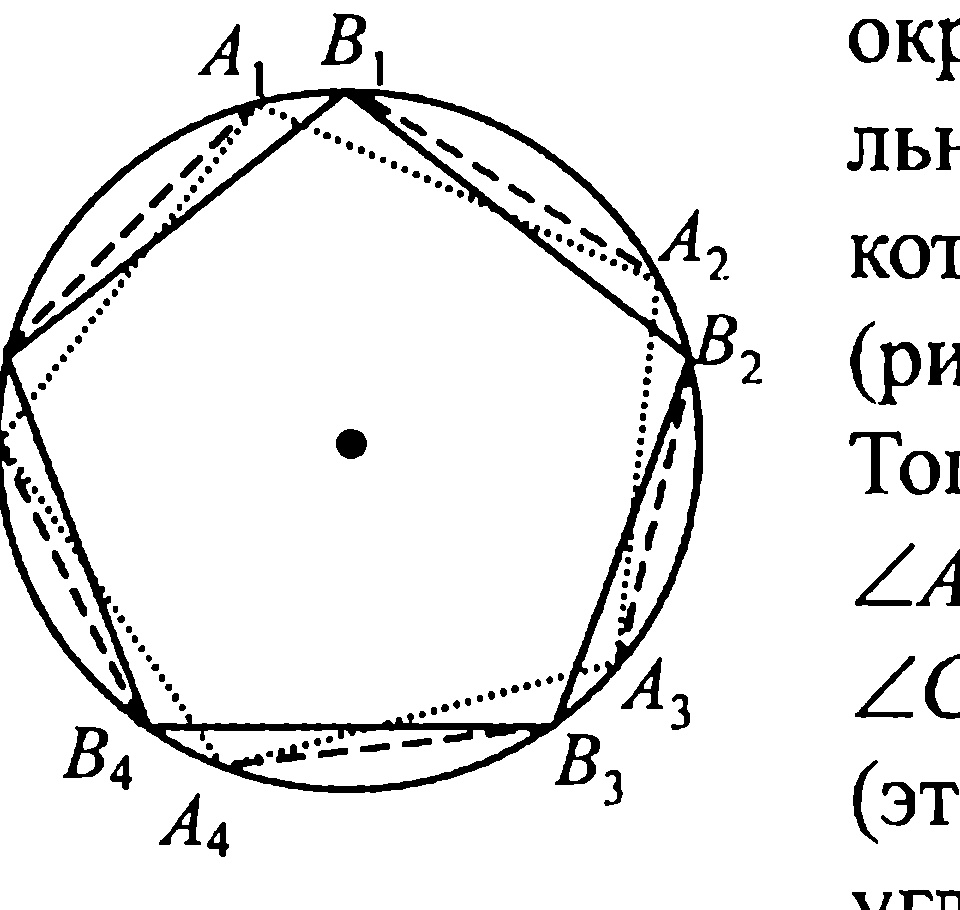

Тогда поскольку $\angle ABC = \angle BCD$, а $\angle CAB = \angle CDB$ (эти вписанные углы опираются на одну и ту же дугу), то $\angle BCA = \angle DBC$. Но в таком случае $\triangle ABC = \triangle BCD$ (сторона $BC$ у них общая) и, значит, $AB = CD$.

Из последнего равенства следует, что стороны данного $n$-угольника оказываются равными через одну и, следовательно, если $n$ — нечетное, то $n$-угольник будет правильным.

Пусть $n$ — число четное. При $n = 4$ примером вписанного неправильного четырехугольника с равными углами является прямоугольник, не являющийся квадратом.

В общем же случае искомый пример можно, в частности, построить следующим образом. Пусть $A_1, A_2, \dots, A_k$ — вершины правильного вписанного $k$-угольника (рис. 16.17).

Повернем этот $k$-угольник вокруг его центра на угол, не кратный углу $180^\circ/k$. В результате точки $A_1, A_2, \dots, A_k$ перейдут соответственно в точки $B_1, B_2, \dots, B_k$ и искомым неправильным вписанным $2k$-угольником с равными углами будет $2k$-угольник $A_1B_1A_2B_2 \dots A_kB_k$ (каждый из его углов опирается либо на сторону правильного $k$-угольника $A_1A_2 \dots A_k$, либо на такую же сторону правильного $k$-угольника $B_1B_2 \dots B_k$).

---
**стр. 207**
---

§ 16. $n$-угольники (многоугольники), произвольные четырехугольники

**16.3.** Два правильных многоугольника с периметрами $a$ и $b$ описаны около окружности, а третий правильный многоугольник вписан в эту окружность. Второй и третий многоугольники имеют каждый вдвое больше сторон, чем первый. Найти периметр третьего многоугольника.

**Решение.** Пусть $r$ — радиус окружности, $n$ — число сторон первого многоугольника, $c$ — периметр третьего многоугольника. Тогда в соответствии со свойствами 16.13 и 16.12 имеем

$$a = 2n \cdot r \operatorname{tg} \frac{180^\circ}{n} = 4n \cdot r \frac{\operatorname{tg} \frac{180^\circ}{2n}}{1 - \operatorname{tg}^2 \frac{180^\circ}{2n}}, \quad b = 4n \cdot r \operatorname{tg} \frac{180^\circ}{2n},$$

$$c = 4n \cdot r \sin \frac{180^\circ}{2n} = 4n \cdot r \frac{\operatorname{tg} \frac{180^\circ}{2n}}{\sqrt{1 + \operatorname{tg}^2 \frac{180^\circ}{2n}}}.$$

Сравнивая теперь первые два выражения, находим, что $\frac{b}{a} = 1 - \operatorname{tg}^2 \frac{180^\circ}{2n}$. Но в таком случае $1 + \operatorname{tg}^2 \frac{180^\circ}{2n} = \frac{2a - b}{a}$ и, значит, $c = b \sqrt{\frac{a}{2a - b}}$.

**Ответ:** $b \sqrt{\frac{a}{2a - b}}$.

**16.4.** Найти сторону $a$ правильного десятиугольника, если радиус описанной около него окружности равен $R$.

**Решение.** По свойству 16.12 сторона $a = 2R \cdot \sin 18^\circ$. Таким образом, задача свелась к нахождению $\sin 18^\circ$. Рассуждения здесь следующие.

Поскольку $\sin 36^\circ = \cos 54^\circ = \cos(3 \cdot 18^\circ)$ или $2 \sin 18^\circ \cdot \cos 18^\circ = 4 \cos^3 18^\circ - 3 \cos 18^\circ$, или $2 \sin 18^\circ = 4(1 - \sin^2 18^\circ) - 3$, или $4 \sin^2 18^\circ + 2 \sin 18^\circ - 1 = 0$, то, решая последнее уравнение относи-

---
**стр. 208**
---

тельно $\sin 18^\circ$, находим, что $\sin 18^\circ = \frac{\sqrt{5}-1}{4}$. Но в таком случае

$$a = \frac{\sqrt{5}-1}{2} R.$$

**Ответ:** $a = \frac{\sqrt{5}-1}{2} R$.

**16.5.** Доказать, что если в шестиугольнике противолежащие стороны (несмежные стороны, концевые точки которых соединены смежными сторонами) параллельны, а три диагонали, соединяющие противолежащие вершины, равны между собой, то около такого шестиугольника можно описать окружность.

**Решение.** Рассмотрим шестиугольник $ABCDEF$ (рис. 16.18) с параллельными сторонами $AB$ и $DE$, $BC$ и $EF$, $CD$ и $AF$ и равными диагоналями $AD$, $CF$ и $BE$.

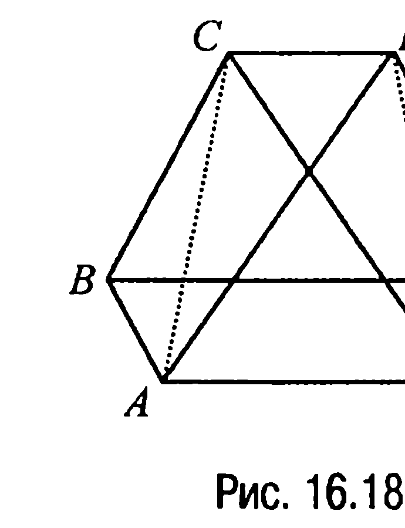

Тогда в силу характеристичности свойства 14.9X трапеция $ACDF$ будет равнобочной и, значит, $\angle FCD = \angle ADC$. А поскольку $\angle ADC = \angle DAF$, а $\angle AFD = \angle DCF$, то $\angle FCD = \angle ADC = \angle DAF = \angle CFA$.

Рассуждая аналогичным образом по отношению к трапециям с параллельными сторонами $BA$ и $DE$, а также $BC$ и $FE$, приходим к равенствам $\angle ABE = \angle DAB = \angle BED = \angle ADE$ и $\angle FCB = \angle CBE = \angle BEF = \angle CFE$, откуда, в частности, следует, что $\angle CBE + \angle ADE + \angle ADC = \angle FCB + \angle BED + \angle FCD$, т. е. у четырехугольника $BCDE$ суммы противолежащих углов равны. Но в таком случае из характеристичности свойства 15.1X следует, что через точки $B, C, D$ и $E$ можно провести окружность, которая, в силу равенства $\angle CBE = \angle CFE$, пройдет и через вершину $F$ (задача 15.7), а в силу равенства $\angle FCD = \angle DAF$ — и через вершину $A$, что и требовалось доказать.

---
**стр. 209**
---

§ 16. $n$-угольники (многоугольники), произвольные четырехугольники

**16.6.** На диагоналях $AC$ и $CE$ правильного шестиугольника $ABCDEF$ отмечены точки $M$ и $N$ соответственно таким образом, что $\frac{AM}{AC} = \frac{CN}{CE} = \lambda$. Известно, что точки $B$, $M$ и $N$ лежат на одной прямой. Найти $\lambda$.

**Решение.** Пусть $Q$ — точка пересечения диагоналей $AC$ и $BF$ (рис. 16.19). Диагонали $BF$ и $CE$ параллельны, поэтому треугольники $BQM$ и $CMN$ подобны и, значит, $\frac{BQ}{CN} = \frac{QM}{CM}$. Выразим все отрезки в полученном равенстве через отрезок $AC$. Так, из подобия треугольников $ABQ$ и $CFQ$ следует, что $\frac{BQ}{QF} = \frac{AB}{FC} = \frac{1}{2}$, а поскольку $BF = AC$, то $BQ = \frac{AC}{3}$. Аналогично $AQ = \frac{AC}{3}$. А тогда, замечая, что $CN = \lambda \cdot CE = \lambda \cdot AC$, $AM = \lambda \cdot AC$, $MC = (1 - \lambda)AC$, $QM = AM - AQ = \left(\lambda - \frac{1}{3}\right)AC$, приходим к выводу, что

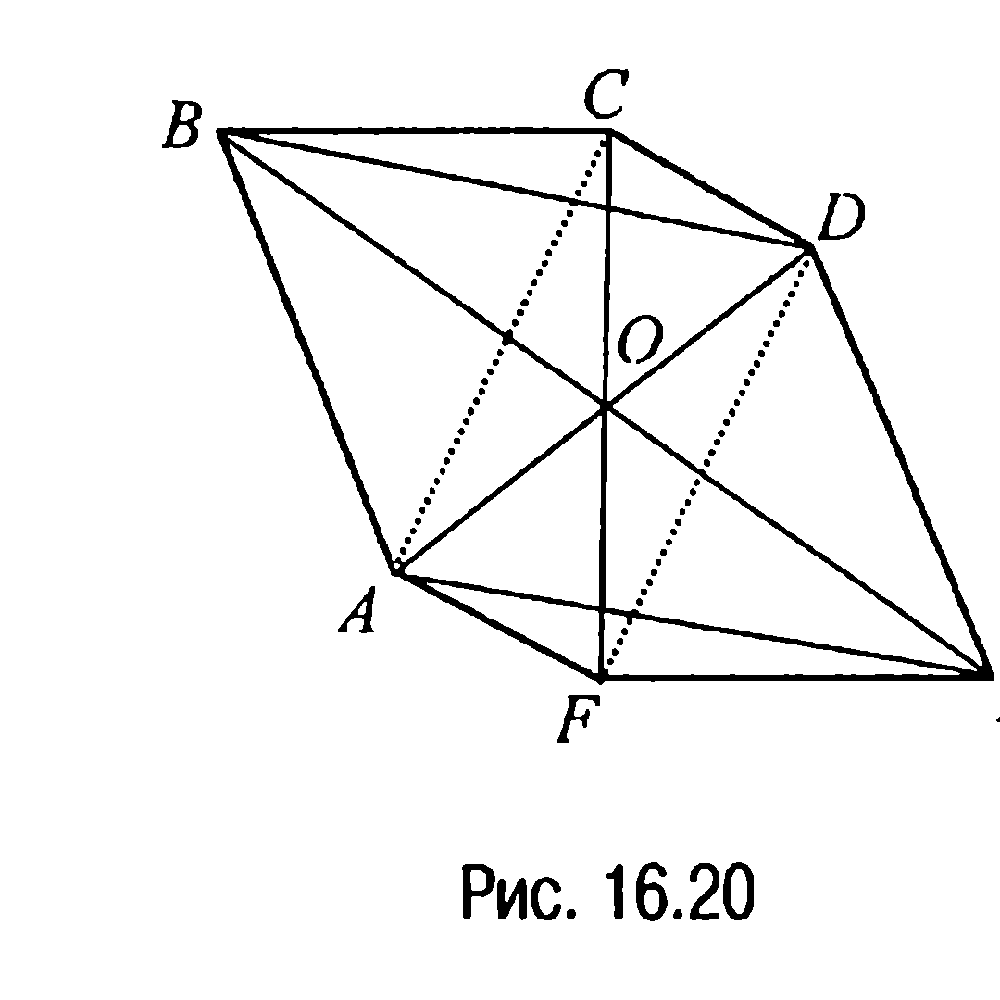

$$\frac{\frac{AC}{3}}{\lambda \cdot AC} = \frac{\left(\lambda - \frac{1}{3}\right)AC}{(1 - \lambda)AC} \quad \text{или} \quad \frac{\frac{1}{3}}{\lambda} = \frac{\lambda - \frac{1}{3}}{1 - \lambda}, \quad \text{или}$$

$\lambda^2 = \frac{1}{3}$, откуда находим, что $\lambda = \frac{\sqrt{3}}{3}$.

**Ответ:** $\lambda = \frac{\sqrt{3}}{3}$.

**16.7.** Доказать, что если в шестиугольнике противолежащие стороны равны и параллельны, то три его диагонали, соединяющие противолежащие вершины, пересекаются в одной точке.

**Решение.** Рассмотрим шестиугольник $ABCDEF$ (рис. 16.20) с равными и параллельными сторонами. Поскольку $AB = DE$ и

---
**стр. 210**
---

$AB \parallel DE$, то четырехугольник $ABDE$ является параллелограммом и, значит, его диагонали $AD$ и $BE$ в точке пересечения $O$ делятся пополам. С другой стороны, если рассмотреть четырехугольник $ACDF$, то у него как у параллелограмма диагонали $AD$ и $CF$ делятся в той же точке $O$ пополам. Но в таком случае три диагонали $AD$, $BE$ и $CF$ шестиугольника $ABCDEF$ пересекаются в одной точке. А это и требовалось доказать.

**16.8.** *Доказать, что если основания перпендикуляров, опущенных из вершин выпуклого четырехугольника на его диагонали, образуют четырехугольник, то этот четырехугольник подобен исходному четырехугольнику.*

**Решение.** Пусть $O$ — точка пересечения диагоналей выпуклого четырехугольника $ABCD$ (рис. 16.21), а $A_1, B_1, C_1$ и $D_1$ — основания перпендикуляров, опущенных из вершин $A, B, C$ и $D$ четырехугольника соответственно на его диагонали.

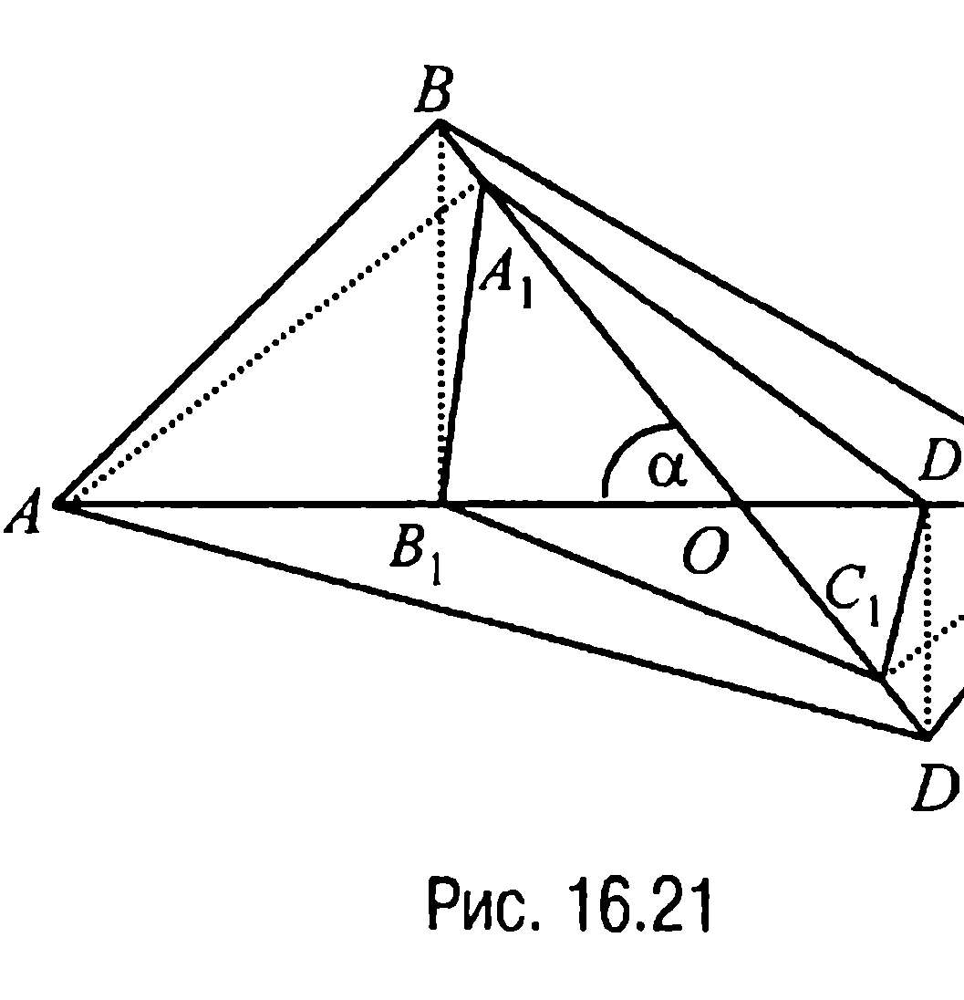

Очевидно, что не умаляя общности рассуждений, можно считать, что $\angle AOB = \alpha < 90^\circ$. Тогда из рассмотрения соответствующих прямоугольных треугольников следуют равенства:

$$OA_1 = OA \cdot \cos \alpha, \quad OB_1 = OB \cdot \cos \alpha, \quad OC_1 = OC \cdot \cos \alpha, \quad OD_1 = OD \cdot \cos \alpha.$$

Если теперь рассмотреть симметрию четырехугольника $A_1 B_1 C_1 D_1$ относительно прямой, на которой лежит биссектриса угла $AOB$, то очевидно, что точки $A_1$ и $C_1$ перейдут в точки диагонали $AC$, а точки $B_1$ и $D_1$ перейдут в точки диагонали $BD$.

---
**стр. 211**
---

Но в таком случае полученный четырехугольник окажется гомотетичным исходному четырехугольнику с коэффициентом гомотетии, равным $\cos \alpha$, что и доказывает требуемое.

**16.9.** В выпуклом четырехугольнике $ABCD$ точки $E, F, H, Q$ являются соответственно серединами отрезков $AB, BC, CD, AD$, точка $O$ — точка пересечения отрезков $EH$ и $FQ$, $EH = a, FQ = b, \angle FOH = 60^\circ$. Найти диагонали четырехугольника $ABCD$.

**Решение.** Прежде всего отметим, что четырехугольник $EFHQ$ (рис. 16.22) — параллелограмм (задача 13.1), у которого по условию угол $FOH$ между его диагоналями равен $60^\circ$.

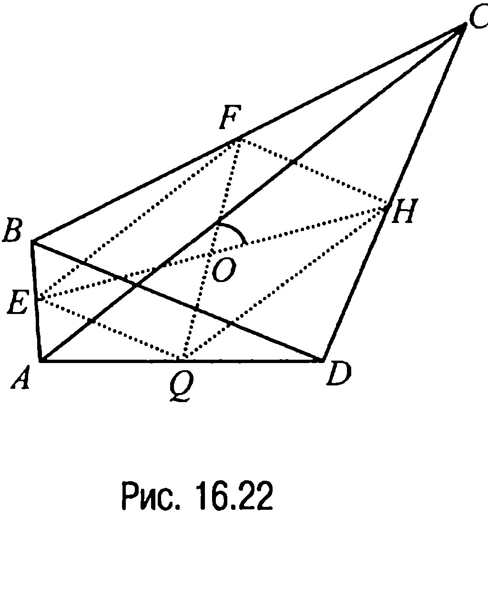

Рассмотрим треугольник $FOH$. По теореме косинусов $FH^2 = OF^2 + OH^2 - 2OF \cdot OH \cdot \cos 60^\circ = OF^2 + OH^2 - OF \cdot OH$. С другой стороны, $FH^2 = \frac{1}{4}BD^2$, поэтому $BD = 2\sqrt{\frac{b^2}{4} + \frac{a^2}{4} - \frac{ab}{4}} = \sqrt{a^2 + b^2 - ab}$.

Рассмотрим теперь треугольник $EOF$. В этом треугольнике $\angle EOF = \frac{360^\circ}{3}$, <!-- вероятная опечатка оригинала: по смыслу, вероятно, $\frac{360^\circ}{3}=120^\circ$ --> а тогда, рассуждая аналогично предыдущему, находим, что $AC = \sqrt{a^2 + b^2 + ab}$.

**Ответ:** $\sqrt{a^2 + b^2 - ab}, \sqrt{a^2 + b^2 + ab}$.

**16.10.** Пусть в выпуклом четырехугольнике $ABCD$ с непараллельными сторонами $AB$ и $CD$ прямая $CD$ касается окружности с диаметром $AB$. Доказать, что прямая $AB$ касается окружности с диаметром $CD$ тогда и только тогда, когда прямые $BC$ и $AD$ параллельны.

**Решение.** Пусть $N$ — точка пересечения продолжений сторон $BA$ и $CD$ четырехугольника $ABCD$ (рис. 16.23), точки $P$ и $Q$ —

---
**стр. 212**
---

середины сторон $AB$ и $CD$ соответственно, $QT \perp AB$, $PH \perp CD$, $\angle PQN = \alpha$, $\angle QPN = \beta$.

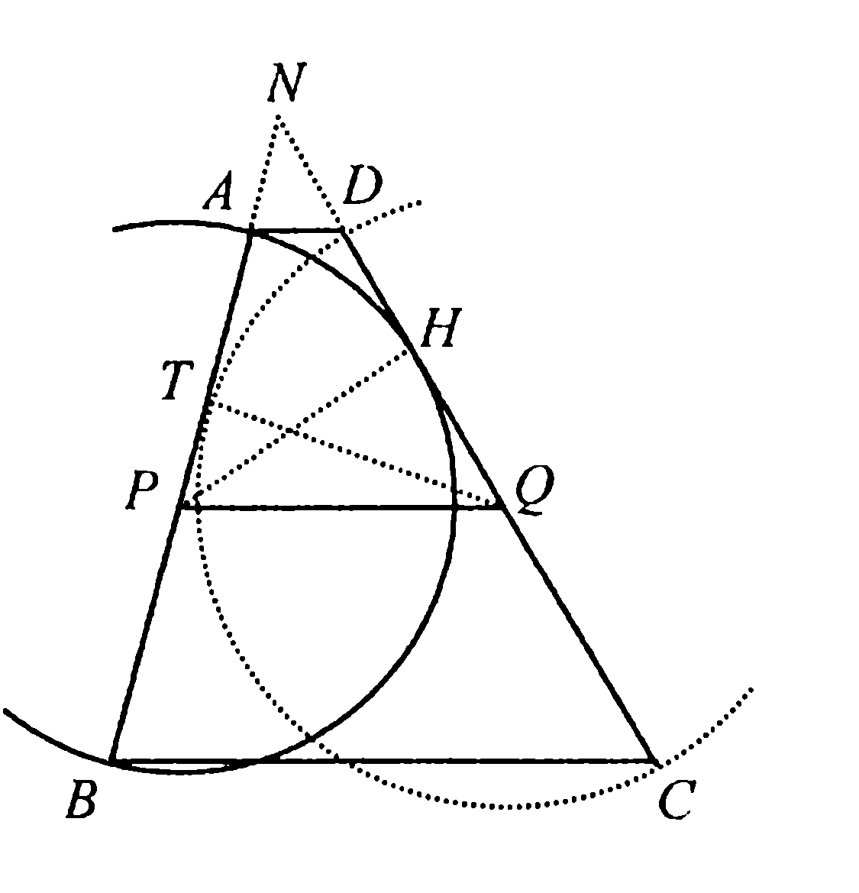

Тогда, замечая, что $PH = PA = R_1$ — радиус окружности с центром в точке $P$, а $QT = QD = R_2$ — радиус окружности с центром в точке $Q$, приходим к выводу, что условие «прямая $AB$ касается окружности с диаметром $CD$» равносильно условию $\frac{QT}{QD} = \frac{PH}{PA}$ или условию $\frac{PA}{QD} = \frac{PH}{QT}$.

Но поскольку $PH = PQ \cdot \sin \alpha$, $QT = PQ \cdot \sin \beta$, то последнее условие примет вид $\frac{PA}{QD} = \frac{\sin \alpha}{\sin \beta}$.

По теореме же синусов из треугольника $PNQ$ находим, что $\frac{\sin \alpha}{\sin \beta} = \frac{PN}{QN}$ и, таким образом, $\frac{PA}{QD} = \frac{PN}{QN}$ или $\frac{PA}{PN} = \frac{QD}{QN}$, откуда следует параллельность прямых $AD$ и $PQ$, а значит, и прямых $AD$ и $BC$.

**16.11.** Пусть $ABCD$ — произвольный четырехугольник. Известно, что окружности, вписанные в треугольники $ABC$ и $ACD$, касаются. Доказать, что касаются и окружности, вписанные в треугольники $ABD$ и $BCD$.

**Решение.** Покажем, что окружности, вписанные в треугольники, образованные сторонами четырехугольника и одной из его диагоналей, касаются тогда и только тогда, когда суммы противолежащих сторон этого четырехугольника равны. Из этого же факта и будет следовать искомое утверждение.

Итак, пусть в четырехугольнике $ABCD$ (рис. 16.24, 16.25) точка $K_1$ — точка касания диагонали $AC$ с окружностью, вписанной в треугольник $ABC$, точка $K_2$ — точка касания диагонали $AC$ с окружностью, вписанной в треугольник $ACD$, а точки $M, N, P$ и $S$ —

---
**стр. 213**
---

остальные точки касания окружностей с другими сторонами соответствующих треугольников.

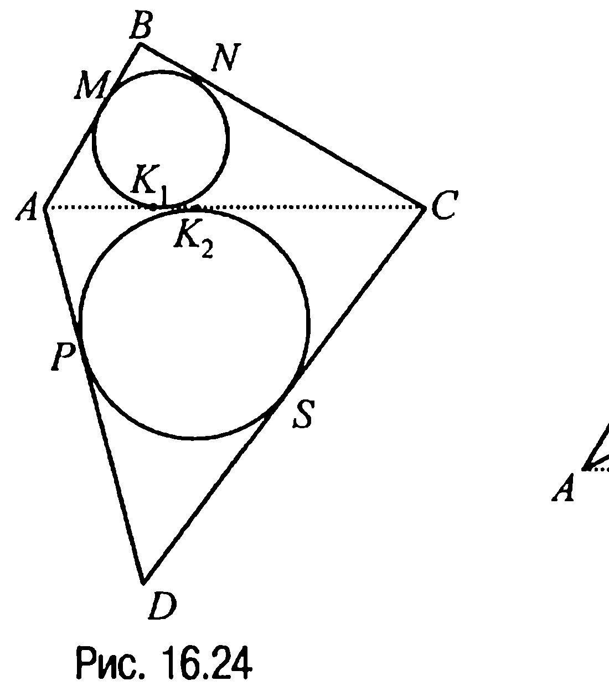

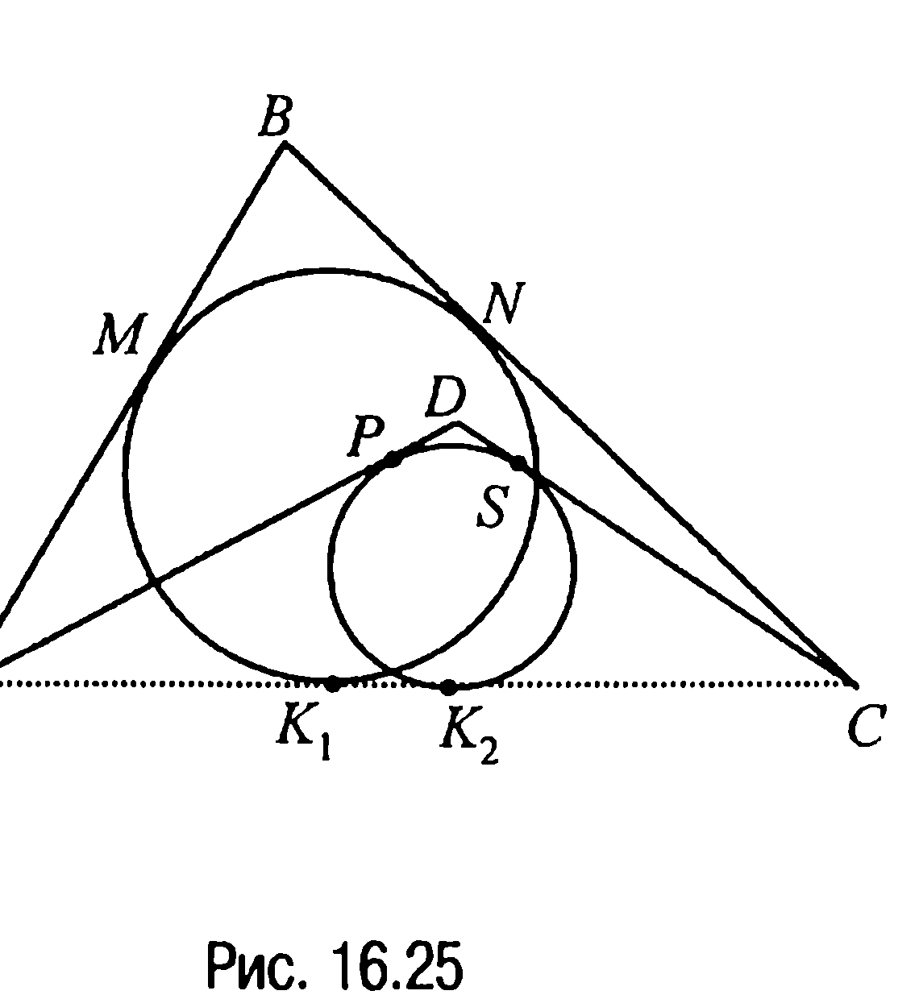

Тогда по одному из свойств касательных к окружности имеем

$$AB + CD = AM + MB + CS + SD = AK_1 + BN + K_2C + PD,$$

$$BC + AD = BN + NC + AP + PD = BN + K_1C + AK_2 + PD.$$

Но в таком случае равенство $AB + CD = BC + AD$ будет иметь место тогда и только тогда, когда $AK_1 + K_2C = AK_2 + K_1C$.

В свою очередь последнее равенство будет иметь место в том и только в том случае, когда точки $K_1$ и $K_2$ совпадают, т. е. когда окружности, вписанные в треугольники $ABC$ и $ACD$, касаются.

**16.12.** Доказать, что если в выпуклом четырехугольнике $ABCD$ биссектрисы внутренних углов $DAB$ и $BCD$ пересекаются с биссектрисами углов $ABC$ и $CDA$ в четырех точках, то эти точки лежат на одной окружности.

**Решение.** Пусть $P$ и $S$ — точки пересечения биссектрисы угла $DAB$ с биссектрисами углов $ABC$ и $CDA$ четырехугольника $ABCD$ соответственно, а $R$ и $Q$ — точки пересечения биссектрисы угла $BCD$ с биссектрисами углов $CDA$ и $ABC$ соответственно (рис. 16.26).

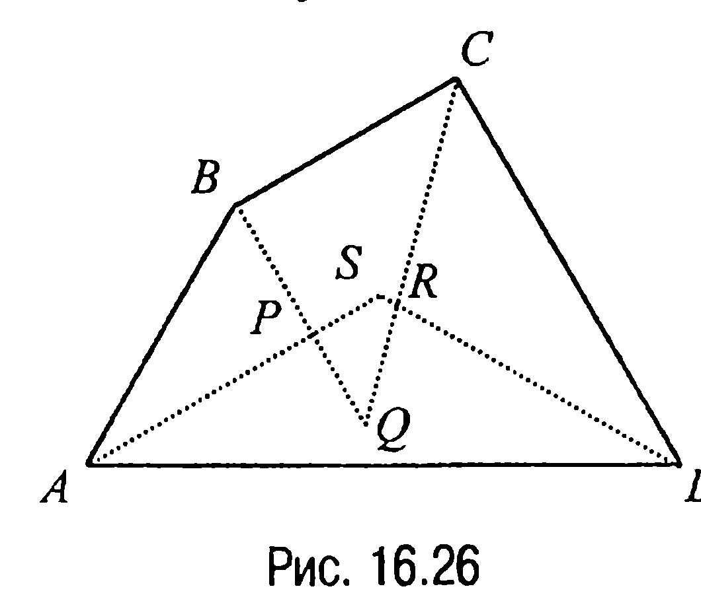

Пусть, далее, $\angle DAB = \alpha$, $\angle ABC = \beta$, $\angle BCD = \gamma$, $\angle CDA = \delta$. То-

---
**стр. 214**
---

гда $\angle ASD = 180^\circ - \dfrac{\alpha}{2} - \dfrac{\delta}{2}$, $\angle BQC = 180^\circ - \dfrac{\beta}{2} - \dfrac{\gamma}{2}$

и, значит,

$$\angle ASD + \angle BQC = 360^\circ - \frac{1}{2}(\alpha + \beta + \gamma + \delta) = 360^\circ - \frac{1}{2} 360^\circ = 180^\circ.$$

Полученное равенство означает (свойство 15.1X), что четырехугольник $PSRQ$ может быть вписан в окружность и, следовательно, точки $P$, $S$, $R$, $Q$ лежат на одной окружности.

▼ **16.13.** *В четырехугольнике $ABCD$ точка $O$ — точка пересечения диагоналей $AC$ и $BD$. Доказать, что площади треугольников $AOD$, $AOB$, $BOC$ и $DOC$ связаны соотношением $S_{\triangle AOB} \cdot S_{\triangle DOC} = S_{\triangle AOD} \cdot S_{\triangle BOC}$.*

**Решение.** Пусть $\angle AOB = \phi$ (рис. 16.27). Тогда $S_{\triangle AOB} \cdot S_{\triangle DOC} =$

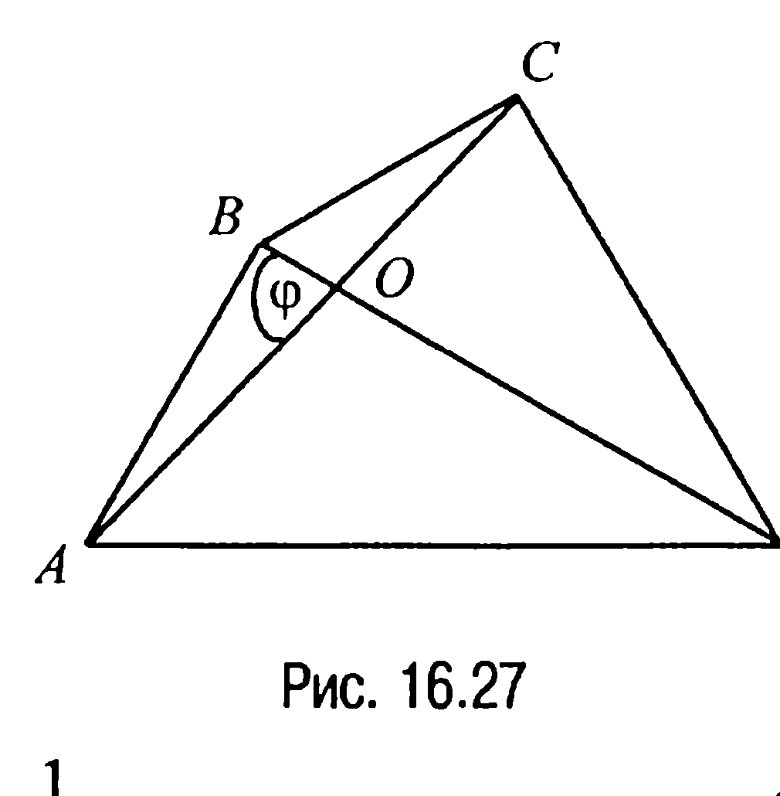

$$= \frac{1}{2} OA \cdot OB \cdot \sin \phi \cdot \frac{1}{2} OC \cdot OD \cdot \sin \phi =$$

$$= \frac{1}{4} OA \cdot OB \cdot OC \cdot OD \cdot \sin^2 \phi,$$

$$S_{\triangle AOD} \cdot S_{\triangle BOC} = \frac{1}{2} OA \cdot OD \cdot \sin(180^\circ - \phi) \cdot \frac{1}{2} OB \cdot OC \cdot \sin(180^\circ - \phi) =$$

$$= \frac{1}{4} OA \cdot OB \cdot OC \cdot OD \cdot \sin^2 \phi, \text{ что и доказывает требуемое.}$$

**ЗАДАЧИ ДЛЯ САМОСТОЯТЕЛЬНОГО РЕШЕНИЯ**

**16.1С.** *Из точки $O$ части плоскости, ограниченной выпуклым равносторонним $n$-угольником, на каждую его сторону (или ее продолжение) опущен перпендикуляр. Доказать, что сумма всех перпендикуляров не зависит от положения точки $O$.*

---
**стр. 215**
---

**16.2С.** *Доказать, что описанный около окружности $n$-угольник, все углы которого равны, является правильным $n$-угольником.*

**16.3С.** *Доказать, что описанный около окружности равносторонний $n$-угольник является правильным $n$-угольником, если $n$ — нечетное, а если $n$ — четное, то это, вообще говоря, неверно.*

**16.4С.** *Доказать, что вписанный в окружность равносторонний $n$-угольник является правильным $n$-угольником.*

**16.5С.** *Доказать, что в выпуклом четырехугольнике $ABCD$ точки пересечения медиан треугольников $ABC$, $ABD$, $ACD$ и $BCD$ являются вершинами четырехугольника, подобного данному.*

**16.6С.** *Доказать, что во всяком четырехугольнике отрезки, соединяющие середины двух пар противолежащих сторон, и отрезок, соединяющий середины диагоналей, проходят через одну точку и делятся в этой точке пополам.*

**16.7С.** *Доказать, что если при пересечении сторон выпуклого четырехугольника с окружностью образуются четыре равные хорды, то суммы противолежащих сторон такого четырехугольника равны.*

**16.8С.** *Если середины сторон четырехугольника принять за вершины нового четырехугольника, то, как известно, такой четырехугольник будет параллелограммом. При каких условиях он будет прямоугольником? Ромбом? Квадратом?*

---
**стр. 216**
---

**16.9С.** *Доказать, что любая точка части плоскости, ограниченной выпуклым четырехугольником, принадлежит хотя бы одному из кругов, диаметрами которых являются стороны четырехугольника.*
