## 3.1. Площадь n-угольников

---
**стр. 217**
---

# ГЛАВА 3

# ПЛОЩАДЬ

## § 17. ПЛОЩАДЬ $n$-УГОЛЬНИКОВ

***Площадь $n$-угольника*** — это численная характеристика, приписываемая конечной части плоскости, ограниченной $n$-угольником, со следующими четырьмя свойствами:

1) площадь положительна;

2) если $n$-угольник составлен из нескольких других $n$-угольников, не имеющих общих внутренних точек, то его площадь равна сумме площадей этих $n$-угольников;

3) равные $n$-угольники имеют равные площади;

4) площадь квадрата со стороной, равной единице измерения отрезков, равна единице.

***Площадь квадрата со стороной, равной $a$, равна $a^2$.***

Вычисление площади произвольного $n$-угольника сводится к вычислению площади равновеликого ему квадрата, который всегда может быть построен тем или иным способом.

**17.1. Площадь прямоугольника и параллелограмма**

**Теорема 17.1.** *Площадь прямоугольника равна произведению его смежных сторон.*

**Доказательство.** Пусть смежные стороны прямоугольника равны $a$ и $b$ и пусть $S$ — площадь прямоугольника. Достроим данный прямоугольник до квадрата (рис. 17.1).

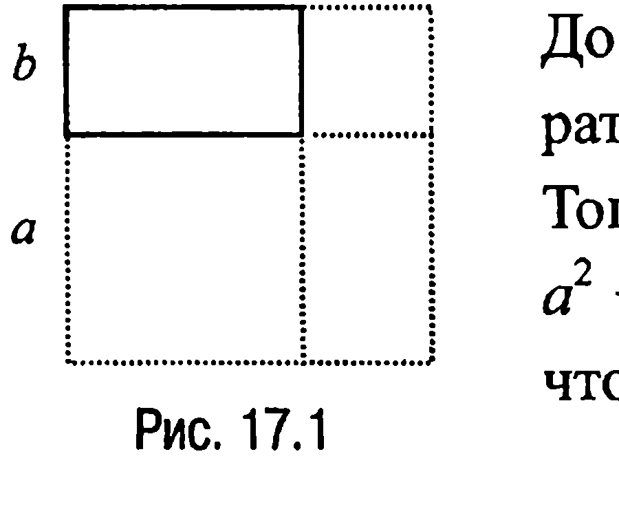

Тогда $(a + b)^2 = a^2 + b^2 + 2S$ или $a^2 + 2ab + b^2 = a^2 + 2S + b^2$, откуда следует, что $S = ab$, а это и требовалось доказать.

---
**стр. 218**
---

**Теорема 17.2.** *Площадь параллелограмма равна произведению его основания на высоту.*

**Доказательство.** Примем в параллелограмме $ABCD$ (рис. 17.2) сторону $AD$ за основание. Пусть $BE$ и $CF$ — высоты параллелограмма.

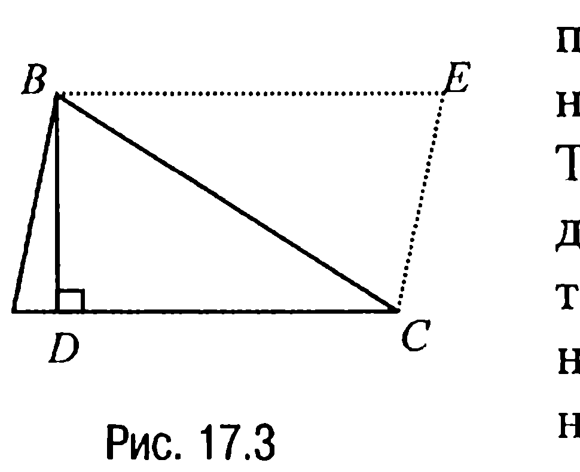

Тогда очевидно, что прямоугольные треугольники $BEA$ и $CFD$ равны ($AB = CD$, $\angle EAB = \angle FDC$) и, значит, площади указанных треугольников также равны. Но в таком случае площадь параллелограмма $ABCD$ равна площади прямоугольника $BCFE$, т. е. $S_{ABCD} = S_{BCFE} = BC \cdot BE = AD \cdot BE$, что и требовалось доказать.

**17.2. Площадь треугольника**

Напомним обозначения, которые использовались в предыдущих параграфах при рассмотрении произвольного треугольника $ABC$:

$AB = c$, $BC = a$, $AC = b$; $\angle CAB = \alpha$, $\angle ABC = \beta$, $\angle BCA = \gamma$;

$h_a$, $h_b$ и $h_c$ — высоты, опущенные соответственно из вершин $A$, $B$ и $C$ на стороны $a$, $b$ и $c$ (или их продолжения);

$m_a$, $m_b$ и $m_c$ — медианы, проведенные соответственно из вершин $A$, $B$ и $C$ к сторонам $a$, $b$ и $c$;

$l_a$, $l_b$ и $l_c$ — биссектрисы треугольника углов $\alpha$, $\beta$ и $\gamma$ соответственно;

$r$ — радиус вписанной окружности;

$r_a$, $r_b$ и $r_c$ — радиусы вневписанных окружностей, касающихся соответственно сторон $a$, $b$ и $c$ и продолжений двух других сторон;

$R$ — радиус описанной окружности;

$p = \dfrac{a+b+c}{2}$ — полупериметр треугольника (а также длина отрезка касательной к вневписанной окружности треугольника, заключенного между вершиной треугольника и точкой касания с вневписанной окружностью, касающейся той стороны треугольника, которая лежит против выбранной вершины (задача 9.6));

---
**стр. 219**
---

$p_a = p - a, p_b = p - b$ и $p_c = p - c$ — отрезки касательных, заключенные соответственно между вершинами $A, B$ и $C$ и точками касания с вписанной окружностью (задача 9.2);

$S$ — площадь треугольника $ABC$.

**Теорема 17.3.** $S = \frac{1}{2} a \cdot h_a = \frac{1}{2} b \cdot h_b = \frac{1}{2} c \cdot h_c$.

**Доказательство.** Рассмотрим треугольник $ABC$ (рис. 17.3), где, например, сторону $AC$ примем за основание. Пусть $BD$ — высота треугольника.

Тогда если достроить треугольник $ABC$ до параллелограмма $ABEC$ (рис. 17.3), то треугольники $ABC$ и $ECB$ будут равны ($AC = BE, AB = CE$, сторона $BC$ у них общая) и, значит, их площади также равны.

Но в таком случае площадь треугольника $ABC$ равна половине площади параллелограмма $ABEC$, т. е. $S = \frac{1}{2} AC \cdot BD = \frac{1}{2} b \cdot h_b$, что и доказывает требуемое.

**Теорема 17.4.** $S = \frac{1}{2} a \cdot b \cdot \sin \gamma = \frac{1}{2} a \cdot c \cdot \sin \beta = \frac{1}{2} b \cdot c \cdot \sin \alpha$.

**Доказательство.** Покажем, например, что $S = \frac{1}{2} a \cdot b \cdot \sin \gamma$. Действительно, так как в треугольнике $ABC$ (рис. 17.3) высота $h_b = a \cdot \sin \gamma$ (треугольник $CDB$ — прямоугольный), то на основании теоремы 17.3 имеем $S = \frac{1}{2} b \cdot h_b = \frac{1}{2} b \cdot (a \cdot \sin \gamma) = \frac{1}{2} a \cdot b \cdot \sin \gamma$.

**Теорема 17.5.** $S = \frac{a^2}{2} \cdot \frac{\sin \beta \cdot \sin \gamma}{\sin \alpha} = \frac{b^2}{2} \cdot \frac{\sin \alpha \cdot \sin \gamma}{\sin \beta} =$
$= \frac{c^2}{2} \cdot \frac{\sin \alpha \cdot \sin \beta}{\sin \gamma}$.

**Доказательство.** Из теоремы синусов следует, что $b = \frac{a \cdot \sin \beta}{\sin \alpha},$

$a = \frac{c \cdot \sin \alpha}{\sin \gamma},$ $c = \frac{b \cdot \sin \gamma}{\sin \beta}.$

---
**стр. 220**
---

А тогда, подставляя выписанные значения $b, a,$ и $c$ соответственно в первую, вторую и третью формулы из теоремы 17.4, получим требуемое.

**Теорема 17.6.** $S = 2R^2 \cdot \sin\alpha \cdot \sin\beta \cdot \sin\gamma$.

**Доказательство.** Из расширенной теоремы синусов вытекает, что $a = 2R \cdot \sin\alpha$, $b = 2R \cdot \sin\beta$, $c = 2R \cdot \sin\gamma$. Подставляя теперь значения $a, b$ и $c$ в соответствующие формулы из теоремы 17.5, получим искомую формулу.

**Теорема 17.7.** $S = \frac{1}{2} \cdot R^2 \cdot (\sin 2\alpha + \sin 2\beta + \sin 2\gamma)$.

**Доказательство.** В соответствии с теоремой 17.6 достаточно показать, что $\sin 2\alpha + \sin 2\beta + \sin 2\gamma = 4 \cdot \sin\alpha \cdot \sin\beta \cdot \sin\gamma$. Но последнее равенство действительно имеет место, поскольку справедлива цепочка равенств:

$\sin 2\alpha + \sin 2\beta + \sin 2\gamma = 2\sin(\alpha + \beta) \cdot \cos(\alpha - \beta) + \sin 2(180^\circ - (\alpha + \beta)) = 2\sin(\alpha + \beta) \cdot \cos(\alpha - \beta) - \sin 2(\alpha + \beta) = 2\sin(\alpha + \beta) \cdot \cos(\alpha - \beta) - 2\sin(\alpha + \beta) \cdot \cos(\alpha + \beta) = 2\sin(\alpha + \beta) \cdot (\cos(\alpha - \beta) - \cos(\alpha + \beta)) = 2\sin(\alpha + \beta) \cdot 2\sin\alpha \cdot \sin\beta = 4\sin(\alpha + \beta) \cdot \sin\alpha \cdot \sin\beta = 4\sin(180^\circ - (\alpha + \beta)) \cdot \sin\alpha \cdot \sin\beta = 4\sin\gamma \cdot \sin\alpha \cdot \sin\beta$.

**Теорема 17.8.** $S = p \cdot r = p_a \cdot r_a = p_b \cdot r_b = p_c \cdot r_c$.

Справедливость этой теоремы следует, например, из формул, выведенных при решении задач 9.1 и 9.7.

Из теоремы 17.8 и расширенной теоремы синусов вытекает

**Теорема 17.9.** $S = R \cdot r (\sin\alpha + \sin\beta + \sin\gamma)$.

**Теорема 17.10.** $S = \frac{abc}{4R}$.

Доказательство этой теоремы проведено при решении задачи 9.5.

**Теорема 17.11.** $S = \frac{1}{2} \cdot \frac{h_a h_b}{\sin\gamma} = \frac{1}{2} \cdot \frac{h_a h_c}{\sin\beta} = \frac{1}{2} \cdot \frac{h_b h_c}{\sin\alpha}$.

**Доказательство.** Так как $a = \frac{h_b}{\sin\gamma}$, $b = \frac{h_c}{\sin\alpha}$, $c = \frac{h_a}{\sin\beta}$, то, подставив значения $a, b$ и $c$ в соответствующие формулы из теоремы 17.3, получим требуемое.

---
**стр. 221**
---

Далее, так как $\frac{h_a}{h_b} = \frac{\sin \beta}{\sin \alpha}$, $\frac{h_a}{h_c} = \frac{\sin \gamma}{\sin \alpha}$, $\frac{h_b}{h_c} = \frac{\sin \gamma}{\sin \beta}$ (эти формулы очевидным образом следуют из соотношений, выражающих высоты треугольника через его стороны и синусы соответствующих углов), а значит, $h_b = \frac{h_a \sin \alpha}{\sin \beta}$, $h_c = \frac{h_b \sin \beta}{\sin \gamma}$, $h_a = \frac{h_c \sin \gamma}{\sin \alpha}$, то, подставив полученные значения $h_a, h_b$ и $h_c$ в соответствующие формулы теоремы 17.11, придем к следующему утверждению.

**Теорема 17.12.** $S = \frac{1}{2} h_a^2 \cdot \frac{\sin \alpha}{\sin \beta \sin \gamma} = \frac{1}{2} h_b^2 \cdot \frac{\sin \beta}{\sin \alpha \sin \gamma} =$
$= \frac{1}{2} h_c^2 \cdot \frac{\sin \gamma}{\sin \alpha \sin \beta}$.

**Теорема 17.13.** $S = \frac{1}{2} \frac{a \cdot h_b \sin \beta}{\sin \alpha} = \frac{1}{2} \frac{b \cdot h_c \sin \gamma}{\sin \beta} = \frac{1}{2} \frac{c \cdot h_a \sin \alpha}{\sin \gamma}$.

Справедливость этой теоремы устанавливается очевидным образом, если подставить значения $h_a = c \cdot \sin \beta, h_b = a \cdot \sin \gamma, h_c = b \cdot \sin \alpha$ в соответствующие формулы теоремы 17.5.

**Теорема 17.14.** $S = r_a \cdot r_b \cdot \text{tg} \frac{\gamma}{2} = r_a \cdot r_c \cdot \text{tg} \frac{\beta}{2} = r_b \cdot r_c \cdot \text{tg} \frac{\alpha}{2}$.

**Доказательство.** Из формулы, доказанной при решении задачи 9.8, следует, что $r_a = p \cdot \text{tg} \frac{\alpha}{2}$, $r_b = p \cdot \text{tg} \frac{\beta}{2}$, $r_c = p \cdot \text{tg} \frac{\gamma}{2}$. С учетом выписанных равенств докажем, например, первую из формул теоремы 17.14, остальные две доказываются аналогично. Доказательство основывается на теореме 17.8:

$S = p \cdot r = \frac{p \cdot r \cdot r_c}{r_c} = \frac{r_a r_b r_c}{p} = r_a \cdot r_b \cdot \text{tg} \frac{\gamma}{2}$.

**Теорема 17.15.** $S = r_a^2 \cdot \text{tg} \frac{\beta}{2} \cdot \text{tg} \frac{\gamma}{2} \cdot \text{ctg} \frac{\alpha}{2} =$
$= r_b^2 \cdot \text{tg} \frac{\gamma}{2} \cdot \text{tg} \frac{\alpha}{2} \cdot \text{ctg} \frac{\beta}{2} = r_c^2 \cdot \text{tg} \frac{\alpha}{2} \cdot \text{tg} \frac{\beta}{2} \cdot \text{ctg} \frac{\gamma}{2}$.

**Доказательство.** Докажем, например, первую из приведенных формул (остальные доказываются аналогично), заметив, что в соответствии с задачей 9.8 имеет место равенство

---
**стр. 222**
---

$\frac{r_b}{r_a} = \frac{\text{tg} \frac{\beta}{2}}{\text{tg} \frac{\alpha}{2}}$ или равенство $r_b = r_a \cdot \text{tg} \frac{\beta}{2} \cdot \text{ctg} \frac{\alpha}{2}$.

С учетом этого равенства из теоремы 17.14 имеем $S = r_a \cdot r_b \cdot \text{tg} \frac{\gamma}{2} =$
$= r_a \cdot \text{tg} \frac{\gamma}{2} \cdot r_b = r_a \cdot \text{tg} \frac{\gamma}{2} \cdot r_a \cdot \text{tg} \frac{\beta}{2} \cdot \text{ctg} \frac{\alpha}{2} = r_a^2 \cdot \text{tg} \frac{\beta}{2} \cdot \text{tg} \frac{\gamma}{2} \cdot \text{ctg} \frac{\alpha}{2}$, что и требовалось доказать.

**Теорема 17.16.** $S = r \cdot r_a \cdot \text{ctg} \frac{\alpha}{2} = r \cdot r_b \cdot \text{ctg} \frac{\beta}{2} = r \cdot r_c \cdot \text{ctg} \frac{\gamma}{2}$.

Справедливость этой теоремы прямо следует из теоремы 17.8, если воспользоваться формулами:
$p_a = r \cdot \text{ctg} \frac{\alpha}{2}$, $p_b = r \cdot \text{ctg} \frac{\beta}{2}$, $p_c = r \cdot \text{ctg} \frac{\gamma}{2}$ (задача 9.8).

Отметим далее следующее. Выше было показано (задача 10.10), что $p = 4R \cdot \cos \frac{\alpha}{2} \cdot \cos \frac{\beta}{2} \cdot \cos \frac{\gamma}{2}$, $r = 4R \cdot \sin \frac{\alpha}{2} \cdot \sin \frac{\beta}{2} \cdot \sin \frac{\gamma}{2}$.

С учетом второй из этих двух формул находим, что
$p_a = 4R \cdot \cos \frac{\alpha}{2} \cdot \sin \frac{\beta}{2} \cdot \sin \frac{\gamma}{2}$, $p_b = 4R \cdot \cos \frac{\beta}{2} \cdot \sin \frac{\gamma}{2} \cdot \sin \frac{\alpha}{2}$,
$p_c = 4R \cdot \cos \frac{\gamma}{2} \cdot \sin \frac{\alpha}{2} \cdot \sin \frac{\beta}{2}$.

А тогда следствием теорем 17.8 и 17.16 является

**Теорема 17.17.** $S = r^2 \cdot \text{ctg} \frac{\alpha}{2} \cdot \text{ctg} \frac{\beta}{2} \cdot \text{ctg} \frac{\gamma}{2}$.

**Действительно,** $S = r \cdot r_a \cdot \text{ctg} \frac{\alpha}{2} = \left(r \cdot \text{ctg} \frac{\alpha}{2}\right) \cdot r_a = \left(r \cdot \text{ctg} \frac{\alpha}{2}\right) \cdot \left(\frac{pr}{p_a}\right) =$
$= r^2 \cdot \text{ctg} \frac{\alpha}{2} \cdot \left(\frac{p}{p_a}\right) = r^2 \cdot \text{ctg} \frac{\alpha}{2} \cdot \left(\frac{4R \cos \frac{\alpha}{2} \cos \frac{\beta}{2} \cos \frac{\gamma}{2}}{4R \cos \frac{\alpha}{2} \sin \frac{\beta}{2} \sin \frac{\gamma}{2}}\right) =$
$= r^2 \cdot \text{ctg} \frac{\alpha}{2} \cdot \text{ctg} \frac{\beta}{2} \cdot \text{ctg} \frac{\gamma}{2}$, что и требовалось доказать.

---
**стр. 223**
---

Далее, как следует из теоремы 17.8, имеет место следующая цепочка равенств $\frac{p_a}{r_b} = \frac{p_b}{r_a} = \frac{r_c}{p} = \frac{r}{p_c}$.

Отсюда, в частности, приходим к выводу, что
$p \cdot p_a = r_b \cdot r_c, \quad r \cdot r_a = p_b \cdot p_c \text{ и, значит, } p \cdot p_a \cdot p_b \cdot p_c = r \cdot r_a \cdot r_b \cdot r_c =$
$= \left( 16R^2 \cdot \sin \frac{\alpha}{2} \cdot \sin \frac{\beta}{2} \cdot \sin \frac{\gamma}{2} \cdot \cos \frac{\alpha}{2} \cdot \cos \frac{\beta}{2} \cdot \cos \frac{\gamma}{2} \right)^2 =$
$= (2R^2 \cdot \sin\alpha \cdot \sin\beta \cdot \sin\gamma)^2 = S^2$. Таким образом, имеют место следующие два утверждения:

**Теорема 17.18 (Формула Герона).** $S = \sqrt{p \cdot p_a \cdot p_b \cdot p_c}$.

**Теорема 17.19.** $S = \sqrt{r \cdot r_a \cdot r_b \cdot r_c}$.

В заключение этого пункта остановимся на одном подходе [7] получения с единой точки зрения многих формул, связанных с «решением треугольников» и, в частности, с выводом формул для вычисления площади треугольника. Именно, пусть
$S_a = \sin \frac{\alpha}{2}, S_b = \sin \frac{\beta}{2}, S_c = \sin \frac{\gamma}{2};$
$C_a = \cos \frac{\alpha}{2}, C_b = \cos \frac{\beta}{2}, C_c = \cos \frac{\gamma}{2}.$

Тогда
$p = 4R \cdot C_a \cdot C_b \cdot C_c;$
$p_a = 4R \cdot C_a \cdot S_b \cdot S_c, p_b = 4R \cdot C_b \cdot S_a \cdot S_c, p_c = 4R \cdot C_c \cdot S_a \cdot S_b;$
$r = 4R \cdot S_a \cdot S_b \cdot S_c;$
$r_a = 4R \cdot S_a \cdot C_b \cdot C_c, r_b = 4R \cdot S_b \cdot C_a \cdot C_c, r_c = 4R \cdot S_c \cdot C_a \cdot C_b;$
$a = 4R \cdot S_a \cdot C_a, b = 4R \cdot S_b \cdot C_b, c = 4R \cdot S_c \cdot C_c;$
$H_a = 4R \cdot S_b \cdot S_c \cdot C_b \cdot C_c, H_b = 4R \cdot S_a \cdot S_c \cdot C_a \cdot C_c,$
$H_c = 4R \cdot S_a \cdot S_b \cdot C_a \cdot C_b$, где $H_a=\frac{1}{2}h_a, H_b=\frac{1}{2}h_b, H_c=\frac{1}{2}h_c;$
$S = 16R^2 \cdot S_a \cdot S_b \cdot S_c \cdot C_a \cdot C_b \cdot C_c.$

---
**стр. 224**
---

Приведенные формулы позволяют представить отношение любых линейных элементов треугольника через углы. Например,
$\frac{r}{r_a} = \frac{S_b S_c}{C_b C_c}, \quad \frac{p_c}{p} = \frac{S_a S_b}{C_a C_b}, \quad \frac{r_a}{a} = \frac{C_b C_c}{C_a}$ и т. д.

Более того, они дают возможность воспроизвести практически любую формулу, относящуюся к треугольнику, которая приводится в школьном учебнике.

Так, например, если вам необходимо воспроизвести формулу для вычисления площади треугольника, где фигурирует квадрат радиуса $r$ вписанной в треугольник окружности, то из цепочки равенств
$\frac{S}{r^2} = \frac{16R^2 S_a \cdot S_b \cdot S_c \cdot C_a \cdot C_b \cdot C_c}{16R^2 S_a^2 \cdot S_b^2 \cdot S_c^2} = \frac{C_a \cdot C_b \cdot C_c}{S_a \cdot S_b \cdot S_c} = \text{ctg} \frac{\alpha}{2} \cdot \text{ctg} \frac{\beta}{2} \cdot \text{ctg} \frac{\gamma}{2}$
находим, что $S = r^2 \cdot \text{ctg} \frac{\alpha}{2} \cdot \text{ctg} \frac{\beta}{2} \cdot \text{ctg} \frac{\gamma}{2}$ — формула, доказанная в теореме 17.17.

Другой пример. Если требуется воспроизвести формулу для вычисления площади треугольника, в которой фигурируют сторона $a$ и высота $h_b$ треугольника, воспользуемся равенствами
$\frac{S}{a \cdot H_b} = \frac{16R^2 S_a \cdot S_b \cdot S_c \cdot C_a \cdot C_b \cdot C_c}{4R \cdot S_a \cdot C_a \cdot 4R \cdot S_a \cdot S_c \cdot C_a \cdot C_c} = \frac{S_b \cdot C_b}{S_a \cdot C_a},$
откуда
$S = \frac{a}{2} \frac{h_b \cdot \sin \frac{\beta}{2} \cos \frac{\beta}{2}}{\sin \frac{\alpha}{2} \cos \frac{\alpha}{2}}$ или $S = \frac{1}{2} \frac{a \cdot h_b \sin \beta}{\sin \alpha}$ — формула, доказанная в теореме 17.13.

Далее, если вы хотите, например, получить формулу для вычисления площади треугольника, в которой фигурируют три высоты, то такая формула также легко выводится. Именно, имеет место

---
**стр. 225**
---

**Теорема 17.20.** $S = \frac{1}{2} \sqrt{2R \cdot h_a \cdot h_b \cdot h_c}$.

В самом деле, поскольку

$$\frac{S}{H_a H_b H_c} = \frac{16R^2 S_a S_b S_c C_a C_b C_c}{4R S_b S_c C_b C_c \cdot 4R S_a S_c C_a C_c \cdot 4R S_a S_b C_a C_b} =$$

$$= \frac{1}{4R S_a S_b S_c C_a C_b C_c} = \frac{4R}{S},$$

то заметив, что $H_a, H_b, H_c$ — это соответствующие полувысоты треугольника, мы и убеждаемся в справедливости искомой формулы.

Как показывают приведенные примеры, указанным способом действительно можно не только воспроизводить уже известные формулы, но и получать другие через линейные элементы треугольника и его углы.

**17.3. Площадь трапеции, произвольного четырехугольника и описанного $n$-угольника**

**Теорема 17.21.** *Площадь трапеции равна произведению полусуммы ее оснований на высоту.*

**Доказательство.** Проведем в трапеции $ABCD$ (рис. 17.4) высоты $BE$ и $DF$. Тогда

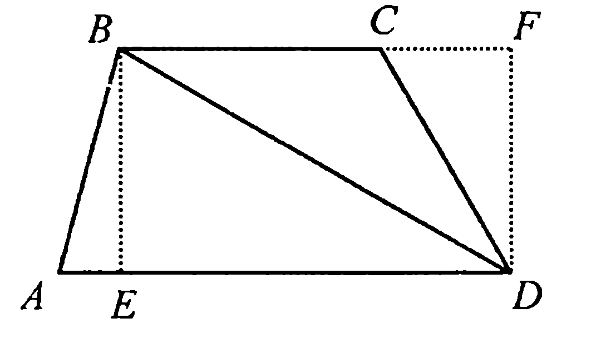

$S_{\triangle ABD} = \frac{1}{2} AD \cdot BE$, а

$S_{\triangle BCD} = \frac{1}{2} BC \cdot DF = \frac{1}{2} BC \cdot BE$

и, значит,

$S_{ABCD} = S_{\triangle ABD} + S_{\triangle BCD} =$

$= \frac{1}{2} (AD + BC) \cdot BE,$

что и требовалось доказать.

---
**стр. 226**
---

**Теорема 17.22.** *Если $d_1$ и $d_2$ диагонали произвольного четырехугольника (в том числе и невыпуклого), $\varphi$ — угол между диагоналями, $S$ — его площадь, то $S = \frac{1}{2}d_1 \cdot d_2 \sin\varphi$.*

**Доказательство.** Если соединить середины сторон произвольного четырехугольника, то получится параллелограмм, стороны которого соответственно параллельны диагоналям и равны их половинам (задача 13.1), площадь же полученного параллелограмма будет равна половине площади данного четырехугольника (задача 19.11).

Из параллельности сторон параллелограмма диагоналям данного четырехугольника следует, что угол между сторонами параллелограмма будет равен $\varphi$.

Таким образом, площадь параллелограмма, как сумма площадей двух составляющих его равных треугольников — это

$$S^* = 2 \cdot \frac{1}{2}\left(\frac{1}{2}d_1 \cdot \frac{1}{2}d_2\right) \cdot \sin\varphi = \frac{1}{4}d_1 \cdot d_2 \cdot \sin\varphi,$$

и, значит, $S = 2 \cdot S^* = \frac{1}{2}d_1 \cdot d_2 \cdot \sin\varphi$.

**Теорема 17.23.** *Если $a, b, c, d$ — стороны выпуклого четырехугольника $ABCD$, $\angle ABC = \varphi$, $\angle CDA = \psi$, $p$ — его полупериметр, то площадь четырехугольника*

$$S = \sqrt{(p - a)(p - b)(p - c)(p - d) - abcd \cdot \cos^2 \frac{\varphi + \psi}{2}}.$$

**Доказательство.** Пусть в четырехугольнике $ABCD$ сторона $AB = a, BC = b, CD = c, DA = d$ (рис. 17.5).

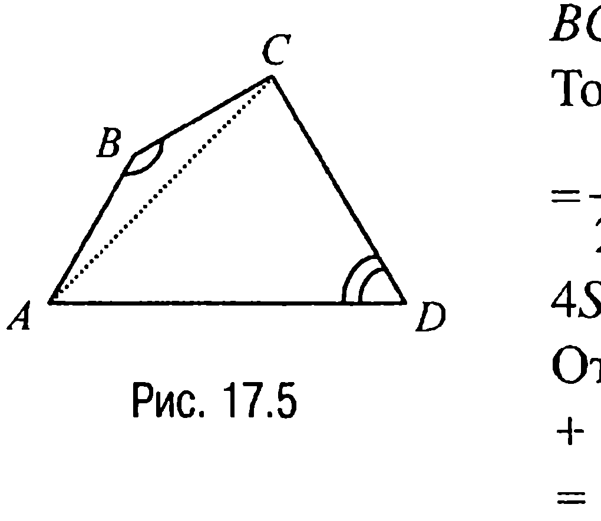

Тогда $S = S_{\triangle ABC} + S_{\triangle CDA} =$

$= \frac{1}{2}(a \cdot b \cdot \sin\varphi + c \cdot d \cdot \sin\psi)$ или

$4S = 2a \cdot b \cdot \sin\varphi + 2c \cdot d \cdot \sin\psi$.

Отсюда $16S^2 = 4a^2 \cdot b^2 \cdot \sin^2\varphi +$

$+ 8a \cdot b \cdot c \cdot d \cdot \sin\varphi \cdot \sin\psi + 4c^2 \cdot d^2 \cdot \sin^2\psi =$

$= 4a^2 \cdot b^2 - 4a^2 \cdot b^2 \cdot \cos^2\varphi +$

$+ 8a \cdot b \cdot c \cdot d \cdot \sin\varphi \cdot \sin\psi + 4c^2 \cdot d^2 - 4c^2 \cdot d^2 \cos^2\psi$.

---
**стр. 227**
---

Далее, по теореме косинусов $AC^2 = a^2 + b^2 - 2a \cdot b \cdot \cos\varphi$, а с другой стороны, $AC^2 = c^2 + d^2 - 2c \cdot d \cdot \cos\psi$ и, таким образом,

$a^2 + b^2 - 2a \cdot b \cdot \cos\varphi = c^2 + d^2 - 2c \cdot d \cdot \cos\psi$, откуда следует, что

$(a^2 + b^2 - c^2 - d^2)^2 = 4a^2 \cdot b^2 \cdot \cos^2\varphi - 8a \cdot b \cdot c \cdot d \cdot \cos\varphi \cdot \cos\psi +$

$+ 4c^2 \cdot d^2 \cdot \cos^2\psi$. Но в таком случае

$16S^2 = 4a^2 \cdot b^2 + 4c^2 \cdot d^2 + 8a \cdot b \cdot c \cdot d \cdot \sin\varphi \cdot \sin\psi - (a^2 + b^2 - c^2 -$

$d^2)^2 - 8a \cdot b \cdot c \cdot d \cdot \cos\varphi \cdot \cos\psi = 4(a \cdot b + c \cdot d)^2 - (a^2 + b^2 - c^2 - d^2)^2 -$

$- 8a \cdot b \cdot c \cdot d \cdot (1 + \cos\varphi \cdot \cos\psi - \sin\varphi \cdot \sin\psi) = 4(a \cdot b + c \cdot d)^2 - (a^2 +$

$+ b^2 - c^2 - d^2)^2 - 8a \cdot b \cdot c \cdot d \cdot (1 + \cos(\varphi + \psi)) = 4(a \cdot b + c \cdot d)^2 - (a^2 +$

$+ b^2 - c^2 - d^2)^2 - 16a \cdot b \cdot c \cdot d \cdot \cos^2 \frac{\varphi + \psi}{2}$.<!-- вероятная опечатка оригинала: в одной из промежуточных строк знаменатель может быть напечатан как «−2» вместо «2» -->

Замечая теперь, что

$16(p - a) \cdot (p - b) \cdot (p - c) \cdot (p - d) = 4(a \cdot b + c \cdot d)^2 - (a^2 + b^2 - c^2 - d^2)^2$

(что проверяется непосредственно), имеем

$16S^2 = 16(p - a) \cdot (p - b) \cdot (p - c) \cdot (p - d) - 16a \cdot b \cdot c \cdot d \cdot \cos^2 \frac{\varphi + \psi}{2},$

откуда и следует требуемое.

**Теорема 17.24 (Формула Птолемея).** *Если $a, b, c, d$ — стороны вписанного четырехугольника, $p$ — его полупериметр, то площадь четырехугольника*

$$S = \sqrt{(p - a) \cdot (p - b) \cdot (p - c) \cdot (p - d)}.$$

**Доказательство.** Так как четырехугольник вписанный, то сумма его противолежащих углов равна $180^\circ$, а поскольку $\cos 90^\circ = 0$, то ссылка на теорему 17.23 и доказывает требуемое.

**Теорема 17.25.** *Если четырехугольник является вписанным и описанным одновременно, $a, b, c, d$ — его стороны, то площадь четырехугольника $S = \sqrt{a \cdot b \cdot c \cdot d}$.*

**Доказательство.** Если $a$ и $c$, а также $b$ и $d$ — противолежащие стороны четырехугольника, то поскольку четырехугольник является описанным, справедливо равенство: $a + c = b + d$.

---
**стр. 228**
---

Но в таком случае полупериметр $p = a + c = b + d$ и, следовательно, $p - a = c$, $p - b = d$, $p - c = a$, $p - d = b$ и формула из теоремы 17.24 принимает вид $S = \sqrt{a \cdot b \cdot c \cdot d}$.

**Теорема 17.26.** *Если $a, b, c, d$ — стороны описанного четырехугольника, $2\omega$ — сумма двух противолежащих углов, то площадь четырехугольника $S = \sqrt{a \cdot b \cdot c \cdot d} \cdot \sin \omega$.*

**Доказательство.** Пусть $\phi$ — угол между смежными сторонами $a$ и $b$, $\psi$ — угол между смежными сторонами $c$ и $d$, $\phi + \psi = 2\omega$.
Тогда по теореме косинусов находим (как и при доказательстве теоремы 17.23), что
$a^2 + b^2 - 2a \cdot b \cdot \cos \phi = c^2 + d^2 - 2c \cdot d \cdot \cos \psi$,
откуда следует, что
$(a - b)^2 + 2a \cdot b - 2a \cdot b \cdot \cos \phi = (c - d)^2 + 2c \cdot d - 2c \cdot d \cdot \cos \psi$.
По условию четырехугольник является описанным, поэтому $a - b = c - d$ и, значит, $a \cdot b - c \cdot d = a \cdot b \cdot \cos \phi - c \cdot d \cdot \cos \psi$.
С другой стороны,
$2S = a \cdot b \cdot \sin \phi + c \cdot d \cdot \sin \psi$ (см. доказательство теоремы 17.23).
Отсюда если возвести в квадрат левые и правые части последних двух равенств, а затем полученные равенства сложить, то
$4S^2 + (a \cdot b - c \cdot d)^2 = (a \cdot b \cdot \cos \phi - c \cdot d \cdot \cos \psi)^2 +$
$+ (a \cdot b \cdot \sin \phi + c \cdot d \cdot \sin \psi)^2$ или
$2S^2 = a \cdot b \cdot c \cdot d \cdot (1 - \cos(\phi + \psi)) = 2a \cdot b \cdot c \cdot d \cdot \sin^2 \omega$,
откуда и следует, что $S = \sqrt{a \cdot b \cdot c \cdot d} \cdot \sin \omega$.

**Теорема 17.27.** *Если $n$-угольник, периметр которого равен $2p$, описан около окружности радиуса $r$, то его площадь $S = p \cdot r$.*

**Доказательство.** Пусть $A_1, A_2, A_3, \dots, A_n$ — вершины $n$-угольника, описанного около окружности радиуса $r$ с центром в точке $O$, а $B_1, B_2, B_3, \dots, B_n$ — основания перпендикуляров, опущенных из точки $O$ на стороны $A_1A_2, A_2A_3, \dots, A_nA_1$ соответственно.
Тогда если соединить отрезками все вершины $n$-угольника с точкой $O$, то получим $n$ треугольников, основаниями которых будут

---
**стр. 229**
---

стороны $n$-угольника, а их высотами будут отрезки $OB_1, OB_2,$
$OB_3, \dots, OB_n,$ каждый из которых равен радиусу $r$ вписанной окружности. Поэтому

$$S = \frac{1}{2} A_1 A_2 \cdot OB_1 + \frac{1}{2} A_2 A_3 \cdot OB_2 + \dots + \frac{1}{2} A_n A_1 \cdot OB_n =$$
$$= \frac{A_1 A_2 + A_2 A_3 + \dots + A_n A_1}{2} \cdot r = p \cdot r, \text{ что и требовалось доказать.}$$

**ЗАДАЧИ**

▼ **17.1.** *Найти площадь треугольника $ABC$, если известны его высоты $h_a, h_b$ и $h_c$.*

**Решение.** Так как $a = 2\frac{S}{h_a}$, $b = 2\frac{S}{h_b}$, $c = 2\frac{S}{h_c}$, то по формуле Герона имеем

$$S = \sqrt{p(p-a)(p-b)(p-c)} =$$
$$= \frac{1}{4} \sqrt{(a+b+c)(a+b-c)(b+c-a)(a+c-b)} =$$
$$= S^2 \sqrt{\left(\frac{1}{h_a} + \frac{1}{h_b} + \frac{1}{h_c}\right)\left(\frac{1}{h_a} + \frac{1}{h_b} - \frac{1}{h_c}\right)\left(\frac{1}{h_b} + \frac{1}{h_c} - \frac{1}{h_a}\right)\left(\frac{1}{h_a} + \frac{1}{h_c} - \frac{1}{h_b}\right)}.$$

**Ответ:** $S = \frac{1}{\sqrt{\left(\frac{1}{h_a} + \frac{1}{h_b} + \frac{1}{h_c}\right)\left(\frac{1}{h_a} + \frac{1}{h_b} - \frac{1}{h_c}\right)\left(\frac{1}{h_b} + \frac{1}{h_c} - \frac{1}{h_a}\right)\left(\frac{1}{h_a} + \frac{1}{h_c} - \frac{1}{h_b}\right)}}.$

▼ **17.2.** *Найти площадь треугольника $ABC$, если известны его медианы $m_a, m_b$ и $m_c$.*

**Решение.** Пусть медианы треугольника $ABC$ пересекаются в точке $O$ (рис. 17.6). Достроим треугольник $AOC$ до параллелограмма $AOCD$.

---
**стр. 230**
---

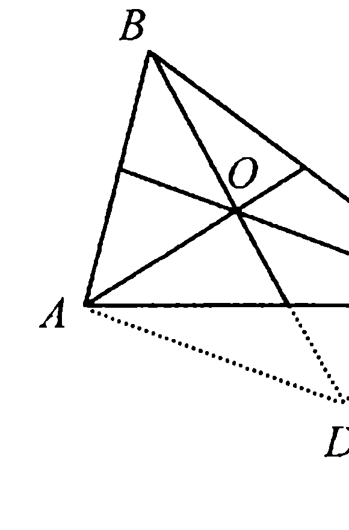

В результате площади треугольников $AOC$ и $DOC$ окажутся равными, а поскольку в треугольнике $DOC$ все три стороны известны —
$$DC = AO = \frac{2}{3}m_a, \quad DO = BO = \frac{2}{3}m_b,$$
$$OC = \frac{2}{3}m_c,$$
то по формуле Герона
$$S_{\triangle DOC} = \frac{1}{9}\sqrt{(m_a + m_b + m_c)(m_a + m_c - m_b)(m_b + m_c - m_a)(m_a + m_b - m_c)}$$
и, значит, $S_{\triangle ABC} = 3S_{\triangle DOC} =$
$$= \frac{1}{3}\sqrt{(m_a + m_b + m_c)(m_a + m_b - m_c)(m_a + m_c - m_b)(m_b + m_c - m_a)}.$$

**Ответ:** $S = \frac{1}{3}\sqrt{(m_a + m_b + m_c)(m_a + m_b - m_c)(m_a + m_c - m_b)(m_b + m_c - m_a)}.$

▼ **17.3.** *Найти площадь остроугольного треугольника $ABC$, если радиус описанной окружности равен $R$, а периметр треугольника $A_1B_1C_1$, где $A_1, B_1, C_1$ — основания высот треугольника $ABC$, равен $P$.*

**Решение.** Пусть $AB = c$, $BC = a$, $AC = b$, $\angle CAB = \alpha$, $\angle ABC = \beta$,

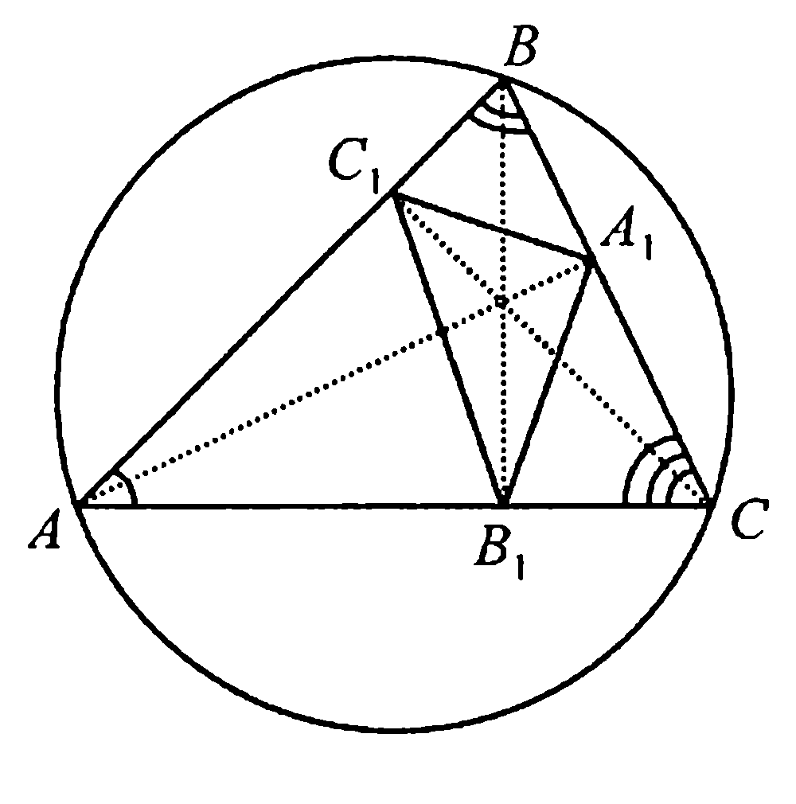

$\angle BCA = \gamma$ (рис. 17.7). По свойству 7.4 треугольники $ABC$ и $C_1BA_1$ подобны с коэффициентом подобия $k = \cos \beta$. Поэтому $C_1A_1 = b \cdot \cos \beta$.
Аналогично находим, что $A_1B_1 = c \cdot \cos \gamma$, а $C_1B_1 = a \cdot \cos \alpha$.
Таким образом, $P = a \cdot \cos \alpha + b \cdot \cos \beta + c \cdot \cos \gamma$,
а так как по расширенной теореме синусов $a = 2R \cdot \sin \alpha$, $b = 2R \cdot \sin \beta$,
$c = 2R \cdot \sin \gamma$, то для $P$ имеет место и такое представление: $P = R \cdot (\sin 2\alpha + \sin 2\beta + \sin 2\gamma)$.
Но в таком случае, поскольку одной из формул для вычисления

---
**стр. 231**
---

площади является формула $S = \frac{1}{2} R^2 \cdot (\sin 2\alpha + \sin 2\beta + \sin 2\gamma)$ (теорема 17.7), окончательно получаем, что $S = \frac{1}{2} R \cdot P$.

**Ответ:** $S = \frac{1}{2} R \cdot P$.

**17.4.** Хорда $AC$ окружности с центром $O$ и радиусом $R$ параллельна диаметру $DE$, на котором отмечена точка $B$ таким образом, что $\angle CAB = \alpha$, а $\angle ABC = 90^\circ$. Найти площадь $S$ треугольника $ABC$.

**Решение.** Обозначим $AC = a$ и пусть $BH = h$ — высота треугольника $ABC$ (рис. 17.8).

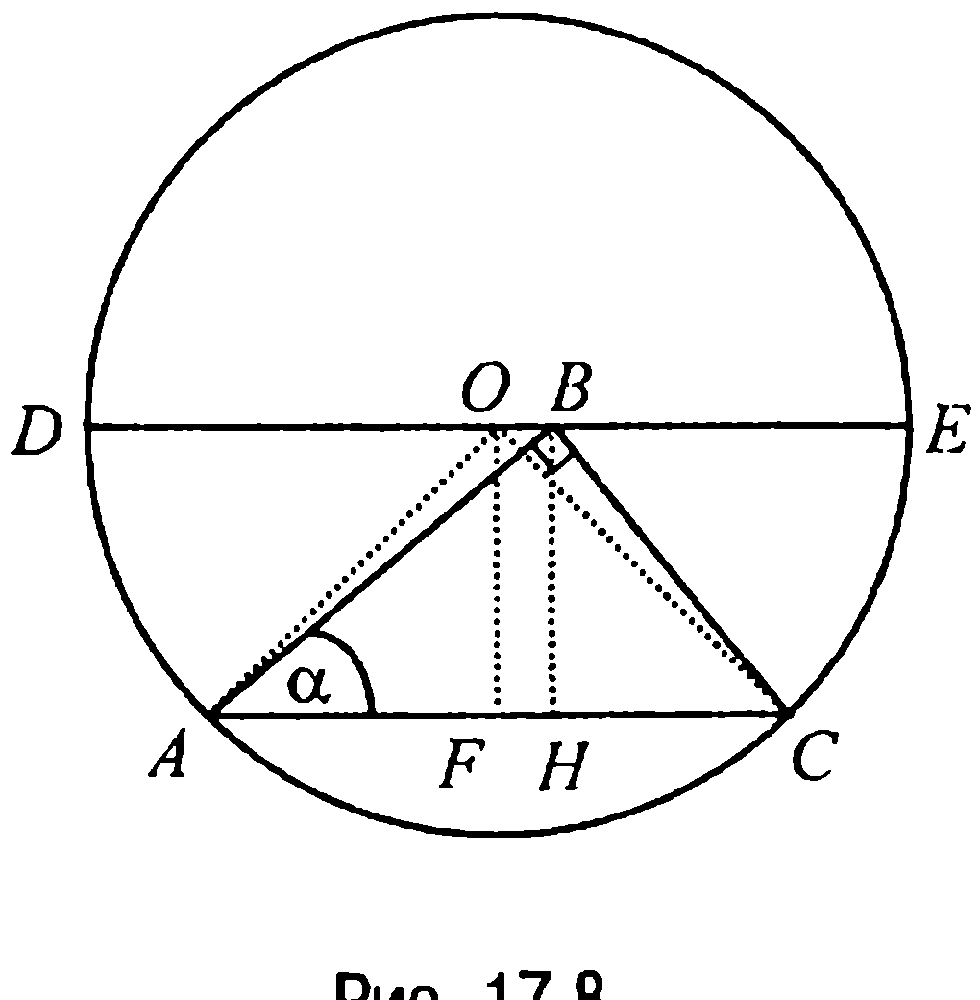

Тогда из этого треугольника находим, что $AB = a \cdot \cos \alpha$,

$h = AB \cdot \sin \alpha = a \cdot \sin \alpha \cdot \cos \alpha = \frac{a}{2} \sin 2\alpha$.

Рассмотрим теперь равнобедренный треугольник $AOC$ с боковыми сторонами, равными $R$. В этом треугольнике высота $OF$ равна $h$ (свойство 1.15) и тогда по теореме Пифагора $h^2 = R^2 - \frac{a^2}{4}$. Отсюда приходим к равенству $R^2 - \frac{a^2}{4} = \frac{a^2}{4} \sin^2 2\alpha$, следовательно, $4R^2 - a^2 = a^2 \cdot \sin^2 2\alpha$

или $a = \frac{2R}{\sqrt{1 + \sin^2 2\alpha}}$.

Таким образом, $h = \frac{R \sin 2\alpha}{\sqrt{1 + \sin^2 2\alpha}}$ и, значит,

$$S = \frac{1}{2} a \cdot h = \frac{2R}{2\sqrt{1 + \sin^2 2\alpha}} \cdot \frac{R \sin 2\alpha}{\sqrt{1 + \sin^2 2\alpha}} = \frac{R^2 \sin 2\alpha}{1 + \sin^2 2\alpha} .$$

**Ответ:** $S = \frac{R^2 \sin 2\alpha}{1 + \sin^2 2\alpha}$.

---
**стр. 232**
---

**17.5.** Две окружности радиусов $r_1$ и $r_2$ расположены так, что их внутренние касательные взаимно перпендикулярны. Найти площадь треугольника, образованного этими внутренними касательными и одной из внешних касательных.

**Решение.** Рассмотрим рис. 17.9. Из этого рисунка следует, что две заданные окружности являются вневписанными для искомого треугольника $A_1A_2A_3$. Поэтому

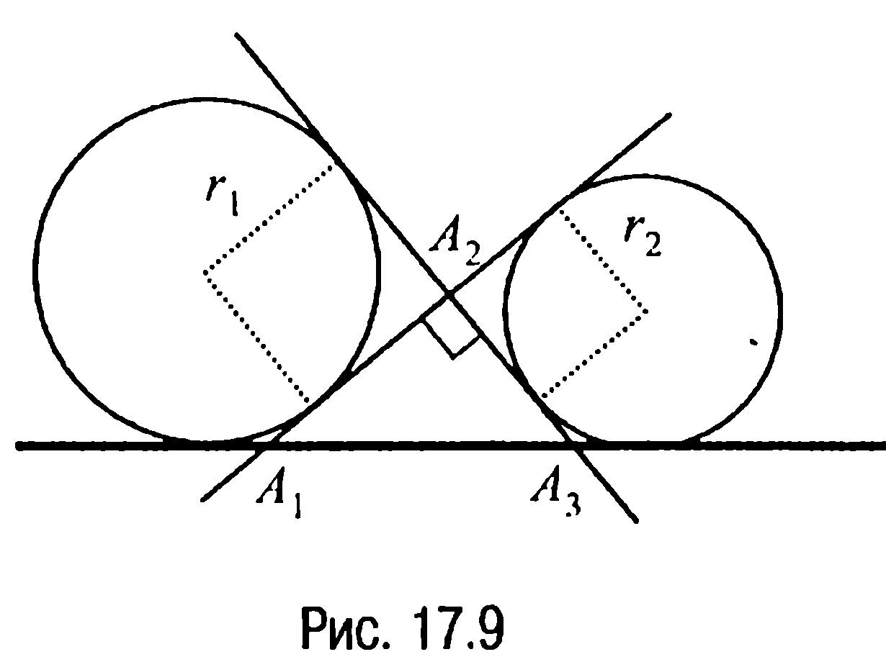

$$S_{\Delta A_1A_2A_3} = r_1 \cdot r_2 \cdot \text{tg}\left(\frac{1}{2} \cdot \frac{\pi}{2}\right) = r_1 \cdot r_2 .$$

**Ответ:** $r_1 \cdot r_2$.

▼ **17.6.** Найти площадь прямоугольного треугольника, если известны радиус $r$ вписанной в него окружности и радиус $R$ описанной около него окружности.

**Решение.** Пусть $x$ и $y$ — катеты прямоугольного треугольника. Тогда в соответствии со свойством 1.22, теоремой Пифагора и свойством 1.23 имеем систему уравнений

$$\begin{cases} x^2 + y^2 = 4R^2, \\ x + y = 2R + 2r. \end{cases}$$

С учетом этой системы имеем $S = \frac{1}{2} x \cdot y = \frac{1}{4} ((x + y)^2 - (x^2 + y^2)) = r^2 + 2R \cdot r$.

**Ответ:** $r^2 + 2R \cdot r$.

**17.7.** В параллелограмме со смежными сторонами $a$ и $b$ ($a > b$) и острым углом $\alpha$ проведены биссектрисы всех углов. Найти площадь четырехугольника, вершинами которого являются точки пересечения биссектрис.

**Решение.** Рассмотрим параллелограмм $ABCD$ (рис. 17.10), где $AD = a$, $AB = b$, $\angle DAB = \angle BCD = \alpha$. Пусть точки $E, F, K, L$ — точки пересечения биссектрис внутренних углов параллелограмма.

---
**стр. 233**
---

Тогда так как четырехугольник $EFKL$ является прямоугольником (задача 13.8), то решение задачи сводится к нахождению отрезков $EL$ и $EF$. Но, как легко видеть, $EL = BL - BE =$

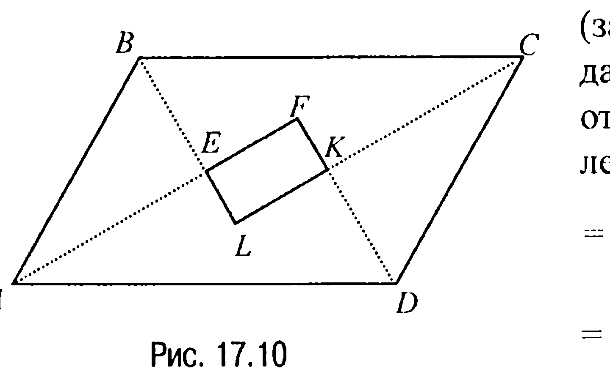

$= a \cdot \sin \frac{\alpha}{2} - b \cdot \sin \frac{\alpha}{2} = (a - b) \cdot \sin \frac{\alpha}{2},$

$EF = AF - AE = a \cdot \cos \frac{\alpha}{2} - b \cdot \cos \frac{\alpha}{2} = (a - b) \cdot \cos \frac{\alpha}{2}$ и, значит,

$S_{EFKL} = EL \cdot EF = (a - b)^2 \cdot \sin \frac{\alpha}{2} \cdot \cos \frac{\alpha}{2} = \frac{1}{2}(a - b)^2 \cdot \sin \alpha$.

**Ответ:** $\frac{1}{2}(a - b)^2 \cdot \sin \alpha$.

**17.8.** Найти площадь ромба $ABCD$, если радиусы окружностей, описанных около треугольников $ABC$ и $ABD$, равны соответственно $R$ и $r$.

**Решение.** Пусть в ромбе $ABCD$ (рис. 17.11) сторона $AB = z$, а $\angle BAD = 2\alpha$. Тогда $\angle ABC = 180^\circ - 2\alpha$, а $\angle ABD = 90^\circ - \alpha$. Отсюда по расширенной теореме синусов из треугольников $ABC$ и $ABD$ соответственно находим, что $\frac{z}{2 \sin \alpha} =$

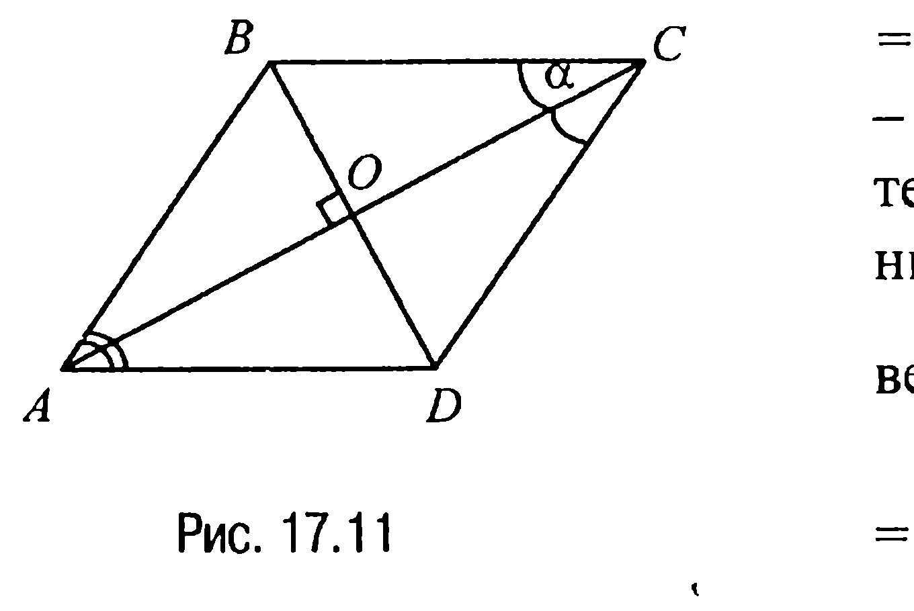

$= R$, а $\frac{z}{2 \cos \alpha} = r$ и, значит,

$\text{tg} \alpha = \frac{r}{R}$, $\frac{z^2}{2 \sin 2\alpha} = r \cdot R$. Обозначая теперь через $O$ точку пересечения диагоналей ромба и замечая, что $S_{ABCD} = 2AO \cdot OB =$

$= 2z \cdot \cos \alpha \cdot z \cdot \sin \alpha = z^2 \cdot \sin 2\alpha = z^2 \cdot \frac{z^2}{2rR} = \frac{z^4}{2rR}$, а $z^4 = 4r^2 \cdot R^2 \cdot \sin^2 2\alpha$,

имеем $S_{ABCD} = 2r \cdot R \cdot \sin^2 2\alpha = 8r \cdot R \cdot \sin^2 \alpha \cdot \cos^2 \alpha =$

---
**стр. 234**
---

$=8rR\left(\sin\left(\text{arctg}\frac{r}{R}\right)\right)^2\left(\cos\left(\text{arctg}\frac{r}{R}\right)\right)^2=8rR\left(\frac{r/R}{\sqrt{1+(r/R)^2}}\right)^2\left(\frac{1}{\sqrt{1+(r/R)^2}}\right)^2=$

$= 8r \cdot R \frac{r^2}{r^2 + R^2} \frac{R^2}{r^2 + R^2} = \frac{8r^3 R^3}{(r^2 + R^2)^2} .$

**Ответ:** $\frac{8r^3 R^3}{(r^2 + R^2)^2} .$

**17.9.** В ромбе $ABCD$ с диагоналями $AC = d_1$ и $BD = d_2$ из вершины $C$ тупого угла проведены высоты $CE$ и $CF$. Найти площадь четырехугольника $AECF$.

**Решение.** Поскольку сторона ромба $ABCD$ (рис. 17.12) $a = \frac{1}{2} \sqrt{d_1^2 + d_2^2}$, а его площадь $S = a \cdot CE = a \cdot CF = \frac{1}{2} d_1 \cdot d_2$, то $CE = CF = \frac{1}{2} \cdot \frac{d_1 \cdot d_2}{a} = \frac{d_1 \cdot d_2}{\sqrt{d_1^2 + d_2^2}} .$

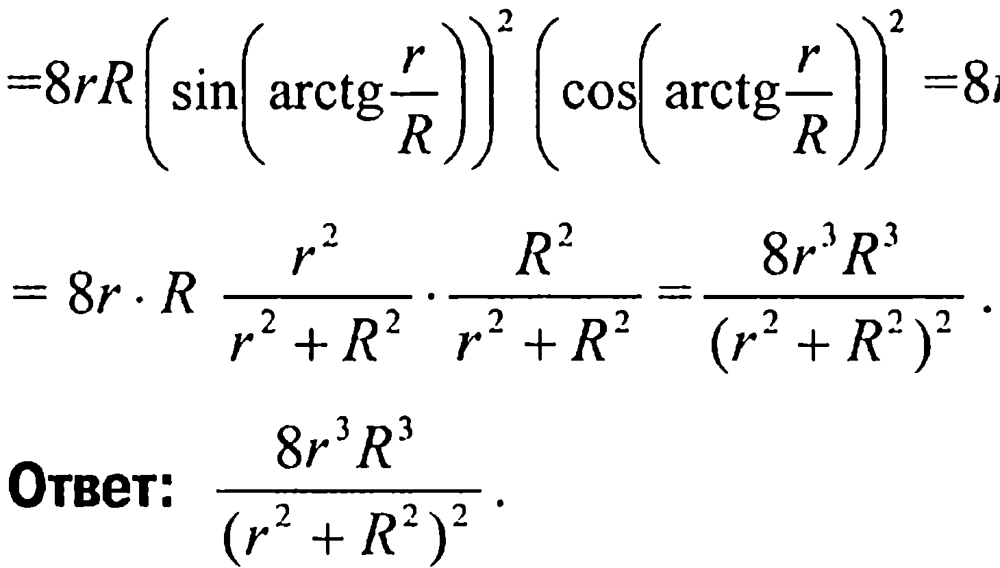

Замечая теперь, что прямоугольные треугольники $CFA$ и $CEA$ равны (у них общая сторона $CA$ и равные катеты $CE$ и $CF$), приходим к выводу, что площадь четырехугольника $AECF$ — это

$$S = 2S_{\Delta CEA} = 2 \cdot \frac{1}{2} \cdot CE \cdot EA = CE \cdot EA.$$

Но $EA = \sqrt{CA^2 - CE^2} = \sqrt{d_1^2 - \frac{d_1^2 \cdot d_2^2}{d_1^2 + d_2^2}} = \frac{d_1^2}{\sqrt{d_1^2 + d_2^2}}$ и поэтому

$$S = CE \cdot EA = \frac{d_1 \cdot d_2}{\sqrt{d_1^2 + d_2^2}} \cdot \frac{d_1^2}{\sqrt{d_1^2 + d_2^2}} = \frac{d_1^3 \cdot d_2}{d_1^2 + d_2^2} .$$

**Ответ:** $\frac{d_1^3 \cdot d_2}{d_1^2 + d_2^2} .$

---
**стр. 235**
---

**17.10.** Диагонали и высоты трапеции разбивают ее на семь треугольников и пятиугольник. Найти площадь пятиугольника, если площади треугольников, прилегающих к боковым сторонам и меньшему основанию, равны соответственно $S_1$, $S_2$ и $S_3$.

**Решение.** Пусть $BM = CN = h$ — высота трапеции $ABCD$, $S$ — площадь пятиугольника $MEFQN$, $S_1, x, S_3, y, S_2$ — площади треугольников $ABE, BFE, BCF, CQF, CDQ$ соответственно (рис. 17.13).

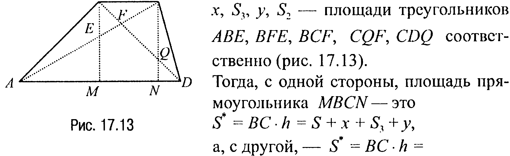

Тогда, с одной стороны, площадь прямоугольника $MBCN$ — это

$$S^* = BC \cdot h = S + x + S_3 + y,$$

а, с другой, — $S^* = BC \cdot h = \frac{1}{2} BC \cdot h + \frac{1}{2} BC \cdot h = S_{\triangle ABC} + S_{\triangle DBC} = S_1 + x + S_3 + S_2 + y + S_3$.

Отсюда следует, что $S + x + S_3 + y = S_1 + x + S_3 + S_2 + y + S_3$ или $S = S_1 + S_2 + S_3$.

**Ответ:** $S_1 + S_2 + S_3$.

**ЗАДАЧИ ДЛЯ САМОСТОЯТЕЛЬНОГО РЕШЕНИЯ**

**17.1С.** *Найти площадь треугольника по двум сторонам $a$ и $b$ и биссектрисе $l_c$ угла между ними.*

**17.2С.** *В треугольнике $ABC$ медианы $AD$ и $BE$ равны соответственно $m_a$ и $m_b$. Найти площадь треугольника $ABC$, если известно, что угол между заданными медианами равен $\alpha$.*

**17.3С.** *Найти площадь треугольника, если точка касания одной из его сторон с вписанной окружностью делит сторону на отрезки $m$ и $n$, а противолежащий этой стороне угол треугольника равен $60^\circ$.*
