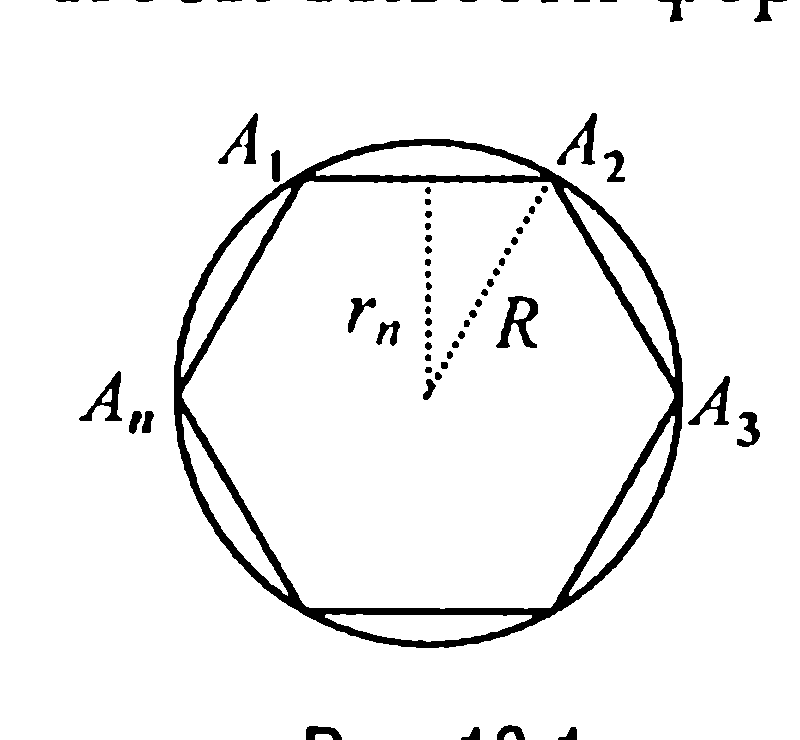
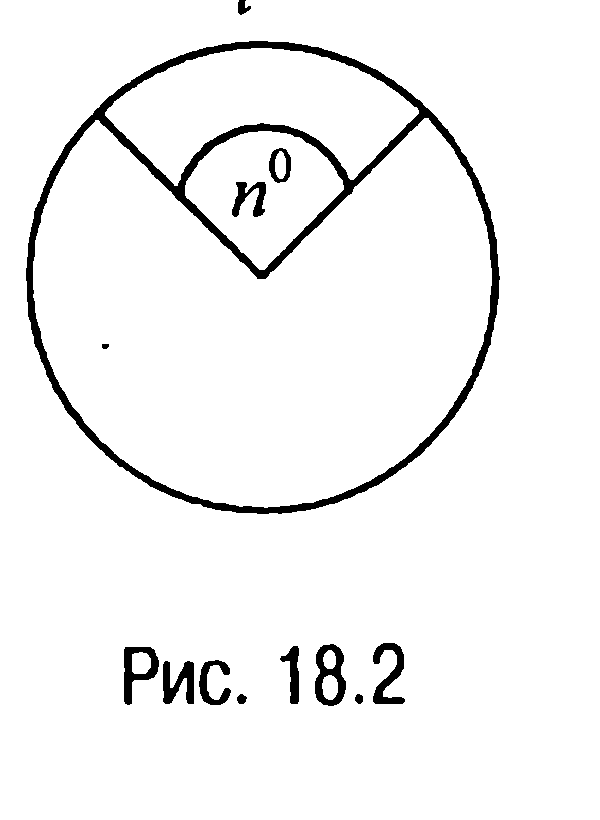
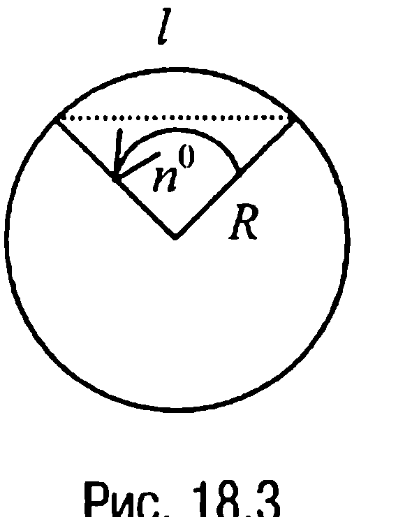
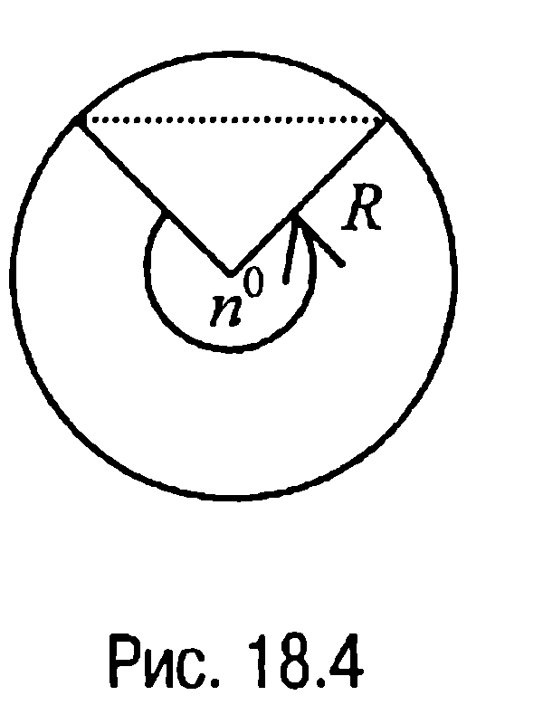
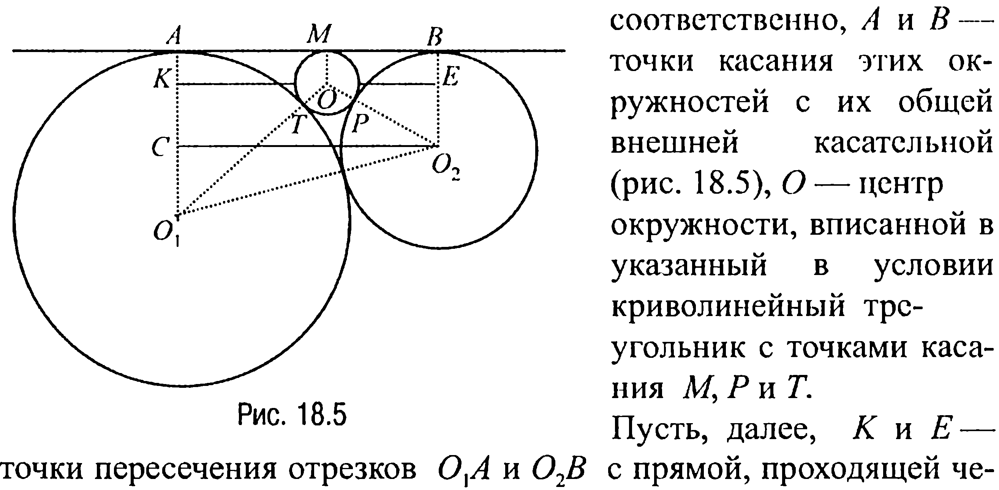
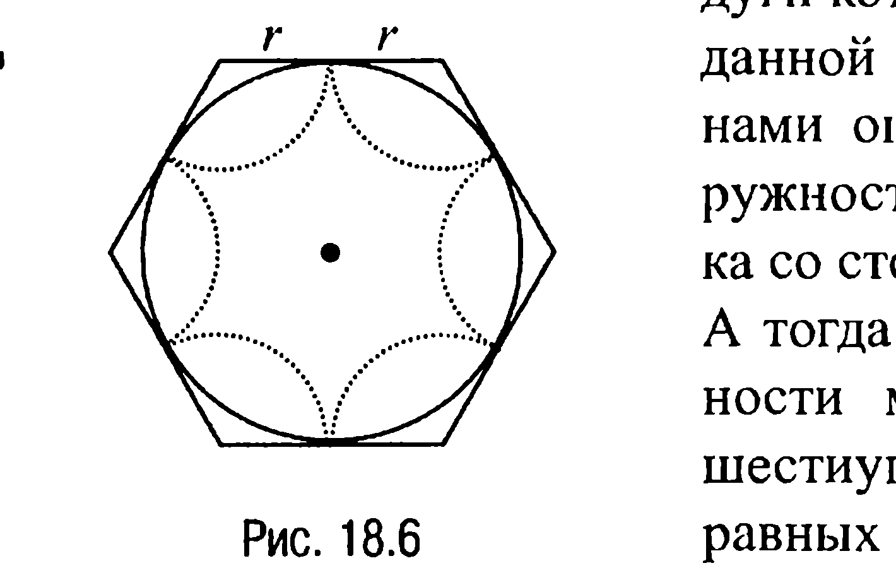
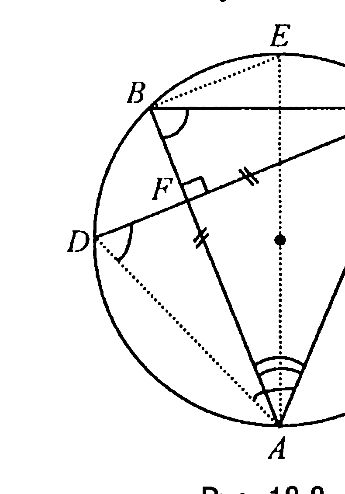

## 3.2. Площадь круга и его частей

---
**стр. 236**
---

▼ **17.4С.** *Найти площадь прямоугольного треугольника, если известны радиус $r$ вписанной в него окружности и радиус $\rho$ вневписанной окружности, касающейся гипотенузы и продолжений катетов.*

**17.5С.** *Найти площадь трапеции с основаниями $a$ и $b$ ($a > b$) и боковыми сторонами $c$ и $d$.*

**17.6С.** *В равнобочной трапеции диагонали взаимно перпендикулярны. Найти площадь трапеции, если средняя линия равна $a$.*

**17.7С.** *Периметр ромба равен $2p$, а диагонали его относятся как $m : n$. Найти площадь ромба.*

**17.8С.** *Найти площадь вписанного в окружность четырехугольника $ABCD$, если $BC = CD$, $AC = a$, $\angle CAD = \alpha$.*

**17.9С.** *Найти площадь трапеции, у которой основания равны $a$ и $b$ ($a > b$), а острые углы между большим основанием и боковыми сторонами равны $\alpha$ и $\beta$.*

**§ 18. ПЛОЩАДЬ КРУГА И ЕГО ЧАСТЕЙ**

**18.1. Длина окружности**

Пусть в окружность радиуса $R$ вписан некоторый правильный $n$-угольник. Тогда очевидно, что чем больше число $n$, тем ближе «прилегает» к заданной окружности вписанный $n$-угольник, при этом интуитивно понятно, что истинное значение длины окружности — это предел, к которому стремится периметр правильного вписанного в окружность $n$-угольника при неограниченном увеличении числа его сторон.

Чтобы выяснить, как вычисляется длина $c$ окружности через ее диаметр $D = 2R$, поступим следующим образом. Рассмотрим наряду с заданной окружностью окружность радиуса $R'$, длина которой равна $c'$. Пусть, далее, $a_n$, $a'_n$ и $P_n$, $P'_n$ — стороны и периметры правильных $n$-угольников, вписанных соответственно в окружно-

---
**стр. 237**
---

сти радиусов $R$ и $R'$. Тогда в соответствии со свойством 16.12 имеем: $P_n = n \cdot a_n = n \cdot 2R \cdot \sin \frac{180^\circ}{n}$, $P'_n = n \cdot a'_n = n \cdot 2R' \cdot \sin \frac{180^\circ}{n}$, откуда следует, что $\frac{P_n}{P'_n} = \frac{2R}{2R'}$. Если теперь число $n$ неограниченно увеличивать, то предел отношения $\frac{P_n}{P'_n}$ будет равен $\frac{c}{c'}$ и, значит, $\frac{c}{c'} = \frac{2R}{2R'}$, или $\frac{c}{2R} = \frac{c'}{2R'}$, т. е. **отношение длины окружности к ее диаметру** оказывается числом постоянным для всех окружностей. Это число обозначается греческой буквой $\pi$ (читается «пи»).

Можно доказать (на чем мы останавливаться не будем), что число $\pi$ является числом иррациональным и, таким образом, оно не может быть выражено точно никакой конечной десятичной дробью. Но его приближенные значения можно находить различными способами, причем с любой степенью точности.

, При решении задач обычно используется приближенное значение числа $\pi$ с недостатком, равное 3,14.

Из равенства же $\frac{c}{2R} = \pi$ и следует формула для вычисления длины окружности через ее диаметр (радиус): **$c = 2\pi R$.**

Выясним теперь, какая существует связь между градусной и радианной (см. § 1, с. 12) мерами угла.

Для этого воспользуемся тем, что длина дуги окружности в $1^\circ$ равна $\frac{2\pi R}{360} = \frac{\pi R}{180}$ и, следовательно, длина $l$ дуги окружности, содержащей $n^\circ$, выразится так: $l = \frac{\pi R n^\circ}{180^\circ}$.

Отсюда если $l = R$, то $1 = \frac{\pi n^\circ}{180^\circ}$ и, значит, $n^\circ = \frac{180^\circ}{\pi}$.

Таким образом, 1 радиан (см. § 1, с. 12) соответствует центральному углу, равному $\frac{180^\circ}{\pi}$.

---
**стр. 238**
---

В общем же случае угол в $\alpha$ радиан содержит $\frac{180^\circ \cdot \alpha}{\pi}$ градусов, а угол в $\alpha^\circ$ имеет $\frac{\pi \alpha}{180}$ радиан.

**18.2. Площадь круга, сектора и сегмента**

Чтобы вывести формулу для вычисления площади круга через радиус $R$ окружности, ограничивающей данный круг, впишем в эту окружность какой-нибудь правильный $n$-угольник $A_1A_2\dots A_n$ (рис. 18.1). Обозначим апофему этого $n$-угольника через $r_n$. Тогда поскольку апофема $r_n$ является радиусом вписанной в $n$-угольник $A_1A_2\dots A_n$ окружности (свойство 16.10), то по теореме 17.27 площадь $S_n$ этого $n$-угольника вычисляется по формуле $S_n = \frac{1}{2} P_n \cdot r_n$, где $P_n$ — периметр $n$-угольника $A_1A_2\dots A_n$.

Если теперь число сторон правильного $n$-угольника неограниченно увеличивать, то, очевидно, периметр $P_n$ $n$-угольника будет стремиться к пределу, которым является длина окружности $c$, а апофема $r_n$ будет стремиться к пределу, которым является радиус окружности $R$.

Таким образом, при неограниченном увеличении числа сторон правильного $n$-угольника его площадь $S_n$ будет стремиться к пределу, равному $\frac{1}{2} cR = \frac{1}{2} 2\pi R \cdot R = \pi R^2$. Следовательно, площадь $S$ круга радиуса $R$ вычисляется по формуле **$S = \pi R^2$**.

*Сектором* (круговым сектором) называется часть круга, ограниченная дугой окружности (дугой сектора) и двумя радиусами, соединяющими концы дуги с центром круга.

Из определения следует, что так как площадь круга равна $\pi R^2$, то

---
**стр. 239**
---

площадь сектора, ограниченного дугой в $1^\circ$, равна $\frac{\pi R^2}{360^\circ}$ и, значит, в общем случае площадь $S$ сектора вычисляется по формуле $S = \frac{\pi R^2}{360^\circ} \cdot n^\circ$, где $n^\circ$ — соответствующий дуге сектора центральный угол в градусах (рис. 18.2).

**Замечание 18.1.** Так как $\frac{\pi R^2}{360^\circ} \cdot n^\circ = \frac{\pi R n^\circ}{180^\circ} \cdot \frac{R}{2}$, где дробь $\frac{\pi R n^\circ}{180^\circ}$ выражает длину $l$ дуги сектора, то формулу для вычисления площади сектора можно переписать в виде $S = l \cdot \frac{R}{2}$ или в виде $S = \frac{1}{2} R^2 \cdot \alpha$, где $\alpha$ — соответствующий дуге сектора центральный угол в радианах.

**Сегментом** (круговым сегментом) называется часть круга, ограниченная дугой окружности (дугой сегмента) и хордой, соединяющей концы дуги.

Из определения следует, что если центральный угол $n^\circ$, соответствующий дуге сегмента, меньше $180^\circ$ (рис. 18.3), то площадь сегмента представляет собой разность между площадью сектора с дугой сегмента и площадью равнобедренного треугольника, боковыми сторонами которого являются радиусы окружности, а основанием — хорда, соединяющая концы дуги сегмента, т. е. площадь сегмента $S$ вычисляется по формуле $S = \frac{1}{2} R^2 \cdot \alpha - \frac{1}{2} R^2 \cdot \sin \alpha$, где $\alpha = \frac{\pi n^\circ}{180^\circ}$.

Если же $n^\circ > 180^\circ$ (рис. 18.4), то в этом случае площадь сегмента

$S = \pi \cdot R^2 - \frac{1}{2} R^2 \cdot \alpha + \frac{1}{2} R^2 \cdot \sin \alpha$.

---
**стр. 240**
---

**Замечание 18.2.** Если $n^\circ=180^\circ$, то площадь сектора совпадает с площадью сегмента и равна $\frac{1}{2}\pi \cdot R^2$.

**ЗАДАЧИ**

**18.1.** *Две окружности радиусов $R$ и $r$ касаются внешним образом. К этим окружностям проведена общая внешняя касательная и в образовавшийся при этом криволинейный треугольник вписан круг. Найти его площадь.*

**Решение.** Пусть $O_1$ и $O_2$ — центры окружностей радиусов $R$ и $r$ соответственно, $A$ и $B$ — точки касания этих окружностей с их общей внешней касательной (рис. 18.5), $O$ — центр окружности, вписанной в указанный в условии криволинейный треугольник с точками касания $M, P$ и $T$.

Пусть, далее, $K$ и $E$ — точки пересечения отрезков $O_1A$ и $O_2B$ с прямой, проходящей через точку $O$ параллельно прямой $AB$, точка $C$ — точка пересечения отрезка $O_1A$ с прямой, проходящей через точку $O_2$ параллельно прямой $AB$.

Тогда $O_1A = O_1T = R$, $O_2B = O_2P = r$, $O_1C = R - r$, $O_1O_2 = R + r$ и из прямоугольного треугольника $O_1CO_2$ находим, что

$$CO_2 = \sqrt{O_1O_2^2 - O_1C^2} = \sqrt{(R+r)^2 - (R-r)^2} = 2\sqrt{R \cdot r}$$

Обозначив $OM = OT = OP = x$, из прямоугольного треугольника $O_2OE$ находим $OE = \sqrt{O_2O^2 - O_2E^2} = \sqrt{(r+x)^2 - (r-x)^2} = 2\sqrt{r \cdot x}$.

Из прямоугольного же треугольника $O_1KO$ имеем

$$KO = \sqrt{O_1O^2 - O_1K^2} == \sqrt{(R+x)^2 - (R-x)^2} = 2\sqrt{R \cdot x}$$

---
**стр. 241**
---

Теперь поскольку $KO + OE = KE = CO_2$, то

$$2\sqrt{R \cdot r} = 2\sqrt{R \cdot x} + 2\sqrt{r \cdot x}$$

и, значит, $x = \frac{Rr}{(\sqrt{R} + \sqrt{r})^2}$.

Отсюда искомая площадь круга $S = \pi \cdot x^2 = \frac{\pi R^2 r^2}{(\sqrt{R} + \sqrt{r})^4}$.

**Ответ:** $\frac{\pi R^2 r^2}{(\sqrt{R} + \sqrt{r})^4}$.

**18.2.** *Окружность радиуса $R$ разделена на шесть равных дуг, и внутри круга, образованного этой окружностью, через каждые две соседние точки деления проведены равные дуги такого радиуса $r$, что на данной окружности они взаимно касаются. Найти площадь внутренней части данного круга, заключенной между проведенными дугами.*

**Решение.** Из условия задачи следует, что центры окружностей, дуги которых касаются в шести точках данной окружности, являются вершинами описанного около исходной окружности правильного шестиугольника со стороной $a = 2r$ (рис. 18.6).

А тогда искомая площадь $S$ равна разности между площадью описанного шестиугольника и площадью шести равных секторов (на рис. 18.6 это площадь заштрихованной фигуры).

Замечая же, что каждый внутренний угол правильного шестиугольника $\varphi = \frac{\pi(6 - 2)}{6} = \frac{2\pi}{3}$ (свойство 16.6), сторона правильного шестиугольника $a = 2r = 2R \cdot \text{tg} \frac{\pi}{6}$ (свойство 16.13), откуда $r = \frac{R\sqrt{3}}{3}$, и, значит, площадь каждого из указанных выше секторов $S^* = \frac{1}{2} r^2 \cdot \frac{2\pi}{3} = \frac{\pi R^2}{9}$, а площадь правильного шестиугольника

---
**стр. 242**
---

$S_0 = \frac{6 \cdot a \cdot R}{2} = 2\sqrt{3} R^2$, приходим к выводу, что $S = S_0 - 6S^* =$

$$= R^2 \cdot \left(2\sqrt{3} - \frac{2\pi}{3}\right) = \frac{2}{3} R^2 \cdot (3\sqrt{3} - \pi)$$

**Ответ:** $\frac{2(3\sqrt{3} - \pi)}{3} \cdot R^2$.

**18.3.** *Найти площадь сегмента, если длина его границы равна $l$, а дуга содержит $120^\circ$.*

**Решение.** Пусть $R$ — радиус дуги $AB$ окружности сегмента, точка $O$ — центр окружности (рис. 18.7).

Тогда поскольку $OA = OB = R$, $\angle BOA = 120^\circ$, то по теореме косинусов из треугольника $BOA$ находим, что $AB^2 = 2R^2 - 2R^2 \cdot \cos 120^\circ = 3R^2$, откуда $AB = R\sqrt{3}$. Далее, так как

$$\cup AB = \frac{2\pi R \cdot n}{360} = \frac{\pi R \cdot 120}{180} = \frac{2\pi R}{3}$$

и, значит,

$$l = AB + \cup AB = \left(\sqrt{3} + \frac{2\pi}{3}\right) \cdot R, \text{ то } R = \frac{3l}{3\sqrt{3} + 2\pi}$$

Но в таком случае, замечая, что площадь сектора $BOA$ — это

$$S = \frac{1}{2} R^2 \cdot \frac{2\pi}{3} = \frac{\pi R^2}{3},$$

а площадь треугольника $BOA$ вычисляется по формуле $S_{\Delta BOA} = \frac{1}{2} R^2 \cdot \sin 120^\circ = \frac{\sqrt{3} \cdot R^2}{4}$, по определению площадь сегмента $S^* = S - S_{\Delta BOA} = \frac{\pi R^2}{3} - \frac{\sqrt{3} \cdot R^2}{4} = \frac{4\pi - 3\sqrt{3}}{12} R^2 =$

<!-- вероятная опечатка оригинала: строка начинается со знака «+» вместо «=» -->

$$+ \frac{3(4\pi - 3\sqrt{3})l^2}{4(2\pi + 3\sqrt{3})}$$

<!-- вероятная опечатка оригинала: в знаменателе, по подстановке $R = 3l/(3\sqrt{3}+2\pi)$, ожидается $(2\pi + 3\sqrt{3})^2$ -->

**Ответ:** $\frac{3(4\pi - 3\sqrt{3})l^2}{4(2\pi + 3\sqrt{3})}$.

---
**стр. 243**
---

**18.4.** В круге проведены две пересекающиеся под прямым углом хорды $AB$ и $CD$. Известно, что $AB = AC = CD$. Установить, что больше: площадь круга или площадь квадрата со стороной $AB$?

**Решение.** Пусть $AE$ — диаметр круга, $F$ — точка пересечения проведенных хорд (рис. 18.8), $\angle ABC = \beta$, $\angle DCA = \gamma$.

Тогда поскольку вписанные углы $ABC$ и $ADC$ опираются на одну и ту же дугу, то $\angle ADC = \angle ABC = \beta$. А так как треугольники $ABC$ и $ACD$ являются равнобедренными, то углы $ACB$ и $CAD$ также равны $\beta$. Но в таком случае $\angle CAB = \angle DCA = \gamma = 180^\circ - 2\beta$.

Из прямоугольного же треугольника $AFC$ следует, что $2\gamma = 90^\circ$ и, значит, $\gamma = 45^\circ$. Рассмотрим треугольник $ABE$ ($\angle ABE = 90^\circ$). В этом треугольнике $AB = AE \cdot \cos \frac{\gamma}{2}$ и, таким образом, площадь квадрата со стороной $AB$ — это

$$S = AB^2 = AE^2 \cdot \cos^2 \frac{\gamma}{2} = \frac{1}{2} AE^2 \cdot (1 + \cos\gamma) = \frac{1}{2} AE^2 \cdot \left( 1 + \frac{\sqrt{2}}{2} \right).$$

Площадь же круга $S^* = \pi \cdot \frac{AE^2}{4}$. А поскольку $\pi < 2 + \sqrt{2}$ ($\pi < 3,15$; $2 + \sqrt{2} > 3,4$), то приходим к выводу, что $S^* < S$.

**Ответ:** площадь квадрата.

**ЗАДАЧИ ДЛЯ САМОСТОЯТЕЛЬНОГО РЕШЕНИЯ**

**18.1С.** На диаметре $2R$ полуокружности радиуса $R$ построен равносторонний треугольник, сторона которого равна диаметру. Треугольник расположен по ту же сторону от диаметра, что и полуокружность. Найти площадь той
