## 3.3. Отношение площадей

---
**стр. 244**
---

части треугольника, которая лежит вне полукруга, границей которого является полуокружность с ее диаметром.

**18.2С.** Радиус сектора равен $R$, а радиус окружности, вписанной в этот сектор, равен $r$. Найти площадь сектора.

**18.3С.** Круг разделен на два сегмента хордой, равной стороне равностороннего вписанного треугольника. Найти отношение площадей этих сегментов.

**18.4С.** В окружность $s$ с центром в точке $O$ вписан четырехугольник $ABCD$, диагонали которого перпендикулярны. Известно, что угол $AOB$ втрое больше угла $COD$. Найти площадь круга, ограниченного окружностью $s$, если $CD = 10$.

**§ 19. ОТНОШЕНИЕ ПЛОЩАДЕЙ**

**19.1. Отношение площадей $n$-угольников**

При решении задач на сравнение площадей часто оказываются полезными следующие свойства.

**Свойство 19.1.** *Если треугольники $ABC$ и $A_1BC_1$ таковы, что их стороны $AC$ и $A_1C_1$ лежат на одной прямой, то*

$$\frac{S_{\triangle ABC}}{S_{\triangle A_1BC_1}} = \frac{AC}{A_1C_1}$$

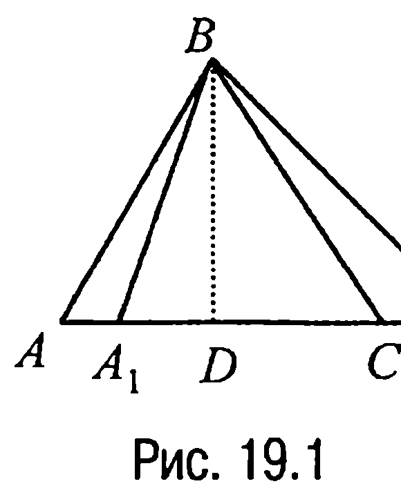

Справедливость этого свойства следует из того факта, что треугольники $ABC$ и $A_1BC_1$ имеют одну и ту же высоту $BD$ (рис. 19.1).

**Свойство 19.2.** *Если у треугольников $ABC$ и $AB_1C_1$ углы при общей вершине $A$ равны или в сумме составляют $180^\circ$, то*

$$\frac{S_{\triangle ABC}}{S_{\triangle AB_1C_1}} = \frac{AB \cdot AC}{AB_1 \cdot AC_1}$$

---
**стр. 245**
---

Справедливость этого свойства следует из теоремы 17.4, если заметить, что синусы углов с общей вершиной $A$ в треугольниках $ABC$ и $AB_1C_1$ равны.

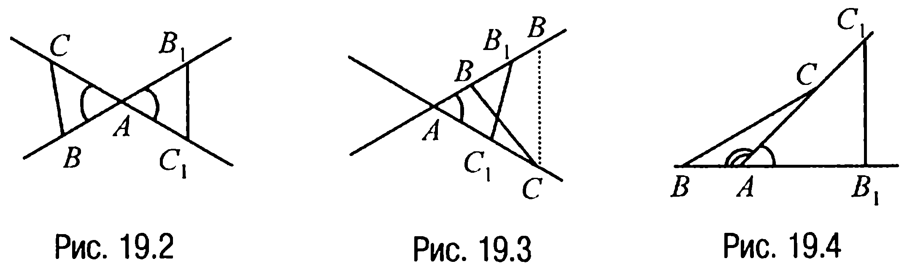

Геометрическая интерпретация свойства 19.2 иллюстрируется рис. 19.2, 19.3 и 19.4.

**Свойство 19.3.** *Если треугольники $ABC$ и $A_1B_1C_1$ таковы, что их стороны $AC$ и $A_1C_1$ параллельны, вершина $B$ лежит на прямой $A_1C_1$, а вершина $B_1$ лежит на прямой $AC$, то*

$$\frac{S_{\triangle ABC}}{S_{\triangle A_1B_1C_1}} = \frac{AC}{A_1C_1}$$

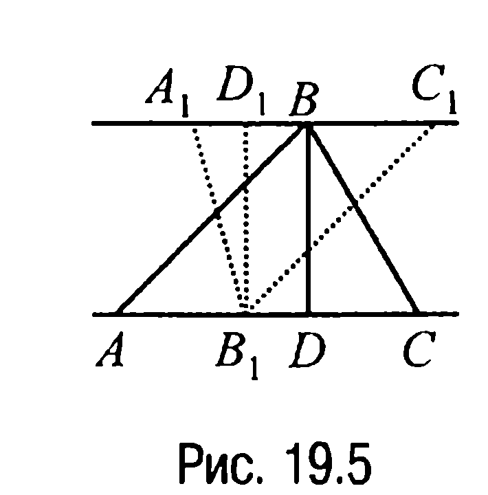

Справедливость свойства 19.3 следует из того факта, что треугольники $ABC$ и $A_1B_1C_1$ имеют равные высоты $BD$ и $B_1D_1$ (рис. 19.5).

**Свойство 19.4.** *Площади подобных треугольников или многоугольников относятся как квадраты их соответствующих линейных элементов.*

**Доказательство.** Если рассмотреть случай подобных треугольников, то справедливость свойства следует, например, из теоремы 17.4, пропорциональности сходственных сторон треугольников и свойств преобразования подобия.

Случай же подобных многоугольников сводится к рассмотрению предыдущего случая, поскольку два подобных многоугольника можно разбить на одно и то же число подобных треугольников с одним и тем же коэффициентом подобия.

---
**стр. 246**
---

**ЗАДАЧИ**

▼ **19.1.** *В треугольнике $ABC$ проведены высоты $AA_1$, $BB_1$, $CC_1$. Найти отношение площади треугольника $A_1B_1C_1$ к площади треугольника $ABC$, если $\angle CAB = \alpha$, $\angle ABC = \beta$, $\angle BCA = \gamma$.*

**Решение.** Очевидно, что надо рассмотреть случаи остроугольного, тупоугольного и прямоугольного треугольников.

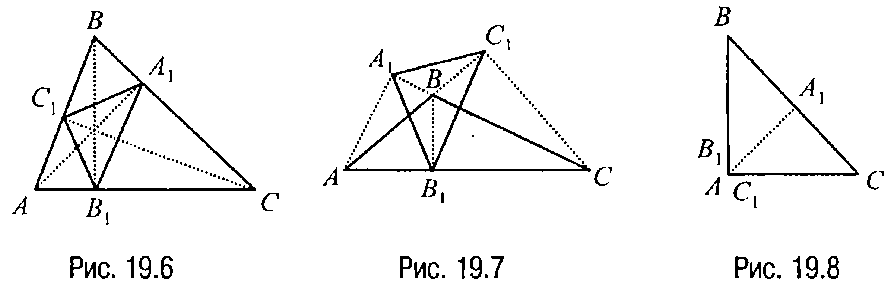

В первом случае (рис. 19.6) $S_{\triangle ABC} - S_{\triangle A_1B_1C_1} = S_{\triangle AB_1C_1} + S_{\triangle C_1BA_1} + S_{\triangle A_1CB_1}$ и поскольку $S_{\triangle AB_1C_1} = \frac{1}{2} B_1A \cdot AC_1 \cdot \sin \alpha =$
$= \frac{1}{2} AB \cdot \cos \alpha \cdot AC \cdot \cos \alpha \cdot \sin \alpha = \frac{1}{2} AB \cdot AC \cdot \sin \alpha \cdot \cos^2 \alpha =$
$= S_{\triangle ABC} \cdot \cos^2 \alpha$, $S_{\triangle C_1BA_1} = S_{\triangle ABC} \cdot \cos^2 \beta$, $S_{\triangle A_1CB_1} = S_{\triangle ABC} \cdot \cos^2 \gamma$, то
$S_{\triangle ABC} - S_{\triangle A_1B_1C_1} = S_{\triangle ABC} \cdot (\cos^2 \alpha + \cos^2 \beta + \cos^2 \gamma)$ или $\frac{S_{\triangle A_1B_1C_1}}{S_{\triangle ABC}} =$
$= 1 - (\cos^2 \alpha + \cos^2 \beta + \cos^2 \gamma)$.

Во втором случае (рис. 19.7) $S_{\triangle ABC} + S_{\triangle A_1B_1C_1} = S_{\triangle AB_1C_1} + S_{\triangle C_1BA_1} + S_{\triangle A_1CB_1}$ и, следовательно, $\frac{S_{\triangle A_1B_1C_1}}{S_{\triangle ABC}} = \cos^2 \alpha + \cos^2 \beta + \cos^2 \gamma - 1$.

В третьем случае (рис. 19.8) треугольника $A_1B_1C_1$ не существует, так как основания всех высот соединяет отрезок (точки $A$, $B_1$, $C_1$ совпадают). Поэтому $S_{\triangle A_1B_1C_1} = 0$ и, значит, $\frac{S_{\triangle A_1B_1C_1}}{S_{\triangle ABC}} = 0$.

**Ответ:** или $1 - (\cos^2 \alpha + \cos^2 \beta + \cos^2 \gamma)$; или $\cos^2 \alpha + \cos^2 \beta + \cos^2 \gamma - 1$; или $0$.

---
**стр. 247**
---

▼ **19.2.** *Стороны треугольника относятся как $p : q : l$. Найти отношение его площади к площади треугольника, вершинами которого являются основания биссектрис данного треугольника.*

**Решение.** Пусть точки $A_1$, $B_1$ и $C_1$ являются основаниями биссектрис треугольника $ABC$ (рис. 19.9) и пусть $AB = c$, $BC = a$, $AC = b$, $AC_1 = c_1$, $C_1B = c_2$, $BA_1 = a_1$, $A_1C = a_2$, $CB_1 = b_1$, $B_1A = b_2$.

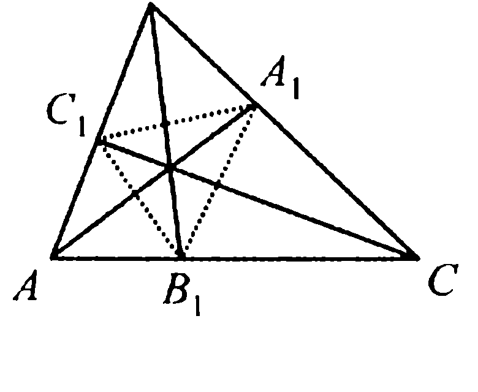

Тогда с учетом свойства биссектрисы справедливы, например, соотношения:
$$\begin{cases} a_1 + a_2 = a, \\ \frac{a_1}{a_2} = \frac{c}{b}. \end{cases}$$
Решая эту систему относительно $a_1$ и $a_2$, находим, что $a_1 = \frac{ac}{b+c}$, $a_2 = \frac{ab}{b+c}$.

Аналогично получаем и такие равенства: $b_1 = \frac{ab}{a+c}$, $b_2 = \frac{bc}{a+c}$ и $c_1 = \frac{bc}{a+b}$, $c_2 = \frac{ac}{a+b}$.

Воспользовавшись теперь тем фактом, что отношение площадей треугольников, имеющих общий угол, равно отношению произведений сторон, между которыми лежит этот общий угол, имеем
$$\frac{S_{\triangle AB_1C_1}}{S_{\triangle ABC}} = \frac{c_1b_2}{bc} = \frac{bc}{(a+b)(a+c)}, \quad \frac{S_{\triangle A_1BC_1}}{S_{\triangle ABC}} = \frac{a_1c_2}{ac} = \frac{ac}{(a+b)(b+c)},$$
$$\frac{S_{\triangle A_1B_1C}}{S_{\triangle ABC}} = \frac{a_2b_1}{ab} = \frac{ab}{(a+c)(b+c)}.$$

Но в таком случае
$$\frac{S_{\triangle A_1B_1C_1}}{S_{\triangle ABC}} = \frac{S_{\triangle ABC} - S_{\triangle AB_1C_1} - S_{\triangle A_1BC_1} - S_{\triangle A_1B_1C}}{S_{\triangle ABC}} = 1 - \left( \frac{bc}{(a+b)(a+c)} + \right.$$
$$+ \left. \frac{ac}{(a+b)(b+c)} + \frac{ab}{(a+c)(b+c)} \right) = \frac{2abc}{(a+b)(a+c)(b+c)} =$$
$$= \frac{2pql}{(p+q)(p+l)(q+l)}.$$

**Ответ:** $\frac{(p+q)(p+l)(q+l)}{2pql}$.

---
**стр. 248**
---

▼ **19.3.** *Вписанная в треугольник $ABC$ окружность касается сторон $BC$, $AC$ и $AB$ в точках $A_1$, $B_1$ и $C_1$ соответственно. Найти отношение площади треугольника $A_1B_1C_1$ к площади треугольника $ABC$, если $\angle CAB = \alpha$, $\angle ABC = \beta$ и $\angle BCA = \gamma$.*

**Решение.** Пусть точка $O$ — центр окружности радиуса $r$, вписанной в треугольник $ABC$, периметр которого равен $2p$, $R$ — радиус окружности, описанной около треугольника $ABC$ (рис. 19.10).

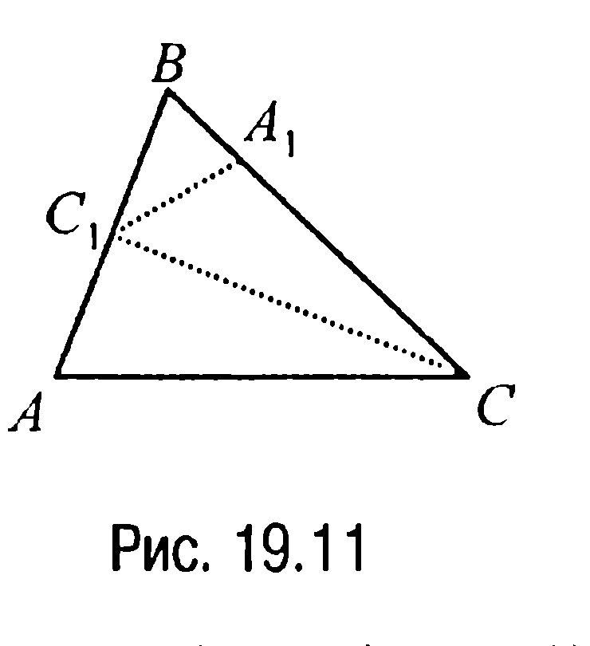

Тогда поскольку $p = R(\sin \alpha + \sin \beta + \sin \gamma)$,
$r = 4R \sin \frac{\alpha}{2} \sin \frac{\beta}{2} \sin \frac{\gamma}{2}$ (задача 10.10), а
$$S_{\triangle A_1B_1C_1} = S_{\triangle A_1OB_1} + S_{\triangle B_1OC_1} + S_{\triangle C_1OA_1} =$$
$$= \frac{r^2(\sin \angle A_1OB_1 + \sin \angle B_1OC_1 + \sin \angle C_1OA_1)}{2} =$$
$$= \frac{r^2}{2}(\sin(\pi - \gamma) + \sin(\pi - \alpha) + \sin(\pi - \beta)) = \frac{r^2(\sin \alpha + \sin \beta + \sin \gamma)}{2},$$
то $\frac{S_{\triangle A_1B_1C_1}}{S_{\triangle ABC}} = \frac{r^2(\sin \alpha + \sin \beta + \sin \gamma)}{2pr} = \frac{4R \sin \frac{\alpha}{2} \sin \frac{\beta}{2} \sin \frac{\gamma}{2}}{2R(\sin \alpha + \sin \beta + \sin \gamma)} \cdot (\sin \alpha +$
$+ \sin \beta + \sin \gamma) = 2\sin \frac{\alpha}{2} \sin \frac{\beta}{2} \sin \frac{\gamma}{2}$.

**Ответ:** $2\sin \frac{\alpha}{2} \sin \frac{\beta}{2} \sin \frac{\gamma}{2}$.

▼ **19.4.** *В треугольнике $ABC$ на сторонах $AB$ и $BC$ отмечены точки $C_1$ и $A_1$ соответственно таким образом, что $\frac{AC_1}{C_1B} = p$, $\frac{BA_1}{A_1C} = q$. Найти отношение площадей треугольников $ABC$ и $C_1A_1C$.*

**Решение.** Из условия задачи и свойства 19.1 следует (рис. 19.11), что $\frac{S_{\triangle ABC}}{S_{\triangle C_1BC}} = \frac{AB}{C_1B} = p + 1$ или $S_{\triangle C_1BC} = \frac{S_{\triangle ABC}}{p + 1}$. С другой стороны,

---
**стр. 249**
---

$\frac{S_{\Delta C_1BC}}{S_{\Delta C_1A_1C}} = \frac{BC}{A_1C} = q + 1$ и, значит,

$S_{\Delta C_1A_1C} = \frac{S_{\Delta C_1BC}}{q + 1} = \frac{S_{\Delta ABC}}{(p + 1)(q + 1)}$, откуда находим, что $\frac{S_{\Delta ABC}}{S_{\Delta C_1A_1C}} = (p + 1)(q + 1)$.

**Ответ:** $(p + 1)(q + 1)$.

**19.5.** В треугольнике $ABC$, площадь которого равна $S$, точки $D$ и $E$ делят стороны $AB$ и $BC$ соответственно в заданных отношениях $AD : DB = m$, $BE : EC = n$. Пусть $O$ — точка пересечения отрезков $AE$ и $DC$. Найти площадь треугольника $ADO$.

**Решение.** Пусть $S_1$ и $S_2$ — площади треугольников $ADC$ и $BCD$ соответственно.

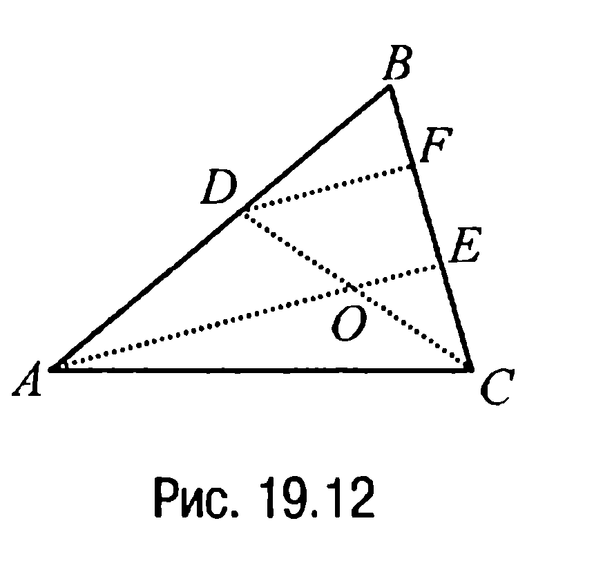

(рис. 19.12) Тогда, учитывая, что $S_2 = S - S_1$, а $\frac{S_1}{S_2} = \frac{AD}{DB} = m$, находим $S_1 = \frac{mS}{m + 1}$.

Определим теперь отношение $\frac{DO}{OC}$. Для этого проведем через точку $D$ прямую, параллельную $AE$, и обозначим через $F$ точку пересечения этой прямой с отрезком $BC$.

По обобщенной теореме Фалеса $\frac{DO}{OC} = \frac{FE}{EC}$. А так как $\frac{EF}{FB} = \frac{AD}{DB} = m$ и, значит, $FB = \frac{1}{m} EF$, а $BE = BF + FE = \frac{m + 1}{m} FE$, то

$\frac{BE}{EC} = \frac{(m + 1)FE}{m \cdot EC} = n$ и, таким образом, $\frac{DO}{OC} = \frac{FE}{EC} = \frac{m \cdot n}{m + 1}$.

Но в таком случае искомая площадь $S_0$ находится из пропорции $\frac{S_0}{S_1 - S_0} = \frac{m \cdot n}{m + 1}$, если учесть, что $S_1 = \frac{m \cdot S}{m + 1}$. Решая эту пропор-

---
**стр. 250**
---

цию относительно $S_0$, получаем, что $S_0 = \frac{m^2 \cdot n \cdot S}{(m + 1)(mn + m + 1)}$.

**Ответ:** $\frac{m^2 \cdot n \cdot S}{(m + 1)(mn + m + 1)}$.

**19.6.** В треугольнике $ABC$, площадь которого равна $S$, точки $E$, $F$ и $G$ делят стороны $AB$, $BC$ и $CA$ соответственно в отношении $p < 1$, считая от вершин $A$, $B$ и $C$. Точки $K$, $L$, $M$ — соответственно точки пересечения отрезков $AF$ и $EC$, $AF$ и $BG$, $BG$ и $EC$. Доказать, что треугольники $AEK$, $BFL$ и $CGM$ равновелики, равновеликими являются четырехугольники $BLKE$, $CMLF$ и $AKMG$. Найти площадь треугольника $KLM$.

**Решение.** Пусть в треугольнике $ABC$ проведены отрезки $AF$ и $BG$

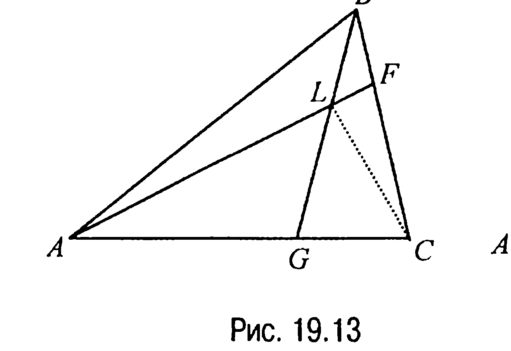

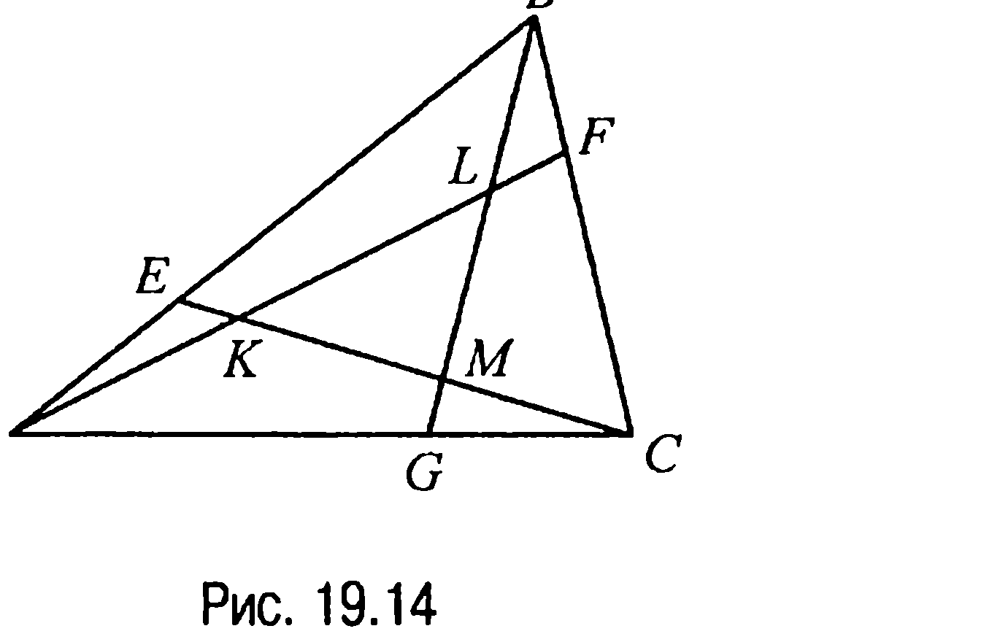

(рис. 19.13). Тогда из условия задачи следует, что $\frac{BF}{FC} = \frac{CG}{GA} = p$ и, значит, если $S_{\Delta BFL} = x$, $S_{\Delta CGL} = y$, то $S_{\Delta CLF} = \frac{x}{p}$, $S_{\Delta ALG} = \frac{y}{p}$.

Далее, поскольку $\frac{S_{\Delta ABL} + x}{\frac{y}{p} + y + \frac{x}{p}} = p$, то $S_{\Delta ABL} = (p + 1)y$, а так как

$\frac{(p + 1)y + \frac{y}{p}}{x + \frac{x}{p} + y} = \frac{1}{p}$, приходим к выводу, что $y = \frac{x}{p^2}$. Таким обра-

---
**стр. 251**
---

зом, $S_{\Delta CGL} = \frac{x}{p^2}$, $S_{\Delta ALG} = \frac{x}{p^3}$, $S_{\Delta ABL} = \frac{(p+1)x}{p^2}$ и, следовательно,

$S = x + \frac{x}{p} + \frac{x}{p^2} + \frac{x}{p^3} + \frac{(p+1)x}{p^2} = \frac{(p^3 + 2p^2 + 2p + 1)x}{p^3}$,

откуда находим, что $x = S_{\Delta BFL} = \frac{p^3}{p^3 + 2p^2 + 2p + 1} \cdot S$.

Аналогично показывается, что и площади треугольников $CGM$ и $AEK$ (рис. 19.14) также равны $\frac{p^3}{p^3 + 2p^2 + 2p + 1} \cdot S$.

Далее, замечая, что $S_{\Delta BCG} = S_{\Delta BFL} + S_{\Delta CLF} + S_{\Delta CGL} = x + \frac{x}{p} + \frac{x}{p^2} =$

$= \frac{(p^2 + p + 1)x}{p^2}$ (рис. 19.13), или $S_{\Delta BCG} = \frac{p(p^2 + p + 1)S}{p^3 + 2p^2 + 2p + 1}$, приходим к выводу (учитывая равенство треугольников $BFL$ и $CGM$), что $S_{CMLF} = S_{\Delta BCG} - 2S_{\Delta BFL} = \left(\frac{p^2 + p + 1}{p^2} - 2\right) x = \frac{(1 + p - p^2)x}{p^2}$ или $S_{CMLF} = \frac{p(1 + p - p^2)S}{p^3 + 2p^2 + 2p + 1}$.

Аналогично показывается, что и площади четырехугольников $AKMG$ и $BLKE$ (рис. 19.14) также равны $\frac{p(1 + p - p^2)S}{p^3 + 2p^2 + 2p + 1}$.

Отсюда имеем $S_{\Delta KLM} = S - 3S_{\Delta BFL} - 3S_{CMLF} = S - \frac{3p^3 \cdot S}{p^3 + 2p^2 + 2p + 1} -$

$- \frac{3p(1 + p - p^2)S}{p^3 + 2p^2 + 2p + 1} = \frac{(p^3 - p^2 - p + 1)S}{p^3 + 2p^2 + 2p + 1}$.

**Ответ:** $\frac{(p^3 - p^2 - p + 1)S}{p^3 + 2p^2 + 2p + 1}$.

**Замечание 19.1.** Если $p = \frac{1}{2}$, то площадь треугольника $KLM$ равна сумме площадей треугольников $BFL$, $CGM$ и $AEK$.

---
**стр. 252**
---

**19.7.** В треугольнике $ABC$ единичной площади проведен отрезок $AD$, пересекающий медиану $CE$ в точке $F$ таким образом, что $EF = \frac{1}{4} CE$. Найти площадь треугольника $ABD$.

**Решение.** Пусть $EG$ — средняя линия треугольника $ABD$ (рис. 19.15).

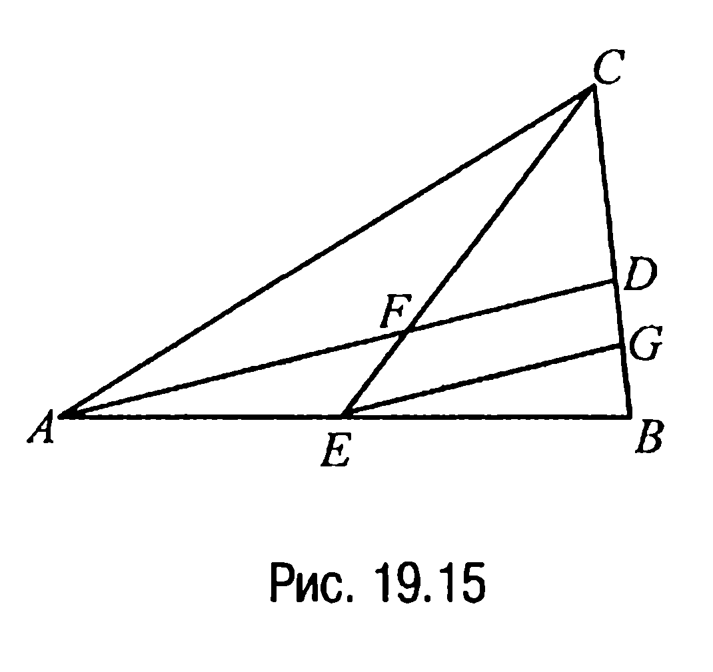

Тогда так как $EG \parallel FD$, то $\frac{EF}{FC} = \frac{GD}{DC} = \frac{1}{3}$, а поскольку $DG = GB$, то $\frac{BD}{DC} = \frac{2}{3}$ и, следовательно, $\frac{S_{\triangle ABD}}{S_{\triangle ABC}} = \frac{2}{5}$. Отсюда, учитывая условие задачи, находим, что $S_{\triangle ABD} = \frac{2}{5}$.

**Ответ:** $\frac{2}{5}$.

**19.8.** В треугольнике $ABC$ проведены медианы $BD$ и $CE$, $M$ — точка их пересечения. Доказать, что треугольник $BCM$ равновелик четырехугольнику $ADME$.

**Решение.** Так как медиана разбивает треугольник на два равновеликих треугольника, то (рис. 19.16)

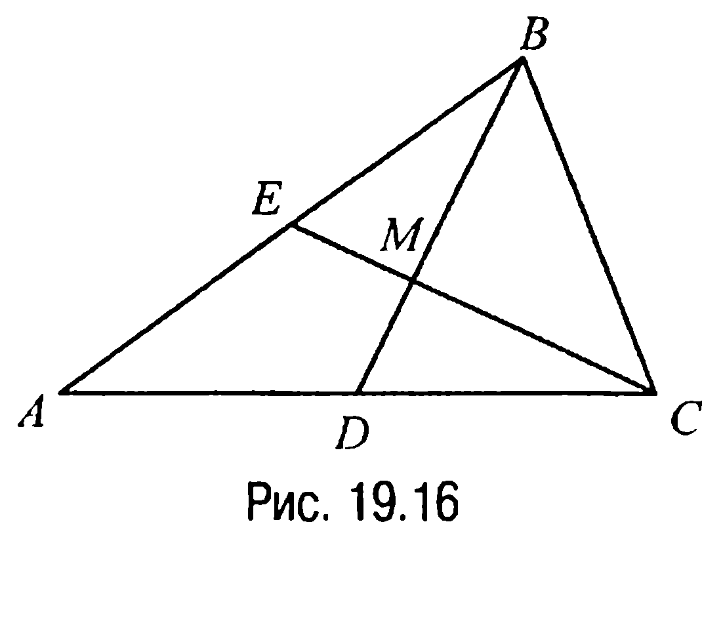

$S_{ADME} + S_{\triangle DCM} = S_{\triangle EMB} + S_{\triangle BMC}$,

а $S_{ADME} + S_{\triangle EMB} = S_{\triangle DCM} + S_{\triangle BMC}$.

Вычитая тогда почленно из первого равенства второе, получим, что $S_{\triangle DCM} - S_{\triangle EMB} = S_{\triangle EMB} - S_{\triangle DCM}$ или $S_{\triangle DCM} = S_{\triangle EMB}$. Полученное равенство и означает, что $S_{ADME} = S_{\triangle BCM}$.

**19.9.** Диагонали четырехугольника $ABCD$ пересекаются в точке $O$. Доказать, что $AO : OC = S_{\triangle DAB} : S_{\triangle BCD}$.

**Решение.** Опустим из вершин $A$ и $C$ на прямую $BD$ перпендикуляры $AA_1$ и $CC_1$ (рис. 19.17). Тогда поскольку треугольники $AA_1O$ и

---
**стр. 253**
---

$OCC_1$ подобны, то $\frac{AO}{OC} = \frac{AA_1}{CC_1}$.

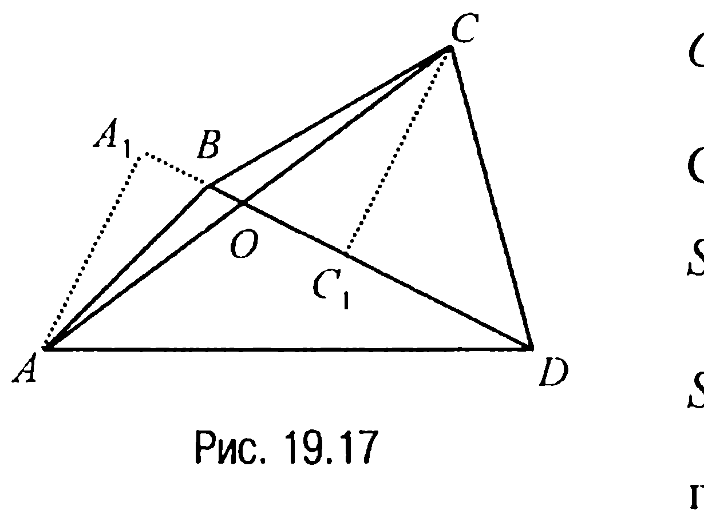

С другой стороны, так как $S_{\triangle DAB} = \frac{1}{2} BD \cdot AA_1$, а $S_{\triangle BCD} = \frac{1}{2} BD \cdot CC_1$, то, разделив первое равенство на второе, имеем

$$\frac{S_{\triangle DAB}}{S_{\triangle BCD}} = \frac{AA_1}{CC_1} = \frac{AO}{OC},$$

а это и требовалось доказать.

**19.10.** Через вершину выпуклого четырехугольника провести прямую, которая делит его на две равновеликие фигуры.

**Решение.** Пусть дан выпуклый четырехугольник $ABCD$ (рис. 19.18). Проведем диагональ $CA$, а затем через вершину $B$ — прямую, параллельную $CA$. Тогда если $E$ — точка пересечения этой прямой с прямой $DA$, то треугольник $ECD$ будет равновелик четырехугольнику $ABCD$, поскольку четырехугольник $BCAE$ — трапеция и, значит, заштрихованные на рис. 19.18 треугольники равновелики. Но в таком случае прямая, на которой лежит медиана $CM$ треугольника $ECD$, и будет искомой прямой.

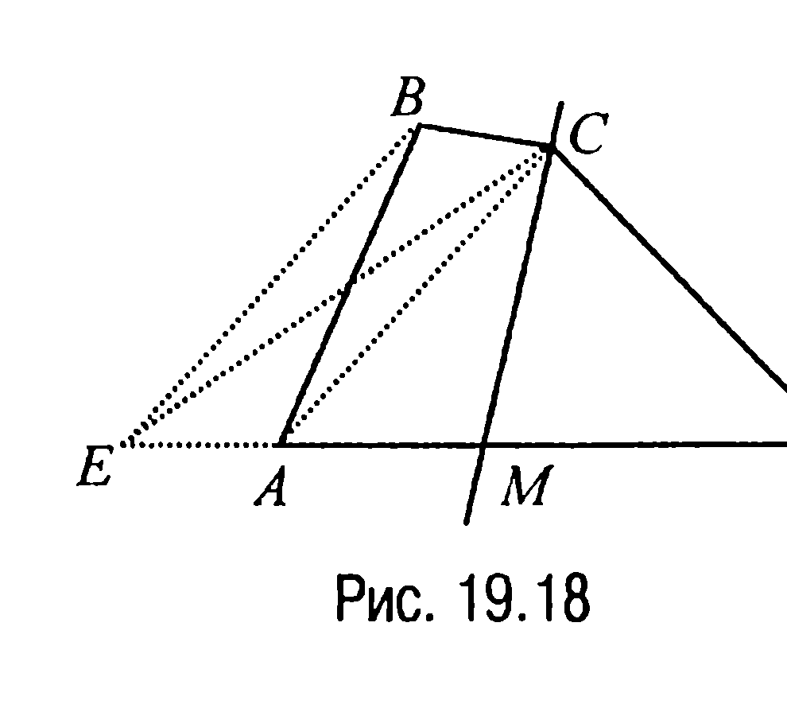

▼ **19.11.** Доказать, что середины сторон произвольного четырехугольника являются вершинами четырехугольника, площадь которого равна половине площади данного четырехугольника.

**Решение.** Пусть $E, F, K$ и $L$ — середины сторон $AB, BC, CD$ и $AD$ четырехугольника $ABCD$ соответственно (рис. 19.19, 19.20). Тогда четырехугольник $EFKL$ — параллелограмм (задача 13.1), стороны которого параллельны диагоналям данного четырехугольника, причем в случае выпуклого четырехугольника (рис. 19.19) точки $M, N, P$ и $Q$ — это середины отрезков $AO, BO,$

---
**стр. 254**
---

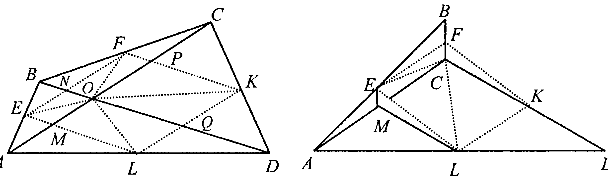

$CO$ и $DO$ соответственно, где $O$ — точка пересечения диагоналей четырехугольника $ABCD$ и, значит, по свойству медианы 6.2X справедливы равенства

$$S_{\Delta AME} = S_{\Delta OME} = S_{\Delta ONE} = S_{\Delta BNE}, \quad S_{\Delta BNF} = S_{\Delta ONF} = S_{\Delta OPF} = S_{\Delta CPF},$$

$$S_{\Delta CPK} = S_{\Delta OPK} = S_{\Delta OQK} = S_{\Delta DQK}, \quad S_{\Delta DQL} = S_{\Delta OQL} = S_{\Delta OML} = S_{\Delta AML},$$

из которых и следует требуемое.

В случае невыпуклого четырехугольника (рис. 19.20) точка $M$ — середина диагонали $AC$ и, таким образом, $S_{\Delta KCF} = S_{\Delta LME}$. Следовательно, $S_{EFKL} = S_{EFCM} + S_{MCKL}$.

По свойству же медианы 6.2X имеем $S_{\Delta AME} = S_{\Delta EMC} = S_{\Delta CFE} = S_{\Delta EFB}$, а $S_{\Delta AML} = S_{\Delta LMC} = S_{\Delta CLK} = S_{\Delta DLK}$, что и доказывает требуемое.

**19.12.** Доказать, что два произвольных четырехугольника, у которых совпадают середины сторон, равновелики.

**Решение.** Соединив середины последовательных сторон четырехугольников $ABCD$ и $KLMN$ (рис. 19.21), получим параллелограмм (задача 13.1), площадь которого равна половине площади как одного, так и второго четырехугольника (задача 19.11). А это и доказывает требуемое.

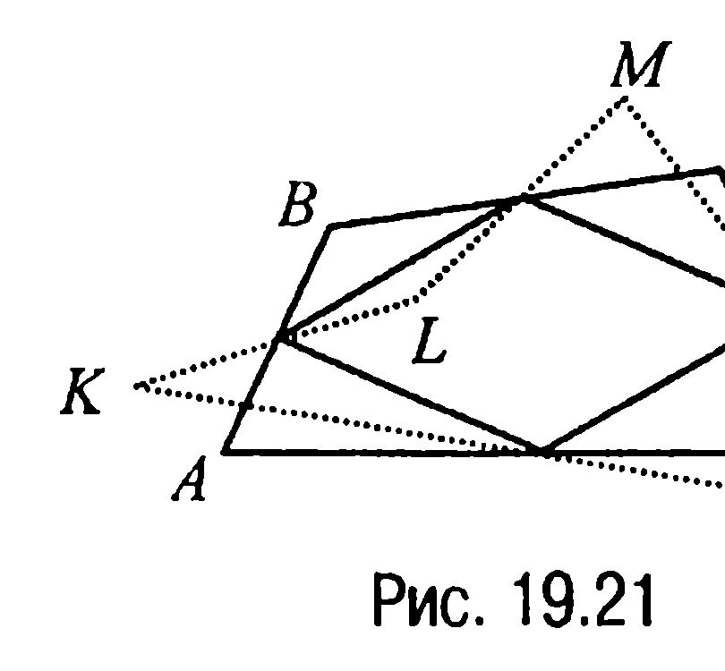

**19.13.** *Доказать, что если через вершины выпуклого четырехугольника провести прямые, параллельные его диагоналям, то площадь параллелограмма, определяемого этими прямыми, в два раза больше площади данного четырехугольника.*

---
**стр. 255**
---

**Решение.** Проведем через вершины $B$ и $D$ четырехугольника $ABCD$ (рис. 19.22) прямые, параллельные диагонали $AC$, а через вершины $A$ и $C$ — прямые, параллельные диагонали $BD$. Полученный четырехугольник $EFKL$ — параллелограмм.

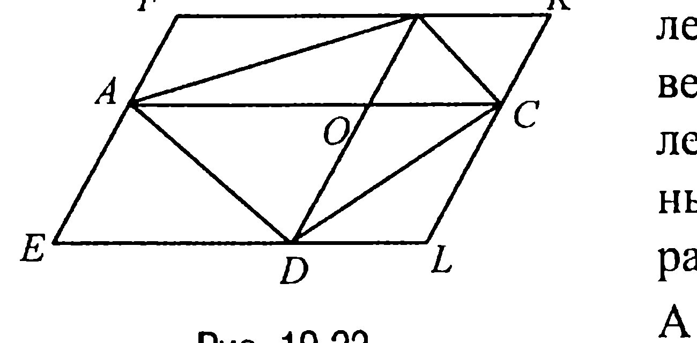

А тогда, обозначая через $O$ точку пересечения диагоналей $AC$ и $BD$, по свойству 13.1X имеем $\Delta AFB = \Delta BOA$, $\Delta COB = \Delta BKC$, $\Delta DOC = \Delta CLD$, $\Delta DEA = \Delta AOD$. Поэтому площадь параллелограмма $EFKL$ — это $S_{EFKL} = 2S_{\Delta BOA} + 2S_{\Delta COB} + 2S_{\Delta DOC} + 2S_{\Delta AOD} = 2S_{ABCD}$, что и требовалось доказать.

**19.14.** Точки $E$ и $K$ — середины сторон $AB$ и $BC$ параллелограмма $ABCD$ соответственно, $N$ — точка пересечения отрезков $AK$ и $DE$. Найти отношение площади четырехугольника $NKCD$ к площади параллелограмма $ABCD$.

**Решение.** Пусть $L$ — точка пересечения прямых $AK$ и $DC$, а $S$ — площадь параллелограмма $ABCD$ (рис. 19.23).

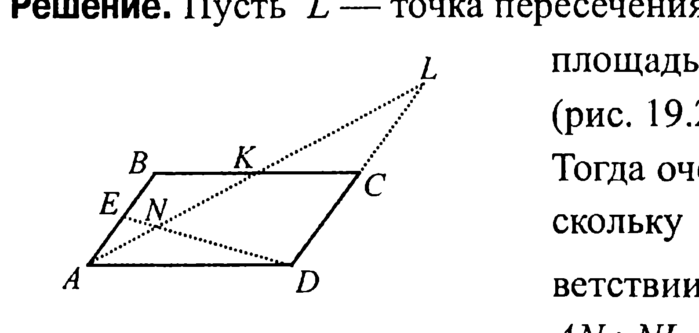

Тогда очевидно, что $S_{\Delta ALD} = S$, а поскольку $\Delta AEN \sim \Delta LDN$, то в соответствии с условием задачи $AN : NL = 1 : 4$.

Если теперь обозначить $AN = a$, то $NL = 4a$ и, значит, $S_{\Delta NLD} = \frac{4}{5} S_{\Delta ALD} = \frac{4}{5} S$. Но в таком случае, замечая, что $S_{\Delta KLC} = \frac{1}{4} S$, приходим к выводу, что $S_{NKCD} = \frac{4}{5} S - \frac{1}{4} S = \frac{11}{20} S$ или $\frac{S_{NKCD}}{S_{ABCD}} = \frac{11}{20}$.

**Ответ:** $\frac{11}{20}$.

---
**стр. 256**
---

**19.15.** Точки $M$ и $N$ — середины сторон $BC$ и $AD$ выпуклого четырехугольника $ABCD$ соответственно. Прямые $BN$, $CN$, $AM$ и $DM$ делят четырехугольник на 7 фигур: один четырехугольник и шесть треугольников. Доказать, что площадь образовавшегося четырехугольника равна сумме площадей двух треугольников, прилежащих к сторонам $AB$ и $CD$.

**Решение.** Пусть $K$ и $L$ — точки пересечения прямых $AM, BN$ и $CN, DM$ соответственно (рис. 19.24).

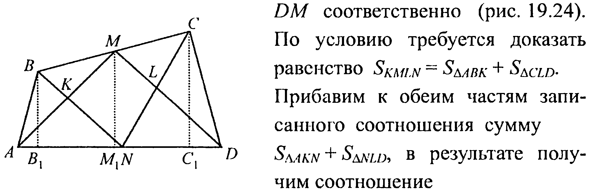

По условию требуется доказать равенство $S_{KMLN} = S_{\Delta ABK} + S_{\Delta CLD}$. Прибавим к обеим частям записанного соотношения сумму $S_{\Delta AKN} + S_{\Delta NLD}$, в результате получим соотношение $S_{\Delta AMD} = S_{\Delta ABN} + S_{\Delta NCD}$, равносильное предыдущему.

Докажем справедливость последнего равенства (а значит, и искомого). Для этого опустим на прямую $AD$ перпендикуляры $BB_1$, $MM_1$ и $CC_1$. Тогда

$S_{\Delta ABN} = \frac{1}{2} AN \cdot BB_1 = \frac{1}{4} AD \cdot BB_1$,

$S_{\Delta NCD} = \frac{1}{2} ND \cdot CC_1 = \frac{1}{4} AD \cdot CC_1$, $S_{\Delta AMD} = \frac{1}{2} AD \cdot MM_1$.

Из первых двух из полученных трех равенств следует, что

$S_{\Delta ABN} + S_{\Delta NCD} = \frac{1}{4} AD \cdot (BB_1 + CC_1)$.

С другой стороны, поскольку четырехугольник $BCC_1B_1$ — трапеция, а $MM_1$ — ее средняя линия, то $MM_1 = \frac{1}{2}(BB_1 + CC_1)$ и, таким образом, $S_{\Delta AMD} = \frac{1}{4} AD \cdot (BB_1 + CC_1)$, что и доказывает требуемое.

---
**стр. 257**
---

**ЗАДАЧИ ДЛЯ САМОСТОЯТЕЛЬНОГО РЕШЕНИЯ**

**19.1С.** *На стороне $AD$ параллелограмма $ABCD$ отмечена точка $E$ таким образом, что $AE : ED = 1 : 4$. Прямая $BE$ пересекает диагональ $AC$ в точке $F$. Найти отношение площади треугольника $AFE$ к площади треугольника $BCF$.*

**19.2С.** *На стороне $BC$ треугольника $ABC$ отмечена точка $D$ таким образом, что прямая $AD$ проходит через середину средней линии $KL$ треугольника, параллельной стороне $AC$. Найти отношение площади треугольника $ABD$ к площади треугольника $ADC$.*

**19.3С.** *В треугольнике $ABC$ точка $D$ лежит на стороне $AC$, а точка $E$ — на стороне $AB$. Известно, что $AD = DC$ и $AE = 2 \cdot EB$. Найти отношение площадей треугольников $BDE$ и $ABC$.*

**19.4С.** *На медиане $BM$ треугольника $ABC$ отмечена точка $D$ таким образом, что $BD : DM = 3 : 1$. Прямая $AD$ пересекает отрезок $BC$ в точке $E$. Найти отношение площадей треугольников $ABE$ и $AEC$.*

**19.5С.** *На каждой медиане треугольника отмечена точка, делящая медиану в отношении $1 : 3$, считая от вершины. Во сколько раз площадь треугольника с вершинами в этих точках меньше площади исходного треугольника?*

**19.6С.** *Дан треугольник $ABC$, площадь которого равна $2$. На медианах $AK, BL$ и $CN$ этого треугольника отмечены точки $P, Q$ и $R$ соответственно таким образом, что $AP : PK = 1, BQ : QL = 1 : 2, CR : RN = 5 : 4$. Найти площадь треугольника $PQR$.*

**19.7С.** *Через точку $D$, лежащую на стороне $AC$ треугольника $ABC$, проведена прямая параллельно стороне $AB$ до пересечения со стороной $BC$ в точке $E$. Найти отношение $BE : EC$, если площадь треугольника $BED$ составляет $3/16$ от площади треугольника $ABC$.*

---
**стр. 258**
---

**19.8С.** *Доказать, что площадь трапеции равна произведению отрезка, соединяющего середины оснований, диагонали трапеции и синуса угла между ними.*

**19.9С.** *Найти площадь четырехугольника $ABCD$, если площади треугольников $ABD$, $ACD$ и $AOD$, где $O$ — точка пересечения диагоналей $AC$ и $BD$, равны соответственно $a$, $b$ и $c$.*

**19.10С.** *Диагонали вписанного в окружность четырехугольника $ABCD$ пересекаются в точке $O$. Доказать, что*

$$\frac{AO}{OC} = \frac{AD \cdot AB}{CD \cdot CB}.$$

**19.11С.** *Прямая, проходящая через середину диагонали $BD$ произвольного четырехугольника $ABCD$ параллельно диагонали $AC$, пересекает сторону $AD$ в точке $E$. Найти отношение площади четырехугольника $ABCE$ к площади треугольника $ECD$.*

**19.12С.** *В треугольнике $ABC$ точка $L$ делит отрезок $BC$ пополам, а точка $K$ делит пополам отрезок $BL$. Из точки $A$ через точки $K$ и $L$ проведены лучи и на них отложены вне треугольника $ABC$ отрезки $LD = AL$ и $KF = \frac{1}{3} AK$. Найти отношение площади треугольника $ABC$ к площади четырехугольника $KLDF$.*

**19.13С.** *Продолжение биссектрисы $AL$ остроугольного треугольника $ABC$ за точку $L$ пересекает описанную около него окружность в точке $N$. Из точки $L$ на стороны $AB$ и $AC$ соответственно опущены перпендикуляры $LK$ и $LM$. Доказать, что площади четырехугольника $AKNM$ и треугольника $ABC$ равны.*

**19.14С.** *Найти отношение площадей равностороннего треугольника, квадрата и правильного шестиугольника, если их стороны равны.*
