## 4.1. Векторы на плоскости

---
**стр. 259**
---

# ГЛАВА 4

# ВЕКТОРЫ И ИХ ПРИМЕНЕНИЕ К РЕШЕНИЮ ГЕОМЕТРИЧЕСКИХ ЗАДАЧ

## § 20. ВЕКТОРЫ НА ПЛОСКОСТИ

**20.1. Определения и обозначения, связанные с понятием вектора**

В геометрии на плоскости (как и в пространстве) наряду с обыкновенными отрезками часто приходится рассматривать направленные отрезки, которые обычно называют **векторами**, считая один из концов отрезка его началом, а другой — концом.

На чертежах (рисунках) направленные отрезки изображают в виде отрезков со стрелками (рис. 20.1), где стрелка указывает направление от начала отрезка к его концу.

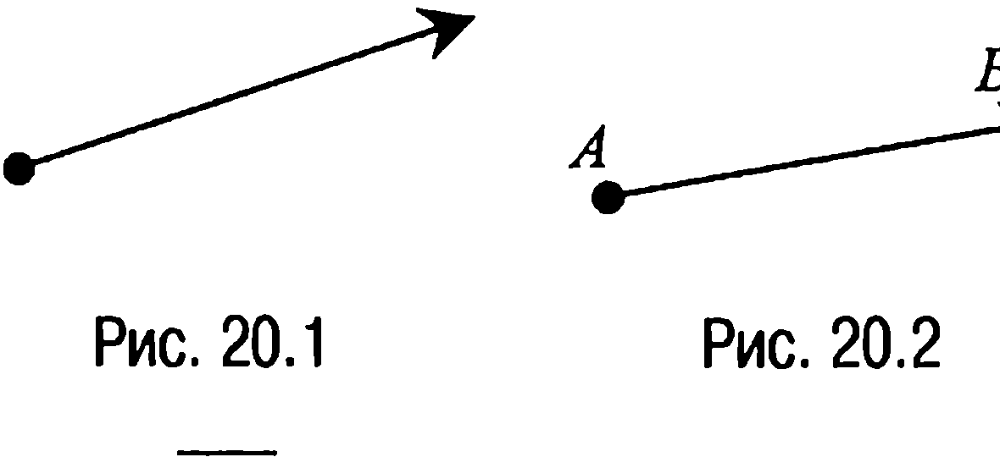

Вектор с началом $A$ и концом $B$ (рис. 20.2) будем обозначать через $\overline{AB}$ (в отличие от ненаправленного отрезка с концами в точках $A$ и $B$, который обозначается символом $AB$ — без черточки сверху).

***Модулем (абсолютной величиной, длиной) вектора*** $\overline{AB}$ ***называется длина отрезка*** $AB$.

Модуль вектора $\overline{AB}$ обозначается через $|\overline{AB}|$.

*Вектор, модуль которого равен единице, называется единичным вектором, или ортом.*

---
**стр. 260**
---

*Вектор*, конец которого совпадает с началом, называется ***нулевым вектором*** и обозначается символом $\overline{0}$.

Нулевому вектору приписывается любое направление.

*Ненулевые векторы, лежащие на параллельных прямых или на одной и той же прямой, называются* ***коллинеарными***.

Нулевой вектор является коллинеарным с любым вектором.

Коллинеарные векторы могут быть одинаково направленными (рис. 20.3) и противоположно направленными (рис. 20.4).

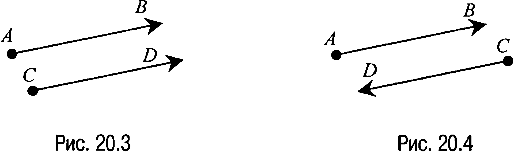

Если векторы одинаково направлены (рис. 20.3), их называют ***сонаправленными*** и пишут $\overline{AB} \uparrow\uparrow \overline{CD}$.

Противоположно направленные векторы (рис. 20.4) обозначаются символом $\overline{AB} \uparrow\downarrow \overline{CD}$.

*Два противоположно направленных вектора с равными модулями называются* ***противоположными векторами***.

Два ненулевых вектора называются ***равными***, если они сонаправлены и имеют равные модули.

Все нулевые векторы считаются равными.

Из определения равенства векторов следует, что от любой точки можно отложить вектор, равный данному вектору, и только один.

Другими словами, произвольно выбранные векторы (в любом числе) можно «привести к общему началу», т. е. можно построить векторы, соответственно равные данным и имеющие общее начало в некоторой точке плоскости.

---
**стр. 261**
---

**20.2. Сложение и вычитание векторов**

Пусть $\overline{AB} = \bar{a}$, $\overline{CD} = \bar{b}$ — два произвольных вектора на плоскости.

**Суммой векторов $\bar{a}$ и $\bar{b}$** называется третий вектор $\bar{c}$, получаемый следующим построением: из произвольной точки $O$ плоскости строится вектор $\overline{OM}$, равный $\bar{a}$, затем из точки $M$ строится вектор $\overline{MN}$, равный $\bar{b}$. Вектор $\bar{c} = \overline{ON}$ и есть сумма векторов $\bar{a}$ и $\bar{b}$ (записывается так: $\bar{c} = \bar{a} + \bar{b}$).

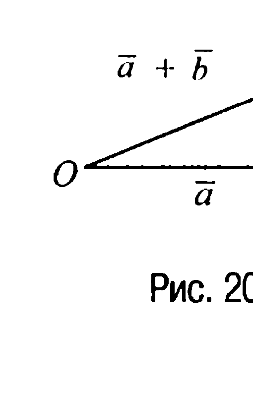

Это правило сложения векторов называется **правилом треугольника** (рис. 20.5).

**Правило параллелограмма.** Если векторы $\bar{a}$ и $\bar{b}$ неколлинеарны, то сумму $\bar{a} + \bar{b}$ можно найти и следующим построением: из произвольной точки $O$ плоскости (рис. 20.6) строим векторы $\overline{OK} = \bar{a}$ и $\overline{OL} = \bar{b}$. Затем на отрезках $OK$ и $OL$ строим параллелограмм $OKPL$.

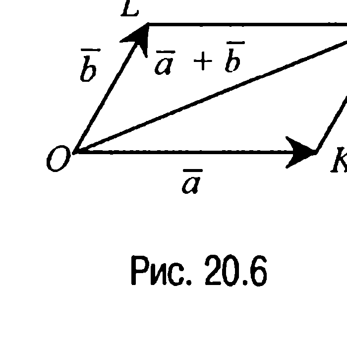

Диагональ параллелограмма $\overline{OP} = \bar{c}$ как направленный отрезок и есть сумма векторов $\bar{a}$ и $\bar{b}$.

Действительно, вектор $\overline{KP} = \overline{OL} = \bar{b}$. С другой стороны, по правилу треугольника, примененному к треугольнику $OKP$, $\overline{OP} = \overline{OK} + \overline{KP} = \bar{a} + \bar{b}$, откуда и следует, что $\bar{c} = \bar{a} + \bar{b}$.

Заметим, что к коллинеарным векторам правило параллелограмма не применимо.

---
**стр. 262**
---

**Свойства операции сложения векторов.** *Для любых векторов $\bar{a}$, $\bar{b}$ и $\bar{c}$ справедливы равенства:*

$1^0. \bar{a} + \bar{b} = \bar{b} + \bar{a}$ — *переместительный (коммутативный) закон;*

$2^0. (\bar{a} + \bar{b}) + \bar{c} = \bar{a} + (\bar{b} + \bar{c})$ — *сочетательный (ассоциативный) закон.*

**Доказательство.** $1^0$. Если векторы $\bar{a}$ и $\bar{b}$ неколлинеарны, то свойство $1^0$ непосредственно следует из правила параллелограмма. В случае же коллинеарности векторов свойство $1^0$ очевидным образом вытекает из определения суммы векторов (рис. 20.7).

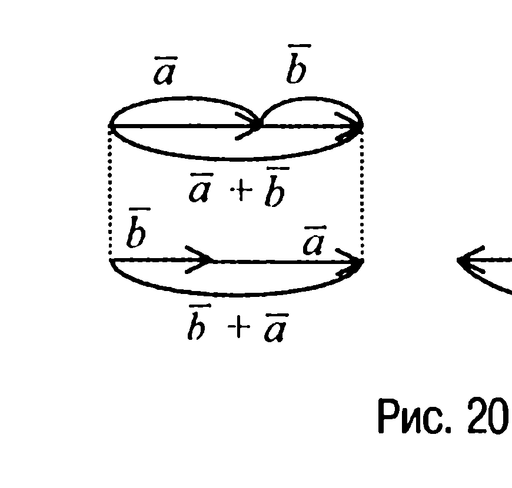

$2^0$. Отложим от произвольной точки $O$ вектор $\overline{OA} = \bar{a}$, от точки $A$ — вектор $\overline{AB} = \bar{b}$ и от точки $B$ — вектор $\overline{BC} = \bar{c}$. Тогда по правилу треугольника

$(\bar{a} + \bar{b}) + \bar{c} = (\overline{OA} + \overline{AB}) + \overline{BC} = \overline{OB} + \overline{BC} = \overline{OC}$ и $\bar{a} + (\bar{b} + \bar{c}) = \overline{OA} + (\overline{AB} + \overline{BC}) = \overline{OA} + \overline{AC} = \overline{OC}$, откуда и следует справедливость свойства $2^0$.

***Суммой нескольких векторов*** *называется вектор, получаемый в результате последовательного прибавления каждого из векторов к сумме предшествующих векторов.*

Из этого определения вытекает следующее правило: *если несколько векторов отложены таким образом, что начало второго совпадает с концом первого, начало третьего — с концом второго и т. д., то замыкающая, т. е. вектор, начало которого совпадает с началом первого, а конец — с концом последнего вектора, представляет собой сумму всех векторов.*

---
**стр. 263**
---

***Разностью $\bar{a} - \bar{b}$ векторов $\bar{a}$ и $\bar{b}$*** *называется сумма вектора $\bar{a}$ и вектора, противоположного вектору $\bar{b}$, т. е. $\bar{a} - \bar{b} = \bar{a} + (-\bar{b})$.*

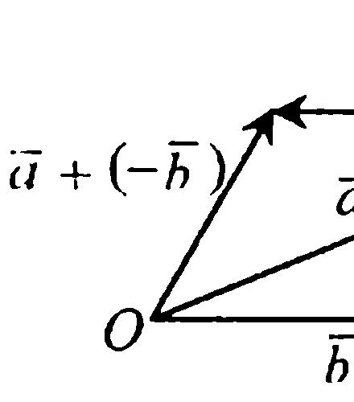

Если $\overline{OA} = \bar{a}$, $\overline{OB} = \bar{b}$ (рис. 20.8), то вектор $\bar{a} - \bar{b}$ изображается направленным отрезком $\overline{OA} - \overline{OB} = \overline{BA}$.

**20.3. Умножение и деление вектора на число**

***Произведением ненулевого вектора $\bar{a}$ на число $k \neq 0$*** *(записывается $k \cdot \bar{a}$ или $\bar{a} \cdot k$) называется вектор, длина которого равна $|k| \cdot |\bar{a}|$ и который сонаправлен вектору $\bar{a}$, если $k > 0$ и направлен противоположно ему, если $k < 0$. Если же $k = 0$ или $\bar{a} = \bar{0}$, то произведение $k \cdot \bar{a} = \bar{a} \cdot k = \bar{0}$.*

**Свойства операции умножения вектора на число.** *Для любых векторов $\bar{a}$, $\bar{b}$ и чисел $\lambda$, $\mu$ справедливы равенства:*

$1^0. \lambda(\bar{a} + \bar{b}) = \lambda\bar{a} + \lambda\bar{b}$ — *распределительный (дистрибутивный) закон относительно сложения векторов;*

$2^0. (\lambda + \mu) \bar{a} = \lambda\bar{a} + \mu\bar{a}$ — *распределительный (дистрибутивный) закон относительно сложения чисел;*

$3^0. \lambda(\mu\bar{a}) = (\lambda\mu)\bar{a}$ — *сочетательный (ассоциативный) закон;*

$4^0. 1 \cdot \bar{a} = \bar{a}$ — *закон умножения на единицу.*

**Доказательство.** $1^0$. Если $\lambda = 0$ или $\bar{a} = -\bar{b}$, <!-- вероятная опечатка оригинала: возможно, имелось в виду $\bar{a} = \bar{0}$ --> или по крайней мере один из векторов $\bar{a}$ и $\bar{b}$ оказывается нулевым вектором, то равенство $1^0$ очевидно. Предположим, что $\lambda > 0$ и что векторы $\bar{a}$ и $\bar{b}$ не коллинеарны. Отметим на плоскости произвольную точку $O$ и выберем такие точки $A$ и $B$, что $\overline{OA} = \bar{a}$, $\overline{AB} = \bar{b}$ и, сле-

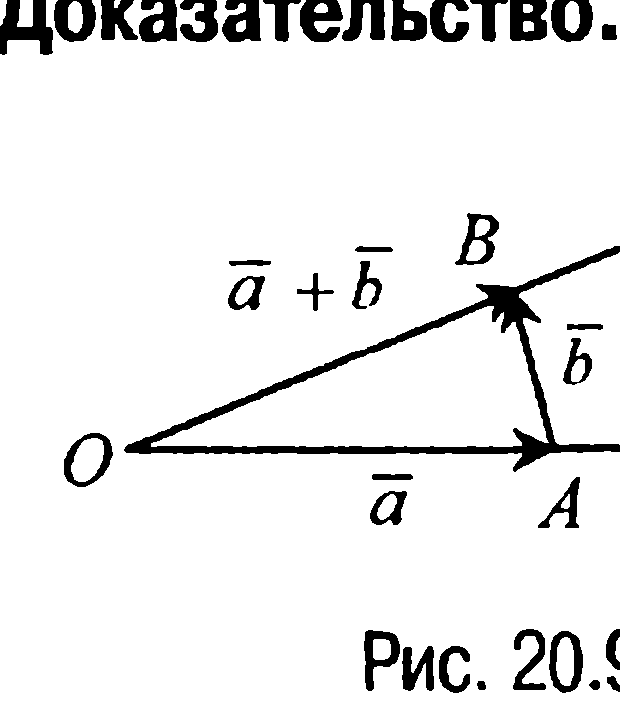

---
**стр. 264**
---

довательно, $\overline{OB} = \bar{a} + \bar{b}$ (рис. 20.9). Далее, отметим такие точки $A_1$, $B_1$, что $\overline{OA_1} = \lambda \bar{a}$, $\overline{OB_1} = \lambda(\bar{a} + \bar{b})$.

Тогда из подобия треугольников $OAB$ и $OA_1B_1$ следует, что $|A_1B_1| = |\lambda| \cdot |AB|$, а поскольку векторы $\overline{AB}$ и $\overline{A_1B_1}$ сонаправлены, то $\overline{A_1B_1} = \lambda \bar{b}$. Таким образом, $\lambda(\bar{a} + \bar{b}) = \overline{OB_1} = \overline{OA_1} + \overline{A_1B_1} = \lambda \bar{a} + \lambda \bar{b}$, что и доказывает требуемое.

Предположим теперь, что $\lambda > 0$, а векторы $\overline{OA} = \bar{a}$ и $\overline{AB} = \bar{b}$ коллинеарны. Отметим какую-либо точку $C$, не лежащую на прямой $OAB$, и проведем лучи $CO$, $CA$ и $CB$ (рис. 20.10).

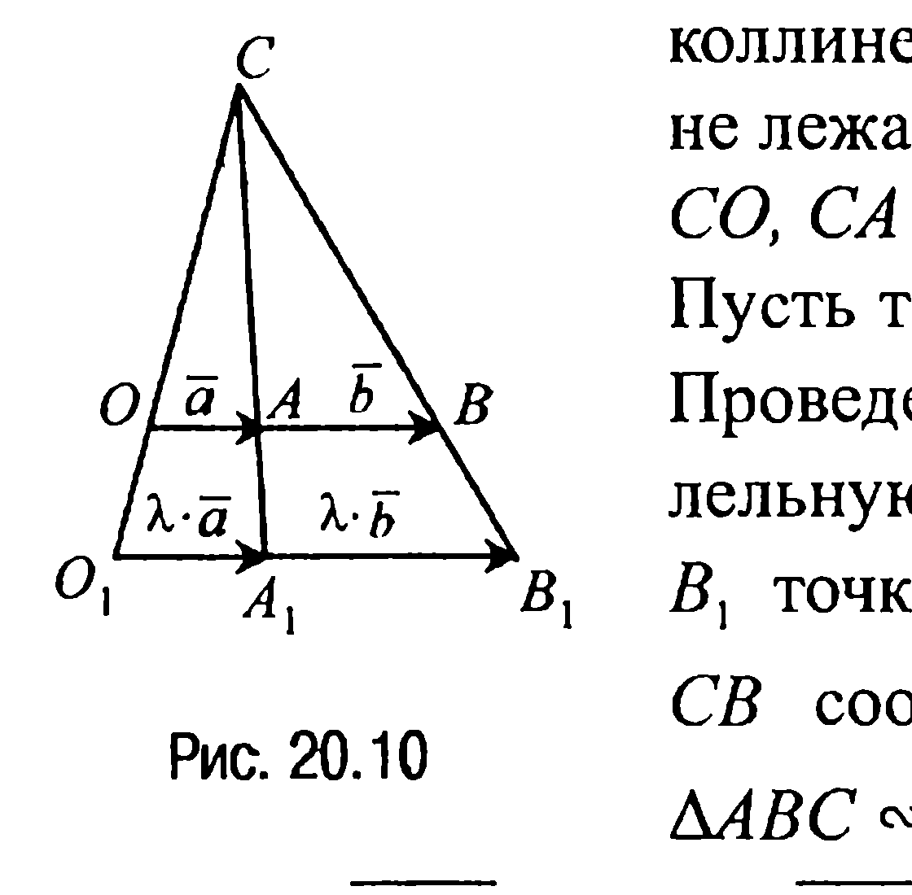

Пусть точка $O_1 \in CO$ такая, что $|CO_1| = \lambda |CO|$. Проведем через точку $O_1$ прямую $l$, параллельную прямой $OB$, и обозначим через $A_1$ и $B_1$ точки пересечения прямой $l$ с лучами $CA$ и $CB$ соответственно. Тогда $\triangle OAC \sim \triangle O_1A_1C$, $\triangle ABC \sim \triangle A_1B_1C$, $\triangle OBC \sim \triangle O_1B_1C$ и, следовательно, $\overline{O_1A_1} = \lambda \bar{a}$, $\overline{A_1B_1} = \lambda \bar{b}$, $\overline{O_1B_1} = \lambda(\bar{a} + \bar{b})$. Таким образом, $\lambda(\bar{a} + \bar{b}) = \overline{O_1B_1} = \overline{O_1A_1} + \overline{A_1B_1} = \lambda \bar{a} + \lambda \bar{b}$, что и требовалось доказать.

Если $\lambda < 0$, то доказательство аналогично проведенному выше.

$2^0$. Если $\bar{a} = \bar{0}$ или $\lambda + \mu = 0$, или, по крайней мере, одно из чисел $\lambda$ и $\mu$ равно нулю, то равенство $2^0$ очевидно.

Предположим, что числа $\lambda$ и $\mu$ имеют одинаковые знаки. Тогда векторы в левой и в правой частях равенства $2^0$ сонаправлены. Покажем, что модули этих векторов одинаковы. Действительно, $|\lambda \bar{a} + \mu \bar{a}| = |\lambda \bar{a}| + |\mu \bar{a}| = |\lambda| \cdot |\bar{a}| + |\mu| \cdot |\bar{a}| = (|\lambda| + |\mu|) \cdot |\bar{a}| = |\lambda + \mu| \cdot |\bar{a}| = |(\lambda + \mu) \bar{a}|$.

Предположим теперь, что числа $\lambda$ и $\mu$ имеют разные знаки и, например, $|\lambda| > |\mu|$. В этом случае числа $\lambda + \mu$ и $(-\mu)$ имеют одинаковые знаки и, значит, на основании уже доказанного $(\lambda + \mu) \bar{a} + (-\mu) \bar{a} = (\lambda + \mu - \mu) \bar{a} = \lambda \bar{a}$, что равносильно равенству $2^0$.

$3^0$. Модуль вектора в левой части соотношения $3^0$ равен $|\lambda| \cdot |\mu \bar{a}| = |\lambda| \cdot |\mu| \cdot |\bar{a}|$. Этому же числу равен и модуль вектора в правой

---
**стр. 265**
---

части $3^0$. А тогда если $|\lambda| \cdot |\mu| \cdot |\bar{a}| \neq 0$, то векторы в обеих частях $3^0$ сонаправлены, причем, если числа $\lambda$ и $\mu$ имеют одинаковые знаки, направление обоих векторов совпадает с направлением вектора $\bar{a}$. Если же $\lambda\mu < 0$, то направление обоих векторов противоположно направлению вектора $\bar{a}$.

Равенство $4^0$ непосредственно следует из определения произведения вектора на число.

*Отношением вектора $\bar{a}$ к числу $\lambda \neq 0$ (записывается $\frac{\bar{a}}{\lambda}$) называется произведение вектора $\bar{a}$ на число $\frac{1}{\lambda}$.*

**20.4. Деление отрезка в данном отношении**

Пусть $AB$ — произвольный отрезок и $C$ — его внутренняя точка. Тогда число $\frac{AC}{CB}$ называется ***отношением, в котором точка $C$ делит отрезок $AB$.***

**Теорема 20.1.** *Пусть $C$ — точка, делящая отрезок $AB$ в отношении $\frac{m}{n}$ (т. е. $\frac{AC}{CB} = \frac{m}{n}$), $Q$ — произвольная точка плоскости. Тогда $\overline{QC} = \frac{n}{m+n} \overline{QA} + \frac{m}{m+n} \overline{QB}$. И обратно, если справедливо последнее соотношение, то точка $C$ делит отрезок $AB$ в отношении $m : n$.*

**Доказательство.** Из условия теоремы следует, что $AC = \frac{m}{n} CB$. Поэтому (рис. 20.11) $AB = AC + CB =$

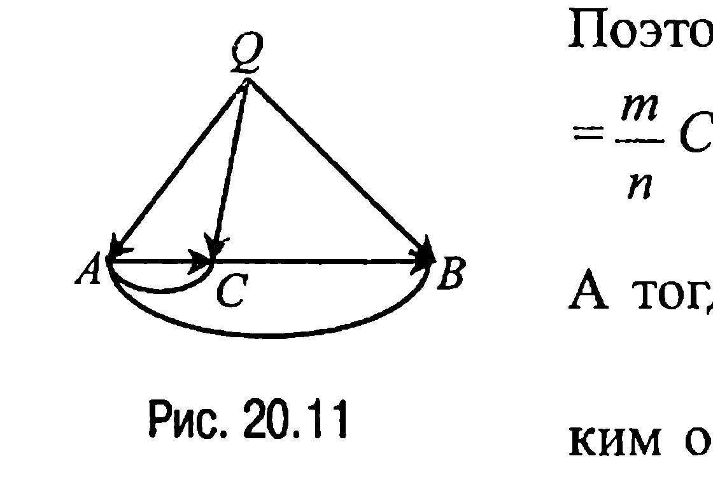

$= \frac{m}{n} CB + CB = \left( \frac{m}{n} + 1 \right) CB = \frac{m+n}{n} CB$. А тогда $AC : AB = \frac{m}{n} : \frac{m+n}{n} = \frac{m}{m+n}$ и, та-

---
**стр. 266**
---

ким образом, $AC = \frac{m}{m+n} AB$. Учитывая же, что векторы $\overline{AC}$ и $\overline{AB}$ сонаправлены, приходим к выводу, что $\overline{AC} = \frac{m}{m+n} \overline{AB}$ или $\overline{QC} - \overline{QA} = \frac{m}{m+n} (\overline{QB} - \overline{QA})$, откуда $\overline{QC} =$

$= \frac{m}{m+n} \overline{QB} + \left( 1 - \frac{m}{m+n} \right) \overline{QA} = \frac{m}{m+n} \overline{QB} + \frac{n}{m+n} \overline{QA}$.

Обратно, если последнее равенство выполнено, то, проводя вычисления в обратном порядке, найдем, что $AC : CB = m : n$.

**Теорема 20.2.** *Пусть $A$, $B$, $C$ и $Q$ — произвольные точки плоскости. Точка $C$ тогда и только тогда принадлежит прямой $AB$, когда существует число $\lambda$ такое, что $\overline{QC} = \lambda \overline{QA} + (1 - \lambda) \overline{QB}$.*

**Доказательство.** Написанное в формулировке теоремы соотношение можно переписать так: $\overline{QC} = \lambda \overline{QA} + \overline{QB} - \lambda \overline{QB}$ или $\overline{QC} - \overline{QB} = \lambda (\overline{QA} - \overline{QB})$ (рис. 20.12). Последнее же соотношение имеет место тогда и только тогда, когда векторы $\overline{BC}$ и $\overline{BA}$ параллельны одной и той же прямой, т. е. когда точка $C$ лежит на прямой $AB$.

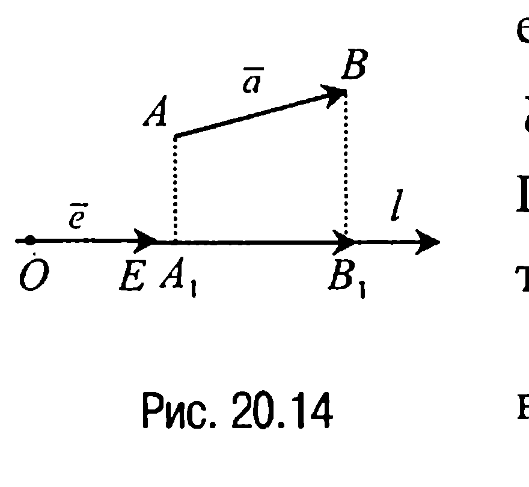

**20.5. Проекции и координаты векторов**

Прямая линия, на которой задано некоторое направление (на чертежах указывается стрелкой) и задана единица измерения длин, называется **осью**.

Пусть $l$ — некоторая ось, $\overline{e}$ — единичный вектор (орт), имеющий направление, совпадающее с направлением оси, и $\overline{AB}$ — произвольный вектор на плоскости. Обозначим через $A_1$ и $B_1$ проекции точек $A$ и $B$ на прямую $l$, т. е. основания перпендикуляров, опущенных из точек $A$ и $B$ на прямую $l$ (рис. 20.13).

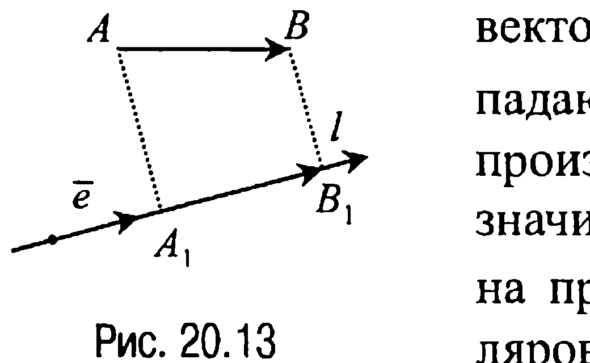

---
**стр. 267**
---

**Проекцией (геометрической) вектора** $\overline{AB}$ **на ось** $l$ **называется вектор** $\overline{A_1B_1}$.

Геометрическая проекция обозначается символом $\text{Пр}_l \overline{AB} = \overline{A_1B_1}$ или, короче, $\text{Пр } \overline{AB} = \overline{A_1B_1}$.

**Проекцией (алгебраической) вектора** $\overline{AB}$ **на ось** $l$ **называется длина вектора** $\overline{A_1B_1}$, **взятая со знаком плюс, если векторы** $\overline{A_1B_1}$ **и** $\bar{e}$ **сонаправлены, и со знаком минус в противном случае.**

Алгебраическая проекция обозначается символом $\text{пр}_l \overline{AB} = A_1B_1$ или, короче, $\text{пр } \overline{AB} = A_1B_1$.

**Замечание 20.1.** Геометрическая проекция заданного вектора на выбранную ось есть вполне определенный вектор. Его можно построить безотносительно к выбору масштаба. Алгебраическая же проекция данного вектора на выбранную ось есть некоторое действительное число, т. е. скаляр. Значение этого числа зависит от выбора единицы масштаба.

**Теорема 20.3.** *Геометрическая проекция вектора* $\bar{a} = \overline{AB}$ *на ось* $l$ *есть произведение орта* $\bar{e}$ *этой оси на алгебраическую проекцию вектора* $\bar{a}$ *на ту же ось* $l$.

**Доказательство.** Геометрическая проекция вектора $\bar{a}$ на ось $l$ есть вектор $\overline{A_1B_1}$, коллинеарный с ортом $\bar{e} = \overline{OE}$ (рис. 20.14). Значит, $\text{Пр}_l \overline{AB} = \overline{A_1B_1} = \lambda \bar{e}$, где $\lambda$ — действительное число, по модулю равное длине вектора $\overline{A_1B_1}$, т. е. $|\lambda| = \frac{|\overline{A_1B_1}|}{|\bar{e}|}$.

При этом число $\lambda > 0$, если векторы $\overline{A_1B_1}$ и $\bar{e}$ сонаправлены (рис. 20.14) и $\lambda < 0$, если указанные векторы направлены противоположно (рис. 20.15).

---
**стр. 268**
---

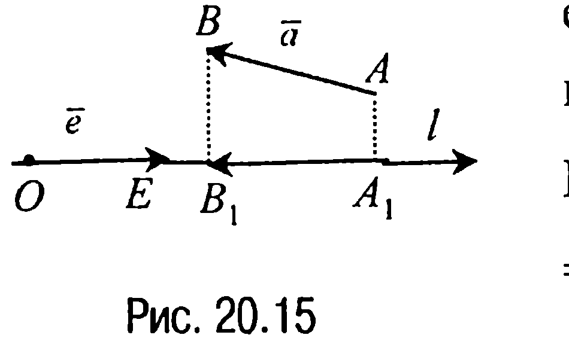

Из определения же алгебраической проекции следует, что эта проекция также выражается числом $\lambda$, т. е. $\lambda = \text{пр}_l \overline{AB}$.

Но в таком случае $\text{Пр}_l \overline{AB} = \lambda \bar{e} = \text{пр}_l \overline{AB} \cdot \bar{e} = \bar{e} \cdot \text{пр}_l \overline{AB}$, что и требовалось доказать.

**Теорема 20.4.** *Геометрическая и алгебраическая проекции суммы двух векторов на произвольную ось равны соответственно сумме геометрических и алгебраических проекций этих векторов, т. е.* $\text{Пр}_l(\overline{a} + \overline{b}) = \text{Пр}_l \overline{a} + \text{Пр}_l \overline{b}$, $\text{пр}_l(\overline{a} + \overline{b}) = \text{пр}_l \overline{a} + \text{пр}_l \overline{b}$.

**Доказательство.** Рассмотрим векторы $\overline{a} = \overline{AB}$ и $\overline{b} = \overline{BC}$ (рис. 20.16). Тогда $\overline{AC} = \overline{a} + \overline{b}$. Пусть $A_1, B_1$ и $C_1$ — проекции точек $A, B$ и $C$ на ось $l$. При таких обозначениях $\overline{A_1C_1} = \text{Пр}_l \overline{AC} = \text{Пр}_l (\overline{a} + \overline{b})$, $\overline{A_1B_1} = \text{Пр}_l \overline{AB} = \text{Пр}_l \overline{a}$, $\overline{B_1C_1} = \text{Пр}_l \overline{BC} = \text{Пр}_l \overline{b}$ и, значит, $\overline{A_1C_1} = \overline{A_1B_1} + \overline{B_1C_1}$, откуда следует, что $\text{Пр}_l(\overline{a} + \overline{b}) = \text{Пр}_l \overline{a} + \text{Пр}_l \overline{b}$.

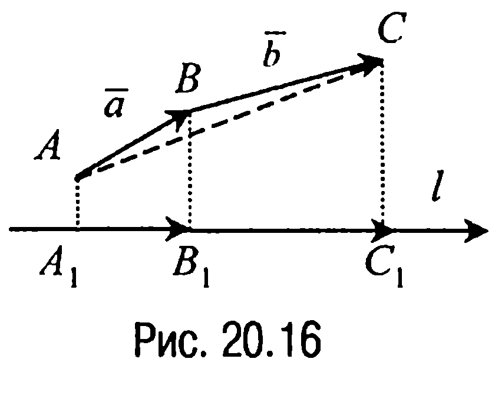

Что же касается второй части теоремы, то она доказывается аналогично. Различие лишь в том, что вместо векторного равенства $\overline{A_1C_1} = \overline{A_1B_1} + \overline{B_1C_1}$ следует использовать равенство $A_1C_1 = A_1B_1 + B_1C_1$, относящееся к отрезкам.

**Замечание 20.2.** Теорема 20.4 справедлива при любом числе слагаемых.

**Теорема 20.5.** *При умножении вектора* $\overline{a}$ *на какое-либо число* $\lambda$ *геометрическая и алгебраическая проекции вектора* $\overline{a}$ *умножаются на то же число* $\lambda$, *т. е.* $\text{Пр}_l \lambda \overline{a} = \lambda \cdot \text{Пр}_l \overline{a}$, $\text{пр}_l \lambda \overline{a} = \lambda \cdot \text{пр}_l \overline{a}$.

**Доказательство.** Из какой-либо точки $C$ оси $l$ (рис. 20.17) проведем векторы $\overline{CA} = \overline{a}$ и $\overline{CB} = \lambda \overline{a}$. Тогда $\overline{CB} = \lambda \overline{CA}$. Теперь если

---
**стр. 269**
---

$\lambda > 0$, то векторы $\overline{CA}$ и $\overline{CB}$ сонаправлены (рис. 20.17) и, значит, сонаправлены векторы $\overline{CA_1}$ и $\overline{CB_1}$, где $A_1$ и $B_1$ — проекции точек $A$ и $B$ на ось $l$. Таким образом, $\overline{CB_1} = \mu \cdot \overline{CA_1}$, где $\mu$ — некоторое положительное число.

Аналогично доказывается, что последнее равенство имеет место и

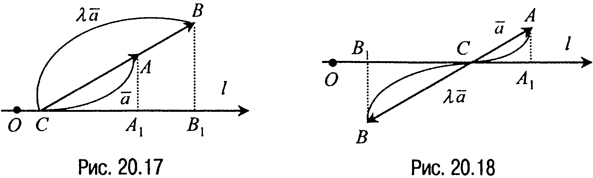

при $\lambda < 0$ (рис. 20.18). Далее, поскольку $|\lambda| = \frac{|\overline{CB}|}{|\overline{CA}|}$, $|\mu| = \frac{|\overline{CB_1}|}{|\overline{CA_1}|}$, а треугольники $CAA_1$ и $CBB_1$ подобны, то $|\lambda| = |\mu|$. А так как по доказанному выше числа $\lambda$ и $\mu$ имеют одинаковые знаки, то $\lambda = \mu$. Но в таком случае равенство $\overline{CB_1} = \mu \overline{CA_1}$ можно переписать в виде $\overline{CB_1} = \lambda \overline{CA_1}$, и, следовательно, $\text{Пр}_l \lambda \bar{a} = \lambda \text{Пр}_l \bar{a}$.

Аналогично доказывается и вторая часть теоремы, надо лишь вместо векторов $\overline{CA_1}$ и $\overline{CB_1}$ рассмотреть их алгебраические величины $CA_1$ и $CB_1$.

Пусть $\bar{a}$ и $\bar{b}$ — два данных вектора. Если вектор $\bar{c}$ представлен в виде $\bar{c} = x \cdot \bar{a} + y \cdot \bar{b}$, где $x$ и $y$ — некоторые числа, то говорят, что **вектор $\bar{c}$ разложен по векторам $\bar{a}$ и $\bar{b}$**. Числа $x$ и $y$ называются **коэффициентами разложения** или **координатами вектора $\bar{c}$**.

**Теорема 20.6.** *Любой вектор* $\bar{c}$ *можно разложить по двум данным неколлинеарным векторам, причем единственным образом.*

**Доказательство.** Пусть $\bar{c} = \overline{AB}$ (рис. 20.19). Проведем через точки $A$ и $B$ прямые, параллельные векторам $\bar{a}$ и $\bar{b}$. Они пересекут-

---
**стр. 270**
---

ся в некоторой точке $C$. Тогда $\overline{AB} = \overline{AC} + \overline{CB}$. Но поскольку векторы $\bar{a}$ и $\overline{AC}$ коллинеарны, то $\overline{AC} = x \cdot \bar{a}$. Коллинеарными являются и векторы $\bar{b}$ и $\overline{CB}$. Поэтому $\overline{CB} = y \cdot \bar{b}$.

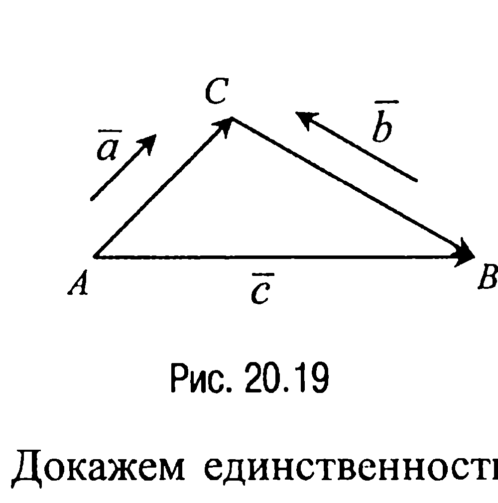

Таким образом, $\bar{c} = \overline{AB} = \overline{AC} + \overline{CB} = x \cdot \bar{a} + y \cdot \bar{b}$.

Докажем единственность полученного разложения. Пусть наряду с полученным разложением имеется другое разложение $\bar{c} = x' \bar{a} + y' \bar{b}$. Тогда очевидно, что $(x - x') \bar{a} + (y - y') \bar{b} = 0$. Но поскольку векторы $\bar{b}$ и $\bar{a}$ неколлинеарны, то $x - x' = 0$, $y - y' = 0$ и, значит, $x = x'$, $y = y'$, что и доказывает требуемое.

Пусть $OX$ и $OY$ — две взаимно перпендикулярные оси на плоскости, составляющие так называемую **прямоугольную систему координат**, где направления осей выбираются таким образом, что поворот оси $OX$ около точки $O$ против движения часовой стрелки на $90^\circ$ переводит ее в ось $OY$. Обычно ось $OX$ (**ось абсцисс**) представляют в виде горизонтальной прямой, направленной вправо, а ось $OY$ (**ось ординат**) — в виде вертикальной прямой, направленной вверх.

Единичные векторы $\bar{i}$ и $\bar{j}$ (координатные векторы или орты) откладывают от начала координат $O$ так, чтобы направление вектора $\bar{i}$ совпало с направлением оси $OX$, а направление вектора $\bar{j}$ — с направлением оси $OY$.

Пусть $\bar{a}$ — произвольный вектор на плоскости. Обозначим его алгебраические проекции на оси $OX$ и $OY$ соответственно через $x$ и $y$, т. е. $x = \text{пр}_{OX} \bar{a}$, $y = \text{пр}_{OY} \bar{a}$.

Проекции $x$ и $y$ вектора $\bar{a}$ на оси координат (**координаты вектора** $\bar{a}$) называют соответственно **абсциссой** и **ординатой вектора** $\bar{a}$. Вектор с координатами $x, y$ обычно обозначают символом $\bar{a}(x; y)$.

---
**стр. 271**
---

**Теорема 20.7.** *Для любого вектора $\bar{a}$ в прямоугольной системе координат на плоскости справедливо равенство $\bar{a} = x \cdot \bar{i} + y \cdot \bar{j}$, где $x$ и $y$ — координаты вектора $\bar{a}$.*

Справедливость теоремы следует из теоремы 20.6, поскольку координатные векторы отличны от нуля и неколлинеарны.

**Теорема 20.8.** *Пусть в прямоугольной системе координат $XOY$ заданы векторы $\bar{a} (x_1; y_1)$ и $\bar{b} (x_2; y_2)$. Тогда в той же системе координат сумма указанных векторов — это вектор $\bar{a} + \bar{b} = \bar{c} (x_1 + x_2; y_1 + y_2)$.*

**Доказательство.** Так как координаты $x, y$ вектора $\bar{a} + \bar{b}$ определяются как алгебраические проекции этого вектора на оси координат: $x = \text{пр}_{OX}(\bar{a} + \bar{b})$, $y = \text{пр}_{OY}(\bar{a} + \bar{b})$, то на основании теоремы 20.4 имеем $x = \text{пр}_{OX}(\bar{a} + \bar{b}) = \text{пр}_{OX} \bar{a} + \text{пр}_{OX} \bar{b} = x_1 + x_2$, $y = \text{пр}_{OY}(\bar{a} + \bar{b}) = \text{пр}_{OY} \bar{a} + \text{пр}_{OY} \bar{b} = y_1 + y_2$, что и доказывает требуемое.

**Теорема 20.9.** *Пусть в прямоугольной системе координат $XOY$ заданы вектор $\bar{a} (x; y)$ и некоторое число $\lambda$. Тогда в той же системе координат вектор $\lambda \bar{a} = \bar{a} (\lambda x; \lambda y)$.*

**Доказательство.** По теореме 20.5 имеют место равенства $\text{пр}_{OX}(\lambda \bar{a}) = \lambda \text{пр}_{OX} \bar{a} = \lambda x$ и $\text{пр}_{OY}(\lambda \bar{a}) = \lambda \text{пр}_{OY} \bar{a} = \lambda y$, откуда и следует справедливость теоремы.

Пусть теперь в прямоугольной системе координат задан вектор $\overline{OA} = \bar{a} (x; y)$.

Вектор $\overline{OA}$ называется **радиусом-вектором точки $A$.** Алгебраические проекции $x$ и $y$ радиуса-вектора $\overline{OA}$ точки $A$ на оси координат называются **координатами точки $A$.**

Таким образом, координаты точки $A$ в прямоугольной системе координат совпадают с координатами радиуса-вектора этой точки.

---
**стр. 272**
---

**Теорема 20.10.** *Если в прямоугольной системе координат заданы точки $A(x_1; y_1)$ и $B(x_2; y_2)$, то вектор $\overline{AB} = \overline{AB}(x_2 - x_1; y_2 - y_1)$.*

**Доказательство.** Очевидно, что $\overline{OA} = \overline{OA}(x_1; y_1)$, а $\overline{OB} = \overline{OB}(x_2; y_2)$.

Обозначим неизвестные координаты вектора $\overline{AB}$ через $x$ и $y$.

Тогда так как $\overline{OB} = \overline{OA} + \overline{AB}$, то согласно теореме 20.8 получаем, что $x_2 = x_1 + x$, $y_2 = y_1 + y$, откуда и следует требуемое.

**20.6. Скалярное произведение векторов**

*Углом между двумя ненулевыми векторами $\bar{a}$ и $\bar{b}$ называется угол между векторами, равными данным и имеющими общее начало.*

*Углом между двумя ненулевыми векторами, имеющими общее начало, называется угол, на сторонах которого лежат данные векторы и общее начало которых совпадает с вершиной угла.*

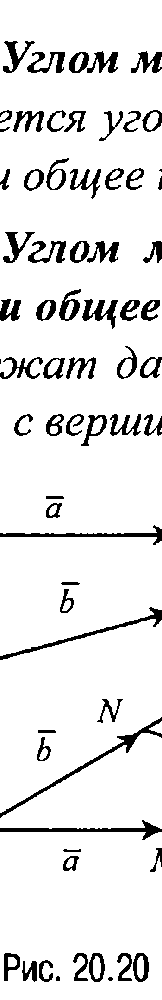

Таким образом, если от некоторой точки $O$ отложить векторы $\bar{a} = \overline{OM}$ и $\bar{b} = \overline{ON}$ (рис. 20.20), то величина угла $MON$ есть по определению угол между векторами $\bar{a}$ и $\bar{b}$.

Этот угол обозначается $(\widehat{\bar{a}, \bar{b}})$.

Если угол между векторами $\bar{a}$ и $\bar{b}$ равен $90^\circ$, то векторы $\bar{a}$ и $\bar{b}$ называются **перпендикулярными** или **ортогональными**.

Перпендикулярность векторов $\bar{a}$ и $\bar{b}$ обозначается так: $\bar{a} \perp \bar{b}$.

Если векторы $\bar{a}$ и $\bar{b}$ сонаправлены, в частности, один из них или оба нулевые, то считается, что угол между векторами $\bar{a}$ и $\bar{b}$ равен $0^\circ$. Угол между противоположно направленными векторами равен $180^\circ$.

---
**стр. 273**
---

*Скалярным произведением двух векторов $\bar{a}$ и $\bar{b}$ называется число, равное произведению длин этих векторов на косинус угла между ними. Скалярное произведение векторов $\bar{a}$ и $\bar{b}$ обозначается $\bar{a} \cdot \bar{b}$ или $\bar{a}\bar{b}$.*

Таким образом, $\bar{a} \cdot \bar{b} = |\bar{a}| \cdot |\bar{b}| \cdot \cos(\widehat{\bar{a}, \bar{b}})$.

Если $\bar{a} \perp \bar{b}$, т. е. если $(\widehat{\bar{a}, \bar{b}}) = 90^\circ$, то $\cos(\widehat{\bar{a}, \bar{b}}) = 0$ и поэтому $\bar{a} \cdot \bar{b} = 0$. Обратно, если $\bar{a} \cdot \bar{b} = 0$ и векторы $\bar{a}$ и $\bar{b}$ ненулевые, то из определения скалярного произведения следует, что $\cos(\widehat{\bar{a}, \bar{b}}) =$ $= 0$ и, следовательно, $(\widehat{\bar{a}, \bar{b}}) = 90^\circ$, т. е. векторы $\bar{a}$ и $\bar{b}$ перпендикулярны.

***Таким образом, скалярное произведение двух ненулевых векторов равно нулю тогда и только тогда, когда эти векторы перпендикулярны.***

Если $\bar{a} \uparrow\uparrow \bar{b}$, то $\bar{a} \cdot \bar{b} = |\bar{a}| \cdot |\bar{b}|$. В частности, $\bar{a} \cdot \bar{a} = |\bar{a}|^2$.

Скалярное произведение $\bar{a} \cdot \bar{a}$ называется ***скалярным квадратом вектора $\bar{a}$ и обозначается $\bar{a}^2$.***

Итак, *скалярный квадрат вектора равен квадрату его длины*, т. е. $\bar{a}^2 = a^2$.

**Теорема 20.11.** Пусть в прямоугольной системе координат заданы векторы $\bar{a}(x_1; y_1)$ и $\bar{b}(x_2; y_2)$. Тогда $\bar{a} \cdot \bar{b} = x_1 x_2 + y_1 y_2$.

**Доказательство.** В силу теоремы 20.7 имеем $\bar{a} = x_1 \cdot \bar{i} + y_1 \cdot \bar{j}$, $\bar{b} = x_2 \cdot \bar{i} + y_2 \cdot \bar{j}$ (рис. 20.21).

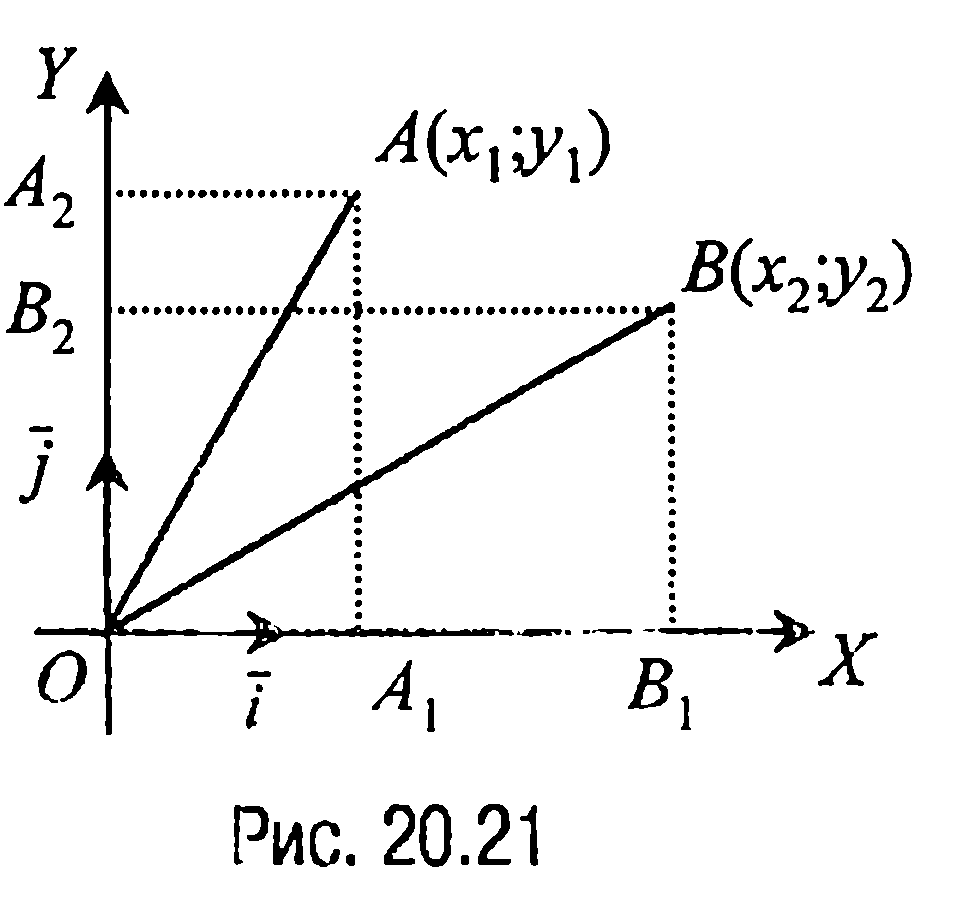

А тогда поскольку $\bar{i}^2 = \bar{j}^2 = 1$, $\bar{i} \cdot \bar{j} = 0$, то $\bar{a} \cdot \bar{b} = (x_1 \cdot \bar{i} + y_1 \cdot \bar{j})(x_2 \cdot \bar{i} + y_2 \cdot \bar{j}) =$ $= x_1 \cdot x_2 \bar{i}^2 + x_1 \cdot y_2 \bar{i} \cdot \bar{j} + x_2 \cdot y_1 \bar{i} \cdot \bar{j} + y_1 \cdot y_2 \bar{j}^2 = x_1 x_2 + y_1 y_2$, что и доказывает требуемое.

---
**стр. 274**
---

**Следствие 20.1.** Скалярный квадрат $\bar{a}^2$ вектора $\bar{a}(x; y)$ вычисляется по формуле $\bar{a}^2 = |\bar{a}|^2 = x^2 + y^2$.

**Теорема 20.12.** *Пусть в прямоугольной системе координат заданы точки $A(x_1; y_1)$ и $B(x_2; y_2)$. Тогда длина отрезка $AB$ равна $|\overline{AB}| = \sqrt{(x_2 - x_1)^2 + (y_2 - y_1)^2}$.*

**Доказательство.** По теореме 20.10 вектор $\overline{AB} = \overline{AB}(x_2 - x_1; y_2 - y_1)$, а тогда $\overline{AB}^2 = |\overline{AB}|^2 = (x_2 - x_1)^2 + (y_2 - y_1)^2$, откуда и следует теорема 20.12.

**Теорема 20.13.** *Пусть в прямоугольной системе координат заданы ненулевые векторы $\bar{a}(x_1; y_1)$ и $\bar{b}(x_2; y_2)$. Тогда косинус угла $\varphi$ между векторами $\bar{a}$ и $\bar{b}$ определяется по формуле*

$$\cos\varphi = \frac{x_1 x_2 + y_1 y_2}{\sqrt{x_1^2 + y_1^2} \cdot \sqrt{x_2^2 + y_2^2}}.$$

**Доказательство.** По определению скалярного произведения

$$\bar{a} \cdot \bar{b} = |\bar{a}| \cdot |\bar{b}| \cdot \cos(\widehat{\bar{a}, \bar{b}}) = |\bar{a}| \cdot |\bar{b}| \cdot \cos\varphi.$$

Поэтому $\cos\varphi = \frac{\bar{a} \cdot \bar{b}}{|\bar{a}| \cdot |\bar{b}|}$. Подставив теперь в полученное равенство вместо $\bar{a} \cdot \bar{b}$, $|\bar{a}|$ и $|\bar{b}|$ их выражения через координаты векторов $\bar{a}$ и $\bar{b}$, получим искомую формулу.

**Свойства скалярного произведения.**

Для любых векторов $\bar{a}$, $\bar{b}$ и $\bar{c}$ и любого числа $\lambda$ справедливы равенства:

$1^0$. $\bar{a} \cdot \bar{b} = \bar{b} \cdot \bar{a}$ — *переместительный (коммутативный) закон;*

$2^0$. $(\lambda\bar{a}) \cdot \bar{b} = \lambda(\bar{a} \cdot \bar{b})$ — *сочетательный (ассоциативный) закон относительно умножения вектора на число;*

$3^0$. $(\bar{a} + \bar{b}) \cdot \bar{c} = \bar{a} \cdot \bar{c} + \bar{b} \cdot \bar{c}$ — *распределительный (дистрибутивный) закон относительно сложения векторов.*

**Доказательство.** $1^0$. Справедливость этого свойства непосредственно следует из определения скалярного произведения.

---
**стр. 275**
---

$2^0$. Пусть $\bar{a} = \bar{a}(x_1; y_1)$, $\bar{b} = \bar{b}(x_2; y_2)$. Тогда по теореме 20.9 вектор $\lambda\bar{a} = \bar{\omega}(\lambda x_1; \lambda y_1)$. Но в таком случае $(\lambda\bar{a})\bar{b} = \bar{\omega}(\lambda x_1; \lambda y_1) \cdot \bar{b}(x_2; y_2) =$ $= \lambda \cdot x_1 \cdot x_2 + \lambda \cdot y_1 \cdot y_2 = \lambda \cdot (x_1 \cdot x_2 + y_1 \cdot y_2) = \lambda \cdot (\bar{a} \cdot \bar{b})$.

$3^0$. Пусть снова $\bar{a} = \bar{a}(x_1; y_1)$, $\bar{b} = \bar{b}(x_2; y_2)$, а $\bar{c} = \bar{c}(x_3; y_3)$. Тогда по теореме 20.8 имеем $\bar{a} + \bar{b} = \bar{\gamma}(x_1 + x_2; y_1 + y_2)$ и, значит, $(\bar{a} + \bar{b}) \cdot \bar{c} = \bar{\gamma}(x_1 + x_2; y_1 + y_2) \bar{c}(x_3; y_3) = (x_1 + x_2)x_3 + (y_1 + y_2)y_3 =$ $= x_1 \cdot x_3 + x_2 \cdot x_3 + y_1 \cdot y_3 + y_2 \cdot y_3 = (x_1 \cdot x_3 + y_1 \cdot y_3) + (x_2 \cdot x_3 + y_2 \cdot y_3) =$ $= \bar{a} \cdot \bar{c} + \bar{b} \cdot \bar{c}$, что и требовалось доказать.

**ЗАДАЧИ**

▼ **20.1.** *В каком отношении каждую из биссектрис треугольника $ABC$ делит их точка пересечения $O$, если $BC = a$, $CA = b$, $AB = c$?*

**Решение.** Пусть биссектриса угла $CAB$ пересекает сторону $BC$ в точке $D$ (рис. 20.22). Тогда по теореме 20.1

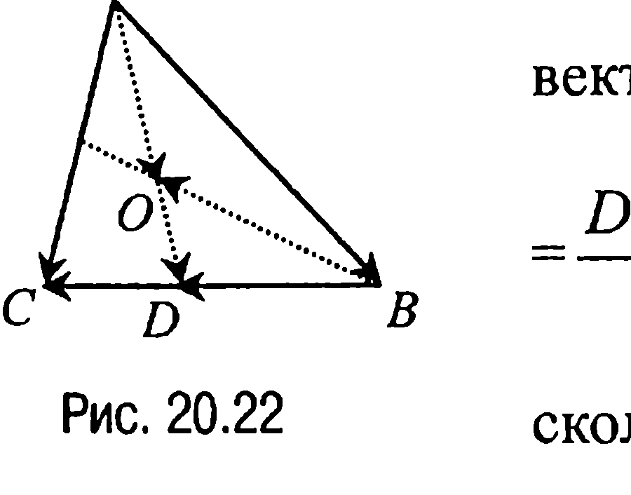

вектор $\overline{AD} = \frac{DB}{CD + DB}\overline{AC} + \frac{CD}{CD + DB}\overline{AB} =$ $= \frac{DB \cdot \overline{AC} + CD \cdot \overline{AB}}{CD + DB}$. С другой стороны, поскольку $\frac{DB}{CD} = \frac{AB}{AC}$ (свойство 8.7Х), то полученное равенство можно переписать в виде $\overline{AD} = \frac{AB \cdot \overline{AC} + AC \cdot \overline{AB}}{AB + AC} = \frac{b\bar{c} - c\bar{b}}{b + c}$. Далее, так как $DC = BC - BD$, то из равенства $\frac{DB}{CD} = \frac{AB}{AC}$ следует, что $BD = \frac{AB}{AB + AC} BC$ и, значит, $\overline{BD} = \frac{AB}{AB + AC}\overline{BC} = \frac{c}{b + c}\bar{a}$.

Замечая теперь, что отрезок $BO$ является биссектрисой треугольника $ABD$, по аналогии с предыдущим имеем $\overline{BO} =$

---
**стр. 276**
---

$=\frac{-\frac{a \cdot c}{b+c} \bar{c} + \frac{c \cdot c}{b+c} \bar{a}}{c + \frac{a \cdot c}{b+c}} = \frac{-a\bar{c} + c\bar{a}}{a+b+c}$. С учетом этого $\overline{AO} = \overline{AB} + \overline{BO} =$

$=\bar{c} + \frac{c\bar{a} - a\bar{c}}{a + b + c} = \frac{b\bar{c} - c\bar{b}}{a + b + c}$. Но так как векторы $\overline{AO}$ и $\overline{AD}$ коллинеарны, получаем, что $|\overline{AO}| : |\overline{OD}| = |\overline{AO}| : |\overline{AD} - \overline{AO}| =$

$= \left|\frac{b\bar{c} - c\bar{b}}{a + b + c}\right| : \left|\frac{b\bar{c} - c\bar{b}}{b + c} - \frac{b\bar{c} - c\bar{b}}{a + b + c}\right| = \left|\frac{b\bar{c} - c\bar{b}}{a + b + c}\right| : \left|\frac{a(b\bar{c} - c\bar{b})}{(b + c)(a + b + c)}\right| =$

$= \frac{|b\bar{c} - c\bar{b}|}{a + b + c} : \frac{a|b\bar{c} - c\bar{b}|}{(b + c)(a + b + c)} = \frac{b + c}{a}$. Аналогично находим и два других отношения: $\frac{c + a}{b}$ и $\frac{a + b}{c}$.

**Ответ:** точкой пересечения биссектрис треугольника $ABC$ углов $CAB, ABC$ и $BCA$ делятся соответственно в отношениях $\frac{b+c}{a}$, $\frac{c+a}{b}$ и $\frac{a+b}{c}$, считая от вершины.

**20.2.** Пусть $R$ — радиус окружности, описанной около правильного $n$-угольника. Найти сумму квадратов его сторон и диагоналей, выходящих из одной вершины.

**Решение.** Пусть $O$ — центр окружности, описанной около правильного $n$-угольника $A_1A_2 \dots A_n$ (рис. 20.23), а $\bar{c}$ — вектор, являющийся суммой $n$ векторов $\overline{OA_1}, \overline{OA_2}, \dots, \overline{OA_n}$. При повороте вокруг точки $O$ на угол $\frac{360^{\circ}}{n}$ система $n$ векторов перейдет сама в себя (векторы поменяются лишь только местами) и поэтому их суммарный вектор $\bar{c}$ при повороте должен остаться прежним. Последнее означает, что $\bar{c} = \bar{0}$,

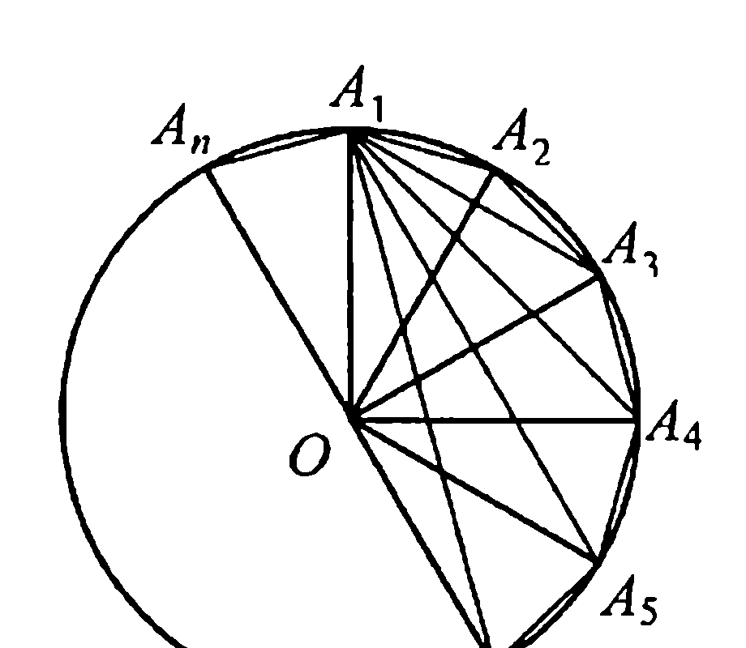

---
**стр. 277**
---

т. е. $\overline{OA_1} + \overline{OA_2} + \dots + \overline{OA_n} = \overline{0}$, или $\overline{OA_2} + \overline{OA_3} + \dots + \overline{OA_n} = -\overline{OA_1}$.

Далее, так как $\overline{A_1A_2} = \overline{OA_2} - \overline{OA_1}$, $\overline{A_1A_3} = \overline{OA_3} - \overline{OA_1}$, $\dots$, $\overline{A_1A_n} =$
$= \overline{OA_n} - \overline{OA_1}$, а значит, $\overline{A_1A_2}^2 = \overline{OA_2}^2 - 2\overline{OA_2} \cdot \overline{OA_1} + \overline{OA_1}^2$, $\overline{A_1A_3}^2 =$
$= \overline{OA_3}^2 - 2\overline{OA_3} \cdot \overline{OA_1} + \overline{OA_1}^2$, $\dots$, $\overline{A_1A_n}^2 = \overline{OA_n}^2 - 2\overline{OA_n} \cdot \overline{OA_1} + \overline{OA_1}^2$, то

$A_1A_2^2 + A_1A_3^2 + \dots + A_1A_n^2 = OA_2^2 - 2\overline{OA_2} \cdot \overline{OA_1} + OA_1^2 + OA_3^2 -$
$- 2\overline{OA_3} \cdot \overline{OA_1} + OA_1^2 + \dots + OA_n^2 - 2\overline{OA_n} \cdot \overline{OA_1} + OA_1^2 = OA_2^2 +$
$+ OA_3^2 + \dots + OA_n^2 + (n - 1)OA_1^2 - 2\overline{OA_1}(\overline{OA_2} + \overline{OA_3} + \dots + \overline{OA_n}) =$
$= OA_1^2 + OA_2^2 + \dots + OA_n^2 + nOA_1^2 = 2nR^2$.

**Ответ:** $2nR^2$.

**20.3.** Пусть $O$ — точка пересечения медиан треугольника $ABC$. Доказать, что для произвольной точки $D$ выполняется равенство
$$DO^2 = \frac{1}{3}(DA^2 + DB^2 + DC^2) - \frac{1}{9}(AB^2 + BC^2 + CA^2).$$
**Решение.** Так как $\overline{DA} = \overline{DO} + \overline{OA}$, $\overline{DB} = \overline{DO} + \overline{OB}$, $\overline{DC} = \overline{DO} + \overline{OC}$ (рис. 20.24), то $\overline{DA} + \overline{DB} + \overline{DC} = 3\overline{DO} + \overline{OA} + \overline{OB} + \overline{OC}$ или, поскольку $\overline{OA} + \overline{OB} + \overline{OC} = \overline{0}$ (что очевидно), $3\overline{DO} = \overline{DA} + \overline{DB} + \overline{DC}$.

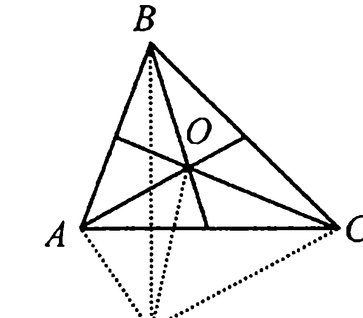

С другой стороны, $DA^2 = \overline{DA}^2 = (\overline{DO} + \overline{OA})^2 = DO^2 + OA^2 + 2\overline{DO} \cdot \overline{OA}$, $DB^2 = \overline{DB}^2 = (\overline{DO} + \overline{OB})^2 = DO^2 + OB^2 + 2\overline{DO} \cdot \overline{OB}$, $DC^2 = \overline{DC}^2 = (\overline{DO} + \overline{OC})^2 = DO^2 + OC^2 + 2\overline{DO} \cdot \overline{OC}$, откуда $DA^2 + DB^2 + DC^2 = 3DO^2 + OA^2 + OB^2 + OC^2 + 2\overline{DO}(\overline{OA} + \overline{OB} + \overline{OC}) = 3DO^2 + OA^2 + OB^2 + OC^2$ и, значит,
$$DO^2 = \frac{1}{3}(DA^2 + DB^2 + DC^2) - \frac{1}{3}(OA^2 + OB^2 + OC^2).$$
Замечая же, что $\overline{AO} = \frac{1}{3}(\overline{AB} + \overline{AC})$, $\overline{BO} = \frac{1}{3}(\overline{BA} + \overline{BC})$, $\overline{CO} =$

---
**стр. 278**
---

$=\frac{1}{3}(\overline{CA}+\overline{CB})$, а следовательно, $OA^2 = \frac{1}{9}(AB^2 + CA^2 + 2\overline{AB} \cdot \overline{AC})$,
$OB^2 = \frac{1}{9}(AB^2 + BC^2 + 2\overline{BA} \cdot \overline{BC})$, $OC^2 = \frac{1}{9}(CA^2 + BC^2 + 2\overline{CA} \cdot \overline{CB})$,
получаем равенство $DO^2 = \frac{1}{3}(DA^2 + DB^2 + DC^2) - \frac{1}{27}(2AB^2 +$
$+ 2BC^2 + 2CA^2 + 2\overline{AB} \cdot \overline{AC} + 2\overline{BA} \cdot \overline{BC} + 2\overline{CA} \cdot \overline{CB})$.

Далее, если воспользоваться формулой для вычисления длины медианы треугольника, то из равенств
$\left(\frac{\overline{AB} + \overline{AC}}{2}\right)^2 = \left(\frac{\sqrt{2AB^2 + 2AC^2 - BC^2}}{2}\right)^2$, $\left(\frac{\overline{BA} + \overline{BC}}{2}\right)^2 =$
$= \left(\frac{\sqrt{2AB^2 + 2BC^2 - AC^2}}{2}\right)^2$, $\left(\frac{\overline{CA} + \overline{CB}}{2}\right)^2 = \left(\frac{\sqrt{2CA^2 + 2BC^2 - AB^2}}{2}\right)^2$

находим, что
$2\overline{AB} \cdot \overline{AC} = AB^2 + AC^2 - BC^2$, $2\overline{BA} \cdot \overline{BC} = AB^2 + BC^2 - CA^2$,
$2\overline{CA} \cdot \overline{CB} = BC^2 + CA^2 - AB^2$ и, таким образом,
$DO^2 = \frac{1}{3}(DA^2 + DB^2 + DC^2) - \frac{1}{27}(2AB^2 + 2BC^2 + 2CA^2 + AB^2 +$
$+ AC^2 - BC^2 + AB^2 + BC^2 - CA^2 + BC^2 + CA^2 - AB^2) = \frac{1}{3}(DA^2 +$
$+ DB^2 + DC^2) - \frac{1}{9}(AB^2 + BC^2 + CA^2)$, а это и требовалось доказать.

▼ **Замечание 20.3.** Из доказанной формулы, в частности, следует, что если $D$ — точка пересечения медиан треугольника $ABC$, то $OA^2 + OB^2 + OC^2 = \frac{1}{3}(AB^2 + BC^2 + CA^2)$.

**20.4.** Доказать, что если $A, B, C, D$ — произвольные точки плоскости, а $E$ и $F$ — середины отрезков $AC$ и $BD$, то $AB^2 + BC^2 + CD^2 + DA^2 = AC^2 + BD^2 + 4EF^2$.

**Решение.** Пусть $G$ — произвольная точка плоскости, отличная от точек $A, B, C, D$. Тогда по правилу сложения (вычитания) векторов находим, что

---
**стр. 279**
---

$\overline{AB}=\overline{GB}-\overline{GA}$, $\overline{BC}=\overline{GC}-\overline{GB}$, $\overline{CD}=\overline{GD}-\overline{GC}$, $\overline{DA}=\overline{GA}-\overline{GD}$,

$\overline{AC}=\overline{GC}-\overline{GA}$, $\overline{BD}=\overline{GD}-\overline{GB}$, $\overline{EF}=\overline{GF}-\overline{GE}=\frac{1}{2}(\overline{GB}+\overline{GD}-\overline{GA}-\overline{GC})$.

Отсюда следует, что

$AC^2+BD^2+4EF^2=\overline{GC}^2-2\overline{GC}\cdot\overline{GA}+\overline{GA}^2+\overline{GD}^2-2\overline{GD}\cdot\overline{GB}+$

$+\overline{GB}^2+\overline{GB}^2+\overline{GD}^2+\overline{GA}^2+\overline{GC}^2+2\overline{GB}\cdot\overline{GD}-2\overline{GB}\cdot\overline{GA}-$

$-2\overline{GB}\cdot\overline{GC}-2\overline{GD}\cdot\overline{GA}-2\overline{GD}\cdot\overline{GC}+2\overline{GA}\cdot\overline{GC}=(\overline{GB}^2-$

$-2\overline{GB}\cdot\overline{GA}+\overline{GA}^2)+(\overline{GC}^2-2\overline{GC}\cdot\overline{GB}+\overline{GB}^2)+(\overline{GD}^2-2\overline{GD}\cdot\overline{GC}+$

$+\overline{GC}^2)+(\overline{GA}^2-2\overline{GA}\cdot\overline{GD}+\overline{GD}^2)=(\overline{GB}-\overline{GA})^2+(\overline{GC}-\overline{GB})^2+$

$+(\overline{GD}-\overline{GC})^2+(\overline{GA}-\overline{GD})^2=\overline{AB}^2+\overline{BC}^2+\overline{CD}^2+\overline{DA}^2=AB^2+$

$+BC^2+CD^2+DA^2$, что и требовалось доказать.

**20.5.** *На сторонах $AB$ и $BC$ треугольника $ABC$ отмечены точки $M$ и $N$ соответственно таким образом, что $AB : AM = 5 : 1$, а $BC : BN = 3 : 1$. Отрезки $AN$ и $CM$ пересекаются в точке $O$. Найти отношение площадей треугольников $AOC$ и $ABC$.*

**Решение.** Из условия задачи следует, что $\overline{BM} = \frac{4}{5} \overline{BA}$, $\overline{BN} = \frac{1}{3} \overline{BC}$

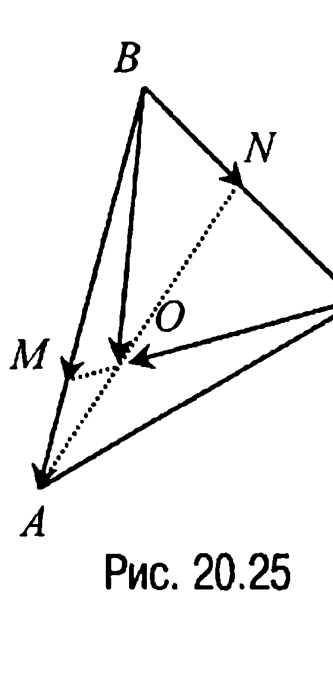

(рис. 20.25). Тогда так как точка $O$ принадлежит прямым $AN$ и $CM$, то по теореме 20.2

$\overline{BO} = \lambda \overline{BM} + (1 - \lambda) \overline{BC} = \mu \overline{BA} + (1 - \mu) \overline{BN}$

или $\frac{4}{5} \lambda \overline{BA} + (1 - \lambda) \overline{BC} = \mu \overline{BA} + \frac{1}{3} (1 - \mu) \overline{BC},$

откуда для нахождения $\lambda$ и $\mu$ приходим к системе

$$\begin{cases} \frac{4}{5}\lambda = \mu, \\ 1-\lambda = \frac{1}{3}(1-\mu). \end{cases}$$

Решая эту систему, находим, что $\lambda = \frac{10}{11}$, $\mu = \frac{8}{11}$. А поскольку соотношение $\overline{BO} = \lambda \overline{BM} + (1 - \lambda) \overline{BC}$ можно переписать в виде $\overline{CO} = \lambda \overline{CM}$, то

---
**стр. 280**
---

$\overline{CO} = \frac{10}{11} \overline{CM}$ и, значит, $\frac{CO}{CM} = \frac{10}{11}$. Замечая теперь, что $\frac{S_{\Delta AMC}}{S_{\Delta ABC}} = \frac{1}{5}$,

а $\frac{S_{\Delta AOC}}{S_{\Delta AMC}} = \frac{10}{11}$, приходим к выводу, что $\frac{S_{\Delta AOC}}{S_{\Delta ABC}} = \frac{1}{5} \cdot \frac{10}{11} = \frac{2}{11}$.

**Ответ:** $\frac{S_{\Delta AOC}}{S_{\Delta ABC}} = \frac{2}{11}$.

**20.6.** *Доказать, что если точки $E$, $F$, $G$, $H$ делят стороны $AB$, $BC$, $CD$, $DA$ параллелограмма $ABCD$ в одном и том же отношении $m : n$, считая от вершин $A$, $B$, $C$, $D$ соответственно, то четырехугольник $EFGH$ — параллелограмм.*

**Решение.** Из условия задачи имеем $AE : EB = BF : FC = CG : GD = DH : HA = m : n$. Обозначим $\overline{AB} = \bar{a}$, $\overline{AD} = \bar{b}$

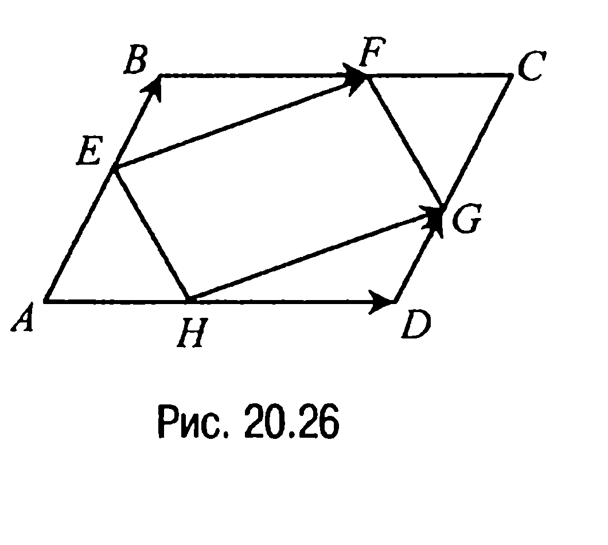

(рис. 20.26). Тогда $\overline{EB} = \frac{n}{m+n} \bar{a}$, $\overline{BF} = \frac{m}{m+n} \bar{b}$ и, значит, $\overline{EF} = \overline{EB} + \overline{BF} = \frac{n}{m+n} \bar{a} + \frac{m}{m+n} \bar{b}$. Далее, $\overline{HD} = \frac{m}{m+n} \bar{b}$, $\overline{DG} = \frac{n}{m+n} \bar{a}$ и, таким образом, $\overline{HG} = \overline{HD} + \overline{DG} = \frac{m}{m+n} \bar{b} + \frac{n}{m+n} \bar{a} = \frac{n}{m+n} \bar{a} + \frac{m}{m+n} \bar{b}$. Итак, $\overline{EF} = \overline{HG}$, откуда следует, что $|\overline{EF}| = |\overline{HG}|$ и $\overline{EF} \parallel \overline{HG}$, т. e. что у четырехугольника $EFGH$ противоположные стороны $EF$ и $HG$ равны и параллельны. А это и означает, что четырехугольник $EFGH$ является параллелограммом.

**20.7.** *На сторонах $AB$, $BC$ и $AC$ треугольника $ABC$ отмечены точки $M$, $N$ и $P$ соответственно таким образом, что $AM : MB = BN : NC = CP : PA = m : n$. Доказать, что точки пересечения медиан треугольников $ABC$ и $MNP$ совпадают.*

**Решение.** Пусть $\overline{AC} = \bar{a}$, $\overline{AB} = \bar{b}$, $O$ и $O_1$ — точки пересечения медиан треугольников $ABC$ и $MNP$ соответственно (рис. 20.27).

---
**стр. 281**
---

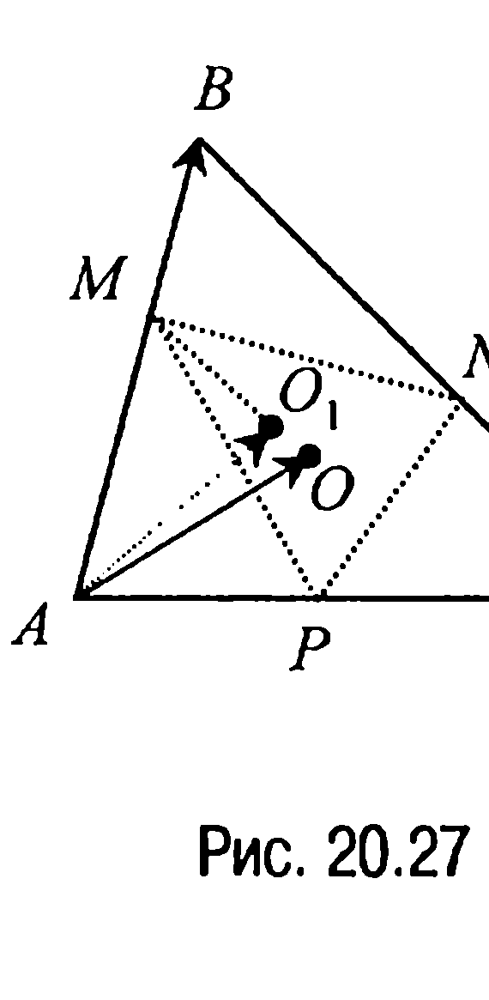

Тогда $\overline{AO} = \frac{1}{3}(\overline{AB} + \overline{AC}) = \frac{1}{3}(\bar{a} + \bar{b})$.

С другой стороны,

$\overline{MO_1} = \frac{1}{3}(\overline{MN} + \overline{MP}) = \frac{1}{3}(\overline{MB} + \overline{BN} + \overline{AP} -$

$- \overline{AM}) = \frac{1}{3} \left( \frac{n}{m+n}\bar{b} + \frac{m}{m+n}(\bar{a} - \bar{b}) + \right.$

$\left. \frac{n}{m+n}\bar{a} - \frac{m}{m+n}\bar{b} \right) = \frac{1}{3} \left( \bar{a} + \frac{n-2m}{m+n}\bar{b} \right)$

и, таким образом,

$\overline{AO_1} = \overline{AM} + \overline{MO_1} = \frac{m}{m+n}\bar{b} + \frac{1}{3}\bar{a} + \frac{1}{3} \cdot \frac{n-2m}{m+n}\bar{b} = \frac{1}{3}\bar{a} + \frac{1}{3}\bar{b} =$

$= \frac{1}{3}(\bar{a} + \bar{b})$, откуда следует, что $\overline{AO} = \overline{AO_1}$. Последнее равенство означает, что точки $O$ и $O_1$ совпадают, что и доказывает требуемое.

**20.8.** *Около треугольника $ABC$ описана окружность. Продолжение медианы $CC_1$ треугольника за точку $C_1$ пересекает описанную окружность в точке $D$. Доказать, что $CA^2 + CB^2 = 2 CC_1 \cdot CD$.*

**Решение.** Из условия задачи следует, что $\overline{CA} = \overline{C_1A} + \overline{CC_1}$

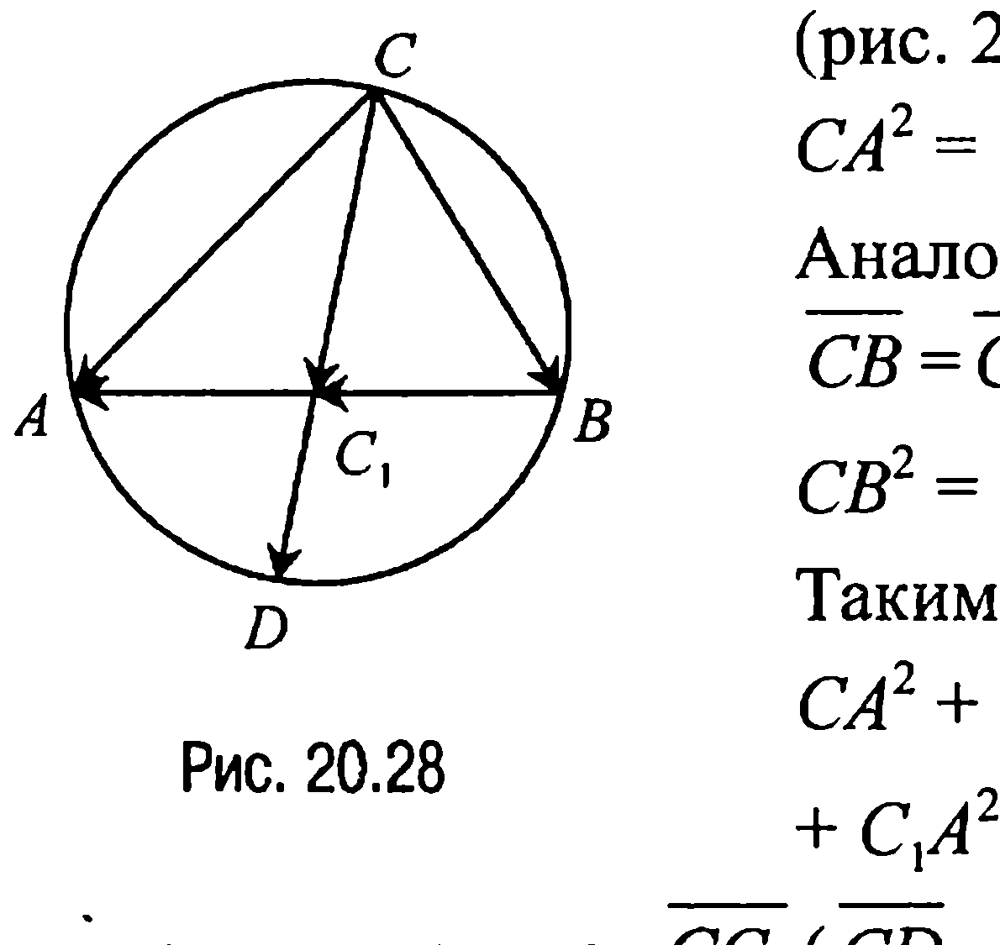

(рис. 20.28), поэтому

$CA^2 = C_1A^2 + CC_1^2 + 2\overline{C_1A} \cdot \overline{CC_1}$.

Аналогично

$\overline{CB} = \overline{CC_1} - \overline{BC_1} = \overline{CC_1} - \overline{C_1A}$ и, значит,

$CB^2 = CC_1^2 + C_1A^2 - 2\overline{CC_1} \cdot \overline{C_1A}$.

Таким образом,

$CA^2 + CB^2 = C_1A^2 + 2\overline{C_1A} \cdot \overline{CC_1} + 2 CC_1^2 +$

$+ C_1A^2 - 2\overline{CC_1} \cdot \overline{C_1A} = 2(CC_1^2 + C_1A^2)$.

Замечая теперь, что $\overline{CC_1}(\overline{CD} - \overline{C_1D}) = \overline{CC_1}^2 = CC_1^2$ или $\overline{CC_1} \cdot \overline{CD} =$

$= CC_1^2 + \overline{CC_1} \cdot \overline{C_1D}$, а $\overline{CC_1} \cdot \overline{C_1D} = CC_1 \cdot C_1D = AC_1 \cdot C_1B = AC_1^2$, приходим к выводу, что $\overline{CC_1} \cdot \overline{CD} = CC_1^2 + AC_1^2$.

---
**стр. 282**
---

Но в таком случае $CA^2 + CB^2 = 2(CC_1^2 + C_1A^2) = 2 CC_1 \cdot CD =$
$= 2CC_1 \cdot CD$, что и требовалось доказать.

**20.9.** *Доказать, что если $a$, $b$, $c$, $d$ — последовательные стороны, $\varphi$ — острый угол между диагоналями выпуклого четырехугольника, то его площадь*

$$S = \frac{1}{4}|a^2 - b^2 + c^2 - d^2| \cdot \text{tg}\varphi.$$

**Решение.** Пусть $ABCD$ — данный четырехугольник, у которого $AB = a$, $BC = b$, $CD = c$, $DA = d$, $\varphi = (\widehat{\overline{AC}, \overline{BD}})$ (рис. 20.29).

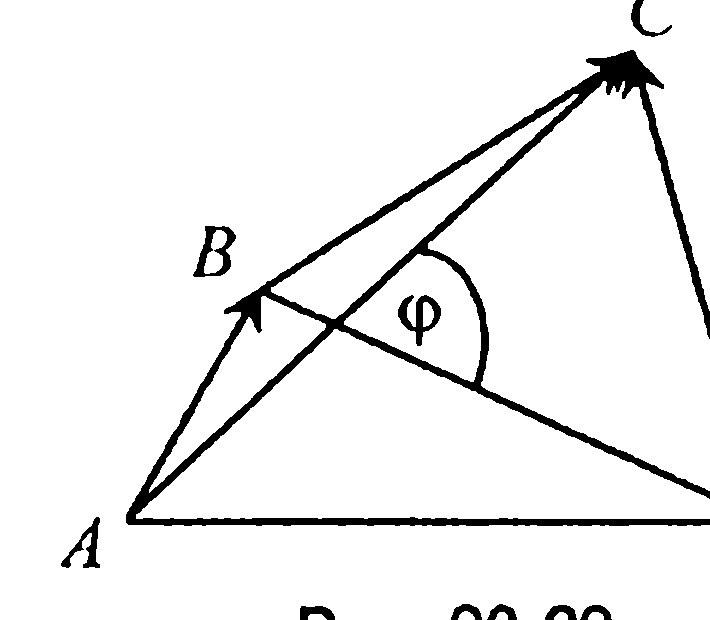

Для вычисления площади $S$ четырехугольника воспользуемся формулой $S = \frac{1}{2} AC \cdot BD \cdot \sin\varphi$ или формулой $S = \frac{1}{2} AC \cdot BD \cdot \cos\varphi \cdot \text{tg}\varphi = \frac{1}{2}\overline{AC} \cdot \overline{BD} \cdot \text{tg}\varphi$. А тогда, замечая, что

$\overline{AC} \cdot \overline{BD} = \overline{AC}(\overline{AD} - \overline{AB}) = \overline{AC} \cdot \overline{AD} - \overline{AC} \cdot \overline{AB} = \frac{1}{2}(2\overline{AC} \cdot \overline{AD} -$

$- 2\overline{AC} \cdot \overline{AB}) = \frac{1}{2}(\overline{AC}^2 + \overline{AD}^2 - (\overline{AC} - \overline{AD})^2 - (\overline{AC}^2 + \overline{AB}^2 - (\overline{AC} -$

$\overline{AB})^2) = \frac{1}{2}(\overline{AC}^2 + \overline{AD}^2 - \overline{DC}^2 - \overline{AC}^2 - \overline{AB}^2 + \overline{BC}^2) = \frac{1}{2}(\overline{BC}^2 - \overline{CD}^2 +$

$+ \overline{DA}^2 - \overline{AB}^2)$, приходим к выводу, что $S = \frac{1}{4}|\overline{BC}^2 - \overline{CD}^2 + \overline{DA}^2 - \overline{AB}^2| \cdot \text{tg}\varphi = \frac{1}{4}|a^2 - b^2 + c^2 - d^2| \cdot \text{tg}\varphi$.

**20.10.** *В окружность с центром $O$ вписан четырехугольник $ABCD$, диагонали которого, пересекающиеся в точке $P$, взаимно перпендикулярны. Доказать, что середины сторон $AB$ и $CD$, центр окружности $O$ и точка $P$ являются вершинами параллелограмма.*

**Решение.** Пусть точки $M$ и $N$ — середины сторон $AB$ и $CD$ заданного четырехугольника соответственно (рис. 20.30).

---
**стр. 283**
---

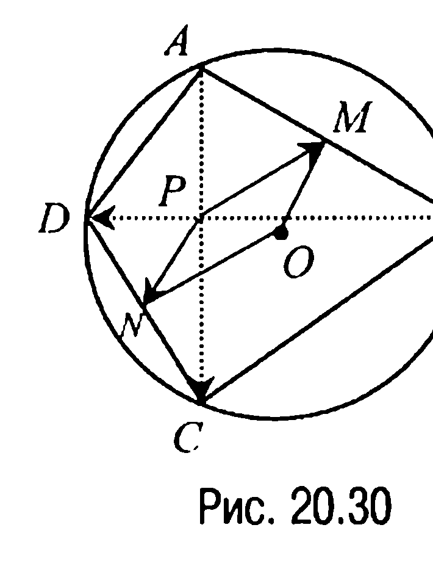

Тогда $\overline{PM} \cdot \overline{DC} = \frac{1}{2}(\overline{PA} + \overline{PB})(\overline{PC} - \overline{PD}) =$

$= \frac{1}{2}(\overline{PA} \cdot \overline{PC} - \overline{PA} \cdot \overline{PD} + \overline{PB} \cdot \overline{PC} - \overline{PB} \cdot \overline{PD}) = 0$,

поскольку по условию $\overline{PA} \cdot \overline{PD} = 0$, $\overline{PB} \cdot \overline{PC} = 0$, а $\overline{PA} \cdot \overline{PC} = \overline{PB} \cdot \overline{PD}$.

Но в таком случае $\overline{PM} \perp \overline{DC}$ и, значит, $\overline{ON} \parallel \overline{PM}$, так как $\overline{ON} \perp \overline{DC}$.

Аналогично доказывается, что $\overline{PN} \cdot \overline{AB} = 0$ и, следовательно, $\overline{PN} \parallel \overline{OM}$, что и требовалось доказать.

**20.11.** *Даны две различные точки $A$ и $B$. Найти множество точек $\mathfrak{M}$ такое, что при заданном $d \neq 0$ для любой точки $M \in \mathfrak{M}$ выполняется равенство $MA^2 + MB^2 = d^2$.*

**Решение.** Пусть $M^* \in \mathfrak{M}$ — произвольная точка множества $\mathfrak{M}$.

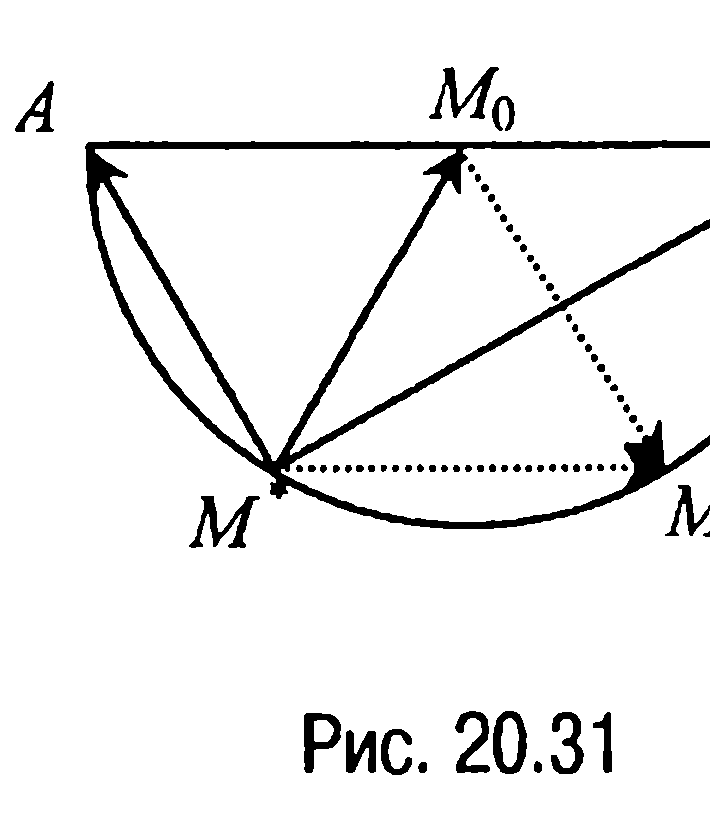

Тогда (рис. 20.31) в соответствии с условием задачи должно выполняться равенство

$(\overline{M^*A} - \overline{M^*M})^2 + (\overline{M^*B} - \overline{M^*M})^2 = d^2$

или

$2\overline{M^*M}^2 - 2\overline{M^*M} \cdot (\overline{M^*A} + \overline{M^*B}) = d^2 - \overline{M^*A}^2 - \overline{M^*B}^2$, откуда следует, что

$$\left(\overline{M^*M} - \frac{\overline{M^*A} + \overline{M^*B}}{2}\right)^2 = \frac{1}{4}\left(2d^2 - (\overline{M^*A} - \overline{M^*B})^2\right).$$

Обозначим через $M_0$ серединную точку отрезка $AB$. Тогда последнее соотношение можно переписать или в виде

$$(\overline{M^*M} - \overline{M^*M_0})^2 = \frac{1}{4}\left(2d^2 - (\overline{M^*A} - \overline{M^*B})^2\right),$$

---
**стр. 284**
---

или в виде $\overline{M_0M}^2 = \frac{1}{4}(2d^2 - \overline{BA}^2)$, или в виде $M_0M^2 = \frac{1}{4}(2d^2 - AB^2)$.

Отсюда получаем

**Ответ:** если $d^2 > \frac{1}{2}AB^2$, то множество $\mathfrak{M}$ — это окружность радиуса $\frac{1}{2}\sqrt{2d^2 - AB^2}$ с центром в середине отрезка $AB$;

если $d^2 = \frac{1}{2}AB^2$, то множество $\mathfrak{M}$ — это одна точка — середина отрезка $AB$;

если $d^2 < \frac{1}{2}AB^2$, то множество $\mathfrak{M} = \varnothing$.

**20.12.** *Точки $A(1; 0)$, $B(2; 1)$ и $C(1; 2)$ являются тремя последовательными вершинами параллелограмма. Найти четвертую его вершину $D$ и угол между диагоналями.*

**Решение.** Пусть $D = D(x; y)$ — четвертая вершина параллелограмма. Тогда так как $\overline{AD} = \overline{BC}$, то координаты этих векторов таковы: $\overline{AD} = \overline{AD}(x - 1; y)$, $\overline{BC} = \overline{BC}(-1; 1)$, причем $x - 1 = -1$, $y = 1$ и, значит, $D = D(0; 1)$.

Что же касается векторов $\overline{AC}$ и $\overline{BD}$, то $\overline{AC} = \overline{AC}(0; 2)$, $\overline{BD} = \overline{BD}(-2; 0)$ и, таким образом,

$$\cos(\widehat{\overline{AC}, \overline{BD}}) = \frac{0 \cdot (-2) + 2 \cdot 0}{\sqrt{0^2 + 2^2} \cdot \sqrt{(-2)^2 + 0^2}} = \frac{0}{4} = 0.$$

Отсюда следует, что $(\widehat{\overline{AC}, \overline{BD}}) = 90^\circ$.

**Ответ:** $D = D(0; 1); 90^\circ$.

**20.13.** *Доказать, что если $M$ — точка пересечения медиан треугольника $ABC$, $O$ — произвольная точка плоскости, то $\overline{OM} = \frac{1}{3}(\overline{OA} + \overline{OB} + \overline{OC})$.*

---
**стр. 285**
---

**Решение.** Пусть $D$ — серединная точка отрезка $AB$. По свойству медиан треугольника $ABC$ справедливо равенство $\overline{MD} = \frac{1}{3}\overline{CD}$.

С другой стороны,

$$\overline{MD} = \overline{OD} - \overline{OM} = \frac{1}{3}(\overline{OD} - \overline{OC}), \text{ откуда } \overline{OM} = \frac{1}{3}\overline{OC} + \frac{2}{3}\overline{OD}.$$

Но $\overline{OD} = \frac{1}{2}(\overline{OA} + \overline{OB})$ и, следовательно,

$$\overline{OM} = \frac{1}{3}\overline{OC} + \frac{2}{3} \cdot \frac{1}{2}(\overline{OA} + \overline{OB}) = \frac{1}{3}(\overline{OA} + \overline{OB} + \overline{OC}).$$

**20.14.** *Доказать, что прямые, заданные уравнениями $y = k_1 x + b_1$ и $y = k_2 x + b_2$, где $k_1 \cdot k_2 \neq 0$, перпендикулярны тогда и только тогда, когда $k_1 \cdot k_2 = -1$.*

**Решение.** Так как точки $A_1(0; b_1)$ и $B_1(1; k_1 + b_1)$ принадлежат первой из двух указанных прямых, то вектор $\overline{A_1B_1}(1; k_1)$ лежит на этой же прямой. Аналогично вектор $\overline{A_2B_2}(1; k_2)$ лежит на прямой $y = k_2 x + b_2$.

А поскольку перпендикулярность прямых равносильна равенству нулю скалярного произведения $\overline{A_1B_1} \cdot \overline{A_2B_2} = 1 + k_1 \cdot k_2$, приходим к выводу, что $1 + k_1 \cdot k_2 = 0$, или $k_1 \cdot k_2 = -1$.

**20.15.** *Найти угол между прямыми, заданными уравнениями $y = 3x + 1$ и $y = 2x - 1$.*

**Решение.** Полагая, что $x = 0$, а затем $x = 1$, находим точки $A_1(0; 1)$ и $B_1(1; 4)$, а также точки $A_2(0; -1)$ и $B_2(1; 1)$, лежащие на прямых $y = 3x + 1$ и $y = 2x - 1$ соответственно.

Тогда так как угол между данными прямыми равен углу между векторами $\overline{A_1B_1}(1; 3)$ и $\overline{A_2B_2}(1; 2)$, то из формулы

---
**стр. 286**
---

$$\overline{A_1B_1} \cdot \overline{A_2B_2} = |\overline{A_1B_1}| \cdot |\overline{A_2B_2}| \cdot \cos(\widehat{\overline{A_1B_1}, \overline{A_2B_2}})$$

находим, что

$$\cos(\widehat{\overline{A_1B_1}, \overline{A_2B_2}}) = \frac{\overline{A_1B_1} \cdot \overline{A_2B_2}}{|\overline{A_1B_1}| \cdot |\overline{A_2B_2}|} = \frac{7}{\sqrt{10} \cdot \sqrt{5}} = \frac{7\sqrt{2}}{10}$$

и, таким образом, искомый угол равен $\arccos \frac{7\sqrt{2}}{10}$.

**Ответ:** $\arccos \frac{7\sqrt{2}}{10}$.

**ЗАДАЧИ ДЛЯ САМОСТОЯТЕЛЬНОГО РЕШЕНИЯ**

**20.1С.** *Через середину $O$ медианы $CC_1$ треугольника $ABC$ проведена прямая $AO$, пересекающая сторону $BC$ в точке $D$. Доказать, что $CD : DB = 1 : 2$.*

**20.2С.** *В окружность радиуса $R$ вписан четырехугольник $ABCD$, содержащий центр $O$ окружности. Доказать, что если $AB^2 + CD^2 = 4R^2$, то диагонали данного четырехугольника перпендикулярны.*

**20.3С.** *По сторонам $AB$, $BC$ и $AC$ треугольника $ABC$ отмечены точки $D$, $E$ и $F$ соответственно таким образом, что $AD : DB = 2 : 1$, $BE : EC = 2 : 3$ и $AF : FC = 4 : 5$. Найти отношение отрезков $DG$ и $GE$, где $G$ — точка пересечения отрезков $BF$ и $DE$.*

**20.4С.** *На диагонали $AC$ и стороне $AD$ параллелограмма $ABCD$ отмечены точки $E$ и $F$ соответственно таким образом, что $AE : EC = 1 : 4$, а $AF : FD = 1 : 3$. Доказать, что точки $B$, $E$ и $F$ лежат на одной прямой.*

---
**стр. 287**
---

**20.5С.** *Отношение сторон треугольника, заключающих угол в $120^\circ$, равно $4$. Найти отношение биссектрисы данного угла к большей из указанных сторон.*

**20.6С.** *В равнобедренном треугольнике $ABC$ медианы боковых сторон $AB$ и $BC$ перпендикулярны. Найти углы треугольника.*

**20.7С.** *В прямоугольном треугольнике биссектриса .прямого угла делит гипотенузу в отношении $7 : 9$. В каком отношении делит гипотенузу высота треугольника?*

**20.8С.** *В равностороннем треугольнике $ABC$ со стороной $d$ проведена средняя линия $DE$, параллельная стороне $AC$. Через вершину $A$ и середину отрезка $DE$ проведена прямая до пересечения со стороной $BC$ в точке $F$. Найти отрезок $AF$.*

**20.9С.** *На сторонах $BC$, $CA$ и $AB$ равнобедренного прямоугольного треугольника $ABC$ ($\angle BCA = 90^\circ$) отмечены точки $A_1$, $B_1$ и $C_1$ соответственно таким образом, что они делят стороны треугольника по обходу в равных отношениях $m : n$. Доказать, что отрезки $CC_1$ и $A_1B_1$ перпендикулярны и равны.*

**20.10С.** *В ромбе $ABCD$ отмечены точки $M$ и $N$ — середины сторон $BC$ и $CD$ соответственно. Найти угол $MAN$, если угол $BAD$ равен $60^\circ$.*

**20.11С.** *Пусть $ABC$ — прямоугольный треугольник с прямым углом $BCA$. Найти множество точек $\mathfrak{M}$ такое, что для любой точки $M \in \mathfrak{M}$ выполняется равенство $MA^2 + MB^2 = 2MC^2$.*

**20.12С.** *На плоскости заданы четыре точки $A(-6; -1)$, $B(-4; -4)$, $C(-1; -6)$, $D(-3; -3)$. Доказать, что $ABCD$ — ромб. Найти его площадь.*

---
**стр. 288**
---

**20.13С.** *В произвольном шестиугольнике $ABCDEF$ точки $M, N, K$ — середины сторон $AB, CD, EF$ соответственно, точки $M_1, N_1, K_1$ — соответственно середины сторон $BC, DE, AF$. Доказать, что точки пересечения медиан треугольников $MNK$ и $M_1N_1K_1$ совпадают.*
